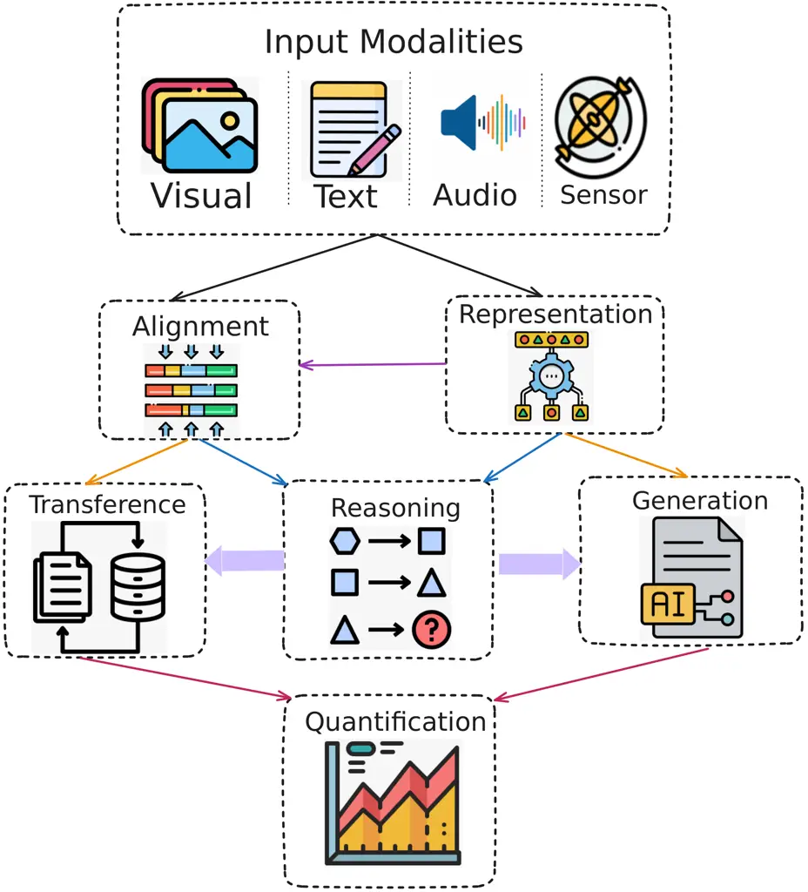
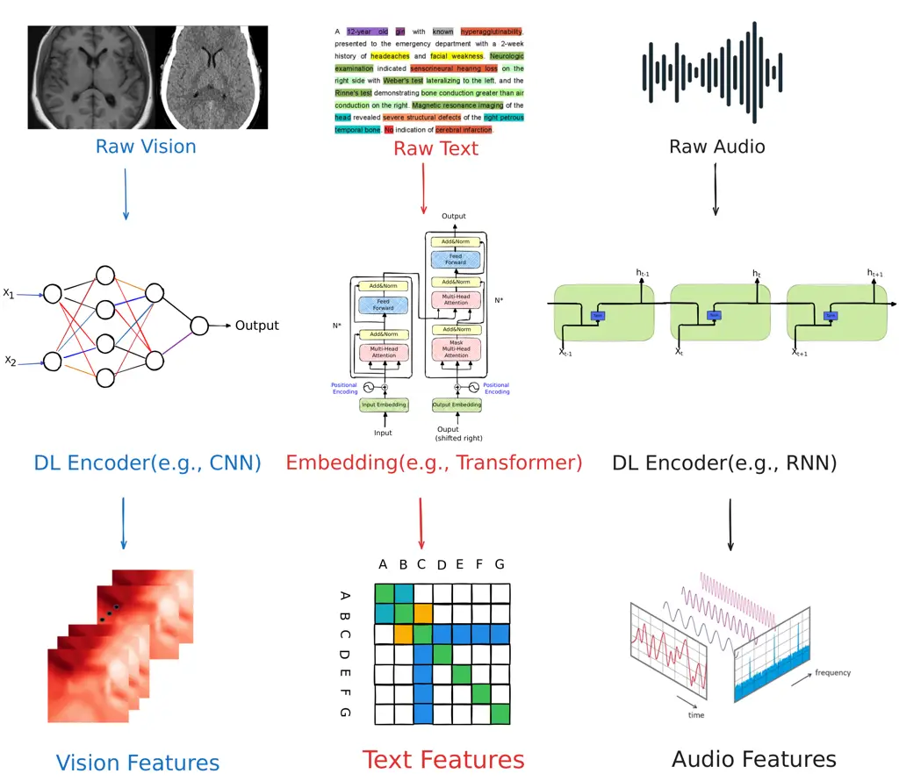
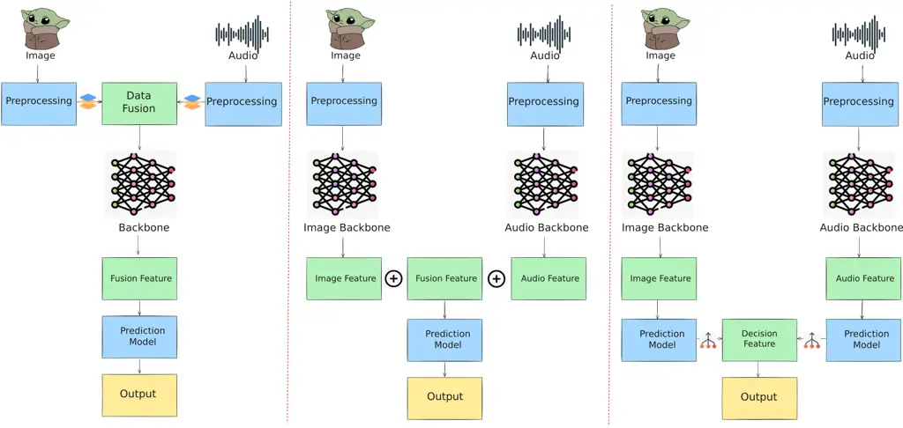
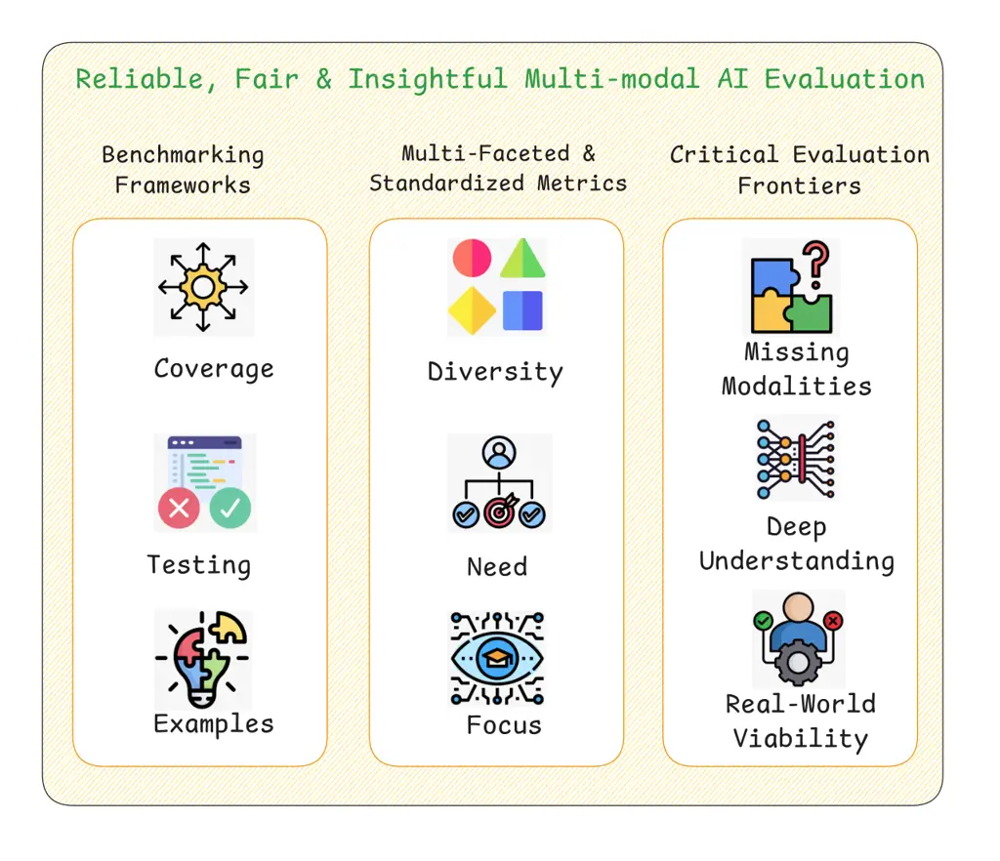

# Multimodal Representation Learning and Fusion Thanks:   $`\ast`$: Equal contribution. $`\dagger`$: Corresponding author.

Qihang Jin^(∗1), Enze Ge^(∗2), Yuhang Xie^(∗1), Hongying Luo^(∗1),
Junhao Song³,  
Ziqian Bi³, Chia Xin Liang¹, Jibin Guan⁴, Joe Yeong⁵, Xinyuan Song⁶,
Junfeng Hao^(†4) Affiliation:  Affiliation: ¹AI Agent Lab, Vokram Group,
United Kingdom, ai-agent-lab@vokram.com Affiliation: ²University of
Bologna, Italy, enze.ge@studio.unibo.it Affiliation: ³Vokram Group,
United Kingdom, {js, bizi}@vokram.com Affiliation: ⁴University of
Minnesota, United States, jguan@umn.edu, ygzhjf85@gmail.com
Affiliation: ⁵Singapore General Hospital, Singapore,
yeongps@imcb.a-star.edu.sg Affiliation: ⁶Emory University, United
States, xinyuan.song@emory.edu

###### Abstract

Multi-modal learning is a fast-growing area in artificial intelligence.
It tries to help machines understand complex things by combining
information from different sources, like images, text, and audio. By
using the strengths of each modality, multi-modal learning allows AI
systems to build stronger and richer internal representations. These
help machines better interpretation, reasoning, and making decisions in
real-life situations. This field includes core techniques such as
representation learning (to get shared features from different data
types), alignment methods (to match information across modalities), and
fusion strategies (to combine them by deep learning models). Although
there has been good progress, some major problems still remain. Like
dealing with different data formats, missing or incomplete inputs, and
defending against adversarial attacks. Researchers now are exploring new
methods, such as unsupervised or semi-supervised learning, AutoML tools,
to make models more efficient and easier to scale. And also more
attention on designing better evaluation metrics or building shared
benchmarks, make it easier to compare model performance across tasks and
domains. As the field continues to grow, multi-modal learning is
expected to improve many areas: computer vision, natural language
processing, speech recognition, and healthcare. In the future, it may
help to build AI systems that can understand the world in a way more
like humans, flexible, context-aware, and able to deal with real-world
complexity.

###### Index Terms: 

multimodal learning, representation learning, neural architecture
search, data heterogeneity, resource-efficient learning, benchmark
evaluation, fusion strategies, robust multimodal models, machine
learning, deep learning

## I Introduction

Multi-modal learning, a fast-growing research field that aims to enable
machines to interpret and understand the world by combining different
types of data, such as images, text, and audio \[42\] \[6\]. It tries to
use the strengths of each modality to build a more complete and detailed
understanding of complex things \[3\]. This kind of learning is
naturally cross-disciplinary, combining knowledge from computer vision,
natural language processing, speech analysis, and other fields to make
machines behave more like humans in perception and reasoning.

One core concept in multi-modal learning is how we define
“multi-modality.” Some recent works suggest using task-specific
definitions \[42\], which focus on the features and representations that
are important for each task. Different tasks have different needs.This
flexible view helps to guide model design more precisely. Another
important topic is building taxonomies to structure the field and
classify methods based on how they work and what they are used for
\[6\].



Fig. 1: The core technical challenges in multi-modal learning. It begins
with diverse Input Modalities (Visual, Text, Audio, Sensor) that are
processed through Representation and Alignment. These foundational steps
then support subsequent complex tasks including Reasoning, Generation,
and Transference, while Quantification provides analytical evaluation
across the framework.

Deep learning continuously plays a major role in multi-modal systems. It
brings strong architectures that can translate one modality into
another, improve representation learning, and handle multiple modalities
at once \[3\]. These methods have been used in many fields, such as
healthcare, robotics, video understanding, and text-to-image generation.
All of these show that multi-modal learning has great potential in real
applications.

However, there are still many open challenges. One of them is how to
design more general and powerful models that can handle unseen
modalities at inference time \[38\]. Another big challenge is how to
align, fuse, and reason across heterogeneous data sources in an
efficient way \[30\]. For large-scale use, models must also be both
scalable and computationally efficient.

In recent years, researchers have increasingly focused on the robustness
of multi-modal systems. Some studies propose frameworks to test or
improve the stability of models under different conditions \[38\].
Robustness is essential for making models more reliable and useful in
real-world tasks. At the same time, the field needs more shared
definitions, taxonomies, and evaluation standards to compare methods to
guide future development \[6, 42\].

In summary, multi-modal learning is a dynamic area with the power to
change how machines interact with complex data from many sources. If we
can solve problems like integration, robustness, and efficiency, for
example, by optimizing models such as CLIP for low-resource situations
\[3\], we may unlock huge improvements in areas like autonomous driving
and medical diagnosis \[30\]. In the long run, progress on scalability,
generalizability, and new model architectures will be the key to pushing
this field forward.

## II Foundations of Multi-modal Processing

The foundations of multi-modal processing are rooted in the ability to
integrate and handle information from different sources or modalities:
text, images, audio, and video, in an effective way. Recent advancements
in this field have made significant progress. Various important concepts
and techniques have emerged as crucial components of multi-modal machine
learning \[30\]. One work proposes a taxonomy with six core technical
challenges: representation, alignment, reasoning, generation,
transference, and quantification \[30\], demonstrating the complexity
and wide range of this field.

Representation learning is a cornerstone, aiming to extract shared
features across modalities to enable effective integration \[42\]. This
process typically involves optimizing a joint loss function that
balances modality-specific reconstruction with shared representation
constraints.

```math
\min_{\theta}\mathcal{L}=\sum_{m=1}^{M}\mathcal{L}_{m}(\mathbf{z},\mathbf{x}_{m};\theta_{m})+\lambda\mathcal{R}(\mathbf{z}), \tag{1}
```

where $`\mathbf{z}`$ denotes the shared latent representation,
$`\mathbf{x}_{m}`$ represents the input data from modality $`m`$,
$`\mathcal{L}_{m}`$ is the modality-specific loss,
$`\mathcal{R}(\mathbf{z})`$ enforces regularization (e.g., sparsity),
and $`\lambda`$ balances the trade-off. This formulation ensures the
model captures both modality-specific details and cross-modal
commonalities. Alignment, another critical challenge, involves mapping
features from different modalities into a shared space. Contrastive
learning, as used in models like CLIP, is a common approach to achieve
this \[3\].



Fig. 2: The initial stage of unimodal representation learning, where raw
Visual, Text, and Audio inputs are processed by distinct deep learning
encoders. Modality-specific architectures transform these diverse inputs
into structured Vision Features, Text Features, and Audio Features for
subsequent multi-modal integration.

```math
\mathcal{L}_{\text{contrastive}}=-\sum_{i}\log\frac{\exp(\text{sim}(\mathbf{z}_{i}^{1},\mathbf{z}_{i}^{2})/\tau)}{\sum_{j}\exp(\text{sim}(\mathbf{z}_{i}^{1},\mathbf{z}_{j}^{2})/\tau)}, \tag{2}
```

in this loss function, $`\mathbf{z}_{i}^{1}`$ and $`\mathbf{z}_{i}^{2}`$
are representations of paired modalities (e.g., image and text),
$`\text{sim}(\cdot,\cdot)`$ is a similarity function (e.g., cosine
similarity), and $`\tau`$ is a temperature parameter. This objective
maximizes the similarity of matched pairs while minimizing that of
unmatched ones.

A holistic evaluation framework is important for understanding the
performance of multi-modal foundation models. Such frameworks evaluate
models in three dimensions: basic abilities, information flow, and
practical use in real-world scenarios \[27\]. This highlights the need
for better tools to measure how well multi-modal models work, and what
they can really do. Meanwhile, some recent surveys have updated how we
classify methods. It is no longer just about early vs. late fusion. Many
works now focus on more fine-grained strategies for combining modalities
\[6\].

One of the major advancements is the use of task-relative definitions of
multi-modality. These definitions focus on what kind of information is
useful for a specific task \[42\]. This view supports more flexible and
targeted system designs. Surveys on multi-modal co-learning also address
tough problems like missing or noisy modalities. They offer new
taxonomies of techniques and applications, which help guide future
research \[48\].

Some common themes can be found across these developments. Researchers
increasingly see multi-modality as a core aspect of modern machine
learning. They also recognize a set of technical and practical
challenges, and propose classification systems to better structure the
field. The ongoing work on evaluation frameworks, fusion strategies, and
co-learning shows that this area is constantly evolving and full of new
directions \[3\], \[7\].

There is also growing interest in making multi-modal learning more
robust. Some studies offer frameworks to analyze or improve model
stability \[38\]. At the same time, the potential of multi-modal large
language models (MLLMs) continues to attract attention \[67\]. The
long-term goal is to create generalist multi-modal AI systems that can
handle a wide variety of tasks and modalities, an exciting and promising
direction \[40\].

However, challenges and limitations remain. Scalability is a major
concern. So is the problem of missing or noisy modalities. And there is
still no common standard for evaluating multi-modal models \[19\],
\[53\]. To solve these issues, researchers are exploring methods such as
correlation maximization or minimization \[53\], as well as improved
data processing techniques for modern multi-modal architectures \[26\].

In conclusion, the foundations of multi-modal processing involve a rich
mix of ideas, tools, and useful cases. With continued research, we can
expect significant improvements in how we understand and integrate
cross-modal data in higher-level models \[7\], \[67\]. These advances
will influence many areas, like healthcare, education, entertainment,
and more: underscoring the importance of continued support and funding
for this field.

## III Deep Learning for Multi-modal Data

Deep learning has driven major progress in multi-modal research over
recent years. Many novel architectures and models have been developed to
integrate and process multiple types of data \[3, 56\]. A key direction
in this field is multi-modal co-learning, which uses information from
one modality to support another, especially when data is missing or
noisy \[48\]. Among these, variational autoencoders (VAEs) are often
used to create multi-modal generative models that learn shared
features \[56\].

```math
\mathcal{L}_{\text{VAE}}=\mathbb{E}_{q_{\phi}(\mathbf{z}|\mathbf{x})}[\log p_{\theta}(\mathbf{x}|\mathbf{z})]-D_{\text{KL}}(q_{\phi}(\mathbf{z}|\mathbf{x})||p(\mathbf{z})), \tag{3}
```

here, $`q_{\phi}(\mathbf{z}|\mathbf{x})`$ is the encoder’s approximate
posterior, $`p_{\theta}(\mathbf{x}|\mathbf{z})`$ is the decoder’s
likelihood, and $`D_{\text{KL}}`$ ensures the posterior aligns with a
prior $`p(\mathbf{z})`$. This framework is effective for learning shared
representations across modalities.

Architectural design for multi-modal fusion is another major research
focus. For instance, EmbraceNet offers a structure that works with
different types of models and avoids performance loss when some
modalities are missing \[10\]. Cross-modal attention mechanisms are also
important, helping align and fuse inputs from different
modalities \[6\]. However, scalability and computational cost remain
serious concerns \[37\].

Various deep learning-based methods are widely applied in this field,
including neural networks, autoencoders, and generative models \[65\],
\[19\]. Among these, variational autoencoders (VAEs), generative
adversarial networks (GANs) and so on, are often used to create
multi-modal generative models that can learn shared features and
generate cross-modal outputs \[56\]. Cross-modal attention mechanisms
are also important. They help align and fuse inputs from different
modalities, making integration more effective \[6\].

Even with these advancements, the field still faces several challenges.
Scalability and computational cost remain serious concerns \[37\],
\[74\]. Handling large and diverse datasets can be expensive and
complex. In addition, missing or noisy data can harm model performance,
and the lack of standard architectures and evaluation benchmarks makes
it hard to fairly compare different approaches. These issues show that
further research is urgently needed.

Surveys of recent studies reveal several common themes: a strong focus
on multi-modal fusion, the use of deep learning frameworks, concerns
about robustness, and the importance of organizing the field through
taxonomies and benchmarks \[55\], \[59\]. Generative models and
co-learning strategies continue to attract attention. Still, researchers
propose different architectures depending on task type and application
needs, leading to varied designs and viewpoints.

Overall, deep learning has brought meaningful progress to multi-modal
learning by enabling better integration and processing of diverse data
types. However, problems like computational cost, model comparison, and
noise handling remain. As the field evolves, we can expect to see more
advanced models and better solutions, moving toward more effective,
adaptable, and robust multi-modal systems \[39\],\[3\].

## IV Multi-modal Fusion Methods

Fusion methods play a central and often sensitive role in multi-modal
learning. They are not just technical add-ons; they are what actually
make it possible to bring different modalities: text, vision, audio, or
others, together in a way that works. Without good fusion, the promise
of multi-modal learning becomes hard to fulfill. That’s why fusion
strategies are treated as a core research focus in the community. One
insight that has emerged is the importance of learning strong uni-modal
features, even under supervised multi-modal training. In particular,
\[12\] introduces a kind of late-fusion learning method that aims to
help models generalize better. What’s interesting here is that their
approach captures the finer details unique to each modality, while also
trying to limit the harm from noisy or less helpful ones. This is
especially useful when the data environment is unpredictable or noisy,
which is often the case in real-world settings.



Fig. 3: A comparative illustration of three primary multi-modal fusion
strategies, Early Fusion, Intermediate Fusion (feature-level), and Late
Fusion (decision-level), as applied to image and audio data. Each
pipeline depicts a distinct architectural approach for combining
information: Early Fusion integrates modalities after initial
preprocessing before a shared Backbone; Intermediate Fusion combines
features extracted from modality-specific Backbones; and Late Fusion
merges the outputs from separate Prediction Models for each modality.

Early fusion combines raw features at the input level, formalized as a
weighted combination of modality-specific features \[3\].

```math
\mathbf{h}_{\text{fused}}=f\left(\sum_{m=1}^{M}\mathbf{W}_{m}\mathbf{x}_{m}+\mathbf{b}\right), \tag{4}
```

where $`\mathbf{x}_{m}`$ denotes the input features of modality $`m`$,
$`\mathbf{W}_{m}`$ is a weight matrix, $`\mathbf{b}`$ is a bias term,
and $`f(\cdot)`$ is a non-linear activation function (e.g., ReLU). Late
fusion, conversely, integrates predictions from modality-specific
models, as explored by \[12\].

```math
y_{\text{fused}}=\sum_{m=1}^{M}w_{m}\cdot g_{m}(\mathbf{x}_{m};\theta_{m}), \tag{5}
```

where $`g_{m}(\mathbf{x}_{m};\theta_{m})`$ is the prediction model for
modality $`m`$, $`w_{m}`$ is the modality weight, and
$`y_{\text{fused}}`$ is the final prediction. To address modality
competition, adaptive gradient modulation dynamically adjusts
contributions during training \[22\].

```math
\nabla_{\theta}\mathcal{L}=\sum_{m=1}^{M}\alpha_{m}(t)\cdot\nabla_{\theta}\mathcal{L}_{m}, \tag{6}
```

where $`\mathcal{L}_{m}`$ is the loss for modality $`m`$,
$`\alpha_{m}(t)`$ is a time-varying weight, and
$`\nabla_{\theta}\mathcal{L}`$ is the fused gradient, ensuring balanced
learning across modalities. Intermediate fusion methods, particularly in
biomedical applications, allow gradual interaction during
training \[17\].

Other researchers are taking a somewhat different path. Instead of
relying purely on late-fusion, they propose models that can learn how
different modalities interact and support each other, on their own. For
example, the work in \[41\] presents a deep equilibrium model for
fusion, which has shown quite impressive results on many benchmarks. The
model tries to capture high-level dependencies between modalities in a
very flexible way. Then, there is \[45\], which argues that there is
really no best fusion method that works for all problems. Depending on
the task, the modality types, and even how much memory the system can
use, the right fusion strategy may be very different.

Somewhere in the middle, intermediate fusion methods offer another
option. These are particularly interesting for domains like biomedical
applications \[17\], where the way signals mix can be quite subtle and
context-sensitive. Intermediate fusion allows for gradual interaction
between modalities during training, which often leads to better
performance overall. Additionally, \[22\] proposes a method using
adaptive gradient modulation. This helps reduce what’s known as modality
competition, where different data sources “compete” for influence during
learning. They also suggest a new metric to measure this competition,
called competition strength.

Looking across these studies, there is a common theme: fusion is not
just about mixing things together. It needs to be done carefully, and
often in a way that adapts to both the data and the task. Some papers
like \[12\] argue for late-fusion to keep each modality’s strengths
intact, while others such as \[17\] see value in intermediate fusion,
especially for structured or medical data. Adaptive methods like those
in \[41\] and \[22\] focus on the idea that the relationship between
modalities can shift, and that the model needs to follow those shifts
dynamically. Also, as \[45\] mentions, resource availability like memory
can shape what fusion strategy is even possible in practice.

An issue that shows up again and again is evaluation. How do we know
that fusion is working well? How do we compare models? Multiple works,
including \[12\] and \[22\], point out the lack of widely agreed-upon
metrics. Without proper tools to evaluate fusion quality or modality
interaction, it is very hard to say what works and what does not.

And then there is application context. Some methods are proposed for
general use \[45\], while others are more specific, like those focused
on biomedical data \[17\]. This shows the variety in this field but also
points to how challenging it is to create fusion methods that are
flexible yet powerful across very different tasks and domains.

Even though we’ve seen a lot of progress, there are still problems that
have not been solved well. Modality competition, for one, is still a bit
of a black box. While \[22\] suggests ways to measure and handle it, we
do not fully understand the underlying dynamics yet. There is also the
point that intermediate fusion methods, which seem promising in medical
areas, have not been tested enough in other domains \[17\]. So, we do
not yet know how far they can go.

To sum up, multi-modal fusion methods are essential, there is no
question about that. The field is now focused on finding smarter and
more adaptive fusion designs. These aim to balance task-specific
performance with computational feasibility. At the same time, better
evaluation strategies and metrics are urgently needed. By paying closer
attention to how modalities interact, and sometimes interfere, with one
another, future models may not only become more accurate but also more
transparent and easier to work with. That’s the hope, at least, as
multi-modal learning moves ahead.

| Method                       | Year | Fusion Approach          | Handles Missing Data | Key Advantage                           | Primary Application Area          |
| ---------------------------- | ---- | ------------------------ | -------------------- | --------------------------------------- | --------------------------------- |
| EmbraceNet\[10\]             | 2019 | Modular structure        | Yes                  | Works with different model types        | Classification, integration       |
| Late-fusion\[12\]            | 2023 | Late-fusion              | Not specified        | Captures finer details of each modality | Generalization in noisy settings  |
| Intermediate fusion\[17\]    | 2024 | Intermediate             | Yes                  | Gradual interaction during training     | Biomedical applications           |
| DEQ-Fusion\[41\]             | 2023 | Deep                     | Not specified        | Impressive results on benchmarks        | General multi-modal tasks         |
| Adaptive Gradient\[22\]      | 2023 | Adaptive                 | Not specified        | Reduces modality competition            | Balanced learning                 |
| Greedy Selection\[9\]        | 2022 | Selection-based          | Yes                  | Computational efficiency                | Resource-constrained environments |
| Teacher-Student\[70\]        | 2021 | Knowledge transfer       | Yes                  | Works with unlabeled data               | Cross-modal learning              |
| Factorized\[60\]             | 2018 | Factorized               | Yes                  | Focus on shared structures              | Incomplete data scenarios         |
| Asymmetric\[15\]             | 2025 | Asymmetric reinforcement | Yes                  | Guides model to rely on stable signals  | Robust learning                   |
| Lightweight Adaptation\[50\] | 2023 | Adaptive                 | Not specified        | Resource-efficient                      | Practical applications            |

TABLE I: Methodological Comparison of Multi-modal Learning Approaches

## V Applications of Multi-modal

The definition of multi-modality has gone through tremendous change over
the past few years, with novel definitions emerging to suit the era of
machine learning \[42\]. Multi-modal learning has seen great success in
applications like computer vision, natural language processing, and
speech recognition \[11\]. Recent developments in Multi-modal Large
Language Models (MLLMs) have brought improvements to tasks like
vision-language pre-training and representation learning \[14\]. New
types of data fusion, including early and late fusion, have enhanced
efficiency \[11\], as formalized in (4) and (5). However, challenges
remain, such as the need for better fusion techniques and large-scale
datasets \[44\].

Recent developments in MLLMs have brought dramatic improvements to
numerous tasks, including vision-language pre-training \[14\] and
multi-modal representation learning \[36\]. The application of
transformer-based models has been particularly successful at reaching
state-of-the-art levels in numerous multi-modal tasks \[64\]. Still,
there are challenges and limitations despite recent advances in
multi-modal learning. For instance, the necessity for better fusion
techniques to amalgamate data from various modalities is one of the
major challenges \[11\]. Furthermore, the creation of large-scale data
sets that can be used to train and test multi-modal models is still an
existing challenge \[44\].

Recent years have seen major advances in both the methodologies and the
technical details involved in multi-modal learning. New types of data
fusion, including mid-fusion and late-fusion, have enhanced the
efficiency of multi-modal models \[11\]. Graph-based methods have
similarly been applied to strengthen reviews of literature as well as to
enhance the analysis of multi-modal data \[11\]. In addition,
pretraining objectives, including masked language models and next
sentence prediction, have been found to be useful to enhance the
performance of MLLMs \[64\].

And yet, even with these gains, the future of multi-modal learning
remains full of questions, and opportunities. A lot of attention is now
focused on designing smarter and more adaptable model architectures that
can handle a wide range of modalities smoothly and efficiently \[36\].
In addition, improving our understanding of how different modalities
interact with each other, especially in real-time or noisy settings,
remains a significant challenge \[11\]. It is not only about merging
signals; it is about understanding their relationships and using that
understanding to make better decisions.

Fig. 4: A hierarchical depiction of multi-modal learning application
domains, including Vision & Language Intelligence, Speech & Audio
Processing, NLP with Multimodal Grounding, Biomedical & Healthcare,
Education & Learning Analytics, and Advanced Generative AI, each
exemplified by specific tasks.

Looking forward, we can expect to see even more multi-modal applications
in traditional areas like natural language processing, computer vision,
and speech recognition. These areas are already mature, but
multi-modality brings new possibilities. Ultimately, the long-term goal
of multi-modal learning is to create systems that can perform at a level
similar to humans on complex, real-world tasks. Systems can see, listen,
read, and understand all at once \[44\]. That goal may still be far
away, but with each new model, dataset, or training method, we get a
little bit closer.

## VI Multi-modal Neural Architecture Search

Multi-modal neural architecture search (NAS) automates the design of
efficient neural networks for multi-modal tasks \[74\]. Methods like
gradient-based NAS and sequential model-based exploration have achieved
state-of-the-art results \[46\]. However, challenges such as
computational cost and generalizability persist \[68\]. Fusion
strategies, including early and deep fusion, are critical to NAS
performance \[2\].

One predominant theme that is found throughout the literature is the
automation of architectural design, aiming to save manual efforts as
well as to increase performance \[74\]\[46\]. Most methods try to offer
flexible frameworks that can be capitalized upon across various
multi-modal tasks as well as data sets \[73\]\[63\]. The efficiency of
the search process is another target for several researchers to minimize
the computational cost as well as the time consumed by NAS \[43\]\[4\].

Although these progresses have been made, there exist differing opinions
and methods within this domain. To be specific, \[46\] is interested in
this novel search space exclusively for fusion architectures, whereas
others, such as \[74\] and \[73\] investigate more comprehensive
frameworks that support multiple different operations and tasks. The
modalities’ integration is even addressed differently between studies,
where some prioritize early fusion \[3\], while others propose deep
fusion or the fusion of both \[2\]. In addition, the application of
pretrained models differs, with some methods utilizing pretrained
unimodal backbones \[73\], where other methods rely on training from
scratch or alternative pretraining methods such as \[2\]’s Masked
Architecture Modeling (MAM).

The technical methodologies employed in multi-modal NAS are diverse and
include gradient-based NAS \[74\], sequential model-based exploration
\[46\], bilevel searching schemes \[73\], and bi-modal learning \[2\].
These approaches have been applied to various multi-modal tasks,
including those involving vision, language, and audio modalities
\[6\]\[36\]. However, despite these advancements, challenges persist,
including the computational cost associated with NAS \[68\], ensuring
generalizability across tasks \[30\], interpreting and explaining the
performance of searched architectures \[38\], and scalability to new
modalities \[66\].

In summary, multi-modal neural architecture search has emerged as a
dynamic and fast-developing field with great potential to improve both
the efficiency and effectiveness of multi-modal learning systems. While
a number of recent contributions have made meaningful steps toward
addressing issues such as cost, transferability, and architectural
complexity, much remains to be explored. Questions related to
scalability, interpretability, and generalization are still open and
continue to limit the full realization of NAS in practical multi-modal
applications \[73\]\[63\]. Looking forward, it is reasonable to expect
that more advanced frameworks and algorithms will be introduced to meet
these challenges. With further work, we may see models that are not only
better suited to handling the unique difficulties of multi-modal
learning, but also more capable of delivering consistent performance
across a wide array of real-world tasks \[2\]\[63\].

## VII Real-Time and Low-Resource Scenarios

Efficient multi-modal processing has long been a central concern in
multi-modal learning, especially under real-time and low-resource
conditions. Researchers have focused on integrating information from
different modalities in ways that are both accurate and highly
efficient. For instance, the survey paper “Multi-modal Co-learning:
Challenges, Applications with Datasets, Recent Advances and Future
Directions” \[48\] offers a comprehensive review of multi-modal
co-learning, highlighting issues like noisy or missing modalities and
proposing a taxonomy to structure the problem. Robustness is essential
in such scenarios, and attribution regularization encourages models to
utilize all available modalities, mitigating single-modality
dominance \[72\].

```math
\mathcal{L}_{\text{total}}=\mathcal{L}_{\text{task}}+\lambda\sum_{m=1}^{M}\left\|\frac{\partial\mathcal{L}_{\text{task}}}{\partial\mathbf{x}_{m}}\right\|_{2}^{2}, \tag{7}
```

where $`\mathcal{L}_{\text{task}}`$ is the task-specific loss,
$`\frac{\partial\mathcal{L}_{\text{task}}}{\partial\mathbf{x}_{m}}`$
measures modality $`m`$’s gradient contribution, and $`\lambda`$
controls regularization strength. Additionally, greedy modality
selection improves efficiency under computational limits by prioritizing
informative modalities \[9\]. These approaches reflect the field’s
emphasis on clear definitions, structured analysis, and practical
challenges.

Another important contribution comes from the paper “Greedy Modality
Selection via Approximate Submodular Maximization” \[9\]. It introduces
a state-of-the-art approach with an efficient algorithm designed to
select the most informative and complementary modalities under
computational limits. The method shows strong results not only on
synthetic tasks but also in real-world datasets, making a clear case for
modality optimization as a practical way to improve processing
efficiency. By contrast, the work titled “Modular and
Parameter-Efficient Multi-modal Fusion with Prompting” \[31\] proposes a
lightweight solution using modal prompts and novel vector alignment. The
technique performs comparably to other mainstream methods even under
low-resource scenarios. This shows that prompting, though relatively new
in this field, can be a flexible and scalable approach for multi-modal
learning when resources are limited.

Robustness is another essential topic that has gained attention in
recent work. One representative study, “On Robustness in Multi-modal
Learning” \[38\], proposes a framework to identify the weaknesses in
commonly used representation learning techniques. It further suggests
targeted interventions to improve robustness. In a related direction,
the paper “Attribution Regularization for Multi-modal Paradigms” \[72\]
proposes a new regularization term. This term encourages models to
better utilize all available modalities, which also helps mitigate the
problem of single-modality dominance. These contributions suggest that
improving generalizability and robustness is not only possible but
necessary, especially as models are applied to real-world environments
where data sources may be uncertain or unstable.

A common thread running through these contributions is the growing
recognition of efficiency and scalability as core needs in multi-modal
learning. For example, the work “Multi-modal Information Bottleneck:
Learning Minimalist Models” \[35\] emphasizes the value of minimalist
modeling, how to reduce redundancy while still maintaining performance.
This also connects to broader questions around evaluation: what counts
as “good enough” performance in constrained settings, and how should it
be measured across different tasks and systems?

That said, many difficulties remain. Although recent progress is
meaningful, challenges in developing advanced modeling techniques still
persist. Scalability and real-time efficiency remain two of the most
critical bottlenecks, especially in domains where fast decisions are
essential. Also, as models begin to deal with increasingly diverse
modalities and environments, robustness becomes even more crucial. In
addition, a lack of consistent benchmarks and shared evaluation metrics
continues to limit how we compare methods and track progress.

Experimental work in this area has offered valuable insight into the
tradeoffs involved in integrating multiple modalities under limited
resources. The results of recent studies go well beyond academia and
point toward wide applications, ranging from healthcare and education to
autonomous systems and human-computer interaction. As the field
continues to develop, it will be essential to focus not only on
overcoming current problems but also on setting clearer standards. That
means developing shared evaluation frameworks, refining fusion and
selection methods, and continuing efforts to improve robustness and
generalizability in a broad range of scenarios. With that, we may move
closer to achieving multi-modal processing techniques that are not only
efficient and accurate, but also practical and widely usable.

## VIII AutoML for Multi-modal Learning: Recent Developments and Future Directions

The integration of automated machine learning (AutoML) with multi-modal
learning has advanced rapidly, driven by increasing data complexity and
the demand for efficient, user-friendly solutions \[33, 57\]. Frameworks
like AutoM3L, leveraging large language models, automate multi-modal
training pipelines, reducing manual effort \[33\], while
AutoGluon-multi-modal (AutoMM) enables fine-tuning of foundation models
with minimal code, supporting diverse tasks \[57\]. Simple techniques,
such as cross-modal alignment, yield robust results \[58\], as shown
in (2). However, challenges like pipeline complexity and inconsistent
evaluation metrics persist \[52\].

The combination of AutoML with computer vision has also been widely
studied. Because data is getting bigger and more complex, researchers
try to make AutoML easier to use. AutoM3L \[33\] provides an LLM-based
solution to help users set up multi-modal pipelines without much effort.
AutoMM \[57\] also gives a simple and efficient way to handle different
modalities and improve performance on many real-world tasks.

Recent studies tell us something very clear: handling multi-modal data
well is no longer a bonus, it is a must. The paper “Bag of Tricks for
Multi-modal AutoML” \[58\] runs a large benchmark that covers images,
texts, and tables. It shows that even simple tricks, such as fusion,
data augmentation, and cross-modal alignment, can bring strong and
stable results. But this paper also reminds us that mixing multiple data
types is not an easy job. So we need AutoML tools that can link
different modalities together quickly and smartly.

Another big trend is the use of advanced models, especially large
language models (LLMs) and foundation models \[33\]\[57\]. These models
make it possible to automate very complicated tasks, improve overall
results, and let more people use machine learning, even if they are not
experts. The shift from rule-based tools to model-based methods shows
that the community now trusts LLMs to do reasoning, generate code, and
provide useful interactions.

However, even with this exciting progress, there are still many
problems. First, since we are dealing with many types of data, the
pipelines become heavier and slower. Also, it is still hard to make the
models explainable \[61\]\[51\]. Another issue is evaluation. Right now,
different studies use different metrics and datasets. So we cannot
compare fairly. One common benchmark is badly needed to help build
strong and general AutoML systems \[52\].

Looking back at how AutoML has changed, we can see a big shift. The
paper “Automated Machine Learning , A Brief Review” \[13\] explains this
clearly. In the early years, AutoML focused on tuning hyperparameters or
picking models. But today, researchers care more about how to use AutoML
in real life, especially with messy and mixed multi-modal data. People
want tools that are not only fast but also easy to use and able to
handle real-world problems.

To sum up, when AutoML meets multi-modal learning, things get very
interesting. We now have many strong tools and smart frameworks, but we
also face a lot of challenges behind the scenes. If we want to unlock
the full power of AutoML, we still need to solve key pain points, like
pipeline complexity, scaling up, explainability, and fair benchmarking.
Fixing these will make ML tools faster, more friendly, and strong enough
to handle difficult tasks. Also, this research is closely linked to the
big direction of AI, since more and more LLMs and foundation models are
being developed \[33\]\[57\]. So we believe continuous research and
teamwork are the key to pushing AutoML forward in the multi-modal world.

## IX Unsupervised and Semi-Supervised Multi-modal Learning

Unsupervised and semi-supervised learning are among the fastest-growing
directions in multi-modal research, driven by their ability to handle
unseen modality combinations at inference time \[75\]. Recent work
emphasizes task-specific modality selection, prioritizing utility over
comprehensive modeling \[42\]. Theoretical bounds further quantify
cross-modal interactions in semi-supervised scenarios \[28\].

```math
\begin{split}I(\mathbf{X}_{1};\mathbf{X}_{2}\mid\mathbf{Y})\leq\min(H(\mathbf{X}_{1}),\\
H(\mathbf{X}_{2}))-H(\mathbf{Y}\mid\mathbf{X}_{1},\mathbf{X}_{2}),\end{split} \tag{8}
```

where $`I(\mathbf{X}_{1};\mathbf{X}_{2}\mid\mathbf{Y})`$ is the
conditional mutual information, $`H(\cdot)`$ denotes entropy, and
$`H(\mathbf{Y}\mid\mathbf{X}_{1},\mathbf{X}_{2})`$ is the conditional
entropy. Teacher-student frameworks also enhance generalization without
labeled data \[70\].

At the same time, there is an ongoing effort to understand whether
different modalities are genuinely interacting, or just existing side by
side. Liang et al. \[28\] proposed a set of theoretical bounds to
estimate the interaction level in semi-supervised scenarios. Sure, these
bounds do not offer precise yes-or-no answers, but they do help guide us
in both evaluating and designing better systems. Meanwhile, another
interesting work \[70\] introduced a teacher-student framework where a
pre-trained single-modal teacher can still pass meaningful knowledge to
a multi-modal student, even in the absence of labeled data.
Surprisingly, this approach improves generalization and lowers the
model’s sensitivity to noisy signals.

If there is one key message across these studies, it is this:
flexibility and robustness are no longer optional, they are essential.
Today’s models need to be ready for missing data, noisy inputs, or
strange, previously unseen modality mixes. What makes this possible?
Strong representation learning. Many teams are now using self-supervised
or unlabeled data to learn meaningful features; two good examples can be
found in \[3\]\[11\]. These works push the field forward not just in
terms of technical depth, but also in how we understand multi-modal
systems in real-world or even complex environmental contexts.

However, not everyone agrees on what “multi-modality” should mean. Some
papers, like \[42\], advocate for task-specific definitions, meaning the
way we define and handle modalities depends on what the task actually
needs. Others hold on to more traditional, general-purpose views. Even
worse, there is no unified standard for measuring cross-modal
interactions. One paper turns to information theory \[28\]; others
prefer to rely on practical benchmarks or novel metrics. So depending on
the lens you use, the evaluation result may vary dramatically.

Technically, the field is vibrant with innovation. For example, \[75\]
explores novel mixes of projection and fusion. Liang et al. \[28\] give
mathematical tools, bounds and ranges, to quantify how well different
modalities actually interact. \[70\] makes the case that a model can
still learn without labels, using cross-modal knowledge transfer. On top
of that, others like \[8\]\[15\] are testing semi-supervised setups in
tasks like 3D object recognition, or working on ways to reduce biases
introduced by imbalanced modality signals.

Of course, many problems are still far from solved. One major pain point
is data, large labeled datasets remain costly and time-consuming to
collect \[6\]\[48\]. Another issue is, we still do not have a reliable
way to estimate cross-modal interaction without supervision \[28\]. And
let’s be honest: we are still waiting for that one model that can truly
handle any level of supervision and still be robust in the face of
messy, real-world input.

To wrap things up, unsupervised and semi-supervised multi-modal learning
is definitely moving fast, and it has already delivered some meaningful
progress, like learning from unlabeled data, mixing unseen modalities,
and estimating interaction without full supervision. But still, we are
only scratching the surface. More research is clearly needed to build
truly adaptable, flexible, and strong systems. If we succeed, fields
like computer vision, natural language processing, and human-computer
interaction could benefit from smarter, more resilient models that do
not rely so heavily on fully labeled data.

## X Evaluation Metrics and Benchmarks

Evaluating multi-modal models is challenging due to messy and diverse
data \[29\]. Benchmarks like MultiBench and MM-BigBench test
generalization and robustness \[29, 71\]. Missing modalities require
diagnostic and intervention methods \[68\], often using fusion
strategies like (4). Standardized metrics and comprehensive benchmarks
remain essential to ensure fair comparisons across tasks and domains.

That’s why recent studies have begun offering us some new tools. One
highlight is MultiBench \[29\]. This is not just any benchmark, it is a
large-scale, unified setup built to test representation learning across
15 datasets, 10 modalities, 20 prediction tasks, and 6 different
application areas. Sounds intense? That’s the point. It helps us see how
well a model can generalize, how efficient it is in terms of time and
memory, and how robust it remains when one modality, say, vision or
text, suddenly gets weak or disappears altogether. These tests do not
just give scores, they reveal true strength.

Another landmark is MM-BigBench \[71\], which takes a wider angle. It
builds a kind of testbed for checking how models handle multi-modal
content-understanding tasks. And it does not just look at accuracy. It
brings in a bunch of metrics: Best Performance, Mean Relative Gain,
Stability, Adaptability, a full 360-degree view. The message is pretty
clear: one single number is not enough anymore. We need metrics in
bunches, because a multi-modal system is complex and multi-skilled. You
miss the full picture if you just look at the top-line score. Adding to
that, a review from \[24\] surveys 211 benchmarks covering MLLMs across
four core abilities, understanding, reasoning, generation, and
application. Again, the call is for a clear, shared rulebook. Without
that, we are just throwing darts in the dark.



Fig. 5: Pillars supporting effective multi-modal evaluation, resting on
a foundation of realistic and diverse data. Key components include
comprehensive Benchmarking Frameworks (assessing coverage, testing, with
examples like MultiBench), Multi-Faceted & Standardized Metrics
(emphasizing diversity and the need for standardization), and addressing
Critical Evaluation Frontiers (such as missing modalities, deep
understanding, and real-world viability), all contributing to reliable,
fair, and insightful multi-modal AI assessment.

Another hot topic? Missing modalities. This is not a rare problem, it
happens all the time. Real-world data? Always broken in some way. Maybe
a sensor fails. Maybe half the input is corrupted. Papers like
\[68\]\[38\] zoom in on this. They explore both diagnostic tools, how to
detect when a modality is gone, and intervention methods, which are
tricks to make the system stay strong anyway. These studies remind us:
if your multi-modal model only works when all inputs are perfect, then
it is not really ready for real life.

Now, if you step back and look across all this literature, a loud voice
echoes: we need better benchmarks, and we need better metrics. Public
datasets are crucial, not just for transparency, but for actual science.
We want repeatable experiments. We want fair, apples-to-apples
comparisons between models. That’s why works like \[54\]\[23\] argue we
must go deeper, not just check surface-level matching, but really dig
into cross-modal understanding. Does the model just align text to image,
or does it actually “get” the connection?

Still, not everyone agrees. Some papers prefer single-metric focus, they
swear by Best Performance or Mean Relative Gain. Others go for the
toolbox approach, mixing lots of indicators. The same split exists when
it comes to fixing missing modalities. Some works try simple tricks like
imputation. Others go all-in with customized robustness strategies.

From a technical point of view, most of the models are still deep nets,
CNNs, RNNs, and especially Transformers. Researchers also explore the
usual suspects: early fusion, late fusion, and middle fusion, all tested
in works like \[29\]\[71\]. When it comes to testing stability, some
follow the robustness-checking protocols from \[38\], where they
purposely inject noise or drop out parts of the modality data and watch
how the models behave.

But let’s be real, big problems are still there. Building massive
benchmarks takes a ton of compute and money. That makes it hard to
scale. Also, without a shared set of metrics, it is tough to compare two
models fairly. What looks “better” in one paper might actually be weaker
in another setting. And worst of all, models trained in clean lab
settings often crash when taken out into the wild, where inputs are
incomplete, modalities are missing, or data shifts in unpredictable
ways.

So, in conclusion: yes, there has been progress. The community now
understands that we have to move toward larger, richer, more diverse
benchmarks. But we are not done. There are still open problems, like
setting standardized scores, designing smarter ways to handle missing
modalities, and building truly robust systems. Future work will need to
connect all these dots, so we can finally build multi-modal models that
not only shine in the lab but also survive and thrive in the messy,
chaotic, real-world settings they are meant to serve.

## XI Heterogeneous Data, Missing Modalities, and Adversarial Attacks

Heterogeneous data and missing modalities pose significant challenges in
multi-modal learning \[68\]. Factorized representations focus on shared
structures when data is incomplete \[60\].

```math
\mathbf{z}=\sum_{m\in\mathcal{M}_{\text{avail}}}\mathbf{W}_{m}\mathbf{x}_{m}+\mathbf{b}, \tag{9}
```

where $`\mathcal{M}_{\text{avail}}`$ is the set of available modalities,
$`\mathbf{W}_{m}`$ is the projection matrix, and $`\mathbf{z}`$ is the
robust representation. Asymmetric reinforcement prioritizes stable
modalities \[15\].

```math
\mathcal{L}_{\text{asym}}=\sum_{m\in\mathcal{M}_{\text{avail}}}w_{m}\mathcal{L}_{m}+\gamma\sum_{m\notin\mathcal{M}_{\text{avail}}}\mathcal{L}_{\text{impute}}(\mathbf{x}_{m}), \tag{10}
```

in this equation, $`\mathcal{L}_{m}`$ is the loss for modality $`m`$,
$`w_{m}`$ is its weight, and $`\mathcal{L}_{\text{impute}}`$ is the
imputation loss. Adversarial attacks require robust defenses \[16\].

```math
\mathcal{L}_{\text{adv}}=\max_{\|\delta\|_{p}\leq\epsilon}\mathcal{L}(f(\mathbf{x}+\delta),y), \tag{11}
```

where $`\delta`$ is a perturbation with $`p`$-norm bound
$`\|\delta\|_{p}\leq\epsilon`$, $`f(\cdot)`$ is the model, and
$`\mathcal{L}(\cdot,y)`$ is the task loss.

Over the past few years, multi-modal learning has made impressive
progress. We’ve seen strong performance in a wide range of domains,
computer vision, natural language processing, healthcare, and more
\[68\]\[60\]. But still, let’s be honest: this field is far from
“solved.” Several deep-rooted challenges continue to limit how far we
can go. Some of them are technical; others are more about how the real
world works. Either way, we need to face them head-on.

One of the biggest headaches is dealing with heterogeneous data, that
is, information coming from totally different sources, each with its own
format and structure \[62\]. Imagine a dataset combining text, images,
and audio. Each of these modalities has its own rhythm, its own kind of
noise, its own “language.” And to expect a single model to handle them
all smoothly? It is hard. The model must learn not just from each
modality but also across them, and that’s where things start to break
down.

Another major challenge? Missing modalities. And trust me, this is not
rare. A sensor might fail. Data gets corrupted. Or, in some cases,
certain signals are deliberately excluded for privacy or cost reasons
\[68\]\[34\]. The result? A performance drop, sometimes a big one. So
now, the question becomes: how do we build models that still function
when part of the input goes missing? Some recent solutions offer
promising ideas. For example, factorized representations help models
focus on shared structures even when data is incomplete \[60\]. Others
propose asymmetric reinforcement \[15\], guiding the model to rely more
on stable signals. And then there are lightweight adaptation techniques
\[50\], which offer practical, less resource-intensive fixes. These
methods show one thing clearly: resilience is now a must.

And resilience is not just about noise or gaps, it is also about
adversarial attacks \[16\]. In high-stakes environments like medical AI
or autonomous driving, even tiny, human-imperceptible changes to input
data can lead to completely wrong predictions. That’s scary. So,
defending against such attacks, detecting them, resisting them,
recovering from them, has become a core concern \[69\]. Multi-modal
models need to be not just smart, but safe and secure.

Then there is the issue of modality imbalance, a subtle but serious
problem. Sometimes one modality dominates the learning process because
its signals are stronger or easier to model. This leads to the model
“ignoring” weaker but still-important signals \[9\]\[62\]. And that’s
bad, because it reduces the diversity of information the model actually
uses. So, what do we do? Some researchers suggest greedy modality
selection \[9\], where the model picks the most useful signals step by
step. Others turn to game-theoretic regularization \[20\], where
learning is balanced like a strategic game between modalities. Both
methods aim to reduce bias and boost fairness in training, something
increasingly critical in today’s AI landscape.

Looking across all this work, one thing is obvious: solving these core
issues is key to building stronger, more reliable multi-modal systems
\[68\]\[38\]. It is not just about improving one metric here or there.
It is about improving how we learn joint representations, how we deal
with data loss, and how we protect against manipulation. And
interestingly, many of the proposed techniques are cross-cutting. For
example, factorized learning and asymmetric reinforcement are useful not
just for missing data, but also for handling imbalance and improving
robustness overall \[60\]\[15\]. That kind of versatility is powerful.

In summary, while the field of multi-modal learning has achieved notable
progress, a range of persistent challenges continues to limit its
broader adoption and effectiveness. Key technical obstacles, such as the
integration of heterogeneous data, resilience to missing or corrupted
modalities, and defense against adversarial interference, remain
unsolved. Existing approaches, including factorized learning frameworks,
robust training techniques, and lightweight adaptation methods, have
demonstrated value across multiple problem domains rather than in
isolation. This suggests that future research should focus on developing
integrated solutions capable of addressing overlapping challenges within
a unified framework. By understanding the interconnections between these
problems, and by designing models that reflect such complexity, the
field can move closer to producing truly robust, adaptive, and
generalizable multi-modal systems suitable for deployment in real-world,
imperfect environments \[68\]\[38\].

## XII Future Directions in Multi-modal Research

As multi-modal learning continues to grow, clearer frameworks and
practical taxonomies are increasingly critical \[11, 30\]. These tools
help researchers manage the complexity of heterogeneous data and
ambiguous integration rules \[6, 48\]. Structuring the field is as vital
as advancing model design.

A key direction is the push for task-relative definitions of
multi-modality, focusing on modalities relevant to specific
tasks \[42\]. This approach enhances efficiency by prioritizing utility
over exhaustive modeling, though challenges arise with unbalanced or
misaligned modalities \[25, 40\]. Deep learning for co-learning and
robust fusion strategies, such as (4) and (5), are gaining
traction \[3\], enabling modalities to guide each other in challenging
settings \[67\].

Despite progress, challenges persist. Combining diverse data types is
inherently complex, with issues like unstructured, noisy, or missing
data \[68\]. Large-scale labeled datasets, particularly for non-text
modalities, remain scarce \[29, 18\]. These gaps hinder training
flexible and reliable models, necessitating adaptive systems for
imperfect conditions.

The field’s interdisciplinary nature, blending computer science,
cognitive research, and beyond, will drive future growth. Flexible,
real-world-ready solutions are essential, balancing theoretical advances
with practical constraints like limited resources and incomplete labels.
Ultimately, improving definitions, fusion strategies, and evaluation
tools without overcomplicating systems will unlock multi-modal
learning’s potential in AI, healthcare, and education \[11\].

## XIII The Evolving Landscape of Multi-modal Learning

The field of multi-modal learning has gone through noticeable changes in
recent years. This shift has been largely driven by the rapid progress
in areas like machine learning, computer vision, and natural language
processing. According to studies such as \[11\]\[42\]\[6\]\[30\]\[3\],
the field has grown into a dynamic research hotspot, with a wide range
of tasks and challenges emerging along the way. A shared belief among
many researchers is that combining different types of data, text, image,
audio, or beyond, can offer a more complete and nuanced understanding of
complex problems \[48\]\[21\]. This idea has inspired the creation of
new definitions, conceptual models, and frameworks to address the unique
challenges that arise when working with multi-modal inputs \[42\]\[32\].

Across the literature, some recurring patterns begin to surface. A
common one is the difficulty of handling multiple modalities: not just
processing them in isolation, but figuring out how to connect them,
align them, and model their interactions in a meaningful way
\[6\]\[30\]. At the same time, more and more researchers are turning to
deep learning as a backbone for these efforts, applying it across
domains such as healthcare, education, and autonomous systems
\[3\]\[38\]. In parallel, identifying open questions and mapping future
directions has become a key feature of many recent surveys and reviews
\[30\]\[44\], a sign that the field is still very much evolving.

Interestingly, there is no complete consensus on what multi-modality
even means. Some researchers propose their own definitions, some build
entirely new taxonomies, and others focus on different fusion
strategies, early, late, mid-level, or even graph-based approaches. For
instance, \[11\] provides a comprehensive literature review, while
\[42\] introduces a redefined concept of modality interaction. These
variations do not contradict each other so much as reflect the broad and
multifaceted nature of the field.

From a technical standpoint, the methods explored in these papers are
also quite diverse. Some focus on theory and modeling, while others are
more application-oriented. For example, \[1\] investigates meta-learning
through a multi-task lens, and \[53\] proposes a strategy that
alternates between increasing and decreasing inter-modal correlations to
improve learning outcomes. All of this suggests that multi-modal
learning is not a single discipline but a meeting point of many others,
requiring interdisciplinary knowledge and flexibility in thinking.

Still, despite all the enthusiasm, several core difficulties remain.
There are calls for deeper theoretical work to solidify the foundations
of this area \[30\]\[32\]. Mixing and managing different types of data
continues to be a technical bottleneck \[6\]\[3\]. Moreover, training
large multi-modal models often demands significant computational
resources and access to large-scale, high-quality datasets \[3\]\[44\].
Another concern that comes up again and again is the lack of
transparency: many current models are still hard to interpret or explain
in practice \[30\]\[21\], which limits trust and usability in real-world
settings.

Overall, multi-modal learning has come a long way, and it still has a
long way to go. Thanks to developments in machine learning and related
fields, the tools we now have are more powerful and versatile than ever.
But alongside this progress are real challenges, both technical and
conceptual. What makes this area especially exciting is its potential:
the promise of building smarter, more robust, and more interpretable
models. With continued research and refinement, we can expect to see new
breakthroughs and broader applications, especially in areas like
computer vision, natural language processing, and human-computer
interaction \[48\]\[21\]\[11\].

## XIV References and Further Reading

The field of multi-modal learning has been growing rapidly, with a wide
range of studies exploring its many directions and subfields. This
section provides a brief overview of some representative works,
highlighting shared challenges, technical advances, and common lines of
thought. For instance, deep learning–based models have now reached
state-of-the-art performance in tasks such as Visual Question Answering
(VQA), Natural Language for Visual Reasoning (NLVR), and Vision-Language
Retrieval (VLR), as reported in \[3\]. A comprehensive review from
\[11\] also shows how integrating multiple modalities can offer a deeper
view into learning behaviors and performance patterns.

Among the most frequently mentioned concerns is the issue of missing or
noisy data, as well as the high cost of collecting labeled samples,
problems that appear in multiple studies like \[76\]\[48\]. One
promising response has been the development of multi-modal co-learning.
For example, \[48\] presents a detailed summary of how co-learning
works, what it has achieved so far, and where it might go next.
Similarly, \[36\] offers an extensive survey on the evolution of
multi-modal representation learning, tracing the development of deep
architectures, training objectives, and pretraining methods across the
years.

Transformer-based models now dominate much of this space. Both
\[3\]\[36\] demonstrate how these architectures help push performance
further across tasks in computer vision, natural language processing,
and education. This trend is reinforced by other works like
\[11\]\[76\]\[48\], which show just how widely multi-modal methods are
being applied across different domains.

Some papers focus on targeted use cases, for example, co-reference
resolution, discussed in \[76\], while others step back to offer
higher-level syntheses, laying out the broader evolution of the field
and where it is headed next \[11\]\[36\]\[48\]. A number of studies also
compare supervised and semi-supervised learning settings. For example,
\[76\] advocates for semi-supervised approaches when labeled data is
scarce, especially in low-resource environments.

From a technical angle, the toolbox is diverse. Researchers use CNNs,
RNNs, and Transformers \[3\]\[36\], often in combination with transfer
learning, multi-task setups, and co-learning strategies \[48\].
Attention mechanisms, particularly self-attention and cross-attention,
are frequently integrated to strengthen modality alignment and
interaction \[3\]\[36\].

Still, several issues remain unresolved. Annotated datasets are still
missing for many modality types \[76\]\[48\], and data quality,
especially when modalities are weak or noisy, remains a bottleneck
\[48\]. Seamless fusion is another challenge: many models struggle to
make different modalities work together effectively \[3\]\[36\].
Additionally, as highlighted in \[11\]\[36\], the field still lacks
strong, unified benchmarking standards, making it difficult to compare
models fairly.

Beyond these main threads, other valuable studies include \[5\], which
focuses on vision-based multi-modal applications, and \[47\], which
proposes a novel fusion approach. Meanwhile, \[49\] digs into some of
the field’s deeper conceptual and technical difficulties, while also
offering directions for future research.

All in all, the literature shows a field that is active, experimental,
and still developing. While many exciting models and methods have
emerged, much remains to be done. These works offer a strong base, but
also point toward the many open problems that will define the next
chapter of multi-modal learning.

## XV Conclusion

Multi-modal learning is no longer an emerging field, it is steadily
becoming a foundational direction in machine learning, driven by the
growing need to handle data that is rich, diverse, and often incomplete.
From dynamic fusion strategies to modular architectures, and from
contrastive alignment to self-supervised pretraining, the community has
introduced a remarkable array of technical solutions. Many of these
models now demonstrate impressive performance across benchmarks in
vision-language reasoning, retrieval, and multi-modal generation. Yet as
the field grows more sophisticated, so too do its tensions. There
remains a fundamental gap between what current architectures can
optimize in closed settings, and what real-world systems demand in terms
of robustness, interpretability, and resource awareness. In many ways,
recent progress has shifted the difficulty from representation to
integration: knowing how to combine modalities is no longer enough; we
must now learn when and why certain combinations work, or fail.

At the same time, evaluation remains an underdeveloped frontier. Most
existing metrics still fall short of capturing cross-modal interaction
quality, modality imbalance, or robustness under noise and missing
inputs. This misalignment between model capability and evaluation
standards has led to increasing calls for richer, task-aware benchmarks
that reflect practical constraints, rather than isolated accuracy
scores. Parallel to this, ethical concerns, about bias propagation,
opacity in decision-making, and the cost of large-scale multi-modal
training, are entering the conversation more directly. These concerns
cannot be deferred to deployment stages; they must be built into model
design and benchmarking from the beginning.

Looking ahead, the future of multi-modal learning may lie not in making
models ever larger or more universal, but in making them more adaptive,
more explainable, and more integrated into human-centered workflows.
There is growing interest in architectures that support modality
dropout, resource-aware computation, and on-the-fly adaptation,
especially in areas such as education, assistive technology, or edge AI.
Progress in this field will likely require tighter collaboration between
machine learning researchers, domain experts, and cognitive scientists,
not only to build systems that perform well but also to ensure they
align with how humans interpret, combine, and prioritize information in
complex environments. As infrastructure improves, and as
interdisciplinary dialogue deepens, multi-modal learning holds the
promise of reshaping how we model knowledge, not just across data types,
but across disciplines, values, and contexts.

## References

- \[1\] M. Abdollahzadeh, T. Malekzadeh, and N. Cheung (2021) Revisit
  multimodal meta-learning through the lens of multi-task learning. In
  Advances in Neural Information Processing Systems 34: Annual
  Conference on Neural Information Processing Systems 2021, NeurIPS
  2021, December 6-14, 2021, virtual, M. Ranzato, A. Beygelzimer, Y. N.
  Dauphin, P. Liang, and J. W. Vaughan (Eds.), pp. 14632–14644. Cited
  by: §XIII.
- \[2\] M. Akbari, S. R. Alvar, B. Kamranian, A. Banitalebi-Dehkordi,
  and Y. Zhang (2023) ArchBERT: bi-modal understanding of neural
  architectures and natural languages. External Links:
  [Link](https://arxiv.org/abs/2310.17737) Cited by: §VI, §VI, §VI, §VI.
- \[3\] C. Akkus, L. Chu, V. Djakovic, S. Jauch-Walser, P. Koch, G.
  Loss, C. Marquardt, M. Moldovan, N. Sauter, M. Schneider, R.
  Schulte, K. Urbanczyk, J. Goschenhofer, C. Heumann, R. Hvingelby, D.
  Schalk, and M. Aßenmacher (2023) Multimodal deep learning. External
  Links: [Link](https://arxiv.org/abs/2301.04856) Cited by: §I, §I, §I,
  §XII, §XIII, §XIII, §XIII, §XIV, §XIV, §XIV, §XIV, §II, §II, §III,
  §III, §IV, §VI, §IX.
- \[4\] S. Alletto, S. Huang, V. Francois-Lavet, Y. Nakata, and G.
  Rabusseau (2020) RandomNet: towards fully automatic neural
  architecture design for multimodal learning. External Links:
  [Link](https://arxiv.org/abs/2003.01181) Cited by: §VI.
- \[5\] J. Anschütz, I. Gleason, J. Lourenço, and T. Richarz (2022) On
  the $`p`$-adic theory of local models. External Links:
  [Link](https://arxiv.org/abs/2201.01234) Cited by: §XIV.
- \[6\] T. Baltrušaitis, C. Ahuja, and L. Morency (2018) Multimodal
  machine learning: a survey and taxonomy. IEEE transactions on pattern
  analysis and machine intelligence 41 (2), pp. 423–443. Cited by: §I,
  §I, §I, §XII, §XIII, §XIII, §XIII, §II, §III, §III, §VI, §IX.
- \[7\] L. Beinborn, T. Botschen, and I. Gurevych (2018) Multimodal
  grounding for language processing. Association for Computational
  Linguistics. Cited by: §II, §II.
- \[8\] Z. Chen, L. Jing, Y. Liang, Y. Tian, and B. Li (2021) Multimodal
  semi-supervised learning for 3d objects. In 32nd British Machine
  Vision Conference 2021, BMVC 2021, Online, November 22-25, 2021,
  pp. 381. Cited by: §IX.
- \[9\] R. Cheng, G. Balasubramaniam, Y. He, Y. H. Tsai, and H.
  Zhao (2022) Greedy modality selection via approximate submodular
  maximization. In Uncertainty in Artificial Intelligence, Proceedings
  of the Thirty-Eighth Conference on Uncertainty in Artificial
  Intelligence, UAI 2022, 1-5 August 2022, Eindhoven, The
  Netherlands, J. Cussens and K. Zhang (Eds.), Proceedings of Machine
  Learning Research, Vol. 180, pp. 389–399. Cited by: §XI, TABLE I,
  §VII, §VII.
- \[10\] J. Choi and J. Lee (2019) EmbraceNet: a robust deep learning
  architecture for multimodal classification. Vol. 51, Elsevier. Cited
  by: §III, TABLE I.
- \[11\] C. Cohn, E. Davalos, C. Vatral, J. H. Fonteles, H. D. Wang, M.
  Ma, and G. Biswas (2024) Multimodal methods for analyzing learning and
  training environments: a systematic literature review. External Links:
  [Link](https://arxiv.org/abs/2408.14491) Cited by: §XII, §XII, §XIII,
  §XIII, §XIII, §XIV, §XIV, §XIV, §XIV, §V, §V, §V, §V, §IX.
- \[12\] C. Du, J. Teng, T. Li, Y. Liu, T. Yuan, Y. Wang, Y. Yuan,
  and H. Zhao (2023) On uni-modal feature learning in supervised
  multi-modal learning. In International Conference on Machine Learning,
  ICML 2023, 23-29 July 2023, Honolulu, Hawaii, USA, A. Krause, E.
  Brunskill, K. Cho, B. Engelhardt, S. Sabato, and J. Scarlett (Eds.),
  Proceedings of Machine Learning Research, Vol. 202, pp. 8632–8656.
  External Links: [Link](https://proceedings.mlr.press/v202/du23e.html)
  Cited by: TABLE I, §IV, §IV, §IV, §IV.
- \[13\] H. J. Escalante (2021) Automated machine learning—a brief
  review at the end of the early years. Springer. Cited by: §VIII.
- \[14\] Z. Gan, L. Li, C. Li, L. Wang, Z. Liu, and J. Gao (2022)
  Vision-language pre-training: basics, recent advances, and future
  trends. Found. Trends Comput. Graph. Vis. 14 (3-4), pp. 163–352.
  External Links: [Link](https://doi.org/10.1561/0600000105) Cited by:
  §V, §V.
- \[15\] X. Gao, B. Cao, P. Zhu, N. Wang, and Q. Hu (2025) Asymmetric
  reinforcing against multi-modal representation bias. In AAAI-25,
  Sponsored by the Association for the Advancement of Artificial
  Intelligence, February 25 - March 4, 2025, Philadelphia, PA, USA,
  pp. 16754–16762. External Links:
  [Link](https://doi.org/10.1609/aaai.v39i16.33841),
  [Document](https://dx.doi.org/10.1609/AAAI.V39I16.33841) Cited by:
  §XI, §XI, §XI, TABLE I, §IX.
- \[16\] N. C. Garcia, P. Morerio, and V. Murino (2019) Learning with
  privileged information via adversarial discriminative modality
  distillation. Vol. 42, IEEE. Cited by: §XI, §XI.
- \[17\] V. Guarrasi, F. Aksu, C. M. Caruso, F. D. Feola, A. Rofena, F.
  Ruffini, and P. Soda (2024) A systematic review of intermediate fusion
  in multimodal deep learning for biomedical applications. External
  Links: [Link](https://arxiv.org/abs/2408.02686) Cited by: TABLE I,
  §IV, §IV, §IV, §IV, §IV.
- \[18\] Y. He, Z. Liu, J. Chen, Z. Tian, H. Liu, X. Chi, R. Liu, R.
  Yuan, Y. Xing, W. Wang, J. Dai, Y. Zhang, W. Xue, Q. Liu, Y. Guo,
  and Q. Chen (2024) LLMs meet multimodal generation and editing: a
  survey. External Links: [Link](https://arxiv.org/abs/2405.19334) Cited
  by: §XII.
- \[19\] S. Jabeen, X. Li, A. M. Shoib, B. Omar, S. Li, and A.
  Jabbar (2023) A review on methods and applications in multimodal deep
  learning. ACM Trans. Multim. Comput. Commun. Appl. 19 (2s),
  pp. 76:1–76:41. External Links:
  [Link](https://doi.org/10.1145/3545572),
  [Document](https://dx.doi.org/10.1145/3545572) Cited by: §II, §III.
- \[20\] K. Kontras, T. Strypsteen, C. Chatzichristos, P. P. Liang, M.
  Blaschko, and M. D. Vos (2024) Multimodal fusion balancing through
  game-theoretic regularization. External Links:
  [Link](https://arxiv.org/abs/2411.07335) Cited by: §XI.
- \[21\] G. Lee, L. Shi, E. Latif, Y. Gao, A. Bewersdorff, M. Nyaaba, S.
  Guo, Z. Wu, Z. Liu, H. Wang, G. Mai, T. Liu, and X. Zhai (2023)
  Multimodality of ai for education: towards artificial general
  intelligence. External Links: [Link](https://arxiv.org/abs/2312.06037)
  Cited by: §XIII, §XIII, §XIII.
- \[22\] H. Li, X. Li, P. Hu, Y. Lei, C. Li, and Y. Zhou (2023) Boosting
  multi-modal model performance with adaptive gradient modulation. In
  IEEE/CVF International Conference on Computer Vision, ICCV 2023,
  Paris, France, October 1-6, 2023, pp. 22157–22167. External Links:
  [Link](https://doi.org/10.1109/ICCV51070.2023.02030) Cited by: TABLE
  I, §IV, §IV, §IV, §IV, §IV.
- \[23\] J. Li, W. Lu, H. Fei, M. Luo, M. Dai, M. Xia, Y. Jin, Z.
  Gan, D. Qi, C. Fu, Y. Tai, W. Yang, Y. Wang, and C. Wang (2024) A
  survey on benchmarks of multimodal large language models. External
  Links: [Link](https://arxiv.org/abs/2408.08632) Cited by: §X.
- \[24\] L. Li, G. Chen, H. Shi, J. Xiao, and L. Chen (2024) A survey on
  multimodal benchmarks: in the era of large ai models. External Links:
  [Link](https://arxiv.org/abs/2409.18142) Cited by: §X.
- \[25\] S. Li and H. Tang (2024) Multimodal alignment and fusion: a
  survey. External Links: [Link](https://arxiv.org/abs/2411.17040) Cited
  by: §XII.
- \[26\] Y. Li, H. Ding, and H. Chen (2024) Data processing techniques
  for modern multimodal models. In Thirteenth IEEE International
  Conference on Image Processing Theory, Tools and Applications, IPTA
  2024, Rabat, Morocco, October 14-17, 2024, M. E. Hassouni and A.
  Chetouani (Eds.), pp. 1–6. External Links:
  [Link](https://doi.org/10.1109/IPTA62886.2024.10755555) Cited by: §II.
- \[27\] P. P. Liang, A. Goindani, T. Chafekar, L. Mathur, H. Yu, R.
  Salakhutdinov, and L. Morency (2024) HEMM: holistic evaluation of
  multimodal foundation models. In Advances in Neural Information
  Processing Systems 38: Annual Conference on Neural Information
  Processing Systems 2024, NeurIPS 2024, Vancouver, BC, Canada, December
  10 - 15, 2024, Cited by: §II.
- \[28\] P. P. Liang, C. K. Ling, Y. Cheng, A. Obolenskiy, Y. Liu, R.
  Pandey, A. Wilf, L. Morency, and R. Salakhutdinov (2024) Multimodal
  learning without labeled multimodal data: guarantees and applications.
  In The Twelfth International Conference on Learning Representations,
  ICLR 2024, Vienna, Austria, May 7-11, 2024, External Links:
  [Link](https://openreview.net/forum?id=BrjLHbqiYs) Cited by: §IX, §IX,
  §IX, §IX, §IX.
- \[29\] P. P. Liang, Y. Lyu, X. Fan, Z. Wu, Y. Cheng, J. Wu, L.
  Chen, P. Wu, M. A. Lee, Y. Zhu, et al. (2021) Multibench: multiscale
  benchmarks for multimodal representation learning. Vol. 2021. Cited
  by: §X, §X, §X, §XII.
- \[30\] P. P. Liang, A. Zadeh, and L. Morency (2024) Foundations &
  trends in multimodal machine learning: principles, challenges, and
  open questions. ACM Comput. Surv. 56 (10), pp. 264. Cited by: §I, §I,
  §XII, §XIII, §XIII, §XIII, §II, §VI.
- \[31\] S. Liang, M. Zhao, and H. Schütze (2022) Modular and
  parameter-efficient multimodal fusion with prompting. In Findings of
  the Association for Computational Linguistics: ACL 2022, Dublin,
  Ireland, May 22-27, 2022, pp. 2976–2985. Cited by: §VII.
- \[32\] Z. Lu (2023) A theory of multimodal learning. External Links:
  [Link](https://arxiv.org/abs/2309.12458) Cited by: §XIII, §XIII.
- \[33\] D. Luo, C. Feng, Y. Nong, and Y. Shen (2024)
  AutoM$`{}^{\mbox{3}}`$l: an automated multimodal machine learning
  framework with large language models. In Proceedings of the 32nd ACM
  International Conference on Multimedia, MM 2024, Melbourne, VIC,
  Australia, 28 October 2024 - 1 November 2024, pp. 8586–8594. External
  Links: [Link](https://doi.org/10.1145/3664647.3680665) Cited by:
  §VIII, §VIII, §VIII, §VIII.
- \[34\] M. Ma, J. Ren, L. Zhao, S. Tulyakov, C. Wu, and X. Peng (2021)
  Smil: multimodal learning with severely missing modality. Vol. 35.
  Cited by: §XI.
- \[35\] S. Mai, Y. Zeng, and H. Hu (2022) Multimodal information
  bottleneck: learning minimal sufficient unimodal and multimodal
  representations. IEEE Transactions on Multimedia 25, pp. 4121–4134.
  Cited by: §VII.
- \[36\] M. A. Manzoor, S. Albarri, Z. Xian, Z. Meng, P. Nakov, and S.
  Liang (2023) Multimodality representation learning: a survey on
  evolution, pretraining and its applications. External Links:
  [Link](https://arxiv.org/abs/2302.00389) Cited by: §XIV, §XIV, §XIV,
  §XIV, §XIV, §V, §V, §VI.
- \[37\] L. McClenny, M. Haile, V. Attari, B. Sadler, U. Braga-Neto,
  and R. Arroyave (2020) Deep multimodal transfer-learned regression in
  data-poor domains. External Links:
  [Link](https://arxiv.org/abs/2006.09310) Cited by: §III, §III.
- \[38\] B. McKinzie, J. Cheng, V. Shankar, Y. Yang, J. Shlens, and A.
  Toshev (2023) On robustness in multimodal learning. External Links:
  [Link](https://arxiv.org/abs/2304.04385) Cited by: §I, §I, §X, §X,
  §XI, §XI, §XIII, §II, §VI, §VII.
- \[39\] E. J. Menvouta, J. Ponnet, R. V. Oirbeek, and T.
  Verdonck (2022) MCube: multinomial micro-level reserving model.
  External Links: [Link](https://arxiv.org/abs/2212.00101) Cited by:
  §III.
- \[40\] S. Munikoti, I. Stewart, S. Horawalavithana, H. Kvinge, T.
  Emerson, S. E. Thompson, and K. Pazdernik (2024) Generalist multimodal
  ai: a review of architectures, challenges and opportunities. External
  Links: [Link](https://arxiv.org/abs/2406.05496) Cited by: §XII, §II.
- \[41\] J. Ni, Y. Bai, W. Zhang, T. Yao, and T. Mei (2023) Deep
  equilibrium multimodal fusion. External Links:
  [Link](https://arxiv.org/abs/2306.16645) Cited by: TABLE I, §IV, §IV.
- \[42\] L. Parcalabescu, N. Trost, and A. Frank (2021) What is
  multimodality?. External Links:
  [Link](https://arxiv.org/abs/2103.06304) Cited by: §I, §I, §I, §XII,
  §XIII, §XIII, §II, §II, §V, §IX, §IX.
- \[43\] R. Pasunuru and M. Bansal (2019) Continual and multi-task
  architecture search. Cited by: §VI.
- \[44\] P. Pattnayak, H. L. Patel, B. Kumar, A. Agarwal, I.
  Banerjee, S. Panda, and T. Kumar (2024) Survey of large multimodal
  model datasets, application categories and taxonomy. External Links:
  [Link](https://arxiv.org/abs/2412.17759) Cited by: §XIII, §XIII, §V,
  §V, §V.
- \[45\] M. Pawłowski, A. Wróblewska, and S. Sysko-Romańczuk (2022) Does
  a technique for building multimodal representation matter? –
  comparative analysis. External Links:
  [Link](https://arxiv.org/abs/2206.06367) Cited by: §IV, §IV, §IV.
- \[46\] J. Pérez-Rúa, V. Vielzeuf, S. Pateux, M. Baccouche, and F.
  Jurie (2019) Mfas: multimodal fusion architecture search. Cited by:
  §VI, §VI, §VI, §VI.
- \[47\] C. Pizzolotto, A. Sbrizzi, A. Adamczak, D. Bakalov, G.
  Baldazzi, M. Baruzzo, R. Benocci, R. Bertoni, M. Bonesini, H. Cabrera,
  et al. (2021) Measurement of the muon transfer rate from muonic
  hydrogen to oxygen in the range 70-336 k. Vol. 403, Elsevier. Cited
  by: §XIV.
- \[48\] A. Rahate, R. Walambe, S. Ramanna, and K. Kotecha (2022)
  Multimodal co-learning: challenges, applications with datasets, recent
  advances and future directions. Vol. 81, Elsevier. Cited by: §XII,
  §XIII, §XIII, §XIV, §XIV, §XIV, §XIV, §XIV, §II, §III, §VII, §IX.
- \[49\] A. Rapaport (2021) Exact dimensionality and ledrappier-young
  formula for the furstenberg measure. Vol. 374. Cited by: §XIV.
- \[50\] M. K. Reza, A. Prater-Bennette, and M. S. Asif (2023) Robust
  multimodal learning with missing modalities via parameter-efficient
  adaptation. External Links: [Link](https://arxiv.org/abs/2310.03986)
  Cited by: §XI, TABLE I.
- \[51\] Z. Shen, Y. Zhang, L. Wei, H. Zhao, and Q. Yao (2018) Automated
  machine learning: from principles to practices. External Links:
  [Link](https://arxiv.org/abs/1810.13306) Cited by: §VIII.
- \[52\] X. Shi, J. Mueller, N. Erickson, M. Li, and A. J. Smola (2021)
  Benchmarking multimodal automl for tabular data with text fields. In
  Proceedings of the Neural Information Processing Systems Track on
  Datasets and Benchmarks 1, NeurIPS Datasets and Benchmarks 2021,
  December 2021, virtual, J. Vanschoren and S. Yeung (Eds.), Cited by:
  §VIII, §VIII.
- \[53\] Y. Shi and M. Niethammer (2023) Multimodal understanding
  through correlation maximization and minimization. External Links:
  [Link](https://arxiv.org/abs/2305.03125) Cited by: §XIII, §II.
- \[54\] Z. Shi, Z. Wang, H. Fan, Z. Yin, L. Sheng, Y. Qiao, and J.
  Shao (2023) ChEF: a comprehensive evaluation framework for
  standardized assessment of multimodal large language models. External
  Links: [Link](https://arxiv.org/abs/2311.02692) Cited by: §X.
- \[55\] J. Summaira, X. Li, A. M. Shoib, S. Li, and J. Abdul (2021)
  Recent advances and trends in multimodal deep learning: a review.
  External Links: [Link](https://arxiv.org/abs/2105.11087) Cited by:
  §III.
- \[56\] M. Suzuki and Y. Matsuo (2022) A survey of multimodal deep
  generative models. Adv. Robotics 36 (5-6), pp. 261–278. Cited by:
  §III, §III.
- \[57\] Z. Tang, H. Fang, S. Zhou, T. Yang, Z. Zhong, C. Hu, K.
  Kirchhoff, and G. Karypis (2024) AutoGluon-multimodal (automm):
  supercharging multimodal automl with foundation models. In
  International Conference on Automated Machine Learning, 9-12 September
  2024, Sorbonne Université, Paris, France, Proceedings of Machine
  Learning Research, Vol. 256, pp. 15/1–35. Cited by: §VIII, §VIII,
  §VIII, §VIII.
- \[58\] Z. Tang, Z. Zhong, T. He, and G. Friedland (2024) Bag of tricks
  for multimodal automl with image, text, and tabular data. External
  Links: [Link](https://arxiv.org/abs/2412.16243) Cited by: §VIII,
  §VIII.
- \[59\] S. Thapa (2022) Survey on self-supervised multimodal
  representation learning and foundation models. External Links:
  [Link](https://arxiv.org/abs/2211.15837) Cited by: §III.
- \[60\] Y. H. Tsai, P. P. Liang, A. Zadeh, L. Morency, and R.
  Salakhutdinov (2019) Learning factorized multimodal representations.
  In 7th International Conference on Learning Representations, ICLR
  2019, New Orleans, LA, USA, May 6-9, 2019, External Links:
  [Link](https://openreview.net/forum?id=rygqqsA9KX) Cited by: §XI, §XI,
  §XI, §XI, TABLE I.
- \[61\] L. Tuggener, M. Amirian, K. Rombach, S. Lörwald, A. Varlet, C.
  Westermann, and T. Stadelmann (2019) Automated machine learning in
  practice: state of the art and recent results. IEEE. Cited by: §VIII.
- \[62\] N. Vishwamitra, H. Hu, Z. Zhao, L. Cheng, and F. Luo (2021)
  Understanding and measuring robustness of multimodal learning.
  External Links: [Link](https://arxiv.org/abs/2112.12792) Cited by:
  §XI, §XI.
- \[63\] S. N. Wadekar, A. Chaurasia, A. Chadha, and E.
  Culurciello (2024) The evolution of multimodal model architectures.
  External Links: [Link](https://arxiv.org/abs/2405.17927) Cited by:
  §VI, §VI.
- \[64\] J. Wang, H. Jiang, Y. Liu, C. Ma, X. Zhang, Y. Pan, M. Liu, P.
  Gu, S. Xia, W. Li, Y. Zhang, Z. Wu, Z. Liu, T. Zhong, B. Ge, T.
  Zhang, N. Qiang, X. Hu, X. Jiang, X. Zhang, W. Zhang, D. Shen, T. Liu,
  and S. Zhang (2024) A comprehensive review of multimodal large
  language models: performance and challenges across different tasks.
  External Links: [Link](https://arxiv.org/abs/2408.01319) Cited by: §V,
  §V.
- \[65\] Y. Wang (2021) Survey on deep multi-modal data analytics:
  collaboration, rivalry, and fusion. Vol. 17, ACM New York, NY. Cited
  by: §III.
- \[66\] Y. Wei and D. Hu (2024) MMPareto: boosting multimodal learning
  with innocent unimodal assistance. In Forty-first International
  Conference on Machine Learning, ICML 2024, Vienna, Austria, July
  21-27, 2024, External Links:
  [Link](https://openreview.net/forum?id=Hh8pUBfxXh) Cited by: §VI.
- \[67\] J. Wu, W. Gan, Z. Chen, S. Wan, and P. S. Yu (2023) Multimodal
  large language models: A survey. In IEEE International Conference on
  Big Data, BigData 2023, Sorrento, Italy, December 15-18, 2023, J.
  He, T. Palpanas, X. Hu, A. Cuzzocrea, D. Dou, D. Slezak, W. Wang, A.
  Gruca, J. C. Lin, and R. Agrawal (Eds.), pp. 2247–2256. External
  Links: [Link](https://doi.org/10.1109/BigData59044.2023.10386743)
  Cited by: §XII, §II, §II.
- \[68\] R. Wu, H. Wang, H. Chen, and G. Carneiro (2024) Deep multimodal
  learning with missing modality: a survey. External Links:
  [Link](https://arxiv.org/abs/2409.07825) Cited by: §X, §X, §XI, §XI,
  §XI, §XI, §XI, §XII, §VI, §VI.
- \[69\] B. Xu, X. Shu, H. Mei, G. Xie, B. Fernando, and J. Tang (2024)
  FedMLLM: federated fine-tuning mllm on multimodal heterogeneity data.
  External Links: [Link](https://arxiv.org/abs/2411.14717) Cited by:
  §XI.
- \[70\] Z. Xue, S. Ren, Z. Gao, and H. Zhao (2021) Multimodal knowledge
  expansion. Cited by: TABLE I, §IX, §IX, §IX.
- \[71\] X. Yang, W. Wu, S. Feng, M. Wang, D. Wang, Y. Li, Q. Sun, Y.
  Zhang, X. Fu, and S. Poria (2023) MM-bigbench: evaluating multimodal
  models on multimodal content comprehension tasks. External Links:
  [Link](https://arxiv.org/abs/2310.09036) Cited by: §X, §X, §X.
- \[72\] S. Yerramilli, J. S. Tamarapalli, J. Francis, and E.
  Nyberg (2024) Attribution regularization for multimodal paradigms.
  External Links: [Link](https://arxiv.org/abs/2404.02359) Cited by:
  §VII, §VII.
- \[73\] Y. Yin, S. Huang, and X. Zhang (2022) Bm-nas: bilevel
  multimodal neural architecture search. Vol. 36. Cited by: §VI, §VI,
  §VI, §VI.
- \[74\] Z. Yu, Y. Cui, J. Yu, M. Wang, D. Tao, and Q. Tian (2020) Deep
  multimodal neural architecture search. Cited by: §III, §VI, §VI, §VI,
  §VI.
- \[75\] Y. Zhang, H. Doughty, and C. Snoek (2023) Learning unseen
  modality interaction. In Advances in Neural Information Processing
  Systems 36: Annual Conference on Neural Information Processing Systems
  2023, NeurIPS 2023, New Orleans, LA, USA, December 10 - 16, 2023, A.
  Oh, T. Naumann, A. Globerson, K. Saenko, M. Hardt, and S. Levine
  (Eds.), External Links:
  [Link](http://papers.nips.cc/paper%5C_files/paper/2023/hash/abb4847bbd60f38b1b7649d26c7a0067-Abstract-Conference.html)
  Cited by: §IX, §IX.
- \[76\] Q. Zheng, X. Diao, J. Cao, X. Zhou, Y. Liu, and H. Li (2018)
  Multi-modal coreference resolution with the correlation between space
  structures. External Links: [Link](https://arxiv.org/abs/1804.08010)
  Cited by: §XIV, §XIV, §XIV, §XIV.
