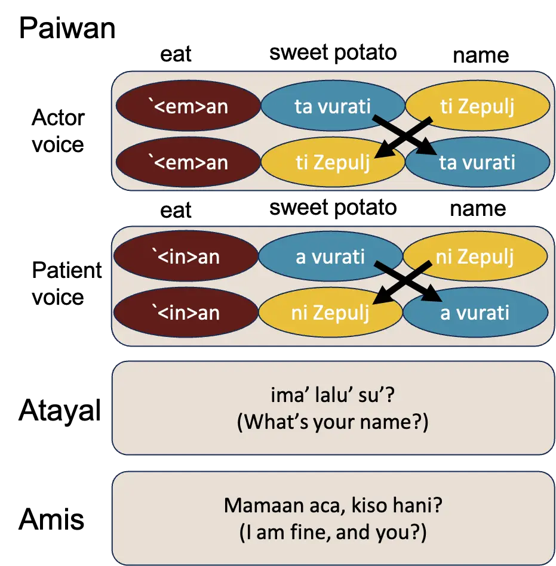
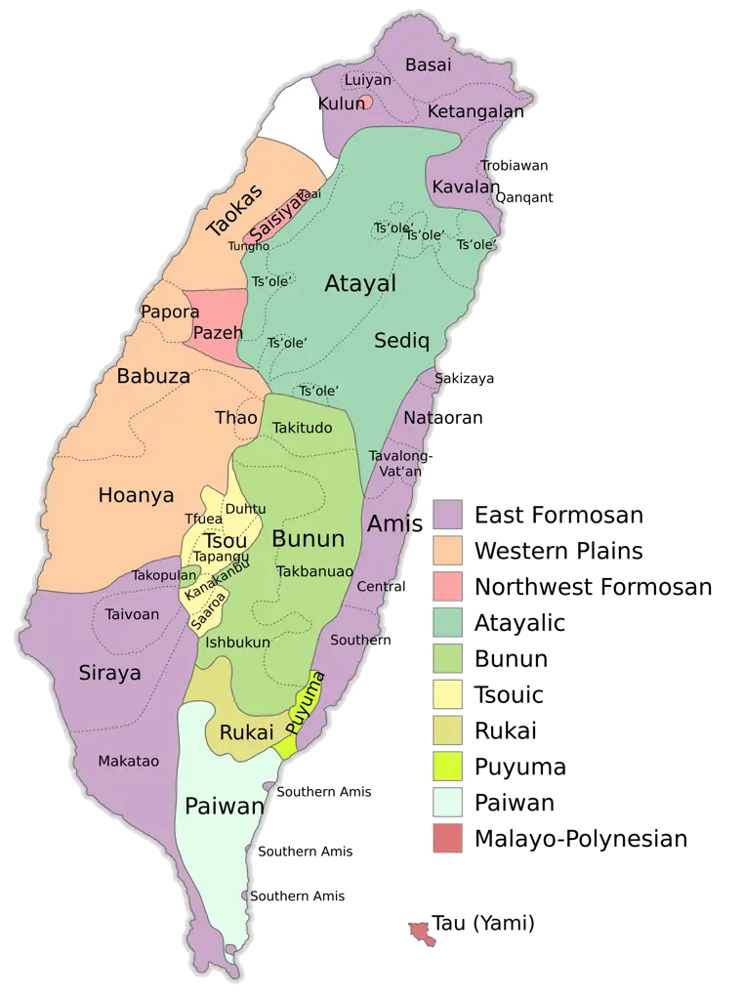
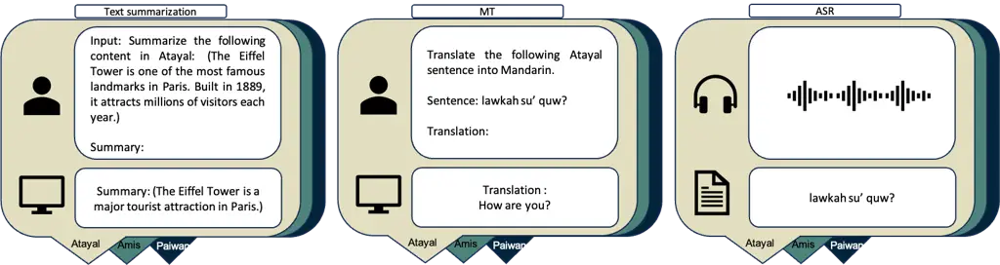
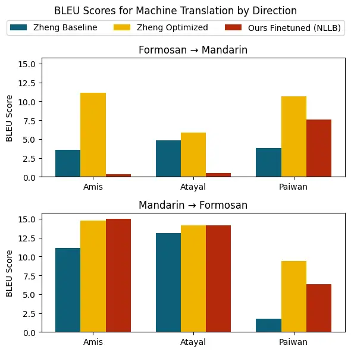
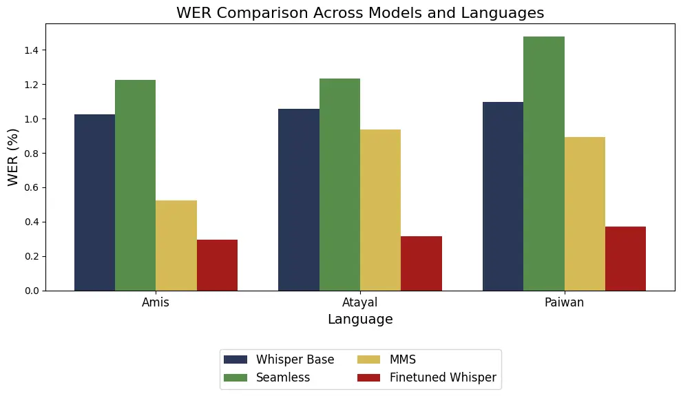

\lingset

everygla=, glspace=.3em, glhangstyle=none, glhangindent=0pt

# FormosanBench: Benchmarking Low-Resource Austronesian Languages in the Era of Large Language Models

Kaiying Kevin Lin$`\ddagger`$    Hsiyu Chen$`\ddagger`$    Haopeng
Zhang$`{\dagger}`$ Affiliation: Institute of Linguistics, Academia
Sinica$`\ddagger`$  ALOHA Lab, University of Hawaii at
Manoa$`{\dagger}`$ Affiliation: {limkhaiin, hsiyuchen}@as.edu.tw
 haopengz@hawaii.edu

###### Abstract

While large language models (LLMs) have demonstrated impressive
performance across a wide range of natural language processing (NLP)
tasks in high-resource languages, their capabilities in low-resource and
minority languages remain significantly underexplored. Formosan
languages—a subgroup of Austronesian languages spoken in Taiwan—are both
linguistically rich and endangered, largely due to the sociolinguistic
dominance of Mandarin. In this work, we introduce FormosanBench, the
first benchmark for evaluating LLMs on low-resource Austronesian
languages. It covers three endangered Formosan languages: Atayal, Amis,
and Paiwan, across three core NLP tasks: machine translation, automatic
speech recognition (ASR), and text summarization. We assess model
performance in zero-shot, 10-shot, and fine-tuned settings using
FormosanBench. Our results reveal a substantial performance gap between
high-resource and Formosan languages. Existing LLMs consistently
underperform across all tasks, with 10-shot learning and fine-tuning
offering only limited improvements. These findings underscore the urgent
need for more inclusive NLP technologies that can effectively support
endangered and underrepresented languages. We release our datasets and
code to facilitate future research in this direction :
[https://anonymous.4open.science/r/FormosanBench-DB43/](https://anonymous.4open.science/r/FormosanBench-DB43/).

## 1 Introduction

Large language models (LLMs) have achieved remarkable success across a
wide range of natural language processing (NLP) tasks Hendrycks et al.
(2020); Zhang et al. (2024), particularly for high-resource
languages Magueresse et al. (2020). This success is largely driven by
pretraining on massive datasets dominated by majority languages such as
English, Mandarin, and Spanish Ruder et al. (2022). In contrast, the
capabilities of LLMs in low-resource language settings remain
significantly underexplored and underdeveloped  Joshi et al. (2025).
Bridging this gap is critical for ensuring that NLP technologies are
inclusive and beneficial to linguistically underrepresented communities.

Recent work has begun to address this disparity by developing benchmarks
and datasets for low-resource languages. For example, Ahia et al. (2024)
introduced datasets for Yorùbá and its dialects, while Adelani et al.
(2025) released IrokoBench, a multilingual benchmark for 17
typologically diverse African languages. These efforts underscore a
growing recognition of the need for inclusive evaluation frameworks that
go beyond the high-resource paradigm.

Formosan languages—a subgroup of Austronesian languages spoken in
Taiwan—represent one such underrepresented group. With fewer than
200,000 speakers in total,¹¹ 1
[https://en.wikipedia.org/wiki/Languages_of_Taiwan](https://en.wikipedia.org/wiki/Languages_of_Taiwan)
these languages are both linguistically rich and severely endangered.
NLP development for Formosan languages faces unique challenges,
particularly the scarcity of high-quality, annotated data Zheng et al.
(2024).

In this paper, we address these gaps by introducing FormosanBench, the
first multi-task benchmark for Formosan languages, covering three
endangered languages—Amis (ISO-ami), Atayal (ISO-tay), and Paiwan
(ISO-pwn)—across three core NLP tasks: machine translation, automatic
speech recognition (ASR), and text summarization. With FormosanBench, we
systematically evaluate the zero-shot performance of state-of-the-art
large language models (LLMs) and explore strategies for improving their
performance through 10-shot in-context learning and small-scale
fine-tuning. Experimental results reveal a significant performance gap
for existing LLMs on Formosan languages, underscoring the need for
further research. Our main contributions are as follows:

- •
  We release FormosanBench, the first multi-task benchmark for three
  major Formosan languages, supporting evaluation across machine
  translation, ASR, and summarization. We release our datasets and code
  to facilitate future research.
- •
  We conduct a comprehensive evaluation of multiple state-of-the-art
  LLMs on FormosanBench under zero-shot, 10-shot, and fine-tuning
  settings.
- •
  Our results reveal a substantial performance gap on Formosan
  languages. While in-context learning and small-scale fine-tuning
  provide some improvements, the findings highlight the need for more
  effective and targeted adaptation methods for endangered and
  underrepresented languages.

## 2 Background: Formosan languages

The Austronesian language family is one of the world’s largest and most
geographically dispersed, extending from Madagascar in the west to
Hawaii and New Zealand in the east. Taiwan is widely considered the
linguistic homeland of Austronesian, a hypothesis supported by the high
degree of linguistic diversity found among its indigenous
languages—collectively known as the Formosan languages. This diversity
includes significant phonological, lexical, and syntactic variation,
distinguishing Formosan languages from other Austronesian branches
(Bellwood, 1984; Blust, 1984; Blust, 2019).

Formosan languages pose considerable challenges for natural language
processing (NLP), especially for large language models (LLMs). Like many
other Austronesian languages, they feature verb-initial (VSO or VOS)
syntax and a complex Voice system that is typologically rare. For
instance, as illustrated in Figure 1, Paiwan allows multiple syntactic
realizations of a sentence with essentially a similar meaning—e.g.,
‘Zepulj eats sweet potatoes’—depending on how the verb is marked to
highlight the roles of the noun phrases. The verb carries an agent-voice
or patient-voice marker, and noun phrases change case marking
accordingly and can switch positions (Chang, 2018). This flexibility,
governed by a morphosyntactic voice system, is uncommon in the world’s
languages and adds complexity for modeling.

Further examples in Atayal and Amis (Figure 1) demonstrate similar
typological features. These three languages—Atayal, Amis, and
Paiwan—belong to early-diverging branches of the Austronesian family and
are genealogically distant from each other as well as from more widely
studied Malayo-Polynesian languages such as Hawaiian and Tagalog (see
Figure 3). Their linguistic distinctiveness, combined with the scarcity
of pretraining corpora, makes them ideal candidates for studying LLM
performance in low-resource and typologically diverse settings.

Figure 1: Four patterns of a sentence ’Zepulj eats sweet potatoes’ in
Paiwan, and example sentences in Atayal and Amis.

Figure 2: 16 Formosan languages in Taiwan

{forest}

Figure 3: Austronesian family tree.

## 3 Related work

Low-resource languages are those with limited linguistic data, tools,
and representation in NLP research. An estimated 80–90% of the world’s
languages fall into this category (Hedderich et al., 2021; Joshi et al.,
2020).

Low-resource NLP: Recent advances in low-resource NLP have centered
around three major areas: multilingual modeling, data preprocessing
pipelines, and the development of benchmark datasets. Multilingual
models such as those proposed by Aharoni et al. (2019) and Conneau
et al. (2020) demonstrate that training on large-scale corpora from over
100 languages can improve performance on tasks like machine translation,
cross-lingual natural language inference, and general language
understanding benchmarks.

To improve data quality, Wenzek et al. (2020) introduced CCNet, a
scalable pipeline for cleaning noisy web-crawled text—an essential
resource for expanding datasets in low-resource settings. In
task-specific applications, Mutsaddi and Choudhary (2025) enhanced
plagiarism detection in the low-resource Indian language Marathi by
combining BERT embeddings with TF-IDF, outperforming both methods used
independently and achieving over 82% accuracy.

More recently, researchers have introduced benchmark datasets to support
a broader range of typologically diverse low-resource languages. Ahia
et al. (2024) developed benchmark datasets for Yorùbá and its dialects,
while Shang et al. (2024) introduced Atlas-Chat, a multi-task benchmark
for Moroccan Arabic (Darija). They evaluated several state-of-the-art
LLMs and demonstrated that few-shot and fine-tuned models significantly
improved performance. These works highlight the growing focus on
evaluation, benchmarking, and adaptation techniques for underrepresented
languages in NLP.

NLP in Formosan languages: Despite growing interest in digital
preservation, computational research on Formosan languages remains
sparse. Among the few studies in this area, Liao (2023) proposed a
Transformer-based machine translation system for three Atayalic
languages—Atayal, Seediq, and Truku—using training data from online
dictionaries and educational materials, and testing on manually curated
book content. Similarly, Zheng et al. (2024) explored translation
techniques across 16 Formosan languages by incorporating lexical
resources and generating pseudo-parallel data through lexicon-based
substitutions. While these approaches represent valuable steps forward,
translation performance remains limited, reflecting both the complexity
of Formosan languages and the scarcity of high-quality data.

Notably, existing work has focused narrowly on machine translation and
conventional sequence models. No prior research has systematically
evaluated the capabilities of state-of-the-art LLMs across a broader
range of NLP tasks in these languages. This gap underscores the
importance of developing comprehensive benchmarks and assessing the
adaptability of LLMs in truly low-resource and typologically diverse
language settings.

Figure 4: Task Description for FormosanBench datasets. All the prompts
were given in Mandarin, but we provide them in English for clarity. In
the case of summarization, text appearing in the parentheses indicates
content written in the Formosan language.

## 4 FormosanBench

We present FormosanBench, the first benchmark to support three
endangered Formosan languages—Atayal, Amis, and Paiwan—across three core
NLP tasks: machine translation, automatic speech recognition, and text
summarization. These languages were selected based on three criteria: 1)
a combined speaker population exceeding 100,000; 2) the availability of
existing digital resources; and 3) their linguistic diversity within the
Austronesian language family. The choice of NLP tasks was guided
primarily by data availability. Figure 4 illustrates examples of each
task.

#### Machine Translation

Our MT dataset comprises approximately 5,000 sentence pairs for each of
three Formosan languages—Atayal, Amis, and Paiwan—paired with Mandarin.
The data was extracted from the Taiwan Indigenous Languages
E-Dictionary²² 2
[https://e-dictionary.ilrdf.org.tw/index.htm](https://e-dictionary.ilrdf.org.tw/index.htm)
and underwent rigorous preprocessing as documented by  FormosanBank
contributors (2024)³³ 3
[https://github.com/FormosanBank/FormosanBank](https://github.com/FormosanBank/FormosanBank)
.The preprocessing methodology included text normalization, punctuation
correction, removal of encoding artifacts, and XML structure validation
to ensure data quality across sentence-level units. We extracted the
Formosan sentences and their Mandarin counterparts from the preprocessed
XML files to form the final parallel corpora.

#### ASR

We collected the ASR data from FormosanBank. The data were sourced from
the Klokā Digital Platform for Indigenous Languages⁴⁴ 4
[https://web.klokah.tw/](https://web.klokah.tw/), which hosts digitized
textbooks for 16 Formosan languages aimed at learners of all ages. Each
textbook section contains written text in a Formosan language along with
corresponding audio recordings, produced by native speakers reading the
content aloud. The materials cover typical language-learning themes—such
as reading and writing, picture books, daily conversations, short texts,
situational language use, illustrated stories, and cultural
topics—offering a range of speech styles, vocabulary, and sentence
complexity grounded in culturally specific content. For this study, we
selected the dialects Coastal Amis, Squliq Atayal, and Central Paiwan
respectively, due to their relative representativeness and greater
accessibility within available resources. The final compiled datasets
consist of paired sentence-level audio recordings with their
corresponding transcriptions, manually verified for alignment accuracy.

#### Summarization

Following  Liu et al. (2018), we collected Wikipedia articles written in
Formosan languages. These articles often focus on culturally significant
topics such as indigenous traditions, historical narratives, and
regional geography Yuan and Zhang (2024). Notably, the articles follow a
relatively consistent structure: an initial introductory section
summarizing the topic, followed by a series of subsections with more
detailed expository content. This natural hierarchy of information lends
itself well to the single-document summarization task, where the
introduction can serve as a gold-standard summary and the remainder of
the article as the input document  Ta et al. (2022); Zhang et al.
(2022). Based on this structure, we curated the dataset by pairing each
article’s introductory section with the corresponding main body content.
We manually reviewed the articles to ensure coherence between the
summary and body, and excluded entries that lacked sufficient structure
or were too short to support meaningful summarization.

|                                    |                     |                     |                     |
| ---------------------------------- | ------------------- | ------------------- | ------------------- |
| Language                           | Amis                | Atayal              | Paiwan              |
| Machine Translation (MT)           |                     |                     |                     |
| Datapoints                         | 3,259 / 543 / 1,631 | 3,832 / 638 / 1,918 | 3,216 / 536 / 1,609 |
| Total Words                        | 38,946              | 38,946              | 36,601              |
| Automatic Speech Recognition (ASR) |                     |                     |                     |
| Datapoints                         | 2,567 / 425 / 1,288 | 2,845 / 470 / 1,429 | 2,054 / 339 / 1,050 |
| Total Words                        | 55,478              | 54,781              | 29,677              |
| Summarization                      |                     |                     |                     |
| Datapoints                         | 77 / 21 / 41        | 672 / 116 / 299     | 135 / 27 / 69       |
| Sum Length                         | 10,438              | 18,983              | 68,537              |
| Doc Length                         | 90,477              | 75,303              | 198,316             |

Table 1: Dataset statistics and splits (Train/Val/Test) for MT, ASR, and
summarization tasks across the three Formosan languages. Word counts are
in Formosan languages.

#### Quality Control

To ensure the reliability and usefulness of our datasets, we applied
task-specific quality control procedures. For the MT dataset, we apply
rule-based filter to remove duplicate sentence pairs to avoid redundancy
and evaluation bias.

For the ASR dataset, we reviewed the XML metadata associated with the
selected Formosan languages from FormosanBank. We excluded entries that
met any of the following criteria: 1) instances containing only a single
word, 2) entries lacking corresponding audio file links sourced from the
associated textbooks, and 3) duplicate entries.

The summarization datasets underwent additional filtering to address
quality issues in Wikipedia articles written in Formosan languages. Due
to content sparsity, many entries contained only introductory paragraphs
without substantial body text. We implemented a two-stage filtering
process: first removing datapoints where article bodies consisted solely
of section titles without accompanying content, then excluding entries
where the input text (article body) was less than 1.5 times the length
of the summary (introduction). This ensured that remaining samples
provided meaningful training and evaluation material with sufficient
information density for effective summarization model development.

#### Benchmark Statistics

Detailed statistics for each task in FormosanBench are presented in
Table 1. For each Formosan language, the dataset was divided into
training, validation, and test splits using a 70:10:20 ratio. This
consistent split facilitates standardized evaluation across all tasks
and languages. Among the three languages, Atayal provides the largest
number of data points and word tokens across all tasks, supporting
broader coverage and diversity. In contrast, Paiwan offers the smallest
datasets, with fewer examples and a lower total word count, particularly
in the ASR and summarization tasks. These differences reflect resource
availability and highlight the varying levels of vocabulary richness and
content complexity among the languages.

## 5 Experiments

### 5.1 LLMs used for evaluation

#### Translation and Summarization

We selected a combination of open-source and proprietary
state-of-the-art LLMs, with a focus on multilingual capabilities and
their effectiveness in low-resource language settings:

- •
  LLaMA 3.1 (AI, 2024): An autoregressive transformer developed by Meta,
  trained on a diverse multilingual and code corpus. It provides a
  strong baseline for general-purpose multilingual tasks.
- •
  Gemma-1.1 (Team et al., 2024): A compact, instruction-tuned model from
  Google, optimized for efficient inference and strong zero-shot
  reasoning abilities.
- •
  Mistral-7B v0.3 (Jiang et al., 2023): A 7-billion-parameter model that
  incorporates sliding window attention and grouped-query attention,
  enabling efficient multilingual inference.
- •
  NLLB-200 (Team et al., 2022): Meta’s encoder-decoder transformer
  specifically designed for low-resource machine translation, offering a
  complementary architecture to decoder-only LLMs.
- •
  GPT-4o (OpenAI, 2024): OpenAI’s latest proprietary model, known for
  its advanced zero-shot and multilingual capabilities. Prior studies
  (e.g., Adelani et al., 2025) suggest that such proprietary models
  often outperform open-source ones in low-resource settings, and we
  include it as an upper-bound baseline.

We used consistent prompting strategies for both MT and summarization
tasks across all models. Example prompts are provided in Appendix A.

#### Automatic Speech Recognition

For the ASR task, we evaluated a set of state-of-the-art models with
demonstrated performance in multilingual and low-resource contexts Ahia
et al. (2024):

- •
  Whisper (Radford et al., 2022): An encoder-decoder transformer trained
  on 680,000 hours of multilingual and multitask supervised data. It is
  well-regarded for robustness in noisy and low-resource scenarios.
- •
  SeamlessM4T (Communication et al., 2023): A unified, multilingual, and
  multimodal system developed by Meta, capable of handling speech and
  text in a single encoder-decoder framework for ASR, translation, and
  generation tasks.
- •
  MMS-1b-all (Pratap et al., 2023): Part of Meta’s Massively
  Multilingual Speech project, this model uses a conformer-based encoder
  (built on Wave2Vec 2.0 (Baevski et al., 2020)) and supports ASR and
  language ID for over 1,000 languages.

### 5.2 Implementation details

For the MT task, we evaluated performance in both directions: from
Formosan languages to Mandarin and from Mandarin to Formosan languages.
We applied 10-shot in-context learning and full fine-tuning to two
models: Mistral-7B v0.3 and NLLB. For the summarization task, we
performed 10-shot learning with GPT-4o, Mistral-7B v0.3, and LLaMA 3.1
8B; the latter two models were also fine-tuned on task-specific data.
All fine-tuning was performed using the Hugging Face Trainer with a
learning rate of 0.001, batch size of 4, and 20 epochs. The checkpoint
with the lowest evaluation loss was selected as the final model.

For ASR, the MMS model requires explicit specification of the
transcription language. We selected Amis as the target language, since
Atayal and Paiwan were not included in MMS’s pretraining corpus. In
contrast, Whisper and Seamless support automatic language detection and
were used without manual language specification. No prompts were
required for the ASR task. Among these, Whisper was the only model
fine-tuned on Formosan language data, due to its robust open-source
implementation, wide community adoption, and the availability of
streamlined tools and APIs that support task-specific adaptation.
Fine-tuning was conducted with a batch size of 16, learning rate of
0.0001, and a maximum of 5000 training steps. The final model was
selected based on the lowest word error rate (WER) on the evaluation
set.

All experiments were conducted within the Academia Sinica AI development
container environment on NVIDIA V100 GPUs and PyTorch 2.7.0a0.

### 5.3 Evaluation metrics

We report BLEU scores (Papineni et al., 2002) for the machine
translation (MT) task, while the ASR and summarization tasks are
evaluated using word error rate (WER) and ROUGE scores (Lin, 2004),
respectively. BLEU measures n-gram precision (typically up to 4-grams)
between model outputs and reference translations, with a brevity penalty
to discourage overly short outputs. WER quantifies the proportion of
word-level errors (insertions, deletions, substitutions) in transcribed
speech, while ROUGE evaluates summary quality based on overlapping units
such as bigrams (ROUGE-2) or longest common subsequences (ROUGE-L)
between generated and reference summaries. For GPT-4o outputs, we
additionally collect human judgments to qualitatively assess fluency and
content relevance.

## 6 Results and Discussion

### 6.1 MT Results

|                     |                                   |        |        |                                   |        |        |
| ------------------- | --------------------------------- | ------ | ------ | --------------------------------- | ------ | ------ |
|                     | Formosan $`\rightarrow`$ Mandarin |        |        | Mandarin $`\rightarrow`$ Formosan |        |        |
|                     | Amis                              | Atayal | Paiwan | Amis                              | Atayal | Paiwan |
| Zero-shot Models    |                                   |        |        |                                   |        |        |
| Mistral-7B-Instruct | 0.0000                            | 0.0000 | 0.0000 | 0.0000                            | 0.0010 | 0.0002 |
| Gemma-1.1-7B-it     | 0.0000                            | 0.0000 | 0.0000 | 0.0000                            | 0.0005 | 0.0019 |
| LLaMA-3.1-8B        | 0.0000                            | 0.0000 | 0.0000 | 0.0000                            | 0.0001 | 0.0000 |
| LLaMA-3.1-70B       | 0.0000                            | 0.0000 | 0.0000 | 0.0000                            | 0.0006 | 0.0005 |
| GPT-4o-mini         | 0.0000                            | 0.0000 | 0.0000 | 0.0000                            | 0.0001 | 0.0036 |
| NLLB                | 0.0000                            | 0.0000 | 0.0000 | 0.0000                            | 0.0000 | 0.0000 |
| 10-shot Models      |                                   |        |        |                                   |        |        |
| Mistral-10-shot     | 0.0000                            | 0.0000 | 0.0035 | 0.0016                            | 0.0000 | 0.0041 |
| Fine-tuned Models   |                                   |        |        |                                   |        |        |
| Mistral-Finetuned   | 0.0000                            | 0.0000 | 0.0019 | 0.0159                            | 0.0208 | 0.0002 |
| NLLB-Finetuned      | 0.0000                            | 0.0048 | 0.0759 | 0.1506                            | 0.1137 | 0.0636 |

.

Table 2: BLEU scores $`\uparrow`$ for translation between Formosan
languages and Mandarin. Left: Formosan $`\rightarrow`$ Mandarin. Right:
Mandarin $`\rightarrow`$ Formosan. The best score for each language in
each condition is in bold.

Figure 5: BLEU scores $`\uparrow`$ compared with Zheng et al. (2024)

Zero-shot Setting. As shown in Table  2, across all non-fine-tuned
models—including GPT-4o, LLaMA-3.1 (8B and 70B), Gemma-1.1, and
Mistral-7B-instruct variants—the BLEU scores remained consistently low,
often at or extremely close to zero, and even a proprietary model like
GPT-4o did not show better performance. In the Formosan-to-Mandarin
direction, all models scored nearly 0 BLEU across all three languages,
indicating a near-total failure to understand and translate from these
low-resource languages. In the reverse direction, Mandarin-to-Formosan,
performance was only marginally higher: for example, the highest
non-fine-tuned BLEU scores were just 0.0019 for Paiwan
(Gemma-1.1-7B-it), 0.0010 for Atayal (Mistral-7B-Instruct), and 0.0036
for Paiwan (GPT-4o-mini). These small improvements suggest that the
models have stronger generative capacity when translating into Formosan
languages from Mandarin input, likely due to their familiarity with
Mandarin and surface-level token overlap. However, the overall low BLEU
scores still reflect minimal understanding of Formosan linguistic
structure or vocabulary.

10-shot and Fine-tuning Settings. We observed that BLEU scores for the
Mistral models remained nearly zero even after adaptation. In contrast,
NLLB showed slight improvements, likely due to its MT-oriented
architecture and pretraining on a multilingual corpus that includes
Austronesian languages such as Tagalog and Indonesian. Nevertheless, the
gains remain minimal, highlighting the challenges of generalizing from
these languages to Formosan languages. Our best results in each section
are compared with those reported in Zheng et al. (2024), who trained
models from scratch. Figure 5 shows our best training results from NLLB
models, compared with Zheng et al. (2024). Our results remain generally
low, and adaptation contributes little to performance improvement, even
when compared to Zheng et al. (2024)’s already modest results. The only
exceptions from NLLB fine-tuning with non-parallel Formosan data, which
marginally exceeded Zheng et al. (2024)’s baseline, suggest that future
improvements may require language-specific adaptation strategies.
Overall, the limited amount of training data remains a key
bottleneck—current models, with millions to billions of parameters,
require far more data than what is currently available for Formosan
languages.

### 6.2 ASR Results

Zero-shot Setting. Table 3 presents the word error rate (WER) results
for Amis, Atayal, and Paiwan. Among these models, MMS consistently
achieved the lowest WER across all three languages, while Whisper Base
and Seamless exhibited substantially higher error rates. Notably,
Amis—explicitly included in MMS’s pretraining data and specified for our
experiments—showed the strongest performance, as expected. While MMS’s
familiarity with Amis may have provided marginal benefits to its
performance on Atayal and Paiwan, these gains were limited. As discussed
earlier in the paper, Atayal and Paiwan exhibit linguistic differences
from Amis, which likely constrained the model’s ability to generalize
effectively across these languages. The overall stronger performance of
MMS can also be attributed to its large-scale multilingual training and
its architecture specifically optimized for low-resource language
settings. These findings are consistent with prior research by Ahia
et al. (2024), which similarly reported that MMS outperforms
general-purpose ASR models in under-resourced language settings.

10-shot and Fine-tuning Settings. As shown in Figure 6, the fine-tuned
Whisper model shows a notable reduction in WER, achieving scores around
0.3. This improvement may be attributed to Whisper’s extensive
pretraining on hundreds of thousands of hours of multilingual and
multitask supervised data collected from the web. While this marks a
significant improvement, further adaptation may still be necessary to
reach a level suitable for practical deployment.

|                   | Amis  | Atayal | Paiwan |
| ----------------- | ----- | ------ | ------ |
| Zero-shot Models  |       |        |        |
| Whisper Base      | 1.026 | 1.057  | 1.098  |
| Seamless          | 1.225 | 1.235  | 1.479  |
| MMS               | 0.522 | 0.937  | 0.893  |
| Fine-tuned Model  |       |        |        |
| Finetuned Whisper | 0.296 | 0.315  | 0.373  |

Table 3: WER (Word Error Rate) $`\downarrow`$ comparison across ASR
models for Amis, Atayal, and Paiwan.

Figure 6: WER $`\downarrow`$ comparison across models and languages

### 6.3 Text summarization Results

Zero-shot Setting. Table 4 shows that performance on the summarization
tasks was generally low, with ROUGE-2 and ROUGE-L scores typically
falling below 20. The generated summaries often included Mandarin words
with only a few Formosan words, indicating that the models struggled to
understand and generate content in the target languages. Despite low
overall comprehension in both the translation and summarization tasks,
ROUGE scores appeared relatively higher than BLEU scores. This
discrepancy likely stems from ROUGE’s recall-oriented nature: when
models produced lengthy but semantically irrelevant summaries, the
chance of word overlap with the reference—particularly for frequent or
proper nouns—increased. Even minimal overlap can contribute positively
to the ROUGE score. In contrast, BLEU applies stricter penalties for
mismatches, especially in terms of word order and precision, which helps
explain the lower BLEU scores.

10-shot and Fine-tuning Settings. Model adaptation did not yield
consistent improvements in ROUGE scores for Mistral and LLaMA; in fact,
scores declined across most languages and models. This pattern likely
reflects the models’ limited capacity to generate meaningful summaries
in low-resource settings. ROUGE scores below 20 are generally considered
unreliable as indicators of semantic quality, and fluctuations at this
range are more likely attributable to noise than substantive gains.
Prior to adaptation, some model outputs occasionally included key
terms—such as named entities or location markers—that matched the
reference summaries, likely due to memorization from pretraining.

After adaptation, the generated summaries appeared more fluent in
Formosan languages but often lacked semantic coherence. Notably, the
frequency of overlapping key terms with reference summaries decreased,
likely contributing to the observed decline in ROUGE scores. An
exception was GPT-4o, which exhibited substantial improvements in the
summarization task for Atayal and Amis following 10-shot learning. Human
evaluation indicated that many inputs involved descriptions of locations
or tribes, typically including details about ethnic composition and
geographic context. When few-shot examples featured similar content,
GPT-4o effectively reproduced the structural and lexical patterns of the
input examples, generating summaries with comparable tone and format.
However, the model frequently introduced factual inaccuracies—such as
incorrect ethnic group counts—and outputs on other topics, particularly
those describing countries and locations, with significant grammatical
errors. These findings suggest that the model’s improvements stem more
from surface-level pattern replication than from genuine semantic
understanding.

In summary, most models struggled to perform the summarization task
effectively. While GPT-4o showed notable improvements for specific
languages under 10-shot learning, its gains did not generalize broadly.
The overall performance gap between low-resource Formosan languages and
high-resource counterparts underscores the need for more targeted
strategies to improve LLM performance in typologically diverse,
underrepresented languages.

|                   |             |             |             |
| ----------------- | ----------- | ----------- | ----------- |
|                   | Amis        | Atayal      | Paiwan      |
| Zero-shot Models  |             |             |             |
| Mistral           | 19.74/24.75 | 11.10/25.34 | 13.20/18.66 |
| Gemma             | 1.32/7.68   | 1.76/7.58   | 2.91/10.32  |
| LLaMA             | 4.94/14.46  | 2.46/12.86  | 5.05/17.44  |
| GPT-4o            | 5.03/14.52  | 2.91/13.03  | 6.28/19.41  |
| 10-shot Models    |             |             |             |
| Mistral           | 0.94/7.65   | 0.52/6.02   | 0.24/8.11   |
| GPT-4o            | 19.6/30.02  | 38.36/50.41 | 6.48/20.05  |
| LLaMA             | 0.59/7.15   | 0.52/5.11   | 0.27/6.53   |
| Fine-tuned Models |             |             |             |
| Mistral           | 3.87/10.20  | 11.02/19.57 | 0.50/9.14   |
| LLaMA             | 4.60/13.32  | 5.81/10.39  | 0.97/7.93   |

Table 4: ROUGE-2/ROUGE-L scores $`\uparrow`$ for Amis, Atayal, and
Paiwan across model types. All values are scaled to percentages for
interpretability.

## 7 Conclusion

In this paper, we present evaluation results from several large language
models (LLMs) across three Formosan languages. Our findings demonstrate
that low-resource languages, such as those in the Formosan family,
remain a significant blind spot for current state-of-the-art LLMs. The
models perform poorly across all three evaluated NLP tasks—machine
translation (MT), automatic speech recognition (ASR), and text
summarization. In particular, results from MT and summarization indicate
that the models struggle to exhibit meaningful understanding of the
target languages, often producing outputs that are entirely unrelated to
the input. While ASR performance is relatively better, it still falls
short of practical usability. Notably, our adaptation efforts led to a
substantial reduction in word error rate (WER) for ASR and a notable
increase in ROUGE scores for GPT-4o in summarization. However,
improvements in BLEU scores for MT were marginal, and most models showed
a decline in ROUGE scores on the summarization task. Overall, these
benchmarking results underscore the urgent need for targeted research
and model development tailored to low-resource languages such as those
in the Formosan family.

## Limitations

We present results for only a limited number of Formosan languages, and
incorporating a broader range of NLP tasks would help build a more
comprehensive understanding of low-resource language performance.
However, expanding to additional tasks often demands substantial human
effort for data annotation and validation, which is both time- and
cost-consuming. These constraints significantly limit the scope of the
current study. Future work, if supported by greater time and funding,
may expand the scale of research in these directions.

## References

- Adelani et al. (2025) David Ifeoluwa Adelani, Jessica Ojo,
  Israel Abebe Azime, Jian Yun Zhuang, Jesujoba O. Alabi, Xuanli He,
  Millicent Ochieng, Sara Hooker, Andiswa Bukula, En-Shiun Annie Lee,
  Chiamaka Chukwuneke, Happy Buzaaba, Blessing Sibanda, Godson Kalipe,
  Jonathan Mukiibi, Salomon Kabongo, Foutse Yuehgoh, Mmasibidi Setaka,
  Lolwethu Ndolela, Nkiruka Odu, Rooweither Mabuya, Shamsuddeen Hassan
  Muhammad, Salomey Osei, Sokhar Samb, Tadesse Kebede Guge,
  Tombekai Vangoni Sherman, and Pontus Stenetorp. 2025. [Irokobench: A
  new benchmark for african languages in the age of large language
  models](https://arxiv.org/abs/2406.03368). _Preprint_,
  arXiv:2406.03368.
- Aharoni et al. (2019) Roee Aharoni, Melvin Johnson, and Orhan
  Firat. 2019. [Massively multilingual neural machine
  translation](https://doi.org/10.18653/v1/N19-1388). In _Proceedings of
  the 2019 Conference of the North American Chapter of the Association
  for Computational Linguistics: Human Language Technologies, Volume 1
  (Long and Short Papers)_, pages 3874–3884, Minneapolis, Minnesota.
  Association for Computational Linguistics.
- Ahia et al. (2024) Orevaoghene Ahia, Anuoluwapo Aremu, Diana Abagyan,
  Hila Gonen, David Ifeoluwa Adelani, Daud Abolade, Noah A. Smith, and
  Yulia Tsvetkov. 2024. [Voices unheard: Nlp resources and models for
  yorùbá regional dialects](https://arxiv.org/abs/2406.19564).
  _Preprint_, arXiv:2406.19564.
- AI (2024) Meta AI. 2024. [Introducing llama 3.1: Our most capable
  models to date](https://ai.meta.com/blog/meta-llama-3-1/). Accessed:
  2025-04-09.
- Baevski et al. (2020) Alexei Baevski, Henry Zhou, Abdelrahman Mohamed,
  and Michael Auli. 2020. [wav2vec 2.0: A framework for self-supervised
  learning of speech representations](https://arxiv.org/abs/2006.11477).
  _Preprint_, arXiv:2006.11477.
- Bellwood (1984) Peter Bellwood. 1984. [A hypothesis for austronesian
  origins](http://www.jstor.org/stable/42928109). _Asian Perspectives_,
  26(1):107–117.
- Blust (1984) Robert Blust. 1984. [The austronesian homeland: A
  linguistic perspective](http://www.jstor.org/stable/42928105). _Asian
  Perspectives_, 26(1):45–67.
- Blust (2019) Robert Blust. 2019. [The austronesian homeland and
  dispersal](https://doi.org/10.1146/annurev-linguistics-011718-012440).
  _Annual Review of Linguistics_, 5(Volume 5, 2019):417–434.
- Chang (2018) Shuanfan Chang. 2018. _Paiwan yufa gailun \[A concise
  grammar of Paiwan\]_. Council of Indigenous Peoples, Taiwan.
- Communication et al. (2023) Seamless Communication, Loïc Barrault,
  Yu-An Chung, Mariano Cora Meglioli, David Dale, Ning Dong,
  Paul-Ambroise Duquenne, Hady Elsahar, Hongyu Gong, Kevin Heffernan,
  John Hoffman, Christopher Klaiber, Pengwei Li, Daniel Licht, Jean
  Maillard, Alice Rakotoarison, Kaushik Ram Sadagopan, Guillaume Wenzek,
  Ethan Ye, Bapi Akula, Peng-Jen Chen, Naji El Hachem, Brian Ellis,
  Gabriel Mejia Gonzalez, Justin Haaheim, Prangthip Hansanti, Russ
  Howes, Bernie Huang, Min-Jae Hwang, Hirofumi Inaguma, Somya Jain,
  Elahe Kalbassi, Amanda Kallet, Ilia Kulikov, Janice Lam, Daniel Li,
  Xutai Ma, Ruslan Mavlyutov, Benjamin Peloquin, Mohamed Ramadan,
  Abinesh Ramakrishnan, Anna Sun, Kevin Tran, Tuan Tran, Igor Tufanov,
  Vish Vogeti, Carleigh Wood, Yilin Yang, Bokai Yu, Pierre Andrews, Can
  Balioglu, Marta R. Costa-jussà, Onur Celebi, Maha Elbayad, Cynthia
  Gao, Francisco Guzmán, Justine Kao, Ann Lee, Alexandre Mourachko, Juan
  Pino, Sravya Popuri, Christophe Ropers, Safiyyah Saleem, Holger
  Schwenk, Paden Tomasello, Changhan Wang, Jeff Wang, and Skyler
  Wang. 2023. [Seamlessm4t: Massively multilingual multimodal machine
  translation](https://arxiv.org/abs/2308.11596). _Preprint_,
  arXiv:2308.11596.
- Conneau et al. (2020) Alexis Conneau, Kartikay Khandelwal, Naman
  Goyal, Vishrav Chaudhary, Guillaume Wenzek, Francisco Guzmán, Edouard
  Grave, Myle Ott, Luke Zettlemoyer, and Veselin Stoyanov. 2020.
  [Unsupervised cross-lingual representation learning at
  scale](https://doi.org/10.18653/v1/2020.acl-main.747). In _Proceedings
  of the 58th Annual Meeting of the Association for Computational
  Linguistics_, pages 8440–8451, Online. Association for Computational
  Linguistics.
- FormosanBank contributors (2024) FormosanBank contributors. 2024.
  Formosanbank: A repository of formosan language resources.
  [https://github.com/FormosanBank/FormosanBank](https://github.com/FormosanBank/FormosanBank).
  Accessed: 2024-05-08.
- Hedderich et al. (2021) Michael A. Hedderich, Lukas Lange, Heike Adel,
  Jannik Strötgen, and Dietrich Klakow. 2021. [A survey on recent
  approaches for natural language processing in low-resource
  scenarios](https://arxiv.org/abs/2010.12309). _Preprint_,
  arXiv:2010.12309.
- Hendrycks et al. (2020) Dan Hendrycks, Collin Burns, Steven Basart,
  Andy Zou, Mantas Mazeika, Dawn Song, and Jacob Steinhardt. 2020.
  Measuring massive multitask language understanding. _arXiv preprint
  arXiv:2009.03300_.
- Jiang et al. (2023) Albert Q. Jiang, Alexandre Sablayrolles, Arthur
  Mensch, Chris Bamford, Devendra Singh Chaplot, Diego de las Casas,
  Florian Bressand, Gianna Lengyel, Guillaume Lample, Lucile Saulnier,
  Lélio Renard Lavaud, Marie-Anne Lachaux, Pierre Stock, Teven Le Scao,
  Thibaut Lavril, Thomas Wang, Timothée Lacroix, and William El
  Sayed. 2023. [Mistral 7b](https://arxiv.org/abs/2310.06825).
  _Preprint_, arXiv:2310.06825.
- Joshi et al. (2020) Pratik Joshi, Sebastin Santy, Amar Budhiraja,
  Kalika Bali, and Monojit Choudhury. 2020. [The state and fate of
  linguistic diversity and inclusion in the NLP
  world](https://doi.org/10.18653/v1/2020.acl-main.560). In _Proceedings
  of the 58th Annual Meeting of the Association for Computational
  Linguistics_, pages 6282–6293, Online. Association for Computational
  Linguistics.
- Joshi et al. (2025) Raviraj Joshi, Kanishk Singla, Anusha Kamath,
  Raunak Kalani, Rakesh Paul, Utkarsh Vaidya, Sanjay Singh Chauhan,
  Niranjan Wartikar, and Eileen Long. 2025. [Adapting multilingual llms
  to low-resource languages using continued pre-training and synthetic
  corpus](https://arxiv.org/abs/2410.14815). _Preprint_,
  arXiv:2410.14815.
- Liao (2023) Eric Liao. 2023. [Multilingual machine translation between
  atayalic languages and chinese](https://hdl.handle.net/11296/37xrcb).
  Master’s thesis, National Taiwan Ocean University. Taiwan Thesis and
  Dissertation System.
- Lin (2004) Chin-Yew Lin. 2004. [ROUGE: A package for automatic
  evaluation of summaries](https://aclanthology.org/W04-1013/). In _Text
  Summarization Branches Out_, pages 74–81, Barcelona, Spain.
  Association for Computational Linguistics.
- Liu et al. (2018) Peter J. Liu, Mohammad Saleh, Etienne Pot, Ben
  Goodrich, Ryan Sepassi, Lukasz Kaiser, and Noam Shazeer. 2018.
  [Generating wikipedia by summarizing long
  sequences](https://arxiv.org/abs/1801.10198). _Preprint_,
  arXiv:1801.10198.
- Magueresse et al. (2020) Alexandre Magueresse, Vincent Carles, and
  Evan Heetderks. 2020. Low-resource languages: A review of past work
  and future challenges. _arXiv preprint arXiv:2006.07264_.
- Mutsaddi and Choudhary (2025) Atharva Mutsaddi and Aditya Prashant
  Choudhary. 2025. [Enhancing plagiarism detection in Marathi with a
  weighted ensemble of TF-IDF and BERT embeddings for low-resource
  language processing](https://aclanthology.org/2025.loreslm-1.6/). In
  _Proceedings of the First Workshop on Language Models for Low-Resource
  Languages_, pages 89–100, Abu Dhabi, United Arab Emirates. Association
  for Computational Linguistics.
- OpenAI (2024) OpenAI. 2024. Gpt-4o technical report.
  [https://openai.com/index/gpt-4o](https://openai.com/index/gpt-4o).
  Accessed: 2025-05-05.
- Papineni et al. (2002) Kishore Papineni, Salim Roukos, Todd Ward, and
  Wei-Jing Zhu. 2002. [Bleu: a method for automatic evaluation of
  machine translation](https://doi.org/10.3115/1073083.1073135). In
  _Proceedings of the 40th Annual Meeting on Association for
  Computational Linguistics_, ACL ’02, page 311–318, USA. Association
  for Computational Linguistics.
- Pratap et al. (2023) Vineel Pratap, Andros Tjandra, Bowen Shi, Paden
  Tomasello, Arun Babu, Sayani Kundu, Ali Elkahky, Zhaoheng Ni, Apoorv
  Vyas, Maryam Fazel-Zarandi, Alexei Baevski, Yossi Adi, Xiaohui Zhang,
  Wei-Ning Hsu, Alexis Conneau, and Michael Auli. 2023. Scaling speech
  technology to 1,000+ languages. _arXiv_.
- Radford et al. (2022) Alec Radford, Jong Wook Kim, Tao Xu, Greg
  Brockman, Christine McLeavey, and Ilya Sutskever. 2022. [Robust speech
  recognition via large-scale weak
  supervision](https://arxiv.org/abs/2212.04356). _Preprint_,
  arXiv:2212.04356.
- Ruder et al. (2022) Sebastian Ruder, Ivan Vulić, and Anders
  Søgaard. 2022. Square one bias in nlp: Towards a multi-dimensional
  exploration of the research manifold. _arXiv preprint
  arXiv:2206.09755_.
- Shang et al. (2024) Guokan Shang, Hadi Abdine, Yousef Khoubrane, Amr
  Mohamed, Yassine Abbahaddou, Sofiane Ennadir, Imane Momayiz, Xuguang
  Ren, Eric Moulines, Preslav Nakov, Michalis Vazirgiannis, and Eric
  Xing. 2024. [Atlas-chat: Adapting large language models for
  low-resource moroccan arabic
  dialect](https://arxiv.org/abs/2409.17912). _Preprint_,
  arXiv:2409.17912.
- Ta et al. (2022) Hoang Thang Ta, Abu Bakar Siddiqur Rahman, Navonil
  Majumder, Amir Hussain, Lotfollah Najjar, Newton Howard, Soujanya
  Poria, and Alexander Gelbukh. 2022. [Wikides: A wikipedia-based
  dataset for generating short descriptions from
  paragraphs](https://arxiv.org/abs/2209.13101). _Preprint_,
  arXiv:2209.13101.
- Team et al. (2024) Gemma Team, Thomas Mesnard, Cassidy Hardin, Robert
  Dadashi, Surya Bhupatiraju, Shreya Pathak, Laurent Sifre, Morgane
  Rivière, Mihir Sanjay Kale, Juliette Love, Pouya Tafti, Léonard
  Hussenot, Pier Giuseppe Sessa, Aakanksha Chowdhery, Adam Roberts,
  Aditya Barua, Alex Botev, Alex Castro-Ros, Ambrose Slone, Amélie
  Héliou, Andrea Tacchetti, Anna Bulanova, Antonia Paterson, Beth Tsai,
  Bobak Shahriari, Charline Le Lan, Christopher A. Choquette-Choo,
  Clément Crepy, Daniel Cer, Daphne Ippolito, David Reid, Elena
  Buchatskaya, Eric Ni, Eric Noland, Geng Yan, George Tucker,
  George-Christian Muraru, Grigory Rozhdestvenskiy, Henryk Michalewski,
  Ian Tenney, Ivan Grishchenko, Jacob Austin, James Keeling, Jane
  Labanowski, Jean-Baptiste Lespiau, Jeff Stanway, Jenny Brennan, Jeremy
  Chen, Johan Ferret, Justin Chiu, Justin Mao-Jones, Katherine Lee,
  Kathy Yu, Katie Millican, Lars Lowe Sjoesund, Lisa Lee, Lucas Dixon,
  Machel Reid, Maciej Mikuła, Mateo Wirth, Michael Sharman, Nikolai
  Chinaev, Nithum Thain, Olivier Bachem, Oscar Chang, Oscar Wahltinez,
  Paige Bailey, Paul Michel, Petko Yotov, Rahma Chaabouni, Ramona
  Comanescu, Reena Jana, Rohan Anil, Ross McIlroy, Ruibo Liu, Ryan
  Mullins, Samuel L Smith, Sebastian Borgeaud, Sertan Girgin, Sholto
  Douglas, Shree Pandya, Siamak Shakeri, Soham De, Ted Klimenko, Tom
  Hennigan, Vlad Feinberg, Wojciech Stokowiec, Yu hui Chen, Zafarali
  Ahmed, Zhitao Gong, Tris Warkentin, Ludovic Peran, Minh Giang, Clément
  Farabet, Oriol Vinyals, Jeff Dean, Koray Kavukcuoglu, Demis Hassabis,
  Zoubin Ghahramani, Douglas Eck, Joelle Barral, Fernando Pereira, Eli
  Collins, Armand Joulin, Noah Fiedel, Evan Senter, Alek Andreev, and
  Kathleen Kenealy. 2024. [Gemma: Open models based on gemini research
  and technology](https://arxiv.org/abs/2403.08295). _Preprint_,
  arXiv:2403.08295.
- Team et al. (2022) NLLB Team, Marta R. Costa-jussà, James Cross, Onur
  Çelebi, Maha Elbayad, Kenneth Heafield, Kevin Heffernan, Elahe
  Kalbassi, Janice Lam, Daniel Licht, Jean Maillard, Anna Sun, Skyler
  Wang, Guillaume Wenzek, Al Youngblood, Bapi Akula, Loic Barrault,
  Gabriel Mejia Gonzalez, Prangthip Hansanti, John Hoffman, Semarley
  Jarrett, Kaushik Ram Sadagopan, Dirk Rowe, Shannon Spruit, Chau Tran,
  Pierre Andrews, Necip Fazil Ayan, Shruti Bhosale, Sergey Edunov,
  Angela Fan, Cynthia Gao, Vedanuj Goswami, Francisco Guzmán, Philipp
  Koehn, Alexandre Mourachko, Christophe Ropers, Safiyyah Saleem, Holger
  Schwenk, and Jeff Wang. 2022. [No language left behind: Scaling
  human-centered machine translation](https://arxiv.org/abs/2207.04672).
  _Preprint_, arXiv:2207.04672.
- Wenzek et al. (2020) Guillaume Wenzek, Marie-Anne Lachaux, Alexis
  Conneau, Vishrav Chaudhary, Francisco Guzmán, Armand Joulin, and
  Edouard Grave. 2020. [CCNet: Extracting high quality monolingual
  datasets from web crawl
  data](https://aclanthology.org/2020.lrec-1.494/). In _Proceedings of
  the Twelfth Language Resources and Evaluation Conference_, pages
  4003–4012, Marseille, France. European Language Resources Association.
- Yuan and Zhang (2024) Haohan Yuan and Haopeng Zhang. 2024. Domainsum:
  A hierarchical benchmark for fine-grained domain shift in abstractive
  text summarization. _arXiv preprint arXiv:2410.15687_.
- Zhang et al. (2022) Haopeng Zhang, Semih Yavuz, Wojciech Kryscinski,
  Kazuma Hashimoto, and Yingbo Zhou. 2022. Improving the faithfulness of
  abstractive summarization via entity coverage control. _arXiv preprint
  arXiv:2207.02263_.
- Zhang et al. (2024) Haopeng Zhang, Philip S Yu, and Jiawei
  Zhang. 2024. A systematic survey of text summarization: From
  statistical methods to large language models. _ACM Computing Surveys_.
- Zheng et al. (2024) Francis Zheng, Edison Marrese-Taylor, and Yutaka
  Matsuo. 2024. [Improving low-resource machine translation for formosan
  languages using bilingual lexical
  resources](https://doi.org/10.18653/v1/2024.findings-acl.670). In
  _Findings of the Association for Computational Linguistics: ACL 2024_,
  pages 11248–11259, Bangkok, Thailand. Association for Computational
  Linguistics.

## Appendix A Prompts used in the experiments

The detailed prompts used in all experiments are presented in Table 5.

| Task                                   | Prompt Template                                              |
| -------------------------------------- | ------------------------------------------------------------ |
| MT (Formosan $`\rightarrow`$ Mandarin) | `Translate the following {language} sentence into Mandarin.` |
|                                        | `{Sentence}`                                                 |
|                                        | `Transaltion: {Sentence}`                                    |
| MT (Mandarin $`\rightarrow`$ Formosan) | `Translate the following Mandarin sentence into {language}`  |
|                                        | `{Sentence}`                                                 |
|                                        | `Transaltion: {Sentence}`                                    |
| ASR                                    | `N/A`                                                        |
| Summarization                          | `You are an expert in the {language} language.`              |
|                                        | `Summarize the following content in {language}.`             |
|                                        | `Your output must be in {language} only.`                    |
|                                        | `Do not use Chinese or English.`                             |
|                                        | `Only provide the summary: {text}`                           |

Table 5: Prompts used in our experiment (in Mandarin)
