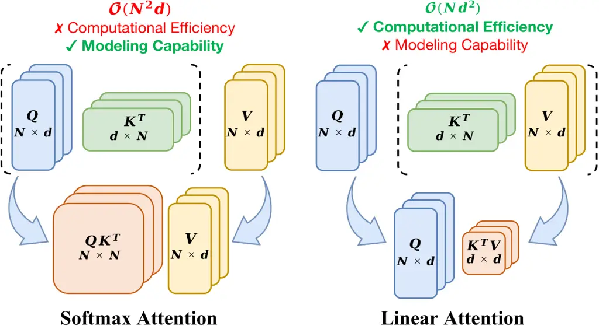
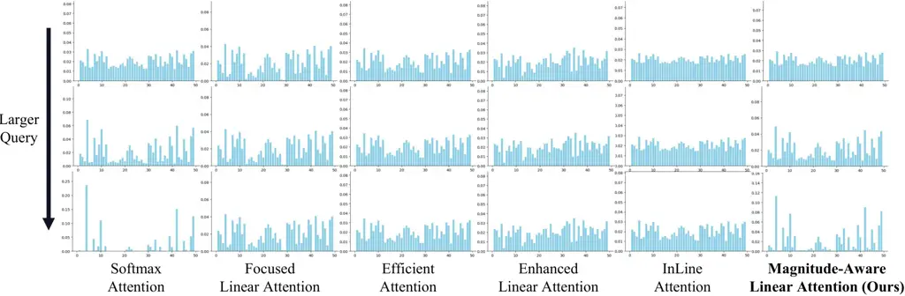
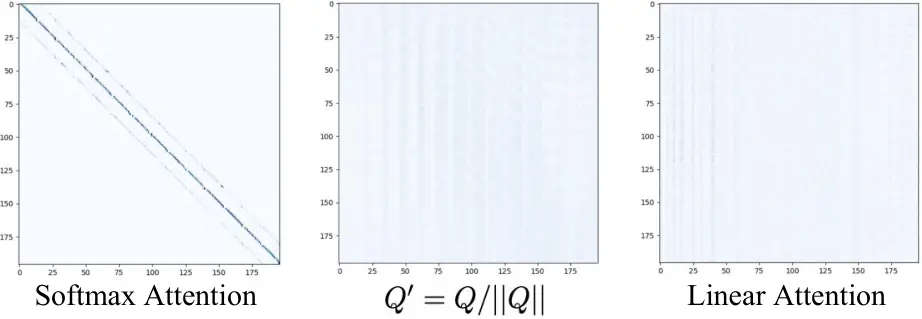
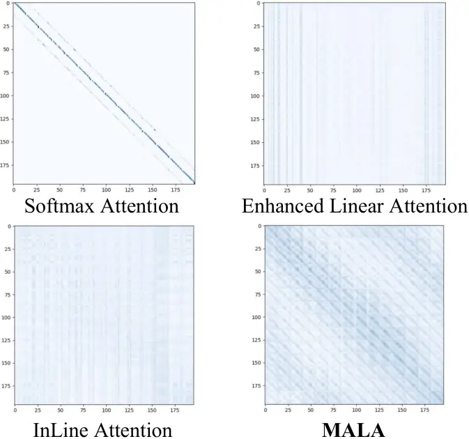
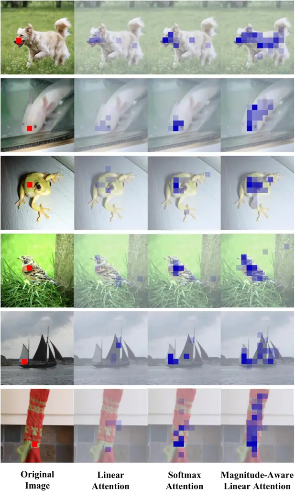

# Rectifying Magnitude Neglect in Linear Attention

Qihang Fan Affiliation: MAIS & NLPR, Institute of Automation, Chinese
Academy of Sciences, Beijing, China Affiliation: School of Artificial
Intelligence, University of Chinese Academy of Sciences, Beijing, China
Email: [fanqihang.159@gmail.com](mailto:)    Huaibo Huang
^(†)^(†)thanks: Huaibo Huang is the corresponding author.
Affiliation: MAIS & NLPR, Institute of Automation, Chinese Academy of
Sciences, Beijing, China Email: [huaibo.huang@cripac.ia.ac.cn](mailto:)
   Yuang Ai Affiliation: MAIS & NLPR, Institute of Automation, Chinese
Academy of Sciences, Beijing, China Affiliation: School of Artificial
Intelligence, University of Chinese Academy of Sciences, Beijing, China
Email: [shallowdream555@gmail.com](mailto:)    Ran He Affiliation: MAIS
& NLPR, Institute of Automation, Chinese Academy of Sciences, Beijing,
China Affiliation: School of Artificial Intelligence, University of
Chinese Academy of Sciences, Beijing, China
Email: [rhe@nlpr.ia.ac.cn](mailto:)

###### Abstract

As the core operator of Transformers, Softmax Attention exhibits
excellent global modeling capabilities. However, its quadratic
complexity limits its applicability to vision tasks. In contrast, Linear
Attention shares a similar formulation with Softmax Attention while
achieving linear complexity, enabling efficient global information
modeling. Nevertheless, Linear Attention suffers from a significant
performance degradation compared to standard Softmax Attention. In this
paper, we analyze the underlying causes of this issue based on the
formulation of Linear Attention. We find that, unlike Softmax Attention,
Linear Attention entirely disregards the magnitude information of the
Query($`Q`$ or $`\phi(Q)`$). This prevents the attention score
distribution from dynamically adapting as the Query scales. As a result,
despite its structural similarity to Softmax Attention, Linear Attention
exhibits a significantly different attention score distribution. Based
on this observation, we propose Magnitude-Aware Linear Attention (MALA),
which modifies the computation of Linear Attention to fully incorporate
the Query’s magnitude. This adjustment allows MALA to generate an
attention score distribution that closely resembles Softmax Attention
while exhibiting a more well-balanced structure. We evaluate the
effectiveness of MALA on multiple tasks, including image classification,
object detection, instance segmentation, semantic segmentation, natural
language processing, speech recognition, and image generation. Our MALA
achieves strong results on all of these tasks. Code will be available at
[https://github.com/qhfan/MALA](https://github.com/qhfan/MALA).

## 1 Introduction



Figure 1: Comparison between Softmax Attention and Linear Attention.
While linear attention offers linear complexity and high computational
efficiency, its modeling capability falls short compared to Softmax
Attention.

Since the introduction of the Transformer \[50, 9\] into the vision
domain, it has gained increasing attention. Its exceptional global
modeling capability has enabled Vision Transformers to achieve
outstanding performance in various visual tasks, such as image
classification, object detection, and semantic segmentation, fully
demonstrating the Transformer’s potential in vision applications \[20,
37\].



Figure 2: Comparison of attention score distributions across different
mechanisms. As the magnitude of the Query ($`Q`$ or $`\phi(Q)`$)
increases, the attention score distribution in Softmax Attention becomes
increasingly spiky, concentrating more attention on keys that originally
have higher scores. In contrast, Linear Attention maintains an unchanged
distribution or exhibits only minimal variation, resulting in a
relatively smooth attention score distribution. Our MALA retains the
spiky characteristic of Softmax Attention while preventing it from
becoming excessively sharp, achieving a more balanced distribution.

However, the core operator of the Transformer, Softmax Attention, has a
quadratic complexity with respect to the number of tokens $`N`$,
resulting in high computational costs that significantly hinder its
widespread adoption in the vision domain. Many models reduce the
computational cost of Softmax Attention by decreasing the number of
tokens involved in its computation, bringing its complexity closer to or
even achieving linearity \[51, 52, 37, 8, 13, 18\]. However, these
methods, which limit the number of tokens, often fail to accurately
model the relationships between all tokens globally, preventing the
Transformer from fully leveraging its original advantages.

Unlike these improvements to Softmax Attention, linear attention
fundamentally eliminates the Softmax operation. As shown in Fig. 1, by
removing the Softmax operation, the computation order of $`Q`$, $`K`$,
and $`V`$ is rearranged, resulting in a linear complexity with respect
to the number of tokens $`N`$. Although Linear Attention and Softmax
Attention share a very similar form, the removal of the Softmax
operation introduces several challenges, often leading to significantly
inferior performance compared to Softmax Attention.

In this paper, we analyze the computational formulation of Linear
Attention and observe that it entirely disregards the magnitude
information of the Query ($`Q`$ or $`\phi(Q)`$), preserving only its
directional component. Consequently, Linear Attention exhibits a
substantial discrepancy in attention score distribution compared to
Softmax Attention. Specifically, as illustrated in Fig. 2, for a fixed
direction, the attention scores in Softmax Attention become increasingly
spiky as the Query magnitude increases, concentrating more attention on
keys that originally have higher attention scores. In contrast, due to
the inherent limitations of its computation, Linear Attention either
maintains a fixed attention score distribution or undergoes only minimal
variation, and the distribution remains consistently smooth. This
phenomenon may account for its weak local perception and the tendency to
produce overly smooth attention scores \[4, 20, 42, 21\].

To address this issue and better align the attention score distribution
of Linear Attention with that of Softmax Attention, we propose
Magnitude-Aware Linear Attention (MALA). MALA fully integrates the
magnitude information of the Query, mimicking the variation trend of
Softmax Attention while achieving a more balanced and reasonable
allocation of attention. As a result, MALA outperforms Softmax Attention
while preserving its linear complexity. To demonstrate the effectiveness
of MALA, we conduct extensive experiments on image classification,
object detection, instance segmentation, semantic segmentation, natural
language processing, speech recognition, and image generation. Strong
results across all these tasks demonstrate the effectiveness of proposed
MALA.

Our contributions can be summarized as follows:

- •
  We analyze the computational formulation of Linear Attention and
  reveal that it entirely disregards variations in the Query ($`Q`$ or
  $`\phi(Q)`$)’s magnitude. This omission leads to a substantial
  discrepancy between the attention score distributions of Linear
  Attention and Softmax Attention.
- •
  To bridge this gap, we propose Magnitude-Aware Linear Attention
  (MALA), which fully incorporates the Query’s magnitude information.
  MALA mimics the variation trend of Softmax Attention while achieving a
  more balanced and principled attention score distribution.
- •
  Based on MALA, we develop the Magnitude-Aware Vision Transformer
  (MAViT). We also test MALA on other tasks, such as natural language
  processing, speech recognition, and image generation. All models
  achieve promising results.

## 2 Related Works

#### Vision Transformers.

Vision Transformer (ViT) is a powerful foundational vision model
inspired by advancements in natural language processing (NLP) \[9, 50\].
It demonstrates remarkable performance across various vision tasks.
However, the core operator of the Transformer, Softmax Attention, has a
quadratic complexity with respect to the number of tokens $`N`$,
imposing a computational burden that limits the application of
Transformers in vision tasks. Many works have proposed improvements to
address this issue. One approach adopts a grouping strategy, where
tokens are divided into multiple groups, reducing the computational
burden at the cost of sacrificing the global receptive field of
ViT \[37, 8, 57, 23, 7\]. Another approach directly downsamples the
tokens, preserving ViT’s global perception capability but compromising
its fine-grained representation \[51, 52, 18, 11, 35, 46\]. Some methods
integrate convolution with Transformers to enhance model’s
efficiency \[31, 10, 28\]. However, most of these approaches still rely
on the quadratic complexity of Softmax Attention.

#### Linear Attention.

Linear Attention assumes that the exponential function can be
approximated by the product of kernel functions. This decomposition
reformulates the computation of attention scores, reducing the
complexity of Attention to linear time. However, this improvement in
efficiency comes at the cost of performance degradation. Many works have
explored ways to bridge the gap between Softmax Attention and Linear
Attention \[20, 39, 22, 4, 44\]. Among them, MILA \[22\], inspired by
Mamba, incorporates Mamba’s macro architecture into the design of Linear
Attention. EfficientViT \[4\] and Flatten Transformer \[20\] integrate
Linear Attention with convolution to compensate for its limitations in
capturing local features. In contrast to these methods, we directly
address the computational form of Linear Attention and the distribution
of attention scores, aiming to align the behavior of Linear Attention
with that of Softmax Attention.

## 3 Method

### 3.1 Preliminary

Given an input token sequence $`X\in\mathbb{R}^{N\times d}`$ of length
$`N`$ and dimension $`d`$, the output of the $`i`$th token $`X_{i}`$
after attention processing can be expressed as:

```math
\displaystyle Q=XW_{Q},K=XW_{K},V=XW_{V}, \tag{1}
```

```math
\displaystyle Y_{i}=\sum_{j=1}^{N}\frac{{\rm Sim}(Q_{i},K_{j})}{\sum_{m=1}^{N}{\rm Sim}(Q_{i},K_{m})}V_{j};
```

Where $`W_{Q},W_{K},W_{V}\in\mathbb{R}^{d\times d}`$ are learnable
matrices, $`{\rm Sim}(.,.)`$ is the similarity function. In classical
Softmax Attention,
$`{\rm Sim}(Q_{i},K_{j})={\rm exp}(Q_{i}K^{T}_{j}/\sqrt{d})`$. This
requires computing the exponential value for each pair of query and key,
resulting in a complexity of $`O(N^{2})`$.

In Linear Attention, this situation changes. It employs a kernel
function $`\phi(.)`$ to approximate the similarity function and maps
$`Q`$ and $`K`$ into positive real numbers. and leading to
$`{\rm Sim}(Q_{i},K_{j})=\phi(Q_{i})\phi(K_{j})^{T}`$. Based on this
transformation, the formulation of Linear Attention can be rewritten as:

```math
\displaystyle Y_{i} \displaystyle=\sum_{j=1}^{N}\frac{\phi(Q_{i})\phi(K_{j})^{T}}{\sum_{m=1}^{N}\phi(Q_{i})\phi(K_{m})^{T}}V_{j} \tag{2}
```

```math
\displaystyle=\frac{\phi(Q_{i})(\sum_{j=1}^{N}\phi(K_{j})^{T}V_{j})}{\phi(Q_{i})(\sum_{m=1}^{N}\phi(K_{m})^{T})};
```

in this computational form, the order of operations for $`Q`$, $`K`$,
and $`V`$ changes from $`(QK^{T})V`$ to $`Q(K^{T}V)`$, eliminating the
need to compute the result for each query-key pair. This reduces the
complexity with respect to the number of tokens $`N`$ from $`O(N^{2})`$
to $`O(N)`$. However, the reduction in complexity also leads to a
decline in performance.

### 3.2 Magnitude Neglect in Linear Attention

We define

```math
\phi(Q_{i})=\|\phi(Q_{i})\|\vec{\bm{\alpha}_{i}}; \tag{3}
```

where $`\|\phi(Q_{i})\|`$ represents the magnitude of $`\phi(Q_{i})`$,
and $`\vec{\bm{\alpha_{i}}}`$ denotes its direction vector. Substituting
this expression into the formulation of Linear Attention, we obtain:

```math
\displaystyle Y_{i} \displaystyle=\frac{||\phi(Q_{i})||\vec{\bm{\alpha}_{i}}(\sum_{j=1}^{N}\phi(K_{j})^{T}V_{j})}{||\phi(Q_{i})||\vec{\bm{\alpha}_{i}}(\sum_{m=1}^{N}\phi(K_{m})^{T})} \tag{4}
```

```math
\displaystyle=\frac{\vec{\bm{\alpha}_{i}}(\sum_{j=1}^{N}\phi(K_{j})^{T}V_{j})}{\vec{\bm{\alpha}_{i}}(\sum_{m=1}^{N}\phi(K_{m})^{T})};
```

from this equation, we observe that the magnitude information of
$`\phi(Q)`$ in Linear Attention is completely ignored. As a result, as
long as $`\vec{\bm{\alpha}}`$ remains fixed, the attention score
distribution of Linear Attention remains unchanged.

This phenomenon leads to a significant discrepancy between the attention
score distributions of Linear Attention and Softmax Attention. In
Softmax Attention, the magnitude of $`Q_{i}`$ is fully taken into
account. Given $`Q_{i}`$, the ratio of its attention scores for two
different keys, $`K_{m}`$ and $`K_{n}`$, is given by

```math
\frac{{\rm exp}(Q_{i}K_{m}^{T}/\sqrt{d})}{{\rm exp}(Q_{i}K_{n}^{T}/\sqrt{d})}=p; \tag{5}
```

We assume that $`Q_{i}`$ assigns a higher attention weight to $`K_{m}`$,
i.e., $`p>1`$. When the direction of $`Q_{i}`$ remains unchanged and its
magnitude is scaled by a factor of $`a>1`$, the ratio of its attention
scores for $`K_{m}`$ and $`K_{n}`$ becomes:

```math
\frac{{\rm exp}(aQ_{i}K_{m}^{T}/\sqrt{d})}{{\rm exp}(aQ_{i}K_{n}^{T}/\sqrt{d})}=\frac{{\rm exp}(Q_{i}K_{m}^{T}/\sqrt{d})^{a}}{{\rm exp}(Q_{i}K_{n}^{T}/\sqrt{d})^{a}}=p^{a}=p_{s}; \tag{6}
```

Since $`p>1`$ and $`a>1`$, it follows that $`p_{s}>p`$. Given that the
attention scores of $`Q_{i}`$ across all $`K`$s sum to 1, Eq. 5 and
Eq. 6 imply that as the magnitude $`\|Q_{i}\|`$ increases, the attention
of $`Q_{i}`$ becomes more concentrated on keys with higher original
attention scores, while the attention assigned to keys with lower
initial scores diminishes.

However, this situation does not occur in Linear Attention. The ratio of
$`Q_{i}`$’s attention to $`K_{m}`$ and $`K_{n}`$ is given by:

```math
\frac{\phi(Q_{i})\phi(K_{m})^{T}}{\phi(Q_{i})\phi(K_{n})^{T}}=\frac{||\phi(Q_{i})||\vec{\bm{\alpha}_{i}}\phi(K_{m})^{T}}{||\phi(Q_{i})||\vec{\bm{\alpha}_{i}}\phi(K_{n})^{T}}=\frac{\vec{\bm{\alpha}_{i}}\phi(K_{m})^{T}}{\vec{\bm{\alpha}_{i}}\phi(K_{n})^{T}}; \tag{7}
```

This indicates that regardless of the changes in the magnitude of
$`\phi(Q_{i})`$, the attention scores in Linear Attention remain in the
same distribution and do not concentrate on specific keys. This
distinction explains why the attention scores learned by Linear
Attention are less spiky compared to those of Softmax Attention and why
the learned features exhibit weaker locality \[42, 20, 21, 4\].

In addition to the theoretical analysis above, we also conduct
experimental validation. As shown in Tab. 1, based on DeiT-T, we rewrite
the $`Q`$ in Softmax Attention as $`Q/||Q||`$, thereby disregarding the
magnitude information. We observe a significant drop in the model’s
performance, which becomes similar to that of the model based on Linear
Attention. We visualize the attention scores in Fig. 3 and find that the
distribution converges to that of Linear Attention, becoming much
smoother and losing locality.

|        |         |                 |      |
| ------ | ------- | --------------- | ---- | --- | --- | --- | ------------------------------- |
| Model  | Softmax | $`Q^{\prime}=Q/ |      | Q   |     | `$  | Softmax$`\xrightarrow{}`$Linear |
| Acc(%) | 72.2    | 70.0            | 69.8 |

Table 1: Discarding magnitude information in Softmax Attention.



Figure 3: Attention scores of different models. When $`Q`$ is replaced
with $`Q/||Q||`$, Softmax Attention exhibits a distribution similar to
that of Linear Attention, becoming much smoother and losing locality.

### 3.3 Magnitude-Aware Linear Attention

To bridge the gap between Linear Attention and Softmax Attention, we aim
for Linear Attention to incorporate the magnitude information
$`\|\phi(Q_{i})\|`$ and exhibit similar variation trend as Softmax
Attention.



Figure 4: Visualization of attention scores on DeiT-T setting. Softmax
Attention’s score is too spiky and primarily focuses on local regions,
while Linear Attention’s score is too smooth and excessively disregards
local information. In contrast, MALA effectively balances both aspects.
The visualizations on natural images are provided in the Appendix.

In our Magnitude-Aware Linear Attention(MALA), building upon the
original Linear Attention, we introduce a scaling factor and an offset
term while discarding the division-based normalization in favor of an
addition-based normalization:

```math
{\rm Attn}(Q_{i},K_{j})=\beta\phi(Q_{i})\phi(K_{j})^{T}-\gamma; \tag{8}
```

Where:

```math
\displaystyle\beta=1+\frac{1}{\phi(Q_{i})\sum_{m=1}^{N}\phi(K_{m})^{T}}, \tag{9}
```

```math
\displaystyle\gamma=\frac{\phi(Q_{i})\sum_{m=1}^{N}\phi(K_{m})^{T}}{N},
```

```math
\displaystyle\sum_{j=1}^{N}{\rm Attn} \displaystyle(Q_{i},K_{j})=\beta\sum_{j=1}^{N}\phi(Q_{i})\phi(K_{j})^{T}-N\gamma=1;
```

When considering all attention scores as positive values, the ratio of
$`Q_{i}`$’s attention scores for $`K_{m}`$ and $`K_{n}`$ is given by:

```math
\frac{\beta\phi(Q_{i})\phi(K_{m})^{T}-\gamma}{\beta\phi(Q_{i})\phi(K_{n})^{T}-\gamma}=p; \tag{10}
```

We assume that $`Q_{i}`$ assigns a higher attention score to $`K_{m}`$,
i.e., $`\beta\phi(Q_{i})\phi(K_{m})>\beta\phi(Q_{i})\phi(K_{n})`$ and
$`p>1`$.When the direction of $`\phi(Q_{i})`$ remains unchanged and its
magnitude is scaled by a factor of $`a>1`$, it is straightforward to
derive that the new $`\beta`$ and $`\gamma`$ can be written as:

```math
\displaystyle\beta_{new} \displaystyle=\frac{\beta+a-1}{a}, \tag{11}
```

```math
\displaystyle\gamma_{new} \displaystyle=a\gamma;
```

At this point, the ratio of the attention scores of $`a\phi(Q_{i})`$ for
$`K_{m}`$ and $`K_{n}`$ becomes:

```math
\displaystyle\frac{\beta_{new}a\phi(Q_{i})\phi(K_{m})^{T}-\gamma_{new}}{\beta_{new}a\phi(Q_{i})\phi(K_{n})^{T}-\gamma_{new}} \tag{12}
```

```math
\displaystyle= \displaystyle\frac{\beta\phi(Q_{i})\phi(K_{m})^{T}-\frac{a\beta}{\beta+a-1}\gamma}{\beta\phi(Q_{i})\phi(K_{n})^{T}-\frac{a\beta}{\beta+a-1}\gamma}=p_{m};
```

Since $`\beta>1`$ and $`a>1`$, it is straightforward to prove that
$`\frac{a\beta}{a+\beta-1}>1`$. From this, we can further easily prove
that when considering all attention scores as positive values,
$`p_{m}>p`$ (Details can be found in the Appendix). Moreover, since
$`\sum_{j=1}^{N}{\rm Attn}(Q_{i},K_{j})=1`$, as the magnitude of
$`\phi(Q_{i})`$ increases, MALA concentrates more attention on the keys
that originally received higher attention, while allocating less
attention to the keys that originally had lower attention. This behavior
is similar to Softmax Attention.

Although both Softmax Attention and MALA exhibit a trend of more
concentrated attention score distributions as the magnitude of $`Q_{i}`$
or $`\phi(Q_{i})`$ increases, the rate at which this concentration
occurs differs between the two. From the comparison between Eq. 6 and
Eq. 12, it can be observed that in Softmax Attention, the ratio $`p`$ of
attention scores exhibits an exponential growth with respect to the
scaling factor $`a`$ of $`\|Q\|`$. In contrast, in MALA, the ratio $`p`$
follows a fractional growth pattern with respect to the scaling factor
$`a`$ of $`\|\phi(Q)\|`$. The variation of $`p`$ in MALA is smaller than
that in Softmax Attention, which may contribute to the superior
performance of MALA over Softmax Attention. As shown in Fig. 4, we
visualize the attention scores of different mechanisms. It can be
observed that Softmax Attention’s score is too spiky and primarily
focuses on local regions. In contrast, Linear Attention’s score is too
smooth and excessively disregards local information \[21, 20, 4\]. MALA,
however, effectively balances both aspects. This indicates that the
gradual variation of $`p`$ in MALA leads to a more appropriately
distributed attention score.

As for the occurrence of negative/zero attention scores in MALA, in our
experiments (image classification, object detection, instance
segmentation and semantic segmentation), we find that although
negative/zero attention scores are theoretically possible, their actual
frequency of occurrence is equal zero. We do not observe any negative or
zero attention scores. So we do not introduce additional considerations.

When the attention scores are applied to the values, the complete
formulation of MALA is expressed as:

```math
\displaystyle Y_{i} \displaystyle=\sum_{j=1}^{N}(\beta\phi(Q_{i})\phi(K_{j})^{T}-\gamma)Vj \tag{13}
```

```math
\displaystyle=\beta\phi(Q_{i})\sum_{j=1}^{N}\phi(K_{j})^{T}V_{j}-\gamma\sum_{j=1}^{N}Vj;
```

Where:

```math
\displaystyle\beta=1+\frac{1}{\phi(Q_{i})\sum_{m=1}^{N}\phi(K_{m})^{T}}, \tag{14}
```

```math
\displaystyle\gamma=\frac{\phi(Q_{i})\sum_{m=1}^{N}\phi(K_{m})^{T}}{N};
```

## 4 Experiments

|                            |                         |        |            |           |              |
| -------------------------- | ----------------------- | ------ | ---------- | --------- | ------------ |
| Cost                       | Model                   | Type   | Parmas (M) | FLOPs (G) | Top1-acc (%) |
| Tiny model $`\sim 2.5`$G   | NAT-M \[23\]            | Trans  | 20         | 2.7       | 81.8         |
|                            | FAT-B2 \[11\]           | Trans  | 14         | 2.0       | 81.9         |
|                            | GC-ViT-XT \[24\]        | Trans  | 20         | 2.6       | 82.0         |
|                            | RMT-T \[13\]            | Trans  | 14         | 2.5       | 82.4         |
|                            | MSVMamba-M \[45\]       | Mamba  | 12         | 1.5       | 79.8         |
|                            | Flatten-PVTv2-B1 \[20\] | Linear | 13         | 2.2       | 79.5         |
|                            | RAVLT-T \[14\]          | Linear | 15         | 2.4       | 82.8         |
|                            | MAViT-T                 | Linear | 16         | 2.5       | 82.9         |
| Small model $`\sim 4.5`$G  | MogaNet-S \[32\]        | CNN    | 25         | 5.0       | 83.4         |
|                            | SG-Former-S \[16\]      | Trans  | 23         | 4.8       | 83.2         |
|                            | FAT-B3 \[11\]           | Trans  | 29         | 4.4       | 83.6         |
|                            | SMT-S \[34\]            | Trans  | 20         | 4.8       | 83.7         |
|                            | RMT-S \[13\]            | Trans  | 27         | 4.5       | 84.1         |
|                            | SECViT-S \[12\]         | Trans  | 27         | 4.6       | 84.3         |
|                            | Vmamba-T \[36\]         | Mamba  | 30         | 4.9       | 82.6         |
|                            | MSVMamba-T \[45\]       | Mamba  | 32         | 5.1       | 83.0         |
|                            | Flatten-CSwin-T \[20\]  | Linear | 21         | 4.3       | 83.1         |
|                            | RAVLT-S \[14\]          | Linear | 26         | 4.6       | 84.4         |
|                            | MAViT-S                 | Linear | 27         | 4.6       | 84.7         |
| Base model $`\sim 10.0`$G  | ConvNeXT-S \[38\]       | CNN    | 50         | 8.7       | 83.1         |
|                            | InternImage-S \[53\]    | CNN    | 50         | 8.0       | 84.2         |
|                            | MogaNet-B \[32\]        | CNN    | 44         | 9.9       | 84.3         |
|                            | BiFormer-B \[57\]       | Trans  | 57         | 9.8       | 84.3         |
|                            | RMT-B \[13\]            | Trans  | 54         | 9.7       | 85.0         |
|                            | SECViT-B \[12\]         | Trans  | 57         | 9.8       | 85.2         |
|                            | Vmamba-S \[36\]         | Mamba  | 50         | 8.7       | 83.6         |
|                            | MSVMamba-S \[45\]       | Mamba  | 50         | 8.8       | 84.1         |
|                            | MILA-S \[22\]           | Linear | 43         | 7.3       | 84.4         |
|                            | RAVLT-B \[14\]          | Linear | 48         | 9.9       | 85.5         |
|                            | MAViT-B                 | Linear | 50         | 9.9       | 85.7         |
| Large model $`\sim 15.0`$G | MogaNet-L \[32\]        | CNN    | 83         | 15.9      | 84.7         |
|                            | InterImage-B \[53\]     | CNN    | 97         | 16.0      | 84.9         |
|                            | SG-Former-B \[16\]      | Trans  | 78         | 15.6      | 84.7         |
|                            | STViT-L \[27\]          | Trans  | 95         | 15.6      | 85.3         |
|                            | RMT-L \[13\]            | Trans  | 95         | 18.2      | 85.5         |
|                            | Vmamba-B \[36\]         | Mamba  | 89         | 15.4      | 83.9         |
|                            | MSVMamba-B \[45\]       | Mamba  | 91         | 16.3      | 84.4         |
|                            | SOFT-Huge \[39\]        | Linear | 87         | 16.3      | 83.3         |
|                            | InLine-CSwin-B \[21\]   | Linear | 73         | 14.9      | 84.5         |
|                            | RAVLT-L \[14\]          | Linear | 95         | 16.0      | 85.8         |
|                            | MAViT-L                 | Linear | 98         | 16.1      | 86.0         |

(a)

Table 2: Comparison with the state-of-the-art on ImageNet-1K
classification. We use ”CNN” to refer to convolutional neural networks,
”Trans” to refer to Vision Transformers, ”Mamba” to refer to visual
state space model, and ”Linear” to refer to models based on Linear
Attention.

|                                   |        |            |           |            |                 |                 |            |                 |                 |
| --------------------------------- | ------ | ---------- | --------- | ---------- | --------------- | --------------- | ---------- | --------------- | --------------- |
| Backbone                          | Type   | Params (M) | FLOPs (G) | $`AP^{b}`$ | $`AP^{b}_{50}`$ | $`AP^{b}_{75}`$ | $`AP^{m}`$ | $`AP^{m}_{50}`$ | $`AP^{m}_{75}`$ |
| Mask R-CNN $`3\times`$+MS         |        |            |           |            |                 |                 |            |                 |                 |
| NAT-T \[23\]                      | Trans  | 48         | 258       | 47.8       | 69.0            | 52.6            | 42.6       | 66.0            | 45.9            |
| SMT-S \[34\]                      | Trans  | 40         | 265       | 49.0       | 70.1            | 53.4            | 43.4       | 67.3            | 46.7            |
| RMT-S \[13\]                      | Trans  | 46         | 262       | 50.7       | 71.9            | 55.6            | 44.9       | 69.1            | 48.4            |
| Vmamba-T \[36\]                   | Mamba  | 50         | 271       | 48.8       | –               | –               | 43.7       | –               | –               |
| MILA-T \[22\]                     | Linear | 44         | 255       | 48.8       | 71.0            | 53.6            | 43.8       | 68.0            | 46.8            |
| MAViT-S                           | Linear | 44         | 262       | 51.4       | 72.6            | 56.2            | 45.5       | 69.8            | 49.2            |
| InternImage-S \[53\]              | CNN    | 69         | 340       | 49.7       | 71.1            | 54.5            | 44.5       | 68.5            | 47.8            |
| SMT-B \[34\]                      | Trans  | 52         | 328       | 49.8       | 71.0            | 54.4            | 44.0       | 68.0            | 47.3            |
| RMT-B \[13\]                      | Trans  | 73         | 373       | 52.2       | 72.9            | 57.0            | 46.1       | 70.4            | 49.9            |
| Vmamba-S \[36\]                   | Mamba  | 70         | 349       | 49.9       | –               | –               | 44.2       | –               | –               |
| MILA-S \[22\]                     | Linear | 63         | 319       | 50.5       | 71.8            | 55.2            | 44.9       | 69.1            | 48.2            |
| MAViT-B                           | Linear | 67         | 372       | 53.2       | 74.1            | 58.5            | 47.0       | 71.5            | 51.1            |
| InternImage-B \[53\]              | CNN    | 115        | 501       | 50.3       | 71.4            | 55.3            | 44.8       | 68.7            | 48.0            |
| Swin-B \[37\]                     | Trans  | 107        | 496       | 48.6       | 70.0            | 53.4            | 43.3       | 67.1            | 46.7            |
| CSwin-B \[8\]                     | Trans  | 97         | 526       | 50.8       | 72.1            | 55.8            | 44.9       | 69.1            | 48.3            |
| MAViT-L                           | Linear | 114        | 501       | 53.6       | 74.3            | 58.7            | 47.2       | 71.5            | 51.4            |
| Cascade Mask R-CNN $`3\times`$+MS |        |            |           |            |                 |                 |            |                 |                 |
| HorNet-T \[43\]                   | CNN    | 80         | 728       | 52.4       | 71.6            | 56.8            | 45.6       | 69.1            | 49.6            |
| GC-ViT-T \[24\]                   | Trans  | 85         | 770       | 51.6       | 70.4            | 56.1            | 44.6       | 67.8            | 48.3            |
| CSWin-T \[8\]                     | Trans  | 80         | 757       | 52.5       | 71.5            | 57.1            | 45.3       | 68.8            | 48.9            |
| RMT-S \[13\]                      | Trans  | 83         | 741       | 53.2       | 72.0            | 57.8            | 46.1       | 69.8            | 49.8            |
| FL-Swin-T \[20\]                  | Linear | 87         | 747       | 50.8       | 69.6            | 55.1            | 44.1       | 67.0            | 48.1            |
| MAViT-S                           | Linear | 82         | 741       | 54.2       | 72.6            | 58.6            | 47.0       | 70.5            | 51.1            |
| NAT-S \[23\]                      | Trans  | 108        | 809       | 51.9       | 70.4            | 56.2            | 44.9       | 68.2            | 48.6            |
| UniFormer-B \[31\]                | Trans  | 107        | 878       | 53.8       | 72.8            | 58.5            | 46.4       | 69.9            | 50.4            |
| RMT-B \[13\]                      | Trans  | 111        | 852       | 54.5       | 72.8            | 59.0            | 47.2       | 70.5            | 51.4            |
| FL-Swin-S \[20\]                  | Linear | 108        | 841       | 52.2       | 71.2            | 56.8            | 45.4       | 68.3            | 49.4            |
| InLine-Swin-S \[21\]              | Linear | 109        | 835       | 52.4       | 71.0            | 56.9            | 45.4       | 68.8            | 49.6            |
| MAViT-B                           | Linear | 105        | 851       | 55.5       | 74.0            | 60.4            | 48.0       | 71.7            | 52.5            |
| ConvNeXt-B \[38\]                 | CNN    | 145        | 964       | 52.7       | 71.3            | 57.2            | 45.6       | 68.9            | 49.5            |
| Swin-B \[37\]                     | Trans  | 145        | 982       | 51.9       | 70.9            | 56.5            | 45.0       | 68.4            | 48.7            |
| CSwin-B \[8\]                     | Trans  | 135        | 1004      | 53.9       | 72.6            | 58.5            | 46.4       | 70.0            | 50.4            |
| MAViT-L                           | Linear | 152        | 979       | 56.0       | 74.6            | 60.9            | 48.4       | 72.4            | 52.9            |

Table 3: Comparison to other backbones on ”$`3\times+\mathrm{MS}`$”
schedule.

|                      |        |            |           |                        |                 |                 |            |                 |                 |            |           |                       |                 |                 |                |                |                |
| -------------------- | ------ | ---------- | --------- | ---------------------- | --------------- | --------------- | ---------- | --------------- | --------------- | ---------- | --------- | --------------------- | --------------- | --------------- | -------------- | -------------- | -------------- |
| Backbone             | Type   | Params (M) | FLOPs (G) | Mask R-CNN $`1\times`$ |                 |                 |            |                 |                 | Params (M) | FLOPs (G) | RetinaNet $`1\times`$ |                 |                 |                |                |                |
|                      |        |            |           | $`AP^{b}`$             | $`AP^{b}_{50}`$ | $`AP^{b}_{75}`$ | $`AP^{m}`$ | $`AP^{m}_{50}`$ | $`AP^{m}_{75}`$ |            |           | $`AP^{b}`$            | $`AP^{b}_{50}`$ | $`AP^{b}_{75}`$ | $`AP^{b}_{S}`$ | $`AP^{b}_{M}`$ | $`AP^{b}_{L}`$ |
| PVTv2-B1 \[52\]      | Trans  | 33         | 243       | 41.8                   | 54.3            | 45.9            | 38.8       | 61.2            | 41.6            | 23         | 225       | 41.2                  | 61.9            | 43.9            | 25.4           | 44.5           | 54.3           |
| MPViT-XS \[30\]      | Trans  | 30         | 231       | 44.2                   | 66.7            | 48.4            | 40.4       | 63.4            | 43.4            | 20         | 211       | 43.8                  | 65.0            | 47.1            | 28.1           | 47.6           | 56.5           |
| FAT-B2 \[11\]        | 33     | 215        | 45.2      | 67.9                   | 49.0            | 41.3            | 64.6       | 44.0            | 23              | 196        | 44.0      | 65.2                  | 47.2            | 27.5            | 47.7           | 58.8           |                |
| MSVmamba-M \[45\]    | Mamba  | 32         | 201       | 43.8                   | 65.8            | 47.7            | 39.9       | 62.9            | 42.9            | –          | –         | –                     | –               | –               | –              |                |                |
| MAViT-T              | Linear | 33         | 219       | 47.6                   | 69.5            | 52.5            | 42.9       | 66.5            | 46.4            | 24         | 201       | 45.6                  | 66.7            | 48.9            | 28.9           | 49.7           | 61.1           |
| CMT-S \[18\]         | Trans  | 45         | 249       | 44.6                   | 66.8            | 48.9            | 40.7       | 63.9            | 43.4            | 44         | 231       | 44.3                  | 65.5            | 47.5            | 27.1           | 48.3           | 59.1           |
| FAT-B3 \[11\]        | 49     | –          | 47.6      | 69.7                   | 52.3            | 43.1            | 66.4       | 46.2            | 39              | –          | 45.9      | 66.9                  | 49.5            | 29.3            | 50.1           | 60.9           |                |
| RMT-S \[13\]         | Trans  | 46         | 262       | 49.0                   | 70.8            | 53.9            | 43.9       | 67.8            | 47.4            | 36         | 244       | 47.8                  | 69.1            | 51.8            | 32.1           | 51.8           | 63.5           |
| VMamba-T \[36\]      | Mamba  | 50         | 271       | 47.3                   | 69.3            | 52.0            | 42.7       | 66.4            | 45.9            | –          | –         | –                     | –               | –               | –              |                |                |
| MILA-T \[22\]        | Linear | 44         | 255       | 46.8                   | 69.5            | 51.5            | 42.1       | 66.4            | 45.0            | –          | –         | –                     | –               | –               | –              | –              | –              |
| MAViT-S              | Linear | 44         | 262       | 50.2                   | 71.7            | 55.3            | 44.7       | 68.7            | 47.9            | 34         | 244       | 48.3                  | 69.4            | 52.2            | 31.8           | 52.6           | 64.0           |
| CSWin-S \[8\]        | Trans  | 54         | 342       | 47.9                   | 70.1            | 52.6            | 43.2       | 67.1            | 46.2            | –          | –         | –                     | –               | –               | –              | –              | –              |
| STViT-B \[27\]       | Trans  | 70         | 359       | 49.7                   | 71.7            | 54.7            | 44.8       | 68.9            | 48.7            | –          | –         | –                     | –               | –               | –              | –              | –              |
| MSVmamba-S \[15\]    | Mamba  | 70         | 349       | 48.1                   | 70.1            | 52.8            | 43.2       | 67.3            | 46.5            | –          | –         | –                     | –               | –               | –              | –              | –              |
| SOFT++-medium \[40\] | Linear | 69         | 342       | 46.6                   | 67.8            | 51.2            | 42.0       | 64.8            | 45.2            | 59         | 322       | 44.3                  | 64.7            | 47.4            | 29.0           | 48.2           | 59.9           |
| MLLA-S \[22\]        | Linear | 63         | 319       | 49.2                   | 71.5            | 53.9            | 44.2       | 68.5            | 47.2            | –          | –         | –                     | –               | –               | –              | –              | –              |
| MAViT-B              | Linear | 67         | 372       | 51.7                   | 73.3            | 57.0            | 46.1       | 70.6            | 50.1            | 57         | 353       | 49.9                  | 71.1            | 53.8            | 33.7           | 54.5           | 65.5           |
| InternImage-B \[53\] | CNN    | 115        | 501       | 48.8                   | 70.9            | 54.0            | 44.0       | 67.8            | 47.4            | –          | –         | –                     | –               | –               | –              | –              | –              |
| MPViT-B \[30\]       | Trans  | 95         | 503       | 48.2                   | 70.0            | 52.9            | 43.5       | 67.1            | 46.8            | 85         | 482       | 47.0                  | 68.4            | 50.8            | 29.4           | 51.3           | 61.5           |
| RMT-L \[13\]         | Trans  | 114        | 557       | 51.6                   | 73.1            | 56.5            | 45.9       | 70.3            | 49.8            | 104        | 537       | 49.4                  | 70.6            | 53.1            | 34.2           | 53.9           | 65.2           |
| MILA-B \[22\]        | Linear | 115        | 502       | 50.5                   | 72.0            | 55.4            | 45.0       | 69.3            | 48.6            | –          | –         | –                     | –               | –               | –              | –              | –              |
| MAViT-L              | Linear | 114        | 501       | 52.5                   | 73.6            | 57.8            | 46.5       | 71.0            | 50.6            | 104        | 482       | 50.6                  | 71.7            | 54.9            | 34.1           | 55.3           | 65.6           |

Table 4: Comparison to other backbones with “$`1\times`$” schedule.

We conduct extensive experiments on image classification, object
detection, instance segmentation, semantic segmentation, natural
language processing, speech recognition and image generation.
Additionally, we perform ablation studies to validate the impact of
MALA. More visualization results and details can be found in the
Appendix.

### 4.1 Image Classification

Settings. We follow the same training strategy in previous works with
the only supervision being classification loss \[49, 27, 13, 57, 22,
8\]. We train our models on ImageNet-1K \[6\] from scratch. The maximum
rates of increasing stochastic depth \[26\] are set to 0.1/0.15/0.4/0.55
for MAViT-T/S/B/L, respectively. The batch size is set to 1024 and the
max learning rate is 1e-3. We train all models for 300 epochs.

Results. we compare the performance of various models in Tab. 2. Under
models of comparable size, MAViT achieves the best results.
Specifically, with 98M parameters and 16.1G FLOPs, MAViT-L achieves the
accuracy of 86.0%. This performance surpasses MILA, another Linear
Attention method, by 0.7%. Moreover, MAViT-S achieves an accuracy of
84.7% with only 27M parameters and 4.6G FLOPs, surpassing the larger
MILA-S.

### 4.2 Object Detection and Instance Segmentation

Settings. Following previous works \[13, 37, 57\], we use
RetinaNet \[33\], Mask-RCNN \[25\] and Cascade Mask R- CNN \[5\] to
evaluate our models. we use the commonly used ”$`1\times`$” (12 epochs)
setting for the RetinaNet and Mask R-CNN and ”$`3\times`$+MS” (36
epochs) for Mask R-CNN and Cascade Mask R-CNN.

Results. We show the experimental results in Tab. 3 (”$`3\times`$+MS”)
and Tab. 4 (”$`1\times`$”). MAViT demonstrates significant advantages
over other models based on Linear Attention. Moreover, it surpasses
models utilizing Softmax Attention across all model scales.
Specifically, MAViT-B achieves 55.5$`AP^{b}`$ and 48.0$`AP^{m}`$, which
even surpass the larger CSwin-B (53.9$`AP^{b}`$ and 46.4$`AP^{m}`$)
under the framework of Cascade Mask R-CNN.

### 4.3 Semantic Segmentation

Settings. Follow previous works \[37, 46, 18\], we adopt
SemanticFPN \[29\] and UperNet \[54\] to evaluate our models. For
SemanticFPN, we train the models for 80K iterations \[51, 52\], while
for UperNet, we train them for 160K iterations. The batch sizes are set
to 16 for all models. The input images are cropped to $`512\times 512`$.

Results. We present the results in the Tab. 5. MAViT surpasses other
models across various sizes. Specifically, MAViT-B achieves 52.8 mIoU
under the framework of UperNet, which surpasses larger MILA. MAViT-L can
even achieve 53.6 mIoU.

|                   |        |                  |           |          |              |           |                |
| ----------------- | ------ | ---------------- | --------- | -------- | ------------ | --------- | -------------- |
| Model             | Type   | Semantic FPN 80K |           |          | Upernet 160K |           |                |
|                   |        | Params (M)       | FLOPs (G) | mIoU (%) | Params (M)   | FLOPs (G) | mIoU\_(ss) (%) |
| VAN-B1 \[19\]     | CNN    | 18               | 140       | 42.9     | –            | –         | –              |
| PVTv2-B1 \[52\]   | Trans  | 18               | 136       | 42.5     | –            | –         | –              |
| RMT-T \[13\]      | Trans  | 17               | 136       | 46.4     | –            | –         | –              |
| MSVmamba-M \[45\] | Mamba  | –                | –         | –        | 42           | 875       | 45.1           |
| MAViT-T           | Linear | 18               | 136       | 47.6     | 44           | 893       | 48.4           |
| MogaNet-S \[32\]  | CNN    | 29               | 189       | 47.7     | 55           | 946       | 49.2           |
| SMT-S \[34\]      | Trans  | –                | –         | –        | 50           | 935       | 49.2           |
| RMT-S \[13\]      | Trans  | 30               | 180       | 49.4     | 56           | 937       | 49.8           |
| Vmamba-T \[36\]   | Mamba  | –                | –         | –        | 62           | 949       | 47.9           |
| Fl-Swin-T \[20\]  | Linear | –                | –         | –        | 60           | 946       | 44.8           |
| MAViT-S           | Linear | 28               | 180       | 50.7     | 55           | 937       | 51.0           |
| MogaNet-B \[32\]  | CNN    | –                | –         | –        | 74           | 1050      | 50.1           |
| RMT-B \[13\]      | Trans  | 57               | 294       | 50.4     | 83           | 1051      | 52.0           |
| Vmamba-S \[36\]   | Mamba  | –                | –         | –        | 82           | 1028      | 50.6           |
| FL-Swin-S \[20\]  | Linear | –                | –         | –        | 82           | 1038      | 48.1           |
| MAViT-B           | Linear | 51               | 292       | 51.5     | 77           | 1050      | 52.8           |
| MogaNet-L \[32\]  | CNN    | –                | –         | –        | 113          | 1176      | 50.9           |
| CSWin-B \[8\]     | Trans  | 81               | 464       | 49.9     | 109          | 1222      | 51.1           |
| SGFormer-B \[16\] | Trans  | 81               | 475       | 50.6     | 109          | 1304      | 52.0           |
| RMT-L \[13\]      | Trans  | 98               | 482       | 51.4     | 125          | 1241      | 52.8           |
| Vmamba-B \[36\]   | Mamba  | –                | –         | –        | 122          | 1170      | 51.0           |
| MILA-B \[22\]     | Linear | –                | –         | –        | 128          | 1183      | 51.9           |
| MAViT-L           | Linear | 98               | 424       | 52.8     | 125          | 1182      | 53.6           |

Table 5: Comparison with the state-of-the-art on ADE20K.

### 4.4 Inference Efficiency

Settings. To thoroughly assess the inference efficiency of MAViT, we
evaluate its performance on both low-resolution task (image
classification with a resolution of $`224\times 224`$) and
high-resolution task (semantic segmentation with a resolution of
$`512\times 2048`$). For the low-resolution task, we measure model
throughput using a batch size of 64. For the high-resolution task, we
evaluate the frame per second (FPS) performance with a batch size of 1.

Figure 5: Comparison of general backbones’ inference speed on low
resolution task (image classification, resolution $`224\times 224`$).
The inference speed are measured on A100, batch size 64.

Figure 6: Comparison of general backbones’ inference speed on high
resolution task (semantic segmentation with UperNet, resolution
$`512\times 2048`$). The inference speed are measured on A100, batch
size 1.

Results. The results are presented in Fig. 5 and Fig. 6. Fig. 5
illustrates the inference efficiency of different models on the
low-resolution task, where MAViT achieves the best balance between
throughput and accuracy. Similarly, for high-resolution tasks, the
results in Fig. 6 further highlight MAViT’s superior efficiency. This
demonstrates that MALA not only has a significantly lower theoretical
complexity than Softmax Attention but also achieves high inference speed
in practice.

### 4.5 Natural Language Processing

Settings. Following previous works, we train the 0.3B MALA based model
on 15B tokens, and evaluate the model on several commonly used
benchmarks.

Results. We show the results in the Tab. 6. In the four commonly used
benchmarks (LMB, PIQA, Hella, and Wino), our MALA exhibits strong
performance.

|                    |                 |                  |                   |                  |
| ------------------ | --------------- | ---------------- | ----------------- | ---------------- |
|                    | LMB$`\uparrow`$ | PIQA$`\uparrow`$ | Hella$`\uparrow`$ | Wino$`\uparrow`$ |
| Transformer \[50\] | 31.0            | 63.3             | 34.0              | 50.4             |
| RetNet \[47\]      | 28.6            | 63.5             | 33.5              | 52.5             |
| GLA \[55\]         | 30.3            | 64.8             | 34.5              | 51.4             |
| Mamba \[15\]       | 30.6            | 65.0             | 35.4              | 50.1             |
| MALA               | 31.0            | 65.0             | 34.5              | 51.9             |

Table 6: MALA in NLP.

### 4.6 Speech Recognition

Settings. Our evaluation on speech recognition is based on the previous
Conformer \[17\]. We replace the Softmax Attention in the Conformer
with 1) vanilla Linear Attention and 2) our MALA. All training settings
are the same as Conformer.

|              |        |                         |                         |                         |                         |
| ------------ | ------ | ----------------------- | ----------------------- | ----------------------- | ----------------------- |
| Model        | Params | WER Without LM          |                         | WER With LM             |                         |
|              |        | testclean$`\downarrow`$ | testother$`\downarrow`$ | testclean$`\downarrow`$ | testother$`\downarrow`$ |
| Conformer(S) | 10.3   | 2.7                     | 6.3                     | 2.1                     | 5.0                     |
| Linear Attn  | 10.3   | 3.4                     | 10.2                    | 2.6                     | 7.3                     |
| MALA         | 10.3   | 2.4                     | 5.3                     | 1.9                     | 4.2                     |

Table 7: MALA in speech recognition.

Results. We show the results in Tab. 7. The results demonstrate that
MALA perform better than Softmax Attention and vanilla Linear Attention.

### 4.7 Image Generation

Settings. Following previous works \[41, 1, 2\], we train the models for
400K iterations with the batch size of 256 and learning rate of 1e-4.

|                      |                    |                        |                   |                |
| -------------------- | ------------------ | ---------------------- | ----------------- | -------------- |
| Model                | FLOPs              | Throughput$`\uparrow`$ | FID$`\downarrow`$ | IS$`\uparrow`$ |
| DiT-S/2(400K) \[41\] | 250$`\times`$6.06G | 4.9imgs/s              | 68.40             | –              |
| DiG-S/2(400K) \[58\] | 250$`\times`$4.30G | 3.8imgs/s              | 62.06             | 22.81          |
| DiC-S/2(400K) \[48\] | 250$`\times`$5.90G | –                      | 58.68             | 25.82          |
| MALA (400K)          | 250$`\times`$4.26G | 5.6imgs/s              | 49.62             | 32.18          |

Table 8: MALA for diffusion.

Results. We show the results in Tab. 8. Compare to other methods based
on ConvNet/Transformer, our model based on MALA exhibits better
performance and faster speed, which demonstrate the superiority of MALA.

### 4.8 Ablation Study

Comparison with Other Linear Attentions. To ensure a fair comparison
with previous state-of-the-art Linear Attention mechanisms, we adopt
three model settings: DeiT-T, Swin-T, and Swin-S. Under these settings,
we replace all instances of Softmax Attention with our proposed
Magnitude-Aware Linear Attention while keeping all other components
unchanged to maintain absolute fairness. The results are presented in
Tab. 9. From the results, we observe that MALA achieves a significant
improvement over previous linear attention mechanisms. Specifically,
under the Swin-S setting, MALA outperforms InLine Attention by +1.7 in
accuracy.

|                              |           |          |             |
| ---------------------------- | --------- | -------- | ----------- |
| Linear Attention             | Params(M) | FLOPs(G) | Top1-acc(%) |
| Comparison on DeiT-T Setting |           |          |             |
| DeiT-T \[49\]                | 6         | 1.1      | 72.2        |
| Hydra Attn \[3\]             | 6         | 1.1      | 68.3        |
| Efficient Attn \[44\]        | 6         | 1.1      | 70.2        |
| Linear Angular Attn \[56\]   | 6         | 1.1      | 70.8        |
| Enhanced Linear Attn \[4\]   | 6         | 1.1      | 72.9        |
| Focused Linear Attn \[20\]   | 6         | 1.1      | 74.1        |
| InLine Attn \[21\]           | 7         | 1.1      | 74.5        |
| Magnitude-Aware Linear Attn  | 6         | 1.1      | 75.1        |
| Comparison on Swin-T Setting |           |          |             |
| Swin-T \[37\]                | 29        | 4.5      | 81.3        |
| Hydra Attn \[3\]             | 29        | 4.5      | 80.7        |
| Efficient Attn \[44\]        | 29        | 4.5      | 81.0        |
| Linear Angular Attn \[56\]   | 29        | 4.5      | 79.4        |
| Enhanced Linear Attn \[4\]   | 29        | 4.5      | 81.8        |
| Focused Linear Attn \[20\]   | 29        | 4.5      | 82.1        |
| InLine Attn \[21\]           | 30        | 4.5      | 82.4        |
| Magnitude-Aware Linear Attn  | 29        | 4.5      | 83.7        |
| Comparison on Swin-S Setting |           |          |             |
| Swin-S \[37\]                | 50        | 8.7      | 83.0        |
| Focused Linear Attn \[20\]   | 51        | 8.7      | 83.5        |
| InLine Attn \[21\]           | 50        | 8.7      | 83.6        |
| Magnitude-Aware Linear Attn  | 50        | 8.7      | 85.3        |

Table 9: Comparison of different Linear Attentions based on DeiT-T,
Swin-T, and Swin-S. MALA surpasses others by a large margin.

|             |                    |                   |                  |
| ----------- | ------------------ | ----------------- | ---------------- |
| $`\phi(.)`$ | $`{\rm Elu}(.)+1`$ | $`{\rm ReLU}(.)`$ | $`{\rm exp}(.)`$ |
| Acc(%)      | 82.9               | 82.8              | 82.9             |
| mIoU        | 47.6               | 47.7              | 47.4             |

Table 10: Effect of different kernel functions.

|                |        |            |            |      |
| -------------- | ------ | ---------- | ---------- | ---- |
| Model          | Acc(%) | $`AP^{b}`$ | $`AP^{m}`$ | mIoU |
| MAViT-T        | 82.9   | 47.6       | 42.9       | 47.6 |
| w/o $`\beta`$  | 52.3   | 24.6       | 18.7       | 22.2 |
| w/o $`\gamma`$ | NaN    | –          | –          | –    |
| Learnable      | 71.7   | 34.3       | 31.8       | 31.9 |

Table 11: Effect of $`\beta`$ and $`\gamma`$.

Kernel Function. In MAViT, we employ $`\phi(.)=\text{ELU}(.)+1`$ as the
kernel function to ensure the non-negativity of $`\phi(Q)`$ and
$`\phi(K)`$. To evaluate the impact of the kernel function, we conduct
ablation studies based on MAViT-T. The results are presented in Tab. 10.
Our MALA is not sensitive to the choice of kernel function, as almost
any non-negative kernel function can achieve comparable performance.

$`\beta`$ and $`\gamma`$. $`\beta`$ and $`\gamma`$ are the core design
elements of our model, endowing MALA with outstanding properties. We
conduct ablation studies on these two parameters, and the results are
presented in Tab. 11. We separately remove $`\beta`$ and $`\gamma`$,
leading to a sharp decline in model performance, with some cases even
resulting in NaN values. We also replace $`\beta`$ and $`\gamma`$ with
learnable parameters, and the model’s performance significantly
deteriorates.

## 5 Conclusion

In this paper, we observe that the attention scores of Softmax Attention
and Linear Attention exhibit distinct variation patterns as the
magnitude of the Query ($`Q`$ or $`\phi(Q)`$) changes. From a
formulation perspective, we analyze the underlying cause of this
behavior and design Magnitude-Aware Linear Attention (MALA), which
ensures that the attention scores of Linear Attention display a
variation pattern similar to, yet more reasonable than, that of Softmax
Attention. Based on MALA, we construct the Magnitude-Aware Vision
Transformer (MAViT) and perform extensive experiments, which demonstrate
the superior performance and high efficiency of MALA.

## 6 Acknowledgements

This work is partially funded by Beijing Natural Science Foundation
(4252054), Youth Innovation Promotion Association CAS(Grant No.2022132),
Beijing Nova Program(20230484276), and CCF-Kuaishou Large Model Explorer
Fund (NO. CCF-KuaiShou 2024005).

Supplementary Material

## Appendix A Detailed Proofs

#### Relationship between $`\beta`$/$`\gamma`$ and $`\beta_{new}`$/$`\gamma_{new}`$.

After the magnitude of $`\phi(Q_{i})`$ is scaled by a factor of $`a>1`$,
we have:

```math
\displaystyle\gamma_{new}=\frac{a\phi(Q_{i})\sum_{m=1}^{N}\phi(K_{m})^{T}}{N}=a\gamma, \tag{15}
```

```math
\displaystyle\beta_{new}-1=\frac{1}{a\phi(Q_{i})\sum_{m=1}^{N}\phi(K_{m})^{T}}=\frac{1}{a}(\beta-1);
```

Based on the above two equations, we derive the following result:

```math
\displaystyle\gamma_{new}=a\gamma, \tag{16}
```

```math
\displaystyle\beta_{new}=\frac{\beta+a-1}{a};
```

#### Proof of $`\frac{a\beta}{a+\beta-1}>1`$.

Since $`\beta>1`$ and $`a>1`$, we have:

```math
(a-1)(\beta-1)>0, \tag{17}
```

Expanding the equation, we obtain:

```math
\displaystyle a\beta-(a+\beta-1)>0, \tag{18}
```

```math
\displaystyle a\beta>a+\beta-1;
```

Since $`a+\beta>1+1=2>1`$, so $`a+\beta-1>0`$. Based on Eq. 18, we have:

```math
\frac{a\beta}{a+\beta-1}>1 \tag{19}
```

#### Proof of $`p_{m}>p`$.

We define:

```math
\displaystyle A_{m}=\beta\phi(Q_{i})\phi(K_{m})^{T}, \tag{20}
```

```math
\displaystyle A_{n}=\beta\phi(Q_{i})\phi(K_{n})^{T};
```

Where we assume that $`Q_{i}`$ allocate more attention to $`K_{m}`$,
thus $`A_{m}>A_{n}`$. Consider a function of $`x`$:

```math
f(x)=\frac{A_{m}-\gamma x}{A_{n}-\gamma x}; \tag{21}
```

The derivative of the function $`f(x)`$ can be expressed as:

```math
f^{\prime}(x)=\frac{\gamma(A_{m}-A_{n})}{(A_{n}-\gamma x)^{2}}>0; \tag{22}
```

Since we only consider the positive attention scores, we have
$`\frac{A_{n}}{\gamma}>\frac{a\beta}{a+\beta-1}>1`$, the function
$`f(x)`$ is monotonically increasing. Thus
$`p_{m}=f(\frac{a\beta}{a+\beta-1})>f(1)=p`$.

## Appendix B Visualization on Natural Images

As shown in Fig. 7, we present the distribution trends of attention
scores on natural images. It can be observed that the attention scores
of Linear Attention are overly smooth, whereas Softmax Attention is
spiky and excessively focuses on local information. Magnitude-Aware
Linear Attention effectively balances the characteristics of both.



Figure 7: The distribution of attention scores from DeiT-T. Feature
corresponding to the red block is used as query.

## References

- \[1\] Yuang Ai, Qihang Fan, Xuefeng Hu, Zhenheng Yang, Ran He, and
  Huaibo Huang. Dico: Revitalizing convnets for scalable and efficient
  diffusion modeling. _arXiv preprint arXiv:2505.11196_, 2025a.
- \[2\] Yuang Ai, Huaibo Huang, Tao Wu, Qihang Fan, and Ran He. Breaking
  complexity barriers: High-resolution image restoration with rank
  enhanced linear attention. _arXiv preprint arXiv:2505.16157_, 2025b.
- \[3\] Daniel Bolya, Cheng-Yang Fu, Xiaoliang Dai, Peizhao Zhang, and
  Judy Hoffman. Hydra attention: Efficient attention with many
  heads, 2022.
- \[4\] Han Cai, Junyan Li, Muyan Hu, Chuang Gan, and Song Han.
  Efficientvit: Lightweight multi-scale attention for high-resolution
  dense prediction. In _ICCV_, pages 17302–17313, 2023.
- \[5\] Zhaowei Cai and Nuno Vasconcelos. Cascade r-cnn: Delving into
  high quality object detection. In _CVPR_, 2018.
- \[6\] Jia Deng, Wei Dong, Richard Socher, et al. Imagenet: A
  large-scale hierarchical image database. In _CVPR_, 2009.
- \[7\] Mingyu Ding, Bin Xiao, Noel Codella, et al. Davit: Dual
  attention vision transformers. In _ECCV_, 2022.
- \[8\] Xiaoyi Dong, Jianmin Bao, Dongdong Chen, et al. Cswin
  transformer: A general vision transformer backbone with cross-shaped
  windows. In _CVPR_, 2022.
- \[9\] Alexey Dosovitskiy, Lucas Beyer, Alexander Kolesnikov, et al. An
  image is worth 16x16 words: Transformers for image recognition at
  scale. In _ICLR_, 2021.
- \[10\] Qihang Fan, Huaibo Huang, Jiyang Guan, and Ran He. Rethinking
  local perception in lightweight vision transformer. _arXiv preprint
  arXiv:2303.17803_, 2023a.
- \[11\] Qihang Fan, Huaibo Huang, Xiaoqiang Zhou, and Ran He.
  Lightweight vision transformer with bidirectional interaction. In
  _NeurIPS_, 2023b.
- \[12\] Qihang Fan, Huaibo Huang, Mingrui Chen, and Ran He. Semantic
  equitable clustering: A simple and effective strategy for clustering
  vision tokens. _arXiv preprint arXiv:2405.13337_, 2024a.
- \[13\] Qihang Fan, Huaibo Huang, Mingrui Chen, Hongmin Liu, and Ran
  He. Rmt: Retentive networks meet vision transformers. In _CVPR_,
  2024b.
- \[14\] Qihang Fan, Huaibo Huang, and Ran He. Breaking the low-rank
  dilemma of linear attention. In _CVPR_, 2025.
- \[15\] Albert Gu and Tri Dao. Mamba: Linear-time sequence modeling
  with selective state spaces. _arXiv preprint arXiv:2312.00752_, 2023.
- \[16\] SG-Former: Self guided Transformer with Evolving
  Token Reallocation. Sucheng ren, xingyi yang, songhua liu, xinchao
  wang. In _ICCV_, 2023.
- \[17\] Anmol Gulati, James Qin, Chung-Cheng Chiu, Niki Parmar, Yu
  Zhang, Jiahui Yu, Wei Han, Shibo Wang, Zhengdong Zhang, Yonghui Wu,
  and Ruoming Pang. Conformer: Convolution-augmented transformer for
  speech recognition. In _INTERSPEECH_, 2020.
- \[18\] Jianyuan Guo, Kai Han, Han Wu, Chang Xu, Yehui Tang, Chunjing
  Xu, and Yunhe Wang. Cmt: Convolutional neural networks meet vision
  transformers. In _CVPR_, 2022a.
- \[19\] Meng-Hao Guo, Cheng-Ze Lu, Zheng-Ning Liu, Ming-Ming Cheng, and
  Shi-Min Hu. Visual attention network. _arXiv preprint
  arXiv:2202.09741_, 2022b.
- \[20\] Dongchen Han, Xuran Pan, Yizeng Han, Shiji Song, and Gao Huang.
  Flatten transformer: Vision transformer using focused linear
  attention. In _ICCV_, 2023.
- \[21\] Dongchen Han, Yifan Pu, Zhuofan Xia, Yizeng Han, Xuran Pan, Xiu
  Li, Jiwen Lu, Shiji Song, and Gao Huang. Bridging the divide:
  Reconsidering softmax and linear attention. In _NeurIPS_, 2024a.
- \[22\] Dongchen Han, Ziyi Wang, Zhuofan Xia, Yizeng Han, Yifan Pu,
  Chunjiang Ge, Jun Song, Shiji Song, Bo Zheng, and Gao Huang. Demystify
  mamba in vision: A linear attention perspective. In _NeurIPS_, 2024b.
- \[23\] Ali Hassani, Steven Walton, Jiachen Li, Shen Li, and Humphrey
  Shi. Neighborhood attention transformer. In _CVPR_, 2023.
- \[24\] Ali Hatamizadeh, Hongxu Yin, Greg Heinrich, Jan Kautz, and
  Pavlo Molchanov. Global context vision transformers. In _ICML_, 2023.
- \[25\] Kaiming He, Georgia Gkioxari, Piotr Dollár, and Ross B.
  Girshick. Mask r-cnn. In _ICCV_, 2017.
- \[26\] Gao Huang, Yu Sun, and Zhuang Liu. Deep networks with
  stochastic depth. In _ECCV_, 2016.
- \[27\] Huaibo Huang, Xiaoqiang Zhou, Jie Cao, Ran He, and Tieniu Tan.
  Vision transformer with super token sampling. In _CVPR_, 2023.
- \[28\] Manjin Kim, Paul Hongsuck Seo, Cordelia Schmid, and Minsu Cho.
  Learning correlation structures for vision transformers. In
  _CVPR_, 2024.
- \[29\] Alexander Kirillov, Ross Girshick, Kaiming He, and Piotr
  Dollár. Panoptic feature pyramid networks. In _CVPR_, 2019.
- \[30\] Youngwan Lee, Jonghee Kim, Jeffrey Willette, and Sung Ju Hwang.
  Mpvit: Multi-path vision transformer for dense prediction. In
  _CVPR_, 2022.
- \[31\] Kunchang Li, Yali Wang, Peng Gao, Guanglu Song, Yu Liu,
  Hongsheng Li, and Yu Qiao. Uniformer: Unified transformer for
  efficient spatiotemporal representation learning, 2022.
- \[32\] Siyuan Li, Zedong Wang, Zicheng Liu, Cheng Tan, Haitao Lin, Di
  Wu, Zhiyuan Chen, Jiangbin Zheng, and Stan Z. Li. Moganet: Multi-order
  gated aggregation network. In _ICLR_, 2024.
- \[33\] Tsung-Yi Lin, Priya Goyal, Ross B. Girshick, and Kaiming He
  andPiotr Dollár. Focal loss for dense object detection. In
  _ICCV_, 2017.
- \[34\] Weifeng Lin, Ziheng Wu, Jiayu Chen, Jun Huang, and Lianwen Jin.
  Scale-aware modulation meet transformer. In _ICCV_, 2023.
- \[35\] Kai Liu, Tianyi Wu, Cong Liu, and Guodong Guo. Dynamic group
  transformer: A general vision transformer backbone with dynamic group
  attention. In _IJCAI_, 2022a.
- \[36\] Yue Liu, Yunjie Tian, Yuzhong Zhao, Hongtian Yu, Lingxi Xie,
  Yaowei Wang, Qixiang Ye, and Yunfan Liu. Vmamba: Visual state space
  model. In _NeurIPS_, 2024.
- \[37\] Ze Liu, Yutong Lin, Yue Cao, Han Hu, Yixuan Wei, Zheng Zhang,
  Stephen Lin, and Baining Guo. Swin transformer: Hierarchical vision
  transformer using shifted windows. In _ICCV_, 2021.
- \[38\] Zhuang Liu, Hanzi Mao, Chao-Yuan Wu, et al. A convnet for the
  2020s. In _CVPR_, 2022b.
- \[39\] Jiachen Lu, Li Zhang, Junge Zhang, Xiatian Zhu, Jianfeng Feng,
  and Tao Xiang. Softmax-free linear transformers. _IJCV_, 2024a.
- \[40\] Jiachen Lu, Li Zhang, Junge Zhang, Xiatian Zhu, Jianfeng Feng,
  and Tao Xiang. Softmax-free linear transformers. _IJCV_, 2024b.
- \[41\] William Peebles and Saining Xie. Scalable diffusion models with
  transformers. In _ICCV_, 2023.
- \[42\] Zhen Qin, Xiaodong Han, Weixuan Sun, Dongxu Li, Lingpeng Kong,
  Nick Barnes, and Yiran Zhong. The devil in linear transformer. In
  _EMNLP_, 2022.
- \[43\] Yongming Rao, Wenliang Zhao, Yansong Tang, Jie Zhou, Ser-Lam
  Lim, and Jiwen Lu. Hornet: Efficient high-order spatial interactions
  with recursive gated convolutions. In _NeurIPS_, 2022.
- \[44\] Zhuoran Shen, Mingyuan Zhang, Haiyu Zhao, Shuai Yi, and
  Hongsheng Li. Efficient attention: Attention with linear complexities.
  In _WACV_, 2021.
- \[45\] Yuheng Shi, Minjing Dong, and Chang Xu. Multi-scale vmamba:
  Hierarchy in hierarchy visual state space model. In _NeurIPS_, 2024.
- \[46\] Chenyang Si, Weihao Yu, Pan Zhou, Yichen Zhou, Xinchao Wang,
  and Shuicheng YAN. Inception transformer. In _NeurIPS_, 2022.
- \[47\] Yutao Sun, Li Dong, Shaohan Huang, Shuming Ma, Yuqing Xia,
  Jilong Xue, Jianyong Wang, and Furu Wei. Retentive network: A
  successor to Transformer for large language models. _ArXiv_,
  abs/2307.08621, 2023.
- \[48\] Yuchuan Tian, Jing Han, Chengcheng Wang, Yuchen Liang, Chao Xu,
  and Hanting Chen. Dic: Rethinking conv3x3 designs in diffusion models.
  In _CVPR_, 2025.
- \[49\] Hugo Touvron, Matthieu Cord, Matthijs Douze, et al. Training
  data-efficient image transformers & distillation through attention. In
  _ICML_, 2021.
- \[50\] Ashish Vaswani, Noam Shazeer, Niki Parmar, et al. Attention is
  all you need. In _NeurIPS_, 2017.
- \[51\] Wenhai Wang, Enze Xie, Xiang Li, Deng-Ping Fan, Kaitao Song,
  Ding Liang, Tong Lu, Ping Luo, and Ling Shao. Pyramid vision
  transformer: A versatile backbone for dense prediction without
  convolutions. In _ICCV_, 2021.
- \[52\] Wenhai Wang, Enze Xie, Xiang Li, Deng-Ping Fan, Kaitao Song,
  Ding Liang, Tong Lu, Ping Luo, and Ling Shao. Pvtv2: Improved
  baselines with pyramid vision transformer. _Computational Visual
  Media_, 8(3):1–10, 2022.
- \[53\] Wenhai Wang, Jifeng Dai, Zhe Chen, Zhenhang Huang, Zhiqi Li,
  Xizhou Zhu, Xiaowei Hu, Tong Lu, Lewei Lu, Hongsheng Li, et al.
  Internimage: Exploring large-scale vision foundation models with
  deformable convolutions. In _CVPR_, 2023.
- \[54\] Tete Xiao, Yingcheng Liu, Bolei Zhou, Yuning Jiang, and Jian
  Sun. Unified perceptual parsing for scene understanding. In
  _ECCV_, 2018.
- \[55\] Songlin Yang, Bailin Wang, Yikang Shen, Rameswar Panda, and
  Yoon Kim. Gated linear attention transformers with hardware-efficient
  training. In _ICML_, 2024.
- \[56\] Haoran You, Yunyang Xiong, Xiaoliang Dai, Bichen Wu, Peizhao
  Zhang, Haoqi Fan, Peter Vajda, and Yingyan Lin. Castling-vit:
  Compressing self-attention via switching towards linear-angular
  attention during vision transformer inference. In _CVPR_, 2023.
- \[57\] Lei Zhu, Xinjiang Wang, Zhanghan Ke, Wayne Zhang, and Rynson
  Lau. Biformer: Vision transformer with bi-level routing attention. In
  _CVPR_, 2023.
- \[58\] Lianghui Zhu, Zilong Huang, Bencheng Liao, Jun Hao Liew, Hanshu
  Yan, Jiashi Feng, and Xinggang Wang. Dig: Scalable and efficient
  diffusion models with gated linear attention. In _CVPR_, 2025.
