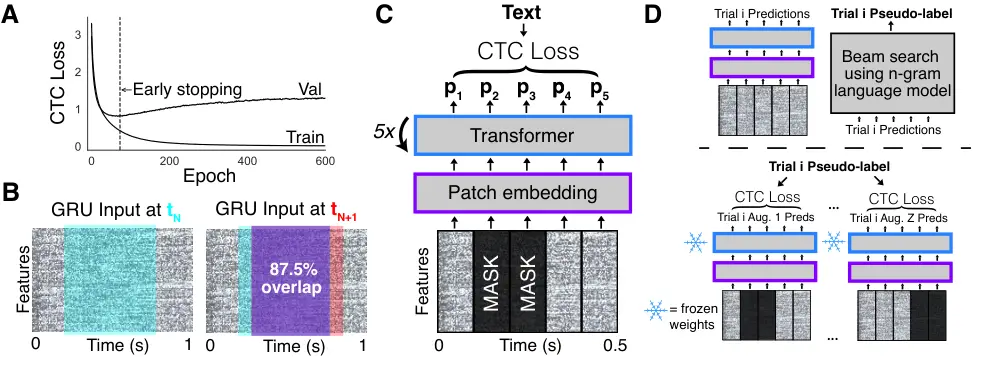

# Time-Masked Transformers with Lightweight Test-Time Adaptation for Neural Speech Decoding

Ebrahim Feghhi ^(†)^(†)thanks: Correspondence: ebrahimfeghhi@g.ucla.edu
Affiliation:  Neuroscience Interdepartmental Program Affiliation: 
Department of Electrical & Computer Engineering    Shreyas Kaasyap
Affiliation:  Department of Electrical & Computer Engineering    Nima
Hadidi Affiliation:  Neuroscience Interdepartmental Program
Affiliation:  Department of Electrical & Computer Engineering   
Jonathan C. Kao Affiliation:  Neuroscience Interdepartmental Program
Affiliation:  Department of Electrical & Computer Engineering
Affiliation:  Department of Computer ScienceUniversity of California,
Los Angeles

###### Abstract

Speech neuroprostheses aim to restore communication for people with
severe paralysis by decoding speech directly from neural activity. To
accelerate algorithmic progress, a recent benchmark released
intracranial recordings from a paralyzed participant attempting to
speak, along with a baseline decoding algorithm. Prior work on the
benchmark showed impressive accuracy gains. However, these gains
increased computational costs and were not demonstrated in a real-time
decoding setting. Here, we make three contributions that pave the way
towards accurate, efficient, and real-time neural speech decoding.
First, we incorporate large amounts of time-masking during training. On
average, over $`50\%`$ of each trial is masked. Second, we replace the
gated recurrent unit (GRU) architecture used in the baseline algorithm
with a compact Transformer. The Transformer architecture uses $`83\%`$
fewer parameters, cuts peak GPU memory usage by $`52\%`$, and is
significantly faster to calibrate relative to the GRU. Third, we design
a lightweight variant of an existing test-time adaptation method
developed for decoding handwriting from neural activity. Our variant
adapts the model using multiple time-masked augmentations of a single
trial and requires only one gradient step per trial. Together, these
contributions reduce word error rate by over $`20\%`$ and effectively
mitigate performance degradations across held-out days in a real-time
decoding setting while substantially lowering computational costs.

## 1 Introduction

Conditions including amyotrophic lateral sclerosis (ALS) and brainstem
stroke can lead to severe paralysis, leaving individuals unable to speak
or interact with the world. A promising path toward restoring
communication for these individuals is speech neuroprostheses, which
bypass the vocal apparatus and decode speech directly from neural
activity (35). Speech neuroprostheses have made significant strides in
recent years, demonstrating the ability to decode speech with high
accuracy over large vocabularies (41; 30; 9; 25).

To be viable in real-world clinical settings, decoding algorithms for
speech neuroprostheses should ideally satisfy several key criteria
beyond accuracy. First, they be able to operate in a real-time
"streaming" fashion, decoding speech with low-latency over short windows
rather than waiting for the entire utterance to finish (25). Second,
they should have low computational requirements to enable on-device
inference and adaptation (8), minimizing reliance on external
connections and preserving user privacy. Finally, decoding algorithms
should be easily integrated with test-time adaptation methods that
mitigate performance degradation across time (17).

To accelerate progress along these lines, the Brain-to-Text Benchmark
’24 was released, an open-source dataset containing intracortical neural
recordings while a participant with ALS attempted to speak sentences
across $`24`$ days. Along the with the dataset, the organizers provided
a baseline decoding algorithm which consisted of a gated recurrent unit
(GRU) architecture to decode neural activity into phonemes, followed by
beam search guided by an n-gram language model (LM) (41).

A recent summary report outlined the findings of the top four entries
submitted to the benchmark (42). Several entries replaced the GRU
architecture with Transformers, deep state space architectures, and
convolutional neural networks (CNNs), and found that none of these
architectures outperformed the baseline GRU. For example, the first
place entry reported that the phoneme error rate (PER) for Transformers
was more than double that of the baseline GRU (24). While researchers
found that using a learning rate scheduler, layer normalization (5), and
different optimization algorithms helped improve accuracy, the
modification that led to the largest improvement was "using an ensemble
of neural decoders to generate a diverse set of sentence hypotheses, and
then using a fine-tuned large language model (LLM) to merge these
hypotheses into a finalized sentence" (42), an idea that was first
implemented by (6) in the context of neural speech decoding.

Although the accuracy gains from prior work are remarkable, there are
several important caveats. First, the top four entries all used a
bidirectional GRU, which requires access to future neural activity and
therefore cannot decode speech in real-time. Furthermore, LLM merging
was only applied after the entire text was decoded, as applying it to
intermediate outputs is not straightforward. Second, some entries used
up to $`10`$ bidirectional GRUs and GPT 3.5, which makes inference and
test-time adaptation on local resource-constrained devices challenging.
Third, since the sentences used in the benchmark were from the publicly
available Switchboard corpus (2), it is possible LLMs were trained on
this corpus and so their contribution is overstated relative to
conversational settings. These points highlight how optimizing for a
single metric on machine learning benchmarks can lead to sacrifices
along other dimensions important for real-world use.

In this work, we aimed to holistically improve speech neuroprostheses by
focusing on multiple criteria: accuracy, capability for real-time
streaming, low computational costs, and robustness to distribution
shifts. In order to do so, we focused on improving the neural network
that translates neural activity into phonemes rather than external
language modeling components. Our improvements are based on two key
observations. First, the baseline GRU overfits early in training (Figure
1a). Second, the GRU processes highly redundant inputs at each time step
in order to achieve optimal performance: consecutive inputs are
$`87.5\%`$ overlapping when using the settings proposed by Willett
et al. (41) (Figure 1b), which we hypothesized is a source of
inefficiency.

Based on these observations, we proposed two modifications to the
baseline algorithm. First, in order to delay overfitting, we
incorporated time-masking which is a regularization strategy that masks
contiguous temporal chunks of the input neural activity during training
(Figure 1c) (32). Second, we replaced the GRU architecture with a
compact, unidirectional Transformer (Figure 1c) (38). We hypothesized
that the GRU requires overlapping inputs due to its lossy memory, which
may result in increased computational costs. Since Transformers have
perfect memory for a fixed context length, they are likely able to
efficiently processes non-overlapping inputs. To foreshadow the results,
the Transformer trained with time-masking (time-masked Transformer)
achieved a WER of $`12.17\%`$ with a 3-gram LM and $`8.18\%`$ with the
5-gram LM setup, which is $`20\%`$ and $`26\%`$ lower than the baseline
unidirectional GRU, respectively. The Transformer architecture also
substantially reduces parameter count, peak GPU memory usage, FLOPs, and
per-epoch training times.

We next leveraged the time-masked Transformers to improve upon the
test-time adaptation method created by Fan et al. (17) for handwriting
neuroprostheses. Their approach, Continual Online Recalibration with
Pseudo-labels (CORP), refines the text produced by a GRU-based model
with an n-gram LM, and then adapts the GRU to output the LM-refined text
during test-time. CORP utilizes multiple gradient steps per trial and
maintains previous data to enable adaptation. Here, we present
"DietCORP", a lightweight variant which enables test-time adaptation in
a single gradient step without storing previous data by leveraging
multiple time-masked augmentations of the same trial (Figure 1d). When
combined with the low memory requirements and fast training speeds of
the Transformer, DietCORP effectively adapts the model to distribution
shifts while requiring only $`1.3`$ GiB of peak GPU memory usage and
$`18`$ ms to adapt per trial.



Figure 1: A. The GRU exhibits pronounced overfitting when training for
long durations. Black dashed line indicates where training was stopped
for the baseline model. B. Adjacent input windows to the GRU overlap by
87.5% when using the optimal baseline hyperparameters (window length =
$`640`$ ms, stride = $`80`$ ms). C. We replaced the GRU with a
lightweight Transformer-based model. The Transformer takes as input
non-overlapping temporal patches of neural activity and outputs logits
(denoted as p\_(i)). Consecutive patches were replaced with a MASK token
during training, as denoted by dark coloring. We used the connectionist
temporal classification (CTC) loss. D. An overview of DietCORP. In the
top panel, the Transformer architecture is run in evaluation mode to
generate logits, and these logits are integrated with a language model
guided beam search to generate a pseudo-label. In the bottom panel, the
model is trained to produce the pseudo-label across $`Z`$ time-masked
augmentations with CTC loss. Only the patch embedding module is adapted
during this process.

## 2 Related Work

Although we found success with using a Transformer, Transformers are
typically not the architecture of choice for speech neuroprostheses or
brain computer interfaces (BCIs) more broadly. Willsey et al. (43) used
a convolutional neural network (CNN) to decode finger movements.
Costello et al. (12) followed up on this work, and showed that recurrent
neural networks (RNNs) achieve better finger movement decoding
performance than either CNNs or Transformers. The majority of speech
neuroprostheses have employed some combination of CNNs and RNNs (3; 37;
28; 40; 41; 30; 4; 9; 36; 25), although a few studies have used
Transformers (39; 11; 10). In the discussion of the Brain-to-Text
benchmark results, the authors speculated that the relatively poor
performance of Transformers may be attributed to the fact that 1) more
optimization is required or 2) phonemes are represented over short
context windows in neural activity, which suits GRUs because they
naturally implement a locality bias whereas Transformers are better
suited for modeling long-range dependencies (42).

Our Transformer architecture is most similar to that of Chen et al. (10)
in the BCI literature. Specifically, we also used relative positional
embeddings and temporal patches as input. However, each temporal patch
in our work consists of data from all electrodes, whereas Chen et al.
(10) assign each electrode to its own temporal patch. Assigning each
electrode to its own patch can substantially increase the context size,
and Chen et al. (10) use the Swin Transformer (26) to address this
challenge. Beyond model architecture, Chen et al. (10) displayed their
results on a closed-source dataset consisting of electrocorticographic
(ECoG) and depth electrodes (sEEG), and they translated neural activity
directly into speech. Our results are displayed using an open-source
dataset consisting of microelectrode array (MEA) recordings, and we
translated neural activity into text. Li et al. (24) also used
Transformers on the Brain-to-Text Benchmark ’24; however, to the best of
our knowledge the authors did not release sufficient details for
reproducing their Transformer results.

Structured input masking was initially popularized by Park et al. (32)
for automatic speech recognition (ASR). Within speech neuroprostheses,
Littlejohn et al. (25) masked entire channels and cropped each trial by
applying a temporal window. Metzger et al. (30); Metzger et al. (29)
applied a single temporal mask to each trial. The masking augmentations
used by Littlejohn et al. (25); Metzger et al. (30); Metzger et al. (29)
were primarily applied on close-sourced, ECoG datasets and mask a much
smaller percentage of the input than in this work. Furthermore, the
contribution of masking relative to other augmentations is not
emphasized in these works. Beyond speech neuroprostheses, Saeed et al.
(34); Ding et al. (15) applied structured input masking for EEG-based
BCIs, and Fu et al. (19) applied it for intracranial monkey BCIs.

DietCORP is most directly inspired by CORP (17). However, the idea to
use multiple augmentations, rather than previous data, for test-time
adaptation was inspired by Zhang et al. (46) and Yao et al. (44). Zhang
et al. (46) encouraged models to make consistent and confident (low
entropy) predictions across several augmentations of the same image at
test-time. Yao et al. (44) add a KL divergence loss term across two
time-masked versions of the same audio sample to the connectionist
temporal classification (CTC) (21) loss during training.

## 3 Methods

### 3.1 Neural Dataset

The Brain-to-Text ’24 benchmark dataset consists of microelectrode array
(MEA) recordings from the ventral premotor cortex (area $`6v`$) of a
single participant with ALS. Data was recorded from two microelectrode
arrays with $`64`$ channels each, a ventral $`6`$v array and a dorsal
$`6`$v array. Spike band power and threshold crossings were extracted
for each channel, leading to a total of $`256`$ features. Neural
activity was recorded while the patient attempted to speak
$`10`$,$`850`$ sentences. In each trial, the subject was shown a
sentence, and attempted to speak the sentence at the onset of the “go”
cue. All analyses were done on neural activity during the "go" phase
while the participant attempted to speak the sentence. The neural
activity was provided in $`20`$ ms time bins ($`50`$ Hz resolution), and
z-scored within each block ($`20`$-$`50`$ sentences). For additional
details, refer to (41).

### 3.2 Word error rate and phoneme error rate

We computed the word error rate (WER) as the Levenshtein (edit) distance
between the predicted and target word sequences, normalized by the total
number of words in the target. Formally, WER is defined as

```math
WER=\frac{S+D+I}{N}
```

where $`S`$, $`D`$, and $`I`$ denote the number of substitutions,
deletions, and insertions, respectively, and $`N`$ is the total number
of words in the target transcription. Similarly, the phoneme error rate
(PER) was computed in the same manner but at the level of phonemes
rather than words. We applied an n-gram guided beam search process when
computing WER (Section E), and computed PER using greedy decoding.

### 3.3 Train, validation, and test splits

The benchmark provided train, validation, and test splits. There were
$`8800`$ sentences in train, $`880`$ sentences in validation, and
$`1200`$ sentences in test. Train and validation sentences were recorded
on $`24`$ days (collected over almost $`4`$ months), and test sentences
were recorded on $`15`$ out of the $`24`$ days. We refer to the days
with testing data as "competition" days. All hyperparameter tuning was
performed on the validation set, and the validation set was not used for
training after hyperparameter tuning for the main results (Section 4.1,
4.2). For DietCORP (Section 4.3), we were interested in evaluating its
effectiveness on days with no training data. Since the original splits
contained training data for all days, we modified the splits by holding
out $`5`$ or $`8`$ competition days entirely from the training set. To
evaluate performance, we used the original training and validation data
from these held-out days as our new test set since the competition
platform does not allow for evaluating WER on a subset of the
competition days. We used all data from the preceding days for training.

### 3.4 Baseline gated recurrent unit-based model

The dataset was accompanied by a baseline gated recurrent unit
(GRU)-based model. This model first passed the input features (spike
band power and threshold crossings) through a day-specific linear layer
followed by a softsign non-linearity, which served to account for
day-specific differences in neural activity. At each step, the GRU
received a vector of these day-transformed inputs with dimension
$`F\cdot T_{in}`$, where $`F`$ is the number of features ($`256`$) and
$`T_{in}`$ (the window length) is the number of neural time bins. The
model consisted of $`5`$ GRU layers. The hidden state of the final layer
was passed through a linear layer to produce logits over phonemes, the
CTC blank token, and a silence token. Logits were output every
$`T_{out}`$ (stride length) steps. For optimal performance, the baseline
algorithm set $`T_{in}=32`$ and $`T_{out}=4`$, resulting in an
$`87.5\%`$ overlap between consecutive inputs.

We followed the same training procedures as listed in the Pytorch
codebase provided by Willett et al. (41) for the baseline GRU model.
Specifically, we used the Adam optimizer (22) and connectionist temporal
classification (CTC) loss (21). During training, white noise and
baseline shift augmentations were added to the neural activity, followed
by causal Gaussian smoothing. Training was performed for $`10{,}000`$
batches ($`\sim 73`$ epochs). The full set of hyperparameters is listed
in Table 5. We used a unidirectional GRU for all results unless
otherwise stated.

### 3.5 Transformer-based model

Inspired by Dosovitskiy et al. (16) and Chen et al. (10), we replaced
the GRU architecture with a Transformer. We segmented the input neural
data into non-overlapping temporal patches, each consisting of
$`T_{in}`$ time bins and all ($`256`$) features. $`T_{in}`$ was set to
$`5`$, such that each patch captured $`100`$ ms of neural activity. Each
patch was then flattened into a $`F\cdot T_{in}`$ ($`F`$ is the number
of neural features) dimensional vector and passed through a patch
embedding module, consisting of the following layers in sequence:
LayerNorm (5), Linear, and LayerNorm. The linear layer projected the
patches from $`F\cdot T_{in}`$ to the transformer hidden dimension size.
Time-masking (Section 3.6) and input dropout was applied to the output
of the patch embedding module, followed by $`L`$ Transformer blocks
($`L=5`$). Each Transformer block comprised a self-attention layer
followed by a feed-forward network. We applied LayerNorm before the
self-attention layer, and the feed-forward network included the
following layers in sequence: LayerNorm, Linear, GeLU activation,
Dropout, Linear, and Dropout. Residual connections were added around
both the self-attention layer and the feed-forward network.

We used relative positional embeddings similar to the T5 architecture
(33). Specifically, we added a learned bias to the attention scores
based on the relative distance between two patches. A causal attention
mask was also used to ensure that each patch could only attend to itself
and previous patches. The attention operation was then defined as:

```math
\textrm{Attention}(\mathbf{Q},\mathbf{K},\mathbf{V})=\textrm{softmax}\left(\frac{\mathbf{Q}\mathbf{K}^{\top}}{\sqrt{d}}+\mathbf{B}+\mathbf{M}\right)\mathbf{V}
```

where $`\mathbf{B}_{i,j}=\mathbf{b}(i-j)`$, and
$`\mathbf{b}\in\mathbb{R}^{2L-1}`$ was a learnable vector containing
scalar bias values for each possible relative position. The index
$`(i-j)`$ represents the relative distance between query position $`i`$
and key position $`j`$, allowing attention scores to incorporate
relative position information up to a maximum absolute distance of
$`L-1`$. The matrix $`\mathbf{M}`$ was the causal attention mask,
defined as:

```math
\mathbf{M}_{i,j}=\begin{cases}0&\text{if }j\leq i\\
-\infty&\text{otherwise}\end{cases}
```

The outputs of the causal Transformer were passed through a final
LayerNorm followed by an output linear layer to obtain logits over
phonemes, the CTC blank token, and silence token. Logits were output
every $`T_{out}`$ time bins, and we set $`T_{out}=5`$.

When training the Transformer, we applied a log-transformation to the
neural data before z-score normalization and trained for $`250`$ epochs.
We also used a learning rate scheduler, where we decreased the learning
rate by a factor of $`10`$ after $`150`$ epochs. Training was performed
with the AdamW optimizer (27) and CTC loss, and we also applied white
noise and baseline shift augmentations followed by causal gaussian
smoothing. The full set of Transformer hyperparameters is listed in
Table 6. The code used for the Transformer model is largely based on the
following GitHub repository:
[vit-pytorch](https://github.com/FrancoisPorcher/vit-pytorch).

### 3.6 Time-masking

Input: Trial $`\mathbf{x}\in\mathbb{R}^{L\times C}`$ ( $`L`$ patches,
$`C`$ features);

$`N`$ — number of masks;

$`M`$ — max-mask length as a fraction of trial length ($`0<M\leq 1`$)

Output: Masked trial $`\tilde{\mathbf{x}}`$

$`F\leftarrow\lfloor M\cdot L\rfloor`$ ; // maximum mask length

for _$`k\textbf{ in }1{:}N`$_ do

   $`S\sim\mathcal{U}(0,\,L-F)`$ ; // start index

   $`D\sim\mathcal{U}(0,\,F)`$ ; // mask length

   $`\mathbf{x}[S:S+D]\leftarrow\textsc{Learnable-mask token}`$

return $`\tilde{\mathbf{x}}`$

Algorithm 1 TimeMask$`(\mathbf{x},N,M)`$

We performed time-masking by masking several contiguous temporal patches
(Transformer) or time bins (GRU) of each trial. The rationale for
applying contiguous masking in addition to input dropout is that input
dropout does not mask contiguous input chunks, and is therefore likely a
weaker form of regularization. A description of the time-masking
algorithm is provided in Algorithm 1 for the Transformer. For the
time-masked GRU, all details are identical except masking was applied at
the time bin level, and masked bins were replaced with $`0`$ rather than
a special MASK token. We do not enforce time-masks to be
non-overlapping.

For all analyses, we set $`N=20`$ (number of masks) and $`M=0.075`$ (max
mask length as a fraction of trial length). Under these settings
$`53\%`$ of a trial is masked out on average (Section J). We report
performance with other hyperparameters in Section I.

### 3.7 DietCORP

For each trial, we generated a "pseudo-label" by applying language model
guided beam search (Section E) to the model predictions, as done in CORP
(17). "Pseudo-label" generation is already performed for real-world use,
and so it does not incur additional computational costs. In CORP, the
pseudo-label is combined with labeled training data as well as
previously generated pseudo-labeled data to update model weights with
CTC loss until either the loss decreases below a threshold or $`200`$
gradient steps are completed. DietCORP reduces computational costs and
complexity by eliminating the need to store previous data and performing
adaptation with one gradient step per trial. This is done by adapting
the model across $`Z`$ augmentations of the same trial. Model weights
are not reset across trials (i.e., calibration is continuous), as done
in CORP.

When applying DietCORP, we only updated the patch embedding module
because 1) neural distribution shifts across days are likely a form of
input distribution shift (as opposed to feature or output distribution
shifts) and selectively fine-tuning input layers is effective when
dealing with input distribution shifts (23), and 2) test-time adaptation
can rapidly degrade when adapting the entire model (23). Augmented
trials were generated by creating $`Z`$ copies of a given trial, and
applying white noise, baseline shift, and time-masking to each copy.
Time-masking served as the main form of augmentation. We set $`Z=64`$
since this was the batch size used for training, although DietCORP was
robust to lower values of $`Z`$ as discussed in the results. All
hyperparameters were set to the values used during training. The
learning rate was set to the mean of the learning rate before and after
the learning rate step decay was applied, which was $`5e-4`$. We
additionally clipped the gradient norm, as done in CORP, to $`0.5`$.

## 4 Results

### 4.1 Comparison with baseline unidirectional GRU

We first compared the causal Transformer trained with time-masking
(Section 3.5, 3.6), or time-masked Transformer, with the baseline
unidirectional GRU model, or baseline GRU (Section 3.4). When using the
3-gram language model (LM) (Section E), the time-masked Transformer
achieved a word error rate (WER) that was $`3.08`$ absolute percentage
points better than the baseline GRU (or a $`20.2\%`$ relative
improvement), which was a significant decrease ($`p<0.05`$; one-sided
independent t-test across $`10`$ seeds) (Table 1). When using the
stronger 5-gram LM setup, with an additional second-pass rescoring using
an unpruned LM and large language model (LLM) (Section E), the
time-masked Transformer performed $`2.94`$ absolute percentage points
better than the baseline GRU (or a $`26.4\%`$ relative improvement)
($`p<0.05`$; one-sided independent t-test across $`N=10`$ seeds) (Table
1). This is to our knowledge the largest improvement in accuracy over
the baseline GRU on this neural dataset when using a streaming
compatible architecture.

Beyond gains in accuracy, the time-masked Transformer also substantially
reduced computational costs relative to the baseline GRU. The
Transformer used $`83\%`$ fewer parameters, cut peak GPU memory usage by
$`52\%`$, reduced mega floating pointing operations (mFLOPs) by $`43\%`$
(Section C), while shortening per-epoch training times by $`58\%`$
(Table 2). These efficiency gains make the Transformer architecture
well-suited for on-device test-time adaptation (8) and motivate the
experiments in Section 4.3. We also observed that beam search decoding
times, measured after producing logits, were approximately $`3`$ times
faster when using the time-masked Transformer relative to the baseline
model (Section H). Furthermore, the Transformer does not require
day-specific parameters unlike the baseline GRU, which we speculate is
due to the layer normalization layers in the patch embedding module.

|                                         |                   |                   |                           |     |
| --------------------------------------- | ----------------- | ----------------- | ------------------------- | --- |
| Model                                   | 3-gram LM Setup   | 5-gram LM Setup   | Fine-tuned LLM            |     |
| Baseline Unidirectional GRU             | $`15.25\pm 0.16`$ | $`11.12\pm 0.13`$ | —                         |     |
| Time-Masked Causal Transformer          | $`12.17\pm 0.22`$ | $`8.18\pm 0.22`$  | $`5.68`$ w/ Llama 3.1 8B  |     |
| Linderman Lab Bidirectional GRU         | —                 | $`8.0`$           | —                         |     |
| Diphone Decoding with Bidirectional GRU | —                 | $`8.39\pm 0.22`$  | $`5.77`$ w/ GPT 3.5       |     |
|                                         |                   |                   | $`6.85`$ w/ Llama 3.1 70B |     |

Table 1: Performance comparison using different language modeling
setups. The values represent word error rates (WER) as a percentage
(mean $`\pm`$ SEM across seeds). An em dash (—) denotes settings that
were not evaluated. Values for the Linderman Lab and diphone decoding
models are provided by the original authors. Results are reported across
$`10`$ seeds except for the "Fine-tuned LLMs" setting ($`N=1`$), diphone
decoding with the 5-gram LM setup ($`N=5`$), and Linderman Lab GRU
($`N=1`$).

| Model              | Parameters (M) | Peak memory (GiB) | MFLOPS      | Epoch time (s)    |
| ------------------ | -------------- | ----------------- | ----------- | ----------------- |
| Bidirectional GRU  | $`135.4`$      | $`11.21`$         | $`1563.29`$ | $`55.63\pm 0.69`$ |
| Unidirectional GRU | $`56.7`$       | $`5.55`$          | $`634.81`$  | $`25.88\pm 0.55`$ |
| Causal Transformer | $`9.4`$        | $`2.66`$          | $`364.2`$   | $`10.81\pm 0.17`$ |

Table 2: Values are reported using a Nvidia GeForce RTX 3090 GPU. Epoch
time is reported as mean $`\pm`$ standard deviation ($`N=1200`$). MFLOPS
stands for mega floating point operations per second.

### 4.2 Comparison against top-performing benchmark entries

We next compared the time-masked Transformer with two of the
top-performing, entries in the Brain-to-Text Benchmark ’24: the
Linderman Lab bidirectional GRU (Section F) (42) and diphone decoding
with a bidirectional GRU (24). Both these entries are not streaming
compatible, and we used the WER values provided by the original authors.
When using the 5-gram LM, there was no significant difference in
performance between either the time-masked Transformer ($`N=10`$ seeds)
and the Linderman Lab GRU ($`N=1`$ seed) ($`p>0.05`$; one-sample t-test)
or the time-masked Transformer and the diphone decoding approach
($`N=5`$ seeds) ($`p>0.05`$; independent t-test).

We next evaluated the time-masked Transformer with the "Fine-tuned LLM"
setup (Section G), which involved fine-tuning an LLM to correct the
outputs of an ensemble of models. We fine-tuned Llama 3.1 8B (20) on the
outputs of $`10`$ seeds of the causal time-masked Transformer. The
Transformer + Llama 3.1 8B combination performed on-par with the best
performing entry in Willett et al. (42), specifically the diphone
decoding GRU + GPT 3.5 (7) or Llama 3.1 70B (Table 1).

Beyond accuracy, the Transformer architecture provides large gains in
computational efficiency over the bidirectional GRU (Table 2), and we
used a smaller, open-source LLM (Llama 3.1 8B) relative to previous
entries that used either GPT 3.5, which is not open-source, or Llama 3.1
70B (6; 24).

### 4.3 Test-time adaptation across held-out days

Figure 2: Results are for the time-masked Transformer with a 3-gram LM.
Points show the mean over four seeds; shading indicates $`\pm`$SEM. A.
WER across five held-out days without adaptation and with DietCORP. B.
Same as panel A with evaluation on eight held-out days. C. Average WER
across held-out days as a function of the number of augmentations used
by DietCORP. Green points are when using DietCORP; the purple dashed
line is when no adaptation is performed. Lower curves correspond to five
held-out days, upper curves to eight held-out days.

| Model                   | Peak memory (GiB) | Adaptation time (ms) |
| ----------------------- | ----------------- | -------------------- |
| Time-masked Transformer | $`1.33`$          | $`18.21\pm 5.34`$    |
| Baseline GRU            | $`2.91`$          | $`28.44\pm 8.33`$    |

Table 3: Metrics were collected on an NVIDIA GeForce RTX $`3090`$ over
$`2040`$ trials. Peak memory is the highest GPU memory recorded during
DietCORP calibration across all trials. Adaptation time (reported as
mean $`\pm`$ SD) is the time needed to update the model on a single
trial with DietCORP. Only the patch-embedding layer was trainable for
the Transformer; for a fair comparison, only the day-specific linear
layer was trainable for the baseline GRU.

We next used the lightweight Transformer architecture to perform
test-time adaptation (TTA) with DietCORP. In brief, DietCORP adapts the
decoder to predict LM-refined pseudolabels (with the 3-gram LM) using
multiple augmented versions of the current trial. DietCORP only requires
one gradient step per trial and minimal hyperparameter tuning (Section
3.7). We applied DietCORP under two settings in which entire days were
held-out from the training set: training on $`15`$ days and testing on
the next $`5`$ competition days, and a more challenging setting where we
trained on $`12`$ days and tested on the next $`8`$ competition days. In
both cases, we compared performance on the held-out competition days
when applying DietCORP versus when no TTA method was applied.

When training on $`15`$ days, there was a substantial rise in WER across
the $`5`$ held-out competition days when no TTA method was applied,
starting from a WER of $`22.74\pm 0.30\%`$ (mean $`\pm`$ SEM across
$`N=4`$ seeds) on the first day and rising to a WER of
$`32.58\pm 0.60\%`$ by the fifth day. By contrast, when applying
DietCORP the increase in WER was substantially smaller, beginning at
$`21.24\pm 0.29`$ and increasing to $`22.97\pm 0.72\%`$ across the five
days (Figure 2a). Under the more challenging evaluation setting, WER
rose from $`28.87\pm 0.54\%`$ to $`66.47\pm 0.67\%`$ across the eight
held-out days when no TTA was applied. DietCORP again substantially
ameliorated the deterioration in performance, with WER ranging from
$`26.32\pm 0.32\%`$ to $`31.74\pm 1.41\%`$ across held-out days
(Figure 2b).

We next evaluated how DietCORP’s benefit scales with the number of
time-masked augmentations. Reducing the augmentation count progressively
diminished its impact, supporting the idea that adaptation across
multiple augmentations of the same trial helps buffer against test-time
distribution shifts (46) (Figure 2c). Nevertheless, DietCORP still
outperformed the no adaptation setting even when using only a single
augmentation, indicating that there are still benefits when using a low
number of augmentations. We finally quantified the memory requirements
and adaptation times for DietCORP. When using the Transformer, DietCORP
required $`18`$ ms per trial and its peak memory usage was $`1.3`$ GiB
(Table 3). Applying DietCORP to the baseline GRU increased adaptation
times by $`56\%`$ and peak memory usage by $`118\%`$, underscoring the
benefit of the Transformer for on-device test-time adaptation.

### 4.4 Ablations to the time-masked Transformer

We conducted an ablation study to isolate the contributions of each
component in our time-masked Transformer model (Table 4). All ablation
results are reported on the validation set with a 3-gram LM. First, we
removed two components from our training pipeline for the time-masked
Transformer: the neural data log-transformation and the learning rate
scheduler (Section 3.5). Removing either component independently
increased the WER by $`4\%`$ relative to the original model. Next, we
replaced the T5-style relative positional embeddings (Section 3.5) with
absolute sinusoidal embeddings used in prior BCI studies (12). This
change resulted in a $`10\%`$ WER increase, suggesting that relative
positional information is important for focusing on local features
relevant to phoneme decoding. We next removed time-masking, and restored
regularization hyperparameters (dropout, input dropout, white noise,
baseline shift) to the baseline levels used for the GRU (Table 5).
Removing time-masking increased WER by $`18\%`$. Since the Transformer
model without time-masking was trained for $`250`$ epochs, this
indicates that the performance benefits of the time-masked Transformer
over the baseline GRU (which was trained for $`73`$ epochs) cannot be
attributed to extended training time alone. Finally, we replaced the
Transformer architecture with the GRU architecture. When training the
time-masked GRU, we used the same regularization hyperparameters as the
time-masked Transformer (Table 6) and trained for $`250`$ epochs. The
time-masked GRU only performed $`4\%`$ worse, whereas the baseline GRU
performed $`20\%`$ worse, than the time-masked Transformer suggesting
that time-masking is a generally useful augmentation for neural speech
decoding across network architectures.

### 4.5 Optimizing the time-masked GRU with non-overlapping inputs

Results from the ablation study suggest that the time-masked GRU
performs competitively with the time-masked Transformer. However, a key
benefit of the Transformer is that it requires lower memory resources
and is faster to calibrate. We hypothesized that the computational
efficiency benefits of the Transformer are related to its ability to
effectively process non-overlapping inputs, reducing processing
redundancy. While prior work showed the baseline GRU performs optimally
with overlapping inputs (41), we tested if this was also the case for
the time-masked GRU. To investigate this, we trained the time-masked GRU
with non-overlapping inputs by setting both the window length and stride
length to $`80`$ms (Section 3.4). We observed that performance was
significantly worse with non-overlapping inputs, with validation WER
when using a 3-gram LM increasing from $`17.85\pm 0.13\%`$ to
$`19.66\pm 0.14\%`$ ($`p<0.05`$; two-sided independent t-test, $`N=4`$
seeds). To account for the possibility that a smaller hidden state would
be more optimal with the smaller, non-overlapping inputs, we lowered the
hidden state size from $`1024`$ to $`768`$ or $`512`$, but this further
worsened performance. Thus, consistent with Willett et al. (41), our
results suggest that the GRU performs optimally with overlapping inputs
even with time-masking. We leave it to future work to further
investigate whether a smaller GRU architecture can perform competitively
with the Transformer.

| Ablation                        | Validation WER (%) |
| ------------------------------- | ------------------ |
| Time-masked Transformer         | $`17.15\pm 0.15`$  |
| No Log Transform                | $`17.85\pm 0.15`$  |
| No Learning Rate Scheduler      | $`17.85\pm 0.21`$  |
| No T5 Positional Encoding       | $`18.89\pm 0.06`$  |
| No Time-Masking                 | $`20.17\pm 0.2`$   |
| Transformer $`\rightarrow`$ GRU | $`17.85\pm 0.12`$  |

Table 4: Ablation study results for the Time-Masked Causal Transformer.
Values represent word error rates (WER) on the validation data with a
3-gram LM as a percentage (mean $`\pm`$ SEM across seeds). $`10`$ seeds
were run for the original model, and $`4`$ seeds were run for the
ablations.

## 5 Discussion

There are three noteworthy limitations to our results. First, all
results are on a single participant. At the time of writing this
manuscript, there were no other open-source microelectrode array
datasets for speech neuroprostheses, and evaluation on one participant
is standard of the field. However, it is still important to evaluate the
effectiveness of time-masked Transformers and DietCORP across multiple
participants. Second, our use of beam search allows previously decoded
text to be revised, which complicates integration with text-to-speech
systems and may also provide a suboptimal experience for users if
textual revisions are significant. Third, even the smallest language
modeling setup used in this study, the 3-gram LM, requires about
$`\sim 60`$ GB of CPU memory to operate. Such a large memory requirement
makes it challenging to run the current decoding algorithm on local,
resource-constrained devices.

In summary, this work delivers three practical advances for the
Brain-to-Text Benchmark ’24 and, more broadly, for the development of
speech neuroprostheses. First, we showed that large amounts of
time-masking serves as a highly effective data augmentation method for
improving neural speech decoding accuracy. Second, replacing the
baseline GRU with a Transformer provides substantial reductions in
computational costs, making the Transformer an ideal architecture for
on-device test-time adaptation. Third, we introduced DietCORP, a simple,
lightweight, and fast method that utilizes multiple time-masked
augmentations of the same trial to effectively adapt the Transformer at
test-time. Together, these innovations lower word error rate while
cutting resource demands, moving us closer to building robust, on-device
speech neuroprostheses that restore fluent communication for patients
with severe paralysis.

There are several exciting avenues for further improving speech
neuroprostheses. First, future research can investigate avenues to
reduce memory costs associated with the n-gram LM or explore alternative
strategies to integrate text-based knowledge. For instance, Feng et al.
(18) and a recent study (1) project the outputs of a GRU or Transformer
to the token space of an LLM for text decoding, obviating the need for
the n-gram LM. Second, a recent trend in automatic speech recognition is
to build a single model that can operate in both streaming and
non-streaming modes (45). Such an approach could be useful for speech
neuroprostheses, since the user may have different preferences for
accuracy versus latency depending on the context. Third, as more
microelectrode array datasets are released, an emerging research
question is whether integrating microelectrode array recordings across
multiple participants can be used to boost performance. This question
has been explored with other neural recording modalities (10). Finally,
future work should explore achieving similar accuracy levels without
using beam search, so that previous outputs cannot be revised for easier
integration with text-to-speech systems (25).

We hope that our study encourages future speech neuroprostheses
benchmarks, such as the Brain-to-Text Benchmark ’25, to offer a more
holistic evaluation criteria for decoding algorithms beyond only
accuracy. By evaluating decoding algorithms along multiple criteria such
as ability to decode in real-time, computational costs, and integration
with existing test-time adaptation methods, these benchmarks can more
effectively spur innovation and assist paralyzed patients with
communication impairments.

## Acknowledgements

This work was supported by the following awards. To JCK: NSF CAREER
1943467, NIH DP2NS122037, NIH R01NS121097. To EF: NIH T32NS115753.

## References

- \[1\] Decoding inner speech with an end-to-end brain-to-text neural
  interface.
  [https://openreview.net/pdf?id=Lp1noMpMUG](https://openreview.net/pdf?id=Lp1noMpMUG).
  Accessed: 2025-11-2.
- \[2\] Switchboard-1 release 2.
  [https://catalog.ldc.upenn.edu/LDC97S62](https://catalog.ldc.upenn.edu/LDC97S62).
  Accessed: 2025-5-16.
- Angrick et al. \[2019\] Miguel Angrick, Christian Herff, Emily Mugler,
  Matthew C Tate, Marc W Slutzky, Dean J Krusienski, and Tanja Schultz.
  Speech synthesis from ECoG using densely connected 3D convolutional
  neural networks. _J. Neural Eng._, 16(3):036019, June 2019.
- Angrick et al. \[2024\] Miguel Angrick, Shiyu Luo, Qinwan Rabbani,
  Daniel N Candrea, Samyak Shah, Griffin W Milsap, William S Anderson,
  Chad R Gordon, Kathryn R Rosenblatt, Lora Clawson, Donna C Tippett,
  Nicholas Maragakis, Francesco V Tenore, Matthew S Fifer, Hynek
  Hermansky, Nick F Ramsey, and Nathan E Crone. Online speech synthesis
  using a chronically implanted brain-computer interface in an
  individual with ALS. _Sci. Rep._, 14(1):9617, April 2024.
- Ba et al. \[2016\] Jimmy Lei Ba, Jamie Ryan Kiros, and Geoffrey E
  Hinton. Layer normalization. _arXiv \[stat.ML\]_, July 2016.
- Benster et al. \[2024\] Tyler Benster, Guy Wilson, Reshef Elisha,
  Francis R Willett, and Shaul Druckmann. A cross-modal approach to
  silent speech with LLM-enhanced recognition. _arXiv \[cs.HC\]_,
  March 2024.
- Brown et al. \[2020\] Tom B Brown, Benjamin Mann, Nick Ryder, Melanie
  Subbiah, Jared Kaplan, Prafulla Dhariwal, Arvind Neelakantan, Pranav
  Shyam, Girish Sastry, Amanda Askell, Sandhini Agarwal, Ariel
  Herbert-Voss, Gretchen Krueger, Tom Henighan, Rewon Child, Aditya
  Ramesh, Daniel M Ziegler, Jeffrey Wu, Clemens Winter, Christopher
  Hesse, Mark Chen, Eric Sigler, Mateusz Litwin, Scott Gray, Benjamin
  Chess, Jack Clark, Christopher Berner, Sam McCandlish, Alec Radford,
  Ilya Sutskever, and Dario Amodei. Language models are few-shot
  learners. _arXiv \[cs.CL\]_, May 2020.
- Cai et al. \[2020\] Han Cai, Chuang Gan, Ligeng Zhu, and Song Han.
  TinyTL: Reduce memory, not parameters for efficient on-device
  learning. _Neural Inf Process Syst_, 33:11285–11297, July 2020.
- Card et al. \[2024\] Nicholas S Card, Maitreyee Wairagkar, Carrina
  Iacobacci, Xianda Hou, Tyler Singer-Clark, Francis R Willett, Erin M
  Kunz, Chaofei Fan, Maryam Vahdati Nia, Darrel R Deo, Aparna
  Srinivasan, Eun Young Choi, Matthew F Glasser, Leigh R Hochberg,
  Jaimie M Henderson, Kiarash Shahlaie, Sergey D Stavisky, and David M
  Brandman. An accurate and rapidly calibrating speech neuroprosthesis.
  _N. Engl. J. Med._, 391(7):609–618, August 2024.
- Chen et al. \[2025\] Junbo Chen, Xupeng Chen, Ran Wang, Chenqian Le,
  Amirhossein Khalilian-Gourtani, Erika Jensen, Patricia Dugan, Werner
  Doyle, Orrin Devinsky, Daniel Friedman, Adeen Flinker, and Yao Wang.
  Transformer-based neural speech decoding from surface and depth
  electrode signals. _J. Neural Eng._, 22(1), January 2025.
- Chen et al. \[2024\] Xupeng Chen, Ran Wang, Amirhossein
  Khalilian-Gourtani, Leyao Yu, Patricia Dugan, Daniel Friedman, Werner
  Doyle, Orrin Devinsky, Yao Wang, and Adeen Flinker. A neural speech
  decoding framework leveraging deep learning and speech synthesis.
  _Nat. Mach. Intell._, 6(4):467–480, April 2024.
- Costello et al. \[2023\] Joseph T Costello, Hisham Temmar, Luis H
  Cubillos, Matthew J Mender, Dylan M Wallace, Matthew S Willsey,
  Parag G Patil, and Cynthia A Chestek. Balancing memorization and
  generalization in RNNs for high performance brain-machine interfaces.
  _bioRxivorg_, May 2023.
- Daniel Han and team \[2023\] Michael Han Daniel Han and Unsloth team.
  Unsloth, 2023. URL
  [http://github.com/unslothai/unsloth](http://github.com/unslothai/unsloth).
- Dettmers et al. \[2023\] Tim Dettmers, Artidoro Pagnoni, Ari Holtzman,
  and Luke Zettlemoyer. QLoRA: Efficient finetuning of quantized LLMs.
  _arXiv \[cs.LG\]_, May 2023.
- Ding et al. \[2024\] Wenlong Ding, Aiping Liu, Ling Guan, and Xun
  Chen. A novel data augmentation approach using mask encoding for deep
  learning-based asynchronous SSVEP-BCI. _IEEE Trans. Neural Syst.
  Rehabil. Eng._, 32:875–886, February 2024.
- Dosovitskiy et al. \[2020\] Alexey Dosovitskiy, Lucas Beyer, Alexander
  Kolesnikov, Dirk Weissenborn, Xiaohua Zhai, Thomas Unterthiner,
  Mostafa Dehghani, Matthias Minderer, Georg Heigold, Sylvain Gelly,
  Jakob Uszkoreit, and Neil Houlsby. An image is worth 16x16 words:
  Transformers for image recognition at scale. _arXiv \[cs.CV\]_,
  October 2020.
- Fan et al. \[2023\] Chaofei Fan, Nick Hahn, Foram Kamdar, Donald
  Avansino, Guy H Wilson, Leigh Hochberg, Krishna V Shenoy, Jaimie M
  Henderson, and Francis R Willett. Plug-and-play stability for
  intracortical brain-computer interfaces: A one-year demonstration of
  seamless brain-to-text communication. _Adv. Neural Inf. Process.
  Syst._, 36:42258–42270, December 2023.
- Feng et al. \[2024\] Sheng Feng, Heyang Liu, Yu Wang, and Yanfeng
  Wang. Towards an end-to-end framework for invasive brain signal
  decoding with large language models. In _Interspeech 2024_, pages
  1495–1499, ISCA, September 2024. ISCA.
- Fu et al. \[2024\] Haotian Fu, Peng Zhang, Song Yang, Herui Zhang,
  Ziwei Wang, and Dongrui Wu. Effective and efficient intracortical
  brain signal decoding with spiking neural networks. _arXiv \[cs.HC\]_,
  December 2024.
- Grattafiori et al. \[2024\] Aaron Grattafiori, Abhimanyu Dubey,
  Abhinav Jauhri, Abhinav Pandey, Abhishek Kadian, Ahmad Al-Dahle,
  Aiesha Letman, Akhil Mathur, Alan Schelten, Alex Vaughan, Amy Yang,
  Angela Fan, Anirudh Goyal, Anthony Hartshorn, Aobo Yang, Archi Mitra,
  Archie Sravankumar, Artem Korenev, Arthur Hinsvark, Arun Rao, Aston
  Zhang, Aurelien Rodriguez, Austen Gregerson, Ava Spataru, Baptiste
  Roziere, Bethany Biron, Binh Tang, Bobbie Chern, Charlotte Caucheteux,
  Chaya Nayak, Chloe Bi, Chris Marra, Chris McConnell, Christian Keller,
  Christophe Touret, Chunyang Wu, Corinne Wong, Cristian Canton Ferrer,
  Cyrus Nikolaidis, Damien Allonsius, Daniel Song, Danielle Pintz, Danny
  Livshits, Danny Wyatt, David Esiobu, Dhruv Choudhary, Dhruv Mahajan,
  Diego Garcia-Olano, Diego Perino, Dieuwke Hupkes, Egor Lakomkin, Ehab
  AlBadawy, Elina Lobanova, Emily Dinan, Eric Michael Smith, Filip
  Radenovic, Francisco Guzmán, Frank Zhang, Gabriel Synnaeve, Gabrielle
  Lee, Georgia Lewis Anderson, Govind Thattai, Graeme Nail, Gregoire
  Mialon, Guan Pang, Guillem Cucurell, Hailey Nguyen, Hannah Korevaar,
  Hu Xu, Hugo Touvron, Iliyan Zarov, Imanol Arrieta Ibarra, Isabel
  Kloumann, Ishan Misra, Ivan Evtimov, Jack Zhang, Jade Copet, Jaewon
  Lee, Jan Geffert, Jana Vranes, Jason Park, Jay Mahadeokar, Jeet Shah,
  Jelmer van der Linde, Jennifer Billock, Jenny Hong, Jenya Lee, Jeremy
  Fu, Jianfeng Chi, Jianyu Huang, Jiawen Liu, Jie Wang, Jiecao Yu,
  Joanna Bitton, Joe Spisak, Jongsoo Park, Joseph Rocca, Joshua
  Johnstun, Joshua Saxe, Junteng Jia, Kalyan Vasuden Alwala, Karthik
  Prasad, Kartikeya Upasani, Kate Plawiak, Ke Li, Kenneth Heafield,
  Kevin Stone, Khalid El-Arini, Krithika Iyer, Kshitiz Malik, Kuenley
  Chiu, Kunal Bhalla, Kushal Lakhotia, Lauren Rantala-Yeary, Laurens
  van der Maaten, Lawrence Chen, Liang Tan, Liz Jenkins, Louis Martin,
  Lovish Madaan, Lubo Malo, Lukas Blecher, Lukas Landzaat, Luke
  de Oliveira, Madeline Muzzi, Mahesh Pasupuleti, Mannat Singh, Manohar
  Paluri, Marcin Kardas, Maria Tsimpoukelli, Mathew Oldham, Mathieu
  Rita, Maya Pavlova, Melanie Kambadur, Mike Lewis, Min Si, Mitesh Kumar
  Singh, Mona Hassan, Naman Goyal, Narjes Torabi, Nikolay Bashlykov,
  Nikolay Bogoychev, Niladri Chatterji, Ning Zhang, Olivier Duchenne,
  Onur Çelebi, Patrick Alrassy, Pengchuan Zhang, Pengwei Li, Petar
  Vasic, Peter Weng, Prajjwal Bhargava, Pratik Dubal, Praveen Krishnan,
  Punit Singh Koura, Puxin Xu, Qing He, Qingxiao Dong, Ragavan
  Srinivasan, Raj Ganapathy, Ramon Calderer, Ricardo Silveira Cabral,
  Robert Stojnic, Roberta Raileanu, Rohan Maheswari, Rohit Girdhar,
  Rohit Patel, Romain Sauvestre, Ronnie Polidoro, Roshan Sumbaly, Ross
  Taylor, Ruan Silva, Rui Hou, Rui Wang, Saghar Hosseini, Sahana
  Chennabasappa, Sanjay Singh, Sean Bell, Seohyun Sonia Kim, Sergey
  Edunov, Shaoliang Nie, Sharan Narang, Sharath Raparthy, Sheng Shen,
  Shengye Wan, Shruti Bhosale, Shun Zhang, Simon Vandenhende, Soumya
  Batra, Spencer Whitman, Sten Sootla, Stephane Collot, Suchin
  Gururangan, Sydney Borodinsky, Tamar Herman, Tara Fowler, Tarek
  Sheasha, Thomas Georgiou, Thomas Scialom, Tobias Speckbacher, Todor
  Mihaylov, Tong Xiao, Ujjwal Karn, Vedanuj Goswami, Vibhor Gupta,
  Vignesh Ramanathan, Viktor Kerkez, Vincent Gonguet, Virginie Do, Vish
  Vogeti, Vítor Albiero, Vladan Petrovic, Weiwei Chu, Wenhan Xiong,
  Wenyin Fu, Whitney Meers, Xavier Martinet, Xiaodong Wang, Xiaofang
  Wang, Xiaoqing Ellen Tan, Xide Xia, Xinfeng Xie, Xuchao Jia, Xuewei
  Wang, Yaelle Goldschlag, Yashesh Gaur, Yasmine Babaei, Yi Wen, Yiwen
  Song, Yuchen Zhang, Yue Li, Yuning Mao, Zacharie Delpierre Coudert,
  Zheng Yan, Zhengxing Chen, Zoe Papakipos, Aaditya Singh, Aayushi
  Srivastava, Abha Jain, Adam Kelsey, Adam Shajnfeld, Adithya Gangidi,
  Adolfo Victoria, Ahuva Goldstand, Ajay Menon, Ajay Sharma, Alex
  Boesenberg, Alexei Baevski, Allie Feinstein, Amanda Kallet, Amit
  Sangani, Amos Teo, Anam Yunus, Andrei Lupu, Andres Alvarado, Andrew
  Caples, Andrew Gu, Andrew Ho, Andrew Poulton, Andrew Ryan, Ankit
  Ramchandani, Annie Dong, Annie Franco, Anuj Goyal, Aparajita Saraf,
  Arkabandhu Chowdhury, Ashley Gabriel, Ashwin Bharambe, Assaf Eisenman,
  Azadeh Yazdan, Beau James, Ben Maurer, Benjamin Leonhardi, Bernie
  Huang, Beth Loyd, Beto De Paola, Bhargavi Paranjape, Bing Liu, Bo Wu,
  Boyu Ni, Braden Hancock, Bram Wasti, Brandon Spence, Brani Stojkovic,
  Brian Gamido, Britt Montalvo, Carl Parker, Carly Burton, Catalina
  Mejia, Ce Liu, Changhan Wang, Changkyu Kim, Chao Zhou, Chester Hu,
  Ching-Hsiang Chu, Chris Cai, Chris Tindal, Christoph Feichtenhofer,
  Cynthia Gao, Damon Civin, Dana Beaty, Daniel Kreymer, Daniel Li, David
  Adkins, David Xu, Davide Testuggine, Delia David, Devi Parikh, Diana
  Liskovich, Didem Foss, Dingkang Wang, Duc Le, Dustin Holland, Edward
  Dowling, Eissa Jamil, Elaine Montgomery, Eleonora Presani, Emily Hahn,
  Emily Wood, Eric-Tuan Le, Erik Brinkman, Esteban Arcaute, Evan Dunbar,
  Evan Smothers, Fei Sun, Felix Kreuk, Feng Tian, Filippos Kokkinos,
  Firat Ozgenel, Francesco Caggioni, Frank Kanayet, Frank Seide,
  Gabriela Medina Florez, Gabriella Schwarz, Gada Badeer, Georgia Swee,
  Gil Halpern, Grant Herman, Grigory Sizov, Guangyi, Zhang, Guna
  Lakshminarayanan, Hakan Inan, Hamid Shojanazeri, Han Zou, Hannah Wang,
  Hanwen Zha, Haroun Habeeb, Harrison Rudolph, Helen Suk, Henry
  Aspegren, Hunter Goldman, Hongyuan Zhan, Ibrahim Damlaj, Igor Molybog,
  Igor Tufanov, Ilias Leontiadis, Irina-Elena Veliche, Itai Gat, Jake
  Weissman, James Geboski, James Kohli, Janice Lam, Japhet Asher,
  Jean-Baptiste Gaya, Jeff Marcus, Jeff Tang, Jennifer Chan, Jenny Zhen,
  Jeremy Reizenstein, Jeremy Teboul, Jessica Zhong, Jian Jin, Jingyi
  Yang, Joe Cummings, Jon Carvill, Jon Shepard, Jonathan McPhie,
  Jonathan Torres, Josh Ginsburg, Junjie Wang, Kai Wu, Kam Hou U, Karan
  Saxena, Kartikay Khandelwal, Katayoun Zand, Kathy Matosich, Kaushik
  Veeraraghavan, Kelly Michelena, Keqian Li, Kiran Jagadeesh, Kun Huang,
  Kunal Chawla, Kyle Huang, Lailin Chen, Lakshya Garg, Lavender A,
  Leandro Silva, Lee Bell, Lei Zhang, Liangpeng Guo, Licheng Yu, Liron
  Moshkovich, Luca Wehrstedt, Madian Khabsa, Manav Avalani, Manish
  Bhatt, Martynas Mankus, Matan Hasson, Matthew Lennie, Matthias Reso,
  Maxim Groshev, Maxim Naumov, Maya Lathi, Meghan Keneally, Miao Liu,
  Michael L Seltzer, Michal Valko, Michelle Restrepo, Mihir Patel, Mik
  Vyatskov, Mikayel Samvelyan, Mike Clark, Mike Macey, Mike Wang,
  Miquel Jubert Hermoso, Mo Metanat, Mohammad Rastegari, Munish Bansal,
  Nandhini Santhanam, Natascha Parks, Natasha White, Navyata Bawa, Nayan
  Singhal, Nick Egebo, Nicolas Usunier, Nikhil Mehta, Nikolay Pavlovich
  Laptev, Ning Dong, Norman Cheng, Oleg Chernoguz, Olivia Hart, Omkar
  Salpekar, Ozlem Kalinli, Parkin Kent, Parth Parekh, Paul Saab, Pavan
  Balaji, Pedro Rittner, Philip Bontrager, Pierre Roux, Piotr Dollar,
  Polina Zvyagina, Prashant Ratanchandani, Pritish Yuvraj, Qian Liang,
  Rachad Alao, Rachel Rodriguez, Rafi Ayub, Raghotham Murthy, Raghu
  Nayani, Rahul Mitra, Rangaprabhu Parthasarathy, Raymond Li, Rebekkah
  Hogan, Robin Battey, Rocky Wang, Russ Howes, Ruty Rinott, Sachin
  Mehta, Sachin Siby, Sai Jayesh Bondu, Samyak Datta, Sara Chugh, Sara
  Hunt, Sargun Dhillon, Sasha Sidorov, Satadru Pan, Saurabh Mahajan,
  Saurabh Verma, Seiji Yamamoto, Sharadh Ramaswamy, Shaun Lindsay, Shaun
  Lindsay, Sheng Feng, Shenghao Lin, Shengxin Cindy Zha, Shishir Patil,
  Shiva Shankar, Shuqiang Zhang, Shuqiang Zhang, Sinong Wang, Sneha
  Agarwal, Soji Sajuyigbe, Soumith Chintala, Stephanie Max, Stephen
  Chen, Steve Kehoe, Steve Satterfield, Sudarshan Govindaprasad, Sumit
  Gupta, Summer Deng, Sungmin Cho, Sunny Virk, Suraj Subramanian,
  Sy Choudhury, Sydney Goldman, Tal Remez, Tamar Glaser, Tamara Best,
  Thilo Koehler, Thomas Robinson, Tianhe Li, Tianjun Zhang, Tim
  Matthews, Timothy Chou, Tzook Shaked, Varun Vontimitta, Victoria
  Ajayi, Victoria Montanez, Vijai Mohan, Vinay Satish Kumar, Vishal
  Mangla, Vlad Ionescu, Vlad Poenaru, Vlad Tiberiu Mihailescu, Vladimir
  Ivanov, Wei Li, Wenchen Wang, Wenwen Jiang, Wes Bouaziz, Will
  Constable, Xiaocheng Tang, Xiaojian Wu, Xiaolan Wang, Xilun Wu, Xinbo
  Gao, Yaniv Kleinman, Yanjun Chen, Ye Hu, Ye Jia, Ye Qi, Yenda Li,
  Yilin Zhang, Ying Zhang, Yossi Adi, Youngjin Nam, Yu, Wang, Yu Zhao,
  Yuchen Hao, Yundi Qian, Yunlu Li, Yuzi He, Zach Rait, Zachary DeVito,
  Zef Rosnbrick, Zhaoduo Wen, Zhenyu Yang, Zhiwei Zhao, and Zhiyu Ma.
  The llama 3 herd of models. _arXiv \[cs.AI\]_, July 2024.
- Graves et al. \[2006\] Alex Graves, Santiago Fern´andez, Faustino J
  Gomez, and J Schmidhuber. Connectionist temporal classification:
  Labelling unsegmented sequence data with recurrent neural networks.
  _International Conference on Machine Learning_, 2006.
- Kingma and Ba \[2014\] Diederik P Kingma and Jimmy Ba. Adam: A method
  for stochastic optimization. _arXiv \[cs.LG\]_, December 2014.
- Lee et al. \[2023\] Yoonho Lee, Annie S Chen, Fahim Tajwar, Ananya
  Kumar, Huaxiu Yao, Percy Liang, and Chelsea Finn. Surgical fine-tuning
  improves adaptation to distribution shifts. _International Conference
  on Learning Representations_, 2023.
- Li et al. \[2024\] Jingyuan Li, Trung Le, Chaofei Fan, Mingfei Chen,
  and Eli Shlizerman. Brain-to-text decoding with context-aware neural
  representations and large language models. _arXiv \[eess.SP\]_,
  November 2024.
- Littlejohn et al. \[2025\] Kaylo T Littlejohn, Cheol Jun Cho, Jessie R
  Liu, Alexander B Silva, Bohan Yu, Vanessa R Anderson, Cady M
  Kurtz-Miott, Samantha Brosler, Anshul P Kashyap, Irina P Hallinan,
  Adit Shah, Adelyn Tu-Chan, Karunesh Ganguly, David A Moses, Edward F
  Chang, and Gopala K Anumanchipalli. A streaming brain-to-voice
  neuroprosthesis to restore naturalistic communication. _Nat.
  Neurosci._, 28(4):902–912, April 2025.
- Liu et al. \[2021\] Ze Liu, Yutong Lin, Yue Cao, Han Hu, Yixuan Wei,
  Zheng Zhang, Stephen Lin, and Baining Guo. Swin transformer:
  Hierarchical vision transformer using shifted windows. _arXiv
  \[cs.CV\]_, March 2021.
- Loshchilov and Hutter \[2017\] Ilya Loshchilov and Frank Hutter.
  Decoupled weight decay regularization. _arXiv \[cs.LG\]_,
  November 2017.
- Makin et al. \[2020\] Joseph G Makin, David A Moses, and Edward F
  Chang. Machine translation of cortical activity to text with an
  encoder–decoder framework. _Nat. Neurosci._, 23(4):575–582,
  April 2020.
- Metzger et al. \[2022\] Sean L Metzger, Jessie R Liu, David A Moses,
  Maximilian E Dougherty, Margaret P Seaton, Kaylo T Littlejohn, Josh
  Chartier, Gopala K Anumanchipalli, Adelyn Tu-Chan, Karunesh Ganguly,
  and Edward F Chang. Generalizable spelling using a speech
  neuroprosthesis in an individual with severe limb and vocal paralysis.
  _Nat. Commun._, 13(1):6510, November 2022.
- Metzger et al. \[2023\] Sean L Metzger, Kaylo T Littlejohn,
  Alexander B Silva, David A Moses, Margaret P Seaton, Ran Wang,
  Maximilian E Dougherty, Jessie R Liu, Peter Wu, Michael A Berger, Inga
  Zhuravleva, Adelyn Tu-Chan, Karunesh Ganguly, Gopala K Anumanchipalli,
  and Edward F Chang. A high-performance neuroprosthesis for speech
  decoding and avatar control. _Nature_, 620(7976):1037–1046,
  August 2023.
- Mohri et al. \[2008\] Mehryar Mohri, Fernando Pereira, and Michael
  Riley. Speech recognition with weighted finite-state transducers. In
  _Springer Handbook of Speech Processing_, pages 559–584. Springer
  Berlin Heidelberg, Berlin, Heidelberg, 2008.
- Park et al. \[2019\] Daniel S Park, William Chan, Yu Zhang,
  Chung-Cheng Chiu, Barret Zoph, Ekin D Cubuk, and Quoc V Le.
  SpecAugment: A simple data augmentation method for automatic speech
  recognition. In _Interspeech 2019_, ISCA, September 2019. ISCA.
- Raffel et al. \[2020\] Colin Raffel, Noam Shazeer, Adam Roberts,
  Katherine Lee, Sharan Narang, Michael Matena, Yanqi Zhou, Wei Li, and
  Peter J Liu. Exploring the limits of transfer learning with a unified
  text-to-text transformer. _Journal of Machine Learning
  Research_, 2020.
- Saeed et al. \[2021\] Aaqib Saeed, David Grangier, Olivier Pietquin,
  and Neil Zeghidour. Learning from heterogeneous EEG signals with
  differentiable channel reordering. In _ICASSP 2021 - 2021 IEEE
  International Conference on Acoustics, Speech and Signal Processing
  (ICASSP)_, pages 1255–1259. IEEE, June 2021.
- Silva et al. \[2024a\] Alexander B Silva, Kaylo T Littlejohn, Jessie R
  Liu, David A Moses, and Edward F Chang. The speech neuroprosthesis.
  _Nat. Rev. Neurosci._, 25(7):473–492, July 2024a.
- Silva et al. \[2024b\] Alexander B Silva, Jessie R Liu, Sean L
  Metzger, Ilina Bhaya-Grossman, Maximilian E Dougherty, Margaret P
  Seaton, Kaylo T Littlejohn, Adelyn Tu-Chan, Karunesh Ganguly, David A
  Moses, and Edward F Chang. A bilingual speech neuroprosthesis driven
  by cortical articulatory representations shared between languages.
  _Nat. Biomed. Eng._, 8(8):977–991, August 2024b.
- Sun et al. \[2020\] Pengfei Sun, Gopala K Anumanchipalli, and Edward F
  Chang. Brain2Char: a deep architecture for decoding text from brain
  recordings. _J. Neural Eng._, 17(6):066015, December 2020.
- Vaswani et al. \[2017\] Ashish Vaswani, Noam Shazeer, Niki Parmar,
  Jakob Uszkoreit, Llion Jones, Aidan N Gomez, Łukasz Kaiser, and Illia
  Polosukhin. Attention is all you need. In _Advances in neural
  information processing systems_, pages 5998–6008, 2017.
- Wairagkar et al. \[2024\] Maitreyee Wairagkar, Nicholas S Card, Tyler
  Singer-Clark, Xianda Hou, Carrina Iacobacci, Leigh R Hochberg, David M
  Brandman, and Sergey D Stavisky. An instantaneous voice synthesis
  neuroprosthesis. _bioRxivorg_, September 2024.
- Willett et al. \[2021\] Francis R Willett, Donald T Avansino, Leigh R
  Hochberg, Jaimie M Henderson, and Krishna V Shenoy. High-performance
  brain-to-text communication via handwriting. _Nature_,
  593(7858):249–254, May 2021.
- Willett et al. \[2023\] Francis R Willett, Erin M Kunz, Chaofei Fan,
  Donald T Avansino, Guy H Wilson, Eun Young Choi, Foram Kamdar,
  Matthew F Glasser, Leigh R Hochberg, Shaul Druckmann, Krishna V
  Shenoy, and Jaimie M Henderson. A high-performance speech
  neuroprosthesis. _Nature_, 620(7976):1031–1036, August 2023.
- Willett et al. \[2024\] Francis R Willett, Jingyuan Li, Trung Le,
  Chaofei Fan, Mingfei Chen, Eli Shlizerman, Yue Chen, Xin Zheng,
  Tatsuo S Okubo, Tyler Benster, Hyun Dong Lee, Maxwell Kounga, E Kelly
  Buchanan, David Zoltowski, Scott W Linderman, and Jaimie M Henderson.
  Brain-to-text benchmark ’24: Lessons learned. _arXiv \[cs.CL\]_,
  December 2024.
- Willsey et al. \[2022\] Matthew S Willsey, Samuel R Nason-Tomaszewski,
  Scott R Ensel, Hisham Temmar, Matthew J Mender, Joseph T Costello,
  Parag G Patil, and Cynthia A Chestek. Real-time brain-machine
  interface in non-human primates achieves high-velocity prosthetic
  finger movements using a shallow feedforward neural network decoder.
  _Nat. Commun._, 13(1):6899, November 2022.
- Yao et al. \[2025\] Zengwei Yao, Wei Kang, Xiaoyu Yang, Fangjun Kuang,
  Liyong Guo, Han Zhu, Zengrui Jin, Zhaoqing Li, Long Lin, and Daniel
  Povey. CR-CTC: Consistency regularization on CTC for improved speech
  recognition. _International Conference on Learning
  Representations_, 2025.
- Zhang et al. \[2020\] Binbin Zhang, Di Wu, Zhuoyuan Yao, Xiong Wang,
  Fan Yu, Chao Yang, Liyong Guo, Yaguang Hu, Lei Xie, and Xin Lei.
  Unified streaming and non-streaming two-pass end-to-end model for
  speech recognition. _arXiv \[cs.SD\]_, December 2020.
- Zhang et al. \[2022a\] Marvin Zhang, Sergey Levine, and Chelsea Finn.
  MEMO: Test time robustness via adaptation and augmentation. _Neural
  Information Processing Systems_, 2022a.
- Zhang et al. \[2022b\] Susan Zhang, Stephen Roller, Naman Goyal, Mikel
  Artetxe, Moya Chen, Shuohui Chen, Christopher Dewan, Mona Diab, Xian
  Li, Xi Victoria Lin, Todor Mihaylov, Myle Ott, Sam Shleifer, Kurt
  Shuster, Daniel Simig, Punit Singh Koura, Anjali Sridhar, Tianlu Wang,
  and Luke Zettlemoyer. OPT: Open pre-trained transformer language
  models. _arXiv \[cs.CL\]_, May 2022b.

## Appendix A Computational resources

The majority of our results were generated using an Ubuntu server with
three Nvidia GeForce RTX $`3090`$ GPUs and an AMD Ryzen Threadripper
$`3960`$X $`24`$-Core CPU with $`125`$ GiB of memory. For the 5-gram LM
and LLM fine-tuning results, we used the "g6e.16xlarge" Amazon EC2
instance with one Nvidia L$`40`$S GPU and an AMD EPYC $`64`$-core CPU
with $`512`$ GiB of memory.

## Appendix B Code availability

Code is available at the following link:
[https://github.com/ebrahimfeghhi/transformers_with_dietcorp](https://github.com/ebrahimfeghhi/transformers_with_dietcorp).

## Appendix C FLOPS

We computed the number of floating point operations per second (FLOPS)
for the baseline GRU and Transformer. When computing FLOPS for the
baseline GRU, we included the day-specific linear layer, the $`5`$ GRU
layers, and the output linear layer. When computing FLOPS for the
Transformer, we included the patch embedding linear layer, the $`5`$
Transformer layers, and the output linear layer. We removed all
regularization for this calculation, and computed FLOPS using $`10`$
seconds of input, and then divided by $`10`$.

## Appendix D Hyperparameters

We list the hyperparameters for the baseline GRU in Table 5 and for the
time-masked Transformer in Table 6.

| Hyperparameter              | Value               |
| --------------------------- | ------------------- |
| Window Length               | $`32`$ ($`640`$ ms) |
| Stride Size                 | $`4`$ ($`80`$ ms)   |
| Layers                      | $`5`$               |
| Hidden Size                 | $`1024`$            |
| LR                          | $`0.02`$            |
| Epochs                      | $`73`$              |
| White Noise                 | $`0.8`$             |
| Baseline Shift              | $`0.2`$             |
| L2 Decay                    | $`1e-5`$            |
| Dropout                     | $`0.4`$             |
| Input Dropout               | $`0.0`$             |
| Gaussian Smooth Kernel Size | $`20`$              |
| Gaussian Smooth $`\sigma`$  | $`2.0`$             |

Table 5: Baseline GRU hyperparameters. Window length indicates the
number of stacked neural time bins fed as input per GRU step, and stride
size indicates the rate at which the GRU outputs phonemes.

|                             |                    |
| --------------------------- | ------------------ |
| Hyperparameter              | Value              |
| Patch Length                | $`5`$ ($`100`$ ms) |
| Patch Width                 | $`256`$            |
| Transformer Dim             | $`384`$            |
| Layers                      | $`5`$              |
| Heads                       | $`6`$              |
| Dim Head                    | $`64`$             |
| FFN Multiplier              | $`4`$              |
| LR                          | $`0.001`$          |
| White Noise                 | $`0.2`$            |
| Baseline Shift              | $`0.05`$           |
| $`N`$                       | $`20`$             |
| $`M`$                       | $`7.5`$            |
| Epochs                      | $`250`$            |
| Dropout                     | $`0.35`$           |
| Input Dropout               | $`0.2`$            |
| L2 Decay                    | $`1e-5`$           |
| Gaussian Smooth Kernel Size | $`20`$             |
| Gaussian Smooth $`\sigma`$  | $`2.0`$            |

Table 6: Transformer architecture and training hyperparameters.
Feed-forward network (FFN) multiplier indicates the increase in
dimensionality in the FFN module. The values $`N`$ and $`M`$ represent
the number of time-masks and max mask length as a percentage of trial
duration, respectively.

## Appendix E Language model and beam search

We used the 3-gram and 5-gram language models (LMs) provided by Willett
et al. \[2023\], and use the same language model decoding setup as the
Willett et al. \[2023\]. We provide a brief description of the language
model and beam search process here, with additional details provided in
the original study.

The n-gram LM was converted to a weighted finite state transducer (WFST)
\[Mohri et al., 2008\]. This language model WFST, referred to as the
grammar WFST, was composed with two additional WFSTs representing the
mapping from phonemes to words (lexicon WFST) and the mapping between
phonemes and the CTC blank token to model logits (token WFST). To
compute the word error rate (WER), we applied beam search on the
composed WFST graph to obtain the most likely text sequence from the
GRU/Transformer. We denote the GRU/Transformer as the "encoder" for this
section. The probability of a given beam (i.e., one possible decoded
transcription), $`b`$, was computed as a weighted sum between the
probability assigned by the encoder and the probability assigned by the
n-gram language model:

```math
\textrm{score}(b)=\alpha\cdot\log(P_{\textrm{enc}}(b))+\log(P_{\textrm{ngram}}(b))
```

The beam with the lowest log probability was then selected as the final
decoded transcription. Blank labels emitted by the encoder were
additionally penalized by dividing their probability by a constant. When
using the 3-gram LM, we used a beam size of $`18`$, $`\alpha=0.8`$, and
set the blank penalty to log(2). For the 5-gram LM, we modified the
blank penalty to log(7). All decoding hyperparameters were the same as
in the original Willett et al. \[2023\] study.

When using the 5-gram LM, two additional decoding steps were performed.
First, a second pass was applied with an unpruned 5-gram LM. The second
pass replaces the original LM beam scores with updated, more accurate
scores from the unpruned LM. Second, the top $`K`$ beams were returned,
and an LLM (OPT $`6.7`$B \[Zhang et al., 2022b\]) was used to score
these top $`K`$ beams. The updated score for each beam was then:

```math
\textrm{score}(b)=\alpha\cdot\log(P_{\textrm{enc}}(b))+\beta\cdot\log(P_{\textrm{ngram}}(b))+(1-\beta)\log(P_{\textrm{opt}}(b))
```

Following Willett et al. \[2023\] we set $`K=100`$, $`\beta=0.5`$, and
ran OPT $`6.7`$B in $`8`$-bit precision mode.

## Appendix F Linderman Lab GRU

The Linderman Lab bidirectional GRU modified the original baseline GRU
architecture to include the following stack of layers after the final
(5th) GRU layer.

self.fc_decoder_out = nn.Sequential(

nn.LayerNorm(h \* 2),

nn.Dropout(p=dropout),

nn.Linear(h \* 2, h \* 2),

nn.SiLU(),

nn.LayerNorm(h \* 2),

nn.Dropout(p=dropout),

nn.Linear(h \* 2, h \* 2),

nn.SiLU(),

nn.Dropout(p=dropout),

nn.Linear(h \* 2, nclasses + 1),

)

Where h refers to the number of hidden units in the GRU ($`1024`$),
dropout refers to the dropout probability ($`0.4`$) and nclasses refers
to the number of phonemes ($`40`$). Beyond changes to the model
architecture, the GRU was trained using a linear learning rate
scheduler, starting from $`0.025`$ and ending at $`0.0005`$ for
$`20{,}000`$ batches ($`\sim 146`$ epochs). An input dropout layer, with
the dropout value set to $`0.3`$ was also included before the
day-specific linear layer. All other hyperparameters were the same as
the baseline GRU model.

## Appendix G Large language model fine-tuning

To perform LLM fine-tuning, we first generated decoded transcripts using
$`10`$ seeds of the time-masked Transformer and the 5-gram LM setup for
the entire training and validation set. We then fine-tuned Llama 3.1 8B
to predict the ground-truth transcript given the $`10`$ decoded
sentences for each trial. Fine-tuning was performed by "masking" the
ground-truth transcript and training the LLM to predict the masked
tokens with cross-entropy loss. The LLM was fine-tuned with QLoRA
\[Dettmers et al., 2023\] via the Unsloth package \[Daniel Han and team,
2023\]. We used the default hyperparameters provided by Unsloth for
Llama 3.1 8B, which are listed in the table below. A prompt, also
provided below, was used to guide the LLM for each trial. As no
hyperparameter tuning was performed, our procedure consisted of
fine-tuning the LLM first on the validation set, then on the training
set, and finally once more on the validation set. We report results from
a single LLM fine-tuning seed.

| Hyperparameters         | Values              |
| ----------------------- | ------------------- |
| Warmup Steps            | 5                   |
| Epochs                  | 1                   |
| Learning Rate           | $`2\times 10^{-4}`$ |
| Weight Decay            | 0.01                |
| Learning Rate Scheduler | Linear              |
| Batch Size              | 16                  |
| Lora Alpha              | 16                  |
| Lora Dropout            | 0                   |
| Lora Rank               | 16                  |

Table 7: Hyperparameters for model training. Lora-specific parameters
are listed at the bottom.

LLM Prompt: Your task is to perform automatic speech recognition error
correction. Below are multiple candidate transcriptions of the same
utterance. These candidates were decoded from neural activity and may
contain errors. Based on the candidates, produce the single most
accurate, coherent, and grammatical transcription of the original
utterance. Focus on key differences between candidates that change
meaning or correctness, and avoid repetitive or nonsensical phrases.
Respond with only the final corrected transcription—no explanations or
extra text.

## Appendix H Beam search decoding time

We measured the average time required for beam search decoding using the
$`3`$-gram language model, excluding the time to generate logits. With
the baseline GRU, the average decoding time across $`1200`$ test trials
was $`0.056\pm 0.042`$ seconds per trial (mean $`\pm`$ standard
deviation). In contrast, the time-masked Transformer was over $`3`$
times faster, achieving an average decoding time of $`0.017\pm 0.011`$
seconds. One potential explanation is that the Transformer outputs
logits at $`10`$ Hz, compared to $`12.5`$ Hz for the GRU, resulting in
fewer decoding steps. However, the time-masked GRU, which shares the
same output resolution as the baseline GRU, achieved a decoding speed of
$`0.041\pm 0.034`$ seconds, meaning the reduced output temporal
resolution does not fully account for the faster decoding times.

## Appendix I Performance with other masking strategies

We report validation WER across different masking ratios for the
Transformer when using the 3-gram LM (Table 8). We set $`N=20`$ and
$`M=7.5`$ throughout the study.

| $`N`$ and $`M`$     | Validation WER (%) |
| ------------------- | ------------------ |
| $`20`$ and $`15`$   | $`26.16\pm 2.11`$  |
| $`20`$ and $`12.5`$ | $`20.27\pm 0.33`$  |
| $`20`$ and $`10.0`$ | $`17.74\pm 0.28`$  |
| $`20`$ and $`8.5`$  | $`17.15\pm 0.27`$  |
| $`20`$ and $`7.5`$  | $`17.08\pm 0.26`$  |
| $`20`$ and $`5.0`$  | $`17.96\pm 0.31`$  |
| $`20`$ and $`2.5`$  | $`20.81\pm 0.29`$  |
| $`20`$ and $`1.5`$  | $`23.14\pm 0.11`$  |
| $`10`$ and $`15.0`$ | $`17.08\pm 0.18`$  |
| $`10`$ and $`10.0`$ | $`17.31\pm 0.31`$  |
| $`30`$ and $`7.5`$  | $`18.14\pm 0.33`$  |
| $`30`$ and $`5.0`$  | $`17.5\pm 0.23`$   |

Table 8: Performance under different masking strategies across $`4`$
seeds. $`N`$ is the number of masks, and $`M`$ is the max mask length as
a percentage of trial duration.

We additionally experimented with masking entire channels
(channel-masking) instead of time-masking. In order to do so, we applied
$`N`$ channel-masks for each microelectrode array. For each mask, we
selected a starting channel $`i`$. Then, we masked (replaced with $`0`$)
the closest $`p`$ channels from channel $`i`$, where "closest" was
quantified by the euclidean distance from channel $`i`$. $`p`$ was
uniformly sampled between $`0`$ and $`M\times 64`$ (there were $`64`$
channels per microelectrode array), and $`M`$ could range from $`0`$ to
$`1`$. Our preliminary results suggested that channel masking was not as
effective as time-masking on this dataset, either when applied alone or
in combination with time-masking.

## Appendix J Calculating average masking percentage

Refer to Algorithm 1 for the full variable definitions. Here we derive
the expected fraction of patches that are masked. Given that each mask
length is uniformly sampled between $`0`$ and $`F`$, the expected mask
length is $`F/2`$. Ignoring boundary effects, the probability that a
given patch $`I`$ is not masked by a given mask $`N_{j}`$ is:

```math
P\bigl(\text{unmasked}_{I,N_{j}}\bigr)\approx 1-\frac{\frac{F}{2}}{L}=1-\frac{F}{2L}=1-\frac{\lfloor ML\rfloor}{2L}\approx 1-\frac{M}{2}
```

Then, the probability that a patch $`I`$ is unmasked after all masks are
applied is:

```math
P\bigl(i\text{ unmasked}\bigr)=\prod_{k=1}^{N}P\bigl(\text{unmasked}_{i,N_{k}}\bigr)=\prod_{k=1}^{N}\Bigl(1-\tfrac{M}{2}\Bigr)=\Bigl(1-\tfrac{M}{2}\Bigr)^{N}\,.
```

To find the proportion of masked patches, we take the complement. Using
the linearity of expectation, we find that the expected proportion of
masked patches is:

```math
\mathbb{E}\!\bigl[\text{fraction of masked patches}\bigr]\;=\;\frac{1}{L}\sum_{i=1}^{L}\Bigl[\,1-\bigl(1-\tfrac{M}{2}\bigr)^{N}\Bigr]\;=\;1-\bigl(1-\tfrac{M}{2}\bigr)^{N}\,.
```

For our given parameters, we approximate that $`53.44\%`$ of patches are
masked on average for each trial.
