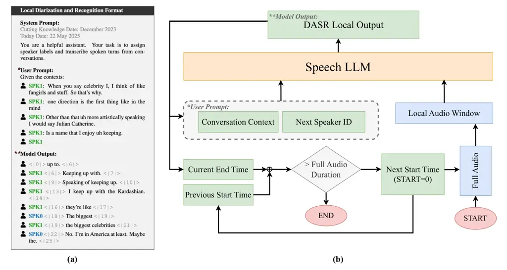

# A Unified Speech LLM for Diarization and Speech Recognition in Multilingual Conversations

Phurich Saengthong    Boonnithi Jiaramaneepinit    Sheng Li    Manabu
Okumura    Takahiro Shinozaki

###### Abstract

Speech Large Language Models (Speech LLMs) have emerged as a crucial
paradigm in recent years, extending the capabilities of traditional LLMs
to speech tasks such as automatic speech recognition (ASR) and spoken
dialogue modeling. However, their effectiveness in real-world
multilingual conversations remains limited by the scarcity of data that
captures natural conversational phenomena. To address this, the MLC-SLM
Challenge provides a multilingual conversational dataset and evaluates
models on two tasks: ASR with oracle segmentation (Task I) and joint
diarization and recognition without oracle information (Task II). In
this paper, we focus on Task II and propose a unified speech LLM that
jointly performs diarization and ASR in an end-to-end manner. By
reformulating the training data format and modifying the inference
procedure, our model addresses the ambiguity inherent in pre-segmented
audio and achieves a 54.87% relative improvement in tcpWER/tcpCER over
the baseline, ranking 8th overall, despite using a smaller LLM backbone.
We also report results from Task I using a fine-tuned speech LLM.

^(†)^(†)address: Institute of Science Tokyo^(†)^(†)email:
www.ts.ip.titech.ac.jp¹, www.lr.first.iir.isct.ac.jp²

Index Terms: End-to-End Diarization and ASR, Speech Large Language
Models, Multilingual Conversational Speech Recognition

## 1 Introduction

Large Language Models (LLMs) have recently been extended to speech tasks
such as automatic speech recognition (ASR) and spoken dialogue modeling.
However, progress remains constrained by the scarcity of real-world
conversational data—especially in multilingual contexts—where complex
patterns like speaker overlaps, interruptions, and diverse speaking
styles are common. To address this gap, the MLC-SLM Challenge and
Workshop aim to advance multilingual conversational speech language
modeling by providing a new real-world multilingual conversational
speech dataset \[nexdata2025mlc_slm\].

The challenge comprises two tracks that assess different capabilities of
speech language models. Task I targets multilingual ASR, where systems
transcribe speech using oracle speaker labels and segmentation, and are
evaluated by Word Error Rate (WER) or Character Error Rate (CER). Task
II focuses on joint speaker diarization and recognition without oracle
information, requiring systems to both identify speaker turns and
transcribe speech. Evaluation metrics for Task II include Diarization
Error Rate (DER) and tcpWER/tcpCER, which jointly reflect diarization
and transcription accuracy.

In this paper, we focus on Task II. We propose a unified speech LLM that
performs diarization and ASR in an end-to-end fashion, overcoming a key
limitation of the baseline system—its inability to handle ambiguous
audio inputs caused by pre-segmentation. By reformulating the training
data format and modifying the inference procedure, our approach achieved
a 54.87% relative improvement in tcpWER/tcpCER over the official
baseline, despite using a smaller backbone model (3B vs. 8B).
Additionally, we report our results from Task I, obtained by fine-tuning
an existing speech LLM.

Our key contributions are as follows:

- •
  We present a unified speech LLM that jointly performs diarization and
  ASR, effectively addressing ambiguity in audio that the baseline
  system fails to resolve.
- •
  Our model achieved a 54.87% relative improvement over the Task II
  baseline in tcpWER/tcpCER, placing 8th in the official ranking.
- •
  We additionally report our Task I results using a fine-tuned speech
  LLM, which achieved 20th place.

Figure 1: Overview of our approach for local diarization and speech
recognition using Speech LLM. (a) Example input-output format, where the
model receives a system prompt, an optional user prompt containing
recent dialogue history, and produces diarized transcriptions with
speaker labels and timestamps. (b) Inference is performed iteratively on
local audio windows, using the updated speaker context and predicted
next speaker to maintain continuity until the full audio is processed.

## 2 End-to-end Speech LLM for Joint Diarization and ASR (Task II)

In Task II, the baseline system \[mlcslm2025baseline\] performs
diarization and recognition in separate stages: it applies voice
activity detection (VAD) and speaker clustering to segment the audio,
then uses a LLM-based ASR model to transcribe each segment independently
\[nexdata2025mlc_slm\]. This separation often lacks sufficient
conversational context, making it difficult to resolve ambiguous speaker
transitions or maintain consistent speaker assignments, especially in
multilingual, overlapping, or turn-taking scenarios.

To address these limitations, we propose an end-to-end approach for
joint speaker diarization and automatic speech recognition (DASR) using
a speech large language model (Speech LLM). Our method combines a
locally sliding (non-overlapping) inference window with prompt-based
context from prior speaker turns to jointly predict who is speaking and
what is being said (Figure 1). The model is trained with a Local
Diarization and Recognition format, enabling it to learn structured
speaker-text alignment. At inference time, it processes the conversation
iteratively over local windows using updated speaker context and
predicted speaker prompts for continuity. While related to prior
end-to-end DASR models \[onemodel,
park2024sortformerseamlessintegrationspeaker\], our work uniquely
employs an LLM as the core backbone for diarization-aware transcription.

### 2.1 Speech LLM

The architecture of our Speech LLM closely mirrors that of the baseline
system \[mlcslm2025baseline\], with the key difference being our use of
Llama-3.2-3B-instruct \[grattafiori2024llama3herdmodels\]
\[meta_llama-3.2-3b-instruct\] as the LLM backbone, replacing the
Llama-3.1-8B \[meta_llama-3.1-8b\] model. The architecture of our Speech
LLM consists of four main components: a speech encoder, a sub-sampling
projector, a learnable prompt, and an LLM enhanced with LoRA
\[hu2021lora\]. We adopt the Whisper encoder
\[radford2022robustspeechrecognitionlargescale\], which is built upon
Transformer layers \[transformer\], to extract rich speech
representations. The sub-sampling projector includes four layers: two 1D
convolutional layers with a GELU \[gelu\] activation in between to
reduce the temporal resolution, followed by two linear layers with a
ReLU \[agarap2019deeplearningusingrectified\] activation to project
features into the target LLM dimension, followed by a LayerNorm
\[ba2016layernormalization\]. For the LLM, we use Llama-3.2-3B-instruct
with LoRA adaptation.

### 2.2 Local Diarization and Recognition Format

In real-world conversations, speaker turns are often ambiguous, making
it difficult for systems that treat diarization and transcription as
separate tasks. The baseline system \[mlcslm2025baseline\] follows this
separation, which limits its ability to resolve unclear speaker
transitions or leverage contextual cues across modalities
\[nexdata2025mlc_slm\]. We hypothesize that while larger Speech LLMs
have the potential to improve reasoning and language understanding, they
remain suboptimal if they lack the ability to interpret ambiguous
speaker turns and conversational structure.

As illustrated in Figure 1a, we introduce a unified data format that
enables a (smaller) Speech LLM to jointly model both who is speaking and
what is being said. This format interleaves speaker tokens and timestamp
tokens with transcribed text, allowing the model to generate
speaker-labeled utterances with temporal alignment. It also supports
conditioning on recent transcript history, enabling the model to
leverage long-range textual context to disambiguate speech—particularly
when speaker identity is unclear from audio alone. Optional user prompts
can further guide the model’s understanding of speaker roles and
dialogue flow.

We use a fixed set of special timestamp tokens to mark the start and end
of each speaker segment, similar to the design of
Whisper \[radford2022robustspeechrecognitionlargescale\] \[onemodel\].
The model is designed for two-speaker conversations and uses two speaker
tokens: \<\|SPK0\|\> and \<\|SPK1\|\>. By default, the model assigns
\<\|SPK0\|\> to the first detected speaker in the audio. If the user
provides an initial speaker prompt, such as \<\|SPK1\|\>, the model
respects that choice and automatically assigns the other token,
\<\|SPK0\|\>, to the remaining speaker as the conversation unfolds. This
mechanism supports flexible prompting while maintaining consistent
speaker attribution. The model is trained and evaluated using both
prompt-based and prompt-free formats to handle both contextualized and
contextless conversation starts.

### 2.3 Training Details

We train the Speech LLM on the multilingual dataset provided by the
MLC-SLM challenge, which consists of two-speaker conversations across
eleven languages, including five English accents. The speaker
(\<\|SPK0\|\>, \<\|SPK1\|\>) and timestamp tokens are registered as
trainable special tokens and integrated into the model’s tokenizer and
embedding table. To support this, we further fine-tune the embedding
layer so the model can effectively learn the representation and usage of
these tokens in context. During training, the Whisper encoder and the
rest of the LLM backbone are kept frozen; only the sub-sampling
projector, prompt embeddings, LoRA parameters, and the embedding layer
(including special token embeddings) are updated to reduce memory usage
and computational overhead.

We adopt the baseline’s default hyperparameters, applying SpecAugment
\[park2019specaugment\] with two frequency masks of width 10 and two
time masks of width 50, SpecSubstitute
\[wu2021u2unifiedtwopassbidirectional\] with three time substitutions of
width 30, and speed perturbation. Each batch is dynamically limited to a
maximum of 8000 frames. The model is trained using Adam with an initial
learning rate of 0.0001 and a warmup-based scheduler with 2500 warmup
steps, for a total of 130,000 iterations on a single RTX 6000 GPU.

### 2.4 Inference Details

#### 2.4.1 Local Diarization and Speech Recognition

To perform offline diarization and transcription, our system processes
the audio iteratively in segments. Rather than dividing the audio into
fixed, equally spaced windows, each new segment begins at a time
determined by the previous output, ensuring alignment with meaningful
conversational boundaries. Specifically, a fixed chunk duration of 24
seconds defines the maximum context window that the Speech LLM operates
on during each forward pass. However, the actual start time of each
segment is dynamically updated by taking the previous chunk’s start time
and adding the end time of the second-to-last predicted speaker turn
from that chunk. This approach avoids artificial segmentation and
ensures that the model resumes transcription from a coherent point in
the conversation. The entire process is performed by a single Speech
LLM. The overall inference loop is illustrated in Figure 1b.

For the first segment, the model is prompted with a general system
instruction, with no user-provided speaker prompt or dialogue history.
For all subsequent segments, the prompt includes a sliding context
window consisting of the four most recent speaker turns from previous
chunks, along with the second-to-last predicted speaker token, which is
used to guide the model in assigning speaker labels consistently across
the session. This mechanism enables the model to carry contextual
information forward and resolve ambiguity in turn-taking.

If the model produces no valid turns in a segment—such as in cases of
silence or hallucination, which can be detected when no speaker label or
end time is returned—a small time offset of 0.3 seconds is added to the
current endpoint to advance the inference window. This iterative process
enables the model to produce diarized and temporally coherent
transcripts without requiring access to the entire audio file at once or
relying on overlapping segments.

|              |                                        |               |
| ------------ | -------------------------------------- | ------------- |
| \topruleRank | Participant                            | tcpWER/tcpCER |
| \midrule1    | MegaAIS                                | 16.53         |
| 2            | but_mlc                                | 16.75         |
| 3            | tenp1                                  | 17.49         |
| 4            | seewo                                  | 17.67         |
| 5            | Duke Kunshan University                | 18.08         |
| 6            | sixteen-years                          | 19.27         |
| 7            | llm-t                                  | 26.30         |
| \midrule8    | ST-ShinozakiLab                        | 27.25         |
| \midrule9    | fosafer                                | 31.68         |
| 10           | voicecode                              | 55.96         |
| 11           | 517517                                 | 59.40         |
| 12           | mlcslm-baseline \[mlcslm2025baseline\] | 60.39         |
| \bottomrule  |                                        |               |

Table 1: An official result of MLC-SLM Task II on the evaluation set.
tcpWER/tcpCER is evaluated with a 5 s collar. Evaluation is conducted
using the MeetEval toolkit \[vonneumann2023meeteval\].

#### 2.4.2 Local and Global Diarization Alignment

Although the Speech LLM can perform diarization locally within each
audio segment, it lacks global context, which often leads to incorrect
speaker assignments in later turns and results in cascading errors
across a conversation. These inconsistencies degrade speaker coherence
and contribute to a higher diarization error rate (DER) over full audio.

To address this, we apply a global diarization module used in the
baseline system \[mlcslm2025baseline\] to obtain RTTM files containing
speaker segments with consistent identities across the full audio. We
then design a post-processing module that aligns the locally predicted
speaker turns from the Speech LLM (in STM format) with the RTTM
segments. For each STM segment, the module identifies overlapping RTTM
speaker segments and assigns the speaker label with the greatest
temporal overlap, grounding the speaker identity in a more stable
diarization output.

Adjacent STM segments that share the same assigned speaker and have
nearly identical start or end times (within 0.01 seconds) are merged to
form a continuous, coherent turn. If no RTTM overlap is found, the
original LLM-predicted speaker label and timestamps are retained.

|                  |                                                      |       |         |       |               |
| ---------------- | ---------------------------------------------------- | ----- | ------- | ----- | ------------- |
| \topruleModel    | LLM                                                  | DER   | WER     | cpWER | tcpWER/tcpCER |
| \midruleBaseline | Llama-3.1-8B \[meta_llama-3.1-8b\]                   | 16.44 | 21.56   | –     | 76.12         |
| Ours             | Llama-3.2-1B-instruct \[meta_llama-3.2-1b-instruct\] | 14.03 | 23.88\* | 28.24 | 31.19         |
| Ours             | Llama-3.2-3B-instruct \[meta_llama-3.2-3b-instruct\] | 13.36 | 20.92\* | 24.97 | 28.23         |
| \bottomrule      |                                                      |       |         |       |               |

Table 2: Model comparison for MLC-SLM Task II on the development set.
All systems use the same encoder (Whisper-large-v3) and diarization
module (3D-Speaker). DER is evaluated with a 0.25 s collar, and
tcpWER/tcpCER with a 5 s collar. \*For simplicity, we report orcWER in
place of WER. Evaluation is conducted using the MeetEval
toolkit \[vonneumann2023meeteval\].

### 2.5 Results

Table 1 shows that our system achieved 8^(th) place in Task II:
Multilingual Conversational Speech Diarization and Recognition. Our
approach achieved significantly lower tcpWER/tcpCER than the baseline
system \[mlcslm2025baseline\], which was consistent with the results on
the development dataset, as shown in Table 2. Specifically, our system
achieved a tcpWER/tcpCER of 27.25 on the evaluation set and 28.23 on the
development set, compared to 60.39 and 76.12, respectively, for the
baseline.

In terms of diarization quality, our method reduced the Diarization
Error Rate (DER) from 16.44% in the baseline to 14.03% using our 1B
model, and further to 13.36% with our 3B model, demonstrating consistent
improvements in speaker attribution. These gains are attributed to the
integration of diarization outputs from the 3D-Speaker system
\[wang2023campp\] with our Speech LLM, which jointly models speaker
identity and transcription in context.

In addition, we evaluated a smaller version of our model, replacing
Llama-3.2-3B-instruct with Llama-3.2-1B-instruct while keeping all
training settings identical. Table 2 and Figure 2 compare the
performance across the two LLM sizes and the baseline. We found that the
smaller LLM version resulted in a higher tcpWER by 2.96%. Interestingly,
Thai was the only language where the smaller model slightly outperformed
the larger model (24.45% vs. 25.12%), potentially due to domain
variability or the overfitting sensitivity of the larger model.

Overall, our approach achieved a 54.87% relative improvement in
tcpWER/tcpCER compared to the baseline, as shown in Table 1,
demonstrating the effectiveness of our locally structured diarization
and recognition method—even when using a much smaller LLM (3B vs. 8B).

Figure 2: Per-language tcpWER/tcpCER (%) comparison on the development
set for MLC-SLM Task II, between the baseline system
\[mlcslm2025baseline\] (Llama-3.1-8B) and our models using Llama-3.2-1B
and Llama-3.2-3B. All models use the same encoder (Whisper-large-v3) and
diarization system (3D-Speaker). Lower is better. Evaluation is
conducted using the MeetEval toolkit \[vonneumann2023meeteval\].

## 3 Fine-tuning ASR-based Speech LLM (Task I)

In this section, we report the additional experiment for Task I.
Specifically, our primary goal was to assess the effectiveness of
fine-tuning a multilingual multimodal model under a two-phase strategy
that accommodates both language-specific and cross-lingual
characteristics. Given the diverse linguistic and acoustic properties
across target languages, it was essential to design an experimental
pipeline that maintained both language-level adaptation and multilingual
generalization. This approach was intended to enhance the model’s
performance, particularly on underrepresented languages and more
challenging audio-text alignment scenarios.

### 3.1 Training Details

We fine-tuned the Phi-4-multimodal-instruct model in two stages. In the
first phase, Language-Specific Pretraining, we trained the model
separately on each language using data segmented into chunks of up to 90
seconds. This enabled the model to capture language-specific phonetic
and syntactic features effectively. In the second phase, Unified
Multilingual Fine-Tuning, we trained the model on a merged multilingual
dataset, with chunking based on the actual timestamp boundaries in the
audio-text pairs. This allowed for better preservation of natural
utterance structure and facilitated the model’s cross-lingual
generalization. The Phi-4-multimodal-instruct model contains a total of
5.6 billion parameters, of which 830,472,192 parameters were fine-tuned
in our training pipeline, enabling the model to adapt both to individual
linguistic traits and shared multilingual patterns effectively
\[phi4multimodal\].

Hyperparameter Configuration. Training used the AdamW optimizer
\[loshchilov2017decoupled\] with fixed hyperparameters:
$`\beta_{1}=0.9`$, $`\beta_{2}=0.95`$, $`\epsilon=10^{-7}`$, and a
learning rate of $`2\times 10^{-5}`$. A linear schedule with 50 warm-up
steps, gradient clipping (max norm 1.0), and weight decay of 0.01 were
applied. These settings followed standard multilingual transformer
fine-tuning practices and ensured stable convergence
\[kim2025phi4mm_ko_stt\].

Table 3: Unified results for MLC-SLM Task I: official rankings and
language-specific WER/CER at 1 and 2.5 epochs. Evaluation is conducted
using the MeetEval toolkit \[vonneumann2023meeteval\].
