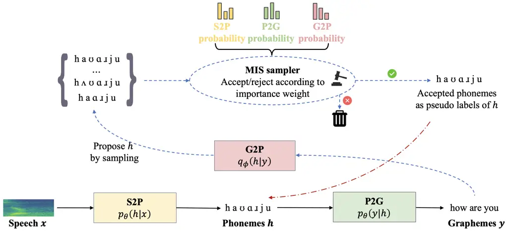
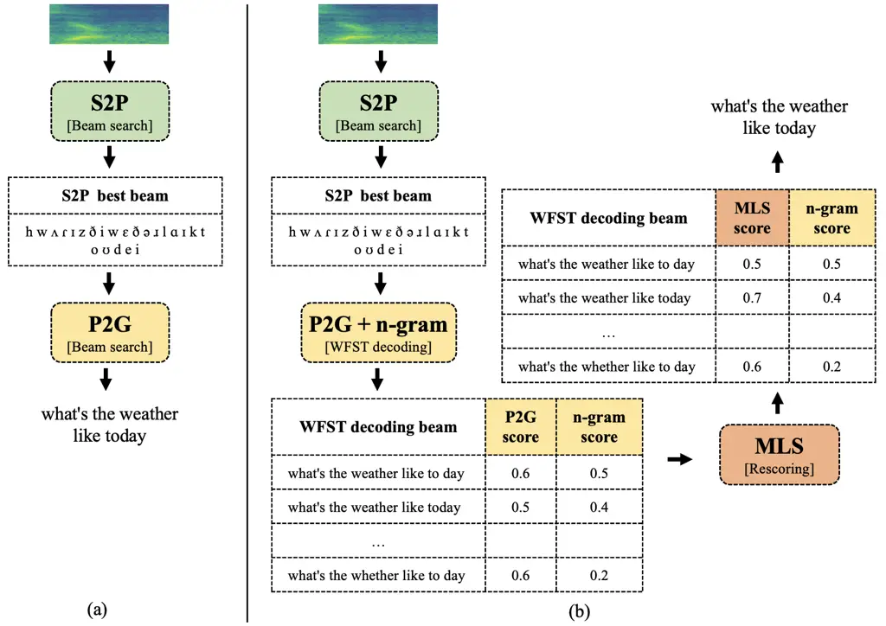
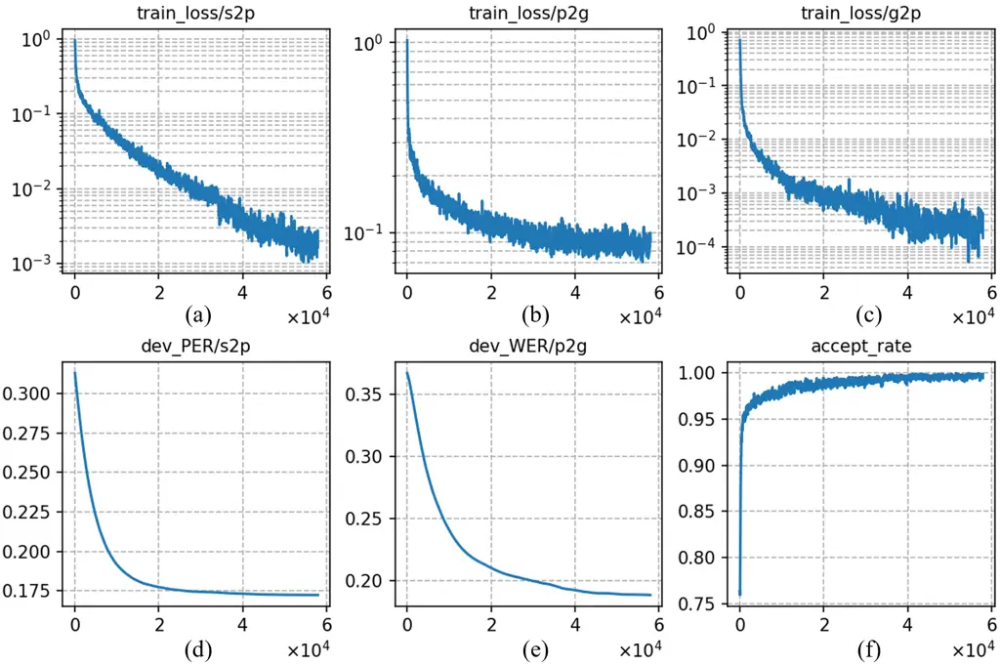

# Pronunciation-Lexicon Free Training for Phoneme-based Crosslingual ASR via Joint Stochastic Approximation

Saierdaer Yusuyin    Te Ma    Hao Huang    Zhijian Ou ^(†)^(†)thanks:
This work was supported in part by funding from TasiTech, in part by
Guangxi Science and Technology Project under Grant (2022AC16002), and in
part by the National Natural Science Foundation of China under Grant
(62466055). Corresponding author: Zhijian Ou, Hao Huang.^(†)^(†)thanks:
Saierdaer Yusuyin, Te Ma, Hao Huang are with the School of Computer
Science and Technology, Xinjiang University, Urumqi 830046, China
(e-mail: sar_dar@foxmail.com; mate153125@gmail.com;
huanghao@xju.edu.cn)^(†)^(†)thanks: Zhijian Ou is with the Speech
Processing and Machine Intelligence (SPMI) Lab, Department of Electronic
Engineering, Tsinghua University, Beijing 100084, China, (e-mail:
ozj@tsinghua.edu.cn)

###### Abstract

Recently, pre-trained models with phonetic supervision have demonstrated
their advantages for crosslingual speech recognition in data efficiency
and information sharing across languages. However, a limitation is that
a pronunciation lexicon is needed for such phoneme-based crosslingual
speech recognition. In this study, we aim to eliminate the need for
pronunciation lexicons and propose a latent variable model based method,
with phonemes being treated as discrete latent variables. The new method
consists of a speech-to-phoneme (S2P) model and a phoneme-to-grapheme
(P2G) model, and a grapheme-to-phoneme (G2P) model is introduced as an
auxiliary inference model. To jointly train the three models, we utilize
the joint stochastic approximation (JSA) algorithm, which is a
stochastic extension of the EM (expectation-maximization) algorithm and
has demonstrated superior performance particularly in estimating
discrete latent variable models. Furthermore, we propose marginal
likelihood scoring (MLS) decoding to align inference with the training
objective and P2G augmentation to improve the robustness of P2G mapping.
Based on the Whistle multilingual pre-trained S2P model, crosslingual
experiments are conducted in Polish (130 h) and Indonesian (20 h). With
only 10 minutes of phoneme supervision, the new method, JSA-SPG,
achieves 5% error rate reductions compared to the best crosslingual
fine-tuning approach using subword or full phoneme supervision.
Furthermore, it is found that in language domain adaptation (i.e.,
utilizing cross-domain text-only data), JSA-SPG outperforms the standard
practice of language model fusion via the auxiliary support of the G2P
model by 9% error rate reductions. To facilitate reproducibility and
encourage further exploration in this field, we open-source the JSA-SPG
training code and complete pipeline.

###### Index Terms: 

speech recognition, crosslingual, joint stochastic approximation,
phoneme.

## I Introduction

In recent years, deep neural networks (DNNs) based automatic speech
recognition (ASR) systems, which benefit from large amounts of
transcribed speech data, have made significant strides. Remarkably, more
than 7,000 languages are spoken worldwide \[1\], and most of them are
low-resourced languages. A pressing challenge for the speech community
is to develop ASR systems for new, unsupported languages rapidly and
cost-effectively. Crosslingual ASR have been explored as a promising
solution to bridge this gap \[2, 3, 4, 5, 6, 7\].

In crosslingual speech recognition, a pre-trained multilingual model is
fine-tuned to recognize utterances from a new, target language, which is
unseen during training the multilingual model. In this way, crosslingual
speech recognition can achieve knowledge transfer from the pre-trained
multilingual model to the target model, thereby reducing reliance on
transcribed data and becoming an effective solution for low-resource
speech recognition. Most recent research on pre-training for
crosslingual ASR can be classified into three categories - supervised
pre-training with graphemic transcription or phonetic transcription, and
self-supervised pre-training. The pros and cons of the three categories
have recently been discussed in \[8\]. Under a common experimental setup
with respect to pre-training data size and neural architecture, it is
further found in \[8\] that when crosslingual fine-tuning data is more
limited, phoneme-based supervised pre-training achieves the most
competitive results and provides high data-efficiency. This makes sense
since phonetic units such as described in International Phonetic
Alphabet (IPA), are designed to represent speech sounds shared in human
language throughout the world. In contrast, the methods using grapheme
units face challenges in learning shared crosslingual representations
due to a lack of shared graphemes among different languages.

We note an important distinction between phones (phonetic units) and
phonemes (phonemic units). Producing accurate phonetic transcriptions
requires substantial expert effort and is inherently subjective. Prior
work—such as Whistle \[8\] and ZIPA \[9\]—therefore relies on broad
transcription, which operates at a coarser level of detail. While this
coarsening may reduce phonetic precision, it enables stronger
cross-lingual generalization. In our work, the goal is not to obtain
highly precise phonetic labels. Instead, we use phonemes as an
intermediate interface between speech and text to impose a useful
structural constraint (an inductive bias), which we expect to reduce the
overall complexity of the learning problem.

A longstanding challenge in phoneme-based speech recognition is that
phoneme labels are needed for each training utterance. Phoneme labels
are usually obtained by using a manually-crafted pronunciation lexicon
(PROLEXs), which maps every word in the vocabulary into a phoneme
sequence. Grapheme-to-phoneme (G2P) tools have been developed to aid
this process of labeling sentences from their graphemic transcription
into phonemes, but such tools are again created based on PROLEXs. There
are enduring efforts to compile PROLEXs and develop G2P tools \[10, 11,
12, 13, 14, 15, 16, 17\] for different languages. Overall, existing
phoneme-based ASR approaches rely heavily on manually curated PROLEXs or
on G2P models trained from them, which limits their
scalability—particularly when extending to truly low-resource languages.

In this paper we are interested in reducing the reliance on PROLEXs in
building phoneme-based crosslingual ASR systems, i.e., towards PROLEX
free. In recognizing speech $`x`$ into text $`y`$, we assume that
phonemes serve as intermediate states that structurally decompose the
mapping. So we propose to treat phonemes as hidden variables $`h`$, and
construct a latent variable model (LVM) with pairs of speech and text
$`(x,y)`$ as observed values. The whole model is a conditional
generative model from Speech to Phonemes and then to Graphemes, which is
referred to as a SPG model, denoted by $`p_{\theta}(h,y|x)`$. SPG
consists a speech-to-phoneme (S2P) model $`p_{\theta}(h|x)`$ and a
phoneme-to-grapheme (P2G) model $`p_{\theta}(y|h)`$, and is thus a
two-stage model¹¹ 1 Like in prior work on two-stage ASR as discussed in
Section II-B, the conditional independence
$`p_{\theta}(y|x,h)=p_{\theta}(y|h)`$ is assumed, which is strictly not
valid if considering prosodic effects of speech. This approximation
currently does not pose a major issue for ASR performance, particularly
in low-resource scenarios.. Latent variable modeling enables us to train
the SPG model, without the need to know $`h`$, by maximizing the
marginal likelhood $`p_{\theta}(y|x)`$. This is different from previous
two-stage ASR models with phonemes as intermediate states, as reviewed
later in Section II. Learning latent-variable models usually involves
introducing an auxiliary G2P model $`q_{\phi}(h|y)`$.

Method contribution. Note that phonemes take discrete values, and
recently the joint stochastic approximation (JSA) algorithm \[18, 19\]
has emerged for learning discrete latent variable models with impressive
performance. In this paper, we propose applying JSA to learn the SPG
model, which is called the JSA-SPG approach. The S2P model is
initialized from a pre-trained phoneme-based multilingual S2P backbone,
called Whistle \[8\]. Whistle generally stands for the weakly phonetic
supervision strategy for multilingual and crosslingual speech
recognition. In supervised pre-training with phonemes, the phoneme
labels are weak, in that they are obtained from G2P tools rather than
human annotated. Specifically, the Whistle model refers to the CTC-based
S2P model pre-trained over 10 languages from CommonVoice \[20\], with a
total of 4096 hours of training speech. In applying JSA to SPG, when
viewing phonemes as labels, we combine supervised learning over 10
minutes of transcribed speech with weak phoneme labels and unsupervised
learning over a much larger dataset without phoneme labels. That means
we conduct semi-supervised learning. Bootstrapping from a good S2P
backbone (like Whistle) and providing few-shots samples of latent
variables (such as 10 minutes of weak phoneme labels) is found to be
important to make JSA-SPG successfully work in the challenging task of
crosslingual ASR. Furthermore, we propose marginal likelihood scoring
(MLS) decoding to align inference with the training objective and P2G
augmentation to improve the robustness of P2G mapping. These components
are important for making the overall JSA-SPG method work.

Experiment contribution. Crosslingual experiments are conducted on
Polish (130 h) and Indonesian (20 h) training data from the Common Voice
dataset (v11.0) with grapheme transcriptions. Using only 10 minutes of
phoneme supervision, JSA-SPG outperforms the best crosslingual
fine-tuning approach using subword supervision or full phoneme
supervision. Furthermore, we investigate language domain adaptation, for
which a standard approach is to train a new language model on the text
data from the new domain. Unlike such standard approach, JSA-SPG can
leverage the text-only data by using the G2P model to generate phoneme
labels and adapt the P2G model, further improving cross-domain ASR
performance. To promote future research along this direction, we release
the JSA-SPG training code and complete pipeline at the following URL:
[https://github.com/thu-spmi/CAT/tree/master/egs/JSA-SPG](https://github.com/thu-spmi/CAT/tree/master/egs/JSA-SPG)

## II Related Work

### II-A Crosslingual ASR

Multilingual and crosslingual speech recognition has been studied for a
long time \[2\]. Modern crosslingual speech recognition typically
fine-tunes a multilingual model pre-trained on multiple languages. Most
recent research on multilingual pre-training can be classified into
three categories - supervised pre-training with graphemic transcription
\[21, 22, 23, 24, 25, 6, 7\] or phonetic transcription \[26, 5, 27,
28\], and self-supervised pre-training \[3, 4, 29\]. It is shown in
\[8\] that when crosslingual fine-tuning data is more limited,
phoneme-based supervised pre-training can achieve better results
compared to subword-based supervised pre-training and self-supervised
pre-training. However, phoneme-based crosslingual fine-tuning in \[8\]
requires phoneme labels for every training utterance from the target
language, which relies on a manually-crafted PROLEX for the target
language. The UniSpeech method \[30\] combines a phoneme-based
supervised loss and a self-supervised contrastive loss to improve
pre-training, and crosslingual fine-tuning still needs PROLEXs.
Recently, a line of research has explored zero-resource crosslingual ASR
without any phone or grapheme transcribed supervision, notably the
Deciphering Speech approach \[25\]. This work formulates ASR as a
decipherment problem between unpaired speech and text, also adopting a
cascaded S2P-P2G architecture. A universal phone recognizer trained on
high-resource languages is employed for S2P, while the P2G conversion is
modeled as an unsupervised decipherment using a noisy-channel
formulation implemented with WFSTs. In this framework, the S2P model is
fixed and only the P2G model is trained. While both methods aim to
remove pronunciation lexicons, JSA-SPG provides a more principled
probabilistic formulation through marginal-likelihood training and
decoding, jointly optimizing S2P and P2G. Another key distinction is
that the predicted graphemes from the decipherment model \[25\] are used
as pseudo-labels to train a separate grapheme-based acoustic model,
whereas JSA-SPG directly enhances phoneme-based ASR through
latent-variable learning.

### II-B Phoneme-based two-stage ASR

The two stages of recognizing speech to phonemes and then to graphemes
has been studied for crosslingual ASR \[31, 32\]. In \[32\], a two-stage
crosslingual ASR architecture is used, which integrates an additional
noise generator module during training to synthesize noisy phoneme
sequences as P2G inputs, thus improving the robustness of the model.
Similarly, \[31\] implements a two-stage crosslingual ASR system,
employing a pre-trained UniData2Vec model (a modified version of
Unispeech\[30\]) as the phoneme recognition component coupled with a
multilingual phoneme-to-word (P2W) converter. The motivation of these
works is similar to ours that phoneme units facilitate the learning of
shared phonetic representations, making crosslingual transfer learning
effective. However, both studies require a PROLEX for the target
language.

### II-C Discrete latent variable models

Hidden Markov models (HMMs) are classic discrete latent variable models
(LVMs) and have been applied to ASR for a long time \[33\]. Discrete
LVMs are rarely used in recent end-to-end ASR systems, but have been
widely used in many other machine learning applications such as dialog
systems \[34, 35\], program synthesis \[36\], and discrete
representation learning \[37\]. A class of classic methods for learning
LVMs consists of the expectation-maximization (EM) algorithm \[38\] and
its extensions. The joint stochastic approximation (JSA) algorithm \[18,
19\] is a stochastic extension of the EM algorithm with impressive
performance. Both the E-step and the M-step, which are often intractable
in practice, are extended by the stochastic approximation methodology,
hence called joint SA. Within the JSA framework, an inference
model—serving as an adaptive proposal distribution for MIS sampling—is
incorporated and continuously updated to provide diverse proposals for
approximating the E-step. This adaptive procedure substantially improves
sampling efficiency and is crucial for the strong empirical performance
of JSA. JSA has been successfully applied to semi-supervised learning
for semantic parsing \[39\] and task-oriented dialog systems \[40, 41\].



Fig. 1: Overview of JSA-SPG. 1) The latent variable model (SPG) consists
of speech-to-phoneme (S2P) and phoneme-to-grapheme (P2G). Learning SPG
without knowing $`h`$ involves introducing an auxiliary G2P model. 2)
During training, the G2P model proposes hypothesized phonemes, which get
accepted or rejected according to the importance weight based on the
probabilities calculated from the three model components. The blue
dashed line shows such Metropolis independence sampling (MIS), which is
a Monte Carlo approximation of the E-step in EM. 3) The filtered
phonemes are then treated as pseudo labels, as shown by the red dotted
line. 4) Given the pseudo labels, we can calculate the gradients for the
S2P model, the P2G model, and the G2P model, respectively, and proceed
with parameter updating, very similar to perform supervised training,
like the M-step in EM.

## III Method: JSA-SPG

In this section, we first formalize the SPG model and then describe the
three core components of the JSA-SPG approach: JSA training, MLS
(Marginal Likelihood Scoring) decoding, and P2G augmentation. We further
present a case study on language domain adaptation to illustrate the
additional benefits of the proposed JSA-SPG approach.

### III-A SPG model

Let $`(x,y)`$ denote the pair of speech and text for an utterance.
Specifically, $`x`$ represents the speech log-mel spectrogram and $`y`$
the graphemic transcription of $`x`$. Let $`h`$ denote the IPA phoneme
sequence representing the pronunciation of $`x`$. In recognizing speech
$`x`$ into text $`y`$, we treat phonemes $`h`$ as hidden variables, and
construct a latent variable model, which can be decomposed as follows:

```math
p_{\theta}(h,y|x)=p_{\theta}(h|x)p_{\theta}(y|h)
```

Basically, as shown in Figure 1, the whole model is a conditional
generative model from Speech to Phonemes and then to Graphemes, which is
referred to as a SPG model. SPG consists a speech-to-phoneme (S2P) model
$`p_{\theta}(h|x)`$ and a phoneme-to-grapheme (P2G) model
$`p_{\theta}(y|h)`$.

### III-B JSA Training

Training the SPG model from complete data, i.e., knowing phoneme labels
$`h`$, can be easily realized by supervised training. To train S2P and
P2G end-to-end (that is, conducting unsupervised training without
knowing phoneme labels $`h`$), we resort to maximizing the marginal
likelihood $`p_{\theta}(y|x)`$ and applying the JSA algorithm \[18,
19\], which has emerged to learn discrete latent variable models with
impressive performance.

The EM algorithm is a classic iterative method for finding maximum
likelihood estimates of parameters in latent variable models. The EM
algorithm iterates E-step (Expectation) and M-step (Maximization). The
E-step needs to take expectation with respect to the latent variable,
which is generally intractable for high-dimensional latent variable
models. In this work, the latent variable is the phoneme sequence
representing the pronunciation of a speech utterance, which is very
high-dimensional. So, the EM algorithm can not be applied at all (not
tractable) in this work.

JSA involves introducing an auxiliary inference model to approximate the
intractable posterior $`p_{\theta}(h|x,y)`$, which, in the ASR task
considered in this paper, is assumed to take the form of
$`q_{\phi}(h|y)`$, i.e., a G2P model. We can jointly train the three
models (S2P, P2G and G2P), which is summarized in Algorithm 1 (JSA-SPG).
In our experiments, the S2P, P2G, and G2P models are all
implemented—though not limited to—using the CTC model. In principle, any
model compatible with Algorithm 1 can be employed in its place.

The JSA algorithm can be viewed as a stochastic extension of the
well-known EM algorithm \[38\], which iterates Markov Chain Monte Carlo
(MCMC) sampling and parameter updating, being analogous to the E-step
and the M-step in EM respectively.

E-Step. The sampling step in JSA stochastically fills the latent
variable $`h`$ (phonemes) through sampling from the posterior
$`p_{\theta}(h|x,y)`$, which is analogous to the E-step in EM
(approximating the expectation via stochastic sampling). However, direct
sampling from the posterior $`p_{\theta}(h|x,y)`$ is intractable, so
MCMC sampling is employed. Particularly, using $`p_{\theta}(h|x,y)`$ as
the target distribution and $`q_{\phi}(h|y)`$ as the proposal, we sample
$`h`$ through Metropolis independence sampler (MIS) \[42\] as follows:

1\) Propose $`h^{\prime}\sim q_{\phi}(h|y)`$;

2\) Let $`h=h^{\prime}`$ with accept probability
$`\min\left\{1,\frac{w(h)}{w(h^{\text{old}})}\right\}`$, and let
$`h=h^{\text{old}}`$ otherwise, where

```math
w(h)=\frac{p_{\theta}(h|x,y)}{q_{\phi}({h}|y)}\propto\frac{p_{\theta}(h|x)p_{\theta}(y|h)}{q_{\phi}({h}|y)} \tag{1}
```

is the usual importance weight between the target and the proposal
distribution and $`h^{\text{old}}`$ denotes the previous value for $`h`$
along the Markov chain. In practice, we run MIS for several steps but
for simplicity Algorithm 1 only shows a single step of MIS, where the
chain is initialized from $`p_{\theta}(h|x)`$.

M-Step. Once we obtain the sampled pseudo labels
$`\{h^{(1)},h^{(2)},...,h^{(m)}\}`$ from MIS, we can treat them as if
being given and calculate the gradients for the S2P, P2G, and G2P models
respectively and proceed with parameter updating, similar to the process
in supervised training. This is analogous to the M-step in EM, but with
the proposal $`q_{\phi}`$ being adapted as well. In summary, the loss
function can be written as:

```math
\displaystyle\mathcal{L}_{\text{JSA}} \displaystyle=-\frac{1}{m}\sum_{i=1}^{m}\left(\log p_{\theta}(h^{(i)}|x)\right. \tag{2}
```

```math
\displaystyle\left.+\log p_{\theta}(y|x,h^{(i)})+\log q_{\phi}(h^{(i)}|y)\right)
```

0:  S2P model $`p_{\theta}(h|x)`$, P2G model $`p_{\theta}(y|h)`$, G2P
model $`q_{\phi}(h|y)`$, training dataset $`\{(x,y)\}`$

 repeat

  Draw a pair of speech and text $`(x,y)`$;

  Initialize $`h^{\text{old}}`$ by sampling from $`p_{\theta}(h|x)`$;

  Monte Carlo sampling:

  Sample $`h^{\prime}`$ from the proposal $`q_{\phi}(h|y)`$;

  Let $`h=h^{\prime}`$ (i.e., accept) with probability
$`\min\left\{1,\frac{p_{\theta}(h|x)p_{\theta}(y|h)}{q_{\phi}(h|y)}/\frac{p_{\theta}(h^{\text{old}}|x)p_{\theta}(y|h^{\text{old}})}{q_{\phi}(h^{\text{old}}|y)}\right\}`$,
and let $`h=h^{\text{old}}`$ otherwise;

  Parameter updating:

  Updating $`\theta`$ by ascending:
$`{\nabla}_{\theta}[p_{\theta}(h|x)p_{\theta}(y|h)]`$;

  Updating $`\phi`$ by ascending: $`{\nabla}_{\phi}q_{\phi}(h|y)`$;

 until convergence

 return $`\theta`$ and $`\phi`$

Algorithm 1 The JSA-SPG algorithm

Semi-supervised Training. The JSA-SPG algorithm is general and is in
fact an unsupervised learning over $`(x,y)`$ without the need to know
$`h`$. It is challenging to run this purely unsupervised form from
scratch in the ASR task considered in this paper, which involves very
high-dimensional latent space. Two additional techniques are
incorporated to add inductive bias into model training.

- •
  First, the S2P model is initialized from a pre-trained phoneme-based
  multilingual S2P backbone, called Whistle \[8\], which has been shown
  to have good phoneme classification ability. In our experiment,
  JSA-SPG training with random initialization of the S2P model does not
  work well, especially when the amount of supervised phoneme data is
  small.
- •
  Second, we assume that 10 minutes of transcribed speech with phoneme
  labels are available, which takes much less labor than compiling a
  complete PROLEX for a target language. Thus, we combine supervised
  learning over 10 minutes speech with phoneme labels and unsupervised
  learning over a much larger dataset without phoneme labels, i.e.,
  conducting semi-supervised learning.

Bootstrapping from a good S2P backbone (Whistle) and providing few-shots
samples of latent variables (10 minutes of phoneme labels) is found to
be important to make JSA-SPG successfully work in the challenging task
of crosslingual ASR.

Sampling from CTC based G2P and S2P. In JSA-SPG, we need to draw samples
from the G2P model $`q_{\phi}(h|y)`$ as proposals for MIS. Sampling from
the S2P model $`p_{\theta}(h|x)`$ is also required for initialization.
In this work, the G2P and S2P models are both implemented by
Connectionist temporal classification (CTC) \[43\]. For the CTC-based
G2P model $`q_{\phi}(h|y)`$, assume that the length of $`y`$ is $`T`$.
At each position $`t=1,\cdots,T`$, we randomly draw a symbol (from the
phoneme alphabet plus the blank symbol) based on the softmax
distribution. In this way, we can draw a state path from the CTC model.
Then, after reducing repetitive symbols to a single symbol and removing
all blank symbols, we obtain a sample $`h`$ (i.e., a phoneme sequence)
from $`q_{\phi}(h|y)`$. In practice, we independently draw multiple
times at each position and obtain multiple independent state paths,
which are converted to multiple $`h`$ samples. Sampling from CTC-based
S2P model $`p_{\theta}(h|x)`$ is similar. Basically, the JSA-SPG
algorithm can be applied to other types of models for G2P and S2P, such
as attention-based encoder-decoder (AED) \[44\] and RNN-transducer
(RNN-T) \[45\]. We leave sampling from such models and apply the JSA-SPG
algorithm for future work.

More discussions on G2P and P2G models. WFST-based methods have been
developed for the G2P task \[46, 47\], known as joint-sequence models,
which model the joint distribution $`p(h,y)`$ based on grapheme–phoneme
joint multigrams. Since these models are symmetric with respect to
graphemes and phonemes in their WFST representations, a joint-sequence
model can in theory also be applied to the P2G task. This naturally
raises the question of whether such joint-sequence models can be used
within our SPG framework to realize both P2G and G2P. However, it should
be emphasized that the P2G task in SPG for speech recognition differs
fundamentally from conventional P2G conversion tasks studied in \[47\].
In SPG, P2G aims to infer the grapheme sequence from the noisy
hypothesized phoneme sequence produced by the S2P model, which may
contain recognition errors, whereas traditional P2G focuses on mapping
from clean, canonical phonemic transcriptions—making the SPG case
considerably more challenging.



Fig. 2: Illustration of decoding in JSA-SPG. (a) Vanilla decoding
without LM; (b) Decoding with MLS rescoring.

### III-C Decoding

Vanilla decoding. In testing, the S2P model first decodes out the
phoneme sequence $`h`$ using beam search and selects the best beam
$`\hat{h}`$ as input for the P2G model. Then, the P2G model also employs
beam search to decode the graphemic result from $`\hat{h}`$, which is
named as “decoding without LM” result. In summary, the above steps can
be written as:

```math
\displaystyle\hat{y}= \displaystyle\argmax_{y}\sum_{h}p(y,h|x)=\argmax_{y}\sum_{h}p(y|h)p(h|x) \tag{3}
```

```math
\displaystyle\approx \displaystyle\argmax_{y,h}p(y|h)p(h|x)\approx\argmax_{y}p(y|\hat{h})
```

where $`\hat{h}=\argmax_{h}p(h|x)`$. Further, we train a word n-gram
language model for WFST-based decoding from $`\hat{h}`$, which is named
as “decoding with LM” result. This WFST-based decoding uses a subword
lexicon, which maps from subwords to words, and does not require a
pronunciation lexicon. Remarkably, the above two decoding procedures are
vanilla approximations to the training objective (the marginal
likelihood), which are collectively referred to as “vanilla decoding”.

Marginal likelihood scoring. Note that the training objective of the JSA
algorithm is maximizing the marginal likelihood $`p_{\theta}(y|x)`$. So
beyond of the vanilla decoding, we propose a new decoding algorithm,
called “decoding with marginal likelihood scoring” (MLS). It consists of
the following steps: 1) S2P takes in the audio $`x`$ and outputs the
beam search best result $`\hat{h}`$; 2) P2G takes in the $`\hat{h}`$ and
generates an n-best list of candidates $`\hat{y}`$ using WFST decoding; 3) G2P takes in each candidate hypothesis $`\hat{y}`$ and propose $`k`$
samples $`\{h^{(1)},h^{(2)},...,h^{(k)}\}`$ from
$`q_{\phi}(h|\hat{y})`$; 4) The marginal likelihood can be estimated
with importance weights \[18\], as shown in Eq. (1); 5) Each candidate
hypothesis $`\hat{y}`$ is rescored using a sum of the estimated marginal
likelihood and the weighted LM score. In summary, the above steps can be
written as:

```math
\displaystyle y^{\ast}= \displaystyle\mathop{\arg\max}\limits_{\hat{y}}\log\sum_{i=1}^{k}\frac{p_{\theta}(h^{(i)}|x)p_{\theta}(\hat{y}|h^{(i)})}{q_{\phi}(h^{(i)}|\hat{y})} \tag{4}
```

```math
\displaystyle+\lambda\log p_{\text{LM}}(\hat{y})
```

where $`\hat{y}`$ is taken from the n-best list from vanilla decoding,
and $`\lambda`$ is LM weight. There is a mismatch between vanilla
decoding and the training objective. In contrast, MLS decoding maintains
consistency with training by utilizing marginal likelihood scoring.
Additionally, note that vanilla decoding only uses the single best S2P
result to fed to P2G for decoding, which is easily prone to error
propagation. Decoding with MLS overcomes this drawback by scoring with
multiple $`h`$.

Improving P2G via data augmentation. Note that during the JSA-SPG
training, as the models gradually converge, the diversity of phoneme
sequences sampled by MIS decreases. The P2G model is gradually trained
with less noisy input, compared with the input fed to P2G in testing. In
order to improve the robustness of the P2G model, we further augment the
P2G model after the JSA-SPG training. Particularly, we decode 128 best
phoneme sequences by S2P beam search decoding over the training speech
data and pair them with text labels, which serve as augmented data to
further train the P2G model.

### III-D Language Domain Adaptation

Note that after JSA-SPG training, we can use the auxiliary G2P model to
generate phoneme labels on pure text. Below, we take the language domain
adaptation task as an example to introduce the bonus brought by the G2P
model.

Text-only data is easier to obtain than transcribed speech data. In
cross-domain ASR, a common approach is to train external language models
for language domain adaptation. In contrast, in JSA-SPG, we can use the
G2P model to generate 64 best phoneme labels through beam search
decoding, and then use the pairs of phonemes and text to continue
adapting the P2G model. Then, we use the original S2P, the adapted P2G,
and the cross-domain language model for speech recognition on
cross-domain audio, which is found to outperform the standard practice
of only doing language model fusion.

## IV Experiment

### IV-A Languages

In this paper, we aim to develop phoneme-based crosslingual speech
recognition, in the scenario where a pronunciation lexicon is not
available, by treating phonemes as discrete latent variables. Polish and
Indonesian are two languages, which are outside of the ten languages in
training the Whistle model and thus used for crosslingual speech
recognition. Polish is close to the seen languages in Whistle model
training, and there is a relatively large amount of training data (130
hours). On the other hand, Indonesian is not close to the seen languages
and the data volume is small (20 hours). Therefore, our experiments on
Polish and Indonesian represent two common scenarios in crosslingual
speech recognition.

| Language   | Phonemes                                                                                                                                                                                                                                                                                                                    | Uncovered phonemes                                                                                                        |
| ---------- | --------------------------------------------------------------------------------------------------------------------------------------------------------------------------------------------------------------------------------------------------------------------------------------------------------------------------- | ------------------------------------------------------------------------------------------------------------------------- |
| Polish     | \textscripta b \textctc d \texttoptiebardz \texttoptiebard\textctz \texttoptiebar\textrtaild\textrtailz \textepsilon f \textscriptg i \textbari j k l m n \textltailn \textipaN \textopeno p r s \textrtails t \texttoptiebart\textctc \texttoptiebarts \texttoptiebar\textrtailt\textrtails u v w x z \textrtailz \textctz | \texttoptiebard\textctz \texttoptiebar\textrtaild\textrtailz \texttoptiebart\textctc \texttoptiebar\textrtailt\textrtails |
| Indonesian | \textscripta b d \texttoptiebard\textyogh e \textschwa \textepsilon f \textscriptg \textramshorns h i \textsci j k l m n \textltailn \textipaN o \textopeno p q r s \textesh t \texttoptiebart\textesh u \textupsilon v w x z                                                                                               |                                                                                                                           |

TABLE I: Phoneme inventories of Polish and Indonesian. Uncovered
phonemes denote those not included in the Whistle phoneme set.

### IV-B Datasets

Common Voice \[20\] is a large multilingual speech corpus, with spoken
content taken primarily from Wikipedia articles. We conduct experiments
on the Common Voice dataset released at September 2022 (v11.0). We
select Polish (pl) and Indonesian (id) for JSA-SPG experiments, which
were not used in Whistle pre-training. Polish has 130 hours (107K
sentences) of training data, while Indonesian has 20 hours (16.5K
sentences), with an average sentence length of 4.3 and 4.5 seconds,
respectively. In the JSA-SPG experiment, for each language of Polish and
Indonesian, we used all its training data with the full set of text
transcriptions, selected 100 utterances (about 10 minutes) from the
training set of each language and converted them into phonetic
annotations using a publicly available phonemizer \[10\]²² 2 The
phonemizer developed in \[10\] is called Phonetisaurus, which is a FST
(Finite State Transducer) based G2P tool. The FSTs used in our
experiments for Polish and Indonesian are from LanguageNet \[12\]. The
LanguageNet G2P models are available for 142 languages, with the phoneme
error rates (PERs) ranging from 7% to 45%; but the particular PERs for
Polish and Indonesian are not reported.. This is a simulated scenario
for research purpose, where we use an available phonemizer. It should be
noted that except for generating the phoneme transcriptions for the
selected 100 utterances, the phonemizer is no longer used in the
remaining experimental steps. In a practical scenario where neither a
pronunciation lexicon nor a phonemizer is available, linguistic experts
are required to manually annotate 100 utterances, which represents a
moderate level of effort.

Practically, linguistic experts can firstly identify the phoneme
inventory for a target language (resources like Phobile³³ 3 Phoible
([https://phoible.org/](https://phoible.org/)) Release 2.0 from 2019
includes phoneme inventories for 2186 distinct languages. can be
consulted for this purpose). Then, linguistic experts can choose to
annotate speech with good coverage of the phonemes appearing in the
target language, especially for those phonemes that are not covered in
the pre-training S2P backbone. We establish two selection principles.
First, ensuring that all phonemes in the target language are covered in
the 10-minute annotated speech. Second, priority is given to select
utterances that include those phonemes unseen by the pre-trained Whistle
model. The selection of the 100 utterances for both Polish and
Indonesian in our experiments in this paper followed the same
principles. Although the experiments were simulated, they can reasonably
reflect the results expected in a realistic setup.

VoxPopuli \[48\] is a multilingual speech dataset of parliamentary
speech in 23 European languages from the European Parliament. The Polish
training set consists of 94.5 hours (or 0.7 M words) transcribed speech
data, with an average sentence length of 10 seconds. We use the training
set texts for language domain adaptation experiments. Additionally, the
Polish validation set is used for model selection, and the test set is
used for evaluation.

Indonesian in-house data. We conducted Indonesian language domain
adaptation experiments using our in-house dataset (VoxPopuli does not
include Indonesian). This dataset consists of 798 hours (or 6.16 M
words) transcribed speech data, with an average sentence length of 5.18
seconds. We use the training set texts for language domain adaptation
experiments. Additionally, the validation set is used for model
selection, and the test set is used for evaluate the experimental
results.

### IV-C Setup

For phoneme-based models, Table I lists the phoneme inventories for
Polish and Indonesian, which were mainly derived from Phoible. For each
language, multiple phoneme inventories may exist, as documented in
resources such as Phoible. By combining linguistic information from
Wikipedia, subjective listening, and consultation with linguists, we
finalize the phoneme inventory for each language, which is
self-consistent with respect to our own inspection. The checking process
for each language is detailed and archived at:
[https://github.com/thu-spmi/CAT/blob/master/egs/cv-lang10/lang-process/\<lang\>/lang_process.md](https://github.com/thu-spmi/CAT/blob/master/egs/cv-lang10/lang-process/%3Clang%3E/lang_process.md),
where \<lang\> should be replaced with pl or id to access the
corresponding documentation for Polish or Indonesian.

The Polish inventory comprises 35 phonemes, with four absent from the
Whistle phoneme set. The Indonesian inventory also includes 35 phonemes,
all represented in Whistle. For subword-based models, both of the Polish
and Indonesian alphabet size of subwords is 500. All text normalization
and phonemization strategies are consistent with the Whistle work \[8\].
For each language, we use its transcripts to separately train a word
n-gram language model. For all results reported as “decoding with LM”,
WFST-based decoding is used. WFST-based decoding for conventional
phoneme-based systems (“Monolingual phoneme”, “Whistle phoneme FT”, and
“Wav2vec2 phoneme FT” in Table II), use a pronunciation lexicon, which
maps from phonemes to words. WFST-based decoding for SPG empolys a
subword lexicon, which maps from subwords to words, and does not require
a pronunciation lexicon.

In the experiments, the S2P, P2G, and G2P models are all based on CTC.
In CTC, the output sequence length needs to be smaller than the input
length. For the CTC based G2P model, the input is character⁴⁴ 4 Polish
uses 37 characters, and Indonesian uses 35 characters. and the output is
phonemes. Note that the lengths of utterances in terms of characters are
mostly longer than their corresponding phoneme sequences. For a very
small portion of utterances with lengths that do not meet the CTC
restrictions, we discard them. For the CTC based P2G model, the input is
phonemes and the output are BPEs. The BPE sequences of almost all data
are shorter than their corresponding phoneme sequences, so they
generally meet the length restrictions of CTC.

The Whistle-small 90M pre-trained model⁵⁵ 5
[https://github.com/thu-spmi/CAT/tree/master/egs/cv-lang10/exp/Multilingual/Multi.\_phoneme_S](https://github.com/thu-spmi/CAT/tree/master/egs/cv-lang10/exp/Multilingual/Multi._phoneme_S)
is used to initialize the S2P model. Both the G2P and P2G models use
8-layer Transformer encoders with dimension 512. We set the
self-attention layer to have 4 heads with 512-dimension hidden states,
and the feed-forward network (FFN) dimension to 1024. Both the G2P and
P2G models have 18M parameters each. In the JSA-SPG training, for every
data item, we obtain $`m=10`$ samples from G2P and run MIS for each
sample. All experiment are taken with the CAT toolkit \[49\]. The
learning rate for JSA-SPG is set to 3e-5, and when the validation loss
does not decrease 10 epochs, the learning rate is multiplied by 0.5,
training stop until it reaches 1e-6. We extract 80-dimension FBank
features from audio (resampled to 16KHz) as inputs to the S2P model. A
beam size of 16 is used for S2P and P2G decoding in testing. $`k=10`$
samples from $`q_{\phi}(h|y)`$ is used for MLS decoding. We average the
three best-performing checkpoints on the validation set for testing.
During semi-supervised training, we train the model on the full set of
training data with text transcriptions with a small subset of utterances
with phoneme labels. To enhance exposure to phoneme labels, the
phoneme-labeled utterances are oversampled by factors of 300 for Polish
and 20 for Indonesian.

|                           |                                 |                                 |                     |                  |                   |      |            |       |       |      |
| ------------------------- | ------------------------------- | ------------------------------- | ------------------- | ---------------- | ----------------- | ---- | ---------- | ----- | ----- | ---- |
| Exp.                      | Amount of text    transcription | Amount of phoneme transcription | Polish              |                  |                   |      | Indonesian |       |       |      |
|                           |                                 |                                 | PER                 | WER              |                   |      | PER        | WER   |       |      |
| decoding without LM       | decoding with LM                | decoding with MLS               | decoding without LM | decoding with LM | decoding with MLS |      |            |       |       |      |
|                           |                                 |                                 |                     |                  |                   |      |            |       |       |      |
| Monolingual phoneme ^(†)  | full                            | full                            | 2.82                | NA               | 4.97              | NA   | 5.74       | NA    | 3.28  | NA   |
| Monolingual subword ^(†)  |                                 | NA                              | NA                  | 19.38            | 7.12              | NA   | NA         | 31.96 | 10.85 | NA   |
| Whistle phoneme FT ^(†)   | full                            | full                            | 1.97                | NA               | 4.30              | NA   | 4.79       | NA    | 2.43  | NA   |
| Whistle subword FT ^(†)   |                                 | NA                              | NA                  | 5.84             | 3.82              | NA   | NA         | 12.48 | 2.92  | NA   |
| Wav2vec2 phoneme FT ^(†)  |                                 | full                            | 6.08                | NA               | 4.44              | NA   | 6.30       | NA    | 2.47  | NA   |
| Wav2vec2 subword FT ^(†)  |                                 | NA                              | NA                  | 7.49             | 3.45              | NA   | NA         | 12.01 | 3.15  | NA   |
| JSA-SPG                   | full                            | 10 min                          | 17.35               | 4.64             | 4.37              | 3.64 | 20.66      | 4.55  | 2.92  | 2.31 |
|      w/o P2G augmentation |                                 |                                 |                     | 8.19             | 4.65              | 3.93 |            | 9.04  | 3.26  | 2.47 |

TABLE II: PERs (%) and WERs (%) for the experiments on Polish (130 h)
and Indonesian (20 h) from the Common Voice dataset. FT: fine-tuning.
MLS: marginal likelihood scoring. ^(†) denotes results from \[8\]. NA
denotes not applied. Except the column indicated by PER, other columns
show WERs.

## V Result and Analysis

### V-A Main Result

Monolingual baselines. For each language, there are two monolingual
baselines, including monolingual phoneme-based training and
subword-based training. The phoneme-based training uses full phonetic
annotations for 130 hours of Polish and 20 hours of Indonesian data. The
results are taken from \[8\] and shown in the first and second rows of
Table II.

Whistle based crosslingual fine-tuning baselines. There are two
end-to-end crosslingual baselines for each language, both based on
Whistle, the pre-trained phoneme-based multilingual S2P backbone. The
third and fourth rows in Table II show their results, respectively,
which are also taken from \[8\]. Specifically, the phoneme-based
Whistle-small pre-trained model is end-to-end fine-tuned with phoneme
labels or subword labels for crosslingual speech recognition, which
correspond to “Whistle phoneme FT” and “Whistle subword FT” in Table II
and represent the two state-of-the-art crosslingual fine-tuning
approaches. Phoneme fine-tuning used full phonetic annotations.
Remarkably, in Indonesian, “Whistle phoneme FT” outperforms “Whistle
subword FT”, whereas in Polish, the opposite is observed. As analyzed in
\[8\], when crosslingual fine-tuning data are more limited (Indonesian
has 20 hours of data vs Polish 130 hours), phoneme-based fine-tuning is
more data-efficient and performs better than subword fine-tuning.

Wav2vec2 based crosslingual fine-tuning baselines. Cross-lingual
fine-tuning results of Wav2Vec 2.0 for each language are listed in the
fifth and sixth rows of Table II, which are also taken from from \[8\].
The Wav2vec 2.0 model \[50\] are pre-trained on the same multilingual
dataset of ten languages as the Whistle model. Note that the pre-trained
model serves solely as an acoustic encoder. To enable crosslingual
speech recognition, we introduce a linear layer followed by softmax on
top of the encoder output and perform full-parameter fine-tuning using
labeled data from the target languages (Polish and Indonesian). The
fine-tuning labels are provided in the form of either phonemes or
subwords, corresponding to the configurations “Wav2vec2 phoneme FT” and
“Wav2vec2 subword FT” in Table II.

JSA-SPG crosslingual ASR experiment with 10-minute phoneme labels. In
the following, we introduce the JSA-SPG crosslingual ASR experiments
with only 10 minutes of data per language having phoneme annotations.

In JSA-SPG, we first fine-tune the Whistle model on 10 minutes of
phoneme labels to initialize the S2P model. Subsequently, this S2P model
is utilized to generate phoneme pseudo-labels on the full training set,
which are then used to train the P2G and G2P models for initialization.
Ater such a initialization, the JSA-SPG algorithm is employed to jointly
train the three models (S2P, P2G and G2P). “JSA-SPG” refers to our
overall method, which integrates the three core components: JSA
training, MLS decoding, and P2G augmentation. More analysis results are
presented in Section V-C.

For the results in Table II, JSA-SPG consistently achieves 5% error rate
reductions compared to the best crosslingual fine-tuning approach using
subword or full phoneme supervision (3.82 vs 3.64 for Polish, 2.43 vs
2.31 for Indonesian). Some detailed observations are as follows:

_1) Compared to “Whistle phoneme FT”,_ the training of the three models
(S2P, P2G and G2P) in JSA-SPG is trained in a more end-to-end way by
maximizing marginal likelihoods over pairs of speech and text, hence
obtaining better performance in lower WERs. Full supervision of weak
phoneme labels produces worse results, presumably because the full
phoneme annotations may contain errors. “Whistle subword FT” is trained
in an end-to-end way.

The PERs of the S2P model in JSA-P2G are higher compared to the fully
supervised approach “Whistle phoneme FT”. Remarkably, this work does not
aim to obtain accurate phonetic transcription. Additionally, it is
worthwhile to highlight that the PERs are significantly reduced by using
SPG-JSA with only 10 minutes of phoneme labels. Originally, the Whistle
model obtains PERs of 58% and 46% for Polish and Indonesian
respectively. After using SPG-JSA with only 10 minutes of phoneme
labels, the PERs are dramatically reduced to 17.35% and 20.66% for
Polish and Indonesian respectively.

_2) The inferior results of “Whistle subword FT” compared to JSA-SPG_
indicates the advantage of the SPG architecture (the benefit of
explicitly modeling phonemes). The fine-tuning of Whistle using subword
labels breaks the structure imposed by SPG. Introducing phonemes as an
intermediate interface between speech and language in the SPG
architecture provides a useful structural constraint (inductive bias),
which hopefully can reduce the complexity of the overall learning
problem. A potential concern is that the SPG pipeline contains
discretized phonemes and gradients cannot propagate from P2G to S2P.
However, the optimization of JSA-SPG is actually in an end-to-end way –
JSA is powerful in learning discrete latent variable models, propagating
gradients across the P2G and S2P components, which is different from
optimizing a single neural network but turns out to be very effective.

_3) The Wav2Vec2 based fine-tuning results_ exhibit a trend similar to
the Whistle based fine-tuning results, in comparing “phoneme FT” and
“subword FT”. For Polish, which has more training data (130h), the
Wav2Vec2 based subword fine-tuning approach performs better than phoneme
fine-tuning, and even slightly outperforms the JSA-SPG model.
Nevertheless, in the low-resource scenario such as for Indonesian (20h),
phoneme-based fine-tuning demonstrates a clear advantage over subword
fine-tuning, and the JSA-SPG model significantly surpasses the Wav2Vec2
based models.

_4) MLS decoding and P2G augmentation are integral components of the
JSA-SPG approach, playing important roles in its performance gains._ For
Polish, when trained without P2G augmentation and using vanilla
decoding, the raw JSA-SPG model obtains a WER of 4.65%. Incorporating
P2G augmentation reduces to the WER to 4.37%, and applying MLS decoding
further improves it to 3.64%. The results are similar for Indonesian.
Vanilla decoding, as formulated in Eq. (3), is suboptimal for the
two-stage JSA-SPG model. These results demonstrate that the proposed MLS
decoding effectively aligns the inference process with the training
objective, while P2G augmentation enhances the robustness of the P2G
mapping.

|                          |                     |                  |                   |                     |                  |                   |
| ------------------------ | ------------------- | ---------------- | ----------------- | ------------------- | ---------------- | ----------------- |
| Exp.                     | Polish              |                  |                   | Indonesian          |                  |                   |
|                          | decoding without LM | decoding with LM | decoding with MLS | decoding without LM | decoding with LM | decoding with MLS |
| Whistle subword FT on CV | 33.46               | 22.58            | NA                | 43.69               | 12.39            | NA                |
| JSA-SPG on CV            | 35.18               | 29.04            | 26.79             | 39.19               | 16.93            | 14.28             |
|        + LDA training    | 28.87               | 23.84            | 20.57             | 30.69               | 12.68            | 11.23             |

TABLE III: WERs (%) of cross-domain language domain adaptation (LDA)
experiments from CV to VoxPopuli Polish and in-house Indonesian
datasets. The FT denotes fine-tuning. The MLS denotes marginal
likelihood scoring.



Fig. 3: Plots of training and validation curves in JSA-SPG training on
Common Voice Polish data. (a), (b), (c) represent the train losses of
the S2P, P2G, and G2P models in the JSA-SPG training, respectively. (d)
and (e) are the error rates of S2P and P2G models in the validation set.
(f) represents the ratio of the number of samples accepted by the MIS
sampler to the total number of samples proposed by G2P in one iteration.

### V-B Language Domain Adaptation Result

As shown in Table III, for Polish, we test our models on VoxPopuli
Polish test set, while both Whistle and JSA-SPG models is train on the
Common Voice dataset. The CommonVoice dataset is comprised of texts from
Wikipedia, recorded by users on mobile devices, while the VoxPopuli
dataset consists of audio recordings of speeches from the European
Parliament. Notably, 61.5% of the words in the VoxPopuli Polish training
set do not appear in the CommonVoice vocabulary list, and 31.5% of the
words in the test set are also absent. This indicates significant
differences between the two datasets in terms of linguistic context,
vocabulary, recording equipment, and average sentence length. We only
use the text from the VoxPopuli training set and train a word-level
4-gram language model for language model fusion.

The first row in Table III shows the results of testing the Whistle
subword fine-tuning model directly with cross-domain language model
integration, which is a common method used in cross-domain speech
recognition. Next, we test the JSA-SPG model directly without further
training (the second row of Table III). We then apply the domain
adaptation method, introduced in Section III-D, to continue training the
P2G model on VoxPopuli training text, and the result is shown in the
third row. It can be seen that after LDA training of P2G, the JSA-SPG
model achieves significant improvements on cross-domain ASR tasks,
indicating its strong extendibility. Compared to the standard practice
of language model fusion, we can also clearly see the advantage of
JSA-SPG with LDA training, and its performance far exceeds that of
traditional language domain adaptation method by 9% error rate reduction
(22.58 vs 20.57).

For Indonesian, our in-house Indonesian dataset is from audio books,
which has a clear domain difference from the CommonVoice dataset.
Indonesian experiments are taken simlarly to Polish. The JSA-SPG model
with the adapted P2G model obtains the best result, significantly
outperform Whistle subword fine-tuning model by 9% error rate reduction
(12.39 vs 11.23) as well.

| Exp.                         | Amount of phoneme transcription | Polish |                     |                  |                   | Indonesian |                     |                  |                   |
| ---------------------------- | ------------------------------- | ------ | ------------------- | ---------------- | ----------------- | ---------- | ------------------- | ---------------- | ----------------- |
|                              |                                 | PER    | WER                 |                  |                   | PER        | WER                 |                  |                   |
|                              |                                 |        | decoding without LM | decoding with LM | decoding with MLS |            | decoding without LM | decoding with LM | decoding with MLS |
|                              |                                 |        |                     |                  |                   |            |                     |                  |                   |
| SPG seperate training        | full                            | 1.97   | 10.16               | 4.77             | 4.64              | 4.79       | 14.28               | 4.34             | 2.99              |
| + P2G augmentation           |                                 |        | 5.67                | 4.86             | 4.63              |            | 7.29                | 3.47             | 2.69              |
| SPG training init from G2P   | 10 min                          | 17.72  | 8.73                | 4.68             | 5.91              | 21.85      | 10.15               | 3.81             | 3.09              |
| + P2G augmentation           |                                 |        | 5.93                | 4.97             | 5.88              |            | 6.34                | 3.44             | 2.91              |
| JSA-SPG w/o P2G augmentation | 10 min                          | 17.35  | 8.19                | 4.65             | 3.93              | 20.66      | 9.04                | 3.26             | 2.47              |
| + P2G augmentation           |                                 |        | 4.64                | 4.37             | 3.64              |            | 4.55                | 2.92             | 2.31              |

TABLE IV: PER (%) and WER (%) for comparing JSA-SPG to SPG
(Speech-to-Phoneme-to-Grapheme) based ASR baselines. MLS: marginal
likelihood scoring.

### V-C Analysis

Training process of JSA-SPG. To provide an intuitive understanding of
the JSA-SPG training process, Figure 3 shows the changes in several key
indicators over the number of training iterations. It can be seen that
the training losses of all three models and the validation error rates
gradually decrease when using the JSA-SPG Algorithm 1, clearly showing
the ability of JSA-SPG for model optimization. Through JSA-SPG training,
compared to the model fine-tuned with only 10 minutes of phonetic
labels, which is the initial model in the experiment, the JSA-SPG model
achieves a relative PER reduction of 45% and a WER reduction of 48% on
the validation set.

Comparing JSA-SPG with other SPG based ASR baselines that incorporate
P2G as an auxiliary task. We examine two SPG based ASR baselines that
also incorporate P2G as an auxiliary task. In the first baseline,
referred to as “SPG separate training”, the S2P, P2G and G2P components
are separately trained using the full set of phoneme labels. The second
baseline, similar to JSA-SPG, uses only 10 minutes of phoneme labels
together with the full set of text labels, but employs a different
initialization scheme. The results are summarized in Table IV, where the
last two rows are reproduced from the last two rows of Table II for ease
of reference.

The first is a seemingly strong baseline in the context of training SPG
models. It represents a common practice for training SPG models, where a
fixed, pretrained multilingual G2P model is used to generate phoneme
labels for the target languages⁶⁶ 6 A number of G2P tools are available
for this purpose \[10, 11, 12, 13, 14, 15, 16, 17\]. In our experiment,
the Phonetisaurus tool with LanguageNet FSTs is used to generate phoneme
labels \[10, 12\]. It is interesting to examine the effects of different
G2P tools, which is outside the scope of this paper.. From Table IV, we
can see that due to errors in phoneme labels, using the full set of
phoneme labels performs worse than JSA-SPG with 10 minutes of phoneme
annotations. This demonstrates the power of the end-to-end optimization
enabled by the JSA algorithm, which can take advantage of both the SPG
structure and the training data very well with limited (10 minutes)
phoneme annotations. Remarkably, for “SPG separate training”, the
improvement brought by MLS decoding over vanilla decoding is not as
large as for JSA-SPG. Presumably, this is because MLS decoding is
inherently designed to decode according to marginal likelihoods, which
is exactly what JSA optimizes. Therefore MLS decoding helps JSA-SPG more
significantly, while “SPG separate training” benefits less from MLS
decoding.

JSA-SPG starts with fine-tuning the S2P model on 10 minutes of phoneme
labels, which is then used to generate phoneme pseudo labels on the full
training set. In the second baseline, the G2P model (instead of the S2P
model) is firstly fine-tuned on 10 minutes of phoneme labels and used to
generate phoneme pseudo labels on the full training set, which are then
be used to train S2P and P2G models. The resulting S2P, P2G and G2P
models are referred to as “SPG training init from G2P”. Further applying
the JSA algorithm to jointly train the three models is found to bring no
improvement and so we only report the result for applying “SPG training
init from G2P”. Presumably, this is because the G2P fine-tuned in this
way is overfit to the 10 minutes of phoneme labels, which is difficult
to be further trained to be a good proposal. “SPG training init from
G2P” shows worse results than JSA-SPG. Note that in decoding, it is the
hypothesized phonemes from S2P that are fed to P2G. But in the training
procedure in “JSA-SPG training init from G2P”, the pseudo phoneme labels
used to train P2G are from G2P. This causes some mismatch in training
and decoding, and presumably explains the worse result of “SPG training
init from G2P”, compared to JSA-SPG.

|                                   |        |                     |                  |                   |            |                     |                  |                   |
| --------------------------------- | ------ | ------------------- | ---------------- | ----------------- | ---------- | ------------------- | ---------------- | ----------------- |
| Amount of supervised data         | Polish |                     |                  |                   | Indonesian |                     |                  |                   |
|                                   | PER    | WER                 |                  |                   | PER        | WER                 |                  |                   |
|                                   |        | decoding without LM | decoding with LM | decoding with MLS |            | decoding without LM | decoding with LM | decoding with MLS |
| Unsupervised (i.e. zero-shot)     | 50.24  | 13.43               | 6.20             | 5.05              | 32.71      | 11.09               | 3.74             | 2.80              |
|        + P2G augmentation         |        | 6.08                | 5.28             | 4.48              |            | 5.33                | 3.28             | 2.47              |
| 20 utterances (about 2 minutes)   | 27.35  | 8.25                | 5.17             | 4.25              | 27.37      | 9.01                | 3.39             | 2.66              |
|        + P2G augmentation         |        | 5.31                | 4.78             | 3.96              |            | 5.45                | 3.04             | 2.47              |
| 100 utterances (about 10 minutes) | 17.35  | 8.19                | 4.65             | 3.93              | 20.66      | 9.04                | 3.26             | 2.47              |
|        + P2G augmentation         |        | 4.64                | 4.37             | 3.64              |            | 4.55                | 2.92             | 2.31              |

TABLE V: Performance comparison of different amounts of phoneme labels
as supervised data in JSA-SPG training. MLS: marginal likelihood
scoring. Except the column indicated by PER, other columns show WERs.

Experiments with different amounts of supervised phoneme data. Table V
shows ablation experiments with different amounts of supervised phoneme
data. As the amount of supervised data increases, both PER and WER of
the JSA-SPG model significantly decrease. Compared to 2 minutes of
supervised data, with 10 minutes semi-supervised training, PER decreases
by 36% and WER by 8% in Polish; Compared to unsupervised training, PER
decreases by 65% and WER by 18%. There is also the same trend in the
semi-supervised JSA-SPG experiments of the Indonesian.

On the other hand, with reduced amounts of phoneme supervision such as
only 2 minutes or even zero-shot, JSA-SPG obtains impressive results.
Notably, the zero-shot PERs of Polish and Indonesian by the
Whistle-small model are 58% and 46% respectively. Without any phoneme
supervision data, unsupervised JSA-SPG training leads to a significant
reduction in PERs for both languages: a 13% decrease for Polish and a
30% decrease for Indonesian. The MLS decoding result of Indonesian
(2.47%) even surpasses that of subword fine-tuning (2.92%) and
approaches the result of phoneme fine-tuning (2.43%). It should be
emphasized that all 35 phonemes of the Indonesian are present in the
Whistle phoneme set. We copy the corresponding weights for parameter
initialization in the JSA-SPG training. For Polish, 31 phonemes appear
in the Whistle phoneme set, while four phonemes do not. We randomly
initialized the weights for those phonemes unseen in the Whistle phoneme
set. This may account for the less-than-ideal performance of
unsupervised Polish training. However, with the addition of 2 minutes of
phoneme labels as supervision data, the WER from Polish JSA-SPG training
(3.96%) is lower than that of 130-hour full phoneme fine-tuning (4.30%)
and close to the result of subword fine-tuning (3.82%).

In the case that the target language contains phonemes not covered in
the S2P backbone, we have two comments about the model’s behavior based
on the results in Table V. First, when phoneme-labeled training data
that include these unseen phonemes are available—even in very limited
amounts, such as only two minutes—the SPG model can still learn to
recognize these unseen phonemes. Second, in the extreme setting of
zero-shot learning, where no phoneme-labeled data are provided at all,
our experiments show that regions corresponding to unseen phonemes tend
to be recognized as acoustically similar seen phonemes, e.g.,
recognizing /\texttoptiebar\textrtaild\textrtailz/ as /d \textrtailz/.
Interestingly, such S2P errors can be partially corrected by the P2G
component, since it is trained on noisy hypothesized phoneme sequences
within the JSA-SPG framework. Such behavior may have important
implications, which merit further exploration. We conjecture that, in
the context of constructing speech recognition systems, absolute
precision in phonetic transcription may not be essential.

|      |                                |            |            |       |
| ---- | ------------------------------ | ---------- | ---------- | ----- |
| Step | Method                         | CPU Memory | GPU Memory | RTF   |
|      |                                | (GB)       | (GB)       |       |
| 1    | S2P inference                  | 0.58       | 1.00       | 0.008 |
| 2    | Beam search based P2G decoding | 1.74       | 1.04       | 0.004 |
| 3    | WFST based P2G decoding        | 0.30       | 0          | 0.003 |
| 4    | MLS rescoring                  | 1.72       | 4.25       | 0.005 |

TABLE VI: Resource Consumption of different decoding steps with the
JSA-SPG model in the Polish experiment. RTF: real-time factor.

Experimental results on decoding complexity. Table VI summarizes
experimental results on decoding complexity of the three decoding
methods: “decoding without LM” (Step 1 and 2), “decoding with LM” (Step
1 and 3), and “MLS decoding” (Step 1, 3 and 4), respectively. To ensure
a fair comparison, all experiments were conducted with a batch size of 1
using a single GeForce RTX 3090 GPU. Step 1, 2 and 4 were executed on
the GPU, while Step 3, which employed WFST-based decoding, was run on
the CPU with a single process. For memory measurements, we recorded the
peak utilization values for both GPU and CPU, as memory usage fluctuates
during decoding. The main difference between “decoding with LM” and “MLS
decoding” lies in the extra Step 4, i.e., calculating the MLS scores in
the later method. The results in Table VI show that MLS decoding
marginally increases inference complexity.

## VI Conclusion and future work

In this paper, our aim is to achieve crosslingual speech recognition
based on phonemes without pronunciation lexicons. By treating phonemes
as discrete latent variables, modeling S2P and P2G together as a latent
variable model (SPG), and introducing a G2P model as an auxiliary
inference model, we utilize the JSA algorithm to jointly train these
three networks. We refer to this new approach as JSA-SPG. Particularly,
the S2P model is initialized from Whistle, a pre-trained phoneme-based
multilingual S2P backbone. This paper also proposes marginal likelihood
scoring and P2G augmentation, which further enhance the performance of
JSA-SPG. In crosslingual experiments with two languages (Polish and
Indonesian), JSA-SPG method demonstrates remarkable performance. By
utilizing merely 10 minutes of speech with phoneme labels, it
outperforms full data (130 and 20 hours) phonetic supervision. This
effectively eliminates the necessity of using a PROLEX. Moreover, the
JSA-SPG method surpasses crosslingual subword fine-tuning, and we take
the language domain adaptation task as an example to show the bonus
brought by JSA-SPG. It is found that JSA-SPG significantly outperforms
the standard practice of language model fusion via the auxiliary support
of the G2P model.

This paper presents some promising results along the JSA-SPG approach.
There are interesting directions for future work. First, the JSA-SPG
method can be applied in phoneme-based pre-training to exploit a larger
amount of data from more languages, even those languages without
PROLEXs. Second, in our experiments, the S2P, P2G, and G2P models are
all implemented—though not restricted to—using the CTC based models.
Future work can explore alternative architectures as long as they are
compatible with Algorithm 1, such as LLM-based P2G models \[51\]. Third,
JSA-SPG simultaneously produces S2P, P2G and G2P models, each of which
potentially can be applied to a variety of speech processing tasks.
Language domain adaptation is only one example. G2P is useful for
text-to-speech. S2P may provide a new way for discrete tokenization for
speech.

## References

- \[1\] Ethnologue (2019) Languages of the world. Note:
  [https://www.ethnologue.com/](https://www.ethnologue.com/) Cited by:
  §I.
- \[2\] T. Schultz and A. Waibel (1998) Multilingual and crosslingual
  speech recognition. In Proc. DARPA Workshop on Broadcast News
  Transcription and Understanding, pp. 259–262. Cited by: §I, §II-A.
- \[3\] A. Conneau, A. Baevski, R. Collobert, A. Mohamed, and M.
  Auli (2021) Unsupervised cross-lingual representation learning for
  speech recognition. In Interspeech, pp. 2426–2430. Cited by: §I,
  §II-A.
- \[4\] A. Babu, C. Wang, A. Tjandra, K. Lakhotia, Q. Xu, N. Goyal, K.
  Singh, P. von Platen, Y. Saraf, J. Pino, et al. (2021) XLS-R:
  self-supervised cross-lingual speech representation learning at scale.
  In Interspeech, pp. 2278–2282. Cited by: §I, §II-A.
- \[5\] C. Zhu, K. An, H. Zheng, and Z. Ou (2021) Multilingual and
  crosslingual speech recognition using phonological-vector based phone
  embeddings. In IEEE Automatic Speech Recognition and Understanding
  Workshop, pp. 2301–2312. Cited by: §I, §II-A.
- \[6\] C. Liu, P. Jyothi, H. Tang, V. Manohar, R. Sloan, T. Kekona, M.
  Hasegawa-Johnson, and S. Khudanpur (2016) Adapting asr for
  under-resourced languages using mismatched transcriptions. In 2016
  IEEE International Conference on Acoustics, Speech and Signal
  Processing (ICASSP), pp. 5840–5844. Cited by: §I, §II-A.
- \[7\] C. Liu, Q. Zhang, X. Zhang, K. Singh, Y. Saraf, and G.
  Zweig (2020) Multilingual graphemic hybrid asr with massive data
  augmentation. In The 1st Joint Workshop on Spoken Language
  Technologies for Under-resourced languages (SLTU) and Collaboration
  and Computing for Under-Resourced Languages (CCURL), pp. 46–52. Cited
  by: §I, §II-A.
- \[8\] S. Yusuyin, T. Ma, H. Huang, W. Zhao, and Z. Ou (2025) Whistle:
  data-efficient multilingual and crosslingual speech recognition via
  weakly phonetic supervision. IEEE Transactions on Audio, Speech and
  Language Processing 33, pp. 1440–1453. Cited by: §I, §I, §I, §II-A,
  1st item, §IV-C, TABLE II, §V-A, §V-A, §V-A.
- \[9\] J. Zhu, F. Samir, E. Chodroff, and D. R. Mortensen (2025) ZIPA:
  a family of efficient models for multilingual phone recognition. In
  Proceedings of the 63rd Annual Meeting of the Association for
  Computational Linguistics, pp. 19568–19585. Cited by: §I.
- \[10\] J. R. Novak, N. Minematsu, and K. Hirose (2016) Phonetisaurus:
  exploring grapheme-to-phoneme conversion with joint n-gram models in
  the WFST framework. Natural Language Engineering 22, pp. 907–938.
  Cited by: §I, §IV-B, footnote 2, footnote 6.
- \[11\] D. R. Mortensen, S. Dalmia, and P. Littell (2018) Epitran:
  precision G2P for many languages. In Eleventh International Conference
  on Language Resources and Evaluation, Cited by: §I, footnote 6.
- \[12\] M. Hasegawa-Johnson, L. Rolston, C. Goudeseune, G. Levow,
  and K. Kirchhoff (2020) Grapheme-to-phoneme transduction for
  cross-language ASR. In International Conference on Statistical
  Language and Speech Processing, pp. 3–19. External Links:
  [Link](https://github.com/uiuc-sst/g2ps) Cited by: §I, footnote 2,
  footnote 6.
- \[13\] A. Deri and K. Knight (2016) Grapheme-to-phoneme models for
  (almost) any language. In 54th Annual Meeting of the Association for
  Computational Linguistics, pp. 399–408. Cited by: §I, footnote 6.
- \[14\] B. Peters, J. Dehdari, and J. van Genabith (2017) Massively
  multilingual neural grapheme-to-phoneme conversion. In The First
  Workshop on Building Linguistically Generalizable NLP Systems,
  pp. 19–26. Cited by: §I, footnote 6.
- \[15\] J. L. Lee, L. F. Ashby, M. E. Garza, Y. Lee-Sikka, S.
  Miller, A. Wong, A. D. McCarthy, and K. Gorman (2020) Massively
  multilingual pronunciation modeling with wikipron. In The Twelfth
  Language Resources and Evaluation Conference, pp. 4223–4228. Cited by:
  §I, footnote 6.
- \[16\] X. Li, F. Metze, D. R. Mortensen, S. Watanabe, and A. W.
  Black (2022) Zero-shot learning for grapheme to phoneme conversion
  with language ensemble. In Findings of the Association for
  Computational Linguistics: ACL 2022, pp. 2106–2115. Cited by: §I,
  footnote 6.
- \[17\] J. Zhu, C. Zhang, and D. Jurgens (2022) ByT5 model for
  massively multilingual grapheme-to-phoneme conversion. In Interspeech,
  pp. 446–450. Cited by: §I, footnote 6.
- \[18\] H. Xu and Z. Ou (2016) Joint stochastic approximation learning
  of Helmholtz machines. In ICLR Workshop Track, Cited by: §I, §II-C,
  §III-B, §III-C.
- \[19\] Z. Ou and Y. Song (2020) Joint stochastic approximation and its
  application to learning discrete latent variable models. In Conference
  on Uncertainty in Artificial Intelligence, pp. 929–938. Cited by: §I,
  §II-C, §III-B.
- \[20\] R. Ardila, M. Branson, K. Davis, M. Kohler, J. Meyer, M.
  Henretty, R. Morais, L. Saunders, F. Tyers, and G. Weber (2020) Common
  voice: a massively-multilingual speech corpus. In Twelfth Language
  Resources and Evaluation Conference, Cited by: §I, §IV-B.
- \[21\] B. Li, R. Pang, T. N. Sainath, A. Gulati, Y. Zhang, J. Qin, P.
  Haghani, W. R. Huang, M. Ma, and J. Bai (2021) Scaling end-to-end
  models for large-scale multilingual ASR. In IEEE Automatic Speech
  Recognition and Understanding Workshop, pp. 1011–1018. Cited by:
  §II-A.
- \[22\] V. Pratap, A. Sriram, P. Tomasello, A. Hannun, V.
  Liptchinsky, G. Synnaeve, and R. Collobert (2020) Massively
  multilingual ASR: 50 languages, 1 model, 1 billion parameters. In
  Interspeech, pp. 4751–4755. Cited by: §II-A.
- \[23\] A. Tjandra, N. Singhal, D. Zhang, O. Kalinli, A. Mohamed, D.
  Le, and M. L. Seltzer (2023) Massively multilingual ASR on 70
  languages: tokenization, architecture, and generalization
  capabilities. In IEEE International Conference on Acoustics, Speech
  and Signal Processing, pp. 1–5. Cited by: §II-A.
- \[24\] A. Radford, J. W. Kim, T. Xu, G. Brockman, C. McLeavey, and I.
  Sutskever (2023) Robust speech recognition via large-scale weak
  supervision. In International Conference on Machine Learning, Cited
  by: §II-A.
- \[25\] Ondrej Klejch and Electra Wallington and Peter Bell (2022)
  Deciphering Speech: a Zero-Resource Approach to Cross-Lingual Transfer
  in ASR. In Interspeech 2022, pp. 2288–2292. Cited by: §II-A.
- \[26\] X. Li, S. Dalmia, J. Li, M. Lee, P. Littell, J. Yao, A.
  Anastasopoulos, D. R. Mortensen, G. Neubig, A. W. Black, et al. (2020)
  Universal phone recognition with a multilingual allophone system. In
  IEEE International Conference on Acoustics, Speech and Signal
  Processing, pp. 8249–8253. Cited by: §II-A.
- \[27\] M. Y. Tachbelie, S. T. Abate, and T. Schultz (2022)
  Multilingual speech recognition for GlobalPhone languages. Speech
  Communication 140, pp. 71–86. Cited by: §II-A.
- \[28\] S. Yusuyin, H. Huang, J. Liu, and C. Liu (2023) Investigation
  into phone-based subword units for multilingual end-to-end speech
  recognition. In IEEE International Conference on Acoustics, Speech and
  Signal Processing, pp. 1–5. Cited by: §II-A.
- \[29\] V. Pratap, A. Tjandra, B. Shi, P. Tomasello, A. Babu, S.
  Kundu, A. Elkahky, Z. Ni, A. Vyas, M. Fazel-Zarandi, et al. (2024)
  Scaling speech technology to 1,000+ languages. Journal of Machine
  Learning Research 25, pp. 1–52. Cited by: §II-A.
- \[30\] C. Wang, Y. Wu, Y. Qian, K. Kumatani, S. Liu, F. Wei, M. Zeng,
  and X. Huang (2021) Unispeech: unified speech representation learning
  with labeled and unlabeled data. In International Conference on
  Machine Learning, pp. 10937–10947. Cited by: §II-A, §II-B.
- \[31\] H. Xue, Q. Shao, P. Chen, P. Guo, L. Xie, and J. Liu (2023)
  TranUSR: phoneme-to-word transcoder based unified speech
  representation learning for cross-lingual speech recognition. In
  INTERSPEECH, Cited by: §II-B.
- \[32\] W. Lee, G. G. Lee, and Y. Kim (2023) Optimizing two-pass
  cross-lingual transfer learning: phoneme recognition and phoneme to
  grapheme translation. In IEEE Automatic Speech Recognition and
  Understanding Workshop (ASRU), pp. 1–8. Cited by: §II-B.
- \[33\] L. R. Rabiner (1989) A tutorial on hidden markov models and
  selected applications in speech recognition. Proceedings of the IEEE
  77 (2), pp. 257–286. Cited by: §II-C.
- \[34\] B. Kim, J. Ahn, and G. Kim (2020) Sequential latent knowledge
  selection for knowledge-grounded dialogue. In International Conference
  on Learning Representations (ICLR), Cited by: §II-C.
- \[35\] Y. Zhang, Z. Ou, M. Hu, and J. Feng (2020) A probabilistic
  end-to-end task-oriented dialog model with latent belief states
  towards semi-supervised learning. In the Conference on Empirical
  Methods in Natural Language Processing (EMNLP), pp. 9207–9219. Cited
  by: §II-C.
- \[36\] X. Chen, D. Song, and Y. Tian (2021) Latent execution for
  neural program synthesis beyond domain-specific languages. Advances in
  Neural Information Processing Systems, pp. 22196–22208. Cited by:
  §II-C.
- \[37\] A. van den Oord, O. Vinyals, and k. kavukcuoglu (2017) Neural
  discrete representation learning. In Advances in Neural Information
  Processing Systems, Vol. 30, pp. 6309–6318. Cited by: §II-C.
- \[38\] A. P. Dempster, N. M. Laird, and D. B. Rubin (1977) Maximum
  likelihood from incomplete data via the EM algorithm. Journal of the
  Royal Statistical Society 39, pp. 1–22. Cited by: §II-C, §III-B.
- \[39\] Y. Song and Z. Ou (2020) Semi-supervised seq2seq
  joint-stochastic-approximation autoencoders with applications to
  semantic parsing. IEEE Signal Processing Letters 27, pp. 31–35. Cited
  by: §II-C.
- \[40\] Y. Cai, H. Liu, Z. Ou, Y. Huang, and J. Feng (2022) Advancing
  semi-supervised task oriented dialog systems by JSA learning of
  discrete latent variable models. In Proceedings of the 23rd Annual
  Meeting of the Special Interest Group on Discourse and Dialogue,
  pp. 456–467. Cited by: §II-C.
- \[41\] Y. Cai, H. Liu, Z. Ou, Y. Huang, and J. Feng (2023)
  Knowledge-retrieval task-oriented dialog systems with
  semi-supervision. In Interspeech, pp. 4673–4677. Cited by: §II-C.
- \[42\] J. S. Liu (2001) Monte carlo strategies in scientific
  computing. Vol. 10, Springer. Cited by: §III-B.
- \[43\] A. Graves, S. Fernández, F. Gomez, and J. Schmidhuber (2006)
  Connectionist temporal classification: labelling unsegmented sequence
  data with recurrent neural networks. In International Conference on
  Machine Learning, pp. 369–376. Cited by: §III-B.
- \[44\] J. Chorowski, D. Bahdanau, K. Cho, and Y. Bengio (2014)
  End-to-end continuous speech recognition using attention-based
  recurrent NN: first results. arXiv preprint arXiv:1412.1602. Cited by:
  §III-B.
- \[45\] A. Graves (2012) Sequence transduction with recurrent neural
  networks. arXiv preprint arXiv:1211.3711. Cited by: §III-B.
- \[46\] J. R. Novak, N. Minematsu, K. Hirose, C. Hori, H. Kashioka,
  and P. R. Dixon (2012) Improving wfst-based G2P conversion with
  alignment constraints and rnnlm n-best rescoring. In Interspeech,
  pp. 2526–2529. Cited by: §III-B.
- \[47\] M. Bisani and H. Ney (2008) Joint-sequence models for
  grapheme-to-phoneme conversion. Speech communication 50 (5),
  pp. 434–451. Cited by: §III-B.
- \[48\] C. Wang, M. Riviere, A. Lee, A. Wu, C. Talnikar, D. Haziza, M.
  Williamson, J. Pino, and E. Dupoux (2021) VoxPopuli: a large-scale
  multilingual speech corpus for representation learning,
  semi-supervised learning and interpretation. In Proceedings of the
  59th Annual Meeting of the Association for Computational Linguistics
  and the 11th International Joint Conference on Natural Language
  Processing (Volume 1: Long Papers), pp. 993–1003. Cited by: §IV-B.
- \[49\] K. An, H. Xiang, and Z. Ou (2020) CAT: a CTC-CRF based ASR
  toolkit bridging the hybrid and the end-to-end approaches towards data
  efficiency and low latency. In Interspeech, pp. 566–570. Cited by:
  §IV-C.
- \[50\] A. Baevski, Y. Zhou, A. Mohamed, and M. Auli (2020) Wav2vec
  2.0: a framework for self-supervised learning of speech
  representations. Advances in neural information processing systems.
  Cited by: §V-A.
- \[51\] T. Ma, M. Bi, S. Yusuyin, H. Huang, and Z. Ou (2025) LLM-based
  phoneme-to-grapheme for phoneme-based speech recognition. In
  Interspeech, pp. 559–563. Cited by: §VI.

|                                                                              |                                                                                                                                                                                                                                                                                                                                                                                                                                                                                   |
| ---------------------------------------------------------------------------- | --------------------------------------------------------------------------------------------------------------------------------------------------------------------------------------------------------------------------------------------------------------------------------------------------------------------------------------------------------------------------------------------------------------------------------------------------------------------------------- |
| ![[Uncaptioned image]](arxiv-2507-06249--0c262b87cbb3.figures/figure-4.webp) | Saierdaer Yusuyin received the B.E. degree in software engineering from Northwestern Polytechnical University, Xi’an, China, in 2019. Since 2019, he has been working toward the Ph.D. degree with the School of Computer Science and Technology, Xinjiang University, under the supervision of Hao Huang and Zhijian Ou (during internship at THU-SPMI since January 2023). His research interests include multiliangual speech recognition and semi-supervised learning theory. |

|                                                                              |                                                                                                                                                                                                                                                                                                                                                                                                                                                                          |
| ---------------------------------------------------------------------------- | ------------------------------------------------------------------------------------------------------------------------------------------------------------------------------------------------------------------------------------------------------------------------------------------------------------------------------------------------------------------------------------------------------------------------------------------------------------------------ |
| ![[Uncaptioned image]](arxiv-2507-06249--0c262b87cbb3.figures/figure-5.webp) | Te Ma received the B.E. degree in electronic Information engineering from Chongqin University, Chongqin, China, in 2022. Since 2022, he has been working toward the master’s degree with the School of Computer Science and Technology, Xinjiang University, under the supervision of Hao Huang and Zhijian Ou (during internship at THU-SPMI since January 2023). His research interests include multilingual speech recognition and weakly supervised learning theory. |

|                                                                              |                                                                                                                                                                                                                                                                                                                                                                                                                                                                                        |
| ---------------------------------------------------------------------------- | -------------------------------------------------------------------------------------------------------------------------------------------------------------------------------------------------------------------------------------------------------------------------------------------------------------------------------------------------------------------------------------------------------------------------------------------------------------------------------------- |
| ![[Uncaptioned image]](arxiv-2507-06249--0c262b87cbb3.figures/figure-6.webp) | Hao Huang (Member, IEEE) received the B.E. degree from Shanghai Jiao Tong University, Shanghai, China, in 1999, the M.E. degree from Xinjiang University, Urumqi, China, 2004, and the Ph.D. degree from Shanghai Jiao Tong University, in 2008, respectively. He is currently a Professor with the School of Computer Science and Technology, Xinjiang University. His current research interests include speech and language processing, and multi-media human-computer interaction. |

|                                                                              |                                                                                                                                                                                                                                                                                                                                                                                                                                                                                                                                                                                                                                                                                                                                                                                                                                                                                                                                                                                                                                                                                                                                                                                                                                                                                                      |
| ---------------------------------------------------------------------------- | ---------------------------------------------------------------------------------------------------------------------------------------------------------------------------------------------------------------------------------------------------------------------------------------------------------------------------------------------------------------------------------------------------------------------------------------------------------------------------------------------------------------------------------------------------------------------------------------------------------------------------------------------------------------------------------------------------------------------------------------------------------------------------------------------------------------------------------------------------------------------------------------------------------------------------------------------------------------------------------------------------------------------------------------------------------------------------------------------------------------------------------------------------------------------------------------------------------------------------------------------------------------------------------------------------- |
| ![[Uncaptioned image]](arxiv-2507-06249--0c262b87cbb3.figures/figure-7.webp) | Zhijian Ou (Senior Member, IEEE) received the Ph.D. degree from Tsinghua University, Beijing, China, in 2003. He is currently a Professor with the Department of Electronic Engineering, Tsinghua University, and Co-founder of TasiTech. His research interests lie broadly in speech and language processing, with a particular emphasis on developing data-efficient approaches for speech recognition and dialog systems. He is an Senior Area Editor of IEEE/ACM TRANSACTIONS ON AUDIO, SPEECH AND LANGUAGE PROCESSING and SIGNAL PROCESSING LETTERS, an Editorial Board Member of COMPUTER SPEECH AND LANGUAGE, a Member of IEEE Speech and Language Processing Technical Committee, and was the General Chair of SLT 2021, EMNLP 2022 SereTOD Workshop, SLT 2024 FutureDial-RAG Challenge, Technical Program Chair of ISCSLP 2024, and Tutorial Chair of INTERSPEECH 2020. He has continuously led national research programs from Ministry of Science and Technology and Ministry of Education of China, National Natural Science Foundation of China (NSFC), and enterprise-funded projects with partners such as China Mobile, TasiTech, Meituan, Apple, Toshiba, IBM, Panasonic, and Intel. His work has been honored with four provincial and ministerial science and technology awards. |
