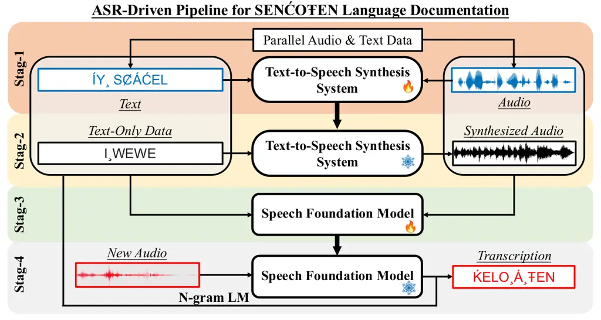
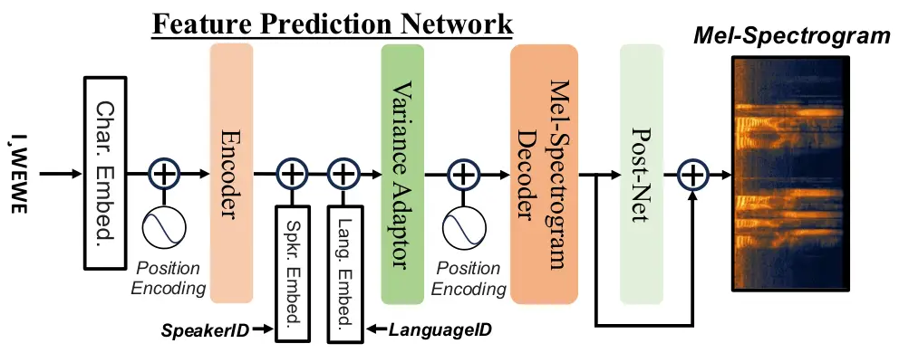
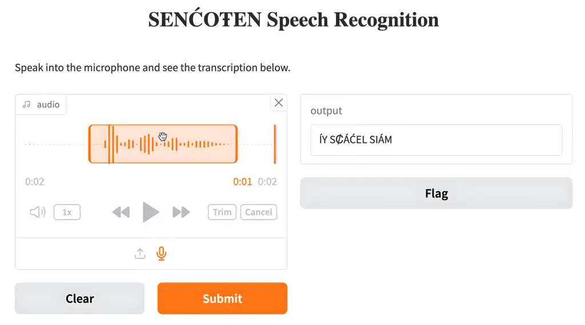

# Supporting SENĆOT  EN Language Documentation Efforts with Automatic Speech Recognition

Mengzhe Geng  Patrick Littell  Aidan Pine  PENÁĆ  Marc Tessier  Roland
Kuhn Affiliation: National Research Council Canada, Ottawa, ON, Canada
Email: [first.last@nrc-cnrc.gc.ca](mailto:)
Affiliation: \textsubbarWSÁNEĆ School Board, Brentwood Bay, BC, Canada

###### Abstract

The SENĆOT  EN language, spoken on the Saanich peninsula of southern
Vancouver Island, is in the midst of vigorous language revitalization
efforts to turn the tide of language loss as a result of colonial
language policies. To support these on-the-ground efforts, the community
is turning to digital technology. Automatic Speech Recognition (ASR)
technology holds great promise for accelerating language documentation
and the creation of educational resources. However, developing ASR
systems for SENĆOT  EN is challenging due to limited data and
significant vocabulary variation from its polysynthetic structure and
stress-driven metathesis. To address these challenges, we propose an
ASR-driven documentation pipeline that leverages augmented speech data
from a text-to-speech (TTS) system and cross-lingual transfer learning
with Speech Foundation Models (SFMs). An n-gram language model is also
incorporated via shallow fusion or n-best restoring to maximize the use
of available data. Experiments on the SENĆOT  EN dataset show a word
error rate (WER) of 19.34% and a character error rate (CER) of 5.09% on
the test set with a 57.02% out-of-vocabulary (OOV) rate. After filtering
minor cedilla-related errors, WER improves to 14.32% (26.48% on unseen
words) and CER to 3.45%, demonstrating the potential of our ASR-driven
pipeline to support SENĆOT  EN language documentation.

^(†)^(†)footnotetext: ^(∗)Corresponding author.

## 1 Introduction

Language documentation often plays an important role in the
revitalization of Indigenous languages. Language revitalization is, in
turn, crucially important for preserving the cultural heritage and
identity of Indigenous communities. SENĆOT  EN (str), the language of
the \textsubbarWSÁNEĆ people, has faced considerable challenges, largely
due to the cumulative effects of historical marginalization and cultural
suppression (Haque and Patrick, 2015; Pine and Turin, 2017). With a
sharp reduction in fluent speakers, many Indigenous languages in Canada,
including SENĆOT  EN, are at a critical juncture. Of the approximately
70 Indigenous languages in Canada, many urgently require revitalization
efforts to prevent further loss (Littell et al., 2018). In this context,
Automatic Speech Recognition (ASR) technology offers significant
potential for language revitalization by supporting the transcription of
spoken language, thereby potentially accelerating the development of
educational curriculum developed from audio data (Jimerson and
Prud’hommeaux, 2018; Foley et al., 2018; Littell et al., 2018; Gupta and
Boulianne, 2020a; Gupta and Boulianne, 2020b; Liu et al., 2022;
Rodríguez and Cox, 2023). While ASR technologies have made significant
strides for widely spoken languages (Peddinti et al., 2015; Chan et al.,
2016; Wang et al., 2020; Gulati et al., 2020; Hu et al., 2022; Li
et al., 2023; Hu et al., 2024), research on ASR systems for Canadian
Indigenous languages (Gupta and Boulianne, 2020a; Gupta and Boulianne,
2020b) remains limited.

SENĆOT  EN, also known as the Saanich language, is spoken around the
Saanich peninsula in the southern region of Vancouver Island and on
neighboring islands in the Strait of Georgia. The language is written
with a distinct alphabet developed by the late Dave Elliott
Sr. (FirstVoices, 2024). As of 2022, there are a reported 16 fluent
SENĆOT  EN speakers and 165 semi-speakers (Gessner et al., 2022). While
ongoing and vigorous revitalization efforts (Brand et al., 2002; Jim,
2016; Bird and Kell, 2017; Bird, 2020; Elliott Sr, 2024; Pine et al., 2025) are in place, there have been no prior efforts to leverage ASR
techniques to support the documentation and revitalization of
SENĆOT  EN.

This paper aims to address the gap by investigating cutting-edge
ASR-based techniques that can support SENĆOT  EN language documentation
efforts. However, developing ASR systems for SENĆOT  EN presents two
major challenges: 1) Limited data resources: Compared with high-resource
languages like English, there are very few digitized materials in
SENĆOT  EN (Pine et al., 2022b), and even fewer audio recordings are
available with aligned transcriptions; 2) Extensive vocabulary
variation: Beyond the relatively polysynthetic nature of SENĆOT  EN,
metathesis driven by stress patterns further contributes to the vast
number of possible word forms as illustrated below from Montler (1986,
Section 2.3.5.4.3):

\lingset

glspace=!0pt plus .2em \ex\[glhangstyle=none\]
\begingl\gla\textsubbarTQET //
\glb\textipa\textcrlambda’k^(w)’\\textschwat// \glft‘Put it out (a
fire).’// \endgl\xe

\lingset

glspace=!0pt plus .2em \ex\[glhangstyle=none\]
\begingl\gla\textsubbarTEQT SEN //
\glb\textipa\textcrlambda’\\textschwak^(w)’t s\textschwan// \glft‘I’m
putting it out.’// \endgl\xe

Such morphological and phonological complexity makes it impractical to
construct a sufficiently large dictionary. As a result, many words to be
transcribed are absent from the system’s training data (i.e., out of
vocabulary). These two challenges, taken together, significantly hinder
the development of robust ASR systems for SENĆOT  EN.

To tackle the challenges associated with the development of ASR systems
for SENĆOT  EN, this paper explores a range of state-of-the-art
techniques, with an emphasis on end-to-end (E2E) models. E2E approaches
offer a distinct advantage over traditional GMM-HMM or hybrid DNN-based
systems, as they eliminate the need for a fixed lexicon. Given
SENĆOT  EN’s highly complex morphology, as well as the difficulty of
building an exhaustive lexicon, E2E models are particularly well-suited
to the task. However, a major drawback of E2E systems is their reliance
on large datasets, which poses a significant obstacle for low-resource
languages like SENĆOT  EN. To address this, we propose two
strategies: 1) ASR data augmentation through a carefully designed
text-to-speech (TTS) synthesis pipeline, and 2) cross-lingual transfer
learning leveraging speech foundation models (SFMs). Additionally, we
incorporate an external n-gram language model (LM) using either shallow
fusion (Kannan et al., 2018) or n-best rescoring (Chow and Schwartz, 1989) to make the most of the available data.

Experiments were conducted using the SENĆOT  EN speech dataset,
comprising 4 hours of recorded audio from the “Speech Generation for
Indigenous Language Education project (Pine et al., 2025). The results
show that systems employing cross-lingual transfer learning with speech
foundation models significantly outperformed conventional hybrid
time-delay neural networks (TDNNs), particularly when recognizing unseen
words not present in the training set. Moreover, incorporating
TTS-synthesized data in ASR training and an external n-gram LM further
enhanced system performance.

Figure 1: The proposed multi-stage ASR-driven pipeline to support
SENĆOT  EN language documentation.

This paper’s key contributions are below:

1.  1.  First comprehensive investigation of SFMs for documenting
        low-resource languages: This study represents the first systematic
        investigation of speech foundation models for the development of ASR
        systems aimed at supporting the documentation of Canadian Indigenous
        languages. Prior research on languages such as Inuktitut (Gupta and
        Boulianne, 2020a), Cree (Gupta and Boulianne, 2020b), and other
        North American Indigenous languages, including Hupa (Liu et al.,
        2022), has predominantly employed hybrid ASR architectures. These
        approaches typically demand in-depth linguistic expertise,
        particularly for the careful design and selection of subword units.
        While models such as Wav2vec2, XLS-R and Whisper have been explored
        for language documentation tasks (Jimerson et al., 2023; Rodríguez
        and Cox, 2023), including for languages like Hupa (Jimerson et al.,
        2023; Venkateswaran and Liu, 2024), Seneca (Jimerson et al., 2023)
        and Oneida (Jimerson et al., 2023), our work is the first to conduct
        a comprehensive investigation of pre-trained SFMs in this context.
        By leveraging these models, we aim to widen the so-called
        “transcription bottleneck” and accelerate language documentation
        efforts.
2.  2.  First ASR-driven documentation pipeline for the SENĆOT  EN language:
        This work introduces the first ASR-driven documentation pipeline
        tailored for SENĆOT  EN. To address the challenges of limited data
        and high lexical variation, we adopt a two-pronged strategy: ASR
        data augmentation via TTS and cross-lingual transfer learning based
        on SFMs. Moreover, we perform a systematic analysis of ASR
        performance under more extreme conditions, reducing the available
        training data to as little as 10 minutes¹¹ 1 Details can be found in
        the Appendix..
3.  3.  Promising ASR performance with extended error analysis: The
        top-performing system, integrating cross-lingual transfer learning,
        TTS-based data augmentation and language model fusion, achieves a
        word error rate (WER) of 19.34% and a character error rate (CER) of
        5.09% on the test set with a 57.02% out-of-vocabulary (OOV) rate.
        Furthermore, by filtering out minor errors involving missing or
        extraneous cedillas ($`\hskip 1.99997pt\c{}\hskip 1.99997pt`$), the
        WER and CER further improve to 14.32% (26.48% on unseen words) and
        3.45%, respectively. These findings highlight the system’s
        capability to significantly expedite the transcription process for
        SENĆOT  EN, providing valuable assistance in efforts to revitalize
        the language.

The rest of the paper is organized as follows. Section 2 outlines the
proposed ASR-driven pipeline developed to support the documentation of
the SENĆOT  EN language. Section 3 details the TTS system for
synthesizing audio to augment ASR training data. Section 4 discusses the
application of cross-lingual transfer learning based on speech
foundation models. Experimental results and analysis on the SENĆOT  EN
dataset are presented in Section 5. Section 6 provides conclusions and
discusses potential directions for future research.

## 2 ASR-Driven Pipeline for SENĆOT  EN Language Documentation

As illustrated in Figure 1, our proposed ASR-driven pipeline for
SENĆOT  EN language documentation consists of four stages, with
carefully designed procedures to maximize the usage of the available
audio and text data:

Stage 1: Train the TTS system: Parallel audio and text data in
SENĆOT  EN are used to train a custom-designed text-to-speech (TTS)
system, which will be described in detail in Section 3.

Stage 2: Generate synthesized audio via TTS: SENĆOT  EN text without
accompanying audio is fed into the trained TTS system to generate the
corresponding synthesized audio.

Stage 3: Perform cross-lingual transfer learning on the SFM: The
original parallel audio and text data, combined with the synthesized
audio from the text-only data, are utilized to perform cross-lingual
transfer learning on the speech foundation model (SFM), which will be
outlined in Section 4.

Stage 4: Transcribe new audio with the fine-tuned SFM: New audio in
SENĆOT  EN is transcribed using the fine-tuned SFM, with the option to
fuse an external language model (LM) trained on part or all of the
available text data to further improve accuracy.

## 3 Text-to-Speech Synthesis

Figure 2: Architecture of the feature prediction work of our TTS system.
“Char. Embed.”, “Spkr. Embed.” and “Lang. Embed.” respectively denote
character, speaker, and language embeddings.

Text-to-speech (TTS) synthesis has emerged as a powerful technique for
augmenting ASR training datasets (Gokay and Yalcin, 2019), particularly
in scenarios where parallel audio and text resources are limited. As
there exists written SENĆOT  EN text without corresponding audio
recordings, TTS-generated audio can be used to augment the training data
for developing SENĆOT  EN ASR systems.

To mitigate the scarcity of parallel audio & text data in SENĆOT  EN, a
three-phase approach is adopted using the EveryVoice TTS Toolkit Pine
et al. (2022b), including 1) training a feature prediction network, 2)
developing a vocoder, and 3) aligning vocoder outputs with
mel-spectrograms generated by the prediction network (i.e., vocoder
matching).

### 3.1 Feature Prediction Network

Building on the work of Pine et al. (2022b), the EveryVoice TTS toolkit
uses a modified FastSpeech 2 (Ren et al., 2020) architecture as the
feature prediction network. As illustrated in Figure 2, the key
modifications are:

- •
  Substitution of standard convolutions with depthwise separable
  convolutions in both the encoder and mel-spectrogram decoder (Pine
  et al., 2022b) to enhance parameter efficiency.
- •
  Integration of learnable speaker embeddings (Figure 2, middle, in
  circled box).
- •
  Incorporation of a decoder post-net (Figure 2, right, in light green).

Moreover, pre-generated forced alignments are replaced by a
jointly-trained alignment module (Badlani et al., 2022), while pitch and
energy are predicted at the phoneme level instead of the frame level to
achieve smoother prosody.

### 3.2 Vocoder

Since speech foundation models directly process raw audio, ensuring
high-quality waveform synthesis is crucial. The vocoder, which converts
intermediate mel-spectrograms into waveforms, plays a key role in this
process. To this end, we utilize HiFi-GAN (Kong et al., 2020), a widely
adopted generative adversarial network recognized for generating natural
and high-quality waveforms, as the vocoder in our TTS system.

### 3.3 Vocoder Matching

To mitigate the artifacts arising from limited training data, a vocoder
matching strategy is employed after the initial training of the vocoder.
This process fine-tunes the vocoder using mel-spectrograms generated by
the feature prediction network as input, aligning it with the specific
characteristics of these spectrograms to minimize discrepancies between
training and inference conditions.

## 4 Cross-Lingual Transfer Learning

The limited availability of SENĆOT  EN data makes it impractical to
train an end-to-end (E2E) ASR system from scratch. Alternatively, recent
advances in speech foundation models (SFMs), which are pre-trained on
large-scale datasets, offer a promising pathway for cross-lingual
transfer learning in low-resource languages like SENĆOT  EN.

SFMs can be categorized into two main types:

Encoder-Based SFM: Encoder-based SFMs have gained widespread adoption
due to their ability to convert raw audio into representations useful
for various downstream tasks. Widely recognized models in this category
include Wav2Vec 2.0 (Wav2Vec2) (Baevski et al., 2020), HuBERT (Hsu
et al., 2021), WavLM (Chen et al., 2022), and Data2Vec (Baevski et al.,
2022). These models employ a single encoder architecture to process
audio, with a focus on self-supervised learning from unlabeled data.
Both Wav2Vec2 and HuBERT excel at capturing rich speech representations,
which are crucial for ASR in low-resource settings. WavLM further
improves performance by effectively modeling not only speech but also
environmental noise, making it particularly robust in challenging
acoustic conditions. Data2Vec, on the other hand, expands the
applicability of these models by generalizing the approach to multiple
modalities.

Encoder-Decoder-Based SFM: In contrast, encoder-decoder-based SFMs
integrate both an encoder to process the input audio and a decoder to
generate transcriptions or other forms of output. Whisper (Radford
et al., 2023) is among the most well-known models in this category. By
combining these two components, Whisper is capable of end-to-end
transcription, making it a powerful tool for ASR tasks. Its architecture
is particularly useful for languages with limited resources, as the
encoder-decoder framework allows for more sophisticated handling of
complex linguistic structures through cross-lingual transfer learning.

## 5 Experiments

### 5.1 Task Description

Parallel Audio & Text Data: The SENĆOT  EN speech dataset, part of the
“Speech Generation for Indigenous Language Education” project (Pine
et al., 2025), consists of about 4 hours of single-speaker recordings. A
Kaldi-based (Povey et al., 2011) GMM-HMM system is used to estimate
emission probabilities for each utterance. 20% of the data is then
allocated as the test set based on these estimates to ensure a balanced
representation of difficulty. After silence stripping, the training set
contains 1.7 hours and the test set 0.2 hours, with average utterance
lengths of 2.06 and 2.04 seconds, respectively. The training set
consists of 3k utterances with 3.6k distinct words, while the test set
includes 0.8k utterances with 1.2k distinct words. The average word
length is 3.6 characters in both sets. Due to SENĆOT  EN’s polysynthetic
nature and stress-driven metathesis, the test set shows a high
out-of-vocabulary (OOV) rate of 57.02%.

Text-Only Data: We have permission to access the SENĆOT  EN
dictionary (Montler, 2018), the most comprehensive lexicographic
resource for the language, containing over 30k words and example
sentences. This data is text-only, with no corresponding audio. 27k
words and sentences are retained after filtering out overly long entries
exceeding 81 characters.

### 5.2 Experiment Setup

Data processing: We conduct silence stripping using SoX²² 2
[https://linux.die.net/man/1/sox](https://linux.die.net/man/1/sox) and
denoise the audio with an RNN-based denoiser³³ 3
[https://github.com/xiph/rnnoise](https://github.com/xiph/rnnoise). The
audio is then resampled to 16 kHz for ASR and 22.05 kHz for TTS
development, while words are segmented into characters.

Text-to-Speech Synthesis: The TTS system outlined in Section 3 is built
using the EveryVoice TTS Toolkit⁴⁴ 4
[https://github.com/EveryVoiceTTS/EveryVoice](https://github.com/EveryVoiceTTS/EveryVoice).
The train/test split mirrors that of the ASR system. The modified
FastSpeech2 feature prediction network includes 4 encoder and 4 decoder
blocks⁵⁵ 5 Both encoder and decoder blocks have a 1024-dim feed-forward
layer and two 128-dim attention heads., while HiFi-GAN in its V1
configuration (Kong et al., 2020) is used as the vocoder. The
synthesized audio is automatically evaluated using the TorchSquim (Kumar
et al., 2023) model, which provides estimates for short-time objective
intelligibility (STOI), perceptual evaluation of speech quality (PESQ),
scale-invariant signal-to-noise ratio (SI-SNR), and mean opinion score
(MOS).

Cross-lingual Transfer Learning: We utilize the Hugging Face platform to
perform cross-lingual transfer learning with both encoder-based speech
foundation models, including Wav2Vec2, HuBERT, WavLM, and Data2Vec, as
well as encoder-decoder-based models⁶⁶ 6
[https://huggingface.co/blog/{fine-tune-wav2vec2-english,fine-tune-whisper}](https://huggingface.co/blog/%7Bfine-tune-wav2vec2-english,fine-tune-whisper%7D)
like Whisper. SFMs of varying model sizes and pretraining data serve as
the starting point for this process.

Language Model Fusion: We construct two 4-gram language models (LMs)
using the KenLM toolkit (Heafield, 2011):

- •
  A smaller model (“small-4g”) trained exclusively on the text from the
  training set.
- •
  A larger model (“large-4g”) that also incorporates the 27k text-only
  SENĆOT  EN sentences.

The “small-4g” LM covers 3.6k words, while the “large-4g” spans 14k. For
encoder-based SFMs (e.g., Wav2Vec2), shallow fusion (Kannan et al., 2018) integrates the n-gram LM during decoding. For encoder-decoder SFMs
(e.g., Whisper), the LM rescales the n-best hypothesis list.

### 5.3 Performance Analysis

|                  |                     |                     |                       |                    |
| ---------------- | ------------------- | ------------------- | --------------------- | ------------------ |
| Vocoder Matching | STOI ($`\uparrow`$) | PESQ ($`\uparrow`$) | SI-SNR ($`\uparrow`$) | MOS ($`\uparrow`$) |
| ✗                | 0.980               | 3.207               | 20.339                | 4.227              |
| ✓                | 0.985               | 3.324               | 20.809                | 4.336              |

Table 1: TTS evaluation on the SENĆOT  EN test set.

|      |                     |               |          |                       |                       |        |       |
| ---- | ------------------- | ------------- | -------- | --------------------- | --------------------- | ------ | ----- |
| Sys. | Model               | Multi-Lingual | LM       | CER% ($`\downarrow`$) | WER% ($`\downarrow`$) |        |       |
|      |                     |               |          |                       | seen                  | unseen | all   |
| 1    | Wav2Vec2-random-int | -             | -        | 84.36                 | 99.94                 | 100.00 | 99.96 |
| 2    | Wav2Vec2-base       | ✗             | -        | 10.68                 | 36.18                 | 65.99  | 49.10 |
| 3    | Wav2Vec2-large      |               |          | 8.25                  | 21.42                 | 56.87  | 35.04 |
| 4    | Wav2Vec2-xlsr-53    | ✓             | -        | 11.23                 | 33.48                 | 69.13  | 51.44 |
| 5    | Wav2Vec2-xls-r-300m |               |          | 10.41                 | 31.55                 | 63.35  | 45.63 |
| 6    | Wav2Vec2-xls-r-1b   |               |          | 6.32                  | 14.87                 | 55.04  | 27.81 |
| 7    | Data2Vec-base       | ✗             | -        | 14.89                 | 40.09                 | 78.56  | 60.61 |
| 8    | Data2Vec-large      |               |          | 9.29                  | 27.75                 | 60.08  | 40.51 |
| 9    | HuBERT-base         | ✗             | -        | 13.34                 | 45.15                 | 72.04  | 58.61 |
| 10   | HuBERT-large        |               |          | 12.29                 | 44.66                 | 69.78  | 56.06 |
| 11   | WavLM-base          | ✗             | -        | 11.70                 | 36.18                 | 71.27  | 50.71 |
| 12   | WavLM-large         |               |          | 13.43                 | 45.98                 | 71.88  | 59.61 |
| 13   | Whisper-medium-en   | ✗             | -        | 7.36                  | 15.38                 | 57.30  | 28.13 |
| 14   | Whisper-large-v2    | ✓             |          | 7.11                  | 14.60                 | 58.01  | 27.66 |
| 15   | Wav2Vec2-xls-r-1b   | ✓             | small-4g | 6.05                  | 12.18                 | 57.92  | 25.13 |
| 16   |                     |               | large-4g | 5.63                  | 12.35                 | 49.09  | 23.16 |
| 17   | Whisper-large-v2    | ✓             | small-4g | 6.53                  | 11.09                 | 60.14  | 25.16 |
| 18   |                     |               | large-4g | 6.12                  | 10.95                 | 50.35  | 22.67 |

Table 2: Performance of cross-lingual transfer learning using SFMs with
different architectures. ✗ in the "Multilingual" column indicates that
the SFM is pre-trained on English data only. "WER/CER" represents
word/character error rate, while "seen" and "unseen" refer to whether
the test words are included in the original training data.

The evaluation of the TTS system, cross-lingual transfer learning with
SFMs, and the integration of TTS-based data augmentation and language
models is conducted on the test set described in Section 5.1. In this
context, “seen” and “unseen” words in terms of word error rate (WER)
refer to whether the test words were present in the original training
data.

Text-to-Speech Synthesis: We evaluate the TTS system on the SENĆOT  EN
test set using four metrics: STOI, PESQ, SI-SNR, and MOS. As indicated
in Table 1, performance improves across all four metrics with vocoder
matching. Based on this, we use the vocoder-matched system to synthesize
27k SENĆOT  EN sentences outlined in Section 5.1, resulting in
approximately 11.6 hours of generated speech for ASR data augmentation.
Compared to the 13.3-hour augmented training set, the test set retains
an OOV rate of 29.96%.

Cross-lingual Transfer Learning: Table 2 illustrates the results of
cross-lingual transfer learning across various speech foundation models
(SFMs). As part of an ablation study (Sys. 1), we also carry out an
additional experiment where the weights of the Wav2Vec2-base model are
randomly re-initialized to serve as the starting point. In addition, the
top-performing encoder- and encoder-decoder-based SFMs are further
integrated with the 4-gram LMs (Sys. 15-18).

Several insights can be drawn from Table 2: 1) Larger SFMs do not
consistently deliver better results than smaller models with similar
architectures (Sys. 12 vs. 11). 2) Although the top-performing SFMs are
pre-trained on multilingual datasets (Sys. 6, 14), they do not always
outperform monolingual models with similar structures trained solely on
English (Sys. 4-5 vs. 3). 3) Incorporating an external LM further boosts
performance (Sys. 15-16 vs. 6 and Sys. 17-18 vs. 14), with larger LMs
providing better outcomes (Sys. 16 vs. 15, Sys. 18 vs. 17). 4) A
substantial performance gap exists between words covered (“seen”) in the
training data and those that are not (“unseen”), while the
top-performing systems (Sys. 16,18) correctly transcribe roughly half of
the unseen words.

|      |           |          |                       |                       |        |       |
| ---- | --------- | -------- | --------------------- | --------------------- | ------ | ----- |
| Sys. | Aug. Data | LM       | CER% ($`\downarrow`$) | WER% ($`\downarrow`$) |        |       |
|      |           |          |                       | seen                  | unseen | all   |
| 1    | 1h        | -        | 6.67                  | 12.97                 | 54.97  | 25.38 |
| 2    | 2h        |          | 6.02                  | 12.67                 | 51.42  | 23.99 |
| 3    | 4h        |          | 5.84                  | 12.67                 | 47.52  | 22.86 |
| 4    | 6h        |          | 5.72                  | 11.34                 | 49.79  | 22.56 |
| 5    | 8h        |          | 5.79                  | 11.79                 | 48.44  | 22.53 |
| 6    | all       |          | 5.63                  | 12.18                 | 44.81  | 22.01 |
| 7    | 1h        | small fg | 6.80                  | 10.55                 | 56.31  | 23.74 |
| 8    | 2h        |          | 5.82                  | 10.95                 | 52.41  | 22.82 |
| 9    | 4h        |          | 5.50                  | 9.71                  | 49.79  | 21.21 |
| 10   | 6h        |          | 5.59                  | 9.96                  | 50.50  | 21.65 |
| 11   | 8h        |          | 5.42                  | 9.57                  | 48.73  | 20.70 |
| 12   | all       |          | 5.26                  | 9.91                  | 46.51  | 20.51 |
| 13   | 1h        | large fg | 6.60                  | 10.65                 | 49.08  | 22.60 |
| 14   | 2h        |          | 5.96                  | 10.06                 | 49.36  | 22.42 |
| 15   | 4h        |          | 5.38                  | 9.57                  | 45.67  | 20.84 |
| 16   | 6h        |          | 5.18                  | 9.22                  | 46.60  | 20.44 |
| 17   | 8h        |          | 5.09                  | 8.43                  | 44.96  | 19.34 |
| 18   | all       |          | 5.11                  | 9.62                  | 43.53  | 20.15 |

Table 3: Performance of incorporating TTS-synthesized data in
cross-lingual transfer learning with the Whisper model. The original
training data is always included, while “all” denotes the full 11.6-h
synthesized data.

TTS-Based Data Augmentation: We progressively incorporate
TTS-synthesized data into the cross-lingual transfer learning process of
the top-performing SFM (Table 2, Sys. 18), i.e., Whisper⁷⁷ 7
[https://huggingface.co/openai/whisper-large-v2](https://huggingface.co/openai/whisper-large-v2).
The augmentation begins with 1 hour of synthesized data and scales up to
a total of 11.6 hours. As shown in Table 3, several trends can be
observed: 1) Incorporating TTS-synthesized data leads to ASR performance
improvements both with or without an external LM (Sys. 1-6, 7-12, 13-18
in Table 3 vs. Sys. 14,17,18 in Table 2), with overall WER reductions of
up to 5.65% abs. (20.43% rel.) and 13.20% abs. (22.75% rel.) on unseen
words absent from the original training set (Sys. 6 in Table 3 vs. Sys.
14 in Table 2). 2) For systems fused with the large 4-gram LM covering
all text used for TTS, the inclusion of synthesized audio further
improves ASR performance (Sys. 13-18 in Table 3 vs. Sys. 18 in Table 2). 3) There is a general trend of performance convergence when 8 hours of
TTS-synthesized data are added (Sys. 5,11,17 in Table 3).

### 5.4 Language Documentation Support

The motivation for this project stemmed from discussions between the
authors in the context of regular meetings related to a multi-year TTS
research project, described in detail in Pine et al. (2025). ASR was not
an explicit goal of the project that brought us together, but the first
author of this paper has expertise in speech recognition and realized
that we had some of the requisite pieces to develop a proof-of-concept
ASR system, namely, an established relationship with the language
community in question, pre-trained TTS models, and some modest amounts
of parallel text-audio data. The first author proposed the idea, along
with possible benefits and risks, to members of the \textsubbarWSÁNEĆ
school Board at a meeting for the TTS project, which was met with
enthusiasm and support leading to this initial effort. Despite the
strong results from these initial experiments, many more steps and
protocols will be required to connect this technology with on-the-ground
language efforts.

To help us demonstrate the capabilities of this technology, we developed
an intuitive, web-based user interface and API using the Gradio
framework (Abid et al., 2019) in Python. The interface, as illustrated
in Figure 3, allows users to interact with the model by either speaking
directly into the microphone or uploading a pre-recorded audio file.
After providing the input, users can click the “Submit” button
(Figure 3, bottom, in orange) to generate an automatic transcription,
displayed in the text box labeled “output” (Figure 3, right).

Additionally, users can select specific segments of the audio (Figure 3,
left) to view their corresponding transcriptions, enabling precise
analysis of smaller portions of the recording. The “Flag” button,
located on the right, allows users to mark an audio-transcription pair
for further review, annotation, or reference. This functionality is
particularly useful for collaborative workflows, where flagged segments
may require validation or additional context from language experts. By
simplifying transcription workflows, the interface streamlines language
documentation, enabling linguists, community members, and researchers to
efficiently process spoken language data with decreased manual effort.
Features like audio segmentation and flagging support iterative
transcription processes, while the web-based design ensures
accessibility across a wide range of devices, making it well-suited for
teams working in different locations.

To safeguard the model’s privacy, the interface is currently accessible
exclusively through a private web gateway. Future developments aim to
facilitate closer alignment with documentation and language
revitalization workflows (Cox, 2019; Adams et al., 2021, e.g.,).

Figure 3: Demonstration of the user interface designed to support
SENĆOT  EN language documentation.

A closer examination of the decoded outputs from the SENĆOT  EN ASR
systems reveals that a notable portion of the errors involve missing or
extraneous cedillas ($`\hskip 1.99997pt\c{}\hskip 1.99997pt`$) which
indicate either glottalization when following resonant or glottal stops
otherwise. Given that these errors are relatively easily correctable by
a SENĆOT  EN speaker, and that the consistency of their use varies, we
reassess the ASR performance with these errors excluded. As shown in
Table 4, the system achieves an overall WER of 14.32%, a CER of 3.45%,
and a WER of 26.48% on unseen words. This demonstrates the potential of
our proposed ASR-driven pipeline to support the documentation for
SENĆOT  EN.

|         |                       |                       |        |       |
| ------- | --------------------- | --------------------- | ------ | ----- |
| Model   | CER% ($`\downarrow`$) | WER% ($`\downarrow`$) |        |       |
|         |                       | seen                  | unseen | all   |
| Whisper | 3.45                  | 6.88                  | 26.48  | 14.32 |

Table 4: Performance of the top-performing SFM (Sys. 17 in Table 3),
excluding errors related to cedilla
($`\hskip 1.99997pt\c{}\hskip 1.99997pt`$).

## 6 Conclusion

In this paper, we proposed an ASR-driven pipeline designed to tackle the
unique challenges of documenting the SENĆOT  EN language, which is
hindered by data scarcity, substantial vocabulary variation, and
phonological complexity. By incorporating augmented speech data from a
TTS system, cross-lingual transfer learning using speech foundation
models (SFMs), and an n-gram language model via shallow fusion, we
demonstrated the effectiveness of our approach in improving ASR
performance for low-resource languages. Our experiments on the
SENĆOT  EN dataset yielded a WER of 19.34% and a CER of 5.09%, with
further improvements to a WER of 14.32% (26.48% on unseen words) and a
CER of 3.45% after mitigating minor cedilla-related errors. These
results highlight the potential of the proposed pipeline to enhance
SENĆOT  EN language documentation, offering a valuable tool for ongoing
language revitalization efforts. Future work will focus on more
linguistically oriented techniques, for example, modeling stress-driven
metathesis in SENĆOT  EN.

## References

- Abid et al. (2019) Abubakar Abid, Ali Abdalla, Ali Abid, Dawood Khan,
  Abdulrahman Alfozan, and James Zou. 2019. Gradio: Hassle-free sharing
  and testing of ml models in the wild. _arXiv preprint
  arXiv:1906.02569_.
- Adams et al. (2021) Oliver Adams, Benjamin Galliot, Guillaume
  Wisniewski, Nicholas Lambourne, Ben Foley, Rahasya Sanders-Dwyer,
  Janet Wiles, Alexis Michaud, Séverine Guillaume, Laurent Besacier,
  Christopher Cox, Katya Aplonova, Guillaume Jacques, and Nathan
  Hill. 2021. [User-friendly automatic transcription of low-resource
  languages: Plugging ESPnet into
  elpis](https://aclanthology.org/2021.computel-1.7). In _Proceedings of
  the 4th Workshop on the Use of Computational Methods in the Study of
  Endangered Languages (ComputEL-4)_, pages 51–62.
- Badlani et al. (2022) Rohan Badlani, Adrian Łańcucki, Kevin J. Shih,
  Rafael Valle, Wei Ping, and Bryan Catanzaro. 2022. One TTS Alignment
  to Rule Them All. In _Proceedings of the IEEE International Conference
  on Acoustics, Speech, and Signal Processing (ICASSP)_.
- Baevski et al. (2022) Alexei Baevski, Wei-Ning Hsu, Qiantong Xu, Arun
  Babu, Jiatao Gu, and Michael Auli. 2022. Data2vec: A general framework
  for self-supervised learning in speech, vision and language. In
  _Proceedings of the International Conference on Machine Learning
  (ICML)_.
- Baevski et al. (2020) Alexei Baevski, Yuhao Zhou, Abdelrahman Mohamed,
  and Michael Auli. 2020. wav2vec 2.0: A framework for self-supervised
  learning of speech representations. _Advances in neural information
  processing systems_.
- Bird (2020) Sonya Bird. 2020. Pronunciation among adult Indigenous
  language learners: The case of SENĆOT  EN. _Journal of Second Language
  Pronunciation_, 6(2):148–179.
- Bird and Kell (2017) Sonya Bird and Sarah Kell. 2017. The role of
  pronunciation in SENĆOT  EN language revitalization. _Canadian Modern
  Language Review_, 73(4):538–569.
- Brand et al. (2002) Peter Brand, John Elliot, and Ken Foster. 2002.
  Language revitalization using multimedia. _Indigenous languages across
  the community_, pages 245–247.
- Chan et al. (2016) William Chan, Navdeep Jaitly, Quoc Le, et al. 2016.
  Listen, attend and spell: A neural network for large vocabulary
  conversational speech recognition. In _Proceedings of the IEEE
  International Conference on Acoustics, Speech, and Signal Processing
  (ICASSP)_.
- Chen et al. (2022) Sanyuan Chen, Chengyi Wang, Zhengyang Chen, Yu Wu,
  Shujie Liu, Zhuo Chen, Jinyu Li, Naoyuki Kanda, Takuya Yoshioka, Xiong
  Xiao, et al. 2022. Wavlm: Large-scale self-supervised pre-training for
  full stack speech processing. _IEEE Journal of Selected Topics in
  Signal Processing_.
- Chow and Schwartz (1989) Yen-Lu Chow and Richard Schwartz. 1989. The
  n-best algorithm: Efficient procedure for finding top n sentence
  hypotheses. In _Speech and Natural Language: Proceedings of a Workshop
  Held at Cape Cod, Massachusetts, October 15-18, 1989_.
- Cox (2019) Christopher Cox. 2019.
  [Persephone-ELAN](https://github.com/coxchristopher/persephone-elan).
  Available at:
  [https://github.com/coxchristopher/persephone-elan](https://github.com/coxchristopher/persephone-elan).
- Elliott Sr (2024) Dave Elliott Sr. 2024. _Saltwater People_. SD 63,
  Victoria, BC, Canada. Available at:
  [https://www.uvicbookstore.ca/general/browse/abor/9780000105356](https://www.uvicbookstore.ca/general/browse/abor/9780000105356).
- FirstVoices (2024) FirstVoices. 2024. SENĆOT  EN.
  [https://www.firstvoices.com/sencoten](https://www.firstvoices.com/sencoten).
  Accessed: 2024-10-01.
- Foley et al. (2018) Ben Foley, Josh Arnold, Rolando Coto-Solano,
  Gautier Durantin, T. Mark Ellison, Daan van Esch, Scott Heath, Františ
  ek Kratochvíl, Zara Maxwell-Smith, David Nash, Ola Olsson, Mark
  Richards, Nay San, Hywel Stoakes, Nick Thieberger, and Janet
  Wiles. 2018. [Building Speech Recognition Systems for Language
  Documentation: The CoEDL Endangered Language Pipeline and Inference
  System (ELPIS)](https://doi.org/10.21437/SLTU.2018-43). In _6th
  Workshop on Spoken Language Technologies for Under-Resourced Languages
  (SLTU 2018)_, pages 205–209.
- Gessner et al. (2022) Suzanne Gessner, Tracey Herbert, and Aliana
  Parker. 2022. [The Report on the Status of B.C. First Nations
  Languages
  2022](https://fpcc.ca/resource/language-status-report-2022/).
  Accessed: 2024-10-01.
- Gokay and Yalcin (2019) Ramazan Gokay and Hulya Yalcin. 2019.
  Improving Low Resource Turkish Speech Recognition with Data
  Augmentation and TTS. In _2019 16th International Multi-Conference on
  Systems, Signals & Devices (SSD)_.
- Gulati et al. (2020) Anmol Gulati, James Qin, Chung-Cheng Chiu,
  et al. 2020. Conformer: Convolution-augmented Transformer for Speech
  Recognition. In _Proceedings of the Annual Conference of the
  International Speech Communication Association (INTERSPEECH)_.
- Gupta and Boulianne (2020a) Vishwa Gupta and Gilles Boulianne. 2020a.
  Automatic transcription challenges for Inuktitut, a low-resource
  polysynthetic language. In _Proceedings of the International
  Conference on Language Resources and Evaluation (LREC)_.
- Gupta and Boulianne (2020b) Vishwa Gupta and Gilles Boulianne. 2020b.
  Speech transcription challenges for resource constrained indigenous
  language Cree. In _Proceedings of the Joint Workshop on Spoken
  Language Technologies for Under-resourced Languages and Collaboration
  and Computing for Under-Resourced Languages (SLTU-CCURL)_.
- Haque and Patrick (2015) Eve Haque and Donna Patrick. 2015. Indigenous
  languages and the racial hierarchisation of language policy in Canada.
  _Journal of Multilingual and Multicultural Development_.
- Heafield (2011) Kenneth Heafield. 2011. Kenlm: Faster and smaller
  language model queries. In _Proceedings of the sixth workshop on
  statistical machine translation_, pages 187–197.
- Hsu et al. (2021) Wei-Ning Hsu, Benjamin Bolte, Yao-Hung Hubert Tsai,
  Kushal Lakhotia, Ruslan Salakhutdinov, and Abdelrahman Mohamed. 2021.
  Hubert: Self-supervised speech representation learning by masked
  prediction of hidden units. _IEEE/ACM Transactions on Audio, Speech,
  and Language Processing (TASLP)_.
- Hu et al. (2022) Shoukang Hu, Xurong Xie, Mingyu Cui, Jiajun Deng,
  Shansong Liu, Jianwei Yu, Mengzhe Geng, Xunying Liu, and Helen
  Meng. 2022. Neural architecture search for LF-MMI trained time delay
  neural networks. _IEEE/ACM Transactions on Audio, Speech, and Language
  Processing (TASLP)_.
- Hu et al. (2024) Shujie Hu, Xurong Xie, Mengzhe Geng, Zengrui Jin,
  Jiajun Deng, Guinan Li, Yi Wang, Mingyu Cui, Tianzi Wang, Helen Meng,
  et al. 2024. Self-supervised asr models and features for dysarthric
  and elderly speech recognition. _IEEE/ACM Transactions on Audio,
  Speech, and Language Processing_, 32:3561–3575.
- Jim (2016) Jacqueline Jim. 2016. \textsubbarWSÁNEĆ SEN: I am emerging:
  An Auto-Ethnographic study of life long SENĆOT  EN language learning.
  Master’s thesis, University of Victoria, Victoria, British Columbia,
  Canada.
- Jimerson and Prud’hommeaux (2018) Robbie Jimerson and Emily
  Prud’hommeaux. 2018. [ASR for documenting acutely under-resourced
  indigenous languages](https://aclanthology.org/L18-1657/). In
  _Proceedings of the Eleventh International Conference on Language
  Resources and Evaluation (LREC 2018)_, Miyazaki, Japan. European
  Language Resources Association (ELRA).
- Jimerson et al. (2023) Robert Jimerson, Zoey Liu, and Emily
  Prud’Hommeaux. 2023. An (unhelpful) guide to selecting the best asr
  architecture for your under-resourced language. In _Proceedings of the
  61st Annual Meeting of the Association for Computational Linguistics
  (Volume 2: Short Papers)_, pages 1008–1016.
- Kannan et al. (2018) Anjuli Kannan, Yonghui Wu, Patrick Nguyen, Tara N
  Sainath, Zhijeng Chen, and Rohit Prabhavalkar. 2018. An analysis of
  incorporating an external language model into a sequence-to-sequence
  model. In _Proceedings of the IEEE International Conference on
  Acoustics, Speech, and Signal Processing (ICASSP)_.
- Kong et al. (2020) Jungil Kong, Jaehyeon Kim, and Jaekyoung Bae. 2020.
  Hifi-gan: Generative adversarial networks for efficient and high
  fidelity speech synthesis. _Advances in neural information processing
  systems_.
- Kumar et al. (2023) Anurag Kumar, Ke Tan, Zhaoheng Ni, Pranay Manocha,
  Xiaohui Zhang, Ethan Henderson, and Buye Xu. 2023. Torchaudio-Squim:
  Reference-Less Speech Quality and Intelligibility Measures in
  Torchaudio. In _Proceedings of the IEEE International Conference on
  Acoustics, Speech, and Signal Processing (ICASSP)_.
- Li et al. (2023) Guinan Li, Jiajun Deng, Mengzhe Geng, Zengrui Jin,
  Tianzi Wang, Shujie Hu, Mingyu Cui, Helen Meng, and Xunying Liu. 2023.
  Audio-visual end-to-end multi-channel speech separation,
  dereverberation and recognition. _IEEE/ACM Transactions on Audio,
  Speech, and Language Processing (TASLP)_.
- Littell et al. (2018) Patrick Littell, Anna Kazantseva, Roland Kuhn,
  Aidan Pine, Antti Arppe, Christopher Cox, and Marie-Odile
  Junker. 2018. Indigenous language technologies in Canada: Assessment,
  challenges, and successes. In _Proceedings of the International
  Conference on Computational Linguistics (COLING)_.
- Liu et al. (2022) Zoey Liu, Justin Spence, and Emily
  Prud’hommeaux. 2022. [Enhancing documentation of Hupa with automatic
  speech recognition](https://doi.org/10.18653/v1/2022.computel-1.23).
  In _Proceedings of the Fifth Workshop on the Use of Computational
  Methods in the Study of Endangered Languages_, pages 187–192.
- Montler (1986) Timothy Montler. 1986. _An Outline of the Morphology
  and Phonology of Saanich, North Straits Salish_. Number 4 in
  Occasional Papers in Linguistics. University of Montana, Linguistics
  Laboratory, Missoula, Montana.
- Montler (2018) Timothy Montler. 2018. _SENĆOT  EN: A Dictionary of the
  Saanich Language_. University of Washington Press, Seattle, WA, USA.
- Peddinti et al. (2015) Vijayaditya Peddinti, Daniel Povey, and Sanjeev
  Khudanpur. 2015. A time delay neural network architecture for
  efficient modeling of long temporal contexts. In _Proceedings of the
  Annual Conference of the International Speech Communication
  Association (INTERSPEECH)_.
- Pine et al. (2025) Aidan Pine, Erica Cooper, David Guzmán, Eric
  Joanis, Anna Kazantseva, Ross Krekoski, Roland Kuhn, Samuel Larkin,
  Patrick Littell, Delaney Lothian, Akwiratékha’ Martin, Korin Richmond,
  Marc Tessier, Cassia Valentini-Botinhao, Dan Wells, and Junichi
  Yamagishi. 2025. [Speech generation for Indigenous language
  education](https://doi.org/10.1016/j.csl.2024.101723). _Computer
  Speech & Language_, 90.
- Pine et al. (2022a) Aidan Pine, Patrick William Littell, Eric Joanis,
  David Huggins Daines, Christopher Cox, Fineen Davis, Eddie Antonio
  Santos, Shankhalika Srikanth, Delasie Torkornoo, and Sabrina Yu.
  2022a. Gi2Pi Rule-based, index-preserving grapheme-to-phoneme
  transformations. In _ComputEL_.
- Pine and Turin (2017) Aidan Pine and Mark Turin. 2017. [Language
  revitalization](https://doi.org/10.1093/acrefore/9780199384655.013.8).
  _Oxford Research Encyclopedia of Linguistics_.
- Pine et al. (2022b) Aidan Pine, Dan Wells, Nathan Brinklow, Patrick
  Littell, and Korin Richmond. 2022b. [Requirements and motivations of
  low-resource speech synthesis for language
  revitalization](https://doi.org/10.18653/v1/2022.acl-long.507). In
  _Proceedings of the Annual Meeting of the Association for
  Computational Linguistics (ACL)_, pages 7346–7359.
- Povey et al. (2011) Daniel Povey, Arnab Ghoshal, Gilles Boulianne,
  Lukas Burget, Ondrej Glembek, Nagendra Goel, Mirko Hannemann, Petr
  Motlicek, Yanmin Qian, Petr Schwarz, et al. 2011. The Kaldi speech
  recognition toolkit. In _Proceedings of the IEEE Automatic Speech
  Recognition and Understanding Workshop (ASRU)_.
- Radford et al. (2023) Alec Radford, Jong Wook Kim, Tao Xu, Greg
  Brockman, Christine McLeavey, and Ilya Sutskever. 2023. Robust speech
  recognition via large-scale weak supervision. In _Proceedings of the
  International Conference on Machine Learning (ICML)_.
- Ren et al. (2020) Yi Ren, Chenxu Hu, Xu Tan, Tao Qin, Sheng Zhao, Zhou
  Zhao, and Tie-Yan Liu. 2020. Fastspeech 2: Fast and high-quality
  end-to-end text to speech. In _Proceedings of the International
  Conference on Learning Representations (ICLR)_.
- Rodríguez and Cox (2023) Lorena Martín Rodríguez and Christopher
  Cox. 2023. Speech-to-text recognition for multilingual spoken data in
  language documentation. In _Proceedings of the 7th Workshop on the Use
  of Computational Methods in the Study of Endangered Languages
  (ComputEL-7)_.
- Saon et al. (2013) George Saon, Hagen Soltau, David Nahamoo, and
  Michael Picheny. 2013. Speaker adaptation of neural network acoustic
  models using i-vectors. In _Proceedings of the IEEE Automatic Speech
  Recognition and Understanding Workshop (ASRU)_.
- Venkateswaran and Liu (2024) Nitin Venkateswaran and Zoey Liu. 2024.
  Looking within the self: Investigating the impact of data augmentation
  with self-training on automatic speech recognition for hupa. In
  _Proceedings of the Seventh Workshop on the Use of Computational
  Methods in the Study of Endangered Languages_, pages 58–66.
- Wang et al. (2020) Yongqiang Wang, Abdelrahman Mohamed, Due Le,
  et al. 2020. Transformer-based acoustic modeling for hybrid speech
  recognition. In _Proceedings of the IEEE International Conference on
  Acoustics, Speech, and Signal Processing (ICASSP)_.

## Appendix A Further Ablation Studies

To get an in-depth analysis of our proposed ASR-driven documentation
pipeline (Figure 1), two sets of ablation studies are further
conducted: 1) replacing the end-to-end speech foundation model with a
conventional hybrid TDNN ASR system, and 2) Reducing the training data
to as little as 10 mins to simulate ultra-low resource settings.

Hybrid TDNN Systems: The hybrid TDNN system is constructed following the
Kaldi Chain recipe⁸⁸ 8
[https://github.com/kaldi-asr/kaldi/tree/master/egs/librispeech/s5](https://github.com/kaldi-asr/kaldi/tree/master/egs/librispeech/s5)
but with a more compact architecture featuring 7 context-splicing layers
with time strides of $`\{1,1,0,3,3,6\}`$. I-Vectors (Saon et al., 2013)
are incorporated while speed perturbation is omitted. The text is
transcribed into International Phonetic Alphabet (IPA) representations
using the g2p library Pine et al. (2022a).

Table 5 reveals the following trends: 1) Using a larger language model
(LM) leads to noticeable performance degradation when the additional
words in the LM lack corresponding audio in the training set (Sys. 2 vs.
Sys. 1). 2) Using the small 4-gram, expanding the training set’s word
coverage with TTS-synthesized data leads to marginal performance
improvement (Sys. 3 vs. Sys. 1). However, a substantial gain is achieved
when the text used for TTS is also included in LM training (Sys. 4 vs.
Sys. 3). 3) The top-performing SFMs (Sys. 17-18 in Table 3) largely
outperforms the best hybrid TDNN system (Sys. 4 in Table 5 across all
metrics, showing the effectiveness of using SFMs in the proposed
ASR-driven documentation pipeline.

|      |           |        |          |                       |                       |        |       |
| ---- | --------- | ------ | -------- | --------------------- | --------------------- | ------ | ----- |
| Sys. | Data Aug. | \# Hrs | LM       | CER% ($`\downarrow`$) | WER% ($`\downarrow`$) |        |       |
|      |           |        |          |                       | seen                  | unseen | all   |
| 1    | ✗         | 1.7    | small-4g | 19.68                 | 18.93                 | 100.00 | 46.92 |
| 2    |           |        | large-4g | 19.59                 | 20.46                 | 100.00 | 49.34 |
| 3    | ✓         | 13.3   | small-4g | 19.72                 | 16.67                 | 100.00 | 46.23 |
| 4    |           |        | large-4g | 9.65                  | 16.62                 | 58.92  | 36.63 |

Table 5: Performance of hybrid TDNN system. “Data Aug.” refers to
TTS-based data augmentation. “# Hrs” denotes the duration of the
training set.

Ultra-Low Resource Scenarios: We simulate ultra-low-resource conditions
by utilizing just 10 minutes of parallel audio and text data to perform
cross-lingual transfer learning with SFMs, excluding the external LM,
and assuming this limited training data is the only available resource.
As shown in Table 6, Whisper (Sys. 5-8) is more sensitive to the amount
of data available for transfer learning compared to Wav2Vec2 (Sys. 1-4).
This may be attributed to differences in their architectures, with
Wav2Vec2 being encoder-based, while Whisper follows an encoder-decoder
structure.

|      |          |            |                       |                       |        |       |
| ---- | -------- | ---------- | --------------------- | --------------------- | ------ | ----- |
| Sys. | Model    | Train Data | CER% ($`\downarrow`$) | WER% ($`\downarrow`$) |        |       |
|      |          |            |                       | seen                  | unseen | all   |
| 1    | Wav2Vec2 | all        | 6.32                  | 14.87                 | 55.04  | 27.81 |
| 2    |          | 1h         | 7.54                  | 20.15                 | 54.99  | 32.92 |
| 3    |          | 30min      | 8.78                  | 23.79                 | 59.77  | 37.74 |
| 4    |          | 10min      | 12.11                 | 34.42                 | 67.94  | 50.13 |
| 5    | Whisper  | all        | 7.11                  | 14.60                 | 58.01  | 27.66 |
| 6    |          | 1h         | 9.13                  | 17.36                 | 59.94  | 31.17 |
| 7    |          | 30min      | 10.95                 | 26.53                 | 69.22  | 41.17 |
| 8    |          | 10min      | 21.28                 | 43.34                 | 82.58  | 63.00 |

Table 6: Performance of cross-lingual transfer learning on SFMs in
ultra-low resource scenarios with as little as 10 min training data. No
LM fusion is incorporated.
