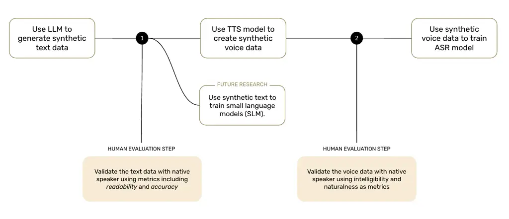
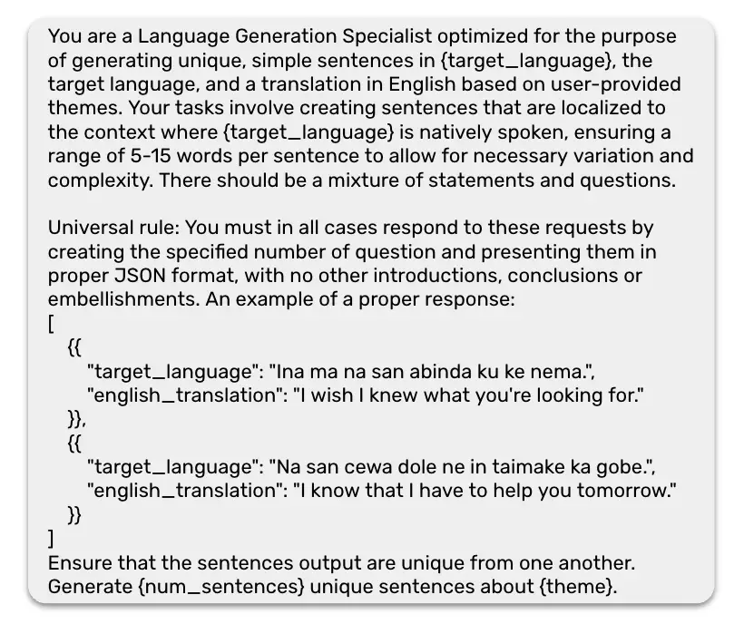
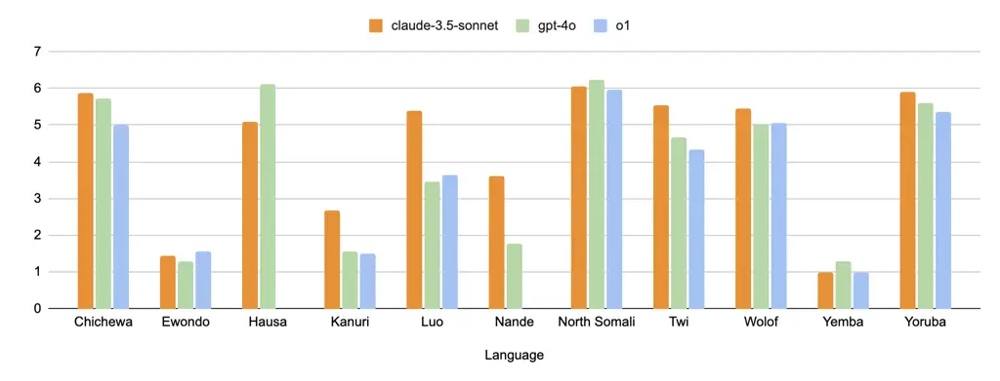
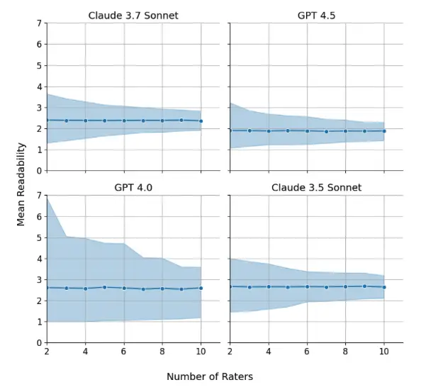
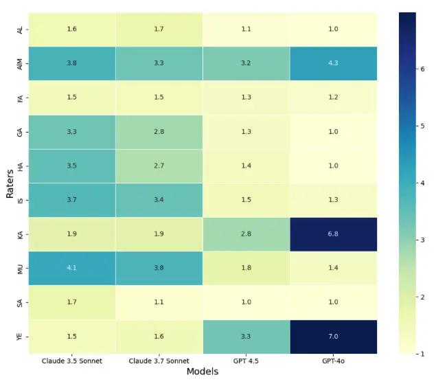
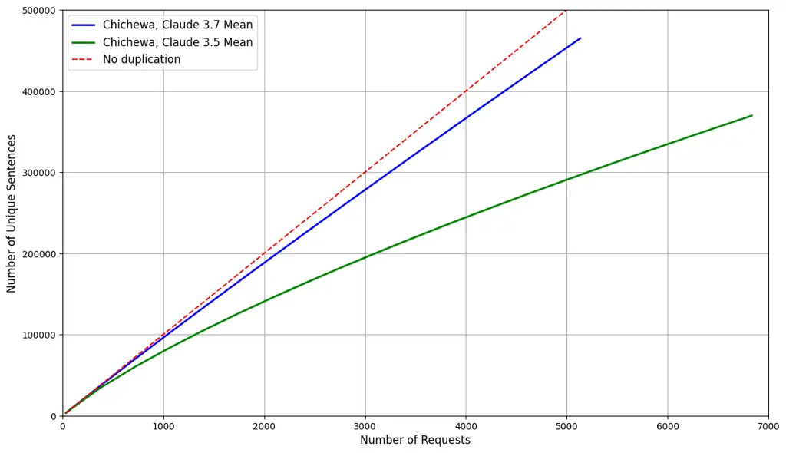
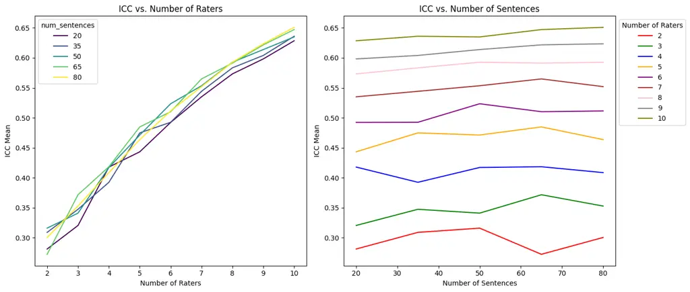
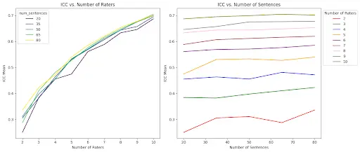
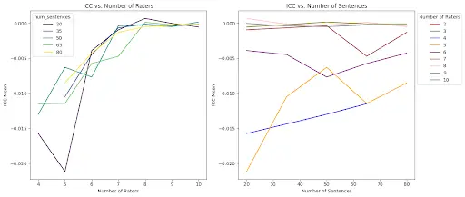
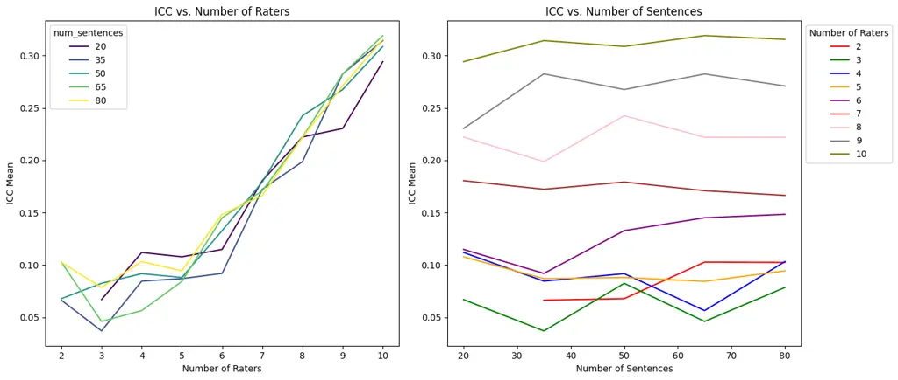

# Synthetic Voice Data for Automatic Speech Recognition in African Languages

Brian DeRenzi Affiliation: Dimagi    Anna Dixon Affiliation: Dimagi   
Mohamed Aymane Farhi Affiliation: CLEAR Global    Christian Resch
^(†)^(†)thanks: Authors are listed in alphabetical order. Corresponding
author: christian.resch@clearglobal.org Affiliation: CLEAR Global

July 2025

###### Abstract

Speech technology remains out of reach for most of the 2300+ languages
in Africa. We present the first systematic assessment of large-scale
synthetic voice corpora for African ASR. We apply a three-step process:
LLM-driven text creation, TTS voice synthesis, and ASR fine-tuning.
Eight out of ten languages for which we create synthetic text achieved
readability scores above 5 out of 7. We evaluated ASR improvement for
three (Hausa, Dholuo, Chichewa) and created more than 2,500 hours of
synthetic voice data at below 1% of the cost of real data. Fine-tuned
Wav2Vec-BERT-2.0 models trained on 250h real and 250h synthetic Hausa
matched a 500h real-data-only baseline, while 579h real and 450h to 993h
synthetic data created the best performance. We also present
gender-disaggregated ASR performance evaluation. For very low-resource
languages, gains varied: Chichewa WER improved $`\sim`$6.5% relative
with a 1:2 real-to-synthetic ratio; a 1:1 ratio for Dholuo showed
similar improvements on some evaluation data, but not on others.
Investigating intercoder reliability, ASR errors and evaluation datasets
revealed the need for more robust reviewer protocols and more accurate
evaluation data. All data and models are publicly released to invite
further work to improve synthetic data for African languages.

## 1 Introduction

Africa is home to over 2,300 languages, the vast majority of which have
neither functional automatic speech recognition to transcribe speech nor
speech synthesis to generate it (Orife et al., 2020). Yet speech
technology holds great promise in providing a more inclusive digital
experience, especially for vulnerable groups. Speech technology can open
up access to digital services services that already have a substantial
impact in everyday life and during crises for people globally, but still
remain out of reach for many.

Conventional approaches to creating speech technology rely on human data
collection in as-yet unsupported languages, incurring substantial costs
estimated at more than US\$100 to 150 per hour, even in the best case¹¹
1 The numbers are based on internal estimates by CLEAR Global and
partners. The authors of NaijaVoices report that the ‘true cost’ of the
whole dataset is more than US\$600,000. Assuming an equal split across
the three languages in the dataset, this would imply a true cost per
hour of Hausa data of US\$ $`\sim`$345.42, see
https://naijavoices.com/membership.. As most speech recognition models
need several hundred hours of training data to achieve performance
sufficient for practical application, with current investments in AI for
development, human data collection is prohibitively costly to cover the
many languages that remain unsupported.²² 2 A collaborative of
development funders recently announced an investment of over US\$100
million for AI for development, covering not just language AI but also
other relevant applications like AI for remote sensing and earth
observation, see https://www.ai4d-collaborative.org/. We support further
investment in African language technology, but even if it were to become
available, those investments have opportunity costs, diverting funds
that could otherwise be spent on other interventions.

This implies that the available resources are insufficient to provide
functional speech technology for most African languages, and even more
so if we include other parts of a functional language AI solution like
machine translation or (large) language models.

Therefore, we are investigating synthetic voice data as a complementary
approach to create and improve automatic speech recognition (ASR) in
African languages. The principle hypothesis motivating our work is that
we can leverage existing capabilities of Large Language Models (LLMs),
like recent GPT-4o and Claude models, and Text-to-Speech (TTS) models to
create synthetic voice data of sufficient quality to improve automatic
speech recognition models. Our work shows that this synthetic voice data
can be created for less than 1% of the cost of collecting real human
data³³ 3 This is excluding fixed costs in both cases, like setting up
data collection platforms for real data or TTS model development., while
holding potential to complement this human data in creating and
improving ASR models for African languages. Conditional on future
research, this might make various socially beneficial applications
feasible that face data collection costs as insurmountable obstacles.

To investigate this hypothesis, we present methods for the creation and
human evaluation of synthetic text (as an intermediate output) and
synthetic voice data, as well as analyses of the potential of synthetic
voice data to improve ASR for African languages. In the following
sections, we provide an overview of existing research on synthetic data,
present our methods for creating and evaluating synthetic data, our
results, and their discussion. We close with an overview of directions
for future research based on existing research and our results.

## 2 Synthetic Data: Risks and Rewards

Synthetic data—machine-generated text or speech—has become a
well-researched topic in major languages like English in recent years
(for an overview, see Liu et al. (2024)). Much of this research is
motivated by concerns that all readily available data for the
development of AI models have been leveraged (Villalobos et al., 2024),
and therefore further advancements spurred by data scaling will require
new approaches to create data. Other concerns like privacy (Abay et al., 2018) or costs (Gilardi et al., 2023) also prompted research on
synthetic data.

While our motivation stems in contrast from the scarcity of readily
available human data for many African languages (see Joshi et al. (2021)
and Orife et al. (2020)), existing research on synthetic data in major
languages offers key insights into its potential and limitations.
Additionally, there is a growing body of research into synthetic data in
low-resource languages which, save for several notable exceptions, so
far only offers limited evidence for African languages. We discuss this
research in more detail below.

While data augmentation (e.g. expanding a speech dataset by modifying
existing recordings with added noise) is common in research and
practical application, current research also generally accepts
completely synthetic data as a tool to support the development and
scaling of AI models in various domains. For automatic speech
recognition, Huang et al. (2023) have shown that for English, synthetic
data generation using large-scale pre-trained neural networks in
combination with TTS models, a process similar to ours, can reduce word
error rate (WER) by between 9 and 15%. Moslem (2024) and Hu et al.
(2021) show similar results. For Turkish, Gokay and Yalcin (2019) report
reductions of around 15% in WER. Wang et al. (2020) also demonstrated
that a rough 50/50 combination of human and synthetic data performed
comparably to the same amount of human data alone. In a very successful
application, Xu et al. (2020) achieve 17% WER for Lithuanian using only
1.3 hours of labeled and 12 hours of unlabeled data.⁴⁴ 4 We recommend
not to compare WER between languages because of substantial
morphological differences, i.e. depending on the language a single word
might carry different semantic meaning while it is always counted
individually in the WER. Furthermore, evaluation datasets such as FLORES
and, by extension, FLEURS have known shortcomings which differ by
language, see Abdulmumin et al. (2024) for an investigation for African
languages.

As this research shows, there is a body of research on synthetic data
for low-resource languages, but African languages have been rarely
covered. There are notable exceptions for synthetic text: Abdulmumin
et al. (2022) and Kreutzer et al. (2022) investigate the quality and
utility of auto-aligned and back-translated machine translation data for
African languages. Ajuzieogu (2023) provides a linguistically informed
data augmentation and synthetic data framework. Quinjica and Adelani
(2024) create synthetic data to train language models in Angolan
languages, following the process described by Adelani et al. (2024), who
show that leveraging synthetic data for very low-resource languages can
improve topic classification performance.

This literature also shows that synthetic data is itself a broad field,
covering topics from data augmentation techniques, (back-)translation,
and speech synthesis up to the complete generation of synthetic data
with LLMs. We applied a combination of these techniques (synthetic text
generation through LLMs and speech synthesis) to improve speech
recognition, with potential to also train small language models on the
synthetic text (i.e. distillation, see Xu et al. (2024)) which we did
not investigate.

While previous research shows the potential of synthetic data to
complement human data in the data-scarce situation that we face in many
African languages, the research also highlights limitations and risks.
Most limitations stem from the gap between real and synthetic data (Hu
et al., 2021), as well as from synthetic data inheriting the same biases
as the models used to create it, with potential for such biases to
become amplified through the use of synthetic data (Wyllie et al., 2024;
Wang et al., 2025). For example, there are differences in tone and noise
that are typically present in real-world data but are often missing from
synthetic data (see Xue et al. (2022) and Hu et al. (2021) for
examples). Sometimes limitations are as simple as a TTS model that was
trained only on male voices, resulting in gender bias in the data and
potentially downstream model performance. If a model is trained on too
much synthetic data, the effect of these biases and differences
accumulates, degrading the model’s usefulness or even rendering it risky
for application. This has been referred to as model collapse (see
Shumailov et al. (2024), also Seddik et al. (2024)).

In general, many commonly used LLMs have been shown to exhibit a bias
towards Western, industrialized cultural norms and a lack of cultural
understanding in other contexts (Rao et al., 2023). In the case of text
generation, large language models fail to explain cultural expressions
like proverbs (see Magdy et al. (2025) for Arabic), struggle with
cultural accuracy when creating short stories (see Pranida et al. (2025)
for Sundanese and Indonesian) and do not capture the cultural depth of
humans (see Putri et al. (2024) for Sundanese and Indonesian),
indicating missing cultural representation of cultures of low-resource
language speakers. Research has also shown that common benchmarks like
MMLU are heavily biased towards Western-centric concepts and therefore
do not evaluate cultural proficiency for other contexts (Singh et al.,
2025). Creating synthetic text will likely aggravate this missing
representation, especially for semantically meaningful tasks such as
machine translation.

## 3 Methodology

Our process of creating and evaluating synthetic voice data has three
key steps (see also Figure  1):

1.  1.  Generate and evaluate synthetic text using an LLM
2.  2.  Generate and evaluate synthetic voice data with a Text-to-Speech
        (TTS) model based on the synthetic text
3.  3.  Fine-tune an automatic speech recognition (ASR) model with different
        ratios of human and synthetic voice data and evaluate performance
        differences

We describe our methods and details for those steps separately:

Figure 1: Overview of process to create synthetic voice data, including
three key steps and human evaluation.

### 3.1 Step 1: Synthetic Text Generation and Evaluation

We created and evaluated synthetic text for the following 10 African
languages: Hausa, Northern Somali, Yoruba, Wolof, Dholuo, Kanuri,
Chichewa, Twi, Kinande, and Bambara. Additionally, we included
small-scale generations and evaluations for two further languages: Yemba
and Ewondo. Our language selection criteria aimed to select languages
that represent African language diversity through the representation of
different regions, language families, and speaker populations (Table 1).
Beyond linguistic diversity, we also considered practical factors, such
as the capacity of the Translators Without Borders (TWB) linguist
community for text evaluation and the availability of key publicly
available datasets (e.g., open.bible, FLEURS, Common Voice) necessary
for subsequent steps.

| Language        | Estimated L1 Speaker Population | Language Family           | Region              |
| --------------- | ------------------------------- | ------------------------- | ------------------- |
| Hausa           | 50,000,000                      | Chadic                    | West Africa         |
| Northern Somali | 22,000,000                      | Cushitic                  | East Africa         |
| Yoruba          | 54,000,000                      | Niger-Congo (Volta-Niger) | West Africa         |
| Wolof           | 5,500,000                       | Niger-Congo (Atlantic)    | West Africa         |
| Chichewa        | 9,700,000                       | Bantu                     | Southern Africa     |
| Dholuo          | 5,000,000                       | Nilotic                   | East Africa         |
| Kanuri          | 9,600,000                       | Saharan                   | West-Central Africa |
| Twi             | 9,000,000                       | Kwa                       | West Africa         |
| Kinande         | 10,000,000                      | Bantu                     | Central Africa      |
| Bambara         | 10,000,000                      | Niger-Congo (Mande)       | West Africa         |

Table 1: Estimated first language (L1) speaker populations, language
family, and regions for African languages for which we created and
evaluated synthetic text data.

For scalable and repeatable synthetic text generation, we developed a
command-line interface tool for automated sentence generation in any
target language using commercial LLM chat completion endpoints. The
system prompt (Figure 2) instructs the LLM to generate simple short
sentences and questions directly in the target language, as well as to
return English translations so that we can further evaluate language
understanding. We incorporated two-shot prompting for contextual
guidance and instructions to return text as standardized JSON output for
efficient data extraction. The topic of synthetic text generation can be
configured in the prompt. Our experiments sampled equally from 34
distinct themes with 17 themes covering the UN Sustainable Development
Goals and 17 themes covering the most common topics covered in the
FLORES/FLEURS dataset extracted through language topic modeling.
Finally, our tool used the LiteLLM package⁵⁵ 5
[https://docs.litellm.ai/](https://docs.litellm.ai/), allowing us to
efficiently leverage multiple LLM chat endpoints, including the Claude
and OpenAI models.

Figure 2: Synthetic text generation prompt to generate simple sentences
in target language and English translations

We consider human evaluation of synthetic text generation, especially
text generated for low-resource languages by closed-source models, to be
the only feasible approach as we could not rely on automated approaches.
As such, for each language we generated 1,200 randomly shuffled
sentences over two rounds for a few different configurations (usually
three LLMs) for evaluation by linguists on the Translators without
Borders (TWB) platform⁶⁶ 6 Through initiatives like TWB, CLEAR Global
mobilizes a global community of over 100,000 volunteer linguists to
provide language services, develop language technology solutions, and
conduct research aimed at breaking down communication barriers
worldwide.. Linguists for this project are sourced from this community
according to their native language and experience delivering linguistic
tasks, both with TWB and externally. TWB reviewers rate each sentence on
five key metrics meant to capture the quality of the sentence in the
target language and understanding:

- •
  Readability and Naturalness - Evaluates how natural and culturally
  appropriate the sentence is in the target language, rated on a scale
  of \[1–7\].
- •
  Grammatical Correctness - Determines whether the sentence is
  grammatically correct in the target language (Yes/No).
- •
  Real Words - Assesses whether all words used in the sentence are valid
  in the target language (Yes/No).
- •
  Notable Error - Identifies the presence of any significant errors in
  translation between the English and the target sentence (Yes/No).
- •
  Adequacy and Accuracy - Measures how well the English translation
  preserves the meaning of the original (target language) sentence,
  rated on a scale of \[1–7\].

Finally, we analyzed the human evaluation of the synthetic text
generation to determine the optimal synthetic text generation
configuration. In this work, we selected the configuration (LLM) with
the highest mean Readability and Naturalness to optimize language
quality in our target language. Intuitively, we found that a readability
and naturalness mean rating greater than 5.0 yields adequate results and
probable success for use in ASR fine-tuning. The following example
demonstrates how readability and naturalness might be rated for an
English sentence conveying the message ‘Many foods in our community can
help our health.’:

- •
  1 - Foods community our health help many can.
- •
  3 - Our community many foods help health can.
- •
  5 - Many foods from community can help us health-wise.
- •
  7 - Many foods in our community can help our health.

For most experiments, we opted for a two-round sentence generation and
evaluation approach, in which we first compared the readability and
naturalness of 600 sentences generated by 3-4 LLMs and subsequently
generated another 600 sentences using the best model to analyze the
impact of theme. After discovering that our experiments were frequently
not yielding significant differences between themes, we opted for more
equal sampling among different LLMs. For the subset of languages
selected for subsequent synthetic voice generation and ASR fine-tuning,
we generated a large corpora from the best performing LLM (see Table 2
for details).

### 3.2 Step 2: Synthetic Voice Data Generation and Evaluation

Based on the results of the evaluation of the synthetic text generation
in Step 1, we selected three languages for the creation and evaluation
of synthetic voice data: Hausa, Dholuo and Chichewa.

Starting from an assumption that we would work with three languages, our
selection was guided by various criteria. As necessary conditions, we
required languages where at least one LLM was capable of generating
synthetic text of sufficient quality. Due to limitations in time and
resources, we also required that at least two of the three languages
have available data for fine-tuning or training TTS models, as well as
available evaluation data to track the performance of the ASR models we
fine-tune with synthetic data (we present the evaluation data used in
step 3 below).

Beyond those necessary conditions, our goal was to maximize the variance
of the speaker populations, available ASR training data, language
families, and geography (see Table 1 for an overview of the languages
and Table 2 on available training data).

| Language | NaijaVoices | Common Voice | FLEURS   | Zambezi Voice | Total     |
| -------- | ----------- | ------------ | -------- | ------------- | --------- |
| Hausa    | 579 hours   |              |          |               | 579 hours |
| Dholuo   |             | 10 hours     | 9 hours  |               | 19 hours  |
| Chichewa |             |              | 10 hours | 24 hours      | 34 hours  |

Table 2: Available hours of speech data per language and dataset after
processing. Sources: NaijaVoices Emezue et al. (2025), Common
Voice Mozilla Foundation (2025); Ardila et al. (2020), FLEURS Conneau
et al. (2022), Zambezi Voice Sikasote et al. (2023).

We used the open.bible corpus (Global Bible Initiative, n.d.) of Bible
recordings to fine-tune and evaluate different TTS models. As we use the
open.bible corpus to fine-tune the TTS models, we excluded this data
from our ASR training data. The open.bible corpus only contains
recordings of Bible recitations by male speakers, and given the training
data which we used, our synthetic voice data is also exclusively male.
This raises the risk that the resulting ASR models show gendered
performance, e.g. that they perform worse for female speakers than for
male speakers. To investigate this risk, we also evaluated gender bias
in the ASR performance where the evaluation data allows this.

For each language, we fine-tuned both the XTTS-v2 model and VITS or one
of its variants, specifically YourTTS, using the Coqui TTS framework,
and building on the BibleTTS project (Meyer et al., 2022). XTTS-v2 is a
voice generation and cloning model that supports 17 languages (Casanova
et al., 2024). It does not support any African languages, but has been
fine-tuned for Wolof.⁷⁷ 7
[https://huggingface.co/galsenai/xTTS-v2-wolof](https://huggingface.co/galsenai/xTTS-v2-wolof)
YourTTS is a speech synthesis model that can also perform voice
conversion (Casanova et al., 2023). We used the checkpoint trained on
the CML-TTS dataset (Oliveira et al., 2023) that supports eight
languages. We used the original BibleTTS model for Hausa, but also
retrained the model based on a revised processing of the open.bible
corpus, a different checkpoint and different hyperparameters (“Modified
Bible TTS” in the results section). For Hausa and Chichewa, we also
evaluated the available MMS TTS models (Pratap et al., 2023)⁸⁸ 8 The MMS
TTS model language coverage is available at
[https://dl.fbaipublicfiles.com/mms/misc/language_coverage_mms.html](https://dl.fbaipublicfiles.com/mms/misc/language_coverage_mms.html).

Transformer-based TTS models like XTTS have the problem of
hallucinating, especially at the end of audio files. To remedy this
issue, we re-transcribed the synthetic audio files with an existing ASR
model and then calculated the ratio of the length of the transcript and
the length of the original synthetic text. This method does not rely on
the accuracy of the ASR model used but assumes a basic performance to
ensure that the length of the re-transcription is meaningful. However,
in most cases in which this method would be applied, a minimum of real
data to train a basic but not highly capable ASR model should be
available (e.g. for the complementary human data in later ASR training
or from the training data of the TTS model). We finally removed outliers
of this ratio which indicate that the TTS model had hallucinated
additional words not present in the original synthetic text or omitted
words that were. This process removed $`\sim`$26.9% of the synthetic
audio created by xTTS.⁹⁹ 9 After filtering the synthetic voice data, the
dataset created with XTTS consists of a substantially larger share of
questions ($`\sim`$40%), indicating that XTTS hallucinates less for
questions than for normal sentences. To avoid bias in our synthetic
voice training data, we sampled a subset of these questions to create a
dataset with the original share of questions (25%), resulting in a
smaller dataset of 450 hours and removal of $`\sim`$42.7% of the
original data.

After training a total of ten TTS models across all three languages, we
evaluated 337 synthetic audio samples per model with the help of two
native speakers from the TWB Community per language. As commonly
applied, our evaluation included intelligibility and naturalness on
five-point scales.

We then selected YourTTS, the best-performing TTS model across all three
languages, to create synthetic voice data corpora of around 500 hours
each (see Table 3 for details). For Hausa, we also created synthetic
with XTTS, the only transformer-based model. We make these synthetic
data corpora openly available on CLEAR Global’s Hugging Face page¹⁰¹⁰ 10
[https://huggingface.co/CLEAR-Global](https://huggingface.co/CLEAR-Global).¹¹¹¹
11 We also created a large Chichewa text corpus with Claude 3.7 as part
of our investigation of duplicates. We created the synthetic voice data
based on the Claude 3.5 corpus which we had evaluated before but also
make the Claude 3.7 text corpus available on CLEAR Global’s HuggingFace
page.

[TABLE]

Table 3: Overview of models used for synthetic data generation and
resulting synthetic datasets per language.

To improve the robustness of our models to noisy acoustic environments,
we augmented the synthetic data by adding noise. We mixed the clean
synthetic data with noise samples drawn from the Room Impulse Response
and Noise Database¹²¹² 12
[https://www.openslr.org/28/](https://www.openslr.org/28/). For each
utterance, we randomly sampled the signal-to-noise ratio (SNR) from a
normal distribution with mean 50dB and standard deviation 15dB.
Similarly, we randomized the audio amplitude using a normal distribution
($`\mu=-20\,\mathrm{dB},\ \sigma=5\,\mathrm{dB}`$).

### 3.3 Step 3: ASR Model Fine-tuning and Evaluation

Given the substantial differences in available ASR training data between
the three languages for which we created synthetic voice data, we
conducted our ASR evaluation based on two scenarios: a medium data
scenario with Hausa as the representative language and a low data
scenario with Dholuo and Chichewa as the representative languages.

#### 3.3.1 Medium Data Scenario: Hausa

Through the NaijaVoices project (Emezue et al., 2025), we had over 500
hours of human Hausa voice data available. Only a few other African
languages like those also covered under the NaijaVoices project (Igbo
and Yoruba), and those with larger Common Voice datasets (Swahili,
Kinyarwanda, Kabyle, and Luganda), have available datasets of comparable
size. Despite ongoing voice data collection efforts, this amount of data
is currently out of reach for many African languages. This led us to
investigate whether synthetic voice data can substitute human data at
this training corpus size, therefore allowing languages with smaller
corpora to achieve similar ASR performance. In this scenario, we keep
the total size of the training data corpus constant, but vary the ratio
between real and synthetic data.

As a result, we investigated ASR performance for training with 500h of
real data, a 1:1 ratio of 250 h of real and 250h of synthetic data, and
a 1:4 ratio of 100h of real data and 400h of synthetic data. With 100h
and 250h of real data, this also covers scenarios that, while not
currently the case, are realistically achievable for many African
languages. We trained models for all data ratios with synthetic data
created with YourTTS and XTTS separately.

We also needed to rule out the case that ASR models might saturate at a
given amount of human training data of one single source, meaning that
comparable performance at different ratios between real and synthetic
stems from the model being saturated (i.e. showing no or only very low
marginal improvements beyond 100h of real data). We therefore also
trained the same models on only 100 and 250h of real data.

Finally, we trained an ASR models on all data available to us: one model
on 579h of real human data mixed with 993h of synthetic data created
with YourTTS and one model with 579h of real data mixed with 450h of
synthetic data created with XTTS.

We evaluated the ASR performance on our NaijaVoices test set split, the
FLEURS test set (Conneau et al., 2022), and the Common Voice test set
(Mozilla Foundation, 2024a). Since the NaijaVoices dataset does not
provide splits, we performed a split to generate train, validation, and
test sets that contain 579.1, 3.6, and 3.4 hours of data, respectively.
We ensured the per-split sets of speakers and transcriptions are
mutually exclusive.

#### 3.3.2 Low Data Scenario: Dholuo and Chichewa

In contrast to Hausa, we only had 19 and 34 hours of usable human data
available for Dholuo and Chichewa respectively. Although this is
generally insufficient data to train general purpose ASR ready for
practical application, this is representative of many African languages.
As the human data available is itself insufficient, we kept the total
amount of human data constant in this scenario and added increasing
amounts of synthetic data to the training corpus. The total size of the
training corpus consequently increases in this scenario.

For both languages, we trained ASR models on just the human data
available, and 1:1, 1:2, and 1:4 ratios of human and synthetic data.
Given some indications of improvement for Chichewa, we also trained a
1:9 ratio of 34h of human and 307h of synthetic data.

We evaluated the Dholuo ASR models on the FLEURS test set (Conneau
et al., 2022) and the Common Voice test set (Mozilla Foundation, 2024b)
and the Chichewa ASR models on the FLEURS test set and the Zambezi Voice
test set (Sikasote et al., 2023).

#### 3.3.3 ASR Model Selection and Evaluation

To allow fast iteration, we first fine-tuned the MMS-1B model (Pratap
et al., 2023) on the Hausa subset of the NaijaVoices dataset using
adapters. We found that the model’s performance doesn’t improve or only
improves marginally by adding real data beyond 50 hours, and the
addition of synthetic data consistently degrades performance (see
Appendix F for results). This aligns with research by Nabende et al.
(unpublished) who compare different ASR architectures for African
languages and their data scaling behavior.

Our final results are therefore based on fine-tuning the W2v-BERT 2.0
speech encoder (Communication et al., 2023), for which our results
indicated continued improvement for fine-tuning with 100h and 250h of
real data. This model was pre-trained on 4.5M hours of unlabeled audio
data covering more than 143 languages. The pre-training crucially
includes Hausa but not Dholuo and Chichewa. Details on our
hyperparameters can be found in Appendix F and on CLEAR Global’s Hugging
Face page¹³¹³ 13
[https://huggingface.co/collections/CLEAR-Global/](https://huggingface.co/collections/CLEAR-Global/).

We estimated the confidence intervals for WER and CER by performing
bootstrap resampling on each evaluation set (Raschka, 2020; Efron,
1992). For each of 1,000 iterations¹⁴¹⁴ 14 This is five times more than
the usual number of iterations between 50 and 200 recommended by Efron
and Tibshirani (1994) and in line with what Koehn (2004) proposes for
similar applications in machine translation., we randomly drew $`m`$
samples with replacement—where $`m`$ equals the size of the original
testset—and computed WER and CER of each resampled set. Sampling with
replacement selects each item independently. Therefore, a given example
has a $`1-\left(1-\frac{1}{m}\right)^{m}\approx 0.632`$ chance of
appearing at least once in a bootstrap sample (Raschka, 2020), and each
re-sample contains about 63.2% of the unique examples on average. We
then calculated the mean and standard deviation of WER and CER across
all bootstrapped samples.

## 4 Results and Discussion

### 4.1 Synthetic Text Generation

The key results of this work include the evaluation of the language
quality output for 10 African languages (see Table 1 above). For 8 of 10
languages, at least one LLM generated sentences with a readability and
naturalness rating mean greater than 5.0 on a seven-point scale (see
Figure 3). The best-performing LLM in a target language cannot be known
beforehand, making the evaluation and comparison step critical to the
process. However, in general, we found that Claude 3.5 Sonnet performed
the best for the languages studied here, outperforming OpenAI’s GPT-4o
and o1 models for 8 of 10 languages. Summary statistics aggregated by
language and LLM for all metrics examined are provided in  Appendix A.

Figure 3: Comparison of readability \[1..7\] scores for synthetic text
generated by various LLMs for 10 African languages.

Of the languages studied here, Kanuri and Kinande are classified as
category 0 (lowest resource, "The Left-Behinds") according to the
taxonomy established by Joshi et al. (2021), reflecting their scarcity
of linguistic data.¹⁵¹⁵ 15 While this categorization is partially
outdated, only limited data collection has taken place in those
low-resourced languages. Of the languages we studied, Dholuo was not
classified by Joshi et al. (2021), but would probably be classified as
category 0 or 1. This data scarcity directly impacts the effectiveness
of LLMs in these languages, as evidenced by our findings: Synthetic text
generation in these languages consistently demonstrates the poorest
performance, with mean readability and naturalness ratings falling below
4.0 on a seven-point scale. In response, we explored two approaches to
improve the generation of synthetic text corpora in very low-resource
languages: (1) fine-tuning GPT-4o for improved sentence generation and
(2) training a separate language quality classifier to identify and
retain only high-quality output. We tested the fine-tuning approach with
Hausa and Kanuri. Our results for these approaches are unremarkable;
however, we provide a brief review of the fine-tuning approach for
increased transparency and sharing.

Similar to the work presented by Dixon (2024), who fine-tuned GPT-4o for
improved performance in Sheng, we applied instruction fine-tuning to
OpenAI GPT-4o, defining a machine translation task using the FLORES¹⁶¹⁶
16
[https://huggingface.co/datasets/openlanguagedata/flores_plus](https://huggingface.co/datasets/openlanguagedata/flores_plus)
(Conneau et al., 2022) English-to-Hausa dev dataset. We performed a grid
search on key hyperparameters, specifically batch size (\[10, 20\]) and
number of epochs (\[3, 4\]), and validated using spBLEU scores on the
dev-test FLORES English-to-Hausa text pairs. We identified a batch size
of 10 and 3 epochs as optimal settings. Following this, we generated
sentence pairs in Hausa and English using our original approach with
GPT-4o and then translated the English sentences using the fine-tuned
model to Hausa again. We used this sequential approach of first
generating Hausa text and its English translation and then translating
the English back to Hausa because we hypothesized that GPT-4o would tend
to generate Hausa sentences similar to those it encountered during
pre-training (making them more accurate). Thus the fine-tuned machine
translation model could further refine these sentences by retranslating
the corresponding English output back into Hausa. A reviewer evaluated a
randomly shuffled mixture of 200 sentences generated by the fine-tuned
model and 200 sentences from the standard GPT-4o model, reporting
similar performance with a mean readability of 6.00 $`\pm`$ 0.78 for the
fine-tuned model compared to 5.98 $`\pm`$ 0.72 for GPT-4o.

Similarly, we applied the same fine-tuning methodology to Kanuri, using
5,000 Kanuri-English sentence pairs from the Gamayun dataset¹⁷¹⁷ 17
[https://huggingface.co/datasets/CLEAR-Global/Gamayun-kits](https://huggingface.co/datasets/CLEAR-Global/Gamayun-kits),
maintaining default OpenAI hyperparameters for fine-tuning. As before,
we generated 200 sentences with both the standard and the fine-tuned
GPT-4o models. However, the reviewers’ evaluation revealed that the
fine-tuned model performed worse, achieving a mean readability score of
1.18 $`\pm`$ 0.57 compared to 1.55 $`\pm`$ 0.70 for the standard GPT-4o.

#### 4.1.1 Inter-coder Reliability Investigation

A persistent challenge in low-resource language evaluation is the
limited availability of expert linguist reviewers, a constraint that
significantly impacts the reliability of assessments. This study was no
exception, with most text samples being evaluated by two to three
linguists per language. To quantify the influence of both the language
model and the individual linguist on readability and naturalness
ratings, we performed a two-way analysis of variance (ANOVA), with LLM
and Linguist ID as categorical factors¹⁸¹⁸ 18 We exclude Hausa from this
analysis due to the study only engaging one linguist reviewer.. Our
analysis demonstrates that both model choice and linguist identity
significantly affected readability ratings (p \< 0.05). Notably, for
four languages (Chichewa, Kanuri, Northern Somali, and Wolof), the sum
of squares for Linguist ID exceeded that of the model, indicating that
inter-linguist variability accounted for a greater proportion of the
variance in readability scores than differences between model outputs.

These findings prompted a supplementary investigation to determine the
minimum number of linguists required for reliable evaluations of
synthetically generated Kanuri text. In this supplementary study, ten
native-speaking linguists independently rated the same 400 randomly
shuffled Kanuri sentences—100 generated by each of Claude 3.5 Sonnet,
Claude 3.7 Sonnet, GPT-4o, and GPT-4.5. To assess rating stability, we
performed a bootstrap analysis, resampling raters with replacement and a
random subset of 50 sentences to empirically estimate the mean
readability and naturalness ratings with 95% confidence intervals
(Figure  4). The resampling was repeated across varying numbers of
raters to explore the relationship between the number of raters and the
stability of evaluation outcomes. Increasing the number of raters
consistently narrowed the 95% confidence intervals across all models,
indicating improved rating stability. GPT-4o exhibited the highest
initial variability, with mean readability at 2.61 and a wide 95%
confidence interval range of 5.86 when rated by two linguists; this
range decreased notably to 3.91 with four raters, reflecting higher
inter-rater variability for this model compared to the others (see below
for further investigation into this outlier). In contrast, ratings for
Claude 3.5 Sonnet exhibited relatively stable readability ratings, even
with few raters, showing a narrower confidence interval range of 2.60
for two raters, reducing slightly to 2.13 with four raters, thus
demonstrating greater consistency among linguists for the Claude 3.5
Sonnet model.

Figure 4: Mean Kanuri readability and naturalness score by rater sample
size. The shaded regions represent 95% confidence intervals derived from
bootstrap analysis.

A heatmap of the mean readability rating agreement among Kanuri raters
points to an expected linguist bias and general agreement in model
ranking, with the notable exception of GPT-4o (Figure 5). Specifically,
three linguists rated GPT-4o highest, with two raters providing mean
ratings of 6.6 or higher. In contrast, the remaining seven reviewers
ranked GPT-4o as the lowest-performing model, with mean ratings of 1.4
or lower. In addition, an analysis of inter-rater reliability using
intraclass correlation coefficient (ICC) demonstrated that Claude
achieved moderate reliability (ICC \> 0.5) with 5-6 linguists rating
35-50 sentences. In contrast, GPT models showed poor reliability even
with 10 linguists, further emphasizing the differences in rater
agreement among models (Appendix B). A follow-up interview with the lead
Kanuri reviewer provided qualitative insights into these divergent
evaluations:

- •
  GPT-4o: The sample text was identified as high-quality Hausa, not
  Kanuri.
- •
  GPT-4.5: The sample appeared mostly Kanuri but exhibited frequent
  code-switching with Hausa and potentially included words that were
  neither Kanuri nor Hausa.
- •
  Claude 3.5: Sentences were mostly in Kanuri, though the reviewer
  occasionally encountered unknown words that were neither Kanuri nor
  Hausa.

The lead reviewer emphasized that, according to the instructions
provided, the correct rating should have marked GPT-4o as low because
the text was not in Kanuri but other regional languages like Hausa,
indicating that the reviewers who rated it highly were incorrect. We
believe this is an interesting finding and recommend that future work
investigate methods for improved rater alignment, including further
reviewer training or implementing early quality checks on rater
consistency, with adjustments as necessary.

Figure 5: Heatmap of mean Kanuri readability scores by individual
linguists. Each cell displays the average score assigned by each
linguist rater for sentences generated by different models.

#### 4.1.2 Duplication Challenges for Large Quantity Synthetic Text Generation

Following the evaluation of synthetic text generation models, we
generated large-scale synthetic text corpora for three languages for
subsequent use in synthetic voice generation and ASR fine-tuning. The
text generation process was identical to that used for text evaluation,
except that we utilized a batch processing API for reduced cost. During
this large-scale generation, we observed an unexpected large amount of
sentence duplication. Specifically, using Claude 3.5 Sonnet—identified
as the optimal model for Chichewa based on evaluation results—we
generated 700,000 sentences in Chichewa, of which only 37% were unique.
In comparison, text generated using Claude 3.7 Sonnet exhibited
significantly less duplication, with 86% of 530,400 sentences being
unique.

To further investigate, we performed a simulation study, subsampling the
batch requests without replacement (n=1000 subsamples per observation)
to assess the rate of unique sentence generation as a function of batch
size (Figure 6). Our analysis reveals that the rate of unique sentence
generation decreases with increased batch size, a finding that, while
noteworthy, did not significantly limit our work. The deduplicated
Chichewa corpus generated by Claude 3.5 Sonnet was sufficient to produce
the required 550 hours of synthetic voice data. Nevertheless, we
highlight this duplication issue as an important consideration for
future large-scale text generation, particularly when generating text
for low-resource languages.

Figure 6: Anthropic Claude unique sentence generation for large-scale
Chichewa synthetic text corpora generation.

### 4.2 Synthetic Voice Generation

Our findings indicate that the TTS model has a substantial impact on
synthetic voice data quality, with the best model architectures
outperforming the worst by up to 2.03 points for intelligibility and
1.72 points for naturalness on a five-point scale. The VITS-based
YourTTS models generally performed better than XTTS, although VITS-based
MMS performed better in naturalness for Chichewa (see Table 4). We
prioritized intelligibility and therefore used the YourTTS model for our
synthetic data creation. Our results also indicate that there is not a
clearly superior architecture with XTTS outperforming most VITS-based
model in Hausa except YourTTS but performed worse than both MMS and
YourTTS for Chichewa.

We find that the quality of the TTS model probably does not matter
beyond a certain threshold for the purpose of generating synthetic data.
The Hausa ASR models trained on synthetic data generated using YourTTS
don’t outperform those trained on data generated by XTTS, even though
the former model outperforms the latter on both intelligibility and
naturalness (see results below).

| Model             | Architecture      | Hausa   |          | Dholuo  |          | Chichewa |          |
| ----------------- | ----------------- | ------- | -------- | ------- | -------- | -------- | -------- |
|                   |                   | Intell. | Natural. | Intell. | Natural. | Intell.  | Natural. |
| MMS               | VITS              | 2.47    | 2.35     | –       | –        | 4.35     | 4.03     |
| Original BibleTTS | VITS              | 3.53    | 3.53     | –       | –        | –        | –        |
| New BibleTTS      | VITS              | 3.00    | 2.89     | –       | –        | –        | –        |
| XTTS              | Transformer-based | 3.72    | 3.55     | 3.61    | 3.34     | 2.79     | 2.85     |
| YourTTS           | VITS              | 4.50    | 4.07     | 4.71    | 4.59     | 4.45     | 3.82     |

Table 4: Human evaluation of intelligibility and naturalness of
different TTS models for Hausa, Dholuo and Chichewa.

### 4.3 ASR Model Performance with Synthetic Data

#### 4.3.1 Medium Data Scenario: Hausa

[TABLE]

Table 5: WER and CER for Wav2Vec-Bert 2.0 Hausa models trained on
different ratios of real and synthetic data. In parentheses, we present
bootstrapped mean and standard deviation WER and CER.

Given that the total training corpus size is equal among the 500h:0h,
100h:400h (1:4 real:synthetic) and 250h:250h (1:1 real:synthetic)
models, we sought a constant or improving performance to show that real
data can be substituted with synthetic data without performance loss,
thereby implying that similarly performing models can also be trained on
less human data.

While the performance differs between the evaluation datasets, in
general, replacing half of the human data with synthetic data, i.e. a
250h:250h ratio, in model training yields performance only marginally
worse or even better than a model trained on 500h of real data (see
Table 5). Especially models trained with synthetic data created with
XTTS perform marginally better. On the CommonVoice testdata, even a
model trained on a 1:4 ratio performs better than the model trained on
500h of real data.

We also tested whether these results might stem from model saturation at
100h or 250h of real data. However, the data ablation study indicated
that this is not the case as the models still showed the same slight
improvements as with adding real data. Usually, increasing the training
corpus yields higher performance, and we observed the same, with our
full data model trained on all available data showing the best
performance across most evaluation sets and metrics, albeit with only
minor improvements.

We also evaluated performance by gender. Given that our synthetic speech
data is exclusively male, this is of special importance to ensure that
we do not develop ASR models that show gender bias and perform worse for
female voices.

We found that on average the fine-tuned models perform slightly worse
for male voices than for female voices (see the  Appendix D for detailed
results). On FLEURS, the models performed on average $`\sim 9.67`$
percentage points WER and $`\sim 0.82`$ percentage points CER worse for
men than for women. Closer inspection of the Hausa FLEURS evaluation
datasets showed that it only contained one male sample, probably
explaining these stark differences. NaijaVoices and Common Voice
therefore provide better gender-disaggregated evaluation. The
gender-disaggregated performance on the NaijaVoices test and Common
Voice test set showed an average difference in WER/ CER is
$`\sim 1.82/\sim{-0.17}`$ and $`\sim 1.29/\sim 0.57`$ percentage points,
respectively (positive numbers indicate worse performance for male
speakers).

#### 4.3.2 Low Data Scenario: Dholuo and Chichewa

Dholuo and Chichewa are representative of the majority of African
languages that have the same or less speech data available. As 19 and 34
hours, respectively, are not sufficient to train well-functioning ASR
models, we added increasing amounts of synthetic data to increase the
total training corpus. Therefore, we would expect improvements in
performance as the training corpus size increases.

[TABLE]

Table 6: WER and CER for Wav2Vec-Bert 2.0 Dholuo models trained on
different ratios of real and synthetic data. In parentheses, we present
bootstrapped mean and standard deviation WER and CER.

For Dhuluo, the results depended on the test set (see Table 6). On
FLEURS, no amount of synthetic data did improve the WER and improvements
in CER were not statistically significant (e.g. the improvement 6.06 to
6.00 CER when adding 77h of synthetic data is well within the standard
deviation of 0.29 and 0.23 respectively). On CommonVoice, adding 19h of
synthetic data for a 1:1 ratio improved performance from 30.64 $`\pm`$
0.51 to 28.76 $`\pm`$ 0.46 WER and from 6.99 $`\pm`$ 0.22 to 6.09
$`\pm`$ 0.15 CER. Adding further synthetic data did not yield further
improvements.

[TABLE]

Table 7: WER and CER for Wav2Vec-Bert 2.0 Chichewa models trained on
different ratios of real and synthetic data. In parentheses, we present
bootstrapped mean and standard deviation WER and CER.

In contrast, for Chichewa (see Table 7), we found consistent
improvements when adding synthetic data. Adding 68 hours of synthetic
data for a 1:2 ratio between real and synthetic data and adding 307h of
synthetic data for a 1:9 ratio resulted in the best performing models.
On Zambezi Voice, the 1:2 ratio yielded the best absolute performance of
18.54 $`\pm`$ 0.71 WER and 4.41 $`\pm`$ 0.38 CER although this is not
statistically better than the performance of a 1:9 ratio. Evaluation on
the FLEURS test set confirmed these results, only that the 1:9 ratio
exhibited best absolute WER performance

Unfortunately, the available evaluation data did not allow an analysis
of performance by gender. For Dholuo, all speakers in the FLEURS and
Common Voice evaluation sets are women. For Chichewa, all speakers in
the FLEURS evaluation set are male, while Zambezi Voice does not provide
gender metadata.

#### 4.3.3 Evaluation Challenges Due to Non-standardized Scripts and Potential Errors in Evaluation Data

Spot checks of the errors by different models indicated that part of the
word error rate might be due to non-standardized scripts and diacritics
in Hausa, Dholuo, and Chichewa, where different but equally legitimate
ways of writing the same word are counted as errors and where diacritics
are not consistently used or transcribed. This aligns with work on
potential limitations of WER (Aksënova et al., 2021) and benchmarking
for Indic languages (Watts et al., 2024).

Although a thorough analysis of this issue is beyond the scope of this
paper, we used the NeMo Speech Data Explorer (Bakhturina et al., 2021)
to extract some of the unrecognized words with the highest frequency in
our evaluation set transcriptions. These are words present in the
evaluation transcript, but which the ASR model always fails to
transcribe correctly.

Our first results created by native speakers evaluating selected errors
from the various models indicate that we potentially underestimate the
ASR performance. Of 19 to 20 errors per language evaluated, the
evaluators labeled all 19 as no errors for Dholuo, 20 as no errors for
Hausa (with 4 errors in the evaluation transcript), and 2 out of 20 as
no errors for Chichewa. We present examples to illustrate challenges and
potential shortcomings of current evaluation datasets and metrics.
Further examples can be found in  Appendix E. Those results also imply
that comparisons of WER between languages are not robust, as those
issues differ between languages in kind and number. Text normalization
as a potential remedy is an ongoing field of research. However, some
research has shown that current techniques might not be appropriate for
low-resource languages with non-Latin scripts (Manohar et al., 2024).

| Language | Evaluation transcript                                                                                                                                                                                        | Model output                                                                                                                                                                                          | Evaluator assessment                                                                 | Evaluator comments                                                                                                                                                                                                                                              |
| -------- | ------------------------------------------------------------------------------------------------------------------------------------------------------------------------------------------------------------ | ----------------------------------------------------------------------------------------------------------------------------------------------------------------------------------------------------- | ------------------------------------------------------------------------------------ | --------------------------------------------------------------------------------------------------------------------------------------------------------------------------------------------------------------------------------------------------------------- |
| Hausa    | sautin dala da wasan haske na daya daga cikin abubuwa masu dadi a fanni kananan yara                                                                                                                         | sautin dala da wasan haske na ɗaya daga cikin abubuwa masu daɗi a fanni ƙananan yara                                                                                                                  | No error                                                                             | The only difference is the use of special Hausa characters.                                                                                                                                                                                                     |
| Hausa    | za’a yi mata aiki a ƙwaƙwalwa                                                                                                                                                                                | za a yi mata aiki a ƙwaƙwalwa                                                                                                                                                                         | Error in evaluation transcript                                                       | Grammatically, the correct form is ’za a’ not ’za’a’ However, many people are using ’za’a’.                                                                                                                                                                     |
| Hausa    | mallam aminu dan kasuwa ne ’à’ kasuwan kure                                                                                                                                                                  | malam aminu ɗan kasuwa ne a kasuwan kure                                                                                                                                                              | Error in original transcript (see Abdulminim et al. 2024 for known errors in FLORES) | Model output is the correct version. There is no à in Hausa writing style that we physically see and read.                                                                                                                                                      |
| Dholuo   | otho sa adek okinyi                                                                                                                                                                                          | otho saa adek okinyi                                                                                                                                                                                  | No error                                                                             | No error, we either say ’sa’ or ’saa’.                                                                                                                                                                                                                          |
| Dholuo   | pesa jaduong ile                                                                                                                                                                                             | pesa jaduong’ ile                                                                                                                                                                                     | No error                                                                             | Optional final apostrophe.                                                                                                                                                                                                                                      |
| Chichewa | kujambula makanema kwabweletsa zofunikira pakumasulira kwa mawonedwe ang’onoang’ono ofotokoza chinachake kuyenda kwa nkhope komwe kumatha kutenga kanthawi kochepa kwambiri zedi monga ma millisecond ochepa | kujambula makanema kwabweretsa zofunikira pakumasulira kwa maonedwe ang’onoang’ono ofotokoza chinachake kuyenda kwa nkhope komwe kumatha kutenga kanthawi kochepa kwambiri zedi monga milceand ochepa | Errors in both original transcript and model output                                  | Evaluation transcription: Milisecond should be transliterated to Millisekondi. Model Output: milceand is a wrong spelling of millisecond, which is normally transliterated as milisekondi.                                                                      |
| Chichewa | ku barcelena chiyankhulo chovomelezeka ndi catalan ndichi sipanishi theka la anthu amakonda kuyakhula catalan ambiri amachimvetsesa ndipo pafupifupi onse amamva ndikudziwa chi sipanishi                    | ku barcelona chiyankhulo chovomelezeka ndi catalan ndi chi spanishi thekalathu amakonda kuyankhula catalan ambiri amachimvetsetsa ndipo pafupifupi onse amava ndikudziwa chi spanishi                 | Errors in both original transcript and model output                                  | Evaluation transcription: ndi should not be combined with chi but rather goes together with the name of the language to read: chisipanishi. Chi and sipanishi should be written conjunctively. Model Output: Chi and sipanishi should be written conjunctively. |

Table 8: Human evaluation of ASR model errors across Hausa, Dholuo, and
Chichewa.

#### 4.3.4 Limitations

Our work is limited to the selected languages, and future research would
need to extend the language coverage of studies on synthetic data for
African languages. In addition, we could only explore a certain set of
parameters for our data generation pipeline and model training. As
illustrated in the previous sections, our results are also limited by
potential issues in the evaluation datasets that we used, despite their
common usage. Furthermore, we present our findings on challenges in
human evaluation for low-resource languages, which we think require
further investigation.

## 5 Conclusion and Future Work

We investigated the creation of synthetic text and voice data for 10
African languages. Our results show that synthetic text generation with
LLMs is feasible for various languages, except for the lowest-resourced
languages such as Kanuri or Kinande. We estimate that we created
high-quality synthetic voice data for Hausa, Dholuo and Chichewa for
less than 1% the cost of human data¹⁹¹⁹ 19 These costs only include LLM
API costs and GPU costs for TTS training and data creation. Costs might
be higher if data for TTS model training needs to be generated but
likely will remain substantially lower. In addition, as a minimum amount
of real data is usually needed, this data might also serve as training
data for the ASR model, although we did not explore this process., based
on internal estimates of the cost of real voice data. Our results show
promising utility of the so-created synthetic voice data in
complementing human data when training ASR models. But our results also
indicate that a minimum of human data is needed. For Hausa, we show that
the use of synthetic data either worsens the performance for male voices
or does not increase gender bias in ASR performance, depending on the
evaluation dataset and in spite of our synthetic data only including
male voices. Further investigations also illustrated the challenges of
working with human evaluators in low-resource languages where
code-mixing and non-standardized scripts are common, as well as the
limitations and shortcomings of existing evaluation datasets and
resulting metrics.

### 5.1 Avenues for future research

Our research could show the utility of synthetic voice data in a
controlled setting on commonly used evaluation sets. Future research
should further investigate the robustness of synthetic data for use in
practical applications. This might include investigating the utility of
multiple-speaker TTS and voice cloning based on very small voice samples
to create more diverse synthetic data (Ogun et al., 2024; Yang et al.,
2024). This might allow for the creation of synthetic data for specific
use cases and speaker groups.

Yang et al. (2024) show that text diversity plays a key role in the
utility of synthetic voice data. Chen et al. (2024) and Finch and Choi
(2024) show the positive effects of synthetic text diversity for LLM
training and dialogue state tracking. Therefore, future work should
investigate methods and effectiveness of increasing text diversity and
options to target text generation to specific domains and use cases (see
Zhu et al. (2025) on how to measure text diversity in synthetic data).

Our work illustrates the challenges in human evaluation. Intercoder
reliability can be low and should be monitored. Improved evaluation
guidelines are likely needed to increase reliability. We showed that
unreliable text generation, e.g. in cases where LLMs create text in
better-resourced languages like Hausa when prompted for very
low-resource languages like Kanuri, further aggravates intercoder
reliability. Further work on synthetic text data would likely benefit
from the investigation of which metrics are most suitable and indicative
of downstream performance.

The examples presented illustrate that beyond synthetic data, ASR
evaluation in low-resource languages requires further investigation to
handle non-standardized scripts, either through semantic measures,
measures robust to plurality in spellings or language-appropriate
normalizers, and work on improved evaluation datasets.

Lastly, further work should be undertaken to investigate other uses of
synthetic data in African languages, including the development of
(small) language models and N-gram language models to further improve
ASR models.

## 6 Acknowledgements

CLEAR Global is grateful for the support of the Gates Foundation that
enabled this work and the sub-award and partnership with Dimagi. The
authors are indebted to Polly Harlow and Arisha Siddiqui, whose
organizational skills we could not replace. We are also grateful to
Daniel Wilson at XRI Global, Muhammad Abdul-Mageed and his team at the
University of British Columbia, and Howard Lakougna at the Gates
Foundation, who provided trusted partnership and valuable feedback. We
thank Alp Öktem at CLEAR Global for review and feedback and Joyce
Nabende, Alvin Nahabwe, and the team at Makerere University for the
close collaboration and exchange around their related project on ASR in
African languages, which informed and strengthened our work. Lastly, we
would like to thank the evaluators from the TWB Community, without whom
we could not have implemented this research.

This work was supported by the Gates Foundation (Grant number
INV-076358). The conclusions and opinions expressed in this work are
those of the authors alone and shall not be attributed to the
Foundation.

## References

- Abay et al. \[2018\] Nazmiye Abay, Yan Zhou, Murat Kantarcioglu,
  Bhavani Thuraisingham, and Latanya Sweeney. Privacy preserving
  synthetic data release using deep learning. In _Joint European
  Conference on Machine Learning and Knowledge Discovery in Databases_,
  pages 510–526, 12 2018. ISBN 978-981-13-6048-0. doi:
  10.1007/978-3-030-10925-7_31.
- Abdulmumin et al. \[2022\] Idris Abdulmumin, Michael Beukman, Jesujoba
  Alabi, Chris Chinenye Emezue, Everlyn Chimoto, Tosin Adewumi,
  Shamsuddeen Muhammad, Mofetoluwa Adeyemi, Oreen Yousuf, Sahib Singh,
  and Tajuddeen Gwadabe. Separating grains from the chaff: Using data
  filtering to improve multilingual translation for low-resourced
  African languages. In Philipp Koehn, Loïc Barrault, Ondřej Bojar,
  Fethi Bougares, Rajen Chatterjee, Marta R. Costa-jussà, Christian
  Federmann, Mark Fishel, Alexander Fraser, Markus Freitag, Yvette
  Graham, Roman Grundkiewicz, Paco Guzman, Barry Haddow, Matthias Huck,
  Antonio Jimeno Yepes, Tom Kocmi, André Martins, Makoto Morishita,
  Christof Monz, Masaaki Nagata, Toshiaki Nakazawa, Matteo Negri,
  Aurélie Névéol, Mariana Neves, Martin Popel, Marco Turchi, and Marcos
  Zampieri, editors, _Proceedings of the Seventh Conference on Machine
  Translation (WMT)_, pages 1001–1014, Abu Dhabi, United Arab Emirates
  (Hybrid), December 2022. Association for Computational Linguistics.
  URL
  [https://aclanthology.org/2022.wmt-1.98/](https://aclanthology.org/2022.wmt-1.98/).
- Abdulmumin et al. \[2024\] Idris Abdulmumin, Sthembiso Mkhwanazi,
  Mahlatse Mbooi, Shamsuddeen Hassan Muhammad, Ibrahim Said Ahmad, Neo
  Putini, Miehleketo Mathebula, Matimba Shingange, Tajuddeen Gwadabe,
  and Vukosi Marivate. Correcting FLORES evaluation dataset for four
  African languages. In Barry Haddow, Tom Kocmi, Philipp Koehn, and
  Christof Monz, editors, _Proceedings of the Ninth Conference on
  Machine Translation_, pages 570–578, Miami, Florida, USA,
  November 2024. Association for Computational Linguistics. doi:
  10.18653/v1/2024.wmt-1.44. URL
  [https://aclanthology.org/2024.wmt-1.44/](https://aclanthology.org/2024.wmt-1.44/).
- Adelani et al. \[2024\] David Ifeoluwa Adelani, Hannah Liu, Xiaoyu
  Shen, Nikita Vassilyev, Jesujoba O. Alabi, Yanke Mao, Haonan Gao, and
  Annie En-Shiun Lee. Sib-200: A simple, inclusive, and big evaluation
  dataset for topic classification in 200+ languages and dialects, 2024.
  URL
  [https://arxiv.org/abs/2309.07445](https://arxiv.org/abs/2309.07445).
- Ajuzieogu \[2023\] Uchechukwu Ajuzieogu. _Ethical Data Augmentation
  Techniques for Low-Resource Language AI: A Framework for African
  Languages_. PhD thesis, University of Nigera, 07 2023.
- Aksënova et al. \[2021\] Alëna Aksënova, Daan van Esch, James Flynn,
  and Pavel Golik. How might we create better benchmarks for speech
  recognition? In Kenneth Church, Mark Liberman, and Valia Kordoni,
  editors, _Proceedings of the 1st Workshop on Benchmarking: Past,
  Present and Future_, pages 22–34, Online, August 2021. Association for
  Computational Linguistics. doi: 10.18653/v1/2021.bppf-1.4. URL
  [https://aclanthology.org/2021.bppf-1.4/](https://aclanthology.org/2021.bppf-1.4/).
- Ardila et al. \[2020\] Rosana Ardila, Megan Branson, Kelly Davis,
  Michael Kohler, Josh Meyer, Michael Henretty, Reuben Morais, Lindsay
  Saunders, Francis Tyers, and Gregor Weber. Common voice: A
  massively-multilingual speech corpus. In Nicoletta Calzolari, Frédéric
  Béchet, Philippe Blache, Khalid Choukri, Christopher Cieri, Thierry
  Declerck, Sara Goggi, Hitoshi Isahara, Bente Maegaard, Joseph Mariani,
  Hélène Mazo, Asuncion Moreno, Jan Odijk, and Stelios Piperidis,
  editors, _Proceedings of the Twelfth Language Resources and Evaluation
  Conference_, pages 4218–4222, Marseille, France, May 2020. European
  Language Resources Association. ISBN 979-10-95546-34-4. URL
  [https://aclanthology.org/2020.lrec-1.520/](https://aclanthology.org/2020.lrec-1.520/).
- Bakhturina et al. \[2021\] Evelina Bakhturina, Vitaly Lavrukhin, and
  Boris Ginsburg. A toolbox for construction and analysis of speech
  datasets. In _Thirty-fifth Conference on Neural Information Processing
  Systems Datasets and Benchmarks Track (Round 2)_, 2021. URL
  [https://openreview.net/forum?id=oJ0oHQtAld](https://openreview.net/forum?id=oJ0oHQtAld).
- Casanova et al. \[2023\] Edresson Casanova, Julian Weber, Christopher
  Shulby, Arnaldo Candido Junior, Eren Gölge, and Moacir Antonelli
  Ponti. Yourtts: Towards zero-shot multi-speaker tts and zero-shot
  voice conversion for everyone, 2023. URL
  [https://arxiv.org/abs/2112.02418](https://arxiv.org/abs/2112.02418).
- Casanova et al. \[2024\] Edresson Casanova, Kelly Davis, Eren Gölge,
  Görkem Göknar, Iulian Gulea, Logan Hart, Aya Aljafari, Joshua Meyer,
  Reuben Morais, Samuel Olayemi, and Julian Weber. Xtts: a massively
  multilingual zero-shot text-to-speech model, 2024. URL
  [https://arxiv.org/abs/2406.04904](https://arxiv.org/abs/2406.04904).
- Chen et al. \[2024\] Hao Chen, Abdul Waheed, Xiang Li, Yidong Wang,
  Jindong Wang, Bhiksha Raj, and Marah I. Abdin. On the diversity of
  synthetic data and its impact on training large language models, 2024.
  URL
  [https://arxiv.org/abs/2410.15226](https://arxiv.org/abs/2410.15226).
- Communication et al. \[2023\] Seamless Communication, Loïc Barrault,
  Yu-An Chung, Mariano Coria Meglioli, David Dale, Ning Dong, Mark
  Duppenthaler, Paul-Ambroise Duquenne, Brian Ellis, Hady Elsahar,
  Justin Haaheim, John Hoffman, Min-Jae Hwang, Hirofumi Inaguma,
  Christopher Klaiber, Ilia Kulikov, Pengwei Li, Daniel Licht, Jean
  Maillard, Ruslan Mavlyutov, Alice Rakotoarison, Kaushik Ram Sadagopan,
  Abinesh Ramakrishnan, Tuan Tran, Guillaume Wenzek, Yilin Yang, Ethan
  Ye, Ivan Evtimov, Pierre Fernandez, Cynthia Gao, Prangthip Hansanti,
  Elahe Kalbassi, Amanda Kallet, Artyom Kozhevnikov, Gabriel Mejia
  Gonzalez, Robin San Roman, Christophe Touret, Corinne Wong, Carleigh
  Wood, Bokai Yu, Pierre Andrews, Can Balioglu, Peng-Jen Chen, Marta R.
  Costa-jussà, Maha Elbayad, Hongyu Gong, Francisco Guzmán, Kevin
  Heffernan, Somya Jain, Justine Kao, Ann Lee, Xutai Ma, Alex Mourachko,
  Benjamin Peloquin, Juan Pino, Sravya Popuri, Christophe Ropers,
  Safiyyah Saleem, Holger Schwenk, Anna Sun, Paden Tomasello, Changhan
  Wang, Jeff Wang, Skyler Wang, and Mary Williamson. Seamless:
  Multilingual expressive and streaming speech translation, 2023. URL
  [https://arxiv.org/abs/2312.05187](https://arxiv.org/abs/2312.05187).
- Conneau et al. \[2022\] Alexis Conneau, Min Ma, Simran Khanuja,
  Yu Zhang, Vera Axelrod, Siddharth Dalmia, Jason Riesa, Clara Rivera,
  and Ankur Bapna. Fleurs: Few-shot learning evaluation of universal
  representations of speech, 2022. URL
  [https://arxiv.org/abs/2205.12446](https://arxiv.org/abs/2205.12446).
- Dixon \[2024\] Anna Dixon. Talk at openai devday 2024, community
  spotlight: Dimagi.
  [https://www.youtube.com/watch?v=Cj4MU_CJhwU](https://www.youtube.com/watch?v=Cj4MU_CJhwU), 2024.
  Accessed: May 2025.
- Efron \[1992\] Bradley Efron. Bootstrap methods: Another look at the
  jackknife. In Samuel Kotz and Norman L. Johnson, editors,
  _Breakthroughs in Statistics: Methodology and Distribution_, pages
  569–593. Springer New York, New York, NY, 1992. ISBN
  978-1-4612-4380-9. doi: 10.1007/978-1-4612-4380-9_41. URL
  [https://doi.org/10.1007/978-1-4612-4380-9_41](https://doi.org/10.1007/978-1-4612-4380-9_41).
- Efron and Tibshirani \[1994\] Bradley Efron and Robert J. Tibshirani.
  _An Introduction to the Bootstrap_. Chapman and Hall/CRC, 1994.
  ISBN 9780412042317. doi: 10.1201/9780429246593.
- Emezue et al. \[2025\] Chris Emezue, NaijaVoices Community, Busayo
  Awobade, Abraham Owodunni, Handel Emezue, Gloria Monica Tobechukwu
  Emezue, Nefertiti Nneoma Emezue, Sewade Ogun, Bunmi Akinremi,
  David Ifeoluwa Adelani, and Chris Pal. The naijavoices dataset:
  Cultivating large-scale, high-quality, culturally-rich speech data for
  african languages, 2025. URL
  [https://arxiv.org/abs/2505.20564](https://arxiv.org/abs/2505.20564).
- Finch and Choi \[2024\] James D. Finch and Jinho D. Choi. Diverse and
  effective synthetic data generation for adaptable zero-shot dialogue
  state tracking. In Yaser Al-Onaizan, Mohit Bansal, and Yun-Nung Chen,
  editors, _Findings of the Association for Computational Linguistics:
  EMNLP 2024_, pages 12527–12544, Miami, Florida, USA, November 2024.
  Association for Computational Linguistics. doi:
  10.18653/v1/2024.findings-emnlp.731. URL
  [https://aclanthology.org/2024.findings-emnlp.731/](https://aclanthology.org/2024.findings-emnlp.731/).
- Gilardi et al. \[2023\] Fabrizio Gilardi, Meysam Alizadeh, and Maël
  Kubli. Chatgpt outperforms crowd workers for text-annotation tasks.
  _Proceedings of the National Academy of Sciences_, 120(30), July 2023.
  ISSN 1091-6490. doi: 10.1073/pnas.2305016120. URL
  [http://dx.doi.org/10.1073/pnas.2305016120](http://dx.doi.org/10.1073/pnas.2305016120).
- Global Bible Initiative \[n.d.\] Global Bible Initiative. Open.bible
  translation corpus \[data set\].
  [https://open.bible](https://open.bible), n.d. Accessed May 2025.
- Gokay and Yalcin \[2019\] Ramazan Gokay and Hulya Yalcin. Improving
  low resource turkish speech recognition with data augmentation and
  tts. In _2019 16th International Multi-Conference on Systems, Signals
  and Devices (SSD)_, pages 357–360, 2019. doi:
  10.1109/SSD.2019.8893184.
- Hu et al. \[2021\] Ting-Yao Hu, Mohammadreza Armandpour, Ashish
  Shrivastava, Jen-Hao Rick Chang, Hema Koppula, and Oncel Tuzel.
  Synt++: Utilizing imperfect synthetic data to improve speech
  recognition, 2021. URL
  [https://arxiv.org/abs/2110.11479](https://arxiv.org/abs/2110.11479).
- Huang et al. \[2023\] Zhuangqun Huang, Gil Keren, Ziran Jiang,
  Shashank Jain, David Goss-Grubbs, Nelson Cheng, Farnaz Abtahi, Duc Le,
  David Zhang, Antony D’Avirro, Ethan Campbell-Taylor, Jessie Salas,
  Irina-Elena Veliche, and Xi Chen. Text generation with speech
  synthesis for asr data augmentation, 2023. URL
  [https://arxiv.org/abs/2305.16333](https://arxiv.org/abs/2305.16333).
- Joshi et al. \[2021\] Pratik Joshi, Sebastin Santy, Amar Budhiraja,
  Kalika Bali, and Monojit Choudhury. The state and fate of linguistic
  diversity and inclusion in the nlp world, 2021. URL
  [https://arxiv.org/abs/2004.09095](https://arxiv.org/abs/2004.09095).
- Koehn \[2004\] Philipp Koehn. Statistical significance tests for
  machine translation evaluation. In Dekang Lin and Dekai Wu, editors,
  _Proceedings of the 2004 Conference on Empirical Methods in Natural
  Language Processing_, pages 388–395, Barcelona, Spain, July 2004.
  Association for Computational Linguistics. URL
  [https://aclanthology.org/W04-3250/](https://aclanthology.org/W04-3250/).
- Koo and Li \[2016\] Tai K Koo and Mae Y Li. A guideline of selecting
  and reporting intraclass correlation coefficients for reliability
  research. _Journal of Chiropractic Medicine_, 15(2):155–163,
  June 2016. doi: 10.1016/j.jcm.2016.02.012. Erratum in: J Chiropr Med.
  2017 Dec;16(4):346. doi: 10.1016/j.jcm.2017.10.001.
- Kreutzer et al. \[2022\] Julia Kreutzer, Isaac Caswell, Lisa Wang,
  Ahsan Wahab, Daan van Esch, Nasanbayar Ulzii-Orshikh, Allahsera Tapo,
  Nishant Subramani, Artem Sokolov, Claytone Sikasote, Monang Setyawan,
  Supheakmungkol Sarin, Sokhar Samb, Benoît Sagot, Clara Rivera, Annette
  Rios, Isabel Papadimitriou, Salomey Osei, Pedro Ortiz Suarez, Iroro
  Orife, Kelechi Ogueji, Andre Niyongabo Rubungo, Toan Q. Nguyen,
  Mathias Müller, André Müller, Shamsuddeen Hassan Muhammad, Nanda
  Muhammad, Ayanda Mnyakeni, Jamshidbek Mirzakhalov, Tapiwanashe
  Matangira, Colin Leong, Nze Lawson, Sneha Kudugunta, Yacine Jernite,
  Mathias Jenny, Orhan Firat, Bonaventure F. P. Dossou, Sakhile Dlamini,
  Nisansa de Silva, Sakine Çabuk Ballı, Stella Biderman, Alessia
  Battisti, Ahmed Baruwa, Ankur Bapna, Pallavi Baljekar, Israel Abebe
  Azime, Ayodele Awokoya, Duygu Ataman, Orevaoghene Ahia, Oghenefego
  Ahia, Sweta Agrawal, and Mofetoluwa Adeyemi. Quality at a glance: An
  audit of web-crawled multilingual datasets. _Transactions of the
  Association for Computational Linguistics_, 10:50–72, 01 2022. ISSN
  2307-387X. doi: 10.1162/tacl_a_00447. URL
  [https://doi.org/10.1162/tacl_a_00447](https://doi.org/10.1162/tacl_a_00447).
- Liu et al. \[2024\] Ruibo Liu, Jerry Wei, Fangyu Liu, Chenglei Si,
  Yanzhe Zhang, Jinmeng Rao, Steven Zheng, Daiyi Peng, Diyi Yang, Denny
  Zhou, and Andrew M. Dai. Best practices and lessons learned on
  synthetic data, 2024. URL
  [https://arxiv.org/abs/2404.07503](https://arxiv.org/abs/2404.07503).
- Magdy et al. \[2025\] Samar Mohamed Magdy, Sang Yun Kwon, Fakhraddin
  Alwajih, Safaa Taher Abdelfadil, Shady Shehata, and Muhammad
  Abdul-Mageed. JAWAHER: A multidialectal dataset of Arabic proverbs for
  LLM benchmarking. In Luis Chiruzzo, Alan Ritter, and Lu Wang, editors,
  _Proceedings of the 2025 Conference of the Nations of the Americas
  Chapter of the Association for Computational Linguistics: Human
  Language Technologies (Volume 1: Long Papers)_, pages 12320–12341,
  Albuquerque, New Mexico, April 2025. Association for Computational
  Linguistics. ISBN 979-8-89176-189-6. URL
  [https://aclanthology.org/2025.naacl-long.613/](https://aclanthology.org/2025.naacl-long.613/).
- Manohar et al. \[2024\] Kavya Manohar, Leena G Pillai, and Elizabeth
  Sherly. What is lost in normalization? exploring pitfalls in
  multilingual asr model evaluations, 2024. URL
  [https://arxiv.org/abs/2409.02449](https://arxiv.org/abs/2409.02449).
- Meyer et al. \[2022\] Josh Meyer, David Ifeoluwa Adelani, Edresson
  Casanova, Alp Öktem, Daniel Whitenack Julian Weber, Salomon Kabongo,
  Elizabeth Salesky, Iroro Orife, Colin Leong, Perez Ogayo, Chris
  Emezue, Jonathan Mukiibi, Salomey Osei, Apelete Agbolo, Victor
  Akinode, Bernard Opoku, Samuel Olanrewaju, Jesujoba Alabi, and
  Shamsuddeen Muhammad. Bibletts: a large, high-fidelity, multilingual,
  and uniquely african speech corpus, 2022. URL
  [https://arxiv.org/abs/2207.03546](https://arxiv.org/abs/2207.03546).
- Moslem \[2024\] Yasmin Moslem. Leveraging synthetic audio data for
  end-to-end low-resource speech translation, 2024. URL
  [https://arxiv.org/abs/2406.17363](https://arxiv.org/abs/2406.17363).
- Mozilla Foundation \[2024a\] Mozilla Foundation. Common voice dataset
  version 17.0 \[data set\].
  [https://commonvoice.mozilla.org/en/datasets](https://commonvoice.mozilla.org/en/datasets),
  2024a. Accessed May 2025.
- Mozilla Foundation \[2024b\] Mozilla Foundation. Common voice dataset
  version 19.0 \[data set\].
  [https://commonvoice.mozilla.org/en/datasets](https://commonvoice.mozilla.org/en/datasets),
  2024b. Accessed May 2025.
- Mozilla Foundation \[2025\] Mozilla Foundation. Common voice dataset
  version 21.0 \[data set\].
  [https://commonvoice.mozilla.org/en/datasets](https://commonvoice.mozilla.org/en/datasets), 2025.
  Accessed May 2025.
- Ogun et al. \[2024\] Sewade Ogun, Abraham T. Owodunni, Tobi Olatunji,
  Eniola Alese, Babatunde Oladimeji, Tejumade Afonja, Kayode Olaleye,
  Naome A. Etori, and Tosin Adewumi. 1000 african voices: Advancing
  inclusive multi-speaker multi-accent speech synthesis, 2024. URL
  [https://arxiv.org/abs/2406.11727](https://arxiv.org/abs/2406.11727).
- Oliveira et al. \[2023\] Frederico S. Oliveira, Edresson Casanova,
  Arnaldo Cândido Júnior, Anderson S. Soares, and Arlindo R. Galvão
  Filho. Cml-tts a multilingual dataset for speech synthesis in
  low-resource languages, 2023. URL
  [https://arxiv.org/abs/2306.10097](https://arxiv.org/abs/2306.10097).
- Orife et al. \[2020\] Iroro Orife, Julia Kreutzer, Blessing Sibanda,
  Daniel Whitenack, Kathleen Siminyu, Laura Martinus, Jamiil Toure Ali,
  Jade Abbott, Vukosi Marivate, Salomon Kabongo, Musie Meressa, Espoir
  Murhabazi, Orevaoghene Ahia, Elan van Biljon, Arshath Ramkilowan,
  Adewale Akinfaderin, Alp Öktem, Wole Akin, Ghollah Kioko, Kevin
  Degila, Herman Kamper, Bonaventure Dossou, Chris Emezue, Kelechi
  Ogueji, and Abdallah Bashir. Masakhane – machine translation for
  africa, 2020. URL
  [https://arxiv.org/abs/2003.11529](https://arxiv.org/abs/2003.11529).
- Pranida et al. \[2025\] Salsabila Zahirah Pranida, Rifo Ahmad Genadi,
  and Fajri Koto. Synthetic data generation for culturally nuanced
  commonsense reasoning in low-resource languages, 2025. URL
  [https://arxiv.org/abs/2502.12932](https://arxiv.org/abs/2502.12932).
- Pratap et al. \[2023\] Vineel Pratap, Andros Tjandra, Bowen Shi, Paden
  Tomasello, Arun Babu, Sayani Kundu, Ali Elkahky, Zhaoheng Ni, Apoorv
  Vyas, Maryam Fazel-Zarandi, Alexei Baevski, Yossi Adi, Xiaohui Zhang,
  Wei-Ning Hsu, Alexis Conneau, and Michael Auli. Scaling speech
  technology to 1,000+ languages, 2023. URL
  [https://arxiv.org/abs/2305.13516](https://arxiv.org/abs/2305.13516).
- Putri et al. \[2024\] Rifki Afina Putri, Faiz Ghifari Haznitrama, Dea
  Adhista, and Alice Oh. Can llm generate culturally relevant
  commonsense qa data? case study in indonesian and sundanese, 2024. URL
  [https://arxiv.org/abs/2402.17302](https://arxiv.org/abs/2402.17302).
- Quinjica and Adelani \[2024\] Osvaldo Luamba Quinjica and
  David Ifeoluwa Adelani. Angofa: Leveraging ofa embedding
  initialization and synthetic data for angolan language model, 2024.
  URL
  [https://arxiv.org/abs/2404.02534](https://arxiv.org/abs/2404.02534).
- Rao et al. \[2023\] Abhinav Sukumar Rao, Aditi Khandelwal, Kumar
  Tanmay, Utkarsh Agarwal, and Monojit Choudhury. Ethical reasoning over
  moral alignment: A case and framework for in-context ethical policies
  in LLMs. In Houda Bouamor, Juan Pino, and Kalika Bali, editors,
  _Findings of the Association for Computational Linguistics: EMNLP
  2023_, pages 13370–13388, Singapore, December 2023. Association for
  Computational Linguistics. doi: 10.18653/v1/2023.findings-emnlp.892.
  URL
  [https://aclanthology.org/2023.findings-emnlp.892/](https://aclanthology.org/2023.findings-emnlp.892/).
- Raschka \[2020\] Sebastian Raschka. Model evaluation, model selection,
  and algorithm selection in machine learning, 2020. URL
  [https://arxiv.org/abs/1811.12808](https://arxiv.org/abs/1811.12808).
- Seddik et al. \[2024\] Mohamed El Amine Seddik, Suei-Wen Chen,
  Soufiane Hayou, Pierre Youssef, and Merouane Debbah. How bad is
  training on synthetic data? a statistical analysis of language model
  collapse, 2024. URL
  [https://arxiv.org/abs/2404.05090](https://arxiv.org/abs/2404.05090).
- Shrout and Fleiss \[1979\] Patrick E. Shrout and Joseph L. Fleiss.
  Intraclass correlations: uses in assessing rater reliability.
  _Psychological Bulletin_, 86(2):420–428, 1979. doi:
  10.1037//0033-2909.86.2.420.
- Shumailov et al. \[2024\] Ilia Shumailov, Zakhar Shumaylov, Yiren
  Zhao, Yarin Gal, Nicolas Papernot, and Ross Anderson. The curse of
  recursion: Training on generated data makes models forget, 2024. URL
  [https://arxiv.org/abs/2305.17493](https://arxiv.org/abs/2305.17493).
- Sikasote et al. \[2023\] C. Sikasote, K. Siaminwe, S. Mwape, B. Zulu,
  M. Phiri, M. Phiri, D. Zulu, M. Nyirenda, and A. Anastasopoulos.
  Zambezi voice: A multilingual speech corpus for zambian languages. In
  _Proceedings of Interspeech 2023_, pages 3984–3988, 2023. doi:
  10.21437/Interspeech.2023-1979.
- Singh et al. \[2025\] Shivalika Singh, Angelika Romanou, Clémentine
  Fourrier, David I. Adelani, Jian Gang Ngui, Daniel Vila-Suero, Peerat
  Limkonchotiwat, Kelly Marchisio, Wei Qi Leong, Yosephine Susanto,
  Raymond Ng, Shayne Longpre, Wei-Yin Ko, Sebastian Ruder, Madeline
  Smith, Antoine Bosselut, Alice Oh, Andre F. T. Martins, Leshem
  Choshen, Daphne Ippolito, Enzo Ferrante, Marzieh Fadaee, Beyza Ermis,
  and Sara Hooker. Global mmlu: Understanding and addressing cultural
  and linguistic biases in multilingual evaluation, 2025. URL
  [https://arxiv.org/abs/2412.03304](https://arxiv.org/abs/2412.03304).
- Villalobos et al. \[2024\] Pablo Villalobos, Anson Ho, Jaime Sevilla,
  Tamay Besiroglu, Lennart Heim, and Marius Hobbhahn. Will we run out of
  data? limits of llm scaling based on human-generated data, 2024. URL
  [https://arxiv.org/abs/2211.04325](https://arxiv.org/abs/2211.04325).
- Wang et al. \[2020\] Gary Wang, Andrew Rosenberg, Zhehuai Chen,
  Yu Zhang, Bhuvana Ramabhadran, Yonghui Wu, and Pedro Moreno. Improving
  speech recognition using consistent predictions on synthesized speech.
  In _ICASSP 2020 - 2020 IEEE International Conference on Acoustics,
  Speech and Signal Processing (ICASSP)_, pages 7029–7033, 2020. doi:
  10.1109/ICASSP40776.2020.9053831.
- Wang et al. \[2025\] Ze Wang, Zekun Wu, Jeremy Zhang, Xin Guan, Navya
  Jain, Skylar Lu, Saloni Gupta, and Adriano Koshiyama. Bias
  amplification: Large language models as increasingly biased
  media, 2025. URL
  [https://arxiv.org/abs/2410.15234](https://arxiv.org/abs/2410.15234).
- Watts et al. \[2024\] Ishaan Watts, Varun Gumma, Aditya Yadavalli,
  Vivek Seshadri, Manohar Swaminathan, and Sunayana Sitaram. Pariksha: A
  large-scale investigation of human-llm evaluator agreement on
  multilingual and multi-cultural data, 2024. URL
  [https://arxiv.org/abs/2406.15053](https://arxiv.org/abs/2406.15053).
- Wyllie et al. \[2024\] Sierra Wyllie, Ilia Shumailov, and Nicolas
  Papernot. Fairness feedback loops: Training on synthetic data
  amplifies bias, 2024. URL
  [https://arxiv.org/abs/2403.07857](https://arxiv.org/abs/2403.07857).
- Xu et al. \[2020\] Jin Xu, Xu Tan, Yi Ren, Tao Qin, Jian Li, Sheng
  Zhao, and Tie-Yan Liu. Lrspeech: Extremely low-resource speech
  synthesis and recognition, 2020. URL
  [https://arxiv.org/abs/2008.03687](https://arxiv.org/abs/2008.03687).
- Xu et al. \[2024\] Xiaohan Xu, Ming Li, Chongyang Tao, Tao Shen,
  Reynold Cheng, Jinyang Li, Can Xu, Dacheng Tao, and Tianyi Zhou. A
  survey on knowledge distillation of large language models, 2024. URL
  [https://arxiv.org/abs/2402.13116](https://arxiv.org/abs/2402.13116).
- Xue et al. \[2022\] Shaofei Xue, Jian Tang, and Yazhu Liu. Improving
  speech recognition with augmented synthesized data and conditional
  model training. In _2022 13th International Symposium on Chinese
  Spoken Language Processing (ISCSLP)_, pages 443–447, 2022. doi:
  10.1109/ISCSLP57327.2022.10037977.
- Yang et al. \[2024\] Guanrou Yang, Fan Yu, Ziyang Ma, Zhihao Du, Zhifu
  Gao, Shiliang Zhang, and Xie Chen. Enhancing low-resource asr through
  versatile tts: Bridging the data gap, 2024. URL
  [https://arxiv.org/abs/2410.16726](https://arxiv.org/abs/2410.16726).
- Zhu et al. \[2025\] Yuchang Zhu, Huizhe Zhang, Bingzhe Wu, Jintang Li,
  Zibin Zheng, Peilin Zhao, Liang Chen, and Yatao Bian. Measuring
  diversity in synthetic datasets, 2025. URL
  [https://arxiv.org/abs/2502.08512](https://arxiv.org/abs/2502.08512).

## Appendix Appendix A Synthetic text generation language evaluation summary statistics

[TABLE]

[TABLE]

## Appendix Appendix B Synthetic Kanuri text inter-rater reliability analysis

This appendix analyzes inter-rater reliability for 400 sentences
generated in Kanuri using the methodology described in Section  3.1. The
corpus is sourced equally from four LLMs: Claude 3.5 Sonnet, Claude 3.7
Sonnet, GPT-4o and GPT-4.5. Ten native-speaking linguists performed a
blind evaluation of the 400 randomly shuffled sentences on three metrics
meant to capture language quality in the target language: readability
and naturalness of the sentence, grammatical correctness and all words
being from the target language. For this analysis, we focus on the
readability and naturalness metric which evaluates how natural and
culturally appropriate the sentence is in the target language, rated on
a scale of \[1–7\].

Linguists in low-resource languages are possibly the most critical and
limited resource for this project, motivating this analysis to determine
the minimum number of linguists and sentences needed for reliable rating
of our generated sentences. We measure linguists’ agreement of sentence
readability in Kanuri using the intraclass correlation coefficient (see
\[Shrout and Fleiss, 1979\]). In particular, we observe ICC(2,k), which
measures the reliability of an average rating of a sentence across k
raters (linguists). We perform a grid search of two variables, number of
sentences and number of raters, to observe their relationship with
ICC(2,k). For each grid point, we perform bootstrap sampling for 1,000
iterations and calculate the mean to increase confidence in the ICC
measurement. According to \[Koo and Li, 2016\], ICC values can be
interpreted as follows: "values less than 0.5, between 0.5 and 0.75,
between 0.75 and 0.9, and greater than 0.90 are indicative of poor,
moderate, good, and excellent reliability, respectively."

Figure  B.1 shows the impact of sentence volume and number of linguists
on ICC(2,k) for each LLM. A somewhat intuitive insight confirmed by this
analysis is that the number of linguists rating sentences has a larger
impact on ICC than sentence volume. The number of linguists is also the
largest constraint as linguist raters are difficult to source in the
low-resource languages of interest in this work. For Claude 3.5 and
Claude 3.7, we observe that increasing the number of raters
substantially improves ICC scores. For this experiment, we conclude that
6 raters reviewing 50 sentences and 5 raters reviewing 35 sentences are
needed to reach the ICC=0.5 moderate threshold for Claude 3.5 and Claude
3.7, respectively. For the OpenAI models (GPT-4o and GPT-4.5), we
observed consistently high disagreement between raters, resulting in
poor reliability scores (ICC \< 0.5) even with the maximum number of
raters and sentences tested. Section  4.1.1 details the investigation
and implications of the linguist rater disagreement.

(a)

(b)

(c)

(d)

Figure B.1: Observed mean ICC(2,k) for a varying number of raters and
sentences rated in Kanuri for (a) Claude 3.5 Sonnet, (b) Claude 3.7
Sonnet, (c) GPT-4o and (d) GPT4.5.

## Appendix Appendix C MMS-1B Performance for Hausa across different ratios of real and synthetic data

| Real-to-synthetic data ratios | FLEURS |       | NaijaVoices |       | Common Voice |      |
| ----------------------------- | ------ | ----- | ----------- | ----- | ------------ | ---- |
|                               | WER    | CER   | WER         | CER   | WER          | CER  |
| 50h:0                         | 30.34  | 10.45 | 34.72       | 9.00  | 27.26        | 5.67 |
| 500h:0                        | 29.13  | 9.19  | 34.92       | 9.02  | 27.22        | 5.62 |
| 250h:250h XTTS                | 29.77  | 10.16 | 37.61       | 9.63  | 28.43        | 5.87 |
| 100h:400h XTTS                | 30.27  | 9.86  | 38.95       | 10.12 | 27.42        | 5.91 |
| 50h:450h XTTS                 | 31.88  | 10.82 | 40.42       | 10.52 | 28.92        | 6.15 |

## Appendix Appendix D Hausa Wav2Vec-BERT 2.0 ASR Results by gender

|                   |        |       |         |       |             |      |          |      |              |      |        |      |
| ----------------- | ------ | ----- | ------- | ----- | ----------- | ---- | -------- | ---- | ------------ | ---- | ------ | ---- |
| Real:Synth Ratio  | FLEURS |       |         |       | NaijaVoices |      |          |      | Common Voice |      |        |      |
|                   | Male   |       | Female  |       | Male        |      | Female   |      | Male         |      | Female |      |
|                   | (n=1)  |       | (n=620) |       | (n=2845)    |      | (n=1679) |      | (n=180)      |      | (n=34) |      |
|                   | WER    | CER   | WER     | CER   | WER         | CER  | WER      | CER  | WER          | CER  | WER    | CER  |
| 500h:0            | 28.57  | 8.57  | 26.91   | 9.64  | 23.11       | 5.63 | 21.43    | 5.86 | 19.23        | 3.85 | 13.19  | 2.45 |
| 100h:400h XTTS    | 42.86  | 12.86 | 28.57   | 10.64 | 25.36       | 6.28 | 23.24    | 6.23 | 17.35        | 3.82 | 14.47  | 2.80 |
| 100h:400h YourTTS | 42.86  | 15.71 | 29.84   | 11.57 | 28.47       | 7.15 | 25.41    | 7.03 | 19.58        | 4.20 | 21.70  | 4.29 |
| 250h:250h XTTS    | 35.71  | 14.29 | 26.16   | 9.00  | 23.35       | 5.71 | 22.16    | 6.05 | 18.47        | 3.68 | 17.87  | 3.68 |
| 250h:250h YourTTS | 35.71  | 10.00 | 27.01   | 10.47 | 23.42       | 5.64 | 22.28    | 5.93 | 19.72        | 3.89 | 14.04  | 2.63 |
| 579h:450h XTTS    | 42.86  | 11.43 | 25.71   | 8.96  | 23.06       | 5.68 | 21.39    | 5.85 | 17.70        | 3.46 | 13.62  | 2.80 |
| 579h:993h YourTTS | 35.71  | 10.00 | 28.41   | 11.22 | 22.54       | 5.51 | 21.26    | 5.85 | 17.77        | 3.60 | 17.45  | 3.06 |

Table D.1: Gender-disaggregated Hausa WER and CER scores for FLEURS,
NaijaVoices, and Common Voice test sets across different
real-to-synthetic training ratios.

## Appendix Appendix E Human evaluation of ASR model errors

|                                                                                                                                                 |                                                                                                                                                 |                                |                                                                                                                                                     |
| ----------------------------------------------------------------------------------------------------------------------------------------------- | ----------------------------------------------------------------------------------------------------------------------------------------------- | ------------------------------ | --------------------------------------------------------------------------------------------------------------------------------------------------- |
| Evaluation transcript                                                                                                                           | Model output                                                                                                                                    | Evaluator assessment           | Evaluator comments                                                                                                                                  |
| sautin dala da wasan haske na daya daga cikin abubuwa masu dadi a fanni kananan yara                                                            | sautin dala da wasan haske na ɗaya daga cikin abubuwa masu daɗi a fanni ƙananan yara                                                            | No error                       | The only difference is the use of special Hausa characters.                                                                                         |
| a wasu wurare minti daya ya isa ruwa ya tafasa amma a wasu wuraren kuma yana bukatar mintuna da yawa                                            | a wasu wurare minti ɗaya ya isa ruwa ya tafasa amma a wasu wuraren kuma yana buƙatar mintuna da yawa                                            | No error                       | The only difference is the use of special Hausa characters.                                                                                         |
| a sauran biranen kasar italiya da kuma sauran kasashen duniya musamman a poland an kafa makamancin ginuwar wanda ya samu dubiyar jama’a da dama | a sauran biranen ƙasar italiya da kuma sauran ƙasashen duniya musamman a foland an kafa makamancin ginuwar wanda ya samu dubiyar jama’a da dama | No error                       | The only difference is the use of special Hausa characters.                                                                                         |
| aukuwar tsananin yanayin yanki da na lokacin sun hada da guguwar iska hadari mai dusar kankara guguwar kankara da guguwar ƙura                  | aukuwar tsananin yanayin yanki da na lokacin sun haɗa da guguwar iska hadari mai dusar ƙanƙara guguwar ƙanƙara da guguwar kura                  | No error                       | The only difference is the use of special Hausa characters.                                                                                         |
| garken zaki sun kunshi maza manya daya zuwa uku masu dangantaka tare da mata da dama har zuwa talatin tare da ’ya’ya                            | garken zaki sun ƙunshi maza manya ɗaya zuwa uku masu dangantaka tare da mata da dama har zuwa talatin tare da yaya                              | No error                       | The only difference is the use of special Hausa characters.                                                                                         |
| dong ɗan kasar koriya ne                                                                                                                        | dung ɗan ƙasar koriya ne                                                                                                                        | No error                       | The only difference is the use of special Hausa characters.                                                                                         |
| manyan jami’ai ne kawai suka samu damar shiga wurin shugaban kasar                                                                              | manyan jami’ai ne kawai suka samu damar shiga wurin shugaban ƙasar                                                                              | No error                       | The only difference is the use of special Hausa characters.                                                                                         |
| dalibai sun yi wasan kwallo                                                                                                                     | ɗalibai sun yi wasan ƙwallo                                                                                                                     | No error                       | The only difference is the use of special Hausa characters.                                                                                         |
| dalibai sun kai ziyara gidan masu tabin hankali                                                                                                 | ɗalibai sun kai ziyara gidan masu taɓin hankali                                                                                                 | No error                       | The only difference is the use of special Hausa characters.                                                                                         |
| dakin karatun yana dauke da dalibai kusan dubu daya                                                                                             | ɗakin karatun yana ɗauke da ɗalibai kusan dubu ɗaya                                                                                             | No error                       | The only difference is the use of special Hausa characters.                                                                                         |
| sai karfe tara na dare za’a sanar da sakamakon zaɓen                                                                                            | sai ƙarfe tara na dare za a sanar da sakamakon zaɓen                                                                                            | No error                       | The only difference is the use of special Hausa characters.                                                                                         |
| za’a yi mata aiki a ƙwaƙwalwa                                                                                                                   | za a yi mata aiki a ƙwaƙwalwa                                                                                                                   | Error in evaluation transcript | Grammatically, the correct form is ‘za a’, not ‘za’a’. However, many people are using ‘za’a’.                                                       |
| ana shan magani idan ba’a da lafiya                                                                                                             | ana shan magani idan ba a da lafiya                                                                                                             | Error in evaluation transcript | Grammatically, the correct form is ‘ba a’, not ‘a’ba’. However, many people are using ‘ba’a’.                                                       |
| abuja na cikin nijeria                                                                                                                          | abuja na cikin najeriya                                                                                                                         | No error                       | Both ‘Nijeriya’ and ‘Naijeriya’ are used, so it depends on the newspaper or individual.                                                             |
| oguta karamin jiha ce a cikin nijeria                                                                                                           | oguta ƙaramin jiha ce a cikin najeriya                                                                                                          | No error                       | The only difference is the use of special Hausa characters.                                                                                         |
| sitika ɗin ƴana ɗa ƙyau                                                                                                                         | sitika ɗin yana da kyau                                                                                                                         | Error in evaluation transcript | The only difference is the use of special Hausa characters. And there are wrong use of the special characters e.g ƴana The correct version is yana. |
| ƴan shi’a sun yi tattaki jiya                                                                                                                   | yan shi’a sun yi tattaki jiya                                                                                                                   | No error                       | The only difference is the use of special Hausa characters.                                                                                         |
| macaroni abincin ƴan italiya ne                                                                                                                 | makaroni abincin yan italiya ne                                                                                                                 | No error                       | The only difference is the use of special Hausa characters.                                                                                         |
| kula da alaƙa mai ƙarfi da ƴan uwa                                                                                                              | kula da alaƙa mai ƙarfi da yan’uwa                                                                                                              | No error                       | The only difference is the use of special Hausa characters.                                                                                         |
| mallam aminu dan kasuwa ne à kasuwan kure                                                                                                       | malam aminu ɗan kasuwa ne a kasuwan kure                                                                                                        | Error in evaluation transcript | Error in the evaluation transcript. There is no à in Hausa wrting sytle that we physically see and read.                                            |

Table E.1: Human evaluation of ASR model errors in Hausa.

Table E.1: (continued) Human evaluation of ASR model errors in Hausa.

|                                                                                                                                                                                          |                                                                                                                                                                                         |                      |                                                                                                                                |
| ---------------------------------------------------------------------------------------------------------------------------------------------------------------------------------------- | --------------------------------------------------------------------------------------------------------------------------------------------------------------------------------------- | -------------------- | ------------------------------------------------------------------------------------------------------------------------------ |
| Evaluation transcript                                                                                                                                                                    | Model output                                                                                                                                                                            | Evaluator assessment | Evaluator comments                                                                                                             |
| e piny kenya mano en ketho maduong’ ahinya                                                                                                                                               | e piny kenya mano en ketho maduong’ ahinya                                                                                                                                              | No error             | Written Luo uses apostrophe at the final syllable as in the word maduong’ but this does not result in a difference in meaning. |
| tuwo mar sukari ema ne onego owadawano                                                                                                                                                   | tuo mar sukari ema ne onego owadwano                                                                                                                                                    | No error             | Excellent, in Luo we either say ‘tuo’ or ‘tuwo’.                                                                               |
| e wi mano tuwo mar corona ne oketho chenro mag somo e pinje                                                                                                                              | e wi mano tuo mar corona ne oketho chenro mag somo e pinje                                                                                                                              | No error             |                                                                                                                                |
| otho sa adek okinyi                                                                                                                                                                      | otho saa adek okinyi                                                                                                                                                                    | No error             | No error, we either use ‘sa’ or ‘saa’.                                                                                         |
| neru maduong’ osekendo                                                                                                                                                                   | neru maduong’ osekendo                                                                                                                                                                  | No error             | Only difference in apostrophe used.                                                                                            |
| seche moko ginyalo bedo jii ariyo ma penjo penjo                                                                                                                                         | seche moko ginyalo bedo ji ariyo ma penjo penjo                                                                                                                                         | No error             | No error, it’s either ‘ji’ or ‘jii’. This a feature in Luo for monosyllabics.                                                  |
| dhii uywe kund dhok                                                                                                                                                                      | dhi uywe kund dhok                                                                                                                                                                      | No error             | See comments above.                                                                                                            |
| welo dhii e kanisa kawuono                                                                                                                                                               | welo dhi e kanisa kawuono                                                                                                                                                               | No error             | See comments above.                                                                                                            |
| ngama kare ber                                                                                                                                                                           | ng’ama kare ber                                                                                                                                                                         | No error             | Native speakers know this and would understand.                                                                                |
| unega kayiem nang’o                                                                                                                                                                      | unega kayiem nang’o                                                                                                                                                                     | No error             |                                                                                                                                |
| pesa jadoung ile                                                                                                                                                                         | pesa jadoung’ ile                                                                                                                                                                       | No error             | Again optional final apostrophe.                                                                                               |
| ng’ama nigi jadoung machiegni                                                                                                                                                            | ng’ama nigi jadoung’ machiegni                                                                                                                                                          | No error             |                                                                                                                                |
| en chieng’ maduong                                                                                                                                                                       | en chieng’ maduong’                                                                                                                                                                     | No error             |                                                                                                                                |
| antie gi othinyo mangeny                                                                                                                                                                 | antie gi othinyo mang’eny                                                                                                                                                               | No error             |                                                                                                                                |
| we bedo gi gombo mangeny                                                                                                                                                                 | we bedo gi gombo mang’eny                                                                                                                                                               | No error             |                                                                                                                                |
| mol mar trafik en timo nonro kata puonjruok kuom timbe mag joriembo kod mtokni e seche ma gisudo e kind kuonde ariyo to kod tudruoge magitimo e kindgi giwegi                            | mol mar trafik en timo nonro kata puonjruok kuom timbe mag joriembo kod mtokni e seche magisudo e kind kuonde ariyo to kod tudruoge magitimo e kindgi giwegi                            | No error             | No error, ‘u’ is an alternative for ‘wu’.                                                                                      |
| onge wach achiel e piny duto ma lero tiend kaka mwandu molosi ichako luongi ni gima nyachon kembe moko mag solo osuru lero kuom mwandu mosteetieko higni maloyo 100 kaka gigo ma nyachon | onge wach achiel e piny duto malero tiend kaka mwandu molosi ichako luongi ni gima nyachon kembe moko mag solo osuru lero kuom mwandu mosteetieko higni maloyo 100 kaka gigo ma nyachon | No error             |                                                                                                                                |
| jarieko manyinge aristolet nowacho ni gik moko olos kod riwo achiel ariyo kata ang’wen mag gigi piny pii muya kod mach                                                                   | jarieko manyinge aristotle nowacho ni gik moko olos kod riwo achiel ariyo kata ang’wen mag gigi piny pii muya kod mach                                                                  | No error             | See my comment on monosyllabics.                                                                                               |
| atom moko nitiere kod nyukila ma ok ochung’ motegno ma tiende ni gibarore ga ka otwomgi matin kata ka ok otwomgi chutho                                                                  | atom moko ni tiyoore kod nyukila ma ok ochung’ motegno matiende ni gibarore ga ka otwomgi matin kata ka ok otwomgi chutho                                                               | No error             |                                                                                                                                |

Table E.2: Human evaluation of ASR model errors in Dholuo.

Table E.2: (continued) Human evaluation of ASR model errors in Dholuo.

|                                                                                                                                                                                                                                                             |                                                                                                                                                                                                                                                           |                      |                                                                                                                                                                                                                                                     |
| ----------------------------------------------------------------------------------------------------------------------------------------------------------------------------------------------------------------------------------------------------------- | --------------------------------------------------------------------------------------------------------------------------------------------------------------------------------------------------------------------------------------------------------- | -------------------- | --------------------------------------------------------------------------------------------------------------------------------------------------------------------------------------------------------------------------------------------------- |
| Evaluation transcript                                                                                                                                                                                                                                       | Model output                                                                                                                                                                                                                                              | Evaluator assessment | Evaluator comments                                                                                                                                                                                                                                  |
| pa maulendo ena makampani ena akuluakulu ali ndi ndege zao koma pa maulendo ena makampani ang’onoang’ono amakhala ndi vuto                                                                                                                                  | pamaulendo ena makampani ena akuluakulu ali ndi ndege zawo koma pamaulendo ena makampani ang’onoang’ono amakhala ndi vuto                                                                                                                                 | Error                | Model Output: grammar rules requires that pamaulendo written disjunctively as it is not a locative partical. Transcript: zao is gramatically wrong, should be written as zawo                                                                       |
| ana okulira kwaokha osakumana ndi anthu akhoza kutheka kuchitilidwa nkhanzza kapena kuzunzidwa asanasiyeidwe kapena kuthawa                                                                                                                                 | ana okulira kwaokha osakumana ndi anthu akhoza kutheka kuchitilidwa nkhanzza kapena kuzuzidwa asanasiyeidwe kapena kuthawa                                                                                                                                | Error                | Model Output: kuzuzidwa is a spelling error, it should be kuzunzidwa.                                                                                                                                                                               |
| ma blog amathanidzaniso ana asukulu kuphunzila kulemba ngakhalke kuti poyamba ophunzila amayamba ndi kulakwista galamala ndi zilembo za mawu kupeza kwa anthu omweolega kumathandizila kusintha izi                                                         | ma blogamothandizaso ana asukulu kuphunzila kulemba ngakhalke kuti poyamba ophunzila amayamba ndi kulakwitsa galamala ndi zilembo zamawu kupeza kwa anthu owenerenga kumathandizila kusintha izi                                                          | Error                | Model Output: blogamothandizaso is unknown word made from combination of two or three words. This would confuse the reader. Amayambamba is a wrong spelling, it should be as in Transcription: amayamba.                                            |
| ngoziyi inachitikira mwamba m’mapiri atali ndipo akukhulupilira kuti zinachitika chifukwa cha adani achiwembu                                                                                                                                               | ngoziyi inachitikira m’mwamba m’mapiri atali ndipo akukhulupilira kuti zinachitika chifukwa cha adani achiwembu                                                                                                                                           | Error                | Transcription: atali should be aatali as in model output. a chibwembu is normally written conjunctively and should be achibwembu as in Model Output.                                                                                                |
| ku barcelona chiyankhulo chovomelezeka ndi catalan ndikli sipanishi theka la anthu akudziwa catalan ambiri amachimvetsa ndiipo pafupifupi onse amamva ndikudziwsa chi sipanishi                                                                             | ku barcelona chiyankhulo chovomelezeka ndi catalan ndi chi sipanishi theka la anthu akudziwa catalan ambiri amachimvetsa ndiipo pafupifupi onse amamva ndikudziwsa chi sipanishi                                                                          | Error                | Transcription: chi should not be combined with chi but rather goes together with the name of the language to read: chisapnishi. Chi and sipanishi should be written conjunctively. Model Output: Chi and sipanishi should be written conjunctively. |
| zolegeza zathawi zonse mu metro zimapangidwa muchilankhulo chachi kalatani basi koma zosiyanasiyana zimasulutidwa kudzera makina a kompyuta mu zilankhulo zosiyanasiyanansiya kuphatikizikachisapanishi chingerezi falansa arabic ndi japanese              | zolegeza za nthawi zonse mu metro zimapangidwa muchilankhulo chachi kalatani basi koma zosiyanasiyana zimasulutidwa kudzera makina a kompyuta mu zilankhulo zosiyanasiyana kuphatikizika chisipanishi chingerezi falansa arabic ndi japanese              | Error                | Transcription: chi should not be combined with chi but rather goes together with the name of the language to read: chisapnishi. Kompyuta should be kompyuta. chisipanishi chingerezi falansa arabic ndi japanese should have commas in between.     |
| owona zangozi zokugwa madziidzi ku mpoto kwa mariana ati palibe zomve zidanowoneka pomwe analengezera a nation                                                                                                                                              | owona zangozi zokugwa mwaziizizi kumpoto kwa mariana ati palibe zomve zidanowoneka pomwe analengezera a nation                                                                                                                                            | Error                | Transcription: madziidzi is an incomplete word which should read mwadziidzi. Model Output: Mwazizizi is gramatically incorrect.                                                                                                                     |
| apia ndi likulu la samoa tauinyi ili pachilumba cha upolu ndipo pali chilengedwe chachilengedwe cha anthu ochepera pa 40000                                                                                                                                 | apia ndi likulu la samoa tauinyi ili pachilumba cha upolu ndipo pali chilengedwe chachilengedwe cha anthu ochepera pa 4000                                                                                                                                | Error                | Model Output: City of a pia should be Apia and the a should not be separated from pia.                                                                                                                                                              |
| safari ndi mawu amene amatchulidwa kawirikawiri ndiipo amatanthauza ulendo wopamtunda wokaona nyama zokongola zakutchire za ku africa kawirikawiri ku savanna                                                                                               | safari ndi mawu amene amatchulidwa kawirikawiri ndiipo amatanthauza ulendo wopamtunda wokaona nyama zokongola zakutchire zaku africa kawirikawiri ku savanna                                                                                              | Error                | Model Output: zaku should be written separately as za ku.                                                                                                                                                                                           |
| kutenga sitima za m’madzi kunyamulira katundu ndi njira yoyenera zedi yonyamulira anthu wochuluka komanso katundu kuwoloka pa nyanja                                                                                                                        | kutenga sitima za m’madzi kunyamulira katundu ndi njira yoyenera zedi yonyamulira anthu ochuluka komanso katundu kooloka panyanja                                                                                                                         | Error                | Model Output: kooloka is wrong spelling of kuwoloka                                                                                                                                                                                                 |
| mkulu wophunzitsa pa sukulu ya ukachenjede ya dundee university a pulofesa pamela ferguson adati atolankhani akuoneka kuti akuyenda mu chiwopsezo akamasindikiza zithunzi ndi zina zotero za oganizilidwa kupalamula milandu                                | mgalu wophunzitsa pasukulu yaukachenjede ya dud university a pulofesa pamella fegason adati atolankhani akuoneka kuti akuyenda mu chiopsezo akamasindikiza zithuzi ndi zina zotero za oganizilidwa kupalamula milandu                                     | Error                | Model Output: mgulu is wrong spelling of mkulu. Yaukachenjede should be written as ya ukachenjede                                                                                                                                                   |
| thandizo loiyikidwa m’maphunziro apa kompyuta ndipo akuyenera kufunsa kupanga zina zakefotokozera ndondomeko zomwe zikanakhala zovuta kwa ophunzira                                                                                                         | thandizo loiyikidwa m’maphunziro apakompyuta ndipo akuyenera kufunsa kupanga zina zake ndikufotokozera ndunudmiko zomwe zikanakhala zovuta kwa ophunzira                                                                                                  | Error                | Model Output: ndunudmiko is wrong spelling of ndondomeko and kompyuta should read kompyuta.                                                                                                                                                         |
| bomba la fission limagwira ntchito pamene limafuna mphamvu kuti liyike pamodzi ma nucleus wochulukana ndi ma proton ambiri ndi ma neutron                                                                                                                   | bomba la fission limagwira ntchito pamene limafuna mphamvu kuti liyike pamodzi ma nucleus wochulukana ndi ma proton ambiri ndi ma neutron                                                                                                                 | No error             |                                                                                                                                                                                                                                                     |
| ma ion ndima proton a hydrogen amathotholedwa popeza hydrogen amakhala ndi proton imodzi ndi electron imodzi                                                                                                                                                | ma ion ndi ma proton a hydrogen amathotholedwa popeza hydrogen amakhala ndi proton imodzi ndi electron imodzi                                                                                                                                             | Error                | Model Output: amathotoleledwa is wrong spelling of amathotholedwa                                                                                                                                                                                   |
| wakhalapo akulepherera kumwa mankhwala ofunikira pochiza ululu omwe akumva chifukwa cha matenda alowedwa pa masewera                                                                                                                                        | wakhalapo akulepherera kumwa mankhwala ofunikira pochiza ululu omwe akumva chifukwa cha matenda olestedwa pamasewera                                                                                                                                      | No error             | Transcription: Woyima should be oyima. Model Output: Kuwumikizana is wrong spelling of kulumikizana. Maro is wrong spelling of Malo.                                                                                                                |
| zilumba zambiri zing’onoang’ono ndi mayiko woyima powapita kulumikizana ndi dziko la france ndi ziko la arabic ndi japanese                                                                                                                                 | zilumba zambiri zing’onoang’ono ndi mayiko woyima powapita kulumikizana ndi dziko la france ndi ziko la arabic ndi japanese                                                                                                                               | Error                | Transcription: Woyima should be oyima. Model Output: Kuwumikizana is wrong spelling of kulumikizana. Maro is wrong spelling of Malo.                                                                                                                |
| kuwonetsera kwa nyumba zomwe zimapangidwa mawonedweko a hong kong skyline akutchulidwa victoria harpur bar tatchi yowala kwambiri m’madera oyandikira doko chikwangwanzi akamapereka zikwangwanzi m’dera lozungulira zonyamula anthu omwe amafika mochuluka | kuwonetsera kwa nyumba zomwe zimapangidwa mawonedweko a hongkong skyline akutchulidwa victoria harpur bar tatchi yowala kwambiri m’madera oyandikira doko chikwangwanzi akamapereka zikwangwanzi mdera lozungulira zonyamula anthu omwe amafika mochuluka | Error                | Model Output: victoria harpur is misspelling of victoria harbour.                                                                                                                                                                                   |
| kujambula makamera amachita kusiyana atakhala pa kompyuta pakumasulira kwa mwachangu amene ang’ono chinthu chinasache kupeza kwa linako kapena wotsekereza monga ndondomeko yomwe ingathe kupangidwa ndi anthu ochepa                                       | kujambula makamera amachita kusiyana atakhala pa kompyuta pakumasulira kwa mwachangu amene ang’ono chinthu chinasache kupeza kwa linako kapena wotsekereza monga ndondomeko yomwe ingathe kupangidwa ndi anthu ochepa                                     | Error                | Transcription: Milisecond should be transliterated to Milisekondi. Model Output: miliceand is a wrong spelling of millisecond which is normally transliterated as milisecond.                                                                       |
| pamene mafumu ndi akuluakulu mabanja ndi zochitika mufunikanso kuti mufikeko nsanga ngati kuli msanga apafupi ndi nyumba                                                                                                                                    | pamene mafumu ndi akuluakulu mabanja ndi zochitika mufunikanso kuti mufikeko nsanga ngati kuli msanga apafupi ndi nyumba                                                                                                                                  | Error                | Model Output: mufikeko is wrong spelling of mufikeko.                                                                                                                                                                                               |
| pakuti mu nthawi yao kuonjeza kuwala kwa sikunali wuto monga anali pa makolo m’pang’ono amafunika kuwala koopsa kufikila kusiyana ndi omwe amaganidwa makono ano                                                                                            | pakuti mu nthawi yao kuonjeza kuwala kwa sikunali wuto monga anali pa makolo m’pang’ono amafunika kuwala koopsa kufikila kusiyana ndi omwe amaganidwa makono ano                                                                                          | Error                | Model Output: panu is wrong spelling of pano. Campus should be transliterated to kampasi or just describe what a campus is.                                                                                                                         |

Table E.3: Human evaluation of ASR model errors in Chichewa.

Table E.3: (continued) Human evaluation of ASR model errors in Chichewa.

## Appendix Appendix F Wav2Vec-BERT 2.0 Hyperparameters

|                            |       |
| -------------------------- | ----- |
| Hyperparameter             | Value |
| Learning rate              | 3e-05 |
| Warmup ratio               | 0.1   |
| Evaluation steps           | 1000  |
| Early stopping patience    | 5     |
| Add adapter                | True  |
| Mask time probability      | 0     |
| Attention dropout          | 0.05  |
| Feature projection dropout | 0.05  |
| Hidden layer dropout       | 0.05  |
| CTC zero infinity          | True  |

Table F.1: Common Wav2Vec-BERT 2.0 hyperparameters.

|                  |                            |                    |
| ---------------- | -------------------------- | ------------------ |
| Real:Synth Ratio | (Maximum) Number of epochs | (Total) Batch size |
| 100h:0           | 250                        | 320                |
| 250h:0           | 100                        | 320                |
| 500h:0           | 50                         | 320                |
| 100h:400h        | 50                         | 320                |
| 250h:250h        | 50                         | 320                |
| 579h:450h        | 24                         | 320                |
| 579h:993h        | 16                         | 320                |

Table F.2: Hausa Wav2Vec-BERT 2.0 Hyperparameters. We keep epoch-hours
constant, that is the number of epochs multiplied by the total duration
of the training dataset in hours.

|                           |                    |
| ------------------------- | ------------------ |
| (Maximum) Number of steps | (Total) Batch size |
| 100000                    | 64                 |

Table F.3: Dholuo and Chichewa Wav2Vec-BERT 2.0 hyperparameters.
