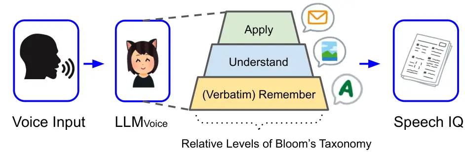
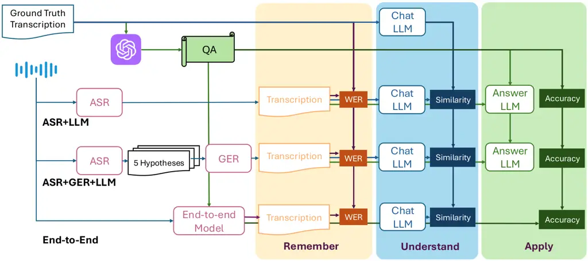

# SpeechIQ: Speech-Agentic Intelligence Quotient Across Cognitive Levels in Voice Understanding by Large Language Models

Zhen Wan Affiliation: Kyoto University
Email: [zhenwan@nlp.ist.i.kyoto-u.ac.jp](mailto:)    Chao-Han Huck Yang
Affiliation: NVIDIA Email: [hucky@nvidia.com](mailto:)    Yahan Yu
Affiliation: Kyoto University    Jinchuan Tian Affiliation: Carnegie
Mellon University    Sheng Li Affiliation: Institute of Science Tokyo   
Ke Hu Affiliation: NVIDIA    Zhehuai Chen Affiliation: NVIDIA    Shinji
Watanabe Affiliation: Carnegie Mellon University    Fei Cheng
Affiliation: Kyoto University    Chenhui Chu Affiliation: Kyoto
University    Sadao Kurohashi Affiliation: Kyoto University

###### Abstract

We introduce Speech Intelligence Quotient (SpeechIQ) as a new form of
human cognition-inspired evaluation pipeline for voice understanding
large language models (LLM*(Voice)), designed to assess their voice
understanding ability. Moving beyond popular voice understanding metrics
such as word error rate (WER), SpeechIQ examines LLM*(Voice) across
three cognitive levels motivated by Bloom’s Taxonomy: (1) Remembering
(i.e., WER for verbatim accuracy); (2) Understanding (i.e., similarity
of LLM’s interpretations); and (3) Application (i.e., QA accuracy for
simulating downstream tasks). We demonstrate that SpeechIQ not only
quantifies voice understanding abilities but also provides unified
comparisons between cascaded methods (e.g., ASR-LLM) and end-to-end
models, identifies annotation errors in existing benchmarks, and detects
hallucinations in LLM\_(Voice). Our framework represents a
first-of-its-kind intelligence examination that bridges cognitive
principles with voice-oriented benchmarks, while exposing overlooked
challenges in multi-modal training. Our Speech-IQ leaderboard is hosted
at
[huggingface.co/spaces/nvidia/Speech-IQ-leaderboard](https://huggingface.co/spaces/nvidia/Speech-IQ-leaderboard).

## 1 Introduction

The rapid rise of voice understanding Large Language Models
(LLM$`{}_{\text{Voice}}`$) that can process voice input via the speech
portal has ushered in a new paradigm of human-machine interaction Reddy
(1988), where LLM$`{}_{\text{Voice}}`$ process spoken instructions,
infer semantic intent, and execute downstream tasks Jelinek et al.
(1991); Jurafsky et al. (1995); Zue and Glass (2000); Tur et al. (2005);
Mesnil et al. (2014); Kawahara (2019); Huang et al. (2024); Mahmood et
al. (2025). LLM$`{}_{\text{Voice}}`$ bridge speech and language
intelligence Sparks et al. (1996), enabling applications from voice
assistants to interactive robots. A fundamental prerequisite for
deploying robust LLM$`{}_{\text{Voice}}`$ lies in establishing reliable
evaluation metrics for voice understanding. These metrics ensure that
the system accurately comprehends voice inputs. Automatic speech
recognition (ASR) is the central component of existing cascaded¹¹ 1 We
refer to two-pass based neural ASR-LM systems Hoffmeister et al. (2016);
Sainath et al. (2019); Huang et al. (2020), which have been widely
adopted in the current voice assistants, including Siri, Alexa, and
Google Assistant. LLM$`{}_{\text{Voice}}`$ systems, transcribing voice
into text for subsequent LLM processing. Consequently, the research
community primarily assesses voice understanding using transcription
error metrics Hunt (1990); Klakow and Peters (2002), with Word Error
Rate (WER) standing as the de facto standard.

However, WER primarily measures the lexical recall of ASR, its
transcribed quality does not fully capture the semantic understanding He
et al. (2011); Chen et al. (2018); Szymański et al. (2020) and task
completion Van Strien et al. (2020) capabilities of LLMs via their
speech portal. For instance, WER treats all lexical errors equally,
ignoring how transcription inaccuracies propagate to higher-level
comprehension (i.e., semantic understanding) and executions (i.e.,
downstream tasks).



Figure 1: An overview of cognitive levels in voice understanding large
language model systems related to the first three foundational
hierarchies of Bloom’s Taxonomy. We design a corresponding examination
to measure SpeechIQ as a detailed pipeline in Figure 2.

Meanwhile, a growing trend in LLM$`{}_{\text{Voice}}`$ research is the
shift toward end-to-end multi-modal models Rubenstein et al. (2023);
Radhakrishnan et al. (2023); Maiti et al. (2024); Hu et al. (2024);
Défossez et al. (2024); Chen et al. (2024), which bypass explicit ASR
transcription and directly map audio inputs to task-specific outputs
(e.g., answers, actions). While this paradigm simplifies pipelines and
reduces error cascades, its end-to-end voice service obviates the need
for generating an intermediate transcript, rendering traditional
WER-based evaluation obsolete Kuo et al. (2020); Tüske et al. (2021).
This creates a critical methodological gap: without a reliable and
potentially unified metric, comparing voice understanding across
architectural choices, such as the modularity of “cascaded neural
systems” and the efficiency of “end-to-end mutlimodal models,” remains
insufficiently characterized.

The above two limitations mirror a fundamental challenge in assessing
artificial intelligence: as Figure 1, human-like intelligence is
inherently hierarchical. Drawing on Bloom’s Taxonomy Bloom and Krathwohl
(1969); Bengio et al. (2009), a cognitive framework where skills ascend
from basic remembering to advanced creating, we posit that
LLM$`{}_{\text{Voice}}`$ should be evaluated through analogous levels.
In this framework, WER represents the lowest level by measuring verbatim
recall while neglecting higher-order abilities such as semantic
understanding and task-solving. For instance, two transcripts with
identical WER may differ drastically in meaning Szymański et al. (2023),
leading to divergent LLM$`{}_{\text{Voice}}`$ responses or failed
instructions.

To address this gap, we propose a hierarchical IQ test for
LLM$`{}_{\text{Voice}}`$ that evaluates intelligence across three
fundamental levels (refer to limitations) aligned with Bloom’s Cognitive
Taxonomy: (1) Remember in verbatim: Lexical accuracy is quantified using
WER; (2) Understand: Semantic consistency is assessed by comparing LLM
responses to ASR outputs and ground-truth transcripts. LLMs are prompted
to infer the background context (e.g., domain, speaker intent) and
generate a summary of the speech, then measure hidden states similarity
between ASR-derived and ground truth-derived responses; (3) Apply:
Task-solving capability is tested via multi-choice question-answering
(QA) pairs constructed from ground-truth transcripts.
LLM$`{}_{\text{Voice}}`$ answers questions based on speech inputs, with
accuracy reflecting real-world utility. Then, we draw inspiration from
Raven’s Progressive Matrices Raven and Court (1998); John and Raven
(2003) (i.e., a human IQ test) that aggregates performance across
various dimensions into a single score.

Beyond overall evaluation, our SpeechIQ framework yields two key
insights:

- •
  Cascade systems (ASR+LLM) outperform end-to-end models under similar
  scaling, revealing modality interference in joint speech-text
  training.
- •
  Cross-model QA consistency exposes ground-truth errors. By isolating
  questions most LLM$`{}_{\text{Voice}}`$, cannot solve, we create an
  “unanswerable” set that helps detect hallucinations Frieske and Shi
  (2024); Koenecke et al. (2024) and refine benchmark annotations.

Our work advances LLM$`{}_{\text{Voice}}`$ evaluation by merging
cognitive principles with practical metrics, revealing hidden challenges
in multimodal inference (e.g., hallucination inheritance), and offering
tools to build more robust systems. Code and data will be publicly
available.

## 2 Related Work

### 2.1 ASR Evaluation

ASR systems have long been evaluated using lexical similarity metrics
such as WER, which quantifies the Levenshtein distance Navarro (2001)
between ASR outputs and reference transcripts. Metrics like character
error rate MacKenzie and Soukoreff (2002) (CER), sentence error
rate Juffs and Harrington (1996) (SER), and translation error rate (TER)
extend this framework to the sentence or translation level but share
WER’s core limitation: treating all errors equally, regardless of
semantic impact. While effective for benchmarking transcription
fidelity, these metrics do not fully capture how errors propagate to
downstream tasks.

Recent work mitigates WER’s semantic insensitivity by incorporating
sentence embeddings into evaluation. Sentence similarity-based
metrics Kim et al. (2021); Kim et al. (2022) and BERTScore Zhang et al.
(2020) leverage pre-trained language models to compute semantic
correspondence between ASR hypotheses and ground-truth references.
Others propose task-specific metrics, such as Medconcept WER Adedeji et
al. (2024) which arranges more weights on medical entities in WER
computation or severity score Whetten and Kennington (2023) that
involves sentiment similarity in the evaluation. However, these methods
are either confined to specific tasks or require curated labeled data,
limiting their generalizability to open-domain LLM$`{}_{\text{Voice}}`$.

Efforts to develop hybrid metrics that combine error rate and semantic
similarity, such as H_eval Sasindran et al. (2023), and Sema Sasindran
et al. (2024), further enrich the evaluation landscape. Concurrently,
machine translation inspired metrics like BLEU Score Papineni et al.
(2002) and COMET Rei et al. (2020), have started to be adapted for ASR
to assess fluency and pragmatic adequacy. However, these approaches
still emphasize text-to-text alignment between ASR outputs and
references, rather than from a view of influencing the responses and
actions of downstream LLMs, motivating the proposed SpeechIQ as a
multi-dimensional metric.

### 2.2 LLM$`{}_{\text{Voice}}`$ Understanding Systems

In general, speech-based LLMs encompass both the understanding of voice
signals and the generation Agostinelli et al. (2023); Borsos et al.
(2023a); Yang et al. (2024c) of vocal or general audio outputs. In this
work, we focus exclusively on voice understanding tasks with text
outputs as one first step to examine voice intelligence Sparks et al.
(1996) or its potential voice world model Ha and Schmidhuber (2018);
Matsuo et al. (2022) via LLM backbone, which we denote as
LLM$`{}_{\text{Voice}}`$. LLM$`{}_{\text{Voice}}`$ understanding systems
are designed to interact Shah et al. (2018); López et al. (2018) with
users and execute task-oriented instructions via speech-based inputs.
This form of “voice-to-text” architecture can be broadly categorized
into three main types, all of which achieve state-of-the-art ASR quality
on public leaderboards Radford et al. (2022); Chen et al. (2023);
Puvvada et al. (2024):

#### (1) Cascaded ASR + LLM

This approach follows a traditional pipeline-based structure, where an
ASR model Watanabe et al. (2018); Gulati et al. (2020); Radford et al.
(2022) transcribes the spoken input, and the 1-best transcription is
passed to textual LLM as one operation system Wu et al. (2024); Dighe et
al. (2024) for direct response generation.



Figure 2: Overview of Speech IQ (SIQ) test. We compared
cognition-inspired categories of LLM$`{}_{\text{Voice}}`$ represented in
three rows, with the right columns denoting the SIQ sub-tests. The truth
reference will be used in the sub-tests.

#### (2) Cascaded ASR Hypotheses + Generation Error Correction (GER) + LLM

In this approach, the ASR model first generates multiple possible
transcriptions (i.e., hypotheses) for a given speech input, where
“texts” are then treated as input features for a many-to-one GER
post-editing module Yang et al. (2023); Velikovich et al. (2024); Hori
et al. (2025). The GER module refines these hypotheses to determine the
most accurate transcription, which is subsequently processed by the LLM.

#### (3) End-to-End Multi-Modal Models

These models are inherently designed to support both speech and text
modalities Rubenstein et al. (2023); Hu et al. (2024); Lyu et al.
(2023); Zhang et al. (2024a). Unlike cascaded approaches, they process
audio inputs directly and generate textual outputs without requiring
intermediate ASR transcriptions. This paradigm leverages a multimodal
learning framework (i.e., a speech embedding encoder Radhakrishnan et
al. (2023) or tokenizer Borsos et al. (2023b); Zhang et al. (2024b)) to
achieve end-to-end speech understanding and reasoning.

In summary, we carefully selected and examined aforementioned three
ASR-LLM systems. System 1 serves as the most cost-effective
solution Hermansky and Junqua (1988) for voice interactions with LLMs.
System 2 is designed to decode texts that offer richer information Chan
et al. (2023); Yang et al. (2024b) for textual applications. System 3
highlights a low-latency, multimodal embedding injection approach for
large language models OpenAI et al. (2024); Team et al. (2024). Next, we
introduce our proposed method, which corresponds to Bloom’s cognitive
taxonomy.

## 3 SpeechIQ: Speech Intelligence Quotient

We will subsequently introduce each level of the test, from the remember
level to both the understand level and apply level. At the end of this
section, we will discuss the computation of the final SpeechIQ. An
overview of our workflow is in Figure 2.

### 3.1 Remember: WER Metric

The remember level assesses the ability to reproduce spoken content
accurately. WER serves as a natural metric since it measures the
verbatim discrepancy between ASR output and the ground truth at a
granular level, with the advantage that it captures even the smallest
differences, making it highly sensitive to transcription errors.

### 3.2 Understand: Similarity Metric

The understand level assesses whether the ASR-generated transcript
effectively conveys the intended meaning of the original speech. This is
particularly important when ASR output serves as input to the LLM, and a
minor transcription difference could lead to significant semantic
variations to LLMs. For instance, two transcriptions with identical WER
scores can have vastly different meanings:

- •
  Ground truth: "I feel pain in the lower back."
- •
  ASR 1: "I feel like pain in the \_ back."
- •
  ASR 2: "I feel painting in the world back."

Although both have the same WER = 29%, they convey different meanings
and lead to drastically different LLM responses.

To quantify the impact of ASR errors on semantic comprehension, we
measure the deviation in LLM responses caused by ASR transcription
errors. Specifically, inspired by recent work (Jiang et al., 2024; Liu
et al., 2024) showing that instructing LLMs to generate one word is a
simple and straightforward approach to representing semantic meanings,
we evaluate LLM-generated responses via two key questions: (1) $`b`$:
The background scenario of the speech \[\] in one word is. This helps
resolve ambiguities and measure whether the ASR content preserves core
contextual meaning; (2) $`s`$: The summary of this speech \[\] in one
word is. This assesses the extent to which ASR errors affect the LLM’s
high-level understanding. Instead of directly comparing LLM-generated
words, we use the last layer of hidden states of LLM for generating the
next token as embeddings and compute their cosine similarity with the
embeddings generated from the ground truth transcription:

```math
\text{Sim}\_b=\cos(\mathcal{M}\_b(\text{ASR}),\mathcal{M}\_b(\text{Ground})) \tag{1}
```

```math
\text{Sim\_s}=\cos(\mathcal{M}\_s(\text{ASR}),\mathcal{M}\_s(\text{Ground})) \tag{2}
```

where $`\mathcal{M}\_`$ denotes the LLM’s hidden states. We then select
the lower similarity as the final Sim score since we intend to capture
the semantic gap between the ASR and the ground truth. This
embedding-based approach enables a robust evaluation of semantic
preservation in ASR outputs, beyond simple word-matching metrics.

### 3.3 Apply: QA Accuracy

The Apply level evaluates a LLM$`{}_{\text{Voice}}`$’s ability to
leverage transcribed information for solving downstream problems,
reflecting its real-world utility in task-oriented scenarios. We
simulate this utility by constructing multi-choice QA, which is a
typical listening test for our human language learners. Specifically,
for each speech example, we construct $`3`$ questions based on the
ground-truth transcription along with $`5`$ choices per question.
(including $`1`$ option as “None of the above”)

During QA generation, we leverage GPT-4o and prompt it to focus on
either the core concept or information details in the transcription.
(Appendix A) To mitigate potential errors in generated QA, we also
employ GPT-4o itself and Gemini-1.5-flash to answer these questions
using the ground-truth transcription. Questions, where GPT-4o or
Gemini-1.5-flash fails to produce correct answers, are discarded and
regenerated. Then during evaluation, cascaded systems answer questions
based on ASR transcriptions, while end-to-end systems directly process
speech inputs to generate responses without intermediate ASR steps. Each
LLM$`{}_{\text{Voice}}`$ answers $`5`$ times per quesion and use the
majority vote as the final answer Wang et al. (2023). QA accuracy is
then measured via an exact match and higher accuracy indicates a
stronger capability to contextualize and apply spoken content to
real-world tasks.

Moreover, we realize that this QA test can also help recognize potential
annotation errors in the benchmarks efficiently, since QA generated by
annotation errors will be unanswerable to LLM$`{}_{\text{Voice}}`$, we
use this feature to filter out annotation errors in our main experiments
and further utilize them to detect hallucinations in Section 5.5.

### 3.4 Final SIQ Score

Inspired by standard Raven’s progressive matrices John and Raven (2003),
a popular human IQ mechanism, we have three steps to compute SIQ: (1)
harder samples have higher scores; (2) global standardization making
scores among levels computable; (3) dynamic weight among levels in
computing final SIQ. For each LLM$`{}_{\text{Voice}}`$ model $`j`$ and
each speech sample $`i`$, we first compute raw scores for the three
dimensions as $`X_{\text{WER},i,j}^{\text{dim}}`$ (taking the negative
in subsequent computation), $`X_{\text{Sim},i,j}^{\text{dim}}`$, and
$`X_{\text{Acc},i,j}^{\text{dim}}`$.

#### Speech Sample Discrimination Weights

To account for variations in sample difficulty, we introduce
“discrimination weights” based on inter-model score variance. For each
speech sample $`i`$, we compute the variance across models:

```math
V_{i}^{\text{dim}}=\text{Var}([X_{\text{Raw},i,j}^{\text{dim}}\ \forall j]) \tag{3}
```

where $`"\text{dim}"`$ refers to 3 levels. Using these variance values,
we compute weighted scores:

```math
X_{j}^{\text{dim}}=\frac{\sum_{i=1}^{N}X_{\text{Raw},i,j}^{\text{dim}}\cdot V_{i}^{\text{dim}}}{\sum_{i=1}^{N}V_{i}^{\text{dim}}} \tag{4}
```

where $`N`$ denotes the number of models. This ensures that speech
samples with greater discrimination power have a larger influence.

#### Global Standardization

For each dimension, we perform standardization to normalize scores
across models:

```math
Z_{j}^{\text{dim}}=\frac{X_{j}^{\text{dim}}-\mu^{\text{dim}}}{\sigma^{\text{dim}}} \tag{5}
```

where $`\mu_{\text{dim}}`$ and $`\sigma_{\text{dim}}`$ are the mean and
standard deviation of all model scores for that dimension.

#### Dynamic Weight Computation

To ensure a balanced contribution of each evaluation dimension, we
assign dynamic weights based on variance. Since higher variance may
indicate greater instability, we use the “inverse variance”:

```math
w^{\text{dim}}=\frac{1}{\sigma^{\text{dim}}_{\text{raw}}+\epsilon},w_{f}^{\text{dim}}=\frac{w^{\text{dim}}}{\sum w^{\text{dim}}} \tag{6}
```

where $`\sigma^{\text{dim}}_{\text{raw}}`$ is the standard deviation
computed by all raw scores, and $`\epsilon`$ is a small constant to
prevent division by zero. The weights are then normalized on the
summation of three dimensions.

#### Final IQ Score Computation

The final intelligence score for each model $`j`$ is computed as a
weighted sum of the standardized scores:

```math
Score_{j}=\sum_{\text{dim}}w_{f}^{\text{dim}}\cdot Z^{\text{dim}}_{j} \tag{7}
```

Finally, the score is converted into an IQ-like scale:

```math
SIQ_{j}=100+15\cdot Score_{j}. \tag{8}
```

As one additional study, we also perform normalization based on model
scale (i.e., analogous to age factors in human IQ). However, due to the
involvement of multiple variables in neural scaling laws Kaplan et al.
(2020), we report the non-normalized SIQ and provide preference rankings
from a human study to validate its correlation.

## 4 Experiment Setup

### 4.1 Datasets

To comprehensively evaluate LLM$`{}_{\text{Voice}}`$ intelligence across
varied domains and real-world challenges, we carefully select two
datasets earning22 Rio et al. (2022) and voxpopuli Wang et al. (2021)
from the popular OpenASR Leaderboard, while an additional dataset
Med-ASR-EN²² 2
[https://huggingface.co/datasets/jarvisx17/Medical-ASR-EN](https://huggingface.co/datasets/jarvisx17/Medical-ASR-EN)
is chosen from the medical domain, featuring diverse accents and
environments. This ensures that our evaluation tests
LLM$`{}_{\text{Voice}}`$ performance in different real-world scenarios,
including domain-specific speech and challenging acoustic conditions.
Considering the high computational cost of leveraging GPT-4o APIs for QA
evaluation and running end-to-end LLM$`{}_{\text{Voice}}`$ (e.g.,
Gemini), we extract a subset constructed by the longest audios from each
dataset shown in Table 1.

| Dataset   | \# Subset | Domain                     | WER   |
| --------- | --------- | -------------------------- | ----- |
| Earning22 | 200       | Financial meetings         | 12.05 |
| Voxpopuli | 200       | European Parliament        | 7.48  |
| Medasr    | 400       | Hospital Accented Patients | 7.7   |

Table 1: Statistics of datasets. WER results are on whole dataset via
Whisper-large-v2.

### 4.2 Models

We conduct experiments across three major LLM$`{}_{\text{Voice}}`$
architectures as follows:

#### ASR+LLM

We compare the following widely used ASR models: Whisper-Large-v2,
Whisper-Large-v3 (Radford et al., 2022), Canary (Puvvada et al., 2024),
and ESPnet (owsm_ctc_v3.1_1B) (Watanabe et al., 2018)

#### ASR+GER+LLM

We select GPT-4o (OpenAI et al., 2024) as the GER module and use
Whisper-large-v2 to generate 5 hypotheses for each audio based on beam
search.

#### End-to-end Multimodal Models

For speech-to-text multimodal models, we compare Salmonn (Tang et al.,
2024), Qwen2-audio (Chu et al., 2024), desta2 (Lu et al., 2025) and the
latest Qwen-2.5-Omni(Xu et al., 2025), we also involve any-to-any
multimodel models with speech-to-text capabilities: AnyGPT (Zhan et al.,
2024), Baichuan-omni-1.5 (Li et al., 2025), and Gemini-1.5 (Team et al.,
2024). We specifically denote Baichuan-omni-1.5 and Gemini-1.5 as
“end-to-end-large” since they are either scaled up in training data or
model size.

In the understanding level test, we select LLaMA-3.1-8B-Instruct to
generate hidden states as responses since related work (Jiang et al.,
2024; Liu et al., 2024) has proved the strong embedding capability of
LLaMA-based models.

Meanwhile, for the LLM in both ASR + LLM and ASR + GER + LLM to answer
QA, we use Qwen2-7b (Yang et al., 2024a) for fair comparisons in size.
Preliminary experiments to validate Qwen2-7b and other experiment
details are in Appendix B.

Figure 3: Raw remember scores. All cascaded models outperform end-to-end
models including Gemini-1.5.

## 5 Experimental Results

In this section, we will first show the results of each level, and then
the final SIQ scores. Considering the limited space, for each level we
show the average score on 3 datasets without Desta2 and AnyGPT since
they show a relatively low performance, the complete results are in
Appendix.

Figure 4: Raw understand scores. Gemini-1.5-flash shows the best
semantic capturing.

### 5.1 Remember-Level Results

Figure 3 shows the raw WER scores of each model. Among all tested
models: (1) Canary achieves the lowest WER, demonstrating the best
remembering capability; (2) GER even negatively affects ASR if we focus
on the increasing WER; (3) More broadly, all ASR models significantly
outperform end-to-end LLM$`{}_{\text{Voice}}`$ in terms of WER, and even
large-scale end-to-end models, such as Gemini-1.5, perform worse than
ASR models, reinforcing the robustness of traditional dedicated ASR
models.

Figure 5: Raw apply scores. End-to-end-large models perform best while
smaller ones perform worst.

|                                                                   |                           |                             |                        |                     |
| ----------------------------------------------------------------- | ------------------------- | --------------------------- | ---------------------- | ------------------- |
| Relative Bloom’s Taxonomy Levels                                  |     Remember $`\uparrow`$ |     Understand $`\uparrow`$ |     Apply $`\uparrow`$ |    SIQ $`\uparrow`$ |
| ASR+LLM Approaches                                                |                           |                             |                        |                     |
| Whisper$`{}_{\text{v2-1.5B}}`$ + Qwen2$`{}_{\text{7B}}`$          | 0.554                     | 0.499                       | 0.481                  | 107.43              |
| Whisper$`{}_{\text{v3-1.5B}}`$ + Qwen2$`{}_{\text{7B}}`$          | 0.553                     | 0.433                       | 0.432                  | 106.49              |
| Canary$`{}_{\text{1B}}`$ + Qwen2$`{}_{\text{7B}}`$                | 0.559                     | 0.566                       | 0.504                  | 107.78              |
| OWSM-CTC$`{}_{\text{v3.1-1B}}`$ + Qwen2$`{}_{\text{7B}}`$         | 0.534                     | 0.151                       | 0.353                  | 103.05              |
| ASR+GER+LLM Approach                                              |                           |                             |                        |                     |
| Whisper$`{}_{\text{v2-1.5B}}`$ + GPT-4o + Qwen2$`{}_{\text{7B}}`$ | 0.543                     | 0.632                       | 0.487                  | 108.64              |
| Multi-Modal End-to-End Approaches                                 |                           |                             |                        |                     |
| Qwen2-Audio$`{}_{\text{7B w/ 1.5B Whisper}}`$                     | -0.187                    | 0.366                       | 0.011                  | 103.88              |
| Qwen2.5-Omni$`{}_{\text{7B w/ 1.5B Whisper}}`$                    | 0.472                     | 0.410                       | 0.509                  | 105.74              |
| Salmonn$`{}_{\text{13B w/ 1.5B Whisper}}`$                        | 0.508                     | 0.381                       | -1.146                 | 101.03              |
| Desta2$`{}_{\text{8B w/ 1.5B Whisper}}`$                          | -2.575                    | -1.604                      | -0.233                 | 79.69               |
| AnyGPT$`{}_{\text{7B}}`$                                          | 0.314                     | -2.718                      | -2.893                 | 60.02               |
| Baichuan-omni-1.5$`{}_{\text{7B}}`$                               | 0.448                     | 0.184                       | 0.546                  | 104.02              |
| Gemini-1.5-flash                                                  | -1.885                    | 0.641                       | 0.673                  | 107.85              |
| Gemini-1.5-pro                                                    | 0.492                     | 0.409                       | 0.710                  | 107.08              |

Table 2: Main Results. The results of remember and understand levels are
from single experiment, while apply level include the majority results
of 5-time generations.

### 5.2 Apply-Level Results

As in Figure 5: (1) While end-to-end models with similar sizes as
cascaded models make much poorer accuracies, all scaling-up end-to-end
models achieve superior performance in capturing apply level knowledge,
which is consistent with the scaling law; (2) GER not only improves
semantic retention but also enhances downstream reasoning capabilities
in the apply level.

### 5.3 SIQ Scores

Table 2 shows the final SIQ scores and we can observe: (1) A key
observation is that the rankings based on WER do not hold for overall
LLM$`{}_{\text{Voice}}`$’ intelligence: while single ASR models
outperform ASR+GER and end-to-end approaches on WER, they fail to
maintain their lead in higher-level intelligence evaluations; (2)
End-to-end LLM$`{}_{\text{Voice}}`$ systems underperform cascaded models
of the same scale, but when model size increases as Gemini-1.5, they
achieve competitive SIQ with cascaded approaches; (3) GER provides
stable SIQ score improvements for ASR+GER+LLM models and achieve the
best SIQ.

|                                     |       |       |         |       |       |                       |                        |
| ----------------------------------- | ----- | ----- | ------- | ----- | ----- | --------------------- | ---------------------- |
| LLM$`{}_{\text{Voice}}`$            | Human | WER   | SemDist | LLM-S | BLEU  | SIQ$`{}_{\text{rm}}`$ | SIQ$`{}_{\text{all}}`$ |
| Model\_(A)                          | 3     | 2     | 4       | 4     | 3     | 4                     | 2                      |
| Model\_(B)                          | 8     | 10    | 8       | 8     | 6     | 8                     | 10                     |
| Model\_(C)                          | 7     | 7     | 7       | 6     | 8     | 7                     | 7                      |
| Model\_(D)                          | 1     | 4     | 2       | 5     | 4     | 3                     | 1                      |
| Model\_(E)                          | 4     | 6     | 5       | 7     | 5     | 6                     | 4                      |
| Model\_(F)                          | 6     | 5     | 6       | 2     | 7     | 5                     | 6                      |
| Model\_(G)                          | 2     | 3     | 1       | 3     | 2     | 2                     | 3                      |
| Model\_(H)                          | 5     | 1     | 3       | 1     | 1     | 1                     | 5                      |
| Model\_(I)                          | 9     | 8     | 10      | 10    | 9     | 10                    | 8                      |
| Model\_(J)                          | 10    | 9     | 9       | 9     | 10    | 9                     | 9                      |
| correlation $`\rho`$ ($`\uparrow`$) | \-    | 0.770 | 0.721   | 0.624 | 0.806 | 0.830                 | 0.952                  |
| $`p`$-value ($`\downarrow`$)        | \-    | 0.009 | 0.005   | 0.019 | 0.054 | 0.003                 | 0.00002                |

Table 3: Human Voted Rankings & Existing Metrics.

| Model                                                          | WER $`\downarrow`$ | Similarity $`\uparrow`$ | Accuracy $`\uparrow`$ | Hallucination $`\downarrow`$ |
| -------------------------------------------------------------- | ------------------ | ----------------------- | --------------------- | ---------------------------- |
| Whisper$`{}_{\text{v2-1.5B}}`$ + Qwen$`{}_{\text{7B}}`$        | 11.8               | 93.7                    | 91.7                  | 2 (12.0%)                    |
| Qwen2-Audio$`{}_{\text{7B}}`$                                  | 20.0               | 92.8                    | 83.9                  | 4 (24.0%)                    |
| Whisper$`{}_{\text{v2-1.5B}}`$ + Llama3$`{}_{\text{8B-ins}}`$  | 11.7               | 94.0                    | 95.7                  | 7 (41.2%)                    |
| Desta2$`{}_{\text{8B w/ 1.5B Whisper}}`$                       | 76.55              | 81.6                    | 83.9                  | 12 (70.6%)                   |
| Whisper$`{}_{\text{v2-1.5B}}`$ + Vicuna$`{}_{\text{13B-1.1}}`$ | 11.7               | 94.0                    | 87.3                  | 1 (6.8%)                     |
| Salmonn$`{}_{\text{13B w/ 1.5B Whisper}}`$                     | 14.70              | 93.1                    | 60.3                  | 4 (24.0%)                    |

Table 4: Cascaded v.s. End-to-end including hallucination detection.
Cascaded models perform better correspondingly. Desta2 shows
unexpectedly high QA accuracy and halluciantions along with its
foundation Llama3$`{}_{\text{8B-ins}}`$.

#### Human Evaluation on Comparing with Existing Metrics

To validate that SIQ better reflects the voice understanding
capabilities of LLM$`{}_{\text{Voice}}`$ models compared to existing
metrics, we conduct a human evaluation on nine examples involving ten
randomly selected anonymous models to avoid human bias on models. For
each example, we invite ten human experts, including both native
speakers and non-native speech researchers, to rank the ten
transcriptions produced by each model based on the ground-truth
transcription. We then aggregate these rankings to derive a final rank
for each model and compare the results with the rankings obtained from
existing metrics on the same nine examples. For SIQ, we compare two
variants: (1) SIQ$`{}_{\text{rm}}`$: compute on $`9`$ examples but
removing weight standardization due to the limited sample size; (2)
SIQ$`{}_{\text{all}}`$: the SIQ in Table 2 . Then we compute Spearman’s
Rank Correlation Coefficient $`\rho`$ with human rankings. In Table 3,
SIQ consistently outperforms existing metrics in capturing human
preferences, particularly SIQ$`{}_{\text{all}}`$, demonstrating its
effectiveness in assessing voice understanding capabilities.

### 5.4 Cascaded vs End-to-end

Our SIQ scores provide strong empirical evidence that cascaded systems
achieve significantly higher intelligence scores compared to end-to-end
models of similar size. However, a crucial factor influencing this
result is the LLM used in QA. Cascaded systems can typically utilize the
latest LLMs (e.g., Qwen2-7b, GPT-4o) for QA-based reasoning, whereas
end-to-end models are often constrained by their foundation LLMs that
jointly handle speech tokens and language understanding. To eliminate
this confounding factor, we conducted an ablation experiment comparing
cascaded and end-to-end systems built on the same base model.

As shown in Table 4, the cascaded approach consistently outperforms the
end-to-end model in 3 levels. Specifically, Qwen2-audio and Salmonn are
largely worse than their cascaded variants at the apply level. We
hypothesize that the multi-modal training may sacrifice the original
reasoning capability of foundation models if not well designed, which is
crucial for understanding the limitations of joint training for
multi-modal intelligence.

Additionally, we observe that Desta-2 exhibits unexpectedly high QA
accuracy while its performances on the WER and similarity are pretty
poor. Interestingly, the base model of Desta-2, LLaMA3-8B-instruct, also
achieves a higher-than-expected performance than cascaded experiments.
We implemented a closer case study (Appendix C) which reveals that
Desta-2 may stem from LLaMA3-8B-instruct showing a strong tendency to
hallucinate: (1) Guess the answer even not been recognized in its ASR
results; (2) Change the options in the question. This indicates that SIQ
can not be represented by the apply level alone, which may suffer from
the hallucination issue in question answering.

Moreover, manually verifying hallucinated QA evaluation is prohibitively
expensive. Inspired by the “annotation error” introduced in Section 3.3,
in the following section, we introduce an unanswerable set to detect
hallucinations in LLM$`{}_{\text{Voice}}`$.

### 5.5 Unanswerable Set: Detecting Hallucination in LLM$`{}_{\text{Voice}}`$

One major advantage of QA-based evaluation is that it allows us to
efficiently identify potential annotation errors. If a given QA pair
consistently fails across most LLM$`{}_{\text{Voice}}`$, it is likely
that the failure is due to incorrect or ambiguous annotations resulting
in unanswerable questions rather than genuine model errors.

To leverage this property, we filter out questions that the majority (a
threshold of "half") of LLM$`{}_{\text{Voice}}`$ fail to answer
correctly and manually check the corresponding speech and annotations.
This significantly reduces human efforts overhead (only $`26`$ out of
$`800`$ samples require human review). After verification, we confirm
that $`17`$ questions are truly unanswerable based on the available
speech content, which forms our unanswerable Set for detecting
hallucinations.

We measure both cascaded and end-to-end LLM$`{}_{\text{Voice}}`$ in
Table 4. For each unanswerable question, the hallucination will be
counted when the answer to the unanswerable question is not “(E) None of
the above,”. Our results indicate that LLaMA3-8B-Instruct exhibits a
significantly higher hallucination ratio than other LLMs, and this
problem gets even worse in its end-to-end variant, which explains the
higher-than-expected performance in apply level test. This inspires us
that the hallucination of foundation LLMs may be inherited by its
multi-modal variances, emphasizing the importance of foundation model
selection and reducing hallucination in multi-modal training.

### 5.6 End-to-end Models on the Cascaded Category

We then checked the performance of end-to-end models (Qwen2-audio and
Gemini-1.5-flash) in the cascaded category by replacing the ASR model by
the end-to-end model, and then used the LLM in the cascaded category to
answer questions, noting that this variant only affects the apply level
evaluation. Interestingly, in figure 5we find that for the smaller model
Qwen2-audio, cascaded version improves the apply level while for larger
model Gemini, end-to-end version wins. This may indicate that higher
intelligence may result in better end-to-end apply level performance
even if sometimes perfect transcription is not generated. We further
extend this assumption by involving a human SIQ test, we manually select
3 hard examples and invite 10 human individuals to report the average
scores as in Table 6. It seems that humans are still good at apply level
even with the worst WER performance in transcription, which is
consistent with our assumption that higher intelligence may largely
benefit higher-order cognitive levels. This may inspire future work on
how to improve the intelligence level of LLM$`{}_{\text{Voice}}`$.

| Model                                    | Remember $`\downarrow`$ | Understand $`\uparrow`$ | Apply $`\uparrow`$ |
| ---------------------------------------- | ----------------------- | ----------------------- | ------------------ |
| Qwen2-Audio$`{}_{\text{7B}}`$ (end2end)  | 20.00                   | 92.8                    | 83.9               |
| Qwen2-Audio$`{}_{\text{7B}}`$ (cascaded) | 20.00                   | 92.8                    | 84.2               |
| Gemini-1.5-flash (end2end)               | 20.9                    | 95.3                    | 96.6               |
| Gemini-1.5-pro (cascaded)                | 20.9                    | 95.3                    | 95.1               |

Table 5: Take ASR from end-to-end models

| Model                                                             | Remember $`\downarrow`$ | Apply $`\uparrow`$ |
| ----------------------------------------------------------------- | ----------------------- | ------------------ |
| Whisper$`{}_{\text{v2-1.5B}}`$ + Qwen$`{}_{\text{7B}}`$           | 23.71                   | 88.89              |
| Whisper$`{}_{\text{v2-1.5B}}`$ + Qwen$`{}_{\text{7B}}`$           | 17.26                   | 88.89              |
| Canary$`{}_{\text{1B}}`$ + Qwen$`{}_{\text{7B}}`$                 | 24.80                   | 88.89              |
| Whisper$`{}_{\text{v2-1.5B}}`$ + GPT-4o + Qwen2$`{}_{\text{7B}}`$ | 21.13                   | 88.89              |
| Salmonn$`{}_{\text{13B w/ 1.5B Whisper}}`$                        | 31.55                   | 44.44              |
| Qwen2-Audio$`{}_{\text{7B}}`$                                     | 25.50                   | 88.89              |
| Gemini-1.5-flash                                                  | 19.05                   | 66.67              |
| Gemini-1.5-pro                                                    | 19.05                   | 77.78              |
| Human                                                             | 53.67                   | 99.27              |

Table 6: Human test on 3 examples.

## 6 Conclusion

Existing metrics fail to comprehensively evaluate
LLM$`{}_{\text{Voice}}`$’s capability in semantic understanding or
task-solving. Therefore, we build a three-level SIQ test following
Bloom’s taxonomy, each level owns unique features and represents
different intelligence levels. Our study involves various
LLM$`{}_{\text{Voice}}`$ frameworks, and the SIQ test serves as a
unified metric for benchmarking different frameworks. We then discuss
whether current end-to-end LLM$`{}_{\text{Voice}}`$s outperform cascaded
methods with the same size, indicating the potential insights in
training multi-modal models. Moreover, benefiting from the QA test, we
need much less human effort to filter out annotation errors in existing
benchmarks and build an unanswerable set, which can further help
evaluate the hallucination of LLM$`{}_{\text{Voice}}`$ which is also
crucial for multi-modal training.

## Limitation

In our attempt to provide an examination of Speech IQ, our study limits
that warrant discussion.

#### Data and Evaluation Limitations

Although this work represents the first systematic investigation of SIQ
assessment with demonstrated effectiveness, our current evaluation is
based on moderately sized test sets. In future work, we plan to extend
our validation framework across diverse domains and languages, and we
will employ rigorous quality assurance techniques to filter annotation
errors in widely used benchmarks. Moreover, while using publicly
available datasets ensures reproducibility, it also introduces potential
risks of data leakage. To mitigate this, we are developing closed
datasets with controlled knowledge cutoffs for subsequent research
phases.

#### Scaling and Quantitative Analysis

Our results indicate that SIQ is sensitive to model scaling effects,
including variations in architecture size and training data volume.
However, our current analysis does not quantitatively characterize these
relationships, such as a limitation reminiscent of the challenges in
interpreting human IQ with age-group normalization. As discussed in
Appendix E, our next SIQ iteration will incorporate scaling law
normalization protocols to decouple intrinsic voice understanding
capabilities from artifacts induced by parametric scaling, enabling a
more nuanced analysis of model performance.

#### Ethical and Societal Considerations

The introduction of SIQ raises important ethical and societal questions.
Since IQ classification in humans can lead to social discrimination, we
are concerned that analogous issues might arise in AI, potentially
resulting in biased treatment of systems with lower SIQ scores. We are
committed to addressing these concerns proactively and developing
safeguards to prevent such discrimination.

#### Upper 3 Levels in Bloom Taxonomy

Our study focuses only on the bottom three layers of the Bloom Taxonomy,
leaving the upper three layers unexplored. While this approach provides
a solid foundation for understanding the core aspects of the problem, it
does not capture the full hierarchical structure. The upper layers,
which may involve more advanced levels of analysis, evaluation, and
creation, remain an open avenue for our future research incorporating
audio generation, physical simulation, and acoustic event reasoning
models Kong et al. (2024). Expanding the analysis to all 6 layers could
provide a more comprehensive understanding of its broader implications
toward a form of “audio intelligence” for voice assistants.

## Acknowledgements

This work was supported by Cross-ministerial Strategic Innovation
Promotion Program (SIP) on “Integrated Health Care System” Grant No.
JPJ012425 and JSPS KAKENHI Grant No. JP24KJ1442 and NVIDIA Taiwan
Research and Devolvement Center (TRDC) project.

## References

- Adedeji et al. (2024) A. Adedeji, S. Joshi, and B. Doohan The sound of
  healthcare: improving medical transcription asr accuracy with large
  language models. External Links: 2402.07658,
  [Link](https://arxiv.org/abs/2402.07658) Cited by: §2.1.
- Agostinelli et al. (2023) A. Agostinelli, T. I. Denk, Z. Borsos, J.
  Engel, M. Verzetti, A. Caillon, Q. Huang, A. Jansen, A. Roberts, M.
  Tagliasacchi, et al. Musiclm: generating music from text. arXiv
  preprint arXiv:2301.11325. Cited by: §2.2.
- Bengio et al. (2009) Y. Bengio, J. Louradour, R. Collobert, and J.
  Weston Curriculum learning. In Proceedings of the 26th Annual
  International Conference on Machine Learning, ICML ’09, New York, NY,
  USA, pp. 41–48. External Links: ISBN 9781605585161,
  [Link](https://doi.org/10.1145/1553374.1553380),
  [Document](https://dx.doi.org/10.1145/1553374.1553380) Cited by: §1.
- Bloom and Krathwohl (1969) B.S. Bloom and D.R. Krathwohl Taxonomy of
  educational objectives: the classification of educational goals.
  Taxonomy of Educational Objectives: The Classification of Educational
  Goals, D. McKay. External Links:
  [Link](https://books.google.co.jp/books?id=VhScAAAAMAAJ) Cited by: §1.
- Borsos et al. (2023a) Z. Borsos, R. Marinier, D. Vincent, E.
  Kharitonov, O. Pietquin, M. Sharifi, D. Roblek, O. Teboul, D.
  Grangier, M. Tagliasacchi, et al. Audiolm: a language modeling
  approach to audio generation. IEEE/ACM transactions on audio, speech,
  and language processing 31, pp. 2523–2533. Cited by: §2.2.
- Borsos et al. (2023b) Z. Borsos, M. Sharifi, D. Vincent, E.
  Kharitonov, N. Zeghidour, and M. Tagliasacchi Soundstorm: efficient
  parallel audio generation. arXiv preprint arXiv:2305.09636. Cited by:
  §2.2.
- Chan et al. (2023) D. Chan, A. Myers, S. Vijayanarasimhan, D. Ross,
  and J. Canny IC3: image captioning by committee consensus. In
  Proceedings of the 2023 Conference on Empirical Methods in Natural
  Language Processing, H. Bouamor, J. Pino, and K. Bali (Eds.),
  Singapore, pp. 8975–9003. External Links:
  [Link](https://aclanthology.org/2023.emnlp-main.556/),
  [Document](https://dx.doi.org/10.18653/v1/2023.emnlp-main.556) Cited
  by: §2.2.
- Chen et al. (2023) C. Chen, Y. Hu, C. H. Yang, S. M. Siniscalchi, P.
  Chen, and E. S. Chng HyPoradise: an open baseline for generative
  speech recognition with large language models. Advances in Neural
  Information Processing Systems 36. External Links:
  [Link](https://api.semanticscholar.org/CorpusID:263152603) Cited by:
  §2.2.
- Chen et al. (2018) Y. Chen, R. Price, and S. Bangalore Spoken language
  understanding without speech recognition. In 2018 IEEE International
  Conference on Acoustics, Speech and Signal Processing (ICASSP),
  pp. 6189–6193. Cited by: §1.
- Chen et al. (2024) Z. Chen, H. Huang, A. Andrusenko, O.
  Hrinchuk, K. C. Puvvada, J. Li, S. Ghosh, J. Balam, and B. Ginsburg
  Salm: speech-augmented language model with in-context learning for
  speech recognition and translation. In ICASSP 2024-2024 IEEE
  International Conference on Acoustics, Speech and Signal Processing
  (ICASSP), pp. 13521–13525. Cited by: §1.
- Chu et al. (2024) Y. Chu, J. Xu, Q. Yang, H. Wei, X. Wei, Z. Guo, Y.
  Leng, Y. Lv, J. He, J. Lin, C. Zhou, and J. Zhou Qwen2-audio technical
  report. External Links: 2407.10759,
  [Link](https://arxiv.org/abs/2407.10759) Cited by: §4.2.
- Défossez et al. (2024) A. Défossez, L. Mazaré, M. Orsini, A. Royer, P.
  Pérez, H. Jégou, E. Grave, and N. Zeghidour Moshi: a speech-text
  foundation model for real-time dialogue. arXiv preprint
  arXiv:2410.00037. Cited by: §1.
- Dighe et al. (2024) P. Dighe, Y. Su, S. Zheng, Y. Liu, V. Garg, X.
  Niu, and A. Tewfik Leveraging large language models for exploiting asr
  uncertainty. In ICASSP 2024-2024 IEEE International Conference on
  Acoustics, Speech and Signal Processing (ICASSP), pp. 12231–12235.
  Cited by: §2.2.
- Frieske and Shi (2024) R. Frieske and B. E. Shi Hallucinations in
  neural automatic speech recognition: identifying errors and
  hallucinatory models. External Links: 2401.01572,
  [Link](https://arxiv.org/abs/2401.01572) Cited by: 2nd item.
- Gulati et al. (2020) A. Gulati, J. Qin, C. Chiu, N. Parmar, Y.
  Zhang, J. Yu, W. Han, S. Wang, Z. Zhang, Y. Wu, and R. Pang Conformer:
  convolution-augmented transformer for speech recognition. In
  Interspeech 2020, pp. 5036–5040. External Links:
  [Document](https://dx.doi.org/10.21437/Interspeech.2020-3015), ISSN
  2958-1796 Cited by: §2.2.
- Ha and Schmidhuber (2018) D. Ha and J. Schmidhuber Recurrent world
  models facilitate policy evolution. Advances in neural information
  processing systems 31. Cited by: §2.2.
- He et al. (2011) X. He, L. Deng, and A. Acero Why word error rate is
  not a good metric for speech recognizer training for the speech
  translation task?. In 2011 IEEE International Conference on Acoustics,
  Speech and Signal Processing (ICASSP), pp. 5632–5635. Cited by: §1.
- Hermansky and Junqua (1988) H. Hermansky and J.C. Junqua Optimization
  of perceptually-based asr front-end (automatic speech recognition). In
  ICASSP-88., International Conference on Acoustics, Speech, and Signal
  Processing, Vol. , pp. 219–222 vol.1. External Links:
  [Document](https://dx.doi.org/10.1109/ICASSP.1988.196553) Cited by:
  §2.2.
- Hoffmeister et al. (2016) B. Hoffmeister, A. Rastrow, and B. Liu
  Language model speech endpointing. Google Patents. Note: US Patent
  App. 14/753,811 Cited by: footnote 1.
- Hori et al. (2025) T. Hori, M. Kocour, A. Haider, E. McDermott, and X.
  Zhuang Delayed fusion: integrating large language models into
  first-pass decoding in end-to-end speech recognition. arXiv preprint
  arXiv:2501.09258. Cited by: §2.2.
- Hu et al. (2024) S. Hu, L. Zhou, S. Liu, S. Chen, L. Meng, H. Hao, J.
  Pan, X. Liu, J. Li, S. Sivasankaran, L. Liu, and F. Wei WavLLM:
  towards robust and adaptive speech large language model. In Findings
  of the Association for Computational Linguistics: EMNLP 2024, Y.
  Al-Onaizan, M. Bansal, and Y. Chen (Eds.), Miami, Florida, USA,
  pp. 4552–4572. External Links:
  [Link](https://aclanthology.org/2024.findings-emnlp.263/),
  [Document](https://dx.doi.org/10.18653/v1/2024.findings-emnlp.263)
  Cited by: §1, §2.2.
- Huang et al. (2024) C. Huang, K. Lu, S. Wang, C. Hsiao, C. Kuan, H.
  Wu, S. Arora, K. Chang, J. Shi, Y. Peng, et al. Dynamic-superb:
  towards a dynamic, collaborative, and comprehensive instruction-tuning
  benchmark for speech. In ICASSP 2024-2024 IEEE International
  Conference on Acoustics, Speech and Signal Processing (ICASSP),
  pp. 12136–12140. Cited by: §1.
- Huang et al. (2020) R. Huang, O. Abdel-hamid, X. Li, and G. Evermann
  Class lm and word mapping for contextual biasing in end-to-end asr. In
  Interspeech 2020, pp. 4348–4351. External Links:
  [Document](https://dx.doi.org/10.21437/Interspeech.2020-1787), ISSN
  2958-1796 Cited by: footnote 1.
- Hunt (1990) M. J. Hunt Figures of merit for assessing connected-word
  recognisers. Speech Communication 9 (4), pp. 329–336. Cited by: §1.
- Jelinek et al. (1991) F. Jelinek, B. Merialdo, S. Roukos, and M.
  Strauss A dynamic language model for speech recognition. In Speech and
  Natural Language: Proceedings of a Workshop Held at Pacific Grove,
  California, February 19-22, 1991, Cited by: §1.
- Jiang et al. (2024) T. Jiang, S. Huang, Z. Luan, D. Wang, and F.
  Zhuang Scaling sentence embeddings with large language models. In
  Findings of the Association for Computational Linguistics: EMNLP
  2024, Y. Al-Onaizan, M. Bansal, and Y. Chen (Eds.), Miami, Florida,
  USA, pp. 3182–3196. External Links:
  [Link](https://aclanthology.org/2024.findings-emnlp.181/),
  [Document](https://dx.doi.org/10.18653/v1/2024.findings-emnlp.181)
  Cited by: §3.2, §4.2.
- John and Raven (2003) John and J. Raven Raven progressive matrices. In
  Handbook of Nonverbal Assessment, R. S. McCallum (Ed.), pp. 223–237.
  External Links: ISBN 978-1-4615-0153-4,
  [Document](https://dx.doi.org/10.1007/978-1-4615-0153-4%5F11),
  [Link](https://doi.org/10.1007/978-1-4615-0153-4_11) Cited by: §1,
  §3.4.
- Juffs and Harrington (1996) A. Juffs and M. Harrington Garden path
  sentences and error data in second language sentence processing.
  Language learning 46 (2), pp. 283–323. Cited by: §2.1.
- Jurafsky et al. (1995) D. Jurafsky, C. Wooters, J. Segal, A.
  Stolcke, E. Fosler, G. Tajchaman, and N. Morgan Using a stochastic
  context-free grammar as a language model for speech recognition. In
  1995 International Conference on Acoustics, Speech, and Signal
  Processing, Vol. 1, pp. 189–192. Cited by: §1.
- Kaplan et al. (2020) J. Kaplan, S. McCandlish, T. Henighan, T. B.
  Brown, B. Chess, R. Child, S. Gray, A. Radford, J. Wu, and D. Amodei
  Scaling laws for neural language models. ArXiv abs/2001.08361.
  External Links:
  [Link](https://api.semanticscholar.org/CorpusID:210861095) Cited by:
  §3.4.
- Kawahara (2019) T. Kawahara Spoken dialogue system for a human-like
  conversational robot erica. In 9th International Workshop on Spoken
  Dialogue System Technology, pp. 65–75. Cited by: §1.
- Kim et al. (2021) S. Kim, A. Arora, D. Le, C. Yeh, C. Fuegen, O.
  Kalinli, and M. L. Seltzer Semantic distance: a new metric for asr
  performance analysis towards spoken language understanding. In
  Interspeech 2021, pp. 1977–1981. External Links:
  [Document](https://dx.doi.org/10.21437/Interspeech.2021-1929), ISSN
  2958-1796 Cited by: §2.1.
- Kim et al. (2022) S. Kim, D. Le, W. Zheng, T. Singh, A. Arora, X.
  Zhai, C. Fuegen, O. Kalinli, and M. Seltzer Evaluating user perception
  of speech recognition system quality with semantic distance metric. In
  Interspeech 2022, pp. 3978–3982. External Links:
  [Document](https://dx.doi.org/10.21437/Interspeech.2022-11144), ISSN
  2958-1796 Cited by: §2.1.
- Klakow and Peters (2002) D. Klakow and J. Peters Testing the
  correlation of word error rate and perplexity. Speech Communication 38
  (1-2), pp. 19–28. Cited by: §1.
- Koenecke et al. (2024) A. Koenecke, A. S. G. Choi, K. Mei, H.
  Schellmann, and M. Sloane Careless whisper: speech-to-text
  hallucination harms. Proceedings of the 2024 ACM Conference on
  Fairness, Accountability, and Transparency. External Links:
  [Link](https://api.semanticscholar.org/CorpusID:267636582) Cited by:
  2nd item.
- Kong et al. (2024) Z. Kong, A. Goel, R. Badlani, W. Ping, R. Valle,
  and B. Catanzaro Audio flamingo: a novel audio language model with
  few-shot learning and dialogue abilities. In Proceedings of the 41st
  International Conference on Machine Learning, R. Salakhutdinov, Z.
  Kolter, K. Heller, A. Weller, N. Oliver, J. Scarlett, and F.
  Berkenkamp (Eds.), Proceedings of Machine Learning Research, Vol. 235,
  pp. 25125–25148. External Links:
  [Link](https://proceedings.mlr.press/v235/kong24a.html) Cited by:
  Upper 3 Levels in Bloom Taxonomy.
- Kuo et al. (2020) H. J. Kuo, Z. Tüske, S. Thomas, Y. Huang, K.
  Audhkhasi, B. Kingsbury, G. Kurata, Z. Kons, R. Hoory, and L. Lastras
  End-to-end spoken language understanding without full transcripts. In
  Interspeech 2020, pp. 906–910. External Links:
  [Document](https://dx.doi.org/10.21437/Interspeech.2020-2924), ISSN
  2958-1796 Cited by: §1.
- Li et al. (2025) Y. Li, J. Liu, T. Zhang, T. Zhang, S. Chen, T. Li, Z.
  Li, L. Liu, L. Ming, G. Dong, D. Pan, C. Li, et al. Baichuan-omni-1.5
  technical report. External Links: 2501.15368,
  [Link](https://arxiv.org/abs/2501.15368) Cited by: §4.2.
- Liu et al. (2024) Z. Liu, S. Kim, and O. Kalinli Evaluating speech
  recognition performance towards large language model based voice
  assistants. In Interspeech 2024, pp. 4099–4103. External Links:
  [Document](https://dx.doi.org/10.21437/Interspeech.2024-635), ISSN
  2958-1796 Cited by: §3.2, §4.2.
- López et al. (2018) G. López, L. Quesada, and L. A. Guerrero Alexa vs.
  siri vs. cortana vs. google assistant: a comparison of speech-based
  natural user interfaces. In Advances in Human Factors and Systems
  Interaction: Proceedings of the AHFE 2017 International Conference on
  Human Factors and Systems Interaction, July 17- 21, 2017, The Westin
  Bonaventure Hotel, Los Angeles, California, USA 8, pp. 241–250. Cited
  by: §2.2.
- Lu et al. (2025) K. Lu, Z. Chen, S. Fu, C. H. Yang, J. Balam, B.
  Ginsburg, Y. F. Wang, and H. Lee DeSTA2: developing
  instruction-following speech language model without speech
  instruction-tuning data. External Links: 2409.20007,
  [Link](https://arxiv.org/abs/2409.20007) Cited by: §4.2.
- Lyu et al. (2023) C. Lyu, M. Wu, L. Wang, X. Huang, B. Liu, Z. Du, S.
  Shi, and Z. Tu Macaw-llm: multi-modal language modeling with image,
  audio, video, and text integration. External Links: 2306.09093,
  [Link](https://arxiv.org/abs/2306.09093) Cited by: §2.2.
- MacKenzie and Soukoreff (2002) I. S. MacKenzie and R. W. Soukoreff A
  character-level error analysis technique for evaluating text entry
  methods. In Proceedings of the second Nordic conference on
  Human-computer interaction, pp. 243–246. Cited by: §2.1.
- Mahmood et al. (2025) A. Mahmood, J. Wang, B. Yao, D. Wang, and C.
  Huang User interaction patterns and breakdowns in conversing with
  llm-powered voice assistants. International Journal of Human-Computer
  Studies 195, pp. 103406. External Links: ISSN 1071-5819,
  [Link](http://dx.doi.org/10.1016/j.ijhcs.2024.103406),
  [Document](https://dx.doi.org/10.1016/j.ijhcs.2024.103406) Cited by:
  §1.
- Maiti et al. (2024) S. Maiti, Y. Peng, S. Choi, J. Jung, X. Chang,
  and S. Watanabe VoxtLM: unified decoder-only models for consolidating
  speech recognition, synthesis and speech, text continuation tasks. In
  ICASSP 2024-2024 IEEE International Conference on Acoustics, Speech
  and Signal Processing (ICASSP), pp. 13326–13330. Cited by: §1.
- Matsuo et al. (2022) Y. Matsuo, Y. LeCun, M. Sahani, D. Precup, D.
  Silver, M. Sugiyama, E. Uchibe, and J. Morimoto Deep learning,
  reinforcement learning, and world models. Neural Networks 152,
  pp. 267–275. Cited by: §2.2.
- Mesnil et al. (2014) G. Mesnil, Y. Dauphin, K. Yao, Y. Bengio, L.
  Deng, D. Hakkani-Tur, X. He, L. Heck, G. Tur, D. Yu, et al. Using
  recurrent neural networks for slot filling in spoken language
  understanding. IEEE/ACM Transactions on Audio, Speech, and Language
  Processing 23 (3), pp. 530–539. Cited by: §1.
- Navarro (2001) G. Navarro A guided tour to approximate string
  matching. ACM Comput. Surv. 33 (1), pp. 31–88. External Links: ISSN
  0360-0300, [Link](https://doi.org/10.1145/375360.375365),
  [Document](https://dx.doi.org/10.1145/375360.375365) Cited by: §2.1.
- OpenAI et al. (2024) OpenAI, A. Hurst, A. Lerer, A. P. Goucher, A.
  Perelman, A. Ramesh, A. Clark, A. Ostrow, A. Welihinda, A. Hayes, A.
  Radford, A. Mądry, A. Baker-Whitcomb, and the others GPT-4o system
  card. External Links: 2410.21276,
  [Link](https://arxiv.org/abs/2410.21276) Cited by: §2.2, §4.2.
- Papineni et al. (2002) K. Papineni, S. Roukos, T. Ward, and W. Zhu
  Bleu: a method for automatic evaluation of machine translation. In
  Proceedings of the 40th Annual Meeting of the Association for
  Computational Linguistics, P. Isabelle, E. Charniak, and D. Lin
  (Eds.), Philadelphia, Pennsylvania, USA, pp. 311–318. External Links:
  [Link](https://aclanthology.org/P02-1040/),
  [Document](https://dx.doi.org/10.3115/1073083.1073135) Cited by: §2.1.
- Puvvada et al. (2024) K. C. Puvvada, P. Żelasko, H. Huang, O.
  Hrinchuk, N. R. Koluguri, K. Dhawan, S. Majumdar, E. Rastorgueva, Z.
  Chen, V. Lavrukhin, J. Balam, and B. Ginsburg Less is more: accurate
  speech recognition & translation without web-scale data. In
  Interspeech 2024, pp. 3964–3968. External Links:
  [Document](https://dx.doi.org/10.21437/Interspeech.2024-2294) Cited
  by: §2.2, §4.2.
- Radford et al. (2022) A. Radford, J. W. Kim, T. Xu, G. Brockman, C.
  McLeavey, and I. Sutskever Robust speech recognition via large-scale
  weak supervision. External Links: 2212.04356,
  [Link](https://arxiv.org/abs/2212.04356) Cited by: §2.2, §2.2, §4.2.
- Radhakrishnan et al. (2023) S. Radhakrishnan, C. Yang, S. Khan, R.
  Kumar, N. Kiani, D. Gomez-Cabrero, and J. Tegnér Whispering llama: a
  cross-modal generative error correction framework for speech
  recognition. In Proceedings of the 2023 Conference on Empirical
  Methods in Natural Language Processing, pp. 10007–10016. Cited by: §1,
  §2.2.
- Raven and Court (1998) J. C. Raven and J. H. Court Raven’s progressive
  matrices and vocabulary scales. Oxford Psychologists Press Oxford.
  Cited by: §1.
- Reddy (1988) R. Reddy Foundations and grand challenges of artificial
  intelligence: aaai presidential address. AI magazine 9 (4), pp. 9–9.
  Cited by: §1.
- Rei et al. (2020) R. Rei, C. Stewart, A. C. Farinha, and A. Lavie
  COMET: a neural framework for MT evaluation. In Proceedings of the
  2020 Conference on Empirical Methods in Natural Language Processing
  (EMNLP), B. Webber, T. Cohn, Y. He, and Y. Liu (Eds.), Online,
  pp. 2685–2702. External Links:
  [Link](https://aclanthology.org/2020.emnlp-main.213/),
  [Document](https://dx.doi.org/10.18653/v1/2020.emnlp-main.213) Cited
  by: §2.1.
- Rio et al. (2022) M. D. Rio, P. Ha, Q. McNamara, C. Miller, and S.
  Chandra Earnings-22: a practical benchmark for accents in the wild.
  External Links: 2203.15591, [Link](https://arxiv.org/abs/2203.15591)
  Cited by: §4.1.
- Rubenstein et al. (2023) P. K. Rubenstein, C. Asawaroengchai, D. D.
  Nguyen, A. Bapna, Z. Borsos, F. d. C. Quitry, P. Chen, D. E.
  Badawy, W. Han, E. Kharitonov, et al. Audiopalm: a large language
  model that can speak and listen. arXiv preprint arXiv:2306.12925.
  Cited by: §1, §2.2.
- Sainath et al. (2019) T. N. Sainath, R. Pang, D. Rybach, Y. He, R.
  Prabhavalkar, W. Li, M. Visontai, Q. Liang, T. Strohman, Y. Wu, I.
  McGraw, and C. Chiu Two-pass end-to-end speech recognition. In
  Interspeech 2019, pp. 2773–2777. External Links:
  [Document](https://dx.doi.org/10.21437/Interspeech.2019-1341), ISSN
  2958-1796 Cited by: footnote 1.
- Sasindran et al. (2023) Z. Sasindran, H. Yelchuri, T. V. Prabhakar,
  and S. Rao H_eval: a new hybrid evaluation metric for automatic speech
  recognition tasks. External Links: 2211.01722,
  [Link](https://arxiv.org/abs/2211.01722) Cited by: §2.1.
- Sasindran et al. (2024) Z. Sasindran, H. Yelchuri, and T. V. Prabhakar
  SeMaScore: a new evaluation metric for automatic speech recognition
  tasks. In Interspeech 2024, interspeech_2024, pp. 4558–4562. External
  Links: [Link](http://dx.doi.org/10.21437/Interspeech.2024-2033),
  [Document](https://dx.doi.org/10.21437/interspeech.2024-2033) Cited
  by: §2.1.
- Shah et al. (2018) P. Shah, D. Hakkani-Tür, G. Tür, A. Rastogi, A.
  Bapna, N. Nayak, and L. Heck Building a conversational agent overnight
  with dialogue self-play. arXiv preprint arXiv:1801.04871. Cited by:
  §2.2.
- Sparks et al. (1996) R. Sparks, L. Ganschow, and A. Thomas Role of
  intelligence tests in speech/language referrals. Perceptual and motor
  skills 83 (1), pp. 195–204. Cited by: §1, §2.2.
- Szymański et al. (2023) P. Szymański, L. Augustyniak, M. Morzy, A.
  Szymczak, K. Surdyk, and P. Żelasko Why aren’t we ner yet? artifacts
  of asr errors in named entity recognition in spontaneous speech
  transcripts. In Proceedings of the 61st Annual Meeting of the
  Association for Computational Linguistics (Volume 1: Long Papers),
  pp. 1746–1761. Cited by: §1.
- Szymański et al. (2020) P. Szymański, P. Żelasko, M. Morzy, A.
  Szymczak, M. Żyła-Hoppe, J. Banaszczak, L. Augustyniak, J. Mizgajski,
  and Y. Carmiel WER we are and wer we think we are. In Findings of the
  Association for Computational Linguistics: EMNLP 2020, pp. 3290–3295.
  Cited by: §1.
- Tang et al. (2024) C. Tang, W. Yu, G. Sun, X. Chen, T. Tan, W. Li, L.
  Lu, Z. Ma, and C. Zhang SALMONN: towards generic hearing abilities for
  large language models. External Links: 2310.13289,
  [Link](https://arxiv.org/abs/2310.13289) Cited by: §4.2.
- Team et al. (2024) G. Team, P. Georgiev, V. I. Lei, R. Burnell, L.
  Bai, A. Gulati, G. Tanzer, D. Vincent, Z. Pan, S. Wang, S.
  Mariooryad, Y. Ding, et al. Gemini 1.5: unlocking multimodal
  understanding across millions of tokens of context. External Links:
  2403.05530, [Link](https://arxiv.org/abs/2403.05530) Cited by: §2.2,
  §4.2.
- Tur et al. (2005) G. Tur, D. Hakkani-Tür, and R. E. Schapire Combining
  active and semi-supervised learning for spoken language understanding.
  Speech Communication 45 (2), pp. 171–186. Cited by: §1.
- Tüske et al. (2021) Z. Tüske, G. Saon, and B. Kingsbury On the limit
  of english conversational speech recognition. In Interspeech 2021,
  pp. 2062–2066. External Links:
  [Document](https://dx.doi.org/10.21437/Interspeech.2021-211), ISSN
  2958-1796 Cited by: §1.
- Van Strien et al. (2020) D. Van Strien, K. Beelen, M. C. Ardanuy, K.
  Hosseini, B. McGillivray, and G. Colavizza Assessing the impact of ocr
  quality on downstream nlp tasks. Cited by: §1.
- Velikovich et al. (2024) L. Velikovich, C. Li, D. Caseiro, S.
  Kumar, P. Rondon, K. Joshi, and X. Velez Spelling correction through
  rewriting of non-autoregressive asr lattices. arXiv preprint
  arXiv:2409.16469. Cited by: §2.2.
- Wang et al. (2021) C. Wang, M. Riviere, A. Lee, A. Wu, C. Talnikar, D.
  Haziza, M. Williamson, J. Pino, and E. Dupoux VoxPopuli: a large-scale
  multilingual speech corpus for representation learning,
  semi-supervised learning and interpretation. In Proceedings of the
  59th Annual Meeting of the Association for Computational Linguistics
  and the 11th International Joint Conference on Natural Language
  Processing (Volume 1: Long Papers), C. Zong, F. Xia, W. Li, and R.
  Navigli (Eds.), Online, pp. 993–1003. External Links:
  [Link](https://aclanthology.org/2021.acl-long.80/),
  [Document](https://dx.doi.org/10.18653/v1/2021.acl-long.80) Cited by:
  §4.1.
- Wang et al. (2023) X. Wang, J. Wei, D. Schuurmans, Q. Le, E. Chi, S.
  Narang, A. Chowdhery, and D. Zhou Self-consistency improves chain of
  thought reasoning in language models. External Links: 2203.11171,
  [Link](https://arxiv.org/abs/2203.11171) Cited by: §3.3.
- Watanabe et al. (2018) S. Watanabe, T. Hori, S. Karita, T. Hayashi, J.
  Nishitoba, Y. Unno, N. E. Y. Soplin, J. Heymann, M. Wiesner, N.
  Chen, A. Renduchintala, and T. Ochiai ESPnet: end-to-end speech
  processing toolkit. External Links: 1804.00015,
  [Link](https://arxiv.org/abs/1804.00015) Cited by: §2.2, §4.2.
- Whetten and Kennington (2023) R. Whetten and C. Kennington Evaluating
  and improving automatic speech recognition using severity. In The 22nd
  Workshop on Biomedical Natural Language Processing and BioNLP Shared
  Tasks, D. Demner-fushman, S. Ananiadou, and K. Cohen (Eds.), Toronto,
  Canada, pp. 79–91. External Links:
  [Link](https://aclanthology.org/2023.bionlp-1.6/),
  [Document](https://dx.doi.org/10.18653/v1/2023.bionlp-1.6) Cited by:
  §2.1.
- Wu et al. (2024) J. Wu, X. Fan, B. Lu, X. Jiang, N. Mesgarani, M.
  Hasegawa-Johnson, and M. Ostendorf Just asr+ llm? a study on speech
  large language models’ ability to identify and understand speaker in
  spoken dialogue. In 2024 IEEE Spoken Language Technology Workshop
  (SLT), pp. 1137–1143. Cited by: §2.2.
- Xu et al. (2025) J. Xu, Z. Guo, J. He, H. Hu, T. He, S. Bai, K.
  Chen, J. Wang, Y. Fan, K. Dang, B. Zhang, X. Wang, Y. Chu, and J. Lin
  Qwen2.5-omni technical report. External Links: 2503.20215,
  [Link](https://arxiv.org/abs/2503.20215) Cited by: §4.2.
- Yang et al. (2024a) A. Yang, B. Yang, B. Hui, B. Zheng, B. Yu, C.
  Zhou, C. Li, C. Li, D. Liu, F. Huang, G. Dong, H. Wei, H. Lin, J.
  Tang, J. Wang, J. Yang, J. Tu, J. Zhang, J. Ma, J. Yang, J. Xu, J.
  Zhou, J. Bai, J. He, J. Lin, K. Dang, K. Lu, K. Chen, K. Yang, M.
  Li, M. Xue, N. Ni, P. Zhang, P. Wang, R. Peng, R. Men, R. Gao, R.
  Lin, S. Wang, S. Bai, S. Tan, T. Zhu, T. Li, T. Liu, W. Ge, X.
  Deng, X. Zhou, X. Ren, X. Zhang, X. Wei, X. Ren, X. Liu, Y. Fan, Y.
  Yao, Y. Zhang, Y. Wan, Y. Chu, Y. Liu, Z. Cui, Z. Zhang, Z. Guo,
  and Z. Fan Qwen2 technical report. External Links: 2407.10671,
  [Link](https://arxiv.org/abs/2407.10671) Cited by: §4.2.
- Yang et al. (2023) C. H. Yang, Y. Gu, Y. Liu, S. Ghosh, I. Bulyko,
  and A. Stolcke Generative speech recognition error correction with
  large language models and task-activating prompting. In 2023 IEEE
  Automatic Speech Recognition and Understanding Workshop (ASRU),
  pp. 1–8. External Links:
  [Link](http://dx.doi.org/10.1109/ASRU57964.2023.10389673),
  [Document](https://dx.doi.org/10.1109/asru57964.2023.10389673) Cited
  by: §2.2.
- Yang et al. (2024b) C. H. Yang, T. Park, Y. Gong, Y. Li, Z. Chen, Y.
  Lin, C. Chen, Y. Hu, K. Dhawan, P. Żelasko, et al. Large language
  model based generative error correction: a challenge and baselines for
  speech recognition, speaker tagging, and emotion recognition. In 2024
  IEEE Spoken Language Technology Workshop (SLT), pp. 371–378. Cited by:
  §2.2.
- Yang et al. (2024c) D. Yang, J. Tian, X. Tan, R. Huang, S. Liu, H.
  Guo, X. Chang, J. Shi, S. Zhao, J. Bian, Z. Zhao, X. Wu, and H. M.
  Meng UniAudio: towards universal audio generation with large language
  models. In Proceedings of the 41st International Conference on Machine
  Learning, R. Salakhutdinov, Z. Kolter, K. Heller, A. Weller, N.
  Oliver, J. Scarlett, and F. Berkenkamp (Eds.), Proceedings of Machine
  Learning Research, Vol. 235, pp. 56422–56447. External Links:
  [Link](https://proceedings.mlr.press/v235/yang24x.html) Cited by:
  §2.2.
- Zhan et al. (2024) J. Zhan, J. Dai, J. Ye, Y. Zhou, D. Zhang, Z.
  Liu, X. Zhang, R. Yuan, G. Zhang, L. Li, H. Yan, J. Fu, T. Gui, T.
  Sun, Y. Jiang, and X. Qiu AnyGPT: unified multimodal llm with discrete
  sequence modeling. External Links: 2402.12226,
  [Link](https://arxiv.org/abs/2402.12226) Cited by: §4.2.
- Zhang et al. (2024a) D. Zhang, X. Zhang, J. Zhan, S. Li, Y. Zhou,
  and X. Qiu SpeechGPT-gen: scaling chain-of-information speech
  generation. External Links: 2401.13527,
  [Link](https://arxiv.org/abs/2401.13527) Cited by: §2.2.
- Zhang et al. (2020) T. Zhang, V. Kishore, F. Wu, K. Q. Weinberger,
  and Y. Artzi BERTScore: evaluating text generation with bert. External
  Links: 1904.09675, [Link](https://arxiv.org/abs/1904.09675) Cited by:
  §2.1.
- Zhang et al. (2024b) X. Zhang, D. Zhang, S. Li, Y. Zhou, and X. Qiu
  SpeechTokenizer: unified speech tokenizer for speech language models.
  In The Twelfth International Conference on Learning Representations,
  External Links: [Link](https://openreview.net/forum?id=AF9Q8Vip84)
  Cited by: §2.2.
- Zue and Glass (2000) V. W. Zue and J. R. Glass Conversational
  interfaces: advances and challenges. Proceedings of the IEEE 88 (8),
  pp. 1166–1180. Cited by: §1.

## Appendix A QA Generation

Since we intend to follow the English test for human learners, our
prompt emphasize our intention to instruct GPT-4o is in Figure 6. We
then add another option “None of the above” to each question. Besides,
to mitigate potential hallucinations in question generation, we employ a
two-step validation process: (1) GPT-4o generates three candidate
questions per speech example, and (2) GPT-4o itself and Gemini-1.5-flash
attempt to answer these questions using the ground-truth transcription.
Questions where GPT-4o or Gemini-1.5-flash fails to produce correct
answers are discarded and regenerated, ensuring robust alignment between
audio content and QA pairs

## Appendix B Experiment Setup

We keep the default settings (e.g., temperature) for all models
referring their official repositories or huggingface pages.

Figure 6: Prompt for QA generation

| ASR              | Answering LLM | Accuracy |
| ---------------- | ------------- | -------- |
| Whisper-large-v2 | GPT-4o        | 93.3     |
| Whisper-large-v2 | Qwen2-7B      | 93.1     |
| Whisper-large-v3 | GPT-4o        | 92.3     |
| Whisper-large-v3 | Qwen2-7b      | 92.3     |
| Canary           | GPT-4o        | 93.7     |
| Canary           | Qwen2-7B      | 93.4     |

Table 7: Results of same ASR models with different LLMs in answering QA.

### B.1 Validation of Qwen2-7B

To ensure the robustness of Qwen2-7B in cascaded approaches, we compared
with GPT-4o for several ASR models. As shown in Table 7, Qwen2-7B shows
a very closer performance with GPT-4o in QA, as well as a similar model
size with end-to-end models for fair comparisons.

### B.2 Prompts for end-to-end models

Considering that a model-specific prompt is not realistic due to the
closed training data for some end-to-end models, we use a unified prompt
for instructing ASR transcription as in Figure 7

Figure 7: Prompt for end-to-end models

### B.3 Prompts for cascaded models in QA

Our prompt for instructing cascaded LLM$`{}_{\text{Voice}}`$s in QA as
in Figure 8.

Figure 8: Prompt for QA generation

## Appendix C Case Study

We manually check the outputs of Desta2 and LLama3-8B-Instruct to
investigate the reason behind unexpectedly high QA accuracy. As shown in
Figure 9 10, in 5-time generations, the hallucination of
Llama3-8B-Instruct lies in either giving a correct answer based on the
error ASR or directly changing the options in QA, and interestingly,
this halluciantion is kept by its end-to-end variant Desta2.

Figure 9: Left: Llama3-8B-Instruct, Right: Desta2. Red the errors in
answering, we find that Llama-8B-Instruct based on the error ASR even
hallucinate to change the option in QA, while Desta2 though answer
correctly, still inherit this hallucination.

Figure 10: Left: Llama3-8B-Instruct, Right: Desta2. Red the errors in
answering, we find that Llama-8B-Instruct gives the correct answer but
based on the error ASR and also hallucinate to change the option in QA,
while Desta2 keeps the same hallucination.

## Appendix D Complete Results

### D.1 WER Results

As in Figure 11 12 13, the WER performance on each dataset show a
consistent tendency as the average score that cascaded
LLM$`{}_{\text{Voice}}`$ overally show better performance than
end-to-end LLM$`{}_{\text{Voice}}`$s, and GER seems to negatively
influence the ASR. We also notice that AnyGPT and Desta2 show much lower
performance than other models, with closer check into their outputs, we
find that sometimes they can not recognize the voice and provide
meanlingless responses, while their foundation ASR models can succeed in
recognizing. This may indicate the potential problem in their modality
alignment training.

Figure 11: WER on earning22

Figure 12: WER on medasr

Figure 13: WER on voxpopuli

### D.2 Similarity Results

As in Figure 14 15 16, two architectures become competitive on each
dataset, especially for end-to-end-large LLM$`{}_{\text{Voice}}`$s show
strongest performance. Meanwhile, GER transfers to provice positive
influence on ASR results by capturing the semantic meaning of the voice
inputs.

### D.3 QA Accuracy Results

As in Figure 17 18 19, a interesting tendency occurs that
end-to-end-large LLM$`{}_{\text{Voice}}`$s show the best performances in
solving multi-choice questions while smaller end-to-end
LLM$`{}_{\text{Voice}}`$s show the worst performances, with cascaded
LLM$`{}_{\text{Voice}}`$s lying on the mid. This may indicate that
modality alignment need scaling-up data size to train robust speech-text
models and better than their cascaded foundation variants.

Figure 14: Similarity on earning22

Figure 15: Similarity on medasr

Figure 16: Similarity on voxpopuli

Figure 17: QA accuracy on earning22

Figure 18: QA accuracy on medasr

Figure 19: QA accuracy on voxpopuli

## Appendix E Scaling Law Normalization

We realize that normalize the SIQ based on computations in training
related to both model size and data size will be a significant step for
fairly comparing various models. This normalization matches the
age-aware normalization in computing human IQ, since models trained with
less computations should be rewarded more SIQ if perform similar or
better than larger models, representing the better training strategies
in modality alignment. Thus, in our future work we will make efforts to
include the scaling law normalization, even considering the fact that
the computation cost is sometimes closed to acquire.
