# StepWrite: Adaptive Planning for Speech-Driven Text Generation

Conference: The 38th Annual ACM Symposium on User Interface Software and
Technology; September 28-October 1, 2025; Busan, Republic of KoreaThe
38th Annual ACM Symposium on User Interface Software and Technology
(UIST ’25), September 28-October 1, 2025, Busan, Republic of
KoreaDOI: [10.1145/3746059.3747610](https://doi.org/10.1145/3746059.3747610)ISBN: 979-8-4007-2037-6/2025/09CCS: Human-centered
computing Natural language interfacesCCS: Computing
methodologies Natural language processingCCS: Human-centered
computing Interactive systems and toolsCCS: Human-centered
computing Interaction techniquesCCS: Human-centered
computing Sound-based input / outputCCS: Human-centered
computing Empirical studies in HCI

Hamza El Alaoui email: <helalaou@cs.cmu.edu> Affiliation: School of
Computer Science  
Carnegie Mellon University, Pittsburgh, PA, USA , Atieh Taheri email:
<ataheri@cs.cmu.edu> Affiliation: School of Computer Science  
Carnegie Mellon University, Pittsburgh, PA, USA , Yi-Hao Peng email:
<yihaop@cs.cmu.edu> Affiliation: School of Computer Science  
Carnegie Mellon University, Pittsburgh, PA, USA and Jeffrey P. Bigham
email: <jbigham@cs.cmu.edu> Affiliation: School of Computer Science  
Carnegie Mellon University, Pittsburgh, PA, USA

© cc

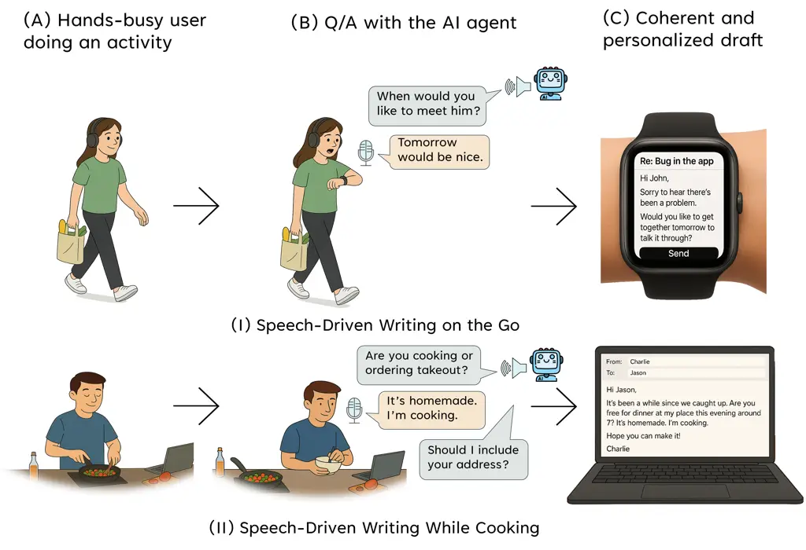

Figure 1. StepWrite enables hands-free, eyes-free writing through an
adaptive Q&A dialogue that incrementally elicits task-relevant context
and synthesizes coherent drafts. Each row illustrates a three-step
interaction: (A) the user performs a hands-busy activity, (B) engages in
voice-based Q&A with the AI agent, and (C) receives a personalized
draft. The examples shown: (I) walking and (II) cooking highlight two of
many multitasking contexts where StepWrite supports hands-free nonvisual
composition.

###### Abstract.

People frequently use speech-to-text systems to compose short texts with
voice. However, current voice-based interfaces struggle to support
composing more detailed, contextually complex texts, especially in
scenarios where users are on the move and cannot visually track
progress. Longer-form communication, such as composing structured emails
or thoughtful responses, requires persistent context tracking,
structured guidance, and adaptability to evolving user
intentions—capabilities that conventional dictation tools and voice
assistants do not support. We introduce StepWrite, a large language
model-driven voice-based interaction system that augments human writing
ability by enabling structured, hands-free and eyes-free composition of
longer-form texts while on the move. StepWrite decomposes the writing
process into manageable subtasks and sequentially guides users with
contextually-aware non-visual audio prompts. StepWrite reduces cognitive
load by offloading the context-tracking and adaptive planning tasks to
the models. Unlike baseline methods like standard dictation features
(e.g., Microsoft Word) and conversational voice assistants (e.g.,
ChatGPT Advanced Voice Mode), StepWrite dynamically adapts its prompts
based on the evolving context and user intent, and provides coherent
guidance without compromising user autonomy. An empirical evaluation
with 25 participants engaging in mobile or stationary hands-occupied
activities demonstrated that StepWrite significantly reduces cognitive
load, improves usability and user satisfaction compared to baseline
methods. Technical evaluations further confirmed StepWrite’s capability
in dynamic contextual prompt generation, accurate tone alignment, and
effective fact checking. This work highlights the potential of
structured, context-aware voice interactions in enhancing hands-free and
eye-free communication in everyday multitasking scenarios.

###### Keywords: 

voice interfaces, adaptive planning, task decomposition, speech-to-text,
text composition, hands-free writing, eyes-free writing, large language
models

^(†)^(†)cc-license: by

## 1. Introduction

Voice-based interfaces have become increasingly prevalent in everyday
computing, offering an appealing alternative to traditional keyboard
input in hands-busy or eyes-free scenarios. Users routinely employ
speech-to-text (STT) tools and voice assistants to compose short texts,
set reminders, or issue commands in contexts such as driving, cooking,
or walking. As speech recognition technology has matured, its speed and
accuracy have made it a viable modality for many casual communication
tasks (Ruan et al., 2016; Mehra et al., 2023). However, despite these
advances, current voice input systems remain ill-equipped for
cognitively demanding activities like composing structured, long-form
text.

Composing a complete email, persuasive message, or narrative explanation
involves more than converting speech into text — it requires planning,
organizing content, tracking structure, and revising based on evolving
goals. Conventional STT systems offer limited support beyond basic
transcription and rudimentary editing commands. Voice assistants, while
interactive, operate in a command-response paradigm and lack memory,
persistence, or the ability to manage document structure across multiple
turns. As a result, users attempting longer-form writing via voice often
experience high cognitive load, fragmented outputs, and substantial
post-editing demands (Schmidt et al., 2020; Mehra et al., 2023).

Recent work in AI-assisted writing tools has shown that large language
models (LLMs) can enhance the writing process through completion,
summarization, and rewriting capabilities (Lee et al., 2022; Shen
et al., 2023; Coenen et al., 2021). These systems typically assume
visual interfaces and manual input, such as co-authoring with keyboard
prompts in a web-based editor. While generative voice assistants like
ChatGPT’s Advanced Voice Mode (AVM) offer conversational writing
support, they often lack scaffolding and structure, leaving users to
navigate the planning and composition process on their own. Furthermore,
these tools may not accommodate non-visual workflows and are not
optimized for hands-free interaction in multitasking settings. As prior
work has shown, users engaging with AI systems in such contexts may
struggle to maintain intent, track content, or feel a sense of
authorship (Ippolito et al., 2022).

This paper introduces StepWrite, a novel voice-based writing system
designed to support structured, hands-free composition of long-form
text. StepWrite transforms the writing process into a contextual, spoken
dialogue, guiding users through a stepwise sequence of high-utility
prompts that scaffold idea generation, elaboration, and narrative
development. Powered by LLMs, StepWrite dynamically adapts its guidance
based on prior user responses and document state, helping users maintain
coherence and structure without visual feedback. The system is designed
explicitly for multitasking and eyes-free contexts, enabling users to
compose meaningful messages through voice alone, even while walking or
engaging in other manual tasks.

Unlike conventional dictation or generic conversational assistants,
StepWrite offers persistent context, tailored writing scaffolds, and
adaptive prompting strategies that encourage user reflection and agency.
Drawing from principles of pedagogical scaffolding (Bereiter and
Scardamalia, 1982; Graham and Perin, 2007), the system aims to reduce
cognitive load by offloading planning and structure management to the
model, allowing users to focus on content.

To investigate the effectiveness of this structured, voice-first
approach to hands-free writing, we address the following research
questions:

- •
  RQ1: How does a structured, voice-guided writing assistant like
  StepWrite affect the cognitive effort and revision burden compared to
  conventional dictation and generative AI voice tools?
- •
  RQ2: How does StepWrite influence the quality, readability, and
  semantic alignment of user-generated texts relative to other
  voice-based writing approaches?
- •
  RQ3: How do users perceive the usability, emotional engagement, and
  overall writing experience of StepWrite during multitasking,
  hands-busy scenarios?
- •
  RQ4: What is the utility of dynamically generated scaffolding prompts
  in StepWrite, and how often do these prompts contribute meaningfully
  to users’ final written outputs?

We evaluated StepWrite in a within-subjects user study with 25
participants, who completed two writing tasks (email composition and
reply) using three tools: (1) StepWrite, (2) Microsoft Word’s built-in
dictation feature, and (3) ChatGPT AVM. Participants engaged in both
stationary and mobile (walking) conditions to simulate real-world
multitasking scenarios. We measured revision effort, text quality,
temporal efficiency, and question necessity, between spoken drafts and
revised outputs. Subjective feedback was collected using NASA TLX for
workload, SUS for usability, a custom Emotional Engagement Questionnaire
(EEQ), and a custom Hands-Free Writing Tools Assessment instrument.

Our findings show that StepWrite significantly reduced revision effort
and cognitive workload compared to both baselines, while producing
outputs more closely aligned with users’ intended meaning. Participants
reported high usability, low frustration, and strong emotional
engagement with the system’s guided process. Moreover, technical
analyses of StepWrite’s prompt quality and semantic contribution
revealed that over 77% of system-generated prompts were essential to
final outputs.

This work makes the following contributions:

- •
  The design and implementation of StepWrite, an LLM-powered system that
  supports hands-free, structured writing through contextual,
  voice-based scaffolding;
- •
  A controlled user study comparing StepWrite to both conventional
  dictation and conversational LLM voice interaction across mobile and
  stationary use cases;
- •
  Empirical evidence demonstrating that structured voice interaction,
  through adaptive planning, reduces cognitive load, improves semantic
  alignment, and enhances user satisfaction in hands-free, writing
  tasks.

## 2. Related Work

### 2.1. Voice-Based Text Composition

Speech-to-text (STT) technologies have become increasingly integrated
into daily communication workflows, particularly for short-form content
like messages (Ruan et al., 2018; Xu et al., 2007; Haas et al., 2020),
reminders (Liu et al., 2023; Esquivel et al., 2024; Pradhan et al.,
2020), and voice memos (Thomas et al., 2024; Höhne et al., 2024). STT
systems offer convenience in hands-busy or eyes-free contexts, such as
driving or exercising, but their use for long-form writing remains
limited (Ruan et al., 2016). This is largely due to their linear
transcription approach, which lacks support for revision, structural
planning, or content reorganization.

Prior work on voice-driven text entry systems, such as VoicePen (Harada
et al., 2007), explored multimodal interactions where users combined
voice and gestures for document annotation and creation. Other systems
attempted to enhance dictation with speech commands for editing. Yet,
these systems often required visual attention, struggled with
maintaining document coherence, and offered limited support for context
persistence or complex branching structures.

Conversational voice agents, including Apple Siri ¹¹ 1 Apple Siri:
[https://www.apple.com/siri](https://www.apple.com/siri), Google
Assistant ²² 2 Google Assistant:
[https://assistant.google.com](https://assistant.google.com), and
ChatGPT Voice Mode ³³ 3 ChatGPT:
[https://chatgpt.com](https://chatgpt.com), have introduced more dynamic
turn-taking and basic task completion. However, these systems typically
operate with shallow task representations and lack a high-level
understanding of writing goals or structure (Völkel et al., 2021).
Research has shown that multi-turn conversations with an assistant
(where the system can ask follow-up questions or confirmations) rather
than the traditional single-turn Question and Answer (Q&A) format has
shown to be strongly preferred by the users (Burggräf et al., 2022).
Recent innovations like Rambler (Lin et al., 2024) seek to address this
gap by supporting iterative editing of spoken content through gist
extraction, summarization, and semantic manipulation, but remain
dependent on visual interfaces. Our work builds on this space to enable
a structured, non-visual writing process through contextual dialogue.

### 2.2. Intelligent Writing Assistance

AI-powered writing tools have made notable progress in supporting users
during the composition process. Tools such as Grammarly ⁴⁴ 4 Grammarly:
[https://www.grammarly.com](https://www.grammarly.com) and QuillBot ⁵⁵ 5
QuillBot: [https://quillbot.com](https://quillbot.com) offer real-time
grammar correction, paraphrasing, and tone adjustments. More advanced
systems now integrate large language models (LLMs) to provide content
suggestions, sentence completions, and summarization capabilities (Shi
et al., 2023).

Research in this space has focused on co-authoring interfaces (Lee
et al., 2022), idea generation (Wan et al., 2024; Huang et al., 2023)
and narrative scaffolding (Coenen et al., 2021; Mirowski et al., 2023).
Ippolito et al.(Ippolito et al., 2022) evaluated Wordcraft, an
LLM-powered editor used by professional writers, revealing the
importance of workflows that support elaboration and preserve authorial
control. Similarly, Shen et al. (Shen et al., 2023) emphasized modular
support for complex expository writing, highlighting the need for AI
systems that assist reading, synthesis, and composition across stages of
the writing pipeline. Recent work  (El Alaoui et al., 2023) provides a
comprehensive survey of AI-powered dialogue systems, emphasizing both
the strengths and current limitations of pipeline and end-to-end
architectures. Their findings underscore the challenges of adaptivity,
error propagation, and interpretability, concerns also central to
StepWrite’s goal of providing structure and transparency through
voice-based interaction. Shao et al. (2024) introduced STORM, a system
that enhances long-form article generation by simulating
multi-perspective, question-driven research during the pre-writing
stage. Their work highlights the value of guided question-asking and
outline planning, aligning closely with StepWrite’s emphasis on
structured guidance and dynamic scaffolding in composition. Goodman
et al. (2022) developed LaMPost, an AI-assisted email writing tool for
adults with dyslexia, which incorporated features such as outlining,
rewriting, and suggestion generation. Their evaluation highlighted both
the promise and limitations of LLM-based writing assistance, especially
the need for greater accuracy, personalization, and user
control—principles that also guide StepWrite’s interactive scaffolding
approach.

While these tools have demonstrated creative potential, they often rely
on visual interfaces and assume constant user attention. StepWrite
departs from passive suggestion-based models by engaging the user in an
active dialogue, prompting reflection, elaboration, and decision-making
through voice. Drawing inspiration from pedagogical scaffolding (Graham
and Perin, 2007; Bereiter and Scardamalia, 1982; Hu et al., 2025), the
system prompts users to elaborate, reflect, and refine their ideas
step-by-step, functioning more like a conversational writing coach. This
method encourages progressive development of content while alleviating
the cognitive overhead associated with planning and organization.

### 2.3. Hands-Free and Multitasking Interfaces

The design of hands-free and eyes-free interfaces has been studied
extensively in wearable computing, automotive interaction, and mobile
computing contexts (Larsen et al., 2020; Oakley and Park, 2007; Taheri
et al., 2021; Hendrik et al., 2006). Systems like WatchIt (Perrault
et al., 2013) and wearable AR displays (Lee et al., 2024; Ch et al.,
2022; Khurana et al., 2024; Korkiakoski et al., 2024) explored gesture
and voice inputs to support lightweight task execution. In in-vehicle
environments, voice interfaces are used to reduce driver distraction by
enabling eyes-free navigation and communication (Strayer et al., 2016;
Tsimhoni et al., 2004).

However, these systems often focus on command-and-control tasks, such as
launching applications or issuing navigation instructions, rather than
open-ended cognitive tasks like writing. Multitasking research has
emphasized reducing cognitive load and improving task switching (Nith
et al., 2024), but less attention has been paid to how users can engage
in complex content creation while physically or visually occupied. For
example, Edwards et al. (2019) found that using a voice assistant while
writing can significantly disrupt the writing process when the task
involves content generation as opposed to simple transcription.

Recent systems such as GlassMail (Zhou et al., 2024) demonstrate the
potential of LLMs on wearable devices to support hands-free composition,
but are constrained by visual attention demands. WearWrite (Nebeling
et al., 2016) explored crowd-powered writing from smartwatches,
highlighting the feasibility and value of distributed collaboration in
mobile writing. StepWrite builds on this trajectory by enabling
cognitively rich writing tasks in multitasking environments through
structured audio prompting. By minimizing visual demands and adapting
its prompts to the user’s evolving input, it supports a fluid writing
flow in mobile, everyday contexts.

### 2.4. Adaptive Planning and LLM Interaction

Large language models have demonstrated remarkable capabilities in
reasoning, planning, and language generation. Recent techniques such as
chain-of-thought prompting (Wei et al., 2022), tool use via
prompting (Schick et al., 2023), and conversational memory (Xu et al., 2023) have explored how LLMs can assist users in decomposing tasks and
managing complex information flows.

Adaptive planning strategies with LLMs function as a form of scaffolding
by dynamically adjusting support to match a user’s evolving needs during
the writing process. These strategies include techniques such as dynamic
prompting, reflective planning, and user-guided questioning (Feng
et al., 2025), all of which help writers navigate complex tasks by
breaking them into manageable steps. For example, Miura et al. (Miura
et al., 2025) introduced a QA-based email writing system that provides
iterative support through interactive question-answering, exemplifying
how adaptive scaffolding can facilitate progressive idea development.
This approach informed StepWrite’s design for enabling dynamic and
discovery-oriented writing workflows. Similarly, Dhillon et al. (Dhillon
et al., 2024) examined how different levels of LLM assistance influence
writing productivity and ownership, finding that well-calibrated
scaffolding can significantly improve outcomes by maintaining a balance
between guidance and user autonomy.

These approaches are primarily deployed in screen-based tools where
users can visualize and modify generated content. Few systems have
explored the potential of real-time, non-visual scaffolding via audio.
StepWrite contributes a novel interaction modality: adaptive,
voice-guided writing scaffolding. It incrementally builds a shared
context with the user, asking clarifying and elaborative questions one
at a time rather than presenting static, pre-scripted prompts. This
method not only enhances contextual relevance but also supports user
agency and personalization during composition.

## 3. StepWrite

StepWrite is an intelligent, voice-first writing system designed to
provide context-aware scaffolding for hands-free composition with
minimal visual attention. It guides users through a stepwise, adaptive
dialogue that collects essential content, infers appropriate tone, and
produces a coherent draft—entirely through speech. Built as a responsive
React-based web application, StepWrite runs in the browser and requires
only a modern internet-connected device. All heavy computation is
offloaded to cloud APIs, enabling responsive performance even on
low-tier laptops, desktops, wearables, and mobile devices. We tested
StepWrite across heterogeneous form factors and operating systems, and
observed consistent performance, enabling real-world use in multitasking
scenarios such as composing emails, messages, or notes while cooking or
commuting. StepWrite is available as open-source software.⁶⁶ 6
[https://github.com/helalaou/StepWrite](https://github.com/helalaou/StepWrite)

### 3.1. Interaction Model and Scaffolding

StepWrite is grounded in the pedagogical notion of scaffolding—a method
of support that provides structure while preserving user autonomy.
Rather than expecting users to dictate a message in a single stream of
thought, the system breaks writing into manageable subtasks, asking
focused, relevant questions one at a time. Each question is adaptively
generated by an LLM based on prior responses, user intent, and inferred
genre. These questions help users elaborate on their goals, clarify
context, and make decisions about tone, audience, or timing—all without
needing to plan the entire message upfront.

This interaction model serves dual purposes: it reduces cognitive load
by externalizing planning, and it provides semantic structure that
enables downstream modules to compose high-quality drafts. The process
is fully hands-free and eyes-free, navigable via voice commands, and
reversible: users can skip questions, revise earlier answers, and
re-enter the editor at any point. The system also supports keyboard-only
and hybrid (text + speech) modes, allowing users to benefit from the
adaptive planning and structured prompts even without using the
hands-free features.

### 3.2. Audio Input and Voice Command Handling

StepWrite continuously listens for user input using an efficient audio
pipeline designed to balance responsiveness with accuracy. Incoming
microphone data is first passed through a noise-filtering layer, tuned
to discard ambient environmental sounds (e.g., keyboard taps, wind, or
appliance hum). Users may customize this filtering behavior based on
their environment. Next, a voice activity detection (VAD) algorithm
identifies the onset and end of speech. The VAD model distinguishes
natural pauses from utterance completions using a thinking window that
can either be manually tuned or adaptively adjusted over time, allowing
the system to accommodate user-specific pacing and pause duration. Only
speech identified as human voice is processed further.

Before any transcription occurs, StepWrite performs client-side macro
command recognition. Each transcribed segment is first checked for voice
commands such as “skip question,” “repeat that,” “go back,” “pause
output,” “go to editor”, or user-defined equivalents. To avoid
accidental triggers from natural speech, all built-in commands were
two-word phrases (e.g., “skip question”) rather than single words like
“skip.” Commands are matched using a token-level fuzzy matching
algorithm that supports both exact and partial phrase recognition, with
a minimum cosine similarity threshold of 0.85. This enabled recognition
of phrasings such as “please skip this question” without interfering
with typical user responses. A complete list of supported voice commands
is provided in Appendix D.

During the experiment, no speech segments were mistakenly classified as
commands. The system is configurable to support custom macros, but for
consistency, we used only the standard command set during the study. In
future deployments—particularly on wearable devices—gesture-based
shortcuts (e.g., shaking a smartwatch to navigate between next and
previous questions) could serve as an alternative hands-free control
modality.

If no command is detected, the speech segment is sent via API call to
OpenAI’s Whisper model for transcription. The resulting transcript is
then passed to the question engine if the user is answering a prompt, or
to the text editor engine if the user is executing a command within the
editor (e.g., “go back to questions,” “play output again”). Speech
recognition outputs are streamed in real time, with visual confirmation
and audio playback available for each response.

### 3.3. Modular Prompt Pipeline: Q&A to Final Output

Once transcribed, the user’s answer enters the Q&A pipeline. The system
maintains a linear conversation graph consisting of prompt– response
pairs, which are evaluated after each turn. An LLM receives the full Q&A
history—along with context flags and optional memory cues—and generates
the next question. Questions are crafted to elicit actionable, factual
details without suggesting formatting, wording, or stylistic
preferences. Memory is used selectively to enhance prompt quality—for
example, by recalling preferred task types, common recipients, user
preferences, or frequently used phrases from previous sessions. With
each new prompt, the full Q&A history is appended and the LLM is asked
to determine whether sufficient context has been collected. The model
returns a Boolean flag, followup_needed, which serves as a functional
end-of-sequence signal. When this flag is false, the system triggers
text generation.

Throughout the interaction, users may navigate forward or backward
through the Q&A flow. After each question is answered, the updated
conversational state is stored. Users can issue commands such as “modify
answer” after navigating to a given question. Upon detecting such edits,
StepWrite removes all subsequent question–answer pairs. This prevents
later content from becoming irrelevant or inconsistent with the updated
response. To avoid repetition, the system is instructed to skip over any
questions that were previously marked as skipped by the user, preventing
their reintroduction in subsequent generations.

After the dialogue concludes, StepWrite invokes the tone classification
module which analyzes the full Q&A history to determine an appropriate
voice for the output. The classifier draws on lexical choice, sentiment,
and inferred context to assign a tone label (e.g., empathetic,
assertive, apologetic), which is passed along with the text generation
module. The text generation module produces a draft and then passes it
to the fact checking module.

### 3.4. Text Generation and Fact Checking

Text generation begins when all question–answer pairs and tone metadata
are passed to an the text generation module. This module synthesizes a
complete draft, constrained to reference only user-provided facts and
context. Memory is optionally passed in this stage as well—allowing the
model to align with the user’s prior conventions or use domain-specific
content that was previously surfaced.

The resulting draft is then routed to the fact-checking module, which
performs a multi-step verification process to identify factual
inconsistencies, omissions, or contradictions relative to the Q&A input.
For each issue detected, the fact checker returns a structured report
that includes a type ("missing", "inconsistent", "inaccurate", or
"unsupported"), a detail describing the issue, and a QA reference
pointing to the relevant excerpt from the question–answer history. This
metadata is then passed to the text adjustment module, which selectively
rewrites only the problematic segments while preserving tone, structure,
and fluency. The revised text is returned to the fact checker for
re-evaluation, and this loop continues until no further issues are found
or a user-defined maximum number of passes (default: 10) is reached.
Memory, when available, is used to verify persistent facts across
sessions. In testing, this verification-adjustment loop added no more
than 7 seconds of latency for short-form drafts; we expect this duration
to scale with document length and complexity. System prompts used in
these modules are referenced in Appendix E.

Importantly, the fact checker enforces information integrity while
remaining agnostic to superficial preferences. It avoids enforcing rigid
template structures or unnecessary rephrasings, focusing solely on
semantic alignment.

### 3.5. Session Control and Editor Transition

StepWrite supports both linear progression and cyclical revision. Users
can move freely between dialogue and editor views, repeat system
prompts, replay prior answers, or issue corrective commands via voice.
All interaction state is persistently stored in a session object indexed
by UUID and maintained throughout the session, ensuring continuity even
across temporary disconnects.

Auditory and visual feedback are integrated to ensure clarity: system
prompts are accompanied by synthesized text-to-speech (TTS) playback,
speech detection is visualized via waveform animation, and navigation
events—such as modifications, skips, and command triggers—are signaled
through both auditory chimes, audio cues stating the commands being
executed, and subtle interface animations.

### 3.6. Scenario: Composing While Occupied

Consider a user who wishes to respond to a time-sensitive email while
unpacking groceries. With both hands full, they initiate StepWrite via a
voice trigger: "Hey StepWrite! Help me with this email." The system
reads the original email aloud, then asks: “What would you like to say
in response?” As the user continues unloading bags, StepWrite proceeds
through a set of targeted questions—“Do you want to accept the offer?”,
“Is there a specific time that works best?”, “Should we confirm any
details with them now?”—each spoken aloud and answered conversationally.
At any point, the user may say “go back,” “change my answer,” or “that’s
enough,” without breaking flow. A complete, fact-checked draft is
presented once the user issues the “finish” command, ready for final
review or automatic sending.

In summary, StepWrite provides a modular, cloud-backed, and
device-agnostic scaffolding architecture for hands-free writing. By
chaining audio processing, adaptive Q&A planning, tone selection,
structured drafting, and iterative fact-checking, it forms an integrated
and responsive authoring system. Its support for non-linear interaction,
fuzzy macro invocation, robust correction logic, and cross-platform
deployment enables rich composition in scenarios where traditional
writing tools fall short.

### 3.7. System Architecture Overview

System-level, speech-to-text, and text-to-speech diagrams are provided
in Appendix F (Figures 15–17).

The following table summarizes the core models used across each stage of
the StepWrite pipeline. These models were chosen based on a balance
between speed, accuracy, and compatibility with their assigned tasks.

| Module                         | Implementation       |
| ------------------------------ | -------------------- |
| Speech-to-Text                 | whisper-1            |
| Text-to-Speech                 | tts-1 + caching      |
| Question Generation            | 4.1-mini             |
| Text Generation                | 4.1-mini             |
| Fact Checking                  | 4o-mini              |
| Tone Classification            | gpt-4.1              |
| Memory Management              | JSON-based store     |
| Audio Processing               | VAD + Custom filters |
| Command Recognition            | Custom fuzzy engine  |
| Voice Activity Detection (VAD) | Silero VAD           |

Table 1. Core components and models in the StepWrite pipeline.

## 4. Pilot Study

After implementing a minimally functional prototype of StepWrite, we
conducted a formative study to evaluate how users interacted with the
system in realistic hands-free scenarios. Rather than beginning with
speculative design probes or mockups, we prioritized testing a live
version of the system early in development to observe actual usage and
gather actionable feedback. The goal was to uncover usability
challenges, surface desired features, and inform iterative refinements
before formal evaluation.

The initial implementation of StepWrite already supported dynamic
question generation, voice-based navigation, and full draft composition.
Users could proceed through system-generated prompts using voice
commands like “next question,” “previous question,” and “modify answer,”
and switch between answering questions and editing text. The system
determined when to stop asking questions based on inferred completeness,
and it automatically compiled the responses into a polished draft. A
basic visual interface displayed ongoing progress and draft content,
though with limited animations and minimal visual cues. While this
version provided end-to-end functionality, it lacked personalization,
non-visual feedback, and fine-grained control over flow—issues we
targeted during iterative testing.

We worked with 4 university students (2 male, 2 female; ages 22–24), all
native English speakers with varied experience using speech-based
systems. Each participant selected a realistic writing scenario of their
choice, including email replies, scheduling messages, casual updates,
and short announcements. They completed the writing task using the
prototype while either walking slowly or performing stationary
activities (e.g., handling small objects, light snacking). These
sessions helped us evaluate how the system performed in real-world
multitasking conditions and uncover early usability concerns.

Participants responded positively to the system’s incremental guidance.
Several appreciated being asked focused, specific questions instead of
needing to dictate full messages at once. One participant noted, “It
felt more manageable than just talking into a void — I didn’t have to
plan everything in my head.” Another described StepWrite as more of a
“thinking partner” than a writing assistant—something that could prompt
ideas, support brainstorming, and then generate a polished draft based
on the interactive exchange.

However, the study surfaced key areas for improvement. Participants
struggled when unexpected interruptions occurred—such as being
approached mid-task or needing to attend to their surroundings—often
losing track of where they left off. We added a dedicated pause/resume
command pair that allowed users to momentarily disengage and return to
the same point in the writing process without resetting context or
content. This feature was especially valued by those who envisioned
using StepWrite in semi-public settings like gyms, cafes, or while
commuting.

Users also expressed the need for a “finish” command that could end the
interaction early. While StepWrite was designed to scaffold writing
through several focused prompts, participants noted that in some
cases—such as quick notes or casual replies—they only wanted to provide
a small amount of context and have the system generate a complete draft
without going through the entire Q&A flow. In response, we added
functionality allowing users to signal that they had said enough and
wished to stop receiving questions, at which point StepWrite would
generate an output based on the information gathered so far.

While the original prototype offered visual cues on the display,
participants noted that this was insufficient in eyes-free scenarios. We
added both audio feedback (e.g., light clicks and confirmation tones)
and more detailed visual indicators such as “moving to next question,”
“returning to previous,” and “generating final output” to increase
transparency and reduce uncertainty during use.

Participants also expressed interest in a system that could learn from
them over time. In response, we implemented a lightweight memory layer
that stores user preferences and basic recurring information. Users can
optionally predefine facts about themselves (e.g., name, role, writing
style, calendar patterns), or allow the system to build up this memory
gradually across sessions. This personalization layer enables StepWrite
to tailor prompts, omit redundant questions, and improve drafting
relevance based on prior interactions.

Additionally, participants noted a desire to use their own phrasing for
voice commands. To support this, we added a customizable command-mapping
interface, allowing users to rename any core command and define multiple
trigger phrases (macros) per function. For example, a user might set
both “stop now” and “that’s enough” as equivalents for the finish
command. These small adjustments gave participants greater control and
comfort in tailoring the interaction to their own speaking habits.

During testing in ambient environments such as student lounges, we
observed additional issues with noise interference and unintentional
activations. We integrated noise filtering, voice activity detection,
and automatic sensitivity adjustment to improve robustness across varied
environments.

This formative work took place after an initial working version of
StepWrite had been implemented, and directly informed the feature set,
robustness improvements, and user experience enhancements evaluated in
the main study.

## 5. Methods

### 5.1. Participants

We recruited 25 participants (M\_(age) = 24.80, SD = 4.39; range = 18–35)
from the university community and the broader metropolitan area via
campus mailing lists, online postings, and local outreach. Participants
included students, researchers, educators, engineers, and healthcare
professionals.

12 participants identified as male, 11 as female, and 2 as non-binary or
preferred not to disclose. Most were highly confident with digital tools
(M = 4.80/5 on confidence scale) and regularly engaged in diverse
writing tasks, including messaging, note-taking, and document authoring.

While the majority reported no writing-related impairments (84.0%), a
small number identified physical or learning disabilities (8.0% each).
Most participants (96.0%) expressed potential interest in using a
guided, hands-free writing assistant, with many describing
scenarios—such as commuting, cooking, or experiencing fatigue—where
multitasking made traditional writing inconvenient or inaccessible.
Participants had varied levels of exposure to AI-powered writing tools
and speech-to-text interfaces. They were compensated at a rate of \$20
per hour for their time.

|                   | Measure              | Summary                                            |
| ----------------- | -------------------- | -------------------------------------------------- |
| Basic Demographic | Age                  | Mean = 24.8, SD = 4.39, range 18–35                |
|                   | Gender               | 48% Male, 44% Female, 8% Other                     |
|                   | Primary Language     | 60% English only, 40% multilingual                 |
| Education         | Level                | 60% College, 32% Graduate, 8% Other                |
| Tech & Writing    | Tech Confidence      | Mean = 4.8 (1–5 scale)                             |
|                   | STT Use              | 72% used it before, 28% never used                 |
|                   | Writing Challenges   | Common issues: phrasing, structure, editing        |
|                   | Guided Tool Interest | 96% expressed interest (answered "yes" or "maybe") |

Table 2. Participant Demographics and Writing Background

### 5.2. Study Design

We employed a within-subjects design in which participants completed two
writing tasks—one write and one reply—using each of three hands-free
writing tools: StepWrite (structured AI guidance), ChatGPT Advanced
Voice Mode (conversational generative AI), and a Dictation Tool
(Microsoft Word’s built-in speech-to-text).

Each participant completed all six tool-task combinations,
counterbalanced using a Latin square design. To simulate real-world
constraints on attention and mobility, we introduced two activity
contexts: stationary and movement. Participants completed one task under
each condition, with the assignment of activities randomized per task.
Stationary activities included solving a Rubik’s cube, folding origami,
snacking, or selecting items from a snack table; movement activities
involved walking at a comfortable pace within a defined 4 $`\times`$ 2.5
meter area. Two participants with mobility disabilities completed both
tasks under stationary conditions using adapted hands-occupied
activities. The study session lasted approximately 60–70 minutes per
participant.

### 5.3. Apparatus

All tools ran on a MacBook Pro (M3 Pro, 36GB RAM) connected to a small
external display positioned approximately 2 meters from participants. To
simulate conditions where visual attention may be intermittently
disrupted (e.g., mobile or multitasking settings), the external display
was intermittently disabled for brief periods during task execution.
This was done to encourage participants to rely primarily on auditory
cues—closer to real-world scenarios involving wearables or heads-free
interaction.

Participants wore a Poly Voyager 4320 headset with an integrated
noise-canceling microphone throughout the study. A wireless keyboard and
mouse were provided solely for text editing during the revision stage.
All equipment (headset, keyboard, mouse) was sanitized between sessions.

StepWrite was implemented as a client-server web app (described
earlier), offering structured, AI-guided writing assistance through
interactive Q&A-based dialogue. For the purposes of this study, memory
and personalization functionalities were disabled.

ChatGPT Advanced Voice Mode (AVM) was accessed via OpenAI’s official
ChatGPT interface (Plus subscription tier), enabling conversational,
open-ended voice interaction.

Dictation Tool employed Microsoft Word’s built-in speech-to-text
feature, selected for its widespread familiarity and command support.

### 5.4. Procedure

This study was approved by the IRB office at Carnegie Mellon University
(protocol number: STUDY2024_00000515). Participants first provided
informed consent and received a study overview. They were then
introduced to two tasks: _Write Task_ and _Reply Task_. Each task were
explained by the researcher and printed on a reference sheet. The Write
Task involved composing a casual email inviting friends or family to a
weekend outing. The Reply Task required responding to a professor’s
inquiry about a missing final project submission. Participants were
given time to review the task sheet and were allowed to keep it with
them throughout the study.

Immediately before using each tool, the researcher provided a live
demonstration. For both StepWrite and the Dictation Tool, participants
also received a reference sheet listing available voice commands. They
were given as much time as they needed to review these commands, and
most participants indicated readiness to begin the study within two
minutes. For ChatGPT AVM, the researcher demonstrated typical
interaction patterns and explained the kinds of conversational prompts
and voice instructions participants could use to request modifications,
clarifications, or readbacks.

Each task consisted of two phases: _Drafting_ and _Revision_. In the
Drafting phase, participants composed initial drafts entirely via
voice—engaging interactively with StepWrite and ChatGPT AVM, or
dictating directly into Microsoft Word.

In the Revision phase, participants were instructed to revise their
initial draft using the keyboard and mouse only, with the explicit
objective of producing a message that they would personally send.
Revision criteria included content, tone, formatting, and clarity. This
manual revision step was applied uniformly across all tool to ensure a
consistent evaluation of final output quality. While StepWrite fully
supports hands-free drafting and in-flow voice-based revision (e.g., via
“modify answer” command), voice-based editing during the final revision
stage is a planned feature for future versions.

Drafting Time was measured from the start of the Q&A interaction until
the draft was shown, including any voice-based edits made during this
phase. Revision Time began once the draft appeared and included only
keyboard-and-mouse edits. If users navigated back into the Q&A flow
after viewing the draft (e.g., to modify a previous answer by voice),
Revision Time was paused and Drafting Time resumed until they returned
to the editor.

Participants completed tasks under alternating stationary and movement
conditions, randomized to control for order effects and minimize
potential bias. After using each tool to complete the writing and
replying tasks, participants filled out a corresponding post-task
questionnaire. This process was repeated for each tool. At the end of
the session, participants were debriefed by the researcher.

### 5.5. Measures

We collected both objective and subjective measures to evaluate
participants’ interaction with each hands-free writing tool. Our
measures spanned seven key dimensions: revision effort, text quality,
temporal efficiency, question necessity, tone assessment, user
experience, and order effect .

#### 5.5.1. Revision Effort

To quantify the extent of post-generation editing required, we
calculated the number of word-level insertions, deletions, and
replacements between each participant’s original drafts
(speech-generated) and final drafts (manually revised). This was
operationalized using the Ratcliff and Obershelp sequence-matching
algorithm (Ratcliff et al., 1988; Wikipedia contributors, 2024), which
identifies meaningful changes at the phrase and sentence level. This
metric reflects both the quantity and nature of participant effort
required to bring AI-generated or dictated drafts to a personally
acceptable standard.

#### 5.5.2. Text Quality and Structure

We analyzed four aspects of textual output to assess writing quality and
linguistic coherence:

- •
  Readability: Measured with the Flesch Reading Ease (FRE) (Flesch,
  1948), where higher scores (max = 100) indicate simpler, more
  accessible language; and the Flesch–Kincaid Grade Level, estimating
  the U.S. school grade level required for comprehension.
- •
  Sentence Structure: Average sentence length was computed for both
  original and revised drafts to assess syntactic coherence and
  structural clarity. Large reductions signal the correction of run-on
  or disfluent output.
- •
  Lexical Diversity: Type–token ratio (TTR)—the ratio of unique words to
  total words—captured vocabulary richness. Higher TTR indicates more
  varied and expressive language.
- •
  Semantic Diversity: To quantify meaning-level changes, we embedded the
  original and revised texts with gte-Qwen1.5-7B-instruct⁷⁷ 7
  [https://huggingface.co/spaces/mteb/leaderboard](https://huggingface.co/spaces/mteb/leaderboard).
  Cosine similarity between the two embeddings was converted to
  diversity as $`(1-\text{similarity})`$. Lower scores therefore signify
  that a tool’s first draft already matched the user’s intended meaning,
  whereas higher scores reflect substantial semantic edits.
- •
  Final Draft Length: We computed the total word count of each submitted
  draft to evaluate how writing tool and task type influenced overall
  verbosity. These statistics help assess whether structured scaffolding
  led to longer or more detailed outputs.

All text analyses were performed separately on original and revised
outputs to examine how much participants altered their language during
the editing phase.

#### 5.5.3. Temporal Metrics

We logged time spent on each phase of the writing task:

- •
  Drafting Time: Measured from the start of voice input until the user
  indicated they had completed drafting.
- •
  Revision Time: Measured from the moment the participant began editing
  until they confirmed completion.
- •
  Total Task Time: Combined duration of the drafting and revision
  phases.

These metrics helped assess the time-efficiency tradeoffs between the
three tools.

#### 5.5.4. Question–Necessity Analysis (StepWrite Only)

Because StepWrite’s workflow is driven by AI-generated follow-up
questions, we conducted an additional corpus study to gauge the
_necessity_ of those questions. For every StepWrite session we logged
each system question, the participant’s spoken answer, and the
participant’s _final_ text after revisions. Two independent annotators
classified every question into one of three mutually exclusive
categories:

necessary:  
answering the question contributed information that appears in the
participant’s final text; omitting the answer would have prevented
reproduction of that final output;

unnecessary:  
the answer was ultimately unused or contradicted in the final text;

skipped:  
the participant explicitly invoked the “skip” command or otherwise
declined to answer.

We report raw counts, percentages, and an Essential Question Fraction
(EQF) defined as

```math
\text{EQF}=\frac{\text{necessary}}{\text{necessary}+\text{unnecessary}+\text{skipped}}
```

that is, the proportion of _all_ StepWrite questions that proved
indispensable for the revised text. In addition to annotating question
necessity, we also analyzed the average number of questions received,
answered, and skipped per task, as well as the average word counts of
StepWrite-generated questions and user responses.

#### 5.5.5. Evaluation of Tone Classification (StepWrite Only)

Because no widely accepted taxonomy of written tones exists in the
scholarly literature, we developed a 14-category schema informed by two
tone-of-voice web-based sources⁸⁸ 8 NNgroup:
[https://www.nngroup.com/articles/tone-of-voice-dimensions](https://www.nngroup.com/articles/tone-of-voice-dimensions)⁹⁹
9 Grammarly:
[https://www.grammarly.com/blog/writing-techniques/types-of-tone](https://www.grammarly.com/blog/writing-techniques/types-of-tone)
and linguistic works on tone and voice (Stoehr, 1968).

The resulting categories are: _formal_, _informal_, _friendly_,
_diplomatic_, _urgent_, _concerned_, _optimistic_, _curious_,
_encouraging_, _surprised_, _cooperative_, _empathetic_, _apologetic_,
and _assertive_. These tones reflect the range of stylistic intentions
commonly encountered in everyday email communication; full definitions
appear in Appendix C.

For evaluation, we first sampled 200 messages from the university-email
corpus of Singh et al. (Singh et al., 2018). Three trained raters
labeled each message with our tone schema. The vast majority fell into
five tones—_formal_, _cooperative_, _friendly_, _empathetic_, and
_urgent_—while the remaining categories were sparsely represented or
absent. To obtain balanced coverage across all 14 tones, we authored and
annotated an additional 150 messages, yielding a comprehensive
350-message benchmark for tone-classification evaluation. Although a
single message can contain several tonal nuances, annotators were
instructed to assign the one _dominant_ tone that best captured the
overall intent. This curated dataset will be released publicly.

#### 5.5.6. Subjective Metrics / User Experience

Participants completed a series of standardized and custom
post-condition questionnaires:

- •
  NASA Task Load Index (TLX) (Hart, 2006): Assessed perceived workload
  across six dimensions—mental demand, physical demand, temporal demand,
  effort, performance, and frustration. We used the raw TLX (unweighted)
  for analysis.
- •
  System Usability Scale (SUS) (Brooke et al., 1996): A 10-item measure
  of perceived system usability, scored from 0–100. A score above 68 is
  generally interpreted as above-average usability.
- •
  Emotional Experience Questionnaire (EEQ): Assessed participants’
  emotional engagement with the writing tool using a customized survey
  adapted from the User Engagement Scale by O’Brien and Toms (2010). Our
  adapted scale included five items specifically targeting users’
  _enjoyment_, _motivation_, _stress reduction_, _creativity_, and
  _overall engagement_, aligning with O’Brien and Toms’ framework that
  emphasizes emotional, cognitive, and behavioral components. This
  measure provided insights into the tool’s effectiveness in improving
  emotional engagement during creative writing. The EEQ instrument can
  be found in Appendix B.
- •
  Hands-Free Writing Tools Assessment (HFWTA): We developed a 30-item
  questionnaire to evaluate seven dimensions of hands-free writing
  experience: _Guided Writing Process_, _Hands-Free Interaction_,
  _Adaptability & Contextual Awareness_, _Multitasking Capability_,
  _Content Refinement_, _Output Quality & Satisfaction_, and _Ownership
  & Agency_. Each dimension contained 3–5 items rated on a 7-point
  Likert scale (1 = Strongly Disagree, 7 = Strongly Agree). We designed
  this instrument to capture domain-specific aspects of hands-free
  writing tools that standard usability measures don’t address. The full
  instrument is included in Appendix A.

Together, these instruments provided a multidimensional understanding of
cognitive effort, usability, affective response, perceived creativity,
guidance effectiveness, multitasking capability, and user agency in
hands-free writing contexts.

#### 5.5.7. Order–Effect Analysis

Because each participant used all three tools in a counter-balanced
sequence, we tested whether the first tool encountered influenced
performance on later tools.

- •
  Grouping. Participants were assigned to three groups according to
  their initial tool: StepWrite First ($`n{=}9`$), ChatGPT AVM First
  ($`n{=}8`$), and Dictation Tool First ($`n{=}8`$).
- •
  Data filtering. For every participant we discarded the first-tool
  session and retained only their second and third sessions.
- •
  Metrics examined. Raw NASA-TLX, revision effort, revision time, and
  semantic diversity.
- •
  Statistical test. A Kruskal–Wallis $`H`$ test compared the three
  groups for each metric ($`\alpha=.05`$).

This analysis serves as a manipulation-check on the Latin-square design:
if the test is non-significant the main results can be interpreted
without sequence concerns; if significant, the size and direction of any
order effect are reported in the Results section.

## 6. Results

We report our findings across six main dimensions introduced in the
_Measures_ section: _revision effort_, _text quality and structure_,
_temporal efficiency_,_questions necessity_, _evaluation of tone
classification_, and _user experience_. Within user experience, we
specifically examine workload (NASA TLX), usability (SUS), and emotional
responses (EEQ). All statistical analyses used repeated-measures ANOVAs
unless otherwise noted, with appropriate post-hoc pairwise tests
(Bonferroni-corrected).

### 6.1. Revision Effort

##### Operationalization.

We quantified how much participants had to manually edit their
automatically generated drafts by counting word-level insertions,
deletions, and replacements between each participant’s original
(speech-generated) draft and final (revised) draft. A Ratcliff-Obershelp
sequence-matching algorithm (Ratcliff et al., 1988) identified these
edits at the phrase and sentence levels, capturing the extent of user
modifications required to achieve an acceptable final version. To focus
on substantive revisions, we removed all extraneous whitespace, line
breaks, and formatting artifacts prior to comparison. This approach
slightly favored tools like Dictation, which tended to produce
disorganized formatting; had we included formatting issues, its revision
count would likely have been even higher.

##### Findings.

Figure 2 illustrates the revision counts for each tool (StepWrite,
ChatGPT AVM, Dictation) across both the _write_ and _reply_ tasks. A
repeated-measures ANOVA revealed a significant main effect of tool on
total revision count (_F_(2,48) = 41.67, *p* \< .001). StepWrite led to
the fewest edits overall (_M__(write) = 1.52, *SD* = 2.33;
*M*_(reply) = 0.84, *SD* = 1.43), suggesting that its structured
scaffolding helped produce near-complete drafts requiring minimal
cleanup. ChatGPT AVM produced slightly higher but still relatively low
revision counts (_M__(write) = 2.68, *SD* = 2.91; *M*_(reply) = 1.56,
*SD* = 2.00), reflecting variability in how participants polished the
generative outputs. In contrast, Dictation required the most editing
(_M__(write) = 7.60, *SD* = 3.37; *M*_(reply) = 9.32, *SD* = 4.86),
typically to fix recognition errors, insert punctuation, and restructure
run-on sentences. Post-hoc comparisons (Bonferroni-corrected) showed
that Dictation required significantly more edits than both StepWrite and
ChatGPT (*p* \< .001), whereas the difference between StepWrite and
ChatGPT was not significant. Overall, these results highlight
StepWrite’s efficacy in guiding users to produce cleaner drafts from the
outset.

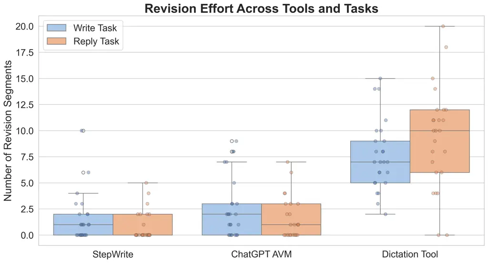

Figure 2. Revision effort (number of word-level edits) for the _write_
and _reply_ tasks under each tool. StepWrite drafts required the fewest
edits, while Dictation required substantially more.

### 6.2. Text Quality and Structure

We evaluated the linguistic quality of participants’ drafts (both
original and revised) through standard readability metrics, sentence
structure, and lexical diversity.

#### 6.2.1. Readability

##### Flesch Reading Ease (FRE)

Figure 3 shows FRE scores (range 0–100; higher indicates simpler, more
readable text). A repeated-measures ANOVA revealed a significant effect
of tool on FRE ($`F(2,48)=89.41`$, $`p<.001`$) and an interaction with
revision stage ($`F(2,48)=22.35`$, $`p<.001`$). StepWrite and ChatGPT
began with moderate readability (StepWrite $`M=46.13`$; ChatGPT
$`M=44.72`$) that changed minimally after revision. In contrast,
Dictation yielded very low initial readability ($`M=5.66`$), primarily
due to its unpunctuated, run-on outputs. After revisions, it rose
dramatically ($`M=44.31`$), matching the final readability levels of the
AI tools.

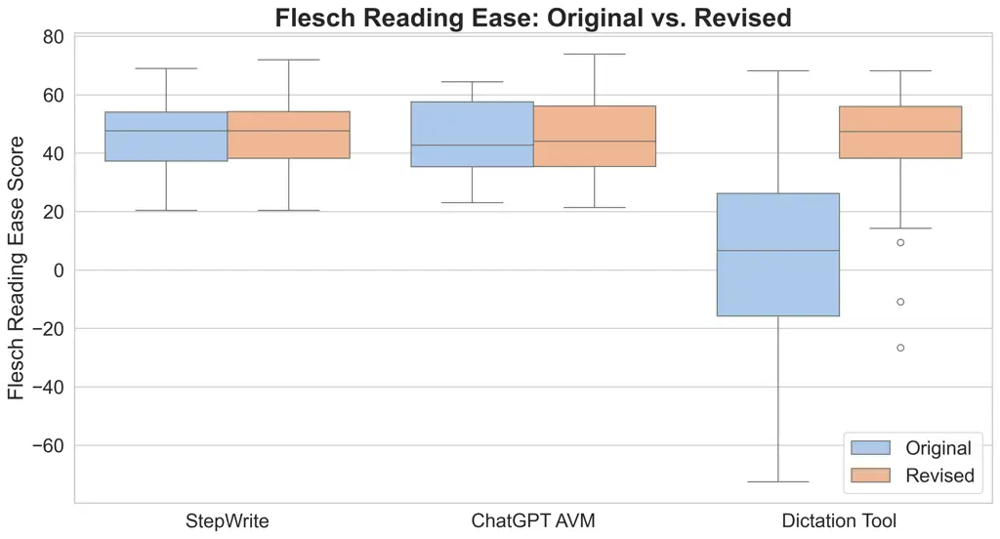

Figure 3. Flesch Reading Ease (FRE) across original and revised drafts.
Higher scores mean more readable text. Dictation improved substantially
after editing, while StepWrite and ChatGPT were already moderately
readable from the start.

##### Flesch-Kincaid Grade Level.

Figure 4 presents Flesch-Kincaid Grade Levels (lower is simpler). Tool
choice significantly affected text complexity (_F_(2,48) = 102.91,
*p* \< .001). StepWrite (*M* = 10.41) and ChatGPT (*M* = 9.99) produced
moderately complex yet coherent drafts, and their revised versions
remained close to these initial values. Dictation started at a markedly
higher complexity (*M* = 28.65), dropping to *M* = 12.84 after
revision—demonstrating the substantial structural edits and punctuation
insertions needed to transform raw speech outputs into more accessible
text.

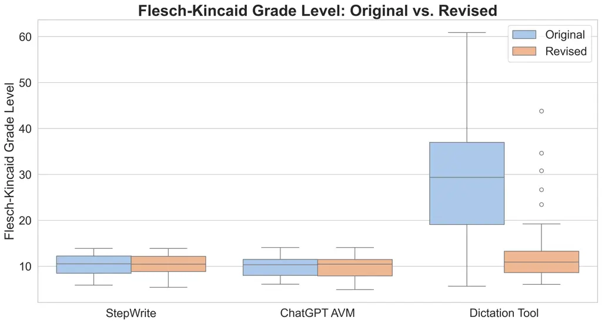

Figure 4. Flesch-Kincaid Grade Levels for original vs. revised texts.
Dictation’s initial drafts were significantly more difficult to parse,
while both AI tools were relatively stable and moderate in complexity.

#### 6.2.2. Sentence Structure

##### Average Sentence Length.

Figure 5 shows average sentence length for original and revised drafts.
A repeated-measures ANOVA indicated that Dictation produced notably
long, fragmented sentences before revision (*M* = 62.83 words),
requiring extensive manual editing to shorten and punctuate (*M* = 19.28
words post-revision). By contrast, both StepWrite (*M* = 12.79 words)
and ChatGPT (*M* = 10.81 words) generated relatively concise,
well-segmented sentences from the outset, leading to minimal changes
after participants’ edits.

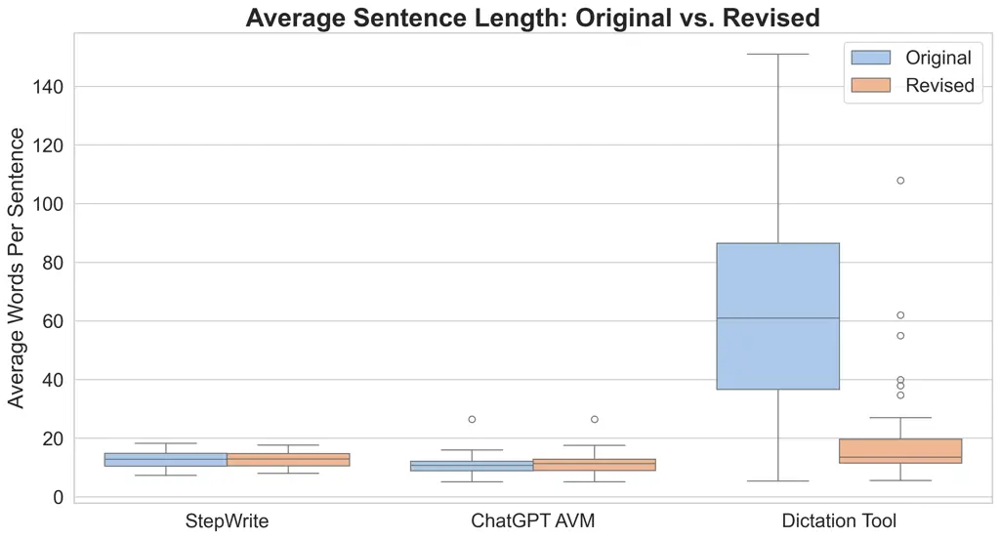

Figure 5. Average sentence length by tool. Dictation led to long,
unsegmented sentences that were heavily shortened during revision,
whereas StepWrite and ChatGPT produced cleanly segmented sentences from
the outset.

#### 6.2.3. Lexical Diversity (Type-Token Ratio)

Figure 6 displays the type-token ratio (TTR), where higher values
indicate more varied vocabulary. ChatGPT attained the highest TTR
(*M* = 0.8182), with StepWrite (*M* = 0.7529) next and Dictation
(*M* = 0.7305) slightly lower. Revisions had minimal impact on TTR for
all tools, suggesting that participants primarily focused on structural
and grammatical refinements rather than vocabulary expansion.

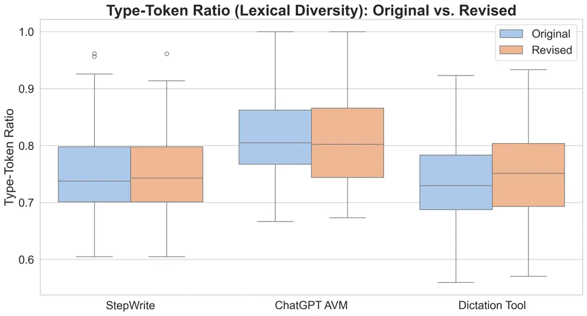

Figure 6. Type-token ratio (TTR) across original and revised drafts.
ChatGPT outputs were most lexically diverse, while StepWrite was
moderate. Dictation’s TTR was lowest initially but improved slightly
post-edit.

#### 6.2.4. Semantic Diversity

Semantic diversity captures meaning-level edits. We embedded each
draft’s original and revised versions with gte-Qwen1.5-7B-instruct (Li
et al., 2023) and computed cosine similarity, then expressed diversity
as $`(1-\text{similarity})`$. Figure 7 shows that StepWrite required
virtually no semantic revision ($`M=0.011,\;SD=0.028`$), whereas ChatGPT
AVM needed moderate adjustment ($`M=0.049,\;SD=0.062`$) and the
Dictation Tool required the most ($`M=0.095,\;SD=0.113`$).

A two-way repeated-measures ANOVA confirmed a robust main effect of
tool, $`F(2,48)=15.45,\;p<.001`$, and a smaller main effect of task,
$`F(1,24)=4.32,\;p=.048`$; the interaction was not significant.
Holm-corrected pairwise comparisons showed StepWrite’s diversity was
significantly lower than ChatGPT’s ($`p=.004`$) and Dictation’s
($`p<.001`$), and ChatGPT also outperformed Dictation ($`p=.017`$).

These results parallel the revision-effort findings: StepWrite drafts
are already aligned with user intent, ChatGPT drafts are “close enough”
to tweak, and Dictation drafts often need substantial re-wording.

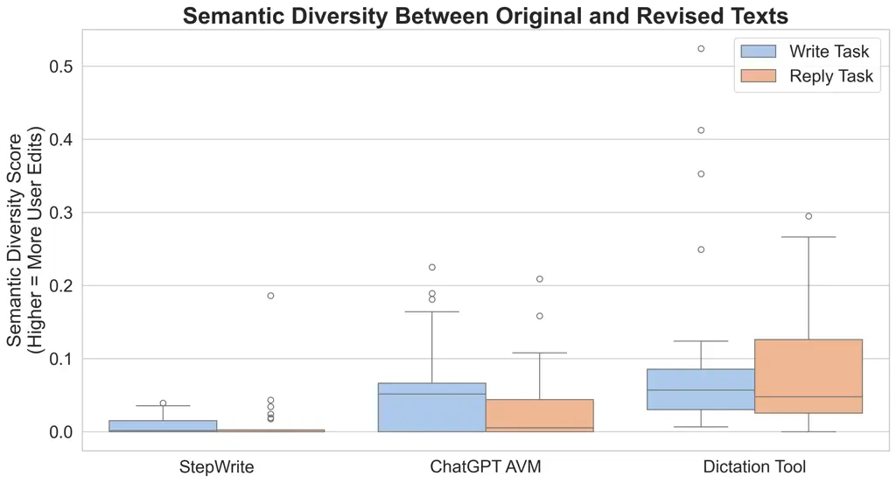

Figure 7. Semantic diversity (1 – similarity) between original and
revised drafts. Lower scores indicate fewer meaning-level edits. Boxes
show median and IQR; whiskers extend to 1.5 × IQR.

#### 6.2.5. Final Draft Length

We analyzed the total word count of final drafts to determine how tool
and task influenced overall verbosity. As shown in Figure Figure 8,
StepWrite produced longer drafts on average than both ChatGPT AVM and
Dictation. In the write task, StepWrite drafts averaged 86.6 words (SD =
34.14), compared to 66.5 for Dictation and 58.5 for ChatGPT AVM. In the
reply task, StepWrite averaged 104.3 words (SD = 40.56), while Dictation
and ChatGPT AVM averaged 88.5 and 78.6 words, respectively. We attribute
this increase to StepWrite’s step-by-step prompts, which encouraged
users to include more detail and elaborate on their responses.

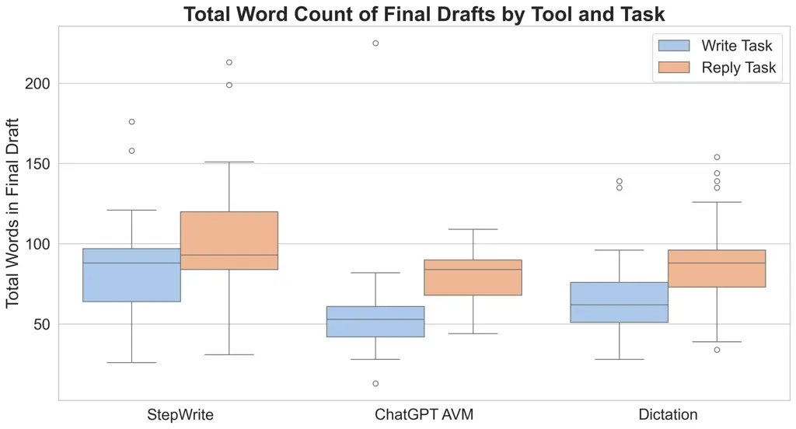

Figure 8. Total word count of final drafts across tool conditions and
task types. StepWrite drafts were longer than the other tools,
especially for replies.

### 6.3. Temporal Efficiency

We measured how long participants spent composing drafts (_drafting
time_) and editing (_revision time_) for each tool.

#### 6.3.1. Total Task Time

Figure 9 shows total time (drafting + revision) across the _write_ and
_reply_ tasks. A repeated-measures ANOVA revealed a significant effect
of tool (_F_(2,48) = 17.02, *p* \< .001). ChatGPT AVM was fastest
overall (Write: *M* = 150 s; Reply: *M* = 168 s), likely due to its
rapid generative completion style and straightforward iterative
correction. Dictation (_M__(write) = 154 s; *M*_(reply) = 185 s)
exhibited more variability because some participants quickly dictated
usable drafts while others invested considerable time correcting
recognition errors. StepWrite took the longest total time (Write:
*M* = 248 s; Reply: *M* = 200 s), as its methodical stepwise prompts
ensured coherent drafts but introduced additional latency in the
process.

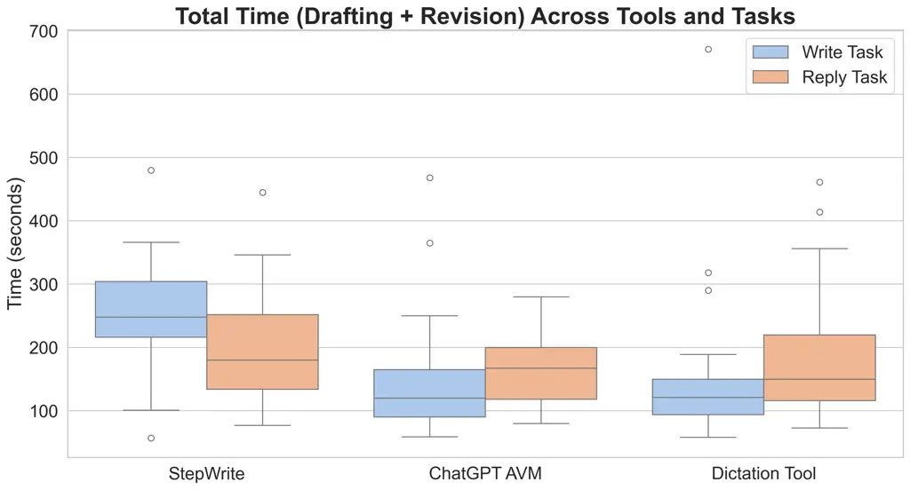

Figure 9. Total time (drafting + revision) for the _write_ and _reply_
tasks by tool. StepWrite’s prompt-by-prompt guidance added to overall
time, while ChatGPT AVM was generally fastest.

#### 6.3.2. Drafting vs. Revision Split

Figure 10 illustrates how each tool’s total time was divided between
_drafting_ and _revision_ phases. StepWrite front-loaded more effort
into drafting (186 s on Write; 138 s on Reply), which helped minimize
the subsequent revision phase to about 62 s because the initial output
was already well-structured. Dictation inverted this pattern by
providing very quick drafting ($`\approx`$60 s) at the cost of lengthy
revision times ($`>`$100 s), as participants fixed errors and
reintroduced punctuation. ChatGPT AVM balanced drafting and revision
(93–127 s vs. 41–57 s, respectively), leading to shorter overall
durations.

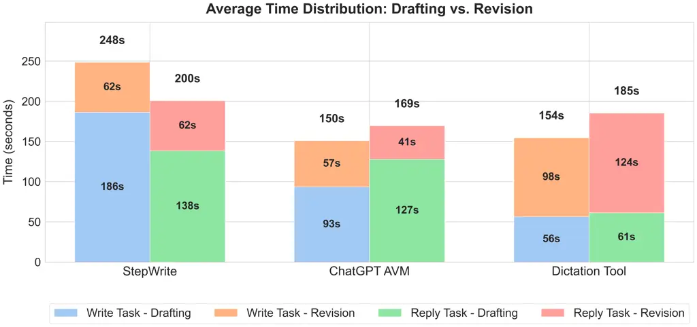

Figure 10. Average Time Distribution: Drafting vs. Revision. StepWrite
required more initial input time but less revision, Dictation skewed
toward revision time, and ChatGPT AVM demonstrated a balanced and
efficient workflow.

### 6.4. Necessity of StepWrite Questions

Across all 25 participants, StepWrite issued 375 questions: 199 during
the write task and 176 during the reply task. On average, participants
received 7.96 questions in the write task (7.00 answered, 0.96 skipped;
87.9% answer rate) and 7.04 in the reply task (6.24 answered, 0.80
skipped; 88.6% answer rate).

Questions were concise and consistent across tasks. The mean question
length was 11.18 words (median = 11.00), and the mean answer length was
12.59 words (median = 11.00). Questions in the reply task were slightly
longer (M = 13.01) than those in the write task (M = 9.79), though
answer lengths remained stable across both. Table 3 summarizes
annotation outcomes by task.

For reply e-mails 81.8% of questions were classified as _necessary_,
11.4% were skipped, and only 6.8% were unnecessary, yielding an
_Essential Question Fraction_ (EQF) of .818. In the write scenario the
EQF was slightly lower at .744, with a larger share of unnecessary
questions (13.6%). Aggregated across both tasks, StepWrite achieved an
overall EQF of .779—meaning roughly four of every five questions
directly enabled content that survived all user revisions.

A chi-square test of independence revealed a significant association
between task type and question category ($`\chi^{2}(2)=9.07,\;p=.011`$),
indicating that questions were more often indispensable when
participants composed a reply e-mail than when they drafted a new
invitation. Despite this difference, the consistently high EQF across
conditions confirms that StepWrite’s incremental questioning seldom
digresses from information the user ultimately retains.

Upon deeper analysis, we found that questions marked as unnecessary or
skipped often focused on highly specific logistical details—for example,
“How many people are you inviting?” or “Who will cover transportation?”.
These were occasionally perceived as too granular for the task. As one
participant noted: “It asked me how many friends I was inviting to the
museum, which didn’t seem necessary because in an email context, it
could potentially infer that from the number of people the email is
being sent to” (P23). Other participants, however, appreciated the added
structure: “The questions consistently exceeded my reasoning and were on
point” (P16), and “All the questions were as expected” (P12). These
diverging preferences indicate that the perceived utility of detailed
prompts varies by user.

|             | Necessary  | Skipped   | Unnecessary |
| ----------- | ---------- | --------- | ----------- |
| Write (199) | 148 (74.4) | 24 (12.1) | 27 (13.6)   |
| Reply (176) | 144 (81.8) | 20 (11.4) | 12 (6.8)    |
| Total (375) | 292 (77.9) | 44 (11.7) | 39 (10.4)   |

Table 3. Human coding of StepWrite questions. Percentages are in
parentheses.

### 6.5. Evaluation of Tone Classification

On the balanced evaluation set of 350 texts, our tone classifier
achieved 91.7 % overall accuracy, a macro-F₁ of 0.912, and a weighted-F₁
of 0.912. Eleven of the fourteen tones registered F₁ scores of 0.86 or
higher; apologetic, encouraging, surprised, cooperative, optimistic, and
empathetic attained near-perfect performance. Results were lower for
assertive (F₁ = 0.59) owing to modest recall, and for informal and
urgent (F₁ $`\approx`$ 0.81–0.83). The relatively high support for
formal tone (83 instances) reflects the distribution of the original
dataset, which consisted primarily of professional university
correspondence.

Importantly, these results were obtained using a zero-shot prompting
approach. With few-shot examples, performance—particularly for
lower-scoring categories—could likely be further improved. Overall, the
classifier provides reliable tone labels for downstream alignment
analysis, while also highlighting categories that may benefit from
further prompt engineering

|                  |           |        |      |         |
| ---------------- | --------- | ------ | ---- | ------- |
| Tone             | Precision | Recall | F1   | Support |
| Apologetic       | 1.00      | 1.00   | 1.00 | 22      |
| Encouraging      | 1.00      | 1.00   | 1.00 | 21      |
| Surprised        | 0.95      | 1.00   | 0.98 | 21      |
| Cooperative      | 0.95      | 1.00   | 0.98 | 21      |
| Optimistic       | 1.00      | 0.95   | 0.98 | 22      |
| Empathetic       | 1.00      | 0.95   | 0.97 | 20      |
| Concerned        | 1.00      | 0.94   | 0.97 | 16      |
| Friendly         | 0.93      | 1.00   | 0.96 | 25      |
| Diplomatic       | 0.94      | 0.94   | 0.94 | 16      |
| Formal           | 0.85      | 0.96   | 0.90 | 83      |
| Curious          | 1.00      | 0.75   | 0.86 | 24      |
| Urgent           | 0.74      | 0.95   | 0.83 | 21      |
| Informal         | 0.83      | 0.79   | 0.81 | 19      |
| Assertive        | 1.00      | 0.42   | 0.59 | 19      |
| Overall accuracy | 0.917     |        |      |         |
| Macro F1         | 0.912     |        |      |         |
| Weighted F1      | 0.912     |        |      |         |

Table 4. Tone-classification results on the balanced evaluation set (350
messages).

### 6.6. User Experience

We assessed user experience via _perceived workload_ (NASA TLX),
_usability_ (SUS), _emotional response_ (EEQ), and our multidimensional
Hands-Free Writing Tools Assessment (HFWTA).

#### 6.6.1. Workload: NASA TLX

Figure 11 summarizes NASA TLX dimension scores (0–100). A
repeated-measures ANOVA indicated a significant main effect of tool on
overall raw TLX (_F_(2,48) = 20.84, *p* \< .001). StepWrite registered
the lowest overall workload (*M* = 16.8, *SD* = 11.4), with participants
reporting minimal _effort_ or _frustration_, even though the tool took
more total time than others. ChatGPT AVM was moderately demanding
(*M* = 22.5, *SD* = 17.1), owing to quick text generation alongside
occasional user attention to steer the AI. Dictation was rated
substantially more burdensome (*M* = 49.2, *SD* = 25.6), reflecting the
frustration and effort required to correct recognition errors and
reorganize unstructured output. Pairwise tests confirmed that both
StepWrite and ChatGPT had significantly lower TLX than Dictation
(*p* \< .001), while their difference was not significant (*p* = .17).

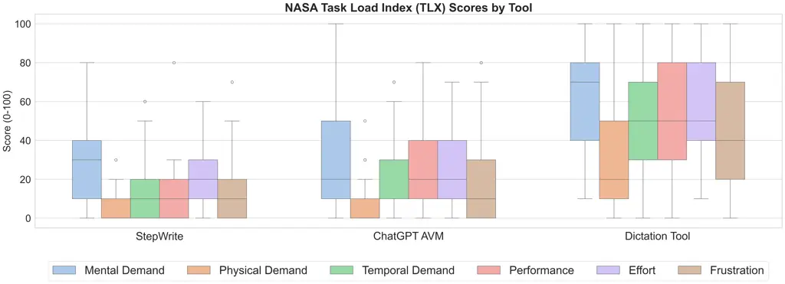

Figure 11. NASA TLX dimension scores (0–100). StepWrite was lowest on
_effort_ and _frustration_, whereas Dictation had substantially higher
workload across all dimensions.

#### 6.6.2. System Usability Scale (SUS)

Figure 12 shows participants’ SUS scores (0–100). Scores above 68 are
typically considered “usable.” ChatGPT AVM received the highest overall
SUS score (*M* = 83.2, *SD* = 10.7), reflecting positive impressions of
its conversational flexibility. StepWrite also surpassed the benchmark
(*M* = 80.0, *SD* = 16.4). In contrast, Dictation (*M* = 60.0,
*SD* = 23.9) was below 68, with users citing high error-correction
overhead as a key usability barrier. An ANOVA confirmed significant
differences (_F_(2,48) = 12.41, *p* \< .001), and Dictation was rated
significantly lower than both StepWrite (*p* = .001) and ChatGPT
(*p* \< .001). There was no statistically significant difference between
StepWrite and ChatGPT (*p* = .42).

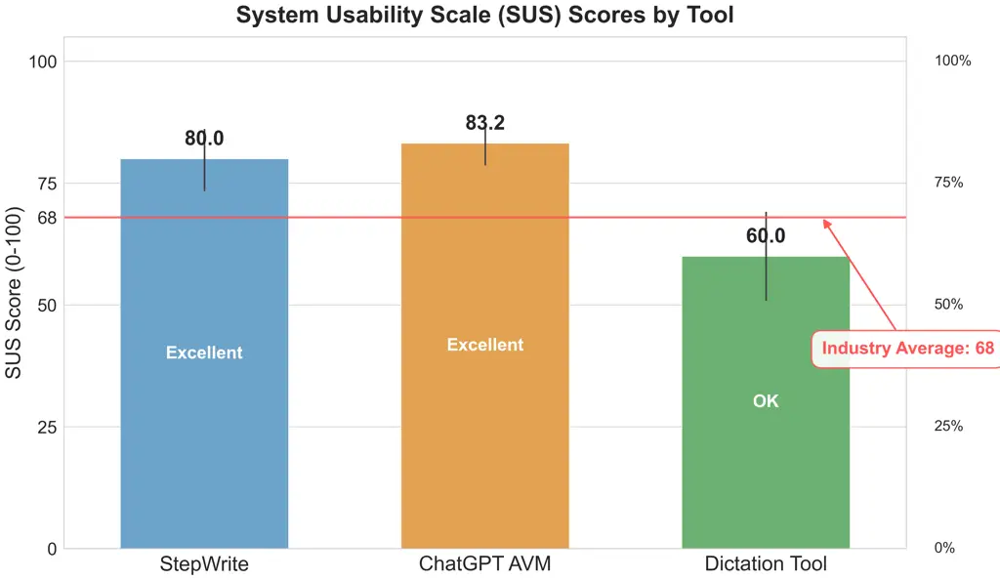

Figure 12. System Usability Scale (SUS) scores by tool. ChatGPT AVM and
StepWrite scored well above the typical 68 benchmark; Dictation fell
below it.

#### 6.6.3. Emotional Experience (EEQ)

Finally, the custom 5-item _Emotional Experience Questionnaire_ (EEQ)
examined _Engagement_, _Enjoyment_, _Motivation_, _Stress Reduction_,
and _Creativity_ using a 7-point Likert scale. Figure 13 shows each
dimension’s mean scores by tool. StepWrite received the highest overall
emotional ratings (*M* = 5.76), especially in _Engagement_ (6.16) and
_Motivation_ (5.96); participants consistently commented on feeling
“guided” and “supported.” ChatGPT AVM followed (*M* = 5.10), often
praised for its ability to reduce stress (5.64) through rapid text
generation and prompt responsiveness. In contrast, Dictation scored
significantly lower overall (*M* = 3.13), with heightened frustration,
reduced creativity, and persistent stress due to transcription errors. A
Friedman test ($`\chi^{2}(2)\,=\,35.27`$, *p* \< .001) and subsequent
Wilcoxon signed-rank comparisons (Bonferroni-corrected) indicated that
both StepWrite and ChatGPT outperformed Dictation (*p* \< .01), with no
significant difference in overall EEQ between StepWrite and ChatGPT.

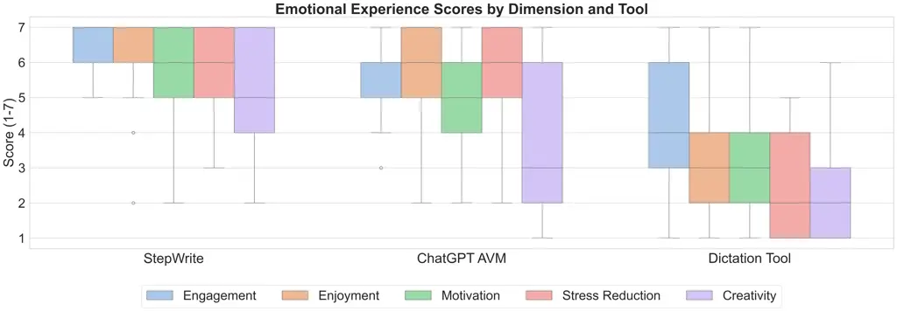

Figure 13. Emotional Experience Questionnaire (EEQ) scores by dimension
(1–7 scale). StepWrite elicited the highest overall emotional
positivity; ChatGPT was close but especially good at reducing stress.
Dictation scored significantly lower across all dimensions.

#### 6.6.4. Hands-Free Writing Tools Assessment (HFWTA)

To gain deeper insights into tool-specific performance dimensions, we
analyzed responses to our custom Hands-Free Writing Tools Assessment
(HFWTA). Figure 14 visualizes comparative performance across seven
critical dimensions of hands-free writing support.

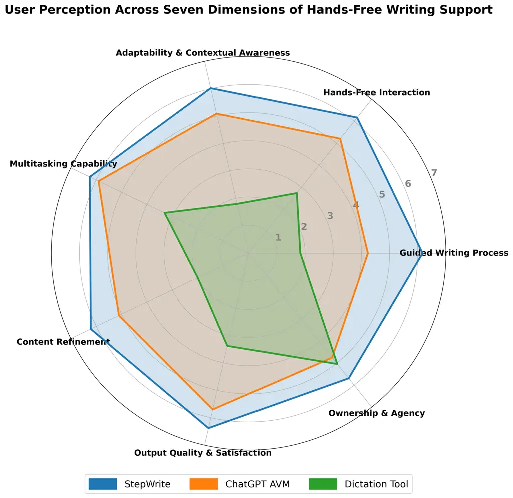

Figure 14. Radar chart comparison of the three writing tools across
seven dimensions of hands-free writing support (scale: 1-7). StepWrite
received the highest ratings across all measured dimensions, with the
most pronounced advantages in Guided Writing Process and Adaptability.

StepWrite received the highest overall rating (M = 6.13/7.00), with
consistently high scores across all seven dimensions. It performed
particularly well in _Output Quality & Satisfaction_ (M = 6.38) and
_Multitasking Capability_ (M = 6.25), indicating that participants
valued its ability to produce quality content while allowing them to
focus on secondary activities. While its score in _Ownership & Agency_
(M = 5.69) was slightly lower than in other categories, it still
outperformed all other tools in this dimension. This suggests that
despite receiving strong guidance, users retained a high sense of
authorship.

ChatGPT AVM received moderate-to-high ratings (overall M = 5.14/7.00),
with relative strengths in _Multitasking Capability_ (M = 5.91) and
_Output Quality & Satisfaction_ (M = 5.70). However, it scored notably
lower in _Guided Writing Process_ (M = 4.23) and _Ownership & Agency_ (M
= 4.75), reflecting its conversational but less structured approach and
participants’ perception that its outputs sometimes superseded their own
contributions.

Dictation Tool received significantly lower ratings across most
dimensions (overall M = 2.87/7.00), with particular challenges in
_Adaptability & Contextual Awareness_ (M = 1.80) and _Guided Writing
Process_ (M = 1.83). Its highest rating was in _Ownership & Agency_ (M =
5.04)—exceeding ChatGPT AVM in this dimension—suggesting that despite
usability challenges, participants still maintained a strong sense of
authorship over dictated content.

The most substantial performance differences appeared in
guidance-related dimensions, with a 4.34-point difference between
StepWrite and Dictation Tool on _Guided Writing Process_ and a
4.22-point difference in _Adaptability & Contextual Awareness_. These
results indicate that while all three tools enable hands-free
composition, participants expressed a marked preference for approaches
that offer structured scaffolding and contextual responsiveness over
simple speech transcription. We also conducted a system use case coding
for StepWrite by qualitatively analyzing the HFWTA prompt “_Describe a
real-world scenario where you would find this tool particularly
useful._” (Section 9 of Appendix A). Two authors performed an inductive
manifest content analysis. Working with the 25 participant responses,
they first open-coded every scenario phrase, then iteratively merged
related codes into a 15-category codebook, resolving all disagreements
by discussion. The final pass yielded 81 coded scenario mentions, i.e.
an average of 3.2 scenarios per participant. Table 5 summarizes the
frequencies. From this analysis, we identified three common themes:

- •
  Communication dominance. 84% of participants envisioned using
  StepWrite an email/text-composition aid.
- •
  Physically constrained contexts. A clear majority described situations
  where their hands or attention were occupied—gym sessions, cooking,
  commuting, laboratory work, and even cold weather.
- •
  Niche yet revealing scenarios. Specialized environments (e.g. taking
  notes during molten-steel experiments or soldering, wheelchair
  navigation) show how StepWrite can extend hands-free writing beyond
  communication and casual note-taking to safety-critical or
  accessibility-driven use cases.

| Scenario                | Activities                          | N   |
| ----------------------- | ----------------------------------- | --- |
| Email / messaging       | drafting or replying to emails, DMs | 21  |
| Gym / workouts          | treadmill, weight-lifting, gym bike | 9   |
| Hands-full multitasking | carrying items, “hands were full”   | 8   |
| Idea capture / notes    | brainstorming, jotting rough text   | 7   |
| Driving / commuting     | driving a car, riding a bus         | 6   |
| Walking / on-the-go     | campus walks, errands               | 5   |
| Cooking / food prep     | meal prep, stirring pots            | 5   |
| Urgent replies          | replying quickly, deadlines         | 4   |
| Academic writing        | class assignments, school papers    | 4   |
| Lab / technical work    | soldering, molten-steel experiments | 3   |
| Running (outdoors)      | jogging, road running               | 2   |
| Accessibility needs     | wheelchair use, fatigued hands      | 2   |
| Quiet desk environment  | low-noise desk work                 | 2   |
| Weather conditions      | winter weather, gloved hands        | 2   |
| Planning / to-do lists  | vacation planning, daily task lists | 1   |

Table 5. Self-reported StepWrite usage scenarios.

### 6.7. Order–Effect Analysis

After discarding every participant’s first-tool session, we compared the
three sequence groups—_StepWrite First_ ($`n{=}9`$), _ChatGPT AVM First_
($`n{=}8`$), and _Dictation Tool First_ ($`n{=}8`$)—with Kruskal–Wallis
tests (Kruskal and Wallis, 1952) on all performance and experience
metrics.

Workload (NASA-TLX, 0–10 scale).:  
StepWrite-First participants reported the highest subsequent workload
($`M{=}4.24,\;SD{=}2.89`$), ChatGPT-First were intermediate
($`M{=}3.82,\;SD{=}2.56`$), and Dictation-First the lowest
($`M{=}1.17,\;SD{=}1.10`$). The difference was significant,
$`H(2)=17.91,\,p<.001`$.

Revision effort (edit count).:  
Means (SDs) were $`4.89\;(4.41)`$, $`5.25\;(5.47)`$, and
$`1.59\;(2.34)`$ edits, respectively; $`H(2)=11.31,\,p=.0035`$.

Revision time.:  
Subsequent editing took $`79\,\text{s}\,(90.5)`$,
$`87\,\text{s}\,(60.5)`$, and $`42\,\text{s}\,(34.2)`$ on average;
$`H(2)=14.19,\,p<.001`$.

Semantic diversity.:  
Meaning-level change showed the same numerical trend
($`M{=}0.054,\,0.059,\,0.025`$) but was not reliable,
$`H(2)=3.74,\,p=.15`$.

To check persistence, we repeated the test using only each participant’s
_second_ tool; all metrics converged (all $`p>.06`$), indicating that
any priming or contrast from the first tool vanished after one
additional session.

Take-away. Initial tool choice can momentarily colour users’ perception
of effort, but the effect is short-lived. These transient differences do
not alter the overall pattern reported earlier: when results are
averaged across sequence, StepWrite still delivers the lowest sustained
cognitive load and revision burden, independent of where it appears in
the usage order.

### 6.8. Summary of Findings

Across both writing and reply tasks, StepWrite’s structured Q&A scaffold
delivered the cleanest drafts with minimal edits, stable readability and
complexity metrics, and the closest alignment to participants’ intent.
Although StepWrite front-loaded more drafting time, it substantially
reduced revision effort, achieved the lowest NASA-TLX workload scores,
and earned the highest SUS and EEQ ratings for usability and emotional
engagement.

ChatGPT AVM offered rapid generative drafts with moderate editing needs
and the highest lexical diversity, striking a balance between speed and
polish. It scored well on multitasking satisfaction but exhibited
greater variability in how closely its outputs matched user intent.

By contrast, unstructured Dictation required minimal drafting time but
imposed heavy editing overhead—long, run-on sentences, low initial
readability, and substantial semantic revisions—resulting in the highest
workload, lowest usability, and greatest stress.

These results highlight the value of incremental, context-aware
questioning: adaptive planning (StepWrite) most effectively supports
clean, intent-aligned, hands-free composition, while purely generative
and speech-to-text approaches involve trade-offs among speed,
flexibility, and user effort.

## 7. Discussion

Our mixed-methods evaluation provides converging evidence that
structured, context-aware scaffolding meaningfully improves hands-free
writing compared to both free-form dictation and open-ended
conversational assistance. Below, we interpret the quantitative results
in light of participants’ comments and observational notes, and we
distill design implications for future voice-first authoring tools.

### 7.1. Structured prompts reduce cognitive load and revision effort

StepWrite’s question–answer workflow produced drafts that required, on
average, 77% fewer word-level edits compared to drafts produced using
dictation and 40% fewer compared to those produced using ChatGPT AVM
(Section 6.1). Participants often attributed this efficiency to the
system’s guided, incremental prompts. For instance, one participant
noted, “the questions helped me remember what details to include” (P#3),
while another shared, “It was extremely helpful because it made me think
of scenarios I probably would have forgotten” (P#29). A third added, “I
use a lot of filler words like ‘uhhh’ or ‘like,’ so I had to use more
mental energy to not use those here because I knew they would be
recorded in the output” (P#22), suggesting that the structured format
encouraged more deliberate, concise speech. Furthermore, StepWrite’s
Essential Question Fraction (EQF) of 0.779 indicates that approximately
78% of the questions asked directly contributed to the content in the
final drafts, confirming the relevance and effectiveness of the guided
prompts.

This structured support also lightened participants’ cognitive load.
StepWrite had the lowest NASA TLX scores for mental demand, effort, and
frustration (Figure 11), and speech transcripts contained markedly fewer
filler words compared to dictation. Participants described the
experience as “refreshing and satisfying” (P#1), citing reduced
hesitation during speech and a clearer sense of direction.

### 7.2. Guidance versus agency: finding the sweet spot

Despite StepWrite’s overall popularity, some participants noted a
trade-off between structured guidance and creative control. Several
commented that the tool “asked more than I would normally include”
(P#10) or felt “a bit overkill” for users with strong writing confidence
(P#1). A few became fatigued by extended prompting: “After about 5
questions it became a little annoying, so I just issued finish” (P#16).
Others expressed the desire to “slip in extra context” or revisit
earlier questions mid-flow (P#4, P#22). At the same time, participants
highlighted StepWrite’s value for ideation and brainstorming: Pilot P#3
said, “I would use this to help me _ideate and keep note of my ideas_.
It lets me explore different directions just through voice,” P#22
envisioned using it “_for more brainstorming-type tasks where it would
be helpful to go back and forth_,” and P#4 noted that the system
“help\[s\] me take ideas I already have and decide where I want to
provide specificity.” Conversely, some users felt the guidance could
become cumbersome; and P#22 felt the detailed dialogue “took longer than
something more straightforward. As for ChatGPT AVM, two participants
used it exclusively for grammar correction and tone refinement,
describing it as a passive tool rather than a collaborator. This
contrasted with StepWrite, which demanded and directed deeper
engagement. ”

The Hands-Free Writing Tools Assessment (HFWTA) captured this nuance:
StepWrite earned the highest ratings in most design dimensions, and even
though its score for Ownership & Agency (M = 5.69) was slightly lower
than its own marks elsewhere, it still outperformed the two baseline
tools on that dimension. Users consistently appreciated the tool’s
quality and supportiveness, yet they also asked for lightweight “escape
hatches”—for example, a free-response scratch pad or a real-time visual
preview of the evolving text—to give them more flexible authorship.
Taken together, these findings suggest that the sweet spot lies in
preserving StepWrite’s structured scaffolding _while_ layering in
low-friction avenues for divergent thinking and rapid idea capture.

### 7.3. Multitasking requires robust, forgiving speech interfaces

Across all tools, the underlying speech recognition engine played a
central role in shaping user experience. Dictation was especially
fragile: users reported frustration with filler words, incorrect
commands, and misinterpreted accents—“It recorded every ‘uh’ I made”
(P#12), “I couldn’t modify anything hands-free” (P#18), and “I had to
stare at the screen to confirm what it wrote” (P#29). Many participants
abandoned inline punctuation entirely, leading to run-on sentences that
required significant manual editing. This frustration was exacerbated
for non-native speakers: several gave up on Word’s voice commands
despite printed instruction lists, citing frequent misfires and lack of
contextual correction.

By contrast, StepWrite and ChatGPT partially mitigated STT issues by
regenerating fluent outputs. However, participants still requested
clearer cues for microphone state: “I wasn’t sure when ChatGPT was
listening” (P#7). Multimodal indicators (e.g., haptic feedback) could
reduce this uncertainty, particularly for wearable displays.

### 7.4. Order effects suggest transient scaffolding benefits

Our counterbalanced design revealed short-term order effects.
Participants who used StepWrite first often approached the second tool
with greater clarity and efficiency, having already articulated key
ideas. Several said that StepWrite “helped me plan better responses”
(P#2) or “structured my thinking so the rest was easier” (P#16). Even
those who preferred ChatGPT or Dictation noted that StepWrite primed
their attention to tone, completeness, and clarity. However,
quantitative analyses showed that these effects diminished by the third
session, with all performance metrics converging across conditions. This
suggests that while structured scaffolding may serve as a cognitive
primer for subsequent tools, its influence is likely ephemeral rather
than enduring.

### 7.5. Accessibility implications

StepWrite’s voice-only workflow removes the need for precise finger
input and sustained visual focus, making it a promising option for
writers with limited upper-limb dexterity or learning disabilities that
affect working memory. In our study, a manual-wheelchair user (P#29)
remarked that, with one hand always steering, “_it’s hard to stop and
type on my phone, so I’d use StepWrite for everyday emails or school
papers_,” while a participant with a learning disability (P#16) said the
system’s incremental questions were “_superior and let me build a more
complete answer—even in situations where I’d normally forget key
details_.” Quantitatively, StepWrite yielded the lowest NASA-TLX
mental-demand scores and required 86 % fewer word-level edits than
Dictation and 45 % fewer than ChatGPT AVM (Section 6.1) , demonstrating
that its chunked, step-wise prompts lighten working-memory load—an
approach consistent with structured-writing interventions shown to
benefit people with intellectual and developmental disabilities
(IDD) (Bakken et al., 2022). These observations point to adaptive,
dialogue-based planning as a fruitful direction for future accessibility
research—particularly for expanding writing autonomy among users with
mobility impairments or IDD, and for anyone who benefits from
structured, incremental guidance.

### 7.6. Toward Integrated Authoring Workflows

As LLMs continue to improve in efficiency and can now run locally
on-device—such as with Apple Intelligence, Gemini Nano, and open-source
LLMs optimized for edge devices—we envision systems like StepWrite being
embedded directly into mainstream authoring tools, including email
clients, note-taking apps, and productivity suites. Rather than
remaining standalone systems, structured voice-guided writing could
become a native modality within everyday software, enabling fluid
transitions between typing, dictation, and scaffolded composition. This
shift would allow users to invoke guided writing in a lightweight,
context-sensitive manner across a wide range of devices and
environments.

### 7.7. Design implications for future voice-first authoring tools

1.  (1)
    Adaptive planning beats static templates. Our coding showed that 78%
    of StepWrite prompts were essential to final drafts. Adaptive
    prompting—guided by user input or context—outperforms rigid forms,
    reducing unnecessary overhead while preserving relevance.
2.  (2)
    Expose process transparency. ChatGPT AVM was occasionally distrusted
    for “just spitting out text without saying why” (P#4). In contrast,
    StepWrite’s explicit questioning made its logic legible. Designing
    LLM interfaces to explain or expose intermediate steps could foster
    greater user trust.
3.  (3)
    Scaffolding should adapt to user preferences. Some participants
    found highly specific prompts unnecessary, while others valued the
    added detail and structure. A future version of StepWrite could
    introduce a “detail specificity” setting that adapts to individual
    communication styles or allows users to control the level of detail.
    Alternatively, enabling memory could allow the system to learn
    preferences over time and automatically tailor scaffolding
    granularity to each user.
4.  (4)
    Provide lightweight escape hatches. StepWrite’s speech detector
    employs a “thinking window” that ignores brief pauses, allowing
    authors to pause, reflect, and extend an utterance before the system
    responds. However, when revisiting an earlier prompt, revisions
    continue to rely on the modify command, which replaces the previous
    answer in full. Based on feedback from our study, we identified two
    complementary affordances to reduce this friction: (1) an
    always-listening micro-edit mode that supports incremental voice
    directives—e.g., “add the course name ’Linear Algebra’ here” or
    “swap ‘Linear Algebra’ for ‘Data Structures’ ”—and integrates them
    into the existing response (planned for a future release), and (2) a
    continuously updated preview of the evolving draft to help users
    assess in real time whether their responses are sufficient. The
    latter was added to the StepWrite implementation following the
    study.
5.  (5)
    Minimize redundant effort. Voice-first authoring tools should
    support user edits without requiring them to re-answer previously
    completed prompts. In the initial implementation of StepWrite,
    editing a prior response triggered the removal of all subsequent
    question–answer pairs. This approach was a deliberate tradeoff: by
    clearing potentially outdated content, the system ensured coherence
    and prevented irrelevant prompts from persisting. However, this
    strategy also introduced redundancy, with two participants
    expressing surprise that the system did not “remember” answers they
    had already provided. In response, we implemented a dependency
    analysis module that evaluates the relationship between a modified
    response and downstream prompts. Only those that are logically,
    contextually, or semantically dependent on the edited answer are
    removed; unaffected prompts are retained. This selective
    regeneration was added to the StepWrite (Appendix E.6) following the
    study.
6.  (6)
    Support modality switching. Participants wanted to mute TTS when
    looking at a screen or speed up playback while walking (P#4, P#23).
    Systems should adapt feedback style (visual, auditory, haptic) to
    match situational attention and environment.

### 7.8. Limitations and Future Work

While our controlled study demonstrates StepWrite’s promise, several
limitations warrant further investigation. First, our participants were
predominantly English-speaking, university–educated adults comfortable
with technology; results may not generalize to non–native speakers,
older adults, or those with lower digital literacy. Second, we disabled
personalization and long-term memory, yet real-world deployments could
leverage these features to reduce redundant prompts—future work should
evaluate how gradual adaptation affects both efficiency and user
satisfaction. Third, we focused on short-form emails and replies;
scaling to longer documents (e.g., reports or essays) will likely
require hierarchical outlines and section-level navigation. Fourth, our
simulated multitasking contexts (walking in a lab space, simple
stationary tasks) do not capture the full variability of real
environments—field studies in noisy, unpredictable settings (e.g.,
public transit, kitchens) are needed to assess robustness of speech
recognition, latency, and user experience. Finally, we evaluated only
U.S. English; extending StepWrite to other languages and cultural
conventions may surface additional challenges. Addressing these
limitations will be necessary for realizing broadly applicable,
hands-free and eye-free authoring tools.

## 8. Conclusion

Voice interfaces have long excelled at simple commands and short
messages, but falter when users need to plan, structure, and revise
longer texts while their hands or eyes are occupied. StepWrite bridges
this gap by transforming composition into an adaptive, voice-driven
dialogue: dynamic micro-prompts scaffold users’ intent step by step,
offloading cognitive load and ensuring coherent, intent-aligned drafts.

In our within-subjects study (n=25), StepWrite outperformed both
Microsoft Word’s dictation and ChatGPT Advanced Voice Mode. It yielded
drafts requiring approximately 86 % fewer word-level edits than
dictation and 45 % fewer than ChatGPT AVM, achieved the lowest NASA-TLX
workload, and earned the highest SUS and EEQ scores for usability and
engagement. Over 77 % of StepWrite’s questions were essential to
participants’ final texts, demonstrating the precision and relevance of
its prompts.

By balancing structured guidance with user autonomy—supporting skips,
edits, and a simple “finish” command—StepWrite preserves authorship
while relieving users of planning and structural tracking. Its success
in both stationary and mobile, hands-busy contexts showcase the power of
context-aware scaffolding for wearable and multitasking scenarios.

Looking forward, we plan to personalize prompt granularity, integrate
multimodal feedback (e.g., haptic cues), and extend hierarchical
scaffolds for longer documents. Ultimately, we envision embedding
adaptive voice scaffolding directly into everyday editors and wearable
platforms, enabling users to compose complex texts—whether cooking
dinner or walking between meetings—without pausing to type or look.

“Because sometimes, the best way to write… is to speak your way there.”

###### Acknowledgements.

This work was supported by Apple Inc. and by compute resources provided
by OpenAI. We thank the BIG Lab members for their thoughtful feedback
and discussions, and the anonymous reviewers for their valuable
suggestions. We also thank our study participants for generously sharing
their time and perspectives. Any views, opinions, findings, and
conclusions or recommendations expressed in this material are those of
the authors and should not be interpreted as reflecting the views,
policies, or position, either expressed or implied, of Apple Inc.

## References

- Bakken et al. (2022) Randi Karine Bakken, Kari-Anne Bottegård Næss,
  Veerle Garrels, and Åste Mjelve Hagen. 2022. Single-case writing
  interventions for students with disorders of intellectual development:
  a systematic review and meta-analysis. _Education Sciences_ 12, 10
  (2022), 687.
- Bereiter and Scardamalia (1982) Carl Bereiter and Marlene
  Scardamalia. 1982. From conversation to composition: The role of
  instruction in a developmental process. _Advances in instructional
  psychology_ 2, 1-64 (1982).
- Brooke et al. (1996) John Brooke et al. 1996. SUS-A quick and dirty
  usability scale. _Usability evaluation in industry_ 189, 194 (1996),
  4–7.
- Burggräf et al. (2022) Peter Burggräf, Moritz Beyer, Jan-Philip
  Ganser, Tobias Adlon, Katharina Müller, Constantin Riess, Kaspar
  Zollner, Till Saßmannshausen, and Vincent Kammerer. 2022. Preferences
  for Single-Turn vs. Multiturn Voice Dialogs in Automotive Use
  Cases—Results of an Interactive User Survey in Germany. _IEEE Access_
  10 (2022), 55020–55033.
- Ch et al. (2022) Nabil Al Nahin Ch, Diana Tosca, Tyanna Crump, Alberta
  Ansah, Andrew Kun, and Orit Shaer. 2022. Gesture and voice commands to
  interact with AR windshield display in automated vehicle: a remote
  elicitation study. In _Proceedings of the 14th International
  Conference on Automotive User Interfaces and Interactive Vehicular
  Applications_. 171–182.
- Coenen et al. (2021) A Coenen, L Davis, D Ippolito, E Reif, and A
  Yuan. 2021. Wordcraft: A human-AI collaborative editor for story
  writing. arXiv.
- Dhillon et al. (2024) Paramveer S Dhillon, Somayeh Molaei, Jiaqi Li,
  Maximilian Golub, Shaochun Zheng, and Lionel Peter Robert. 2024.
  Shaping human-ai collaboration: varied scaffolding levels in
  co-writing with language models. In _Proceedings of the 2024 CHI
  Conference on Human Factors in Computing Systems_. 1–18.
- Edwards et al. (2019) Justin Edwards, He Liu, Tianyu Zhou, Sandy JJ
  Gould, Leigh Clark, Philip Doyle, and Benjamin R Cowan. 2019.
  Multitasking with Alexa: how using intelligent personal assistants
  impacts language-based primary task performance. In _Proceedings of
  the 1st International Conference on Conversational User Interfaces_.
  1–7.
- El Alaoui et al. (2023) Hamza El Alaoui, Zakaria El Aouene, and
  Violetta Cavalli-Sforza. 2023. Building intelligent chatbots: Tools,
  technologies, and approaches. In _2023 3rd International Conference on
  Innovative Research in Applied Science, Engineering and Technology
  (IRASET)_. IEEE, 1–12.
- Esquivel et al. (2024) Paola Esquivel, Kayden Gill, Mary Goldberg,
  S Andrea Sundaram, Lindsey Morris, and Dan Ding. 2024. Voice assistant
  utilization among the disability community for independent living: A
  rapid review of recent evidence. _Human Behavior and Emerging
  Technologies_ 2024, 1 (2024), 6494944.
- Feng et al. (2025) Yunhai Feng, Jiaming Han, Zhuoran Yang, Xiangyu
  Yue, Sergey Levine, and Jianlan Luo. 2025. Reflective planning:
  Vision-Language Models for multi-stage long-horizon robotic
  manipulation. _arXiv preprint arXiv:2502.16707_ (2025).
- Flesch (1948) Rudolph Flesch. 1948. A new readability yardstick.
  _Journal of Applied Psychology_ 32, 3 (1948), 221.
- Goodman et al. (2022) Steven M Goodman, Erin Buehler, Patrick Clary,
  Andy Coenen, Aaron Donsbach, Tiffanie N Horne, Michal Lahav, Robert
  MacDonald, Rain Breaw Michaels, Ajit Narayanan, et al. 2022. Lampost:
  Design and evaluation of an ai-assisted email writing prototype for
  adults with dyslexia. In _Proceedings of the 24th International ACM
  SIGACCESS Conference on Computers and Accessibility_. 1–18.
- Graham and Perin (2007) Steve Graham and Dolores Perin. 2007. A
  meta-analysis of writing instruction for adolescent students. _Journal
  of educational psychology_ 99, 3 (2007), 445.
- Haas et al. (2020) Gabriel Haas, Jan Gugenheimer, Jan Ole Rixen,
  Florian Schaub, and Enrico Rukzio. 2020. “They Like to Hear My Voice”:
  Exploring Usage Behavior in Speech-Based Mobile Instant Messaging. In
  _22nd International Conference on Human-Computer Interaction with
  Mobile Devices and Services_. 1–10.
- Harada et al. (2007) Susumu Harada, T Scott Saponas, and James A
  Landay. 2007. VoicePen: Augmenting pen input with simultaneous
  non-linguisitic vocalization. In _Proceedings of the 9th international
  conference on Multimodal interfaces_. 178–185.
- Hart (2006) Sandra G Hart. 2006. NASA-task load index (NASA-TLX); 20
  years later. In _Proceedings of the human factors and ergonomics
  society annual meeting_, Vol. 50. Sage publications Sage CA: Los
  Angeles, CA, 904–908.
- Hendrik et al. (2006) Witt Hendrik, Tom Nicolai, and Holger
  Kenn. 2006. Designing a wearable user interface for hands-free
  interaction in maintenance applications. In _PerCom Workshops_.
- Höhne et al. (2024) Jan Karem Höhne, Timo Lenzner, and Joshua
  Claassen. 2024. Automatic speech-to-text transcription: evidence from
  a smartphone survey with voice answers. _International Journal of
  Social Research Methodology_ (2024), 1–8.
- Hu et al. (2025) Wanqing Hu, Jirong Tian, and Yanyan Li. 2025.
  Enhancing student engagement in online collaborative writing through a
  generative AI-based conversational agent. _The Internet and Higher
  Education_ 65 (2025), 100979.
- Huang et al. (2023) Chieh-Yang Huang, Saniya Naphade, Kavya Laalasa
  Karanam, and Ting-Hao’Kenneth’ Huang. 2023. Conveying the Predicted
  Future to Users: A Case Study of Story Plot Prediction. _arXiv
  preprint arXiv:2302.09122_ (2023).
- Ippolito et al. (2022) Daphne Ippolito, Ann Yuan, Andy Coenen, and
  Sehmon Burnam. 2022. Creative writing with an ai-powered writing
  assistant: Perspectives from professional writers. _arXiv preprint
  arXiv:2211.05030_ (2022).
- Khurana et al. (2024) Anjali Khurana, Michael Glueck, and Parmit K
  Chilana. 2024. Do I Just Tap My Headset? How Novice Users Discover
  Gestural Interactions with Consumer Augmented Reality Applications.
  _Proceedings of the ACM on Interactive, Mobile, Wearable and
  Ubiquitous Technologies_ 7, 4 (2024), 1–28.
- Korkiakoski et al. (2024) Mikko Korkiakoski, Paula Alavesa, and Panos
  Kostakos. 2024. Preference in voice commands and gesture controls with
  hands-free augmented reality with novel users. _IEEE Pervasive
  Computing_ (2024).
- Kruskal and Wallis (1952) William H Kruskal and W Allen Wallis. 1952.
  Use of ranks in one-criterion variance analysis. _Journal of the
  American statistical Association_ 47, 260 (1952), 583–621.
- Larsen et al. (2020) Helene Høgh Larsen, Alexander Nuka Scheel, Toine
  Bogers, and Birger Larsen. 2020. Hands-free but not eyes-free: A
  usability evaluation of Siri while driving. In _Proceedings of the
  2020 conference on human information interaction and retrieval_.
  63–72.
- Lee et al. (2024) Jaewook Lee, Jun Wang, Elizabeth Brown, Liam Chu,
  Sebastian S Rodriguez, and Jon E Froehlich. 2024. GazePointAR: A
  context-aware multimodal voice assistant for pronoun disambiguation in
  wearable augmented reality. In _Proceedings of the 2024 CHI Conference
  on Human Factors in Computing Systems_. 1–20.
- Lee et al. (2022) Mina Lee, Percy Liang, and Qian Yang. 2022.
  Coauthor: Designing a human-ai collaborative writing dataset for
  exploring language model capabilities. In _Proceedings of the 2022 CHI
  conference on human factors in computing systems_. 1–19.
- Li et al. (2023) Zehan Li, Xin Zhang, Yanzhao Zhang, Dingkun Long,
  Pengjun Xie, and Meishan Zhang. 2023. Towards general text embeddings
  with multi-stage contrastive learning. _arXiv preprint
  arXiv:2308.03281_ (2023).
- Lin et al. (2024) Susan Lin, Jeremy Warner, JD Zamfirescu-Pereira,
  Matthew G Lee, Sauhard Jain, Shanqing Cai, Piyawat Lertvittayakumjorn,
  Michael Xuelin Huang, Shumin Zhai, Björn Hartmann, et al. 2024.
  Rambler: Supporting Writing With Speech via LLM-Assisted Gist
  Manipulation. In _Proceedings of the 2024 CHI Conference on Human
  Factors in Computing Systems_. 1–19.
- Liu et al. (2023) Mingzhou Liu, Caixia Wang, and Jing Hu. 2023. Older
  adults’ intention to use voice assistants: Usability and emotional
  needs. _Heliyon_ 9, 11 (2023).
- Mehra et al. (2023) Brinda Mehra, Kejia Shen, Hen Chen Yen, and Can
  Liu. 2023. Gist and Verbatim: Understanding Speech to Inform New
  Interfaces for Verbal Text Composition. In _Proceedings of the 5th
  International Conference on Conversational User Interfaces_. 1–11.
- Mirowski et al. (2023) Piotr Mirowski, Kory W Mathewson, Jaylen
  Pittman, and Richard Evans. 2023. Co-writing screenplays and theatre
  scripts with language models: Evaluation by industry professionals. In
  _Proceedings of the 2023 CHI conference on human factors in computing
  systems_. 1–34.
- Miura et al. (2025) Yusuke Miura, Chi-Lan Yang, Masaki Kuribayashi,
  Keigo Matsumoto, Hideaki Kuzuoka, and Shigeo Morishima. 2025.
  Understanding and Supporting Formal Email Exchange by Answering
  AI-Generated Questions. _arXiv preprint arXiv:2502.03804_ (2025).
- Nebeling et al. (2016) Michael Nebeling, Alexandra To, Anhong Guo,
  Adrian A de Freitas, Jaime Teevan, Steven P Dow, and Jeffrey P
  Bigham. 2016. WearWrite: Crowd-assisted writing from smartwatches. In
  _Proceedings of the 2016 CHI conference on human factors in computing
  systems_. 3834–3846.
- Nith et al. (2024) Romain Nith, Yun Ho, and Pedro Lopes. 2024.
  SplitBody: Reducing Mental Workload while Multitasking via Muscle
  Stimulation. In _Proceedings of the 2024 CHI Conference on Human
  Factors in Computing Systems_. 1–11.
- Oakley and Park (2007) Ian Oakley and Jun-Seok Park. 2007. Designing
  eyes-free interaction. In _Haptic and Audio Interaction Design: Second
  International Workshop, HAID 2007 Seoul, South Korea, November 29-30,
  2007 Proceedings 2_. Springer, 121–132.
- O’Brien and Toms (2010) Heather L O’Brien and Elaine G Toms. 2010. The
  development and evaluation of a survey to measure user engagement.
  _Journal of the American Society for Information Science and
  Technology_ 61, 1 (2010), 50–69.
- Perrault et al. (2013) Simon T Perrault, Eric Lecolinet, James Eagan,
  and Yves Guiard. 2013. Watchit: simple gestures and eyes-free
  interaction for wristwatches and bracelets. In _Proceedings of the
  SIGCHI Conference on Human Factors in Computing Systems_. 1451–1460.
- Pradhan et al. (2020) Alisha Pradhan, Amanda Lazar, and Leah
  Findlater. 2020. Use of intelligent voice assistants by older adults
  with low technology use. _ACM Transactions on Computer-Human
  Interaction (TOCHI)_ 27, 4 (2020), 1–27.
- Ratcliff et al. (1988) John W Ratcliff, David E Metzener, et al. 1988.
  Pattern matching: The gestalt approach. _Dr. Dobb’s Journal_ 13, 7
  (1988), 46.
- Ruan et al. (2016) Sherry Ruan, Jacob O Wobbrock, Kenny Liou, Andrew
  Ng, and James Landay. 2016. Speech is 3x faster than typing for
  english and mandarin text entry on mobile devices. _arXiv preprint
  arXiv:1608.07323_ (2016).
- Ruan et al. (2018) Sherry Ruan, Jacob O Wobbrock, Kenny Liou, Andrew
  Ng, and James A Landay. 2018. Comparing speech and keyboard text entry
  for short messages in two languages on touchscreen phones.
  _Proceedings of the ACM on Interactive, Mobile, Wearable and
  Ubiquitous Technologies_ 1, 4 (2018), 1–23.
- Schick et al. (2023) Timo Schick, Jane Dwivedi-Yu, Roberto Dessì,
  Roberta Raileanu, Maria Lomeli, Eric Hambro, Luke Zettlemoyer, Nicola
  Cancedda, and Thomas Scialom. 2023. Toolformer: Language models can
  teach themselves to use tools. _Advances in Neural Information
  Processing Systems_ 36 (2023), 68539–68551.
- Schmidt et al. (2020) Maria Schmidt, Ojashree Bhandare, Ajinkya
  Prabhune, Wolfgang Minker, and Steffen Werner. 2020. Classifying
  cognitive load for a proactive in-car voice assistant. In _2020 IEEE
  sixth international conference on big data computing service and
  applications (BigDataService)_. IEEE, 9–16.
- Shao et al. (2024) Yijia Shao, Yucheng Jiang, Theodore A Kanell, Peter
  Xu, Omar Khattab, and Monica S Lam. 2024. Assisting in writing
  wikipedia-like articles from scratch with large language models.
  _arXiv preprint arXiv:2402.14207_ (2024).
- Shen et al. (2023) Zejiang Shen, Tal August, Pao Siangliulue, Kyle Lo,
  Jonathan Bragg, Jeff Hammerbacher, Doug Downey, Joseph Chee Chang, and
  David Sontag. 2023. Beyond summarization: Designing ai support for
  real-world expository writing tasks. _arXiv preprint arXiv:2304.02623_
  (2023).
- Shi et al. (2023) Shuming Shi, Enbo Zhao, Wei Bi, Deng Cai, Leyang
  Cui, Xinting Huang, Haiyun Jiang, Duyu Tang, Kaiqiang Song, Longyue
  Wang, et al. 2023. Effidit: An assistant for improving writing
  efficiency. In _Proceedings of the 61st Annual Meeting of the
  Association for Computational Linguistics (Volume 3: System
  Demonstrations)_. 508–515.
- Singh et al. (2018) Aditya Singh, Dibyendu Mishra, Sanchit Bansal,
  Vinayak Agarwal, Anjali Goyal, and Ashish Sureka. 2018. Email Dataset
  for Automatic Response Suggestion within a University". (2 2018).
  [doi:10.6084/m9.figshare.5853057.v1](https://doi.org/10.6084/m9.figshare.5853057.v1)
- Stoehr (1968) Taylor Stoehr. 1968. Tone and voice. _College English_
  30, 2 (1968), 150–161.
- Strayer et al. (2016) David L Strayer, Joel M Cooper, Jonna Turrill,
  James R Coleman, and Rachel J Hopman. 2016. Talking to your car can
  drive you to distraction. _Cognitive research: principles and
  implications_ 1 (2016), 1–17.
- Taheri et al. (2021) Atieh Taheri, Ziv Weissman, and Misha Sra. 2021.
  Design and evaluation of a hands-free video game controller for
  individuals with motor impairments. _Frontiers in Computer Science_ 3
  (2021), 751455.
- Thomas et al. (2024) Justin Thomas, Jigar Jogia, Mariapaola Barbato,
  and Richard Bentall. 2024. Me, not-me: Voice note use predicts
  self-voice recognition and liking. _Computers in Human Behavior
  Reports_ 15 (2024), 100446.
- Tsimhoni et al. (2004) Omer Tsimhoni, Daniel Smith, and Paul
  Green. 2004. Address entry while driving: Speech recognition versus a
  touch-screen keyboard. _Human factors_ 46, 4 (2004), 600–610.
- Völkel et al. (2021) Sarah Theres Völkel, Daniel Buschek, Malin
  Eiband, Benjamin R Cowan, and Heinrich Hussmann. 2021. Eliciting and
  analysing users’ envisioned dialogues with perfect voice assistants.
  In _Proceedings of the 2021 CHI conference on human factors in
  computing systems_. 1–15.
- Wan et al. (2024) Qian Wan, Siying Hu, Yu Zhang, Piaohong Wang, Bo
  Wen, and Zhicong Lu. 2024. " It Felt Like Having a Second Mind":
  Investigating Human-AI Co-creativity in Prewriting with Large Language
  Models. _Proceedings of the ACM on Human-Computer Interaction_ 8,
  CSCW1 (2024), 1–26.
- Wei et al. (2022) Jason Wei, Xuezhi Wang, Dale Schuurmans, Maarten
  Bosma, Fei Xia, Ed Chi, Quoc V Le, Denny Zhou, et al. 2022.
  Chain-of-thought prompting elicits reasoning in large language models.
  _Advances in neural information processing systems_ 35 (2022),
  24824–24837.
- Wikipedia contributors (2024) Wikipedia contributors. 2024. Gestalt
  Pattern Matching — Wikipedia, The Free Encyclopedia.
  [https://de.wikipedia.org/wiki/Gestalt_Pattern_Matching](https://de.wikipedia.org/wiki/Gestalt_Pattern_Matching)
  Accessed: 2025-04-02.
- Xu et al. (2023) Binfeng Xu, Zhiyuan Peng, Bowen Lei, Subhabrata
  Mukherjee, Yuchen Liu, and Dongkuan Xu. 2023. Rewoo: Decoupling
  reasoning from observations for efficient augmented language models.
  _arXiv preprint arXiv:2305.18323_ (2023).
- Xu et al. (2007) Shuang Xu, Santosh Basapur, Mark Ahlenius, and
  Deborah Matteo. 2007. An empirical study on users’ acceptance of
  speech recognition errors in text-messaging. In _International
  Conference on Human-Computer Interaction_. Springer, 232–242.
- Zhou et al. (2024) Chen Zhou, Zihan Yan, Ashwin Ram, Yue Gu, Yan
  Xiang, Can Liu, Yun Huang, Wei Tsang Ooi, and Shengdong Zhao. 2024.
  GlassMail: Towards Personalised Wearable Assistant for On-the-Go Email
  Creation on Smart Glasses. In _Proceedings of the 2024 ACM Designing
  Interactive Systems Conference_. 372–390.

## Appendix A Hands-Free Writing Tools Assessment (HFWTA)

The following survey was used to evaluate participants’ experiences with
each writing tool across key dimensions of hands-free interaction.
Participants rated each item on a 7-point Likert scale (1 = Strongly
Disagree, 7 = Strongly Agree). This instrument was administered after
completing tasks with each tool.

### Section 1: Guided Writing Process

- •
  The tool provided helpful structure and guidance for my writing
  process.
- •
  The tool helped me include important details I might have otherwise
  forgotten.
- •
  The tool’s guidance felt tailored to the specific type of writing I
  was doing.
- •
  The tool provided an appropriate amount of guidance (not too much, not
  too little).

### Section 2: Hands-Free Interaction

- •
  I could complete the entire writing task hands free.
- •
  The tool allowed me to naturally pause and resume my workflow without
  losing context.
- •
  I could easily make corrections or revisions entirely through voice
  commands.
- •
  The tool rarely interrupted me while I was speaking.
- •
  The tool provided clear audio feedback that kept me informed without
  requiring visual attention.

### Section 3: Adaptability & Contextual Awareness

- •
  The tool adapted intelligently based on my previous input.
- •
  When I provided vague information, the tool appropriately asked for
  clarification.
- •
  The tool avoided asking for information I had already provided.
- •
  The tool maintained appropriate context throughout the writing
  process.

### Section 4: Multitasking Capability

- •
  I could effectively use this tool while engaged in other activities
  (walking, eating, etc.).
- •
  The tool required minimal visual attention to operate effectively.
- •
  I felt confident that the tool was accurately capturing my input while
  I was multitasking.

### Section 5: Content Refinement

- •
  I could easily navigate to review or modify previous content.
- •
  The modification process was intuitive and efficient.
- •
  The tool effectively incorporated my changes into the final output.

### Section 6: Output Quality & Satisfaction

- •
  The final output accurately reflected what I intended to communicate.
- •
  The final output used the appropriate tone and style needed for the
  task.
- •
  The final output correctly incorporated all the information I provided
  during the writing process.
- •
  The tool helped me produce higher quality writing than I would have on
  my own.

### Section 7: Overall Assessment

- •
  This tool would be valuable for situations when I need to write while
  my hands are occupied.
- •
  For hands-free writing, this tool was more efficient than the
  alternatives I’ve tried.
- •
  I would choose this tool for future hands-free writing tasks.

### Section 8: Ownership & Agency

- •
  I feel like the final output I created is truly _my_ writing.
- •
  The final text sounds like me and reflects my voice.
- •
  I had sufficient control over the process of writing.
- •
  I had appropriate control over the final version of the text.

### Section 9: Open-Ended Questions

These open-ended questions were used to better understand participants’
subjective impressions and preferences. They were not included in the
quantitative graphs but were used to qualitatively inform analysis and
are cited in the paper where appropriate.

- •
  What specific features made this tool easier or harder to use in a
  hands-free context?
- •
  How did you feel about the way the tool guided you through the writing
  process with questions? Was this helpful or limiting?
- •
  How did the system’s questions compare to how you would normally think
  through a writing task?
- •
  Were there questions you expected the system to ask that it didn’t? Or
  questions it asked that seemed unnecessary?
- •
  What improvements would make this tool more effective for your
  specific writing needs?
- •
  Were there any moments when you felt frustrated or limited by the
  interaction? Please describe.
- •
  Describe a real-world scenario where you would find this tool
  particularly useful.

## Appendix B Emotional Experience Questionnaire (EEQ)

EEQ was used to assess participants’ affective responses to each tool.
Participants rated their agreement with each statement using a 7-point
Likert scale (1 = Strongly Disagree, 7 = Strongly Agree). This
instrument was administered after participants completed all tasks with
each tool.

- •
  I felt engaged while writing with this tool. (Engagement)
- •
  I enjoyed using this tool. (Enjoyment)
- •
  Using this tool made me feel motivated to complete my writing.
  (Motivation)
- •
  This tool reduced my stress while writing. (Stress Reduction)
- •
  This tool helped me feel more creative. (Creativity)

## Appendix C Tone Category Definitions

We defined 14 tone categories to evaluate alignment between intended and
generated tone. Each category reflects common communicative goals across
formal, casual, and affective contexts.

- •
  Formal: Conforms to professional or institutional convention by
  opening and closing with courteous formulas, maintaining respectful
  distance throughout, and avoiding slang or overt emotion—even when the
  sentence structure or vocabulary is otherwise simple or includes
  contractions.
- •
  Informal: Conversational and casual in both greeting and closing,
  omitting conventional formalities, favouring first-/second-person
  address and relaxed phrasing; it stays free of authoritative
  directives, which would shift the tone toward Assertive.
- •
  Friendly: A friendly tone builds rapport through warm greetings,
  upbeat adjectives, polite assurances, and light humour; it stays
  steady and kind without diving into deep emotional validation
  (Empathetic) or making strong predictions about the future
  (Optimistic).
- •
  Diplomatic: A diplomatic tone carefully navigates sensitive topics by
  using neutral vocabulary, gentle hedging (‘could’, ‘might’), and
  balanced phrasing that acknowledges multiple perspectives, explicitly
  avoiding blunt commands, deadlines, or one-sided judgments.
- •
  Urgent: An urgent tone highlights immediate importance by pairing
  direct wording with explicit time cues such as ‘ASAP’, ‘by 2 PM
  today’, or references to events starting soon; its purpose is to
  trigger swift action, distinguishing it from mere assertiveness by its
  emphasis on speed.
- •
  Concerned: A concerned tone expresses unease about potential problems;
  it employs conditional verbs (‘could’, ‘might’), tentative language,
  and references to possible negative outcomes to encourage caution,
  without the overt anxiety of Worried or the directive thrust of
  Urgent.
- •
  Optimistic: An optimistic tone projects confidence in favourable
  future results; it relies on hopeful verbs (‘will’, ‘can’), visionary
  phrases (‘exciting opportunities ahead’), and uplifting language
  centred on forthcoming success rather than present rapport (Friendly)
  or sudden astonishment (Surprised).
- •
  Curious: A curious tone signals genuine information-seeking; it is
  dominated by open-ended or clarifying questions and expressions of
  uncertainty, steering clear of imperatives, deadlines, or
  collaborative calls to action.
- •
  Encouraging: An encouraging tone motivates and reassures; it supplies
  affirmations of ability (‘you’ve got this’), references to progress,
  and supportive language that boosts confidence without deep emotional
  empathy (Empathic) or explicit time pressure (Urgent).
- •
  Surprised: A surprised tone communicates sudden astonishment at
  unexpected news; it features strong intensifiers, exclamatory
  punctuation, and short emotive bursts that foreground the shock itself
  rather than ongoing warmth, future optimism, or requests for action.
- •
  Cooperative: A cooperative tone invites joint effort toward a shared
  goal; it consistently uses inclusive pronouns (‘we’, ‘our’),
  collaborative verbs (‘coordinate’, ‘work together’), and language that
  emphasises mutual benefit while avoiding solitary demands or purely
  polite formality.
- •
  Empathetic: An empathetic tone shows understanding and compassion by
  explicitly naming or validating the other person’s feelings, offering
  support or flexibility, and using gentle, comforting phrasing distinct
  from simple friendliness or motivation.
- •
  Apologetic: An apologetic tone takes responsibility for an error by
  stating an explicit apology (‘I’m sorry’), acknowledging fault, and
  describing corrective steps, thereby differentiating itself from
  neutral acknowledgements or defensive explanations.
- •
  Assertive: An assertive tone delivers clear, confident instructions or
  expectations through imperative verbs or polite-imperative phrasing
  (‘please update’, ‘provide’), with minimal hedging and no necessary
  emphasis on tight timelines—distinguishing it from Urgent.

## Appendix D Voice Command Reference

StepWrite supports a range of voice commands that enable hands-free
navigation and control during the writing process. The system uses fuzzy
matching to interpret input flexibly, so users do not need to speak the
exact phrases listed below. Custom voice commands can also be defined by
the user.

- •
  Navigation  
  Say: "next question", "previous question", or "skip question"  
  Action: Moves forward, backward, or skips the current question in the
  sequence.
- •
  Answer Editing  
  Say: "modify answer"  
  Action: Revises the response to the current or a previous question.
- •
  Session Control  
  Say: "pause writing", "continue writing", or "finish writing"  
  Action: Pauses, resumes, or ends the Q&A session and generates the
  draft. Pausing disables input, useful if the user needs to talk to
  someone nearby without recording unintended speech.
- •
  Interface Switching  
  Say: "go to editor", "return to questions"  
  Action: Switches between the editor view and the Q&A interface.
- •
  Audio Playback  
  Say: "play that again", "stop speaking"  
  Action: Repeats or interrupts the most recent audio output.

More commands may be added in future versions.

## Appendix E System Prompts

This appendix contains the prompts used in StepWrite, organized by
functional modules. ¹⁰¹⁰ 10 Lengthy prompts are truncated for brevity;
the complete versions are available in our GitHub repository. The
prompting system consists of five main modules: question generation,
text generation, fact checking, tone classification, and memory
management. Additionally, the dependency analysis module referenced in
Appendix 7.7 (5) is included as well.

### E.1. Question Generation Module

#### E.1.1. Write Question Prompt

This is the main investigative prompt that generates questions to gather
minimal but essential information for text creation. It acts as an
intelligent interviewer that helps users articulate their thoughts. The
prompt is called iteratively to generate the next question in the
conversation flow until sufficient information is gathered. Key features
include extensive guidelines for what to ask and avoid, skip handling
logic to prevent user frustration, logical question ordering and
completion conditions, and context-aware detail gathering based on
formality level.

Prompt:

=== TASK ===

You are a system acting as an investigator & thinking partner to gather
the minimal but essential information needed for another tool to craft a
final text. Your role is to determine the single best next question to
ask, always referencing the entire conversation to avoid repetition or
irrelevant prompts. Your primary goal is to guide the user to provide
enough information to fulfill their writing needs efficiently and
without overwhelming them, while helping them discover and articulate
their ideas through conversation.

=== Previous conversation ===

\[Insert Q&A history\]

=== CRITICAL REQUIREMENTS ===

1. NEVER ask about:

- Titles, headings, or any formatting

- Document structure or layout

- Writing process or style preferences

- Whether the user needs help (that’s already implied)

- How to phrase or word things

- Font, spacing, or visual elements

- Contact details unless explicitly needed for the task

- "Anything␣else␣to␣add" type questions (use the dedicated optional
  prompt instead)

- Whether to include standard sections (assume relevance based on
  context)

- File formats or technical details

- Whether to include references (unless the user has mentioned sources
  or research)

- Whether to add appendices or attachments

- Preferences about writing style or tone (assume a neutral,
  appropriate tone unless context suggests otherwise)

- Language (always assume English)

- Greetings, closings, or email formatting

- Email addresses or contact details (unless the task explicitly
  requires gathering these)

- Transportation or logistics (unless explicitly part of the core task)

- Personal hobbies or interests from memory (unless directly and
  explicitly relevant to the immediate task)

- Confirmations or verifications of previously given information

- Any writing style elements (the writer LLM will handle this)

- Goodbyes or closing remarks

2. ALWAYS ask about (if relevant, not already provided, and essential
   for the core message):

- Core message or main points

- Target audience (if not self)

- Key objectives or goals

- Important context or background

- Deadlines or time-sensitive information

- Budget/cost details if money is involved and relevant

- Key stakeholders or decision makers

- Specific details about the project or task

- Any constraints or limitations

- Required approvals or reviews

\[Additional detailed guidelines continue...\]

=== GUIDELINES ===

1. Review All Prior Context Before Proceeding

- CRITICALLY IMPORTANT: Thoroughly analyze what information has ALREADY
  been provided through BOTH direct answers AND indirect mentions.

- If a user mentions something even briefly, NEVER ask if they want to
  suggest specific details about that topic.

- NEVER ask questions that can be logically inferred from previous
  answers.

- Look for subtle implications and references in user responses that
  indirectly provide information.

2. Adopt an Investigator Mindset Focused on Essential Details and Idea
   Development

- Focus on gathering ONLY the absolute minimum set of critical details
  required.

- Frame questions to help users not just provide information but
  discover and refine their own thinking in the process.

- Ask only one question at a time, seeking a specific piece of missing
  information that is clearly necessary.

\[Additional guidelines continue...\]

=== OUTPUT FORMAT ===

Return your result as valid JSON:

{"question": "your␣question␣here","followup_needed": boolean}

- If "followup_needed" is false, return: {"question":
  "","followup_needed": false}

#### E.1.2. Reply Question Prompts

Reply prompts share the same structure as write prompts but include
additional context from the original text being replied to.

##### Initial Reply Question Prompt

This prompt generates the first personalized question when replying to a
message, ensuring it references specific content from the original
message. It avoids generic questions and focuses on direct requests,
time-sensitive issues, or the sender’s main concerns.

Prompt:

=== TASK ===

Generate a SPECIFIC, PERSONALIZED first question to help someone reply
to the message below.

This question should directly reference the content of the message in a
way that feels personalized.

=== ORIGINAL MESSAGE ===

\[Insert original text\]

=== REQUIREMENTS ===

1. Create a SPECIFIC question that references the actual content of the
   message

2. The question must mention a key topic, request, or detail from the
   message

3. Avoid generic questions like:

- "What␣main␣points␣do␣you␣want␣to␣address␣in␣your␣reply?"

- "How␣would␣you␣like␣to␣respond␣to␣this␣message?"

- "What␣do␣you␣want␣to␣say␣in␣your␣response?"

4. Instead, focus on a specific element in the message

5. Prioritize questions that address:

- Direct requests in the message

- Time-sensitive issues

- The sender’s main concern or point

- Any decisions the recipient needs to make

6. Keep it concise (under 15 words)

7. Should be phrased as an open-ended question

8. Must sound natural and conversational

=== OUTPUT FORMAT ===

Return ONLY the question text, with no quotation marks, prefixes, or
extra text.

##### Reply Question Prompt

This prompt generates subsequent questions for the reply flow,
incorporating the original message context and following the same
guidelines as the write prompt. The key addition is that it includes the
original message text as "extra context" and focuses on addressing
points raised in the original communication while maintaining logical
sequence and considering relationship context from the original sender.

### E.2. Text Generation Module

#### E.2.1. Write Output Prompt

This prompt generates the final text output based on the Q&A
conversation, incorporating user context and maintaining their voice. It
is called after question generation is complete to produce the final
text. The prompt ensures all user information is incorporated, including
brief mentions, while maintaining the user’s perspective and handling
flexible preferences appropriately.

Prompt:

=== TASK ===

Generate a coherent, concise response based on the conversation that
captures the user’s thinking process and ideas. Use this tone:

\[Insert tone & its description\]

=== Previous conversation ===

\[Insert Q&A history\]

=== CRITICAL OUTPUT FORMAT REQUIREMENTS ===

- Output ONLY the final text content itself

- DO NOT include any introductory text (like "Here’s␣a␣draft:" or
  "Here’s␣what␣I␣came␣up␣with:")

- DO NOT include any closing commentary (like
  "Let␣me␣know␣if␣you␣need␣any␣changes")

- DO NOT add dividers like "---" or "\*\*\*" or similar formatting
  markers

- DO NOT include any meta-commentary about the text

- DO NOT wrap the output in quotes or code blocks

- Simply output the content directly, starting with the appropriate
  greeting if applicable

=== INTELLIGENCE REQUIREMENTS ===

- CRITICALLY IMPORTANT: Incorporate ALL information the user has
  provided, even if mentioned casually or briefly

- If the user mentioned something in passing, DEFINITELY include that
  perspective

- Pay special attention to brief mentions that might easily be missed
  but could be important to the user

- If the user indicates flexibility on a topic, reflect that flexibility
  rather than making up specific details

- If a user mentioned specific timing, location, people, or details,
  ensure they’re accurately included

- Pay careful attention to the user’s exact phrasing when they express
  preferences, concerns, or requests

- If the user skipped questions about a topic, do NOT include that topic
  in the response

=== Guidelines ===

- Use clear, straightforward language.

- Break down information into logical steps if needed.

- Keep sentences short and focused on the user’s main points.

- Incorporate all essential details the user provided, no matter how
  briefly mentioned.

- Reflect the user’s thought process, priorities, and reasoning as
  revealed through the conversation.

- Maintain the user’s voice and perspective while providing structure
  and clarity.

- Emphasize topics where the user provided detailed responses or
  volunteered additional information.

- Follow the user’s lead on what aspects of the content matter most to
  them.

- Never ask for additional details or clarification - use the
  information provided.

#### E.2.2. Reply Output Prompt

This prompt generates appropriate replies incorporating the original
message context and user responses. The key addition compared to the
write output prompt is that it includes the original message text and
has specific greeting format requirements for replies, ensuring proper
email etiquette and addressing all key points from the original message.

Prompt:

=== TASK ===

Generate a clear and appropriate reply based on the user’s responses to
the questions that captures their thinking process and authentic voice.
Use this tone:

\[Insert tone & its description\]

=== Original text they’re replying to ===

\[Insert original text\]

=== Conversation with user’s responses ===

\[Insert Q&A history\]

=== GREETING FORMAT REQUIREMENTS ===

- For emails: ALWAYS start with "Hello␣\[Recipient’s␣Name\]," (extract
  the recipient’s name from the original message)

- If recipient’s name isn’t clear from the original message, use an
  appropriate greeting like "Hello," or "Hi␣there,"

- NEVER start with the user’s own name

\[Same intelligence requirements and guidelines as write output prompt\]

### E.3. Fact Checking Module

#### E.3.1. Fact Check Prompt

This prompt verifies that the generated output accurately represents the
user’s responses without changing the meaning or omitting important
details. It is called after text generation to ensure accuracy and
completeness. The prompt focuses on factual accuracy rather than
appropriateness, allowing reasonable expansions and formatting
improvements while flagging fundamental contradictions and omissions.

Prompt:

=== TASK ===

You are a meticulous fact-checker responsible for ensuring the final
output

faithfully represents the user’s responses, exactly as they provided
them.

=== ORIGINAL Q&A ===

\[Insert Q&A history\]

=== GENERATED OUTPUT ===

\[Insert generated output\]

=== GUIDELINES ===

1. Compare the user’s responses in the Q&A with how they are represented
   in the generated output.

2. Your job is ONLY to verify that the output accurately reflects what
   the user said - NOT to judge if their answers were correct or
   appropriate for each question.

3. Be highly attentive to casual or brief mentions by the user that
   should be included in the output.

4. Verify that the user’s responses appear accurately in the output,
   with these allowances:

- Common spelling corrections are acceptable (e.g., "zoolm" -\> "zoom",
  "tommorrow" -\> "tomorrow")

- Reasonable expansions of brief responses are fine (e.g., "ok" can be
  expanded into a proper response)

- Standard formatting and professional conventions can be added

- Grammar fixes and proper capitalization are allowed

- Brand names can be properly capitalized/formatted (e.g., "facebook"
  -\> "Facebook")

- Common conversational elements and closings are acceptable (e.g.,
  "Best␣regards", "Cheers", "Catch␣you␣later", "Take␣care")

- Standard email/written communication elements can be added (e.g.,
  greetings, sign-offs, well-wishes)

- Technical terms can be properly formatted (e.g., "react" -\> "React",
  "javascript" -\> "JavaScript")

- Partial or incomplete responses can be expanded with standard
  professional elements

- Flexibility preferences (like "I’m␣flexible" or "any␣time␣works") can
  be appropriately reflected

- Brief mentions can be contextually developed in a way consistent with
  the user’s intent

- Standard conversational inferences are allowed (e.g., if user
  mentioned bringing something, output mentioning they’ll bring it)

5. Only flag issues if:

- The output fundamentally changes or contradicts the user’s intended
  meaning

- \[Show if memory is on: The output adds major new claims or facts not
  implied by the memory\]

- The output completely ignores or omits the user’s main point

- The output misrepresents important details (beyond simple
  spelling/formatting fixes)

\[Additional detailed guidelines continue...\]

6. Do NOT flag issues for:

- Whether the user’s answer was appropriate for the question

- Whether the user answered in the wrong section (ie: user answered
  "I␣want␣to␣travel" in the "What’s␣your␣email␣subject?" question)

\[Additional detailed guidelines continue...\]

=== OUTPUT FORMAT ===

Return ONLY valid JSON (no extra text or backticks):

{

"passed": boolean,

"issues": \[

{

"type": "missing" \| "inconsistent" \| "inaccurate" \| "unsupported",

"detail": "Description␣of␣the␣issue",

"qa_reference": "Relevant␣Q&A␣excerpt␣or␣question"

}

\]

}

#### E.3.2. Fact Correction Prompt

This prompt makes corrections to the generated text based on
fact-checking results. It is called when fact-checking identifies issues
that need correction.

Prompt:

=== TASK ===

You are an AI assistant responsible for correcting content based on
fact-checking results.

=== ORIGINAL Q&A ===

\[Insert Q&A history\]

=== CURRENT OUTPUT ===

\[Insert generated output\]

=== IDENTIFIED ISSUES ===

\[Insert list of issues\]

=== CRITICAL OUTPUT FORMAT REQUIREMENTS ===

- Output ONLY the final corrected text content itself

- DO NOT include any introductory text

- DO NOT include any closing commentary

- DO NOT add dividers or meta-commentary

- Simply output the corrected content directly

=== CRITICAL INTELLIGENCE REQUIREMENTS ===

- Make MINIMAL changes to fix ONLY the issues flagged

- DO NOT "over-correct" by changing things that weren’t identified as
  issues

- IMPORTANT: Preserve brief mentions by the user - if the issue is that
  a brief mention was omitted, ensure it’s included

- If a user expressed flexibility on a topic, maintain that flexibility
  in your correction

- Never add information about topics the user explicitly skipped
  questions about

- Pay close attention to specific facts, dates, times, and details
  mentioned by the user

- Maintain the exact meaning and intent of the user’s responses

- ALWAYS prioritize what the user actually said over what sounds better
  or more complete

=== TASK ===

1. Review the original Q&A and the current output.

2. Address ONLY the issues flagged:

- If a key fact or detail is missing (including brief mentions), insert
  it appropriately

- If a fact is contradicted or misstated, correct it to match the
  user’s Q&A

- If the output introduces a major new claim that conflicts with the
  Q&A, remove or adjust it

- If information appears about topics the user skipped, remove that
  information

3. Correction Strategy:

- Make surgical, precise changes to fix only the specific issues

- Preserve as much of the original output as possible

- Only rewrite sections that directly contain issues

- When adding missing information, place it in the most contextually
  appropriate location

4. Ensure the corrected version:

- Stays concise

- Preserves ALL of the user’s key details, including those mentioned
  briefly

- Maintains the user’s unique voice and perspective

- Captures their thinking process and reasoning

- Respects this tone: \[Insert tone & its description\]

- Does not remove benign expansions like greetings unless they cause a
  conflict

- Maintains the same structure and organization unless the issues
  require changes

- If the user said "no" to optional items, preferences, or arrangements
  that were asked as "Would␣you␣like/need/want␣X?", then completely omit
  mentioning X in the output

- Rule of thumb: If saying "You␣don’t␣need␣to␣X" or "No␣need␣to␣X"
  might come off as socially awkward or implies X was expected by default,
  omit mentioning X entirely.

### E.4. Tone Classification Module

#### E.4.1. Tone Classification Prompt

This prompt analyzes the conversation to determine the most appropriate
tone for the generated text.

Prompt:

=== TASK ===

Analyze the conversation and determine the most appropriate tone for the
response.

=== ORIGINAL TEXT ===

\[OPTIONAL: insert additional context (reply)\]

Pay special attention to the context of the original text, as it sets
the expected formality and professionalism level of the conversation.

=== CONVERSATION Q&A ===

\[Insert Q&A history\]

=== TONE ANALYSIS GUIDELINES ===

1. Consider these factors:

- The nature of the relationship (professional, personal, etc.)

- The context and purpose of the communication

- The level of formality in the user’s responses

- The emotional undertones in the conversation

- The intended audience

- The type of message (request, information, apology, etc.)

2. Classify into one of these categories:

\[Insert tone categories referenced in the Tone Category Definitions
Appendix\]

3. Consider these aspects:

- Word choice and vocabulary level

- Sentence structure complexity

- Use of contractions and idioms

- Level of directness

- Emotional expression

- Cultural context

=== OUTPUT FORMAT ===

Return ONLY a JSON object with:

{

"tone": "TONE_CATEGORY",

"reasoning": "Brief␣explanation␣of␣classification"

}

### E.5. Memory Module

#### E.5.1. Memory Prompt

This prompt provides user context from stored memories to personalize
responses and avoid redundant questions. It is included in other prompts
when memory is enabled to provide user context.

Prompt:

=== USER CONTEXT ===

Consider the following information about the user when generating
content:

\[Insert object of memories\]

Additional Guidelines:

- Use this information to avoid asking questions about things we already
  know

- For texts that require a name signature, use the user’s full name

- For emails, always start with "Hello␣\[Recipient’s␣Name\]" (never with
  the user’s name)

- For replies, use the user’s information to personalize the response

- Only reference this information when relevant to the current task

- Do not expose or directly mention that you have this stored
  information

- Use this context to make suggestions more personalized when
  appropriate

- If a memory detail conflicts with what the user explicitly says in the
  current conversation, always prioritize the user’s current input

- Don’t suggest memory details unless they’re directly relevant to the
  current request

#### E.5.2. Memory Fact Check Prompt

This prompt prevents the fact-checking system from flagging information
derived from user memories as incorrect. It is included in fact-checking
prompts when memory is enabled, formatting memory context for
fact-checking and treating memory details as verified facts.

Prompt:

=== MEMORY-AWARE FACT CHECKING ===

The following information exists in the user’s memory context and should
NOT be flagged as inconsistencies or unsupported claims:

\[Insert object of memories\]

Important:

- Do not flag information as missing, inconsistent, or unsupported if it
  matches or is derived from these memory items

- Personal details, preferences, or context from these memories are
  considered valid even if not explicitly mentioned in the Q&A

- Names, locations, or other specific details from memories should be
  treated as verified facts

- Any reasonable expansion or natural use of this contextual information
  is acceptable

### E.6. Dependency Analysis Module

#### E.6.1. Dependency Analysis Prompt

This prompt determines which subsequent questions should be invalidated
when a user changes an earlier answer. It is called when a user modifies
a previous response to maintain conversation consistency. The prompt
analyzes questions based on semantic dependency, logical flow, context
dependency, and specificity matching to determine which questions are
affected by the change and should be invalidated.

Prompt:

=== TASK ===

You are a dependency analysis system for a conversational writing
assistant. A user has changed their answer to an earlier question, and
you need to determine which subsequent questions are affected by this
change and should be invalidated.

=== CONTEXT ===

The user changed their answer to Question: \[Insert ID of changed
question\]

- Original answer: \[Insert original answer\]

- New answer: \[Insert new answer\]

=== ALL QUESTIONS AND CURRENT ANSWERS ===

\[Insert Q&A history\]

=== ANALYSIS CRITERIA ===

A question should be marked as AFFECTED if:

1. Semantic Dependency: The question’s meaning, relevance, or
   appropriateness changes based on the new answer

2. Logical Flow: The question no longer makes logical sense in the
   conversation flow

3. Context Dependency: The question assumes information that is no
   longer valid

4. Specificity Mismatch: The question is too specific for a now-broader
   answer, or too broad for a now-specific answer

A question should be marked as UNAFFECTED if:

1. Topic Independence: The question addresses a completely different
   aspect that remains relevant

2. Generic Applicability: The question is general enough to apply
   regardless of the change

3. Orthogonal Concerns: The question deals with separate concerns (e.g.,
   tone, audience, timing) that aren’t impacted

=== INSTRUCTIONS ===

1. Analyze each question that comes AFTER the changed question
   (Q\${changedQuestionId})

2. For each subsequent question, determine if it’s AFFECTED or
   UNAFFECTED

3. Provide clear reasoning for your decision

4. Focus on logical dependencies, not just keyword matching

5. Consider the conversation flow and context

=== OUTPUT FORMAT ===

Return a JSON object with this exact structure:

{

"affectedQuestions": \[

{

"questionId": number,

"question": "exact␣question␣text",

"status": "AFFECTED" \| "UNAFFECTED",

"reasoning": "clear␣explanation␣of␣why␣this␣question␣is/isn’t␣affected"

}

\],

"summary": "brief␣summary␣of␣the␣overall␣impact"

}

## Appendix F System Architecture

### F.1. System Diagram

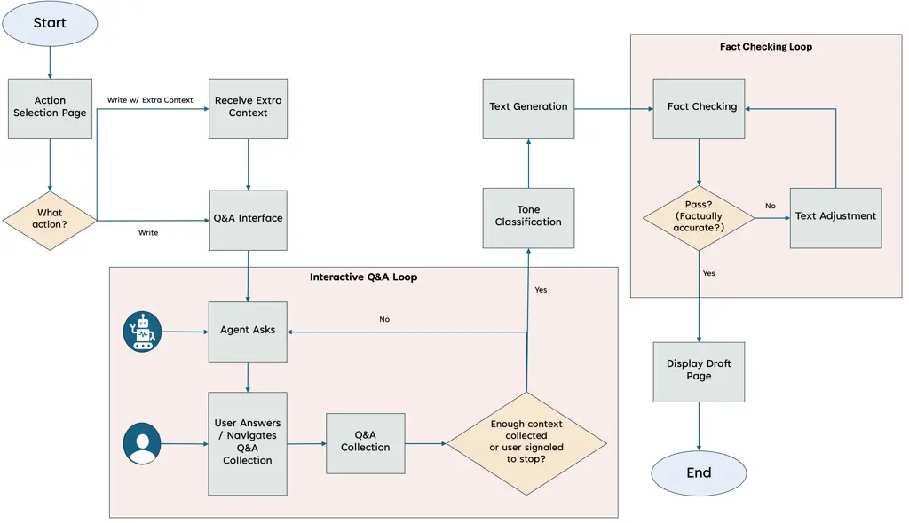

Figure 15. The StepWrite system diagram, illustrating the full
end-to-end workflow. This includes the interactive Q&A loop, tone
classification, text generation, and the fact-checking loop.

This diagram shows the architecture and flow of StepWrite. After
selecting an action (e.g., write or reply), the user enters an
interactive Q&A loop, where the system adaptively collects information
through voice prompts. Once sufficient context is gathered or the user
signals completion, the system classifies tone and generates a draft.
The draft then enters a fact-checking loop for verification and
refinement. Only after passing all checks is the final output displayed.

### F.2. Speech-to-Text (STT) Pipeline

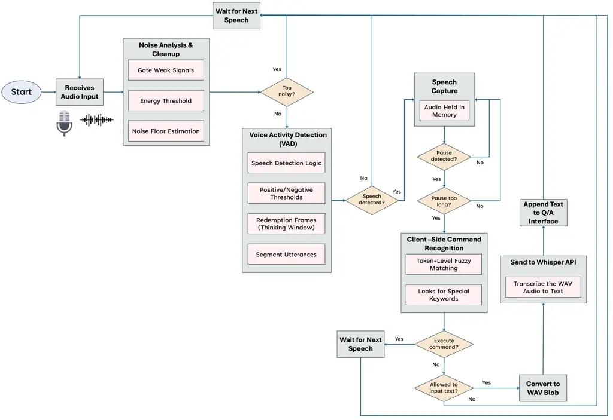

Figure 16. StepWrite’s speech-to-text (STT) pipeline. The system
performs noise filtering, voice activity detection (VAD), client-side
command recognition, and server-side transcription. Only clean,
non-command utterances are forwarded to the Q&A module.

This diagram shows the STT pipeline used by StepWrite. Audio input from
the microphone is first passed through a noise analysis and cleanup
module. Voice activity detection (VAD) then segments valid utterances
using thresholds and pause timing logic. Client-side command recognition
identifies and executes supported macros before transcription. If the
utterance is not a command and input is allowed, the audio is sent to
the Whisper API for transcription. The resulting text is then appended
to the interactive Q&A interface for further processing.

### F.3. Text-to-Speech (TTS) Pipeline

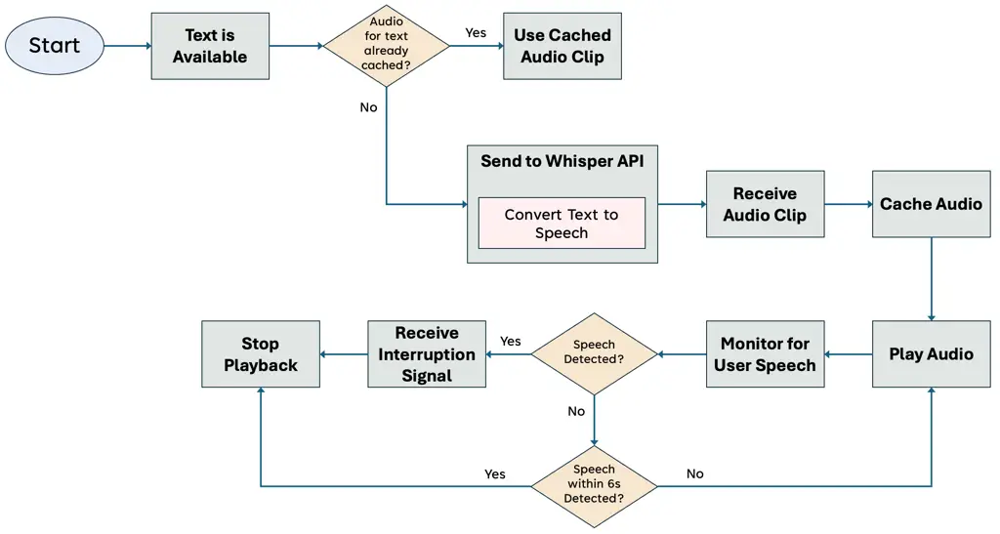

Figure 17. StepWrite’s text-to-speech (TTS) pipeline. The system
converts response text into audio, caches it for reuse, and monitors for
user interruptions during playback to support real-time interaction.

This diagram shows the TTS pipeline used by StepWrite. When text is
available for playback, the system checks whether a corresponding audio
clip has already been cached. If not, it sends the text to a server-side
API for synthesis. The resulting audio is cached and played back to the
user. During playback, the system continuously monitors for speech-based
interruptions, including immediate responses and voice activity within a
6-second window. If an interruption is detected, playback is stopped and
the system resumes listening.
