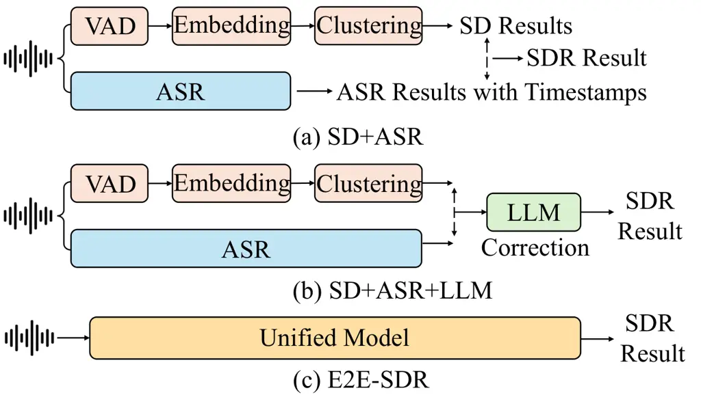
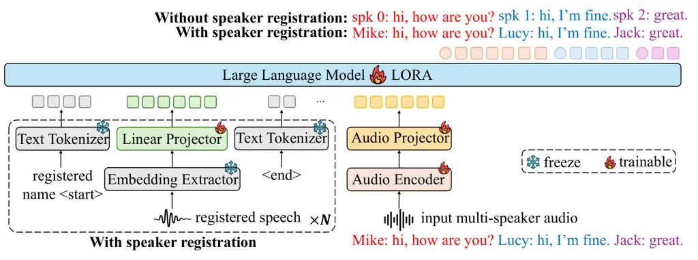
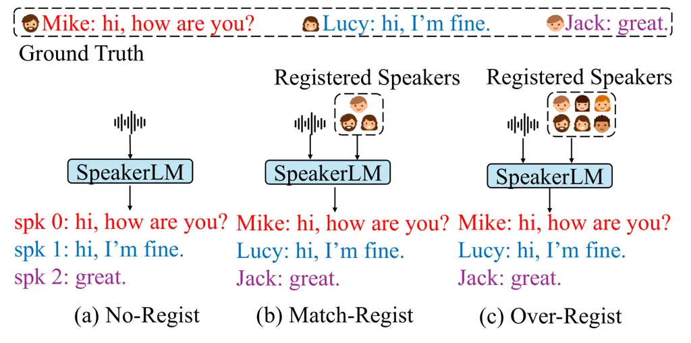

# SpeakerLM: End-to-End Versatile Speaker Diarization and Recognition with Multimodal Large Language Models

Han Yin    Yafeng Chen    Chong Deng    Luyao Cheng    Hui Wang
Affiliation: Chao-Hong Tan, Qian Chen, Wen Wang, Xiangang Li

###### Abstract

The Speaker Diarization and Recognition (SDR) task aims to predict “who
spoke when and what” within an audio clip, which is a crucial task in
various real-world multi-speaker scenarios such as meeting transcription
and dialogue systems. Existing SDR systems typically adopt a cascaded
framework, combining multiple modules such as speaker diarization (SD)
and automatic speech recognition (ASR). The cascaded systems suffer from
several limitations, such as error propagation, difficulty in handling
overlapping speech, and lack of joint optimization for exploring the
synergy between SD and ASR tasks. To address these limitations, we
introduce SpeakerLM, a unified multimodal large language model for SDR
that jointly performs SD and ASR in an end-to-end manner. Moreover, to
facilitate diverse real-world scenarios, we incorporate a flexible
speaker registration mechanism into SpeakerLM, enabling SDR under
different speaker registration settings. SpeakerLM is progressively
developed with a multi-stage training strategy on large-scale real data.
Extensive experiments show that SpeakerLM demonstrates strong data
scaling capability and generalizability, outperforming state-of-the-art
cascaded baselines on both in-domain and out-of-domain public SDR
benchmarks. Furthermore, experimental results show that the proposed
speaker registration mechanism effectively ensures robust SDR
performance of SpeakerLM across diverse speaker registration conditions
and varying numbers of registered speakers.

¹Tongyi Fun Team, Alibaba Group

yinh72906@gmail.com, yfchen97@mail.ustc.edu.cn

Code — https://sites.google.com/view/speakerlm/overview

## 1 Introduction

Speaker Diarization (SD) partitions an audio into homogeneous segments
according to speaker identities, effectively answering “who spoke
when” (Tranter and Reynolds 2006; Anguera et al. 2012; Park et al.
2022). In real-world scenarios such as multi-speaker meetings, knowing
“who spoke when” is insufficient. Associating speaker labels with speech
transcripts is more meaningful, as it addresses the more comprehensive
question of “who spoke when and what” (Gao et al. 2025). We refer to
this task as Speaker Diarization and Recognition (SDR), which jointly
performs SD and Automatic Speech Transcription (ASR) for enriched
conversational understanding.

Conventional SDR systems typically pipeline an SD module and an ASR
module (Raj et al. 2021; Yu et al. 2022; Cornell et al. 2024; Boeddeker
et al. 2024). The SD module segments the audio stream into
speaker-homogeneous regions, which are then aligned with the ASR
outputs, and the speech content for each identified speaker is
transcribed. However, such cascaded systems suffer from several
limitations. First, error propagation is a major concern. Inaccuracies
in SD, such as incorrect speaker boundaries or label assignments, are
passed on to the ASR module, leading to degraded transcription quality
and incorrect speaker-attributed text (Cornell et al. 2023). In
addition, conventional SD systems struggle to handle overlapping speech,
which is common in real-world conversations, resulting in limited
performance (O’Shaughnessy 2025). Furthermore, the cascaded system lacks
joint optimization as ASR and SD modules are usually trained
independently with different datasets and frameworks. The disjoint
training paradigm prevents the SDR system from fully leveraging the
synergy between SD and ASR tasks, limiting the overall SDR performance.

Two main paradigms have been attempted to address these limitations of
cascaded SDR systems. One paradigm, namely Speaker-Attributed ASR
(SA-ASR), jointly trains SD and ASR. As a representative end-to-end
SA-ASR system, SA-Transformer (Liang et al. 2023) incorporates an ASR
encoder and a speaker encoder, and achieves competitive SDR results.
However, SA-ASR systems can only operate under the condition that
pre-extracted speaker embeddings are available. Another paradigm uses
Large Language Models (LLMs) (Wei et al. 2022; Chang et al. 2024) for
post-processing. Due to the disjoint training issue in cascaded SDR
systems, temporal mismatches between the two modules may lead to
word-level diarization errors (Wang et al. 2024). Prior works (Park et
al. 2024; Efstathiadis et al. 2025) explore the strong generalization
and reasoning abilities of LLMs to post-process the outputs of a
cascaded SDR system, refining speaker attributions and correcting
transcription inconsistencies. While such post-hoc adjustments may
improve the overall SDR performance, they are inherently limited by the
quality of the initial SD and ASR outputs, and cannot fully resolve
issues arising from upstream error propagation or misalignment between
modalities. Therefore, how to leverage LLMs not just for post-processing
but as core components in end-to-end SDR systems remains an open
challenge.

To address the limitations of all these prior works, we introduce
SpeakerLM, a multimodal LLM (MLLM) specially designed for end-to-end
SDR. Furthermore, to better handle real-world complex multi-speaker
conversational scenarios, we incorporate a flexible speaker registration
mechanism into SpeakerLM, enabling SpeakerLM to versatilely adapt to
varying levels of speaker information availability in real-world
applications. We propose three different speaker registration
conditions, including cases where prior speaker identities are unknown,
known, and redundant.

Our contributions can be summarized as follows:

- •
  The first MLLM for end-to-end SDR. To the best of our knowledge, our
  SpeakerLM is the first MLLM designed for end-to-end SDR. Specifically,
  we apply an audio encoder and two projectors as the front-end, leading
  to an encoder-projector-LLM architecture tailored for SDR.
- •
  A flexible speaker registration mechanism for versatile SDR. We
  incorporate a flexible speaker registration mechanism into SpeakerLM,
  where the prior speaker embeddings are projected and concatenated with
  audio and text tokens, enabling the model to handle diverse
  multi-speaker scenarios in real-world applications.
- •
  Extensive analysis. To evaluate the effectiveness of SpeakerLM, we
  build various cascaded SDR baselines. Results show that SpeakerLM
  demonstrates strong data scaling capability, outperforming all the
  baselines on both in-domain and out-of-domain public benchmarks.

## 2 Related Work

### 2.1 Speaker Diarization

Traditional speaker diarization frameworks typically consist of multiple
components, including Voice Activity Detection (VAD) to identify speech
segments, speaker embedding extraction to represent speaker
characteristics, and clustering to group speaker embeddings for
identifying speakers. 3D-Speaker (Chen et al. 2025b) is a representative
traditional SD system following this pipeline, and achieves competitive
performance across multiple public benchmarks.

Conventional SD systems struggle with overlapping speech, because VAD is
designed under the assumption of single-speaker segments. One promising
solution to address this issue is to replace the VAD module with a
neural speaker activity detection module, which predicts active speakers
in each time frame (Fujita et al. 2019; Kinoshita et al. 2021b;
Kinoshita et al. 2021a). Along this direction, Pyannote (Bredin et al.
2020; Bredin 2023) achieves strong performance on different datasets.
Based on Pyannote, Diarizen (Han et al. 2025a; Han et al. 2025b)
incorporates representations from the pretrained WavLM model (Chen et
al. 2022) into the neural speaker activity detection module,
outperforming Pyannote on various datasets by providing richer acoustic
information.



Figure 1: Comparison between three different SDR frameworks: (a) SD+ASR
(b) SD+ASR+LLM and (c) E2E-SDR.

### 2.2 Speaker Diarization and Recognition

Figure 1 (a) depicts a conventional SDR system that pipelines SD and ASR
modules (Cornell et al. 2024), denoted as SD+ASR. This pipeline has
several limitations, such as error propagation and lack of joint
optimization. To address these issues, one direction uses LLMs for
post-processing, and another direction jointly models SD and ASR tasks
within a single unified model in an end-to-end manner. As shown in
Figure 1, we denote these two methods by SD+ASR+LLM and E2E-SDR,
respectively.

For E2E-SDR, existing studies typically incorporate pre-extracted
speaker embeddings for all speakers. This framework, also referred to as
SA-ASR (Liang et al. 2023), assumes that the provided speaker embeddings
exactly match the speakers in the ground truth. Consequently, it
struggles to handle mismatched scenarios such as unregistered speakers
or over-registered cases. Our work follows the E2E-SDR paradigm, but is
different from the prior SA-ASR systems. Specifically, we introduce a
more flexible speaker registration mechanism during training, enabling
the model to handle speaker registration inconsistencies effectively.
Compared with the cascaded frameworks, our unified modeling approach
allows for exploring the synergy between SD and ASR tasks and joint
optimization, leading to better alignment between speaker and textual
information.

### 2.3 Multimodal Large Language Model

Recently, integrating audio and text with MLLMs has led to notable
advances in auditory comprehension and reasoning. Representative models,
such as MinMo (Chen et al. 2025a), Qwen2-Audio (Chu et al. 2024) and
Kimi-Audio (Ding et al. 2025), have demonstrated strong capabilities in
audio-text understanding and generation tasks. However, most existing
MLLMs primarily focus on single-speaker scenarios, where they exhibit
strong performance in ASR tasks but leave SD tasks unexplored. More
recently, the Multi-Talker LLM (MT-LLM) has been proposed to handle
multi-speaker ASR (Meng et al. 2025). However, MT-LLM is limited to
detecting speaker change points and do not explicitly tackle speaker
attribution within multi-speaker transcripts.

Based on our review of the literature, SpeakerLM is the first audio-text
MLLM capable of performing SDR, integrating both speech content
understanding and speaker-aware modeling within a unified framework.
Unlike prior works, SpeakerLM goes beyond basic ASR or change-point
detection and explicitly explores the performance of speaker assignment
in multi-speaker transcription tasks.



Figure 2: Overall architecture of the proposed SpeakerLM. When speaker
registration is not performed, each speaker in the transcript is
identified by an anonymous ID. With speaker registration enabled,
speakers are labeled by their actual names.



Figure 3: Overview of the proposed three different speaker registration
mechanisms: (a) No-Regist (no speaker registration) (b) Match-Regist
(exact actual speakers in the audio are pre-registered) (c) Over-Regist
(more speakers are registered than actual speakers in the audio). For
Match- and Over-Regist, speakers are registered in a random order.

## 3 SpeakerLM

### 3.1 Model Architecture

Figure 2 illustrates the overall architecture of SpeakerLM.
Specifically, SpeakerLM integrates a lightweight modality alignment
mechanism into a pre-trained text LLM. For input multi-speaker audio, we
use an audio encoder for encoding, followed by a projector to inject the
audio embedddings into the feature space of the text LLM. For speaker
registration, a frozen text tokenizer is used to tokenize both the
registered speaker’s name and the special markers (i.e., \<start\> and
\<end\>). The registered speaker’s speech is first processed by a frozen
pre-trained embedding extractor to obtain speaker embeddings, which are
then projected by a single linear layer into the LLM backbone.

Audio Encoder and Projector. The audio encoder is initialized with the
pre-trained SenseVoice-large encoder (An et al. 2024), which offers
robust audio representation capabilities and provides strong performance
across various audio understanding tasks such as multilingual speech
recognition and audio event detection. For the audio projector, we use a
randomly initialized two-layer Transformer (Vaswani et al. 2017),
followed by a convolutional neural network layer for dimensional
alignment.

Embedding Extractor and Projector. A pre-trained speaker embedding model
is utilized to extract speaker embeddings, delivering robust and
discriminative representations that are essential for precise speaker
identification and attribution. Specifically, we use an open-source
speaker embedding model ERes2NetV2 (Chen et al. 2024) for embedding
extraction, which has achieved SOTA performance on multiple speaker
verification benchmarks. A single linear layer projector is applied to
the extracted embedding for dimensional alignment.

Large Language Model. We use the pre-trained Qwen2.5-7B-Instruct model
(Team 2024) as the backbone text LLM to benefit from its strong
instruction-following and general language understanding capabilities,
which allows SpeakerLM to effectively handle complex multi-speaker SDR
tasks with different levels of information.

### 3.2 Flexible Speaker Registration Mechanism

As shown in Figure 2, we incorporate a flexible speaker registration
mechanism into SpeakerLM. In order to facilitate real-world scenarios,
we propose three different registration strategies, including No-Regist,
Match-Regist, Over-Regist, as illustrated in Figure 3. Given the number
of speakers in the ground truth as $`N_{gt}`$ and the number of
registered speakers as $`N_{rg}`$, the relationship between these two
values in different registration settings is formulated as follows:

```math
N_{rg}=\begin{cases}0,&\text{if No-Regist}\\
N_{gt},&\text{if Match-Regist}\\
N_{gt}+N_{ov},&\text{if Over-Regist}\end{cases} \tag{1}
```

where $`N_{ov}>0`$ is the number of over-registered speakers.

No-Regist means no speaker registration is performed. This is the
conventional setting for cascade SD systems and applications. We simply
feed multi-speaker audio into the model without providing any prior
information about the speakers. This paradigm is align with the
traditional cascade SDR framework, where each speaker in the output is
represented by a anonymous speaker ID (e.g., spk 0, spk 1, …).

Match-Regist assumes that every speaker appearing in the ground truth
has been registered in advance, same as SA-ASR. The model is required to
correctly assign each speaker to the corresponding name. This setting
closely reflects scenarios where known users are pre-registered, and
personalized outputs (e.g., transcripts with speaker names) are
desirable. For Match-Regist, accurate speaker-name association becomes
essential, and the model must effectively leverage the registered
speaker information for identification.

Over-Regist refers to the case where more speakers are registered than
actually appear in the audio. In this scenario, the model must determine
which registered speakers are not present in the current utterance, and
correctly perform speaker-attributed SDR for the remaining active
speakers. This setup is more challenging than Match-Regist, as the model
must handle redundant speaker information and suppress irrelevant
identities. It also aligns well with practical scenarios, where a large
pool of users may be pre-registered, but only a subset participate in a
given interaction.

Overall, the proposed speaker registration framework allows SpeakerLM to
flexibly perform SDR under different speaker supervision levels, making
it applicable to various practical multi-speaker tasks, from anonymous
transcription to personalized speaker transcription.

### 3.3 Multi-Stage Training Strategy

We apply a four-stage training strategy to progressively enhance the
model’s audio understanding capabilities.

Stage 1. To enhance the ASR performance, we first train SpeakerLM using
only ASR data, leading to an ASR model, denoted by SpeakerLM-ASR. To
efficiently adapt the LLM while preserving its pre-trained language
capabilities, we apply a Low-Rank Adaptation (LoRA) (Hu et al. 2022)
strategy. Following the ASR training setup of MinMo (Chen et al. 2025a),
we sample 600,000 hours of audio from publicly available ASR datasets
for training. In this stage, the speaker embedding extractor and
projector are not included in the model. In the subsequent three stages,
these modules are incorporated into the whole architecture.

Stage 2. We train the randomly initialized projectors using simulated
SDR data while keeping both the LLM and audio encoder frozen, which aims
to rapidly align the audio and text for SDR domain. Training on
simulated data allows the projectors to establish an initial coarse
alignment under a simplified distribution. Compared with real
recordings, the simulated mixtures are created by simply concatenating
utterances from different speakers, without modeling very strong noise
or reverberation.

Stage 3. In the remaining two stages, we use real SDR data for training,
to further adapt the model to practical acoustic conditions and speaker
diversity. In this stage, we jointly fine-tune the audio encoder and the
projectors, while keeping the LLM frozen, which allows the model to
better capture acoustic patterns and characteristics.

Stage 4. Finally, we jointly fine-tune all modules while applying LoRA
to the LLM. This stage enables jointly optimization to better integrate
linguistic and acoustic information in complex multi-speaker SDR tasks.

## 4 Data Composition

### 4.1 Real Data Collection

In this work, we conduct experiments on Mandarin SDR datasets. Overall,
we sample 238.55 hours of audio clips from public corpora for training
and evaluation, covering various real-world multi-speaker scenarios. In
addition, we use 7456.99 hours of in-house data for training and
validation, to further enhance the model performance. Detailed
statistics are summarized in Table 1.

Specifically, the public Alimeeting (Liang et al. 2023) and AISHELL4 (Fu
et al. 2021) datasets are collections of multi-speaker conversation
recordings in meeting rooms, including both far-field overlapping audio
clips and near-field recordings for each speaker. Following previous
works (Han et al. 2025a; Chen et al. 2025b), we use the first channel of
the far-field signals for training and evaluation. The in-house data
contains multi-speaker audio samples recorded in professional studios.
The AISHELL5 dataset (Dai et al. 2025) was recorded using far-field
microphones in a hybrid electric car. The dataset includes diverse
external noise sources such as wind and tire, along with internal noises
from music and air conditioning, making it a more challenging setting
than standard meeting room or studio environments. The dataset has two
official test set splits for ASR and SDR tasks respectively. We use the
first channel of the far-field audio from the SDR test split as the test
set in this work, denoted by AISHELL5-Eval. Notably, AISHELL5-Eval
presents a challenging acoustic condition that is significantly
different from the domains of the training data, hence it is primarily
used to evaluate the out-of-domain SDR performance (generalizability) of
the proposed SpeakerLM.

|                  |              |            |       |
| ---------------- | ------------ | ---------- | ----- |
| Dataset          | Duration (h) | \# Spk     | Usage |
| AliMeeting-Train | 104.75       | 2$`\sim`$4 | Train |
| AISHELL4-Train   | 107.50       | 4$`\sim`$8 | Train |
| In-House-Train   | 7,426.70     | 2$`\sim`$7 | Train |
| In-House-Valid   | 30.29        | 2$`\sim`$7 | Valid |
| AliMeeting-Eval  | 10.00        | 2$`\sim`$4 | Test  |
| AISHELL4-Eval    | 12.72        | 5$`\sim`$7 | Test  |
| AISHELL5-Eval    | 3.58         | 2          | Test  |

Table 1: Statistics of the real SDR data, where “#Spk” denotes the
number of speakers in each recording.

### 4.2 Simulated Data Creation

As described in Section 3.3, we apply a four-stage training strategy to
train SpeakerLM. In the second stage, we use simulated data for quickly
training the projectors and audio-text alignment. Specifically, we use
the near-field speech samples from AliMeeting-Train, AISHELL2 (Du et al.
2018), Librispeech (Panayotov et al. 2015) and In-House-Train for SDR
data simulation. The near-field speech samples are randomly mixed to
simulate multi-speaker conversation segments, with each segment lasting
50 seconds and containing 2 to 4 speakers. Following previous
work (Landini et al. 2022), we randomly add real-world noises and
reverberations to the clean speech samples, with signal-to-noise ratios
(SNRs) uniformly sampled from \[10dB, 20dB\]. In total, the simulated
data comprise 5,000 hours audio samples for training and 5.6 hours for
evaluation; the test split is denoted by Simulation-Test.

## 5 Experiments

### 5.1 Implementation Details

The majority of audio samples are recorded at 16 kHz and any samples
with a different sampling rate are resampled to 16 kHz to ensure
uniformity. Recordings are randomly split into clips ranging from 40 to
50 seconds in duration to train and test SpeakerLM. For speaker
registration, the speech of the registered speaker is segmented into
2-10 seconds clips for embedding extraction, and the corresponding
embeddings are averaged to generate a single representative speaker
embedding. For Over-Regist, the number of over-registered speakers
(i.e., $`N_{ov}`$ in Eq. 1) uniformly ranges from 1 to 50 during
training.

We use the AdamW (Zhou et al. 2024) optimizer for optimization. The
learning rate is initially set to 1e-5, linearly increased to 5e-5
during the warm-up phase, and then gradually decayed following a cosine
schedule. We use a dynamic batching strategy, adjusting the number of
samples per batch based on their length, with a maximum token limit of
6K to balance efficiency and memory usage. Models are trained on 4
NVIDIA A800 GPUs for 1M steps at each stage, with a validation step of
10K. The training pseudocode and the specific prompts used for LLMs are
presented in code page.

|                            |        |          |                   |                     |                                 |                   |                     |                                 |                   |                     |                                 |
| -------------------------- | ------ | -------- | ----------------- | ------------------- | ------------------------------- | ----------------- | ------------------- | ------------------------------- | ----------------- | ------------------- | ------------------------------- |
| System                     | Params | \#Models | Alimeeting-Eval   |                     |                                 | AISHELL4-Eval     |                     |                                 | AISHELL5-Eval     |                     |                                 |
|                            |        |          | CER$`\downarrow`$ | cpCER$`\downarrow`$ | $`\Delta\textrm{cp}\downarrow`$ | CER$`\downarrow`$ | cpCER$`\downarrow`$ | $`\Delta\textrm{cp}\downarrow`$ | CER$`\downarrow`$ | cpCER$`\downarrow`$ | $`\Delta\textrm{cp}\downarrow`$ |
| SD+ASR                     |        |          |                   |                     |                                 |                   |                     |                                 |                   |                     |                                 |
| 3D-Speaker+Para            | 70M    | 4        | 21.30             | 24.94               | 3.64                            | 23.02             | 26.01               | 2.99                            | 60.16             | 64.12               | 3.96                            |
| Pyannote+Para              | 70M    | 4        | 21.30             | 24.45               | 3.15                            | 23.02             | 28.22               | 5.20                            | 60.16             | 68.37               | 8.21                            |
| DiariZen-base+Para         | 95M    | 4        | 21.30             | 23.97               | 2.67                            | 23.02             | 27.27               | 4.25                            | 60.16             | 66.89               | 6.73                            |
| DiariZen-large+Para        | 140M   | 4        | 21.30             | 23.20               | 1.90                            | 23.02             | 25.78               | 2.76                            | 60.16             | 61.81               | 1.65                            |
| SD+ASR+LLM                 |        |          |                   |                     |                                 |                   |                     |                                 |                   |                     |                                 |
| ChatGPT4.5 (z.s.)          | \-     | 5        | 30.63             | 38.64               | 8.01                            | 33.02             | 39.21               | 6.19                            | 67.34             | 79.05               | 11.71                           |
| Qwen2.5-7B-Instruct (z.s.) | 7B     | 5        | 40.10             | 51.01               | 10.91                           | 33.92             | 44.16               | 10.24                           | 65.67             | 73.30               | 7.63                            |
| Qwen2.5-7B-Instruct (f.t.) | 7B     | 5        | 21.38             | 22.65               | 1.27                            | 23.05             | 24.93               | 1.88                            | 60.17             | 61.63               | 1.46                            |
| E2E-SDR                    |        |          |                   |                     |                                 |                   |                     |                                 |                   |                     |                                 |
| SpeakerLM-ASR              | 7B     | 1        | 20.98             | \-                  | \-                              | 18.02             | \-                  | \-                              | 55.50             | \-                  | \-                              |
| SpeakerLM (212.25h)        | 7B     | 1        | 18.63             | 32.22               | 13.59                           | 17.75             | 26.14               | 8.39                            | 48.40             | 64.96               | 16.56                           |
| SpeakerLM (694.06h)        | 7B     | 1        | 18.14             | 29.60               | 11.46                           | 17.48             | 25.28               | 7.80                            | 48.39             | 54.81               | 6.42                            |
| SpeakerLM (2,269.57h)      | 7B     | 1        | 17.32             | 27.97               | 10.65                           | 17.32             | 23.10               | 5.78                            | 47.78             | 50.04               | 2.26                            |
| SpeakerLM (7,638.95h)      | 7B     | 1        | 13.97             | 16.05               | 2.08                            | 17.17             | 18.37               | 1.20                            | 47.24             | 47.81               | 0.57                            |

Table 2: The performance of our SpeakerLM (with different amounts of
training data) and the baselines on the in-domain AliMeeting-Eval,
AISHELL4-Eval, and the out-of-domain AISHELL5-Eval set. The best results
are boldfaced. For SD+ASR+LLM, we use DiariZen-large+Para as the SD+ASR
front-end, where “z.s.” is “zero shot” and “f.t.” is “fine-tune”. All
SpeakerLM variants are evaluated under the No-Regist condition.
“#Models” represents the number of models included.

### 5.2 Evaluation Setups

Evaluation Metrics. We evaluate the SDR performance on the commonly used
publicly available benchmarks, namely, the in-domain AliMeeting-Eval and
AISHELL4-Eval, and the out-of-domain AISHELL5-Eval. Following previous
works (Liang et al. 2023; Wang et al. 2024; Dai et al. 2025), we use
Character Error Rate (CER), concatenated minimum permutation CER
(cpCER), $`\Delta\textrm{cp}`$, speaker-attributed CER (saCER), and
$`\Delta\textrm{sa}`$ as evaluation metrics.

CER measures ASR performance by comparing the predicted transcripts
against the ground-truth text, ignoring speaker identities. In contrast,
cpCER and saCER jointly evaluate both ASR and SD, calculated by
comparing the predicted speaker-attributed transcripts against the
ground-truth transcripts assigned to each speaker, hence reflecting the
overall system performance for the SDR task. Specifically, for the
no-speaker-registration scenario, cpCER is computed after conducting the
speaker alignment between the reference and predicted speaker-attributed
transcripts through minimum edit distance, which finds the optimal
permutation of speaker labels to minimize the CER. For the
registered-speaker scenario where speaker identities are known in
advance, saCER is computed by directly aligning the predicted and
reference transcripts based on speaker names, without performing
permutation search. $`\Delta\textrm{cp}`$ denotes the difference between
cpCER and CER:

```math
\Delta\textrm{cp}=\textrm{cpCER}-\textrm{CER} \tag{2}
```

$`\Delta\textrm{cp}`$ reflects the performance drop due to speaker
attribution errors, hence serving as a measure of the SD performance.
Similarly, $`\Delta\textrm{sa}`$ is calculated as:

```math
\Delta\textrm{sa}=\textrm{saCER}-\textrm{CER} \tag{3}
```

All metrics are measured in percentage. Lower values represent better
performance. We use cpCER and saCER as the primary metrics since they
provide a comprehensive measure of both SD and ASR performance.

Baseline Systems. Figure 1 depicts three different frameworks for SDR,
i.e., SD+ASR, SD+ASR+LLM, and E2E-SDR. The proposed SpeakerLM belongs to
the E2E-SDR paradigm, where a unified model is applied for all tasks in
an end-to-end manner. We build four baseline systems for the SD+ASR
paradigm using SOTA open-source models, and apply competitive
pre-trained LLMs to correct the outputs from SD+ASR systems, leading to
three different SD+ASR+LLM baselines.

For the SD+ASR paradigm, we use Paraformer-large (Gao et al. 2022) as
the ASR module, which was pre-trained on 60K hours of audio data and
achieves SOTA performance on various Mandarin ASR benchmarks. For the SD
module, we apply four SOTA open-source SD toolkits, including 3D-Speaker
(Chen et al. 2025b), Pyannote 3.1 (Bredin 2023), Diarizen-base (Han et
al. 2025a), and Diarizen-large (Han et al. 2025b). Among the four SD
models, 3D-Speaker and Diarizen-large have achieved SOTA performance on
different benchmarks, while Pyannote 3.1 and Diarizen-base demonstrate
competitive performance. By combining the four SD systems with
Paraformer-large, we obtain four SD+ASR baseline systems, namely,
3D-Speaker+Para, Pyannote+Para, Diarizen-base+Para, and
Diarizen-large+Para.

SD+ASR+LLM refers to a pipeline where a text LLM is used to correct the
outputs from the SD+ASR system. For SD+ASR+LLM baselines, prior works
using a text LLM for SD+ASR correction are mainly based on English
datasets (Wang et al. 2024; Park et al. 2024; Efstathiadis et al. 2025).
Following the paradigm, we adapt Qwen2.5-7B-Instruct (Team 2024) and
ChatGPT4.5 (Singh 2025) for correction. We first evaluate their
zero-shot performance (z.s.) using prompts following prior
work (Efstathiadis et al. 2025), then fine-tune Qwen2.5-7B-Instruct
(f.t.) on our training datasets for SD+ASR correction.

### 5.3 Performance without Speaker Registration

We first evaluate the performance of SpeakerLM without speaker
registration, where each speaker in the prediction results is
represented by an anonymous ID.

Figure 4: The performance of SpeakerLM on test sets under No-Regist
condition across different training stages.

Comparison with Baselines. Table 2 compares our SpeakerLM and the
baselines under No-Regist condition on various test sets. For SD+ASR
with four models included, Diarizen-large+Para achieves the best
performance. Compared to 3D-Speaker, both Pyannote and Diarizen employ a
neural speaker activity prediction model to replace the VAD module,
enabling more effective handling of overlapping speech. Building upon
the Pyannote pipeline, Diarizen series further enhances the SD
performance by incorporating acoustic features from the pre-trained
WavLM model.

For SD+ASR+LLM baselines pipelined with five models, we incorporate a
pre-trained text LLM to correct the mis-assigned speaker labels in the
results from the best SD+ASR system (i.e., Diarizen-large+Para). Results
show that both Qwen2.5-7B-Instruct and ChatGPT-4.5 perform poorly in
zero-shot SDR correction, even degrading the overall performance. This
finding is consistent with observations in prior works (Park et al.
2024; Efstathiadis et al. 2025). This is mainly due to hallucination of
LLMs: despite that we explicitly instruct the LLM to only modify speaker
labels, the LLM often alters the content of the speakers’ utterances,
leading to a significant increase in CER. Finetuning Qwen2.5-7B-Instruct
substantially mitigates the hallucination problem, leading to slight SDR
performance improvement over Diarizen-large+Para.

Different from the cascaded architectures of SD+ASR and SD+ASR+LLM, the
proposed SpeakerLM is a unified E2E-SDR model that jointly performs
speaker diarization and recognition. To explore how much SpeakerLM
benefits from the ASR training stage, we first report the CER of
SpeakerLM-ASR, which is trained on the ASR data mentioned in
Section 3.3. Compared with Paraformer-large, SpeakerLM-ASR is trained on
a larger ASR dataset and thus achieves lower CER across all test sets,
which naturally contributes to a lower cpCER for SpeakerLM. However, it
should be noted that $`\Delta\textrm{cp}`$ is not affected by the
model’s ASR performance, which serves as a reliable metric for
evaluating the speaker attribution performance.

Initializing SpeakerLM by SpeakerLM-ASR, we conduct the following
training with different scales of SDR data, ranging from 212.25 hours
(Alimeeting-Train+AISHELL4-Train) to 7,638.95 hours. Results show that
when trained on a limited amount of SDR data, SpeakerLM falls behind
most cascaded baselines. However, as the training data scale up,
SpeakerLM demonstrates a strong data scaling capability, with
substantial improvements in cpCER and $`\Delta\textrm{cp}`$. Moreover,
we observe that the improvements on CER are marginal. This is because
the in-house data mainly consists of near-field recordings, which offer
limited ASR gains for far-field speech with reverberation. With 7,638.95
hours training data, SpeakerLM significantly outperforms all baselines.
In terms of cpCER, SpeakerLM achieves absolute improvements of 6.60%,
6.56%, and 13.82% over the strongest cascaded system on AliMeeting-Eval,
AISHELL-4-Eval, and AISHELL-5-Eval, respectively. Notably, SpeakerLM
also achieves superior performance on the out-of-domain and challenging
test set, AISHELL5-Eval, with a $`\Delta\textrm{cp}`$ of 0.57,
indicating strong robustness and generalizability of SpeakerLM to unseen
and noisy acoustic environments.

Impact of Multi-Stage Training. Figure 4 illustrates the performance of
SpeakerLM across the proposed four different training stages
(Section 3.3). On both Alimeeting-Eval and Simulation-Test, the
performance of SpeakerLM improves progressively, demonstrating the
effectiveness of the proposed multi-stage training strategy. However, on
AISHELL4-Eval and AISHELL5-Eval, CERs at Stage 2 are higher than those
at Stage 1. This is because Stage 2 relies on simulated data, while the
simulation process does not incorporate any audio data from these two
datasets, leading to a domain mismatch. With four training stages,
SpeakerLM demonstrates strong generalizability on the out-of-domain test
set, i.e, AISHELL5-Eval. This suggests that the subsequent training
stages (Stage 3 and Stage 4), which involve fine-tuning on more
realistic and diverse meeting-style data, are crucial for mitigating
domain mismatch and enhancing the model’s robustness across different
evaluation scenarios. In addition, the ASR performance on simulated data
is consistently better than that on real data, which is attributed to
the simplicity of the simulated data. Nevertheless, we believe the
simulation process remains meaningful, as it closely resembles office or
workplace scenarios where a voice assistant is used to record meetings.

Figure 5: The saCER of SpeakerLM under Over-Regist condition with
different numbers of over-registered speakers.

### 5.4 Performance with Speaker Registration

In this section, we explore the SDR performance of SpeakerLM with
different numbers of registered speakers.

Match-Regist vs Over-Regist. In Table 3, we first present the
performance of SpeakerLM and SA-Transformer on AliMeeting-Eval. Results
show that SpeakerLM outperforms SA-Transformer, achieving a 25.98%
absolute improvement in saCER. Then, we compare the performance of
SpeakerLM under different conditions. For Over-Regist, $`N_{ov}`$
randomly ranges from 1 to 50, consistent with the training setup. In
terms of CER and cpCER, SpeakerLM shows comparable performance across
the two registration mechanisms. However, for $`\Delta{\textrm{sa}}`$,
the metrics are consistently lower under the Match-Regist setting,
suggesting that the presence of redundant registered speakers introduces
unnecessary information, negatively affecting the SD performance.

|                 |                         |       |       |                       |
| --------------- | ----------------------- | ----- | ----- | --------------------- |
| Dataset         | System (RM)             | CER   | saCER | $`\Delta\textrm{sa}`$ |
| Alimeeting-Eval | SA-Transformer (MR)^(∗) | \-    | 41.55 | \-                    |
|                 | SpeakerLM (MR)          | 13.98 | 15.57 | 1.59                  |
|                 | SpeakerLM (OR)          | 13.96 | 15.71 | 1.75                  |
| AISHELL4-Eval   | SpeakerLM (MR)          | 17.13 | 19.73 | 2.60                  |
|                 | SpeakerLM (OR)          | 17.15 | 20.16 | 3.01                  |
| AISHELL5-Eval   | SpeakerLM (MR)          | 47.05 | 47.36 | 0.31                  |
|                 | SpeakerLM (OR)          | 46.69 | 47.35 | 0.66                  |

\* Due to the lack of an open-source implementation, we adapt the
reported results from the original work for comparison.

Table 3: The performance of different systems on AliMeeting-Eval,
AISHELL4-Eval and AISHELL5-Eval. “RM”, “MR” and “OV” represent “Register
Mode”, “Match-Regist” and “Over-Regist”, respectively.

Impact of the Number of Over-Registered Speakers. Figure 5 explores the
impact of the number of over-registered speakers (i.e., $`N_{ov}`$) on
model performance. We do not observe significant performance degradation
as $`N_{ov}`$ increases. This reflects SpeakerLM’s robustness to
redundant speaker identities and the ability to focus on relevant
speaker representations during inference.

### 5.5 Impact of Embedding Extractors

In the experiments above, we adopt ERes2NetV2 as the speaker embedding
extractor. To investigate the impact of the speaker embeddings, we
replace ERes2NetV2 with another speaker embedding model, i.e., CAM++
(Wang et al. 2023), for training and test. It should be noted that
ERes2NetV2 performs better than CAM++ in various speaker verification
benchmarks (Chen et al. 2025b). Results in Table 4 show that SpeakerLM
using embeddings from ERes2NetV2 outperforms the variant with CAM++,
indicating that improvements in the speaker embedding model can further
enhance the overall performance of SpeakerLM.

|               |            |       |       |       |
| ------------- | ---------- | ----- | ----- | ----- |
| Register Mode | Extractor  | CER   | cpCER | saCER |
| No-Regist     | CAM++      | 14.63 | 16.74 | \-    |
|               | ERes2NetV2 | 13.97 | 16.05 | \-    |
| Match-Regist  | CAM++      | 14.74 | \-    | 17.23 |
|               | ERes2NetV2 | 13.98 | \-    | 15.57 |
| Over-Regist   | CAM++      | 14.71 | \-    | 16.92 |
|               | ERes2NetV2 | 13.96 | \-    | 15.71 |

Table 4: The performance of SpeakerLM on AliMeeting-Eval with different
embedding extractors.

## 6 Conclusions

In this work, we present SpeakerLM, the first MLLM designed for
end-to-end SDR. We introduce a flexible registration mechanism into
SpeakerLM, enabling the model to perform SDR with different numbers of
registered speakers. Compared with strong cascaded baselines built from
SOTA SD and ASR models, SpeakerLM achieves superior performance on both
in-domain and out-of-domain test sets. This work demonstrates the
potential of MLLMs to model SDR in a scalable, data-driven, and
autoregressive manner.

## References

- An et al. (2024) K. An, Q. Chen, C. Deng, Z. Du, C. Gao, Z. Gao, Y.
  Gu, T. He, H. Hu, K. Hu, et al. FunAudioLLM: voice understanding and
  generation foundation models for natural interaction between humans
  and llms. CoRR. Cited by: §3.1.
- Anguera et al. (2012) X. Anguera, S. Bozonnet, N. Evans, C.
  Fredouille, G. Friedland, and O. Vinyals Speaker diarization: a review
  of recent research. IEEE Transactions on audio, speech, and language
  processing 20 (2), pp. 356–370. Cited by: §1.
- Boeddeker et al. (2024) C. Boeddeker, A. S. Subramanian, G.
  Wichern, R. Haeb-Umbach, and J. Le Roux TS-sep: joint diarization and
  separation conditioned on estimated speaker embeddings. IEEE/ACM
  Transactions on Audio, Speech, and Language Processing 32,
  pp. 1185–1197. Cited by: §1.
- Bredin et al. (2020) H. Bredin, R. Yin, J. M. Coria, G. Gelly, P.
  Korshunov, M. Lavechin, D. Fustes, H. Titeux, W. Bouaziz, and M. Gill
  Pyannote. audio: neural building blocks for speaker diarization. In
  IEEE International conference on acoustics, speech and signal
  processing (ICASSP), pp. 7124–7128. Cited by: §2.1.
- Bredin (2023) H. Bredin Pyannote. audio 2.1 speaker diarization
  pipeline: principle, benchmark, and recipe. In Proc. Interspeech 2023,
  pp. 1983–1987. Cited by: §2.1, §5.2.
- Chang et al. (2024) Y. Chang, X. Wang, J. Wang, Y. Wu, L. Yang, K.
  Zhu, H. Chen, X. Yi, C. Wang, Y. Wang, et al. A survey on evaluation
  of large language models. ACM transactions on intelligent systems and
  technology 15 (3), pp. 1–45. Cited by: §1.
- Chen et al. (2025a) Q. Chen, Y. Chen, Y. Chen, M. Chen, Y. Chen, C.
  Deng, Z. Du, R. Gao, C. Gao, Z. Gao, et al. Minmo: a multimodal large
  language model for seamless voice interaction. arXiv preprint
  arXiv:2501.06282. Cited by: §2.3, §3.3.
- Chen et al. (2022) S. Chen, C. Wang, Z. Chen, Y. Wu, S. Liu, Z.
  Chen, J. Li, N. Kanda, T. Yoshioka, X. Xiao, et al. Wavlm: large-scale
  self-supervised pre-training for full stack speech processing. IEEE
  Journal of Selected Topics in Signal Processing 16 (6), pp. 1505–1518.
  Cited by: §2.1.
- Chen et al. (2024) Y. Chen, S. Zheng, H. Wang, L. Cheng, Q. Chen, S.
  Zhang, and J. Li ERes2NetV2: boosting short-duration speaker
  verification performance with computational efficiency. In Proc.
  Interspeech 2024, pp. 3245–3249. Cited by: §3.1.
- Chen et al. (2025b) Y. Chen, S. Zheng, H. Wang, L. Cheng, T. Zhu, R.
  Huang, C. Deng, Q. Chen, S. Zhang, W. Wang, et al. 3D-speaker-toolkit:
  an open-source toolkit for multimodal speaker verification and
  diarization. In IEEE International Conference on Acoustics, Speech and
  Signal Processing (ICASSP), pp. 1–5. Cited by: §2.1, §4.1, §5.2, §5.5.
- Chu et al. (2024) Y. Chu, J. Xu, Q. Yang, H. Wei, X. Wei, Z. Guo, Y.
  Leng, Y. Lv, J. He, J. Lin, et al. Qwen2-audio technical report. arXiv
  preprint arXiv:2407.10759. Cited by: §2.3.
- Cornell et al. (2024) S. Cornell, J. Jung, S. Watanabe, and S.
  Squartini One model to rule them all? towards end-to-end joint speaker
  diarization and speech recognition. In IEEE International Conference
  on Acoustics, Speech and Signal Processing (ICASSP), pp. 11856–11860.
  Cited by: §1, §2.2.
- Cornell et al. (2023) S. Cornell, M. S. Wiesner, S. Watanabe, D.
  Raj, X. Chang, P. Garcia, Y. Masuyam, Z. Wang, S. Squartini, and S.
  Khudanpur The chime-7 dasr challenge: distant meeting transcription
  with multiple devices in diverse scenarios. In Proc. CHiME 2023,
  pp. 1–6. Cited by: §1.
- Dai et al. (2025) Y. Dai, H. Wang, X. Li, Z. Zhang, S. Wang, L.
  Xie, X. Xu, H. Guo, S. Zhang, H. Bu, et al. AISHELL-5: the first
  open-source in-car multi-channel multi-speaker speech dataset for
  automatic speech diarization and recognition. arXiv preprint
  arXiv:2505.23036. Cited by: §4.1, §5.2.
- Ding et al. (2025) D. Ding, Z. Ju, Y. Leng, S. Liu, T. Liu, Z.
  Shang, K. Shen, W. Song, X. Tan, H. Tang, et al. Kimi-audio technical
  report. arXiv preprint arXiv:2504.18425. Cited by: §2.3.
- Du et al. (2018) J. Du, X. Na, X. Liu, and H. Bu Aishell-2:
  transforming mandarin asr research into industrial scale. arXiv
  preprint arXiv:1808.10583. Cited by: §4.2.
- Efstathiadis et al. (2025) G. Efstathiadis, V. Yadav, and A. Abbas
  LLM-based speaker diarization correction: a generalizable approach.
  Speech Communication 170, pp. 103224. Cited by: §1, §5.2, §5.3.
- Fu et al. (2021) Y. Fu, L. Cheng, S. Lv, Y. Jv, Y. Kong, Z. Chen, Y.
  Hu, L. Xie, J. Wu, H. Bu, et al. AISHELL-4: an open source dataset for
  speech enhancement, separation, recognition and speaker diarization in
  conference scenario. In Proc. Interspeech, pp. 3665–3669. Cited by:
  §4.1.
- Fujita et al. (2019) Y. Fujita, N. Kanda, S. Horiguchi, Y. Xue, K.
  Nagamatsu, and S. Watanabe End-to-end neural speaker diarization with
  self-attention. In IEEE Automatic Speech Recognition and Understanding
  Workshop (ASRU), pp. 296–303. Cited by: §2.1.
- Gao et al. (2025) M. Gao, S. Wu, H. Chen, J. Du, C. Lee, S.
  Watanabe, J. Chen, S. S. Marco, and O. Scharenborg The multimodal
  information based speech processing (misp) 2025 challenge:
  audio-visual diarization and recognition. arXiv preprint
  arXiv:2505.13971. Cited by: §1.
- Gao et al. (2022) Z. Gao, S. Zhang, I. McLoughlin, and Z. Yan
  Paraformer: fast and accurate parallel transformer for
  non-autoregressive end-to-end speech recognition. In Proc.
  Interspeech, pp. 2063–2067. Cited by: §5.2.
- Han et al. (2025a) J. Han, F. Landini, J. Rohdin, A. Silnova, M. Diez,
  and L. Burget Leveraging self-supervised learning for speaker
  diarization. In IEEE International Conference on Acoustics, Speech and
  Signal Processing (ICASSP), pp. 1–5. Cited by: §2.1, §4.1, §5.2.
- Han et al. (2025b) J. Han, F. Landini, J. Rohdin, A. Silnova, M.
  Diez, J. Cernocky, and L. Burget Fine-tune before structured pruning:
  towards compact and accurate self-supervised models for speaker
  diarization. Proc. Interspeech 2025. Cited by: §2.1, §5.2.
- Hu et al. (2022) E. J. Hu, Y. Shen, P. Wallis, Z. Allen-Zhu, Y. Li, S.
  Wang, L. Wang, W. Chen, et al. Lora: low-rank adaptation of large
  language models.. ICLR 1 (2), pp. 3. Cited by: §3.3.
- Kinoshita et al. (2021a) K. Kinoshita, M. Delcroix, and N. Tawara
  Advances in integration of end-to-end neural and clustering-based
  diarization for real conversational speech. In Proc. Interspeech 2021,
  pp. 3565–3569. Cited by: §2.1.
- Kinoshita et al. (2021b) K. Kinoshita, M. Delcroix, and N. Tawara
  Integrating end-to-end neural and clustering-based diarization:
  getting the best of both worlds. In IEEE International Conference on
  Acoustics, Speech and Signal Processing (ICASSP), pp. 7198–7202. Cited
  by: §2.1.
- Landini et al. (2022) F. Landini, A. Lozano-Diez, M. Diez, and L.
  Burget From simulated mixtures to simulated conversations as training
  data for end-to-end neural diarization. In Proc. Interspeech,
  pp. 5095–5099. Cited by: §4.2.
- Liang et al. (2023) Y. Liang, M. Shi, F. Yu, Y. Li, S. Zhang, Z.
  Du, Q. Chen, L. Xie, Y. Qian, J. Wu, et al. The second multi-channel
  multi-party meeting transcription challenge (m2met 2.0): a benchmark
  for speaker-attributed asr. In IEEE Automatic Speech Recognition and
  Understanding Workshop, ASRU, pp. 10389625. Cited by: §1, §2.2, §4.1,
  §5.2.
- Meng et al. (2025) L. Meng, S. Hu, J. Kang, Z. Li, Y. Wang, W. Wu, X.
  Wu, X. Liu, and H. Meng Large language model can transcribe speech in
  multi-talker scenarios with versatile instructions. In ICASSP
  2025-2025 IEEE International Conference on Acoustics, Speech and
  Signal Processing (ICASSP), pp. 1–5. Cited by: §2.3.
- O’Shaughnessy (2025) D. O’Shaughnessy Speaker diarization: a review of
  objectives and methods. Applied Sciences 15 (4), pp. 2002. Cited by:
  §1.
- Panayotov et al. (2015) V. Panayotov, G. Chen, D. Povey, and S.
  Khudanpur Librispeech: an asr corpus based on public domain audio
  books. In International Conference on Acoustics, Speech and Signal
  Processing (ICASSP), pp. 5206–5210. Cited by: §4.2.
- Park et al. (2024) T. J. Park, K. Dhawan, N. Koluguri, and J. Balam
  Enhancing speaker diarization with large language models: a contextual
  beam search approach. In IEEE International Conference on Acoustics,
  Speech and Signal Processing (ICASSP), pp. 10861–10865. Cited by: §1,
  §5.2, §5.3.
- Park et al. (2022) T. J. Park, N. Kanda, D. Dimitriadis, K. J. Han, S.
  Watanabe, and S. Narayanan A review of speaker diarization: recent
  advances with deep learning. Computer Speech & Language 72,
  pp. 101317. Cited by: §1.
- Raj et al. (2021) D. Raj, P. Denisov, Z. Chen, H. Erdogan, Z.
  Huang, M. He, S. Watanabe, J. Du, T. Yoshioka, Y. Luo, et al.
  Integration of speech separation, diarization, and recognition for
  multi-speaker meetings: system description, comparison, and analysis.
  In IEEE spoken language technology workshop (SLT), pp. 897–904. Cited
  by: §1.
- Singh (2025) A. Singh Consequences of the turing test: openai’s
  gpt-4.5. Available at SSRN 5205937. Cited by: §5.2.
- Team (2024) Q. Team Qwen2.5: a party of foundation models. External
  Links: [Link](https://qwenlm.github.io/blog/qwen2.5/) Cited by: §3.1,
  §5.2.
- Tranter and Reynolds (2006) S. E. Tranter and D. A. Reynolds An
  overview of automatic speaker diarization systems. IEEE Transactions
  on audio, speech, and language processing 14 (5), pp. 1557–1565. Cited
  by: §1.
- Vaswani et al. (2017) A. Vaswani, N. Shazeer, N. Parmar, J.
  Uszkoreit, L. Jones, A. N. Gomez, Ł. Kaiser, and I. Polosukhin
  Attention is all you need. Advances in neural information processing
  systems 30. Cited by: §3.1.
- Wang et al. (2023) H. Wang, S. Zheng, Y. Chen, L. Cheng, and Q. Chen
  CAM++: a fast and efficient network for speaker verification using
  context-aware masking. In Proc. Interspeech 2023, pp. 5301–5305. Cited
  by: §5.5.
- Wang et al. (2024) Q. Wang, Y. Huang, G. Zhao, E. Clark, W. Xia,
  and H. Liao DiarizationLM: speaker diarization post-processing with
  large language models. CoRR. Cited by: §1, §5.2, §5.2.
- Wei et al. (2022) J. Wei, Y. Tay, R. Bommasani, C. Raffel, B. Zoph, S.
  Borgeaud, D. Yogatama, M. Bosma, D. Zhou, D. Metzler, et al. Emergent
  abilities of large language models. Transactions on Machine Learning
  Research. Cited by: §1.
- Yu et al. (2022) F. Yu, S. Zhang, P. Guo, Y. Fu, Z. Du, S. Zheng, W.
  Huang, L. Xie, Z. Tan, D. Wang, et al. Summary on the icassp 2022
  multi-channel multi-party meeting transcription grand challenge. In
  IEEE International Conference on Acoustics, Speech and Signal
  Processing (ICASSP), pp. 9156–9160. Cited by: §1.
- Zhou et al. (2024) P. Zhou, X. Xie, Z. Lin, and S. Yan Towards
  understanding convergence and generalization of adamw. IEEE
  transactions on pattern analysis and machine intelligence. Cited by:
  §5.1.
