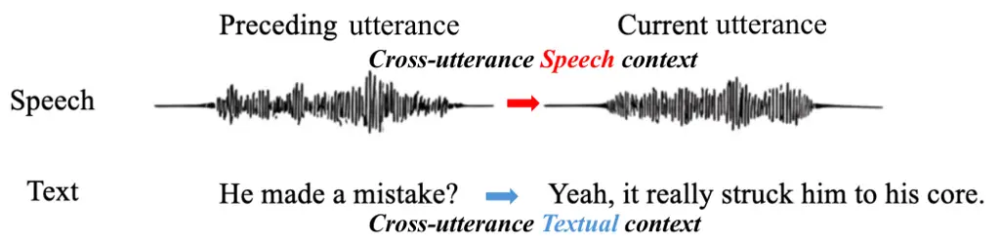
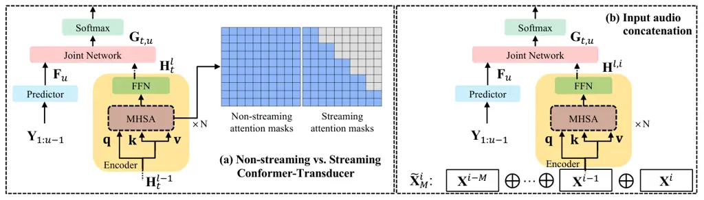
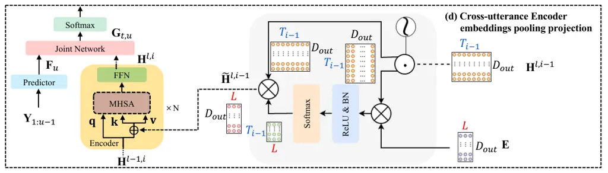
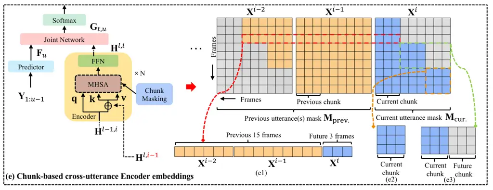
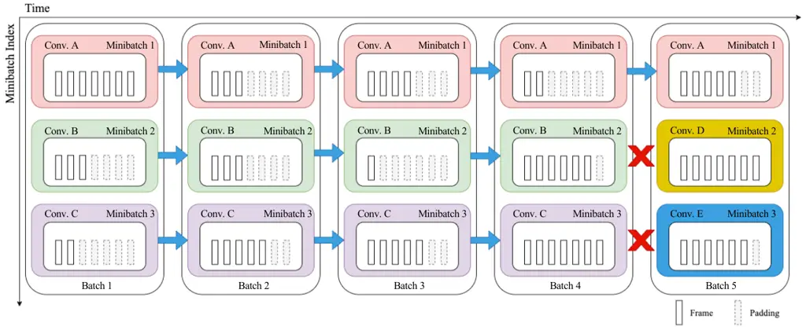
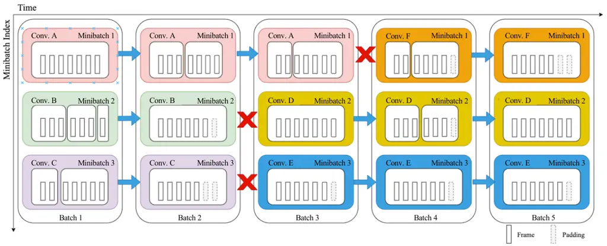
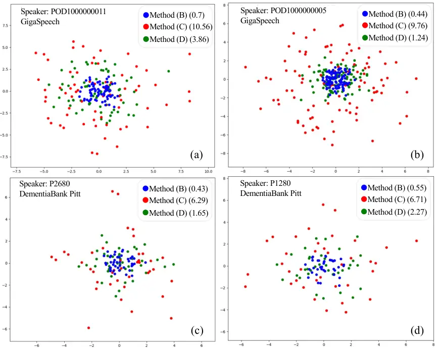

# Exploring Cross-Utterance Speech Contexts for Conformer-Transducer Speech Recognition Systems

Mingyu Cui    Mengzhe Geng    Jiajun Deng    Chengxi Deng    Jiawen Kang
   Shujie Hu    Guinan Li    Tianzi Wang    Zhaoqing Li    Xie Chen   
Xunying Liu ^(†)^(†)thanks: Mingyu Cui, Jiajun Deng, Chengxi Deng,
Jiawen Kang, Shujie Hu, Guinan Li, Tianzi Wang, Zhaoqing Li are with the
Chinese University of Hong Kong, China (email: {mycui, jjdeng, cxdeng,
jwkang, sjhu, gnli, twang, zqli}@se.cuhk.edu.hk)^(†)^(†)thanks: Mengzhe
Geng is with the National Research Council Canada, Canada (email:
Mengzhe.Geng@nrc-cnrc.gc.ca);^(†)^(†)thanks: Xie Chen is with the
Shanghai Jiao Tong University, China (email:
chenxie95@sjtu.edu.cn)^(†)^(†)thanks: Xunying Liu is with the Chinese
University of Hong Kong, China and the corresponding author (email:
xyliu@se.cuhk.edu.hk).

###### Abstract

This paper investigates four types of cross-utterance speech contexts
modeling approaches for streaming and non-streaming
Conformer-Transformer (C-T) ASR systems: i) input audio feature
concatenation; ii) cross-utterance Encoder embedding concatenation; iii)
cross-utterance Encoder embedding pooling projection; or iv) a novel
chunk-based approach applied to C-T models for the first time. An
efficient batch-training scheme is proposed for contextual C-Ts that
uses spliced speech utterances within each minibatch to minimize the
synchronization overhead while preserving the sequential order of
cross-utterance speech contexts. Experiments are conducted on four
benchmark speech datasets across three languages: the English GigaSpeech
and Mandarin Wenetspeech corpora used in contextual C-T models
pre-training; and the English DementiaBank Pitt and Cantonese JCCOCC
MoCA elderly speech datasets used in domain fine-tuning. The best
performing contextual C-T systems consistently outperform their
respective baselines using no cross-utterance speech contexts in
pre-training and fine-tuning stages with statistically significant
average word error rate (WER) or character error rate (CER) reductions
up to 0.9%, 1.1%, 0.51%, and 0.98% absolute (6.0%, 5.4%, 2.0%, and 3.4%
relative) on the four tasks respectively. Their performance
competitiveness against Wav2vec2.0-Conformer, XLSR-128, and Whisper
models highlights the potential benefit of incorporating cross-utterance
speech contexts into current speech foundation models.

###### Index Terms: 

Speech Recognition, Conformer-Transducer, Cross-utterance Speech
Contexts, Elderly Speech

## I Introduction

End-to-end (E2E) automatic speech recognition (ASR) technologies have
achieved great success in recent years \[1, 2, 3, 4, 5, 6, 7, 8, 9, 10,
11, 12\]. Transformer-based ASR models, in particular, those based on
Conformer Encoder architectures \[13, 14, 15, 16, 17\], have produced
superior performance across various ASR tasks.

### I-A Cross-utterance Speech Contexts Modeling for ASR

Context plays an important role in human communication. Rich contextual
cues across neighbouring speech utterances at acoustic-phonetic,
prosodic, lexical and semantic level are used to determine what is said
in a natural conversation. However, the majority of current ASR systems
are trained and evaluated at the single utterance level, while longer
range cross-utterance speech contexts are not fully utilized.

To this end, existing researches have largely focused on incorporating
two broad types of cross-utterance contexts into these systems: 1)
cross-utterance textual contexts, which have been widely utilized in the
Decoder or Predictor modules of E2E ASR systems such as attention based
Encoder-Decoder (AED) \[18, 19, 20, 21, 22, 23, 24, 25, 26, 27\] models
and neural Transducer systems \[28, 29, 30\], as well as separately
constructed language models \[31, 32, 33, 34, 35, 36, 37, 38, 39\], or
large language model (LLM) based ASR systems \[40, 41, 42, 43, 44, 45,
46, 47, 48, 49, 50\]; and 2) cross-utterance speech contexts, which are
more directly related to the audio and often integrated into the Encoder
components of E2E systems \[51, 52, 53, 54, 55\]. An example of
cross-utterance speech contexts and cross-utterance textual contexts is
shown in Figure 1.



Fig. 1: An example of cross-utterance speech contexts (red color) and
cross-utterance textual contexts (blue color).

Among the above two, the importance of cross-utterance speech contexts
has been relatively underappreciated. Prior researches in this direction
can be characterized using two key aspects: 2a) Backbone E2E
architectures that are based on either RNNs \[56, 57, 58, 59, 60, 28,
61, 62, 63, 64, 65, 66\], Transformer or Conformer AED models \[53, 54,
55, 18\], or Transformer-Transducer \[67\]; and 2b) cross-utterance
speech contexts fusion that is achieved via either: i) input audio
feature concatenation \[54, 55\]; ii) concatenation of cross-utterance
Encoder embeddings \[54, 55\]; or iii) pooling projection of
cross-utterance Encoder embeddings \[53, 68\].

### I-B Key Research Problems and Methodology Design

Efforts to derive effective and efficient approaches to model
cross-utterance speech contexts for current ASR systems based on
Conformer-Transducer (C-T) face several challenges:

1. Limited prior researches on cross-utterance speech contexts modeling
   for C-T ASR models. Previous researches mainly targeted
   non-Conformer-Transducer based E2E ASR architectures, for example,
   RNN-based models \[56, 57, 58, 59, 60, 28, 61, 62\], Transformer or
   Conformer AED models \[53, 54, 55, 18\], or Transformer-Transducer based
   models \[67\], while very limited prior researches \[68\] investigated
   cross-utterance speech contexts modeling for Conformer-Transducer ASR
   systems.

2. Lack of cross-utterance speech contexts modeling in speech foundation
   models. Despite their huge success in scaling up pre-training data
   quantity, model complexity, task and domain generalization\[69, 70, 71,
   72, 73, 74, 75\], the speech contexts used in these systems are largely
   confined to those at the single utterance level in both pre-training and
   fine-tuning stages.

3. Lack of a complete study of cross-utterance speech contexts fusion
   methods, as set out above in the last paragraph in Section I-A from i)
   to iii). Previous researches \[28, 54, 55, 68\] only considered one or
   two fusion approaches among these, while lacking a complete and
   side-by-side comparison of their performance and efficiency.

4. Lack of cross-utterance speech contexts modeling methods tailored for
   streaming and non-streaming ASR systems. Previous researches in this
   direction \[28, 54, 55, 68\] made no differentiation among these two
   distinct types of E2E ASR architectures that operate with fundamentally
   different performance-efficiency trade-offs. To date, there is a lack of
   established principles for cross-utterance speech contexts fusion
   methods that are tailored for streaming and non-streaming ASR systems’
   respective architecture designs.

5. Efficient use of cross-utterance speech contexts in model training.
   Batch-mode training of state-of-the-art (SOTA) non-contextual ASR
   systems ¹¹ 1
   https://github.com/espnet/espnet/blob/master/espnet2/iterators/  
   sequence_iter_factory.py \[76, 77, 78\], including current weakly
   supervised or self-supervised foundation models²² 2
   https://huggingface.co/facebook/hubert-base-ls960³³ 3
   https://huggingface.co/facebook/wav2vec2-large-960h\[69, 70, 71, 72, 73,
   74, 75\], are normally implemented using batches of length sorted speech
   utterances of comparable duration. This minimizes the synchronization
   overhead between minibatches during parallel training. However, prior
   researches \[56, 57, 58, 59, 60, 28, 61, 62, 53, 54, 55, 18, 67, 68\]
   considered a straightforward modification of batch data presentation
   (single speech utterance per minibatch) by further enforcing the
   contiguousness of cross-utterance speech contexts between minibatches.
   This additional constraint renders the length based utterance sorting
   less effective, leading to an increase in the length disparity among
   minibatch data, and a decrease in model training speed.

In order to address the above issues, this paper presents: 1) a complete
and side-by-side comparison of four types of cross-utterance speech
contexts modeling approaches for C-T ASR systems in terms of performance
and efficiency; 2) a complete validation of their efficacy in both C-T
models pre-training using large quantities of typical speech data and
their domain fine-tuning to low-resource elderly speech across multiple
languages; 3) a novel chunk-based approach that efficiently integrates
longer range speech context using sliding windows spanning over
contiguous utterances is also proposed for C-T systems, in addition to
the three approaches previously studied for C-T and other E2E ASR models
\[28, 54, 55, 68\], as discussed in the last paragraph in Section I-A
from i) to iii); 4) the optimal forms of cross-utterance speech contexts
modeling methods that are bespoke to the streaming and non-streaming ASR
systems that operate with very different performance-efficiency
trade-offs; and 5) an efficient batch-training scheme that uses
contiguous blocks of spliced speech utterances within each minibatch to
minimize the synchronization overhead during training while preserving
cross-utterance speech contexts in a left-to-right manner.







Fig. 2: Example of: (a) Standard Conformer-Transducer (C-T) models
operating in non-streaming or streaming mode of Section II-C, and also
indicated by their use of full or triangular Encoder attention mask
matrices to control input audio context (top corner of sub-figure (a));
Various C-T models modeling cross-utterance speech contexts using: (b)
input audio concatenation of Section III-A; (c) cross-utterance Encoder
embedding concatenation of Section III-B; (d) cross-utterance Encoder
embedding pooling projection of Section III-C; and (e) chunk-based
cross-utterance Encoder embeddings of Section III-D.

Experiments are conducted on four benchmark speech datasets across three
languages: 1) the 1000-hr English GigaSpeech \[79\] and Mandarin Chinese
Wenetspeech \[80\] speech corpora used in contextual C-T models
pre-training, and 2) the English DementiaBank Pitt elderly speech \[81\]
and Cantonese JCCOCC MoCA \[82\] elderly speech datasets used in their
domain fine-tuning.

The chunk-based cross-utterance Encoder embeddings and the
cross-utterance Encoder embedding concatenation are found to be the best
performing cross-utterance speech contexts modeling methods for
streaming and non-streaming C-T systems, respectively. In the
pre-training domain, they consistently outperform their respective
non-contextual baselines with statistically significant word error rate
(WER) and character error rate (CER) reductions up to 0.9%, 1.1%
absolute (6.0% and 5.4% relative) on the GigaSpeech Avg. and WenetSpeech
TEST datasets, respectively. These gains are accompanied by only a
moderate increase in relative inference time of 3.3% and 2.1% on the two
datasets. In the elderly speech domain after fine-tuning, consistent and
statistically significant average WER and CER reductions up to 0.51% and
0.98% absolute (2.0% and 3.4% relative) over their respective
non-contextual baselines are also obtained on the English DementiaBank
Pitt and Cantonese JCCOCC MoCA elderly speech datasets, respectively.
The proposed efficient batch-mode training using utterance splicing
increased the contextual C-T system training speed by up to 16.6% over
standard training using minibatches filled with non-spliced, single
utterances.

Finally, our contextual C-T systems’ performance-efficiency
competitiveness against SOTA speech foundation models in both
pre-training and elderly speech fine-tuning stages. In particular, on
the Cantonese JCCOCC MoCA elderly speech data, our best performing
contextual C-T system produced CERs comparable to those by fine-tuned
Wav2vec2.0-Conformer \[83\], XLSR-128 \[83\], and Whisper-medium models
($`<`$0.87% relative CER increase), while using less than 0.15% of their
pre-training data quantity and 88.5% fewer parameters.

### I-C Main Contributions

1\) To the best of our knowledge, this paper presents the first work to
investigate cross-utterance speech contexts modeling approaches for C-T
ASR models. In contrast, prior researches focused on non-C-T
architectures \[56, 57, 58, 59, 60, 28, 61, 62, 53, 54, 55, 18, 67\].

2\) This paper presents the first complete study on cross-utterance
speech contexts modeling for both streaming and non-streaming C-T models
that are based on: i) input audio feature concatenation; ii)
cross-utterance Encoder embedding concatenation; iii) cross-utterance
Encoder embedding pooling projection; or iv) a novel chunk-based
approach. Prior researches \[54, 55, 28, 68, 84\] only considered one or
two approaches among the above, while lacking a complete and
side-by-side comparison of their performance and efficiency.

3\) This paper empirically reveals that enforcing the consistency in
previous utterance and current utterance contexts modeling produced the
best solution for both streaming and non-streaming C-T systems. This
provides insights for the practical design of C-T and other Conformer
models that operate with different performance-latency trade-offs. In
contrast, prior researches \[54, 55, 28, 68\] made no differentiation
between streaming and non-streaming systems that operate with very
different performance-efficiency operating points.

4\) This paper proposes an efficient batch-training scheme that uses
contiguous blocks of spliced speech utterances within each minibatch.
The proposed scheme minimizes the synchronization overhead during
parallel training while preserving the sequential order of
cross-utterance speech contexts. In contrast, prior researches \[56, 57,
58, 59, 60, 28, 61, 62, 53, 54, 55, 18, 67, 68\] largely used standard
batch-training with minibatches containing non-spliced, single
utterances. As a result, when satisfying the contiguousness constraint
of cross-utterance speech contexts between minibatches, the length
disparity among minibatch data is increased, as well as the training
time. Its generic nature of this batch-training scheme allows it to be
applied to improve the training efficiency of both C-T and non-C-T based
ASR when modeling cross-utterance speech contexts.

5\) This paper conducts extensive experiments to demonstrate the
efficacy of cross-utterance speech contexts empowered C-T models over
non-contextual baselines in both their pre-training stage using large
quantities of typical speech data and their fine-tuning to low-resource
elderly speech across multiple languages. Their performance-efficiency
competitiveness against SOTA speech foundation models represented by
Wav2vec2.0-Conformer \[83\], XLSR-128 \[83\], and Whisper-medium
highlights the potential benefit of incorporating cross-utterance speech
contexts into speech foundation models.

The rest of the paper is organized as follows: the architecture of
Conformer-Transducer ASR models is reviewed in Section II. Section III
presents the four cross-utterance speech contexts modeling approaches
for C-T systems. The proposed efficient batch-mode training scheme using
utterance splicing is introduced in Section IV. Section V presents the
experimental data setup and Section VI shows the experiment results.
Section VII draws the conclusion and discusses future research
directions.

## II Conformer-Transducer ASR Architecture

This section provides a review of the architectures of neural
Transducers, Conformer-Transducers, and their variants operating in
streaming or non-streaming mode.

### II-A Neural Transducer

The neural Transducer \[9\] ASR model consists of three modules: an
audio “Encoder”, a text “Predictor”, and a “Joint Network”,
respectively, as shown in Figure 2 (a). Let
$`\mathbf{X}_{1:T}=[\mathbf{x}_{1},\mathbf{x}_{2},...,\mathbf{x}_{T}]`$
and
$`\mathbf{Y}_{1:U}=[\mathbf{y}_{1},\mathbf{y}_{2},...,\mathbf{y}_{U}]`$
denote the $`T`$ frame acoustic feature sequence and the $`U`$ word
labels of an audio conversation, and $`D_{in}`$ is the Encoder’s input
dimensionality. The acoustic feature sequence,
$`\mathbf{X}_{1:T}\in\Re^{T\times D_{in}}`$, is fed into the Encoder.
For each time step $`1\leq t\leq T`$, the Encoder output
$`\mathbf{{H}}_{t}`$ is computed as follows.

```math
\displaystyle\mathbf{{H}}_{t} \displaystyle=\mathrm{Encoder}\left(\mathbf{X}_{1:t}\right) \tag{1}
```

The output label sequence,$`\mathbf{Y}_{1:u-1}`$, $`1\leq u\leq U`$, is
recursively fed into the Predictor to compute its representation as

```math
\displaystyle\mathbf{F}_{u} \displaystyle=\mathrm{Predictor}\left(\mathbf{Y}_{1:u-1}\right) \tag{2}
```

The outputs of the Encoder and Predictor are combined in the Joint
Network to obtain the hidden state $`\mathbf{G}_{t,u}`$

```math
\displaystyle\mathbf{G}_{t,u} \displaystyle=\mathrm{JointNet}\left(\mathbf{{H}}_{t}+\mathbf{F}_{u}\right) \tag{3}
```

and the Transducer output probability for the $`u^{th}`$ label
$`{\bf y}_{u}`$,

```math
\displaystyle P\left(\mathbf{y}_{u}|\mathbf{X}_{1:t},\mathbf{Y}_{1:u-1}\right) \displaystyle=\mathrm{Softmax}\left(\mathbf{W}_{o}\otimes\mathbf{G}_{t,u}\right) \tag{4}
```

$`\mathbf{W}_{o}`$ is a linear transformation applied prior to the final
Softmax output layer and $`\otimes`$ denotes matrix multiplication.
Among existing neural Transducer systems, RNN, LSTM \[9, 28\] and
Transformer \[84, 85, 86\] architectures are used as the Encoder, while
the Predictor is commonly based on LSTMs. Hence, Conformer-Transducers
with a Conformer-based Encoder and LSTM-based Predictor are utilized in
this paper.

### II-B Conformer-Transducer

The Conformer Encoder is based on a multi-block stacked architecture.
Each block contains the following components in turn: a position wise
feed-forward network (FFN) module, a multi-head self-attention (MHSA)
module, a convolution (CONV) module, and a final FFN module at the end.
Among these, the CONV module consists of several modules: a 1-D
point-wise convolution layer, a gated linear units (GLU) activation
\[87\], a second 1-D point-wise convolution layer followed by a 2-D
depth-wise convolution layer, another Swish activation, and a final 1-D
point-wise convolution layer. Layer normalization (LN) and residual
connections are used to stabilize the training and allow more stacked
layers. In the $`l^{\rm{th}}`$ Conformer block ($`l\geq 1`$), the
following operations from Equation 5 to 9 are applied in sequence to
process the previous $`(l-1)^{th}`$ block output
$`\mathbf{H}^{l-1}_{t}`$ (By default
$`\mathbf{H}^{0}_{t}=\mathbf{X}_{1:t}`$ denotes the input acoustic
features):

```math
\displaystyle{\mathbf{X}}^{l}_{t,{\rm FFN}} \displaystyle=\mathbf{H}^{l-1}_{t}+\frac{1}{2}\mathrm{FFN}\left(\mathbf{H}^{l-1}_{t}\right) \tag{5}
```

The output $`{\mathbf{X}}^{l}_{t,\rm FFN}`$ is then used to compute the
query, key, and value vectors in the MHSA module, as given by:

```math
\displaystyle\mathbf{q}^{l}_{t} \displaystyle={\mathbf{X}}^{l}_{t,\rm FFN}\mathbf{W}^{l}_{q} \tag{6}
```

```math
\displaystyle\mathbf{k}^{l}_{t} \displaystyle={\mathbf{X}}^{l}_{t,\rm FFN}\mathbf{W}^{l}_{k}
```

```math
\displaystyle\mathbf{v}^{l}_{t} \displaystyle={\mathbf{X}}^{l}_{t,\rm FFN}\mathbf{W}^{l}_{v}
```

where $`\mathbf{W}^{l}_{q}`$, $`\mathbf{W}^{l}_{k}`$ and
$`\mathbf{W}^{l}_{v}`$ are the linear transformations to generate the
query, key, and value, respectively. Using the above, the MHSA module
output is computed as

```math
\displaystyle\mathbf{X}^{l}_{t,\rm MHSA} \displaystyle={\mathbf{X}}^{l}_{t,\rm FFN}+\mathrm{MHSA}\left(\mathbf{q}^{l}_{t},\mathbf{k}^{l}_{t},\mathbf{v}^{l}_{t}\right) \tag{7}
```

before being further processed by a CONV layer as below

```math
\displaystyle\mathbf{X}^{l}_{t,\rm CONV} \displaystyle=\mathbf{X}^{l}_{t,\rm MHSA}+\mathrm{CONV}\left(\mathbf{X}^{l}_{t,\rm MHSA}\right) \tag{8}
```

The above CONV module output is fed into further FFN and LN blocks to
produce the final output $`\mathbf{H}^{l}_{t}`$, where
$`\mathbf{H}^{l}_{t}\in\Re^{T\times D_{out}}`$, and $`D_{out}`$ is
Encoder’s output dimensionality

```math
\displaystyle\mathbf{H}^{l}_{t} \displaystyle=\mathrm{LN}\left(\mathbf{X}^{l}_{t,\rm CONV}+\frac{1}{2}\mathrm{FFN}\left(\mathbf{X}^{l}_{t,\rm CONV}\right)\right) \tag{9}
```

### II-C Streaming and Non-streaming Conformer-Transducers

For practical applications requiring varying performance-latency
trade-offs, non-streaming and streaming ASR systems provide different
architecture designs by modeling either: 1) the complete utterance-level
context embeddings produced by, e.g. the Conformer Encoder for each
speech segment being recognized; or 2) chunk-based partial
utterance-level context representations presented in Section I-C iv). In
practice, they can be implemented using either full or triangular
structured attention masks within the Conformer Encoder to control the
access to the complete or partial utterance-level context. Examples of
non-streaming and steaming C-T models are shown in Figure 2 (a) (top
right, left to right, respectively using full or triangular attention
matrix based masks).

## III cross-utterance speech contexts Representation

The section introduces four cross-utterance speech contexts modeling
approaches for C-T systems: a) input audio concatenation; b)
cross-utterance Encoder embedding concatenation; c) cross-utterance
Encoder embedding pooling projection; and d) chunk-based cross-utterance
Encoder embeddings.

### III-A Input Audio Concatenation

This most straightforward approach \[54, 55\] augments the current
$`i^{th}`$ speech utterance $`\mathbf{X}^{i}`$ input features (with
frame indices $`1\leq t\leq T_{i}`$ omitted for brevity in this section)
by its most recent $`M`$ preceding utterances as

```math
\displaystyle{\tilde{\mathbf{X}}}^{i}_{M} \displaystyle=\mathbf{X}^{i-M}\oplus\cdots\oplus\mathbf{X}^{i-1}\oplus\mathbf{X}^{i} \tag{10}
```

before being fed into the Conformer Encoder input layer. Here,
$`\oplus`$ denotes matrix concatenation. Except the Encoder input
dimensionality needs to be enlarged, no further modification is required
to the standard Conformer Encoder of Figure 2 (a). An example C-T model
using input audio concatenation is shown in Figure 2 (b).

### III-B Cross-utterance Encoder Embedding Concatenation

Alternatively, the Conformer Encoder embeddings computed using the
current, and also most recent preceding speech utterances \[68\] can be
concatenated to serve as longer span context representations. Given the
current speech utterance $`\mathbf{X}^{i}`$, the C-T model’s
$`l^{\rm{th}}`$ Encoder layer embedding is computed as Equation 5 to
obtain $`\mathbf{X}^{l,i}_{\rm FFN}`$. These are being augmented with
the Encoder embeddings computed from the previous $`(i-1)^{\rm{th}}`$
utterances as

```math
\displaystyle\mathbf{\hat{X}}^{l,i} \displaystyle=\mathbf{X}^{l,i}_{\rm FFN}\oplus\mathrm{SG}\left(\mathbf{H}^{l,i-1}\right) \tag{11}
```

where $`\mathbf{H}^{l,i-1}\in\Re^{(T_{i-1})\times D_{out}}`$ is the
$`l^{th}`$ Conformer block’s output for the previous $`(i-1)^{{th}}`$
utterance computed using Equation 5 to 9. SG(·) denotes the “stop
gradient” operator, and $`\oplus`$ is the matrix concatenation
operation.

The cross-utterance speech contexts representation
$`\mathbf{\hat{X}}^{l,i}`$ obtained in Equation 11 is used to compute
the contextual key and value vectors in Equation 6, while the embedding
$`{\mathbf{X}}^{l,i}_{\rm FFN}`$ calculated from Equation 5 is used to
compute the query vector. An example of C-T model using cross-utterance
Encoder embedding concatenation is shown in Figure 2 (c).





Fig. 3: Examples of data serialization during batch-mode training of
contextual C-T systems without (top) or with (bottom) neighbouring
utterances splicing in minibatches are shown. In both cases, the GPU
memory holds a total of 3 minibatches, each of which stores a maximum of
7 frames of audio data, e.g. shown as 7 small rectangular blocks within
a larger block for minibatch 1 of Batch 1 processing one speech
utterance of conversation (“Conv.”) A in the top left corner of both
sub-figures. The GPU memory is filled 5 times to process serialized
speech utterances within a conversation according to utterances’
starting times. Using standard batch-mode training by filling each
minibatch with one single utterance, while preserving to the
left-to-right order of cross-utterance speech contexts, a GPU memory
utilization rate of 63.8% (67 out of $`3\times 7\times 5=105`$ frames)
is achieved. In contrast, a higher GPU memory utilization rate of 90.4%
(95 out of 105 frames) is achieved by splicing multiple neighbouring
utterances within minibatches to minimize the synchronization overhead
during training. Across the boundaries between the last and the first
utterances of different speech recordings (e.g. the last utterance of
conversation A in minibatch 1 of batch 3 marked in pink, and the first
utterance of conversation F in minibatch 1 of batch 4 marked in orange
(bottom)), cross-utterance speech contexts propagation is reset to null
during contextual C-T model training (and also evaluation). This is
indicated by red crosses in the bottom sub-figure, while the blue arrows
denote cross-utterance speech contexts propagation within the same
speech recording (e.g. all the utterances of conversation B marked in
orange used to continuously fill minibatch 2 of both batch 1 and batch
2). “Conv.” is short for conversation.

### III-C Cross-utterance Encoder Embedding Pooling Projection

The cross-utterance Encoder embedding concatenation approach of Section
III-B uses high dimensional Encoder representations, as the results of
the context expansion operation in Equation 11. This not only incurs
further computational overhead during inference but also lacks a
targeted approach to locate the most useful parts of preceding utterance
contexts.

To address these issues, a more compact, lower dimensional pooling
projection of Encoder embeddings is used. For the most recent
$`(i-1)^{{th}}`$ utterance, its Encoder embeddings at the $`l^{th}`$
layer, $`\mathbf{H}^{l,i-1}\in\Re^{T_{i-1}\times D_{out}}`$, are
attention-pooled \[88\] and projected to lower dimensional vectors
$`\mathbf{\tilde{H}}^{l,i-1}\in\Re^{L\times D_{out}}`$ as

```math
\displaystyle\mathbf{\tilde{H}}^{l,i-1} \displaystyle= \tag{12}
```

```math
\displaystyle\!\!\!\!\!\!\!\!\!\!\!\!\!\!\!\!\!\!\!\!\mathrm{Softmax}\left(\mathrm{BN}\left(\mathrm{ReLU}\left(\mathbf{E}\otimes\mathrm{SG}\left(\mathbf{H}^{l,i-1}\right)^{\top}\right)\right)\right)\otimes{\mathbf{H}}^{l,i-1}
```

where $`L\ll T_{i-1}`$, $`\mathbf{E}\in\Re^{L\times D_{out}}`$ is a
low-rank projection matrix to be learned, $`\mathrm{BN}(\cdot)`$ stands
for Batch Normalization, and $`\otimes`$ denotes matrix multiplication.

The resulting more compact $`L\times D_{out}`$ preceding utterance’s
embeddings then used to augment those of the current utterance in
Equation 11, replacing $`{\mathbf{H}}^{l,i-1}`$, before being further
used to compute the key and value vectors using Equation 6. An example
of C-T models using such cross-utterance Encoder embedding pooling
projection is shown in Figure 2 (d).

### III-D Chunk-based Cross-utterance Encoder Embeddings

The chunk-based cross-utterance speech contexts modeling approach
extends the conventional streaming ASR systems described in Section II-C
by incorporating partial utterance representations over fixed-size
context windows \[84\]. This approach employs the cross-utterance
Encoder embedding concatenation operation in Equation 11, while further
introducing truncated, chunk-based access to the current and previous
utterances’ Encoder embeddings. The MHSA from Equation 7 is modified as
follows,

```math
\displaystyle\mathbf{X}^{l}_{\rm MHSA} \displaystyle={\mathbf{X}}^{l}_{\rm FFN}+\mathrm{MHSA}\left(\mathbf{q}^{l},\mathbf{k}^{l},\mathbf{v}^{l},\mathbf{M}^{l}_{\rm prev.},\mathbf{M}^{l}_{\rm cur.}\right) \tag{13}
```

where $`\mathbf{M}^{l}_{\rm prev}`$ and $`\mathbf{M}^{l}_{\rm cur}`$ are
the mask matrices respectively controlling the access to the current and
previous utterances’ context embeddings in the $`l^{\text{th}}`$
Conformer block as follows. An example of C-T model using such
chunk-based cross-utterance Encoder embeddings is also shown in Figure 2
(e).

1. Previous and current utterances’ context spans are determined by
   their accumulated chunk (i.e. context widow) sizes. For example, the
   $`1^{st}`$ frame of the $`i^{th}`$ current speech utterance
   $`\mathbf{X}^{i}`$ (Figure 2 (e), red arrow), which falls within its
   3-frame long chunk window (Figure 2 (e1), top right, 3 blue mask matrix
   elements circled in dotted red lines, all filled with the value of 1),
   can access up to 9 and 6 frames of context embeddings that are
   respectively computed from the two previous utterances,
   $`\mathbf{X}^{i-1}`$ and $`\mathbf{X}^{i-2}`$ (Figure 2 (e1), top
   middle, 9 + 6 = 15 frames in total, indicated as yellow mask matrix
   elements circled in dotted red lines, filled with 1). By default, for
   the $`1^{st}`$ frame of the $`i^{th}`$ current speech utterance, the
   available current utterance’s left context span is 0.

2. Within-chunk context access is fully allowed for any frames that fall
   within the same chunk. For example, when processing any of the 3 frames
   within the $`2^{nd}`$ chunk for the current utterance
   $`\mathbf{X}^{i}`$, each can access the context embeddings of the other
   two frames within the same chunk (Figure 2 (e2), blue coloured mask
   submatrix of 3 $`\times`$ 3 in size, each element circled in dotted
   orange lines, filled with 1).

3. Between-chunk context access is forbidden for any two frames that are
   in different chunks. For example, when processing any of the 3 frames
   within the $`2^{nd}`$ chunk for the current utterance
   $`\mathbf{X}^{i}`$, the access to any of the context embeddings in the
   $`3^{rd}`$ chunk is not allowed (Figure 2 (e3), grey coloured mask
   submatrix of 3 $`\times`$ 3 in size, each element circled in dotted
   orange lines, filled with 0).

## IV Efficient batch-mode Training Using Utterance Splicing

To enhance the training efficiency for C-T systems using cross-utterance
speech contexts, an efficient batch-mode training scheme using utterance
splicing is presented in this section.

### IV-A Cross-utterance Data Serialization in batch-mode Training

To preserve the time sequence order of neighbouring speech utterances,
for example, within a conversation, it is necessary to perform data
serialization based on utterances’ start times during batch-mode
training of C-T models that utilize cross-utterance speech contexts. In
order to balance the loading of data and to minimize the synchronization
overhead during training, when applying the above form of batch-mode
training to SOTA non-contextual ASR systems \[76, 78, 77\], including
the mainstream weakly supervised or self-supervised foundation models
\[69, 70, 71, 72, 73, 74, 75\], training efficiency can be further
enhanced by filling minibatches with length sorted speech utterances of
comparable duration. However, straightforward application of this form
of utterance length sorting based batch-mode training to contextual ASR
models \[56, 57, 58, 59, 60, 28, 61, 62, 53, 54, 55, 18, 67, 68\] is
problematic. This is because further enforcing the contiguousness of
cross-utterance speech contexts between successive minibatches over time
renders the length based utterance sorting less effective. This leads to
an increase in the length disparity among minibatch data and at the same
time a decrease in model training speed.

An example of data serialization during batch-mode training of
contextual C-T systems is shown in Figure 3 (top). In this example, the
GPU memory holds a total of 3 minibatches, each storing a maximum
7-frame data sequence (marked in small rectangular blocks). The GPU
memory is filled 5 times to process serialized speech utterances within
a conversation according to their starting times. Using standard
batch-mode training by filling each minibatch with one single utterance,
while preserving the left-to-right order of cross-utterance speech
contexts, a relatively low GPU memory utilization rate of 63.8% (67 out
of $`3\times 7\times 5=105`$ frames) is achieved.

### IV-B Cross-utterance Data Serialization with Utterance Splicing

To this end, this paper proposes an efficient batch-mode training scheme
that fills contiguous blocks of spliced speech utterances into each
minibatch to minimize the synchronization overhead during parallel
training, while preserving cross-utterance speech contexts in a
left-to-right monotonic manner. An example of data serialization during
batch-mode training of contextual C-T systems with neighbouring
utterances splicing in minibatches is shown in Figure 3 (bottom). In
contrast to the standard batch-mode training of Section IV-A (also in
Figure 3 (top)) by filling each minibatch with one single utterance, a
much higher GPU memory utilization rate of 90.4% (95 out of 105 frames)
is achieved by splicing multiple neighbouring utterances within
minibatches to minimizes the synchronization overhead during batch-mode
training.

The boundaries between the last and the first utterances of different
speech recordings (e.g. the last utterance of conversation A in
minibatch 1 of batch 3 marked in pink, and the first utterance of
conversation F in minibatch 1 of batch 4 in orange of Figure 3 (bottom))
require cross-utterance speech contexts propagation to be reset to null
during contextual C-T model training (and also evaluation). This is
indicated by red crosses in the bottom sub-figure, while the blue arrows
denote cross-utterance speech contexts propagation within the same
speech recording (e.g. all the utterances of conversation B marked in
orange used to continuously fill minibatch 2 of both batch 1 and batch
2). “Conv.” is in short for conversation.

This generic form of batch-training scheme using spliced neighbouring
utterances can also be applied to improve the training efficiency of a
wide range of non-C-T based ASR systems when modeling cross-utterance
speech contexts.

## V Experiment Setup

This section is organized as follows: Section V-A describes four
benchmark speech datasets across three languages: 1) the widely used
1000-hr English GigaSpeech M-size \[79\] and 1000-hr Mandarin Chinese
WenetSpeech M-size \[80\] corpora used for contextual C-T pre-training,
and 2) the English DementiaBank Pitt and Cantonese JCCOCC MoCA \[82\]
elderly speech datasets for their domain fine-tuning. The following
Section V-B1 presents the details of the non-streaming and streaming C-T
configurations, while Section V-B2 describes the fine-tuning setups on
elderly speech.

### V-A Task Descriptions

#### V-A1 Pre-training Datasets

a) The English GigaSpeech Corpus is a large-scale, multi-domain English
speech recognition corpus \[79\] with 10,000-hour high quality labeled
audio collected from audiobooks, podcasts, and YouTube, encompassing
both reading and spontaneous speaking styles. It spans a wide range of
subject areas, including arts, science, sports, technology, education,
entertainment, health, and business. In this paper, the GigaSpeech
M-size corpus with 1000-hour speech is used for pre-training. Evaluation
is conducted on the standard 12-hour DEV and 40-hour TEST sets.

b) The Mandarin WenetSpeech Corpus is a multi-domain corpus \[80\]
consisting of over 10,000 hours of labeled speech from YouTube and
podcasts, covering a variety of speaking styles, scenarios, domains,
topics, and noisy conditions. In this paper, the WenetSpeech M-size
corpus with 1000-hour speech is utilized for pre-training. A 15-hour
manually labeled high-quality dataset from real meetings, i.e.,
Test_Meeting, is used as the TEST set, featuring natural and realistic
meeting room conversations sampled from 197 meetings. The topics covered
include education, finance, technology, and interviews.

#### V-A2 Elderly Speech Datasets

a) The English DementiaBank Pitt Corpus contains 33 hours of audio from
292 AD assessment interviews between elderly participants (PAR.) and
clinical investigators (INV.) \[81\]. It is split into a 27.2-hour
training set with 688 speakers (244 elderly, 444 investigators), a
4.8-hour development set with 119 speakers (43 elderly, 76
investigators), and a 1.1-hour evaluation set with 95 speakers (48
elderly, 47 investigators)⁴⁴ 4 The evaluation set includes Cookie Theft
task recordings from 48 speakers following the ADReSS challenge \[89\],
while the development set contains other task recordings from these same
speakers if available.. There is no speaker overlap between the training
and the development or evaluation sets. Silence stripping and data
augmentation (using both speaker-independent and elderly
speaker-dependent speed perturbation \[90\]) lead to a 58.9-hour
augmented training set, a 2.5-hour DEV set, and a 0.6-hour EVAL set.

b) The Cantonese JCCOCC MoCA Corpus consists of 256 cognitive assessment
interviews between elderly participants and clinical investigators
\[91\]. It is divided into a training set with 369 speakers (158
elderly, 211 investigators), and development and evaluation sets each
with 49 elderly speakers not in the training set. Silence stripping and
data augmentation \[92\] further lead to a 156.9-hour augmented training
set, a 3.5-hour DEV set, and a 3.4-hour EVAL set.

.

|     |           |         |                      |                             |                             |                             |          |        |                              |          |        |
| --- | --------- | ------- | -------------------- | --------------------------- | --------------------------- | --------------------------- | -------- | ------ | ---------------------------- | -------- | ------ |
| ID  | Batch     | Fusion  | \#Previous utt.      | GigaSpeech                  |                             |                             |          |        | WenetSpeech                  |          |        |
|     | mode      | methods | ctx. length          | WER                         |                             |                             | Training | RTF    | CER                          | Training | RTF    |
|     | training  |         |                      | DEV                         | TEST                        | Avg.                        | time     |        | TEST                         | time     |        |
| 1   |           | \-      | \-                   | 15.0                        | 14.9                        | 14.9                        | 40.1h    | 0.0243 | 20.48                        | 38.1h    | 0.0241 |
| 2   |           | \(A\)   | 1 $`\times`$ Uttlen. | 15.2                        | 15.1                        | 15.1                        | 48.5h    | 0.0257 | 20.72                        | 46.3h    | 0.0255 |
| 3   |           |         | 1 $`\times`$ Uttlen. | $`14.2^{\dagger}`$          | $`14.1^{\dagger}`$          | $`14.1^{\dagger}`$          | 47.2h    | 0.0254 | $`19.85^{\dagger}`$          | 45.8h    | 0.0250 |
| 4   |           | \(B\)   | 2 $`\times`$ Uttlen. | $`\textbf{14.1}^{\dagger}`$ | $`14.1^{\dagger}`$          | $`14.1^{\dagger}`$          | 54.5h    | 0.0257 | $`19.45^{\dagger}`$          | 52.8h    | 0.0254 |
| 5   |           |         | 3 $`\times`$ Uttlen. | $`\textbf{14.1}^{\dagger}`$ | $`\textbf{14.0}^{\dagger}`$ | $`\textbf{14.0}^{\dagger}`$ | 59.6h    | 0.0258 | $`\textbf{19.38}^{\dagger}`$ | 57.4h    | 0.0256 |
| 6   | Without   |         | 1 $`\times`$ 32      | 14.8                        | 14.7                        | 14.7                        | 41.5h    | 0.0251 | 20.28                        | 40.0h    | 0.0246 |
| 7   | utterance | \(C\)   | 2 $`\times`$ 32      | 14.6                        | 14.6                        | 14.6                        | 43.7h    | 0.0253 | 20.20                        | 42.2h    | 0.0250 |
| 8   | splicing  |         | 3 $`\times`$ 32      | $`14.6^{\dagger}`$          | $`14.5^{\dagger}`$          | $`14.5^{\dagger}`$          | 46.2h    | 0.0254 | $`20.14^{\dagger}`$          | 45.3h    | 0.0245 |
| 9   |           |         | $`\leq`$60 frames    | $`14.6^{\dagger}`$          | $`14.6^{\dagger}`$          | $`14.6^{\dagger}`$          | 42.3h    | 0.0252 | 20.23                        | 41.4h    | 0.0245 |
| 10  |           | (D)     | $`\leq`$100 frames   | $`14.5^{\dagger}`$          | $`14.5^{\dagger}`$          | $`14.5^{\dagger}`$          | 44.9h    | 0.0253 | $`20.04^{\dagger}`$          | 44.1h    | 0.0252 |
| 11  |           |         | $`\leq`$160 frames   | $`14.4^{\dagger}`$          | $`14.4^{\dagger}`$          | $`14.4^{\dagger}`$          | 49.7h    | 0.0256 | $`19.90^{\dagger}`$          | 48.6h    | 0.0252 |
| 12  |           |         | $`\leq`$200 frames   | $`14.4^{\dagger}`$          | $`14.4^{\dagger}`$          | $`14.4^{\dagger}`$          | 53.1h    | 0.0257 | $`19.80^{\dagger}`$          | 52.0h    | 0.0254 |
| 13  |           | \-      | \-                   | 15.0                        | 14.9                        | 14.9                        | 33.5h    | 0.0235 | 20.45                        | 32.2h    | 0.0233 |
| 14  |           | \(A\)   | 1 $`\times`$ Uttlen. | 15.3                        | 15.2                        | 15.2                        | 41.6h    | 0.0253 | 20.78                        | 39.2h    | 0.0251 |
| 15  |           |         | 1 $`\times`$ Uttlen. | $`14.2^{*}`$                | $`14.2^{*}`$                | $`14.2^{*}`$                | 41.4h    | 0.0245 | $`19.82^{*}`$                | 41.2h    | 0.0244 |
| 16  |           | \(B\)   | 2 $`\times`$ Uttlen. | $`\textbf{14.1}^{*}`$       | $`14.1^{*}`$                | $`14.1^{*}`$                | 48.3h    | 0.0253 | $`19.47^{*}`$                | 48.1h    | 0.0252 |
| 17  | With      |         | 3 $`\times`$ Uttlen. | $`\textbf{14.1}^{*}`$       | $`\textbf{14.0}^{*}`$       | $`\textbf{14.0}^{*}`$       | 53.4h    | 0.0256 | $`\textbf{19.37}^{*}`$       | 53.1h    | 0.0254 |
| 18  | utterance |         | 1 $`\times`$ 32      | 14.7                        | 14.7                        | 14.7                        | 34.6h    | 0.0236 | 20.25                        | 34.3h    | 0.0235 |
| 19  | splicing  | \(C\)   | 2 $`\times`$ 32      | 14.6                        | 14.6                        | 14.6                        | 36.8h    | 0.0238 | $`20.19^{*}`$                | 36.5h    | 0.0238 |
| 20  |           |         | 3 $`\times`$ 32      | $`14.5^{*}`$                | $`14.5^{*}`$                | $`14.5^{*}`$                | 40.5h    | 0.0244 | $`20.12^{*}`$                | 40.3h    | 0.0243 |
| 21  |           |         | $`\leq`$60 frames    | $`14.5^{*}`$                | $`14.5^{*}`$                | $`14.5^{*}`$                | 36.5h    | 0.0238 | 20.16                        | 36.6h    | 0.0238 |
| 22  |           | (D)     | $`\leq`$100 frames   | $`14.5^{*}`$                | $`14.4^{*}`$                | $`14.4^{*}`$                | 38.2h    | 0.0240 | $`20.02^{*}`$                | 38.0h    | 0.0241 |
| 23  |           |         | $`\leq`$160 frames   | $`14.4^{*}`$                | $`14.4^{*}`$                | $`14.4^{*}`$                | 42.6h    | 0.0246 | $`19.93^{*}`$                | 42.3h    | 0.0246 |
| 24  |           |         | $`\leq`$200 frames   | $`14.4^{*}`$                | $`14.4^{*}`$                | $`14.4^{*}`$                | 47.9h    | 0.0252 | $`19.78^{*}`$                | 47.6h    | 0.0251 |

TABLE I: Performance (WER/CER%) of different cross-utterance speech
contexts fusion approaches for non-streaming C-T models. The evaluation
is conducted on the standard dev and test sets of the GigaSpeech M-size
dataset, and the test set of the WenetSpeech M-size pre-training corpus.
Here (A) stands for input audio concatenation in Section III-A, (B) is
short for cross-utterance encoder embedding concatenation of Section
III-B, (C) stands for cross-utterance encoder embedding pooling
projection of Section III-C⁶⁶footnotemark: 6 , and (D) is chunk-based
cross-utterance Encoder embeddings of Section III-D. “$`\dagger`$” and
“$`*`$” denote a statistically significant (MAPSSWE\[93\],
$`\alpha=0.05`$) difference over the baseline systems (Sys.1, 13).
“utt.”, “Uttlen.”, “Avg.”, and “ctx.” are respectively short for
utterance, utterance length, average and context

|     |           |        |                      |                    |                   |                             |                             |                             |          |        |                              |          |        |
| --- | --------- | ------ | -------------------- | ------------------ | ----------------- | --------------------------- | --------------------------- | --------------------------- | -------- | ------ | ---------------------------- | -------- | ------ |
| ID  | Batch     | Fusion | \#Previous utt.      | \#Current utt.     | \#Future ctx.     | GigaSpeech                  |                             |                             |          |        | WenetSpeech                  |          |        |
|     | mode      | method | ctx. length          | ctx. length        | length in         | WER                         |                             |                             | Training | RTF    | CER                          | Training | RTF    |
|     | training  |        |                      |                    | cur. utt.         | DEV                         | TEST                        | Avg.                        | time     |        | TEST                         | time     |        |
| 1   |           | \-     | \-                   | Cur. Uttlen        | $`\leq`$20 frames | 17.7                        | 17.4                        | 17.5                        | 44.9h    | 0.0291 | 24.05                        | 44.0h    | 0.0286 |
| 2   |           | \(A\)  | 1 $`\times`$ Uttlen. | Cur. Uttlen        |                   | 17.9                        | 17.6                        | 17.7                        | 52.3h    | 0.0339 | 24.32                        | 50.1h    | 0.0325 |
| 3   |           |        | 1 $`\times`$ Uttlen. |                    |                   | $`17.2^{\dagger}`$          | $`17.2^{\dagger}`$          | $`17.2^{\dagger}`$          | 51.9h    | 0.0337 | $`23.46^{\dagger}`$          | 49.5h    | 0.0321 |
| 4   |           | \(B\)  | 2 $`\times`$ Uttlen. | Cur. Uttlen        |                   | $`17.0^{\dagger}`$          | $`16.9^{\dagger}`$          | $`16.9^{\dagger}`$          | 57.3h    | 0.0372 | $`23.32^{\dagger}`$          | 55.2h    | 0.0358 |
| 5   |           |        | 3 $`\times`$ Uttlen. |                    |                   | $`17.0^{\dagger}`$          | $`16.9^{\dagger}`$          | $`16.9^{\dagger}`$          | 62.5h    | 0.0406 | $`23.30^{\dagger}`$          | 60.4h    | 0.0392 |
| 6   | Without   |        | 1 $`\times`$ 32      |                    |                   | 17.6                        | 17.5                        | 17.5                        | 45.3h    | 0.0298 | 23.80                        | 44.4h    | 0.0295 |
| 7   | utterance | \(C\)  | 2 $`\times`$ 32      | Cur. Uttlen        |                   | 17.4                        | 17.4                        | 17.4                        | 47.2h    | 0.0306 | 23.65                        | 46.3h    | 0.0301 |
| 8   | splicing  |        | 3 $`\times`$ 32      |                    |                   | $`17.3^{\dagger}`$          | $`17.3^{\dagger}`$          | $`17.3^{\dagger}`$          | 49.1h    | 0.0319 | $`23.50^{\dagger}`$          | 48.2h    | 0.0313 |
| 9   |           | -      | 0                    | $`\leq`$60 frames  |                   | 17.8                        | 17.5                        | 17.6                        | 44.6h    | 0.0290 | 23.90                        | 43.8h    | 0.0284 |
| 10  |           |        | 0                    | $`\leq`$100 frames |                   | 17.7                        | 17.4                        | 17.5                        | 44.8h    | 0.0291 | 23.70                        | 44.0h    | 0.0285 |
| 11  |           |        | 0                    | $`\leq`$160 frames |                   | 17.7                        | 17.4                        | 17.5                        | 45.0h    | 0.0292 | 23.65                        | 44.3h    | 0.0288 |
| 12  |           |        | 0                    | $`\leq`$200 frames |                   | 17.7                        | 17.4                        | 17.5                        | 45.0h    | 0.0292 | 23.65                        | 44.3h    | 0.0287 |
| 13  |           |        | $`\leq`$60 frames    |                    |                   | $`17.1^{\dagger}`$          | $`17.0^{\dagger}`$          | $`17.0^{\dagger}`$          | 46.7h    | 0.0303 | $`23.35^{\dagger}`$          | 45.1h    | 0.0296 |
| 14  |           | (D)    | $`\leq`$100 frames   |                    |                   | $`17.0^{\dagger}`$          | $`16.7^{\dagger}`$          | $`16.8^{\dagger}`$          | 48.1h    | 0.0312 | $`23.24^{\dagger}`$          | 46.4h    | 0.0301 |
| 15  |           |        | $`\leq`$160 frames   |                    |                   | $`\textbf{16.7}^{\dagger}`$ | $`\textbf{16.4}^{\dagger}`$ | $`\textbf{16.5}^{\dagger}`$ | 51.3h    | 0.0333 | $`23.10^{\dagger}`$          | 49.5h    | 0.0322 |
| 16  |           |        | $`\leq`$200 frames   |                    |                   | $`\textbf{16.7}^{\dagger}`$ | $`\textbf{16.4}^{\dagger}`$ | $`\textbf{16.5}^{\dagger}`$ | 54.6h    | 0.0354 | $`\textbf{23.05}^{\dagger}`$ | 52.8h    | 0.0343 |
| 17  |           | \-     | \-                   | Cur.Uttlen         | $`\leq`$20 frames | 17.7                        | 17.4                        | 17.5                        | 36.8h    | 0.0254 | 24.02                        | 36.1h    | 0.0244 |
| 18  |           | \(A\)  | 1 $`\times`$ Uttlen. | Cur.Uttlen         |                   | 17.9                        | 17.7                        | 17.8                        | 44.6h    | 0.0290 | 24.40                        | 43.8h    | 0.0284 |
| 19  |           |        | 1 $`\times`$ Uttlen. |                    |                   | $`17.2^{*}`$                | $`17.2^{*}`$                | $`17.2^{*}`$                | 44.2h    | 0.0287 | $`23.44^{*}`$                | 44.1h    | 0.0286 |
| 20  |           | \(B\)  | 2 $`\times`$ Uttlen. | Cur. Uttlen        |                   | $`17.0^{*}`$                | $`17.0^{*}`$                | $`17.0^{*}`$                | 50.1h    | 0.0325 | $`23.32^{*}`$                | 50.3h    | 0.0326 |
| 21  |           |        | 3 $`\times`$ Uttlen. |                    |                   | $`17.0^{*}`$                | $`16.9^{*}`$                | $`16.9^{*}`$                | 54.3h    | 0.0352 | $`23.30^{*}`$                | 54.4h    | 0.0353 |
| 22  | With      |        | 1 $`\times`$ 32      |                    |                   | 17.5                        | 17.5                        | 17.5                        | 37.2h    | 0.0262 | 23.78                        | 37.1h    | 0.0260 |
| 23  | utterance | \(C\)  | 2 $`\times`$ 32      | Cur. Uttlen        |                   | 17.3                        | 17.4                        | 17.4                        | 39.8h    | 0.0269 | 23.66                        | 39.5h    | 0.0264 |
| 24  | splicing  |        | 3 $`\times`$ 32      |                    |                   | $`17.2^{*}`$                | 17.3                        | 17.3                        | 42.5h    | 0.0281 | 23.49                        | 42.4h    | 0.0276 |
| 25  |           | -      | 0                    | $`\leq`$60 frames  |                   | 17.7                        | 17.5                        | 17.6                        | 37.2h    | 0.0261 | 23.92                        | 36.8h    | 0.0258 |
| 26  |           |        | 0                    | $`\leq`$100 frames |                   | 17.7                        | 17.4                        | 17.5                        | 37.6h    | 0.0264 | 23.73                        | 37.0h    | 0.0260 |
| 27  |           |        | 0                    | $`\leq`$160 frames |                   | 17.7                        | 17.4                        | 17.5                        | 37.9h    | 0.0265 | 23.67                        | 37.1h    | 0.0261 |
| 28  |           |        | 0                    | $`\leq`$200 frames |                   | 17.7                        | 17.4                        | 17.5                        | 37.9h    | 0.0265 | 23.67                        | 37.1h    | 0.0262 |
| 29  |           |        | $`\leq`$60 frames    |                    |                   | $`17.2^{*}`$                | $`17.1^{*}`$                | $`17.1^{*}`$                | 38.0h    | 0.0267 | $`23.40^{*}`$                | 37.2h    | 0.0261 |
| 30  |           | (D)    | $`\leq`$100 frames   |                    |                   | $`17.0^{*}`$                | $`16.8^{*}`$                | $`16.9^{*}`$                | 40.2h    | 0.0275 | $`23.25^{*}`$                | 39.6h    | 0.0265 |
| 31  |           |        | $`\leq`$160 frames   |                    |                   | $`\textbf{16.8}^{*}`$       | $`\textbf{16.4}^{*}`$       | $`\textbf{16.5}^{*}`$       | 43.6h    | 0.0283 | $`23.10^{*}`$                | 42.8h    | 0.0281 |
| 32  |           |        | $`\leq`$200 frames   |                    |                   | $`\textbf{16.8}^{*}`$       | $`\textbf{16.4}^{*}`$       | $`\textbf{16.5}^{*}`$       | 47.8h    | 0.0310 | $`\textbf{23.05}^{*}`$       | 46.5h    | 0.0304 |

TABLE II: Performance (WER/CER%) of different cross-utterance speech
contexts modeling approaches for Streaming C-T models. “$`\dagger`$” and
“$`*`$” denote a statistically significant (MAPSSWE\[93\],
$`\alpha=0.05`$) difference over the baseline systems (Sys.1, 17). Other
notations follow Table I.

|     |                                                            |                          |                |           |               |                |       |                 |
| --- | ---------------------------------------------------------- | ------------------------ | -------------- | --------- | ------------- | -------------- | ----- | --------------- |
| ID  | System                                                     | Training data            |                | \#Params. | Fusion        | GigaSpeech WER |       | WenetSpeech CER |
|     |                                                            | Source                   | Size (#hour)   |           | method        | DEV            | TEST  | TEST            |
| 1   | 2023 OpenAI Whisper-Medium                                 | Mixed data               | 680k           | 769M      | \-            | 11.20          | 11.20 | 45.66           |
| 2   | 2023 OpenAI Whisper-Medium + Lora Fine-tuning              | Mixed data + GS-M / WS-M | 680k + 1k / 1k | 769M      | \-            | 9.58           | 9.53  | 33.92           |
| 3   | 2023 SJTU LongFNT\[57\]                                    | GS-XL + GS-M             | 10k + 1k       | \-        | External Enc. | 14.80          | 14.30 | \-              |
| 4   | 2023 SJTU LongFNT-Streaming\[57\]                          | GS-XL + GS-M             | 10k + 1k       | \-        | External Enc. | 19.20          | 18.20 | \-              |
| 5   | 2021 SpeechColab Kaldi TDNN \[79, 80\]                     | GS-M                     | 1k             | \-        | \-            | 17.96          | 17.53 | 28.22           |
| 6   | 2024 SJTU Factorized Neural Transducer \[58\]              | GS-M                     | 1k             | \-        | \-            | 16.80          | 16.30 | \-              |
| 7   | 2023 CUHK ESPnet CFM-Transducer\[68\]                      | GS-M                     | 1k             | 88.5M     | \(B\)         | 14.30          | 14.20 | \-              |
| 8   | Our non-streaming C-T of Section III-B (Sys.17 in Table I) | GS-M / WS-M              | 1k / 1k        | 88.5M     | \(B\)         | 14.10          | 14.00 | 19.37           |
| 9   | Our streaming C-T of Section III-D (Sys.16 in Table II)    | GS-M / WS-M              | 1k / 1k        | 88.5M     | \(D\)         | 16.70          | 16.40 | 23.05           |

TABLE III: Performance (WER/CER%) contrasts between our best performing
cross-utterance speech contexts conditioned C-T systems (non-streaming
and streaming) and SOTA results on the English GigaSpeech M-size (GS-M)
and Mandarin WenetSpeech M-size (WS-M) corpora. Here (B) denotes the
cross-utterance Encoder embedding concatenation of Section III-B, while
(D) is the chunk-based cross-utterance Encoder embeddings of Section
III-D. “Enc.” corresponds to Encoder, “GS-XL” indicates the
GigaSpeech-XL size dataset, and “Params.” represents parameters. “C-T”
denotes “Conformer-Transducer”.

|     |           |           |        |                      |                |            |             |                                                |                                |       |                                |                                |             |        |                                           |                                |                                |             |        |
| --- | --------- | --------- | ------ | -------------------- | -------------- | ---------- | ----------- | ---------------------------------------------- | ------------------------------ | ----- | ------------------------------ | ------------------------------ | ----------- | ------ | ----------------------------------------- | ------------------------------ | ------------------------------ | ----------- | ------ |
| ID  | System    | Batch     |        | \#Previous utt.      | \#Current utt. | \#Future   |             | Dementiabank Pitt WER                          |                                |       |                                |                                |             |        | JCCOCC MoCA CER                           |                                |                                |             |        |
|     |           | mode      | Fusion | ctx. length          | ctx. length    | ctx.       | Fine-tuned  | (GigaSpeech $`\rightarrow`$ Dementiabank Pitt) |                                |       |                                |                                |             |        | (WenetSpeech $`\rightarrow`$ JCCOCC MoCA) |                                |                                |             |        |
|     |           | training  | method |                      |                | length in  | from        | DEV                                            |                                | EVAL  |                                | Avg.                           | Fine-tuning | RTF    | DEV                                       | EVAL                           | Avg.                           | Fine-tuning | RTF    |
|     |           |           |        |                      |                | cur. utt.  |             | INV.                                           | PAR.                           | INV.  | PAR.                           |                                | time        |        |                                           |                                |                                | time        |        |
| 1   |           |           | \-     | \-                   |                |            | Table I.1   | 15.41                                          | 35.68                          | 17.59 | 25.90                          | 25.26                          | 3.0h        | 0.0250 | 30.10                                     | 27.92                          | 29.01                          | 8.1h        | 0.0252 |
| 2   |           | Without   | \(A\)  | 1 $`\times`$ Uttlen. | Cur.           |            | Table I.2   | 15.80                                          | 36.16                          | 17.94 | 26.38                          | 25.70                          | 3.3h        | 0.0275 | 30.28                                     | 28.04                          | 29.16                          | 8.9h        | 0.0280 |
| 3   |           | utterance | \(B\)  | 3 $`\times`$ Uttlen. | Uttlen.        | \-         | Table I.5   | 15.01                                          | $`\textbf{34.97}^{\dagger}`$   | 15.67 | 25.53                          | $`\textbf{24.70}^{\dagger}`$   | 4.0h        | 0.0333 | $`\textbf{29.13}^{\dagger}`$              | $`\textbf{26.95}^{\dagger}`$   | $`\textbf{28.04}^{\dagger}`$   | 10.1h       | 0.0340 |
| 4   |           | splicing  | \(C\)  | 3 $`\times`$ 32      |                |            | Table I.8   | 15.30                                          | 35.39                          | 16.08 | 25.78                          | 25.03                          | 3.3h        | 0.0278 | 29.92                                     | 27.54                          | 28.73                          | 9.0h        | 0.0284 |
| 5   | Non-      |           | \(D\)  | $`\leq`$200 frames   |                |            | Table I.12  | 15.23                                          | 35.10                          | 15.84 | 25.65                          | 24.86                          | 3.4h        | 0.0283 | 29.56                                     | 27.13                          | 28.35                          | 9.2h        | 0.0286 |
| 6   | Streaming |           |        | \-                   |                |            | Table I.13  | 15.32                                          | 35.66                          | 17.38 | 25.80                          | 25.19                          | 2.6h        | 0.0237 | 30.12                                     | 27.91                          | 29.02                          | 7.5h        | 0.0241 |
| 7   |           | With      | \(A\)  | 1 $`\times`$ Uttlen. | Cur.           |            | Table I.14  | 15.70                                          | 36.15                          | 17.73 | 26.34                          | 25.64                          | 2.8h        | 0.0245 | 30.29                                     | 28.05                          | 29.17                          | 8.2h        | 0.0250 |
| 8   |           | utterance | \(B\)  | 3 $`\times`$ Uttlen. | Uttlen.        | \-         | Table I.17  | 14.99                                          | $`\textbf{34.95}^{*}`$         | 15.45 | 25.49                          | $`\textbf{24.68}^{*}`$         | 3.4h        | 0.0285 | $`\textbf{29.12}^{*}`$                    | $`\textbf{26.96}^{*}`$         | $`\textbf{28.04}^{*}`$         | 9.1h        | 0.0291 |
| 9   |           | splicing  | \(C\)  | 3 $`\times`$ 32      |                |            | Table I.20  | 15.29                                          | 35.38                          | 15.97 | 25.76                          | 25.10                          | 2.8h        | 0.0247 | 29.90                                     | 27.55                          | 28.73                          | 8.2h        | 0.0249 |
| 10  |           |           | \(D\)  | $`\leq`$200 frames   |                |            | Table I.24  | 15.22                                          | 35.09                          | 15.73 | 25.63                          | 24.85                          | 3.0h        | 0.0252 | 29.55                                     | 27.14                          | 28.34                          | 8.3h        | 0.0255 |
| 11  |           |           | \-     | \-                   |                |            | Table II.1  | 17.52                                          | 40.49                          | 19.91 | 29.27                          | 28.66                          | 3.4h        | 0.0276 | 34.31                                     | 31.83                          | 33.07                          | 8.9h        | 0.0280 |
| 12  |           | Without   | \(A\)  | 1 $`\times`$ Uttlen. | Cur.           | $`\leq`$20 | Table II.2  | 17.83                                          | 40.92                          | 20.28 | 29.47                          | 29.00                          | 3.6h        | 0.0310 | 34.50                                     | 32.13                          | 33.32                          | 10.0h       | 0.0313 |
| 13  |           | utterance | \(B\)  | 3 $`\times`$ Uttlen. | Uttlen.        | frames     | Table II.5  | 17.12                                          | $`39.86^{\triangle}`$          | 18.24 | 28.97                          | $`28.14^{\triangle}`$          | 4.5h        | 0.0364 | 33.72                                     | 31.44                          | 32.58                          | 11.4h       | 0.0373 |
| 14  | Streaming | splicing  | \(C\)  | 3 $`\times`$ 32      |                |            | Table II.8  | 17.27                                          | 40.02                          | 18.43 | 29.16                          | 28.30                          | 3.6h        | 0.0312 | 33.99                                     | 31.68                          | 32.84                          | 10.2h       | 0.0319 |
| 15  |           |           | \(D\)  | $`\leq`$200 frames   |                |            | Table II.16 | $`\textbf{16.82}^{\triangle}`$                 | $`\textbf{39.43}^{\triangle}`$ | 17.97 | $`\textbf{28.84}^{\triangle}`$ | $`\textbf{27.82}^{\triangle}`$ | 3.8h        | 0.0320 | $`\textbf{33.50}^{\triangle}`$            | $`\textbf{31.15}^{\triangle}`$ | $`\textbf{32.33}^{\triangle}`$ | 10.4h       | 0.0323 |
| 16  |           |           | \-     | \-                   |                |            | Table II.17 | 17.51                                          | 40.48                          | 19.80 | 29.25                          | 28.65                          | 3.1h        | 0.0255 | 34.33                                     | 31.84                          | 33.09                          | 8.1h        | 0.0257 |
| 17  |           | With      | \(A\)  | 1 $`\times`$ Uttlen. | Cur.           | $`\leq`$20 | Table II.18 | 17.82                                          | 40.91                          | 20.17 | 29.45                          | 28.99                          | 3.3h        | 0.0265 | 34.51                                     | 32.15                          | 33.33                          | 9.1h        | 0.0270 |
| 18  |           | utterance | \(B\)  | 3 $`\times`$ Uttlen. | Uttlen.        | frames     | Table II.21 | 17.11                                          | $`39.85^{\star}`$              | 18.13 | 28.95                          | $`28.13^{\star}`$              | 4.1h        | 0.0325 | 33.71                                     | 31.42                          | 32.57                          | 10.4h       | 0.0328 |
| 19  |           | splicing  | \(C\)  | 3 $`\times`$ 32      |                |            | Table II.24 | 17.26                                          | 40.01                          | 18.32 | 29.14                          | 28.29                          | 3.3h        | 0.0267 | 34.01                                     | 31.69                          | 32.85                          | 9.3h        | 0.0271 |
| 20  |           |           | \(D\)  | $`\leq`$200 frames   |                |            | Table II.32 | $`\textbf{16.81}^{\star}`$                     | $`\textbf{39.42}^{\star}`$     | 17.86 | $`\textbf{28.82}^{\star}`$     | $`\textbf{27.81}^{\star}`$     | 3.5h        | 0.0285 | $`\textbf{33.51}^{\star}`$                | $`\textbf{31.15}^{\star}`$     | $`\textbf{32.33}^{\star}`$     | 9.4h        | 0.0288 |

TABLE IV: Performance (WER/CER%) of cross-utterance speech contexts
modeling approaches for non-streaming and streaming C-T models that are
fine-tuned on the elderly English DEMENTIABANK PITT and Cantonese JCCOCC
MoCA elderly speech datasets. “$`\dagger`$”, “$`*`$”, “$`\triangle`$”
and “$`\star`$” denote a statistically significant (MAPSSWE\[93\],
$`\alpha=0.05`$) difference over the baseline systems (Sys.1, 6, 11, and
16). Other notations follow Table I.

### V-B Conformer-Transducer Pre-training and Fine-tuning

#### V-B1 Conformer-Transducer Pre-training Configurations

The non-streaming baseline Conformer-Transducer (C-T) systems described
in Section II-B are implemented via Fairseq \[76\]. 80-dimensional mel
filterbank (Fbank) features are extracted with global-level cepstral
mean and variance normalization. The convolutional subsampling module
consists of two 2D convolutional layers with a stride of size 2, each
followed by a ReLU activation. The C-T Encoder comprises 12 Encoder
blocks, each configured with 8-head attention of 512 dimensions and 2048
feed-forward hidden nodes. The C-T Predictor contains one
uni-directional LSTM layer with 300 hidden nodes, while 5000
byte-pair-encoding (BPE) tokens serve as the joint network outputs.
SpecAugment \[94\] is applied for data augmentation. The Adam optimizer
is employed with an initial learning rate of 0.0002, 20,000 warmup
steps, and a weight decay of 1e-5. The model is trained for 40 epochs,
while the final model is obtained by averaging the parameters from the
last 5 epochs. During evaluation, both the beam and batch sizes are set
to 1, where word or character error rate (WER/CER) are reported for both
development and test sets.

The streaming baseline C-T configuration modifies the C-T Encoder by
introducing causal convolution in CNN downsampling and chunk-wise
self-attention with a look-ahead chunk in each Encoder block. All other
components are the same as the non-streaming baseline C-T configuration.
The baseline systems operate with a look-ahead chunk of 20 frames (200
ms) within the current utterance. Various chunk sizes are further
evaluated for streaming systems, including 60 frames (600 ms), 100
frames (1000 ms), 160 frames (1600 ms), 200 frames (2000 ms), and full
utterance processing with complete left-context visibility (denoted as
“Cur. Uttlen”).

The non-streaming and streaming C-T systems with input audio
concatenation further modify the input features as described in Section
III-A. Similarly, the non-streaming and streaming C-T systems with
cross-utterance Encoder embedding concatenation, cross-utterance Encoder
embedding pooling projection, or chunk-based cross-utterance Encoder
embeddings apply additional modifications to the Encoder attention
module following Section III-B to III-D. All other configurations are
the same as the above baseline setup.

#### V-B2 Conformer-Transducer Fine-tuning on Elderly Speech

All the pre-trained C-T systems serving as the starting point for
fine-tuning on elderly speech follow the same setup described in Section
V-B1. During the fine-tuning stage, 1) the pre-trained parameters of the
C-T Encoder, Predictor, and Joint network are inherited and fine-tuned
on the elderly speech dataset; 2) a new linear projection layer is added
after the Joint network to reduce the 5000-dimensional output to a
100-dimensional representation for elderly speech. For the English
datasets, 5000 BPE tokens are derived from the GigaSpeech M-size
dataset, and 100 BPE tokens are extracted from the DementiaBank Pitt
elderly speech transcripts. Similar procedures are applied to the
Mandarin WenetSpeech M-size pre-training dataset and Cantonese JCCOCC
MoCA fine-tuning elderly speech corpus, except that Chinese
character-level tokenization is applied instead of BPE tokens. Compared
to pre-training, we set a learning rate as 1r-5 with 2,000 warmup steps
and a weight decay of 1e-6 for the Adam optimizer. The model is trained
over 30 epochs. The rest of configurations are the same as those
outlined in Section V-B1.

All the experiments are conducted using 8$`\times`$NVIDIA V100 GPUs. The
real-time factor (RTF) is measured on a single V100 GPU for the test
sets. Statistical significance is assessed using the standard NIST
implemented \[95\] Matched Pairs Sentence-Segment Word Error (MAPSSWE)
Test proposed by Gillick \[93\], with a significant level of
$`\alpha=0.05`$⁷⁷ 7 Significance tests are performed for all WER/CER
results. Only those that are significant (MAPSSWE\[93, 95\],
$`\alpha=0.05`$) are highlighted using markers..

## VI Experimental Results

In this section, the performance of the four cross-utterance speech
contexts modeling approaches are examined for both non-streaming and
streaming Conformer-Transducer systems. Experiments are conducted on
four benchmark speech tasks across three languages, including: 1) the
1000-hour English GigaSpeech \[79\] M-size and the 1000-hour Mandarin
Chinese WenetSpeech \[80\] M-size speech corpora for contextual C-T
models pre-training; and 2) the English DementiaBank Pitt \[81\] and
Cantonese JCCOCC MoCA \[82\] elderly speech datasets for their domain
fine-tuning.

Section VI-A1 and VI-A2 analyze the performance improvements brought by
incorporating cross-utterance speech contexts into non-streaming and
streaming C-T models during pre-training. The best-performing C-T
systems with cross-utterance speech contexts are further compared
against SOTA systems on the GigaSpeech and WenetSpeech tasks in Section
VI-A3. Section VI-B1 to VI-B3 present the performance of these C-T
systems fine-tuned for elderly speech recognition tasks. The
best-performing fine-tuned C-T system with cross-utterance speech
contexts is further compared against SOTA elderly speech recognition
systems in Section VI-B4. ⁷⁷footnotetext: We set the dimension of the
cross-utterance Encoder embedding pooling projection (Equation 12,
Section III-C) as $`L=32`$, following the best setting in  \[68\] (Table
2, Sys.13 and 16), which offers a better WER-RTF trade-off when compared
with other settings, e.g., $`L=8`$ or $`L=16`$.

### VI-A Performance of Contextual C-Ts on Pre-training Datasets

#### VI-A1 Non-streaming C-T System Results

In this part, we systematically investigate the performance improvements
attributed to the cross-utterance speech contexts fusion methods of
Section III for non-streaming C-T systems. As shown in Table I, several
trends can be observed:

i) The proposed cross-utterance speech contexts fusion approaches
(cross-utterance Encoder embedding concatenation (Sys.3-5 and Sys.15-17,
fusion method (B) in Table I), cross-utterance Encoder embedding pooling
projection (Sys.6-8 and Sys.18-20, fusion method (C) in Table I), and
chunk-based cross-utterance Encoder embeddings (Sys.9-12 and Sys.21-24,
fusion method (D) in Table I)) consistently outperform the baseline C-T
systems utilizing the current utterance context only (Sys.1,13) on the
GigaSpeech and WenetSpeech pre-training datasets. In particular,
statistically significant WER reductions of 0.9%, 0.9%, 0.9% absolute
(6.0%, 6.0%, 6.0% relative) are obtained by the C-T systems with
cross-utterance Encoder embedding concatenation over the corresponding
baseline (Sys.5 vs. Sys.1) across GigaSpeech DEV, TEST, and Avg. sets,
while CER reduction of 1.1% absolute (5.4% relative) is obtained on
WenetSpeech TEST set (Sys.5 vs. 1).

ii) When comparing the cross-utterance speech contexts fusion
approaches, cross-utterance Encoder embedding concatenation (Sys.3-5 and
Sys.15-17, fusion method (B) in Table I) achieves better performance
than cross-utterance Encoder embedding pooling projection (Sys.6-8 and
Sys.18-20, fusion method (C) in Table I) and chunk-based cross-utterance
Encoder embedding (Sys.9-12 and Sys.21-24, fusion method (D) in Table
I). This can be attributed to the modeling consistency between previous
and current utterance contexts when utilizing the cross-utterance speech
contexts approaches. In contrast, the cross-utterance Encoder embedding
pooling projection and chunk-based cross-utterance Encoder embedding
approaches produce partial, compressed, or truncated cross-utterance
speech contexts.

iii) The proposed efficient batch-mode training with utterance splicing
improves the efficiency across all contextual or non-contextual C-T
systems. This improvement is achieved by splicing multiple neighbouring
utterances within minibatches to minimize the synchronization overhead
during batch-mode training. Experiments demonstrate that our efficient
batch-mode training with utterance splicing reduces training time by
9.8% to 16.6% (Sys.24 vs. Sys.12 and Sys.18 vs. Sys.6 on the GigaSpeech
dataset in Table I), and 7.5% to 15.5% (Sys.17 vs. Sys.5 and Sys.13 vs.
Sys.1 on the WenetSpeech dataset in Table I), highlighting a large
improvement in training efficiency. These results demonstrate that
batch-mode training with utterance splicing effectively increases GPU
memory utilization while preserving cross-utterance speech contexts in a
left-to-right monotonic manner. Such a method can also be applied to
non-C-T based ASR systems to improve the training efficiency when
modeling cross-utterance speech contexts.

iv) Increasing the number of previous utterances (from 1 to 2 or 3) or
the number of frames in previous utterances (from 60 to 100, 160, or 200) consistently yields improvements over modeling only the most recent
utterance (Sys.4,5 vs. Sys.3; Sys.7,8 vs. Sys.6; Sys.10-12 vs. Sys.9;
Sys.16,17 vs. Sys.15; Sys.19,20 vs. Sys.18; Sys.22-24 vs. Sys.21 in
Table I). Such gains are consistent across all three cross-utterance
speech contexts modeling approaches (B), (C), and (D) in Table I.

v) The three cross-utterance speech contexts fusion approaches
(cross-utterance Encoder embedding concatenation (Sys.3-5 and Sys.15-17,
(B) in Table I), cross-utterance Encoder embedding pooling projection
(Sys.6-8 and Sys.18-20, (C) in Table I), and chunk-based cross-utterance
Encoder embeddings (Sys.9-12 and Sys.21-24, (D) in Table I)) introduce
minimal impact on computational efficiency. Such marginal increases in
computation overhead demonstrate that the three context fusion
approaches can achieve WER/CER reductions without notably impacting the
efficiency of systems. Among these, the cross-utterance Encoder
embedding pooling projection method incurs the smallest increase in
computation (measured in RTFs) by 3.3% and 2.1% over the baseline C-T
system respectively on the GigaSpeech and WenetSpeech datasets (Sys.6 vs
Sys.1 in Table I).

|     |                                                               |                          |                         |           |                         |        |                       |       |       |       |       |                 |       |       |
| --- | ------------------------------------------------------------- | ------------------------ | ----------------------- | --------- | ----------------------- | ------ | --------------------- | ----- | ----- | ----- | ----- | --------------- | ----- | ----- |
| ID  | System                                                        | Training data            |                         | \#Params. | \#FLOPs                 | Fusion | Dementiabank Pitt WER |       |       |       |       | JCCOCC MoCA CER |       |       |
|     |                                                               | Source                   | Size (#hour)            |           |                         | method | DEV                   |       | EVAL  |       | Avg.  | DEV             | EVAL  | Avg.  |
|     |                                                               |                          |                         |           |                         |        | INV.                  | PAR.  | INV.  | PAR.  |       |                 |       |       |
| 1   | 2021 CUHK Kaldi TDNN \[90\]                                   | DB.                      | 0.06k / 0.16k           | 18M       | -                       | \-     | 19.91                 | 47.93 | 19.76 | 36.66 | 33.80 | \-              |       |       |
| 2   | 2021 CUHK Kaldi TDNN + Bayesian Adaptation + 4-gram LM \[90\] | DB.                      | 0.06k                   | 18M       | -                       | \-     | 17.61                 | 42.12 | 17.20 | 33.17 | 29.90 | \-              |       |       |
| 3   | 2022 CUHK Conformer\[96\]                                     | DB. / JCC.               | 0.06k / 0.16k           | 53M       | $`3.730\times 10^{11}`$ | \-     | 20.97                 | 48.71 | 19.42 | 36.93 | 34.57 | 33.08           | 31.24 | 32.15 |
| 4   | 2022 CUHK Conformer + MLAN + Score Fusion \[96\]              | DB. / JCC.               | 0.06k / 0.16k           | 53M       | -                       | \-     | 20.38                 | 47.68 | 17.87 | 36.13 | 33.75 | 31.78           | 29.93 | 30.85 |
| 5   | 2022 CUHK Conformer + VR-SBE Adaptation\[97\]                 | DB. / JCC.               | 0.06k                   | 53M       | -                       | \-     | 20.83                 | 47.39 | 17.64 | 36.34 | 33.84 | 32.42           | 31.01 | 31.71 |
| 6   | 2024 CUHK Whisper-Medium                                      | Mixed data               | 680k                    | 769M      | $`1.294\times 10^{12}`$ | \-     | 19.89                 | 37.92 | 17.31 | 26.24 | 28.01 | \-              |       |       |
| 7   | 2024 CUHK Whisper-Medium + Lora Fine-tuning                   | Mixed data + DB. / JCC.  | 680k + 0.06k / 0.16k    | 769M      | $`1.301\times 10^{12}`$ | \-     | 12.76                 | 28.79 | 12.65 | 20.68 | 20.43 | 28.68           | 25.79 | 27.23 |
| 8   | 2024 CUHK Wav2vec2.0-Conformer + Domain Adaptation \[83\]     | LL. + DB.                | 60k + 0.06k             | 619M      | $`1.182\times 10^{12}`$ | \-     | 14.29                 | 29.71 | 15.32 | 21.27 | 21.60 | \-              |       |       |
| 9   | 2024 CUHK XLSR-128 + Domain Adaptation\[83\]                  | Mixed data + JCC.        | 436k + 0.16k            | 300M      | $`7.452\times 10^{11}`$ | \-     | \-                    |       |       |       |       | 28.86           | 26.53 | 27.69 |
| 10  | 2021 CUHK Kaldi TDNN + Bayesian Adaptation \[98\]             | LS. + DB.                | 0.96k + 0.06k           | 18M       | -                       | \-     | 19.07                 | 43.36 | 17.98 | 32.08 | 30.83 | \-              |       |       |
| 11  | 2022 CUHK Conformer + Domain&Speaker Adaptation \[99\]        | LS. + DB.                | 0.96k + 0.06k           | 53M       | -                       | \-     | 16.0                  | 35.2  | 15.3  | 26.4  | 25.3  | \-              |       |       |
| 12  | 2023 CUHK Conformer + Hyper-parameter Adaptation \[100\]      | LS. + DB.                | 0.96k + 0.06k           | 53M       | -                       | \-     | 15.20                 | 34.71 | 14.76 | 25.80 | 24.68 | \-              |       |       |
| 13  | Our non-streaming C-T of Section III-B (Sys.8 in Table IV)    | GS-M + DB. / WS-M + JCC. | 1k + 0.06k / 1k + 0.16k | 88.5M     | $`4.97\times 10^{11}`$  | \(B\)  | 14.99                 | 34.95 | 15.45 | 25.49 | 24.68 | 29.12           | 26.96 | 28.04 |
| 14  | Our streaming C-T of Section III-D (Sys.20 in Table IV)       | GS-M + DB. / WS-M + JCC. | 1k + 0.06k / 1k + 0.16k | 88.5M     | $`5.23\times 10^{11}`$  | \(D\)  | 16.81                 | 39.42 | 17.86 | 28.82 | 27.81 | 33.51           | 31.15 | 32.33 |

TABLE V: Performance (WER/CER%) contrasts between published systems and
contextual C-T systems using cross-utterance speech contexts on the
ELDERLY English DEMENTIABANK (DB.) and the Cantonese JCCOCC MOCA (JCC.)
Corpora. Here (B) denotes cross-utterance Encoder embedding
concatenation of Section III-B, while (D) is chunk-based cross-utterance
Encoder embeddings of Section III-D. “LM” represents language model,
“MLAN” corresponds to multi-level adaptive networks, and “VR-SBE” means
variance regularized spectral basis embedding. “LS.”, “GS-M”, “WS-M” and
“LL.” respectively stand for the LibriSpeech, the GigaSpeech M-size, the
WenetSpeech M-size, and the LibriLight datasets. “Params” represents
parameters.

#### VI-A2 Streaming C-T System Results

When applying cross-utterance speech fusion methods (Section III) in
streaming C-T systems, several similar trends can be observed in Table
II:

i) The streaming C-T systems with the cross-utterance speech contexts
fusion approaches, including cross-utterance Encoder embedding
concatenation (Sys.3-5, 19-21, (B) in Table II), cross-utterance Encoder
embedding pooling projection (Sys.6-8, 22-24, (C) in Table II), and
chunk-based cross-utterance Encoder embeddings (Sys.13-16, 29-32, (D) in
Table II) consistently outperform the baseline systems solely relying on
the current utterance context (Sys.1, 17 in Table II).

ii) All the C-T systems with chunk-based cross-utterance Encoder
embedding (Sys.13-16, 29-32, (D) in Table II) outperform the
non-contextual streaming C-T systems with statistically significant
average WER reductions from 0.5% (Sys.29 vs. Sys.25 in Table II) to 1.0%
(Sys.32 vs. Sys.28 in Table II) absolute (2.8% to 5.7% relative), and
CER reductions from 0.46% (Sys.14 vs. Sys.10 in Table II) to 0.62%
(Sys.32 vs. Sys.28 in Table II) absolute (1.9% to 2.6% relative) on the
GigaSpeech Avg. and WenetSpeech TEST sets, respectively.

iii) Among the three cross-utterance speech modeling approaches, the
chunk-based cross-utterance Encoder embedding approach (Sys.13-16,
29-32, fusion method (D) in Table II) is found to be the most effective
for the streaming C-T system, outperforming the other two approaches in
terms of WER/CER on the GigaSpeech Avg. and WenetSpeech TEST sets. In
particular, the proposed chunk-based cross-utterance Encoder embedding
approach (Sys.16 in Table II) outperforms the baseline C-T system (Sys.1
in Table II) by statistically significant WER reductions of 1.0%, 1.0%,
1.0% absolute (5.6%, 5.7%, 5.7% relative), and CER reductions of 1.0%
absolute (4.2% relative) on the GigaSpeech DEV, TEST, Avg. and
WenetSpeech TEST sets. In contrast, using either the cross-utterance
Encoder embedding concatenation (Sys.3-5, 19-21, fusion method (B) in
Table II) or cross-utterance Encoder embedding pooling projection
(Sys.6-8, 22-24, fusion method (C) in Table II) underperforms the
systems with the chunk-based cross-utterance Encoder embedding approach
(Sys.13-16, 29-32 in Table II) in streaming mode. This may be attributed
to the modeling inconsistency between previous utterance and current
utterance contexts.

iv) Regarding training efficiency, all the C-T models trained in batch
mode using within-minibatch utterance splicing achieve faster training
speed than those trained without it (Sys.17 vs. Sys.1; Sys.19-21 vs.
Sys.3-5; Sys.22-24 vs. Sys.6-8; Sys.29-32 vs. Sys.13-16 in Table II).
Consistent model training time reduction of 12.5% to 18.6% (Sys.4 vs.
Sys.20 and Sys.13 vs. Sys.29 in Table II) on the GigaSpeech dataset, and
8.9% to 17.9% (Sys.4 vs. Sys.20 and Sys.1 vs. Sys.17 in Table II) on the
WenetSpeech dataset) are obtained.

v) Further increasing the number of previous utterances or frames from 1
to 2, 3, or from 60 to 100, 160, 200, consistently leads to better
performances compared to solely modeling the most recent utterance
(Sys.4,5 vs. Sys.3; Sys.7,8 vs. Sys.6; Sys.14-16 vs. Sys.13; Sys.20,21
vs. Sys.19; Sys.23,24 vs. Sys.22; Sys.30-32 vs. Sys.29 in Table II).

vi) Similar to the trends of non-streaming systems presented in v) of
Section VI-A1, none of the cross-utterance speech context fusion
approaches (B), (C), and (D) in Table II lead to a substantial increase
in C-T inference RTFs during streaming mode. Among these, the
cross-utterance Encoder embedding pooling projection approach (Sys.6,
fusion method (C) in Table II) incurs the smallest increase in RTFs
during Encoder context fusion by 2.4% and 3.1% over the baseline C-T
system respectively on the GigaSpeech and WenetSpeech datasets (Sys.6
vs. Sys.1 in Table II).

While we have attempted to implement MERL’s input audio context feature
fusion method \[54, 55\] (Sys.2, 14 in Table I; Sys.2, 18 in Table II)
for C-T models,⁸⁸ 8 Our correspondence with the authors indicates that
their implementation is proprietary and not publicly available. our
results thus far suggest that this approach does not perform as well as
the three cross-utterance contexts fusion methods of our paper.

#### VI-A3 Performance Contrast against SOTA in Pre-training

The performance of the best pre-trained systems with cross-utterance
speech contexts is further compared with SOTA performance on the English
GigaSpeech M-size and Mandarin WenetSpeech M-size tasks. As shown in
Table III:

i) On the English GigaSpeech task, our method with cross-utterance
Encoder embeddings of Section III-B (Sys.8, fusion method (B) in Table
III) achieves comparable WER reductions to the LongFNT offline system
\[58, 57\] (Sys.3 in Table III), while the latter using over 10 times
more pre-training data.

ii) On the Mandarin WenetSpeech task, the proposed cross-utterance
Encoder embeddings of Section III-B (Sys.8, fusion method (B) in Table
III) achieves a 14.55% absolute (42.9% relative) CER reduction compared
to the Whisper-Medium model \[75\] (Sys.2 in Table III), while using
just 0.15% of its pre-training data and 88.5% fewer model parameters.

### VI-B Performance of Contextual C-Ts on Elderly Speech Data

In this section, we utilize the best-performing pre-trained C-T systems
(Sys.2, 5, 8, 12, 14, 17, 20, 24 in Table I, and Sys.2, 5, 8, 16, 18,
21, 24, 32 in Table II) as starting points for fine-tuning on elderly
speech. Experiments are conducted on two benchmark elderly speech
recognition tasks, including the English DementiaBank and Cantonese
JCCOCC MoCA elderly speech datasets. Trends similar to those observed on
the pre-training datasets can be found on three fronts:



Fig. 4: T-SNE visualizations of the context-fused encoder
representations obtained using the three proposed fusion methods after
the 12th Encoder transformer block: cross-utterance Encoder embedding
concatenation (method (B)), cross-utterance Encoder embedding pooling
projection (method (C)) and chunk-based cross-utterance Encoder
embeddings (method (D)). Speakers POD1000000011 and POD1000000005 are
from the GigaSpeech corpus, while P2680 and P1280 are from the
DementiaBank Pitt elderly speech dataset. The determinant of the
covariance matrix for each fusion method derived cross-utterance speech
contexts representations is indicated in brackets.

#### VI-B1 WER/CER Performance

The best pre-trained contextual C-T systems (i.e., cross-utterance
Encoder embedding concatenation (Sys.5, 17 in Table I and Sys.5, 21 in
Table II), cross-utterance Encoder embedding pooling projection (Sys.8,
20 in Table I and Sys.8, 24 in Table II), and chunk-based
cross-utterance Encoder embeddings (Sys.12, 24 in Table I and Sys.16, 32
in Table II)) consistently outperform non-contextual C-T baselines after
fine-tuning on the elderly speech datasets. This consistency is observed
over a range of C-T systems with cross-utterance speech contexts fusion
approaches (B), (C), and (D): i) non-streaming C-T systems trained
without within-minibatch utterance splicing (Sys.3-5 in Table IV); ii)
non-streaming C-T systems with utterance splicing (Sys.8-10 in Table
IV); iii) streaming C-T systems without utterance splicing (Sys.13-15 in
Table IV); and iv) streaming C-T systems with utterance splicing
(Sys.18-20 in Table IV). These systems consistently outperform their
corresponding non-contextual baselines (Sys.1, 6, 11, 16 in Table IV).
In particular, statistically significant average WER reductions of 0.51%
absolute (2.0% relative), and average CER reductions of 0.98% absolute
(3.4% relative) are respectively obtained by the non-streaming C-T
systems with cross-utterance Encoder embedding concatenation over the
non-contextual baselines (Sys.8 vs. Sys.6 in Table IV). As shown in
Figure 4, these WER reductions align with the more invariant
context-fused Encoder representations produced by cross-utterance
Encoder embedding concatenation (method (B), in blue) in the t-SNE
visualizations, compared to those generated by cross-utterance Encoder
embedding pooling projection (method (C), in green) and chunk-based
cross-utterance Encoder embeddings (method (D), in red).

#### VI-B2 Model Fine-tuning Efficiency

The proposed efficient batch-mode training scheme consistently speeds up
C-T model fine-tuning on the elderly speech datasets. For non-streaming
systems, The maximum training time reduction is 15.2% (Sys.9 vs. Sys.4
in Table IV) on the DementiaBank Pitt dataset and 9.9% (Sys.8 vs. Sys.3
in Table IV) on the JCCOCC MoCA corpus. For streaming systems, the
maximum reduction is 8.9% (Sys.18 vs. Sys.13 in Table IV) on
DementiaBank Pitt and 9.6% (Sys.20 vs. Sys.15 in Table IV) on JCCOCC
MoCA.

#### VI-B3 Inference RTF

For both non-streaming and streaming systems, none of the
cross-utterance speech contexts fusion approaches (B), (C), and (D) in
Table IV lead to a substantial increase in C-T inference RTFs after
their fine-tuning on the elderly speech datasets (Sys.2-5 vs. Sys.1;
Sys.7-10 vs. Sys.6; Sys.12-15 vs. Sys.11; Sys.17-20 vs. Sys.16 in Table
IV). The lowest RTF is obtained by the non-streaming C-T system with
cross-utterance Encoder embedding pooling projection (Sys.9, fusion
method (C) in Table IV), incurring a small increase of 4.2% in RTF on
Dementiabank (3.3% on JCCOCC MoCA) over the baseline (Sys.9 vs. Sys.6,
Table IV). In addition, as shown in Table V, compared to large
foundation models (Sys.6-9), our proposed systems (Sys.13,14) achieve
comparable WER/CER performance with far fewer parameters and lower
floating point operations (FLOPs), highlighting their practicality for
resource-constrained deployment.

#### VI-B4 Performance Contrast against SOTA after Fine-tuning

The performance of our best elderly speech fine-tuned contextual C-T
systems are compared against SOTA systems for elderly speech
recognition. Table V shows several trends:

i) Our non-streaming contextual C-T system with cross-utterance Encoder
embeddings of Section III-B (Sys.13, fusion method (B) in Table V)
achieves comparable WER performance to existing systems on Dementiabank
Pitt when using a similar amount of training data (Sys.10-12 in Table
V).

ii) Our non-streaming contextual C-T system with cross-utterance Encoder
embedding concatenation (Sys.13 in Table V) achieves comparable WER/CER
performance on both elderly datasets compared to the XLSR-128 (Sys.9 in
Table V) and Whisper-Medium (Sys.6,7 in Table V) foundation models
($`<`$0.87% relative CER increase), while using less than 0.15% of their
training data and 88.5% fewer model parameters (Sys.13 vs. Sys.7 in
Table V).

iii) Compared to the Whisper-Medium system fine-tuned with LoRA (Sys.2
in Table III and Sys.7 in Table V), our contextual C-T system, which
incorporates cross-utterance Encoder embeddings of Section III-B (Sys.8,
fusion method (B) in Table III and Sys.13 in Table V), leads to larger
WER reductions and comparable CER performance on the Chinese Mandarin
WenetSpeech and the Cantonese JCCOCC MoCA elderly speech datasets. These
results highlight the potential of integrating longer-range,
cross-utterance speech contexts into current speech foundation models.

## VII Conclusion

In this paper, we present the first extensive study of a range of
cross-utterance speech contexts modeling approaches for streaming and
non-streaming Conformer-Transducer (C-T) models that are based on
either: i) input audio feature concatenation; ii) cross-utterance
Encoder embedding concatenation; iii) cross-utterance Encoder embedding
pooling projection; or iv) novel chunk-based cross-utterance Encoder
embeddings. To minimize the synchronization overhead during parallel
training, an efficient batch-training scheme using contiguous blocks of
spliced utterances within each minibatch is further proposed.
Experiments on four benchmark speech datasets across three languages
(the English GigaSpeech and Mandarin Wenetspeech corpora used in
contextual C-T models pre-training; and the English DementiaBank Pitt
and Cantonese JCCOCC MoCA elderly speech datasets used in domain
fine-tuning) suggest that incorporating cross-utterance speech contexts
improves the ASR system’s performance on both normal and low-resource
elderly speech. The best-performing streaming C-T models with
cross-utterance speech contexts outperform their respective baselines by
statistically significant average WER or CER reductions to 0.9%, 1.1%,
0.51%, and 0.98% absolute (6.0%, 5.4%, 2.0%, and 3.4% relative) on the
four tasks. Their competitive performance against Wav2vec2.0-Conformer,
XLSR-128, and Whisper models highlights the potential of integrating
cross-utterance speech contexts into current speech foundation models.
Future work will focus on cross-utterance speech contexts modeling for
LLM-based ASR and pathological speech analysis.

## References

- \[1\] A. Graves _et al._, “Connectionist temporal classification:
  labelling unsegmented sequence data with recurrent neural networks,”
  in _ICML_, 2006.
- \[2\] S. Watanabe _et al._, “Hybrid ctc/attention architecture for
  end-to-end speech recognition,” _JSTSP_, 2017.
- \[3\] W. Chan _et al._, “Listen, attend and spell: A neural network
  for large vocabulary conversational speech recognition,” in
  _ICASSP_, 2016.
- \[4\] A. Vaswani _et al._, “Attention is all you need,” in
  _NIPS_, 2017.
- \[5\] L. Dong _et al._, “Speech-transformer: a no-recurrence
  sequence-to-sequence model for speech recognition,” in _ICASSP_, 2018.
- \[6\] S. Karita _et al._, “A comparative study on transformer vs rnn
  in speech applications,” in _ASRU Workshop_, 2019.
- \[7\] A. Gulati _et al._, “Conformer: Convolution-augmented
  Transformer for Speech Recognition,” in _INTERSPEECH_, 2020.
- \[8\] P. Guo _et al._, “Recent developments on espnet toolkit boosted
  by conformer,” in _ICASSP 2021_, 2021.
- \[9\] A. Graves, “Sequence transduction with recurrent neural
  networks,” _arXiv preprint arXiv:1211.3711_, 2012.
- \[10\] L. R. Medsker _et al._, “Recurrent neural networks,” _Design
  and Applications_, 2001.
- \[11\] H. Sak _et al._, “Long short-term memory based recurrent neural
  network architectures for large vocabulary speech recognition,” _arXiv
  preprint arXiv:1402.1128_, 2014.
- \[12\] W. Zhou _et al._, “Efficient training of neural transducer for
  speech recognition,” _INTERSPEECH_, 2022.
- \[13\] Z. Tüske _et al._, “On the limit of english conversational
  speech recognition,” _INTERSPEECH_, 2021.
- \[14\] M. Zeineldeen _et al._, “Improving the training recipe for a
  robust conformer-based hybrid model,” _INTERSPEECH_, 2022.
- \[15\] J. Deng _et al._, “Confidence score based conformer speaker
  adaptation for speech recognition,” _INTERSPEECH_, 2022.
- \[16\] G. Saon _et al._, “Diagonal state space augmented transformers
  for speech recognition,” _arXiv preprint arXiv:2302.14120_, 2023.
- \[17\] J. Li _et al._, “Recent advances in end-to-end automatic speech
  recognition,” _APSIPA Transactions on Signal and Information
  Processing_, 2022.
- \[18\] K. Wei _et al._, “Improving transformer-based conversational
  ASR by inter-sentential attention mechanism,” _arXiv preprint
  arXiv:2207.00883_, 2022.
- \[19\] J. Tang _et al._, “Improving asr contextual biasing with guided
  attention,” in _ICASSP_, 2024.
- \[20\] R. Hsiao _et al._, “Optimizing byte-level representation for
  end-to-end asr,” in _SLT_, 2024.
- \[21\] J. Jiang _et al._, “Contextual modeling for document-level asr
  error correction,” in _LREC-COLING_, 2024.
- \[22\] X. Yang _et al._, “Promptasr for contextualized asr with
  controllable style,” in _ICASSP_, 2024.
- \[23\] K. Wei _et al._, “Conversational speech recognition by learning
  audio-textual cross-modal contextual representation,” _IEEE/ACM
  TASLP_, 2024.
- \[24\] Z. Wu _et al._, “Dual-mode nam: Effective top-k context
  injection for end-to-end asr,” in _INTERSPEECH_, 2023.
- \[25\] L. Zhang _et al._, “Cppf: A contextual and post-processing-free
  model for automatic speech recognition,” _arXiv preprint
  arXiv:2309.07413_, 2023.
- \[26\] M. Shi _et al._, “Casa-asr: Context-aware speaker-attributed
  asr,” _arXiv preprint arXiv:2305.12459_, 2023.
- \[27\] D. M. Chan _et al._, “Using external off-policy speech-to-text
  mappings in contextual end-to-end automated speech recognition,”
  _arXiv preprint arXiv:2301.02736_, 2023.
- \[28\] J. Hou _et al._, “Bring dialogue-context into rnn-t for
  streaming asr,” _INTERSPEECH_, 2022.
- \[29\] S. Zhou _et al._, “Copyne: Better contextual asr by copying
  named entities,” _arXiv preprint arXiv:2305.12839_, 2023.
- \[30\] R. Huang _et al._, “Improving neural biasing for contextual
  speech recognition by early context injection and text perturbation,”
  _arXiv preprint arXiv:2407.10303_, 2024.
- \[31\] K. Irie _et al._, “Training language models for long-span
  cross-sentence evaluation,” in _ASRU_, 2019.
- \[32\] X. Chen _et al._, “LSTM-LM with long-term history for
  first-pass decoding in conversational speech recognition,” _arXiv
  preprint arXiv:2010.11349_, 2020.
- \[33\] W. Xiong _et al._, “Session-level language modeling for
  conversational speech,” in _EMNLP_, 2018.
- \[34\] Z. Dai _et al._, “Transformer-xl: attentive language models
  beyond a fixed-length context,” _ACL_, 2019.
- \[35\] S. Kim, “End-to-end speech recognition on conversations,” Ph.D.
  dissertation, Carnegie Mellon University, 2019.
- \[36\] D.-R. Liu _et al._, “Contextualizing ASR lattice rescoring with
  hybrid pointer network language model,” _INTERSPEECH_, 2020.
- \[37\] X. Liu _et al._, “Use of contexts in language model
  interpolation and adaptation,” _CSL_, 2013.
- \[38\] I. Beltagy _et al._, “Longformer: the long-document
  transformer,” _arXiv preprint arXiv:2004.05150_, 2020.
- \[39\] G. Sun _et al._, “Transformer language models with lstm-based
  cross-utterance information representation,” in _ICASSP_, 2021.
- \[40\] G. Yang _et al._, “Ctc-assisted llm-based contextual asr,” in
  _SLT_, 2024.
- \[41\] Y. Bai _et al._, “Seed-asr: Understanding diverse speech and
  contexts with llm-based speech recognition,” _arXiv preprint
  arXiv:2407.04675_, 2024.
- \[42\] Y. Asano _et al._, “Contextual asr error handling with llms
  augmentation for goal-oriented conversational ai,” in _COLING_, 2025.
- \[43\] K. Everson _et al._, “Towards asr robust spoken language
  understanding through in-context learning with word confusion
  networks,” in _ICASSP_, 2024.
- \[44\] Z. Lei _et al._, “Contextualization of asr with llm using
  phonetic retrieval-based augmentation,” in _ICASSP_, 2025.
- \[45\] E. Lakomkin _et al._, “End-to-end speech recognition
  contextualization with large language models,” in _ICASSP_, 2024.
- \[46\] J. Suh _et al._, “Improving domain-specific asr with
  llm-generated contextual descriptions,” _INTERSPEECH_, 2024.
- \[47\] G. Yang _et al._, “Mala-asr: Multimedia-assisted llm-based
  asr,” _arXiv preprint arXiv:2406.05839_, 2024.
- \[48\] Y. Tang _et al._, “Contextualized speech recognition:
  rethinking second-pass rescoring with generative large language
  models,” in _IJCAI_, 2024.
- \[49\] N. Manh Tien Anh _et al._, “Improving speech recognition with
  prompt-based contextualized asr and llm-based re-predictor,” in
  _INTERSPEECH_, 2024.
- \[50\] Y. Li _et al._, “Using large language model for end-to-end
  chinese asr and ner,” _arXiv preprint arXiv:2401.11382_, 2024.
- \[51\] J. W. Rae _et al._, “Compressive Transformers for Long-range
  Sequence Modelling,” _arXiv preprint arXiv:1911.05507_, 2019.
- \[52\] Z. Fan _et al._, “Speaker-aware Speech-transformer,” in _ASRU
  Workshop_, 2019.
- \[53\] E. Tsunoo _et al._, “Transformer ASR with Contextual Block
  Processing,” in _ASRU Workshop_, 2019.
- \[54\] T. Hori _et al._, “Transformer-based long-context end-to-end
  speech recognition.” in _INTERSPEECH_, 2020.
- \[55\] T. Hori _et al._, “Advanced long-context end-to-end speech
  recognition using context-expanded transformers,” _INTERSPEECH_, 2021.
- \[56\] S.-Y. Chang _et al._, “Context-aware end-to-end asr using
  self-attentive embedding and tensor fusion,” in _ICASSP_, 2023.
- \[57\] X. Gong _et al._, “Longfnt: Long-form speech recognition with
  factorized neural transducer,” in _ICASSP_, 2023.
- \[58\] X. Gong _et al._, “Advanced long-content speech recognition
  with factorized neural transducer,” _IEEE/ACM TASLP_, 2024.
- \[59\] S. Kim _et al._, “Gated embeddings in end-to-end speech
  recognition for conversational-context fusion,” _arXiv preprint
  arXiv:1906.11604_, 2019.
- \[60\] S. Kim _et al._, “Dialog-context aware end-to-end speech
  recognition,” in _SLT Workshop_, 2018.
- \[61\] A. Schwarz _et al._, “Improving rnn-t asr accuracy using
  context audio,” _arXiv preprint arXiv:2011.10538_, 2020.
- \[62\] A. Kojima, “Large-context automatic speech recognition based on
  rnn transducer,” in _APSIPA ASC_, 2021.
- \[63\] H. Futami _et al._, “Phoneme-aware encoding for
  prefix-tree-based contextual asr,” in _ICASSP_, 2024.
- \[64\] Z. Wu _et al._, “Deferred nam: Low-latency top-k context
  injection via deferredcontext encoding for non-streaming asr,” _arXiv
  preprint arXiv:2404.10180_, 2024.
- \[65\] K. Huang _et al._, “Contextualized end-to-end speech
  recognition with contextual phrase prediction network,” in
  _INTERSPEECH_, 2023.
- \[66\] S. Arora _et al._, “Semi-autoregressive streaming asr with
  label context,” in _ICASSP_, 2024.
- \[67\] F.-J. Chang _et al._, “Context-aware transformer transducer for
  speech recognition,” in _ASRU Workshop_, 2021.
- \[68\] M. Cui _et al._, “Towards effective and compact contextual
  representation for conformer transducer speech recognition systems,”
  in _INTERSPEECH_, 2023.
- \[69\] A. Baevski _et al._, “Wav2vec 2.0: a framework for
  self-supervised learning of speech representations,” _NIPS_, 2020.
- \[70\] S. Chen _et al._, “Wavlm: large-scale self-supervised
  pre-training for full stack speech processing,” _JSTSP_, 2022.
- \[71\] W.-N. Hsu _et al._, “Hubert: Self-supervised speech
  representation learning by masked prediction of hidden units,”
  _TASLP_, 2021.
- \[72\] A. Baevski _et al._, “data2vec: A General Framework for
  Self-supervised Learning in Speech, Vision and Language,” in
  _ICML_, 2022.
- \[73\] A. Babu _et al._, “XLS-R: Self-supervised Cross-lingual Speech
  Representation Learning at Scale,” in _INTERSPEECH_, 2022.
- \[74\] A. Baevski _et al._, “Data2vec: A general framework for
  self-supervised learning in speech, vision and language,” in
  _ICML_, 2022.
- \[75\] A. Radford _et al._, “Robust speech recognition via large-scale
  weak supervision,” in _ICML_, 2023.
- \[76\] M. Ott _et al._, “Fairseq: A fast, extensible toolkit for
  sequence modeling,” _arXiv preprint arXiv:1904.01038_, 2019.
- \[77\] Z. Yao _et al._, “Zipformer: A faster and better encoder for
  automatic speech recognition,” _arXiv preprint
  arXiv:2310.11230_, 2023.
- \[78\] S. Watanabe _et al._, “ESPnet: End-to-End Speech Processing
  Toolkit,” in _INTERSPEECH_, 2018.
- \[79\] G. Chen, “Gigaspeech: An evolving, multi-domain asr corpus with
  10k hours of transcribed audio,” _arXiv preprint
  arXiv:2106.06909_, 2021.
- \[80\] B. Zhang _et al._, “Wenetspeech: A 10000+ hours multi-domain
  mandarin corpus for speech recognition,” in _ICASSP_, 2022.
- \[81\] J. T. Becker _et al._, “The natural history of alzheimer’s
  disease: description of study cohort and accuracy of diagnosis,”
  _Archives of neurology_, vol. 51, no. 6, pp. 585–594, 1994.
- \[82\] S. S. Xu _et al._, “Speaker turn aware similarity scoring for
  diarization of speech-based cognitive assessments,” in _APSIPA
  ASC_, 2021.
- \[83\] S. Hu _et al._, “Self-supervised asr models and features for
  dysarthric and elderly speech recognition,” _IEEE/ACM TASLP_, 2024.
- \[84\] X. Chen _et al._, “Developing real-time streaming transformer
  transducer for speech recognition on large-scale dataset,” in
  _ICASSP_, 2021.
- \[85\] Q. Zhang _et al._, “Transformer transducer: a streamable speech
  recognition model with transformer encoders and RNN-T loss,” in
  _ICASSP_, 2020.
- \[86\] C.-F. Yeh _et al._, “Transformer-transducer: end-to-end speech
  recognition with self-attention,” _arXiv preprint
  arXiv:1910.12977_, 2019.
- \[87\] Y. N. Dauphin _et al._, “Language modeling with gated
  convolutional networks,” in _ICML_, 2017.
- \[88\] C. d. Santos _et al._, “Attentive pooling networks,” _arXiv
  preprint arXiv:1602.03609_, 2016.
- \[89\] S. Luz _et al._, “Alzheimer’s Dementia Recognition Through
  Spontaneous Speech: The ADReSS Challenge,” in _INTERSPEECH_, 2020.
- \[90\] Z. Ye _et al._, “Development of the cuhk elderly speech
  recognition system for neurocognitive disorder detection using the
  dementiabank corpus,” in _ICASSP_, 2021.
- \[91\] S. S. Xu _et al._, “Speaker Turn Aware Similarity Scoring for
  Diarization of Speech-Based Cognitive Assessments,” in _APSIPA
  ASC_, 2021.
- \[92\] M. Geng _et al._, “Speaker adaptation using spectro-temporal
  deep features for dysarthric and elderly speech recognition,”
  _IEEE/ACM TASLP_, 2022.
- \[93\] L. Gillick _et al._, “Some statistical issues in the comparison
  of speech recognition algorithms,” in _ICASSP_, 1989.
- \[94\] D. S. Park _et al._, “SpecAugment: A Simple Data Augmentation
  Method for Automatic Speech Recognition,” in _INTERSPEECH_, 2019.
- \[95\] D. S. Pallet _et al._, “Tools for the analysis of benchmark
  speech recognition tests,” in _ICASSP_, 1990.
- \[96\] S. Hu _et al._, “Exploiting Cross-domain And Cross-Lingual
  Ultrasound Tongue Imaging Features For Elderly And Dysarthric Speech
  Recognition,” in _INTERSPEECH_, 2023.
- \[97\] M. Geng _et al._, “Homogeneous speaker features for on-the-fly
  dysarthric and elderly speaker adaptation and speech recognition,”
  _IEEE/ACM TASLP_, 2025.
- \[98\] J. Deng _et al._, “Bayesian Parametric and Architectural Domain
  Adaptation of LF-MMI Trained TDNNs for Elderly and Dysarthric Speech
  Recognition,” in _INTERSPEECH_, 2021.
- \[99\] T. Wang _et al._, “Conformer Based Elderly Speech Recognition
  System for Alzheimer’s Disease Detection,” in _INTERSPEECH_, 2022.
- \[100\] T. Wang _et al._, “Hyper-parameter Adaptation of Conformer ASR
  Systems for Elderly and Dysarthric Speech Recognition,”
  _INTERSPEECH_, 2023.
