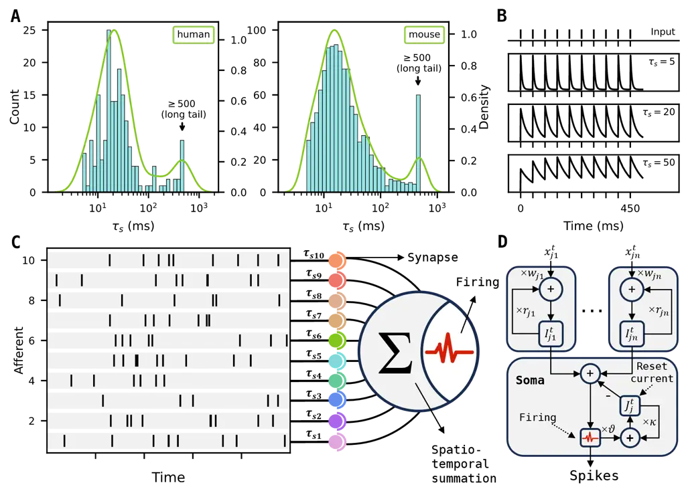
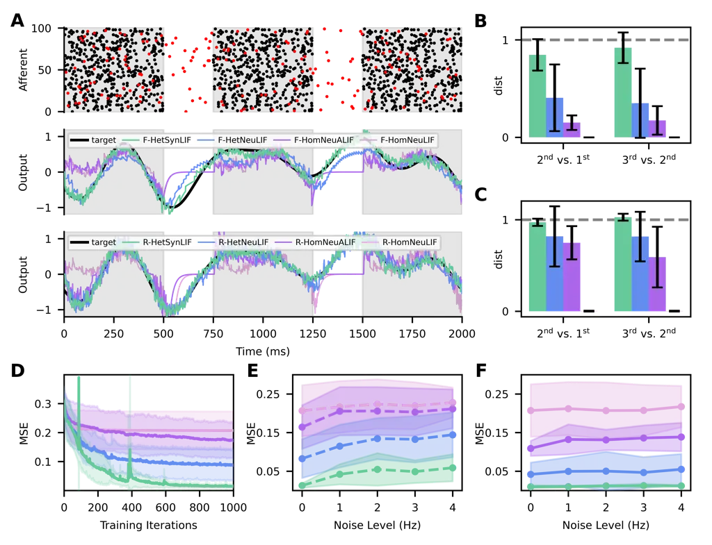
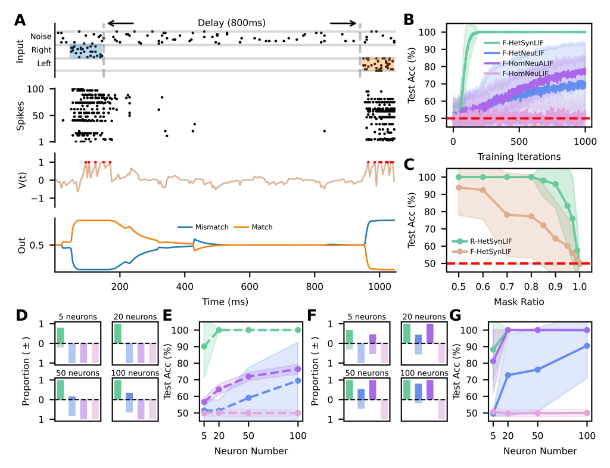
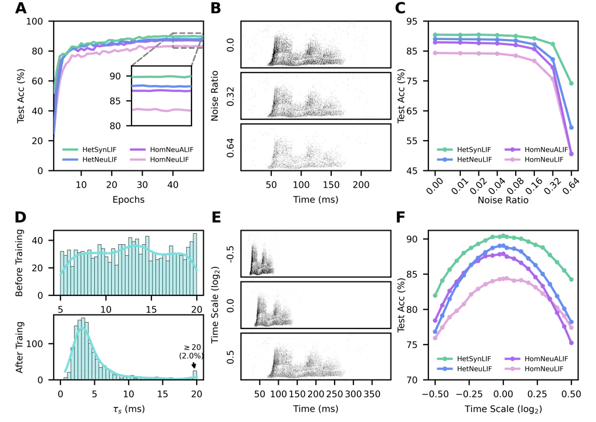

# HetSyn: Versatile Timescale Integration in Spiking Neural Networks via Heterogeneous Synapses

Zhichao Deng ^(†)^(†)thanks: Equal contribution. Affiliation: College of
Intelligence and Computing, Tianjin University, Tianjin, China
Email: [yuqiang@tju.edu.cn](mailto:)    Zhikun Liu¹¹footnotemark: 1
Affiliation: College of Intelligence and Computing, Tianjin University,
Tianjin, China    Junxue Wang Affiliation: College of Intelligence and
Computing, Tianjin University, Tianjin, China    Shengqian Chen
Affiliation: College of Intelligence and Computing, Tianjin University,
Tianjin, China    Xiang Wei Affiliation: College of Intelligence and
Computing, Tianjin University, Tianjin, China    Qiang Yu
^(†)^(†)thanks: Corresponding author. Affiliation: College of
Intelligence and Computing, Tianjin University, Tianjin, China
Affiliation: College of Computer and Information Engineering, Tianjin
Normal University, Tianjin, China

###### Abstract

Spiking Neural Networks (SNNs) offer a biologically plausible and
energy-efficient framework for temporal information processing. However,
existing studies overlook a fundamental property widely observed in
biological neurons—synaptic heterogeneity, which plays a crucial role in
temporal processing and cognitive capabilities. To bridge this gap, we
introduce HetSyn, a generalized framework that models synaptic
heterogeneity with synapse-specific time constants. This design shifts
temporal integration from the membrane potential to the synaptic
current, enabling versatile timescale integration and allowing the model
to capture diverse synaptic dynamics. We implement HetSyn as HetSynLIF,
an extended form of the leaky integrate-and-fire (LIF) model equipped
with synapse-specific decay dynamics. By adjusting the parameter
configuration, HetSynLIF can be specialized into vanilla LIF neurons,
neurons with threshold adaptation, and neuron-level heterogeneous
models. We demonstrate that HetSynLIF not only improves the performance
of SNNs across a variety of tasks—including pattern generation, delayed
match-to-sample, speech recognition, and visual recognition—but also
exhibits strong robustness to noise, enhanced working memory
performance, efficiency under limited neuron resources, and
generalization across timescales. In addition, analysis of the learned
synaptic time constants reveals trends consistent with empirical
observations in biological synapses. These findings underscore the
significance of synaptic heterogeneity in enabling efficient neural
computation, offering new insights into brain-inspired temporal
modeling.

   

|     |
| --- |
|     |

## 1 Introduction

Spiking Neural Networks (SNNs) have been widely studied as a promising
and energy-efficient alternative to conventional artificial neural
networks (ANNs), offering a biologically plausible computing paradigm
characterized by sparse, event-driven signaling and inherent capability
for temporal processing \[1, 2, 3\]. However, due to the complex
dynamical characteristics of spiking neurons, effectively training SNNs
and improving their performance remain major challenges in the field.
This calls for new learning paradigms, either by adapting established
methods from ANNs \[4, 5, 6, 7, 8, 9, 10\] or by drawing inspiration
from biological mechanisms \[11, 12, 13, 14, 15, 16\].

While ANN-derived methods have led to notable progress, we instead focus
on strengthening the biological foundations of SNNs by revisiting
fundamental neurobiological mechanisms, which remain underexplored and
hold great potential for enabling more versatile timescale integration
in spiking systems. This capability is particularly important, as
effective timescale integration is central to temporal cognition, and
many real-world tasks—such as working memory, speech recognition, and
sequential decision-making—require neural systems to operate across
multiple timescales \[17, 18, 19, 20\]. Achieving such multi-timescale
processing requires neural models to incorporate diverse temporal
dynamics across different input pathways. To this end, various forms of
temporal heterogeneity have been introduced in SNNs to enhance their
capability to represent and integrate information across multiple time
constants, such as ALIF \[12\], PLIF \[21\], neuron
heterogeneity \[22\], and dendritic heterogeneity \[23\]. Although these
approaches provide valuable insights, they remain limited to the neuron
level or sub-neuronal level, where temporal dynamics are uniformly
applied across aggregated inputs. This restricts their ability to assign
distinct temporal responses to different synaptic pathways, limiting
performance on tasks with complex temporal structure.

In contrast, numerous neuroscience studies have shown that synapses vary
substantially across brain regions and cell types \[24, 25\], giving
rise to a diverse temporal basis that supports multi-timescale
integration and cognitive abilities \[26, 27\] (see Fig. 1A, B). This
diversity, known as synaptic heterogeneity, constitutes a fundamental
biological principle that plays a crucial role in shaping neural
computation. Despite its biological significance, synaptic heterogeneity
has rarely been incorporated into the design of spiking neural networks.
Its computational potential remains largely unexplored, in part due to
the challenges of modeling fine-grained, synapse-specific temporal
dynamics.



Figure 1: (A) Distributions of synaptic time constants
($`\tau_{\text{s}}`$) extracted from human (left, 194 pairs) and mouse
(right, 1213 pairs) cortex, shown as histograms with overlaid KDE curves
(green). The broad, long-tailed ($`\tau_{\text{s}}\geq 500`$ ms)
profiles reflect substantial synaptic heterogeneity. (B) Postsynaptic
membrane potential traces under different synaptic time constants
($`\tau_{\text{s}}`$ = 5, 20, 50 ms, from second to fourth row) in
response to a regular spike train (first row). (C-D) Schematic of
HetSyn, in which afferent spikes are integrated via synapses with
heterogeneous decay dynamics.

To bridge this gap, we take a first step toward incorporating synaptic
heterogeneity into SNNs and introduce HetSyn by focusing on one key
aspect: the diversity of synaptic time constants, motivated by our
analysis of a recently released Synaptic Physiology Dataset \[28\] from
the Allen Institute, which reveals that synaptic time constants follow a
log-normal distribution across populations, providing direct empirical
support for synapse-specific time constants (Fig. 1A). As illustrated in
Fig. 1B, synapses with longer time constants are able to retain
input-driven activity over extended periods, whereas those with smaller
time constants respond more transiently and can effectively filter out
noise or irrelevant fluctuations. This functional diversity lays the
foundation for versatile timescale integration, enabling neural models
to process information across both long and short temporal windows.

Furthermore, instead of relying on a single membrane time constant,
HetSyn computes the membrane potential by aggregating synaptic currents,
each governed by a synapse-specific decay factor. This synapse-driven
formulation allows temporal integration to arise from the diverse
dynamics of individual synapses, rather than being uniformly controlled
at the neuron level (Fig. 1C, D). We instantiate HetSyn as HetSynLIF and
demonstrate that it subsumes several representative spiking neuron
models as special cases through parameter configuration (see Methods).

Our contributions are as follows:

- •
  We propose HetSyn, the first modeling framework to explicitly explore
  synaptic heterogeneity in SNNs, offering a biologically plausible yet
  computationally powerful approach for versatile timescale integration.
- •
  We demonstrate that HetSyn serves as a unified and extensible
  framework, capable of representing a wide range of existing spiking
  neuron models.
- •
  We instantiate HetSyn as HetSynLIF and demonstrate its effectiveness
  across multiple temporal tasks, with consistently strong performance.
  Notably, we achieve 92.36% accuracy on the SHD dataset, which is, to
  the best of our knowledge, the best-reported accuracy among models
  with similar network structures.

## 2 Related Work

### 2.1 Training methods

There are two primary approaches for training SNNs: ANN-to-SNN
conversion (ANN2SNN) \[29, 30, 31, 32, 33, 34\] and direct training
using surrogate gradient methods \[35, 36, 37, 10, 38, 39\]. The ANN2SNN
method first trains a conventional ANN and then maps its parameters to
an SNN, where the firing rates of spiking neurons are used to
approximate the continuous activations of the original ANN. However, it
often suffers from accuracy degradation due to the approximation
process. In comparison, surrogate gradient methods approximate the
non-differentiable spiking function with a surrogate, thus enabling
direct end-to-end training of SNNs via backpropagation through time
(BPTT). This approach forms the basis of modern surrogate-gradient based
training frameworks for SNNs, such as Spatio-Temporal Backpropagation
(STBP) \[35\] and Slayer \[36\]. In this paper, we adopt the surrogate
gradient method to enable efficient training of the HetSynLIF model.

### 2.2 Heterogeneity in SNNs

Recent studies have highlighted the significance of heterogeneity in
SNNs, exploring its impact on network performance and temporal
processing from various perspectives. For instance, neuron-level
heterogeneity has been shown to enhance the stability and noise
robustness of SNNs. Perez-Nieves et al. \[22\] show that networks with
membrane time constants drawn from a Gamma distribution better capture
complex temporal patterns, outperforming homogeneous networks in tasks
with rich temporal structure. In addition, PLIF \[21\] learns a shared
membrane time constant for each layer, which can be interpreted as
introducing heterogeneity at a coarser granularity. Another source of
heterogeneity arises from the spiking history of a neuron \[12\]. Firing
thresholds that evolve over time based on recent spiking activity
introduce a form of adaptive, history-dependent threshold heterogeneity.
Furthermore, heterogeneity has also been explored at the level of neural
dynamics and plasticity mechanisms. Chakraborty et al. \[40\]
investigate the effects of heterogeneity in LIF and
spike-timing-dependent plasticity (STDP) parameters. Additionally, the
temporal heterogeneity of dendritic branches \[23\] has been integrated
into SNNs. While considerable work has explored heterogeneity in SNNs,
synapse-level heterogeneity remains largely underexplored. In contrast,
our HetSyn introduces synapse-specific decay factors, embedding
heterogeneity directly at the synaptic level. This fine-grained design
enables HetSyn to integrate temporal information over a broader range of
timescales, thereby enhancing both computational flexibility and
biological plausibility.

## 3 Methods

### 3.1 Vanilla LIF

Spiking neurons are the fundamental computational units in SNNs,
enabling the modeling of temporal dynamics through biologically inspired
mechanisms. Among various neuron models, the LIF neuron is one of the
most widely adopted for its balance between computational efficiency and
biological plausibility. It captures essential neuronal properties such
as membrane potential leakage, input integration, and spike emission.
The dynamics of the LIF neuron can be formulated as follows:

```math
\displaystyle\frac{dV}{dt}=-\frac{V-V_{\text{rest}}}{\tau_{\text{m}}}+\sum_{i,j}w_{i}\cdot\delta\left(t-t_{i}^{j}\right)-\vartheta\cdot\sum_{j}\delta\left(t-t_{\text{s}}^{j}\right) \tag{1}
```

where $`V`$ is the membrane potential, $`V_{\text{rest}}`$ is the
resting potential, and $`\tau_{\text{m}}`$ represents the membrane time
constant. $`t_{i}^{j}`$ and $`t_{\text{s}}^{j}`$ denote the timing of
the $`j`$-th input spike from the $`i`$-th presynaptic neuron and the
$`j`$-th output spike from the postsynaptic neuron, respectively. The
term $`w_{i}`$ denotes the synaptic efficacy of the $`i`$-th afferent,
$`\vartheta`$ denotes the firing threshold and $`\delta(\cdot)`$
represents the Dirac delta function. We set $`V_{\text{rest}}=0`$ in
this paper, and an equivalent continuous-time solution to Eq. (1) is
then given by:

```math
\displaystyle V^{t}=\sum_{i}w_{i}\sum_{j}k\left(t-t_{i}^{j}\right)-\vartheta\cdot\sum_{j}k\left(t-t_{\text{s}}^{j}\right) \tag{2}
```

where $`V^{t}`$ is the membrane potential at time $`t`$. The term
$`k\left(t-t_{i}^{j}\right)=\exp({-\frac{t-t_{i}^{j}}{\tau_{\text{m}}}})`$,
for $`t>t_{i}^{j}`$, is the synaptic kernel induced by the $`j`$-th
spike of the $`i`$-th afferent. It describes the resulting postsynaptic
potential (PSP), which decays exponentially at a rate governed by the
membrane time constant $`\tau_{\text{m}}`$. In practice, simulations
typically adopt a discrete-time formulation, which is given by:

```math
\displaystyle V^{t} \displaystyle=\rho\cdot V^{t-1}+\sum_{i}w_{i}\cdot z_{i}^{t}-\vartheta\cdot z^{t-1} \tag{3}
```

```math
\displaystyle z^{t} \displaystyle=\text{H}(V^{t}-\vartheta) \tag{4}
```

where $`\rho=\exp(-\frac{\Delta t}{\tau_{\text{m}}})`$ denotes the
membrane decay factor, with $`\Delta t`$ representing the discrete
timestep. The output spike $`z^{t}`$ is computed using the Heaviside
step function $`\text{H}(\cdot)`$.

### 3.2 LIF-based spiking neuron with HetSyn

We apply the HetSyn principle to the vanilla LIF neuron and propose
HetSynLIF, a variant that incorporates synaptic heterogeneity. In
HetSynLIF, the traditional membrane time constant is replaced by
synapse-specific time constants. Instead of applying a uniform temporal
filter to all inputs, each synaptic input is individually integrated
through its own exponential decay, resulting in heterogeneous synaptic
currents. This design shifts temporal integration from the membrane
dynamics to the synaptic dynamics, reproducing synaptic diversity in
biological systems. Moreover, we model the reset mechanism as a negative
current injection. The neuron then accumulates these individually
filtered synaptic currents and subtracts the reset current to update its
membrane potential. The dynamics of HetSynLIF can be derived from
Eq. (2), yielding:

```math
\displaystyle V^{t} \displaystyle=\sum_{i}I_{i}^{t}-J^{t} \tag{5}
```

```math
\displaystyle\frac{dI_{i}^{t}}{dt} \displaystyle=-\frac{I_{i}^{t}}{\tau_{\text{s},i}}+\sum_{j}w_{i}\cdot\delta\left(t-t_{i}^{j}\right) \tag{6}
```

```math
\displaystyle\frac{dJ^{t}}{dt} \displaystyle=-\frac{J^{t}}{\tau_{J}}+\sum_{j}\vartheta\cdot\delta\left(t-t_{\text{s}}^{j}\right) \tag{7}
```

where $`I_{i}^{t}`$ denotes the synaptic current from the $`i`$-th
afferent at time $`t`$, governed by its own synapse-specific time
constant $`\tau_{\text{s},i}`$, thereby capturing the heterogeneity in
synaptic temporal dynamics. $`J^{t}`$ denotes the reset current, a
neuron-level term that models the effect of spike-triggered reset and
decays with time constant $`\tau_{J}`$. The discrete-time formulations
of synaptic and reset currents are given by:

```math
\displaystyle I_{i}^{t} \displaystyle=r_{i}\cdot I_{i}^{t-1}+w_{i}\cdot z_{i}^{t} \tag{8}
```

```math
\displaystyle J^{t} \displaystyle=\kappa\cdot J^{t-1}+\vartheta\cdot z^{t-1} \tag{9}
```

where $`r_{i}=\exp(-\frac{\Delta t}{\tau_{\text{s},i}})`$ and
$`\kappa=\exp(-\frac{\Delta t}{\tau_{J}})`$ are the decay factors for
the $`i`$-th synaptic current and the reset current of the neuron,
respectively.

### 3.3 Generalize to other spiking neurons

Equipped with HetSyn, our HetSynLIF model is highly flexible and can be
generalized to a wide range of spiking neuron models. To distinguish
between variants, we use the prefixes "HomNeu" and "HetNeu" to denote
homogeneous and heterogeneous configurations at the neuron level,
respectively. Under this notation, HetSynLIF can reduce to vanilla LIF
neurons (HomNeuLIF), neurons with threshold adaptation (HomNeuALIF), and
neuron-level heterogeneous models (HetNeuLIF). This flexibility stems
from the incorporation of synapse-specific time constants, which enable
HetSynLIF to modulate temporal dynamics at a finer granularity. By
analyzing the synaptic dynamics from a presynaptic neuron $`i`$ to a
postsynaptic neuron $`j`$, we demonstrate how HetSynLIF generalizes to
other neuron models under specific conditions. See Appendix A for
detailed proof.

#### Proposition 1

If all synaptic decay factors $`r_{ji}`$ and the reset current decay
factor $`\kappa_{j}`$ are identical and equal to a shared value
$`\rho`$, i.e., $`r_{ji}=\kappa_{j}=\rho`$ for all $`i,j`$, then the
HetSynLIF model reduces to the HomNeuLIF model. Under this condition,
the membrane potential of the postsynaptic neuron $`j`$ at time $`t`$ in
HetSynLIF simplifies to:

```math
\displaystyle V_{j}^{t}=\rho\cdot V_{j}^{t-1}+\sum_{i}w_{ji}\cdot z_{i}^{t}-\vartheta\cdot z_{j}^{t-1} \tag{10}
```

The resulting equation matches Eq. (3), which suggests that the vanilla
LIF model emerges as a special case of HetSynLIF when all synaptic and
reset decay factors are identical.

#### Proposition 2

Based on Proposition 1, if we further decompose the reset current into a
standard component and an additional adaptation current triggered by
spikes—characterized by a decay factor $`\rho_{a}`$ and a scaling
coefficient $`a`$—then HetSynLIF generalizes to the HomNeuALIF model.
Under this condition, the membrane potential of postsynaptic neuron
$`j`$ at time $`t`$ in HetSynLIF can be transformed into:

```math
\displaystyle V_{j}^{t}=\rho\cdot V_{j}^{t-1}+\sum_{i}w_{ji}\cdot z_{i}^{t}-J_{a}^{t}-\vartheta\cdot z_{j}^{t-1} \tag{11}
```

This indicates that HetSynLIF effectively reproduces the adaptive
dynamics of the HomNeuALIF model proposed by \[41\] through a structural
modification of the reset current, demonstrating its flexibility in
modeling neuron dynamics beyond fixed-threshold designs.

#### Proposition 3

For each postsynaptic neuron $`j`$, if all synaptic decay factors
$`r_{ji}`$ and the reset current decay factor $`\kappa_{j}`$ are
identical and equal to a neuron-specific membrane decay factor
$`\rho_{j}`$, i.e., $`r_{ji}=\kappa_{j}=\rho_{j}`$ for all $`i`$, then
HetSynLIF generalizes to the HetNeuLIF model. Under this condition, the
membrane potential of postsynaptic neuron $`j`$ at time $`t`$ in
HetSynLIF simplifies to:

```math
\displaystyle V_{j}^{t}=\rho_{j}\cdot V_{j}^{t-1}+\sum_{i}w_{ji}\cdot z_{i}^{t}-\vartheta\cdot z_{j}^{t-1} \tag{12}
```

In this case, each postsynaptic neuron $`j`$ evolves according to its
own membrane decay factor $`\rho_{j}`$, which reflects neuron-level
heterogeneity\[22\]. This shows that HetSynLIF encompasses neuron-level
heterogeneity as a special case by assigning shared decay dynamics per
neuron.

## 4 Experiments

As detailed in Section 3.3, HetSynLIF can be reduced to HomNeuLIF,
HomNeuALIF, and HetNeuLIF through appropriate parameterization. In this
section, we conduct a systematic comparison of the four variants and
further evaluate HetSynLIF against previous state-of-the-art methods.
All variants are implemented within our unified framework to ensure
theoretical equivalence, controlled ablation, fair comparison, and
architectural consistency, enabling us to isolate the specific
contribution of synapse-level heterogeneity. For clarity, we prefix
feedforward and recurrent SNN implementations with "F-" and "R-",
respectively. Further experimental and training details are provided in
the Appendix.

### 4.1 Versatile Timescale Integration in Pattern Generation Task



Figure 2: Pattern generation task. (A) An input spike pattern with a
fixed Poisson-generated template (10 Hz, black dots) and superimposed
noise spikes (2 Hz, red dots). Repeating features are marked by shaded
gray regions (Top). Output traces of four FSNN variants (middle) and
four RSNN variants (bottom) in response to the same input pattern. (B-C)
Normalized distances between output traces at the $`2^{\text{nd}}`$ vs.
$`1^{\text{st}}`$ and $`3^{\text{rd}}`$ vs. $`2^{\text{nd}}`$
occurrences of the repeating input segments for FSNNs (B) and RSNNs (C).
Higher means better; see Appendix B. (D) Mean squared error over
training iterations for four FSNN variants. (E-F) Mean squared error of
FSNN variants (E) and RSNN variants (F) under different noise levels.
Data in B-F are averaged over 10 runs and reported as mean $`\pm`$ s.d.

We first evaluate HetSynLIF and three variants using one-layer FSNN and
RSNN architectures on a more complex version of the pattern generation
task, compared to the setups used in previous works \[13, 14\], where
the network is trained to reproduce a target trace in response to
structured input spike patterns that consist of repeated segments
embedded in Poisson noise, with no input provided between the segments
(Fig. 2A; see Appendix for details). We reveal that our HetSynLIF
exhibits the fastest convergence and lowest mean squared error (MSE). In
contrast, both HomNeuLIF and HomNeuALIF produce near-zero outputs during
the input-free intervals between repeated segments, regardless of
whether the network is an FSNN or an RSNN. This suggests their limited
ability to learn time constants long enough to bridge these temporal
gaps (Fig. 2A, D). We then compute normalized distances between outputs
corresponding to repeated input segments (Fig. 2B for FSNNs, Fig. 2C for
RSNNs, see Appendix B), where larger distances indicate a stronger
ability to generate target-aligned outputs for identical input segments.
HomNeuLIF shows consistently low distances, indicating nearly identical
responses, while HomNeuALIF and HetNeuLIF show slight improvements in
FSNNs and modest gains in RSNNs, benefiting from recurrent connections.
Nevertheless, all three are inferior to HetSynLIF in performance, which
consistently achieves the highest distances across both architectures.
Additionally, under varying levels of input noise, HetSynLIF maintains
the lowest MSE, while other models exhibit greater degradation (Fig. 2E,
F). Finally, we show that HetSynLIF is also capable of generating
multiple target patterns simultaneously (Appendix Fig. A1).

### 4.2 Versatile Timescale Integration in Delayed Match-to-Sample Task



Figure 3: Delayed match-to-sample task. (A) Schematic diagram of a
sample mismatch trial with two cues separated by an 800 ms delay (Top).
Spiking activity of hidden layer neurons (Second). Membrane potential
and spike activities (red dots) of a sample neuron (Third). Softmax
outputs of neurons representing match and mismatch (Bottom). (B)
Learning curves of four FSNN variants with 100 hidden neurons. (C) Task
accuracy under different synaptic time constant masking ratios. (D)
Success and failure rates across neuron numbers and FSNN variants. Each
grid cell corresponds to a different hidden neuron count (5, 20, 50,
100), containing four centered bars for the four FSNN variants. Each bar
is split vertically into a success segment (opaque, above) and a failure
segment (transparent, below); trials with accuracy $`\geq`$ 90% are
considered successful. D-G follow the same color scheme as B. (E)
Overall task accuracy of four FSNN variants under varying neuron counts.
(F-G) Same as D-E, but for RSNN variants. Data in B-G are averaged over
50 runs and reported as mean $`\pm`$ s.d.

To assess the ability of HetSynLIF to capture multi-timescale
dependencies essential for working memory, we adopt the delayed
match-to-sample task—a widely used paradigm in neuroscience \[42, 43,
44, 45\]. The network must judge whether two temporally separated cues
belong to the same category (i.e., left or right), requiring short-term
processing at cue onset and long-term retention across the delay
(Fig. 3A; see Appendix for details). As in the pattern generation task,
we compare the performance of eight variants—four FSNNs and four
RSNNs—across multiple metrics. Fig. 3B presents the learning curves of
the four FSNN variants, showing that F-HetSynLIF converges fastest and
achieves the highest accuracy among FSNN variants. To assess the
functional importance of synaptic heterogeneity, we progressively mask a
fraction of the synaptic time constants in R-HetSynLIF, rendering them
non-trainable. Results show that even with 80% of synapses masked, the
model maintains 100% accuracy, highlighting the critical role of
heterogeneous temporal integration in sustaining memory over delays
(Fig. 3C). We further analyze how performance scales with network size
(Fig. 3D–G). Both F-HetSynLIF and R-HetSynLIF consistently achieve
higher success rates (defined as accuracy $`\geq`$ 90%) across varying
numbers of hidden neurons, remaining effective even with five neurons,
which highlights computational efficiency of synaptic heterogeneity in
resource-constrained scenarios. Besides, R-HetSynLIF maintains 100%
accuracy even at a 2500 ms delay, with no notable increase in iterations
to reach 95% accuracy, and retains nearly 80% accuracy under noise of
20 Hz, demonstrating both stable training efficiency and strong
robustness (Appendix Fig. A2).

### 4.3 Versatile Timescale Integration in Speech Recognition



Figure 4: Speech recognition and robustness analysis. (A) Learning
curves of four RSNN variants on the SHD dataset. (B) Spike inputs under
deletion noise ratios of 0.00, 0.32, and 0.64 (top to bottom), where
each ratio denotes the probability of deleting a spike. (C) Test
accuracy under varying deletion noise ratios. (D) Distribution of
synaptic time constants for connections from the last hidden layer to
the output layer, before (top) and after (bottom) training. (E) Spike
inputs under time warp conditions with $`\text{log}_{2}`$-scaled factors
of -0.5 (compressed), 0.0 (original), and 0.5 (stretched), top to
bottom. (F) Test accuracy under $`\text{log}_{2}`$-scaled time warp
factors. Data in A, C, and F are averaged over 10 runs.

We then evaluate the speech recognition capability of four RSNN variants
mentioned above on the SHD\[46\] dataset, using a two-layer recurrent
architecture. As shown in Fig. 4A, HetSynLIF consistently achieves the
highest accuracy and fastest convergence, followed by HetNeuLIF,
HomNeuALIF, and HomNeuLIF. This result underscores the superior modeling
capacity of synapse heterogeneity. While neuron heterogeneity also
improves performance, assigning distinct time constants to individual
synapses offers finer temporal resolution. In contrast, threshold
adaptation yields limited gains and remains less effective than neuron
heterogeneity. To understand how temporal dynamics evolve during
learning, we analyze the distribution of $`\tau_{\text{s}}`$ in the
final hidden-to-output layer (Fig. 4D). Initialized from
$`\mathcal{U}(5,20)`$ ms, $`\tau_{\text{s}}`$ shifts toward lower
values, with 2.0% exceeding 20 ms, forming a mild long-tail that may
support slow-varying temporal encoding, loosely resembling biological
patterns in Fig. 1A. Similar trends are observed across other layers
(Appendix Fig. A4). We further assess robustness under deletion noise
and time warp, both of which are introduced only during testing (i.e.,
trained on clean data and tested with deletion noise or time-warped
inputs). In deletion noise, each spike is independently removed with a
fixed probability (Fig. 4B). Although performance degrades with
increasing noise, the accuracy ranking remains unchanged (Fig. 4C).
Notably, when the noise ratio increases from 0.32 to 0.64, HetSynLIF
maintains relatively stable, while others drop sharply, demonstrating
the strong resilience of synapse heterogeneity to input disruptions. A
similar trend holds under time warp distortions (Fig. 4E–F), where
HetSynLIF consistently achieves higher accuracy across varying
timescales (see Appendix D and Fig. A3 for more details).

### 4.4 Comparison with Existing Works

We compare our proposed HetSynLIF model with other existing works on the
SHD, S-MNIST \[47\], TiDigits \[48\], and Ti46-Alpha \[49\] datasets,
and report the results in Table 1. Notably, our two-layer RSNN
architecture achieves 92.36% accuracy on the SHD dataset, which, to the
best of our knowledge, is the highest reported accuracy among models
with similar architectures. In addition, the HetSynLIF model
demonstrates outstanding performance on the other three datasets as
well, consistently outperforming prior methods, highlighting its
effectiveness in processing multi-timescale temporal dynamics across
both speech and visual recognition tasks.

|         |                                                                   |       |          |                                                            |       |
| ------- | ----------------------------------------------------------------- | ----- | -------- | ---------------------------------------------------------- | ----- |
| Dataset | Method                                                            | Acc   | Dataset  | Method                                                     | Acc   |
| SHD     | $`\mathrm{DH}`$-$`\mathrm{SFNN}^{\mathrm{{Nat.Commun24}}}`$\[23\] | 92.1  | TiDigits | $`\mathrm{BPT}`$-$`\mathrm{SNN}^{\mathrm{}}`$\[50\]        | 98.1  |
|         | $`\mathrm{DH}`$-$`\mathrm{SRNN}^{\mathrm{Nat.Commun24}}`$\[23\]   | 91.34 |          | $`\mathrm{M}`$-$`\mathrm{STIP}^{\mathrm{TNNLS22}}`$\[51\]  | 98.1  |
|         | $`\mathrm{SRNN}^{\mathrm{ICLR25}}`$\[52\]                         | 91.19 |          | $`\mathrm{MPD}`$-$`\mathrm{AL}^{\mathrm{AAAI19}}`$\[53\]   | 97.5  |
|         | $`\mathrm{SRNN}^{\mathrm{NMI21}}`$\[54\]                          | 90.4  |          | $`\mathrm{BAE}`$-$`\mathrm{MPDAL}`$\[55\]                  | 97.4  |
|         | $`\mathrm{NeuHet}`$-$`\mathrm{SRNN}^{\mathrm{NatCom21}}`$\[22\]   | 82.7  |          | $`\mathrm{PBSNLR}`$-$`\mathrm{DW}`$\[56\]                  | 96.5  |
|         | $`\mathrm{SRNN}^{\mathrm{PNAS22}}`$\[57\]                         | 81.6  |          | $`\mathrm{SpikingCNN}`$\[58\]                              | 96.0  |
|         | HetSynLIF (Ours)                                                  | 92.36 |          | HetSynLIF (Ours)                                           | 98.99 |
| S-MNIST | $`\mathrm{DH}`$-$`\mathrm{SRNN}^{\mathrm{Nat.Commun24}}`$\[23\]   | 98.87 | Ti46     | $`\mathrm{RSNN}^{\mathrm{}}`$\[59\]                        | 96.44 |
|         | $`\mathrm{SRNN}^{\mathrm{NMI21}}`$\[54\]                          | 98.7  |          | $`\mathrm{ScSr}`$-$`\mathrm{SNNs}`$\[60\]                  | 95.9  |
|         | $`\mathrm{LSTM}^{\mathrm{ICML16}}`$\[61\]                         | 98.2  |          | $`\mathrm{RSNN}^{\mathrm{NeurIPS19}}`$\[62\]               | 93.5  |
|         | $`\mathrm{LSNN}^{\mathrm{NeurIPS18}}`$\[12\]                      | 96.4  |          | $`\mathrm{LSM}^{\mathrm{}}`$\[63\]                         | 92.3  |
|         | $`\mathrm{AHP}`$-$`\mathrm{SNN}^{\mathrm{NMI22}}`$\[41\]          | 96.0  |          | $`\mathrm{S}`$-$`\mathrm{MLP}^{\mathrm{NeurIPS18}}`$\[64\] | 90.98 |
|         | HetSynLIF (Ours)                                                  | 98.93 |          | HetSynLIF (Ours)                                           | 96.53 |

Table 1: Accuracy comparison on SHD, S-MNIST, TiDigits, and Ti46-Alpha
datasets

## 5 Conclusion

In this paper, we propose HetSyn, the first modeling framework with
synaptic heterogeneity in SNNs that replaces the conventional membrane
time constant with synapse-specific time constants. This design enables
versatile timescale integration at the synapse level, grounded in
biological observations of synaptic diversity. We instantiate HetSyn as
HetSynLIF and theoretically show its generalization ability to existing
models. Through comprehensive experiments, we show that HetSynLIF
consistently achieves high accuracy on tasks requiring versatile
timescale integration, exhibits strong robustness to noise, and
maintains computational efficiency under resource constraints.
Furthermore, the learned synaptic time constants exhibit a mildly
long-tailed distribution, loosely resembling biological observations and
reflecting adaptation to multi-timescale processing. These findings
underscore the critical role of synaptic heterogeneity in SNNs, not only
in enhancing computational performance, but also in aligning with
biological principles. By establishing synapse-level modeling as a
viable direction, our work points toward promising avenues for advancing
brain-inspired learning systems. Future work could explore the
combination of HetSyn with other advanced spiking architectures or
training strategies for further improvements in versatile timescale
integration and task performance.

## References

- \[1\] Wolfgang Maass. Networks of spiking neurons: the third
  generation of neural network models. Neural networks,
  10(9):1659–1671, 1997.
- \[2\] Michael Pfeiffer and Thomas Pfeil. Deep learning with spiking
  neurons: Opportunities and challenges. Frontiers in neuroscience,
  12:409662, 2018.
- \[3\] Jing Pei, Lei Deng, Sen Song, Mingguo Zhao, Youhui Zhang, Shuang
  Wu, Guanrui Wang, Zhe Zou, Zhenzhi Wu, Wei He, et al. Towards
  artificial general intelligence with hybrid tianjic chip architecture.
  Nature, 572(7767):106–111, 2019.
- \[4\] Yujie Wu, Lei Deng, Guoqi Li, Jun Zhu, Yuan Xie, and Luping Shi.
  Direct training for spiking neural networks: Faster, larger, better.
  In Proceedings of the AAAI conference on artificial intelligence,
  volume 33, pages 1311–1318, 2019.
- \[5\] Abhronil Sengupta, Yuting Ye, Robert Wang, Chiao Liu, and
  Kaushik Roy. Going deeper in spiking neural networks: Vgg and residual
  architectures. Frontiers in neuroscience, 13:95, 2019.
- \[6\] Seijoon Kim, Seongsik Park, Byunggook Na, and Sungroh Yoon.
  Spiking-yolo: spiking neural network for energy-efficient object
  detection. In Proceedings of the AAAI conference on artificial
  intelligence, volume 34, pages 11270–11277, 2020.
- \[7\] Zhaokun Zhou, Yuesheng Zhu, Chao He, Yaowei Wang, Shuicheng YAN,
  Yonghong Tian, and Li Yuan. Spikformer: When spiking neural network
  meets transformer. In The Eleventh International Conference on
  Learning Representations, 2023.
- \[8\] Man Yao, Jiakui Hu, Zhaokun Zhou, Li Yuan, Yonghong Tian, Bo Xu,
  and Guoqi Li. Spike-driven transformer. Advances in neural information
  processing systems, 36:64043–64058, 2023.
- \[9\] Chaoteng Duan, Jianhao Ding, Shiyan Chen, Zhaofei Yu, and Tiejun
  Huang. Temporal effective batch normalization in spiking neural
  networks. In S. Koyejo, S. Mohamed, A. Agarwal, D. Belgrave, K. Cho,
  and A. Oh, editors, Advances in Neural Information Processing Systems,
  volume 35, pages 34377–34390. Curran Associates, Inc., 2022.
- \[10\] Wei Fang, Zhaofei Yu, Yanqi Chen, Tiejun Huang, Timothée
  Masquelier, and Yonghong Tian. Deep residual learning in spiking
  neural networks. Advances in Neural Information Processing Systems,
  34:21056–21069, 2021.
- \[11\] Zuzanna Brzosko, Susanna B Mierau, and Ole Paulsen.
  Neuromodulation of spike-timing-dependent plasticity: past, present,
  and future. Neuron, 103(4):563–581, 2019.
- \[12\] Guillaume Bellec, Darjan Salaj, Anand Subramoney, Robert
  Legenstein, and Wolfgang Maass. Long short-term memory and
  learning-to-learn in networks of spiking neurons. Advances in neural
  information processing systems, 31, 2018.
- \[13\] Guillaume Bellec, Franz Scherr, Anand Subramoney, Elias Hajek,
  Darjan Salaj, Robert Legenstein, and Wolfgang Maass. A solution to the
  learning dilemma for recurrent networks of spiking neurons. Nature
  communications, 11(1):3625, 2020.
- \[14\] Yuhan Helena Liu, Stephen Smith, Stefan Mihalas, Eric
  Shea-Brown, and Uygar Sümbül. Cell-type–specific neuromodulation
  guides synaptic credit assignment in a spiking neural network.
  Proceedings of the National Academy of Sciences,
  118(51):e2111821118, 2021.
- \[15\] Tielin Zhang, Xiang Cheng, Shuncheng Jia, Chengyu T Li, Mu-ming
  Poo, and Bo Xu. A brain-inspired algorithm that mitigates catastrophic
  forgetting of artificial and spiking neural networks with low
  computational cost. Science Advances, 9(34):eadi2947, 2023.
- \[16\] Yujie Wu, Rong Zhao, Jun Zhu, Feng Chen, Mingkun Xu, Guoqi Li,
  Sen Song, Lei Deng, Guanrui Wang, Hao Zheng, et al. Brain-inspired
  global-local learning incorporated with neuromorphic computing. Nature
  Communications, 13(1):65, 2022.
- \[17\] Uri Hasson, Eunice Yang, Ignacio Vallines, David J Heeger, and
  Nava Rubin. A hierarchy of temporal receptive windows in human cortex.
  Journal of neuroscience, 28(10):2539–2550, 2008.
- \[18\] Dean V Buonomano and Wolfgang Maass. State-dependent
  computations: spatiotemporal processing in cortical networks. Nature
  Reviews Neuroscience, 10(2):113–125, 2009.
- \[19\] Stefan J Kiebel, Jean Daunizeau, and Karl J Friston. A
  hierarchy of time-scales and the brain. PLoS computational biology,
  4(11):e1000209, 2008.
- \[20\] Alan Baddeley. Working memory: looking back and looking
  forward. Nature reviews neuroscience, 4(10):829–839, 2003.
- \[21\] Wei Fang, Zhaofei Yu, Yanqi Chen, Timothée Masquelier, Tiejun
  Huang, and Yonghong Tian. Incorporating learnable membrane time
  constant to enhance learning of spiking neural networks. In
  Proceedings of the IEEE/CVF international conference on computer
  vision, pages 2661–2671, 2021.
- \[22\] Nicolas Perez-Nieves, Vincent CH Leung, Pier Luigi Dragotti,
  and Dan FM Goodman. Neural heterogeneity promotes robust learning.
  Nature communications, 12(1):5791, 2021.
- \[23\] Hanle Zheng, Zhong Zheng, Rui Hu, Bo Xiao, Yujie Wu, Fangwen
  Yu, Xue Liu, Guoqi Li, and Lei Deng. Temporal dendritic heterogeneity
  incorporated with spiking neural networks for learning multi-timescale
  dynamics. Nature Communications, 15(1):277, 2024.
- \[24\] Ann Marie Craig and Hélène Boudin. Molecular heterogeneity of
  central synapses: afferent and target regulation. Nature neuroscience,
  4(6):569–578, 2001.
- \[25\] Johanna M Montgomery and Daniel V Madison. State-dependent
  heterogeneity in synaptic depression between pyramidal cell pairs.
  Neuron, 33(5):765–777, 2002.
- \[26\] François P Chabrol, Alexander Arenz, Martin T Wiechert, Troy W
  Margrie, and David A DiGregorio. Synaptic diversity enables temporal
  coding of coincident multisensory inputs in single neurons. Nature
  neuroscience, 18(5):718–727, 2015.
- \[27\] Katie C Bittner, Aaron D Milstein, Christine Grienberger,
  Sandro Romani, and Jeffrey C Magee. Behavioral time scale synaptic
  plasticity underlies ca1 place fields. Science,
  357(6355):1033–1036, 2017.
- \[28\] Luke Campagnola, Stephanie C Seeman, Thomas Chartrand, Lisa
  Kim, Alex Hoggarth, Clare Gamlin, Shinya Ito, Jessica Trinh, Pasha
  Davoudian, Cristina Radaelli, et al. Local connectivity and synaptic
  dynamics in mouse and human neocortex. Science,
  375(6585):eabj5861, 2022.
- \[29\] Yongqiang Cao, Yang Chen, and Deepak Khosla. Spiking deep
  convolutional neural networks for energy-efficient object recognition.
  International Journal of Computer Vision, 113:54–66, 2015.
- \[30\] Bing Han, Gopalakrishnan Srinivasan, and Kaushik Roy. Rmp-snn:
  Residual membrane potential neuron for enabling deeper high-accuracy
  and low-latency spiking neural network. In Proceedings of the IEEE/CVF
  conference on computer vision and pattern recognition, pages
  13558–13567, 2020.
- \[31\] Yuhang Li, Shikuang Deng, Xin Dong, Ruihao Gong, and Shi Gu. A
  free lunch from ann: Towards efficient, accurate spiking neural
  networks calibration. In International conference on machine learning,
  pages 6316–6325. PMLR, 2021.
- \[32\] Tong Bu, Wei Fang, Jianhao Ding, PengLin Dai, Zhaofei Yu, and
  Tiejun Huang. Optimal ann-snn conversion for high-accuracy and
  ultra-low-latency spiking neural networks. arXiv preprint
  arXiv:2303.04347, 2023.
- \[33\] Feifan Zhou, Mingqian Fu, Yanxiu Gao, Bo Wang, and Qiang Yu.
  Rethinking spikes in spiking neural networks for performance
  enhancement. In 2024 IEEE International Conference on Cybernetics and
  Intelligent Systems (CIS) and IEEE International Conference on
  Robotics, Automation and Mechatronics (RAM), pages 374–379.
  IEEE, 2024.
- \[34\] Sangwoo Hwang, Seunghyun Lee, Dahoon Park, Donghun Lee, and
  Jaeha Kung. Spikedattention: Training-free and fully spike-driven
  transformer-to-snn conversion with winner-oriented spike shift for
  softmax operation. In A. Globerson, L. Mackey, D. Belgrave, A. Fan,
  U. Paquet, J. Tomczak, and C. Zhang, editors, Advances in Neural
  Information Processing Systems, volume 37, pages 67422–67445. Curran
  Associates, Inc., 2024.
- \[35\] Yujie Wu, Lei Deng, Guoqi Li, Jun Zhu, and Luping Shi.
  Spatio-temporal backpropagation for training high-performance spiking
  neural networks. Frontiers in neuroscience, 12:331, 2018.
- \[36\] Sumit B Shrestha and Garrick Orchard. Slayer: Spike layer error
  reassignment in time. Advances in neural information processing
  systems, 31, 2018.
- \[37\] Emre O Neftci, Hesham Mostafa, and Friedemann Zenke. Surrogate
  gradient learning in spiking neural networks: Bringing the power of
  gradient-based optimization to spiking neural networks. IEEE Signal
  Processing Magazine, 36(6):51–63, 2019.
- \[38\] Mingqing Xiao, Qingyan Meng, Zongpeng Zhang, Yisen Wang, and
  Zhouchen Lin. Training feedback spiking neural networks by implicit
  differentiation on the equilibrium state. Advances in neural
  information processing systems, 34:14516–14528, 2021.
- \[39\] Chenlin Zhou, Han Zhang, Zhaokun Zhou, Liutao Yu, Liwei Huang,
  Xiaopeng Fan, Li Yuan, Zhengyu Ma, Huihui Zhou, and Yonghong Tian.
  Qkformer: Hierarchical spiking transformer using qk attention.
  Advances in Neural Information Processing Systems,
  37:13074–13098, 2024.
- \[40\] Biswadeep Chakraborty and Saibal Mukhopadhyay. Heterogeneous
  neuronal and synaptic dynamics for spike-efficient unsupervised
  learning: Theory and design principles. In The Eleventh International
  Conference on Learning Representations, 2023.
- \[41\] Arjun Rao, Philipp Plank, Andreas Wild, and Wolfgang Maass. A
  long short-term memory for ai applications in spike-based neuromorphic
  hardware. Nature Machine Intelligence, 4(5):467–479, 2022.
- \[42\] Earl K Miller and Jonathan D Cohen. An integrative theory of
  prefrontal cortex function. Annual review of neuroscience,
  24(1):167–202, 2001.
- \[43\] Ranulfo Romo and Emilio Salinas. Flutter discrimination: neural
  codes, perception, memory and decision making. Nature Reviews
  Neuroscience, 4(3):203–218, 2003.
- \[44\] Rishidev Chaudhuri, Kenneth Knoblauch, Marie-Alice Gariel,
  Henry Kennedy, and Xiao-Jing Wang. A large-scale circuit mechanism for
  hierarchical dynamical processing in the primate cortex. Neuron,
  88(2):419–431, 2015.
- \[45\] Nuttida Rungratsameetaweemana, Robert Kim, Thiparat Chotibut,
  and Terrence J Sejnowski. Random noise promotes slow heterogeneous
  synaptic dynamics important for robust working memory computation.
  Proceedings of the National Academy of Sciences,
  122(3):e2316745122, 2025.
- \[46\] Benjamin Cramer, Yannik Stradmann, Johannes Schemmel, and
  Friedemann Zenke. The heidelberg spiking data sets for the systematic
  evaluation of spiking neural networks. IEEE Transactions on Neural
  Networks and Learning Systems, 33(7):2744–2757, 2020.
- \[47\] Li Deng. The mnist database of handwritten digit images for
  machine learning research \[best of the web\]. IEEE signal processing
  magazine, 29(6):141–142, 2012.
- \[48\] R Gary Leonard and George Doddington. Tidigits speech corpus.
  Texas Instruments, Inc, 1993.
- \[49\] M Liberman, R Amsler, K Church, E Fox, C Hafner, J Klavans,
  et al. Ti46-word speaker-dependent isolated word corpus (ti46).
  Philadelphia, PA: Linguistic Data Consortium, 1993.
- \[50\] Xiaocui Lin, Jiangrong Shen, Jun Wen, and Huajin Tang. Bipolar
  population threshold encoding for audio recognition with deep spiking
  neural networks. In 2023 International Joint Conference on Neural
  Networks (IJCNN), pages 1–8. IEEE, 2023.
- \[51\] Xiaoling Luo, Hong Qu, Yuchen Wang, Zhang Yi, Jilun Zhang, and
  Malu Zhang. Supervised learning in multilayer spiking neural networks
  with spike temporal error backpropagation. IEEE Transactions on Neural
  Networks and Learning Systems, 34(12):10141–10153, 2022.
- \[52\] Yongqi Ding, Lin Zuo, Mengmeng Jing, Pei He, and Hanpu Deng.
  Rethinking spiking neural networks from an ensemble learning
  perspective. In The Thirteenth International Conference on Learning
  Representations, 2025.
- \[53\] Malu Zhang, Jibin Wu, Yansong Chua, Xiaoling Luo, Zihan Pan,
  Dan Liu, and Haizhou Li. Mpd-al: an efficient membrane potential
  driven aggregate-label learning algorithm for spiking neurons. In
  Proceedings of the AAAI conference on artificial intelligence,
  volume 33, pages 1327–1334, 2019.
- \[54\] Bojian Yin, Federico Corradi, and Sander M Bohté. Accurate and
  efficient time-domain classification with adaptive spiking recurrent
  neural networks. Nature Machine Intelligence, 3(10):905–913, 2021.
- \[55\] Zihan Pan, Yansong Chua, Jibin Wu, Malu Zhang, Haizhou Li, and
  Eliathamby Ambikairajah. An efficient and perceptually motivated
  auditory neural encoding and decoding algorithm for spiking neural
  networks. Frontiers in neuroscience, 13:1420, 2020.
- \[56\] Malu Zhang, Jibin Wu, Ammar Belatreche, Zihan Pan, Xiurui Xie,
  Yansong Chua, Guoqi Li, Hong Qu, and Haizhou Li. Supervised learning
  in spiking neural networks with synaptic delay-weight plasticity.
  Neurocomputing, 409:103–118, 2020.
- \[57\] Benjamin Cramer, Sebastian Billaudelle, Simeon Kanya, Aron
  Leibfried, Andreas Grübl, Vitali Karasenko, Christian Pehle, Korbinian
  Schreiber, Yannik Stradmann, Johannes Weis, et al. Surrogate gradients
  for analog neuromorphic computing. Proceedings of the National Academy
  of Sciences, 119(4):e2109194119, 2022.
- \[58\] Amirhossein Tavanaei and Anthony Maida. Bio-inspired
  multi-layer spiking neural network extracts discriminative features
  from speech signals. In Neural Information Processing: 24th
  International Conference, ICONIP 2017, Guangzhou, China, November
  14–18, 2017, Proceedings, Part VI 24, pages 899–908. Springer, 2017.
- \[59\] Wenrui Zhang, Hejia Geng, and Peng Li. Composing recurrent
  spiking neural networks using locally-recurrent motifs and
  risk-mitigating architectural optimization. Frontiers in Neuroscience,
  18:1412559, 2024.
- \[60\] Wenrui Zhang and Peng Li. Skip-connected self-recurrent spiking
  neural networks with joint intrinsic parameter and synaptic weight
  training. Neural computation, 33(7):1886–1913, 2021.
- \[61\] Martin Arjovsky, Amar Shah, and Yoshua Bengio. Unitary
  evolution recurrent neural networks. In International conference on
  machine learning, pages 1120–1128. PMLR, 2016.
- \[62\] Wenrui Zhang and Peng Li. Spike-train level backpropagation for
  training deep recurrent spiking neural networks. Advances in neural
  information processing systems, 32, 2019.
- \[63\] Yong Zhang, Peng Li, Yingyezhe Jin, and Yoonsuck Choe. A
  digital liquid state machine with biologically inspired learning and
  its application to speech recognition. IEEE transactions on neural
  networks and learning systems, 26(11):2635–2649, 2015.
- \[64\] Yingyezhe Jin, Wenrui Zhang, and Peng Li. Hybrid macro/micro
  level backpropagation for training deep spiking neural networks.
  Advances in neural information processing systems, 31, 2018.
- \[65\] Robert Gütig. Spiking neurons can discover predictive features
  by aggregate-label learning. Science, 351(6277):aab4113, 2016.

## Appendix

## Appendix A Theoretical Proof

#### Proposition 1

If all synaptic decay factors $`r_{ji}`$ and the reset current decay
factor $`\kappa_{j}`$ are identical and equal to a shared value
$`\rho`$, i.e., $`r_{ji}=\kappa_{j}=\rho`$ for all $`i,j`$, then the
HetSynLIF model reduces to the HomNeuLIF model.

#### Proof

From Eq. (5) and Eq. (8–9), the membrane potential $`V_{j}^{t}`$ of
postsynaptic neuron $`j`$ at time $`t`$ in the HetSynLIF model is given
by:

```math
\displaystyle V_{j}^{t} \displaystyle=\left(\sum_{i}r_{ji}\cdot I_{ji}^{t-1}+\sum_{i}w_{ji}\cdot z_{i}^{t}\right)-\left(\kappa_{j}\cdot J_{j}^{t-1}+\vartheta\cdot z_{j}^{t-1}\right) \tag{13}
```

Under the condition that $`r_{ji}=\kappa_{j}=\rho`$, Eq. (13) simplifies
to:

```math
\displaystyle V_{j}^{t} \displaystyle=\left(\sum_{i}\rho\cdot I_{ji}^{t-1}+\sum_{i}w_{ji}\cdot z_{i}^{t}\right)-\left(\rho\cdot J_{j}^{t-1}+\vartheta\cdot z_{j}^{t-1}\right)
```

```math
\displaystyle=\rho\cdot\left(\sum_{i}I_{ji}^{t-1}-J_{j}^{t-1}\right)+\sum_{i}w_{ji}\cdot z_{i}^{t}-\vartheta\cdot z_{j}^{t-1} \tag{14}
```

Observe that the term $`\sum_{i}I_{ji}^{t-1}-J_{j}^{t-1}`$ corresponds
precisely to the membrane potential at the previous time step $`t-1`$,
as defined in Eq. (8):

```math
\displaystyle V_{j}^{t-1}=\sum_{i}I_{ji}^{t-1}-J_{j}^{t-1} \tag{15}
```

Substituting Eq. (14) yields:

```math
\displaystyle V_{j}^{t}=\rho\cdot V_{j}^{t-1}+\sum_{i}w_{ji}\cdot z_{i}^{t}-\vartheta\cdot z_{j}^{t-1} \tag{16}
```

This recurrence relation is identical to the membrane update rule of the
HomNeuLIF model, as defined in Eq. (3). Therefore, under the condition
$`r_{ji}=\kappa_{j}=\rho`$, the HetSynLIF model reduces exactly to the
HomNeuLIF model under the specified condition. This completes the proof.

#### Proposition 2

Based on Proposition 1, if we further decompose the reset current into a
standard component and an additional adaptation current triggered by
spikes—characterized by a decay factor $`\rho_{a}`$ and a scaling
coefficient $`a`$—then HetSynLIF generalizes to the HomNeuALIF model.

#### Proof

Under the condition that the total reset current in the HetSynLIF model
consists of two components: a standard reset current
$`J_{\vartheta}^{t}`$ and an additional adaptation current
$`J_{a}^{t}`$, such that the membrane potential $`V_{j}^{t}`$ of
postsynaptic neuron $`j`$ at time $`t`$ satisfies:

```math
\displaystyle V_{j}^{t}=\sum_{i}I_{ji}^{t}-J_{\vartheta}^{t}-J_{a}^{t} \tag{17}
```

The standard reset current $`J_{\vartheta}^{t}`$ follows the dynamics
defined in Eq. (9), while the adaptation current $`J_{a}^{t}`$ follows
the dynamics introduced in \[12\]:

```math
\displaystyle\frac{dJ_{a}^{t}}{dt} \displaystyle=-\frac{J_{a}^{t}}{\tau_{a}}+\sum_{j}a\cdot\delta\left(t-t_{\text{s}}^{j}\right) \tag{18}
```

```math
\displaystyle J_{a}^{t} \displaystyle=\rho_{a}\cdot J_{a}^{t-1}+a\cdot z_{j}^{t-1} \tag{19}
```

where $`\rho_{a}=\text{exp}(-\frac{\Delta t}{\tau_{a}})`$ is the decay
factor derived from the adaptation time constant $`\tau_{a}`$, and $`a`$
is the adaptation strength. Substituting Eq. (8–9) into Eq. (17), we
obtain:

```math
\displaystyle V_{j}^{t}=\sum_{i}\left(r_{ji}\cdot I_{i}^{t-1}+w_{ji}\cdot z_{i}^{t}\right)-\kappa_{j}\cdot J_{\vartheta}^{t-1}-\vartheta\cdot z_{j}^{t-1}-J_{a}^{t} \tag{20}
```

Under the condition that $`r_{ji}=\kappa_{j}=\rho`$, Eq. (20) simplifies
to:

```math
\displaystyle V_{j}^{t} \displaystyle=\rho\cdot\left(\sum_{i}I_{ji}^{t-1}-J_{\vartheta}^{t-1}\right)+\sum_{i}w_{ji}\cdot z_{i}^{t}-J_{a}^{t}-\vartheta\cdot z_{j}^{t-1}
```

```math
\displaystyle=\rho\cdot V_{j}^{t-1}+\sum_{i}w_{ji}\cdot z_{i}^{t}-J_{a}^{t}-\vartheta\cdot z_{j}^{t-1} \tag{21}
```

The recurrence in Eq. (21) is similar as the membrane potential dynamics
of the HomNeuALIF model defined in \[41\]. This completes the proof.

#### Proposition 3

For each postsynaptic neuron $`j`$, if all synaptic decay factors
$`r_{ji}`$ and the reset current decay factor $`\kappa_{j}`$ are
identical and equal to a neuron-specific membrane decay factor
$`\rho_{j}`$, i.e., $`r_{ji}=\kappa_{j}=\rho_{j}`$ for all $`i`$, then
HetSynLIF generalizes to the HetNeuLIF model.

#### Proof

From Eq. (5) and Eq. (8–9), the membrane potential $`V_{j}^{t}`$ of
postsynaptic neuron $`j`$ in the HetSynLIF model is given by Eq. (13).
Under the condition that $`r_{ji}=\kappa_{j}=\rho_{j}`$, substituting
this into Eq. (13), we obtain:

```math
\displaystyle V_{j}^{t}=\left(\sum_{i}\rho_{j}\cdot I_{ji}^{t-1}+\sum_{i}w_{ji}\cdot z_{i}^{t}\right)-\left(\rho_{j}\cdot J_{j}^{t-1}+\vartheta\cdot z_{j}^{t-1}\right) \tag{22}
```

Rewriting Eq. (22) by extracting $`\rho_{j}`$ as a common factor, we
have:

```math
\displaystyle V_{j}^{t} \displaystyle=\rho_{j}\cdot\left(\sum_{i}I_{ji}^{t-1}-J_{j}^{t-1}\right)+\sum_{i}w_{ji}\cdot z_{i}^{t}-\vartheta\cdot z_{j}^{t-1} \tag{23}
```

Substituting Eq. (15) into Eq. (23) yields:

```math
\displaystyle V_{j}^{t}=\rho_{j}\cdot V_{j}^{t-1}+\sum_{i}w_{ji}\cdot z_{i}^{t}-\vartheta\cdot z_{j}^{t-1} \tag{24}
```

This update rule corresponds to the membrane dynamics of the HetNeuLIF
model, in which each neuron has its own membrane decay factor
$`\rho_{j}`$. Thus, under given condition, the HetSynLIF model reduces
to the HetNeuLIF model. This completes the proof.

## Appendix B Details of the Pattern Generation Task

#### Task Description

In this task, network is trained to reproduce a continuous target trace
in response to structured input spike patterns. Each input consists of
100 afferent channels spanning a 2000-ms window. A single 500-ms spike
segment is first generated using a 10 Hz Poisson process and then
embedded three times within the input window, evenly spaced and
separated by 250-ms silent intervals (i.e., periods with no input spikes
from the structured segment, though background noise may still occur).
To perturb the input structure, global background noise is superimposed
across all channels, and regenerated independently at each training
iteration. In our experiments (Fig. 2E, F), we evaluate noise levels
with rates of 1, 2, 3, and 4 Hz to examine the model’s robustness under
increasing perturbation. The target trace is constructed as the sum of
five cosine components with a base frequency of 0.5 Hz, with each
component modulated by a random amplitude sampled from
$`\mathcal{U}(0,1)`$ and a phase sampled from $`\mathcal{U}(0,2\pi)`$.
The resulting signal is then normalized to the range $`[-1,1]`$.

#### Loss Function

We train the network using a loss that combines a task-specific term and
a regularization term. The task loss is defined as the mean squared
error (MSE) between the network output ($`y^{t}`$) and the target trace
($`y^{*,t}`$), averaged over all timesteps. The regularization term
penalizes deviations of each neuron’s firing rate from a target rate of
10 Hz, computed as the mean squared relative error across neurons. The
two terms are weighted using a fixed coefficient of 0.01 for the
regularization.

#### Computation of the Normalized Distances

In Fig. 2B and C, we quantify the model’s ability to generate temporally
distinct outputs for repeated input segments by computing the normalized
distance between the output traces corresponding to different
occurrences of the same structured input. Specifically, for any two
repeated segments (e.g., the first and second), we compute the mean
squared difference between their output traces, and normalize it by the
corresponding difference between the target traces:

```math
\displaystyle\text{dist}(\text{2nd},\text{1st})=\frac{\sum_{t}\left(y_{\text{2nd}}^{t}-y_{\text{1st}}^{t}\right)^{2}}{\sum_{t}\left(y_{\text{2nd}}^{*,t}-y_{\text{1st}}^{*,t}\right)^{2}} \tag{25}
```

Here, a higher distance indicates that the model produces differentiated
outputs for repeated inputs, suggesting alignment with the target trace
rather than generating identical responses to identical stimuli.
Conversely, a lower value implies that the model outputs remain nearly
the same across repetitions.

#### Experiment Settings

We adopt a 100-100-1 network architecture for all models, comprising 100
input channels, 100 hidden neurons, and a single leaky-integrate readout
neuron. The synaptic time constant $`\tau_{\text{s}}`$ is fixed at 20 ms
for HomNeuLIF and HomNeuALIF, and initialized by sampling from
$`\mathcal{N}(20,5)`$ ms for HetNeuLIF and HetSynLIF. The reset time
constant $`\tau_{J}`$ is uniformly set to 20 ms across all models. For
HomNeuALIF, the adaptation time constant and adaptation strength are set
to $`\tau_{a}=500`$ ms and $`a=0.01`$, respectively. All decay factors
are constrained to the range $`[0,1]`$ during training. For the
surrogate function, we use a triangular-shaped derivative defined as
$`\frac{\partial z^{t}}{\partial V^{t}}=\gamma\cdot\max\left(0,1-\left|\frac{V^{t}-\vartheta}{\zeta\cdot\vartheta}\right|\right)`$,
we set $`\gamma=1`$ and $`\zeta=1`$. Training is performed using the
Adam optimizer with a StepLR learning rate scheduler, where the learning
rate is initialized at 1e-3 and decayed by a factor of 0.8 every 100
iterations. All models are trained for 1000 iterations with a batch size
of 1.

## Appendix C Details of the Delayed Match-to-Sample Task

#### Task Description

In this task, the network is required to determine whether two
temporally separated cues belong to the same category (i.e., left or
right). There are four possible cue combinations: left-left, left-right,
right-left, and right-right. The left-left and right-right conditions
are labeled as “match” , while the remaining two are considered
“mismatch”. The input consists of 30 channels, divided equally into
left-cue, right-cue, and noise channels (10 each). Each cue is delivered
through either the left or right group using independent Poisson spike
trains at 40 Hz. The first cue begins at 50 ms and lasts for 100 ms,
followed by an 800 ms delay. The second cue then appears, also lasting
100 ms. Throughout the entire 1050 ms input window, continuous
background noise is added on the noise channels using a 10 Hz Poisson
process. To evaluate the model’s ability to retain the first cue and
compare it to the second after a long delay, we compute the decision by
comparing the membrane potentials of two output neurons—corresponding to
“match” and “mismatch”—at the final millisecond of the second cue
(1050 ms), and the class associated with the higher membrane potential
is selected as the predicted label.

#### Loss Function

Similar to the pattern generation task, the network is trained using a
loss function composed of a task-specific term and a regularization
term. The regularization term remains unchanged and penalizes deviations
of each neuron’s firing rates from a target of 10 Hz. The task-specific
loss is defined as the cross-entropy between the predicted class
probabilities and the target labels.

#### Experiment Settings

In this task, the synaptic time constant $`\tau_{\text{s}}`$ is fixed at
40 ms for HomNeuLIF and HomNeuALIF, and initialized by sampling from
$`\mathcal{N}(40,4)`$ ms for HetNeuLIF and HetSynLIF. The reset time
constant $`\tau_{J}`$ is uniformly set to 40 ms across all models. For
HomNeuALIF, the adaptation time constant and adaptation strength are set
to $`\tau_{a}=800`$ ms and $`a=0.15`$, respectively. All decay factors
are constrained to the range $`[0,1]`$ during training. A simulation
timestep of $`\Delta t=5`$ ms is used to reduce computational overhead.
We use the same surrogate function as in the pattern generation task and
set $`\gamma=1`$ and $`\zeta=1`$. Training is performed using the Adam
optimizer with a StepLR learning rate scheduler, where the learning rate
is initialized at 5e-3 and decayed by a factor of 0.8 every 100
iterations. All models are trained for 1000 iterations with a batch size
of 32.

## Appendix D Details of the Speech Recognition Task

#### SHD Dataset and Preprocessing

The SHD dataset comprises 10,420 high-quality audio samples of spoken
digits (0-9) in English and German. It includes 12 speakers—6 female and
6 male—aged between 21 and 56, with each speaker contributing
approximately 40 utterances per digit for each language. The dataset is
divided into training and testing sets, containing 8,156 and 2,264
samples, respectively. Before feeding into neural networks, we first
align all audio recordings to a fixed duration of 1000 ms by trimming or
zero-padding, and then sample the resulting spike trains using a 4 ms
time bin, yielding a 250 $`\times`$ 700 input matrix per recording (250
timesteps $`\times`$ 700 input channels).

#### Deletion Noise

Spiking systems deployed in real-world scenarios often face partial
signal loss or sensor failures, making robustness to missing inputs a
critical property. To assess this capability, we evaluate performance
under deletion noise, which simulates missing input events by
independently removing each spike with a fixed probability $`p`$.
Specifically, for each spike input (i.e., binary value 1), it is
retained with probability $`1-p`$ and set to 0 with probability $`p`$.
We test seven noise levels with
$`p\in\{0.0,0.01,0.02,0.04,0.08,0.16,0.32,0.64\}`$, corresponding to
$`p=0.01\times 2^{n}`$ for $`n=0`$ to $`6`$, plus a clean condition.

#### Temporal scaling

Temporal scaling is a fundamental aspect of sensory processing, as
biological systems such as the auditory and motor systems are capable of
recognizing patterns across a wide range of speeds. To test whether SNNs
equipped with HetSyn exhibit similar robustness, we simulate temporal
variability by scaling each spike time with a global warping factor.
That is, each spike time is multiplied by a constant factor $`\alpha`$,
resulting in a globally compressed or stretched spike sequence.
Accordingly, the total number of timesteps changes proportionally to the
warping factor. We evaluate 20 different warping conditions, with
factors sampled as $`\log_{2}\alpha\sim\mathcal{U}(-0.5,0.5)`$, covering
both temporal compression ($`\log_{2}\alpha<0`$) and dilation
($`\log_{2}\alpha>0`$) at varying scales.

#### Experiment Settings

As in \[54, 23\], we adopt leaky-integrate neurons for the readout layer
to decode the output of the network, where the predicted possibility for
class $`i`$ is obtained by summing the softmax-normalized membrane
potential of the output neuron over time, i.e.,
$`\hat{y}_{i}=\sum_{t}\text{softmax}(V_{\text{out}}^{t})`$. For better
performance, we use multi-Gaussian curve\[54\] as surrogate function,
and train the network using the standard cross-entropy loss. Besides, a
dropout rate of 0.2 is applied to HetSynLIF, HetNeuLIF, and HomNeuLIF,
and 0.3 for HetNeuALIF based on its greater tendency to overfit observed
during training. The synaptic time constant $`\tau_{\text{s}}`$ is fixed
at 20 ms for HomNeuLIF and HomNeuALIF, and initialized by sampling from
$`\mathcal{U}(5,20)`$ ms for HetNeuLIF and HetSynLIF. The reset time
constant $`\tau_{J}`$ is uniformly set to 20 ms across all models. For
HomNeuALIF, the adaptation time constant and adaptation strength are set
to $`\tau_{a}=100`$ ms and $`a=0.05`$, respectively. All decay factors
are constrained to the range $`[0,1]`$ during training. The model is
optimized using the AdamW with a learning rate of 2e-3 and a weight
decay of 4e-3. We apply a cosine annealing schedule with 5% warm-up,
computed per batch, and fix the learning rate after 40 epochs.

## Appendix E Datasets and Configurations

#### SHD

Same as Appendix D.

#### S-MNIST

Sequential MNIST (S-MNIST) is a sequential version of the standard MNIST
dataset, where each $`28\times 28`$ image is reshaped into a sequence of
784 inputs. At each timestep, a single pixel is presented to the model
in a row-wise scan from top-left to bottom-right. The MNIST dataset
consists of grayscale images of handwritten digits (0–9), with 60,000
training and 10,000 test samples. We follow the original train/test
split in our evaluation.

#### TiDigits

We use the adults subset of the TiDigits dataset, which comprises
isolated utterances of the 11 English digit classes (“zero”–“nine” and
“oh”), with standard training and testing splits of 2,464 and 2,486
speech samples. We use threshold crossing encoding method proposed by
Gutig \[65\] to encode TiDigits into spikes, with nfft=512, 16 Mel
filters from 360–8000 Hz, and 15 thresholds per channel for crossing. We
use the first 200 timesteps of each sample, yielding an input of shape
200 $`\times`$ 500 (timesteps $`\times`$ channels).

#### Ti46-Alpha

Ti46-Alpha, consisting of the 26 English alphabet letters, is a subset
of the Ti46-Word dataset. We apply the same encoding method as in
TiDigits, yielding input representations of size 200 $`\times`$ 500.

#### Experiment settings

All experiments are conducted using NVIDIA RTX 4090 and Tesla
V100-PCIE-16GB GPUs. We employed a cosine-annealing learning rate
scheduler applied at each batch step. For S-MNIST, classification is
based on spike counts from the output layer neurons, whereas for all
other datasets, predictions are derived from temporally integrated
outputs, as previously described for SHD. A detailed overview of the
experimental settings and hyperparameter configurations is provided in
Table 2.

|                                       |                              |                              |                              |                              |
| ------------------------------------- | ---------------------------- | ---------------------------- | ---------------------------- | ---------------------------- |
| Dataset                               | SHD                          | S-MNIST                      | TiDigits                     | Ti46-Alpha                   |
| learning rate                         | 2e-3                         | 1e-3                         | 2e-3                         | 4e-3                         |
| dropout rate                          | 0.2                          | 0                            | 0.5                          | 0.2                          |
| epochs                                | 100                          | 150                          | 50                           | 50                           |
| batch size                            | 32                           | 256                          | 32                           | 32                           |
| warmup ratio                          | 0.05                         | 0.05                         | 0.05                         | 0.05                         |
| optimizer                             | AdamW                        | AdamW                        | AdamW                        | AdamW                        |
| weight decay                          | 4e-3                         | 0                            | 1e-2                         | 4e-3                         |
| architecture                          | SRNN                         | SRNN                         | SRNN                         | SRNN                         |
| hidden neuron number                  | \[128, 64\]                  | \[64, 64\]                   | \[64, 32\]                   | \[128, 128\]                 |
| $`\vartheta`$                         | 1.0                          | 1.0                          | 1.0                          | 1.0                          |
| $`\Delta t`$                          | 1e-3                         | 1e-3                         | 1e-3                         | 1e-3                         |
| $`\tau_{J}`$                          | 20e-3                        | 20e-3                        | 20e-3                        | 20e-3                        |
| initialization of $`\tau_{\text{s}}`$ | $`\mathcal{U}`$(5e-3, 20e-3) | $`\mathcal{U}`$(5e-3, 20e-3) | $`\mathcal{U}`$(5e-3, 20e-3) | $`\mathcal{U}`$(5e-3, 20e-3) |

Table 2: Experiment settings and hyperparameter configurations for
different datasets

## Appendix F Discussion

#### Broader impacts

By introducing synaptic heterogeneity into SNNs, our work advances the
modeling of biologically inspired temporal dynamics and enhances the
computational performance of SNNs. This has the potential to improve
both learning performance and energy efficiency in neuromorphic
computing systems, contributing to the development of low-power,
event-driven AI applications. Furthermore, our study is purely
computational and does not involve sensitive data or human subjects, and
we anticipate no adverse societal or environmental impacts of out study.

#### Limitations

This work provides a step toward understanding the role of synaptic
heterogeneity in SNNs by examining a subset of synaptic properties. A
wide range of other synaptic features and more sophisticated
architectures remains to be explored in future work.

## Appendix G Supplementary Figures

![[Uncaptioned
image]](arxiv-2508-11644--b689a7da9598.figures/figure-5.webp)

Figure A1: Dynamics of F-HetSynLIF during training on the pattern
generation task with simultaneous generation of three output patterns.
From left to right: network dynamics at 10, 100, and 1000 training
iterations. Each column shows spike activity of hidden neurons (top),
followed by predicted traces (colored lines) and targets (black dashed
lines) for the three outputs.

![[Uncaptioned
image]](arxiv-2508-11644--b689a7da9598.figures/figure-6.webp)

Figure A2: Performance and training efficiency of R-HetSynLIF on the
delayed match-to-sample task under varying delays and noise levels.
Left: Test accuracy (solid line, left y-axis) and training iterations
required to reach 95% accuracy (boxplot, right y-axis; window size = 10)
across different delay durations. Right: Same metrics evaluated under
varying levels of addition noise (Hz).

![[Uncaptioned
image]](arxiv-2508-11644--b689a7da9598.figures/figure-7.webp)

Figure A3: Bar plots show test accuracy of four RSNN variants under
three conditions: baseline (left), deletion noise ratio 0.32 (middle,
from Fig. 4C), and time warp scale 0.25 ($`\text{log}_{2}`$, right, from
Fig. 4F). Error bars represent standard deviation over 10 runs.

![[Uncaptioned
image]](arxiv-2508-11644--b689a7da9598.figures/figure-8.webp)

Figure A4: Distributions of synaptic time constants
($`\tau_{\text{s}}`$) across all connection types in the two-layer
R-HetSynLIF. From (A) to (D): input to hidden layer 1, recurrent
connections within hidden layer 1, hidden layer 1 to hidden layer 2, and
recurrent connections within hidden layer 2. Each subplot shows the
distribution of $`\tau_{\text{s}}`$ before training (top) and after
training (bottom).
