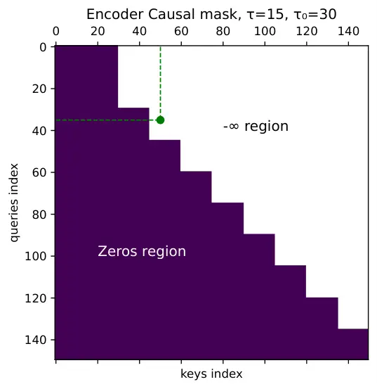
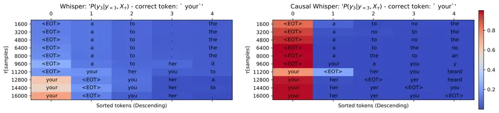

# WhisperRT: Turning Whisper into a Causal Streaming Model

Tomer
Krichli [](https://orcid.org/0009-0005-5461-9030)
   Bhiksha
Raj [](https://orcid.org/0000-0003-0038-5513)
   Joseph
Keshet [](https://orcid.org/0000-0003-2332-5783)
^(†)^(†)thanks: This work has been submitted to the IEEE for possible
publication. Copyright may be transferred without notice, after which
this version may no longer be accessible. T. Krichli and J. Keshet are
with the Andrew and Erna Viterbi Faculty of Electrical and Computer
Engineering, Technion–Israel Institute of Technology, Haifa 3200003,
Israel (e-mail: tomerkrichli@campus.technion.ac.il;
jkeshet@technion.ac.il). B. Raj is with the Language Technologies
Institute, School of Computer Science, Carnegie Mellon University,
Pittsburgh, PA 15213 USA.

###### Abstract

Automatic Speech Recognition (ASR) has seen remarkable progress, with
models like OpenAI Whisper and NVIDIA Canary achieving state-of-the-art
(SOTA) performance in offline transcription. However, these models are
not designed for streaming (online or real-time) transcription, due to
limitations in their architecture and training methodology. We propose a
method to turn the transformer encoder-decoder model into a low-latency
streaming model.

The encoder is made causal to process audio incrementally, while the
decoder conditions on partial encoder states to generate tokens aligned
with the available temporal context. This requires explicit
synchronization between encoded input frames and token emissions. Since
tokens are produced only after sufficient acoustic evidence is observed,
an inherent latency arises, necessitating fine-tuning of the
encoder–decoder alignment mechanism. We propose an updated inference
mechanism that utilizes the fine-tuned causal encoder and decoder to
yield greedy and beam-search decoding, and is shown to be locally
optimal.

Experiments on low-latency chunk sizes (less than 300 msec) show that
our fine-tuned model outperforms existing non-fine-tuned streaming
approaches in most cases, while using a lower complexity. We release our
training and inference code, along with the fine-tuned models, to
support further research and development in streaming ASR.

###### Index Terms: 

Automatic Speech Recognition, Streaming ASR, Whisper, Causal Masking,
Low Latency

## I Introduction

Automatic speech recognition (ASR) systems have made remarkable progress
in recent years, driven in large part by the development of powerful
neural architectures. Since the introduction of the Transformer
architecture \[28\], a wide range of strategies have been proposed to
adapt it to ASR tasks. These include models based solely on the
Transformer encoder \[25, 1, 7\], others employ Transformer decoder-only
architectures \[2, 26\], and some adopt the full Transformer
encoder-decoder model \[24, 19\]. The most well-known model in the
latter category is Whisper \[24\], trained on 680,000 hours of weakly
supervised speech data across 100 languages. Its broad linguistic
coverage and robustness to noise have established it as a strong
baseline for multilingual ASR.

In offline settings, Whisper offers near-unmatched performance in terms
of noise robustness and multilingual versatility \[10\]. Nevertheless,
its non-causal encoder constrains its suitability for streaming
applications. Prior studies \[30, 16\] have investigated deploying
Whisper in a streaming context without additional training, relying
instead on heuristic strategies: _Simul-Whisper_ \[30\] leverages
alignment heads to determine token emission timing, whereas
_Ufal-Whisper_ \[16\] employs an audio buffering mechanism combined with
a local agreement algorithm \[13\] to produce real-time transcriptions.
Although these approaches circumvent fine-tuning, they require padding
inputs to 30 seconds at every step, resulting in sub-optimal
computational efficiency.

U2-Whisper \[32\] proposes fine-tuning Whisper encoder using a causal
mask and trains an additional connectionist temporal classification
(CTC) \[5\] head from scratch. During inference, it performs two-pass
decoding, by first predicting tokens using the CTC head, then ranking
candidates with Whisper decoder. WhisperFlow \[31\] proposes fine-tuning
the Whisper decoder to detect a fixed hush word appended to the end of
each chunk, adapting Whisper to a streaming setting.

We introduce a method to transform the Whisper encoder-decoder
architecture into a fully streaming model that operates with low latency
and without dependence on future context for speech representation
calculation. Unlike prior approaches that either avoid training or rely
on auxiliary heads and multi-pass decoding, the proposed method directly
adapts Whisper’s core components for causal and computationally
efficient inference.

We propose an adaptation of Whisper to operate on a causal audio stream
while preserving its established transcription quality and low word
error rate (WER). The inference procedure is modified accordingly.
First, the encoder is made causal, processing incoming audio
incrementally as a stream rather than as a complete utterance. Under
this formulation, the encoder maintains a rolling causal representation
of the input. Second, the decoder conditions on this partial encoder
state to generate token predictions up to the temporal boundary
represented by the encoder. This requires explicit synchronization
between the input audio frames encoded at a given time and the
corresponding output tokens. Because token generation is performed at
the granularity of complete tokens, an inherent latency arises between
the encoder’s temporal coverage and the timestamp of the most recently
emitted token. Once the subsequent token has been acoustically realized
in the input signal, the decoder is expected to generate the
corresponding prediction. Achieving this behavior necessitates careful
tuning of the synchronization mechanism between encoder progression and
decoder emission.

In practice, this approach is implemented by fine-tuning the model to
adapt encoder representations to a causal streaming setting, together
with the introduction of a time-synchronous decoding mechanism augmented
by confidence-based verification. This mechanism leverages Whisper’s
token-level confidence over time to address instability in the most
recent predictions, which may shift as new audio chunks are incorporated
and the encoder state evolves. Specifically, upon the arrival of each
new audio chunk, a confidence measure derived from the model’s output
distribution is used to assess whether recently emitted tokens should be
retained or revised. To support this behavior, the original non-causal
encoder is modified to operate causally, and both encoder and decoder
are fine-tuned using Low-Rank Adaptation (LoRA) \[8\]. Training is
conducted on a weakly aligned dataset, where alignments are obtained
using forced alignment tools, such as the Montreal Forced Aligner (MFA)
\[17\], enabling the decoder to learn temporal boundary detection under
streaming conditions. This joint adaptation of encoder and decoder
allows the model to accommodate the causal representation without
requiring CTC-based objectives or architectural changes.

The paper is organized as follows. Section II surveys prior work,
Section III outlines the problem setup, Section IV details our inference
methods, Section V details the training process, Section VI provides
efficiency analysis, Section VII presents experimental setup, displays
and discusses results, and Section VIII concludes with future
directions.

For implementation details, refer to our GitHub repository¹¹ 1
[https://github.com/tomer9080/WhisperRT-Streaming](https://github.com/tomer9080/WhisperRT-Streaming)
and the Hugging Face demo page²² 2
[https://huggingface.co/spaces/MLSpeech/WhisperRT-low-latency-streaming](https://huggingface.co/spaces/MLSpeech/WhisperRT-low-latency-streaming).

## II Related Work

A wide range of streaming ASR methods has been proposed over the years.
In this section, we restrict our focus to approaches based on
Transformer architectures \[28\], which currently define the state of
the art in ASR. Moritz _et al._ \[19\] combine a Transformer encoder
with a CTC head and a triggered attention \[20\] decoder. Moritz _et
al._ \[21\] propose a dual causal/non-causal self-attention mechanism in
conjunction with a triggered-attention \[20\] decoder, yielding a dual
ASR model. These works propose models trained from scratch and cannot
easily adapt to our goal of adapting an existing model for streaming
operations. Other works \[2, 26\] investigate decoder-only Transformer
architectures, which naturally fit the streaming paradigm due to the
causal nature of the Transformer decoder; however, again, they do not
fit our goal of adapting an existing encoder-decoder transformer to a
streaming model.

A complementary line of work focuses on augmenting model training with
additional heads and auxiliary objectives. Wang _et al._ \[29\] train a
Transformer encoder to detect word boundaries using forced alignment
\[17\]. Jia _et al._ \[9\] propose a SpeechLLM method that interleaves
audio and text embeddings into a large language model (LLM) decoder,
trained on a CTC-aligned dataset, while limiting the past context
window. Choi _et al._ \[3\] fine-tune self-supervised speech models
(S3Ms), exploring different masking strategies to adapt the models to
streaming. Tsunoo _et al._ \[27\] propose an encoder-decoder Transformer
trained via knowledge distillation \[6, 11, 15\]. To enhance
transcription quality, they introduce block-wise synchronous beam search
combined with block boundary detection techniques. Notably, these
approaches modify the original model structure through additional
components or training objectives.

Although the Whisper model \[24\] was not designed for streaming due to
the non-causal nature of its encoder within the encoder-decoder
framework, several studies have attempted to overcome this limitation.
Macháček _et al._ \[16\] avoid fine-tuning by using an audio buffer as
input and emit transcriptions only after complete utterances are formed,
applying local agreement \[13\] between sub-utterances. Similarly, Wang
_et al._ \[30\] also forgo fine-tuning by developing a heuristic based
on Whisper alignment heads and training a truncation detection module to
determine when to emit tokens. Although these approaches do not require
fine-tuning Whisper, both methods suffer from inefficiencies, as they
require padding each buffer input to the full context length of the
model, resulting in unnecessary computation.

Wang _et al._ \[31\] propose training Whisper’s decoder to detect a
designated hush-word at the end of each chunk, enabling the model to
stop decoding appropriately. They also introduce a hybrid CPU/GPU
pipeline that offloads most of the decoding process to idle CPU
resources. This approach does not require input padding to the full
context length for each chunk, but still performs a non-causal
self-attention calculation on the encoder side.

Zhou _et al._ \[32\] propose training a new CTC head on top of the
Whisper encoder, which is fine-tuned using a causal mask to make the
encoder output compatible with streaming input. In this method,
inference is conducted in two passes: the CTC head predicts the most
probable next token, and the Whisper decoder ranks the candidate
hypotheses. However, this method suggests a more complex decoding
mechanism that requires both the CTC decoder and Whisper’s decoder to
produce a reliable transcription.

While there is a growing body of work aimed at adapting pre-trained
models such as Whisper for streaming applications, existing approaches
have notable limitations. \[30, 16, 31\] do not achieve true streaming
behavior, while \[32\] introduce high computational overhead.
Furthermore, approaches such as those proposed by Zhou _et al._ \[32\]
and Wang _et al._ \[31\] require modifications to the model architecture
or fine-tuning of the entire model, leading to a substantial increase in
the number of parameters needed specifically for streaming tasks, in
addition to the original Whisper model.

## III Problem Setup

We start by describing an encoder-decoder Transformer-based ASR model,
such as Whisper \[24\]. It consists of a front-end composed of a few CNN
layers, a transformer encoder, and a transformer decoder. The model
receives the log-mel spectrogram a feature representation of speech as
input. The input passes through a CNN layer that narrows the time
dimension. Denote
$`\mathbf{X}_{T}=\begin{pmatrix}\mathbf{x}_{1},\ldots,\mathbf{x}_{T}\end{pmatrix}`$
the output sequence from the front-end, which serves as input to the
transformer encoder, where $`T`$ is the duration of the front-end
sequence, and $`\mathbf{x}_{t}\in\mathbb{R}^{d}`$ for $`1\leq t\leq T`$.
The encoder maps the front-end sequence to a sequence of representations
$`\mathbf{Z}_{T}=\begin{pmatrix}\mathbf{z}_{1},\ldots,\mathbf{z}_{T}\end{pmatrix}`$:

```math
\mathrm{Encoder}(\mathbf{X}_{T})=\mathbf{Z}_{T}~, \tag{1}
```

where $`\mathbf{z}_{t}\in\mathbb{R}^{d}`$ for $`1\leq t\leq T`$. The
decoder receives as input the representations from the encoder and
predicts the probability distribution over the possible set of tokens,
$`\mathcal{V}`$, auto-regressively. We denote by
$`\hat{\mathbf{y}}_{<i}`$ the vector of all previous tokens,
$`\hat{\mathbf{y}}_{<i}=(\hat{y}_{1},\ldots,\hat{y}_{i-1})`$. Formally,
the decoder predicts the conditional probability of the next token
$`\hat{y}_{i}\in\mathcal{V}`$ given all previous tokens and the
representations:

```math
\mathrm{Decoder}(\textbf{Z}_{T},\hat{\mathbf{y}}_{<i})=P(\hat{y}_{i}|\hat{\mathbf{y}}_{<i},\mathbf{Z}_{T})~. \tag{2}
```

For ease of notation, we will use the notations
$`{P}(y_{i}|\hat{\mathbf{y}}_{<i},\mathbf{Z}_{T})`$ and
$`{P}(y_{i}|\hat{\mathbf{y}}_{<i},\mathbf{X}_{T})`$ interchangeably,
where they both refer to the same distribution. In the case of
non-streaming greedy decoding, the predicted token is the one that
maximizes the decoder output:

```math
v^{*}_{i}=\arg\max_{v\in\mathcal{V}}P(\hat{y}_{i}=v|\hat{\mathbf{y}}_{<i},\mathbf{Z}_{T}) \tag{3}
```

The non-streaming encoder operates on a fixed number of frames $`T`$ as
input ($`T=1500`$). During streaming, the ASR system processes a _chunk_
of speech composed of $`\tau`$ frames, which correspond to $`\tau`$
vectors of the encoder representation. In other words, $`\tau`$ defines
the resolution at which streaming occurs. More precisely, the $`k`$-th
chunk is represented as
$`\mathbf{X}_{(k-1)\tau}^{k\tau}=(\mathbf{x}_{(k-1)\tau},\mathbf{x}_{(k-1)\tau+1},\ldots,\mathbf{x}_{k\tau-1})`$.
The _streaming encoder_ operates on one such chunk at a time, producing
the corresponding sequence of representations. Consequently, the input
chunk $`\mathbf{X}_{(k-1)\tau}^{k\tau}`$ yields the output
$`\tilde{\mathbf{Z}}_{(k-1)\tau}^{k\tau}`$. As we will show, this
sequence $`\tilde{\mathbf{Z}}_{(k-1)\tau}^{k\tau}`$ differs from the
subsequence $`{\mathbf{Z}}_{(k-1)\tau}^{k\tau}`$, which would result
from encoding the entire front-end output $`\mathbf{X}_{T}`$ and then
selecting the relevant portion spanning $`(k-1)\tau`$ to $`k\tau`$. This
discrepancy motivates our use of distinct notation for these two
sequences. We denote the streaming encoder for input of duration
$`\tau`$ as follows:

```math
\mathrm{StreamingEncoder}({\mathbf{X}}_{(k-1)\tau}^{k\tau})=\tilde{\mathbf{Z}}_{(k-1)\tau}^{k\tau}~. \tag{4}
```

The streaming decoder gets as input the hidden state subsequence
$`\tilde{\mathbf{Z}}_{(k-1)\tau}^{k\tau}`$ and predicts
auto-regressively the probability of the next token
$`\tilde{y}_{i}\in\mathcal{V}`$ given the previous predicted tokens
$`\tilde{\mathbf{y}}_{<i}=(\tilde{y}_{1},\ldots,\tilde{y}_{i-1})`$:

```math
\mathrm{StreamingDecoder}(\tilde{\mathbf{Z}}_{(k-1)\tau}^{k\tau},\tilde{\mathbf{y}}_{<i})={P}(\tilde{y}_{i}|\tilde{\mathbf{y}}_{<i},\tilde{\mathbf{Z}}_{(k-1)\tau}^{k\tau})~. \tag{5}
```

Our goal is to adapt the existing Whisper encoder and decoder to
streaming tasks. Both the encoder and the decoder will be fine-tuned
with the objective that the overall performance of the streaming ASR
will be comparable to that of the offline ASR. Formally, let
$`\mathbf{X}_{k\tau}`$ be the input up to frame $`k\tau`$ and denote by
$`\mathbf{y}_{k\tau}`$ the corresponding ground truth token sequence.
Similarly, denote
$`\hat{\mathbf{y}}_{k\tau},\tilde{\mathbf{y}}_{k\tau}`$ the predicted
token sequence of the offline and the streaming decoder respectively. We
aim that the word error rate (WER) of the streaming decoder
$`\mathrm{WER}(\tilde{\mathbf{y}}_{k\tau},\mathbf{y}_{k\tau})`$ is low
and comparable to
$`\mathrm{WER}(\hat{\mathbf{y}}_{k\tau},\mathbf{y}_{k\tau})`$.

## IV Method

Originally, the transformer encoder utilizes non-causal self-attention
mechanism \[28\]. The encoder is composed of $`L`$ self-attention (SA)
layers. Each SA layer $`l`$ receives an input $`\mathbf{U}^{l-1}_{T}`$
from the previous layer $`l-1`$, where
$`\mathbf{U}^{0}_{T}=\mathbf{X}_{T}`$, and $`T`$ is the total number of
frames in the input. It outputs the queries
$`\mathbf{Q}\in\mathbb{R}^{T\times d}`$, the keys
$`\mathbf{K}\in\mathbb{R}^{T\times d}`$, and values
$`\mathbf{V}\in\mathbb{R}^{T\times d}`$, where $`d`$ denotes the vector
dimension. Specifically, the queries, keys, and values are all
calculated using the same $`\mathbf{U}_{T}`$:

```math
\mathbf{Q}^{l}_{T}=\mathbf{U}^{l-1}_{T}\mathbf{W}^{l}_{Q},~~~\mathbf{K}^{l}_{T}=\mathbf{U}^{l-1}_{T}\mathbf{W}^{l}_{K},~~~\mathbf{V}^{l}_{T}=\mathbf{U}^{l-1}_{T}\mathbf{W}^{l}_{V}~, \tag{6}
```

where
$`\mathbf{W}^{l}_{Q},\mathbf{W}^{l}_{K},\mathbf{W}^{l}_{V}\in\mathbb{R}^{d\times d}`$
are learned matrices for layer $`l`$. The _self-attention_ is defined as

```math
\mathrm{SA}^{l}(\mathbf{U}^{l-1}_{T})=\mathrm{Softmax}\left(\frac{\mathbf{Q}^{l}_{T}{\mathbf{K}^{l}_{T}}^{\top}}{\sqrt{d}}\right)\mathbf{V}^{l}_{T}~. \tag{7}
```

After the self-attention layer, a feed-forward (FF) layer is then
applied using a residual connection.



Fig. 1: Encoder causal mask example, $`\tau=15,\tau_{0}=30`$ given
$`k=10`$ chunks. Such mask applies that the model waits $`600`$ msec for
the first buffer before feeding the input to the encoder. Then, input is
being fed every $`300`$ msec. Purple regions contain zeros while white
regions contain $`-\infty`$. The index (35,50) is marked in a green
point.

### IV-A Streaming Encoder

Working in a streaming setting means that a _mask matrix_ is applied to
the full self-attention matrix to “prevent” access to future input
frames. Elements in the matrix that correspond to no masking are
assigned to be 0 whereas the elements that are masked are assigned the
value of $`-\infty`$. We define two parameters of the masking. Let $`T`$
be the maximal context available on the encoder’s input. Let $`\tau<T`$
be the chunk size or the granularity of encoder frames, and
$`k\in\mathbb{N}`$ the chunk index. In our setting the first chunk is
larger than subsequent chunks, and $`\tau_{0}<T`$ denotes its size.

We exemplify this notation using Figure  1, where we assume a chunk size
of $`\tau=15`$ frames, an initial chunk size of $`\tau_{0}=30`$ frames,
and that the model is currently processing chunk number $`k=10`$. The
mask $`\mathbf{M}(k,\tau,\tau_{0})\in\{0,-\infty\}^{k\tau\times k\tau}`$
is applied to the dot product in the following way:

```math
{\mathrm{\widetilde{SA}}}(\mathbf{X}_{k\tau},\tau,\tau_{0})=\mathrm{Softmax}\left(\frac{\mathbf{Q}_{k\tau}\mathbf{K}_{k\tau}^{\top}+\mathbf{M}(k,\tau,\tau_{0})}{\sqrt{d}}\right)\mathbf{V}_{k\tau} \tag{8}
```

Here we omitted the layer super-script, and (8) refers to any of the
encoder layers. With this masked self-attention mechanism, the encoder’s
representation of the first $`k\tau`$ frames remains unchanged whether
processing is performed chunk by chunk up to chunk $`k`$ or over the
entire input sequence at once, as formalized in Property 2 in the
supplementary material.

### IV-B Streaming Decoder

The streaming decoder receives the encoded speech representation of the
last chunk $`\tilde{\mathbf{Z}}_{(k-1)\tau}^{k\tau}`$ and the previous
predicted tokens $`\tilde{\mathbf{y}}_{<i}`$. Its goal is to predict the
distribution of the next token as in (2). To achieve this, the decoder
employs a cross-attention layer. While cross-attention operates using
the same mechanism as self-attention, it differs in the way queries,
keys, and values are constructed. Specifically, the queries are derived
from the output of the decoder self-attention layers up-to the previous
token, denoted as $`\bar{\mathbf{U}}^{l}_{<i}`$, while the keys and
values come from the acoustic feature representations
$`\tilde{\mathbf{Z}}_{k\tau}`$. Thus, a cross-attention layer is defined
as follows:

```math
\mathbf{Q}^{l}_{<i}=\bar{\mathbf{U}}^{l-1}_{<i}\bar{\mathbf{W}}^{l}_{Q},\quad\mathbf{K}^{l}_{k\tau}=\tilde{\mathbf{Z}}_{k\tau}\bar{\mathbf{W}}^{l}_{K},\quad\mathbf{V}^{l}_{k\tau}=\tilde{\mathbf{Z}}_{k\tau}\bar{\mathbf{W}}^{l}_{V} \tag{9}
```

where
$`\bar{\mathbf{W}}^{l}_{Q},\bar{\mathbf{W}}^{l}_{K},\bar{\mathbf{W}}^{l}_{V}\in\mathbb{R}^{d\times d}`$
are learned matrices for layer $`l`$ of the decoder. The
_cross-attention_ is defined as

```math
\mathrm{CA}^{l}(\bar{\mathbf{U}}^{l-1}_{<i},\tilde{\mathbf{Z}}_{k\tau})=\mathrm{Softmax}\left(\frac{\mathbf{Q}^{l}_{<i}{\mathbf{K}^{l}_{k\tau}}^{\top}}{\sqrt{d}}\right)\mathbf{V}^{l}_{k\tau} \tag{10}
```

Overall, the decoder is built from a self-attention layer, a
cross-attention layer and a feed-forward layer with residual
connections.

Fig. 2: The inference process, using a chunk size of $`\tau`$, initial
chunk of size $`\tau_{0}=\tau`$. The figure also illustrates how
attention weight matrices are computed, specifically, within the
encoder’s self-attention and the decoder’s cross-attention mechanisms.

### IV-C Streaming Inference



Fig. 3: Token distribution for the Whisper model (left) and WhisperRT
(right) for third token over time, conditioned on the ground truth
prefix ‘she had.’ The right color bar indicates the confidence scale for
both models, with red regions representing higher confidence values. The
full utterance is: “she had your dark suit in greasy wash water all
year.” The plots show the probability distribution of the third token,
rather than the sequence of predicted tokens. As such, _EOT_ is the
predicted token until there is sufficient acoustic evidence to predict
‘your.’ Hence, the token ‘had’ does not appear before the token ‘your.’

The heart of our algorithmic novelty lies in the inference mechanism.
Decoding the optimal token sequence is typically framed as predicting
the most probable token

```math
v^{*}_{i}=\arg\max_{v\in\mathcal{V}}P(\hat{y}_{i}=v|\hat{\mathbf{y}}_{<i},\mathbf{Z}_{T})~. \tag{11}
```

Throughout this paper, we primarily use the _max_ operation to represent
_greedy decoding_, where the token with the highest conditional
probability is selected at each step. While it is possible to _sample_
tokens from the probability distribution instead, this alternative is
only considered in the context of _beam search_ decoding.

Applying the inference procedure (11) to the streaming setting presents
two primary challenges, especially when processing fixed-size input
chunks that may not align with token boundaries. First, a token may be
_partially_ contained within an input chunk, with the remainder spanning
into the next one. In such cases, the model lacks sufficient information
to confidently predict the complete token. Second, the chunk may not
provide enough contextual information, leading to premature or unstable
token predictions that would differ if future input were available,
especially for tokens with similar phonetic content. To overcome these
obstacles, we propose a decoding mechanism that supports token-level
regression, allowing the decoder to revise past predictions in light of
new information.

To motivate our approach, consider Figure 3, which illustrates the most
probable tokens with temporal alignment. The X-axis shows the top-5
token predictions, while the Y-axis denotes the number of processed
acoustic frames. The fine-tuned _WhisperRT_ model (right) exhibits
increasing confidence in the correct token as more acoustic context
becomes available, in contrast to the vanilla Whisper model (left).
Notably, the fine-tuned model predicts the correct token your one frame
earlier than the vanilla model.

A token is considered _stable_ if its prediction is consistent across
two consecutive input chunks. When this condition is met, the prediction
is considered _finalized_. In contrast, _unstable_ tokens, those with
inconsistent predictions are discarded, and decoding is resumed from the
first unstable position. We describe this heuristic in the context of
both greedy decoding and beam search decoding.

#### IV-C1 Greedy Streaming Decoding

Greedy decoding is a decoding strategy in which, at each time step, the
model selects the token with the highest predicted probability, without
considering alternative candidates. We start with a definition of a
_stable token_ for greedy decoding.

###### Definition 1 (Stable token for greedy decoding).

A token $`y_{i}=v`$ predicted in the $`k`$-th chunk _stable under greedy
decoding_ if it satisfies at least one of the following conditions.
Either the token $`v`$ has a greater or equal probability given a new
chunk relative to the previous chunk:

```math
P(y_{i}=v\mid\mathbf{y}_{<i},\mathbf{X}_{k\tau})\geq P(y_{i}=v\mid\mathbf{y}_{<i},\mathbf{X}_{(k-1)\tau}) \tag{12}
```

or $`v`$ is the most probable token given the new chunk:

```math
v=\arg\max_{u\in\mathcal{V}}P(y_{i}=u\mid\mathbf{y}_{<i},\mathbf{X}_{k\tau})~. \tag{13}
```

That is, a token is considered stable as long as it remains the most
probable token in the distribution. Additionally, a token may be marked
as stable even if it is not the most probable token, but its probability
increases along time.

The greedy decoding algorithm is modified as follows: upon the arrival
of a new chunk $`k`$, the prediction of token $`i`$ proceeds only if all
of the last $`n`$ tokens have been verified as stable. Otherwise, the
decoding process is resumed from the index of the first unstable token,
discarding any subsequent tokens. The complete greedy streaming decoding
process is presented in Algorithm 1.

The next claim states that our proposed greedy decoding will have at
least a locally optimal token prediction, given that the probability
$`P(y_{i}\mid\mathbf{y}_{<i},\mathbf{X}_{k\tau})`$ was correctly
estimated.

###### Claim 1 (Streaming greedy decoding optimality).

Let

```math
P^{*}(y_{i}\mid\mathbf{y}_{<i},\mathbf{X}_{k\tau}) \tag{14}
```

be the optimal probability distribution of the $`i`$-th token given the
preceding tokens, and the acoustic data till $`k\tau`$. Denote by
$`\rho_{k}`$ the _probability path_ of the predicted token sequence
until the $`k`$-th chunk. Our proposed greedy decoding algorithm, as
depicted on Algorithm 1, is optimal in the sense that it yields a
probability path $`\rho_{k}^{\text{CW}}`$ which is larger or equal on
the probability path of the greedy algorithm, $`\rho_{k}^{\text{G}}`$.

The claim is proven by induction and is included in the supplementary
material.

#### IV-C2 Beam-Search Streaming Decoding

Beam search decoding is a heuristic search algorithm that explores
multiple hypotheses at each time step, maintaining the top-scoring
sequences within a fixed-size beam to balance between accuracy and
computational efficiency. We enhance the beam search decoding process by
adding a stability check on the last $`n`$ tokens when a new chunk
arrives. Let $`b`$ denote the beam size. A token is considered stable if
and only if it remains within the top-$`b`$ candidates (i.e., within the
beam) after incorporating the latest acoustic frame. We define the
operator $`\mathrm{TopK}`$ as follows.

###### Definition 2 (Top-$`k`$ operator).

Let $`\mathbf{p}\in\mathbb{R}^{|\mathcal{V}|}`$ be a vector of
real-valued scores indexed over a finite set $`\mathcal{V}`$. The
_Top-$`k`$ operator_, denoted by $`\mathrm{TopK}(\mathbf{p},k)`$,
returns the set of indices corresponding to the $`k`$ largest values in
$`\mathbf{p}`$:

```math
\mathrm{TopK}(\mathbf{p},k)=\left\{j\in\mathcal{V}\,\middle|\,j\text{ is among the }k\text{ largest entries of }\mathbf{p}\right\}. \tag{15}
```

Now we can define a stable token for the beam search decoding.

###### Definition 3 (Stable token for beam search decoding).

A token $`y_{i}=v`$ is defined _stable under beam search decoding_ if it
satisfies:

```math
v\in\mathrm{TopK}\left(P(y_{i}\mid\mathbf{y}_{<i},\mathbf{X}_{k\tau}),b\right)\\
 \tag{16}
```

and

```math
P(y_{i}=v\mid\mathbf{y}_{<i},\mathbf{X}_{k\tau})\geq P(y_{i}=v\mid\mathbf{y}_{<i},\mathbf{X}_{(k-1)\tau}) \tag{17}
```

That is, the token is stable if it remains within the top-$`b`$ most
probable candidates at its position in the current beam step, and its
probability gradient is non-negative.

Unlike greedy decoding, where a single prediction path is followed, beam
search maintains multiple hypotheses in parallel. Typically, decoding is
considered complete only once a sufficient number of hypotheses have
terminated, i.e., their final token is the end-of-transcription (_EOT_)
symbol. However, in the streaming setting, this approach can introduce
errors such as hallucinations or repeated phrases. This often occurs
because the input buffer may end mid-word, leading some beams to favor
repetitive completions or hallucinated content rather than emitting
_EOT_. To mitigate this, we adopt a greedy-style stopping criterion: if
any hypothesis within the beam predicts an _EOT_ token, the decoding is
paused until the next acoustic frame is received.

1:  Input: $`n`$

2:  Output: $`\hat{\mathbf{y}}`$

3:  $`\hat{\mathbf{y}}\leftarrow\varnothing`$

4:  completed $`\leftarrow`$ False

5:  for $`k\in\{0,\ldots,\frac{T}{\tau}\}`$ do

6:   new_chunk $`\leftarrow`$ True

7:   while not completed do

8:    if new_chunk then

9:     new_chunk $`\leftarrow`$ False // Check for unstable tokens

10:     for $`m\in\{n-1,n-2,\ldots,0\}`$ do

11:      if token $`y_{i-m}`$ is unstable then

12:       $`\hat{\mathbf{y}}\leftarrow\hat{\mathbf{y}}_{<i-m}`$

13:       break

14:      end if

15:     end for

16:    end if// Decode greedily

17:
   $`\hat{\mathbf{y}}\leftarrow\hat{\mathbf{y}}_{<i-m}\oplus{\mathrm{arg}\max}~{P}(\hat{y}_{i-m}\mid\hat{\mathbf{y}}_{<i-m},\mathbf{X}_{k\tau})`$

18:    completed $`\leftarrow EOT\in\hat{\mathbf{y}}`$

19:   end while

20:  end for

21:  return $`\hat{\mathbf{y}}`$

Algorithm 1 Streaming Greedy Decoding

1:  Input: $`n,b`$

2:  Output: $`\hat{\mathbf{y}}`$ // Initialize beam

3:  $`\mathcal{B}\leftarrow\varnothing`$

4:  completed $`\leftarrow`$ False

5:  for $`k\in\{0,\ldots,\frac{T}{\tau}\}`$ do

6:   new_chunk $`\leftarrow`$ True

7:   while not completed do

8:    for $`\mathbf{y}\in\mathcal{B}`$ do

9:     if new_chunk then

10:      new_chunk $`\leftarrow`$ False // Check for unstable tokens

11:      for $`m\in\{n-1,n-2,\ldots,0\}`$ do

12:       if token $`y_{i-m}`$ is unstable then

13:        $`\hat{\mathbf{y}}\leftarrow\mathbf{y}_{<i-m}`$

14:        break

15:       end if

16:      end for

17:     end if// Decode with beam-search

18:     for
$`t\in\mathrm{TopK}\left(\log P(\hat{y}_{i-m}~|~\hat{\mathbf{y}}_{<i-m},\mathbf{X}_{k\tau}),b\right)`$
do

19:      $`\tilde{\mathbf{y}}\leftarrow\hat{\mathbf{y}}\oplus t`$

20:      $`\mathcal{B}\leftarrow\mathcal{B}\cup\tilde{\mathbf{y}}`$

21:     end for

22:    end for// Store in beam top $`b`$ hypotheses

23:    $`\mathcal{B}\leftarrow\mathrm{TopK}(\mathcal{B},b)`$

24:    completed $`\leftarrow`$ EOT $`\in\mathcal{B}`$

25:   end while

26:  end for

27:  return $`\mathbf{y}`$ - the most probable token sequence in
$`\mathcal{B}`$

Algorithm 2 Streaming Beam Search Decoding

The full beam search algorithm is available on Algorithm 2. Note that
the suggested version of beam search decoding involves a varying length
of beams during the decoding process, since the stability check per
token might yield different regression indices. We maintain this beam
set $`\mathcal{B}`$ by adding padding tokens, that their probability is
not being examined when we check for the stability condition on the
arrival of a new chunk to the model. Using such beam set allows us to
stop the search when EOT is in the beam, while keeping relevant beams of
different lengths.

## V Fine-tuning Process

Fig. 4: Illustration of the fine-tuning process. The example depicts an
encoder operating with a chunk size of $`300`$ msec. This approach
improves training efficiency by avoiding the need to process every
possible frame in the streaming setting.

To support the streaming encoder, streaming decoder, and the proposed
streaming inference procedure, the model must be fine-tuned. The process
is described below and illustrated in Fig. 4. We define two primary
training objectives: (i) adapting the encoder to produce a causal speech
representation, and (ii) training the decoder to determine when to emit
a new token. To achieve these objectives, we integrate LoRA layers \[8\]
into the encoder’s self-attention layers, as well as into the decoder’s
self-attention and cross-attention layers. This design ensures that only
the LoRA parameters are updated during training, yielding a compact and
efficient module that supports both offline and streaming transcription.
The complete fine-tuning procedure is detailed in Algorithm 3.

To facilitate efficient fine-tuning, we fix a chunk size
$`\tau\in\mathbb{N}`$ such that $`0<\tau\leq T`$, where $`T`$ denotes
the maximum encoder context length. The self-attention mask is defined
based on this chunk size $`\tau`$, and an initial chunk size
$`0<\tau_{0}\leq T`$ is used. Note that while sharing the same mask
across all fine-tuning steps increases efficiency, it limits the model’s
generalization to other chunk sizes.

A naive adaptation strategy involves evaluating all possible time points
at intervals of $`20\tau`$ msec, denoted by the set $`I`$, computing the
corresponding target labels using the weak alignment generated via force
alignment \[17\], and back-propagating the loss. To address the
inefficiency of enumerating all possible alignments, we sample only a
subset of the time points in $`I`$. Specifically, for each fine-tuning
step, we define a sampling fraction $`\hat{f}\in(0,1]`$ and randomly
select $`\hat{f}\cdot|I|`$ time points from $`I`$, denoted as
$`\tilde{I}`$. We then iterate over this sampled set $`\tilde{I}`$
during the fine-tuning step. At each fine-tuning sub-step $`j`$, we
compute the corresponding target sequence
$`\mathbf{y}_{<\tilde{I}_{j}}`$ as:

```math
\mathbf{y}_{<\tilde{I}_{j}}=\{y_{i}\mid t_{\text{end}}(y_{i})\leq\tilde{I}_{j}~\text{sec}\} \tag{18}
```

Here, $`t_{\text{end}}(y_{i})`$ is the end time of token $`y_{i}`$,
determined from the forced alignment. For each sub-step, the model is
optimized using a cross-entropy loss, $`\mathcal{L}_{CE}`$, computed
over $`\mathbf{y}_{<\tilde{I}_{j}}`$ and
$`\hat{\mathbf{y}}_{<\tilde{I}_{j}}`$.

Finally, we introduce a random chunk-size masking strategy during
fine-tuning. While the proposed procedure effectively trains a streaming
model for a fixed chunk size $`\tau`$, it limits inference to that
specific duration. To overcome this limitation, we adopt a random
chunk-size masking scheme, in which chunk sizes are uniformly sampled
between 0.1 and 1.0 seconds during training. This improves the model’s
ability to generalize across varying chunk sizes at inference time. We
denote $`\bar{f}`$ as the number of sub-sequences within a batch used
for training at each step.

1:  Input: Whisper NN - $`\mathcal{M}^{LoRA}`$, Dataset -
$`\mathcal{D}`$, chunk size $`\tau`$, initial chunk size $`\tau_{0}`$,
sample points fraction $`\hat{f}`$.

2:  for $`\mathcal{B}`$ in $`\mathcal{D}`$ do

3:   $`\mathbf{X},\mathbf{y}\leftarrow\mathcal{B}`$

4:
  $`\tilde{I}\leftarrow\mathrm{getSamplePoints}(\tau,\tau_{0},\hat{f})`$

5:   for $`j`$ in $`\{0,1,\ldots,|\tilde{I}|-1\}`$ do

6:
   $`\hat{\mathbf{y}}\leftarrow\mathcal{M}^{LoRA}(\mathbf{X}_{\tilde{I}_{j}},\mathbf{y}_{<j},\tau,\tau_{0})`$

7:    $`\ell\leftarrow\mathcal{L}_{CE}(\hat{\mathbf{y}},\mathbf{y})`$

8:    calculateGradients($`\ell`$)

9:    optimizerStep()

10:   end for

11:  end for

Algorithm 3 Streaming Whisper LoRA Fine-Tuning Process

## VI Efficiency

Before turning to empirical evaluation of our proposed method we present
efficiency consideration and implementation of KV-cache both for the
encoder and the decoder. We then state the complexity of the proposed
algorithm.

### VI-A KV-Cache: Encoder

When using causal self-attention, the encoder’s computation can be
optimized through a KV-cache mechanism. Because new acoustic frames
depend only on the current chunk and past inputs, the key and value
matrices ($`\mathbf{K}`$, $`\mathbf{V}`$) at each layer can be cached
rather than recomputed at every iteration—similar to the caching
strategy used in causal decoders.

By design, the output of the encoder at position $`t`$ is influenced
only by the $`t`$-th row of the self-attention weights matrix. When
applying a causal mask, each encoder output at index $`t`$ is
conditioned solely on the current and preceding chunks. As a result,
previously computed matrices $`\mathbf{K}`$ and $`\mathbf{V}`$ remain
valid for future steps and can be reused. This caching mechanism reduces
the encoder’s computational complexity from quadratic to linear,
significantly improving efficiency during streaming inference. A
detailed complexity analysis is provided in Section VI-C.

### VI-B KV-Cache: Decoder

The decoder incorporates two distinct attention mechanisms:
self-attention and cross-attention, each with its own KV-cache policy.

##### Cross-Attention KV-Cache

As discussed in Section VI-A and formalized in Property 2 in the
supplementary material, encoder outputs corresponding to past acoustic
frames are independent of future inputs. Therefore, when a new audio
chunk arrives, the decoder computes $`\mathbf{K}`$ and $`\mathbf{V}`$
values only for this new chunk. Previously processed chunks are stored
and reused. The dot product between the new query and the cached
key-value pairs is then calculated as usual.

##### Self-Attention KV-Cache

In contrast to cross-attention cache, caching self-attention activations
in the decoder is less straightforward. This is due to the dynamic
nature of the decoder’s input embeddings: each buffer update introduces
new acoustic information, which alters the decoder’s context and thus
the token embeddings.

This distributional drift arises because the decoder continuously
receives new audio data. Each decoder layer depends on a causal
self-attention block, a cross-attention block, and a feed-forward
network. While the self-attention is strictly causal (only attending to
past tokens), the cross-attention is not: decoded tokens may attend to
future acoustic frames.

Consequently, applying a self-attention KV-cache in the decoder, as done
in offline settings, is no longer valid. To address this, we introduce
an approximation: from some time index $`k\tau<T`$, we assume that
$`\mathbf{K}_{k\tau}^{T},\mathbf{V}_{k\tau}^{T}`$ contribute negligibly
to subsequent cross-attention computations. Beyond this point, token
embeddings are considered stable and can be cached. However, this
assumption often fails in practice, as many cross-attention heads are
not temporally aligned or monotonic.

Despite this, we propose to empirically examine this approximation to
assess whether our fine-tuning method induces more monotonic or stable
behavior in the model’s attention patterns.

### VI-C Complexity Analysis

Since the proposed streaming Transformer model does not rely on
non-causal attention, we conduct a complexity analysis to estimate its
computational efficiency advantages.

###### Theorem 1.

Let $`T`$ be the input sequence length to the encoder, $`d`$ the
embedding dimension, and $`\tau`$ the chunk size, with $`0<\tau\ll T`$.
The computation of blocked causal attention over the full sequence
during streaming requires $`\mathcal{O}(T^{2}d+Td^{2})`$ operations and
$`\mathcal{O}(Td)`$ additional memory.

The proof is provided in the supplementary material. In contrast,
methods such as \[16, 30\], which do not fine-tune Whisper, pad the
input signal to the maximum context size whenever a new frame arrives.
As a result, the encoder must perform $`\mathcal{O}(T^{2}d+Td^{2})`$
operations for each chunk \[28\]. Given $`\frac{T}{\tau}`$ chunks, the
total encoder-side computational cost becomes
$`\mathcal{O}\left(\frac{T^{3}d}{\tau}+\frac{T^{2}d^{2}}{\tau}\right)`$
operations. This difference is expected to have a significant impact,
especially in low-latency scenarios where the chunk size is small
($`\tau\ll T`$), and when using a larger model where $`d`$ is larger. A
further demonstration of the runtime advantage appears in Section VII-F.

## VII Experiments

We evaluate _WhisperRT_ across several tasks. First, we focus on its
primary objective: streaming transcription, assessed using word error
rate (WER) and related variants, which we detail below. We then analyze
runtime performance using metrics such as Real-Time Factor (RTF) and
average latency.

### Evaluation Metrics

To better assess streaming transcription quality, we employ metrics that
are more suitable for streaming scenarios than the standard Word Error
Rate (WER).

##### Relative Word Error Rate (RWER)

Let $`\hat{\mathbf{y}}_{\tau}`$ be the hypothesis generated by the
streaming model up until time point $`\tau`$, containing
$`\tilde{N}_{\tau}`$ words. Define the set
$`\hat{\mathcal{Y}}=\{\hat{\mathbf{y}}_{0},\ldots,\hat{\mathbf{y}}_{T}\}`$
as the set of hypotheses generated throughout the decoding process. Let
$`\mathbf{y}`$ be the ground-truth transcription, consisting of $`N`$
words, and let $`\mathbf{y}_{\tilde{N}_{\tau}}`$ be the prefix of the
ground-truth string up to the $`\tilde{N}_{\tau}`$-th word. Finally, let
$`I`$, $`D`$, $`S`$, and $`C`$ denote insertions, deletions,
substitutions, and correct predictions, respectively. Then, RWER is
defined as:

```math
\mathrm{RWER}(\mathbf{y},\hat{\mathcal{Y}})\!=\!\frac{\sum_{\tau}I(\mathbf{y}_{\tilde{N}_{\tau}},\hat{\mathbf{y}}_{\tau})+D(\mathbf{y}_{\tilde{N}_{\tau}},\hat{\mathbf{y}}_{\tau})+S(\mathbf{y}_{\tilde{N}_{\tau}},\hat{\mathbf{y}}_{\tau})}{\sum_{\tau}C(\mathbf{y}_{\tilde{N}_{\tau}},\hat{\mathbf{y}}_{\tau})+D(\mathbf{y}_{\tilde{N}_{\tau}},\hat{\mathbf{y}}_{\tau})+S(\mathbf{y}_{\tilde{N}_{\tau}},\hat{\mathbf{y}}_{\tau})}
```

The motivation behind RWER is to evaluate the quality of the partial
transcription at each time point, without penalizing for alignment
mismatches.

When transcribing streaming audio, the complete transcription must be
produced by the end of the stream, while minimizing per-word latency.
Since RWER does not capture latency or alignment, we introduce an
additional metric.

##### Aligned-Relative Word Error Rate (ARWER)

Let $`\mathbf{y}`$ be the ground-truth transcription containing $`N`$
words, and $`\hat{\mathbf{y}}_{\tau}`$ the hypothesis at time $`\tau`$
with $`\tilde{N}_{\tau}`$ words. Define
$`\hat{\mathcal{Y}}=\{\hat{\mathbf{y}}_{0},\hat{\mathbf{y}}_{1},\ldots,\hat{\mathbf{y}}_{T}\}`$
as before. Let $`\mathbf{y}_{\tau}`$ denote the prefix of the
ground-truth that includes only words whose end time is before time
$`\tau`$. Then, The ARWER is defined as:

```math
\mathrm{ARWER}(\mathbf{y},\hat{\mathcal{Y}})\!=\!\frac{\sum_{\tau}I\left(\mathbf{y}_{\tau},\hat{\mathbf{y}}_{\tau}\right)+D\left(\mathbf{y}_{{}_{\tau}},\hat{\mathbf{y}}_{\tau}\right)+S\left(\mathbf{y}_{{}_{\tau}},\hat{\mathbf{y}}_{\tau}\right)}{\sum_{\tau}C\left(\mathbf{y}_{{}_{\tau}},\hat{\mathbf{y}}_{\tau}\right)+D\left(\mathbf{y}_{{}_{\tau}},\hat{\mathbf{y}}_{\tau}\right)+S\left(\mathbf{y}_{{}_{\tau}},\hat{\mathbf{y}}_{\tau}\right)}
```

ARWER is better suited for evaluating transcription quality over time,
as it considers alignment between the hypothesis and the ground-truth
words that are expected to have been transcribed by each point. Models
with higher per-word latency will tend to have higher ARWER, due to
increased deletions.

##### Word Error Rate (WER)

We also report the standard WER, calculated between the final hypothesis
produced at the end of streaming and the full ground-truth
transcription.

((a))

((b))

Fig. 5: ARWER vs. Chunk Size per method, on _large-v2_ models. Left sub
figure presents the results on LibriSpeech test-clean. Right sub figure
presents the results on LibriSpeech test-other

### VII-A English transcription

For the English transcription task, we fine-tuned three different sizes
of the Whisper model: _base_, _small_, and _large-v2_. All models were
fine-tuned on the LibriSpeech-train dataset \[22\], which consists of
960 hours of read speech. In order to preserve Whisper’s punctuations
capabilities, we used Librispeech-PC \[18\] that includes punctuated
transcripts. The _base_ and _small_ models were fine-tuned using LoRA
layers with a rank of $`r=32`$, while the _large-v2_ model was
fine-tuned with $`r=4`$. Fine-tuning was conducted using chunk sizes
selected from the set $`\{40,100,200,300\}`$ msec, with an initial chunk
size of $`600`$ milliseconds. We used cross-entropy as the loss function
and optimized the models with the AdamW optimizer \[14\], using an
initial learning rate of $`1\text{e}^{-5}`$. Full details can be found
in the supplementary material.

Evaluation was performed on the LibriSpeech _test-clean_ and
_test-other_ splits, and TED-LIUM3-test split. Each fine-tuned model was
evaluated on these datasets using both greedy streaming decoding and
streaming beam search with beam size $`b=3`$ and $`n=2`$. We report the
results for decoding using the beam search setup. We compared our
results against _Simul-Whisper_ \[30\] and _Ufal-Whisper_ \[16\], using
the same chunk size settings.

Figure 5 presents ARWER results across the different methods. The
results indicate that our training approach enhances Whisper’s alignment
capabilities and outperforms the heuristic approach used in
_Simul-Whisper_ and _Ufal-Whisper_ for both greedy decoding and beam
search.

Complete evaluation results are reported in Table I. The best scores per
metric, per dataset, and per chunk size are marked in bold. Overall, our
method consistently outperforms competing approaches across most model
sizes on both _test-clean_ and _test-other_ sets. Our _base_ and _small_
models seem to have inferior generalization on TED-LIUM3, especially on
larger chunk sizes. We suggest that it might be related to the
relatively high rank that is used in order to fine tune both models,
since our _large-v2_ model performs better on the same dataset, using a
lower rank.

### VII-B Choice of forced aligner

Given the variety of available tools for speech dataset alignment, we
evaluated the impact of using different forced aligners during training.
We compared the Montréal Forced Aligner (MFA) \[17\] against Massively
Multilingual Speech (MMS) \[23\]. This comparison was restricted to the
_base_ and _small_ model architectures. Full results are presented in
Table II. Overall, the choice of aligner had a negligible effect on
final performance, with both methods yielding comparable results.

### VII-C Training with a random chunk size mask

Building upon the discussion in Section V, we trained base, small, and
large-v2 models using a random chunk size mask with $`\bar{f}=30`$.
Detailed results are provided in Table III. In general, performance
degrades for the 100 ms chunk size compared to models trained with a
fixed-size mask. However, for larger chunk sizes, such as 200 ms and 300
ms, the performance gap is minimal or even comparable.

|          |                        |            |            |       |       |            |        |       |           |       |
| -------- | ---------------------- | ---------- | ---------- | ----- | ----- | ---------- | ------ | ----- | --------- | ----- |
| Model    | System                 |            | test-clean |       |       | test-other |        |       | TED-LIUM3 |       |
|          | Method                 | Chunk Size | RWER       | ARWER | WER   | RWER       | ARWER  | WER   | RWER      | WER   |
| base     | Simul-Whisper \[30\]   | 40         | 27.54      | 30.60 | 25.78 | 42.84      | 48.15  | 42.82 | 23.76     | 24.57 |
|          |                        | 100        | 21.60      | 24.82 | 18.27 | 32.26      | 36.15  | 31.49 | 15.28     | 14.92 |
|          |                        | 200        | 13.33      | 16.68 | 12.58 | 27.04      | 30.94  | 26.02 | 12.46     | 12.02 |
|          |                        | 300        | 13.52      | 16.86 | 12.79 | 24.27      | 27.85  | 23.46 | 12.46     | 11.40 |
|          | Ufal-Whisper \[16\]    | 40         | 48.95      | 60.24 | 49.75 | 57.40      | 71.35  | 55.83 | 37.77     | 36.40 |
|          |                        | 100        | 24.01      | 29.26 | 21.43 | 32.37      | 38.63  | 29.43 | 19.62     | 17.81 |
|          |                        | 200        | 12.14      | 14.18 | 11.04 | 20.57      | 22.64  | 18.74 | 12.38     | 10.63 |
|          |                        | 300        | 8.21       | 9.56  | 7.60  | 16.78      | 18.06  | 15.45 | 9.67      | 8.14  |
|          | WhisperRT              | 40         | 10.57      | 11.44 | 9.04  | 23.19      | 23.22  | 20.91 | 17.56     | 14.40 |
|          |                        | 100        | 9.28       | 9.99  | 7.75  | 20.36      | 20.25  | 17.91 | 15.42     | 12.49 |
|          |                        | 200        | 8.16       | 8.85  | 6.86  | 18.61      | 18.52  | 16.17 | 13.33     | 10.74 |
|          |                        | 300        | 7.53       | 8.12  | 6.55  | 16.95      | 16.93  | 15.18 | 12.72     | 10.46 |
|          | Offline Whisper \[24\] | \-         | \-         | \-    | 5.00  | \-         | \-     | 12.40 | \-        | 5.00  |
| small    | Simul-Whisper \[30\]   | 40         | 17.07      | 21.52 | 14.68 | 29.17      | 35.64  | 32.71 | 14.53     | 14.18 |
|          |                        | 100        | 10.06      | 14.25 | 8.97  | 21.05      | 27.27  | 21.99 | 10.79     | 10.35 |
|          |                        | 200        | 8.03       | 13.22 | 7.58  | 18.02      | 23.41  | 19.26 | 8.84      | 7.06  |
|          |                        | 300        | 6.88       | 12.21 | 6.43  | 15.69      | 21.66  | 15.76 | 8.16      | 6.69  |
|          | Ufal-Whisper \[16\]    | 40         | 50.20      | 62.01 | 47.95 | 59.90      | 75.70  | 57.07 | 37.08     | 34.11 |
|          |                        | 100        | 19.57      | 27.02 | 17.99 | 27.26      | 35.01  | 24.50 | 17.11     | 15.21 |
|          |                        | 200        | 8.04       | 11.87 | 7.80  | 14.57      | 18.01  | 13.45 | 10.22     | 8.52  |
|          |                        | 300        | 5.68       | 7.40  | 5.42  | 11.26      | 13.06  | 10.60 | 8.55      | 6.66  |
|          | WhisperRT              | 40         | 6.91       | 8.59  | 5.94  | 16.50      | 17.40  | 14.79 | 14.88     | 11.91 |
|          |                        | 100        | 6.33       | 7.86  | 5.54  | 15.12      | 15.94  | 13.68 | 12.24     | 9.69  |
|          |                        | 200        | 5.61       | 6.93  | 4.90  | 13.23      | 14.01  | 11.86 | 10.35     | 8.50  |
|          |                        | 300        | 5.39       | 6.69  | 5.11  | 12.49      | 13.22  | 11.31 | 9.84      | 7.81  |
|          | Offline Whisper \[24\] | \-         | \-         | \-    | 3.40  | \-         | \-     | 7.60  | \-        | 4.30  |
| large-v2 | Simul-Whisper \[30\]   | 40         | 14.59      | 17.05 | 13.63 | 26.07      | 28.44  | 24.62 | 12.75     | 11.64 |
|          |                        | 100        | 9.33       | 11.66 | 7.87  | 18.26      | 20.48  | 15.97 | 9.56      | 9.70  |
|          |                        | 200        | 6.62       | 9.19  | 5.61  | 14.65      | 17.30  | 13.24 | 8.31      | 8.08  |
|          |                        | 300        | 5.67       | 8.17  | 4.57  | 12.68      | 15.48  | 11.21 | 8.05      | 7.89  |
|          | Ufal-Whisper\[16\]     | 40         | 76.72      | 99.86 | 78.40 | 90.68      | 124.68 | 97.93 | 71.05     | 81.88 |
|          |                        | 100        | 32.15      | 40.50 | 27.64 | 40.57      | 49.94  | 35.27 | 30.25     | 30.51 |
|          |                        | 200        | 12.78      | 21.29 | 11.26 | 18.00      | 25.17  | 15.70 | 13.65     | 13.31 |
|          |                        | 300        | 6.79       | 16.82 | 7.50  | 10.88      | 18.82  | 10.76 | 8.95      | 8.82  |
|          | WhisperRT              | 40         | 6.33       | 8.65  | 5.94  | 14.74      | 16.28  | 13.35 | 11.41     | 10.38 |
|          |                        | 100        | 5.53       | 7.40  | 5.07  | 12.54      | 13.91  | 11.17 | 9.80      | 7.71  |
|          |                        | 200        | 5.02       | 6.79  | 5.24  | 11.73      | 12.88  | 10.34 | 9.07      | 7.67  |
|          |                        | 300        | 4.61       | 6.29  | 4.98  | 10.69      | 11.76  | 9.57  | 8.70      | 7.22  |
|          | Offline Whisper \[24\] | \-         | \-         | \-    | 2.70  | \-         | \-     | 5.20  | \-        | 3.70  |

TABLE I: RWER, ARWER, WER (%) across models, latency, and metrics. Best
results per latency and dataset for each metric are in bold. Whisper
results on a non streaming case are added for comparison.

Model Chunk Size test-clean test-other TED-LIUM3 MFA MMS MFA MMS MFA MMS
RWER ARWER WER RWER ARWER WER RWER ARWER WER RWER ARWER WER RWER WER
RWER WER base 40 10.57 11.44 9.04 10.68 11.53 9.07 23.19 23.22 20.91
23.22 23.15 20.61 17.56 14.40 17.80 14.51 100 9.28 9.99 7.75 9.23 10.01
7.70 20.36 20.25 17.91 20.18 20.17 18.21 15.42 12.49 14.92 12.26 200
8.16 8.85 6.86 8.48 9.15 7.20 18.61 18.52 16.17 18.07 18.05 15.90 13.33
10.74 13.20 10.34 300 7.53 8.12 6.55 7.84 8.51 6.85 16.95 16.93 15.18
17.03 17.05 15.14 12.72 10.46 12.54 10.16 small 40 6.91 8.59 5.94 7.27
8.85 6.16 16.50 17.40 14.79 16.98 17.77 15.04 14.88 11.91 14.37 11.06
100 6.33 7.86 5.54 6.32 7.77 5.47 15.12 15.94 13.68 15.41 16.14 13.60
12.24 9.37 11.89 9.18 200 5.61 6.93 4.90 5.68 7.02 5.01 13.23 14.01
11.86 13.52 14.20 11.94 10.35 8.50 10.51 8.10 300 5.62 6.88 5.13 5.39
6.69 5.11 13.65 14.25 12.26 12.49 13.22 11.31 10.42 8.55 9.84 7.81

TABLE II: Comparison of base and small Models: MFA vs. MMS Alignment

| Model    | Gran. | test-clean |        |      | test-other |        |       | TED-LIUM3 |       |
| -------- | ----- | ---------- | ------ | ---- | ---------- | ------ | ----- | --------- | ----- |
|          |       | RWER       | A-RWER | WER  | RWER       | A-RWER | WER   | RWER      | WER   |
| base     | 100   | 10.58      | 11.26  | 9.00 | 23.56      | 23.42  | 21.51 | 18.71     | 15.38 |
|          | 200   | 8.54       | 9.15   | 7.21 | 18.88      | 18.84  | 16.82 | 14.51     | 11.85 |
|          | 300   | 7.76       | 8.34   | 6.73 | 17.23      | 17.21  | 15.29 | 13.42     | 10.73 |
| small    | 100   | 8.95       | 10.12  | 7.89 | 20.21      | 20.58  | 18.48 | 16.31     | 13.17 |
|          | 200   | 6.72       | 7.98   | 5.91 | 15.66      | 16.21  | 14.01 | 12.94     | 10.40 |
|          | 300   | 6.10       | 7.23   | 5.68 | 14.24      | 14.66  | 12.78 | 11.69     | 9.43  |
| large-v2 | 100   | 9.92       | 11.59  | 8.92 | 20.48      | 21.17  | 18.27 | 14.68     | 12.94 |
|          | 200   | 6.88       | 8.67   | 6.83 | 15.51      | 16.42  | 13.89 | 10.81     | 9.09  |
|          | 300   | 6.37       | 8.09   | 6.38 | 13.76      | 14.66  | 12.13 | 9.60      | 8.41  |

TABLE III: Random masking Model Performance Comparison across Chunks
sizes and Datasets

### VII-D Multilingual Transcription

For the multilingual transcription task, a single _large-v2_ model was
fine-tuned using a chunk size of $`300`$ msec and an initial chunk size
of $`600`$ msec. The training data consisted of the Multilingual
LibriSpeech corpus (excluding the English portion), supplemented with
the full 960-hour LibriSpeech training set for two epochs. Complete
details of the fine-tuning are provided in the supplementary material.

Evaluation was conducted on the French, German, Portuguese, and Spanish
test subsets of the Multilingual LibriSpeech dataset, using streaming
beam search with a beam size of $`b=5`$ and $`n=2`$. We compared our
model’s performance to that of _Simul-Whisper_ and _Ufal-Whisper_, under
the same chunking configuration of $`300`$ msec with a $`600`$ msec
initial chunk.

As shown in Table IV, although our LoRA-fine-tuned model outperforms
_Simul-Whisper_, it is consistently outperformed by _Ufal-Whisper_ in
terms of both WER and ARWER across all evaluated languages. This may be
due to the limited multilingual exposure during fine-tuning. Unlike the
original Whisper model, our fine-tuned version likely does not retain
enough linguistic diversity to generalize effectively across multiple
languages.

| Model                | French |       |       | German |       |       | Portuguese |       |       | Spanish |       |       |
| -------------------- | ------ | ----- | ----- | ------ | ----- | ----- | ---------- | ----- | ----- | ------- | ----- | ----- |
|                      | RWER   | ARWER | WER   | RWER   | ARWER | WER   | RWER       | ARWER | WER   | RWER    | ARWER | WER   |
| Simul-Whisper \[30\] | 17.4   | 20.65 | 15.24 | 16.20  | 24.79 | 20.40 | 18.44      | 22.15 | 17.16 | 11.58   | 16.03 | 11.64 |
| Ufal-Whisper \[16\]  | 16.79  | 15.94 | 12.40 | 13.83  | 15.21 | 11.40 | 14.39      | 14.26 | 11.85 | 13.01   | 12.85 | 9.98  |
| WhisperRT            | 14.14  | 17.24 | 14.23 | 14.07  | 17.54 | 14.45 | 18.26      | 20.19 | 16.49 | 10.62   | 13.63 | 10.55 |

TABLE IV: WER Variants Across Languages, evaluated on _large-v2_ models,
using a chunk size of $`300`$ msec, and an initial chunk size of $`600`$
msec. Best results marked in bold.

### VII-E Decoder self-attention KV-cache

_WhisperRT_ enables the use of decoder self-attention KV-caching under
certain assumptions. To assess the impact of KV-cache on transcription
quality, we conducted an evaluation on the LibriSpeech _test-clean_ set,
using both greedy streaming decoding and beam search streaming decoding
with beam sizes $`b\in\{3,5,7\}`$ and $`n=2`$.

Fig. 6: WER vs. beam size on our method when using _large-v2_ model.
Decoder KV-cache models WER diverges quickly as beam size increases.

As shown in Figure 6, employing KV-cache in the decoder self-attention
leads to a significant degradation in transcription performance.
Although the encoder output is causal, the cross-attention mechanism
appears to benefit from access to newly arriving frames, likely
improving token prediction. This aligns with prior findings that not all
attention heads function purely as alignment heads.

Future work may address this limitation by introducing regularization
mechanisms to reduce the influence of non-alignment heads in
cross-attention. Alternatively, a causal design of attention heads could
be explored, encouraging stronger alignment between attention and
acoustic input.

### VII-F Runtime

We compared the runtime performance of our method against
_Simul-Whisper_ and _Ufal-Whisper_. During all experiments, we measured
the computational latency per frame to compute both the average latency
and the Real-Time Factor (RTF) of the model. All evaluations were
performed on the LibriSpeech _test-clean_ set using a DGX system
equipped with 8$`\times`$ NVIDIA A100 GPUs, each with 80GB of VRAM. To
assess runtime efficiency, we used RTF, a common metric for streaming
systems. Let $`t_{c}`$ be the time required to process a chunk of size
$`C`$ till an output is emitted. Then, the RTF is defined as:

```math
\mathrm{RTF}=\frac{t_{c}}{C} \tag{19}
```

We report the mean RTF across all frames in the stream. Additionally, we
report the average per-frame latency, i.e., the average processing time
between receiving a new frame and completing its inference.

Fig. 7: RTF comparison on $`300`$ msec chunk size streaming case
simulation. Note that _Ufal-Whisper_ runs faster whisper under the hood,
using beam with size 5. _Simul-Whisper_ uses greedy decoding.

| Model                | Beam Size | Avg. Latency (s) $`\downarrow`$ |
| -------------------- | --------- | ------------------------------- |
| Ufal-Whisper \[16\]  | 5         | 0.426                           |
| Simul-Whisper \[30\] | 0         | 0.231                           |
| WhisperRT            | 0         | 0.081                           |
| WhisperRT            | 3         | 0.094                           |
| WhisperRT            | 5         | 0.110                           |
| WhisperRT            | 7         | 0.127                           |

TABLE V: Average calculation latency for different models and beam
sizes. All models are of size _large-v2_ using a chunk size of $`300`$
msec

As shown in Figure  7, our method consistently achieves faster inference
times for both the _small_ and _large-v2_ model sizes. For the
_large-v2_ model, our method is nearly four times faster than
_Ufal-Whisper_ (comparing the same beam size, $`b=5`$), and nearly three
times faster than _Simul-Whisper_. For the _small_ model, although the
performance gap is smaller, our method still outperforms both baselines.

Notably, _Simul-Whisper_ relies solely on greedy decoding, while
_Ufal-Whisper_ employs beam search with $`b=5`$ and runs on the
Faster-Whisper ³³ 3
[https://github.com/SYSTRAN/faster-whisper](https://github.com/SYSTRAN/faster-whisper)
backend. In contrast, our method uses the original OpenAI Whisper
implementation, without any optimizations such as FlashAttention \[4\].
None of the compared methods implement decoder-side KV caching. Despite
this, our approach remains faster, even when running our proposed
streaming beam search with various beam sizes.

Importantly, the benefit of encoder-side KV caching becomes more
pronounced with smaller chunk sizes, where the encoder’s computational
burden increases. Table V reports the average per-frame latency for our
WhisperRT _large-v2_ model with a chunk size of $`300`$ msec. The
empirical results align with the complexity analysis in Theorem 1.
Unlike our method, both _Simul-Whisper_ and _Ufal-Whisper_ recompute
full non-causal encoder self-attention at each step, adding substantial
computational overhead. _Ufal-Whisper_ incurs particularly high latency
and RTF due to its local agreement mechanism, which is computationally
expensive. While _Simul-Whisper_’s lightweight cross-attention heuristic
yields RTF values closer to ours for _small_ models, the non-causal dot
product operations result in significantly higher latency for larger
models.

## VIII Conclusion

We proposed a method for adapting a non-causal transformer ASR model,
such as Whisper, into a causal variant that enables significantly faster
real-time transcription with minimal performance degradation and reduced
computational cost per transcription. We showed that using a random
chunk size mask can achieve results which are on par with fixed chunk
size models. Leveraging LoRA, our approach supports a dual-setup model
that can be dynamically switched based on user requirements, with
negligible memory overhead. We also presented a runtime complexity
analysis of the proposed method. However, the method does not yet
address the limitations associated with using a decoder KV-cache in
streaming scenarios. One possible solution is to mask the
cross-attention heads to enforce alignment with the input acoustics,
rather than relying on sparsity assumptions in regions temporally
distant from the token’s origin.

## References

- \[1\] A. Baevski, H. Zhou, A. Mohamed, and M. Auli (2020) Wav2vec 2.0:
  a framework for self-supervised learning of speech representations.
  External Links: 2006.11477, [Link](https://arxiv.org/abs/2006.11477)
  Cited by: §I.
- \[2\] P. Chen, S. Sun, C. Shan, Q. Yang, and L. Xie (2024) Streaming
  decoder-only automatic speech recognition with discrete speech units:
  a pilot study. External Links: 2406.18862,
  [Link](https://arxiv.org/abs/2406.18862) Cited by: §I, §II.
- \[3\] K. Choi, M. Someki, E. Strubell, and S. Watanabe (2025)
  On-device streaming discrete speech units. arXiv preprint
  arXiv:2506.01845. Cited by: §II.
- \[4\] T. Dao, D. Y. Fu, S. Ermon, A. Rudra, and C. Ré (2022)
  FlashAttention: fast and memory-efficient exact attention with
  io-awareness. External Links: 2205.14135,
  [Link](https://arxiv.org/abs/2205.14135) Cited by: §VII-F.
- \[5\] A. Graves, S. Fernández, F. Gomez, and J. Schmidhuber (2006)
  Connectionist temporal classification: labelling unsegmented sequence
  data with recurrent neural networks. In Proceedings of the 23rd
  international conference on Machine learning, pp. 369–376. Cited by:
  §I.
- \[6\] G. Hinton, O. Vinyals, and J. Dean (2015) Distilling the
  knowledge in a neural network. arXiv preprint arXiv:1503.02531. Cited
  by: §II.
- \[7\] W. Hsu, B. Bolte, Y. H. Tsai, K. Lakhotia, R. Salakhutdinov,
  and A. Mohamed (2021) HuBERT: self-supervised speech representation
  learning by masked prediction of hidden units. External Links:
  2106.07447, [Link](https://arxiv.org/abs/2106.07447) Cited by: §I.
- \[8\] E. J. Hu, Y. Shen, P. Wallis, Z. Allen-Zhu, Y. Li, S. Wang, L.
  Wang, and W. Chen (2021) LoRA: low-rank adaptation of large language
  models. External Links: 2106.09685,
  [Link](https://arxiv.org/abs/2106.09685) Cited by: §I, §V.
- \[9\] J. Jia, G. Keren, W. Zhou, E. Lakomkin, X. Zhang, C. Wu, F.
  Seide, J. Mahadeokar, and O. Kalinli (2024) Efficient streaming llm
  for speech recognition. arXiv preprint arXiv:2410.03752. Cited by:
  §II.
- \[10\] S. Kim, B. R. Chernyak, O. Seleznova, J. Keshet, M. Goldrick,
  and A. R. Bradlow (2024) Automatic recognition of second language
  speech-in-noise. JASA Express Letters 4 (2), pp. 025204. Cited by: §I.
- \[11\] J. Li, R. Zhao, J. Huang, and Y. Gong (2014) Learning
  small-size dnn with output-distribution-based criteria.. In
  interspeech, pp. 1910–1914. Cited by: §II.
- \[12\] S. Li, Y. Zhao, R. Varma, O. Salpekar, P. Noordhuis, T. Li, A.
  Paszke, J. Smith, B. Vaughan, P. Damania, and S. Chintala (2020)
  PyTorch distributed: experiences on accelerating data parallel
  training. External Links: 2006.15704,
  [Link](https://arxiv.org/abs/2006.15704) Cited by: §B-A.
- \[13\] D. Liu, G. Spanakis, and J. Niehues (2020) Low-latency
  sequence-to-sequence speech recognition and translation by partial
  hypothesis selection. arXiv preprint arXiv:2005.11185. Cited by: §I,
  §II.
- \[14\] I. Loshchilov and F. Hutter (2019) Decoupled weight decay
  regularization. External Links: 1711.05101,
  [Link](https://arxiv.org/abs/1711.05101) Cited by: §B-A, §VII-A.
- \[15\] L. Lu, M. Guo, and S. Renals (2017) Knowledge distillation for
  small-footprint highway networks. In 2017 IEEE International
  Conference on Acoustics, Speech and Signal Processing (ICASSP),
  pp. 4820–4824. Cited by: §II.
- \[16\] D. Macháček, R. Dabre, and O. Bojar (2023) Turning whisper into
  real-time transcription system. arXiv preprint arXiv:2307.14743. Cited
  by: §I, §II, §II, §VI-C, §VII-A, TABLE I, TABLE I, TABLE I, TABLE IV,
  TABLE V.
- \[17\] M. McAuliffe, M. Socolof, S. Mihuc, M. Wagner, and M.
  Sonderegger (2017) Montreal forced aligner: trainable text-speech
  alignment using kaldi.. In Interspeech, Vol. 2017, pp. 498–502. Cited
  by: §I, §II, §V, §VII-B.
- \[18\] A. Meister, M. Novikov, N. Karpov, E. Bakhturina, V. Lavrukhin,
  and B. Ginsburg (2023) LibriSpeech-pc: benchmark for evaluation of
  punctuation and capitalization capabilities of end-to-end asr models.
  arXiv preprint arXiv:2310.02943. Cited by: §VII-A.
- \[19\] N. Moritz, T. Hori, and J. Le (2020) Streaming automatic speech
  recognition with the transformer model. In ICASSP 2020-2020 IEEE
  International Conference on Acoustics, Speech and Signal Processing
  (ICASSP), pp. 6074–6078. Cited by: §I, §II.
- \[20\] N. Moritz, T. Hori, and J. Le Roux (2019) Triggered attention
  for end-to-end speech recognition. In ICASSP 2019-2019 IEEE
  International Conference on Acoustics, Speech and Signal Processing
  (ICASSP), pp. 5666–5670. Cited by: §II.
- \[21\] N. Moritz, T. Hori, and J. L. Roux (2021) Dual
  causal/non-causal self-attention for streaming end-to-end speech
  recognition. arXiv preprint arXiv:2107.01269. Cited by: §II.
- \[22\] V. Panayotov, G. Chen, D. Povey, and S. Khudanpur (2015)
  Librispeech: an asr corpus based on public domain audio books. In 2015
  IEEE international conference on acoustics, speech and signal
  processing (ICASSP), pp. 5206–5210. Cited by: §VII-A.
- \[23\] V. Pratap, A. Tjandra, B. Shi, P. Tomasello, A. Babu, and S.
  Kundu (2023) & auli, m. scaling speech technology to 1,000+ languages.
  arXiv preprint arXiv:2305.13516. Cited by: §VII-B.
- \[24\] A. Radford, J. W. Kim, T. Xu, G. Brockman, C. McLeavey, and I.
  Sutskever (2022) Robust speech recognition via large-scale weak
  supervision. External Links: 2212.04356,
  [Link](https://arxiv.org/abs/2212.04356) Cited by: §I, §II, §III,
  TABLE I, TABLE I, TABLE I.
- \[25\] S. Schneider, A. Baevski, R. Collobert, and M. Auli (2019)
  Wav2vec: unsupervised pre-training for speech recognition. External
  Links: 1904.05862, [Link](https://arxiv.org/abs/1904.05862) Cited by:
  §I.
- \[26\] E. Tsunoo, H. Futami, Y. Kashiwagi, S. Arora, and S.
  Watanabe (2024) Decoder-only architecture for streaming end-to-end
  speech recognition. External Links: 2406.16107,
  [Link](https://arxiv.org/abs/2406.16107) Cited by: §I, §II.
- \[27\] E. Tsunoo, Y. Kashiwagi, and S. Watanabe (2021) Streaming
  transformer asr with blockwise synchronous beam search. In 2021 IEEE
  Spoken Language Technology Workshop (SLT), pp. 22–29. Cited by: §II.
- \[28\] A. Vaswani, N. Shazeer, N. Parmar, J. Uszkoreit, L.
  Jones, A. N. Gomez, L. Kaiser, and I. Polosukhin (2023) Attention is
  all you need. External Links: 1706.03762,
  [Link](https://arxiv.org/abs/1706.03762) Cited by: §I, §II, §IV,
  §VI-C.
- \[29\] C. Wang, Y. Wu, S. Liu, J. Li, L. Lu, G. Ye, and M. Zhou (2020)
  Low latency end-to-end streaming speech recognition with a scout
  network. arXiv preprint arXiv:2003.10369. Cited by: §II.
- \[30\] H. Wang, G. Hu, G. Lin, W. Zhang, and J. Li (2024)
  Simul-whisper: attention-guided streaming whisper with truncation
  detection. arXiv preprint arXiv:2406.10052. Cited by: §I, §II, §II,
  §VI-C, §VII-A, TABLE I, TABLE I, TABLE I, TABLE IV, TABLE V.
- \[31\] R. Wang, Z. Xu, and F. X. Lin (2024) Efficient whisper on
  streaming speech. arXiv preprint arXiv:2412.11272. Cited by: §I, §II,
  §II.
- \[32\] H. Zhou, X. Song, B. Fahy, Q. Song, B. Zhang, Z. Peng, A.
  Wadhawan, D. Jiang, A. Verma, V. Ramesh, S. Prasad, and M. M.
  Franceschini (2025) Adapting whisper for streaming speech recognition
  via two-pass decoding. External Links: 2506.12154,
  [Link](https://arxiv.org/abs/2506.12154) Cited by: §I, §II, §II.

## Appendix A Proofs

###### Property 1.

Let $`k\tau<T`$, where $`k`$ is the frame index and $`\tau`$ is the
chunk size. Denote by $`\mathbf{X}_{T}`$, and by $`\mathbf{X}_{k\tau}`$
the full and the truncated inputs to the encoder, respectively. Let
$`\mathbf{Z}_{T}=\mathrm{Encoder}(\mathbf{X}_{T})`$ and let
$`\mathbf{Z}_{k\tau}=\mathrm{Encoder}(\mathbf{X}_{k\tau})`$. Then

```math
[\mathbf{Z}_{T}]_{t}\neq[\mathbf{Z}_{k\tau}]_{t}~~~1\leq t\leq k\tau~, \tag{28}
```

where $`[\mathbf{Z}_{T}]_{t}`$ is the $`t`$-th representation.

###### Proof of Property 1.

Let $`\mathbf{Q}_{k\tau},\mathbf{K}_{k\tau},\mathbf{V}_{k\tau}`$ be the
queries, keys, values of $`\mathbf{U}_{k\tau}`$, and similarly let
$`\mathbf{Q}_{T},\mathbf{K}_{T},\mathbf{V}_{T}`$ be the queries, keys
and values of $`\mathbf{U}_{T}`$. By definition:

```math
\displaystyle\mathrm{SA}(\mathbf{U}_{k\tau}) \displaystyle=\mathrm{Softmax}\left(\frac{{\mathbf{Q}_{k\tau}}{\mathbf{K}_{k\tau}^{\top}}}{\sqrt{d}}\right){\mathbf{V}_{k\tau}} \tag{29}
```

```math
\displaystyle\mathrm{SA}(\mathbf{U}_{T}) \displaystyle=\mathrm{Softmax}\left(\frac{\mathbf{Q}_{T}\mathbf{K}_{T}^{\top}}{\sqrt{d}}\right)\mathbf{V}_{T} \tag{30}
```

Let us inspect the $`t`$-th ($`t\leq k\tau<T`$) row of the results:

```math
\displaystyle\mathrm{SA}(\mathbf{U}_{k\tau})_{t} \displaystyle=\frac{\sum_{j=1}^{k\tau}\exp\left(\frac{[{\mathbf{Q}}_{k\tau}]_{t}^{\top}\cdot[{\mathbf{K}}_{k\tau}]_{j}}{\sqrt{d}}\right)\cdot[\mathbf{V}_{k\tau}]_{j}}{\sum_{j=1}^{k\tau}\exp\left(\frac{[{\mathbf{Q}}_{k\tau}]_{t}^{\top}\cdot[{\mathbf{K}}_{k\tau}]_{j}}{\sqrt{d}}\right)} \tag{31}
```

```math
\displaystyle\mathrm{SA}(\mathbf{U}_{T})_{t} \displaystyle=\frac{\sum_{j=1}^{T}\exp\left(\frac{[{\mathbf{Q}}_{T}]_{t}^{\top}\cdot[{\mathbf{K}}_{T}]_{j}}{\sqrt{d}}\right)\cdot[\mathbf{V}_{T}]_{j}}{\sum_{j=1}^{T}\exp\left(\frac{[{\mathbf{Q}}_{T}]_{t}^{\top}\cdot[{\mathbf{K}}_{T}]_{j}}{\sqrt{d}}\right)} \tag{32}
```

And since $`k\tau<T`$:

```math
\mathrm{SA}(\mathbf{U}_{k\tau})_{t}\neq\mathrm{SA}(\mathbf{U}_{T})_{t} \tag{34}
```

Since the encoder function can be described as:

```math
\mathrm{Encoder}(\mathbf{X})=f\left(\mathbf{W}(\mathrm{SA}(\mathbf{X})+\mathbf{X})+\mathbf{b}\right) \tag{35}
```

Since the $`\mathrm{SA}`$ arguments and outputs are not equal, we can
conclude that:

```math
[\mathbf{Z}_{k\tau}]_{t}\neq[\mathbf{Z}_{T}]_{t}~~~\forall 1\leq t\leq k\tau \tag{36}
```

∎

```math
\mathbf{M}_{ij}(k,\tau,\tau_{0})=\begin{cases}0&\lceil\frac{i}{\tau}\rceil\geq\lceil\frac{j}{\tau}\rceil\lor(i,j)\in[1,\tau_{0}]\times[1,\tau_{0}]\\
-\infty&\text{otherwise}\end{cases} \tag{37}
```

###### Property 2.

Let $`k\tau<T`$, where $`k`$ is the chunk index and $`\tau`$ is the
chunk size. Denote by $`\mathbf{X}_{T}`$, and by $`\mathbf{X}_{k\tau}`$
the full and the truncated inputs to the encoder respectively. Let
$`\tilde{\mathbf{Z}}_{T}=\mathrm{StreamingEncoder}(\mathbf{X}_{T})`$ and
let
$`\tilde{\mathbf{Z}}_{k\tau}=\mathrm{StreamingEncoder}(\mathbf{X}_{k\tau})`$.
Then

```math
[\tilde{\mathbf{Z}}_{T}]_{t}=[\tilde{\mathbf{Z}}_{k\tau}]_{t}~~~1\leq t\leq k\tau \tag{38}
```

where $`[\tilde{\mathbf{Z}}_{T}]_{t}`$ is the $`t`$-th representation.

###### Proof of Property 2.

Let $`\mathbf{Q}_{k\tau},\mathbf{K}_{k\tau},\mathbf{V}_{k\tau}`$ be the
queries, keys, values of $`\mathbf{U}_{\tau}`$, and similarly let
$`\mathbf{Q}_{T},\mathbf{K}_{T},\mathbf{V}_{T}`$ be the queries, keys
and values of $`\mathbf{U}_{T}`$. Let us inspect the $`t`$-th
($`t\leq k\tau<T`$) row of the results:

```math
\displaystyle\widetilde{\mathrm{SA}}(\mathbf{U}_{k\tau})_{t} \displaystyle=\frac{\sum_{j=1}^{k\tau}\exp\left(\frac{[\mathbf{Q}_{k\tau}]_{t}^{\top}\cdot[\mathbf{K}_{k\tau}]_{j}+\mathbf{M}_{tj}}{\sqrt{d}}\right)\cdot[\mathbf{V}_{k\tau}]_{j}}{\sum_{j=1}^{k\tau}\exp\left(\frac{[\mathbf{Q}_{k\tau}]_{t}^{\top}\cdot[\mathbf{K}_{k\tau}]_{j}+\mathbf{M}_{tj}}{\sqrt{d}}\right)} \tag{39}
```

```math
\displaystyle\widetilde{\mathrm{SA}}(\mathbf{U}_{T})_{t} \displaystyle=\frac{\sum_{j=1}^{T}\exp\left(\frac{[\mathbf{Q}_{T}]_{t}^{\top}\cdot[\mathbf{K}_{T}]_{j}+M_{tj}}{\sqrt{d}}\right)\cdot[\mathbf{V}_{T}]_{j}}{\sum_{j=1}^{T}\exp\left(\frac{[\mathbf{Q}_{T}]_{t}^{\top}\cdot[\mathbf{K}_{T}]_{j}+M_{tj}}{\sqrt{d}}\right)} \tag{40}
```

From the mask construction:

```math
\displaystyle\widetilde{\mathrm{SA}}(\mathbf{U}_{k\tau})_{t} \displaystyle=\frac{\sum_{j=1}^{\lceil\frac{t}{m}\rceil}\exp\left(\frac{[\mathbf{Q}_{k\tau}]_{t}^{\top}\cdot[\mathbf{K}_{k\tau}]_{j}}{\sqrt{d}}\right)\cdot[\mathbf{V}_{k\tau}]_{j}}{\sum_{j=1}^{\lceil\frac{t}{m}\rceil}\exp\left(\frac{[\mathbf{Q}_{k\tau}]_{t}^{\top}\cdot[\mathbf{K}_{k\tau}]_{j}}{\sqrt{d}}\right)} \tag{41}
```

```math
\displaystyle\widetilde{\mathrm{SA}}(\mathbf{U}_{T})_{t} \displaystyle=\frac{\sum_{j=1}^{\lceil\frac{t}{m}\rceil}\exp\left(\frac{[\mathbf{Q}_{T}]_{t}^{\top}\cdot[\mathbf{K}_{T}]_{j}}{\sqrt{d}}\right)\cdot[\mathbf{V}_{T}]_{j}}{\sum_{j=1}^{\lceil\frac{t}{m}\rceil}\exp\left(\frac{[\mathbf{Q}_{T}]_{t}^{\top}\cdot[\mathbf{K}_{T}]_{j}}{\sqrt{d}}\right)} \tag{42}
```

Since $`\mathbf{X}_{k\tau}=[\mathbf{X}_{T}]_{1}^{k\tau}`$:

```math
[\mathbf{Q}_{k\tau}]_{t}=[\mathbf{Q}_{T}]_{t},[\mathbf{K}_{k\tau}]_{1}^{\lceil\frac{t}{m}\rceil}=[\mathbf{K}_{T}]_{1}^{\lceil\frac{t}{m}\rceil},[\mathbf{V}_{k\tau}]_{1}^{\lceil\frac{t}{m}\rceil}=[\mathbf{V}_{T}]_{1}^{\lceil\frac{t}{m}\rceil} \tag{43}
```

Therefore:

```math
\displaystyle\widetilde{\mathrm{SA}}(\mathbf{U}_{k\tau})_{t}=\widetilde{\mathrm{SA}}(\mathbf{U}_{T})_{t}\ \ \forall t\leq k\tau \tag{44}
```

Since the encoder function can be described as:

```math
\mathrm{StreamingEncoder}(\mathbf{U})=f\left(\mathbf{W}(\widetilde{\mathrm{SA}}(\mathbf{U})+\mathbf{U})+\mathbf{b}\right) \tag{45}
```

And the $`\widetilde{\mathrm{SA}}`$ arguments and outputs are equal, we
can conclude that:

```math
[\tilde{\mathbf{Z}}_{k\tau}]_{t}=[\tilde{\mathbf{Z}}_{T}]_{t}\ \ \forall t\leq k\tau \tag{46}
```

∎

###### Claim 2 (Streaming Greedy Decoding Optimality).

Let

```math
P^{*}(y_{i}\mid\mathbf{y}_{<i},\mathbf{X}_{k\tau}) \tag{47}
```

be the optimal probability distribution of the $`i`$-th token given the
preceding tokens, and the acoustic data till $`k\tau`$. Denote by
$`\rho_{k}`$ the _probability path_ of the predicted token sequence
until the chunk $`k`$. Our proposed greedy decoding algorithm, as
depicted on Algo. 1, is optimal in the sense that it yields a
probability path $`\rho_{k}^{\text{CW}}`$ which is larger or equal on
the probability path of the greedy algorithm, $`\rho_{k}^{\text{G}}`$.

###### Proof of Claim 1.

We prove the claim using mathematical induction. For the first chunk
$`k=1`$ both algorithms choose the same tokens hence have same
probability path:

```math
\rho_{1}^{\text{CW}}\geq\rho_{1}^{G} \tag{48}
```

Assuming the statement is correct for any $`k`$, we will prove that it
holds for $`k+1`$. For the case of $`k`$, the greedy decoder continues
its prediction from where it previously stopped. The algorithm needs to
determine how to handle the token at index $`i-m`$ considering the
options: 1) If $`y_{i-m}=j`$ is unstable, it means:

```math
P(y_{i-m}=j\mid\mathbf{y}_{<i-m},\mathbf{X}_{(k+1)\tau})\\
<\max_{v\in\mathcal{V}}P(y_{i-m}\mid\mathbf{y}_{<i-m},\mathbf{X}_{(k+1)\tau}) \tag{49}
```

and

```math
P(y_{i-m}=j\mid\mathbf{y}_{<i-m},\mathbf{X}_{(k+1)\tau})\\
<P(y_{i-m}=j\mid\mathbf{y}_{<i-m},\mathbf{X}_{k\tau}) \tag{50}
```

2. If $`y_{i-m}=j`$ is stable, either:

```math
j=\arg\max_{u\in\mathcal{V}}P(y_{i-m}=u\mid\mathbf{y}_{<{i-m}},\mathbf{X}_{k\tau})~. \tag{51}
```

or

```math
P(y_{i-m}=j\mid\mathbf{y}_{<{i-m}},\mathbf{X}_{k\tau})\geq P(y_{i-m}=j\mid\mathbf{y}_{<{i-m}},\mathbf{X}_{(k-1)\tau}) \tag{52}
```

holds. Either way, $`y_{i-m}`$ token is a token with higher probability
than the last frame. Thus, $`\rho_{k+1}^{\text{CW}}\geq\rho_{k+1}^{G}`$

∎

###### Theorem 2.

Let $`T`$ be the input sequence length to the encoder, $`d`$ the
embedding dimension, and $`\tau`$ the chunk size, with $`0<\tau\ll T`$.
The computation of blocked causal attention over the full sequence
during streaming requires $`\mathcal{O}(T^{2}d+Td^{2})`$ operations and
$`\mathcal{O}(Td)`$ additional memory.

###### Proof of theorem 1.

We break down the attention calculation process. We observe a process of
an arbitrary chunk during the streaming process, let it be chunk
$`i,~1\leq i\leq\frac{T}{\tau}`$. First, the encoder calculates the
projections
$`\mathbf{Q},\mathbf{K},\mathbf{V}\in\mathbb{R}^{\tau\times d}`$ of the
received chunk. Such calculation requires $`\mathcal{O}(\tau d^{2})`$
operations. In addition, an extra $`\mathcal{O}(\tau d)`$ memory is
required to cache $`\mathbf{K},\mathbf{V}`$ of the received chunk. For
the dot product calculation, each chunk attends only to previous chunks.
Thus, the $`i`$-th chunk, requires $`\mathcal{O}(i\tau^{2}d)`$
operations to calculate the dot product results. In order to calculate
the number of operations required to calculate the causal encoder output
sequence of length $`T`$, we sum over the operations per chunk. For the
projections calculation:

```math
\sum_{i=1}^{\frac{T}{\tau}}\tau d^{2}=\frac{T}{\tau}\cdot\tau d^{2}=Td^{2} \tag{53}
```

Overall, $`\mathcal{O}(Td^{2})`$ operations required. When summing over
the required operations for the dot products:

```math
\displaystyle\sum_{i=1}^{\frac{T}{\tau}}i\tau^{2}d \displaystyle=\frac{\tau^{2}d}{2}(\frac{T^{2}}{\tau^{2}}+\frac{T}{\tau}) \tag{54}
```

```math
\displaystyle=\frac{T^{2}}{2}\cdot d+\frac{T}{2}\cdot\tau d \tag{55}
```

Overall, $`\mathcal{O}(T^{2}d)`$ operations required. For the memory
complexity, we recall that $`\mathcal{O}(\tau d)`$ is the memory
required per chunk, given $`\frac{T}{\tau}`$ chunks, we get
$`\mathcal{O}(Td)`$ extra memory required. ∎

## Appendix B Training Details

|          |                 |      |              |                             |
| -------- | --------------- | ---- | ------------ | --------------------------- |
| Model    | Chunk Size (ms) | Rank | Extra Chunks | Points Fraction $`\hat{f}`$ |
| Base     | 40              | 32   | 14           | 0.02                        |
|          | 100             | 32   | 5            | 0.05                        |
|          | 200             | 32   | 2            | 0.10                        |
|          | 300             | 32   | 1            | 0.25                        |
| Small    | 40              | 32   | 14           | 0.02                        |
|          | 100             | 32   | 5            | 0.05                        |
|          | 200             | 32   | 2            | 0.10                        |
|          | 300             | 32   | 1            | 0.25                        |
|          | 1000            | 32   | 0            | 0.40                        |
| Large-v2 | 40              | 4    | 14           | 0.02                        |
|          | 100             | 4    | 5            | 0.05                        |
|          | 200             | 4    | 2            | 0.07                        |
|          | 300             | 4    | 1            | 0.1                         |
|          | 1000            | 4    | 0            | 0.3                         |

TABLE VII: Fine-tuning parameters for each model variant and chunk size

### B-A English Transcription

We fine-tuned our model using 960 hours of Librispeech-train dataset.
All of the models variants were trained with an initial learning rate of
1e-5, using an AdamW \[14\] optimizer, weight decay of 0.01 and a
_ReduceLROnPlateau_ learning rate scheduler with factor of 0.5 and
patience of 2 epochs. The _base_ and _small_ variants were trained using
batch size of 32 and 16 respectively. Both models were trained for 10
epochs. The _large-v2_ models were trained using a batch size of 4 and
for 3 epochs. Rest of the hyper parameters are detailed on Table VII. We
used PyTorch Lightning framework to accelerate the training process,
using DDP \[12\] strategy.

### B-B Multilingual Transcription

We fine-tuned a single _large-v2_ model on a Multilingual LibriSpeech
(MLS) corpus, excluding the english partition, combined with the 960
hours of LibriSpeech-train. Model was trained using an initial learning
rate of 1e-5, using an AdamW optimizer, weight decay of 0.01 for 2
epochs. We used a LoRA rank of 4, with points fraction $`\hat{f}=0.05`$.
