# Beyond Transcription: Mechanistic Interpretability in ASR

Neta Glazer    Yael Segal-Feldman    Hilit Segev    Aviv Shamsian   
Asaf Buchnick    Gill Hetz    Ethan Fetaya    Joseph Keshet    Aviv
Navon

###### Abstract

Interpretability methods have recently gained significant attention,
particularly in the context of large language models, enabling insights
into linguistic representations, error detection, and model behaviors
such as hallucinations and repetitions. However, these techniques remain
underexplored in automatic speech recognition (ASR), despite their
potential to advance both the performance and interpretability of ASR
systems. In this work, we adapt and systematically apply established
interpretability methods such as logit lens, linear probing, and
activation patching, to examine how acoustic and semantic information
evolves across layers in ASR systems. Our experiments reveal previously
unknown internal dynamics, including specific encoder-decoder
interactions responsible for repetition hallucinations and semantic
biases encoded deep within acoustic representations. These insights
demonstrate the benefits of extending and applying interpretability
techniques to speech recognition, opening promising directions for
future research on improving model transparency and robustness.

aiOla Research

neta.glazer@aiola.com

## 1 Introduction

Automatic Speech Recognition has advanced significantly in recent years,
largely driven by powerful neural architectures trained on extensive
speech datasets (Radford et al. 2023; Chu et al. 2023). Modern ASR
systems commonly utilize encoder-decoder transformer architectures,
facilitating robust recognition across diverse languages, accents, and
acoustic conditions (Radford et al. 2023; Chu et al. 2024; Abouelenin
et al. 2025). Recently, architectural approaches have diverged, with
some models adopting Large Audio-Language Models (LALMs) that integrate
pretrained language models (Tang et al. 2023; Das et al. 2024;
Abouelenin et al. 2025), such as Qwen2-Audio (Chu et al. 2023; Chu
et al. 2024), while others continue to rely on transformers specifically
trained for speech, such as Whisper (Radford et al. 2023).

In parallel, interpretability has become a central research focus in
large language model (LLMs) (Brown et al. 2020; Touvron et al. 2023;
Team 2024), with growing efforts to understand how these models
represent information and produce decisions (Luo and Specia 2024).
Techniques linear probing (Belinkov 2022; McKenzie et al. 2025), logit
lens (Geva et al. 2022; nostalgebraist 2020), and activation patching
(Meng et al. 2022; Wang et al. 2022) allow researchers to
reverse-engineer internal model behavior, revealing the structure of
linguistic representations and tracing the origins of specific outputs.
These tools have proven crucial in diagnosing failure modes like
hallucinations and reasoning errors, and have contributed to improving
model safety and reliability.

In this work, we take a first step toward bridging the interpertability
gap in ASR. We examine the internal behavior and dynamics of modern ASR
and Large Audio-Language Models to understand the mechanisms behind key
error phenomena such as hallucinations, repetition loops, and
contextually biased outputs. In addition, we trace how predictions
evolve across layers, identify which components drive specific decoding
behaviors, and reveal how contextual expectations compete with acoustic
evidence. Beyond error analysis, we investigate the rich representations
these models encode, from quality prediction signals embedded in decoder
states to localized attention mechanisms that control model failures.

To better understand these phenomena, we systematically adapt
interpretability techniques to reveal the internal mechanisms of these
models. We find that acoustic and semantic attributes are linearly
decoded in the encoder layers, with clearer separation in upper layers.
We discover that hallucination-related signals are strongly expressed in
the decoder’s residual stream, enabling an accurate real-time quality
prediction. Furthermore, we identify the specific mechanisms responsible
for repetitions, revealing which components control these failure modes.
Additionally, we show that contextual bias emerges within the encoder
itself and can override acoustic evidence, challenging assumptions about
encoder-decoder role separation.

This work takes a step toward systematically understanding of the
internal dynamics and decision-making processes of speech recognition
models, opening new directions for improving their reliability and
performance.

## 2 Related Work

A substantial amount of research has focused on understanding how LLMs
process and represent information (Räuker et al. 2023), ranging from
identifying specific circuits responsible for particular tasks (Hanna,
Liu, and Variengien 2023; Goldowsky-Dill et al. 2023) to exploring how
the model “thinks” (Schut, Gal, and Farquhar 2025) and which components
responsible for repetitions (Yona et al. 2025; Barbero et al. 2024). The
methods used to understand the model are varied. For example, the logit
lens and its improved variant Tuned Lens track how token predictions
evolve across layers, providing a layer-wise view of model behavior
(nostalgebraist 2020; Geva et al. 2022; Belrose et al. 2023).
Complementary approaches such as linear probing test whether models
encode features like syntax or factual knowledge in directions
recoverable by simple classifiers (Belinkov 2022; McKenzie et al. 2025;
Hernandez et al. 2023). Building on this, activation patching and causal
tracing explore the causal role of specific hidden states by swapping or
ablating them to observe changes in outputs (Meng et al. 2022;
Heimersheim and Nanda 2024). More recently, attribution patching has
extended these ideas to finer-grained structures by using gradients to
pinpoint influential neurons (Syed, Rager, and Conmy 2023; Nanda 2023;
Kramár et al. 2024). Collectively, these methods represent diverse
attempts to interpret how LLMs operate internally.

Several studies have examined the internal representations learned by
the Whisper model. These studies show that the Whisper encoder captures
noise-related features, speaker identity, and emotional content (Gong
et al. 2023; Upadhyay, Busso, and Lee 2024; Zhao et al. 2024), while the
decoder also encodes speaker traits and reacts to language shifts
(Berns, Vaessen, and van Leeuwen 2023). However, these works did not
target model interpretability. A blog post by Reid (2023) offers the
first large-scale interpretability analysis, revealing that encoder
neurons align with human-interpretable phoneme patterns, and that the
decoder mainly acts as a weak language model. Other works extend this
line of inquiry in different directions: Lioubashevski et al. (2024)
show that decoder based LLM including Whisper first stabilize on the
top-ranking token, then successively the next highest-ranked tokens;
Ballier et al. (2024) apply probing methods to analyze calibration
curves across multiple languages; and Barański et al. (2025) investigate
hallucinations over non-speech segments, aiming to catalog frequently
occurring hallucinations rather than localizing them within model
components. Yang, Huang, and Lee (2024) explores the influence of text
prompts on Whisper’s outputs.

## 3 Method

In this section, we present the interpretability techniques employed in
our study. Since these methods were originally developed for LLMs or
vision models, we describe the adaptations required to apply them
effectively in the ASR setting. We begin by introducing the notation
used throughout.

### 3.1 Preliminaries and Notation

We consider encoder–decoder ASR models that generate a sequence of
tokens $`\mathbf{y}=(y_{1},\dots,y_{T})`$ from input audio
$`\mathbf{x}`$, using a Transformer encoder and decoder (Vaswani et al.
2017). Let $`L_{e}`$ and $`L_{d}`$ denote the number of encoder and
decoder layers, respectively, and $`d`$ the hidden dimension.

The encoder processes audio into a sequence of hidden vectors. We denote
by $`\mathbf{h}^{l_{e}}\in\mathbb{R}^{F\times d}`$ the encoder
representation at layer $`l_{e}\in\{1,\dots,L_{e}\}`$, where $`F`$ is
the number of audio frame representations after feature extraction. We
use $`\mathbf{h}_{\tau}^{l_{e}}\in\mathbb{R}^{d}`$ to refer to the
representation at position $`\tau\in\{1,\dots,F\}`$ and by
$`\mathbf{h}_{t}^{l_{d}}\in\mathbb{R}^{d}`$ the decoder hidden state at
layer $`l_{d}`$ and token position $`t`$. The decoder output is
projected to vocabulary logits using the unembedding matrix
$`E\in\mathbb{R}^{|\mathcal{V}|\times d}`$ using

```math
\mathbf{z}_{t}^{l_{d}}=E\cdot\mathbf{r}_{t}^{l_{d}}\in\mathbb{R}^{|\mathcal{V}|}.
```

Here $`\mathbf{r}_{t}^{l_{d}}\in\mathbb{R}^{d}`$ is the residual stream,
which captures the decoder’s intermediate representation after layer
normalization but before output projection.

### 3.2 Interpretability Methods

#### Logit Lens.

The logit lens (Geva et al. 2022) provides a layer-by-layer view of how
the model’s predictions evolve during decoding. At each decoding step
$`t`$, we take the residual stream $`\mathbf{r}_{t}^{l_{d}}`$ from each
decoder layer $`l_{d}`$, and project it to the vocabulary space using
the unembedding matrix $`E`$, to produce the logits vector
$`\mathbf{z}_{t}^{l_{d}}`$. We extract the top-$`k`$ tokens from each
$`\mathbf{z}_{t}^{l_{d}}`$ to analyze how predictions develop across
layers. To quantify this process, we follow Geva et al. (2022);
Lioubashevski et al. (2024), and define the saturation layer of a token
$`t`$ as the earliest decoder layer whose top-1 prediction matches the
final output and remains stable:

```math
l^{*}_{t}=\min\left\{l_{d}:\arg\max\mathbf{z}_{t}^{l_{d}}=\arg\max\mathbf{z}_{t}^{L_{d}}\right\}.
```

This provides insight into when the model effectively commits to a
prediction.

#### Activation Probing.

Probing tests whether specific attributes are encoded in a model’s
hidden representations (Belinkov 2022). We use linear probes: simple
classifiers trained on frozen activations
$`\mathbf{h}\in\mathbb{R}^{d}`$ to predict a label,

```math
\mathcal{P}(\mathbf{h})=W\mathbf{h}+b,
```

where $`W\in\mathbb{R}^{k\times d}`$, $`b\in\mathbb{R}^{k}`$ are trained
using cross-entropy or regression loss. High accuracy suggests that the
attribute is linearly decodable from the representation (Hernandez
et al. 2023).

For decoder, we probe token-level hidden states (typically at the final
position). In the encoder, where representations are aligned with audio
frames, we average across time to produce a fixed-length vector. Probes
may be reused at inference to monitor internal structure with minimal
overhead (McKenzie et al. 2025).

#### Intervention-Based Analysis.

Causal intervention methods study why a model produces a particular
output by modifying its internal activations and observing the effect on
predictions. If modifying a component changes the output, that component
is said to play a causal role in the behavior. This idea underlies
recent work on factual editing and mechanism tracing in LLMs and vision
models (Meng et al. 2022; Wang et al. 2022; Ben Melech Stan et al. 2024;
Haklay et al. 2025). We adapt two standard interventions, component
patching and ablation, to analyze Whisper and Qwen2-Audio.

_Component patching._ In this technique, we run the model on two inputs:
a target input and a reference input. During the forward pass on the
target input, we replace the activation of a selected component with the
one recorded from the reference input. Formally, let
$`\mathbf{a}_{C}^{\text{orig}}`$ be the activation at component $`C`$
when running the original input $`\mathbf{x}_{\text{orig}}`$, and let
$`\mathbf{a}_{C}^{\text{ref}}`$ be the corresponding activation from a
reference input $`\mathbf{x}_{\text{ref}}`$. We compute a patched
activation as:

```math
\tilde{\mathbf{a}}_{C}=(1-\alpha)\,\mathbf{a}_{C}^{\text{orig}}+\alpha\,\mathbf{a}_{C}^{\text{ref}},\quad\alpha\in\mathbb{R}_{+}.
```

In our experiments, we use white noise as the reference input, which
serves to disrupt the natural computation. This helps reveal components
that are critical for maintaining acoustic fidelity or contextual bias.

_Ablation._ Ablation tests whether a component is necessary for a model
behavior by removing its contribution during inference (Vig et al.
2020). This is done by zeroing out the activation at component $`C`$,
$`\tilde{\mathbf{a}}_{C}=\mathbf{0}`$, and observing the change in
output. If the prediction is degraded or altered, we interpret this as
evidence that $`C`$ is important for producing the original behavior.

_Intervention Scope._ We apply interventions on both encoder and decoder
layers, targeting sub-modules such as cross attention, self-attention
and feed-forward blocks. In attention layers, we also intervene at the
head level.

#### Encoder Lens.

We introduce Encoder Lens, a method for analyzing intermediate encoder
representations in ASR models. Inspired by the Diffusion Lens framework
for interpreting text encoders in text-to-image models (Toker et al.
2024), our goal is to examine how representations evolve across encoder
layers in encoder–decoder ASR systems.

Given an input audio signal $`\mathbf{x}`$, the encoder produces a
sequence of hidden vectors
$`\mathbf{h}_{\tau}^{l_{e}}\in\mathbb{R}^{d}`$ at each layer
$`l_{e}\in\{1,\dots,L_{e}\}`$. For each layer, we extract the full
representation $`\mathbf{h}^{l_{e}}\in\mathbb{R}^{F\times d}`$, apply
the model’s final encoder layer normalization, and pass it directly into
the decoder. As in Toker et al. (2024), we find that applying the final
layer normalization is crucial. Without it, the decoder struggles to
produce coherent or grammatical output. This process constructs a
textual representation for each encoder layer, which we further analyze
in Section3.2.

## 4 Experiments

Our experiments focus on two state-of-the-art ASR systems with distinct
architectural designs:

Whisper. We use whisper-large-v3 (Radford et al. 2023), an
encoder–decoder model designed for multilingual speech-to-text and
speech translation tasks. It features a 32-layer audio encoder and a
32-layer text decoder, trained jointly on large-scale paired audio–text
datasets. The model has $`\sim 1.5`$B parameters in total.

Qwen2-Audio. We use Qwen2-Audio-7B-Instruct (Chu et al. 2024), a Large
Audio Language Model with $`\sim 8.2`$B parameters. It combines a frozen
whisper-large-v3 encoder with a Qwen2.5-7B decoder, trained for
multimodal instruction following including audio transcription. The
encoder output is prepended to the decoder input as a prefix, enabling
the model to handle both spoken and textual instructions.

### 4.1 Probing for Transcription Enrichment

While ASR models are trained to produce transcriptions, both their
encoder and decoder layers capture a broad range of information beyond
the spoken words. By training simple probes on internal activations
(Section 3.2), we can reveal that specific layers encode various
attributes despite these properties not being part of the model’s
supervision.

Once such attributes are encoded, they remain accessible throughout the
forward pass. This means that a single transcription run implicitly
generates a much richer representation, capturing both acoustic and
contextual information. The examples shown here demonstrate just a few
of the many properties that can be extracted from intermediate layers
across the model. Full layerwise results and training details appear in
the Appendix.

Speaker Gender. We examine whether speaker gender is encoded in the
shared Whisper-large-v3 encoder used by both Whisper and Qwen2-Audio. We
train linear probes on 2,000 labeled examples from
LibriSpeech (Panayotov et al. 2015), and evaluate on 500 samples from
the test-clean split. We apply probes to each encoder layer
individually. The best performance is observed at layer 25, achieving
94.6% accuracy, indicating strong linear decodability of gender features
in deeper layers. For comparison, asking Qwen2-Audio to determine
speaker gender based on its textual outputs yields only 87.8% accuracy.
This demonstrates that the model knows more than it explicitly shows in
its outputs, a phenomenon that was also reported in LLMs (Orgad et al.
2024), and highlights the advantage of probing internal representations.

Clean vs. Noisy Environment. Next, we investigate whether noisy
environment is reflected in the Whisper encoder hidden representation.
We train linear probes using examples from the dev-clean (speech
recorded in clean conditions) and dev-other (noisy or challenging
conditions) splits of LibriSpeech, and test on the corresponding
test-clean and test-other splits. Probes are applied to individual
encoder layers. The best performance is observed at layer 27, reaching
90.0% accuracy, indicating that the encoder effectively separates clean
from noisy speech.

Accents Finally, we assess whether speaker accent is reflected in the
Whisper encoder representations by performing multi-class classification
over accent categories. Using the English Accent Dataset (Wang ), we
select four accent groups: New Zealand, Welsh Valleys, South African,
and Indian. We train linear probes on 2,400 samples (600 per class), and
evaluate on 337 test samples. The best performance is observed at
encoder layer 22, reaching 97.0% average accuracy. Class-wise accuracies
are also high: 95.7% for Indian, 95.8% for New Zealand, 96.1% for South
African, and 99.2% for Welsh Valleys. This result suggests that accent
information is linearly decodable from intermediate audio
representations.

### 4.2 Probing for Hallucination Monitoring

In this section, we investigate whether model hallucinations can be
predicted from internal decoder representations. First, we examine
whether hallucinations can be predicted from the residual stream.
Second, we probe the hidden representations to identify non-speech
content, with a focus on hallucinations caused by misinterpreting
silence or background noise inputs.

#### Hallucination Prediction from Decoder Residual Stream.

Here, we ask whether hallucinations can be predicted in advance by
examining the model’s internal state. Inspired by findings in the LLM
literature (O’Neill et al. 2025), we test this hypothesis by linearly
probing the ASR decoder’s residual stream at the final token position
(\<eos\> token) across all layers.

To that end, we pose a binary classification task to differentiate
between samples with zero and high word error rate (WER). We transcribe
the test-clean subset of LibriSpeech (Panayotov et al. 2015) and
CommonVoice 16.1 (Ardila et al. 2020) datasets using each target model,
then select 150 samples with zero WER and the 200 samples with highest
WER values, creating a 400-sample dataset split 70%-30% into training
and test sets. This creates a challenging task where each model must
distinguish between its own high-quality and severely degraded
transcriptions.

We verified that the text length distributions are identical between the
low and high WER groups, ensuring that classification performance
reflects transcription quality differences rather than length biases.

We train linear probes on the final token’s residual stream
representation to distinguish between high-quality transcriptions and
hallucinations. Surprisingly, the results show that hallucinations can
be accurately identified by linear probing the decoder’s residual
stream, with maximum accuracy of 93.4% at layer 22. This suggests that
Whisper encodes quality-related signals deep in the decoder at the
completion of text generation, enabling lightweight hallucination
prediction directly from internal activations. We repeat the experiment
on the Common Voice dataset and achieve 88.1% accuracy at layer 22,
confirming that hallucination-related signals are consistently embedded
in the residual stream across domains.

Next, we conduct the same linear probing experiments with Qwen2-Audio.
On the LibriSpeech dataset, the peak accuracy achieved by the linear
probe was 70.2% at layer 22. For the Common Voice dataset, the probe
reached an accuracy of 83.6%, also at layer 22, suggesting consistent
architectural patterns for quality encoding across different ASR models.
Detailed results across all layers and additional experimental details
are provided in the Appendix.

#### Speech vs. Non-Speech for Non-Speech Hallucinations.

Recent studies show that ASR models, such as Whisper, may hallucinate by
generating grammatically correct transcriptions for non-speech audio
inputs (Barański et al. 2025; Frieske and Shi 2024).

In this section, we investigate whether internal activations alone can
reliably distinguish speech from non-speech inputs, enabling enriched
transcript metadata during inference. Such capability would allow
systems to flag potentially hallucinated outputs when processing
ambiguous audio streams.

To evaluate this, we construct a balanced binary classification dataset
of 800 samples: 400 speech samples from LibriSpeech (Panayotov et al.
2015), CommonVoice (Ardila et al. 2020), and MLS (Pratap et al. 2020),
and 400 non-speech samples from MUSAN (Snyder, Chen, and Povey 2015),
FSD50K (Fonseca et al. 2021), AudioCaps (Kim et al. 2019), and generated
white noise, encompassing diverse acoustic environments and sound
events. We focus specifically on the more challenging cases where
non-speech audios are transcribed into coherent words.

We probe the decoder’s hidden states using linear classifiers trained on
the final token representation at each layer. The results reveal perfect
classification performance (100% accuracy) from layers 10–28, and
near-perfect accuracy (99.17%) at layer 31. This demonstrates that
Whisper encodes speech versus non-speech as a fundamental, linearly
separable distinction in its decoder residual stream, despite generating
confident transcriptions for both input types.

These findings suggest that trained linear probes could provide
real-time speech detection metadata alongside transcriptions, enabling
systems to identify and flag potentially hallucinated outputs during
inference. See Appendix for detailed dataset construction and full
probing results.

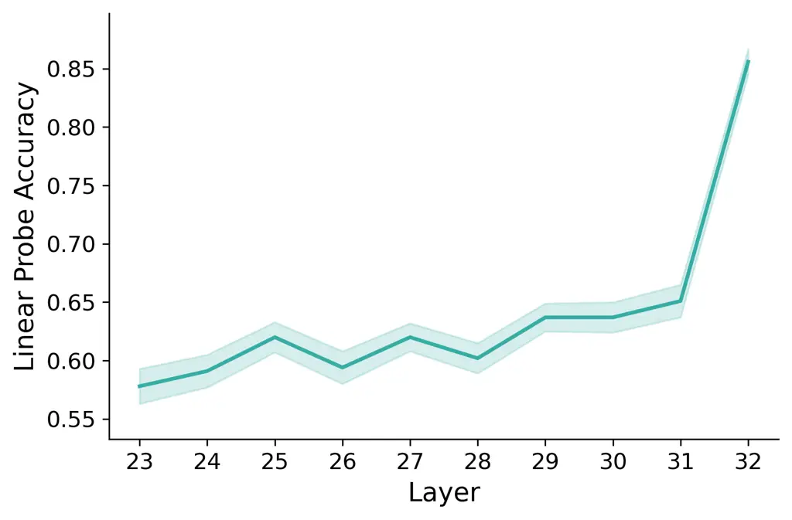

Figure 1: Whisper encoder understands semantics: Average linear probe
accuracy ($`\pm`$SEM) across encoder layers for semantic classification.

### 4.3 Analyzing Acoustic, Contextual, and Semantic Mechanisms

It is well established that the Whisper decoder functions as a weak
language model (Peng et al. 2023; Reid 2023), primarily responsible for
generating transcriptions based on semantic context rather than purely
acoustic cues (Radford et al. 2023). The encoder, in contrast, is tasked
with capturing the acoustic properties of the input audio (Liu, Yang,
and Qu 2024). This apparent division of roles is widely assumed in
encoder–decoder ASR systems, yet the extent to which the encoder
influences the final transcription output remains largely unexplored.

#### Acoustic and Contextual Mechanism.

In the following experiment, we examine whether the model favors the
acoustically spoken word, or a more contextually plausible alternative.
To investigate the acoustic–contextual mechanism tradeoff, we construct
a dataset of synthetic audio samples generated using a text to speech
model.

Each sentence is designed to trigger contextual errors in the model,
containing an acoustically ambiguous word: the true spoken word is
atypical or contextually unexpected, while a more plausible word with
similar phonetics fits the surrounding context. For example, a speaker
may say _“white lice”_ (acoustic truth) in a context where _“white
rice”_ would be expected. The constructed dataset consists of 700 such
examples in total. The Whisper model made contextual errors on 153
examples, which we analyze to understand the underlying mechanism.
Qwen2-Audio produced errors on 251 instances, indicating a stronger
tendency toward contextual predictions compared to Whisper. In both
cases, the model’s output differs from the ground truth by a single
target word, enabling precise analysis of the acoustic–contextual
tradeoff.

Next, we perform component patching across all encoder and decoder
subcomponents on the 251 Qwen2-Audio cases and 153 Whisper cases.
Motivated by established intervention methods 3.2, we select a white
noise audio as the disruptive audio, $`\mathbf{x}^{\mathrm{dis}}`$ (see
Section 3).

Surprisingly, applying patching interventions to encoder components
using disruptive audio improves acoustic accuracy, despite the common
assumption that encoders operate purely on acoustic input, without
encoding contextual or semantic information (Table 1). Both encoder and
decoder components contributed to restoring acoustic accuracy, with
encoders showing particularly strong effectiveness across both models.

These findings indicate that the encoder is not limited to acoustic
processing, it also encodes contextual and semantic expectations that
can bias the model toward more likely completions. In fact, intervening
on the encoder improves transcription accuracy in many cases, providing
direct evidence that semantic influence originates in the encoder and
that not all contextual decisions are made in the decoder.

| Metric        | Whisper         | Qwen2-Audio     |
| ------------- | --------------- | --------------- |
| Error Cases   | 153/700 (21.8%) | 251/700 (35.8%) |
| Restored Acc. | 136/153 (88.9%) | 176/251 (70.1%) |
| Via Encoder   | 130/153 (85.0%) | 171/251 (68.1%) |
| Via Decoder   | 126/153 (82.4%) | 147/251 (58.6%) |

Table 1: Acoustic-contextual patching results using white noise
disruption.

#### Whisper Encoder Understands Semantics.

Following our findings that disrupting encoder components paradoxically
improves acoustic transcription, here, we aim at investigating whether
ASR encoders encode semantic information. To that end, we design and
construct a dedicated synthetic audio dataset. The dataset consists of
carefully selected terms from distinct semantic groups, e.g., fruits and
clothing. Next, we train linear probes to discriminate between pairs of
these semantic categories based solely on encoder activations.

The probe results demonstrated a clear pattern: semantic encoding
becomes increasingly prominent in higher encoder layers. Figure 1 shows
the mean classification accuracy across 66 semantic category pairs, with
many individual pairs achieving exceptional performance. Remarkably,
Figure 2 reveals that semantic understanding emerges as early as the
middle encoder layers (18-21), with several category pairs already
achieving substantial performance well before the final layers. This
early semantic emergence demonstrates a gradual build-up of semantic
representations throughout the encoder hierarchy.

In the last encoder layer, probes reached their peak semantic
understanding, with average accuracy of 85.6%. Several category pairs
achieving 96.7% accuracy (e.g., distinguishing _countries_ from
_weather_ or _clothing_), while maintaining strong performance across
most semantic distinctions. The progression from early semantic signals
to sophisticated categorical distinctions suggests that the encoder
develops hierarchical semantic representations alongside its acoustic
processing capabilities. Full evaluation details in the Appendix.

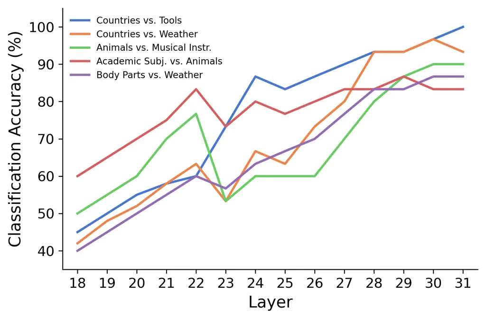

Figure 2: Semantic classification progression across encoder layers for
selected category pairs.

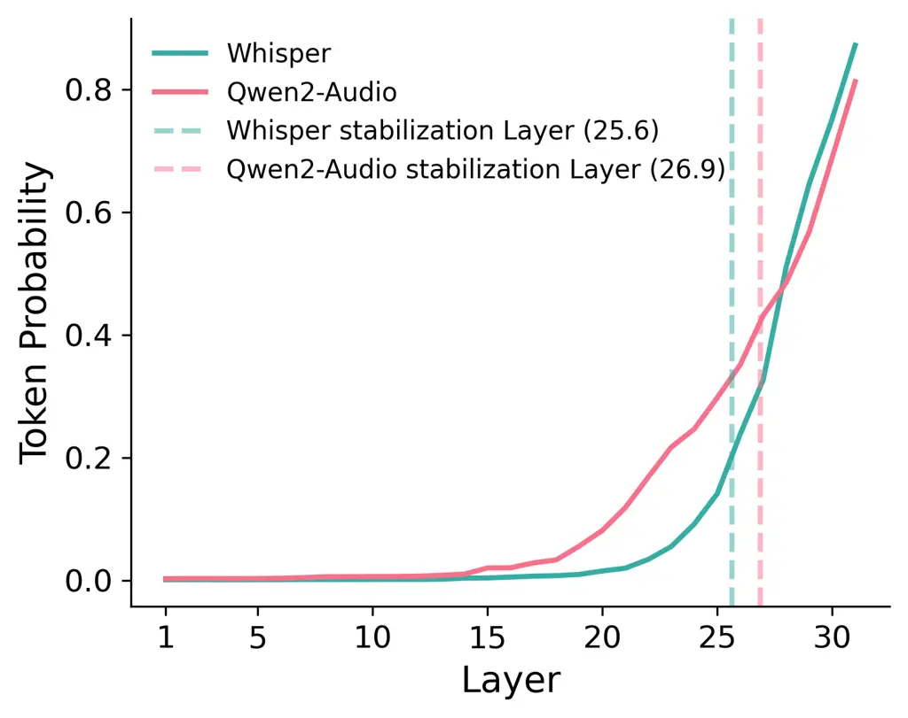

(a) Selected Token Probabilities

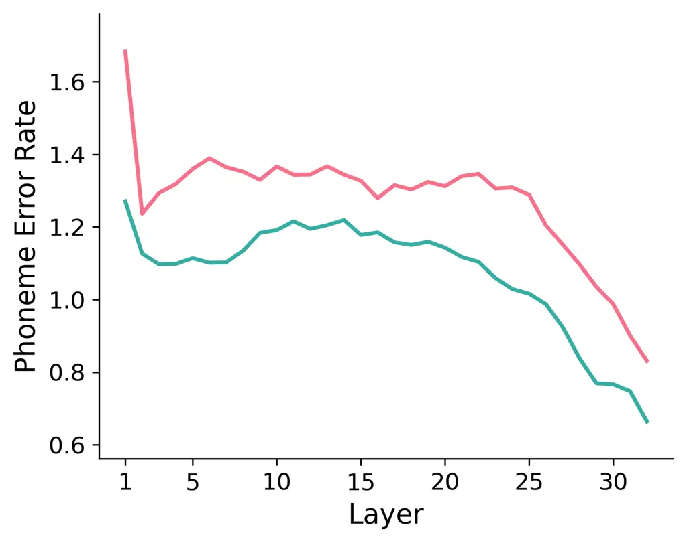

(b) Selected Token PER

(c) Selected Token Cos-Sim

Figure 3: Token Selection Mechanism: (a) Probability of the final
selected token across decoder layers, with indication to the average
saturation layer; (b) Phoneme error rate (PER) by layer. Lower PER
indicates higher acoustic similarity; (c) Tokens semantic cosine
similarity by layer. Higher similarity indicates greater semantic
similarity between top-5 tokens.

### 4.4 Token Selection Mechanism

In this section, we explore the internal mechanism that underlies token
selection within the decoder. Our aim is to understand when the model
determines which tokens to output. To this end, we apply the logit lens
technique to analyze model’s behavior. Specifically, we evaluate both
Whisper and Qwen2-Audio in six languages: English, French, Spanish,
German, Chinese and Italian. For each language, we randomly sample 100
utterances from the CommonVoice (Ardila et al. 2020) test set, resulting
in a balanced multilingual evaluation set.

#### Token Selection Dynamics.

We start by examining how the probability assigned to the final selected
token changes across different layers. Figure 3(a) presents the mean
probability averaged across examples from all the six languages and
token positions. For both Whisper and Qwen2-Audio, the probability
remains low until around layer 20, after which it increases sharply,
with the final three layers showing high confidence in the selected
token. We also analyze the saturation layer (Lioubashevski et al. 2024),
defined in Section 3. Interestingly, although the mean probability of
the selected token is generally higher in Qwen2-Audio, the saturation
layer tends to appear earlier in Whisper. We provide additional results
of the token selection by language in the Appendix.

#### Acoustic and Semantic Token Similarity.

Both Whisper and Qwen2-Audio generate transcripts as sequences of
subword tokens, in contrast to models such as (Baevski et al. 2020) that
operate at the grapheme level. Given that tokens can differ in phonetic
and acoustic content, we extend our analysis by comparing the acoustic
distance and semantic similarity between the final selected token and
the top five candidate tokens produced by the model at each layer. For
acoustic distance, we use a modified version of the Phoneme Error Rate
(PER) metric. As with the standard PER, lower values indicate higher
acoustic similarity. For semantic similarity, we compute cosine
similarity between token embeddings. Details on how these metrics are
calculated appear in the Appendix.

Figure 3(b) shows that across all layers, Whisper consistently achieves
lower PER scores than Qwen2-Audio, suggesting higher acoustic similarity
to the final selected token. Both models also display a notable PER drop
around layer 25, aligning with the saturation point where predictions
stabilize. This suggests that from layer 25 onward, not only does the
model converge on the final prediction, but the other top-5 candidate
tokens also share closer acoustic characteristics with it.

While one might expect Qwen2-Audio to outperform in semantic similarity
given its large language modeling capacity, Figure 3(c) reveals that
Whisper actually maintains higher semantic similarity scores across most
layers, indicating its top candidate tokens remain more semantically
aligned with the final output.

#### Next-Token Prediction Capabilities.

Finally, we examine the model’s ability to anticipate future tokens,
i.e., tokens of future timestamps, beyond the current selection in step
$`s`$. We observe that Qwen2-Audio begins ranking the immediate next
token ($`s+1`$) among its top candidates around layer 21 and retains
some predictive ability for the token at position $`s+2`$. In contrast,
Whisper shows a later but sharper improvement, with notable gains
starting around layer 29. Full details are provided in the Appendix.

### 4.5 Decoder Repetition Mechanisms in Whisper

Repetition hallucinations, where decoder-based models produce
excessively repetitive output, are a well-documented failure mode across
both language and speech domains (Barański et al. 2025; Yona et al.
2025).

Whisper occasionally produces repetitive outputs (Barański et al. 2025).
Based on our observations, these phenomena occur in several specific
scenarios: when the input audio itself contains repetitive content
(e.g., saying "hey" ten times results in Whisper generating hundreds of
repetitions), during code-switching between languages, and when
processing fragmented, heavily noised, or completely unclear audio
inputs (see examples in Appendix).

We hypothesized that such hallucinations stem from specific components
within the decoder’s attention mechanisms, rather than being the result
of a distributed failure across the model. To test this, we apply both
causal patching and ablation interventions (See section 3.2) on the
Whisper model. For each of the decoder’s 32 layers, we modified the
outputs of three core components: cross-attention, self-attention, and
feed-forward layers. Patching involved replacing internal activations
with those from clean, non-repetitive reference audio, while ablation
zeroed out the original activations. For evaluation, we construct a
multilingual dataset of 102 utterances prone to repetition
hallucinations, sampled from the Japanese and English portions of
CommonVoice 16.1. (Ardila et al. 2020).

Our results show that intervening on cross-attention substantially
reduced repetitions. Patching in layer 23 resolved 76% of cases, and
layer 18 covered an additional 13%. Self-attention and fully-connected
interventions had no measurable effect. Moreover, a head-level analysis
revealed that head 13 in layer 18 was especially influential,
suppressing repetition by 78.1% when targeted alone. This single-head
effectiveness represents a remarkably focused intervention: out of 640
total attention heads in the model (32 layers × 20 heads), one specific
head in the cross-attention mechanism appears to play a
disproportionately critical role in repetition control. Combined, layer
23 and head 13 in layer 18 accounted for 89% of the corrected examples.

The concentration of repetition control in specific cross-attention
components reveals these hallucinations are highly localized. The
remarkable effectiveness of a single attention head demonstrates
significant progress toward mechanistic understanding and enables
targeted interventions - these components can be monitored, steered, or
fine-tuned to suppress errors without degrading core performance.

### 4.6 Encoder Lens

In this experiment, we aim to gain a deeper understanding of how
representations evolve across the encoder layers. To this end, we use
the encoder lens technique described in Section 3.2, which involves
omitting the top layers of the encoder and directly passing intermediate
representations to the decoder. We analyzed $`400`$ audio samples for
both Whisper and Qwen2-Audio, drawn from English (LibriSpeech, Panayotov
et al. (2015)), Spanish (Multilingual LibriSpeech, Pratap et al.
(2020)), and Chinese (AISHELL, Bu et al. (2017)). These samples were
randomly selected to ensure typological and phonetic diversity across
languages and datasets.

The results show that Whisper exhibits a highly structured
representational hierarchy. Layers 0 to 22 mainly produce empty strings
or isolated punctuations. At the later layers, the model sometimes
produces short, often incomplete, words or monosyllabic tokens, that
sometimes match the beginning of the actual utterance. We observe a
recurring phenomenon at the 20th layer and up to the 27th: the model
occasionally outputs syntactically well-formed phrases. The start of the
phrases resemble to the start of the audio content, followed with
unrelated text. This text, however, is grammatically correct. For
example, in one of the samples, the full correct phrase is: Yes, I need
repose. Many things have agitated me today, both in mind and body. When
you return tomorrow, I shall no longer be the same man. and the output
of the 26 layer is: Yes, I need to go to the bathroom. Which is
grammatically coherent but does not match the content in the original
audio. This suggests that in this mid-layer zone, Whisper may begin to
behave like a loosely grounded language model, producing fluent but
unanchored completions (Chen et al. 2024). Another interesting pattern
we observed begins at the 27th encoder layer, where the model starts to
fall into repetition loops. This phenomenon is consistent across all
languages. This behavior intensifies through the 30th layer, which
appears to be the most consistently affected. In our Whisper analysis,
around 60% of the samples showed this repetition pattern. Only in the
final layers (31st and 32nd) these repetitions resolve into fluent,
grammatically correct transcriptions.

Qwen2-Audio, in contrast, reveals different failure patterns. While the
last five layers reliably generate accurate transcriptions, earlier
layers show severe degradation. We perform a frequency analysis of the
Qwen2-Audio results, which reveals a surprising phenomenon: the phrase
Kids are talking by the door (potentially from the RAVDESS (Livingstone
and Russo 2018) dataset for emotion detection) appears at least once in
_390 out of 400 files_, regardless of the input language. This
phenomenon is signaling a strongly memorized training data in the model.
Alongside it, several high-frequency Chinese expressions which roughly
translates to Aren’t you bored being alone?) dominate the output in the
earlier layers. We provide additional examples in the Appendix.

These patterns suggest that the model reverts to memorized sequences
when uncertain, possibly due to training data imbalance.

## 5 Discussion

This work provides a first comprehensive exploration of interpretability
in modern ASR models. We show that a range of acoustic, semantic, and
contextual factors are internally represented and can be analyzed using
adapted techniques from LLM interpretability. Our experiments uncover
localized mechanisms behind hallucinations, repetition loops, and
context-driven errors, and offer new tools for inspecting how
predictions evolve across layers.

We demonstrate the potential of interpretability for advancing diverse
future research in ASR.These include building internal monitors for
hallucination or saturation, developing fine-grained editing and
debugging tools for ASR, and informing architectural choices that better
balance grounding and fluency. The ability to trace errors back to
individual components may also enable targeted interventions or model
compression strategies.

## References

- Abouelenin et al. (2025) Abouelenin, A.; Ashfaq, A.; Atkinson, A.;
  Awadalla, H.; Bach, N.; Bao, J.; Benhaim, A.; Cai, M.; Chaudhary, V.;
  Chen, C.; et al. 2025. Phi-4-mini technical report: Compact yet
  powerful multimodal language models via mixture-of-loras. _arXiv
  preprint arXiv:2503.01743_.
- Ardila et al. (2020) Ardila, R.; Branson, M.; Davis, K.; Henretty, M.;
  Kohler, M.; Meyer, J.; Morais, R.; Saunders, L.; Tyers, F. M.; and
  Weber, G. 2020. Common Voice: A Massively-Multilingual Speech Corpus.
  arXiv:1912.06670.
- Baevski et al. (2020) Baevski, A.; Zhou, Y.; Mohamed, A.; and
  Auli, M. 2020. wav2vec 2.0: A framework for self-supervised learning
  of speech representations. _Advances in neural information processing
  systems_, 33: 12449–12460.
- Ballier et al. (2024) Ballier, N.; Burin, L.; Namdarzadeh, B.; Ng, S.;
  Wright, R.; and Yunès, J.-B. 2024. Probing Whisper predictions for
  French, English and Persian transcriptions. In _7th International
  Conference on Natural Language and Speech Processing_, 129–138.
  Association for Computational Linguistics.
- Barański et al. (2025) Barański, M.; Jasiński, J.; Bartolewska, J.;
  Kacprzak, S.; Witkowski, M.; and Kowalczyk, K. 2025. Investigation of
  whisper asr hallucinations induced by non-speech audio. In _ICASSP
  2025-2025 IEEE International Conference on Acoustics, Speech and
  Signal Processing (ICASSP)_, 1–5. IEEE.
- Barbero et al. (2024) Barbero, F.; Banino, A.; Kapturowski, S.;
  Kumaran, D.; Madeira Araújo, J.; Vitvitskyi, O.; Pascanu, R.; and
  Veličković, P. 2024. Transformers need glasses! information
  over-squashing in language tasks. _Advances in Neural Information
  Processing Systems_, 37: 98111–98142.
- Belinkov (2022) Belinkov, Y. 2022. Probing classifiers: Promises,
  shortcomings, and advances. _Computational Linguistics_, 48(1):
  207–219.
- Belrose et al. (2023) Belrose, N.; Furman, Z.; Smith, L.; Halawi, D.;
  Ostrovsky, I.; McKinney, L.; Biderman, S.; and Steinhardt, J. 2023.
  Eliciting latent predictions from transformers with the tuned lens.
  _arXiv preprint arXiv:2303.08112_.
- Ben Melech Stan et al. (2024) Ben Melech Stan, G.; Aflalo, E.;
  Rohekar, R. Y.; Bhiwandiwalla, A.; Tseng, S.-Y.; Olson, M. L.;
  Gurwicz, Y.; Wu, C.; Duan, N.; and Lal, V. 2024. Lvlm-intrepret: An
  interpretability tool for large vision-language models. In
  _Proceedings of the IEEE/CVF Conference on Computer Vision and Pattern
  Recognition_, 8182–8187.
- Bernard and Titeux (2021) Bernard, M.; and Titeux, H. 2021.
  Phonemizer: Text to Phones Transcription for Multiple Languages in
  Python. _Journal of Open Source Software_, 6(68): 3958.
- Berns, Vaessen, and van Leeuwen (2023) Berns, T.; Vaessen, N.; and van
  Leeuwen, D. A. 2023. Speaker and language change detection using
  wav2vec2 and whisper. _arXiv preprint arXiv:2302.09381_.
- Bojanowski et al. (2017) Bojanowski, P.; Grave, E.; Joulin, A.; and
  Mikolov, T. 2017. Enriching Word Vectors with Subword Information.
  _Transactions of the Association for Computational Linguistics_, 5:
  135–146.
- Brown et al. (2020) Brown, T.; Mann, B.; Ryder, N.; Subbiah, M.;
  Kaplan, J. D.; Dhariwal, P.; Neelakantan, A.; Shyam, P.; Sastry, G.;
  Askell, A.; et al. 2020. Language models are few-shot learners.
  _Advances in neural information processing systems_, 33: 1877–1901.
- Bu et al. (2017) Bu, H.; Du, J.; Na, X.; Wu, B.; and Zheng, H. 2017.
  Aishell-1: An open-source mandarin speech corpus and a speech
  recognition baseline. In _2017 20th conference of the oriental chapter
  of the international coordinating committee on speech databases and
  speech I/O systems and assessment (O-COCOSDA)_, 1–5. IEEE.
- Chen et al. (2024) Chen, A.; Zhang, R.; Pan, J.; Yu, F. F.; He, Y.;
  Wang, Y.; Neubig, G.; and Lee, J. D. 2024. Language Emerges in Speech
  Models Trained Without Text Supervision. _arXiv preprint
  arXiv:2503.08908_.
- Chu et al. (2024) Chu, Y.; Xu, J.; Yang, Q.; Wei, H.; Wei, X.; Guo,
  Z.; Leng, Y.; Lv, Y.; He, J.; Lin, J.; et al. 2024. Qwen2-audio
  technical report. _arXiv preprint arXiv:2407.10759_.
- Chu et al. (2023) Chu, Y.; Xu, J.; Zhou, X.; Yang, Q.; Zhang, S.; Yan,
  Z.; Zhou, C.; and Zhou, J. 2023. Qwen-Audio: Advancing Universal Audio
  Understanding via Unified Large-Scale Audio-Language Models. _arXiv
  preprint arXiv:2311.07919_.
- Das et al. (2024) Das, N.; Dingliwal, S.; Ronanki, S.; Paturi, R.;
  Huang, Z.; Mathur, P.; Yuan, J.; Bekal, D.; Niu, X.; Jayanthi, S. M.;
  et al. 2024. Speechverse: A large-scale generalizable audio language
  model. _arXiv preprint arXiv:2405.08295_.
- Fonseca et al. (2021) Fonseca, E.; Favory, X.; Pons, J.; Font, F.; and
  Serra, X. 2021. Fsd50k: an open dataset of human-labeled sound events.
  _IEEE/ACM Transactions on Audio, Speech, and Language Processing_, 30:
  829–852.
- Frieske and Shi (2024) Frieske, R.; and Shi, B. E. 2024.
  Hallucinations in neural automatic speech recognition: Identifying
  errors and hallucinatory models. _arXiv preprint arXiv:2401.01572_.
- Geva et al. (2022) Geva, M.; Caciularu, A.; Wang, K. R.; and
  Goldberg, Y. 2022. Transformer feed-forward layers build predictions
  by promoting concepts in the vocabulary space. _arXiv preprint
  arXiv:2203.14680_.
- Goldowsky-Dill et al. (2023) Goldowsky-Dill, N.; MacLeod, C.; Sato,
  L.; and Arora, A. 2023. Localizing model behavior with path patching.
  _arXiv preprint arXiv:2304.05969_.
- Gong et al. (2023) Gong, Y.; Khurana, S.; Karlinsky, L.; and
  Glass, J. 2023. Whisper-at: Noise-robust automatic speech recognizers
  are also strong general audio event taggers. _arXiv preprint
  arXiv:2307.03183_.
- Haklay et al. (2025) Haklay, T.; Orgad, H.; Bau, D.; Mueller, A.; and
  Belinkov, Y. 2025. Position-aware automatic circuit discovery. _arXiv
  preprint arXiv:2502.04577_.
- Hanna, Liu, and Variengien (2023) Hanna, M.; Liu, O.; and
  Variengien, A. 2023. How does GPT-2 compute greater-than?:
  Interpreting mathematical abilities in a pre-trained language model.
  _Advances in Neural Information Processing Systems_, 36: 76033–76060.
- Heimersheim and Nanda (2024) Heimersheim, S.; and Nanda, N. 2024. How
  to use and interpret activation patching. _arXiv preprint
  arXiv:2404.15255_.
- Hernandez et al. (2023) Hernandez, E.; Sharma, A. S.; Haklay, T.;
  Meng, K.; Wattenberg, M.; Andreas, J.; Belinkov, Y.; and Bau, D. 2023.
  Linearity of relation decoding in transformer language models. _arXiv
  preprint arXiv:2308.09124_.
- Kim et al. (2019) Kim, C. D.; Kim, B.; Lee, H.; and Kim, G. 2019.
  Audiocaps: Generating captions for audios in the wild. In _Proceedings
  of the 2019 Conference of the North American Chapter of the
  Association for Computational Linguistics: Human Language
  Technologies, Volume 1 (Long and Short Papers)_, 119–132.
- Kramár et al. (2024) Kramár, J.; Lieberum, T.; Shah, R.; and
  Nanda, N. 2024. Atp\*: An efficient and scalable method for localizing
  llm behaviour to components. _arXiv preprint arXiv:2403.00745_.
- Lioubashevski et al. (2024) Lioubashevski, D.; Schlank, T.; Stanovsky,
  G.; and Goldstein, A. 2024. Looking beyond the top-1: Transformers
  determine top tokens in order. _arXiv preprint arXiv:2410.20210_.
- Liu, Yang, and Qu (2024) Liu, Y.; Yang, X.; and Qu, D. 2024.
  Exploration of Whisper fine-tuning strategies for low-resource ASR.
  _EURASIP Journal on Audio, Speech, and Music Processing_, 2024(1): 29.
- Livingstone and Russo (2018) Livingstone, S. R.; and Russo,
  F. A. 2018. The Ryerson Audio-Visual Database of Emotional Speech and
  Song (RAVDESS): A dynamic, multimodal set of facial and vocal
  expressions in North American English. _PloS one_, 13(5): e0196391.
- Luo and Specia (2024) Luo, H.; and Specia, L. 2024. From Understanding
  to Utilization: A Survey on Explainability for Large Language Models.
  _ArXiv_, abs/2401.12874.
- McKenzie et al. (2025) McKenzie, A.; Pawar, U.; Blandfort, P.; Bankes,
  W.; Krueger, D.; Lubana, E. S.; and Krasheninnikov, D. 2025. Detecting
  High-Stakes Interactions with Activation Probes. _arXiv preprint
  arXiv:2506.10805_.
- Meng et al. (2022) Meng, K.; Bau, D.; Andonian, A.; and
  Belinkov, Y. 2022. Locating and editing factual associations in gpt.
  _Advances in neural information processing systems_, 35: 17359–17372.
- Nanda (2023) Nanda, N. 2023. Attribution patching: Activation patching
  at industrial scale. _URL: https://www. neelnanda.
  io/mechanistic-interpretability/attribution-patching_.
- nostalgebraist (2020) nostalgebraist. 2020. Interpreting GPT: the
  logit lens.
  https://www.lesswrong.com/posts/AcKRB8wDpdaN6v6ru/interpreting-gpt-the-logit-lens.
  Accessed: 2025-07-30.
- O’Neill et al. (2025) O’Neill, C.; Chalnev, S.; Zhao, C. C.; Kirkby,
  M.; and Jayasekara, M. 2025. A Single Direction of Truth: An Observer
  Model’s Linear Residual Probe Exposes and Steers Contextual
  Hallucinations. arXiv:2507.23221.
- Orgad et al. (2024) Orgad, H.; Toker, M.; Gekhman, Z.; Reichart, R.;
  Szpektor, I.; Kotek, H.; and Belinkov, Y. 2024. Llms know more than
  they show: On the intrinsic representation of llm hallucinations.
  _arXiv preprint arXiv:2410.02707_.
- Panayotov et al. (2015) Panayotov, V.; Chen, G.; Povey, D.; and
  Khudanpur, S. 2015. Librispeech: An ASR corpus based on public domain
  audio books. In _2015 IEEE International Conference on Acoustics,
  Speech and Signal Processing (ICASSP)_, 5206–5210.
- Peng et al. (2023) Peng, Y.; Tian, J.; Yan, B.; Berrebbi, D.; Chang,
  X.; Li, X.; Shi, J.; Arora, S.; Chen, W.; Sharma, R.; et al. 2023.
  Reproducing whisper-style training using an open-source toolkit and
  publicly available data. In _2023 IEEE Automatic Speech Recognition
  and Understanding Workshop (ASRU)_, 1–8. IEEE.
- Pratap et al. (2020) Pratap, V.; Xu, Q.; Sriram, A.; Synnaeve, G.; and
  Collobert, R. 2020. MLS: A Large-Scale Multilingual Dataset for Speech
  Research. In _Interspeech 2020_. ISCA.
- Radford et al. (2023) Radford, A.; Kim, J. W.; Xu, T.; Brockman, G.;
  McLeavey, C.; and Sutskever, I. 2023. Robust speech recognition via
  large-scale weak supervision. In _International conference on machine
  learning_, 28492–28518. PMLR.
- Räuker et al. (2023) Räuker, T.; Ho, A.; Casper, S.; and
  Hadfield-Menell, D. 2023. Toward transparent ai: A survey on
  interpreting the inner structures of deep neural networks. In _2023
  ieee conference on secure and trustworthy machine learning (satml)_,
  464–483. IEEE.
- Reid (2023) Reid, E. 2023. Interpreting OpenAI’s Whisper.
  https://www.lesswrong.com/posts/thePw6qdyabD8XR4y/interpreting-openai-s-whisper.
  LessWrong / SERI-MATS blog post.
- Schut, Gal, and Farquhar (2025) Schut, L.; Gal, Y.; and
  Farquhar, S. 2025. Do Multilingual LLMs Think In English? _arXiv
  preprint arXiv:2502.15603_.
- Snyder, Chen, and Povey (2015) Snyder, D.; Chen, G.; and
  Povey, D. 2015. Musan: A music, speech, and noise corpus. _arXiv
  preprint arXiv:1510.08484_.
- Syed, Rager, and Conmy (2023) Syed, A.; Rager, C.; and Conmy, A. 2023.
  Attribution patching outperforms automated circuit discovery. _arXiv
  preprint arXiv:2310.10348_.
- Tang et al. (2023) Tang, C.; Yu, W.; Sun, G.; Chen, X.; Tan, T.; Li,
  W.; Lu, L.; Ma, Z.; and Zhang, C. 2023. Salmonn: Towards generic
  hearing abilities for large language models. _arXiv preprint
  arXiv:2310.13289_.
- Team (2024) Team, Q. 2024. Qwen2 technical report. _arXiv preprint
  arXiv:2407.10671_.
- Toker et al. (2024) Toker, M.; Orgad, H.; Ventura, M.; Arad, D.; and
  Belinkov, Y. 2024. Diffusion Lens: Interpreting Text Encoders in
  Text-to-Image Pipelines. _arXiv preprint arXiv:2403.05846_.
- Touvron et al. (2023) Touvron, H.; Lavril, T.; Izacard, G.; Martinet,
  X.; Lachaux, M.-A.; Lacroix, T.; Rozière, B.; Goyal, N.; Hambro, E.;
  Azhar, F.; et al. 2023. Llama: Open and efficient foundation language
  models. _arXiv preprint arXiv:2302.13971_.
- Upadhyay, Busso, and Lee (2024) Upadhyay, S. G.; Busso, C.; and Lee,
  C.-C. 2024. A layer-anchoring strategy for enhancing cross-lingual
  speech emotion recognition. _arXiv preprint arXiv:2407.04966_.
- Vaswani et al. (2017) Vaswani, A.; Shazeer, N.; Parmar, N.; Uszkoreit,
  J.; Jones, L.; Gomez, A. N.; Kaiser, Ł.; and Polosukhin, I. 2017.
  Attention is all you need. _Advances in neural information processing
  systems_, 30.
- Vig et al. (2020) Vig, J.; Gehrmann, S.; Belinkov, Y.; Qian, S.; Nevo,
  D.; Singer, Y.; and Shieber, S. 2020. Investigating gender bias in
  language models using causal mediation analysis. _Advances in neural
  information processing systems_, 33: 12388–12401.
- (56) Wang, H. ???? English Accent DataSet.
  https://huggingface.co/datasets/westbrook/English_Accent_DataSet.
  Accessed: 2025-07-31.
- Wang et al. (2022) Wang, K.; Variengien, A.; Conmy, A.; Shlegeris, B.;
  and Steinhardt, J. 2022. Interpretability in the wild: a circuit for
  indirect object identification in gpt-2 small. _arXiv preprint
  arXiv:2211.00593_.
- Yang, Huang, and Lee (2024) Yang, C.-K.; Huang, K.-P.; and Lee,
  H.-y. 2024. Do Prompts Really Prompt? Exploring the Prompt
  Understanding Capability of Whisper. _arXiv preprint
  arXiv:2406.05806_.
- Yona et al. (2025) Yona, I.; Shumailov, I.; Hayes, J.; Barbero, F.;
  and Gandelsman, Y. 2025. Interpreting the Repeated Token Phenomenon in
  Large Language Models. _arXiv preprint arXiv:2503.08908_.
- Zhao et al. (2024) Zhao, Y.; Wang, S.; Sun, G.; Chen, Z.; Zhang, C.;
  Xu, M.; and Zheng, T. F. 2024. Whisper-pmfa: Partial multi-scale
  feature aggregation for speaker verification using whisper models.
  _arXiv preprint arXiv:2408.15585_.

Appendix: Beyond Transcription—Mechanistic Interpretability in ASR

## Appendix A Detailed Probing Results

This section presents comprehensive layer-wise analysis of various
probing tasks across Whisper’s encoder and decoder layers, demonstrating
the model’s ability to linearly separate different types of information
at different depths.

### A.1 Gender classification

Gender classification performance across encoder layers is shown in
Figure 4. The results demonstrate a clear progression from random
performance at the embedding layer (Layer 0: 55.5%) to peak performance
at Layer 25 (94.6%), indicating that gender information becomes
increasingly linearly separable in deeper encoder layers.

### A.2 Clean vs. noisy environment classification

Clean vs. noisy environment classification across encoder layers is
presented in Figure 5. The model shows steady improvement from Layer 0
(58.4%) reaching optimal performance at Layer 27 (90.0%), suggesting
that acoustic quality indicators are most effectively captured in the
deeper encoder representations.

### A.3 Accent classification environment classification

Detailed accent classification results across encoder layers are
provided in Table 2. The analysis covers four accent categories (New
Zealand, Welsh, South African, and Indian) with peak overall accuracy
achieved at Layer 22.

### A.4 Speech vs. Non-Speech Classification

Speech vs. non-speech classification performance across decoder layers
is illustrated in Figure 6. The results reveal remarkable performance,
with perfect classification (100%) consistently achieved across Layers
10-28, and near-perfect accuracy (99.17%) maintained at Layer 31. This
demonstrates the decoder’s robust ability to distinguish between genuine
speech content and non-speech audio inputs.

### A.5 Hallucination Prediction rom Decoder Residual Stream

Word Error Rate (WER) classification results for detecting transcription
quality are detailed in Table 3. The decoder residual stream analysis
shows peak performance at Layer 22 (93.3% accuracy), indicating that
hallucination-related signals are effectively encoded in the deeper
decoder layers during generation.

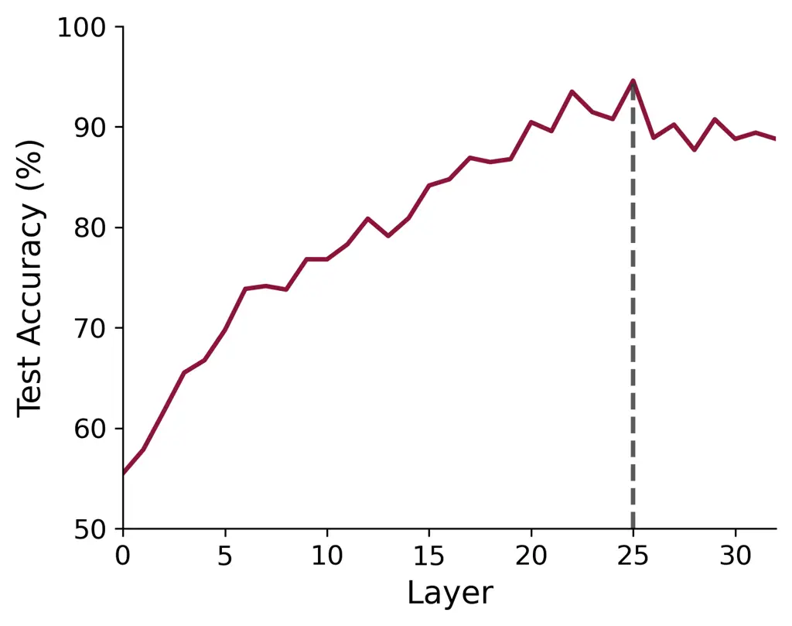

Figure 4: Gender classification test accuracy across Whisper encoder
layers. Peak performance of 94.6% achieved at layer 25.

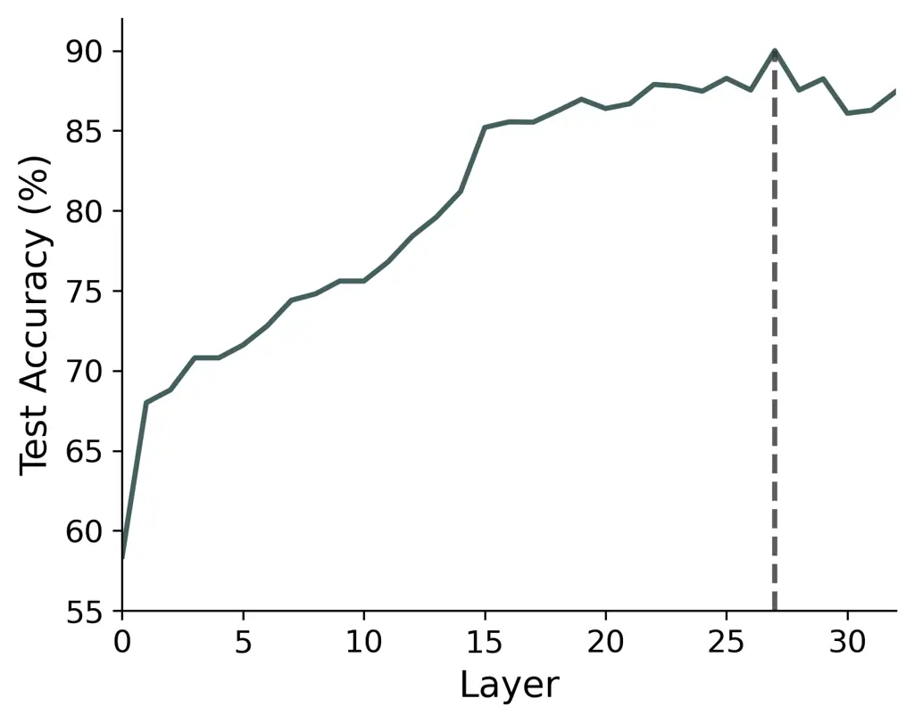

Figure 5: Clean vs noisy speech classification accuracy across Whisper
encoder layers. Peak performance of 90.0% achieved at layer 27.

|       |         |       |       |       |        |
| ----- | ------- | ----- | ----- | ----- | ------ |
| Layer | Overall | NZ    | Welsh | SA    | Indian |
| 5     | 59.5%   | 38.0% | 70.0% | 70.0% | 60.0%  |
| 10    | 63.0%   | 48.0% | 70.0% | 66.0% | 68.0%  |
| 15    | 64.5%   | 56.0% | 76.0% | 66.0% | 60.0%  |
| 20    | 79.0%   | 74.0% | 94.0% | 74.0% | 74.0%  |
| 25    | 82.5%   | 84.0% | 98.0% | 68.0% | 80.0%  |
| 28    | 80.5%   | 88.0% | 96.0% | 60.0% | 78.0%  |
| 31    | 78.5%   | 82.0% | 96.0% | 64.0% | 72.0%  |
|       |         |       |       |       |        |

Table 2: Accent Classification by Encoder Layer

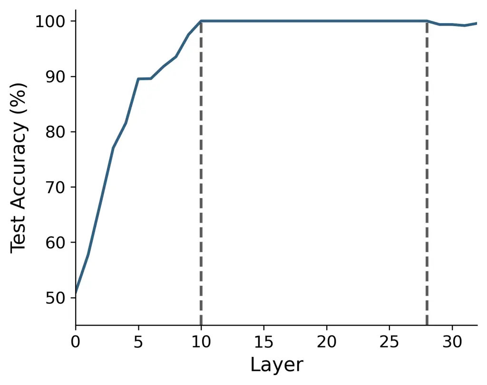

Figure 6: Speech vs non-speech classification accuracy across Whisper
decoder layers. Perfect classification (100%) achieved in layers 10-28.

|       |          |           |                |            |             |
| ----- | -------- | --------- | -------------- | ---------- | ----------- |
| Layer | Test Acc | Train Acc | Train Time (s) | Low WER F1 | High WER F1 |
| 5     | 0.622    | 0.571     | 0.92           | 0.393      | 0.726       |
| 10    | 0.900    | 0.838     | 0.76           | 0.907      | 0.892       |
| 15    | 0.889    | 1.000     | 0.70           | 0.886      | 0.891       |
| 20    | 0.878    | 1.000     | 0.66           | 0.874      | 0.882       |
| 22    | 0.933    | 1.000     | 0.66           | 0.933      | 0.933       |
| 25    | 0.900    | 0.995     | 0.64           | 0.899      | 0.901       |
| 28    | 0.922    | 1.000     | 0.59           | 0.923      | 0.921       |
| 31    | 0.932    | 1.000     | 0.57           | 0.935      | 0.932       |
|       |          |           |                |            |             |

Table 3: Hallucination Prediction from Decoder Residual Stream

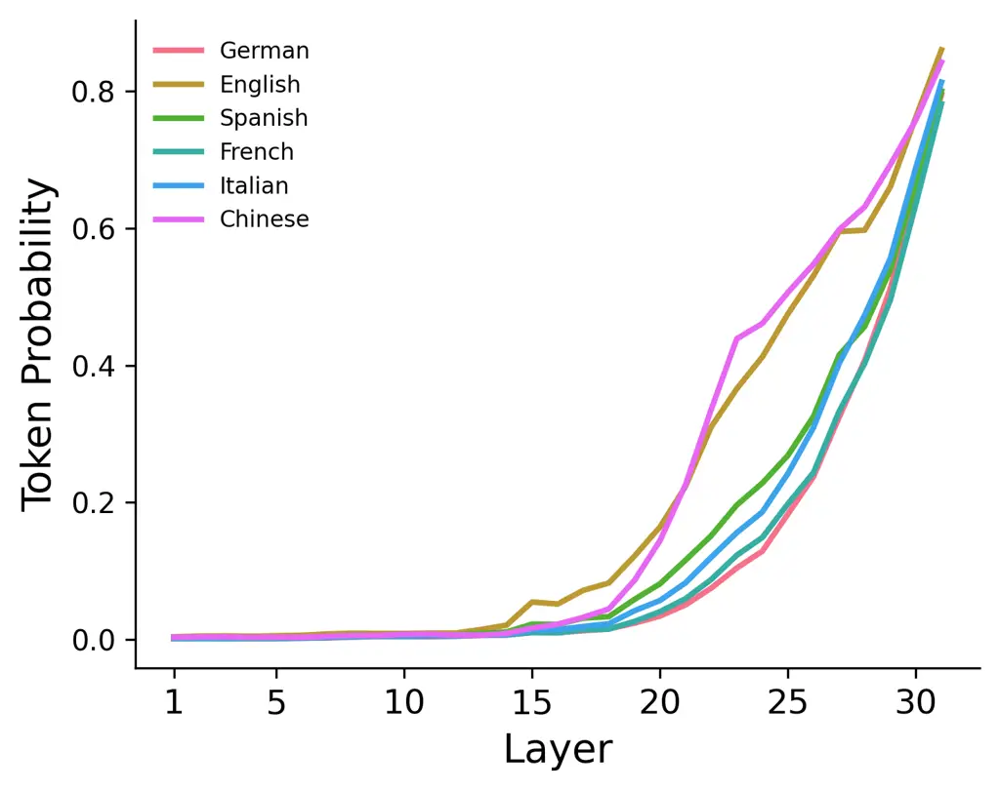

(a) Qwen2-Audio

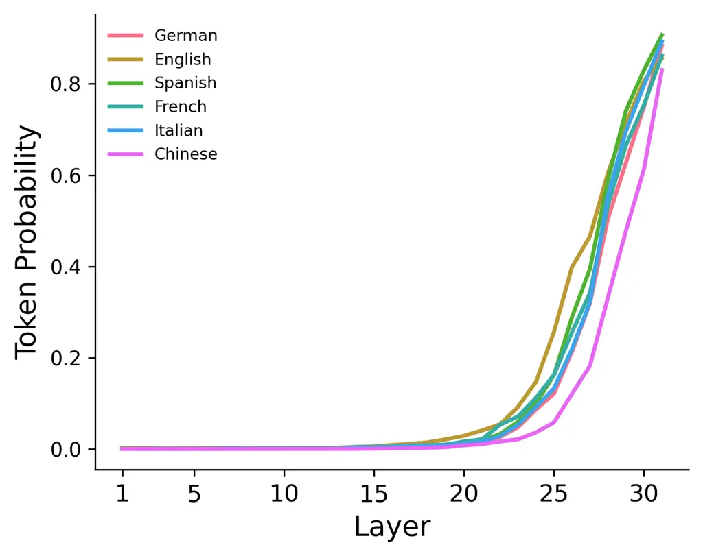

(b) Whisper

Figure 7: Probability of the final selected token across decoder layers
and languages for (a) Qwen2-Audio and (b) Whisper.

## Appendix B Token Selection Mechanism

#### Selected Token Dynamic.

Figure 7 shows the mean probability of the final selected token across
layers, broken down by language. The Whisper model displays similar
trends across all six languages, with slightly higher confidence for
English and the lowest confidence for Chinese. In contrast, Qwen2-Audio
exhibits a different pattern: for English and Chinese, it shows much
higher confidence in earlier layers compared to the other languages.

#### Top-K Tokens Dynamic.

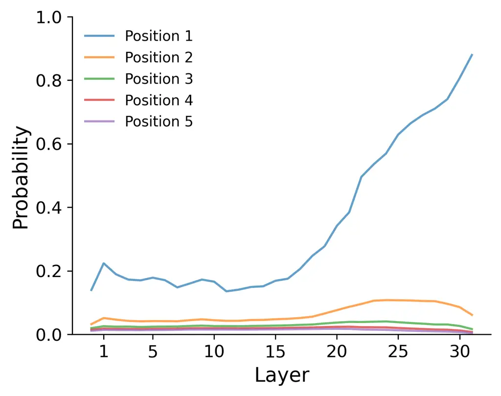

(a) Qwen2-Audio

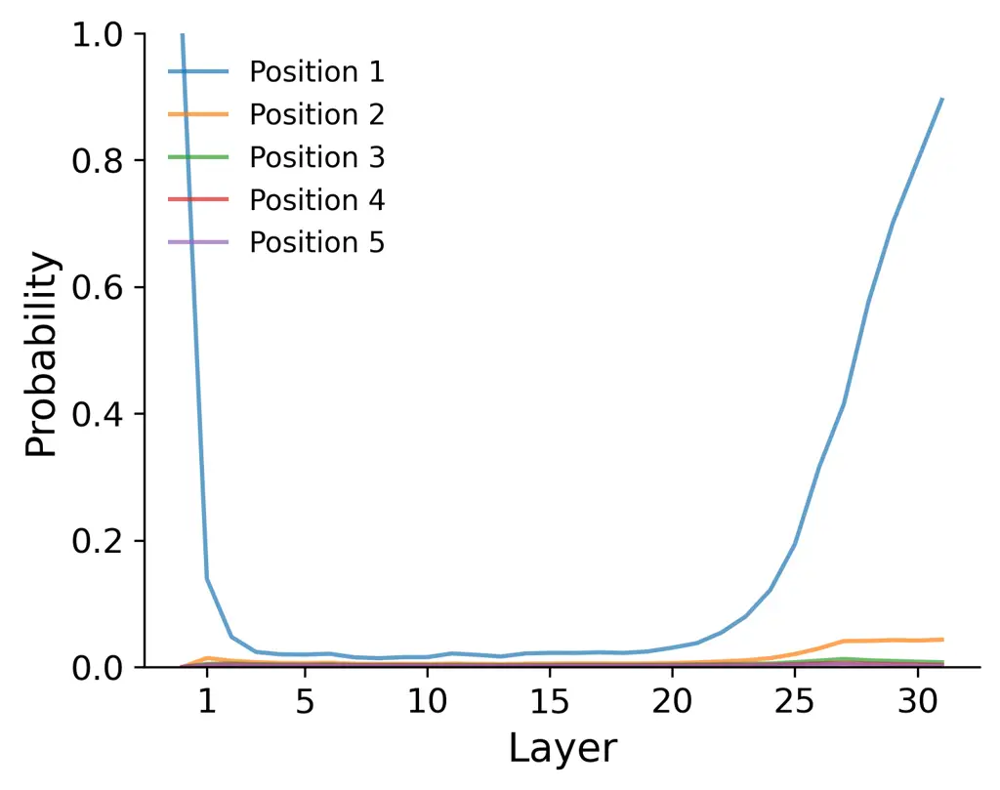

(b) Whisper

Figure 8: Probability of the top 5 tokens across layers for
(a) Qwen2-Audio and (b) Whisper.

Figure 8 presents how the probabilities of the top-5 tokens evolve
across layers. Here, position 1 corresponds to the token with the
highest probability at that layer, position 2 to the next highest, and
so on.

In layer 1, Whisper is highly confident: the most probable token
receives a probability of 1. However, this confidence rapidly declines,
and the probabilities across all positions quickly approach zero. Around
layer 22, as shown earlier, the probability of the top-ranked token
begins to rise again, eventually reaching an average of about 0.8, while
the probabilities for positions 2–5 remain very low, staying close to
zero.

In contrast, Qwen2-Audio exhibits a different pattern. Throughout most
layers, the top-ranked token receives the highest probability, but only
around 0.2. From approximately layer 20 onward, this probability starts
to increase, also stabilizing around 0.8 in the final layers. Unlike
Whisper, however, the token in position 2 in Qwen2-Audio maintains a
probability of about 0.1 from around layer 20 onward.

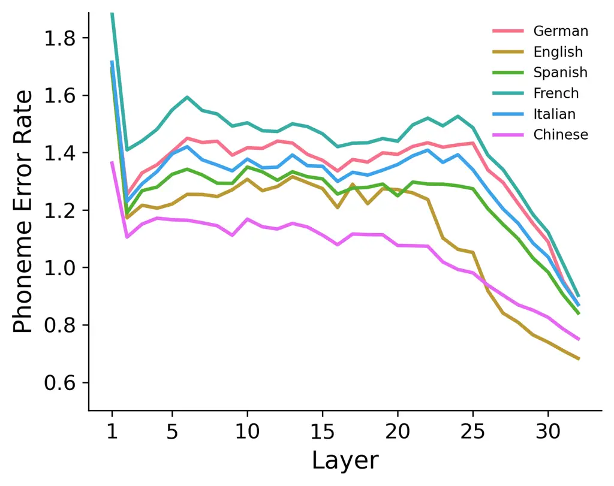

(a) Qwen2-Audio

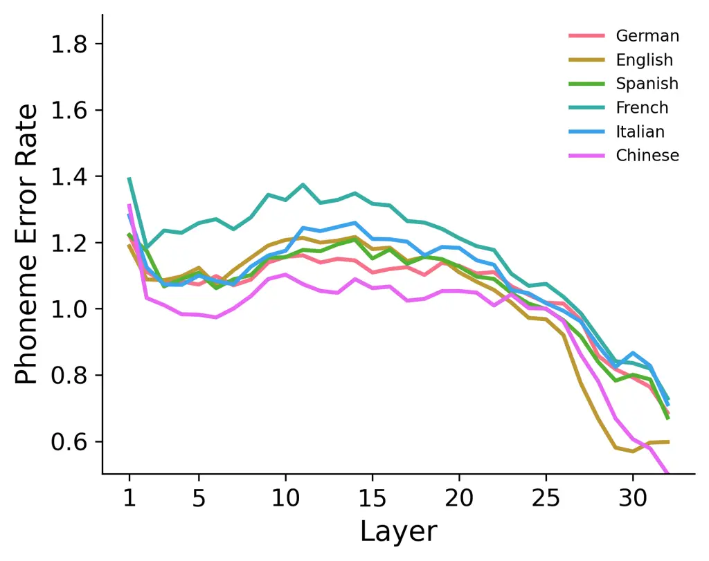

(b) Whisper

Figure 9: Phoneme Error Rate by layer and language for (a) Qwen2-Audio
and (b) Whisper.

Phoneme Error Rate (PER). We propose PER as an alternative to Word Error
Rate (WER), computed at the phoneme level. Instead of applying a uniform
penalty, substitutions between phonemes from the same family (e.g.,
vowels or nasals) receive a reduced penalty of 0.5 to better reflect
phonetic closeness. Each token is first converted to its phoneme
sequence, and tokens without acoustic content (such as punctuation or
language tags) are excluded from the calculation for both Whisper and
Qwen2-Audio. Deriving phonemes first requires detecting the language of
each token, which is challenging given the short length of tokens. We
apply a set of simple rules: tokens containing characters from the CJK
Unified Ideographs range are labeled as Chinese (even though this range
also includes Japanese kanji and Korean hanja, we apply this rule
because our data only include Chinese audio); tokens containing Cyrillic
characters are labeled as Russian; and all other tokens are classified
using fastText’s language detection (Bojanowski et al. 2017). Finally,
we use Phonemizer (Bernard and Titeux 2021) to generate the
corresponding phoneme sequences for each token based on its detected
language. Figure 9 shows the acoustic distance, measured by phoneme
error rate (PER), between the final selected token and the top five
candidate tokens produced by the models at each layer, broken down by
language. For both models, PER starts very high at the first layer, then
remains relatively stable until around layer 21, after which it drops
sharply. Overall, Whisper achieves lower PER across all languages, and
both models perform best (i.e., show lower PER) on English and Chinese.

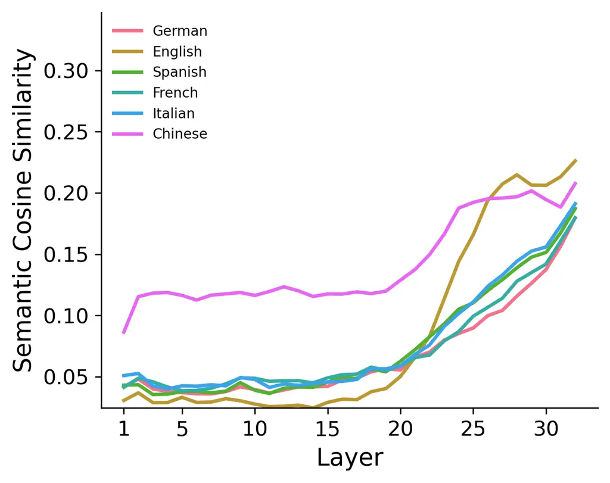

(a) Qwen2-Audio

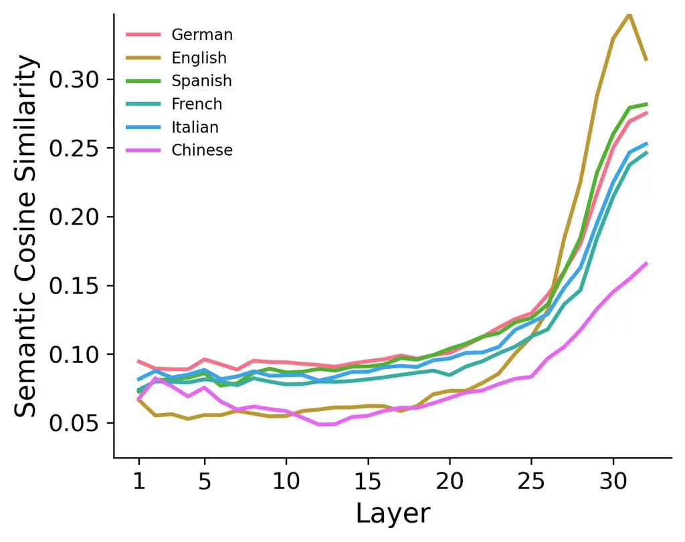

(b) Whisper

Figure 10: Tokens semantic cosine similarity by layer and language for
(a) Qwen2-Audio and (b) Whisper.

Semantic similarity. We compute semantic embeddings for each token using
fastText (Bojanowski et al. 2017) and measure their cosine similarity to
the final selected token. The embedding model is selected according to
the language of the audio. We exclude language tokens and other special
tokens (i.e., tokens in the \<\|value\|\> format), but retain
punctuation tokens since they can carry semantic meaning. Figure 10
shows the average cosine similarity between the final selected token and
the top five candidates across layers and languages. The Whisper model
displays an interesting pattern: English starts with relatively low
similarity in earlier layers but reaches the highest similarity in later
layers, while Chinese consistently shows the lowest similarity. In
contrast, Qwen2-Audio shows higher similarity for Chinese already in
earlier layers and again in the final layers, where English and Chinese
lead. Notably, semantic similarity scores in Qwen2-Audio are overall
lower than in Whisper. The stronger performance on Chinese in
Qwen2-Audio may reflect its training on large amounts of Chinese data,
whereas Whisper’s weaker results for Chinese could indicate less
training data in that language.

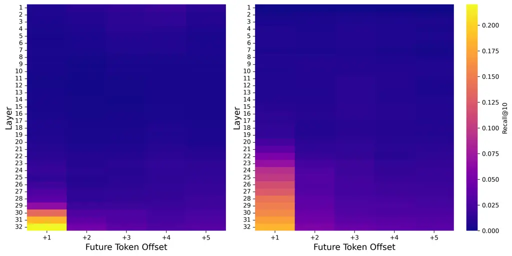

Figure 11: Future token prediction heatmap showing Recall@10 across
layers and offsets $`i`$ for Whisper (left) and Qwen2-Audio (right)

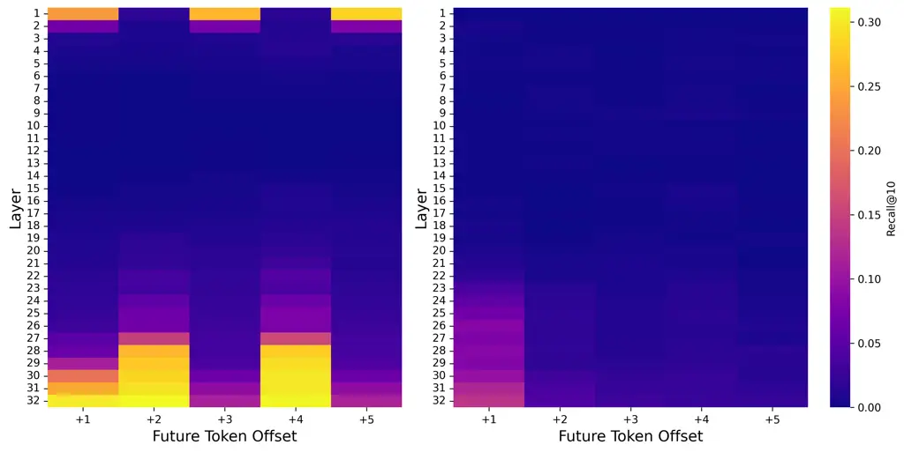

Figure 12: Japanese future token prediction heatmap showing Recall@10
across layers and offsets $`i`$ for Whisper (left) and Qwen2-Audio
(right)

#### Next-Token Prediction Capabilities

To better understand the capacity of the ASR model, we evaluate its
ability to predict multiple positions beyond the next immediate token at
position $`s`$. We consider tokens at positions $`s+i`$ for all
$`1\leq i\leq 5`$. For each offset $`i`$, we measure how often the
ground-truth token at position $`s+i`$ appears among the model’s top 10
predicted tokens at the corresponding layer. We use a metric we call
Recall@10 to quantify the fraction of instances in which the correct
future token is included within the top-ranked predictions. Figure 11
presents the results for both Whisper and Qwen2-Audio. As shown,
Qwen2-Audio achieves a relatively high Recall @ 10 for $`s+1`$ (the
immediate next token) starting from approximately layer 21, indicating
that these deeper layers already encode useful information about the
upcoming token. Furthermore, even for $`s+2`$, Qwen2-Audio maintains
some predictive capability from the same layer onward, suggesting that
it can anticipate tokens slightly further in the sequence. In contrast,
Whisper exhibits a markedly different pattern. For $`s+1`$, the model
shows a notable rise in Recall@10 only starting around layer 29,
although this increase is steeper than that observed in the Qwen2-Audio
model. Similar to Qwen2-Audio, Whisper also demonstrates some prediction
capability for $`s+2`$.

Figure 12 presents the next-token prediction capabilities of Whisper and
Qwen2-Audio on Japanese. Unlike other languages, Whisper shows an
alternating pattern for Japanese: at even offsets $`i`$, the model
achieves higher Recall@10 scores starting from around layer 27; whereas
at odd offsets$`i`$, its prediction capability is generally weaker in
deeper layers but unexpectedly higher at layer 1. This is a particularly
interesting behavior, as it does not appear in the Qwen2-Audio model.

## Appendix C Whisper’s Encoder Understands Semantic

This appendix provides detailed results from our linear probe
experiments across 47 semantic category pairs on Whisper Large V3
encoder layers 22-31.

### C.1 Experimental Setup

Our synthetic audio dataset comprises terms from 11 semantic categories:
Animals, Tools, Fruits, Professions, Clothing, Countries, Musical
Instruments, Body Parts, Weather, Transportation, and Academic Subjects.
Each category contains 50 terms synthesized with consistent voice
parameters. We train binary linear classifiers on 768-dimensional
encoder representations using L2 regularization ($`\lambda=0.01`$) and
evaluate on held-out test sets.

| Category Pair                | Accuracy |
| ---------------------------- | -------- |
| Countries vs. Tools          | 100.0%   |
| Countries vs. Clothing       | 100.0%   |
| Musical Instr. vs. Countries | 96.7%    |
| Countries vs. Weather        | 93.3%    |

Table 4: Top Performing Category Pairs (Layer 31)

| Category          | Average Accuracy |
| ----------------- | ---------------- |
| Countries         | 91.2%            |
| Professions       | 84.2%            |
| Body Parts        | 82.7%            |
| Academic Subjects | 73.0%            |
| Clothing          | 72.6%            |

Table 5: Average Category Performance (Layer 31)

### C.2 Visual Analysis

Figure 2 illustrates semantic classification progression for selected
high-performing category pairs. Tables 4 and 5 summarize these results,
showing perfect separation for several category pairs and consistently
higher averages for Countries compared to other categories.

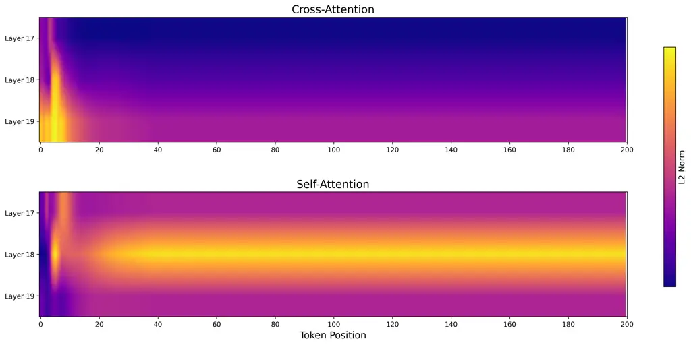

Figure 13: Attention component L2 norm traces during repetitive sequence
generation. Cross-attention (top) shows peak-then-decline pattern while
self-attention (bottom) exhibits sustained elevation, with Layer 18
demonstrating the most pronounced dual signature.

## Appendix D Repetitions

### D.1 Layer 18 Norm Patterns During Repetition

Our analysis reveals distinctive activation patterns in Layer 18 during
repetitive sequences that provide insights into the underlying
mechanisms of repetition generation. Figure 13 shows L2 norm traces for
cross-attention and self-attention components across layers 17, 18, and
19 during a repetitive sequence.

#### Cross-Attention as Repetition Trigger

Layer 18’s cross-attention component shows intense initial activation
followed by sustained decline (Figure 13, top panel). This pattern
suggests that cross-attention initially attempts to maintain alignment
with the audio source but progressively loses this connection as
repetition begins.

The declining cross-attention norms indicate a triggering mechanism
where the encoder-decoder alignment breaks down, initiating the
repetitive state.

#### Self-Attention as Repetition Manifestation

The simultaneous elevation in self-attention norms that persists
throughout repetition (Figure 13, bottom panel) reflects the decoder’s
internal repetitive processing.

This sustained activity pattern manifests the pathological state where
the decoder becomes internally focused on repetitive patterns rather
than attending to new audio input. The persistent elevation suggests
that self-attention captures and maintains the repetitive behavior once
initiated.

#### Intervention Implications

The effectiveness of cross-attention patching versus self-attention
intervention failure can be understood through this dual-component view.

We hypothesize that cross-attention interventions target the trigger
mechanism, preventing the initial breakdown in audio alignment. In
contrast, self-attention interventions attempt to modify the
manifestation after the repetitive state has already been established,
proving less effective. Layer 18’s distinctive signature in both
components (Figure 13) explains why interventions at this specific layer
are most effective for repetition control.

Further investigation into this trigger-manifestation mechanism could
provide deeper insights into the architectural foundations of
hallucination control in ASR models.

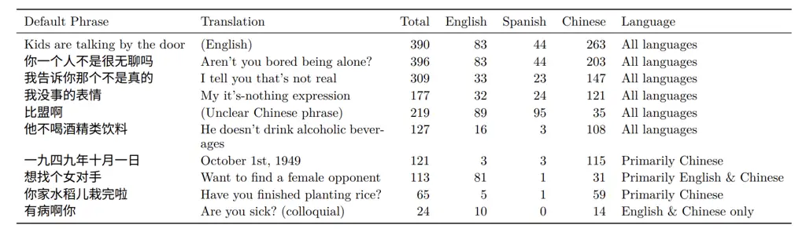

Figure 14: Examples of Frequent Default Phrases in Qwen2-Audio

### D.2 Types Of Repetitions

- •
  Code Switching:  
  "The genus name comes from the classical Latin word
  co-co-co-co-co-co-co-co-co-co-co-co-co-co-co-co-co-co-co-co-co-co-co-co-co-co-co-co-co-co-co-co-co-co-co-co-co-co-co-co-co-co-co-co-co-co-co-co-co-co-co-co-co-co-co-co-co-co-co-co-co-co-co-co-co-co-co-co-co-co-co-co-co-co-co-co-co-co-co-co-co-co-co-co-co-co-co-co-co-co-co-co-co-co-co-co-co-co-co-co-co-co-co-co-co-co-co-co-co-co-co-co-co-co-co-co-co-co-co-co-co-co-co-co-co-co-co-co-co-co-co-co-co-co-co-co-co-co-co-co-co-co-co-co-co-co-co-co-co-co-co-"
- •
  Repetitive Audio: In the acoustic the word "ha" was said 5 times:

  "Ha ha ha ha ha ha ha ha ha ha ha ha ha ha ha ha ha ha ha ha ha ha ha
  ha ha ha ha ha ha ha ha ha ha ha ha ha ha ha ha ha ha ha ha ha ha ha
  ha ha ha ha ha ha ha ha ha ha ha ha ha ha ha ha ha ha ha ha ha ha ha
  ha ha ha ha ha ha ha ha ha ha ha ha ha ha ha ha ha ha ha ha ha ha ha
  ha ha ha ha ha ha ha ha ha ha ha ha ha ha ha ha ha ha ha ha ha ha ha
  ha ha ha ha ha ha ha ha ha ha ha ha ha ha ha ha ha ha ha ha ha ha ha
  ha ha ha ha ha ha ha ha ha ha ha ha ha ha ha ha ha ha ha ha ha ha ha
  ha ha ha ha ha ha ha ha ha ha ha ha ha ha ha ha ha ha ha ha ha ha ha
  ha ha ha ha ha ha ha ha ha ha ha ha ha ha ha ha ha ha ha ha ha ha ha
  ha ha ha ha ha ha ha ha ha ha ha ha ha ha ha ha ha ha ha ha ha ha ha
  ha ha ha ha ha ha ha ha ha ha ha ha ha ha ha ha ha ha ha ha ha ha ha
  ha ha ha ha ha ha ha ha ha ha ha ha ha ha ha ha ha ha ha ha ha ha ha
  ha ha ha ha ha ha ha ha ha ha ha ha ha ha ha ha ha ha ha ha ha ha ha
  ha"

- •
  Short Noise:  
  "Rrrrrrrrrrrrrrrrrrrrrrrrrrrrrrrrrrrrrrrrrrrrrrrrrr
  rrrrrrrrrrrrrrrrrrrrrrrrrrrrrrrrrrrrrrrrrrrrrrrrrrrr
  rrrrrrrrrrrrrrrrrrrrrrrrrrrrrrrrrrrrrrrrrrrrrrrrrrrr
  rrrrrrrrrrrrrrrrrrrrrrrrrrrrrrrrrrrrrrrrrrrrrrrrrrrr
  rrrrrrrrrrrrrrrrrrrrrrrrrrrrrrrrrrrrrrrrrrrrrrrrrrrr
  rrrrrrrrrrrrrrrrrrrrrrrrrrrrrrrrrrrrrrrrrrrrrrrrrrrr
  rrrrrrrrrrrrrrrrrrrrrrrrrrrrrrrrrrrrrrrrrrrrrrrrrrrr
  rrrrrrrrrrrrrrrrrrrrrrrrrrrrrrrrrrrrrrrrrrrrrrrrrrrr
  rrrrrrrrrrrrrrrrrrrrrrrrrrrrrrrrrrrrrrrrrrrrrrrrrrrr
  rrrrrrrrrrrrrrrrrrrrrrrrrrrrrrrrrrrrrrrrrrrrrrrrrrrr
  rrrrrrrrrrrrrrrrrrrrrrrrrrrrrrrrrrrrrrrrrrrrrrrrrrrr
  rrrrrrrrrrrrrrrrrrrrrrrrrrrrr"

## Appendix E Encoder Lens

We provide qualitative examples of decoder outputs from different
encoder layers using the Whisper or Qwen2-Audio models, across three
languages: Spanish, English, and Chinese, shown in Figures 15, 16 and 17
respectively.

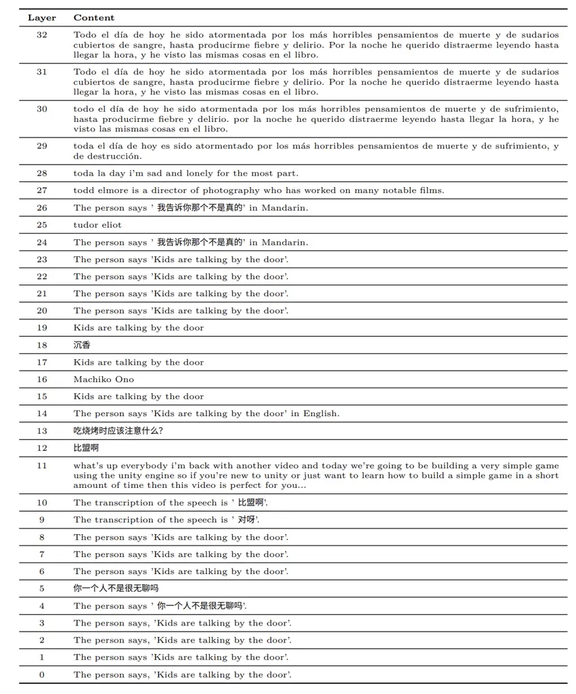

Figure 15: Spanish Example - Qwen2-Audio

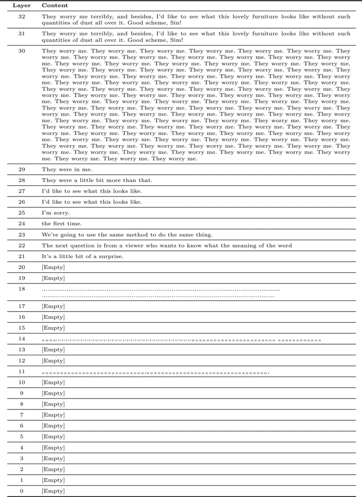

Figure 16: English Example - Whisper

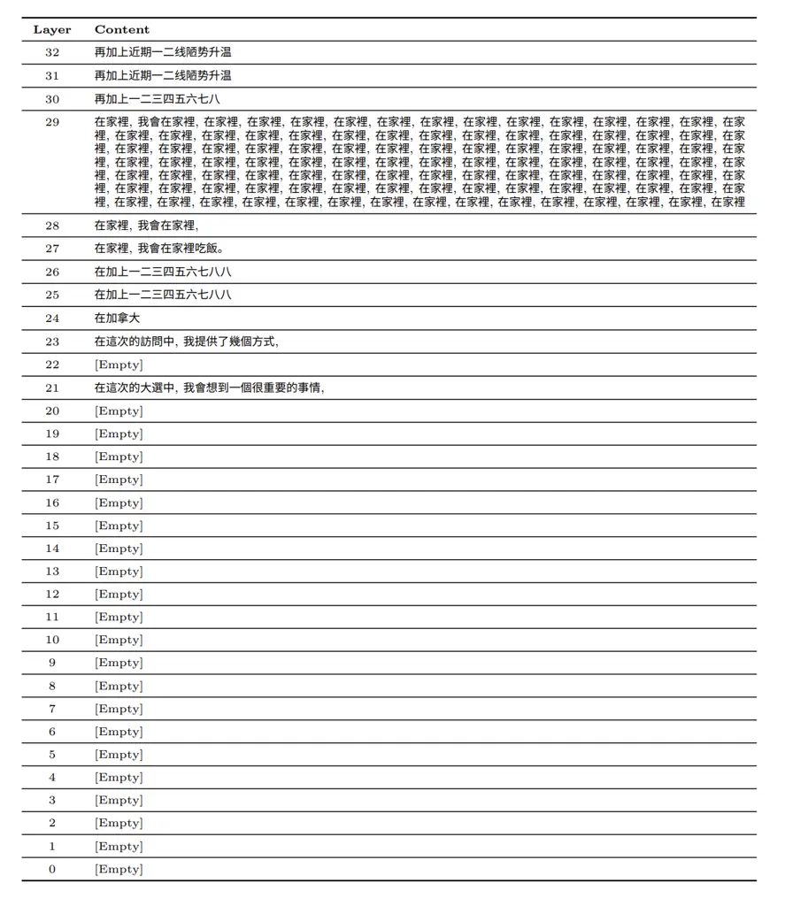

Figure 17: Chinese Example - Whisper
