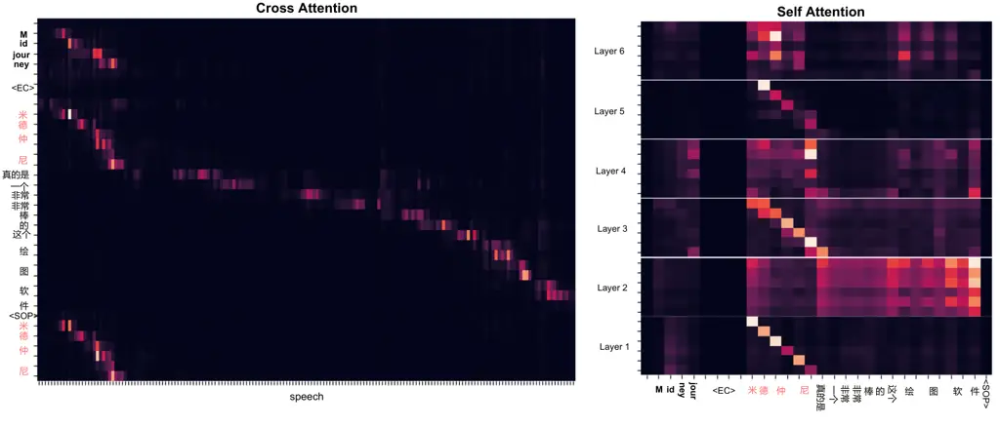

# Generative Annotation for ASR Named Entity Correction

Yuanchang Luo¹¹ 1 These authors contributed equally to this work.
Email: <wuzhanglin2@huawei.com>    Daimeng Wei¹¹ 1 These authors
contributed equally to this work. Email: <chenxiaoyu35@huawei.com>   
Shaojun Li¹¹ 1 These authors contributed equally to this work.
Email: <raozhiqiang@huawei.com>    Hengchao Shang
Email: <yangjinlong7@huawei.com>    Jiaxin Guo
Email: <yanghao30@huawei.com>    Zongyao Li, Zhanglin Wu, Xiaoyu Chen,
Zhiqiang Rao, Jinlong Yang, Hao Yang Affiliation: Huawei Translation
Service Center, Beijing,
China{luoyuanchang1,weidaimeng,lishaojun18,shanghengchao,guojiaxin1,lizongyao,

###### Abstract

End-to-end automatic speech recognition systems often fail to transcribe
domain-specific named entities, causing catastrophic failures in
downstream tasks. Numerous fast and lightweight named entity correction
(NEC) models have been proposed in recent years. These models, mainly
leveraging phonetic-level edit distance algorithms, have shown
impressive performances. However, when the forms of the
wrongly-transcribed words(s) and the ground-truth entity are
significantly different, these methods often fail to locate the wrongly
transcribed words in hypothesis, thus limiting their usage. We propose a
novel NEC method that utilizes speech sound features to retrieve
candidate entities. With speech sound features and candidate entities,
we inovatively design a generative method to annotate entity errors in
ASR transcripts and replace the text with correct entities. This method
is effective in scenarios of word form difference. We test our method
using open-source and self-constructed test sets. The results
demonstrate that our NEC method can bring significant improvement to
entity accuracy. The self-constructed training data and test set is
publicly available at github.com/L6-NLP/Generative-Annotation-NEC.

## 1 Introduction

End-to-end automatic speech recognition (ASR) systems Graves and Jaitly
(2014); Chorowski et al. (2014); Graves (2012) achieve significant
improvements in recent years and the wide usage of weak supervised
Radford et al. (2022) and unsupervised et.al (2023b) data further
improves ASR performance. SOTA ASR models achieve considerably low word
error rate (WER) on open-source ASR test sets, such as GigaSpeech et.al
(2021) or LibriSpeech Panayotov et al. (2015). However, they often
mistranscribe domain-specific words, such as person names, locations or
organizations, into common words, causing severe misunderstanding.

Figure 1: The drawback of NEC methods based on phonetic-level similarity
algorithms in scenarios when the word form of the ground-truth entity is
greatly different from that of the to-be-corrected text.

In recent years, numerous works Pundak et al. (2018); et.al (2020b);
Dutta et al. (2020); Le (2021) propose NEC methods to correct named
entity errors in ASR transcripts. We divide these methods into two
categories: (1) correct errors along with transcript generation; and (2)
correct errors after transcript generation, namely, post-editing errors.
In category (1), a number of methods Bruguier (2019); et.al (2020a);
Huber et al. (2021); Wang et al. (2023) train additional modules to
equip ASR models with the capability of contextual bias. Other methods
Guo et al. (2019); Zhang and Huang (2020); Zhang et al. (2019); Ma
et al. (2023) directly use pre-trained models Devlin et al. (2019);
et.al (2020c) of text to correct errors in transcripts. Methods in
category (1) require modifications to ASR systems in order to equip ASR
systems the capability of error correction, so these methods can hardly
be applied to third-party ASR systems.

In contrast, methods in category (2) require no modification to ASR
systems, so post-editing NEC methods are more applicable, especially
when using ASR systems that are running in the cloud. Recent works under
this category focus on solving issues like slow inference speed and lack
of phonetic constraints due to the use of non-autoregressive models Leng
et al. (2022b); Leng et al. (2022a); et.al (2023a).

Among those, fast and lightweight methods based on text and
phonetic-level similarity computed by edit distance algorithm have shown
significant performance Raghuvanshi (2019); et.al (2020a) (we refer this
method as PED-NEC hereinafter).

However, although this method is simple and effective, its performance
deteriorates greatly in scenarios when there is a great difference
between the word forms of the ground-truth entity and the
to-be-corrected text. When the forms of entity and related incorrect
text in ASR transcripts are similar, we can easily locate mistakes by
traversing entity datastore. However, when the forms are different, it
is hard to locate the to-be-corrected words by simply traversing the
ground-truth entity datastore.

As shown in Figure 1, the Chinese ASR model mistakenly transcribes "

大语言模型" (large language model) as "

大原模型" (large original model). Methods based on text and
phonetic-level edit distance have difficulties to determine whether the
correct entity is "

大模型" (large model) or "

大语言模型" (large language model), because the word form of the
incorrect content is different from the correct entity. This issue is
especially common for loanwords and entities that contain digits. For
example, a Chinese ASR system transcribes "ChatGPT" as "

切特GPD", making it particularly challenging for NEC methods that are
based on phonetic similarity search.

To address the issue above mentioned, we innovatively propose an NEC
method using a generative approach to annotate to-be-corrected text in
transcript. To be more specific, we utilize speech sound feature,
candidate named entity, and ASR transcript to generate (label)
to-be-corrected words in the transcript, and perform correction
accordingly. This NEC method, which is based on error annotation,
achieves end-to-end text correction after identifying the
to-be-corrected text, without the need to consider word form changes, so
it is superior to previous rule-based replacement approaches.

We validate the effectiveness of our method on both open-source Aishell
Bu et al. (2017) test sets and self-constructed BuzzWord set, and
results show that our method outperforms PED-NEC. Particularly, our
method significantly outperforms the PED-NEC method when the word forms
of the to-be-corrected text and correct entity are different, as well as
on our challenging BuzzWord test set.

## 2 Method

The rationale of PED-NEC is that ASR systems often mistranscribe
entities to phonetically similar common words. PED-NEC is a two-step
approach: (1) entity retrieval based on speech sound similarity and (2)
text correction. Compared to PED-NEC, our method replaces step (1) with
direct use of audio for retrieval, which we believe helps solve NEC
errors such as "

切特GPD". Then we employ a generative approach for text correction.

Our method is based on a pre-trained Attention-based Encoder-Decoder
(AED) ASR system. The correction process is shown in Figure 2. A
datastore is constructed in advance to store audio-text pairs of
entities. After the speech segment and ASR transcript are obtained,
speech retrieval is performed to determine whether a part of the speech
segment shares similar speech sound features with any candidate entity
in the datastore. If yes, we then concatenate the candidate entity and
the ASR transcript as a prompt to guide the correction model to generate
the possible wrong word(s) in the ASR transcript corresponding to the
correct entity. Finally, we replace the wrong text with the correct
entity in the datastore. We detail the process of each step in the
following part of this section.

Figure 2: Our method consists of two steps: The left part (SS) denotes
datastore construction and candidate entity retrieval. The right part
(GL) denotes concatenating candidate entities and ASR transcript as a
prompt to guide model generate errors in the transcript. Finally, error
correction is done by text replacement.

### 2.1 Datastore Creation

For the list of entities $`X=\{x_{1},x_{2},...x_{n}\}`$ we collected, we
can obtain their speech sounds

```math
Speech_{x_{i}}=TTS(x_{i}) \tag{1}
```

via text-to-speech (TTS) engine. Then we input the TTS-generated audios
to encoder, and use the output of the last layer of the encoder as the
phonetic representation of the entity $`x_{i}`$. To improve retrieval
accuracy and reduce memory usage, we add a Convolutional Neural Network
(CNN) layer to the end of the encoder. So the audio representation of
entity $`x_{i}`$ is denoted as:

```math
x_{i}^{\prime}=CNN(Encoder(Speech_{x_{i}})) \tag{2}
```

As a result, the datastore stores key-value (representation-entity)
pairs

```math
\{(x^{\prime}_{1},x_{1}),(x^{\prime}_{2},x_{2}),...(x^{\prime}_{i},x_{i})...\} \tag{3}
```

### 2.2 Entity Retrieval

We then input the speech segment $`s`$ to the encoder and get its
representation $`s\textquoteright`$ from the output of the last layer of
the encoder:

```math
s^{\prime}=CNN(Encoder(s)) \tag{4}
```

We introduce self-attention network (SAN) and feed-forward network(FFN)
to calculate the probability $`p_{i}`$ that $`s`$ contains a candidate
entity $`x^{\prime}_{i}`$ in the datastore. The probability is denoted
as:

```math
p_{i}=Sigmoid(FFN(SAN(q=x^{\prime}_{i};k,v=s^{\prime}))) \tag{5}
```

It should be noted that the input SAN and q are representations of
$`x^{\prime}_{i}`$. $`k`$ and $`v`$ are key and value of candidate
entity $`s^{\prime}`$. In addition, we apply average polling after FFN
for final classification.

Finally, we obtain the probabilities

```math
\{p_{1},p_{2},...p_{i}...\} \tag{6}
```

of whether any entity in the datastore is in the speech segment. We
select top K candidate entities for further correction if the
probability $`p_{i}`$ is higher than the threshold we set.

### 2.3 Error Correction

We obtain several candidate entities through entity retrieval as
described above. As shown in Figure 2, we concatenate entities with
symbol "\|\|\|" and then concatenate the entity string with ASR
transcript using "\<EC\>". The entity+transcript string is used as a
prompt to guide the correction model generate wrong entities in the
transcript that share similar sound features as the candidiate entity.
The process is actually a generative annotation method as the correction
model outputs one or several words in the original ASR transcript.

Our generative method is insensitive to word form difference between the
to-be-corrected text and candidate entity, thereby solving the issue
described in Figure 1.

|      |                                                  |
| ---- | ------------------------------------------------ |
| Type | Predict Errors                                   |
| 1    | \<empty\> \|\|\| \<empty\> \|\|\| Error3         |
| 2    | Error1 \|\|\| Error2 \|\|\| Error3               |
| 3    | Error1-1,Error1-2 \|\|\| \<empty\> \|\|\| Error3 |

Table 1: Several possible forms of prediction errors when there are
three candidate entities.

In addition, our method also possesses the capability of Entity
Rejection. If the model cannot match a candidate entity with a possible
wrong entity in the transcript, it will generate symbol "\<empty\>" to
indicate no result is returned.

We believe this method can easily identify the to-be-corrected text, as
it combines the original audio, the candidate entity, and the incorrect
transcript. The model aims to find the to-be-corrected text that shares
similar speech sounds and aligns with language model. The final step is
to replace wrong text with the ground-truth entity in the datastore.

Using a generative approach to predict incorrect text, we can easily
handle various error correction scenarios. As shown in Table 1, where
three candidate entities are retrieved, the returned result from the
correction model may have different formats. If a candidate entity does
not match any piece of text in transcript, an "\<empty\>" symbol is
returned to skip correction. In addition, when a candidate entity
matches more than one mistake (type 3 in Table 1), our method can
correct all of them.

## 3 Experimental Setup

Figure 3: Constructing generative labeling training data using speech
with ground-truth transcript.

### 3.1 Training Data

To train the correction model, labeled entities in the ground-truth
transcripts are required. Thanks to Chen et al. (2022) and Yadav et al.
(2020), we obtained 54,129 Chinese entities in Aishell dataset. We refer
to their labeling framework to construct our training data. Audio-text
pairs that contain labeled entities are used as positive samples while
pairs with no entity are treated as negative samples (ten times the
number of positive samples). Speech sounds for entities are generated
via TTS¹¹ 1 https://github.com/espnet/espnet.

As shown in Figure 3, to equip the pre-trained model with error
correction capability, the pre-labeled entity data mentioned above is
used to construct fine-tuning data. We first use the Whisper-base model
to generate ASR transcripts that may contain incorrect entities, and
align them with correct ones using edit distance. The amount of
fine-tuning data is less than the data used for training the
classification model.

We only use 10k training data. To enable the model to generate
"\<empty\>" when no correction is needed, 20% prompts contain entities
that are not in the transcript, or only partly correct (for example, if
the entity that needs to be corrected is "

文心一言", the entity in our prompt might be "

文心言", thus the expected result is "\<empty\>").

It should be noted that all of our training data can be automatically
constructed based on the current open-source data, making it easy for
other researchers to reproduce our experiments.

|         |                      |                       |                      |                       |                             |                       |                      |                       |
| ------- | -------------------- | --------------------- | -------------------- | --------------------- | --------------------------- | --------------------- | -------------------- | --------------------- |
|         | AISHELL Test Set (%) |                       |                      |                       | Word Form Variation Set (%) |                       |                      |                       |
| Model   | CER$`\downarrow`$    | NNE CER$`\downarrow`$ | NE CER$`\downarrow`$ | NE Recall$`\uparrow`$ | CER$`\downarrow`$           | NNE CER$`\downarrow`$ | NE CER$`\downarrow`$ | NE Recall$`\uparrow`$ |
| Whisper | 10.47                | 10.00                 | 15.41                | 70.85                 | 18.99                       | 18.10                 | 25.34                | 25.4                  |
| PED-NEC | 10.40                | 10.42                 | 10.85                | 83.34                 | 17.60                       | 18.32                 | 13.58                | 50.79                 |
| PED+GL  | 10.00                | 10.00                 | 10.03                | 84.34                 | 16.76                       | 18.12                 | 12.55                | 50.85                 |
| SS+NEC  | 10.26                | 10.41                 | 8.34                 | 86.20                 | 17.01                       | 18.19                 | 13.05                | 50.82                 |
| SS+GL   | 9.85                 | 10.01                 | 7.41                 | 87.31                 | 11.45                       | 18.10                 | 7.53                 | 86.51                 |

Table 2: Our error correction results on the Aishell test set and the
Word Form Variation Set we constructed.

|         |                       |                   |                   |                    |
| ------- | --------------------- | ----------------- | ----------------- | ------------------ |
|         | BuzzWord Test Set (%) |                   |                   |                    |
| Model   |                       | NNE               | NE                | NE                 |
|         | CER$`\downarrow`$     | CER$`\downarrow`$ | CER$`\downarrow`$ | Recall$`\uparrow`$ |
| Whisper | 16.23                 | 15.29             | 46.49             | 12.22              |
| PED-NEC | 10.67                 | 15.49             | 23.62             | 61.82              |
| PED+GL  | 15.00                 | 15.29             | 12.9              | 79.96              |
| SS+NEC  | 16.01                 | 15.47             | 17.40             | 70.03              |
| SS+GL   | 14.77                 | 15.29             | 7.26              | 87.47              |

Table 3: The experiment results of our error correction method on the
BuzzWord test set.

### 3.2 Test Set

We use two test sets to verify the effectiveness of our NEC method. One
is the Aishell test set, and the other is the BuzzWord test set that we
constructed.

We merge all the deduplicated NEs (a total of 3,101) from both the dev
and test sets of Aishell to serve as the NE database for the Aishell
test set. To better demonstrate the effectiveness of our method in
challenging scenarios, we construct a BuzzWord test set.

Some of these buzzwords are long entities, loanwords, or entities
consisting of digits, which are really challenging to ASR systems. The
word forms of these words transcribed by ASR systems often vary greatly
to that of the ground-truth buzzwords.

The BuzzWord test set contains 1500 short speech segments and
corresponding ground-truth transcripts from January 2023 to January 2024. In the test set, we construct 500 positive test cases that
contains buzzwords and 1000 negative test cases without buzzwords.

To make our test set more close to real error correction scenarios, we
take speech diversity into consideration. For each buzzword, we collect
10 positive test cases from at least 5 speakers, and we carefully
balance female and male voices. Negative samples are also from those
speakers. These buzzwords appear at the beginning, in the middle, or at
the end of the speech segment, and a buzzword may appear more than once
in one speech segment. For details about the buzzwords test set, see
Appendix Table 5.

Although we only have 50 buzzwords, our experiment shows that this test
set poses a great challenge to existing ASR systems.

### 3.3 Evaluation Metrics

Followed by Wang et al. (2024)’s work, we assess the performance of
various NEC methods using four key metrics:

- •
  CER: measures the total character error rate of the entire test set.
- •
  NNE-CER: evaluates the character error rate for characters within the
  utterance that do not form part of an entity.
- •
  NE-CER: determines the character error rate for characters that
  constitute entities within the utterance.
- •
  NE-Recall: gauges the recall rate of entities within the utterance
  that are accurately recognized.

### 3.4 Parameters

The ASR AED pre-trained model we used is Whisper-base²² 2
https://github.com/openai/whisper. In speech classification, we use a
one-dimensional CNN with a window size of 3 and a stride of 2. The
dimension of the SAN is 512, and the hidden layer dimension of FFN is 2048. During training, we use one GPU, with a batch size of 512 and a
learning rate of 5e-5. We use a constructed dev set to determine the
convergence of the model. The encoder parameters of the pre-trained
model are frozen during training and fine-tuning. During fine-tuning,
the batch size is set to 64 and the learning rate to 1e-4. During entity
retrieval, we select a candidate entity as prompt if the probability is
greater than 0.3, with a maximum of 5 candidate entities in one speech
segment.

### 3.5 Baseline System

The ASR results for all test sets are generated by Whisper, which is
trained on a large amount of weakly supervised data. We used
Whisper-large v2³³ 3 https://github.com/openai/whisper in our
experiment. For system comparison, we focus on the method based on
Phonetic-level Edit Distance Raghuvanshi (2019), namely the previously
mentioned PED-NEC, as a strong baseline. Our method use the same
implementation method as Wang et al. (2024)⁴⁴ 4
https://github.com/Amiannn/Dancer, which additionally includes a
preliminary Corrupted Entity Detection (CED) module. The implementation
details of the baseline are described in Appendix A.3. We also test our
method on commercial ASR systems like iFlytek⁵⁵ 5
https://www.xfyun.cn/services/lfasr and Amazon⁶⁶ 6
https://aws.amazon.com/transcribe on the BuzzWord test set.

## 4 Result

In addition to comparing with PED-NEC, our method has three different
variants. PED+GL is to find candidate results using PED, and then
correct them using our generative annotation method (GL). SS+NEC
determines whether a speech segment contains a certain entity based on
the entity speech sound and the input speech segment (SS), and then
applies the PED-NEC approach for correction. SS+GL is shown in Figure 2.
Which is to find candidate results using SS and then correct them using
GL.

We verify the effectiveness of our method on the Aishell and
self-constructed BuzzWord test sets. On the Aishell test set, we
specifically compare performances of different NEC methods in scenario
when the word form of the to-be-correct text is different from the word
form of the candidate entity. In addition, we also test our method upon
commercial ASR systems to demonstrate generalizability of our method
(Appendix Table 6)

|     |                                                                                                                                                                                                                                                                                                                                                                                                                                                                          |
| --- | ------------------------------------------------------------------------------------------------------------------------------------------------------------------------------------------------------------------------------------------------------------------------------------------------------------------------------------------------------------------------------------------------------------------------------------------------------------------------ |
| No. | Result                                                                                                                                                                                                                                                                                                                                                                                                                                                                   |
| 1   | Ref: 到上世纪50年代后长江白鲟(cháng jiāng bái xún)就只分布于长江及出海口 ASR: 到上世纪50年代后长江白旭云(cháng jiāng bái xù yún)就只分布于长江及出海口 PED-NEC:到上世纪50年代后蓝箭白旭云(lán jiàn bái xù yún)就只分布于长江及出海口 Ours: 到上世纪50年代后长江白鲟(cháng jiāng bái xún)就只分布于长江及出海口 Explanation: The ASR system wrongly treats the word "鲟 (xún)" as a linking pronunciation of two words "旭云 (xù yún)", and thus mistranscribes the word. |
| 2   | Ref: 华硕灵耀(huá shuò líng yào)X双屏Pro在外观设计还是性能上都有着非常高的水准 ASR: 华硕01(huá shuò líng yāo)X双屏Pro在外观设计还是性能上都有着非常高的水准 PED-NEC: 华硕灵耀01X双屏Pro在外观设计还是性能上都有着非常高的水准 Ours: 华硕灵耀X双屏Pro在外观设计还是性能上都有着非常高的水准 Explanation: A mistranscription of Chinese words "灵耀 (líng yào)" to numbers "01 (líng yāo)"                                                                                 |
| 3   | Ref: Midjourney真的是一个非常非常棒的这个绘图软件 ASR: 米德仲尼(mǐ dé zhòng ní)真的是一个非常非常棒的这个绘图软件 PED-NEC: 米德仲尼(mǐ dé zhòng ní)真的是一个非常非常棒的这个绘图软件 Ours: Midjourney真的是一个非常非常棒的这个绘图软件 Explanation: A mistranscription of English word "Midjourney" to Chinese words "米德仲尼 (mǐ dé zhòng ní)"                                                                                                                       |

Table 4: Examples of comparing PED-NEC and our method when the word form
of transcribed entity results and the word form of the entity are
different.

### 4.1 Aishell Result

Experiment results are shown in Table 2. On the AISHELL test set,
Whisper already achieves a relatively high accuracy in terms of NE
transcription, with a Recall of 70.85%. Our baseline error correction
method, PED-NEC, further increases the Recall to 83.34% upon Whisper.
The improvement is significant, demonstrating PED-NEC is an effective
method. However, it should be noted the PED-NEC slightly increase
NNE-CER, indicating that this method has a tendency of over-correction.

When we use PED for entity retrieval and GL for correction (PED+GL), we
observe improvements on all four metrics, with an increase of more than
one point in terms of entity recall. However, NNE-CER achieves similar
performance as the baseline, indicating that over-correction is rare
when GL is used. When the entity retrieval employs the SS method, but
error correction still uses the PED-NEC approach (SS+NEC), we observe
varying degrees of improvement in both NE-CER and NE-Recall. However,
both CER and NNE-CER decrease, indicating that the SS-based entity
retrieval method performs better but still fails to address cases of
over-correction. Our proposed SS+GL method gets the lowest CER (9.85)
and highest NE recall (87.31%). And NNE-CER is about 10, which is very
close to the best result.

We construct a Word Form Variation set by manually selecting 50 NEs from
the AiShell test set of which the word forms of the incorrect text and
the ground-truth entity are different (some word form changes are due to
the addition of punctuation marks). On this test set, we find that our
method significantly outperforms PED-NEC.

### 4.2 BuzzWord Result

A majority of the entities in our BuzzWord test set are newly-created
words from January 2023 to January 2024, so most of them are OOVs to ASR
systems. In addition, many of the entities are combinations of Chinese
characters, English letters, and digits. As the word form of the
incorrect text generated by ASR system often differs from that of the
ground-truth entity, this test set is challenging for entity retrieval
and correction.

As shown in Table 3, the NE-Recall of Whisper is only 12.22%, indicating
correction of these buzzwords is urgently required. Although PEC-NEC
remains effective, its NE-Recall is only 61.82%. However, when PEC-NEC
is used along with our proposed GL, the best NE-Recall can reach 79.96%
while we observe different levels of improvements regarding other
metrics. The reason is that our proposed GL is capable of deciding when
no correction is required. Moreover, the PED+GL significantly
outperforms the SS+NEC, which also demonstrates the superiority of the
GL. Our method is much more noise tolerant and the correction
performance is not compromised. We discuss this capability in detail in
section 5.2. Our SS+GL method achieves the highest NE-Recall (87.47%), a
26% improvement over PED-NEC, and the lowest CER (14.77), demonstrating
its effectiveness.



Figure 4: Heatmaps of Cross Attention in the last layer and Self
Attention in each layer of our generative annotation model. Regarding
Self Attention, we analyze the relationship between the output result
"米德仲尼" and the prompt. The candidate entity is "Midjourney," the
incorrectly transcribed text is "米德仲尼", and the annotation result is
"米德仲尼".

### 4.3 Case Study

As shown in Table 4, we list some cases when PED-NEC fails to correct
entities due to word form difference between the to-be-corrected text
and ground-truth entity, while our method succeeds.

Regarding case No.1, ASR system transcribes "

长江白鲟" (Yangtze River Chinese Sturgeon) as "

长江白旭云", where the to-be-corrected text is longer. PED-NEC
mis-corrects part of the entity "

长江" to a totally wrong entity "

蓝箭". Our method, however, precisely annotates the to-be-corrected text
and replaces it with the ground-truth entity. Regarding case No.2, ASR
system transcribes "

华硕灵耀" (Asus Lingyao) as "

华硕01", turning part of the Chinese characters into numbers, which is a
very tricky case for correction. PED-NEC fails to identify the entity
boundary and leaves the digits uncorrected, but our method makes a
correct replacement. Regarding case No.3, ASR system transcribes the
English entity "Midjourney" as Chinese characters "

米德仲尼". PED-NEC fails to make a replacement but our method again
performs well.

## 5 Analysis

### 5.1 Joint Annotation

To better analyze the roles of speech segment, candidate entity and ASR
transcript in error annotation, we check the cross attention of ASR
transcript and speech segment, as well as the self-attention of prompt.
As shown in Figure 4, to analyze the cross attention, we trim speech
audios to segments that align with the transcripts. We use the average
value of each audio frame and text to denote the cross attention.

As expected, the text (

"米德仲尼") generated by the annotation model, the candidate entities
("Midjourney"), and the to-be-corrected text (

"米德仲尼") in the transcript all have high attention values with the
same segment of the speech signal. Similarly, we analyze the
relationship between the annotation result and the prompt. We find that
the annotation result pays a lot of attention to the candidate entity
and the corresponding to-be-corrected text (although performances vary
at each layer). The cross-attention and self-attention heatmap again
corroborate our previous hypothesis. We believe this approach is able to
accurately annotate the to-be-corrected text that shares similar speech
sounds to the candidate entity. This approach remains effective when the
word form of the to-be-corrected words is different from that of the
candidate entity.

Figure 5: Error Correction CER at different retrieval threshold.

### 5.2 Entity Rejection

Both steps of our method have the capability of entity rejection. In
step 1, entity retrieval, we can filter out content with low similarity.
In step 2, generative annotation, we can also reject entities by
generating the symbol "\<empty\>". Since step 2 has the ability to
reject correction, so we can allow more candidate entities retrieved in
the step 1, without worrying about the accumulation of errors brought to
step 2.

Our retrieval step is noise-tolerant and does not require precisely
accurate retrieval results. Figure 5 presents different F1 scores in the
retrieval step based on different filter thresholds we set. According to
the figure, the highest retrieval F1 score does not result in the best
correction performance. Instead, higher recall and lower precision
scores lead to the best correction accuracy, indicating that our
correction method is fault-tolerant in terms of the retrieval results.

If multiple words/phrases sound similar in the transcript but only one
of them needs correction, phonetic-level similarity-based algorithms can
hardly distinguish which one to correct. As shown in Figure 6, the
candidate entity "

韩宇" is a person’s name, but in the transcript, there are two pieces of
text that sound the same as the candidate entity, "

韩雨" (a person name but using a different Chinese character) and "

韩语" (means Korean language). We need to correct the first piece of
text "

韩雨" (another person name) without correcting the second phonetically
identical word "

韩语" (Korean language). PED-NEC corrects both pieces of text, leading
to over-correction. Interestingly, our generative approach only corrects
the first word and skips the second one, indicating that our model has
the ability to determine which of the phonetically-similar words need
correction.

Figure 6: This case contains two pieces of text that sound the same as
the candidate entities, but only one of them needs correction. The first
"韩雨" is a person’s name that should be corrected to "韩宇". Although
the pronunciation of the second piece of text "韩语" is the same as the
candidate entity, it does not require correction.

We believe such capability benefits from the use of the generative
model’s language model ability, which allows the model to learn that the
candidate entity might be a person’s name. Since the first piece of text
is more like a person’s name while the second piece of text is not
relevant, so the model only corrects the first piece of text. According
to the heatmap shown in Figure 4, the annotated result, which needs to
be corrected, pays a lot of attention to the contex as well.

It should be noted that as shown in Table 1, our method has the ability
to annotate multiple incorrect forms of a candidate entity in one piece
of ASR transcript.

### 5.3 Corrupted Entity Detection

When the number of entities increases, PED-NEC requires an important
preliminary module, which is called Corrupted Entity Detection (CED).
CED can detect NEs that are incorrectly transcribed in the ASR
transcript, allowing PED-NEC to correct only these detected results.
This effectively avoids over-correcting some words that are phonetically
similar but are actually not entities. However, in our method, we did
not use this preliminary module. We believe our GL method already
possesses the capability of CED. Our training goal is to generate
corrupted entities based on speech segment and prompt, indicating our
model already has the capability of CED. This is also a potential
advantage of our proposed generative correction method: it
simultaneously performs CED and correction.

## 6 Conclusion

This article focuses on post-editing ASR errors and proposes a new
generative error correction method to address a drawback of PED-NEC:
fails to correct entities when the word form of the to-be-corrected text
differs greatly from that of the ground-truth entity. Our method uses a
generative approach to annotate to-be-corrected text in transcript based
on speech segment, candidate entity and ASR transcript, and make
replacement accordingly. This generative method is flexible and
applicable to various entity correction scenarios. Our method also has
the ability of entity rejection, an ability to decide when correction is
not required. This ability allows more candidate entities in entity
retrieval and further improves correction performance. Our method
outperforms the baseline (PED-NE) on the open-source Aishell test set
and our BuzzWord test set, no matter using the open-source Whisper or
commercial ASR engines, thus demonstrating generalizability of our
method.

## Limitations

Our method employs a Post-Correction strategy, so latency is a concern.
Our method consists of two steps: NE retrieval and NE correction.
Although our generative correction method only annotates to-be-corrected
text, resulting in minimal time consumption, entity retrieval can become
significantly time-consuming when there are many entities in the
datastore. In such cases, on one hand, we can replace the retrieval with
PED, which is the previously mentioned PED+GL method to reduce the
overall latency; on the other hand, in the future, we plan to turn our
retrieval approach into vector search, which can significantly
accelerate speed through the use of existing mature vector search
engines.

## References

- Bruguier (2019) Antoine et.al Bruguier. 2019. [Phoebe:
  Pronunciation-aware contextualization for end-to-end speech
  recognition](https://doi.org/10.1109/ICASSP.2019.8682441). In
  _ICASSP_, pages 6171–6175.
- Bu et al. (2017) Hui Bu, Jiayu Du, Xingyu Na, Bengu Wu, and Hao
  Zheng. 2017. [Aishell-1: An open-source mandarin speech corpus and a
  speech recognition
  baseline](https://doi.org/10.1109/ICSDA.2017.8384449). In _2017 20th
  Conference of the Oriental Chapter of the International Coordinating
  Committee on Speech Databases and Speech I/O Systems and Assessment
  (O-COCOSDA)_, pages 1–5.
- Chen et al. (2022) Boli Chen, Guangwei Xu, Xiaobin Wang, Pengjun Xie,
  Meishan Zhang, and Fei Huang. 2022. Aishell-ner: Named entity
  recognition from chinese speech. In _2022 IEEE International
  Conference on Acoustics, Speech and Signal Processing (ICASSP)_.
- Chorowski et al. (2014) Jan Chorowski, Dzmitry Bahdanau, Kyunghyun
  Cho, and Yoshua Bengio. 2014. End-to-end continuous speech recognition
  using attention-based recurrent nn: First results. In _NIPS_.
- Devlin et al. (2019) Jacob Devlin, Ming-Wei Chang, Kenton Lee, and
  Kristina Toutanova. 2019. [Bert: Pre-training of deep bidirectional
  transformers for language
  understanding](http://arxiv.org/abs/1810.04805). _NAACL_.
- Dutta et al. (2020) Samrat Dutta, Shreyansh Jain, and Ayush
  Maheshwari. 2020. [Asr error correction with augmented transformer for
  entity retrieval](https://api.semanticscholar.org/CorpusID:226202635).
  In _Interspeech_.
- et.al (2020a) Abhinav Garg et.al. 2020a. [Hierarchical Multi-Stage
  Word-to-Grapheme Named Entity Corrector for Automatic Speech
  Recognition](https://doi.org/10.21437/Interspeech.2020-3174). In
  _Proc. Interspeech_, pages 1793–1797.
- et.al (2021) Guoguo Chen et.al. 2021. [Gigaspeech: An evolving,
  multi-domain asr corpus with 10,000 hours of transcribed
  audio](http://arxiv.org/abs/2106.06909).
- et.al (2020b) Mahaveer Jain et.al. 2020b. [Contextual rnn-t for open
  domain asr](http://arxiv.org/abs/2006.03411). _Interspeech_.
- et.al (2023a) Yichong Leng et.al. 2023a. [Softcorrect: Error
  correction with soft detection for automatic speech
  recognition](http://arxiv.org/abs/2212.01039).
- et.al (2020c) Yinhan Liu et.al. 2020c. [Multilingual denoising
  pre-training for neural machine
  translation"](https://doi.org/10.1162/tacl_a_00343). pages 726–742.
- et.al (2023b) Yu Zhang et.al. 2023b. [Google usm: Scaling automatic
  speech recognition beyond 100
  languages](http://arxiv.org/abs/2303.01037).
- Graves (2012) Alex Graves. 2012. Sequence transduction with recurrent
  neural networks. _International Conference on Machine
  Learning,International Conference on Machine Learning_.
- Graves and Jaitly (2014) Alex Graves and Navdeep Jaitly. 2014. Towards
  end-to-end speech recognition with recurrent neural networks.
  _International Conference on Machine Learning,International Conference
  on Machine Learning_.
- Guo et al. (2019) Jinxi Guo, Tara N. Sainath, and Ron J. Weiss. 2019.
  [A spelling correction model for end-to-end speech
  recognition](http://arxiv.org/abs/1902.07178). _ICASSP_.
- Huber et al. (2021) Christian Huber, Juan Hussain, Sebastian Stüker,
  and Alexander Waibel. 2021. [Instant one-shot word-learning for
  context-specific neural sequence-to-sequence speech
  recognition](http://arxiv.org/abs/2107.02268).
- Le (2021) Duc et.al Le. 2021. Contextualized streaming end-to-end
  speech recognition with trie-based deep biasing and shallow fusion.
  _Interspeech_.
- Leng et al. (2022a) Yichong Leng, Xu Tan, Rui Wang, Linchen Zhu, Jin
  Xu, Wenjie Liu, Linquan Liu, Tao Qin, Xiang-Yang Li, Edward Lin, and
  Tie-Yan Liu. 2022a. [Fastcorrect 2: Fast error correction on multiple
  candidates for automatic speech
  recognition](http://arxiv.org/abs/2109.14420).
- Leng et al. (2022b) Yichong Leng, Xu Tan, Linchen Zhu, Jin Xu, Renqian
  Luo, Linquan Liu, Tao Qin, Xiang-Yang Li, Ed Lin, and Tie-Yan Liu.
  2022b. [Fastcorrect: Fast error correction with edit alignment for
  automatic speech recognition](http://arxiv.org/abs/2105.03842).
- Ma et al. (2023) Rao Ma, Mark John Francis Gales, Kate Knill, and
  Mengjie Qian. 2023. [N-best t5: Robust asr error correction using
  multiple input hypotheses and constrained decoding
  space](https://api.semanticscholar.org/CorpusID:257254986). _Proc.
  Interspeech_, abs/2303.00456.
- Panayotov et al. (2015) Vassil Panayotov, Guoguo Chen, Daniel Povey,
  and Sanjeev Khudanpur. 2015. [Librispeech: An asr corpus based on
  public domain audio
  books](https://doi.org/10.1109/ICASSP.2015.7178964). In _2015 IEEE
  International Conference on Acoustics, Speech and Signal Processing
  (ICASSP)_, pages 5206–5210.
- Pundak et al. (2018) Golan Pundak, Tara N. Sainath, Rohit
  Prabhavalkar, Anjuli Kannan, and Ding Zhao. 2018. [Deep context:
  end-to-end contextual speech
  recognition](http://arxiv.org/abs/1808.02480). _SLT_.
- Radford et al. (2022) Alec Radford, Jong Wook Kim, Tao Xu, Greg
  Brockman, Christine McLeavey, and Ilya Sutskever. 2022. [Robust speech
  recognition via large-scale weak
  supervision](http://arxiv.org/abs/2212.04356).
- Raghuvanshi (2019) Arushi et.al Raghuvanshi. 2019. Entity resolution
  for noisy ASR transcripts.
- Wang et al. (2023) Xiaoqiang Wang, Yanqing Liu, Jinyu Li, and Sheng
  Zhao. 2023. [Improving contextual spelling correction by external
  acoustics attention and semantic aware data
  augmentation](http://arxiv.org/abs/2302.11192). _Proc. ICASSP_.
- Wang et al. (2024) Yi-Cheng Wang, Hsin-Wei Wang, Bi-Cheng Yan, Chi-Han
  Lin, and Berlin Chen. 2024. [Dancer: Entity description augmented
  named entity corrector for automatic speech
  recognition](http://arxiv.org/abs/2403.17645).
- Yadav et al. (2020) Hemant Yadav, Sreyan Ghosh, Yi Yu, and Rajiv Ratn
  Shah. 2020. End-to-end named entity recognition from english speech.
  _arXiv preprint arXiv:2005.11184_.
- Zhang and Huang (2020) Shaohua Zhang and Haoran et.al Huang. 2020.
  [Spelling error correction with soft-masked
  BERT](https://doi.org/10.18653/v1/2020.acl-main.82). In _ACL_, pages
  882–890, Online.
- Zhang et al. (2019) Shiliang Zhang, Ming Lei, and Zhijie Yan. 2019.
  [Automatic spelling correction with transformer for ctc-based
  end-to-end speech recognition](http://arxiv.org/abs/1904.10045).

## Appendix A Appendix

### A.1 BuzzWord Test Set

To better demonstrate the generalizability of our method, we construct a
new test set. We collect 50 buzzwords in Chinese from different areas
(including tech, entertainment, social news, etc.) since January 2023.
For each buzzwords, as shown in Table 5, we collect 5 videos (i.e. 5
speakers) on Bilibili⁷⁷ 7 http://bilibili.com/ or YouTube⁸⁸ 8
https://www.youtube.com/.In every video, we extract two sentences that
contains the buzzwords as positive examples and 4 sentences that does
not contain the buzzword as negative examples. Finally, we get a
1500-sentence test set with 500 positive examples and 1000 negative
examples. The duration of the audio recordings ranges from 5 to 15
seconds.

|        |         |          |          |
| ------ | ------- | -------- | -------- |
|        | Speaker | Positive | Negative |
|        | S1      | 2        | 4        |
|        | S2      | 2        | 4        |
| Entity | S3      | 2        | 4        |
|        | S4      | 2        | 4        |
|        | S5      | 2        | 4        |

Table 5: The details of creating one entity’s positive and negative
samples in our challenge test set.

### A.2 Entity Info

Figure 7: Histogram of the distribution of entity counts in training
data

We also analyze the number of entity occurrences in the training data,
as shown in Figure 7. We found that the majority of training data only
contains one entity per sentence, with a minority of sentences
containing two entities. To address the correction of more entities, it
is necessary to build a more diverse training dataset.

### A.3 Experimental Details

We are grateful for the work of Wang et al. (2024). The baseline method
PED-NEC was implemented entirely according to their open-source code⁹⁹ 9
https://github.com/Amiannn/Dancer. We used their bert-base CED method as
the preliminary module for error correction in PED-NEC.

|         |                       |                   |                   |                    |
| ------- | --------------------- | ----------------- | ----------------- | ------------------ |
|         | BuzzWord Test Set (%) |                   |                   |                    |
| Model   |                       | NNE               | NE                | NE                 |
|         | CER$`\downarrow`$     | CER$`\downarrow`$ | CER$`\downarrow`$ | Recall$`\uparrow`$ |
| iFlytek | 12.48                 | 11.18             | 56.46             | 19.18              |
| PED-NEC | 12.29                 | 11.41             | 45.26             | 46.42              |
| SS+GL   | 11.28                 | 11.19             | 14.09             | 81.71              |
| Amazon  | 25.88                 | 24.40             | 73.67             | 9.84               |
| PED-NEC | 25.33                 | 24.46             | 59.53             | 39.36              |
| SS+GL   | 23.23                 | 24.40             | 19.42             | 80.02              |

Table 6: The commercial engine experiment results of our error
correction method on the BuzzWord test set.

It should be noted that their CED module did not perform well in our
BuzzWord test set, resulting in many corrupted entities not being
detected. Consequently, we ultimately used the PED-NEC method without
CED on the BuzzWord test set. We adjusted different similarity
thresholds and selected the overall best CER result as the final outcome
for PED-NEC.

### A.4 Correction for Commercial Engine

To better verify the generalizability of our method, we also conducted
error correction comparative experiments on the results of commercial
engines (iFlytek¹⁰¹⁰ 10 https://www.xfyun.cn/services/lfasr and
Amazon¹¹¹¹ 11 https://aws.amazon.com/transcribe). The results of the
experiments on the BuzzWord test set showed that our method still
significantly outperforms the PED-NEC method.

### A.5 Correction Cases

|     |                                                                                                                                                                                                                                                                                                                                                                                                                                                                                                                        |
| --- | ---------------------------------------------------------------------------------------------------------------------------------------------------------------------------------------------------------------------------------------------------------------------------------------------------------------------------------------------------------------------------------------------------------------------------------------------------------------------------------------------------------------------- |
| No. | Result                                                                                                                                                                                                                                                                                                                                                                                                                                                                                                                 |
| 1   | Ref: 我看到咱们的电影《茶啊二中 (chá ā èr zhōng)》的时候… ASR: 我看到咱们的电影《茶二中 (chá èr zhōng)》的时候… PED-NEC:我看到咱们的电影《茶二中 (chá èr zhōng)》的时候… Ours: 我看到咱们的电影《茶啊二中 (chá ā èr zhōng)》的时候… Explanation: "啊 (ā)" is a common filler word in Chinese. Perhaps the ASR system deliberately skips the word as a result of disfluency detection, or simply fails to transcribe the word.                                                                                          |
| 2   | Ref: 但是我会认为它是真正促成《苍兰诀 (cāng lán jué)》爆火的关键 ASR: 但是我会认为他是真正促成他在这 (tā zài zhè)爆火的关键 PED-NEC: 但是我会认为他是真正促成他在这 (tā zài zhè)爆火的关键 Ours: 但是我会认为他是真正促成苍兰诀 (cāng lán jué)爆火的关键 Explanation: "苍兰诀" is an OOV word to the ASR system. In addition, the background music in the audio makes it even harder to transcribe the entity. As a result, the transcribed result is total different from the ground-truth in terms of pronunciation. |
| 3   | Ref: 猴痘患者可能性其实还是蛮低的，另外猴痘 (hóu dòu)病毒它其实… ASR: 猴动患者可能性其实还是蛮低的另外猴动 (hóu dòng)病毒它其实… PED-NEC:猴动患者可能性其实还是蛮低的另外猴动 (hóu dòng)病毒它其实… Ours: 猴痘患者可能性其实还是蛮低的另外猴痘 (hóu dòu)病毒它其实… Explanation: A mistranscription of "猴痘 (hóu dòu) to phonetically-similar words "猴动 (hóu dòng)."                                                                                                                                                |
| 4   | Ref: 主要就是focus在我们如果在本地利用我们ChatGLM-6B做一个本地的部署。 ASR: 主要就是Focus在我们如果在本地利用我们ChestJM6B做一个本地的部署 PED-NEC: 主要就是Focus在我们如果在本地利用我们ChestJM6B做一个本地的部署 Ours: 主要就是Focus在我们如果在本地利用我们ChatGLM-6B做一个本地的部署 Explanation: A mistranscription of "ChatGLM" to "ChestJM".                                                                                                                                                                    |
| 5   | Ref:在I/O大会上，ChatGPT和新必应的竞争对手Bard经历了大幅更新。 ASR: 在IO大会上 Check GPT和新必应的竞争对手Bard经历了大幅更新 PED-NEC: 在IO大会上 Check GPT和新必应的竞争对手Bard经历了大幅更新 Ours: 在IO大会上 ChatGPT和新必应的竞争对手Bard经历了大幅更新 Explanation: A mistranscription of "ChatGPT" to "Check GPT".                                                                                                                                                                                               |
| 6   | Ref: 所以这期视频呢带大家看的就是在这次发布的Matebook D 16。 ASR: 所以这期视频呢带大家看的就是在这次发布的matebook第16 (dì) PED-NEC: 所以这期视频呢带大家看的就是在这次发布的Matebook D 16ook第16 (dì) Ours: 所以这期视频呢带大家看的就是在这次发布的Matebook D 16 Explanation: A mistranscription of English letter "D" to Chinese word "第 (dì)", as they share similar pronunciations.                                                                                                                              |

Table 7: More examples of comparing PED-NEC and our method when the word
form of the transcribed entity results and the word form of the entity
are different.
