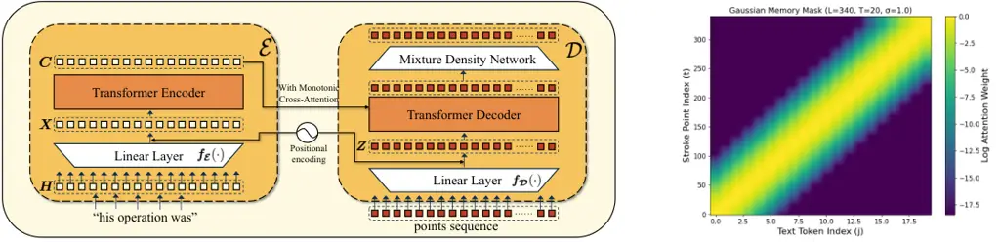
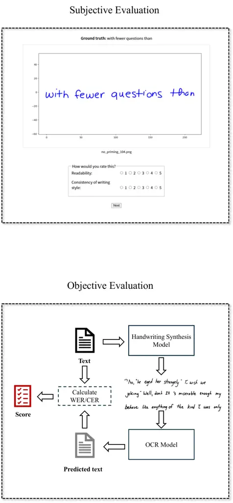

# TrInk: Ink Generation with Transformer Network

Zezhong Jin ^(†)^(†)thanks: This work was conducted during an internship
at Microsoft Research Asia. Affiliation: The Hong Kong Polytechnic
University    Shubhang Desai Affiliation: Microsoft Corporation    Xu
Chen Affiliation: Microsoft Corporation    Biyi Fang
Affiliation: Microsoft Corporation    Zhuoyi Huang
Affiliation: Microsoft Corporation    Zhe Li Affiliation: The Hong Kong
Polytechnic University    Chong-Xin Gan Affiliation: The Hong Kong
Polytechnic University    Xiao Tu Affiliation: Microsoft Corporation   
Man-Wai Mak ^(†)^(†)thanks: Corresponding author. Affiliation: The Hong
Kong Polytechnic University    Yan Lu Affiliation: Microsoft Corporation
   Shujie Liu²²footnotemark: 2 Affiliation: Microsoft Corporation

###### Abstract

In this paper, we propose TrInk, a Transformer-based model for ink
generation, which effectively captures global dependencies. To better
facilitate the alignment between the input text and generated stroke
points, we introduce scaled positional embeddings and a Gaussian memory
mask in the cross-attention module. Additionally, we design both
subjective and objective evaluation pipelines to comprehensively assess
the legibility and style consistency of the generated handwriting.
Experiments demonstrate that our Transformer-based model achieves a
35.56% reduction in character error rate (CER) and an 29.66% reduction
in word error rate (WER) on the IAM-OnDB dataset compared to previous
methods. We provide an demo page with handwriting samples from TrInk and
baseline models at:
[https://akahello-a11y.github.io/trink-demo/](https://akahello-a11y.github.io/trink-demo/)

## 1 Introduction

Handwriting synthesis is the task of automatically generating realistic
handwritten text from digital inputs. Automatic handwritten text
generation can support a wide range of applications, including digital
note-taking, educational tools, and generating training data to improve
optical character recognition (OCR) systems Li et al. (2023); Fujitake
(2024); Yeleussinov et al. (2023). However, due to the complex temporal
dynamics and variability inherent in human handwriting, generating
high-quality handwritten samples still faces challenges.

Deep learning-based handwritten text generation approaches can be
roughly divided into image-based offline and stroke-based online
methods, the latter also referred to as ink generation. Offline
handwriting synthesis focuses on producing a static image of handwritten
text Chang et al. (2018); Alonso et al. (2019); Kang et al. (2020);
Haines et al. (2016); Bhunia et al. (2021). In contrast, online
handwriting synthesis (also called ink generation) aims to generate a
time-ordered sequence of pen-tip coordinates along with pen-state
indicators (e.g., pen-up and pen-down), thereby reconstructing the full
dynamic trajectory of the writing process. Compared with offline
approaches, online handwriting synthesis (ink generation) outputs
lightweight stroke vectors that can be rendered at any resolution,
making them easy to transmit and display consistently across diverse
devices. In this work, we focus on ink generation to generate
handwriting samples that are stylistically consistent and highly
legible.

Recent research on ink generation has predominantly relied on sequential
models Graves (2013); Aksan et al. (2018); Chang et al. (2022). Graves
(2013) leverages an LSTM-based network to predict future stroke points
from the current pen position based on the given text. Aksan et al.
(2018) introduces a conditional variational RNN that improves the
model’s capacity to capture handwritten digits. Building on Graves
(2013), Chang et al. (2022) introduces style equalization method,
equipped with a style encoder to explicitly model the style information.

While these approaches have demonstrated promising results, they remain
fundamentally constrained by the sequential nature of recurrent
architectures, which limits their ability to model long-range
dependencies and hinders parallel training. Furthermore, alignment
between the input text and generated strokes often requires careful
design, such as attention windowing. Motivated by the success of
Transformer Vaswani et al. (2017) in various generative tasks Li et al.
(2019); Chen et al. (2020); Ding et al. (2021); Chang et al. (2023); Ma
et al. (2024), we propose TrInk (Transformer for Ink Generation), a
fully attention-based model tailored for ink generation. The encoder
ingests the target text sequence, through multi-head self-attention,
yields a contextual content representation for every character. The
decoder receives the character representations together with the
previous generated stroke points, and applies multi-head self- and
cross-attention to compute decoder hidden states. These decoder hidden
states are fed into a mixture-density network, which outputs a Gaussian
mixture distribution from which the next pen offset and pen state are
sampled. To improve alignment between the text and the stroke sequence,
we apply a Gaussian memory mask to the cross-attention matrix,
constraining the decoder’s focus to progress strictly left-to-right
along the encoded text as strokes are generated. We apply a learnable
scale to sinusoidal positional embeddings to handle differences between
text and ink points. Our main contributions are summarized as follows:

1.  1.  To the best of our knowledge, TrInk is the first to employ a
        Transformer encoder–decoder architecture for ink generation.
2.  2.  TrInk introduces a Gaussian memory mask to ensure the generated ink
        points follows the natural writing order, and a scale factor for the
        position embeddings to model the differing charateristics of the
        text and the ink points.
3.  3.  Our experimental results show that our proposed TrInk yields
        substantially higher legibility, particularly on long text, than the
        previous.

## 2 Method



Figure 1: The proposed TrInk framework (left) and Gaussian memory mask
(right).

The Framework of TrInk comprises two main components: an encoder
$`\cal E`$ and a decoder $`\cal D`$. Encoder $`\cal E`$ aims to map the
input text into a sequence of context-aware distributed representations,
with each vector encoding a token in relation to its surrounding
context. Decoder $`\cal D`$ aims to take the encoder’s content vectors
along with the previous stroke points and, at each time step, predict
Gaussian distributions for the next pen coordinate and the stroke-end
probability.

### 2.1 Encoder

From Fig. 1, we transform each character of the input "his operation
was" (including the blank spaces) into a one-hot vector, yielding
$`\boldsymbol{H}=[\boldsymbol{h}_{1},\boldsymbol{h}_{2},\dots,\boldsymbol{h}_{T}]`$,
and $`\boldsymbol{h}_{i}\in\mathbb{R}^{|V|}`$, where $`|V|`$ denotes the
vocabulary size and $`T`$ denotes the number of tokens in the text.
After the linear projection and positional encoding, we obtain the
Transformer encoder input
$`\boldsymbol{X}=[\boldsymbol{x}_{1},\boldsymbol{x}_{2},\dots,\boldsymbol{x}_{T}],\quad\boldsymbol{x}_{i}\in\mathbb{R}^{d},`$
where $`d`$ is the hidden-state dimension of the Transformer encoder.
The high-dimensional text representation $`\boldsymbol{C}`$ generated by
the encoder is then fed into the Transformer decoder to serve as the
memory for cross-attention.

### 2.2 Scaled Positional Encoding

To account for the sequential order of both text tokens and stroke
points in ink generation, we inject absolute position information using
sinusoidal positional embeddings, as defined below:

```math
\displaystyle PE(pos,2i) \displaystyle=\sin\!\Bigl(\frac{pos}{10000^{\frac{2i}{d}}}\Bigr), \tag{1}
```

```math
\displaystyle PE(pos,2i+1) \displaystyle=\cos\!\Bigl(\frac{pos}{10000^{\frac{2i}{d}}}\Bigr),
```

where $`pos`$ denotes the position index and $`d`$ is the model’s hidden
dimension. Because the encoder’s domain is text and the decoder’s domain
is stroke points, using fixed positional embeddings alone cannot
properly capture the differing scales and characteristics of these two
inputs. We therefore employ these sinusoidal positional embeddings with
trainable weights so that the embeddings can adaptively fit the output
scales of both the encoder’s and the decoder’s linear layers, following
Li et al. (2019), as shown in Eq. 2

```math
\boldsymbol{x}_{i}=\boldsymbol{f_{\cal E}}(\boldsymbol{h}_{i})+\alpha PE(i) \tag{2}
```

where $`\alpha`$ is the trainable weight. A similar formulation with a
separate scaling parameter is applied in the decoder.

### 2.3 Decoder with Monotonic Cross-Attention

Each stroke point is represented as a 3-dimensional vector
$`[\Delta x,\Delta y,s],`$ where $`\Delta x`$ and $`\Delta y`$ are the
offsets along the $`x`$- and $`y`$-axes, and $`s\in\{0,1\}`$ denotes the
pen state (0 = pen-down, 1 = pen-up). After the linear projection and
positional encoding, we obtain
$`\boldsymbol{Z}=[\,\boldsymbol{z}_{1},\boldsymbol{z}_{2}\dots,\boldsymbol{z}_{L}\,]`$,
where $`\boldsymbol{z}_{i}\in\mathbb{R}^{d}`$ and $`L`$ is the number of
stroke points.

Given the stroke embedding sequence $`\boldsymbol{Z}`$, the Transformer
decoder first applies masked self-attention to enforce autoregressive
dependencies among stroke points. It then performs cross-attention with
the text representations $`\boldsymbol{C}`$ to align each generated
stroke with the corresponding text content. To ensure that each decoding
step attends to the most relevant region of the input text, we introduce
a Gaussian-shaped cross-attention mask. For each decoder time step
$`t\in[1,L]`$, we define its corresponding attention center $`\mu_{t}`$
on the text sequence $`\boldsymbol{C}`$ as:

```math
\mu_{t}=\min\left(\frac{t}{r},\ T-1\right). \tag{3}
```

$`r`$ denotes the average number of stroke points per character,
estimated from the training data. Gaussian function centered at
$`\mu_{t}`$ is used for each decoder step $`t`$, ensuring higher
attention weights for text positions near the center and lower weights
for distant ones. For each decoder step $`t`$ and encoder position
$`j\in[1,T]`$, the attention weight is defined as:

```math
\boldsymbol{A}_{t,j}=\exp\left(-\frac{(j-{\mu}_{t})^{2}}{2{\sigma}^{2}}\right), \tag{4}
```

where $`\sigma`$ is a controllable parameter that determines the
sharpness of the Gaussian distribution. We apply the logarithm to the
$`\boldsymbol{A}_{t,j}`$ to obtain the cross-attention mask
$`\boldsymbol{M}_{t,j}=\log(\boldsymbol{A}_{t,j})`$, allowing it to be
added directly to the attention logits before the softmax, similar to
standard attention masking in Transformers. This log-space formulation
helps maintain numerical stability by avoiding extremely small values in
the Gaussian tails. Gaussian cross-attention mask ensures that attention
shifts monotonically from left to right across the input text. At each
decoding step, encoder positions $`j`$ near the center $`\mu_{t}`$
receive higher attention scores, while positions farther from
$`\mu_{t}`$ are gradually suppressed, as illustrated in the right side
of Fig. 1.

After the Transformer decoder, we adopt a mixture density network (MDN)
Bishop (1994) to model the output distribution, following the strategy
of Graves (2013). Instead of directly producing continuous stroke
points, the decoder outputs a $`(6K+2)`$-dimensional vector at each time
step, where $`K`$ is the number of Gaussian mixture components. This
vector encodes the parameters of $`K`$ bivariate Gaussian
distributions—mixture weights, means, standard deviations, and
correlation coefficients—together with two additional scalars: an
end-of-stroke probability and a sequence-level stop probability. During
inference, the actual pen-point coordinates are sampled from the
predicted mixture of Gaussians, rather than being deterministically
generated.

We adopt the same training objective as Graves (2013), minimizing the
negative log-likelihood of the ground-truth trajectory. The loss
function comprises three components: a mixture density loss for
predicting stroke offsets, a Bernoulli loss for the end-of-stroke
indicator, and a Bernoulli loss for determining sequence termination.

|                                        |                       |                       |                       |                       |                       |
| -------------------------------------- | --------------------- | --------------------- | --------------------- | --------------------- | --------------------- |
| Method                                 | IAM-OnDB              |                       |                       |                       |                       |
|                                        | Full                  |                       | Long Texts            |                       | Short Texts           |
|                                        | CER, % $`\downarrow`$ | WER, % $`\downarrow`$ | CER, % $`\downarrow`$ | WER, % $`\downarrow`$ | CER, % $`\downarrow`$ |
| AlexRNN Graves (2013)                  | 9.0                   | 53.6                  | 15.6                  | 48.6                  | 27.8                  |
| AlexRNN (Top-k)                        | 8.8                   | 42.6                  | 10.0                  | 40.1                  | 18.3                  |
| Style Equalization Chang et al. (2022) | 8.7                   | 47.4                  | 11.6                  | 46.0                  | 24.4                  |
| Style Equalization (Top-k)             | 6.5                   | 40.0                  | 8.7                   | 39.7                  | 18.2                  |
| TrInk                                  | 8.5                   | 43.2                  | 9.3                   | 43.3                  | 21.9                  |
| TrInk (Top-k)                          | 5.8                   | 37.7                  | 6.8                   | 36.3                  | 17.6                  |

Table 1: Comparison of different methods on three test sets
($`\mathrm{k}=5`$).

## 3 Experiments

### 3.1 Datasets

The original training dataset was collected from over 5,000 writers and
was initially used for online handwriting recognition tasks. However, we
observed that some ink samples were overly cursive that benefit the
training of robust recognition systems but are not suitable for
generating realistic handwriting. To tackle this issue, we leveraged an
OCR engine to filter the dataset, selecting a curated subset of 600,000
high-quality ink samples, optimally prepared for handwriting generation.
For evaluation, we use the IAM-OnDB Liwicki and Bunke (2005) test set,
which is the most popular dataset for handwritten text recognition. We
divide the test set into three subsets: full, short, and long. The long
subset comprises samples exceeding 40 characters, while the short subset
includes those with fewer than 10 characters.

### 3.2 Evaluation Pipeline

Inspired by text-to-speech evaluation protocols, we divide our
evaluation into subjective and objective assessments. For the subjective
evaluation, human raters fluent in English scored the generated
handwriting samples based on legibility and stylistic consistency, each
on a 1–5 scale, with higher scores indicating better quality. For the
objective evaluation, we utilize a state-of-the-art OCR model Li et al.
(2023) to recognize the generated samples, comparing the outputs to the
ground-truth text to compute the Character Error Rate (CER) and Word
Error Rate (WER) as quantitative measures of legibility. Since our focus
is on online handwriting synthesis (ink generation), which generates
stroke-point sequences character by character while capturing the
dynamics of writing, the evaluation protocol is naturally different from
that of offline, image-based handwriting generation. The two tasks
differ in their data representation (stroke trajectories versus images),
model objectives (temporal and spatial consistency versus visual
realism), and evaluation protocols (sequence-oriented metrics such as
CER and WER versus image-oriented metrics such as FID and SSIM). Because
of these fundamental differences, direct comparisons with offline
methods are not meaningful. Accordingly, we deliberately compare against
AlexRNN and Style Equalization, which are both online methods, to ensure
fairness and relevance.

### 3.3 Main Results

Table 1 presents the objective evaluation results on the IAM-OnDB test
set. All models were trained on the same dataset, as described in
Section 3.1. Our pipeline employs a Top-$`k`$ sampling strategy where
$`k`$ candidate handwriting samples are first generated, then ranked by
TrOCR according to their CER scores against the ground-truth text, with
the optimal sample (minimum CER) selected as final output. As shown in
Table 1, TrInk consistently outperforms all baselines, including both
the standard AlexRNN and its variant with style equalization, across all
evaluation settings. TrInk with the Top-$`k`$ strategy achieves the best
performance, with a 35.56% reduction in CER and a 29.66% reduction in
WER on the full test set compared to AlexRNN. For long-text generation,
TrInk shows even greater improvements, with a 56.41% reduction in CER
and a 25.31% reduction in WER compared to AlexRNN. These reductions
further highlight the effectiveness of TrInk.

Figure. 2 presents the results of our subjective experiments. The final
scores for each method were the average ratings for two metrics: style
consistency and legibility. From Figure. 2, we can observe that TrInk
outperforms AlexRNN in both metrics, further validating the
effectiveness of TrInk.

Figure 2: Subjective Evaluation of Handwriting Quality Across Methods.

### 3.4 Ablation Study

Figure 3: Trainable Positional Encoding Weights (Encoder and Decoder)
Over Training.

| Method | Gaussian memory mask | CER, % $`\downarrow`$ |
| ------ | -------------------- | --------------------- |
| TrInk  | ✗                    | 70.1                  |
|        | ✓                    | 8.5                   |

Table 2: Effectiveness of Gaussian Memory Mask in Cross-Attention
Alignment.

| Method | Mask Function | CER, % $`\downarrow`$ |
| ------ | ------------- | --------------------- |
| TrInk  | Uniform       | 14.9                  |
|        | Exponential   | 14.1                  |
|        | Gaussian      | 8.5                   |

Table 3: Effect of different memory mask functions on TrInk performance
(IAM-OnDB Test Set).

| Method | $`\sigma`$ Value | CER, % $`\downarrow`$ |
| ------ | ---------------- | --------------------- |
| TrInk  | 2.0              | 8.7                   |
|        | 1.0              | 8.5                   |
|        | 0.5              | 8.5                   |

Table 4: Effectiveness of $`\sigma`$ on Model performance.

Figure. 3 illustrates the changes of the two trainable weights in the
positional encoding for the encoder and decoder during training.
Notably, these weights converge to different values, indicating a
significant discrepancy, showing that adopting fixed positional
embeddings may fail to capture the differing scales and characteristics
of the two input modalities.

To examine the role of the Gaussian function in our memory mask design,
we conducted ablation experiments by replacing the Gaussian kernel with
alternative formulations. Specifically, the uniform mask assigns equal
weights to all memory positions within a fixed local window, while the
exponential mask applies a sharper decay around the center position with
weights defined by an exponential function. As shown in Table 3, the
Gaussian mask achieves the lowest Character Error Rate (CER) of 8.5% on
the IAM-OnDB test set, whereas the uniform and exponential variants
yield significantly higher CERs of 14.9% and 14.1%, respectively. These
results demonstrate that the Gaussian formulation provides smoother and
more robust alignment between stroke points and text tokens, while the
uniform and exponential alternatives either oversimplify the weighting
scheme or introduce overly sharp decays, both of which lead to degraded
performance.

We also investigated the effect of the Gaussian memory mask on the
IAM-OnDB full test set, as shown in Table 2. Removing the Gaussian
memory mask leads to a significant drop in the legibility of the
generated samples. This is mainly because the model fails to learn
proper alignment between the text and stroke points without the guidance
of the mask. We also investigate the impact of the hyperparameter
$`\sigma`$ in the Gaussian memory mask. As shown in Table 4, our model
is relatively insensitive to variations in $`\sigma`$, with the best
performance observed when $`\sigma=1.0`$ and $`\sigma=0.5`$.

## 4 Conclusion

This paper presents TrInk, the first ink-generation model built on a
Transformer encoder–decoder architecture. To achieve precise alignment
between input text and generated stroke sequences, we introduce a scaled
positional encoding with learnable weights and a Gaussian memory mask.
We also devise both subjective and objective evaluation protocols for
ink generation. Experimental results demonstrate that TrInk markedly
outperforms traditional LSTM-based approaches, producing handwriting
samples with superior style consistency and legibility.

## 5 Limitations

Despite the promising results, TrInk has two limitations. First,
training our Transformer-based architecture requires considerable
computational resources. The increased model capacity and parallel
attention mechanisms lead to higher memory consumption and longer
convergence time compared to lightweight RNN-based alternatives.

Second, our current experiments are conducted solely on English
handwriting datasets. As handwriting conventions vary significantly
across scripts and languages (e.g., cursive structures in Arabic,
character-based layouts in Chinese), it remains unclear how well our
model generalizes to multilingual settings. Developing a unified ink
generation framework capable of generating stylistically consistent
samples across multiple languages would be an important direction for
future work.

## References

- Aksan et al. (2018) Emre Aksan, Fabrizio Pece, and Otmar
  Hilliges. 2018. Deepwriting: Making digital ink editable via deep
  generative modeling. In _Proceedings of the 2018 CHI conference on
  human factors in computing systems_, pages 1–14.
- Alonso et al. (2019) Eloi Alonso, Bastien Moysset, and Ronaldo
  Messina. 2019. Adversarial generation of handwritten text images
  conditioned on sequences. In _2019 international conference on
  document analysis and recognition (ICDAR)_, pages 481–486. IEEE.
- Bhunia et al. (2021) Ankan Kumar Bhunia, Salman Khan, Hisham
  Cholakkal, Rao Muhammad Anwer, Fahad Shahbaz Khan, and Mubarak
  Shah. 2021. Handwriting transformers. In _Proceedings of the IEEE/CVF
  international conference on computer vision_, pages 1086–1094.
- Bishop (1994) Christopher M Bishop. 1994. Mixture density networks.
- Chang et al. (2018) Bo Chang, Qiong Zhang, Shenyi Pan, and Lili
  Meng. 2018. Generating handwritten chinese characters using cyclegan.
  In _2018 IEEE winter conference on applications of computer vision
  (WACV)_, pages 199–207. IEEE.
- Chang et al. (2023) Huiwen Chang, Han Zhang, Jarred Barber,
  AJ Maschinot, Jose Lezama, Lu Jiang, Ming-Hsuan Yang, Kevin Murphy,
  William T Freeman, Michael Rubinstein, and 1 others. 2023. Muse:
  Text-to-image generation via masked generative transformers. _arXiv
  preprint arXiv:2301.00704_.
- Chang et al. (2022) Jen-Hao Rick Chang, Ashish Shrivastava, Hema
  Koppula, Xiaoshuai Zhang, and Oncel Tuzel. 2022. Style equalization:
  Unsupervised learning of controllable generative sequence models. In
  _International Conference on Machine Learning_, pages 2917–2937. PMLR.
- Chen et al. (2020) Mingjian Chen, Xu Tan, Yi Ren, Jin Xu, Hao Sun,
  Sheng Zhao, Tao Qin, and Tie-Yan Liu. 2020. Multispeech: Multi-speaker
  text to speech with transformer. _arXiv preprint arXiv:2006.04664_.
- Ding et al. (2021) Ming Ding, Zhuoyi Yang, Wenyi Hong, Wendi Zheng,
  Chang Zhou, Da Yin, Junyang Lin, Xu Zou, Zhou Shao, Hongxia Yang, and
  1 others. 2021. Cogview: Mastering text-to-image generation via
  transformers. _Advances in neural information processing systems_,
  34:19822–19835.
- Fujitake (2024) Masato Fujitake. 2024. Dtrocr: Decoder-only
  transformer for optical character recognition. In _Proceedings of the
  IEEE/CVF winter conference on applications of computer vision_, pages
  8025–8035.
- Graves (2013) Alex Graves. 2013. Generating sequences with recurrent
  neural networks. _arXiv preprint arXiv:1308.0850_.
- Haines et al. (2016) Tom SF Haines, Oisin Mac Aodha, and Gabriel J
  Brostow. 2016. My text in your handwriting. _ACM Transactions on
  Graphics (TOG)_, 35(3):1–18.
- Kang et al. (2020) Lei Kang, Pau Riba, Yaxing Wang, Marçal Rusinol,
  Alicia Fornés, and Mauricio Villegas. 2020. Ganwriting:
  content-conditioned generation of styled handwritten word images. In
  _Computer Vision–ECCV 2020: 16th European Conference, Glasgow, UK,
  August 23–28, 2020, Proceedings, Part XXIII 16_, pages 273–289.
  Springer.
- Li et al. (2023) Minghao Li, Tengchao Lv, Jingye Chen, Lei Cui, Yijuan
  Lu, Dinei Florencio, Cha Zhang, Zhoujun Li, and Furu Wei. 2023. Trocr:
  Transformer-based optical character recognition with pre-trained
  models. In _Proceedings of the AAAI conference on artificial
  intelligence_, volume 37, pages 13094–13102.
- Li et al. (2019) Naihan Li, Shujie Liu, Yanqing Liu, Sheng Zhao, and
  Ming Liu. 2019. Neural speech synthesis with transformer network. In
  _Proceedings of the AAAI conference on artificial intelligence_,
  volume 33, pages 6706–6713.
- Liwicki and Bunke (2005) Marcus Liwicki and Horst Bunke. 2005.
  Iam-ondb-an on-line english sentence database acquired from
  handwritten text on a whiteboard. In _Eighth International Conference
  on Document Analysis and Recognition (ICDAR’05)_, pages 956–961. IEEE.
- Ma et al. (2024) Xin Ma, Yaohui Wang, Gengyun Jia, Xinyuan Chen, Ziwei
  Liu, Yuan-Fang Li, Cunjian Chen, and Yu Qiao. 2024. Latte: Latent
  diffusion transformer for video generation. _arXiv preprint
  arXiv:2401.03048_.
- Vaswani et al. (2017) Ashish Vaswani, Noam Shazeer, Niki Parmar, Jakob
  Uszkoreit, Llion Jones, Aidan N Gomez, Łukasz Kaiser, and Illia
  Polosukhin. 2017. Attention is all you need. _Advances in neural
  information processing systems_, 30.
- Yeleussinov et al. (2023) Arman Yeleussinov, Yedilkhan Amirgaliyev,
  and Lyailya Cherikbayeva. 2023. Improving ocr accuracy for kazakh
  handwriting recognition using gan models. _Applied Sciences_,
  13(9):5677.

## Appendix A Appendix

### A.1 Training Configuration

Our model is trained on 8 NVIDIA V100 GPUs with a per-GPU batch size of 64. We adopt the Adam optimizer with a learning rate of 0.0001. Both the
encoder and decoder are implemented as 3-layer Transformers, each with 4
attention heads and a hidden dimension of 512. In the Gaussian memory
mask, we set the scaling factor $`r=17`$ in Eq. 3. The mixture density
network (MDN) outputs a 20-component Gaussian mixture ($`K=20`$) to
parameterize the pen trajectory distribution at each decoding step.

### A.2 Evaluation Pipelines

Subjective Evaluation: We conducted a subjective evaluation with 20
human evaluators to score samples generated by four methods: AlexRNN and
TrInk (both with and without the Top-k strategy). For the experiment, 96
text inputs were used to generate samples, and each output was rated on
two criteria—style consistency and legibility using a 5-point Likert
scale (1: lowest, 5: highest). Higher scores indicate better
performance.

Objective Evaluation: We first convert the generated handwriting samples
into standardized textline images to simulate realistic OCR application
scenarios. These images are then fed into the state-of-the-art TrOCR
model Li et al. (2023) for text recognition. The outputs from TrOCR are
systematically compared with the ground-truth text to compute Character
Error Rate (CER) and Word Error Rate (WER), which quantify
character-level inaccuracies and word-level mismatches, respectively.
Notably, WER is excluded for short-text evaluations due to its
instability when applied to limited word counts, as minor errors
disproportionately skew the metric. Lower CER values indicate higher
legibility, providing an automated and reproducible measure of text
quality. During the evaluation of style equalization, we dynamically
sample style inputs from the training set for the style encoder,
ensuring that each synthesized handwriting sample corresponds to a
unique, randomly selected style reference from the training dataset.



Figure 4: Subjective and Objective Evaluation Pipelines.

### A.3 Visualization of Generated Samples

We present a collection of generated handwriting samples based on 13
text prompts of varying lengths. Each row illustrates outputs from four
models: AlexRNN, AlexRNN (Top-k), TrInk, and TrInk (Top-k), displayed
from left to right. As observed, TrInk consistently produces handwriting
that is more legible and stylistically consistent than that of the
RNN-based.

Figure 5: Samples for AlexRNN and TrInk.
