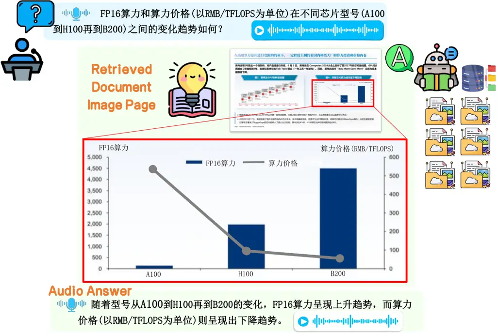
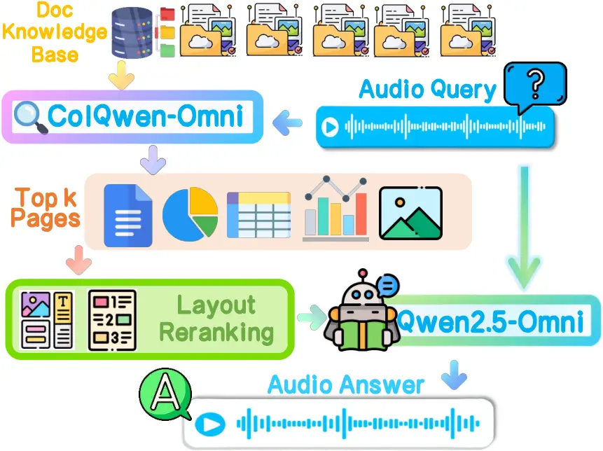
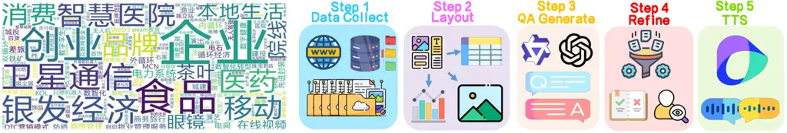
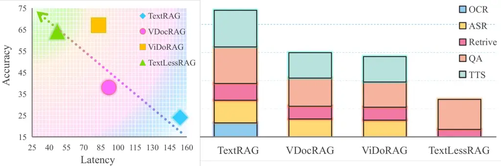

# TextlessRAG: End-to-End Visual Document RAG by Speech Without TextThanks: ©2025 IEEE. Personal use of this material is permitted. Permission from IEEE must be obtained for all other uses, in any current or future media, including reprinting/republishing this material for advertising or promotional purposes, creating new collective works, for resale or redistribution to servers or lists, or reuse of any copyrighted component of this work in other works.

Peijin Xie    Shun Qian    Bingquan Liu Affiliation: Harbin Institute of
Technology Affiliation: ITNLP Lab Affiliation: Harbin, China    Dexin
Wang    Lin Sun    Xiangzheng Zhang Affiliation: Qihoo 360 Technology
Affiliation: ZhiNao AI Lab Affiliation: Beijin, China

###### Abstract

Document images encapsulate a wealth of knowledge, while the portability
of spoken queries enables broader and flexible application scenarios.
Yet, no prior work has explored knowledge base question answering over
visual document images with queries provided directly in speech. We
propose TextlessRAG, the first end-to-end framework for speech-based
question answering over large-scale document images. Unlike prior
methods, TextlessRAG eliminates ASR, TTS and OCR, directly interpreting
speech, retrieving relevant visual knowledge, and generating answers in
a fully textless pipeline. To further boost performance, we integrate a
layout-aware reranking mechanism to refine retrieval. Experiments
demonstrate substantial improvements in both efficiency and accuracy. To
advance research in this direction, we also release the first bilingual
speech–document RAG dataset, featuring Chinese and English voice queries
paired with multimodal document content. Both the dataset and our
pipeline will be made available at
repository:[https://github.com/xiepeijinhit-hue/textlessrag](https://github.com/xiepeijinhit-hue/textlessrag)

###### Index Terms: 

Visual Document Understanding, Audio Visual Question Answering,
Multimodal RAG

## 1 Introduction



Figure 1: A Chinese example of TextlessRAG.

The development of Vision-Language Models (VLMs) has been remarkably
rapid\[1, 2, 3, 4\]. With the introduction of dynamic-resolution visual
encoders, recent VLMs have made significant advances in understanding
text-rich images\[5\] These models not only achieve higher accuracy in
direct visual document understanding but also eliminate the need for
traditional document parsing steps, thereby making the entire process
more efficient.

Current research is increasingly shifting towards more complex
long-document understanding tasks, including long-form question
answering\[6, 7\] and knowledge base QA from RAG\[8, 9, 10\]. However,
no prior work has explored speech-based querying over document images;
existing studies on spoken input have been limited to extending visual
question answering on natural images\[11, 12\]. Spoken knowledge base QA
is particularly appealing: it requires neither typing queries on a
keyboard nor uploading document images. Instead, users can obtain
answers simply by asking questions verbally—an interaction mode that can
greatly expand the application scenarios of multimodal large language
models.

To this end, we propose TextlessRAG, the first speech-based document
visual RAG pipeline. As illustrated in Figure 1, the user poses a
question through spoken input. The model then retrieves candidate pages
from the knowledge base, followed by layout-aware decomposition of these
pages into fine-grained evidence units (e.g., charts, tables, natural
images, and textual segments). Based on the selected evidence, the model
generates an answer and delivers the response in both speech and text.
Notably, the entire pipeline is fully de-textualized—operating without
OCR, ASR, or TTS—thereby ensuring both efficiency and robust
comprehension of multimodal knowledge, particularly for structured
content such as tables and charts.

We further construct the first speech-based visual document RAG
benchmark (SV-DOC), which comprises speech-augmented extensions of
existing English visual document QA datasets\[13, 14, 15, 7, 6\] and
RAGBench\[10\], along with a manually annotated Chinese Document RAG
dataset (CDR). Experimental results demonstrate that our speech-based
visual RAG approach delivers significant improvements in both answer
quality and response latency.

The main contributions of this work are summarized as follows:

- •
  We introduce TextlessRAG, the first end-to-end speech-based visual
  document RAG pipeline, which operates entirely without ASR, OCR, or
  TTS.
- •
  We present SV-DOC, the first benchmark for speech-based visual
  document RAG, featuring bilingual datasets in English and Chinese.
- •
  We design a fully text-free workflow augmented with a layout-aware
  reranking strategy, achieving substantial improvements in both
  efficiency and accuracy across the RAG process.

## 2 Method

As shown in Figure 2, TextLessRAG is designed to be both concise and
efficient focusing specifically on the retrieval and QA generation
components. On Retrieval side, we employ ColQwen-Omni¹¹ 1
[https://huggingface.co/vidore/colqwen-omni-v0.1](https://huggingface.co/vidore/colqwen-omni-v0.1)
as a retrieve encoder $`\mathrm{Enc}(\cdot)`$ to encode both document
image pages from document knowedge base
$`\mathcal{I}=\{P_{1},P_{2}...P_{n}\}`$and spoken query $`q`$ to
embeddings as $`E=\{e_{1},e_{2}...e_{n}\}`$ and $`e_{q}`$. Then compute
the MaxSim Score like ColBert²² 2
[https://github.com/stanford-futuredata/ColBERT](https://github.com/stanford-futuredata/ColBERT)
to rank the top-k candidate pages $`T_{k}`$:

```math
E=\{e_{i}=\mathrm{Enc}(I_{i})\mid I_{i}\in\mathcal{I}\},\quad e_{q}=\mathrm{Enc}(q) \tag{1}
```

```math
s_{i}=Score(P_{i},q)=\mathrm{MaxSim}\big({e_{q}},e_{i}\big),\quad e_{i}\in E \tag{2}
```

```math
\mathcal{T}_{k}=\operatorname{TopK}_{P_{i}\in\mathcal{I}}\Big(Score(P_{i},q)\Big)=[P_{t_{1}},P_{t_{2}}\dots P_{t_{k}}] \tag{3}
```

On Generation side, we employ Qwen2.5-Omni³³ 3
[https://huggingface.co/Qwen/Qwen2.5-Omni-7B](https://huggingface.co/Qwen/Qwen2.5-Omni-7B)
as a Generator $`Gen(\cdot)`$, which directly takes the spoken query
$`q`$ together with the top-k re-ranked document images
$`\mathcal{T}_{k}^{\prime}`$ as input, and ultimately produces a spoken
answer $`\mathcal{A}ns`$:

```math
\mathcal{A}ns=Gen(\mathcal{T}_{k}^{\prime},q),\quad\mathcal{T}_{k}^{\prime}=[P_{t_{1}}^{\prime},P_{t_{2}}^{\prime}\dots P_{t_{k}}^{\prime}] \tag{4}
```

We lay out each top-k page $`P_{t}`$ into content blocks of chart,
table, text and natural image sets by DocLayout-Yolo⁴⁴ 4
[https://github.com/opendatalab/DocLayout-YOLO](https://github.com/opendatalab/DocLayout-YOLO):

```math
\mathcal{C}ontent=\{\text{chart},\text{table},\text{text},\text{image}\} \tag{5}
```

```math
YOLO(P_{t})=\bigcup_{c\in\mathcal{C}ontent}Block^{c}(P_{t}),\quad P_{t}\in\mathcal{T}_{k} \tag{6}
```

and refine them with threshold $`\theta`$ as a lower bound to guarantee
the MaxSim Score with query $`s_{b}`$:

```math
{Block}^{c}_{\theta}=\bigcup_{c\in\mathcal{C}ontent}\left\{b\in Block^{c}(P_{t})\;\middle|\;s_{b}\geq\theta\right\} \tag{7}
```

Then, we resort the image inputs $`P_{t}`$ to refine representations
$`P_{t}^{\prime}`$ that are more relevant to the given question:

```math
P_{t}^{\prime}\;=\;\operatorname{Sort}_{\downarrow Score}\big({Block}^{c}_{\theta}\big), \tag{8}
```

Overall, the end-to-end process facilitates a fully text-free workflow:
it requires neither ASR nor OCR and obviates the need for text-to-answer
TTS, enabling direct spoken queries and responses. Furthermore, the
layout segmentation and embedding of knowledge base document images are
preprocessed in advance. Each query involves two retrieval stages, which
not only improves the relevance of retrieved results but also
substantially reduces computational overhead.



Figure 2: Pipeline of TextlessRAG.

## 3 Data Engine

We developed a data engine to construct the SV-DOC benchmark. As
summarized in Table 1, SV-DOC comprises (i) extensions of existing
English benchmarks augmented with TTS, and (ii) CDR, the first Chinese
Document RAG dataset created from scratch. CDR is built following a
five-step pipeline (illustrated on the right of Figure 3), while the
final two steps are additionally used to generate speech-augmented
English samples.

Specifically, (1) we collect a diverse set of documents and reports
across multiple domains and formats, including PDFs and PPTs (see the
domain word cloud in Figure 3, left). (2) Each page is segmented into
fine-grained units—tables, charts, images, and text blocks—using
DocLayout-YOLO. (3) These segments are processed by commercial
vision–language agents via batch APIs to generate candidate QA pairs.
(4) The QA pairs are refined through rule-based filtering and
professional human annotation. (5) Finally, the text QA pairs are
converted into speech using Doubao’s TTS API, leveraging over 200
professional voice types.⁵⁵ 5
[https://www.volcengine.com/docs/6561/1257544](https://www.volcengine.com/docs/6561/1257544).

For the English datasets, we select refined, relevant visual document QA
datasets—ChartQA\[13\], DUDE\[15\], InfoVQA\[14\], and
SlideVQA\[7\](following VDocRAG\[9\]), as well as MMLongBench-Doc
(MMLong)\[6\] and Vidoseek\[10\] — and apply steps 4 and 5 to augment
them with audio queries. Further details of the data construction
process and representative examples are provided in the repository.



Figure 3: Word Cloud of domains of Chinese samples on the left and the 5
steps data engine on the right.

| Dataset        | QA   | Pool  | Content | Domain      |
| -------------- | ---- | ----- | ------- | ----------- |
| Chartqa\[13\]  | 150  | 119   | C       | Academic    |
| Infovqa\[14\]  | 1048 | 300   | C/T/I   | Infographic |
| Slidevqa\[7\]  | 760  | 657   | C/T/I/X | Slide       |
| DUDE\[15\]     | 496  | 422   | C/T/X   | Open        |
| MMLong\[6\]    | 1091 | 5134  | C/T/I/X | Open        |
| Vidoseek\[10\] | 1142 | 5349  | C/T/I   | Open        |
| CDR            | 1260 | 30583 | C/T/I/X | Open        |
| Total          | 5947 | 42564 | C/T/I/X | Open        |

Table 1: Data statistics of SV-Doc Bench.“QA” and “Pool” calculate the
amount of qa pairs and images of retrieval pool. The multimodal content
of chart, tabel, natural image and text are abbreviated as “C”, “T”, “I”
and “X”.

## 4 Experiment & Result

|             |              |       |     |         |      |         |          |        |          |      |
| ----------- | ------------ | ----- | --- | ------- | ---- | ------- | -------- | ------ | -------- | ---- |
| Model       | Retriver     | Query | Doc | ChartQA | DUDE | Infovqa | SlideVQA | MMLong | Vidoseek | CDR  |
| BM25        | \-           | T     | T   | 54.8    | 57.2 | 50.2    | 40.7     | 18.5   | 84.5     | 54.9 |
| E5          | BERT         | T     | T   | 74.9    | 40.6 | 42.5    | 50.8     | 23.4   | 63.5     | 62.6 |
| NV-Embed-v2 | Mistral      | T     | T   | 75.3    | 43.0 | 56.5    | 61.7     | 38.7   | 90.3     | 69.3 |
| CLIP        | Scratch      | T     | I   | 54.6    | 23.2 | 29.7    | 38.6     | 17.3   | 35.8     | 32.5 |
| DSE         | Phi3V        | T     | I   | 72.7    | 55.5 | 67.4    | 73.0     | 43.6   | 89.4     | 77.1 |
| VisRAG-Ret  | MiniCPM-V    | T     | I   | 87.2    | 56.4 | 71.9    | 74.3     | 53.1   | 91.2     | 80.9 |
| VDocRAG     | Phi3V        | T     | I   | 86.0    | 57.7 | 72.9    | 77.3     | 49.2   | 92.8     | 82.4 |
| ViDoRAG     | Colqwen2     | T     | I   | 100     | 96.5 | 97.8    | 96.9     | 67.0   | 94.3     | 87.7 |
| TextLessRAG | Colqwen-Omni | A     | I   | 99.3    | 91.5 | 91.6    | 94.2     | 66.5   | 95.4     | 87.4 |

Table 2: Rertrive result. “T”, “I”, and “A” represent the query and
documents in the form of text, image, and audio, respectively.

|               |              |         |      |         |          |        |          |      |
| ------------- | ------------ | ------- | ---- | ------- | -------- | ------ | -------- | ---- |
| Model         | Generator    | ChartQA | DUDE | InfoVQA | SlideVQA | MMLong | Vidoseek | CDR  |
| TextRAG       | Phi3         | 28.0    | 40.1 | 40.5    | 28.6     | 6.9    | 29.8     | 10.5 |
| TextRAG†      |              | 36.6    | 55.9 | 45.6    | 27.8     | 13.1   | 31.7     | 18.7 |
| VDocRAG       | Phi3V        | 52.0    | 48.5 | 56.2    | 48.0     | 14.5   | 52.1     | 22.3 |
| VDocRAG†      |              | 74.0    | 66.4 | 64.6    | 56.4     | 21.7   | 63.8     | 34.6 |
| ViDoRAG       | Qwen2.5-VL7B | 84.6    | 86.7 | 79.1    | 82.5     | 37.9   | 85.7     | 50.0 |
| ViDoRAG†      |              | 84.6    | 87.4 | 82.6    | 84.2     | 47.3   | 86.4     | 70.1 |
| TextLessRAG   | Qwen-Omni    | 87.3    | 78.5 | 74.5    | 79.7     | 33.4   | 90.2     | 43.5 |
| TextLessRAG\* |              | 87.3    | 81.3 | 79.4    | 82.6     | 36.7   | 93.4     | 47.2 |
| TextLessRAG†  |              | 87.3    | 84.0 | 80.6    | 81.8     | 43.2   | 92.6     | 61.3 |

Table 3: QA result measured by GPT-4o. For each model, we evaluated the
QA performance under two input settings: top-5 retrieved images and gold
page marked with “†”. Asterisk “\*” indicates the top-5 results were
further refined by layout reranking. We highlight the best results
obtained with gold and top-5 page inputs in yellow and green,
respectively.

We evaluate our approach along three dimensions: Retrieval, QA, and
Latency. Retrieval is measured using nDCG@5, while QA accuracy is
assessed based on GPT-4o’s averaged judgments. Latency is benchmarked on
a single 80GB A100 GPU to ensure consistency.

### 4.1 Retrival Result

Table 2 reports Retrieval results, comparing three text-only
methods—BM25\[16\], E5\[17\], and NV-Embed-v2\[18\]— against five visual
models(with ground truth text input as query) — CLIP\[19\], DSE\[20\],
VisRAG-Ret\[8\], VDocRAG\[9\], and ViDoRAG\[10\]—as baselines. For
text-based retrieval, OCR text was extracted using Tesseract⁶⁶ 6
[https://github.com/tesseract-ocr/tesseract](https://github.com/tesseract-ocr/tesseract).
Retrieval experiments were then conducted independently within each
retrieval pool across seven datasets.

Our proposed method, TextLessRAG, which adopts a novel speech-based
retrieval paradigm, demonstrates competitive performance. Compared with
three text-to-text retrieval approaches, it consistently and
substantially outperforms all of them. This indicates that storing the
knowledge base as image embeddings directly encoded by a vision encoder
yields stronger representational capacity. Such an approach not only
eliminates the need for OCR but also facilitates query retrieval over
multimodal content such as tables and charts.

When compared with text-to-image retrieval methods, TextLessRAG—although
not surpassing the SOTA ViDoRAG overall—outperforms the other four
baselines and achieves the best results on dataset Vidoseek. Moreover,
on ChartQA, SlideVQA, MMlong and CDR, the performance gap with SOTA
remains within 2%. These findings highlight the significant potential of
replacing text with speech for image-based knowledge retrieval.
Furthermore, when textual queries are converted into speech, the loss
gap from TTS in retrieval accuracy seemed minimal, enabling direct
retrieval with queries spoken in diverse voices while maintaining
performance comparable to SOTA models.

Based on the model performance consistency across datasets, we observe
that our CDR dataset is easier than Vidoseek but more challenging than
MMLong. Notably, even with the retrieval pool expanded fivefold(from 5k
to 30k), the TextLessRAG retrieval method maintained an accuracy above
87, underscoring its strong capability.

### 4.2 QA Generation Result

Table 3 presents the end-to-end QA performance results. Although
TextLessRAG does not achieve the best performance across all datasets,
it substantially outperforms purely text-based methods and even reaches
state-of-the-art results on certain datasets, such as 87.3 on ChartQA
and 93.4 on Vidoseek. Using golden-label pages as the input, which
represent the upper bound of the generator, we find that it is slightly
inferior to ViDoRAG on most datasets. Although converting text to speech
introduces a minor performance drop, TextLessRAG still substantially
outperforms the rest models. With top-5 inputs, it also achieves the
best performance on InfoVQA of 79.4 and SlideVQA of 82.6.

We then examine the effect of reranking and observe consistent
improvements in the answers across all datasets. Notably, on the InfoVQA
and SlideVQA datasets, reranking reverses the advantage of the gold
setting, with the performance gains from top-5 inputs leading to
superior results. Remarkably, even on the Vidoseek, where retrieval
quality is already strong, reranking enables the top-5 answers to
surpass those obtained with gold inputs.

These findings indicate that across the entire pipeline, the RAG and QA
upper bound performance of TextLessRAG is comparable to that of the SOTA
model. This further underscores the great potential of using spoken
queries in the QA stage. Moreover, layout reranking, which leverages
speech to select image content with finer granularity, enhances both the
potential and the overall quality of answers.

### 4.3 Accuracy and Latency Analysis



Figure 4: End-to-end accuracy and latency analysis.

Figure4 provides an evaluation of end-to-end RAG in terms of both answer
quality and latency. On the left, we jointly evaluate the end-to-end
response latency and answer accuracy to assess the overall pipeline. We
observe that TextLessRAG strikes a favorable balance between
effectiveness and efficiency: compared with ViDoRAG, it achieves a
substantial speedup while incurring only a negligible loss in accuracy.
VdocRAG is slightly slower than ViDocRAG but exhibits a steep drop in
accuracy, while the pure text method is both slower and more
error-prone.

In Figure4(right), we break down the latency of each component to
identify bottlenecks. Excluding communication overhead, we find that
ASR, TTS, and OCR contribute the largest share of latency. By contrast,
our textless design leverages direct speech encoding for both retrieval
and generation, operating directly on visual features for retrieval and
response generation. This end-to-end de-textualized pipeline not only
eliminates additional computational and communication costs but also
avoids error propagation across cascaded stages, ultimately enabling
more accurate and faster responses.

## 5 Conclusion

In this work, we present TextLessRAG, the first RAG pipeline for visual
document knowledge bases with speech-based input and output. We also
introduce the first bilingual benchmark for this task and release the
first open-source Chinese visual document RAG dataset. Experimental
results demonstrate that our textless design eliminates the need for
OCR, ASR, and TTS, substantially reducing inference time. Moreover, with
the aid of a layout-based reranking strategy, our approach ensures
fine-grained block-level awareness in retrieval and generates highly
accurate answers. Overall, this pioneering exploration of speech-driven
visual RAG reveals the significant potential of speech-based knowledge
base question answering and we believe it will facilitate broader and
more practical applications of multimodal large language models.

## References

- \[1\] X. Liu J. Wang W. Ge S. Song K. Dang P. Wang S. Wang J. Tang H.
  Zhong Y. Zhu M. Yang Z. Li J. Wan P. Wang W. Ding Z. Fu Y. Xu J. Ye X.
  Zhang T. Xie Z. Cheng H. Zhang Z. Yang H. Xu S. Bai, K. Chen and
  J. Lin, “Qwen2.5-vl technical report,” arXiv preprint
  arXiv:2502.13923, 2025.
- \[2\] S. Tan S. Wang Z. Fan J. Bai K. Chen X. Liu J. Wang W. Ge Y.
  Fan K. Dang M. Du X. Ren R. Men D. Liu C. Zhou J. Zhou P. Wang, S. Bai
  and J. Lin, “Qwen2-vl: Enhancing vision-language model’s perception of
  the world at any resolution,” arXiv preprint arXiv:2409.12191, 2024.
- \[3\] Z. Chen Z. Liu S. Ye L. Gu H. Tian Y. Duan W. Su J. Shao Z.
  Gao E. Cui X. Wang Y. Cao Y. Liu X. Wei H. Zhang H. Wang W. Xu H.
  Li J. Wang N. Deng S. Li Y. He T. Jiang J. Luo Y. Wang C. He B. Shi X.
  Zhang W. Shao J. He Y. Xiong W. Qu P. Sun P. Jiao H. Lv L. Wu K.
  Zhang H. Deng J. Ge K. Chen L. Wang M. Dou L. Lu X. Zhu T. Lu D.
  Lin Y. Qiao J. Dai J. Zhu, W. Wang and W. Wang, “Internvl3: Exploring
  advanced training and test-time recipes for open-source multimodal
  models,” 2025.
- \[4\] J. He H. Hu T. He S. Bai K. Chen J. Wang Y. Fan K. Dang B.
  Zhang X. Wang Y. Chu J. Lin J. Xu, Z. Guo, “Qwen2.5-omni technical
  report,” arXiv preprint arXiv:2503.20215, 2025.
- \[5\] Z. Wang Z. Guo C. Duan H. Sun B. Chen J. Ma Q. Jiang K. Zhou
  P. Fu, T. Guan and J. Luo, “Multimodal large language models for
  text-rich image understanding: A comprehensive review,” 2025.
- \[6\] Y.B. Ma, Y. Zang, L. Chen, M. Chen, Y. Jiao, X.Z. Li, X.Y. Lu,
  Z.Y. Liu, Y. Ma, X.Y. Dong, . Zhang, L.M. Pan, Y.G Jiang, J.Q Wang,
  Y.X. Cao, and A.X Sun, “Mmlongbench-doc: Benchmarking long-context
  document understanding with visualizations,” 2024.
- \[7\] K. Nishida R. Tanaka, K. Nishida, “Slidevqa: A dataset for
  document visual question answering on multiple images,” in AAAI, 2023.
- \[8\] S. Yu, C.Y. Tang, B.K. Xu, J.B. Cui, J.H. Ran, Y.K. Yan, Z.H.
  Liu, S. Wang, X. Han, Z.Y. Liu, and M.S. Sun, “Visrag: Vision-based
  retrieval-augmented generation on multi-modality documents,” 2025.
- \[9\] T. Hasegawa K. Nishida K. Saito J. Suzuki R. Tanaka, T. Iki,
  “Vdocrag: Retrieval-augmented generation over visually-rich
  documents,” in CVPR, 2025.
- \[10\] Q.C. Wang, R.X. Ding, Z.H. Chen, W.Q. Wu, S.H. Wang, P.J. Xie,
  and F. Zhao, “Vidorag: Visual document retrieval-augmented generation
  via dynamic iterative reasoning agents,” arXiv preprint
  arXiv:2502.18017, 2025.
- \[11\] A. Roy C. hury, R. Tonmoy, and S. Sanjeev, “Towards
  multilingual spoken visual question answering system using
  cross-attention,” in Proceedings of the 31st International Conference
  on Computational Linguistics, Abu Dhabi, UAE, Jan. 2025, pp.
  9165–9175, Association for Computational Linguistics.
- \[12\] N. Shabtay, Z. Kons, A. Dekel, H. Aronowitz, R. Hoory, and
  A. Arbelle, “Spoken question answering for visual queries,” 2025.
- \[13\] Ahmed M., D.X. Long, J.Q. Tan, S. Joty, and H. Enamul,
  “ChartQA: A benchmark for question answering about charts with visual
  and logical reasoning,” in Findings of the Association for
  Computational Linguistics: ACL 2022, Smaranda Muresan, Preslav Nakov,
  and Aline Villavicencio, Eds., Dublin, Ireland, May 2022, pp.
  2263–2279, Association for Computational Linguistics.
- \[14\] M. Mathew, V. Bagal, R. P. Tito, D. Karatzas, E. Valveny, and
  C. V Jawahar, “Infographicvqa,” 2021.
- \[15\] Jain R. Kise K. Zanibbi R. Fink, G.A., “ICDAR 2023 competition
  on document understanding of everything (dude),” in Proceedings of the
  ICDAR 2023, 2023.
- \[16\] R. Stephen and Z. Hugo, “The probabilistic relevance framework:
  Bm25 and beyond,” Found. Trends Inf. Retr., vol. 3, no. 4, pp.
  333–389, Apr. 2009.
- \[17\] L. Wang, N. Yang, X.L. Huang, B. Jiao, L.J. Yang, D.X. Jiang,
  R.G. Majumder, and F.R. Wei, “Text embeddings by weakly-supervised
  contrastive pre-training,” 2024.
- \[18\] C. Lee, R. Roy, M.Y. Xu, J. Raiman, M. Shoeybi, B. Catanzaro,
  and W. Ping, “Nv-embed: Improved techniques for training llms as
  generalist embedding models,” 2025.
- \[19\] A. Radford, J. W. Kim, C. Hallacy, A. Ramesh, G. Goh,
  S. Agarwal, G. Sastry, A. Askell, P. Mishkin, J. Clark, G. Krueger,
  and I. Sutskever, “Learning transferable visual models from natural
  language supervision,” 2021.
- \[20\] X.G Ma, S. Lin, M.H. Li, W.H. Chen, and J. Lin, “Unifying
  multimodal retrieval via document screenshot embedding,” in
  Proceedings of the 2024 Conference on Empirical Methods in Natural
  Language Processing, Yaser Al-Onaizan, Mohit Bansal, and Yun-Nung
  Chen, Eds., Miami, Florida, USA, Nov. 2024, pp. 6492–6505, Association
  for Computational Linguistics.
