# Invisible Ears at Your Fingertips: Acoustic Eavesdropping via Mouse Sensors

Mohamad Habib Fakih, Rahul Dharmaji, Youssef Mahmoud, Halima Bouzidi,
Mohammad Abdullah Al Faruque Affiliation:  Dept. of Electrical
Engineering and Computer Science, University of California, Irvine, CA,
USA  
{mhfakih, rdharmaj, yhmahmou, hbouzidi, alfaruqu}@uci.edu

###### Abstract

Modern optical mouse sensors, with their advanced precision and high
responsiveness, possess an often overlooked vulnerability: they can be
exploited for side-channel attacks. This paper introduces Mic-E-Mouse,
the first-ever side-channel attack that targets high-performance optical
mouse sensors to covertly eavesdrop on users. We demonstrate that audio
signals can induce subtle surface vibrations detectable by a mouse’s
optical sensor. Remarkably, user-space software on popular operating
systems can collect and broadcast this sensitive side channel, granting
attackers access to raw mouse data without requiring direct system-level
permissions. Initially, the vibration signals extracted from mouse data
are of poor quality due to non-uniform sampling, a non-linear frequency
response, and significant quantization. To overcome these limitations,
Mic-E-Mouse employs a sophisticated end-to-end data filtering pipeline
that combines Wiener filtering, resampling corrections, and an
innovative encoder-only spectrogram neural filtering technique. We
evaluate the attack’s efficacy across diverse conditions, including
speaking volume, mouse polling rate and DPI, surface materials, speaker
languages, and environmental noise. In controlled environments,
Mic-E-Mouse improves the signal-to-noise ratio (SNR) by up to +19 dB for
speech reconstruction. Furthermore, our results demonstrate a speech
recognition accuracy of roughly 42% to 61% on the AudioMNIST and VCTK
datasets. All our code and datasets are publicly accessible on
[Mic-E-Mouse website](https://sites.google.com/view/mic-e-mouse)¹¹ 1
[https://sites.google.com/view/mic-e-mouse](https://sites.google.com/view/mic-e-mouse).

## I Introduction

The proliferation of low-cost, high-fidelity sensors in consumer devices
has greatly improved user experience in common computing tasks. From
lower response times to more adaptive workflows, these devices have
increased productivity while remaining affordable to the average
consumer. The lion’s share of these improvements is found in the
category of user input devices, including styli \[54, 37\], mice \[24,
80\], and monitors \[2, 47\]. More specifically, improvements in mice
sensor technologies have allowed commercial offerings to operate with a
sample rate of 4KHz \[18\], with a growing selection of products that
also support 8KHz \[1\].

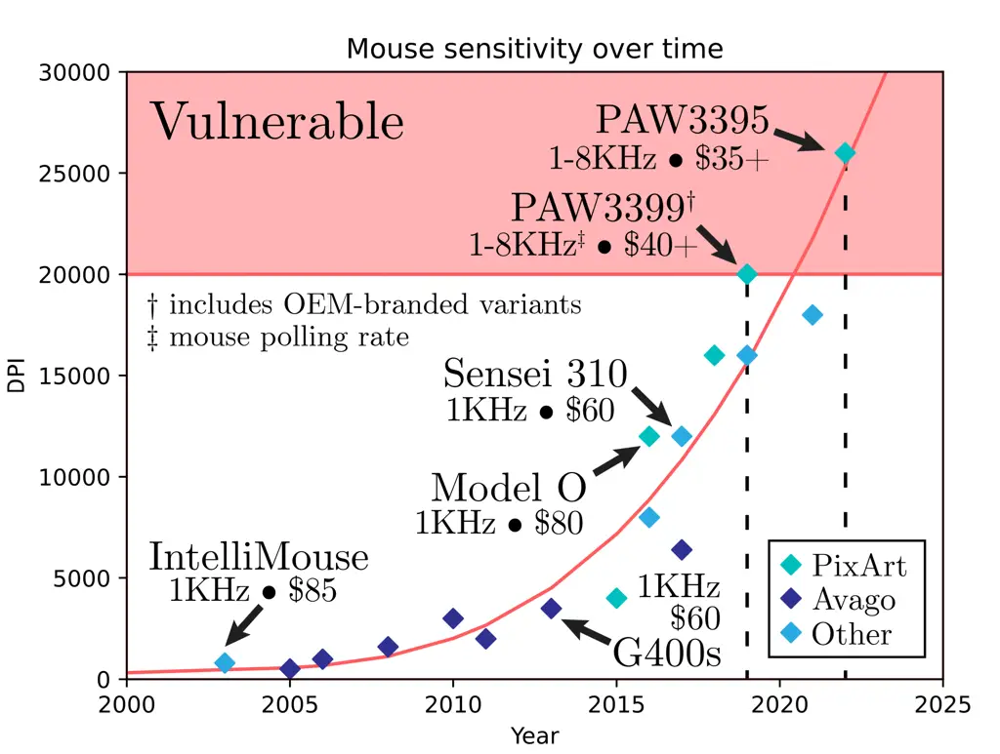

Fig. 1: Computer mice optical sensor fidelity trends over time. The
red-shaded region indicates vulnerable sensors featuring high resolution
measured in DPI (Dots-per-inch).

Consumer-grade mice with high-fidelity sensors are already available for
under 50 U.S. Dollars \[18\]. As improvements in process technology and
sensor development continue, it is reasonable to expect further price
declines, similar to the trend shown in Figure 1. Furthermore, mouse
sensors’ resolution and tracking accuracy also follow the same pattern,
with steady improvements each year. Ultimately, these developments
entail an increased usage of vulnerable mice by consumers, companies,
and government entities, expanding the attack surface of potential
vulnerabilities in these advanced sensor technologies.

The rise in work-from-home policies has led to the widespread adoption
of new technologies and practices, making it more difficult for
employers and government institutions to control the physical operating
environments of their workforce. While these arrangements often boost
employee sentiment and productivity \[36\], the security implications of
work-from-home policies are still being understood \[55\]. Specifically,
attacks exploiting personal peripherals on work computers, such as
keyboards \[83, 3\], microphones \[28\], styli \[25, 45\],
earphones \[40\], mechanical hard drives \[38\], and even USB
devices \[20\], have become increasingly common. Even in relatively
secure office environments, the threat posed by these exploits is still
significant, especially for unknown or poorly understood attack vectors.

We posit that the seemingly innocuous computer mouse is the source of
yet another vulnerability. Importantly, we claim recent advancements in
mouse sensor resolution can be sufficient to enable a side-channel
attack capable of extracting user speech. Through our Mic-E-Mouse
pipeline, vibrations detected by the mouse on the victim user’s desk are
transformed into comprehensive audio, allowing an attacker to eavesdrop
on confidential conversations. This process is stealthy since the
vibrations signals collection is invisible to the victim user and does
not require high privileges on the attacker’s side. Potential
adversaries can collect user-space mouse signals and remotely use the
Mic-E-Mouse pipeline to convert raw data packets into audio. Figure 2
provides an overview of our proposed attack pipeline.

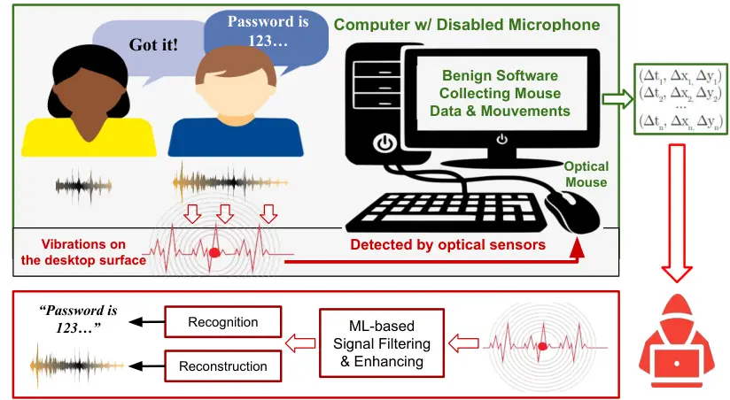

Fig. 2: Overview of the Mic-E-Mouse pipeline: A victim’s confidential
speech is captured by benign or compromised software using surface
vibrations detected by the computer mouse. The collected data is sent to
the adversary’s server for processing and filtering with machine
learning methods to enhance the quality of the recovered audio signal.

We summarize our key contributions as follows:

- •
  To the best of our knowledge, our work is the first to exploit
  computer mouse sensors as a means to capture confidential data (i.e.,
  user speech) from environmental vibrations, even in highly secure
  environments without any additional conventional recording devices.
- •
  We introduce the MICrophone-Emulating-MOUSE, or "Mic-E-Mouse"²² 2 The
  name ”Mic-E-Mouse” was inspired from a certain fictional mouse with
  big ears., a pipeline consisting of successive signal processing and
  Machine Learning stages to overcome the challenges involved in speech
  extraction from extracted mouse data, ultimately enabling intelligible
  reconstruction of user speech.
- •
  We present a detailed study on the motivations, methodologies, and
  efficacy of the Mic-E-Mouse pipeline through comprehensive testing
  with high-performance mice and optical sensors while considering the
  effects of varying surface types, polling rates, distance, and mouse
  sensitivity configurations.

## II Background

This section provides the required background knowledge, including
optical computer mice technology, operating-system-level input drivers,
and machine learning techniques for speech signal processing and
enhancement.

### II-A Optical Computer Mice

Modern optical mice employ various methods to provide precise movement
tracking under different sensitivity settings. Over the last two
decades, optical mice leveraging a high-performance CMOS camera with an
onboard Digital Signal Processor (DSP) have become the preferred design
choice \[56\]. Generally, optical sensors enhance reliability and
fidelity through the use of self-illumination, typically from an
independent diode or an integrated laser. By taking thousands of
snapshots of the illuminated surface under the mouse, the DSP can then
compare each successive image in order to determine the direction of
movement. The rate at which this process happens is determined by the
sensor’s frame rate, measured in Frames Per Second (FPS). Each frame is
processed via an on-chip correlation algorithm to provide a
2-dimensional displacement to the host computer \[30\]. The described
process can be broken down into two key elements: (_i_) the imaging
sensors and (_ii_) the image processing and movement detection
algorithm.

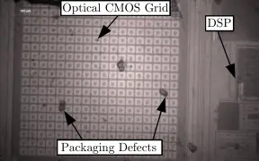

Fig. 3: Imaging of the CMOS sensor grid in the PMW3552 chip from a
Logitech mouse

Imaging Sensors. Rather than relying on expensive Charge-Coupled Device
(CCD) sensors, the sensor in an optical mouse is typically a
Complementary Metal-Oxide-Semiconductor (CMOS) image sensor collecting
up to 30x30 pixels’ worth of data per frame, where each pixel represents
the intensity of the reflected light at that point \[21\]. This basic
mini-camera is a critical component for implementing speckle-pattern
detection. Some sensor models, such as the PixArt PMW3552, capture data
using an 18×18 pixel grid, while others can record up to 30×30 pixels,
depending on the manufacturer’s specifications. For visualization
purposes, we destructively studied a PixArt PMW3552 sensor in our
institutional lab, and the resulting scan is shown in Figure 3. This
sensor features an 18×18 CMOS pixel grid and is designed to interface
directly via USB. Speckle patterns are random, granular intensity
patterns produced when coherent light, such as laser light, is scattered
by a rough surface \[68\]. When an optical mouse is moved across a
surface, the speckle pattern on the surface changes smoothly and
reliably. The CMOS sensor captures these changes in the speckle pattern
frame by frame and processes them to detect movement\[13\]. These
movement detection algorithms allow for the translation of data into
corresponding coordinate deltas.

Image Processing and Movement Detection. Movement detection involves
analyzing the changes between successive images. This can be modeled as:

```math
\vec{\Delta p}=f(\vec{I}_{t},\vec{I}_{t-1}) \tag{1}
```

where $`\vec{\Delta p}`$ is the displacement vector of the mouse, $`f`$
is the image processing function, $`\vec{I}_{t}`$ is the image at time
$`t`$, and $`\vec{I}_{t-1}`$ is the image at time $`t-1`$. The function
$`f`$ often involves correlating sections of the two images to estimate
movement. This correlation can be represented as:

```math
\displaystyle C(\vec{x}) \displaystyle=\sum_{\vec{u}\in W}\vec{I}_{t}(\vec{u})\cdot\vec{I}_{t-1}(\vec{u}-\vec{x}) \tag{2}
```

```math
\displaystyle\vec{\Delta p} \displaystyle=\underset{\vec{x}}{\text{argmax}}\>C(\vec{x})
```

where $`C(\vec{x})`$ is the correlation for displacement $`\vec{x}`$,
and $`W`$ is the window of pixels in the image being analyzed.

The use of the Fast Fourier Transform (FFT) significantly enhances the
efficiency of calculating the correlation function \[17\]. In the case
of image correlation, the FFT is applied to both images ($`\vec{I}_{t}`$
and $`\vec{I}_{t-1}`$) to transform them into the frequency domain. This
transformation simplifies the calculation of the cross-correlation,
which is computationally less intensive in the frequency domain \[12\].
The equation for cross-correlation in the frequency domain can be
expressed as:

```math
C(\vec{x})=\mathcal{F}^{-1}\left\{\mathcal{F}\left\{\vec{I}_{t}\right\}\circ\mathcal{F}\left\{\vec{I}_{t-1}\right\}^{*}\right\} \tag{3}
```

where $`\mathcal{F}`$ and $`\mathcal{F}^{-1}`$ represent the Fourier
Transform and its inverse, respectively, and ^(∗) denotes the complex
conjugate.

The displacement vector $`\vec{\Delta p}`$, once obtained, is scaled by
the DPI setting of the input device to ensure accurate correspondence
between physical movement and on-screen cursor movement \[11, 57\]. This
vector is further refined through Kalman filtering, a recursive
algorithm enhancing motion tracking by reducing noise in the trajectory
of the displacement vector \[33, 41\]. Finally, this scaled and smoothed
vector undergoes quantization in the mouse’s firmware, converting it
from a continuous to a discrete form for compatibility with digital
systems, thereby maintaining cursor movement accuracy and fluidity, with
high-performance mice featuring custom enhancements for input quality.

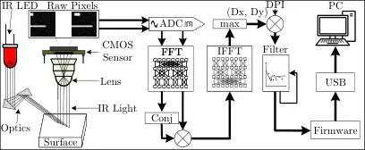

Fig. 4: Overview of the internal systems of a mouse.

### II-B Operating System Input Handling

Modern operating systems, such as those using the Linux kernel, as well
as Windows and macOS, handle peripheral device input through
interrupt-based drivers, allowing them to efficiently manage and respond
to user interactions with input devices such as the computer mouse.
Additionally, these operating systems separate access to input devices
into two distinct areas: kernel space and user space.

#### II-B1 Kernel Space System Calls

Kernel space is a privileged area of the system’s memory where the core
components of the operating system such as the kernel and device
drivers- operate. Logging the mouse movements in kernel space is
possible through certain OS-dependent endpoints.

Linux kernel provides a method of obtaining input data through kernel
modules such as `hid_logitech_hidpp`. This driver is responsible for
collecting mouse events and relaying them to the kernel’s input
subsystem. The Linux kernel uses the following endpoint to provide
access to mouse data `/dev/input/mouseX`. Normally, direct access to
this endpoint requires elevated privileges. The Linux kernel also
provides a mechanism in order to uniquely identify mouse input devices.
Consumer mice have a predetermined name set by the manufacturer, which
can be used to obtain the correct input endpoint. Given a target mouse
with a vulnerable sensor (e.g. the Razer Viper 8KHz used in our
experimental setup detailed in Table I), we can query the
`/proc/bus/input/devices` input for the corresponding name. By doing so,
we can automatically obtain the input endpoint required for an exploit.

Windows operating system also provides a method to retrieve low-level
mouse events. By using the `LowLevelMouseProc` function described in the
Windows API, a program can obtain displacement information directly from
the operating system \[46\]. The function yields a data struct of the
`MSLLHOOKSTRUCT` type, containing both the displacement and button
information.

MacOS operating system provides a method to capture low-level mouse
events through the Quartz Event Services framework. By using the
`CGEventTapCreate` function, developers can create an event tap that
monitors or intercepts mouse events such as clicks, movements, and
scrolls at the system level.

#### II-B2 User Space Applications

Modern operating systems provide a user-space access to input devices.
An adversary readily get the data logged by any peripheral (e.g.,
computer mouse) without necessitating elevated permissions. Many
software libraries already provide such access points. Graphical
frameworks like `Qt`\[74\], `GTK`\[29\], and `SDL`\[39\] enable
real-time mouse data access from unprivileged user-space applications.
Similarly, game engines like Unity\[76\], PyGame \[73\], and
Unreal \[23\] offer extensive mouse tracking support and built-in
networking capabilities, further facilitating an attacker’s efforts.

## III Threat Model

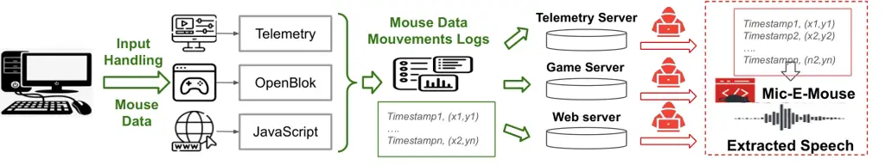

Fig. 5: An overview of a practical attack scenario following the
proposed Mic-E-Mouse pipeline with different vulnerability exploits,
including, graphical application, open-source games, and web browser.
Green and Red arrows depict authorized and unauthorized access,
respectively.

Attack Scenario and Goals. We consider a practical attack scenario in
which the victim is engaged in a sensitive conversation within a room
equipped with a desktop computer without microphone or any other voice
recording equipment. The attacker can be an individual who aims to
eavesdrop on the confidential conversation from outside the room. The
attacker can exploit the victim’s computer mouse to recover speech
signals from the surface vibrations detected by the highly-sensitive
optical mouse sensors. The recovered speech could be exploited by the
eavesdropper for various malicious purposes (e.g.,
intelligence-gathering or blackmailing).

Attack Assumptions: We assume that the victim is in a controlled
environment, such as a private office or home workspace, where they use
a desktop computer equipped with a commercially available optical mouse.
The mouse is assumed to have high sensitivity (e.g., a sensor of at
least 20,000 DPI) and a polling rate of at least 8 KHz, specifications
commonly found in mid-range to high-performance input devices (See
Appendix -B). The work surface is assumed to allow vibrations to
propagate to the mouse sensor (e.g., a thickness of no more than 3cm),
which is typical for wooden or laminate desks with standard thickness.
The victim’s computer system is assumed to run an application or process
capable of logging pointer movements, such as background services,
custom software, or system utilities, which may or may not require
elevated privileges. This logging capability is presumed to exist either
as a legitimate feature or via unauthorized exploitation discussed in
Section III-A. During the attack scenario, the victim is assumed to
engage in activities involving sensitive spoken information. While the
victim may intermittently use the mouse, the attack leverages instances
where the pointer is stationary or experiences minimal motion. The
conversation volume is assumed to fall within a range of 60–80dB, which
covers typical office or home discussions \[52, 64, 50\]. The attacker
is assumed to have access to mouse movement data via software-level
logging, remote exploits, or physical access to the machine. To
strengthen the practicality of the threat model, we discuss in Section
III-A multiple exploits, including but not limited to compromised
applications, unauthorized monitoring software, or vulnerabilities in
the input data handling pipeline.

### III-A Vulnerability Exploitation Methods

In this section, we discuss multiple exploit methods that can be
leveraged by the attacker to access the history of mouse movement logs.
Specifically, we explore the following vulnerability exploitation
methods:

#### III-A1 Vulnerability Exploit in Graphical Applications

: Software that naturally gathers high-frequency mouse movement data as
part of its normal operation can be exploited for the Mic-e-Mouse
attack. Images/video editing applications are potential candidates due
to their reliance on precise input handling. Examples of such
applications include Blender \[9\], Kdenlive \[34\], and Krita \[35\],
which utilize mouse data for features like fine-grained control and
graphical interface interactions. Many applications with graphical
interfaces collect telemetry data, which may include mouse movement logs
for diagnostic purposes. While privacy policies typically regulate such
data collection, telemetry practices vary widely. In some cases, raw
input data could be transmitted to external servers for processing or
analysis. A practical attack could involve compromising a telemetry
server to gain access to raw mouse movement data. This data, if
sufficiently high in resolution, could be analyzed to infer sensitive
information, such as speech patterns. A detailed example of this attack
and exploit are depicted in Figure 5.

#### III-A2 Vulnerability Exploit in Open-source Games

: Anti-cheat systems in gaming, such as Vanguard \[81\], often analyze
user input, including mouse movements, to detect tampering or unfair
gameplay. In some cases, this analysis involves transmitting input data
to remote servers managed by the game developer. While not all
anti-cheat systems store raw mouse logs, those that do may create a
potential attack vector. However, testing such scenarios is challenging
due to the proprietary nature of most closed-source games. For our
proof-of-concept attack, we utilize OpenBlok, an open-source version of
the classic Tetris video game \[48\]. Open-source software provides a
transparent environment for controlled research and experimentation. Our
exploit involves applying a single patch to the game’s source code
before compilation. This patch introduces a background thread that
captures mouse input data during gameplay and transmits it to a remote
server using integrated telemetry. The exploit does not require physical
access to the victim’s machine, showcasing its potential applicability
in real-world scenarios.

#### III-A3 Vulnerability Exploit in Web-Browser

: In web browsers, JavaScript can be exploited to extract high-frequency
mouse data. Modern web browsers generally limit input event rates to the
refresh rate of the display, which is typically 60Hz for standard
monitors. This limitation ensures consistency and minimizes excessive
resource usage. While high-refresh-rate monitors (e.g., 120Hz, 144Hz)
allow higher event rates, these remain insufficient for the Mic-E-Mouse
vulnerability, which requires significantly higher frequencies. From our
preliminarily analysis, we observed that activating the developer
console (F12) in Chromium-based browsers temporarily increased the event
rate to 1 KHz. This behavior appears to be an undocumented feature
intended for debugging purposes, as it aligns with the requirements of
high-performance development workflows. Currently, no mainstream web
browser natively supports the high-frequency data access required to
exploit the Mic-E-Mouse vulnerability. This finding demonstrated the
importance of existing input rate limitations in preventing such
attacks. However, future updates or changes to browser input
handling—whether intentional or accidental—could reintroduce such
vulnerabilities.

## IV The Microphone-Mouse Analogy

In this section, we draw parallels between a computer mouse on a surface
and a microphone with its diaphragm, demonstrating how mouse sensors can
function as microphones. We explore how a mouse sensor detects
transverse and longitudinal waves and the key characteristics that
enable this side-channel vulnerability.

### IV-A Microphone Mechanics

Microphones convert sound waves into electrical signals through
diaphragm vibrations caused by air pressure changes. The diaphragm’s
movement is then transduced into electrical currents via different
mechanisms depending on the microphone type \[31\]. The left side of
Figure 6 depicts the internals of a basic microphone. Typically, dynamic
microphones generate signals by moving a coil within a magnetic field,
whereas condenser microphones alter capacitance by using a vibrating
diaphragm as one plate of a capacitor.

#### IV-A1 How Mice Mimic Microphones

Computer mice are not originally designed to capture sound, but their
sensors can detect surface vibrations similar to how a microphone’s
diaphragm captures sound waves \[30\]. When a mouse is stationary, these
vibrations can resemble ambient noise picked up by a microphone. An
optical mouse’s laser or LED illuminates the surface while the sensor,
functioning like a camera, captures thousands of images per second. The
mouse’s built-in processor interprets changes between these images to
detect movement, which may inadvertently contain sound-induced signals.
The unintended microphone-like behavior occurs when the surface
vibrations are within the detectable range of the mouse’s sensor. These
vibrations cause minute movements of the mouse relative to the surface,
which the sensor interprets as movement. With the right signal
processing, these signals can be converted back into sound waves,
effectively turning the mouse into a rudimentary microphone. Although
mice can track these minute vibrations under controlled conditions,
real-world usage and surface irregularities can dramatically reduce
viability. We thus emphasize that these results represent an upper bound
under idealized setups. We show the key similarities between a
microphone and the proposed Mic-E-Mouse makeshift microphone in Figure 6. Although conceptually similar to a microphone, the mouse sensor is
not designed to respond to air pressure changes. Instead, it passively
measures surface displacement, requiring far stronger coupling between
acoustic vibrations and the work surface for effective signal capture.

#### IV-A2 Decoding Vibrations

The process by which a computer mouse detects vibrations and converts
them into signals interpretable as sound involves two key components.
(_i_) Longitudinal vibrations, which move parallel to the surface, cause
the most significant movements of the mouse sensor and are therefore
more easily interpreted as traditional cursor movements. (_ii_)
Transverse vibrations, move perpendicular to the surface, and result in
much subtler signals. These are usually ignored during normal mouse
operation but can contain the range of frequencies necessary for
reconstructing sound. For a mouse to function as a microphone, its
sensor must be sensitive enough to detect transverse vibrations. The DPI
(Dots Per Inch), which measures the sensor’s resolution over a given
distance, is a crucial metric to determine the required level of
sensitivity. High-DPI mice (10,000+ DPI) are more likely to capture
subtle vibrations similar to those detected by a microphone’s diaphragm.
This behavior is detailed in Fig. 7.

Fig. 6: The internals of a high-performance mouse can be viewed as
similar to those of a high-fidelity microphone.

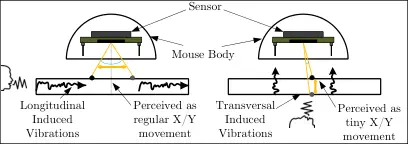

Fig. 7: Model of how sound waves propagate on the surface.

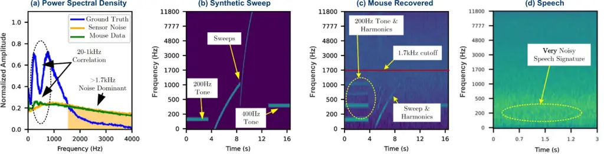

Fig. 8: Signal composition for different setups: (a) Frequency
composition of the ground truth data, sensor noise from the mouse, and
the data as collected with the mouse (b) Spectrogram of the synthetic
sweep signal we generate (c) spectrogram of the sweep signal as
collected by the mouse. (d) Spectrogram of an unfiltered speech signal
as collected by the mouse.

For a mouse with a given DPI and polling rate, the smallest detectable
movement is determined by its resolution. A mouse with a DPI of $`D`$
can detect movements as small as $`1/D`$ inches. The polling rate $`S`$,
measured in Hz, is the rate at which the mouse sensor updates the host
PC. For transverse waves on a surface with frequency $`f`$, the mouse
sensor will detect these vibrations if their frequency is below the
Nyquist frequency, which is half the polling rate. According to the
Nyquist-Shannon sampling theorem \[66\], this is the maximum frequency
that can be accurately sampled without aliasing. For a wave with
frequency $`f`$, wavelength $`\lambda`$ on the surface can be calculated
if we know the speed of the wave on the surface $`\nu`$:

```math
\lambda=\frac{\nu}{f} \tag{4}
```

The DPI must be high enough so that the smallest detectable movement is
less than half the wavelength of the wave (We convert D into millimeters
by since $`1in=25.4mm`$):

```math
\displaystyle\frac{25.4}{D} \displaystyle<\frac{\lambda}{2}
```

```math
\displaystyle\frac{f}{D} \displaystyle<\frac{\nu}{50.8} \tag{5}
```

If DPI and polling rate are high enough to satisfy this condition, the
mouse sensor can detect the wave and thus capture the transversal waves.
Assuming a mid-range sound velocity in wood (e.g., 3000±500 m/s), we
demonstrate that our calculations hold under common desk conditions, and
that we can expect to recover sounds from the mouse given $`f=8kHz`$ and
$`D=20000`$.

### IV-B Preliminary Study

We perform a preliminary study to confirm that the mouse can detect
frequencies within the range of human speech—typically between 200 and 2
KHz \[8, 53\]. We generate a step-wise sweep from 0 to 16 kHz to observe
any aliased components at frequencies above the Nyquist limit (4 kHz),
thus testing how the mouse sensor responds to out-of-band signals. The
sweep is generated using a synthetic tone and sweep audio sample which
consists of four consecutive segments: (_i_) an initial 200Hz tone
lasting 5 seconds, (_ii_) a linear sweep from 0 to 1 KHz over 4 seconds,
(_iii_) a linear sweep from 0 to 16 KHz over 4 seconds, and (_iv_) a
400Hz tone lasting 5 seconds. The start and end tones serve as a
synchronization token since we observed a strong response during our
initial experiments. Additionally, we cross-reference the spectral
distribution of the logged mouse signals, the true data signals, and a
collection of background noise in order to establish a statistical model
of the noise profile for further processing during the signal processing
stage of our pipeline. Figure 8 presents: (a) spectral densities of
ground truth speech, ambient sensor noise, and speech collected from the
mouse; (b) the ground truth synthetic sweep; (c) the sweep collected
from the mouse; and (d) a speech signal collected from the mouse. In
Figure 8(a), the mouse-captured signal exhibits two prominent peaks that
align in frequency with the ground truth but differ in amplitude,
indicating partial resonance unique to the sensor. Meanwhile, panel (c)
highlights aliased harmonics that provide further evidence of how
effectively (or poorly) the mouse replicates subtle audio content. The
mouse sensor shows a non-Gaussian noise profile with a power peak around
1 kHz. Figures 8b and 8c demonstrate a ’tone and sweep’ test, with the
mouse-collected data mirroring the ground truth pattern, confirming the
presence of a side-channel. In Figure 8d, speech signals appear faint
but distinct below 500 Hz, indicating the need for classical and neural
filtering techniques.

## V Mic-E-Mouse Attack Design

In this section, we detail and justify the design choices that enable
the Mic-E-Mouse pipeline to recover high-quality audio signals from a
computer mouse. We discuss targeted mouse sensors, the methodology for
collecting vibration data, the preprocessing steps to reconstruct
original audio signals, and the ML techniques used to enhance waveform
reconstruction.

### V-A Targeted Mouse Sensors

We focus on two state-of-the-art mice sensors currently available in
consumer-grade mice – Paw3395 and Paw3399 – both produced by the
manufacturer PixArt Imaging Inc. \[59, 58\]. These sensors are in the
Razer Viper 8KHz \[1\] and Darmoshark M3-4KHz \[18\], respectively. An
overview of the mice sensors technology used in our testing methodology
is provided in Table I. We also list similar mice that are vulnerable to
the same class of exploit as the Razer and Darmoshark mice in Appendix
-B. These additional mice share at least one of the following
attributes: (_i_) a Paw3395 or Paw3399 sensor or (_ii_) a poll rate at
or above 4KHz.

| Mouse             | Sensor  | DPI    | IPS | POLL RATE |
| ----------------- | ------- | ------ | --- | --------- |
| Razer Viper 8KHz  | Paw3399 | 20,000 | 650 | 8KHz      |
| Darmoshark M3     | Paw3395 | 26,000 | 650 | 4KHz      |
| AtomPalm Hydrogen | Paw3360 | 12,000 | 250 | 8kHz      |
| Redragon M994     | Paw3395 | 26,000 | 650 | 1kHz      |

TABLE I: Targeted mouse sensors’ capabilities in terms of DPI
(Dots-per-Inch), IPS (Inch-per-Second), and Polling Rate.

### V-B Mouse Data Collection Setup

We build a reliable data collection setup to capture mouse movements
induced by playback sound at controlled audio levels using a speaker.
The setup, shown in Figure 9, includes a sound-isolation box containing
a wired ’Logitech S-150’ loudspeaker. Above the loudspeaker, an
interchangeable membrane is centered on a 4” ($`\sim`$10cm) cutout,
serving to transmit vibrations to a high-performance mouse placed on its
surface. The mice, listed in Table I, are configured to use their
highest polling rate and DPI settings to maximize sensitivity.

To collect data, each audio sample is played through the loudspeaker
while the mouse’s reported movement is simultaneously logged by the host
computer. We used a calibrated SPL meter at the membrane surface to
confirm an 80 dB SPL ±1 dB across a range of test frequencies, ensuring
consistent amplitude for all initial experiments. In later experiments
(Sec VII-B), the amplitude was adjusted from 80 dB to explore the
effects of varying sound pressure levels on the system.

In our test environment, the host computer runs Linux (kernel 6.6.3) and
it collects mouse movement data via the method discussed in
Section II-B. The sequence of data packets is written to a CSV file,
where each collected sample contains two entries:

1.  1.  A timestamp $`\Delta t`$, representing the time in microseconds
        since the last query was processed.
2.  2.  The directional movement
        $`\vec{\Delta_{P}}\in\mathbb{R}^{2}=(\Delta X,\Delta Y)`$,
        representing the discretized X and Y movement components detected by
        the mouse during the time since last query.

Our data collection program processes data at up to 8kHz, which is
crucial for minimizing latency as the script manages time-keeping to
compute $`\Delta t`$.

We note that we are also able to use user-space mouse collection
routines, such as those provided by the X11 display server in order to
collect mouse data without requiring elevated privileges. This allows
for our exploit to be embedded in applications without asking for `sudo`
access. Then, we can retrieve mouse events using third-party software
libraries such as `Qt`, `GTK`, or `SDL`. These libraries are commonplace
in many user-facing applications, which allows our exploit to safely
depend on them without raising suspicion.

### V-C Mouse Data Preprocessing

The output of the data collection program is a CSV file with only
timestamp and positional movement information, which is far from an
adequate waveform representation. A significant challenge is the
non-uniformity of the sample data, which is a result of the mouse’s
energy-conserving behavior—the optical sensor does not report
periodically if it is idle; instead, it will dynamically send packets as
soon as the movement threshold is reached. For example, when the mouse
is actively being used—for instance during typical office or home
activities—the average polling rate will be close to the maximum for
that mouse. For our target mice (See Table I), polling rate is either
4KHz or 8KHz. However, when the mouse is not in vigorous motion, the
reported sample rate is significantly lower. This property is reflected
in the collected data, as there are no reported samples where
$`\vec{\Delta_{P}}=\vec{0}`$.

To address the nonuniformity in the collected mouse signals, we apply a
signal processing pipeline that includes sequential resampling and
filtering stages. We use a `sinc`-based resampling technique that allows
efficient and accurate interpolation and reconstruction of fragmented,
nonuniform, and noisy signals \[22\]. This resampling stage is
equivalent to applying a modified Whittaker–Shannon interpolation
formula:

```math
\hat{\Delta_{P}[t]}=\sum_{i=-\infty}^{\infty}\vec{\Delta_{P}}[i]*sinc\left(\frac{t-t_{i}}{T}\right) \tag{6}
```

For $`T=\frac{1}{Fs}`$ where $`T`$ and $`Fs`$ are the target period and
the target polling rate respectively, for which we use $`Fs=16000`$.

Lastly, we trim the generated signal to remove any silence/padding.
After completing these steps, we save the mouse signal as a waveform,
preparing it for the filtering stage in the Mic-E-Mouse pipeline.

### V-D Waveform Signal Filtering

It is important to note that environmental and sensor noise are a point
of concern in our data collection scheme. Therefore, we implement a
custom-tuned Wiener Filter adapted to the sensor noise introduced by
having a high DPI setting. We collect 10-minute segments of the mouse
jitter which are used to estimate the noise profile, and we couple the
noise spectrum with the true spectrum of speech which we acquire from
our selected datasets (see Sec V-E3). In real life scenarios, the
attacker can obtain noise recordings by exploiting one of the methods
discussed in Section III-A to collect data during times deep into the
night when the user is expected to not be using the computer. If such
information cannot be obtained, another alternative would be to tune the
Wiener filter using the power spectral density of sections with the
lowest overall signal energy as these are most likely the ones where the
user is silent. By applying a Wiener filter, the attacker can
efficiently increase the Signal-to-Noise Ratio (SNR) of the resulting
waveform \[79, 14\].

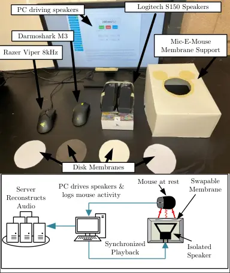

Fig. 9: The Experimental setup used to collect the mouse data signals
used to train and evaluate the models involved in the Mic-E-Mouse
pipeline.

### V-E ML-based Signal Processing

The last component of the Mic-E-Mouse pipeline uses ML-based models to
extract speech features from the pre-processed mouse signal data and map
them to an embedding space. These ML models are used for two main tasks:
speech reconstruction and speech keyword classification. For each task,
we provide in the following details about the models architectures and
training parameters.

#### V-E1 Speech Reconstruction Models

This task involves reconstructing original speech signals from the
recovered mouse data signals. We use a transformer encoder-only
architecture inspired by the smallest configuration of the OpenAI
Whisper model \[61\], which leverages multi-head residual self-attention
blocks \[77, 69\]. We transform the combined $`\Delta X`$ and
$`\Delta Y`$ data into a single 2-channel time-domain signal, then
compute its log-mel-spectrogram (e.g., 80 Mel bins over 25 ms windows),
forming the encoder input. The model is trained on paired signals
$`(X,Y)`$, where $`X`$ denotes the noisy input (mouse data), and $`Y`$
represents the high-quality ground-truth audio waveform \[43\]. The
training objective minimizes a loss function $`\mathcal{L}(Y,\hat{Y})`$,
where $`\hat{Y}`$ is the reconstructed audio waveform. The loss is
computed using L1 or L2 norm distance measures, defined as:

```math
\mathcal{L}(Y,\hat{Y})=\frac{1}{n}\sum_{i=1}^{n}\|Y_{i}-\hat{Y}_{i}\|_{p} \tag{7}
```

where $`p=1`$ for L1 norm or $`p=2`$ for L2 norm. The model is optimized
using the Adam optimizer with a learning rate of $`0.001`$, training
over 30 epochs. A step learning rate decay with
$`\gamma=\frac{1}{\sqrt{2}}`$ is applied every 5 epochs (equivalent to
$`\gamma=1/2`$ at 10 epochs).

#### V-E2 Speech Keyword Classification Models

This task involves the automated extraction of significant keywords from
reconstructed audio waveforms. Formally, it is defined as a mapping
function that translates the predicted audio waveform signal, denoted as
$`\hat{Y}`$, into a set of key terms $`{K_{1},K_{2},\ldots,K_{n}}`$ that
encapsulate critical information within the speech. We use
wav2vec2\[6\], designed to extract and classify keywords. Wav2vec2 is
based on a transformer architecture, enabling a large temporal receptive
field that spans 25 ms of audio. The Wav2vec2 model is trained on a
supervised dataset, for 20 epochs each, with a batch size of 64 and Adam
optimizer.

#### V-E3 Training Datasets

The ML models incorporated in the Mic-E-Mouse pipeline are trained using
English voice data from existing speech recognition datasets, including
(_i_) the CSTR VCTK Corpus (version 0.92) dataset, which contains
approximately 54 hours of human speech recorded from 110 English
speakers \[78\], and (_ii_) the AudioMNIST dataset, comprising 30,000
recordings of spoken digits in English collected from 60 speakers \[7\].
The training data collection process involved playing each audio sample
while simultaneously recording mouse sensor data (e.g., timestamps and
movements). These sensor data were then aligned with their corresponding
audio samples and ground-truth keywords.

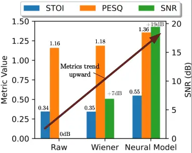

Fig. 10: Waveform reconstruction metrics showing signal enhancement at
each stage of the Mic-E-Mouse pipeline.

## VI Evaluation

### VI-A Evaluation Tasks and Metrics

Waveform Reconstruction. We assess the efficacy of waveform
reconstruction using the following metrics:

- •
  Short-Time Objective Intelligibility (STOI): For measuring the
  intelligibility of reconstructed speech using a Discrete Cosine
  Transform \[70\].
- •
  Perceptual Evaluation of Speech Quality (PESQ): For correlating the
  quality of reconstructed speech with estimated human
  perception \[63\],
- •
  Scale-Invariant Signal-to-Noise Ratio (SNR): For evaluating the
  quality of the reconstructed waveform \[60\].

Keyword Classification. To evaluate the effectiveness of keyword
classification, we employ Accuracy, which measures the ratio of
correctly classified samples to their true classes.

Human Assessment. We focus on the following metrics:

- •
  Human Word Error Rate (HWER): HWER divides the total number of errors
  in the reconstructed audio by the total number of keywords recognized
  by humans.
- •
  Mean Opinion Score (MOS): MOS evaluates the quality of audio signals
  as perceived by humans on a standardized scale ranging from 1 (poor)
  to 5 (excellent).
- •
  Semantic Similarity Ratings (SSR): SSR evaluates the semantic
  similarity between the content of the reconstructed audio and the
  original audio.

## VII Results

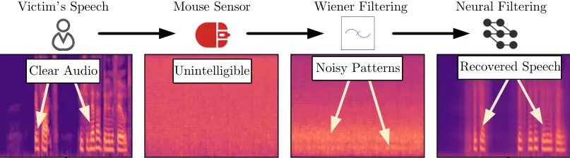

Fig. 11: Reconstruction spectrograms showing the improvement following
each stage.

### VII-A Attack Evaluation

#### VII-A1 Waveform Reconstruction

Figures 10 and 11 illustrate the results of speech audio reconstruction
at various stages of the Mic-E-Mouse pipeline. The process begins with
the raw mouse data signals, followed by Wiener filtering and
preprocessing, and concludes with the final reconstruction using the
OpenAI Whisper model, as detailed in Section V-E.

[TABLE]

TABLE II: Classification accuracy across different tasks

In Figure 11, the original victim’s speech audio waveforms are shown in
the leftmost plot, depicting a clear and intelligible signal. The second
plot shows the recorded mouse data signals when the same audio was
played back, highlighting their high noise levels and unintelligibility.
After applying Wiener filtering, the signals exhibit reduced noise and
improved clarity, as shown in the next plot. Finally, the ML-based
reconstruction recovers the original audio waveforms with high fidelity.

Figure 10 provides a quantitative evaluation of audio reconstruction
performance using the three metrics discussed in Section VI-A: STOI,
PESQ, and SNR, computed across multiple instances of audio waveforms.
The results indicate a significant improvement, with STOI increasing by
40% after ML-based reconstruction compared to the raw data. Similarly,
SNR shows a gain of +19 dB from an initial value of 0 dB. Additionally,
the quality of the reconstructed audio improves progressively across the
Mic-E-Mouse pipeline stages, as reflected by the linear increase in
PESQ.

#### VII-A2 Speech Classification

We consider three main tasks: (_i_) speech classification on the
AudioMNIST dataset, (_ii_) digit classification on the AudioMNIST
dataset, and (_iii_) speech classification on the VCTK dataset. The
classification accuracy for each task is reported in Table II, using the
accuracy of the ground truth audio data as a reference. From Table II,
we observe that the classification accuracy on the reconstructed audio
from the Mic-E-Mouse pipeline is approximately $`62\%`$ for both the
MNIST digit and VCTK speech recognition tasks. However, a lower accuracy
of about $`42\%`$ is observed for the AudioMNIST speech classification
task, which can be attributed to the dataset size limitations of the
AudioMNIST compared to VCTK.

|                         |                       |                    |                    |
| ----------------------- | --------------------- | ------------------ | ------------------ |
| Method                  | HWER $`(\downarrow)`$ | MOS $`(\uparrow)`$ | SSR $`(\uparrow)`$ |
| Raw                     | 100%                  | 0                  | 0                  |
| Wiener Filtering        | 100%                  | 0                  | 0                  |
| Neural Model            | 16.79%                | 4.06               | 3.20               |
| Perceptual Neural Model | 44.92%                | 3.29               | 2.24               |

TABLE III: Breakdown of human evaluation results.

#### VII-A3 Human Assessment

We present the findings of a user study in which 16 human volunteers
evaluated a selection of audio samples from the AudioMNIST dataset³³ 3
This study received an exemption from an institutional IRB, and
participants were guided through the process by team members.. The study
was conducted in a quiet office environment, where volunteers, informed
about evaluating new "speech recovery systems," listened to 32 curated
samples using Sony XM4 headsets. The relevant WER, MOS, and SSR metrics
are summarized in Table III. For the RAW and Wiener Filtering stages,
all participants reported an absence of significant speech presence.

| Audio Volume | AudioMNIST Digit | AudioMNIST Speech |
| ------------ | ---------------- | ----------------- |
| 80dB         | 61.57%           | 47.65%            |
| 70dB         | 53.54%           | 32.58%            |
| 60dB         | 19.86%           | 21.28%            |
| 50dB         | 17.84%           | 16.05%            |

TABLE IV: Classification accuracy across various audio volume levels
(ranging from 50 dB to 80 dB)

### VII-B Influence of environmental conditions

The accuracy of speech reconstruction from mouse signal data is
significantly influenced by environmental factors, such as audio volume
and surface material. We provide in the following a performance
breakdown under different environmental conditions.

#### VII-B1 Volume

Table IV highlights the impact of varying volume levels on digit and
speech classification accuracy. As shown, higher volume levels lead to
improved accuracy, whereas lower volumes result in a sharp decline,
underscoring the importance of adequate sound levels for reliable speech
reconstruction using the proposed Mic-E-Mouse pipeline.

| Material Surface | AudioMNIST Digit | AudioMNIST Speech |
| ---------------- | ---------------- | ----------------- |
| Plastic          | 61.57%           | 47.65%            |
| Paper            | 55.20%           | 36.27%            |
| Cardboard        | 23.06%           | 10.69%            |

TABLE V: Speech recognition performance results across various surface
materials (plastic, paper, and cardboard)

#### VII-B2 Surface Material

Table V demonstrates the impact of different surface materials on the
classification accuracy of AudioMNIST Digit/Speech. The results show
that smoother surfaces, such as plastic, achieve higher digit and
speaker classification accuracies (61.57% and 47.65%, respectively)
compared to rougher materials, like cardboard, which result in
significantly lower accuracies (23.06% and 10.69%). These findings
indicate that the type of surface beneath the mouse affects the clarity
of the captured signal, thereby influencing the performance of the
reconstruction process.

### VII-C Influence of mouse parameters

Mouse parameters, such as polling rate and dots-per-inch (DPI), play an
important role in the effectiveness of speech reconstruction. Table VI
presents the results of varying DPI settings across different polling
rates. The results indicate that higher DPI settings generally yield
better digit accuracy, particularly at higher polling rates like 8 kHz.
Interestingly, the 2 kHz setting outperforms the 4 kHz setting, which
may suggest suboptimal performance at 4 kHz due to hardware or signal
processing limitations.

|       | Polling Rate |         |        |         |        |         |
| ----- | ------------ | ------- | ------ | ------- | ------ | ------- |
|       | 8kHz         |         | 4kHz   |         | 2kHz   |         |
| DPI   | Digit        | Speaker | Digit  | Speaker | Digit  | Speaker |
| 20000 | 61.57%       | 47.65%  | 38.45% | 21.65%  | 52.29% | 26.37%  |
| 15000 | 60.83%       | 26.96%  | 34.29% | 18.83%  | 43.65% | 28.32%  |
| 10000 | 55.30%       | 22.74%  | 27.49% | 16.03%  | 32.78% | 20.13%  |

TABLE VI: AudioMNIST classification accuracy when using different mouse
parameters (i.e., DPI and Polling rate)

### VII-D Influence of signal degradation

In addition to the inherent variability introduced by different mouse
configurations, the Mic-E-Mouse pipeline can be further affected by
signal degradation across three primary dimensions: (_i_) timing jitter,
(_ii_) environmental noise, and (_iii_) active mouse usage. Below, we
detail the impact of each factor on speech recognition fidelity.

#### VII-D1 Influence of timing jitter

Timing jitter refers to minute, random fluctuations in the intervals at
which mouse data is reported or processed. Although each device
advertises a nominal polling rate (e.g., 4,kHz or 8,kHz), real-world
scheduling delays can cause the time between successive samples to
deviate from the expected value. We posit that such jitter can distort
the captured vibrations, particularly in higher-frequency ranges crucial
for speech formats. We sample a timing jitter from a normal distribution
$`n=\mathcal{N}\left(0,\sigma\right)`$ for each triplet
$`\left(\Delta T,\Delta X,\Delta Y\right)`$, transforming it into
$`\left(\Delta T+n,\Delta X,\Delta Y\right)`$, and we measure the
accuracy of the trained models, we present the results in Figure 12(a).

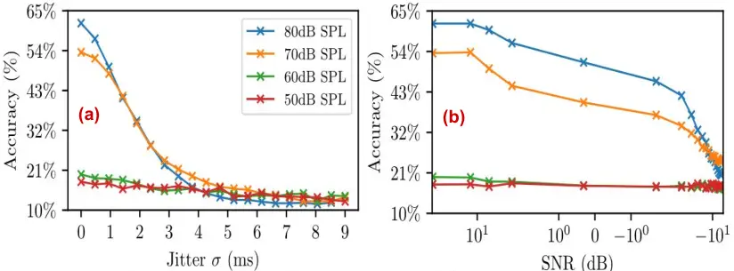

Fig. 12: (a): Classification accuracy vs timing jitter and (b):
Classification accuracy vs injected noise power (SNR).

#### VII-D2 Influence of environment noise

While our controlled setup minimizes extraneous noise, real-world
environments often include overlapping sounds from air-conditioning
units, fans, traffic, or other nearby conversations. These unwanted
vibrations can mask or interfere with the subtle signals the mouse
sensor captures from speech. We sample two signal noises $`\delta_{X}`$
and $`\delta_{Y}`$ from a normal distribution
$`\delta=\mathcal{N}\left(0,\sigma\right)`$ for each triplet
$`\left(\Delta_{T},\Delta_{X},\Delta_{Y}\right)`$, transforming it into
$`\left(\Delta_{T},\Delta_{X}+\delta_{X},\Delta_{Y}+\delta_{Y}\right)`$,
and we measure the accuracy of the trained models, we present the
results in Figure 12(b).

| Related Work             | Sensing Modality | Volume   | Remote | Classification Model | Neural Filtering | Sampling Rate | Resolution | Channel Bitrate | SNR (dB) | Accuracy (%) | STOI |
| ------------------------ | ---------------- | -------- | ------ | -------------------- | ---------------- | ------------- | ---------- | --------------- | -------- | ------------ | ---- |
| Lamphone \[52\]          | Optical          | 75-95dB  |        | \-                   | \-               | 4kHz          | 24 bits    | 48 kbps         | +24dB    | \-           | 0.53 |
| Gyrophone \[50\]         | Mechanical       | 75dB     | ✓      | Dynamic Time Warping | \-               |  200Hz        | 16 bits    | 3.2kbps         | \-       |  26%         | \-   |
| LidarPhone \[64\]        | Laser            | 55-75dB  | ✓      | CNN                  | \-               | 1.8kHz        | 16 bits    | 28.8 kbps       | \-       | 91%          | \-   |
| Visual Microphone \[19\] | Video            | 80-110dB |        | \-                   | \-               | 2.2kHz        | \>10M bits | \>22Mbps        | +30dB    | \-           | \-   |
| mmEavesdropper \[26\]    | Radar            | 60-90dB  |        | LeNet-5              | U-Net            | \-            | \-         | \-              | +17dB    | 93%          | \-   |
| Ours                     | Optical          | 50-80dB  | ✓      | Wave2Vec             | Transformer      | 8kHz          | 1.83 bits  | 14.6 kbps       | +19dB    | 61%          | 0.55 |

TABLE VII: Comparison of major side-channel eavesdropping works,
highlighting the relation between channel capacity and the expected
metrics.

## VIII Related Works

This section outlines the similarities and differences between our
approach and previous studies on sensor side-channel attacks. Table VII
compares our proposed Mic-E-Mouse and related works. We observe that the
experimental metrics across these studies are closely tied to both the
channel’s bitrate and the intrinsic fidelity of its signal. For
instance, the video-based side channel \[19\]—operating at over
22 Mbps—delivers the highest SNR, whereas the optical channel of
Lamphone \[52\] with 48 kbps delivers worse SNR. The Gyrophone \[50\]
with its mechanical channel records the lowest accuracy owing to the low
bitrate at just 3.2 kbps, and the use of Dynamic Time Warping (DTW)
which performs worse than ML based approaches. Given its intermediate
bitrate, Mic-E-Mouse naturally achieves mid-range performance in terms
of the reported metrics

### VIII-A Sensor-based Side-Channels

Sensor-based Side-Channels are an ever-present threat in the modern
digital landscape. Attacks on computer systems via compromised sensor
and peripheral access have been shown to be effective at stealing
privileged information \[27, 25, 42, 51, 5, 15, 32, 38\]. With the
further integration of these technologies into consumer-facing products,
the attack surface is poised to expand significantly. We note that
motion sensors are a source of vulnerabilities as well, allowing for the
reconstruction of stylus input through only the careful observation of
sensor readings \[25\]. By exploiting access to sensor data in a similar
way as the Mic-E-Mouse attack, the extraction of sensitive user data is
feasible in much the same manner as these prior cyber-physical attack
vectors.

Two works closely related to Mic-E-Mouse are LidarPhone and Lamphone. In
LidarPhone, the authors demonstrate how the LiDAR sensor in robotic
vacuum cleaners can detect minute surface deviations caused by air
pressure fluctuations from speech. By interpreting the distance
measurements from the LiDAR laser, they can reconstruct an audio signal
that can be played back as needed. Similarly, Nassi et al. explored the
use of light in Lamphone to detect tiny vibrations in a light bulb
caused by sound waves. By using long-range optics, they measured these
vibrations and filtered the sensor readings to recover the original
sound that caused them.

Portable speakers and headphones are another weak point in the security
model, as audio has been extracted using a magnetic side-channel
attack \[42\]. This is done by targetting in-ear headphones and
headsets, where the magnetic signals from the speaker diaphragm allow
for information leakage. Notably, their method requires physical access
to the victim and their vulnerable audio device. In the Mic-E-Mouse
attack, we describe an attack that does not require physical proximity
to the victim.

Cryptographic security is not immune to these types of attacks
either \[27, 44, 4, 82, 65\]. It has been shown that microphone signals
can be used to decipher RSA keys without physical access to a victim’s
computer \[27\]. This attack exploits the acoustic characteristics of
computers in order to extract privileged data, much like the Mic-E-Mouse
attack. However, the authors use a ground-truth audio signal to extract
cryptographic keys, while we use collected mouse data to reconstruct a
facsimile of a ground truth audio signal.

In \[49\], the authors presented an approach fundamentally different
from our Mic-E-Mouse ⁴⁴ 4 \[49\] was not published at the time of this
paper’s submission, our project [GitHub
Repo](https://github.com/AICPS/Mic-E-Mouse) started in May 2023, and
[Data](https://drive.google.com/drive/folders/1DcTldouupfp7BMteE1Br0lq7RCdQQ0Hc?usp=drive_link)
was public in January 2024. Their method relies on tampering with the
mouse firmware to stream the raw (26x26) pixel image at 7-bit precision.
These images, sampled at 3.7 kHz to reconstruct speech, require a
bitrate of 17.5 Mbps, making the attack highly discoverable and of
limited practical use. Furthermore, their threat model relies on an
auxiliary microphone in the victim’s vicinity to perform full waveform
reconstruction. Thus, Mic-E-Mouse is the first to demonstrate a
practical and truly covert method, one that uniquely uses only standard
user-space x-y coordinate data, which requires no physical or firmware
modifications, and needs no external microphone.

## IX Discussion

### IX-A Phoneme Intelligibility

Figure 13 illustrates the “speech banana” \[53\], covering typical
speech frequencies (200Hz–2000Hz). Our overlay of the pipeline’s
filtered audio waveform confirms that this range corresponds to phoneme
frequency and is thus captured reliably under the Nyquist–Shannon
sampling theorem. Appendix -A provides additional details.

Fig. 13: Phonemes primarily lie between 200Hz–2000Hz, shown here with an
audio waveform overlay.

### IX-B Limitations

Mouse Usage. Frequent or concurrent mouse movements interfere with
sensor inputs, degrading speech reconstruction. We assume limited mouse
usage during sensitive speech (Section III). Additional hardware
modifications (e.g., better motion tracking or noise-cancelation) could
mitigate this.

Surface Materials. Only thin, flexible surfaces effectively transmit
speech vibrations. Rigid or thick surfaces inhibit this side-channel,
limiting broader applicability. Advances in sensor technology and
ML-driven filtering may eventually relax these constraints.

### IX-C Countermeasures

Mouse Pads. Requiring a signal-absorbing mouse pad reduces
vibration-based eavesdropping with minimal user disruption.

Blacklisting Vulnerable Devices. Devices featuring high-performance
optical sensors (e.g., Paw3395, Paw3399) can be banned by IT policies.
This can be automated at the OS level (e.g., via `udev` rules \[75\]) to
de-authorize high-risk USB HID devices.

Approved Peripherals. Institutions and remote workforces can maintain a
curated list of safe mice to prevent the use of susceptible devices.

## X Ethical Considerations

Our research was conducted in a controlled laboratory with consenting
participants. All collected speech data (both live and from existing
datasets) belonged to the authors, and any code related to the
Mic-E-Mouse attack remained in private repositories (i.e., not deployed
to any primary open-source branch). We detail potential defenses
(Section IX-C) to foster awareness of mouse-based eavesdropping risks.

### X-A Responsible Vulnerability Disclosure

We have informed vendors of 26 affected products and the OEM sensor
manufacturer (PixArt Imaging, Inc.) of these vulnerabilities.
Mitigations typically require sensor or firmware updates that limit
side-channel leakage while preserving user experience. We are also
filing a CVE under “CWE-1300: Improper Protection of Physical Side
Channels,” emphasizing the need for strengthened protocols in secure
environments.

## XI Conclusion

The increasing precision of optical mouse sensors has enhanced user
interface performance but also made them vulnerable to side-channel
attacks exploiting their sensitivity. We demonstrate that an adversary
can extract audio from a victim user using commercial mouse sensors
(Paw3395 and Paw3399), without physical access or a microphone. Our
Mic-E-Mouse pipeline enables covert eavesdropping by leveraging
non-uniform resampling, Wiener filtering, and transformer-based neural
network filtering to enhance audio recovery. This multi-stage signal
processing addresses challenges such as heavy quantization, non-uniform
sampling, and high noise levels, producing comprehensible output
signals. Our results highlight the feasibility and effectiveness of
auditory surveillance via optical sensors.

## References

- \[1\] (2023) Ambidextrous esports gaming mouse - razer viper 8khz.
  Razer Inc.. Note: Available at
  [https://www.razer.com/gaming-mice/razer-viper-8khz](https://www.razer.com/gaming-mice/razer-viper-8khz)
  Cited by: §I, §V-A.
- \[2\] G. Amir et al. (2021) Use and perceptions of multi-monitor
  workstations: a natural experiment. In 2021 IEEE/ACM 8th International
  Workshop on Software Engineering Research and Industrial Practice
  (SER&IP), Vol. , pp. 29–36. Cited by: §I.
- \[3\] D. Asonov et al. (2004) Keyboard acoustic emanations. In IEEE
  Symposium on Security and Privacy, 2004. Proceedings. 2004, Vol. ,
  pp. 3–11. Cited by: §I.
- \[4\] F. Aydin et al. (2022) Exposing side-channel leakage of seal
  homomorphic encryption library. In Proceedings of the 2022 Workshop on
  Attacks and Solutions in Hardware Security, ASHES’22, New York, NY,
  USA, pp. 95–100. External Links: ISBN 9781450398848 Cited by: §VIII-A.
- \[5\] Z. Ba et al. (2020) Learning-based practical smartphone
  eavesdropping with built-in accelerometer. Proceedings 2020 Network
  and Distributed System Security Symposium. Cited by: §VIII-A.
- \[6\] A. Baevski et al. (2020) Wav2vec 2.0: a framework for
  self-supervised learning of speech representations. Advances in Neural
  Information Processing Systems (NeurIPS). Cited by: §V-E2.
- \[7\] S. Becker et al. (2023) AudioMNIST: exploring explainable
  artificial intelligence for audio analysis on a simple benchmark.
  Journal of the Franklin Institute. External Links: ISSN 0016-0032
  Cited by: §V-E3.
- \[8\] J. Bishop et al. (2012) Perception of pitch location within a
  speaker’s range: Fundamental frequency, voice quality and speaker sex.
  The Journal of the Acoustical Society of America 132 (2),
  pp. 1100–1112. External Links: ISSN 0001-4966,
  https://pubs.aip.org/asa/jasa/article-pdf/132/2/1100/15302030/1100_1_online.pdf
  Cited by: §IV-B.
- \[9\] Blender Foundation (2023) Blender - free and open 3d creation
  software. External Links: [Link](https://blender.org) Cited by:
  §III-A1.
- \[10\] (2023) BNC database and word frequency lists. Oxford
  University Press. Cited by: §-A.
- \[11\] B. Boudaoud et al. (2023) Mouse sensitivity in first-person
  targeting tasks. IEEE Transactions on Games 15 (4), pp. 493–506. Cited
  by: §II-A.
- \[12\] R. N. Bracewell et al. (1986) The fourier transform and its
  applications. Vol. 31999, McGraw-Hill New York. Cited by: §II-A.
- \[13\] M. Chammas and F. Pain (2022) Synthetic exposure with a cmos
  camera for multiple exposure speckle imaging of blood flow. Scientific
  Reports 12 (1), pp. 4708. External Links: ISSN 2045-2322 Cited by:
  §II-A.
- \[14\] J. Chen et al. (2006) New insights into the noise reduction
  wiener filter. IEEE Transactions on Audio, Speech, and Language
  Processing 14 (4), pp. 1218–1234. Cited by: §V-D.
- \[15\] W. Chen et al. (2022) Acoustic eavesdropping from passive
  vibrations via mmwave signals. In GLOBECOM 2022 - 2022 IEEE Global
  Communications Conference, Vol. , pp. 4051–4056. Cited by: §VIII-A.
- \[16\] Cmloegcmluin (2012) Relative frequencies of english phonemes.
  External Links:
  [Link](https://cmloegcmluin.wordpress.com/2012/11/10/relative-frequencies-of-english-phonemes/)
  Cited by: §-A.
- \[17\] W.T. Cochran et al. (1967) What is the fast fourier transform?.
  Proceedings of the IEEE 55 (10), pp. 1664–1674. Cited by: §II-A.
- \[18\] (2023) Darmoshark-m3-4k gaming mouse. Darmoshark. Note:
  Available at
  [http://darmoshark.cn/WIRELESSGAMINGMOUSE/53.html](http://darmoshark.cn/WIRELESSGAMINGMOUSE/53.html)
  Cited by: §I, §I, §V-A.
- \[19\] A. Davis et al. (2014) The visual microphone: passive recovery
  of sound from video. ACM Transactions on Graphics (Proc. SIGGRAPH) 33
  (4), pp. 79:1–79:10. Cited by: TABLE VII, §VIII.
- \[20\] R. Dumitru et al. (2023) The impostor among US(B): Off-Path
  injection attacks on USB communications. In 32nd USENIX Security
  Symposium (USENIX Security 23), Anaheim, CA, pp. 5863–5880. External
  Links: ISBN 978-1-939133-37-3 Cited by: §I.
- \[21\] A. El Gamal et al. (2005) CMOS image sensors. IEEE Circuits and
  Devices Magazine 21 (3), pp. 6–20. Cited by: §II-A.
- \[22\] Y.C. Eldar et al. (2000) Filterbank reconstruction of
  bandlimited signals from nonuniform and generalized samples. Trans.
  Sig. Proc. 48 (10), pp. 2864–2875. External Links: ISSN 1053-587X
  Cited by: §V-C.
- \[23\] Epic Games Unreal engine. Note:
  [https://www.unrealengine.com](https://www.unrealengine.com) Cited by:
  §II-B2.
- \[24\] R. Fares et al. (2013) Can we beat the mouse with magic?. In
  Proceedings of the SIGCHI Conference on Human Factors in Computing
  Systems, CHI ’13, New York, NY, USA, pp. 1387–1390. External Links:
  ISBN 9781450318990 Cited by: §I.
- \[25\] H. Farrukh et al. (2021) S3: side-channel attack on stylus
  pencil through sensors. Proc. ACM Interact. Mob. Wearable Ubiquitous
  Technol. 5 (1). Cited by: §I, §VIII-A.
- \[26\] Y. Feng et al. (2023) MmEavesdropper: signal augmentation-based
  directional eavesdropping with mmwave radar. In IEEE INFOCOM 2023 -
  IEEE Conference on Computer Communications, Vol. , pp. 1–10. Cited by:
  TABLE VII.
- \[27\] D. Genkin et al. (2017) Acoustic cryptanalysis. J. Cryptol. 30
  (2), pp. 392–443. External Links: ISSN 0933-2790 Cited by: §VIII-A,
  §VIII-A.
- \[28\] D. Genkin et al. (2022) Lend me your ear: passive remote
  physical side channels on PCs. In 31st USENIX Security Symposium
  (USENIX Security 22), Boston, MA, pp. 4437–4454. External Links: ISBN
  978-1-939133-31-1 Cited by: §I.
- \[29\] GNOME Project (2024) GTK: the gimp toolkit. External Links:
  [Link](https://www.gtk.org/) Cited by: §II-B2.
- \[30\] G. B. Gordon et al. (2001) Proximity detector for a seeing-eye
  mouse. US Patent & Trademark Office. Note: US Patent 6,281,882
  External Links:
  [Link](https://image-ppubs.uspto.gov/dirsearch-public/print/downloadPdf/6281882)
  Cited by: §II-A, §IV-A1.
- \[31\] F. L. Hopper et al. (1941) Determination of microphone
  performance. Journal of the Society of Motion Picture Engineers 36
  (4), pp. 341–354. Cited by: §IV-A.
- \[32\] P. Hu et al. (2022) MILLIEAR: millimeter-wave acoustic
  eavesdropping with unconstrained vocabulary. In IEEE INFOCOM 2022 -
  IEEE Conference on Computer Communications, Vol. , pp. 11–20. Cited
  by: §VIII-A.
- \[33\] R. E. Kalman (1960) A New Approach to Linear Filtering and
  Prediction Problems. Journal of Basic Engineering 82 (1), pp. 35–45.
  External Links: ISSN 0021-9223,
  https://asmedigitalcollection.asme.org/fluidsengineering/article-pdf/82/1/35/5518977/35_1.pdf
  Cited by: §II-A.
- \[34\] KDE (2023) Kdenlive - video editing freedom. External Links:
  [Link](https://kdenlive.org) Cited by: §III-A1.
- \[35\] KDE (2023) Krita \| digital painting. creative freedom..
  External Links: [Link](https://krita.org) Cited by: §III-A1.
- \[36\] A. Klinefelter et al. (2021) SE2: going remote: challenges and
  opportunities to remote learning, work, and collaboration. In 2021
  IEEE International Solid-State Circuits Conference (ISSCC), Vol. 64,
  pp. 539–540. Cited by: §I.
- \[37\] B. L. Kodak et al. (2023) FeelPen: a haptic stylus displaying
  multimodal texture feels on touchscreens. IEEE/ASME Transactions on
  Mechatronics 28 (5), pp. 2930–2940. Cited by: §I.
- \[38\] A. Kwong et al. (2019) Hard drive of hearing: disks that
  eavesdrop with a synthesized microphone. In 2019 IEEE Symposium on
  Security and Privacy (SP), Vol. , pp. 905–919. Cited by: §I, §VIII-A.
- \[39\] S. Lantinga (2024) SDL: simple directmedia layer. SDL. External
  Links: [Link](https://www.libsdl.org/) Cited by: §II-B2.
- \[40\] G. Li et al. (2023) EchoAttack: practical inaudible attacks to
  smart earbuds. In Proceedings of the 21st Annual International
  Conference on Mobile Systems, Applications and Services, MobiSys ’23,
  New York, NY, USA, pp. 383–396. External Links: ISBN 9798400701108
  Cited by: §I.
- \[41\] Q. Li et al. (2015) Kalman filter and its application. In 2015
  8th International Conference on Intelligent Networks and Intelligent
  Systems (ICINIS), Vol. , pp. 74–77. Cited by: §II-A.
- \[42\] Q. Liao et al. (2022) MagEar: eavesdropping via audio recovery
  using magnetic side channel. In Proceedings of the 20th Annual
  International Conference on Mobile Systems, Applications and Services,
  MobiSys ’22, New York, NY, USA, pp. 371–383. External Links: ISBN
  9781450391856 Cited by: §VIII-A, §VIII-A.
- \[43\] J. Lim (1986) Speech enhancement. In ICASSP ’86. IEEE
  International Conference on Acoustics, Speech, and Signal Processing,
  Vol. 11, pp. 3135–3142. Cited by: §V-E1.
- \[44\] C. Liu et al. (2022) Frequency throttling side-channel attack.
  In Proceedings of the 2022 ACM SIGSAC Conference on Computer and
  Communications Security, CCS ’22, New York, NY, USA, pp. 1977–1991.
  External Links: ISBN 9781450394505 Cited by: §VIII-A.
- \[45\] Y. Liu et al. (2020) MagHacker: eavesdropping on stylus pen
  writing via magnetic sensing from commodity mobile devices. In
  Proceedings of the 18th International Conference on Mobile Systems,
  Applications, and Services, MobiSys ’20, New York, NY, USA,
  pp. 148–160. External Links: ISBN 9781450379540 Cited by: §I.
- \[46\] (2023) LowLevelMouseProc callback function - win32 apps \|
  microsoft learn. Microsoft Corporation. Cited by: §II-B1.
- \[47\] G. Marcu (2005) Optimizing color performance for lcd computer
  monitors. In IEEE International Conference on Image Processing 2005,
  Vol. 2, pp. II–1. Cited by: §I.
- \[48\] Mátyás Mustoha (2023) OpenBlok: a customizable, cross platform,
  open-source falling block game, packed with a bunch of features..
  External Links: [Link](https://github.com/mmatyas/openblok) Cited by:
  §III-A2.
- \[49\] Z. Mei, D. Dai, J. Tong, Z. Gong, and L. Yang (2025)
  Repurposing optical mice for acoustic eavesdropping. In IEEE INFOCOM
  2025 - IEEE Conference on Computer Communications, Vol. , pp. 1–10.
  External Links:
  [Document](https://dx.doi.org/10.1109/INFOCOM55648.2025.11044584)
  Cited by: §VIII-A, footnote 4.
- \[50\] Y. Michalevsky et al. (2014) Gyrophone: recognizing speech from
  gyroscope signals. In 23rd USENIX Security Symposium (USENIX Security
  14), San Diego, CA, pp. 1053–1067. External Links: ISBN
  978-1-931971-15-7 Cited by: §III, TABLE VII, §VIII.
- \[51\] Y. Michalevsky et al. (2014) Gyrophone: recognizing speech from
  gyroscope signals. In 23rd USENIX Security Symposium (USENIX Security
  14), San Diego, CA, pp. 1053–1067. External Links: ISBN
  978-1-931971-15-7 Cited by: §VIII-A.
- \[52\] B. Nassi et al. (2022) Lamphone: passive sound recovery from a
  desk lamp’s light bulb vibrations. In 31st USENIX Security Symposium
  (USENIX Security 22), Boston, MA, pp. 4401–4417. External Links: ISBN
  978-1-939133-31-1 Cited by: §III, TABLE VII, §VIII.
- \[53\] New Jersey Speech-Language-Hearing Association (2021) The
  speech banana. External Links:
  [Link](https://www.njsha.org/pdfs/hearing-speech-banana.pdf) Cited by:
  §-A, §-A, §IV-B, §IX-A.
- \[54\] E. Ng et al. (1998) Improvements to a pen-based musical input
  system. In Proceedings 1998 Australasian Computer Human Interaction
  Conference. OzCHI’98 (Cat. No.98EX234), Vol. , pp. 178–185. Cited by:
  §I.
- \[55\] B. Obada-Obieh et al. (2021) Challenges and threats of mass
  telecommuting: a qualitative study of workers. In Seventeenth
  Symposium on Usable Privacy and Security (SOUPS 2021), pp. 675–694.
  External Links: ISBN 978-1-939133-25-0 Cited by: §I.
- \[56\] J. Palacin et al. (2006) The optical mouse for indoor mobile
  robot odometry measurement. Sensors and Actuators A: Physical 126 (1),
  pp. 141–147. External Links: ISSN 0924-4247 Cited by: §II-A.
- \[57\] Y. H. Pang et al. (2019) Effects of gain and index of
  difficulty on mouse movement time and fitts’ law. IEEE Transactions on
  Human-Machine Systems 49 (6), pp. 684–691. Cited by: §II-A.
- \[58\] (2023) PixArt imaging inc. - paw3395dm-t6qu. PixArt Imaging,
  Inc., 1263 Oakmead Parkway, Suite 200 Sunnyvale, CA 94085, U.S.A.
  Note: Available at
  [https://www.pixart.com/products-detail/130/PAW3399DM-T4QU](https://www.pixart.com/products-detail/130/PAW3399DM-T4QU)
  Cited by: §V-A.
- \[59\] (2023) PixArt imaging inc. - paw3399dm-t4qu. PixArt Imaging,
  Inc., 1263 Oakmead Parkway, Suite 200 Sunnyvale, CA 94085, U.S.A.
  Note: Available at
  [https://www.pixart.com/products-detail/129/PAW3395DM-T6QU](https://www.pixart.com/products-detail/129/PAW3395DM-T6QU)
  Cited by: §V-A.
- \[60\] C. Plapous et al. (2006) Improved signal-to-noise ratio
  estimation for speech enhancement. IEEE transactions on audio, speech,
  and language processing 14 (6), pp. 2098–2108. Cited by: 3rd item.
- \[61\] A. Radford et al. (2023) Robust speech recognition via
  large-scale weak supervision. In Proceedings of the 40th International
  Conference on Machine Learning, ICML’23. Cited by: §V-E1.
- \[62\] Razer, Inc. (2023) Razer reports full year 2021 earnings.
  External Links:
  [Link](https://press.razer.com/company-news/razer-reports-full-year-2021-earnings/)
  Cited by: §-B.
- \[63\] A.W. Rix et al. (2001) Perceptual evaluation of speech quality
  (pesq)-a new method for speech quality assessment of telephone
  networks and codecs. In 2001 IEEE International Conference on
  Acoustics, Speech, and Signal Processing. Proceedings (Cat.
  No.01CH37221), Vol. 2, pp. 749–752 vol.2. Cited by: 2nd item.
- \[64\] S. Sami et al. (2020) Spying with your robot vacuum cleaner:
  eavesdropping via lidar sensors. In Proceedings of the 18th Conference
  on Embedded Networked Sensor Systems, SenSys ’20, New York, NY, USA,
  pp. 354–367. External Links: ISBN 9781450375900 Cited by: §III, TABLE
  VII.
- \[65\] D. Schepers et al. (2019) Practical side-channel attacks
  against wpa-tkip. In Proceedings of the 2019 ACM Asia Conference on
  Computer and Communications Security, Asia CCS ’19, New York, NY, USA,
  pp. 415–426. External Links: ISBN 9781450367523 Cited by: §VIII-A.
- \[66\] C.E. Shannon (1949) Communication in the presence of noise.
  Proceedings of the IRE 37 (1), pp. 10–21. Cited by: §-A, §-A, §IV-A2.
- \[67\] (2020) Sounds of speech -
  toolsforschools-sounds-of-speech-flyer.pdf. Advanced Bionics, LLC.
  Cited by: §-A.
- \[68\] G. W. Stachowiak et al. (2004) 6 - characterization of test
  specimens. In Experimental Methods in Tribology, G. W. Stachowiak et
  al. (Eds.), Tribology Series, Vol. 44, pp. 115–150. External Links:
  ISSN 0167-8922 Cited by: §II-A.
- \[69\] I. Sutskever et al. (2014) Sequence to sequence learning with
  neural networks. In Advances in Neural Information Processing
  Systems, Z. Ghahramani et al. (Eds.), Vol. 27, pp. . Cited by: §V-E1.
- \[70\] C. H. Taal et al. (2011) An algorithm for intelligibility
  prediction of time–frequency weighted noisy speech. IEEE Transactions
  on Audio, Speech, and Language Processing 19 (7), pp. 2125–2136. Cited
  by: 1st item.
- \[71\] TBRC Business Research PVT LTD (2022) Companies in the computer
  mouse market are introducing the biometric mouse to improve data
  security and user privacy as per the business research company’s mouse
  global market report 2022. External Links:
  [Link](https://www.globenewswire.com/news-release/2022/07/20/2482984/0/en/Companies-In-The-Computer-Mouse-Market-Are-Introducing-The-Biometric-Mouse-To-Improve-Data-Security-And-User-Privacy-As-Per-The-Business-Research-Company-s-Mouse-Global-Market-Repo.html)
  Cited by: §-B.
- \[72\] (2023) The cmu pronouncing dictionary. Carnegie Mellon
  University. Cited by: §-A.
- \[73\] The PyGame Community PyGame. Note:
  [https://www.pygame.org](https://www.pygame.org) Cited by: §II-B2.
- \[74\] The Qt Company (2024) Qt: a cross-platform application
  framework. External Links: [Link](https://www.qt.io/) Cited by:
  §II-B2.
- \[75\] (2023) Udev(7) linux user manual. Linux Foundation. Cited by:
  §IX-C.
- \[76\] Unity Technologies Unity game engine. Note:
  [https://unity.com](https://unity.com) Cited by: §II-B2.
- \[77\] A. Vaswani, N. Shazeer, N. Parmar, J. Uszkoreit, L.
  Jones, A. N. Gomez, L. Kaiser, and I. Polosukhin (2017) Attention is
  all you need. CoRR abs/1706.03762. External Links: 1706.03762 Cited
  by: §V-E1.
- \[78\] C. Veaux et al. (2017) CSTR vctk corpus: english multi-speaker
  corpus for cstr voice cloning toolkit. University of Edinburgh. The
  Centre for Speech Technology Research (CSTR) 6, pp. 15. Cited by:
  §V-E3.
- \[79\] N. Wiener (1949) “Extrapolation, interpolation, and smoothing
  of stationary time series: with engineering applications”. The MIT
  Press. External Links: ISBN 9780262257190,
  https://direct.mit.edu/book-pdf/2161108/book_9780262257190.pdf Cited
  by: §V-D.
- \[80\] W. Xiang et al. (2021) A 3d mouse design based on a three-axis
  acceleration gyroscope. In 2021 International Conference on
  Networking, Communications and Information Technology (NetCIT), Vol. ,
  pp. 167–171. Cited by: §I.
- \[81\] Xyrem (2023) In-depth analysis on valorant’s guarded regions.
  External Links: [Link](https://reversing.info/posts/guardedregions/)
  Cited by: §III-A2.
- \[82\] Y. Zhang et al. (2012) Cross-vm side channels and their use to
  extract private keys. In Proceedings of the 2012 ACM Conference on
  Computer and Communications Security, CCS ’12, New York, NY, USA,
  pp. 305–316. External Links: ISBN 9781450316514 Cited by: §VIII-A.
- \[83\] T. Zhu et al. (2014) Context-free attacks using keyboard
  acoustic emanations. In Proceedings of the 2014 ACM SIGSAC Conference
  on Computer and Communications Security, CCS ’14, New York, NY, USA,
  pp. 453–464. External Links: ISBN 9781450329576 Cited by: §I.

### -A The "Speech Banana"

We note that certain high-frequency phonemes–or perceptually distinct
units of sound–such as f, s, and th are significantly less
distinguishable to our human evaluators. An explanation is derived from
two important concepts – (1) the Nyquist-Shannon sampling theorem
\[66\], and (2) a mapping of common phonemes to loudness and frequency
characteristics \[53\]. In Figure 13, we illustrate how the polling rate
affects the intelligibility of selected high-frequency phonemes in the
recovered audio waveform.

When a continuous-time signal is sampled at a rate less than double its
highest frequency component, the resultant discrete waveform is not able
to accurately represent the original continuous-time signal \[66\]. For
a sensor with a sample rate $`F_{s}`$ of 8KHz, we can obtain a useful
discrete-time signal with maximum frequency up to $`F_{s}/2`$, or 4KHz.
Similarly, for a 4KHz sensor, the maximum recoverable frequency then
drops to 2KHz. Notably, the f, s, and th phonemes have a characteristic
frequency higher than even the Nyquist frequency for the 8KHz sensors.
Moreover, these phonemes also have a below average loudness
characteristic, further contributing to the low intelligibility observed
by our human testers.

Fig. 14: The distribution of phonemes and their associated minimum
polling rate.

We also note that the overwhelming majority (91.18%) of phonemes in the
English language are within the frequency range of the 8KHz sensor, and
a significant portion (80.09%) is still within the frequency range of
the 4KHz sensor \[72, 16, 10, 67, 53\]. These percentages are based
solely from the theoretical lower bound on required sampling frequency
obtained from the Nyquist-Shannon sampling theorem. In fact, we can see
empirical evidence of this in Figure 13, where the filtered signal
strength drops off noticeably after the Nyquist frequency. Notably, even
for a mouse with a 1KHz sensor, 42.47% of phonemes are within this upper
bound. The full distribution of phoneme prevalence versus required
polling rate is shown in Figure 14.

### -B Additional Vulnerable Mice

increasing vulnerability

| Vendor/Model                 | Sensor  | DPI    | IPS | Polling Rate (Hz) | Unit Price (USD) | Reconstruction^(∗) |
| ---------------------------- | ------- | ------ | --- | ----------------- | ---------------- | ------------------ |
| Razer Viper 8KHz             | Paw3399 | 20,000 | 650 | 8,000             | \$50             | 91.18%             |
| Darmoshark M3                | Paw3395 | 26,000 | 650 | 4,000             | \$45             | 80.09%             |
| Darmoshark M34K              | Paw3395 | 26,000 | 650 | 4,000             | \$65             | 80.09%             |
| DeLUX M800 Ultra             | Paw3395 | 26,000 | 650 | 4,000             | \$60             | 80.09%             |
| Pulsar Gaming Gears X2H Mini | Paw3395 | 26,000 | 650 | 4,000             | \$100            | 80.09%             |
| Rapoo VT3S                   | Paw3395 | 26,000 | 650 | 4,000             | \$55             | 80.09%             |
| ThundeRobot ML901            | Paw3395 | 26,000 | 650 | 4,000             | \$60             | 80.09%             |
| ThundeRobot ML903            | Paw3395 | 26,000 | 650 | 4,000             | \$80             | 80.09%             |
| VGN Dragonfly F1             | Paw3395 | 26,000 | 650 | 4,000             | \$35             | 80.09%             |
| Zaopin Z1 Pro                | Paw3395 | 26,000 | 650 | 4,000             | \$50             | 80.09%             |
| G-Wolves Hati S Plus         | Paw3399 | 20,000 | 650 | 4,000             | \$160            | 80.09%             |
| AtomPalm Hydrogen            | Paw3360 | 12,000 | 250 | 8,000             | \$100            | 91.18%             |
| AtomPalm Hydrogen 2          | Paw3360 | 12,000 | 250 | 8,000             | \$100            | 91.18%             |
| Zaunkoenig M2K               | Paw3360 | 12,000 | 250 | 8,000             | \$350            | 91.18%             |
| Darmoshark N3                | Paw3395 | 26,000 | 650 | 1,000             | \$40             | 42.47%             |
| DeLUX M800 Pro               | Paw3395 | 26,000 | 650 | 1,000             | \$50             | 42.47%             |
| Glorious Model O 2           | Paw3395 | 26,000 | 650 | 1,000             | \$65             | 42.47%             |
| Keychron M3                  | Paw3395 | 26,000 | 650 | 1,000             | \$55             | 42.47%             |
| Redragon M994                | Paw3395 | 26,000 | 650 | 1,000             | \$35             | 42.47%             |
| Edifier Hecate G3M Pro       | Paw3399 | 20,000 | 650 | 1,000             | \$70             | 42.47%             |
| Razer Basilisk V2            | Paw3399 | 20,000 | 650 | 1,000             | \$40             | 42.47%             |
| Razer Basilisk V3            | Paw3399 | 20,000 | 650 | 1,000             | \$80             | 42.47%             |
| Razer Basilisk Ultimate      | Paw3399 | 20,000 | 650 | 1,000             | \$105            | 42.47%             |
| Razer DeathAdder V2          | Paw3399 | 20,000 | 650 | 1,000             | \$25             | 42.47%             |
| Razer DeathAdder V2 Pro      | Paw3399 | 20,000 | 650 | 1,000             | \$70             | 42.47%             |
| Razer Viper Ultimate         | Paw3399 | 20,000 | 650 | 1,000             | \$160            | 42.47%             |

TABLE VIII: An expanded selection of vulnerable mice (Red: DPI & Poll
Rate, Orange: Poll Rate only, Yellow: DPI only)

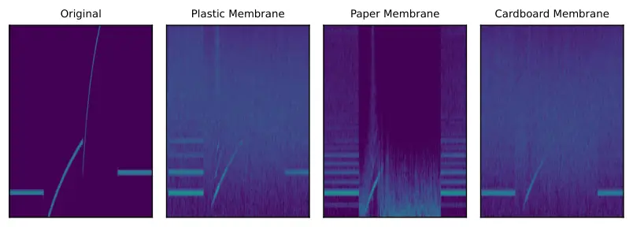

Fig. 15: Comparison of the sweep response for the three selected
membranes.

A list of similar mice that are also vulnerable to the same class of
exploit as the Razer and Darmoshark is presented in Table VIII. These
additional mice share at least one of the following attributes: (1) a
Paw3395 or Paw3399 sensor or (2) a polling rate at or above 4KHz. We
list sensors with a 4KHz or 8KHz. Table VIII is ordered first by sensor
vulnerability exposure and then alphabetically. Note that the asterisk
in the last column of the table represents the theoretical upper bound
on reconstruction percentage as shown in Appendix -A. This
reconstruction percentage is based on the polling rate of the sensor,
whereas the overall vulnerability rating takes into account multiple
other factors such as DPI, IPS, etc.

One important consideration is that certain mouse vendors market the
sensors by using brand-specific names. An example of this is Razer using
the brand name Focus+ in lieu of the actual sensor used– he Paw3399. A
similar case applies to Glorious Gaming’s BAMF2.0, which is a derivative
of the Paw3395 sensor. We consider this kind of sensors as derivatives
of the original PixArt Imaging sensors in our analysis and discussion.
Table VIII shows a list of 26 unique products using either the Paw3395
or Paw3399 sensors sorted according to their potential susceptibility to
our attack.

We note the large size of the computer hardware market validates the
growing ubiquity of these high-performance mice with state-of-the-art
optical sensors. For example, Razer had total hardware sales of
US\$1,452.4 million during Fiscal Year 2021 \[62\], including desktops,
laptops, and other computing equipment. For further evidence of the
growing market demand, it’s anticipated that the global market for
computer mice will increase to US\$2.61 billion by the end of 2023, with
a Compounded Annual Growth Rate (CAGR) of 8.1% \[71\]. Then, it’s clear
that this type of high-performance mouse sensors will become more
pervasive over time.

### -C Full Membrane Study

We present a sweep response for various types of membranes, including
paper, plastic, and cardboard. These are a representative sample of
common types of surfaces a mouse may be placed on in a real-world
environment. The sweep response, along with a comparison to the ground
truth signal is presented in Figure 15. The different responses are
mainly attributed to three properties:

- •
  The thickness $`W`$ of the material significantly influences acoustic
  absorption and reflection. Thicker materials exhibit high sound
  absorption, leading to a dampened sweep response, whereas thinner
  materials may reflect sound more efficiently, resulting in an
  accentuated response.
- •
  The density $`\rho`$ of the material dictates both the energy needed
  to vibrate the surface, as well as the momentum it carries before the
  signal dies down. Lighter materials, such as paper, are mismatched
  with the ambient noise and only acquire the injected sounds.
- •
  The speed of sound in the material $`\nu`$. Materials with a higher
  $`\nu`$ facilitate rapid sound transmission, potentially yielding a
  less distorted response. In contrast, materials with a lower $`\nu`$
  can delay wave propagation, altering the phase and amplitude response
  in the sweep.

Modeling the complete response given material properties is not trivial,
given the existence of standing waves, non-linear responses, elastic
attenuation, and potentially other physical phenomenon. However, we
notice that these differences are mainly translated in two aspects in
the extracted signals:

- •
  Harmonics: The emergence of 2nd and 3rd order harmonics in plastic and
  paper membranes suggests signal degradation. Nonetheless, this
  redundancy in frequency acquisition offers a compensatory mechanism,
  providing machine learning models with a ’second chance’ to discern
  the underlying signal.
- •
  The noise profile: The susceptibility to random noise varies
  significantly across materials. Notably, the paper membrane displays a
  distinct response, characterized by its ’quietness’ in the sweep. This
  is attributed to a minimal presence of standing waves and rapid energy
  dissipation, owing to paper’s low momentum energy, in contrast to
  cardboard and plastic.
