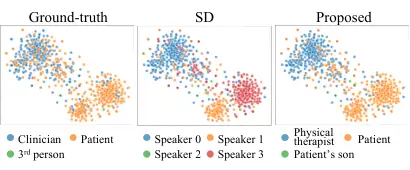

# From Who Said What to Who They Are: Modular Training-free Identity-Aware LLM Refinement of Speaker Diarization

Yu-Wen Chen    William Ho    Maxim Topaz    Julia Hirschberg    Zoran
Kostic ^(†)^(†)thanks: \$ˆ†\$These authors contributed equally.

###### Abstract

Speaker diarization (SD) remains challenging in real-world scenarios due
to dynamic environments and unknown speaker numbers. SD is rarely used
alone and is typically paired with automatic speech recognition (ASR).
However, existing non-modular SD+ASR frameworks lack flexibility and do
not provide true speaker identities. We propose a training-free modular
pipeline combining off-the-shelf SD, ASR, and a large language model
(LLM) to determine who spoke, what was said, and who they are. Using
structured LLM prompting on reconciled SD and ASR outputs, our method
leverages semantic continuity in conversational context to refine
low-confidence speaker labels and assigns role identities while
correcting split speakers. On a real-world patient-clinician dataset,
our approach achieves a 29.7% relative error reduction over baseline
reconciled SD and ASR. It enhances diarization performance without
additional training and delivers a complete pipeline for SD, ASR, and
speaker identity detection in practical applications.

###### Index Terms: 

speaker diarization, speaker-attributed ASR, identity detection, large
language model application

^(†)^(†)address: ¹The Fu Foundation School of Engineering and Applied
Science, Columbia University, United States  
²School of Nursing, Columbia University, United States

## 1 Introduction

Speaker diarization (SD) identifies “who spoke when” in an audio
recording \[17\]. While diarization models perform well in controlled
environments, they face persistent challenges in real-world
conditions \[18\]. An SD system relying solely on acoustic cues is
highly vulnerable to environmental variations, such as changes in a
speaker’s voice when moving between rooms or interference from
background noise such as a television. Also, most SD systems require
specifying the maximum number of speakers, a setting highly sensitive in
uncontrolled environments: over-estimation can split one speaker into
distinct speakers, while under-estimation can merge different speakers
into one. In practice, SD is rarely used alone. Most applications
require not only knowing who spoke and when, but also what was said.
Therefore, SD is commonly integrated with automatic speech recognition
(ASR). Several studies have explored end-to-end joint training of ASR
and SD models \[19, 13, 22, 5\]. Beyond a record of spoken words, ASR
transcripts also capture semantic information that can supplement SD.
More recently, advances in large language models (LLMs) have further
enhanced diarization by leveraging their strong semantic
understanding \[15, 9, 24, 4\].

Most prior methods employ end-to-end systems that integrate SD with ASR
or LLMs. However, keeping these components as separate modules (i.e., a
modular approach) offers several advantages, yet studies focusing on
this design remain relatively limited. Modularization enables
independent development and deployment, as ASR and SD systems are often
trained on different datasets and developed by separate teams. It
enables flexible, scalable integration of any ASR system providing word
timings with diverse SD models. Moreover, joint modeling may degrade
ASR, making modular architectures preferable for accurate transcription.
Building on this insight, recent studies have proposed using a
reconciliation or orchestration module to combine ASR and SD outputs,
followed by LLM-based post-processing to address mismatches between the
two. For example, \[20\] leveraged LLMs to refine SD outputs,
while \[12\] augmented an acoustic-based SD system with lexical
information from an LLM. These studies demonstrate the potential of LLMs
to enhance speaker diarization through post-processing. However,
existing approaches involved fine-tuning LLMs for speaker diarization.
This process requires additional training effort, and the resulting
performance is highly influenced by the distribution of the fine-tuning
data, raising concerns about the model’s ability to generalize to
out-of-domain scenarios. In contrast, leveraging general-purpose LLMs
for speaker diarization without task-specific fine-tuning remains
largely underexplored. Also, prior modular approaches do not consider
identity detection, even though assigning generic labels such as _spk0_
or _spk1_, rather than speaker identities like patient or clinician, is
often insufficient in real-world scenarios.

In this study, we propose a training-free modular SD+ ASR+LLM pipeline
that processes audio recordings to determine who spoke, when they spoke,
what was said, and the identity of each speaker. Initial diarization and
transcription alignments are generated using independent SD and ASR
models, followed by leveraging a general LLM to improve diarization. The
LLM suggests speaker labels for low-confidence segments using semantic
context and infers speaker identities based on the entire conversation.
This identity information, which is critical for downstream tasks, is
found to be helpful for mitigating speaker-splitting errors that can
significantly degrade SD performance in real-world settings, such as
home healthcare recordings. Experimental results show that the proposed
method improves diarization results with both open-source and commercial
LLMs. The modular design of the proposed pipeline effectively leverages
existing SD and ASR models from independent research without additional
training, avoiding issues related to limited data availability and
domain mismatch that can arise when SD, ASR, and role identification
models are trained end-to-end.

## 2 Proposed method

We select SD and ASR models that provide timestamps, allowing alignment
between their outputs. We then introduce two approaches that directly
leverage a general LLM to refine the initial SD+ASR results: (1)
context-aware speaker label correction for addressing minor
mis-assignments, and (2) identity detection for resolving major
speaker-splitting errors. Details are presented below.

### 2.1 Initial diarization and transcription

We first run SD on the raw recording to obtain diarization segments and
apply ASR to generate transcripts with word-level timestamps. To
reconcile SD and ASR (denoted as SD+ASR), we match ASR words whose start
times fall within the duration of each diarization segment. Mismatches
arise in two cases: (1) an ASR word cannot be mapped to any diarization
segment, in which case we create a new segment using the ASR timestamp
and label it as an _Unknown_ speaker; (2) a diarization segment contains
no ASR-recognized words, resulting in an empty transcript. We then
re-run ASR on these mismatched segments. Segments labeled as _Unknown_
are retained only if the re-run ASR transcript is highly similar to the
original (Levenshtein similarity $`\geq`$ 0.9), while empty segments are
kept only if the ASR model recognizes at least one word in the
reprocessing.

### 2.2 Context-aware speaker label correction

Unlike previous studies that feed the entire conversation sequence into
an LLM (e.g., \<spk1\> How are you doing \<spk2\> today? Good. …), we
employ a segment-level approach. At each step, the LLM is prompted to
predict the speaker label of an SD segment (denoted as the LLM label).
This segment-level approach avoids the difficulties with mapping
whole-conversation-level outputs back to the original time alignment. We
provide the LLM with each segment’s context and surrounding time gaps
(Fig. 1). Time-gap information is included because prior work has shown
that LLMs can interpret temporal cues in text, such as assessing phrase
breaks \[21\].

Considering the cost of LLM inference, we apply context-aware speaker
label correction only to segments with low confidence. We compute each
diarization segment’s speaker embedding and retrieve the top-k most
similar segments in the same recording. Re-verified speaker labels are
assigned based on the majority of speaker labels among these similar
segments. Segments where the re-verified label differs from the original
label are marked as low acoustic confidence. Words in
low-acoustic-confidence segments, along with those labeled as  *Unknown*
in the initial step, are further processed using an LLM.

Figure 1: Illustration of LLM prompt for context-aware speaker label
correction.

### 2.3 Identity detection

Acoustic variations arising from environmental changes during a
conversation can cause SD systems to erroneously split a single speaker
into multiple pseudo-speaker labels. For example, shifts in a speaker’s
position relative to the microphone can introduce noticeable acoustic
variations, leading the SD system to incorrectly infer the presence of a
new speaker. Such errors can substantially degrade diarization
performance, as long contiguous segments are mis-attributed to different
speakers. However, the semantic coherence of the discourse often
suggests that the speaker’s identity remains consistent despite acoustic
variability, offering valuable cues for resolving these errors.

We use an LLM to assign an identity to each speaker based on the full
transcript and initial diarization labels. The prompt used is: _“You are
given a conversation with speaker labels. Your task is to assign an
identity to each speaker. If different original speaker labels refer to
the same person, merge them by assigning the same identity, but only do
this if you are very sure.”_ The LLM outputs a dictionary mapping each
speaker label to an identity. For example, if both _spk0_ and _spk1_ are
mapped to _Patient_, it indicates that _spk1_ was erroneously split from
the same speaker as _spk0_. This allows us to detect cases where a
single speaker has been mistakenly split into multiple labels and also
provides the identity information needed for downstream tasks.

### 2.4 Final aggregation

We integrate the results of initial diarization, acoustic
reverification, LLM speaker labeling, and identity mapping. The
pseudo-code is shown in Algorithm 1. Finally, duplicated or nested
segments are removed.

1:  for each diarization_segment do

2:   if original_label == _”Unknown”_ then

3:    if LLM not confident or llm_label == _”Unknown”_ then

4:     continue

5:    else

6:     final_label = map_identity\[llm_label\]

7:    end if

8:   else if original_label == reverified_label or LLM not confident
then

9:    final_label = map_identity\[original_label\]

10:   else

11:    final_label = MAJORITY_VOTE(

12:         map_identity\[original_label\],

13:         map_identity\[llm_label\],

14:         map_identity\[reverified_label\])

15:   end if

16:  end for

Algorithm 1 Final aggregation

## 3 Experimental setup

### 3.1 Data

Clinician–patient conversation data: Under IRB approval, we collected
clinician–patient conversations single-channel (48 kHz) audio recordings
from real-world health home-care visits, which were then resampled to 16
kHz. We manually annotated ten samples (13.6–34.1 min, average 24.9 min)
to produce ground-truth diarization segments. These recordings were
selected to represent a variety of real-world challenges, including
scenarios with high voice similarity between clinician and patient,
unexpected speakers (e.g., family members), varying environments (e.g.,
changes in microphone position), and background noise (e.g.,
television).  
Meeting conversation data: We also evaluated on the public AMI-SDM
(single distant microphone) version of the AMI Meeting Corpus \[8, 3\],
using the test split from \[10\] (16 audios, 14.0–49.5 min, avg. 34.0
min). AMI was chosen because, like the clinician–patient data,
identifying each speaker (e.g., which employee and their role) is
essential, while also posing natural multi-party challenges such as
overlapping speech, variable acoustics, and spontaneous turn-taking.

### 3.2 Implementation details

We used the speaker verification model *TitaNet-Large* \[7\] to extract
speaker embeddings and *Parakeet-TDT-0.6B-v2* \[11\] for generating
transcripts with word-level timestamps. For diarization, we evaluated
two models: _Sortformer-Diarizer-4spk-v1_ (Sortformer) \[14\] and
*Pyannote Speaker-diarization-3.1* \[16\]. Since Sortformer was trained
on 90-second inputs, it does not generalize well to long recordings. To
address this issue, we segmented each audio into shorter chunks, applied
diarization independently, and then reconciled speaker labels across
chunks. Specifically, we computed an average embedding for each
predicted speaker within a chunk and clustered all average embeddings
across chunks to align speaker labels. To determine the optimal chunk
length, we performed a grid search on the AMI-SDM development
split \[10\], where a 250-second chunk with a 5-second overlap yielded
substantially lower DER than the 90-second setting. Since the number of
speakers is unknown a priori, we set Sortformer’s maximum to its limit
of four and used Pyannote’s default setting.

For speaker re-verification, we used Faiss \[6\] with the _IndexFlatIP_
setting and set the number of retrieved neighbors to 10. We tested our
proposed method using three LLMs: *GPT-4.1* \[1\] (default settings),
_Qwen-3-8B_, and *Qwen-3-32B* \[23\]. The LLM’s confidence threshold is
set to 0.9. In addition to the prompt described in Section 2, we added
safeguards for _Qwen-3_ to enforce consistent output formatting,
including using specific identities rather than general labels like
“main” or “background,” and ensuring that all original speaker labels
were considered. Also, for AMI-SDM, where multiple speaker may share
similar roles (e.g., multiple developers), we ran _Qwen-3_ in thinking
mode and expanded the identity detection prompt to require per-speaker
evidence and more fine-grained role differentiation. Evaluation followed
standard SD procedures. We calculated the Diarization Error Rate (DER)
using pyannote.metrics \[2\] with a 0.25s collar. DER captures three
types of errors: missed detection (ground-truth speech not detected),
false alarms (speech detected but not in the ground-truth), and
confusion (wrong speaker assigned). For the AMI corpus, with
ground-truth transcripts available, we also report WER to evaluate
transcription accuracy.

## 4 Results

### 4.1 Performance on clinician-patient conversations

[TABLE]

Table 1: Performance on clinician-patient conversations. Abbreviations
used in the table: _“w trans.”_ denotes with transcription, _“FA”_
denotes false alarm, _“Conf.”_ denotes confusion, and _“Miss Det.”_
denotes missed detection. All metrics are reported in percentages.

Table 1 shows the performance on our real-world clinician-patient
conversational data. We first evaluate raw diarization performance using
two widely used open-source SDs: Sortformer and Pyannote. Since
Sortformer outperforms Pyannote, we adopt it as the SD component in our
framework. Combining SD and ASR (SD+ASR) increased diarization errors,
as the systems are trained independently, leading to potential
mismatches, but integrating diarization and transcription is essential,
as we are interested in not only on who is speaking but also what is
being said. Compared with the baseline SD+ASR, our method substantially
reduces DER, even surpassing the performance of the original SD system.
Also, it is effective with both commercial LLM (e.g., GPT) and
open-source alternative (e.g., Qwen). In contrast, when applied to the
SD+ASR outputs, diarizationLM \[20\], a previously proposed method,
exhibited a notable decrease in performance. One primarily reason is
that diarizationLM merges consecutive segments assigned to the same
speaker. For example, the conversation “\<spk1\> hello \<spk1\> how are
you?” may be merged into “\<spk1\> hello, how are you?”. In the original
conversation, the separation between the two \<spk1\> segments reflects
the long pause, but diarizationLM causes this timing information to be
lost, which can negatively impact DER by including long silences. This
also illustrates the time-alignment issues that arise when processing
the entire conversation directly. Furthermore, diarizationLM preserves
all pseudo-speaker labels and does not employ identity detection to
address speaker mis-splits. As a final benchmark, we compare these
results against a commercial SD+ASR service (AWS ¹¹ 1
[https://aws.amazon.com/transcribe/](https://aws.amazon.com/transcribe/))
and our method achieves markedly better results.

#### 4.1.1 Ablation study of the proposed method

Table 2 presents our ablation study of the proposed method. First,
re-verifying segments using labels from similar speaker embeddings
yields results comparable to the original. If the original and
re-verified labels mismatch, LLM-based labeling is used to support the
final decision. Since GPT outperforms Qwen, we used it as the
representative model for this ablation study. In GPT-full, segments take
GPT’s label when the original and re-verified labels disagree. This
increases confusion vs. the SD+ASR baseline, showing that diarization
should not rely mainly on an LLM’s reasoning from dialogue context,
which can be ambiguous for speaker identification. In contrast,
GPT-refinement incorporates the GPT result only if it is highly
confident, taking a majority vote over the original, re-verified, and
GPT labels, which successfully reduces DER. GPT-identity merges speaker
labels when GPT detects them as the same identity. This approach shows a
significant improvement, highlighting the issue in SD models where the
same speaker is mistakenly split into multiple roles under real-world
conditions. Lastly, our proposed method, which combines GPT refinement
with identity mapping and duplicated cleaning, achieves the best overall
performance.

[TABLE]

Table 2: Ablation study of the proposed method. Parentheses denote the
previous step and _“ref.”_ is an abbreviation for refinement. All
metrics are reported in percentages.

#### 4.1.2 SD with LLM identity detection

Figure 2: SD with LLM identity detection (t-SNE)

Fig. 2, visualizes speaker embeddings for each diarization segment of a
single audio recording, with colors indicating distinct speakers. In SD
results, three clear clusters can be observed, leading the SD model to
assign each cluster a unique speaker label. However, according to
ground-truth, SD labels for Speaker 1 and 3 actually correspond to the
same speaker. Despite acoustic differences resulting from environmental
changes, the conversation flow allows the LLM to recognize that speakers
1 and 3 are the same, mitigating SD errors from unknown speaker counts.
Furthermore, the LLM assigns appropriate actual identity to the SD
pseudo-labels, correctly identifying the clinician as a physical
therapist, the patient, and the third speaker as the patient’s son, even
without prior knowledge of the conversation.

Through manual inspection of the outputs, we observe that Qwen3-32B
produces identity predictions that are much closer to those of GPT
compared to Qwen3-8B. Specifically, GPT is more likely to provide both
the speaker’s name (when available in the conversation) and their role,
whereas Qwen3-8B provides less detailed identities and inconsistently
uses names or roles, as illustrated in Table 3. All models improve
diarization via identity detection, though GPT offers the largest
benefits. In addition, GPT achieves strong performance with
straightforward prompts, whereas Qwen models require specifically
crafted instructions to reason and produce comparable identity accuracy.

Table 3: Example identity detection results across LLMs, with person
names and organizations manually anonymized.

|                        |       |      |       |           |       |
| ---------------------- | ----- | ---- | ----- | --------- | ----- |
|                        | DER   | FA   | Conf. | Miss Det. | WER   |
| ASR                    | \-    | \-   | \-    | \-        | 29.94 |
| SD (Sortformer \[14\]) | 25.51 | 2.27 | 4.22  | 19.01     | \-    |
| SD+ASR (Sortformer)    | 27.12 | 3.91 | 5.94  | 17.27     | 32.54 |
| Proposed (Qwen3-8B)    | 25.51 | 1.84 | 4.82  | 18.86     | 31.70 |
| Proposed (Qwen3-32B)   | 24.55 | 2.00 | 4.23  | 18.32     | 32.32 |
| Proposed (GPT)         | 24.51 | 2.01 | 4.27  | 18.23     | 32.31 |
| diarizationLM \[20\]   | 38.67 | 7.00 | 14.93 | 16.74     | 33.36 |
| SD (Pyannote \[16\])   | 18.26 | 2.56 | 6.24  | 9.46      | \-    |
| SD+ASR (Pyannote)      | 18.92 | 3.23 | 6.51  | 9.18      | 32.16 |
| Proposed (Qwen3-8B)    | 20.69 | 2.38 | 7.52  | 10.79     | 31.48 |
| Proposed (Qwen3-32B)   | 19.48 | 2.44 | 6.82  | 10.21     | 31.76 |
| Proposed (GPT)         | 18.37 | 2.49 | 5.99  | 9.90      | 31.92 |
| diarizationLM          | 74.18 | 5.99 | 37.89 | 30.30     | 47.49 |

Table 4: Performance on AMI-SDM reported in percentages.

### 4.2 Performance on meeting conversations

Table 4 shows performance on meeting conversations. Again, mismatches
between SD and ASR increase DER for SD+ASR compared to SD alone. While
our proposed refinement shows improvement when applied to Sortformer,
Pyannote’s DER degrades slightly when combined with Qwen. Unlike
clinician–patient data, meetings contain more homogeneous speaker
identities (e.g., all “developers”), causing smaller LLMs (e.g., Qwen-8B
& 32B) to struggle in distinguishing individual speakers and leading to
errors when merging segments by identity. Nevertheless, for both SD
systems, our proposed (GPT) consistently reduces DER compared to the
SD+ASR baselines, demonstrating its effectiveness as a generalizable
post-processing approach for diverse SD models and across datasets.

## 5 Conclusion

We propose a training-free modular pipeline that integrates LLM-based
speaker identity detection into SD and ASR. Important for real-world
applications, our identity detection requires no prior knowledge and
helps mitigate a key challenge in SD systems: the unknown number of
speakers. Together with other components, the design enables robust
diarization improvements in dynamic environments. On real-world
clinician–patient data, our method achieved a 29.7% relative DER
reduction over an SD+ASR baseline, with consistent gains across
datasets, SD models, and LLMs. In contrast to widely studied end-to-end
systems, the modular architectures offer a practical alternative,
allowing flexible substitution and robust adaptation to new domains
without training.

## 6 Acknowledgment

This work was supported by the National Institute of Health under Grant
No. 1R01AG081928-01.

## References

- \[1\] J. Achiam, S. Adler, S. Agarwal, L. Ahmad, I. Akkaya, F. L.
  Aleman, D. Almeida, J. Altenschmidt, S. Altman, S. Anadkat, et
  al. (2023) GPT-4 technical report. arXiv preprint arXiv:2303.08774.
  Cited by: §3.2.
- \[2\] H. Bredin pyannote.metrics: a toolkit for reproducible
  evaluation, diagnostic, and error analysis of speaker diarization
  systems. In Proc. INTERSPEECH 2017, pp. 3587–3591. Cited by: §3.2.
- \[3\] J. Carletta, S. Ashby, S. Bourban, M. Flynn, M. Guillemot, T.
  Hain, J. Kadlec, V. Karaiskos, W. Kraaij, M. Kronenthal, et al. The
  AMI meeting corpus: a pre-announcement. In Proc. MLMI 2005, pp. 28–39.
  Cited by: §3.1.
- \[4\] T. Cheng, C. Xi, J. Pan, R. Wang, H. Chen, J. Han, L. Burget, J.
  Gao, and J. Du (2026) Integrating speaker embeddings and LLM-derived
  semantic representations for streaming speaker diarization. In Proc.
  ICASSP 2026, pp. 17437–17441. Cited by: §1.
- \[5\] S. Cornell, J. Jung, S. Watanabe, and S. Squartini One model to
  rule them all? towards end-to-end joint speaker diarization and speech
  recognition. In Proc. ICASSP 2024, pp. 11856–11860. Cited by: §1.
- \[6\] M. Douze, A. Guzhva, C. Deng, J. Johnson, G. Szilvasy, P.
  Mazaré, M. Lomeli, L. Hosseini, and H. Jégou (2024) The Faiss library.
  arXiv preprint arXiv:2401.08281. Cited by: §3.2.
- \[7\] N. R. Koluguri, T. Park, and B. Ginsburg TitaNet: neural model
  for speaker representation with 1D depth-wise separable convolutions
  and global context. In Proc. ICASSP 2022, pp. 8102–8106. Cited by:
  §3.2.
- \[8\] W. Kraaij, T. Hain, M. Lincoln, and W. Post (2005) The AMI
  meeting corpus. In Proc. International Conference on Methods and
  Techniques in Behavioral Research, pp. 1–4. Cited by: §3.1.
- \[9\] A. Kumar, R. Paturi, A. Afshan, and S. Srinivasan SEAL: speaker
  error correction using acoustic-conditioned large language models. In
  Proc. ICASSP 2025, pp. 1–5. Cited by: §1.
- \[10\] F. Landini, J. Profant, M. Diez, and L. Burget (2022) Bayesian
  HMM clustering of x-vector sequences (VBx) in speaker diarization:
  theory, implementation and analysis on standard tasks. Comput. Speech
  Lang. 71. Cited by: §3.1, §3.2.
- \[11\] Nvidia Parakeet tdt 0.6b v2 (en). Note:
  [https://huggingface.co/nvidia/parakeet-tdt-0.6b-v2](https://huggingface.co/nvidia/parakeet-tdt-0.6b-v2)Accessed:
  2025-08-12 Cited by: §3.2.
- \[12\] T. J. Park, K. Dhawan, N. Koluguri, and J. Balam Enhancing
  speaker diarization with large language models: a contextual beam
  search approach. In Proc. ICASSP 2024, pp. 10861–10865. Cited by: §1.
- \[13\] T. J. Park, K. J. Han, J. Huang, X. He, B. Zhou, P. Georgiou,
  and S. Narayanan Speaker diarization with lexical information. In
  Proc. INTERSPEECH 2019, pp. 391–395. Cited by: §1.
- \[14\] T. Park, I. Medennikov, K. Dhawan, W. Wang, H. Huang, N. R.
  Koluguri, K. C. Puvvada, J. Balam, and B. Ginsburg Sortformer: a novel
  approach for permutation-resolved speaker supervision in
  speech-to-text systems. In Proc. ICML 2025, Cited by: §3.2, Table 1,
  Table 2, Table 4.
- \[15\] R. Paturi, X. Li, and S. Srinivasan AG-LSEC: audio grounded
  lexical speaker error correction. In Proc. INTERSPEECH 2024,
  pp. 1650–1654. Cited by: §1.
- \[16\] A. Plaquet and H. Bredin Powerset multi-class cross entropy
  loss for neural speaker diarization. In Proc. INTERSPEECH 2023,
  pp. 3222–3226. Cited by: §3.2, Table 1, Table 4.
- \[17\] N. Raghav (2026) DiariZen explained: a tutorial for the open
  source state-of-the-art speaker diarization pipeline. arXiv preprint
  arXiv:2604.21507. Cited by: §1.
- \[18\] N. Ryant, P. Singh, V. Krishnamohan, R. Varma, K. Church, C.
  Cieri, J. Du, S. Ganapathy, and M. Liberman The third DIHARD
  diarization challenge. In Proc. INTERSPEECH 2021, pp. 3570–3574. Cited
  by: §1.
- \[19\] L. E. Shafey, H. Soltau, and I. Shafran Joint speech
  recognition and speaker diarization via sequence transduction. In
  Proc. INTERSPEECH 2019, pp. 396–400. Cited by: §1.
- \[20\] Q. Wang, Y. Huang, G. Zhao, E. Clark, W. Xia, and H. Liao
  DiarizationLM: speaker diarization post-processing with large language
  models. In Proc. INTERSPEECH 2024, pp. 3754–3758. Cited by: §1, §4.1,
  Table 1, Table 4.
- \[21\] Z. Wang, S. Mao, W. Wu, Y. Xia, Y. Deng, and J. Tien (2023)
  Assessing phrase break of esl speech with pre-trained language models
  and large language models. In Proc. INTERSPEECH 2023, pp. 4194–4197.
  Cited by: §2.2.
- \[22\] W. Xia, H. Lu, Q. Wang, A. Tripathi, Y. Huang, I. L. Moreno,
  and H. Sak Turn-to-diarize: online speaker diarization constrained by
  transformer transducer speaker turn detection. In Proc. ICASSP 2022,
  pp. 8077–8081. Cited by: §1.
- \[23\] A. Yang, A. Li, B. Yang, B. Zhang, B. Hui, B. Zheng, B. Yu, C.
  Gao, C. Huang, C. Lv, et al. (2025) Qwen3 technical report. arXiv
  preprint arXiv:2505.09388. Cited by: §3.2.
- \[24\] H. Yin, Y. Chen, C. Deng, L. Cheng, H. Wang, C. Tan, Q.
  Chen, W. Wang, and X. Li (2025) SpeakerLM: end-to-end versatile
  speaker diarization and recognition with multimodal large language
  models. arXiv preprint arXiv:2508.06372. Cited by: §1.
