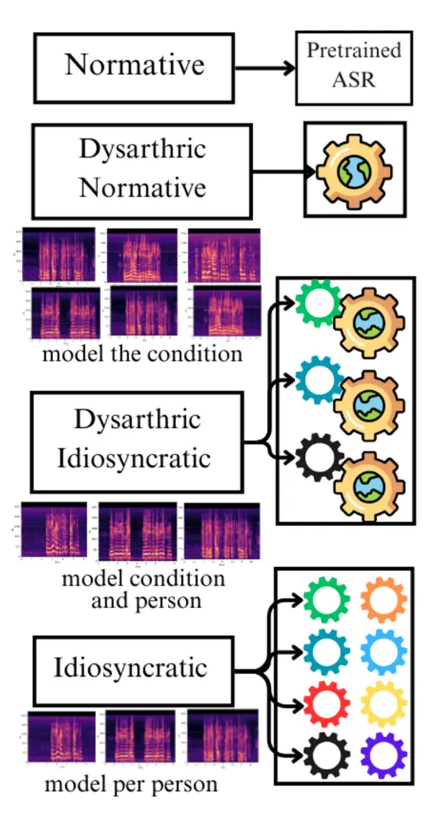

# Idiosyncratic Versus Normative Modeling of Atypical Speech Recognition: Dysarthric Case Studies

Vishnu Raja ^(†)^(†)thanks: Equal contribution Affiliation: Stony Brook
University    Adithya V Ganesan¹¹footnotemark: 1 Affiliation: Stony
Brook University    Anand Syamkumar Affiliation: Stony Brook University
   Ritwik Banerjee Affiliation: Stony Brook University    H. Andrew
Schwartz Affiliation: Vanderbilt University Affiliation: Stony Brook
University    {visraja    avirinchipur    asyamkumar    rbanerjee   
has}@cs.stonybrook.edu

###### Abstract

State-of-the-art automatic speech recognition (ASR) models like Whisper,
perform poorly on atypical speech, such as that produced by individuals
with dysarthria. Past works for atypical speech have mostly investigated
fully personalized (or idiosyncratic) models, but modeling strategies
that can both generalize and handle idiosyncracy could be more effective
for capturing atypical speech. To investigate this, we compare four
strategies: (a) normative models trained on typical speech (no
personalization), (b) idiosyncratic models completely personalized to
individuals, (c) dysarthric-normative models trained on other dysarthric
speakers, and (d) dysarthric-idiosyncratic models which combine
strategies by first modeling normative patterns before adapting to
individual speech. In this case study, we find the
dysarthric-idiosyncratic model performs better than idiosyncratic
approach while requiring less than half as much personalized data (36.43
WER with 128 train size vs 36.99 with 256). Further, we found that
tuning the speech encoder alone (as opposed to the LM decoder) yielded
the best results reducing word error rate from 71% to 32% on average.
Our findings highlight the value of leveraging both normative
(cross-speaker) and idiosyncratic (speaker-specific) patterns to improve
ASR for underrepresented speech populations.¹¹ 1 [Github:
VishnuRaja98/Dysarthric-Speech-Transcription](https://github.com/VishnuRaja98/Dysarthric-Speech-Transcription)

## 1 Introduction

Figure 1: Four types of models. Normative model is Whisper-small and we
do one-shot predictions on it. Idiosyncratic models create a model for
each user. Dysarthric Normative model, creates one model for a user
while excluding it and using evry other user for cross validation.
Dysarthric Idiosyncratic model uses a users normative model and
personalizes it.

ASR models are predominantly trained on normative populations, failing
to generalize on individuals with atypical speech, such as dysarthria.
Past works addressing this predominantly take an idiosyncratic modeling
approach by training (or fine-tuning) separate models, one specific to
each individual (Shor et al., 2019; Green et al., 2021). On top of
requiring vast amounts of data from the individual, such idiosyncratic
models might fail to capture the speaker’s changing speech
characteristics over time, eventually causing the model to generalize
poorly (Tomanek et al., 2023). Alternatively, learning from the
cross-section of dysarthric individuals could allow the model to adapt
to individual’s changing patterns within practical sample sizes.

In this work, we compare models with differing degrees of idiosyncratic
(personalized) versus normative (the same for all) models. Specifically,
we compare the performance of four strategies: (a) normative models
trained on typical speech (b) idiosyncratic models, i.e., normative
models tuned to individuals, (c) dysarthric normative models, i.e.,
normative models tuned to dysarthric population, (d) dysarthric
idiosyncratic models, i.e., dysarthric normative models tuned to
individuals. The difference in performances between (c) and (a) informs
the contributions of learned speech characteristics of dysarthria,
whereas the difference between (d) and (c), and (d) and (b) shows the
contribution of speaker-specific characteristics.

Dysarthria is a motor speech disorder caused by damage to the nervous
system, making it difficult for individuals to control and coordinate
the muscles involved in speech. People with dysarthria often have
trouble clearly pronouncing words, resulting in production of unclear
speech from slurred, stuttered or arrhythmic patterns. This difference
in the acoustic signal between dysarthric individuals and the normative
population, causes normative models to fail. However, dysarthria does
not affect a person’s ability to think or understand language; rather,
it affects their ability to physically produce speech like normative
population due to muscle weakness or lack of coordination. With the
typical size of dysarthria speech datasets ranging in 10s of people²² 2
The UASpeech corpus (Kim et al., 2008) comprises 19 speakers with
dysarthria, while the TORGO dataset (Rudzicz et al., 2010) used in this
work comprises 15 speakers – 8 with dysarthria, and 7 for control.
Others corpora, including those for non-English speakers, offer similar
sizes: 31 dysarthric speakers in the Italian-language EasyCall
dataset (Turrisi et al., 2021), 44 in the Chinese-language CDSD
corpus (Wan et al., 2024), and 30 in the Tamil SSNCE corpus (A. et al.,
2016)., it is more viable to leverage transfer learning of normative
models rather than adopting an extremely challenging approach of
training a model from scratch. With supporting evidence (Goldstein
et al., 2025; Tuckute et al., 2024; Aw et al., 2024) for shared
activation regions between human brain and deeper layers of speech &
language models, normative models can be adapted to capture the
differences in surface form speech patterns to map back to the same
activation regions of language, thus avoiding the need to train a model
from scratch.

The scaling trends have directed the models into 100s of millions of
parameters with growing number of layers, hidden dimensions, and the
normative data it was trained with (Kaplan et al., 2020; Hoffmann
et al., 2022), whilst maintaining the poor performances on
underrepresented population. Adapting these large scale models using
transfer learning, especially with characteristic drift in the speech
signals from normative population would require parameter efficient
approaches (Hu et al., 2022a; V Ganesan et al., 2021). To this, we
compare two parameter efficient strategies of training ASR models
against standard full fine-tuning, namely, only tuning the speech
encoder and only tuning the language decoder to quantify its effect on
performance.

Our main contributions include: (1) Systematic comparison between
different ways to improve dysarthric speech recognition model to
quantify the contributions of dysarthric speech characteristics and
person-specific speech characteristics. (2) a parameter efficient
approach to fine-tune ASR models to achieve the best performance (3)
Analysis of the different models’ WER against individuals’ severity
scores of motor functions. We found that: (a) 30.5% of performance
improved from learning dysarthric speech characteristics, and 23.57%
improved from learning speaker specific characteristics. (b) training
the speech encoder part of the ASR models led to consistent improvements
over full fine-tuning or language encoder alone for all adaptation
strategies. (c) the improvements in the ASR model for dysarthric speech
corresponded to decreased correlation with motor control severity scores
of the individuals. These findings on whisper-small generalized to
whisper-medium, showing that the results hold even with scaling up the
model size.

## 2 Related Work

In recent years, ASR has achieved remarkable progress in the detection
of atypical speech patterns, primarily through alignment-based data
augmentations (Xiong et al., 2019), contrastive learning (Wu et al.,
2021; Yang et al., 2025), and self-supervised learning with
augmentations to both data and deep neural architectures (Hu et al.,
2024; Takashima et al., 2024a; Takashima et al., 2024b). Self-supervised
learning was significantly aided by the introduction of wav2vec (Baevski
et al., 2020), leading to demonstrable improvements in atypical speech
recognition and severity assessments (Javanmardi et al., 2023;
Javanmardi et al., 2024; Nguyen et al., 2024). Despite this success,
some reports indicate that supervised learning maintains superior
performance in pathological speech recognition (for example, Violeta
et al. (2022) and Baskar et al. (2022)).

As such, a sizable body of work has explored the use of large-scale ASR
models trained on typical speech and subsequently fine-tuned on small
atypical speech corpora (Shor et al., 2019; Doshi et al., 2021; Green
et al., 2021). Further, to overcome concerns of data paucity, efficient
adaptations have demonstrably improved atypical speech detection through
the use of residual adapters (Tomanek et al., 2021b) and transfer
learning with small amounts of cohort data (Tomanek et al., 2021a), or a
fusion of cohort and individual data (Qi and Van hamme, 2023).

Recent improvements have largely followed this two-stage methodology:
employing an ASR model pretrained on general speech for fine-tuning with
cohort-level data, and then individual personalization (Takashima
et al., 2020a; Müller-Eberstein et al., 2024). As this approach is
theoretically grounded in knowledge transfer principles, it echoes
earlier work leveraging transfer-learning (Vachhani et al., 2017;
Takashima et al., 2020b) as well as more recent explorations that use
meta-learning (Wang et al., 2021; Hu et al., 2022b) and few-shot
learning (Hermann and Magimai-Doss, 2023) to demonstrate that even
limited idiosyncratic (i.e., speaker-specific) data can improve speech
recognition for dysarthric speakers. In a similar vein, the recent work
by (Hsieh et al., 2024) and (Qi and Van hamme, 2025) explore the utility
of curriculum learning by combining phonological features with model
representations and traditional acoustic features. For a comprehensive
review of studies on dysarthric speech and ASR systems, we point the
reader to the recent survey by (Bhat and Strik, 2025).

Despite these advances in adapting to dysarthric speech, the critical
interplay between speech encoder specialization and efficient use of
data remains underexplored. Existing frameworks often overlook
systematic evaluation of modular adaptations, particularly the
counterproductive effects of language model decoder tuning observed in
our work. Our findings not only challenge prevailing adaptation
strategies but also empirically establish encoder-focused tuning and
hybrid cohort-idiosyncratic learning as superior paradigms, advancing
both performance and practicality in low-resource clinical settings.

## 3 Dataset

In this work, we use the TORGO database, a collection of acoustic and
articulatory speech data from individuals with dysarthria caused by
either cerebral palsy or amyotrophic lateral sclerosis (Rudzicz et al.,
2010). All participants read English text from a screen displaying
prompts, which included short words, sentences, images (described by the
participants), and non-words resembling speech sounds. There were 8
participants in total, labeled as F01, F03, F04, M01, M02, M03, M05, and
M05. Note that F02 is not present in any of the experiments. The dataset
includes speech from eight dysarthric speakers, whose motor functions
were assessed using the Frenchay Dysarthria Assessment (FDA)  (Enderby,
2011). The FDA evaluates 28 perceptual dimensions of speech, categorized
into reflex, respiration, lips, jaw, soft palate, laryngeal function,
tongue function, and intelligibility 1.

This dataset is, to the best of our knowledge, uniquely suitable for
studying naturalistic dysarthric speech despite its smaller scale.
Unlike the other popular choice for dysarthric speech, such as the
UASpeech dataset (Kim et al., 2008), which relies heavily on isolated
word prompts, TORGO includes diverse language utterance types including
spontaneous natural language elicited from images (among also including,
e.g., short words and restricted sentences). Thus, this dataset enables
us to model ASR performance in scenarios closer to real-world
communication e.g., conversational fragments.

| Category  | F01  | F03  | F04  | M01  | M02  | M03  | M04  | M05  |
| --------- | ---- | ---- | ---- | ---- | ---- | ---- | ---- | ---- |
| Reflex    | 8.0  | 6.7  | 6.7  | 8.0  | 8.0  | 7.7  | 7.0  | 7.3  |
| Resp.     | 5.0  | 8.0  | 8.0  | 3.0  | 3.0  | 7.5  | 3.0  | 1.5  |
| Lips      | 5.6  | 8.0  | 8.0  | 5.0  | 5.0  | 7.8  | 3.2  | 3.6  |
| Jaw       | 5.5  | 8.0  | 8.0  | 8.0  | 8.0  | 8.0  | 5.0  | 8.0  |
| Palate    | 5.3  | 8.0  | 8.0  | 6.7  | 6.7  | 8.0  | 7.3  | 7.3  |
| Laryngeal | 3.0  | 8.0  | 8.0  | 2.5  | 2.5  | 7.0  | 2.3  | 4.5  |
| Tongue    | 2.3  | 6.7  | 6.7  | 2.3  | 2.3  | 7.7  | 3.3  | 2.2  |
| Intel.    | 2.3  | 8.0  | 8.0  | 2.3  | 2.3  | 8.0  | 1.7  | 5.3  |
| SUM       | 37.1 | 61.3 | 61.3 | 37.8 | 37.8 | 61.6 | 32.8 | 39.8 |

Table 1: Frenchay Dysarthria Assessment (FDA) for all users across
speech-related categories, an 8 point scale with 8 corresponding to
normal speech and 1 corresponding to severely affected speech.

For this study, non-textual prompts—images and non-words—were removed
during the data-cleaning process. The final dataset consists of
approximately 132 minutes of audio data, encompassing all speakers.
There are a total of 482 unique prompts, and each speaker’s speech was
split into three parts for training, development, and testing to ensure
that the training data from one user does not contaminate the test data
of another.

To prevent data leakage, we ensured that the test prompts of one user
were not seen during training, even though the model was trained on data
from all users. We randomly split the prompts in an 80-20 ratio,
reserving 385 for training and 97 prompts for testing. The
train-validation split was then performed over the train audio-text
pairs using the same 80-20 ratio.

## 4 Experiments

### 4.1 Methodology

We evaluated three adaptation approaches to the baseline (Off-the-shelf
pre-trained Whisper) as shown in Figure 1: (1) Idiosyncratic Model:
Fine-tuned ASR models on individual users’ data. Each model was tested
on both - its target speaker (within-user evaluation) and other speakers
(cross-user evaluation) to assess generalization capabilities. (2)
Dysarthric-Normative Models: Developed through leave-one-out
cross-validation (LOOCV), where we trained on data from all but one
speaker and selected each of the remaining speakers for
cross-validation. (3) Iterative Combined Integration (ICI) Models:
Further adapted the Dysarthric-Normative models to individual speakers
using limited target-user data.

To identify critical components for dysarthric speech recognition, we
compared three tuning configurations: (1) Full Model finetuning to
update all parameters (2) Encoder-Only finetuning to modify only the
speech feature extractor (or preserves language processing) and (3)
Decoder-Only finetuning to adapt only the language model component (or
preserves acoustic patterns)

We also measured the effect of data by progressively increasing training
data starting with 16 prompts, doubling until 128 for each user. The
incremental data experiment was performed on both the base normative and
the pre-adapted dysarthric normative models. This tests real-world
feasibility given the practical challenges of collecting large
dysarthric speech samples.

### 4.2 Model Training Parameters

We utilized Whisper small model from OpenAI (Radford et al., 2022), a
transformer-based encoder-decoder model optimized for speech recognition
tasks. Training was conducted on a combination of NVIDIA T4 and RTX
A6000 GPUs, with a total compute time of 160 GPU hours. The model
employs a micro-batch size of 2 samples per GPU with gradient
accumulation steps of 4, resulting in an effective batch size of 8.

Optimization was performed using the AdamW optimizer with a learning
rate of 1e-5 and mixed precision training (bfloat16) for efficiency. The
training protocol consisted of 7 epochs with a 10% warm-up ratio. Model
selection was based on validation Word Error Rate (WER), with generated
sequences limited to 50 tokens.

To address potential overfitting due to limited dysarthric data, we
conducted experiments with various regularization techniques. L2 weight
decay was tested with values of 0.1, 0.01, and 0.001 on the development
set. Additionally, attention dropout rates of 0.05 and 0.01 were
evaluated. These regularization parameters were systematically varied to
balance model capacity with the constraints of limited training data.

The model was trained for seq2seq generation task using the Hugging
Face (Wolf et al., 2020) library, with key configurations including
per-device train batch size, gradient accumulation steps, learning rate,
number of training epochs, mixed precision settings, and the metric for
model selection (WER). This approach allowed for efficient utilization
of computational resources while exploring the impact of different
regularization strategies on model performance.

### 4.3 Evaluation Procedure

We evaluated model performance using Word Error Rate (WER), calculated
as
$`\text{WER}=\frac{\text{S}+\text{I}+\text{D}}{\text{N}}\times 100\%`$,
where S, I, and D represent substitutions, insertions, and deletions,
respectively, and N is the total number of words in the reference
transcript. Text normalization was applied using the jiwer library,
including case normalization, contraction expansion, punctuation
removal, and whitespace standardization. Note that the values of WER can
go above 100 depending on how many of S, I and D were made compared to
N.

## 5 Results

### 5.1 Idiosyncratic Models

|            |             |       |       |       |       |       |       |       |         |
| ---------- | ----------- | ----- | ----- | ----- | ----- | ----- | ----- | ----- | ------- |
| Trained on | Tested on → |       |       |       |       |       |       |       |         |
|            | F01         | F03   | F04   | M01   | M02   | M03   | M04   | M05   | Row Avg |
| F01        | 47.22       | 38.35 | 15.32 | 76.47 | 68.33 | 12.74 | 88.82 | 85.71 | 54.12   |
| F03        | 77.78       | 30.82 | 13.06 | 75.40 | 62.78 | 10.38 | 88.82 | 78.57 | 54.70   |
| F04        | 69.44       | 37.28 | 9.91  | 71.66 | 63.33 | 8.96  | 81.58 | 75.00 | 52.14   |
| M01        | 63.89       | 40.14 | 13.06 | 47.59 | 68.33 | 12.74 | 84.87 | 71.43 | 50.25   |
| M02        | 69.44       | 39.07 | 12.16 | 70.05 | 38.89 | 11.32 | 91.45 | 75.00 | 50.92   |
| M03        | 69.44       | 42.29 | 10.36 | 78.07 | 65.00 | 8.02  | 90.79 | 71.43 | 54.42   |
| M04        | 58.33       | 40.14 | 14.86 | 66.31 | 62.78 | 16.51 | 55.92 | 78.57 | 49.17   |
| M05        | 83.33       | 40.50 | 11.26 | 65.24 | 59.44 | 12.26 | 75.00 | 57.14 | 50.52   |
| Col Avg    | 67.36       | 38.57 | 12.50 | 68.85 | 61.11 | 11.61 | 82.16 | 74.11 |         |

Table 2: Cross-User Generalization Results (WER %) with full model
Finetuning (incl. encoder and decoder). Lower is better. An
idiosyncratic model is trained over each user and that model is tested
for all users.

|            |             |       |       |       |       |       |        |        |         |
| ---------- | ----------- | ----- | ----- | ----- | ----- | ----- | ------ | ------ | ------- |
| Trained on | Tested on → |       |       |       |       |       |        |        |         |
|            | F01         | F03   | F04   | M01   | M02   | M03   | M04    | M05    | Row Avg |
| F01        | 41.67       | 39.78 | 11.26 | 84.49 | 68.33 | 6.13  | 135.53 | 107.14 | 61.79   |
| F03        | 63.89       | 30.47 | 11.71 | 80.75 | 62.78 | 9.91  | 115.79 | 75.00  | 56.29   |
| F04        | 72.22       | 39.78 | 9.01  | 73.80 | 63.33 | 9.43  | 87.50  | 89.29  | 55.55   |
| M01        | 58.33       | 42.29 | 13.96 | 43.32 | 68.33 | 6.60  | 83.55  | 89.29  | 50.71   |
| M02        | 69.44       | 37.99 | 15.77 | 75.40 | 37.78 | 9.43  | 86.18  | 71.43  | 50.43   |
| M03        | 83.33       | 45.88 | 14.41 | 81.82 | 65.00 | 6.60  | 100.00 | 82.14  | 59.90   |
| M04        | 72.22       | 42.29 | 11.71 | 64.71 | 62.78 | 13.21 | 59.21  | 64.29  | 48.80   |
| M05        | 83.33       | 39.43 | 10.36 | 71.66 | 59.44 | 6.13  | 84.87  | 64.29  | 52.44   |
| Col Avg    | 68.05       | 39.74 | 12.27 | 71.99 | 60.97 | 8.43  | 94.08  | 80.36  |         |

Table 3: Cross-User Generalization Results (WER %) with Encoder only
Finetuning. Lower is better. An idiosyncratic model is trained over each
user and that model is tested for all users.

In our first experiment, we trained idiosyncratic models by fine-tuning
a base normative model. The results for full fine-tuning are presented
in Table 2, while Table 3 shows the results for encoder only
fine-tuning.

A key observation from these results is that the best performance in
each column is consistently found along the diagonal, where the test and
train data come from the same user. Additionally the diagonal values are
always equal to or better than those of the base normative model (See
Table 6).

To assess how well the models generalize across users, we analyze the
row averages. The mean of these row averages is 54.49 for models where
only Speech is tuned and 52.03 for Speech+LM tuned models, with standard
deviations of 4.70 and 2.14, respectively. These results suggest that,
for this user set, fully fine-tuned models achieve slightly better
one-to-one cross-user generalization compared to encoder only finetuned
models.

However, one notable exception is observed when encoder-finetuned models
are tested on M03, where performance does not follow the expected
trend (Table 3). This could be attributed to M03’s clearer
speech (Table 1), making personalized adaptation less necessary.
Interestingly, the models trained on F01 and M05, who have more severe
dysarthria based on their FDA scores, generalize better than models
trained on M03. This raises the possibility that severe dysarthric
speech patterns might provide more distinctive cues for adaptation
compared to milder dysarthria. Investigating whether models trained on
highly dysarthric speech can better recognize mild dysarthria could be a
valuable direction for future research.

### 5.2 Dysarthric Normative Models

| Model                    | Speech & LM | Speech Only | LM Only |
| ------------------------ | ----------- | ----------- | ------- |
| Normative                |             | 70.94       |         |
| Idiosyncratic            | 36.58       | 36.54       | 54.23   |
| Dysarthric Normative     | 58.19       | 49.30       | 64.44   |
| Dysarthric Idiosyncratic | 46.96       | 32.58       | 46.82   |

Table 4: Average WER% over each models when tuning different parts of
Whisper-small. For Dysarthric Normative, all normative models of all
users are averaged and for Dysarthric Idiosyncratic, only the best of
all models is chosen.

| Model                    | Speech & LM | Speech Only | LM Only |
| ------------------------ | ----------- | ----------- | ------- |
| Normative                |             | 61.38       |         |
| Idiosyncratic            | 33.93       | 31.14       | 50.25   |
| Dysarthric Normative     | 53.19       | 45.51       | 60.24   |
| Dysarthric Idiosyncratic | 39.96       | 28.40       | 44.49   |

Table 5: Average WER% over each models when tuning different parts of
Whisper-medium. For Dysarthric Normative, all normative models of all
users are averaged and for Dysarthric Idiosyncratic, only the best of
all models is chosen.

To further improve performance, we developed 56 dysarthric normative
models using a leave-one-out approach. For each model, one user was
excluded from training, and an additional user was excluded for
validation. For each excluded user, every other user was used for
cross-validation once. Each normative model was trained using the
remaining six users’ training data, and WER was calculated using the
omitted user’s test data.

Table 6presents the WER scores for these models, demonstrating
significant improvement over the base normative model (WER 70.94;
Table 6). On average, the dysarthric normative models reduced WER to
49.30, showing improvements across all users except F04 and M03
(Table 6). Notably, for F04, the performance remained unchanged, while
for M03, the dysarthric normative model performed slightly worse than
the base normative model.

According to Table 4, the best results were obtained when only the
speech component was fine-tuned, rather than incorporating the language
model (LM). The results shown in Table 6 reflect this optimal
configuration.

These findings indicate that learning dysarthric speech patterns from
multiple users, while excluding the target user, is an effective
strategy. The results suggest that training on speech alone—without LM
adaptation—provides the most robust dysarthric normative models.

### 5.3 Dysarthric Idiosyncratic models

[TABLE]

Table 6: Performance comparison across Encoder finetuned models (WER %).
Lower is better The ICI Model (Avg. WER) column shows the average WER
from training the user with every other normative model that excludes
the user. The last column chooses the best dysarthric idiosyncratic
model for a user.

As shown in Table 6, the Idiosyncratic models have an average WER of
36.54%, whereas the Dysarthric Idiosyncratic models achieve a similar
average WER of 36.53% but a better best WER of 32.58%. This improvement
is observed for almost all users, suggesting that the speech patterns
learned by the Dysarthric Normative model are effectively transferable
to individual users during personalization. Fine-tuning an idiosyncratic
model from a Dysarthric Normative model yields better performance than
starting directly from a Normative model.

From Table 6 we found that the Dysarthric Idiosyncratic models improve
WER by 54.07% (70.94 → 32.58) compared to the Normative model. This gain
is attributed to two factors: 30.5% (70.94 → 49.30) of the improvement
comes from learning common dysarthric speech patterns during the
normative stage, while 23.57% (49.30 → 32.58) is due to further
adaptation to personalized speech patterns. This approach proves more
effective than relying solely on personalized adaptation, as seen in the
Idiosyncratic model, where the total improvement was only 48.49% (70.94
→ 36.54), derived entirely from personalized speech patterns.

Next, we examine Table 4. The LM-only fine-tuned Dysarthric
Idiosyncratic models were initialized from Speech-only Dysarthric
Normative models. However, their performance gains are minimal and
significantly worse than Idiosyncratic models using encoder or full
fine-tuning.

For full fine-tuning, the Dysarthric Idiosyncratic models were
initialized from their Dysarthric Normative counterparts that also
underwent full fine-tuning. Although these models performed better than
the LM-only models, they still underperformed compared to the
Speech-only models. This performance degradation can be attributed to
the cascading effect caused by iterative LM tuning—first in the
Dysarthric Normative model and then in the Dysarthric Idiosyncratic
model—potentially leading to overfitting or instability in language
modeling.

From these results, it is evident that the Speech Encoder plays the most
crucial role in improving the normative models. For this dataset, full
fine-tuning and encoder-only fine-tuning yield comparable results for
Idiosyncratic models, making it difficult to draw definitive conclusions
about their relative effectiveness. Further investigation with larger
datasets may be necessary to determine whether one approach consistently
outperforms the other.

### 5.4 Effect of model size

Table 5shows our final results when we replace whisper-small models with
whisper-medium. The larger model shows a similar pattern where tuning
the encoder yields better model performance. The WERs improve for the
larger model as is expected due to the larger learning capacity of the
encoder. The Idiosyncratic models for Whisper-Medium outperform the
Dysarthric Idiosyncratic models for Whisper-Small.

On similar lines as the whisper-small model, for the whisper-medium
models in Table 5, we found that the Dysarthric Idiosyncratic models
improve WER by 53.73% (61.38 → 28.40) compared to the Normative model.
This gain is attributed to two factors: 25.85% (61.38 → 45.51) of the
improvement comes from learning common dysarthric speech patterns during
the normative stage, while 27.88% (45.51 → 28.40) is due to further
adaptation to personalized speech patterns. This approach proves more
effective than relying solely on personalized adaptation, as seen in the
Idiosyncratic model, where the total improvement was only 49.26% (61.38
→ 31.14), derived entirely from personalized speech patterns.

### 5.5 Effect of train data size

Since we have established that using a Speech-tuned Dysarthric Normative
model is beneficial for training personalized models, the next
experiment aimed to determine how much data is required for effective
personalization when starting from a Dysarthric Normative model compared
to training directly from scratch.

Figure 2 illustrates the relationship between training data size
(X-axis) and average WER (Y-axis). Whisper-small was trained for each
user using 16, 32, 64, 128, and 256 recordings. If a user had fewer than
the specified number of recordings, all available training samples were
used. The WER was computed using the full test dataset of each user at
every step and then averaged.

The results indicate that when training a Dysarthric Idiosyncratic
model, using only 128 recordings ($`\sim`$50% of the full dataset)
achieves better performance than training a personalized model with all
256 recordings from scratch. This finding suggests that by leveraging a
Dysarthric Normative model, users can obtain a highly personalized ASR
model with less than half the usual data collection effort,
significantly reducing the burden of dataset creation while still
achieving optimal recognition performance.

Figure 2: Error as a function of training size for both idiosyncratic
and dysarthric idiosyncratic. The benefits of the dysarthric
idiosyncratic, which generalizes across dysarthric speakers, are larger
at the smaller training set sizes but a benefit remains even with
greater training sizes.

### 5.6 Correlation of Model WERs and FDA scores

Figure 3: Correlation between WER and inverted FDA score. We invert the
FDA score to have a high score correspond to higher severity of
dysarthria. A higher value in a row means that the degree of imparity
can explain the WER of the model more. A model that had learned
dysarthric patterns would have a smaller correlation with inverted FDA
scores, indicating that severity doesn’t explain the model errors as
much.

While Word Error Rate (WER) provides a standard benchmark for
transcription accuracy, it does not capture whether model errors are
systematically related to the underlying motor-speech impairments of
dysarthria. To address this, we examine correlations between model WERs
and clinical Frenchay Dysarthria Assessment (FDA) scores. From a
psychological measurement perspective, this serves as an evaluation of
external validity: if model errors increase with clinical severity, then
the model is sensitive to dysarthric impairment, whereas weaker
correlations suggest that errors stem from other sources (e.g., model
limitations unrelated to motor speech).

We find a high correlation between WER and inverted FDA scores³³ 3 high
score now correspond to high severity in baseline models, indicating
that transcription errors rise as speech quality worsens and are
strongly tied to dysarthria-related disfluencies. However, when training
on Idiosyncratic (Self) and Dysarthric Idiosyncratic (ICI) models, this
correlation reduced. This suggests that the relationship between WER and
speech disability weakens in these models —- implying that disability
becomes less of a factor in transcription efficiency, which is a desired
outcome. Except for Respiration and Tongue, all rows show a similar
trend of improvement from Normative to Idiosyncratic models.

Taken together, this analysis complements standard WER results by
offering a clinically grounded perspective: models with lower
correlations to inverted FDA scores are not only more accurate, but also
less constrained by the speaker’s impairment profile, highlighting their
potential utility for individuals with dysarthria.

## 6 Conclusions

Our study demonstrates that personalized fine-tuning remains critical
for recognizing dysarthric speech, but can be made more efficient by
leveraging dysarthric-normative pretraining and selectively adapting the
speech encoder. By identifying the role of parameter subspaces in ASR
models —- specifically the greater impact of tuning the speech encoder
over the language decoder – we enable a dysarthric-idiosyncratic
approach to perform on par with, or better than, the widely used
idiosyncratic models. To the best of our knowledge, this is the first
work to show how combined modeling can outperform purely personalized
strategies for disordered speech recognition under constrained data
settings.

## Limitations

This study has several important limitations. First, our models were
evaluated on a small number of speakers from the TORGO dataset. We
selected TORGO because it uniquely reflects ecological validity through
open-ended speech, unlike other dysarthric datasets that rely on
scripted prompts. While this choice provides greater qualitative
diversity, it also limits scalability and statistical power. Although we
applied standard safeguards to reduce overfitting, our findings
highlight the pressing need for larger, more representative datasets
that capture naturalistic variation in dysarthric speech across
populations and conditions. We view this work as a case study and a
foundation for future large-scale validation.

Second, speaker-specific factors such as regional accent, dialect, or
broader linguistic background were not controlled, despite their likely
influence on transcription performance. Similarly, the limited dataset
constrains the strength of our normative models; access to more diverse
normative speech data would improve their robustness and comparability.

Finally, we did not examine incremental or longitudinal training
strategies. Such approaches would be valuable for modeling the
progressive trajectories of degenerative speech disorders, and may
better reflect real-world use cases where systems adapt alongside an
individual’s changing speech profile.

## Ethical Considerations

This work uses publicly available datasets containing dysarthric speech.
All data used in this study were collected and released by their
original creators and made available for research purposes. We ensured
compliance with the dataset licenses and terms of use.

We acknowledge that dysarthric speech originates from individuals with
medical conditions, and thus represents sensitive data. While no
personally identifiable information (PII) is present in the data, we
took care to treat the speech recordings and associated metadata
respectfully and strictly for the intended research purpose.

Our models are not designed for diagnostic use, and we caution against
misuse of automatic systems for clinical decision-making without expert
oversight. Additionally, while this study focuses on improving
transcription accuracy, we recognize the importance of inclusive AI
development that does not reinforce biases against people with
disabilities. Future work should prioritize user-centered evaluation and
collaboration with affected communities. Analysis of model
behaviors V Ganesan et al. (2024) under varied settings can be a useful
way to understand and explain the capabilities of these models.

## Acknowledgments

This study was funded by The National Institutes of Health, Smart and
Connected Health, Grant NIH/NIMH R01 MH125702, and part funded by
U01OH012476. The conclusions contained herein are those of the authors
and should not be interpreted as necessarily representing the official
policies, either expressed or implied, of NSF, NIH, any other government
organization, or the U.S. Government.

## References

- A. et al. (2016) Mariya Celin T. A., Nagarajan T., and
  Vijayalakshmi P. 2016. [Dysarthric speech corpus in Tamil for
  rehabilitation research](https://doi.org/10.1109/TENCON.2016.7848510).
  In _2016 IEEE Region 10 Conference (TENCON)_, pages 2610–2613.
- Aw et al. (2024) Khai Loong Aw, Syrielle Montariol, Badr AlKhamissi,
  Martin Schrimpf, and Antoine Bosselut. 2024. [Instruction-tuning
  aligns LLMs to the human
  brain](https://openreview.net/forum?id=nXNN0x4wbl). In _First
  Conference on Language Modeling_.
- Baevski et al. (2020) Alexei Baevski, Henry Zhou, Abdelrahman Mohamed,
  and Michael Auli. 2020. [wav2vec 2.0: A Framework for Self-Supervised
  Learning of Speech Representations](https://arxiv.org/abs/2006.11477).
  _CoRR_, abs/2006.11477.
- Baskar et al. (2022) Murali Karthick Baskar, Tim Herzig, Diana Nguyen,
  Mireia Diez, Tim Polzehl, Lukas Burget, and Jan Černocký. 2022.
  [Speaker adaptation for Wav2vec2 based dysarthric
  ASR](https://doi.org/10.21437/Interspeech.2022-10896). In _Interspeech
  2022_, pages 3403–3407.
- Bhat and Strik (2025) Chitralekha Bhat and Helmer Strik. 2025. [Speech
  Technology for Automatic Recognition and Assessment of Dysarthric
  Speech: An Overview](https://doi.org/10.1044/2024_JSLHR-23-00740).
  _Journal of Speech, Language, and Hearing Research_, 68(2):547–577.
- Doshi et al. (2021) Rohan Doshi, Youzheng Chen, Liyang Jiang, Xia
  Zhang, Fadi Biadsy, Bhuvana Ramabhadran, Fang Chu, Andrew Rosenberg,
  and Pedro J. Moreno. 2021. [Extending Parrotron: An End-to-End, Speech
  Conversion and Speech Recognition Model for Atypical
  Speech](https://doi.org/10.1109/ICASSP39728.2021.9414644). In _ICASSP
  2021 - 2021 IEEE International Conference on Acoustics, Speech and
  Signal Processing (ICASSP)_, pages 6988–6992.
- Enderby (2011) Pamela Enderby. 2011. [The Frenchay Dysarthria
  Assessment](https://doi.org/10.3109/13682828009112541). _International
  Journal of Language & Communication Disorders_, 15:165 – 173.
- Goldstein et al. (2025) Ariel Goldstein, Haocheng Wang, Leonard
  Niekerken, Mariano Schain, Zaid Zada, Bobbi Aubrey, Tom Sheffer,
  Samuel Nastase, Harshvardhan Gazula, Aditi Singh, Aditi Rao, Gina
  Choe, Catherine Kim, Werner Doyle, Daniel Friedman, Sasha Devore,
  Patricia Dugan, Avinatan Hassidim, Michael Brenner, and Uri
  Hasson. 2025. [A unified acoustic-to-speech-to-language embedding
  space captures the neural basis of natural language processing in
  everyday conversations](https://doi.org/10.1038/s41562-025-02105-9).
  _Nature Human Behaviour_, 9:1041–1055.
- Green et al. (2021) Jordan R. Green, Robert L. MacDonald, Pan-Pan
  Jiang, Julie Cattiau, Rus Heywood, Richard Cave, Katie Seaver,
  Marilyn A. Ladewig, Jimmy Tobin, Michael P. Brenner, Philip C. Nelson,
  and Katrin Tomanek. 2021. [Automatic Speech Recognition of Disordered
  Speech: Personalized Models Outperforming Human Listeners on Short
  Phrases](https://doi.org/10.21437/Interspeech.2021-1384). In
  _Interspeech 2021_, pages 4778–4782.
- Hermann and Magimai-Doss (2023) Enno Hermann and Mathew
  Magimai-Doss. 2023. [Few-shot dysarthric speech recognition with
  text-to-speech data
  augmentation](https://doi.org/10.21437/Interspeech.2023-2481). In
  _Interspeech 2023_, pages 156–160.
- Hoffmann et al. (2022) Jordan Hoffmann, Sebastian Borgeaud, Arthur
  Mensch, Elena Buchatskaya, Trevor Cai, Eliza Rutherford, Diego
  de Las Casas, Lisa Anne Hendricks, Johannes Welbl, Aidan Clark, Tom
  Hennigan, Eric Noland, Katie Millican, George van den Driessche,
  Bogdan Damoc, Aurelia Guy, Simon Osindero, Karen Simonyan, Erich
  Elsen, and 3 others. 2022. [Training Compute-Optimal Large Language
  Models](https://arxiv.org/abs/2203.15556). _Preprint_,
  arXiv:2203.15556.
- Hsieh et al. (2024) Tsun-An Hsieh, Heeyoul Choi, and Minje Kim. 2024.
  [Multimodal Representation Loss Between Timed Text and Audio for
  Regularized Speech
  Separation](https://doi.org/10.21437/Interspeech.2024-444). In
  _Interspeech 2024_, pages 1300–1304.
- Hu et al. (2022a) Edward J Hu, yelong shen, Phillip Wallis, Zeyuan
  Allen-Zhu, Yuanzhi Li, Shean Wang, Lu Wang, and Weizhu Chen. 2022a.
  [LoRA: Low-rank adaptation of large language
  models](https://openreview.net/forum?id=nZeVKeeFYf9). In
  _International Conference on Learning Representations_.
- Hu et al. (2022b) Shoukang Hu, Xurong Xie, Mingyu Cui, Jiajun Deng,
  Shansong Liu, Jianwei Yu, Mengzhe Geng, Xunying Liu, and Helen Meng.
  2022b. [Neural Architecture Search for LF-MMI Trained Time Delay
  Neural Networks](https://doi.org/10.1109/TASLP.2022.3153253).
  _IEEE/ACM Transactions on Audio, Speech, and Language Processing_,
  30:1093–1107.
- Hu et al. (2024) Shujie Hu, Xurong Xie, Mengzhe Geng, Zengrui Jin,
  Jiajun Deng, Guinan Li, Yi Wang, Mingyu Cui, Tianzi Wang, Helen Meng,
  and Xunying Liu. 2024. [Self-Supervised ASR Models and Features for
  Dysarthric and Elderly Speech
  Recognition](https://doi.org/10.1109/TASLP.2024.3422839). _IEEE/ACM
  Transactions on Audio, Speech, and Language Processing_, 32:3561–3575.
- Javanmardi et al. (2024) Farhad Javanmardi, Sudarsana Reddy Kadiri,
  and Paavo Alku. 2024. [Exploring the Impact of Fine-Tuning the
  Wav2vec2 Model in Database-Independent Detection of Dysarthric
  Speech](https://doi.org/10.1109/JBHI.2024.3392829). _IEEE Journal of
  Biomedical and Health Informatics_, 28(8):4951–4962.
- Javanmardi et al. (2023) Farhad Javanmardi, Saska Tirronen, Manila
  Kodali, Sudarsana Reddy Kadiri, and Paavo Alku. 2023. [Wav2vec-Based
  Detection and Severity Level Classification of Dysarthria From
  Speech](https://doi.org/10.1109/ICASSP49357.2023.10094857). In _ICASSP
  2023 - 2023 IEEE International Conference on Acoustics, Speech and
  Signal Processing (ICASSP)_, pages 1–5.
- Kaplan et al. (2020) Jared Kaplan, Sam McCandlish, Tom Henighan,
  Tom B. Brown, Benjamin Chess, Rewon Child, Scott Gray, Alec Radford,
  Jeffrey Wu, and Dario Amodei. 2020. [Scaling Laws for Neural Language
  Models](https://arxiv.org/abs/2001.08361). _Preprint_,
  arXiv:2001.08361.
- Kim et al. (2008) Heejin Kim, Mark Hasegawa-Johnson, Adrienne Perlman,
  Jon Gunderson, Thomas S. Huang, Kenneth Watkin, and Simone
  Frame. 2008. [Dysarthric speech database for universal access
  research](https://doi.org/10.21437/Interspeech.2008-480). In
  _Interspeech 2008_, pages 1741–1744.
- Müller-Eberstein et al. (2024) Max Müller-Eberstein, Dianna Yee,
  Karren Yang, Gautam Varma Mantena, and Colin Lea. 2024. [Hypernetworks
  for Personalizing ASR to Atypical
  Speech](https://doi.org/10.1162/tacl_a_00696). _Transactions of the
  Association for Computational Linguistics_, 12:1182–1196.
- Nguyen et al. (2024) Tuan Nguyen, Corinne Fredouille, Alain Ghio,
  Mathieu Balaguer, and Virginie Woisard. 2024. [Exploring ASR-Based
  WAV2VEC2 for Automated Speech Disorder Assessment: Insights and
  Analysis](https://doi.org/10.1109/SLT61566.2024.10832202). In _2024
  IEEE Spoken Language Technology Workshop (SLT)_, pages 975–982.
- Qi and Van hamme (2023) Jinzi Qi and Hugo Van hamme. 2023.
  [Parameter-efficient Dysarthric Speech Recognition Using Adapter
  Fusion and Householder
  Transformation](https://doi.org/10.21437/Interspeech.2023-1627). In
  _Interspeech 2023_, pages 151–155.
- Qi and Van hamme (2025) Jinzi Qi and Hugo Van hamme. 2025. [A Study on
  Model Training Strategies for Speaker-Independent and
  Vocabulary-Mismatched Dysarthric Speech
  Recognition](https://doi.org/10.3390/app15042006). _Applied Sciences_,
  15(4).
- Radford et al. (2022) Alec Radford, Jong Wook Kim, Tao Xu, Greg
  Brockman, Christine McLeavey, and Ilya Sutskever. 2022. [Robust Speech
  Recognition via Large-Scale Weak
  Supervision](https://arxiv.org/abs/2212.04356). _Preprint_,
  arXiv:2212.04356.
- Rudzicz et al. (2010) Frank Rudzicz, Aravind Namasivayam, and Talya
  Wolff. 2010. [The TORGO database of acoustic and articulatory speech
  from speakers with
  dysarthria](https://doi.org/10.1007/s10579-011-9145-0). _Language
  Resources and Evaluation_, 46:1–19.
- Shor et al. (2019) Joel Shor, Dotan Emanuel, Oran Lang, Omry Tuval,
  Michael Brenner, Julie Cattiau, Fernando Vieira, Maeve McNally, Taylor
  Charbonneau, Melissa Nollstadt, Avinatan Hassidim, and Yossi
  Matias. 2019. [Personalizing ASR for Dysarthric and Accented Speech
  with Limited Data](https://doi.org/10.21437/Interspeech.2019-1427). In
  _Interspeech 2019_, pages 784–788.
- Takashima et al. (2024a) Ryoichi Takashima, Takeru Otani, Ryo Aihara,
  Tetsuya Takiguchi, and Shinya Taguchi. 2024a. [Self-supervised
  learning using unlabeled speech with multiple types of speech disorder
  for disordered speech
  recognition](https://doi.org/10.1145/3663548.3688536). In _Proceedings
  of the 26th International ACM SIGACCESS Conference on Computers and
  Accessibility_, ASSETS ’24, New York, NY, USA. Association for
  Computing Machinery.
- Takashima et al. (2024b) Ryoichi Takashima, Yuya Sawa, Ryo Aihara,
  Tetsuya Takiguchi, and Yoshie Imai. 2024b. [Dysarthric Speech
  Recognition Using Pseudo-Labeling, Self-Supervised Feature Learning,
  and a Joint Multi-Task Learning
  Approach](https://doi.org/10.1109/ACCESS.2024.3374874). _IEEE Access_,
  12:36990–36999.
- Takashima et al. (2020a) Ryoichi Takashima, Tetsuya Takiguchi, and
  Yasuo Ariki. 2020a. [Two-Step Acoustic Model Adaptation for Dysarthric
  Speech Recognition](https://doi.org/10.1109/ICASSP40776.2020.9053725).
  In _ICASSP 2020 - 2020 IEEE International Conference on Acoustics,
  Speech and Signal Processing (ICASSP)_, pages 6104–6108.
- Takashima et al. (2020b) Yuki Takashima, Ryoichi Takashima, Tetsuya
  Takiguchi, and Yasuo Ariki. 2020b. [Dysarthric Speech Recognition
  Based on Deep Metric
  Learning](https://doi.org/10.21437/Interspeech.2020-2267). In
  _Interspeech 2020_, pages 4796–4800.
- Tomanek et al. (2021a) Katrin Tomanek, Françoise Beaufays, Julie
  Cattiau, Angad Chandorkar, and Khe Chai Sim. 2021a. [On-Device
  Personalization of Automatic Speech Recognition Models for Disordered
  Speech](https://arxiv.org/abs/2106.10259). _Preprint_,
  arXiv:2106.10259.
- Tomanek et al. (2023) Katrin Tomanek, Katie Seaver, Pan-Pan Jiang,
  Richard Cave, Lauren Harrell, and Jordan Green. 2023. [An Analysis of
  Degenerating Speech Due to Progressive Dysarthria on ASR
  Performance](https://doi.org/10.1109/ICASSP49357.2023.10097195). In
  _ICASSP 2023 - 2023 IEEE International Conference on Acoustics, Speech
  and Signal Processing (ICASSP)_, pages 1–5.
- Tomanek et al. (2021b) Katrin Tomanek, Vicky Zayats, Dirk Padfield,
  Kara Vaillancourt, and Fadi Biadsy. 2021b. [Residual Adapters for
  Parameter-Efficient ASR Adaptation to Atypical and Accented
  Speech](https://arxiv.org/abs/2109.06952). _Preprint_,
  arXiv:2109.06952.
- Tuckute et al. (2024) Greta Tuckute, Aalok Sathe, Shashank Srikant,
  Maya Taliaferro, Mingye Wang, Martin Schrimpf, Kendrick Kay, and
  Evelina Fedorenko. 2024. [Driving and suppressing the human language
  network using large language
  models](https://doi.org/10.1038/s41562-023-01783-7). _Nature Human
  Behaviour_, 8:1–18.
- Turrisi et al. (2021) Rosanna Turrisi, Arianna Braccia, Marco
  Emanuele, Simone Giulietti, Maura Pugliatti, Mariachiara Sensi, and
  Luciano Fadiga andLeonardo Badino. 2021. [EasyCall corpus: a
  dysarthric speech
  dataset](https://doi.org/10.21437/Interspeech.2021-549). In
  _Interspeech 2021_, pages 41–45.
- V Ganesan et al. (2021) Adithya V Ganesan, Matthew Matero,
  Aravind Reddy Ravula, Huy Vu, and H. Andrew Schwartz. 2021. [Empirical
  evaluation of pre-trained transformers for human-level NLP: The role
  of sample size and
  dimensionality](https://doi.org/10.18653/v1/2021.naacl-main.357). In
  _Proceedings of the 2021 Conference of the North American Chapter of
  the Association for Computational Linguistics: Human Language
  Technologies_, pages 4515–4532, Online. Association for Computational
  Linguistics.
- V Ganesan et al. (2024) Adithya V Ganesan, Vasudha Varadarajan,
  Yash Kumar Lal, Veerle C Eijsbroek, Katarina Kjell, Oscar NE Kjell,
  Tanuja Dhanasekaran, Elizabeth C Stade, Johannes C Eichstaedt, Ryan L
  Boyd, and 1 others. 2024. Explaining gpt-4’s schema of depression
  using machine behavior analysis. _arXiv preprint arXiv:2411.13800_.
- Vachhani et al. (2017) Bhavik Vachhani, Chitralekha Bhat, Biswajit
  Das, and Sunil Kumar Kopparapu. 2017. [Deep Autoencoder Based Speech
  Features for Improved Dysarthric Speech
  Recognition](https://doi.org/10.21437/Interspeech.2017-1318). In
  _Interspeech 2017_, pages 1854–1858.
- Violeta et al. (2022) Lester Phillip Violeta, Wen Chin Huang, and
  Tomoki Toda. 2022. [Investigating Self-supervised Pretraining
  Frameworks for Pathological Speech
  Recognition](https://doi.org/10.21437/Interspeech.2022-10043). In
  _Interspeech 2022_, pages 41–45.
- Wan et al. (2024) Yan Wan, Mengyi Sun, Xinchen Kang, Jingting Li,
  Pengfei Guo, Ming Gao, and Su-Jing Wang. 2024. [CDSD: Chinese
  Dysarthria Speech
  Database](https://doi.org/10.21437/interspeech.2024-1597). In
  _Interspeech 2024_, page 4109–4113. ISCA.
- Wang et al. (2021) Disong Wang, Jianwei Yu, Xixin Wu, Lifa Sun,
  Xunying Liu, and Helen Meng. 2021. [Improved End-to-End Dysarthric
  Speech Recognition via Meta-learning Based Model
  Re-initialization](https://doi.org/10.1109/ISCSLP49672.2021.9362068).
  In _2021 12th International Symposium on Chinese Spoken Language
  Processing (ISCSLP)_, pages 1–5.
- Wolf et al. (2020) Thomas Wolf, Lysandre Debut, Victor Sanh, Julien
  Chaumond, Clement Delangue, Anthony Moi, Pierric Cistac, Tim Rault,
  Remi Louf, Morgan Funtowicz, Joe Davison, Sam Shleifer, Patrick von
  Platen, Clara Ma, Yacine Jernite, Julien Plu, Canwen Xu, Teven
  Le Scao, Sylvain Gugger, and 3 others. 2020. [Transformers:
  State-of-the-Art Natural Language
  Processing](https://doi.org/10.18653/v1/2020.emnlp-demos.6). In
  _Proceedings of the 2020 Conference on Empirical Methods in Natural
  Language Processing: System Demonstrations_, pages 38–45, Online.
  Association for Computational Linguistics.
- Wu et al. (2021) Lidan Wu, Daoming Zong, Shiliang Sun, and Jing
  Zhao. 2021. [A Sequential Contrastive Learning Framework for Robust
  Dysarthric Speech
  Recognition](https://doi.org/10.1109/ICASSP39728.2021.9415017). In
  _ICASSP 2021 - 2021 IEEE International Conference on Acoustics, Speech
  and Signal Processing (ICASSP)_, pages 7303–7307.
- Xiong et al. (2019) Feifei Xiong, Jon Barker, and Heidi
  Christensen. 2019. [Phonetic Analysis of Dysarthric Speech Tempo and
  Applications to Robust Personalised Dysarthric Speech
  Recognition](https://doi.org/10.1109/ICASSP.2019.8683091). In _ICASSP
  2019 - 2019 IEEE International Conference on Acoustics, Speech and
  Signal Processing (ICASSP)_, pages 5836–5840.
- Yang et al. (2025) Yudong Yang, Xinyi Wu, Xiaokang Liu, Jiang Liu,
  Jingdong Zhou, Rennan Wang, Xin Wang, Rongfeng Su, Nan Yan, and Lan
  Wang. 2025. [Feature Extraction Method Based on Contrastive Learning
  for Dysarthria
  Detection](https://doi.org/10.1007/978-981-96-1151-5_28). In _Int.
  Conf. Social Robotics_, pages 272–281. Springer, Singapore.

## Appendix

## Appendix A Dysarthric Normative Model: Leave-One-Out Cross-Validation

The dysarthric normative model was built using a leave-one-out
cross-validation approach across all eight speakers in the TORGO
dataset. To make the process more transparent, we describe it below in
pseudocode form.

scores = \[\]

for test_user in all_users:

user_score = \[\]

for dev_user in all_users - {test_user}:

train_users = all_users - {test_user, dev_user}

train_data = data\[train_users\]

dev_data = data\[dev_user\]

test_data = data\[test_user\]

model.fit(train=train_data, dev=dev_data)

wer = model.eval(test_data)

user_score.append(wer)

scores.append(user_score)

Figure 4: Algorithm used for Leave-One-Out Cross-Validation of
Dysarthric Normative models.

This process results in a total of 56 models ($`8`$ test users
$`\times`$ $`7`$ dev users), ensuring speaker-independent evaluation and
reducing overfitting.

## Responsible NLP Research Checklist

### A. Limitations and Potential Risks

- •
  A1. Limitations Section: Yes. This paper has a limitations section.
- •
  A2. Potential Risks: Yes. Ethical Considerations.

### B. Use or Creation of Scientific Artifacts

- •
  B. Use or Create Scientific Artifacts: Yes.
- •
  B1. Cite Creators of Artifacts: Yes. §3, §4.
- •
  B2. Discuss the License for Artifacts: Yes. Ethical Consideration.
- •
  B3. Artifact Use Consistent with Intended Use: Yes. Ethical
  Considerations.
- •
  B4. Data Contains Personally Identifying Info or Offensive Content:
  No. Anonymized Data.
- •
  B5. Documentation of Artifacts: Yes. §3.
- •
  B6. Statistics for Data: Yes. §3.

### C. Computational Experiments

- •
  C. Computational Experiments: Yes.
- •
  C1. Model Size and Budget: Yes. §4.
- •
  C2. Experimental Setup and Hyperparameters: Yes. §4.
- •
  C3. Descriptive Statistics: Yes. §5.
- •
  C4. Parameters for Packages: Yes. §4.

### D. Human Subjects Including Annotators

- •
  D. Human Subjects: No.
- •
  D1. Instructions Given to Participants: N/A.
- •
  D2. Recruitment and Payment: N/A.
- •
  D3. Data Consent: N/A.
- •
  D4. Ethics Review Board Approval: N/A.
- •
  D5. Characteristics of Annotators: N/A.

### E. AI Assistants in Research or Writing

- •
  E. AI Assistants in Research or Writing: Yes.
- •
  E1. Information About Use of AI Assistants: No. Used as copilot and
  text correction tool.
