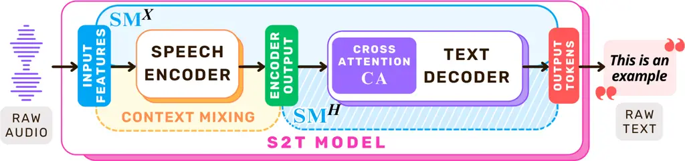
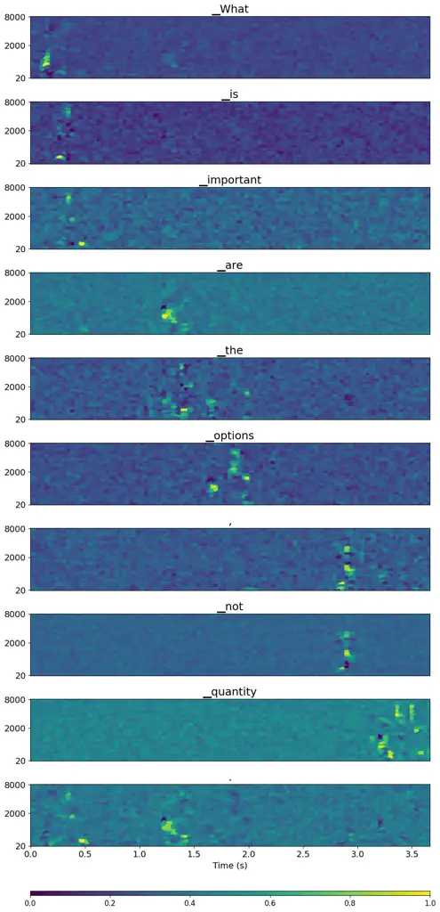
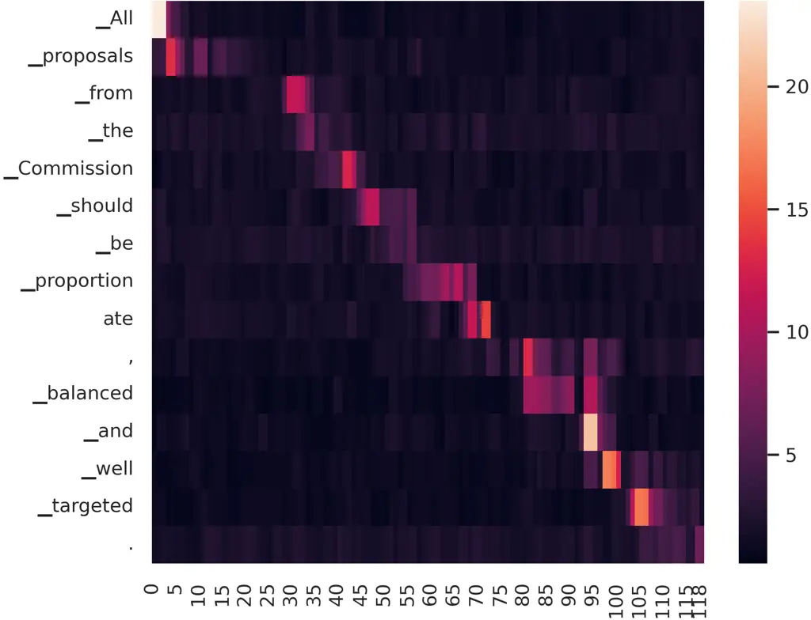
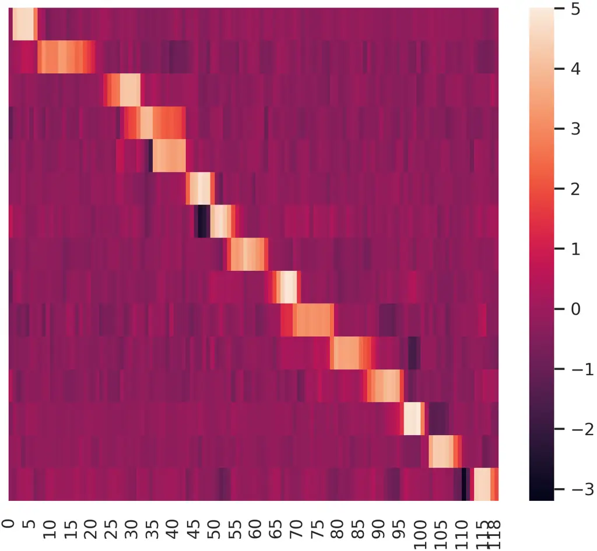
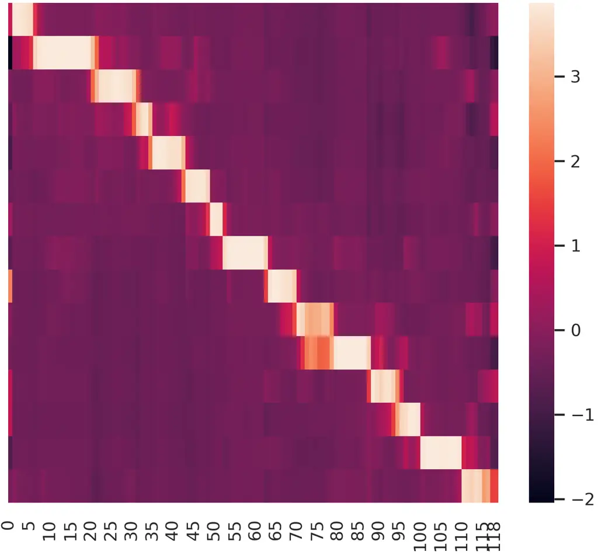

Papi Fucci Gaido Negri Bentivogli

# Cross-Attention is Half Explanation in Speech-to-Text Models

Sara    Dennis    Marco    Matteo    Luisa

###### Abstract

Cross-attention is widely used in speech-to-text (S2T) systems and often
exploited for downstream applications such as timestamp prediction and
speech-text alignment, under the assumption that it reflects
input-output dependencies. While extensively debated in NLP, its
explanatory role remains underexplored in the speech domain. We
empirically assess the explanatory power of cross-attention in S2T
models by comparing attention scores with input saliency maps from
feature-attribution methods. Our analysis spans monolingual and
multilingual, single-task and multi-task models at multiple scales. We
find moderate alignment between attention and saliency, particularly
when aggregating across heads and layers. However, cross-attention
captures only about 50% of input relevance and, at best, 52-75% of the
encoder saliency. These results show that cross-attention offers useful
but incomplete explanatory cues and should be interpreted with caution
as a proxy for model behavior in S2T systems.

###### keywords

speech recognition, speech translation, explainability, attention,
speech-to-text, XAI, ASR, ST

^(†)^(†)address: Fondazione Bruno Kessler, Italy ^(†)^(†)email:
{spapi,mgaido,negri,bentivo}@fbk.eu, dennis.fucci@gmail.com

## 1 Introduction

Cross-attention \[1\] is the core mechanism of the encoder-decoder
Transformer architecture \[2\], a model that has become foundational
across numerous AI domains \[3, 4, 5, 6, 7\], including natural language
processing (NLP). Designed for modeling dependencies between the
generated output sequence and the input representations, the
cross-attention scores–derived from the attention mechanism–have been
leveraged in various NLP tasks \[8, 9\], such as source-target textual
alignment \[10, 11\], co-reference resolution \[12\], and word sense
disambiguation \[13\].

In speech-to-text (S2T) modeling, cross-attention scores have been
widely repurposed for diverse downstream applications such as audio-text
alignment \[14, 15\], speaker identification \[16\], timestamp
estimation \[17, 18, 19\], and guiding simultaneous automatic speech
recognition (ASR) and speech translation (ST) \[20, 21, 22\]. These
applications rely on the implicit assumption that cross-attention
reliably indicates what the model attends to in the input signal during
output generation. However, despite its widespread use, this assumption
has never been verified. A key concern is that cross-attention operates
over the encoder’s output sequence–rather than directly on the raw
audio–which may have been reorganized or mixed with contextual
information. This phenomenon, known as context mixing \[23\], can
potentially obscure the alignment between cross-attention weights and
the original input signal. Similar concerns have been extensively
debated in the NLP community, where the reliability of attention
mechanisms as explanations has been both challenged and defended,
leading to conflicting perspectives and empirical evidence \[24, 25, 26,
27\]. In contrast, this question remains largely underexplored in the
speech domain. Existing work on explainability in S2T has primarily
focused on self-attention \[28, 29, 30\], or on empirically measuring
the effects of context mixing \[31\], without directly assessing the
explanatory potential of cross-attention mechanisms.

To address this gap, we present the first systematic analysis of
cross-attention as a proxy for input-output dependencies in S2T models.
Our study serves two main objectives: i) assessing the validity of using
cross-attention as a surrogate for input-output alignment, and ii)
evaluating whether it provides insights comparable to formal
explainability methods such as feature attribution–while being more
lightweight and less computationally expensive to obtain \[32, 33\]. We
compare cross-attention scores with input saliency maps derived from
SPES \[34\], the current state-of-the-art feature-attribution method in
S2T, to determine the extent to which cross-attention captures which
input features are relevant for models’ predictions. In addition, we
compute saliency maps on encoder outputs and compare them with
cross-attention scores to evaluate whether cross-attention fully
explains how the decoder uses encoded representations, avoiding
potential context mixing effects. Our analysis spans ASR and ST tasks
across monolingual, multilingual, and multitask settings using
state-of-the-art speech processing architectures \[35\] at multiple
scales. With consistent trends across different settings, we find that
cross-attention exhibits moderate to strong correlations with input
saliency maps and aligns more closely with encoder output
representations, suggesting an influence of context mixing. However, the
results also show that the overall explanatory power of cross-attention
is limited–accounting for only $`\sim`$50% of input relevance and, at
best, 52-75% of encoder output saliency. Our findings uncover
fundamental limitations in interpreting cross-attention as an
explanatory proxy, suggesting that it provides an informative yet
incomplete view of the factors driving predictions in S2T models.

## 2 Related Works

Explainability in Speech-to-Text. Explainable AI (XAI) has emerged to
make model behavior more interpretable to humans, thereby supporting
informed decision-making and responsible deployment \[36\]. While XAI
research has seen a rapid growth in the last years across multiple
modalities, including vision and language \[37\], progress in the speech
domain has lagged. This gap arises from the inherent complexities of
speech processing, including the multidimensional nature of speech
signals across time and frequency, and the variability in output
sequence length \[38\]. Despite these challenges, growing concerns about
trustworthiness are driving explainability efforts in speech
classification \[39, 40\] and S2T generation \[41, 38, 34, 42, 43, 44\].
Most of these works rely on perturbation-based methods that assess how
input modifications affect model predictions \[45, 46\]. Among these,
\[34\] recently proposed a technique for autoregressive S2T models that
identifies regions of the spectrogram that most influence predictions to
generate saliency maps. However, XAI methods are generally
computationally expensive–especially perturbation-based approaches
applied to large models \[47, 48\]–which motivates exploring whether
cross-attention, already computed at inference time, could serve as a
lightweight alternative in a landscape still lacking efficient
explainability tools for speech models.

Attention as Explanation. Attention mechanisms have been widely used to
probe model behavior in text-based NLP, as attention scores often align
with human intuitions about relevance and salience \[49, 50\]. Early
studies proposed norm-based analyses to improve the interpretability of
attention weights \[51, 52, 53, 54\], while others suggested aggregating
attention across layers and heads to quantify input-output influence
more systematically \[55, 56, 57\]. While some raised concerns about
whether attention reliably reflects which inputs are actually
responsible for outputs \[25, 24, 27\], others proposed conditions under
which attention can meaningfully explain model behavior \[26\]. More
recent work highlights that attention aggregation may obscure localized,
token-specific interactions \[58, 59, 60\], motivating hybrid approaches
that combine attention with other XAI techniques, such as attribution
methods \[61\], or the use of attention as a regularization signal
during interpretability-driven training \[62\]. Despite the ongoing
efforts, most research has focused on self-attention within encoders,
with limited attention to feed-forward dynamics \[63\] and even less to
encoder-decoder models. A few studies have investigated attention in
encoder-decoder architectures \[64\], including in machine translation
\[65\], but cross-attention remains largely underexplored in the speech
domain and absent from the broader “attention as explanation” debate in
NLP. Our work seeks to bridge this gap by bringing cross-attention of
S2T models into this broader conversation, aiming to assess whether it
can serve as a reliable explanation–and where its limitations emerge.

## 3 Methodology

We assess the extent to which cross-attention scores ($`\mathbf{CA}`$)
explain how the model looks at input features when generating a token by
comparing them to the saliency map on the input
$`\text{{\color[rgb]{0.0078,0.6523,0.9688}$\mathbf{SM}$}}^{X}`$,
obtained with the state-of-the art feature-attribution method for S2T,
SPES \[34\]. Additionally, to assess whether cross-attention more
accurately reflects how the decoder accesses encoded
representations–rather than capturing the model’s full input-output
behavior–we compare $`\mathbf{CA}`$ with the encoder-output saliency map
$`\text{{\color[rgb]{0.0078,0.6523,0.9688}$\mathbf{SM}$}}^{H}`$. By
analyzing how the correlation between $`\mathbf{CA}`$ and
$`\text{{\color[rgb]{0.0078,0.6523,0.9688}$\mathbf{SM}$}}^{H}`$ deviates
from that with
$`\text{{\color[rgb]{0.0078,0.6523,0.9688}$\mathbf{SM}$}}^{X}`$, we can
indirectly quantify the impact of context mixing in the resulting
explanations. A visual representation is presented in Figure 1.



Figure 1: Visual representation of which part of the model is covered by
input saliency maps
$`\text{{\color[rgb]{0.0078,0.6523,0.9688}$\mathbf{SM}$}}^{X}`$ and
encoder output saliency maps
$`\text{{\color[rgb]{0.0078,0.6523,0.9688}$\mathbf{SM}$}}^{H}`$.

In the following, we first discuss how we extract $`\mathbf{CA}`$ scores
(§3.1), then how we compute
$`\text{{\color[rgb]{0.0078,0.6523,0.9688}$\mathbf{SM}$}}^{X}`$ and
$`\text{{\color[rgb]{0.0078,0.6523,0.9688}$\mathbf{SM}$}}^{H}`$ (§3.2),
and how we compare them (§3.3).

### 3.1 Cross-Attention in Speech-to-Text

In S2T models, the cross-attention mechanism enables each output token
to integrate relevant portions of the encoded speech features,
conditioning generation on the entire input. Let
$`\mathbf{X}\in\mathbb{R}^{T\times F}`$ denote the speech input
represented by mel-spectrogram features, where $`T`$ is the number of
time frames and $`F`$ the number of frequency bins. The encoder
processes $`\mathbf{X}`$ into a sequence of hidden representations
$`\mathbf{H}=\mathrm{Encoder}(\mathbf{X})\in\mathbb{R}^{T^{\prime}\times D}`$,
where $`T^{\prime}<T`$ reflects the number of encoder time steps after
subsampling with a factor of $`s`$¹¹ 1 As the length of the speech
inputs is, in general, 10$`\times`$ longer that of the corresponding
textual input, it is a common practice in S2T modeling to downsample the
input through convolutional modules \[66\]. and $`D`$ is the hidden
dimensionality. The decoder then autoregressively generates an output
sequence $`\mathbf{y}=(y_{0},y_{1},\ldots,y_{I})`$ of length $`I`$,
where each token $`y_{i}`$ is predicted based on the previously
generated tokens $`y_{<i}`$ and the encoder output $`\mathbf{H}`$. At
each decoder layer $`\ell\in\{1,\ldots,L\}`$, cross-attention scores are
computed via dot-product attention \[67\] between the decoder’s current
hidden states $`\mathbf{B}^{(\ell)}\in\mathbb{R}^{I\times D}`$ and the
encoder outputs $`\mathbf{H}`$. Specifically, the decoder states are
linearly projected to queries
$`\mathbf{Q}^{(\ell)}=\mathbf{B}^{(\ell)}\mathbf{W}_{Q}^{(\ell)}\in\mathbb{R}^{I\times d_{k}}`$,
while the encoder outputs are projected to keys
$`\mathbf{K}^{(\ell)}=\mathbf{H}\mathbf{W}_{K}^{(\ell)}\in\mathbb{R}^{T^{\prime}\times d_{k}}`$
using learned projection matrices
$`\mathbf{W}_{Q}^{(\ell)},\mathbf{W}_{K}^{(\ell)}`$. The resulting
cross-attention matrix $`\mathbf{CA}`$ is:

```math
\text{{\color[rgb]{0.7539,0.3906,0.9609}$\mathbf{CA}$}}^{(\ell)}=\mathrm{softmax}\left(\frac{\mathbf{Q}^{(\ell)}\mathbf{K}^{(\ell)\top}}{\sqrt{d_{k}}}\right)\in\mathbb{R}^{I\times T^{\prime}}
```

where each row
$`\text{{\color[rgb]{0.7539,0.3906,0.9609}$\mathbf{CA}$}}^{(\ell)}_{i}`$
represents the attention over encoder time steps for generating token
$`y_{i}`$ at layer $`\ell`$. To capture diverse patterns, models employ
multi-head attention \[2\], where each head $`h\in\{1,\ldots,H\}`$ uses
separate learned projections:

```math
\mathbf{Q}_{h}^{(\ell)}=\mathbf{B}^{(\ell)}\mathbf{W}_{Q,h}^{(\ell)},\quad\mathbf{K}_{h}^{(\ell)}=\mathbf{H}\mathbf{W}_{K,h}^{(\ell)}
```

where $`\mathbf{W}_{Q,h}^{(\ell)}\in\mathbb{R}^{D\times d_{k}}`$, and
$`\mathbf{W}_{K,h}^{(\ell)}\in\mathbb{R}^{D\times d_{k}}`$. These
projections are used to compute head-specific attention scores, yielding
one attention matrix per head and layer:
$`\{\text{{\color[rgb]{0.7539,0.3906,0.9609}$\mathbf{CA}$}}_{h}^{(\ell)}\}_{\ell=1,h=1}^{L,H}`$.

Extracting the full set of scores provides a fine-grained view of how
each output token in the generated hypothesis attends to the encoder’s
representations across all layers and heads. To derive a single
layer-wise or head-wise attention distribution, we compute the mean of
the attention matrices over a subset
$`\mathcal{S}\subseteq\{1,\dots,L\}\times\{1,\dots,H\}`$ of layers and
heads:

```math
\widebar{\text{{\color[rgb]{0.7539,0.3906,0.9609}$\mathbf{CA}$}}}^{(\mathcal{S})}=\frac{1}{|\mathcal{S}|}\sum_{(\ell,h)\in\mathcal{S}}\text{{\color[rgb]{0.7539,0.3906,0.9609}$\mathbf{CA}$}}_{h}^{(\ell)}\in\mathbb{R}^{I\times T^{\prime}}
```

By selecting different index sets $`\mathcal{S}`$, this formulation
yields layer-wise, head-wise, or global averages (e.g., setting
$`\mathcal{S}=\{(\ell,h):h=1,\dots,H\}`$ gives the average across heads
at a given layer $`\ell`$; $`\mathcal{S}=\{(\ell,h):\ell=1,\dots,L\}`$
averages across layers for head $`h`$; and
$`\mathcal{S}=\{1,\dots,L\}\times\{1,\dots,H\}`$ computes the full
average). These averages provide aggregated views of the model’s
attention patterns at a specific layer or head, summarizing how the
model attends to the input speech over time.

### 3.2 Feature Attribution for Speech-to-Text

To analyze how S2T models associate output tokens with regions of the
speech input or internal representations (e.g., encoder outputs), we
employ feature-attribution methods that generate token-level saliency
maps, quantifying the relevance of different input segments to each
prediction.

Input Saliency Maps. Let $`\mathbf{X}\in\mathbb{R}^{T\times F}`$ denote
a mel-spectrogram input, where $`T`$ is the number of time frames and
$`F`$ the number of frequency bins, and
$`\mathbf{y}=(y_{0},y_{1},\ldots,y_{I})`$ the sequence of length $`I`$
of the autoregressively-generated tokens predicted based on the input
and the previously generated tokens $`y_{<i}`$. To attribute the
prediction of each token $`y_{i}`$ to specific parts of the input
spectrogram, we adopt SPES \[34\], the state-of-the-art
feature-attribution method designed for autoregressive S2T modeling.
SPES assigns a saliency score to each time-frequency element of
$`\mathbf{X}`$, producing a saliency map
$`\text{{\color[rgb]{0.0078,0.6523,0.9688}$\mathbf{SM}$}}_{i}^{X}\in\mathbb{R}^{T\times F}`$
for each token $`y_{i}`$, where higher values indicate greater relevance
of the corresponding time-frequency regions. SPES operates by clustering
spectrogram elements based on energy profiles–capturing acoustic
components such as harmonics and background noise–and estimating the
influence of each cluster by perturbing it with probability $`p_{X}`$,
repeated $`N_{X}`$ times. The effect of each perturbation–i.e., masking
parts of the input with 0 values–is measured by computing the
Kullback-Leibler (KL) divergence \[68\] between the model’s original
output distribution $`P(y_{i}\mid y_{<i},\mathbf{X})`$ and the
distribution resulting from the perturbed input
$`P^{(n)}(y_{i}\mid y_{<i},\tilde{\mathbf{X}}^{(n)})`$ at time
$`n\in\{1,\ldots,N_{X}\}`$:

```math
\mathrm{KL}^{(n)}_{i}=\mathrm{KL}\left(P(y_{i}\mid y_{<i},\mathbf{X})\,\|\,P^{(n)}(y_{i}\mid y_{<i},\tilde{\mathbf{X}}^{(n)})\right)
```

The divergence scores are then mapped back to the corresponding cluster
positions in the spectrogram and aggregated to form the token-specific
saliency map
$`\text{{\color[rgb]{0.0078,0.6523,0.9688}$\mathbf{SM}$}}_{i}^{X}\in\mathbb{R}^{T\times F}`$.
Stacking all saliency maps across the output $`\mathbf{y}`$ yields a 3D
saliency map:

```math
\text{{\color[rgb]{0.0078,0.6523,0.9688}$\mathbf{SM}$}}^{X}=(\text{{\color[rgb]{0.0078,0.6523,0.9688}$\mathbf{SM}$}}_{0}^{X},\text{{\color[rgb]{0.0078,0.6523,0.9688}$\mathbf{SM}$}}_{1}^{X},\ldots,\text{{\color[rgb]{0.0078,0.6523,0.9688}$\mathbf{SM}$}}_{I}^{X})\in\mathbb{R}^{I\times T\times F}
```

where each slice
$`\text{{\color[rgb]{0.0078,0.6523,0.9688}$\mathbf{SM}$}}_{i}^{X}[t,f]`$
quantifies the contribution of the spectrogram bin at time $`t`$ and
frequency $`f`$ to the token $`y_{i}`$.

Encoder Output Saliency Maps. We further examine the influence of the
encoder’s internal representations on the prediction of each output
token. Let
$`\mathbf{H}=\mathrm{Encoder}(\mathbf{X})\in\mathbb{R}^{T^{\prime}\times D}`$
denote the sequence of encoder hidden states or encoder output, where
$`T^{\prime}`$ is the subsampled time dimension and $`D`$ is the hidden
dimension. To assess the importance of the encoder output
representations, we compute token-specific saliency maps
$`\text{{\color[rgb]{0.0078,0.6523,0.9688}$\mathbf{SM}$}}_{i}^{H}\in\mathbb{R}^{T^{\prime}\times 1}`$,
where each entry reflects the contribution of the hidden state to the
generation of $`y_{i}`$. Each encoder state
$`\mathbf{H}=(\mathbf{h}_{1},\ldots,\mathbf{h}_{T^{\prime}})`$ is
perturbed–setting all features to 0–independently with probability
$`p_{H}`$, and the process is repeated $`N_{H}`$ times. The KL
divergence is computed for each perturbation between the original and
perturbed output distributions:

```math
\mathrm{KL}^{(n)}_{i}=\mathrm{KL}\left(P(y_{i}\mid y_{<i},\mathbf{H})\,\|\,P^{(n)}(y_{i}\mid y_{<i},\tilde{\mathbf{H}}^{(n)})\right)
```

The divergence scores are aggregated across perturbation trials to form
the final saliency map, following the same strategy of SPES for the
input-level saliency maps:

```math
\text{{\color[rgb]{0.0078,0.6523,0.9688}$\mathbf{SM}$}}^{H}=(\text{{\color[rgb]{0.0078,0.6523,0.9688}$\mathbf{SM}$}}_{0}^{H},\text{{\color[rgb]{0.0078,0.6523,0.9688}$\mathbf{SM}$}}_{1}^{H},\ldots,\text{{\color[rgb]{0.0078,0.6523,0.9688}$\mathbf{SM}$}}_{I}^{H})\in\mathbb{R}^{I\times T^{\prime}}
```

where $`\text{{\color[rgb]{0.0078,0.6523,0.9688}$\mathbf{SM}$}}^{H}`$
captures the temporal relevance of the encoder’s internal sequence
representations for each output token $`y_{i}`$.

### 3.3 Correlation

Since our focus lies in the temporal dynamics of the input
$`\mathbf{X}`$, we aggregate the 3D saliency scores
$`\text{{\color[rgb]{0.0078,0.6523,0.9688}$\mathbf{SM}$}}^{X}\in\mathbb{R}^{I\times T\times F}`$
across the frequency dimension and downsample the time axis to produce a
compressed representation
$`\text{{\color[rgb]{0.0078,0.6523,0.9688}$\mathbf{SM}$}}^{X}\in\mathbb{R}^{I\times T^{\prime}}`$
compatible with the cross-attention granularity, where $`T^{\prime}`$
corresponds to the number of encoder time steps. The aggregation is
performed by taking the maximum saliency value over the frequency axis
and within each corresponding time window. The resulting saliency map of
each token
$`\text{{\color[rgb]{0.0078,0.6523,0.9688}$\mathbf{SM}$}}_{i}^{X}\in\mathbb{R}^{T^{\prime}\times 1}`$
reflects the temporal relevance of the input spectrogram with respect to
the generation of token $`y_{i}`$. Complementary experiments on the
choice of the aggregation function are presented in §4.4. Both
$`\mathbf{CA}`$ and $`\mathbf{SM}`$ representations are normalized
before computing the correlation scores, and the beginning and end of
sentence are removed as they are not relevant for the analysis. The
$`\mathbf{CA}`$ matrix is normalized frame-wise using mean-variance
normalization to mitigate the impact of potential attention sinks at
initial or final tokens \[49, 69, 21, 70\] on the correlation
computation. Both
$`\text{{\color[rgb]{0.0078,0.6523,0.9688}$\mathbf{SM}$}}^{X}`$ and
$`\text{{\color[rgb]{0.0078,0.6523,0.9688}$\mathbf{SM}$}}^{H}`$ are
normalized along the token dimension using the strategy proposed by
\[34\], as saliency scores can vary widely across tokens due to
differences in the original output distributions used to compute the KL
divergence.

Following prior work on cross-attention analysis \[71\] and explainable
AI \[72\], we use Pearson correlation to quantify the relationship
between cross-attention scores and saliency-based explanations. Pearson
is preferred over rank-based measures (Kendall, Spearman) because
saliency scores are continuous and their magnitude–not just their
ordering–is meaningful. In particular, rank-based correlations are
highly sensitive to arbitrary ordering among non-informative features
with near-zero scores, whereas Pearson better reflects agreement on
whether a feature is important (high saliency) or not (low saliency).
Specifically, given
$`\text{{\color[rgb]{0.7539,0.3906,0.9609}$\mathbf{CA}$}},\text{{\color[rgb]{0.0078,0.6523,0.9688}$\mathbf{SM}$}}\in\mathbb{R}^{I\times T^{\prime}}`$,
we compute the Pearson correlation coefficient $`\rho`$ to assess the
similarity of their attribution patterns across output tokens and time
steps. We first flatten each matrix into a vector of size
$`I\cdot T^{\prime}`$:

```math
\mathbf{ca}=\mathrm{vec}(\text{{\color[rgb]{0.7539,0.3906,0.9609}$\mathbf{CA}$}}),\quad\mathbf{sm}=\mathrm{vec}(\text{{\color[rgb]{0.0078,0.6523,0.9688}$\mathbf{SM}$}}),\quad\mathbf{ca},\mathbf{sm}\in\mathbb{R}^{I\cdot T^{\prime}}
```

The Pearson correlation coefficient $`\rho\in[-1,1]`$ is computed as:

```math
\rho(\text{{\color[rgb]{0.7539,0.3906,0.9609}$\mathbf{CA}$}},\text{{\color[rgb]{0.0078,0.6523,0.9688}$\mathbf{SM}$}})=\frac{\sum_{k=1}^{I\cdot T^{\prime}}(\mathbf{ca}_{k}-\widebar{\mathbf{ca}})(\mathbf{sm}_{k}-\widebar{\mathbf{sm}})}{\sqrt{\sum_{k=1}^{I\cdot T^{\prime}}(\mathbf{ca}_{k}-\widebar{\mathbf{ca}})^{2}}\sqrt{\sum_{k=1}^{I\cdot T^{\prime}}(\mathbf{sm}_{k}-\widebar{\mathbf{sm}})^{2}}}
```

where $`\widebar{\mathbf{ca}}`$ and $`\widebar{\mathbf{sm}}`$ denote the
means of vectors $`\mathbf{ca}`$ and $`\mathbf{sm}`$:

```math
\widebar{\mathbf{ca}}=\frac{1}{I\cdot T^{\prime}}\sum_{k=1}^{I\cdot T^{\prime}}\mathbf{ca}_{k},\quad\widebar{\mathbf{sm}}=\frac{1}{I\cdot T^{\prime}}\sum_{k=1}^{I\cdot T^{\prime}}\mathbf{sm}_{k}
```

This scalar quantifies the linear relationship between the two saliency
maps, with values closer to 1 indicating a strong positive correlation,
and values near 0 indicating no correlation.

## 4 Experimental Settings

### 4.1 Models

To avoid potential data contamination issues \[73\], we trained from
scratch a monolingual ASR model and used two-sized multitask (ASR and
ST) and multilingual (English and Italian) open-science models, FAMA
\[74\], for which training data are completely open. All models are
based on a Conformer encoder \[35\] and a Transformer decoder, as
Conformer is the current state-of-the-art architecture for S2T
processing \[75, 76, 77\]. The monolingual ASR model (base) is composed
of 12 encoder layers and 6 decoder layers. Each layer has 8 attention
heads, 512 as embedding dimension, and FFNs dimension of 2,048. The
vocabulary is built using a SentencePiece unigram model \[78\] with size
8,000 trained on en transcripts. The resulting number of parameters is
125M. The multitask and multilingual FAMA models are of two sizes, small
and large, the first having 12 encoder layers and 6 decoder layers and
the latter having 24 encoder layers and 12 decoder layers. In both
sizes, each layer has 16 attention heads, an embedding dimension of
1,024, and an FFN dimension of 4,096. The vocabulary is built using a
SentencePiece unigram model with size 16,000 trained on en and it
transcripts. Two extra tokens–\<lang:en\> and \<lang:it\>–indicate
whether the target text is in en or it. The resulting number of
parameters is 474M for the small model and 878M for the large model. In
all models, the Conformer encoder is preceded by two 1D convolutional
layers with stride 2 and kernel size 5, resulting in a fixed subsampling
factor $`s`$ of 4. The kernel size of the Conformer convolutional module
is 31 for both the point- and depth-wise convolutions. The input audio
is represented by 80 Mel-filterbank features extracted every 10 ms with
a window of 25 ms.

All models were trained using a combination of three losses: _i)_ a
label-smoothed cross-entropy loss applied to the decoder output using
the target text as the reference (transcripts for ASR and translations
for ST), _ii)_ a CTC loss \[79\] computed using transcripts as reference
on the output of the 8^(th) encoder layer for base and small and the
16^(th) for medium, _iii)_ a CTC loss on the final encoder output
applied to predict the target text \[80\]. FAMA models followed a
two-stage training procedure: ASR-only pre-training followed by joint
ASR+ST training. For ASR pre-training, the small model used the same
schedule as the base model, while the medium model adopted a piecewise
warm-up to avoid divergence \[81, 82\]. During ASR+ST training, ASR and
ST targets were sampled with equal probability, and lr was fixed at a
constant value. All training were done using the FBK-fairseq repository
\[83\].

### 4.2 Data

For the monolingual ASR model, we leverage the speech-to-text English
data available for the [IWSLT 2024](https://iwslt.org/2024/offline)
evaluation campaign, namely: CommonVoice \[84\], CoVoST v2 \[85\],
Europarl-ST \[86\], LibriSpeech \[87\], MuST-C v1 \[88\], TEDLIUM v3
\[89\], and VoxPopuli ASR \[90\]. The resulting training set is about 3k
hours of speech. For the multitask (ASR and ST) multilingual large-scale
models, more than 150k hours of open-source speech in English (en) and
Italian (it) were used: CommonVoice, CoVoST v2, FLEURS \[91\], MOSEL
\[92\], MLS \[93\], and
[YouTube-Commons](https://hf.co/datasets/PleIAs/YouTube-Commons). For
datasets missing the translations, they were generated using MADLAD-400
3B-MT \[94\]. This setting allows us to verify our analysis with a
large-scale setting similar to the scale of a popular model, such as
OWSM \[95\] and 2 times that of NVIDIA Canary \[96\] while having
complete control of data used during training, completely preventing
data contamination issues. Being the only non-synthetic dataset
supporting both tasks and language directions, we select EuroParl-ST
\[86\] as the test set for our analyses. The test set covers both en and
it ASR, and en-it and it-en ST. The it/it-en section consists of 1,686
segments, for a total of approximately 6 hours of audio, while the
en/en-it section contains 1,130 segments, for a total of approximately 3
hours of audio.

### 4.3 Evaluation Process

Hypothesis and Cross-Attention Generation. Hypotheses are generated
using beam search with beam 5 and a no-repeat n-gram 5. Attention scores
are extracted from the selected layers or heads during decoding. ASR and
ST quality metrics are reported in §4.5. Inference is performed on a
single NVIDIA A40 GPU (40GB) with a batch size of 40k tokens, taking
approximately 2.5 minutes for base, 3/5.5 minutes for small, and 3/6.5
minutes for large, depending on the language.

Explanation Heatmaps Generation. Following the best SPES configuration
\[34\], we use the Morphological Fragmental Perturbation Pyramid \[97\]
for clustering, based on SLIC \[98\], a k-means-based algorithm that
groups elements by spectral similarity. Default parameters are adopted:
a threshold length of 7.5 s,
[SLIC](https://scikit-image.org/docs/dev/api/skimage.segmentation.html#skimage.segmentation.slic)
sigma set to 0, compactness to 0.1, and MFPP patch rates of \[400, 500,
600\] per second. We set $`p_{X}=0.5`$ and $`N_{X}=20{,}000`$ following
\[34\]. Input explanation quality is reported in §4.5. For hidden
representations, we fix $`N_{H}=20{,}000`$ (i.e., the same number of
iterations of $`N_{X}`$) and tune $`p_{H}`$ on the dev set, obtaining
$`p_{H}=0.7`$. Inference is performed using a single NVIDIA A40 GPU
(40GB RAM) and takes $`\sim`$27 hours for base, $`\sim`$3-4 days for
small and $`\sim`$6-8 days for large, depending on the language.

Correlation Computation. The Pearson $`r`$ correlation score is computed
using the scipy implementation and averaging across samples in the test
set.

All outputs and the aggregation script are released under the CC-BY 4.0
and Apache 2.0 licenses, respectively, at: [FBK
SharePoint](https://fbk-my.sharepoint.com/:f:/g/personal/spapi_fbk_eu/IgC8uMU4Ig69QISVwFE-IMCeATH_l7rvQLftzkFr3Rc9XUY?e=hvl6w8).



Figure 2: An example of
$`\text{{\color[rgb]{0.0078,0.6523,0.9688}$\mathbf{SM}$}}^{X}`$ maps for
the predicted sentence “What is important are the options, not
quantity”. The frequency axis is represented in Hertz on a logarithmic
scale.

| Aggregation |        |            |            |            |            |            |            |              |                      |
| ----------- | ------ | ---------- | ---------- | ---------- | ---------- | ---------- | ---------- | ------------ | -------------------- |
| frequency   | time   | $`\ell=1`$ | $`\ell=2`$ | $`\ell=3`$ | $`\ell=4`$ | $`\ell=5`$ | $`\ell=6`$ | $`\ell`$-AVG | ASR Del.$`\uparrow`$ |
| 2D avg      |        | 0.090      | 0.142      | 0.355      | 0.434      | 0.457      | 0.466      | 0.459        | 53.03                |
| 1D max      | 1D avg | 0.115      | 0.176      | 0.441      | 0.534      | 0.560      | 0.565      | 0.565        | 55.18                |
| 2D max      |        | 0.115      | 0.180      | 0.443      | 0.540      | 0.572      | 0.582      | 0.572        | 57.04                |

Table 1: Pearson $`\rho`$ correlation between layer-wise ($`\ell`$)
cross-attention and the explanations, and the deletion scores (ASR Del.)
for the different aggregation functions of the monolingual ASR model on
English (base) on the dev set. The layer average ($`\ell`$-AVG)
correlation is computed between the averaged cross-attention across
layers
($`\widebar{\text{{\color[rgb]{0.7539,0.3906,0.9609}$\mathbf{CA}$}}}^{(\ell)}`$)
and the input explanations $`\mathbf{SM}`$^($`X`$). Bold indicates the
highest result, underline indicates the highest layer-wise correlation.

### 4.4 Effect of Aggregation Functions on Input Explanations

To properly obtain input-level explanations comparable with the
dimensions of cross-attention scores (i.e., making
$`\text{{\color[rgb]{0.0078,0.6523,0.9688}$\mathbf{SM}$}}^{X}\in\mathbb{R}^{I\times T^{\prime}}`$),
we explore the effect of different aggregation strategies over the time
and frequency dimensions.

To compare and select the best aggregation strategy, we adopt the
deletion metric \[99\], which quantifies the decline in prediction
quality as the most relevant input frames–identified by the
explanation–are progressively removed. Specifically, we adapt the
implementation by \[34\] for S2T tasks, replacing the top-ranked time
frames in the input spectrogram $`\mathbf{X}`$ with zero vectors in 5%
increments, based on the aggregated saliency map
$`\text{{\color[rgb]{0.0078,0.6523,0.9688}$\mathbf{SM}$}}^{X}`$. Since
$`\text{{\color[rgb]{0.0078,0.6523,0.9688}$\mathbf{SM}$}}^{X}`$ operates
on an aggregated time dimension $`T^{\prime}`$, which is smaller than
the original time dimension $`T`$ of $`\mathbf{X}`$, we upsample
$`T^{\prime}`$ to match $`T`$ using nearest-neighbor interpolation.
Prediction quality is measured using the word error rate (WER),
specifically the wer_max scorer from the [SPES
repository](https://github.com/hlt-mt/FBK-fairseq). Lastly, we compute
the area under the WER curve to quantify the faithfulness of each
explanation method.

Table 1 reports the deletion scores and, for completeness, the Pearson
$`\rho`$ correlations between the cross attention scores $`\mathbf{CA}`$
and the saliency maps $`\mathbf{SM}`$^($`X`$) for the representations
aggregated following three strategies:

- •
  2D average pooling, applied over the entire time-frequency plane to
  obtain its average value and computed through adaptive_avg_pool2d;
- •
  2-step pooling (1D maximum + 1D average), where max pooling is applied
  along the frequency axis, followed by averaging over time, and
  computed by applying max_pool1d and avg_pool1d, respectively;
- •
  2D maximum pooling, applied over the entire time-frequency plane to
  obtain its maximum value and computed through adaptive_max_pool2d.

The aggregation functions²² 2 All implemented in
[pyTorch.nn.functional](https://docs.pytorch.org/docs/stable/nn.functional.html).
were selected to contrast methods that either isolate the most relevant
features (with maximum pooling) or represent their mean relevance (with
average pooling). Similarly, the 2-step approach has been tried to first
isolate relevance patterns in the frequency domain, a dimension that is
not present in cross-attention representation, and then average across
the time dimension to match the downsampled time resolution of the
cross-attention scores.

Among the tested methods, we observe that the 2D maximum pooling
aggregation (2D max) yields the best quality explanations, obtaining the
highest deletion score, while the 2D average pooling (2D avg) is the
worst, with the lowest deletion scores. About correlations, we notice
that they follow the same trend of deletion scores, with 2D max yielding
the best $`\rho`$. In particular, 2D avg consistently has the lowest
correlations compared to the 2D max, particularly in the last layers
(e.g., 0.457 vs. 0.572 at layer 5). Regarding the 2-step pooling
approach, we not only observe an improved deletion score but also better
correlation scores compared to 2D avg, especially from layer 3 onward,
approaching the best performance with a layer-average correlation of
0.565. Nevertheless, the explanation quality is still lower compared to
2D max (55.18 vs. 57.04), which also achieves the highest correlations
at nearly every layer, peaking at 0.582 in layer 6, and yielding the
best overall correlation among the averaged cross-attention across
layers (0.572). These results indicate that global averaging over time
and frequency may obscure localized salient regions, and this is
particularly impactful in the frequency dimension, where preserving
saliency seems to play a crucial role. This is due to the fact that key
elements in the saliency maps are often well localized along the
frequency axis. As shown in Figure 2, for all tokens saliency
consistently concentrates in specific frequency bands. These bands are
typically below 2000 Hz, where many resonant frequencies for speech are
found \[100\]. As a result, smoothing operations such as 2D average
pooling–or, to a lesser extent, the 2-step approach–tend to blur these
concentrated regions, thereby diluting the saliency. This observation
motivates our choice to adopt 2D max pooling in the main experiments.

### 4.5 Quality Metrics for the Reported Models

The ASR quality is evaluated with the WER metric using
[jiWER](https://pypi.org/project/jiwer) and applying the [Whisper text
normalizer](https://pypi.org/project/whisper-normalizer). The quality of
the ST hypotheses is evaluated using COMET \[101\] version 2.2.4, with
the default model. The quality of the explanations is obtained by
measuring both deletion and size metrics available in the SPES
repository, using wer_max as the scorer for ASR and bleu for ST, as
described in \[34\].

|           |                       |      |                        |       |
| --------- | --------------------- | ---- | ---------------------- | ----- |
| Model     | WER $`\downarrow`$    |      | COMET $`\uparrow`$     |       |
|           | en                    | it   | en-it                  | it-en |
| Whisper   | 10.6                  | 9.0  | -                      | 0.797 |
| Seamless  | 11.3                  | 9.0  | 0.795                  | 0.813 |
| OWSM v3.1 | 11.9                  | 17.0 | 0.634                  | 0.559 |
| base      | 9.5                   | -    | -                      |       |
| small     | 11.7                  | 22.3 | 0.854                  | 0.754 |
| large     | 11.1                  | 21.7 | 0.862                  | 0.765 |
| Model     | ASR Del. $`\uparrow`$ |      | ST Del. $`\downarrow`$ |       |
|           | en                    | it   | en-it                  | it-en |
| base      | 91.3                  | -    | -                      |       |
| small     | 92.6                  | 97.0 | 2.4                    | 2.4   |
| large     | 90.8                  | 97.0 | 2.7                    | 2.3   |
| Model     | Size $`\downarrow`$   |      |                        |       |
|           | en                    | it   | en-it                  | it-en |
| base      | 29.7                  | -    | -                      |       |
| small     | 29.4                  | 28.2 | 30.0                   | 29.4  |
| large     | 30.6                  | 30.5 | 29.8                   | 28.7  |

Table 2: ASR and ST output quality (WER and COMET) and explanation
quality (deletion and size) for all models analyzed in the paper on the
EuroParl-ST test sets.

For comparison, in Table 2, we report results obtained from popular
large-scale models, namely Whisper \[102\], OWSM v3.1 \[81\], and
SeamlessM4T \[103\]. Looking at the transcription/translation quality
performance, we observe that both the monolingual base model and the
multitask multilingual small and large models are mostly able to achieve
competitive results, even outperforming the well-known models in two
cases (en ASR for base and en-it ST for large). While our models and
OWSM v3.1 strive to be on par on it with models with closed training
data (Whisper and Seamless), they are able to close the gap on en, most
probably given a larger availability of public training data. Moreover,
the highest performance of base on en ASR compared to the small and
large can be attributed to both the specialization of the model and the
presence of the EuroParl-ST training set in the training data. Moving to
the explanation quality, we observe that both deletion and size scores
are comparable across all three models analyzed in the paper and
coherent with values obtained in the original SPES paper \[34\] on
different benchmarks and models. Overall, the deletion scores for ASR
are close to the highest possible value (i.e., 100), especially on it,
where 97% is achieved. Similarly, the deletion scores for ST are close
to 0, indicating that the quality of explanations is very high. The size
scores are all close, ranging between 28.2 and 30.6 among models,
languages, and tasks, indicating a good compactness of the explanations.

## 5 Results

### 5.1 Does $`\mathbf{CA}`$ Reflect Input-Output Dependencies?

In this section, we compare $`\mathbf{CA}`$ with input saliency maps
$`\mathbf{SM}`$^($`X`$), which serve as an external reference for
measuring input relevance. Specifically, in §5.1.1, we analyze the base
model across all levels of granularity. Then, in Section 5.1.2, we
extend the analysis to additional models (small and large), languages
(en and it), and tasks (ASR and ST).

#### 5.1.1 Head-wise and Layer-wise Correlations

| Layer/Head   | $`h=1`$ | $`h=2`$ | $`h=3`$ | $`h=4`$ | $`h=5`$ | $`h=6`$ | $`h=7`$ | $`h=8`$ | $`h`$-AVG |
| ------------ | ------- | ------- | ------- | ------- | ------- | ------- | ------- | ------- | --------- |
| $`\ell=1`$   | 0.076   | -0.021  | 0.096   | 0.037   | 0.042   | 0.053   | -0.020  | 0.094   | 0.111     |
| $`\ell=2`$   | 0.013   | 0.122   | 0.039   | 0.171   | 0.123   | 0.089   | 0.119   | 0.041   | 0.178     |
| $`\ell=3`$   | 0.455   | 0.404   | 0.348   | 0.386   | 0.263   | 0.136   | 0.248   | 0.246   | 0.443     |
| $`\ell=4`$   | 0.452   | 0.344   | 0.227   | 0.405   | 0.314   | 0.512   | 0.414   | 0.495   | 0.546     |
| $`\ell=5`$   | 0.508   | 0.463   | 0.466   | 0.521   | 0.518   | 0.374   | 0.502   | 0.485   | 0.578     |
| $`\ell=6`$   | 0.377   | 0.394   | 0.508   | 0.386   | 0.517   | 0.371   | 0.424   | 0.322   | 0.588     |
| $`\ell`$-AVG | 0.546   | 0.456   | 0.455   | 0.574   | 0.529   | 0.541   | 0.525   | 0.500   | 0.577     |

Table 3: Pearson $`\rho`$ correlation between layer-wise ($`\ell`$) and
head-wise ($`h`$) cross-attention and the explanations for the
monolingual ASR model on English (base). The layer/head average
($`\ell`$-/$`h`$-AVG) correlation is computed between the averaged
cross-attention across layers/head
($`\widebar{\text{{\color[rgb]{0.7539,0.3906,0.9609}$\mathbf{CA}$}}}^{(\ell)}`$/$`\widebar{\text{{\color[rgb]{0.7539,0.3906,0.9609}$\mathbf{CA}$}}}_{h}`$)
and the input explanations $`\mathbf{SM}`$^($`X`$). Bold indicates the
highest correlation, underline indicates the highest layer-wise and
head-wise correlation. Low to high values are green, to yellow, to pink.

|                 |     |                 |            |            |            |            |            |            |            |            |            |             |             |             |              |
| --------------- | --- | --------------- | ---------- | ---------- | ---------- | ---------- | ---------- | ---------- | ---------- | ---------- | ---------- | ----------- | ----------- | ----------- | ------------ |
|                 |     | Target Language |            |            |            |            |            |            |            |            |            |             |             |             |              |
|                 |     | en              |            |            |            |            |            |            |            |            |            |             |             |             |              |
| Lang.           |     | Model           | $`\ell=1`$ | $`\ell=2`$ | $`\ell=3`$ | $`\ell=4`$ | $`\ell=5`$ | $`\ell=6`$ | $`\ell=7`$ | $`\ell=8`$ | $`\ell=9`$ | $`\ell=10`$ | $`\ell=11`$ | $`\ell=12`$ | $`\ell`$-AVG |
|                 |     | small           | 0.142      | 0.205      | 0.428      | 0.639      | 0.639      | 0.614      | -          |            |            |             |             |             | 0.633        |
|                 | en  | large           | 0.151      | 0.162      | 0.214      | 0.320      | 0.289      | 0.434      | 0.581      | 0.597      | 0.611      | 0.597       | 0.551       | 0.561       | 0.621        |
|                 |     | small           | 0.147      | 0.193      | 0.327      | 0.476      | 0.482      | 0.465      | -          |            |            |             |             |             | 0.485        |
|                 | it  | large           | 0.151      | 0.164      | 0.223      | 0.300      | 0.285      | 0.383      | 0.451      | 0.467      | 0.461      | 0.461       | 0.430       | 0.431       | 0.492        |
|                 |     | it              |            |            |            |            |            |            |            |            |            |             |             |             |              |
|                 |     | small           | 0.173      | 0.203      | 0.344      | 0.547      | 0.550      | 0.539      | -          |            |            |             |             |             | 0.549        |
|                 | en  | large           | 0.168      | 0.176      | 0.235      | 0.300      | 0.306      | 0.413      | 0.514      | 0.526      | 0.529      | 0.529       | 0.513       | 0.516       | 0.551        |
|                 |     | small           | 0.145      | 0.209      | 0.374      | 0.527      | 0.532      | 0.525      | -          |            |            |             |             |             | 0.539        |
| Source language | it  | large           | 0.169      | 0.157      | 0.215      | 0.324      | 0.297      | 0.407      | 0.501      | 0.503      | 0.516      | 0.518       | 0.479       | 0.482       | 0.544        |

Table 4: Person $`\rho`$ correlation between layer-wise cross-attention
$`\widebar{\text{{\color[rgb]{0.7539,0.3906,0.9609}$\mathbf{CA}$}}}^{(\ell)}`$
and the input explanations $`\mathbf{SM}`$^($`X`$) for the multitask
(ASR and ST) and multilingual (English and Italian) models (small and
large). Bold indicates the highest overall correlation, underline
indicates the highest correlation across layers. Low to high values are
yellow to aqua for ASR, and to red for ST.

Table 3 reports the correlations for the monolingual English ASR model
(base), considering cross-attention at the head level, layer level, and
in aggregated form. At the individual head level, correlations with
saliency maps are generally low. This suggests that attention heads,
when taken in isolation, only partially capture the model’s dependency
on the input and often encode noisy or inconsistent relevance signals.
However, not all heads are equal: some, especially in the upper layers
(layers 4-6), exhibit relatively stronger correlations. Notably,
averaging across heads consistently outperforms selecting individual
heads, suggesting that, despite head-level sparsity and weak individual
correlations, the collective information captured across heads reflects
input relevance more effectively. Moving from heads to layers, we find a
clearer picture. Averaging attention across all heads within each layer
substantially boosts correlation, with layer 6 standing out as the most
aligned with the saliency maps. This is followed closely by layer 5 and
the average across all layers, indicating that the last layers exhibit
the highest alignment with input relevance. These results reinforce that
deeper layers encode higher-level semantic or task-relevant features, a
trend previously observed in Transformer-based models \[49\].
Interestingly, while averaging across heads improves alignment,
averaging across both heads and layers does not yield the overall best
result, even if values are close. This indicates that not all layers
contribute equally and that indiscriminate aggregation can dilute the
relevance signal. Overall, the results show that appropriately selected
and aggregated cross-attention scores exhibit only a moderate to strong
correlation with input saliency maps, reaching values up to 0.588. This
provides an initial indication of the limited explanatory power of
cross-attention weights, which we further examine under multilingual and
multitask conditions in §5.1.2.

#### 5.1.2 Multitask and Multilingual Correlations

To assess the impact of multilingual and multitask training on the
correlation between cross-attention scores and saliency maps, we
evaluate the small and large models. Layer-wise results are shown in
Table 4, while head-wise results are omitted due to the noisy behavior
observed in §5.1.1.

Across all configurations, we observe that en ASR yields the highest
correlation values, outperforming even the monolingual base model
(§5.1.1). This suggests that large-scale multilingual training enhances
the alignment between cross-attention and saliency maps, likely due to
the improved generalization capacity of the model. In contrast, en-it ST
shows a drop in correlation, which is expected given the increased
complexity of ST compared to ASR. When considering it as the source
language, we observe a similar pattern: ASR correlations are
consistently higher than ST, yet remain below their en counterparts.
This discrepancy aligns with the data distribution in training, where en
accounts for 84% of the data versus 16% for it, resulting in more robust
representations for en.

At the layer level, we find consistent evidence that the last decoder
layers yield stronger correlations, reaffirming the trends observed in
§5.1.1. The specific optimal layer varies with model size: layer 5
performs best in small, while layers 8-10 achieve the highest
correlations in large. Nevertheless, correlation values across the last
layers remain very close, suggesting that their cross-attention scores
provide the most robust alignment with saliency maps across both tasks
and languages. This trend is further supported by downstream application
results, where the final layers have shown the best token-level
performance \[21, 22, 20\].

Averaging attention scores across layers further improves the
correlation with saliency maps in almost all configurations. The only
exceptions are en and it ASR in small, where selective-layer extraction
offers a marginal improvement (0.006 for English, 0.001 for Italian).
Therefore, similarly to what we observed in §5.1.1, averaging attention
across heads and layers consistently yields the best or near-best
correlation with moderate to strong correlation with input saliency
maps, even considering large-scale models trained in multitask and
multilingual settings. Nonetheless, this alignment accounts for only
49-63% of the total input relevance, indicating that cross-attention
falls short of fully accounting for the S2T models’ behavior. Since this
limitation may stem from the phenomenon of context mixing, in §5.2 we
analyze the correlation between cross-attention and encoder
output–representations that have already undergone a transformation by
the encoder–to better isolate the true explanatory power of
cross-attention.

### 5.2 What Is the Impact of Context Mixing?

|                 |     | Target Language |            |            |            |            |            |            |            |            |            |             |             |             |              |
| --------------- | --- | --------------- | ---------- | ---------- | ---------- | ---------- | ---------- | ---------- | ---------- | ---------- | ---------- | ----------- | ----------- | ----------- | ------------ |
|                 |     | en              |            |            |            |            |            |            |            |            |            |             |             |             |              |
| Lang.           |     | Model           | $`\ell=1`$ | $`\ell=2`$ | $`\ell=3`$ | $`\ell=4`$ | $`\ell=5`$ | $`\ell=6`$ | $`\ell=7`$ | $`\ell=8`$ | $`\ell=9`$ | $`\ell=10`$ | $`\ell=11`$ | $`\ell=12`$ | $`\ell`$-AVG |
|                 |     | base            | 0.105      | 0.179      | 0.602      | 0.708      | 0.745      | 0.693      | -          |            |            |             |             |             | 0.752        |
|                 |     | small           | 0.137      | 0.220      | 0.492      | 0.712      | 0.704      | 0.664      | -          |            |            |             |             |             | 0.706        |
|                 | en  | large           | 0.161      | 0.143      | 0.224      | 0.352      | 0.316      | 0.476      | 0.651      | 0.695      | 0.697      | 0.699       | 0.629       | 0.641       | 0.718        |
|                 |     | small           | 0.140      | 0.196      | 0.362      | 0.502      | 0.495      | 0.467      |            |            |            |             |             |             | 0.519        |
|                 | it  | large           | 0.131      | 0.128      | 0.207      | 0.304      | 0.287      | 0.407      | 0.511      | 0.553      | 0.541      | 0.545       | 0.491       | 0.509       | 0.633        |
|                 |     | it              |            |            |            |            |            |            |            |            |            |             |             |             |              |
|                 |     | small           | 0.176      | 0.235      | 0.439      | 0.655      | 0.650      | 0.606      | -          |            |            |             |             |             | 0.659        |
|                 | en  | large           | 0.184      | 0.160      | 0.241      | 0.348      | 0.357      | 0.484      | 0.637      | 0.667      | 0.661      | 0.668       | 0.625       | 0.625       | 0.683        |
|                 |     | small           | 0.133      | 0.199      | 0.397      | 0.579      | 0.588      | 0.555      | -          |            |            |             |             |             | 0.594        |
| Source language | it  | large           | 0.152      | 0.119      | 0.187      | 0.322      | 0.303      | 0.423      | 0.560      | 0.605      | 0.606      | 0.619       | 0.573       | 0.565       | 0.573        |

Table 5: Person $`\rho`$ correlation between layer-wise cross-attention
$`\widebar{\text{{\color[rgb]{0.7539,0.3906,0.9609}$\mathbf{CA}$}}}^{(\ell)}`$
and the encoder output explanations $`\mathbf{SM}`$^($`H`$) for all
models (base, small and large). Bold indicates the highest overall
correlation, underline indicates the highest correlation across layers.
Low to high values for ASR are yellow to orange, and ST are light cyan
to dark cyan.



(a) $`\mathbf{SM}`$^($`X`$)



(b) $`\mathbf{SM}`$^($`H`$)



(c) $`\mathbf{CA}`$

Figure 3: Example extracted from the outputs produced by the base model
on the dev set.

While §5.1 focused on input relevance, we now investigate whether
$`\mathbf{CA}`$ aligns more closely with encoder output saliency maps. A
higher correlation with encoder output representations would support the
hypothesis that discrepancies between cross-attention and input saliency
arise from context mixing, due to the reorganization of information
within the encoder. To this end, we compare $`\mathbf{CA}`$ with encoder
output saliency maps $`\mathbf{SM}`$^($`H`$), which attribute relevance
to the encoder hidden states for each output token (§3.2). Layer-wise
results for all models are presented in Table 5.

Even when examining encoder output representations, we observe trends
consistent with those identified in §5.1. Specifically, when averaged
across decoder layers, cross-attention scores consistently provide the
strongest or nearly optimal correlation with saliency maps, with the
last decoder layers offering more representative explanations than the
first ones across all models. As expected, correlation with encoder
output representations consistently yields higher scores than those
obtained from input representations, with absolute $`\rho`$ differences
ranging from 0.03 to 0.18, quantifying the influence of context mixing
effects to 6.6-16.7%. The increased correlation is also visually evident
in the example shown in Figure 3, where $`\mathbf{CA}`$ aligns more
closely with the relevance scores from $`\mathbf{SM}`$^($`H`$) than with
those from $`\mathbf{SM}`$^($`X`$). However, despite being unaffected by
context mixing, the correlation between $`\mathbf{CA}`$ and
$`\mathbf{SM}`$^($`H`$) remains limited–capturing only 52-75% of the
relevance.

This gap underscores the inherent limitations in relying solely on
cross-attention as an explanation mechanism, reinforcing its role as an
informative but incomplete proxy for explainability in S2T models–not
only for input-level saliency, but even at encoder-output level, where
cross-attention directly operates.

## 6 Discussion

Our results show that, although $`\mathbf{CA}`$ scores moderately
correlate with aggregated
$`\text{{\color[rgb]{0.0078,0.6523,0.9688}$\mathbf{SM}$}}^{X}`$ (peaking
around 0.45-0.55 in the best settings), they consistently fail to
capture the full input relevance–even when context mixing effects are
factored out. To directly assess explanation quality, we compute the
deletion metric (see §4.4) on the base model, obtaining a score of 41.2
for $`\mathbf{CA}`$, compared to 52.9 for frequency-aggregated
$`\text{{\color[rgb]{0.0078,0.6523,0.9688}$\mathbf{SM}$}}^{X}`$ and 91.3
for full-resolution maps. This gap indicates that $`\mathbf{CA}`$
discards fine-grained time-frequency cues and produces weaker
attributions, even under identical aggregation. Importantly, this trend
is robust across both correlation and deletion scores, suggesting that
the limitations of $`\mathbf{CA}`$ reflect intrinsic constraints of
attention as an explanatory signal rather than artifacts of the
attribution reference. These findings also carry implications for
downstream tasks. In applications such as timestamp prediction, prior
work often relies on attention from a single decoder layer or head \[19,
20, 22\]. Our analysis suggests that averaging across layers and,
especially, across heads yields attention patterns that more closely
align with saliency behavior and may therefore improve the robustness of
such methods. Building on prior success of attention regularization in
ASR (e.g., monotonic constraints \[14\]), training-time strategies that
explicitly encourage alignment between attention and attribution signals
represent a promising direction to enhance both interpretability and
task performance. In summary, $`\mathbf{CA}`$ should not be treated as a
stand-alone XAI tool. While it can provide lightweight, complementary
cues, it is not a faithful proxy for input-output dependencies.
Reframing $`\mathbf{CA}`$ as an auxiliary signal rather than a
substitute for attribution-based explanations better grounds its use and
points toward more principled approaches to explainability in S2T
models.

## 7 Conclusions

We presented the first systematic analysis of cross-attention in S2T
through the lens of explainable AI, comparing it to saliency maps across
tasks, languages, and model scales. Cross-attention moderately to
strongly aligns with saliency–especially when averaged across heads and
layers–but captures only about half of the input relevance. Even when
disentangling context mixing effects by analyzing encoder outputs, it
explains just 52-75% of saliency. This gap reveals intrinsic limits of
cross-attention as an explanation mechanism: it offers informative cues
but only a partial view of the factors driving S2T predictions.

## 8 Limitations

This work provides an in-depth analysis of cross-attention
explainability in encoder-decoder S2T models. While it yields actionable
insights, some limitations should be acknowledged. First, our
experimental scope is restricted to ASR and ST. Although these tasks are
central to S2T-based AI \[102, 103\], we do not evaluate other
downstream tasks such as spoken question answering or speech
summarization, which may involve different dynamics in decoder
attention. Second, our multilingual analysis is limited to English and
Italian, due to the high computational cost of large-scale model
training across a broader set of languages. Third, we focus on speech
foundation models rather than SpeechLLMs, a recent growing area of
interest in S2T modeling \[104\]. Since our study focuses on evaluation,
we aimed to avoid data contamination issues \[73\], a widespread concern
in current SFMs and SpeechLLMs due to the lack of transparency about
their training data. Therefore, we either retrained models from scratch
or used fully open-science models with publicly documented training
data. Fourth, our analysis relies on SPES to compute reference
explanations, acknowledging that, as an empirical method, it may
introduce some margin of error. However, in the absence of a gold or
human reference–which is unattainable in practice–we adopt SPES as a
silver reference, since it represents the state of the art in
explainability for speech-to-text. We further validate this choice in
§4.5, showing that SPES achieves very high quality explanations
(deletion scores $`>`$90 on ASR and $`<`$3 on ST), making it a more
faithful option than less robust alternatives from the generic XAI field
such as gradient norms \[105\].

## 9 Acknowledgments

This paper has received funding from the European Union’s Horizon Europe
programme grant agreement No. 101213369 (project DVPS).

## 10 Generative AI Use Disclosure

During the writing process, ChatGPT was employed exclusively to correct
grammar in content authored by humans.

## References

- \[1\] D. Bahdanau et al. (2015) Neural machine translation by jointly
  learning to align and translate. In ICLR, Cited by: §1.
- \[2\] A. Vaswani et al. (2017) Attention is all you need. In NeurIPS,
  Vol. 30, pp. . Cited by: §1, §3.1.
- \[3\] A. Galassi et al. (2021) Attention in natural language
  processing. IEEE Transactions on Neural Networks and Learning Systems
  32 (10). Cited by: §1.
- \[4\] H. Lin et al. (2022) CAT: cross attention in vision transformer.
  In ICME, Vol. . External Links:
  [Document](https://dx.doi.org/10.1109/ICME52920.2022.9859720) Cited
  by: §1.
- \[5\] D. Lee et al. (2023) CAST: cross-attention in space and time for
  video action recognition. In NeurIPS, Cited by: §1.
- \[6\] H. Wang, T. Huang, D. Wang, W. Zeng, Y. Sun, and L. Zhang (2024)
  MSCAN: multi-scale self- and cross-attention network for rna
  methylation site prediction. BMC Bioinformatics 25, pp. . External
  Links: [Document](https://dx.doi.org/10.1186/s12859-024-05649-1) Cited
  by: §1.
- \[7\] K. Lu et al. (2024) Cross attention is all you need: relational
  remote sensing change detection with transformer. GIScience & Remote
  Sensing 61 (1), pp. 2380126. External Links:
  [Document](https://dx.doi.org/10.1080/15481603.2024.2380126) Cited by:
  §1.
- \[8\] D. Hu (2020) An introductory survey on attention mechanisms in
  nlp problems. In IntelliSys), Cited by: §1.
- \[9\] N. Zhang and J. Kim (2023) A survey on attention mechanism in
  nlp. In 2023 International Conference on Electronics, Information, and
  Communication (ICEIC), Vol. , pp. 1–4. External Links:
  [Document](https://dx.doi.org/10.1109/ICEIC57457.2023.10049971) Cited
  by: §1.
- \[10\] S. Garg et al. (2019) Jointly learning to align and translate
  with transformer models. In EMNLP-IJCNLP, External Links:
  [Document](https://dx.doi.org/10.18653/v1/D19-1453) Cited by: §1.
- \[11\] Y. Chen et al. (2020) Accurate word alignment induction from
  neural machine translation. In EMNLP, Cited by: §1.
- \[12\] E. Voita et al. (2018) Context-aware neural machine translation
  learns anaphora resolution. In ACL, External Links:
  [Document](https://dx.doi.org/10.18653/v1/P18-1117) Cited by: §1.
- \[13\] G. Tang et al. (2018) An analysis of attention mechanisms: the
  case of word sense disambiguation in neural machine translation. In
  WMT: Research Papers, External Links:
  [Document](https://dx.doi.org/10.18653/v1/W18-6304) Cited by: §1.
- \[14\] Y. Zhao et al. (2020) Cross attention with monotonic alignment
  for speech transformer. In Interspeech, External Links:
  [Document](https://dx.doi.org/10.21437/Interspeech.2020-1198), ISSN
  2958-1796 Cited by: §1, §6.
- \[15\] Y. Lee et al. (2020) Multimodal speech emotion recognition
  using cross attention with aligned audio and text. In Interspeech,
  External Links:
  [Document](https://dx.doi.org/10.21437/Interspeech.2020-2312), ISSN
  2958-1796 Cited by: §1.
- \[16\] S. Kim et al. (2019) Cross-attention end-to-end asr for
  two-party conversations. In Interspeech 2019, pp. 4380–4384. External
  Links: [Document](https://dx.doi.org/10.21437/Interspeech.2019-3173),
  ISSN 2958-1796 Cited by: §1.
- \[17\] J. Li et al. (2022) Neufa: neural network based end-to-end
  forced alignment with bidirectional attention mechanism. In ICASSP,
  Vol. . External Links:
  [Document](https://dx.doi.org/10.1109/ICASSP43922.2022.9747085) Cited
  by: §1.
- \[18\] J. Louradour (2023) Whisper-timestamped. GitHub. Note:
  [https://github.com/linto-ai/whisper-timestamped](https://github.com/linto-ai/whisper-timestamped)
  Cited by: §1.
- \[19\] M. Zusag et al. (2024) CrisperWhisper: accurate timestamps on
  verbatim speech transcriptions. In Interspeech, External Links:
  [Document](https://dx.doi.org/10.21437/Interspeech.2024-731), ISSN
  2958-1796 Cited by: §1, §6.
- \[20\] H. Wang et al. (2024) Simul-whisper: attention-guided streaming
  whisper with truncation detection. In Interspeech, External Links:
  [Document](https://dx.doi.org/10.21437/Interspeech.2024-1814), ISSN
  2958-1796 Cited by: §1, §5.1.2, §6.
- \[21\] S. Papi et al. (2023) Attention as a guide for simultaneous
  speech translation. In ACL, Cited by: §1, §3.3, §5.1.2.
- \[22\] S. Papi et al. (2023) AlignAtt: using attention-based
  audio-translation alignments as a guide for simultaneous speech
  translation. In Interspeech, External Links:
  [Document](https://dx.doi.org/10.21437/Interspeech.2023-170), ISSN
  2958-1796 Cited by: §1, §5.1.2, §6.
- \[23\] H. Mohebbi et al. (2023) Quantifying context mixing in
  transformers. In EACL, External Links:
  [Document](https://dx.doi.org/10.18653/v1/2023.eacl-main.245) Cited
  by: §1.
- \[24\] S. Serrano and N. A. Smith (2019) Is attention interpretable?.
  In ACL, External Links:
  [Document](https://dx.doi.org/10.18653/v1/P19-1282) Cited by: §1, §2.
- \[25\] S. Jain and B. C. Wallace (2019) Attention is not Explanation.
  In NAACL, External Links:
  [Document](https://dx.doi.org/10.18653/v1/N19-1357) Cited by: §1, §2.
- \[26\] S. Wiegreffe and Y. Pinter (2019) Attention is not not
  explanation. In EMNLP-IJCNLP, External Links:
  [Document](https://dx.doi.org/10.18653/v1/D19-1002) Cited by: §1, §2.
- \[27\] J. Bastings and K. Filippova (2020) The elephant in the
  interpretability room: why use attention as explanation when we have
  saliency methods?. In BlackboxNLP, External Links:
  [Document](https://dx.doi.org/10.18653/v1/2020.blackboxnlp-1.14) Cited
  by: §1, §2.
- \[28\] K. Shim, J. Choi, and W. Sung (2022) Understanding the role of
  self attention for efficient speech recognition. In ICLR, Cited by:
  §1.
- \[29\] K. Audhkhasi et al. (2022) Analysis of self-attention head
  diversity for conformer-based automatic speech recognition. In
  Interspeech, External Links:
  [Document](https://dx.doi.org/10.21437/Interspeech.2022-10560), ISSN
  2958-1796 Cited by: §1.
- \[30\] E. A Shams et al. (2024) Uncovering syllable constituents in
  the self-attention-based speech representations of whisper. In
  BlackboxNLP, External Links:
  [Document](https://dx.doi.org/10.18653/v1/2024.blackboxnlp-1.16) Cited
  by: §1.
- \[31\] H. Mohebbi et al. (2023) Homophone disambiguation reveals
  patterns of context mixing in speech transformers. In EMNLP, External
  Links: [Document](https://dx.doi.org/10.18653/v1/2023.emnlp-main.513)
  Cited by: §1.
- \[32\] W. Samek et al. (2021) Explaining Deep Neural Networks and
  Beyond: A Review of Methods and Applications. IEEE 109 (3). External
  Links: [Document](https://dx.doi.org/10.1109/JPROC.2021.3060483) Cited
  by: §1.
- \[33\] A. Madsen et al. (2022) Post-hoc Interpretability for Neural
  NLP: A Survey. ACM Computing Surveys 55 (8). External Links: ISSN
  0360-0300, [Document](https://dx.doi.org/10.1145/3546577) Cited by:
  §1.
- \[34\] D. Fucci et al. (2025) SPES: spectrogram perturbation for
  explainable speech-to-text generation. External Links: 2411.01710
  Cited by: §1, §2, §3.2, §3.3, §3, §4.3, §4.4, §4.5, §4.5.
- \[35\] A. Gulati et al. (2020) Conformer: Convolution-augmented
  Transformer for Speech Recognition. In Interspeech, External Links:
  [Document](https://dx.doi.org/10.21437/Interspeech.2020-3015) Cited
  by: §1, §4.1.
- \[36\] A. Barredo Arrieta et al. (2020) Explainable artificial
  intelligence (xai): concepts, taxonomies, opportunities and challenges
  toward responsible ai. Information Fusion 58. External Links: ISSN
  1566-2535,
  [Document](https://dx.doi.org/https%3A//doi.org/10.1016/j.inffus.2019.12.012)
  Cited by: §2.
- \[37\] C. Sharma et al. (2024) Exploring explainable ai: a
  bibliometric analysis. Discover Applied Sciences 6 (1). External
  Links: [Document](https://dx.doi.org/10.1007/s42452-024-06324-z) Cited
  by: §2.
- \[38\] X. Wu et al. (2024) Can we trust explainable ai methods on asr?
  an evaluation on phoneme recognition. In ICASSP, Cited by: §2.
- \[39\] S. Becker et al. (2024) AudioMNIST: exploring explainable
  artificial intelligence for audio analysis on a simple benchmark.
  Journal of the Franklin Institute 361 (1). External Links: ISSN
  0016-0032,
  [Document](https://dx.doi.org/https%3A//doi.org/10.1016/j.jfranklin.2023.11.038)
  Cited by: §2.
- \[40\] E. Pastor et al. (2024) Explaining speech classification models
  via word-level audio segments and paralinguistic features. In EACL,
  Cited by: §2.
- \[41\] X. Wu et al. (2023) Explanations for automatic speech
  recognition. In ICASSP, Vol. . External Links:
  [Document](https://dx.doi.org/10.1109/ICASSP49357.2023.10094635) Cited
  by: §2.
- \[42\] M. I. Mandel (2016) Directly comparing the listening strategies
  of humans and machines.. In Interspeech, Cited by: §2.
- \[43\] H. S. Kavaki and M. I. Mandel (2020) Identifying important
  time-frequency locations in continuous speech utterances. In
  Interspeech, Cited by: §2.
- \[44\] V. A. Trinh and M. Mandel (2020) Directly comparing the
  listening strategies of humans and machines. IEEE/ACM Transactions on
  Audio, Speech, and Language Processing 29. Cited by: §2.
- \[45\] I. C. Covert et al. (2021) Explaining by removing: a unified
  framework for model explanation. Journal of Machine Learning Research
  22 (1). External Links: ISSN 1532-4435 Cited by: §2.
- \[46\] M. Ivanovs et al. (2021) Perturbation-based methods for
  explaining deep neural networks: a survey. Pattern Recognition Letters 150. External Links: ISSN 0167-8655,
  [Document](https://dx.doi.org/https%3A//doi.org/10.1016/j.patrec.2021.06.030)
  Cited by: §2.
- \[47\] H. Luo and L. Specia (2024) From understanding to utilization:
  a survey on explainability for large language models. Cited by: §2.
- \[48\] F. Yin et al. (2025) Exploring explainability in large language
  models. Preprints. External Links:
  [Document](https://dx.doi.org/10.20944/preprints202503.2318.v1) Cited
  by: §2.
- \[49\] K. Clark et al. (2019) What does BERT look at? an analysis of
  BERT‘s attention. In BlackboxNLP, External Links:
  [Document](https://dx.doi.org/10.18653/v1/W19-4828) Cited by: §2,
  §3.3, §5.1.1.
- \[50\] J. Ferrando et al. (2024) A primer on the inner workings of
  transformer-based language models. Cited by: §2.
- \[51\] G. Kobayashi et al. (2020) Attention is not only a weight:
  analyzing transformers with vector norms. In EMNLP, External Links:
  [Document](https://dx.doi.org/10.18653/v1/2020.emnlp-main.574) Cited
  by: §2.
- \[52\] G. Kobayashi et al. (2021) Incorporating Residual and
  Normalization Layers into Analysis of Masked Language Models. In
  EMNLP, External Links:
  [Document](https://dx.doi.org/10.18653/v1/2021.emnlp-main.373) Cited
  by: §2.
- \[53\] H. Mohebbi et al. (2021) Exploring the role of BERT token
  representations to explain sentence probing results. In EMNLP,
  External Links:
  [Document](https://dx.doi.org/10.18653/v1/2021.emnlp-main.61) Cited
  by: §2.
- \[54\] J. Ferrando et al. (2022) Measuring the mixing of contextual
  information in the transformer. In EMNLP, External Links:
  [Document](https://dx.doi.org/10.18653/v1/2022.emnlp-main.595) Cited
  by: §2.
- \[55\] S. Abnar and W. Zuidema (2020) Quantifying attention flow in
  transformers. In ACL, External Links:
  [Document](https://dx.doi.org/10.18653/v1/2020.acl-main.385) Cited by:
  §2.
- \[56\] X. Ye et al. (2021) Connecting attributions and QA model
  behavior on realistic counterfactuals. In EMNLP, pp. 5496–5512.
  External Links:
  [Document](https://dx.doi.org/10.18653/v1/2021.emnlp-main.447) Cited
  by: §2.
- \[57\] H. Chefer, S. Gur, and L. Wolf (2021) Generic attention-model
  explainability for interpreting bi-modal and encoder-decoder
  transformers. In ICCV, Cited by: §2.
- \[58\] A. Modarressi et al. (2023) DecompX: explaining transformers
  decisions by propagating token decomposition. In ACL, External Links:
  [Document](https://dx.doi.org/10.18653/v1/2023.acl-long.149) Cited by:
  §2.
- \[59\] S. Yang et al. (2023) Local interpretation of transformer based
  on linear decomposition. In ACL, External Links:
  [Document](https://dx.doi.org/10.18653/v1/2023.acl-long.572) Cited by:
  §2.
- \[60\] B. Oh and W. Schuler (2023) Token-wise decomposition of
  autoregressive language model hidden states for analyzing model
  predictions. In ACL, External Links:
  [Document](https://dx.doi.org/10.18653/v1/2023.acl-long.562) Cited by:
  §2.
- \[61\] A. Modarressi et al. (2022) GlobEnc: quantifying global token
  attribution by incorporating the whole encoder layer in transformers.
  In NAACL, External Links:
  [Document](https://dx.doi.org/10.18653/v1/2022.naacl-main.19) Cited
  by: §2.
- \[62\] S. Xie et al. (2024) IvRA: a framework to enhance
  attention-based explanations for language models with
  interpretability-driven training. In BlackboxNLP, External Links:
  [Document](https://dx.doi.org/10.18653/v1/2024.blackboxnlp-1.27) Cited
  by: §2.
- \[63\] G. Kobayashi et al. (2024) Analyzing feed-forward blocks in
  transformers through the lens of attention maps. In ICLR, Cited by:
  §2.
- \[64\] D. H. Nguyen et al. (2021) A study of the plausibility of
  attention between rnn encoders in natural language inference. In
  ICMLA, Cited by: §2.
- \[65\] Z. Zhou, J. Zhu, and W. Li (2024) Towards understanding neural
  machine translation with attention heads’ importance. Applied Sciences
  14 (7). External Links: ISSN 2076-3417,
  [Document](https://dx.doi.org/10.3390/app14072798) Cited by: §2.
- \[66\] C. Wang et al. (2020) Fairseq S2T: fast speech-to-text modeling
  with fairseq. In AACL-IJCNLP: System Demonstrations, External Links:
  [Document](https://dx.doi.org/10.18653/v1/2020.aacl-demo.6) Cited by:
  footnote 1.
- \[67\] A. Graves et al. (2014) Neural turing machines. Cited by: §3.1.
- \[68\] S. Kullback and R. A. Leibler (1951) On information and
  sufficiency. The Annals of Mathematical Statistics 22 (1). Cited by:
  §3.2.
- \[69\] J. Ferrando et al. (2022) Towards opening the black box of
  neural machine translation: source and target interpretations of the
  transformer. In EMNLP, External Links:
  [Document](https://dx.doi.org/10.18653/v1/2022.emnlp-main.599) Cited
  by: §3.3.
- \[70\] G. Xiao, Y. Tian, B. Chen, S. Han, and M. Lewis (2024)
  Efficient streaming language models with attention sinks. In ICLR,
  Cited by: §3.3.
- \[71\] J. Vig and Y. Belinkov (2019) Analyzing the structure of
  attention in a transformer language model. In BlackboxNLP, External
  Links: [Document](https://dx.doi.org/10.18653/v1/W19-4808) Cited by:
  §3.3.
- \[72\] O. Eberle et al. (2023) Rather a nurse than a physician -
  contrastive explanations under investigation. In EMNLP, Cited by:
  §3.3.
- \[73\] O. Sainz et al. (2023) NLP evaluation in trouble: on the need
  to measure LLM data contamination for each benchmark. In Findings
  EMNLP, Cited by: §4.1, §8.
- \[74\] S. Papi et al. (2025) FAMA: the first large-scale open-science
  speech foundation model for English and Italian. In CLiC-it, External
  Links: ISBN 979-12-243-0587-3 Cited by: §4.1.
- \[75\] P. Guo et al. (2021) Recent developments on espnet toolkit
  boosted by conformer. In ICASSP, Vol. . External Links:
  [Document](https://dx.doi.org/10.1109/ICASSP39728.2021.9414858) Cited
  by: §4.1.
- \[76\] S. Srivastava et al. (2022) Conformer-based self-supervised
  learning for non-speech audio tasks. In ICASSP, Vol. . External Links:
  [Document](https://dx.doi.org/10.1109/ICASSP43922.2022.9746490) Cited
  by: §4.1.
- \[77\] M. Li and R. Doddipatla (2023) Non-autoregressive end-to-end
  approaches for joint automatic speech recognition and spoken language
  understanding. In SLT, Vol. . External Links:
  [Document](https://dx.doi.org/10.1109/SLT54892.2023.10023042) Cited
  by: §4.1.
- \[78\] T. Kudo and J. Richardson (2018) SentencePiece: a simple and
  language independent subword tokenizer and detokenizer for neural text
  processing. In EMNLP: System Demonstrations, Cited by: §4.1.
- \[79\] A. Graves et al. (2006) Connectionist temporal classification:
  labelling unsegmented sequence data with recurrent neural networks. In
  ICML, External Links:
  [Document](https://dx.doi.org/10.1145/1143844.1143891) Cited by: §4.1.
- \[80\] B. Yan et al. (2023) CTC alignments improve autoregressive
  translation. In EACL, Cited by: §4.1.
- \[81\] Y. Peng et al. (2024) OWSM v3.1: better and faster open
  whisper-style speech models based on e-branchformer. In Interspeech,
  External Links:
  [Document](https://dx.doi.org/10.21437/Interspeech.2024-1194), ISSN
  2958-1796 Cited by: §4.1, §4.5.
- \[82\] M. Gaido et al. (2025) The warmup dilemma: how learning rate
  strategies impact speech-to-text model convergence. In IWSLT, External
  Links: [Document](https://dx.doi.org/10.18653/v1/2025.iwslt-1.4) Cited
  by: §4.1.
- \[83\] S. Papi et al. (2024) When good and reproducible results are a
  giant with feet of clay: the importance of software quality in NLP. In
  ACL, External Links:
  [Document](https://dx.doi.org/10.18653/v1/2024.acl-long.200) Cited by:
  §4.1.
- \[84\] R. Ardila et al. (2020) Common voice: a massively-multilingual
  speech corpus. In LREC, Cited by: §4.2.
- \[85\] C. Wang et al. (2021) CoVoST 2 and massively multilingual
  speech translation. In Interspeech, External Links:
  [Document](https://dx.doi.org/10.21437/Interspeech.2021-2027), ISSN
  2958-1796 Cited by: §4.2.
- \[86\] J. Iranzo-Sánchez et al. (2020) Europarl-st: a multilingual
  corpus for speech translation of parliamentary debates. In ICASSP,
  Vol. . External Links:
  [Document](https://dx.doi.org/10.1109/ICASSP40776.2020.9054626) Cited
  by: §4.2.
- \[87\] V. Panayotov et al. (2015) Librispeech: an asr corpus based on
  public domain audio books. In ICASSP, Vol. . External Links:
  [Document](https://dx.doi.org/10.1109/ICASSP.2015.7178964) Cited by:
  §4.2.
- \[88\] M. A. Di Gangi et al. (2019) MuST-C: a Multilingual Speech
  Translation Corpus. In NAACL, Cited by: §4.2.
- \[89\] F. Hernandez et al. (2018) TED-lium 3: twice as much data and
  corpus repartition for experiments on speaker adaptation. In Speech
  and Computer, External Links: ISBN 978-3-319-99579-3 Cited by: §4.2.
- \[90\] C. Wang et al. (2021) VoxPopuli: a large-scale multilingual
  speech corpus for representation learning, semi-supervised learning
  and interpretation. In ACL-IJCNLP, Cited by: §4.2.
- \[91\] A. Conneau et al. (2023) FLEURS: few-shot learning evaluation
  of universal representations of speech. In SLT, Vol. . External Links:
  [Document](https://dx.doi.org/10.1109/SLT54892.2023.10023141) Cited
  by: §4.2.
- \[92\] M. Gaido et al. (2024) MOSEL: 950,000 hours of speech data for
  open-source speech foundation model training on EU languages. In
  EMNLP, Cited by: §4.2.
- \[93\] V. Pratap et al. (2020) MLS: A Large-Scale Multilingual Dataset
  for Speech Research. In Interspeech, External Links:
  [Document](https://dx.doi.org/10.21437/Interspeech.2020-2826) Cited
  by: §4.2.
- \[94\] S. Kudugunta et al. (2023) MADLAD-400: a multilingual and
  document-level large audited dataset. In NeurIPS, Cited by: §4.2.
- \[95\] Y. Peng et al. (2023) Reproducing whisper-style training using
  an open-source toolkit and publicly available data. In ASRU, Vol. .
  External Links:
  [Document](https://dx.doi.org/10.1109/ASRU57964.2023.10389676) Cited
  by: §4.2.
- \[96\] K. C. Puvvada et al. (2024) Less is more: accurate speech
  recognition & translation without web-scale data. In Interspeech,
  External Links:
  [Document](https://dx.doi.org/10.21437/Interspeech.2024-2294), ISSN
  2958-1796 Cited by: §4.2.
- \[97\] Q. Yang et al. (2021) MFPP: morphological fragmental
  perturbation pyramid for black-box model explanations. In ICPR, Vol. .
  External Links:
  [Document](https://dx.doi.org/10.1109/ICPR48806.2021.9413046) Cited
  by: §4.3.
- \[98\] R. Achanta et al. (2012) SLIC superpixels compared to
  state-of-the-art superpixel methods. IEEE TPAMI 34 (11). External
  Links: [Document](https://dx.doi.org/10.1109/TPAMI.2012.120) Cited by:
  §4.3.
- \[99\] M. Nauta et al. (2023) From anecdotal evidence to quantitative
  evaluation methods: a systematic review on evaluating explainable ai.
  ACM Comput. Surv. 55. External Links: ISSN 0360-0300,
  [Document](https://dx.doi.org/10.1145/3583558) Cited by: §4.4.
- \[100\] K. N. Stevens (2000) Acoustic Phonetics. The MIT Press. Cited
  by: §4.4.
- \[101\] R. Rei et al. (2020) COMET: a neural framework for MT
  evaluation. In EMNLP, Cited by: §4.5.
- \[102\] A. Radford et al. (2023) Robust speech recognition via
  large-scale weak supervision. In ICML, Cited by: §4.5, §8.
- \[103\] L. Barrault et al. (2023) SeamlessM4T: massively multilingual
  & multimodal machine translation. Cited by: §4.5, §8.
- \[104\] M. Gaido et al. (2024) Speech translation with speech
  foundation models and large language models: what is there and what is
  missing?. In ACL, Cited by: §8.
- \[105\] I. Covert et al. (2021) Explaining by removing: a unified
  framework for model explanation. JMLR. Cited by: §8.
