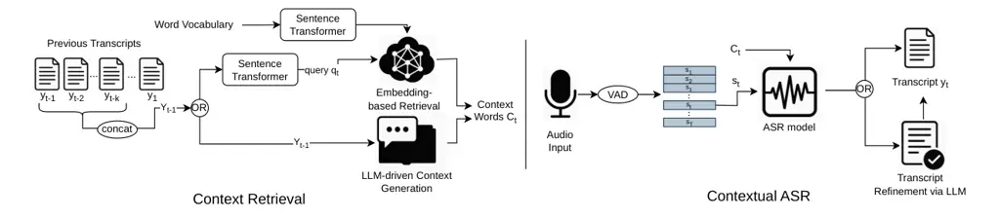
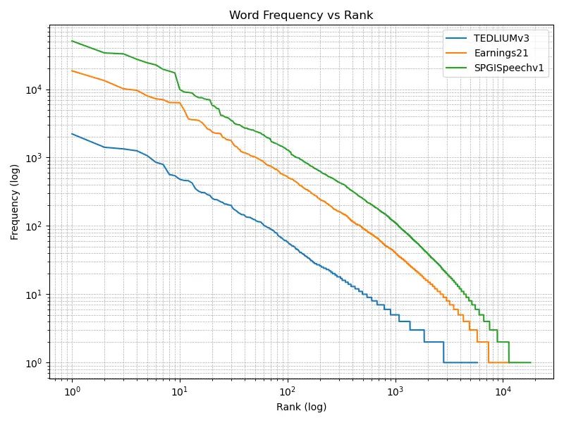

# Retrieval Augmented Generation based context discovery for ASR

Dimitrios Siskos Affiliation: Information Technologies Institute, Center
for Research and Technology HellasThessaloniki, Greece    Stavros
Papadopoulos Affiliation: Information Technologies Institute, Center for
Research and Technology HellasThessaloniki, Greece    Pablo Peso Parada
Affiliation: Samsung Electronics R&D Institute UK (SRUK), London, United
Kingdom [d.siskos@iti.gr](mailto:d.siskos@iti.gr),
[spap@iti.gr](mailto:spap@iti.gr),
[p.parada@samsung.com](mailto:p.parada@samsung.com),
[jisi.zhang@samsung.com](mailto:jisi.zhang@samsung.com),
[k1.saravanan@samsung.com](mailto:k1.saravanan@samsung.com)[drosou@iti.gr](mailto:drosou@iti.gr),
   Jisi Zhang Affiliation: Samsung Electronics R&D Institute UK (SRUK),
London, United Kingdom [d.siskos@iti.gr](mailto:d.siskos@iti.gr),
[spap@iti.gr](mailto:spap@iti.gr),
[p.parada@samsung.com](mailto:p.parada@samsung.com),
[jisi.zhang@samsung.com](mailto:jisi.zhang@samsung.com),
[k1.saravanan@samsung.com](mailto:k1.saravanan@samsung.com)[drosou@iti.gr](mailto:drosou@iti.gr),
   Karthikeyan Saravanan Affiliation: Samsung Electronics R&D Institute
UK (SRUK), London, United Kingdom
[d.siskos@iti.gr](mailto:d.siskos@iti.gr),
[spap@iti.gr](mailto:spap@iti.gr),
[p.parada@samsung.com](mailto:p.parada@samsung.com),
[jisi.zhang@samsung.com](mailto:jisi.zhang@samsung.com),
[k1.saravanan@samsung.com](mailto:k1.saravanan@samsung.com)[drosou@iti.gr](mailto:drosou@iti.gr),
   Anastasios Drosou Affiliation: Information Technologies Institute,
Center for Research and Technology HellasThessaloniki, Greece

###### Abstract

This work investigates retrieval augmented generation as an efficient
strategy for automatic context discovery in context-aware Automatic
Speech Recognition (ASR) system, in order to improve transcription
accuracy in the presence of rare or out-of-vocabulary terms. However,
identifying the right context automatically remains an open challenge.
This work proposes an efficient embedding-based retrieval approach for
automatic context discovery in ASR. To contextualize its effectiveness,
two alternatives based on large language models (LLMs) are also
evaluated: (1) large language model (LLM)-based context generation via
prompting, and (2) post-recognition transcript correction using LLMs.
Experiments on the TED-LIUMv3, Earnings21 and SPGISpeech demonstrate
that the proposed approach reduces WER by up to 17% (percentage
difference) relative to using no-context, while the oracle context
results in a reduction of up to 24.1%.

## 1 Introduction



Figure 1: Overview of the proposed context-aware ASR pipeline. Context
for each segment is extracted using either an embedding-based retrieval
method or LLM-based prompt generation, both conditioned on the preceding
$`k`$ segment captions. Audio is segmented via Voice Activity Detection
(VAD). The selected context is provided to a contextual ASR system.
Optionally, a post-ASR LLM correction module refines the transcript. The
final output is the concatenation of all the individual segment
transcripts.

Automatic Speech Recognition (ASR) systems have gained considerable
development over the last few years and provide high transcription
accuracy over an extensive spectrum of tasks and benchmarks Park et al.
(2019); Gulati et al. (2020); Baevski et al. (2020). Even though ASR
systems have grown tremendously, ASR systems’ performance continues to
degrade under conditions of low-occurrence or out-of-vocabulary words
like names, specialized domain names, and user-personal references Jain
et al. (2020); Fu et al. (2023). To address this, several strategies
have emerged, including ASR personalization Gourav et al. (2021);
Sathyendra et al. (2022), text injection Sainath et al. (2023); Wu
et al. (2024), and contextual biasing (CB) Huang et al. (2024); Meng
et al. (2024). Among these, CB has received significant attention due to
its effectiveness in improving recognition of rare and user-specific
terms.

One of the core challenges of contextual ASR is the definition and
extraction of context. The success of biasing depends not only on model
architecture but also on how well contextual material aligns to audio
semantics Han et al. (2022).

Several works have explored CB by tightly integrating with the ASR model
through adapters or attention mechanisms over entity catalogs.
Muralidhar et al. Muralidhar Jayanthi et al. (2023) propose a
retrieval-based personalization method, where ASR encoder
representations query an infrequent entity catalog to retrieve
phonetically similar candidates via a contextual adapter. Tong et al.
Tong et al. (2023b) extend this by using slot-specific catalogs and
combining entity embeddings with ASR outputs through a cross-attention
mechanism. These methods generally rely on fine-tuning the ASR backbone
and assume access to structured entity catalogs, often annotated by
domain/slot type.

Recent research has explored large language models (LLMs) for contextual
ASR tasks. Xiao et al. Xiao et al. (2025) build a contextual knowledge
base from custom vocabularies and documents, using a first-pass ASR
output to prompt an LLM for error correction. Sun et al. Sun et al.
(2024) fine-tune an LLM for token prediction and entity classification,
applying it to second-pass hypothesis rescoring. These approaches, while
effective, typically involve fine-tuning and curated entity prompts,
which can limit adaptability across domains or resource-constrained
settings.

Finally, Mathur et al. Mathur et al. (2024) propose DOC-RAG, a
domain-sensitive framework that builds domain-specific corpora and uses
co-occurrence matrices to estimate next-word probabilities for ASR
rescoring. Retrieval-based approaches such as those in
Muralidhar Jayanthi et al. (2023); Tong et al. (2023b) also leverage
similarity search mechanisms, but their retrieval is conditioned on
either learned audio embeddings or manually annotated slot labels,
making them dependent on supervised signals and ASR model internals.

The majority of existing methods assume structured catalogs
Muralidhar Jayanthi et al. (2023); Tong et al. (2023b), require
architectural modifications to ASR models Tong et al. (2023b); Tong
et al. (2023a), or depend on domain-specific supervision Sun et al.
(2024); Mathur et al. (2024), limiting their flexibility in general or
black-box settings. Inspired by prior work, this study proposes a
lightweight, modular approach that avoids such constraints.
Specifically, it proposes an embedding-based retrieval strategy using
pre-trained MiniLM embeddings over a large vocabulary, entirely
decoupled from the ASR model architecture. This method is evaluated
alongside two LLM-based alternatives: a prompt-based context generator
and a post-ASR transcript corrector.

Earlier context-biasing techniques are deeply integrated into the ASR
model itself - requiring custom layers, retraining, or access to model
internals - so can’t be run on the black-box recognizer used in this
work. Consequently, we benchmark only “plug-and-play” methods in a
common pipeline that mirrors real-world deployment scenarios (identical
audio inputs, metrics, and latency limits).

This paper has three main contributions:

- •
  First, it introduces a novel, model-agnostic, retrieval-based context
  construction technique using MiniLM embeddings on top of a frozen
  vocabulary to enable efficient context generation.
- •
  Second, it offers an experimental comparison of plug-and-play
  solutions to automatic context combination in ASR, including LLM-based
  context generation and post-hoc transcript fine-tuning.
- •
  Third, it provides an end-to-end evaluation of all methods in a shared
  pipeline that works without fine-tuning the ASR model, using black-box
  models and real-world long-form audio corpora.

The rest of the paper is organized as follows: Section 2 presents the
proposed methodology, Sections 3 and 4 the experimental setup and
results, and finally the paper concludes in Section 5.

## 2 Methods

An overview of the proposed approach is presented in Figure 1, and
explained in the next subsections.

### 2.1 Contextual ASR

The ASR model is defined as a conditional decoder:
$`\hat{y}_{t}=\mathcal{A}(s_{t}\mid\text{C}_{t})`$ where $`\hat{y}_{t}`$
is the predicted transcript of segment $`s_{t}`$, conditioned on the
context list $`\text{C}_{t}`$.

As a further use of LLMs, their use for post-ASR corrections has been
investigated. The correction model $`\mathcal{M}_{\text{fix}}`$ produces
a revised transcript, which is the original sentence with corrected
typos and misspellings:
$`\hat{y}_{t}^{\text{corr}}=\mathcal{M}_{\text{fix}}(\hat{y}_{t},C_{t},H_{t-1},P_{fix})`$
where $`H_{t-1}`$ denotes the corrected transcript history up to segment
$`y_{t-1}`$ and $`P_{fix}`$ the prompt used to instruct the LLM to fix
the transcript. The use of $`\hat{y}_{t}^{\text{corr}}`$ for context is
hereby denoted as `LLM-fix`. Llama3.2 (3B) is utilized for all
experiments requiring an LLM without loss of generality.

### 2.2 Context Construction

Let $`\hat{y_{t}}`$ be the transcript generated by ASR for segment
$`s_{t}`$ (identified by a Voice Activity Detection (VAD) module) and
let the transcript of the previous $`k`$ segments be
$`\hat{Y_{t-1}}=concat(\hat{y_{t-1}},...,\hat{y_{t-k}})`$.
$`\hat{Y_{t-1}}`$ is utilized to retrieve words contextually relevant to
$`s_{t}`$ which are merged into a context list that’s passed to the ASR
system for processing.

Each word $`w_{i}`$ in the vocabulary
$`\mathcal{V}=\{w_{1},\ldots,w_{|\mathcal{V}|}\}`$ is embedded using a
function $`f:\mathcal{V}\rightarrow\mathbb{R}^{d}`$, such that
$`f(w_{i})=\mathbf{v}_{i}\in\mathbb{R}^{d}`$. The MiniLM
(all-MiniLM-L6-v2) is utilized, similarly to BertTopic¹¹ 1
https://maartengr.github.io/BERTopic, where it is employed to encode
textual segments and identify semantically related terms within a topic.
The query vector $`\mathbf{q}_{t}\in\mathbb{R}^{d}`$ for segment
$`s_{t}`$ is computed as: $`\mathbf{q}_{t}=f(\hat{Y_{t-1}})`$,
effectively retrieving terms that align with the latent "spoken topic"
of the segment, even when they are not explicitly mentioned.

Top-$`N`$ context words are selected by maximizing cosine similarity:

```math
\text{C}_{t}^{\text{rag}}=\text{TopN}_{w_{i}\in\mathcal{V}}\left(\cos(\mathbf{q}_{t},\mathbf{v}_{i})\right)
```

Efficient nearest-neighbor search is performed via FAISSDouze et al.
(2024) indexing. The use of $`\text{C}_{t}^{\text{rag}}`$ for context is
hereby denoted as `CB-RAG`.

Alternatively, an LLM-based approach for context construction is
examined. Given the same prior window $`\hat{Y_{t-1}}`$ and a prompt
$`P_{gen}`$ are passed to an LLM $`\mathcal{M}_{\text{gen}}`$,
returning:

```math
\text{C}_{t}^{\text{llm}}=\mathcal{M}_{\text{gen}}(\hat{Y_{t-1}},P_{gen})
```

The output context is post-processed to remove duplicates and stopwords.
The use of $`\text{C}_{t}^{\text{llm}}`$ for context is hereby denoted
as `CB-LLM`.

### 2.3 Baselines

In order to measure the impact of context information quantitatively,
two baseline reference strategies are utilized: the lower and upper
bound of performance. Let the ground-truth transcript for segment
$`s_{t}`$ be denoted as $`y_{t}`$. The Oracle context (lower bound on
WER) is constructed as:
$`\text{C}_{t}^{\text{oracle}}=\{w\in y_{t}\mid w\notin\mathcal{S}\}`$
where $`\mathcal{S}`$ denotes a predefined stopword list²² 2 NLTK Corpus
Stopwords https://www.nltk.org/nltk_data/. This assumes perfect
knowledge of all the context terms and corresponds to the lower bound.

The no-context baseline (upper bound on WER) corresponds to
$`\text{C}_{t}^{\text{none}}=\emptyset`$ meaning no contextual
information is provided to the ASR system and corresponds to the upper
bound.

## 3 Experimental Setup

### 3.1 Dataset

The experiments are conducted on three datasets: TED-LIUMv3 Hernandez
et al. (2018) (~1.5 hours of audio), Earnings21 Del Rio et al. (2021)
(~5 hours of audio) and SPGISpeech oneill2021spgispeech (~5 hours of
audio). SPGISpeech consist of 5–15 seconds utterances grouped by
sessions. Since context extraction methods require longer audio to
capture contextual information, sessions were concatenated, and only
segments longer than 6 minutes were retained, perseving topic
consistency.

To ensure consistency, transcripts are preprocessed before evaluation.
Non-verbal content and non-English segments are removed. Text is
normalized through lowercasing, punctuation stripping, hyphen removal,
and conversion of numerical expressions to word format.

For the vocabulary $`\mathcal{V}`$, a set of 466,358 unique, non-stop
words³³ 3 www.kaggle.com/datasets/bwandowando/479k-english-words & NLTK
Corpus Words (232k) www.nltk.org is utilized for context generation
using RAG. These words are combined together with their definitions (if
available).

Let $`\mathcal{T}`$ denote the set of entity types that are considered
rare⁴⁴ 4 Location, Organization, Geopolitical, Product, Person,
Nationality-Religion-Political Groups and let $`\mathcal{E_{T}}`$ be the
set of named entities of types in $`\mathcal{T}`$, extracted from the
reference transcripts. We define the set of rare entities as
$`\mathcal{E}_{\text{rare}}=\{e\in\mathcal{E_{T}}\mid type(e)\in T\wedge e\notin\mathcal{S}\}`$
and the set of out-of-vocabulary (OOV) entities as
$`\mathcal{E}_{\text{oov}}=\{e\in\mathcal{E}_{\text{rare}}\mid e\notin\mathcal{V}\}`$.
To assess the lexical coverage and contextual demands of each dataset,
we perform a rare entity analysis. Table 1 reports the percentage of
unique words not present in the static vocabulary ($`\mathcal{V}`$) and
the proportion of rare entities.

| Metrics   | TEDLIUMv3 | Earnings21 | SPGISpeech |
| --------- | --------- | ---------- | ---------- |
| OOV       | 6.31%     | 13.49%     | 15.77%     |
| Rare rate | 28%       | 38%        | 6.16%      |

Table 1: Out-of-vocabulary (OOV) and the percentage of rare words
appearing across the speech datasets.

| Method \[c, k\]     | TED-LIUM v3        |                      |                      |                     | Earnings21         |                      |                      |                     | SPGISpeech         |                      |                      |                     |
| ------------------- | ------------------ | -------------------- | -------------------- | ------------------- | ------------------ | -------------------- | -------------------- | ------------------- | ------------------ | -------------------- | -------------------- | ------------------- |
|                     | WER $`\downarrow`$ | Overlap $`\uparrow`$ | Count $`\downarrow`$ | Time $`\downarrow`$ | WER $`\downarrow`$ | Overlap $`\uparrow`$ | Count $`\downarrow`$ | Time $`\downarrow`$ | WER $`\downarrow`$ | Overlap $`\uparrow`$ | Count $`\downarrow`$ | Time $`\downarrow`$ |
| `Oracle`            | 15.4%              | 100%                 | 1$`\times`$          | –                   | 29.7%              | 100%                 | 1$`\times`$          | –                   | 17.0%              | 100%                 | 1$`\times`$          | –                   |
| `No Context`        | 18.9%              | –                    | –                    | 1$`\times`$         | 35.9%              | –                    | –                    | 1$`\times`$         | 22.4%              | –                    | –                    | 1$`\times`$         |
| `CB-LLM`            | 16.9%              | 45.3%                | 10.94$`\times`$      | 4.66$`\times`$      | 31.8%              | 52.9%                | 9.03$`\times`$       | 3.26$`\times`$      | 18.6%              | 42.6%                | 7.01$`\times`$       | 5.93$`\times`$      |
| `CB-LLM LLM_fix`    | 16.8%              | 48.7%                | 10.84$`\times`$      | 6.16$`\times`$      | 31.7%              | 56.1%                | 9.06$`\times`$       | 3.59$`\times`$      | 18.6%              | 43.7%                | 6.3$`\times`$        | 6.56$`\times`$      |
| `CB-RAG [100, 10]`  | 17.6%              | 11%                  | 5.47$`\times`$       | 1.36$`\times`$      | 32.5%              | 12.8%                | 6.48$`\times`$       | 1.14$`\times`$      | 18.7%              | 8.8%                 | 3.41$`\times`$       | 1.4$`\times`$       |
| `CB-RAG [100, 100]` | 17.6%              | 6.3%                 | 2.67$`\times`$       | 1.02$`\times`$      | 31.6%              | 8.8%                 | 3.81$`\times`$       | 1.13$`\times`$      | 18.8%              | 3.0%                 | 1.34$`\times`$       | 1.31$`\times`$      |
| `CB-RAG [250, 10]`  | 16.4%              | 17.8%                | 12$`\times`$         | 1.16$`\times`$      | 31.1%              | 21.4%                | 15.17$`\times`$      | 1.16$`\times`$      | 18.7%              | 14.5%                | 9.40$`\times`$       | 1.42$`\times`$      |
| `CB-RAG [250, 100]` | 17.1%              | 10.1%                | 12$`\times`$         | 1.04$`\times`$      | 31.3%              | 15.6%                | 9.11$`\times`$       | 1.02$`\times`$      | 18.8%              | 5.5%                 | 2.3$`\times`$        | 1.34$`\times`$      |

Table 2: Evaluation of context-extraction strategies on TED-LIUM v3,
Earnings21 and SPGISpeech. Metrics include Word Error Rate (WER),
Overlap percentage, Count of context words, and relative Time
(normalized to no-context baseline).

### 3.2 ASR Model

The context module of the ASR system implemented is based on the
approach proposed by Jalal et al. (2023), which introduces a CB
mechanism that integrates contextually relevant external information
during inference. Following Figure 1 we perform contextual biasing ASR
per audio segment. For VAD, the SpeechBrain Ravanelli et al. (2024)
library is utilized. After all segments are processed, their outputs are
concatenated to reconstruct the full transcript.

### 3.3 Evaluation Metrics

The performance of the proposed contextual ASR system is evaluated using
word error rate (WER), the standard metric for transcription accuracy. A
contextual overlap score is calculated to assess how much of the
ground-truth context is correctly recovered by each method, serving as a
proxy for semantic recall. The size of the extracted context list per
segment is also reported, indicating the expressive capacity of each
method.

## 4 Results

Table 2 presents the result of the proposed method and alternatives on
TED-LIUMv3, Earnings21 and SPGISpeech. Regarding `CB-RAG`, multiple
configurations were investigated regarding the number of context words
to retrieve with each query ($`c`$) and the number of segments to be
used for the query construction ($`k`$).

As shown in Table 2, the `CB-RAG` method on TED-LIUMv3 exhibits a
consistent reduction in WER as the number of retrieved contexts $`c`$
increases, from 17.6% at $`c`$=100 to 16.4% at $`c`$=250. Reducing the
number of segments $`k`$ also results in improved performance: the
\[250,10\] configuration yields a WER of 16.4%, compared to 17.1% for
\[250,100\]. Although LLM-based methods achieve higher context overlap
(45.3–48.7%), `CB-RAG` compensates through significantly higher context
counts (up to 12%), suggesting it access more diverse and redundant set
of candidate segments. Regarding computational efficiency, `CB-RAG`
demonstrates substantially lower latency, 1.02–1.36 times slower than
no-context baseline, relative to LLM-based approaches, which are
4.66–6.16 times. Among `CB-LLM` variants, pre-correcting the ASR’s
transcript slightly improves WER (from 16.9% to 16.8%). Overall, the
\[250,10\] `CB-RAG` configuration provides the most balanced trade-off
across accuracy, overlap, and latency, indicating strong suitability for
real-time deployment.

Similar trends are observed in the Earnings21 dataset. Increasing $`c`$
improves WER from 32.5% at \[100,10\] to 31.1% at \[250, 10\],
approaching the LLM-based results ($`\approx 31.7\%`$) despite lower
overlap. LLM-based methods again show high overlap values, peaking at
56.1%, while `CB-RAG` ranges between 8.8% and 21.4%. The retrieval count
for `CB-RAG` is also considerably higher, with \[250,10\] reaching 15.17
compared to 9.06 for `CB-LLM`. Latency for `CB-RAG` remains much lower,
ranging from 1.14 to 1.02, compared to `CB-LLM` decoding times of 3.26
to 3.59. The \[250,10\] configuration again offers the best balance,
with a WER of 31.1%, overlap of 21.4%, and a time cost of just 1.12.
These results demonstrate `CB-RAG`’s ability to scale effectively across
different domains while maintaining a strong balance between accuracy
and efficiency.

Although LLM-based approaches achieve the best relative WER improvement
in SPGISpeech (16.96%), `CB-RAG` configurations closely follow (16.52%).
As shown in Table 1, the dataset features a high OOV rate and few rare
entities. However, despite this lexical mismatch, `CB-RAG` remains
equivalent to the LLM-based methods. Reducing the number of segments
$`k`$ from 100 to 10 again improves WER, reinforcing the value of recent
focused context. As with other datasets, LLM-based methods show the
highest contextual overlap (up to 43.7%), while `CB-RAG` achieves
slightly higher context count (up to 9.4$`\times`$) and significantly
lower latency, with the \[100,100\] configuration running at just
1.31$`\times`$ the cost of the `No Context` baseline. These results
underscore `CB-RAG`’s efficiency and adaptability, even under
challenging lexical conditions.

The results indicate that the proposed `CB-RAG` approach is a
competitive and effective method for automatic context construction
without the use of user-specific historical text data. It is also a
better alternative compared to LLM-based context creation and transcript
correction. Although `CB-RAG` has lower contextual overlap scores, the
WER is better with significantly lower latency, depicting its utility in
actual scenarios. Its flexibility in selecting word context size
extraction by each query ($`c`$) and number of segments in the past to
consider ($`k`$) enables flexible application across domains with varied
requirements for latency and performance. These findings suggest that
`CB-RAG` would be particularly appropriate for resource-constrained or
real-time applications for which LLM-based alternatives would be
computationally infeasible.

## 5 Conclusion

This paper explored different approaches to incorporating contextual
information into ASR pipelines, with an emphasis on automatic context
extraction. Among the approaches examined - embedding-based retrieval,
context generated by LLM, and post-ASR correction - the proposed
`CB-RAG` framework achieved the best overall performance, yielding the
lowest WER (up to a 17% relative reduction) in test sets at the lowest
computational cost and latency. Despite a substantially lower context
overlap, up to 47.3% absolute difference, `CB-RAG` retrieved
significantly higher number of contextual tokens, while operating, on
average 83.5%, lower latency than LLM-based alternatives. Post-ASR
correction improved slightly but still remained less than that of
`CB-RAG`. These findings highlight `CB-RAG` as the most scalable and
adaptable solution, combining high accuracy with efficiency.

## Limitations

There are several limitations acknowledged. The `CB-RAG` approach is
lexically sensitive and might overlook semantically similar terms. It
also assumes the presence of candidate context entries, which under
unconstrained environments might not always be realistic. The `CB-LLM`
method depends on prompt quality and is prone to variability across
model versions and decoding parameters. Also, the `LLM-fix` is a
post-processing step, and its performance tends to degrade in the
presence of low-resource hardware or noisy transcription.

## References

- Baevski et al. (2020) Alexei Baevski, Yuhao Zhou, Abdelrahman Mohamed,
  and Michael Auli. 2020. wav2vec 2.0: A framework for self-supervised
  learning of speech representations. In _Advances in Neural Information
  Processing Systems (NeurIPS)_, volume 33, pages 12449–12460.
- Del Rio et al. (2021) Miguel Del Rio, Natalie Delworth, Ryan
  Westerman, Michelle Huang, Nishchal Bhandari, Joseph Palakapilly,
  Quinten McNamara, Joshua Dong, Piotr Zelasko, and Miguel Jetté. 2021.
  Earnings-21: A practical benchmark for asr in the wild. _arXiv
  preprint arXiv:2104.11348_.
- Douze et al. (2024) Matthijs Douze, Alexandr Guzhva, Chengqi Deng,
  Jeff Johnson, Gergely Szilvasy, Pierre-Emmanuel Mazaré, Maria Lomeli,
  Lucas Hosseini, and Hervé Jégou. 2024. [The faiss
  library](https://arxiv.org/abs/2401.08281).
- Fu et al. (2023) Xuandi Fu, Kanthashree M. Sathyendra, Ankur Gandhe,
  Jing Liu, Grant P. Strimel, Ross McGowan, and Athanasios
  Mouchtaris. 2023. Robust acoustic and semantic contextual biasing in
  neural transducers for speech recognition. In _Proc. IEEE Intl. Conf.
  on Acoustics, Speech and Signal Processing (ICASSP)_, pages 1–5.
- Gourav et al. (2021) Aditya Gourav, Linda Liu, Ankur Gandhe, Yile Gu,
  Guitang Lan, Xiangyang Huang, Shashank Kalmane, Gautam Tiwari, Denis
  Filimonov, Ariya Rastrow, Andreas Stolcke, and Ivan Bulyko. 2021.
  Personalization strategies for end-to-end speech recognition systems.
  In _Proc. IEEE Int. Conf. Acoustics, Speech and Signal Processing
  (ICASSP)_, pages 7348–7352.
- Gulati et al. (2020) Anmol Gulati, James Qin, Chung-Cheng Chiu, Niki
  Parmar, Yu Zhang, Jiahui Yu, Wei Han, Shibo Wang, Zhengdong Zhang,
  Yonghui Wu, and Ruoming Pang. 2020. Conformer: Convolution-augmented
  transformer for speech recognition. In _Proc. Interspeech_, pages
  5036–5040.
- Han et al. (2022) Minglun Han, Linhao Dong, Zhenlin Liang, Meng Cai,
  Shiyu Zhou, Zejun Ma, and Bo Xu. 2022. Improving end-to-end contextual
  speech recognition with fine-grained contextual knowledge selection.
  In _Proc. IEEE Intl. Conf. on Acoustics, Speech and Signal Processing
  (ICASSP)_, pages 8532–8536.
- Hernandez et al. (2018) François Hernandez, Vincent Nguyen, Sahar
  Ghannay, Natalia Tomashenko, and Yannick Esteve. 2018. Ted-lium 3:
  Twice as much data and corpus repartition for experiments on speaker
  adaptation. In _Speech and Computer: 20th International Conference,
  SPECOM 2018, Leipzig, Germany, September 18–22, 2018, Proceedings 20_,
  pages 198–208. Springer.
- Huang et al. (2024) Ruizhe Huang, Mahsa Yarmohammadi, Sanjeev
  Khudanpur, and Daniel Povey. 2024. Improving neural biasing for
  contextual speech recognition by early context injection and text
  perturbation. _arXiv preprint arXiv:2407.10303_.
- Jain et al. (2020) Mahaveer Jain, Gil Keren, Jay Mahadeokar, Geoffrey
  Zweig, Florian Metze, and Yatharth Saraf. 2020. Contextual rnn-t for
  open domain ASR. In _Proc. Interspeech_, pages 11–15.
- Jalal et al. (2023) Md Asif Jalal, Pablo Peso Parada, George Pavlidis,
  Vasileios Moschopoulos, Karthikeyan Saravanan, Chrysovalantis-Giorgos
  Kontoulis, Jisi Zhang, Anastasios Drosou, Gil Ho Lee, Jungin Lee,
  Seokyeong Jung. 2023. Locality enhanced dynamic biasing and sampling
  strategies for contextual asr. In _2023 IEEE Automatic Speech
  Recognition and Understanding Workshop (ASRU)_, pages 1–8. IEEE.
- Mathur et al. (2024) Puneet Mathur, Zhe Liu, Ke Li, Yingyi Ma, Gil
  Karen, Zeeshan Ahmed, Dinesh Manocha, and Xuedong Zhang. 2024.
  [DOC-RAG: ASR language model personalization with domain-distributed
  co-occurrence retrieval
  augmentation](https://aclanthology.org/2024.lrec-main.457/). In
  _Proceedings of the 2024 Joint International Conference on
  Computational Linguistics, Language Resources and Evaluation
  (LREC-COLING 2024)_, pages 5132–5139, Torino, Italia. ELRA and ICCL.
- Meng et al. (2024) Zhong Meng, Zelin Wu, Rohit Prabhavalkar, Cal
  Peyser, Weiran Wang, Nanxin Chen, Tara N Sainath, and Bhuvana
  Ramabhadran. 2024. Text injection for neural contextual biasing.
  _arXiv preprint arXiv:2406.02921_.
- Muralidhar Jayanthi et al. (2023) Sai Muralidhar Jayanthi, Devang
  Kulshreshtha, Saket Dingliwal, Srikanth Ronanki, and Sravan
  Bodapati. 2023. Retrieve and copy: Scaling asr personalization to
  large catalogs. _arXiv e-prints_, pages arXiv–2311.
- Park et al. (2019) Daniel S. Park, William Chan, Yu Zhang, Chung-Cheng
  Chiu, Barret Zoph, Ekin D. Cubuk, and Quoc V. Le. 2019. SpecAugment: A
  simple data augmentation method for automatic speech recognition. In
  _Proc. Interspeech_, pages 2613–2617.
- Ravanelli et al. (2024) Mirco Ravanelli, Titouan Parcollet, Adel
  Moumen, Sylvain de Langen, Cem Subakan, Peter Plantinga, Yingzhi Wang,
  Pooneh Mousavi, Luca Della Libera, Artem Ploujnikov, Francesco
  Paissan, Davide Borra, Salah Zaiem, Zeyu Zhao, Shucong Zhang, Georgios
  Karakasidis, Sung-Lin Yeh, Pierre Champion, Aku Rouhe, and 14
  others. 2024. [Open-source conversational ai with speechbrain
  1.0](http://jmlr.org/papers/v25/24-0991.html). _Journal of Machine
  Learning Research_, 25(333).
- Sainath et al. (2023) Tara N. Sainath, Rohit Prabhavalkar, Diamantino
  Caseiro, Patrick Rondon, and Cyril Allauzen. 2023. Improving
  contextual biasing with text injection. In _Proc. IEEE Int. Conf.
  Acoustics, Speech and Signal Processing (ICASSP)_, pages 1–5.
- Sathyendra et al. (2022) Kanthashree Mysore Sathyendra, Thejaswi
  Muniyappa, Feng-Ju Chang, Jing Liu, Jinru Su, Grant P. Strimel,
  Athanasios Mouchtaris, and Siegfried Kunzmann. 2022. Contextual
  adapters for personalized speech recognition in neural transducers. In
  _Proc. IEEE Int. Conf. Acoustics, Speech and Signal Processing
  (ICASSP)_, pages 8537–8541.
- Sun et al. (2024) Chuanneng Sun, Zeeshan Ahmed, Yingyi Ma, Zhe Liu,
  Lucas Kabela, Yutong Pang, and Ozlem Kalinli. 2024. Contextual biasing
  of named-entities with large language models. In _ICASSP 2024-2024
  IEEE International Conference on Acoustics, Speech and Signal
  Processing (ICASSP)_, pages 10151–10155. IEEE.
- Tong et al. (2023a) Sibo Tong, Philip Harding, and Simon Wiesler.
  2023a. Hierarchical attention-based contextual biasing for
  personalized speech recognition using neural transducers. In _2023
  IEEE Automatic Speech Recognition and Understanding Workshop (ASRU)_,
  pages 1–8. IEEE.
- Tong et al. (2023b) Sibo Tong, Philip Harding, and Simon Wiesler.
  2023b. Slot-triggered contextual biasing for personalized speech
  recognition using neural transducers. In _ICASSP 2023-2023 IEEE
  International Conference on Acoustics, Speech and Signal Processing
  (ICASSP)_, pages 1–5. IEEE.
- Wu et al. (2024) Zelin Wu, Gan Song, Christopher Li, Patrick Rondon,
  Zhong Meng, Xavier Velez, Weiran Wang, Diamantino Caseiro, Golan
  Pundak, Tsendsuren Munkhdalai, Angad Chandorkar, and Rohit
  Prabhavalkar. 2024. Deferred NAM: Low-latency top-k context injection
  via deferred context encoding for non-streaming ASR. In _Proc.
  NAACL-HLT (Industry Track)_, pages 315–323.
- Xiao et al. (2025) Cihan Xiao, Zejiang Hou, Daniel Garcia-Romero, and
  Kyu J Han. 2025. Contextual asr with retrieval augmented large
  language model. In _ICASSP 2025-2025 IEEE International Conference on
  Acoustics, Speech and Signal Processing (ICASSP)_, pages 1–5. IEEE.

## Appendix

### Prompt for LLM-driven Context Generation

_"You are the master of knowledge, with expertise in every domain. Given
a sentence and based on your knowledge, provide a huge number of
relevant words. Focus on names, locations, terminology, concepts.
Provide only the words, comma-separated, without any other
explanations."_

### Prompt for post-ASR Transcript Refinement using LLM

_"You are a master philologist and grammar expert. Using the provided
conversation history for context, correct the given sentence by fixing
typos, misspellings, grammar, or logical inconsistencies. Preserve the
original intent. Respond with only the revised sentence, nothing else."_

### Zipf Distribution of Word Frequencies



Figure 2: Zipf distribution of word frequencies piantadosi2014zipf
across all datasets, confirming the characteristic long-tail structure
of natural language.

|                     |                        |                    |                      |                      |                     |                    |                      |                      |                     |
| ------------------- | ---------------------- | ------------------ | -------------------- | -------------------- | ------------------- | ------------------ | -------------------- | -------------------- | ------------------- |
| Method              | Model                  | TED-LIUM v3        |                      |                      |                     | Earnings21         |                      |                      |                     |
|                     |                        | WER $`\downarrow`$ | Overlap $`\uparrow`$ | Count $`\downarrow`$ | Time $`\downarrow`$ | WER $`\downarrow`$ | Overlap $`\uparrow`$ | Count $`\downarrow`$ | Time $`\downarrow`$ |
| `Oracle`            | –                      | 15.4%              | 100%                 | 1$`\times`$          | –                   | 29.7%              | 100%                 | 1$`\times`$          | –                   |
| `No Context`        | –                      | 18.9%              | –                    | –                    | 1$`\times`$         | 35.9%              | –                    | –                    | 1$`\times`$         |
| CB-LLM              | `llama3.2`             | 16.9%              | 45.3%                | 10.94$`\times`$      | 4.66$`\times`$      | 31.8%              | 52.9%                | 9.03$`\times`$       | 3.26$`\times`$      |
|                     | `olmo2:7b`             | 16.8%              | 60.4%                | 8.65$`\times`$       | 9.43$`\times`$      | 32.5%              | 65.3%                | 7.58$`\times`$       | 8.33$`\times`$      |
|                     | `gemma3:4b`            | 16.9%              | 58.4%                | 13$`\times`$         | 21.86$`\times`$     | 32.5%              | 66.7%                | 8.74$`\times`$       | 28.95$`\times`$     |
|                     | `tinyllama:1.1b`       | 16.9%              | 81.8%                | 19.73$`\times`$      | 9.61$`\times`$      | 32.4%              | 76.5%                | 10.92$`\times`$      | 6.94$`\times`$      |
|                     | `smollm2:135m`         | 16.6%              | 77.1%                | 6.1$`\times`$        | 4.01$`\times`$      | 32.8%              | 79.1%                | 5.58$`\times`$       | 5.48$`\times`$      |
|                     | `smollm360m`           | 16.7%              | 66.1%                | 6.1$`\times`$        | 3.77$`\times`$      | 33.1%              | 73.9%                | 5.33$`\times`$       | 5.62$`\times`$      |
|                     | `qwen2.5:0.5b`         | 16.8%              | 55.6%                | 7.52$`\times`$       | 5.21$`\times`$      | 32.6%              | 57.0%                | 6.16$`\times`$       | 6.03$`\times`$      |
| CB-LLM & LLM_fix    | `llama3.2`             | 16.8%              | 48.7%                | 10.84$`\times`$      | 6.16$`\times`$      | 31.7%              | 56.1%                | 9.06$`\times`$       | 3.59$`\times`$      |
|                     | `olmo2:7b`             | 16.8%              | 57.6%                | 9.18$`\times`$       | 17.87$`\times`$     | 32.7%              | 65.7%                | 7.53$`\times`$       | 15.47$`\times`$     |
|                     | `gemma3:4b`            | 16.9%              | 57.6%                | 12.77$`\times`$      | 25.06$`\times`$     | 32.5%              | 63.0%                | 8.44$`\times`$       | 33.58$`\times`$     |
|                     | `tinyllama:1.1b`       | 16.8%              | 80.1%                | 18.85$`\times`$      | 10.01$`\times`$     | 32.9%              | 77.7%                | 10.24$`\times`$      | 7.12$`\times`$      |
|                     | `smollm2:135m`         | 16.7%              | 65.9%                | 6.08$`\times`$       | 4.52$`\times`$      | 33.1%              | 71.1%                | 4.64$`\times`$       | 6.63$`\times`$      |
|                     | `smollm360m`           | 16.8%              | 64.8%                | 5.31$`\times`$       | 4.98$`\times`$      | 33.0%              | 71.5%                | 4.46$`\times`$       | 7.06$`\times`$      |
|                     | `qwen2.5:0.5b`         | 16.8%              | 50.2%                | 6.81$`\times`$       | 5.82$`\times`$      | 33.0%              | 55.5%                | 5.88$`\times`$       | 7.41$`\times`$      |
| CB-RAG \[100, 10\]  | `all-MiniLM-L6-v2`     | 17.6%              | 11%                  | 5.47$`\times`$       | 1.36$`\times`$      | 32.5%              | 12.8%                | 6.48$`\times`$       | 1.14$`\times`$      |
|                     | `all-MiniLM-L12-v2`    | 17.0%              | 13.1%                | 7.64$`\times`$       | 1.08$`\times`$      | 34.5%              | 16.7%                | 9.98$`\times`$       | 1.08$`\times`$      |
|                     | `all-distilroberta-v1` | 17.0%              | 9.6%                 | 5.63$`\times`$       | 1.30$`\times`$      | 35.0%              | 11.5%                | 5.77$`\times`$       | 1.20$`\times`$      |
|                     | `all-mpnet-base-v2`    | 17.0%              | 10.5%                | 6.21$`\times`$       | 1.31$`\times`$      | 35.0%              | 9.1%                 | 6.00$`\times`$       | 1.10$`\times`$      |
| CB-RAG \[100, 100\] | `all-MiniLM-L6-v2`     | 17.6%              | 6.3%                 | 2.67$`\times`$       | 1.02$`\times`$      | 31.6%              | 8.8%                 | 3.81$`\times`$       | 1.13$`\times`$      |
|                     | `all-MiniLM-L12-v2`    | 17.1%              | 8.3%                 | 4.05$`\times`$       | 1.01$`\times`$      | 35.2%              | 14.6%                | 8.37$`\times`$       | 1.10$`\times`$      |
|                     | `all-distilroberta-v1` | 17.0%              | 4.4%                 | 2.16$`\times`$       | 1.30$`\times`$      | 35.0%              | 6.4%                 | 2.76$`\times`$       | 1.16$`\times`$      |
|                     | `all-mpnet-base-v2`    | 17.0%              | 3.9%                 | 2.01$`\times`$       | 1.27$`\times`$      | 35.1%              | 3.3%                 | 2.07$`\times`$       | 1.19$`\times`$      |
| CB-RAG \[250, 10\]  | `all-MiniLM-L6-v2`     | 16.4%              | 17.8%                | 12$`\times`$         | 1.16$`\times`$      | 31.1%              | 21.4%                | 15.17$`\times`$      | 1.16$`\times`$      |
|                     | `all-MiniLM-L12-v2`    | 17.0%              | 20.4%                | 17.6$`\times`$       | 1.14$`\times`$      | 34.4%              | 18.7%                | 13.82$`\times`$      | 1.20$`\times`$      |
|                     | `all-distilroberta-v1` | 17.0%              | 15.2%                | 12.94$`\times`$      | 1.15$`\times`$      | 34.8%              | 18.7%                | 11.89$`\times`$      | 1.24$`\times`$      |
|                     | `all-mpnet-base-v2`    | 17.1%              | 16.6%                | 14.48$`\times`$      | 1.15$`\times`$      | 35.0%              | 15.1%                | 12.05$`\times`$      | 1.22$`\times`$      |
| CB-RAG \[250, 100\] | `all-MiniLM-L6-v2`     | 17.1%              | 10.1%                | 12$`\times`$         | 1.04$`\times`$      | 31.3%              | 15.6%                | 9.11$`\times`$       | 1.02$`\times`$      |
|                     | `all-MiniLM-L12-v2`    | 17.0%              | 13%                  | 9.69$`\times`$       | 1.01$`\times`$      | 34.6%              | 17.6%                | 12.46$`\times`$      | 1.05$`\times`$      |
|                     | `all-distilroberta-v1` | 17.0%              | 7.4%                 | 5.41$`\times`$       | 1.03$`\times`$      | 35.1%              | 11.6%                | 6.57$`\times`$       | 1.14$`\times`$      |
|                     | `all-mpnet-base-v2`    | 17.0%              | 6.9%                 | 5.3$`\times`$        | 1.03$`\times`$      | 35.1%              | 6.8%                 | 5.3$`\times`$        | 1.15$`\times`$      |

Table 3: Evaluation of context-extraction strategies on TED-LIUM v3 and
Earnings21 for various LLM models and different sentence transformers.
Metrics include Word Error Rate (WER), Overlap percentage, Count of
context words, and relative Time (normalized to no-context baseline).

### Impact of Model and Encoder Choice

Table 3 provides a deeper comparison of different model backbones used
within the `CB-LLM`, `CB-LLM & LLM_fix` and `CB-RAG` frameworks across
TED-LIUMv3 and Earnings21.

In TED-LIUMv3, the best WER (16.4%) is achieved by `CB-RAG [250,10]`
using `all-MiniLM-L6-v2`, representing a 13.2% relative improvement over
the no-context baseline. Among LLM-based methods, `smollm2:135m`
delivers the strongest performance with a WER of 16.6%, followed closely
by `smollm2:365m`, which is the faster among LLM variants. The highest
contextual overlap (81.8%) and context tokens (19.73$`\times`$) are
achieved by the `tinyllama:1.1b`, while `gemma2:4b` is significantly the
slowest. The `LLM_fix` mechanism introduces a mean latency increase of
approximately 2.3 times, affecting larger models like `olmo2:7b` the
most, while impacting smaller ones like `tinyllama` much less.

Similar trends are observed in Earnings21, where the best WER (31.1%) is
again obtained by `CB-RAG [250,10]` with
`all-MiniLM-L6-v2`—corresponding to a 13.4% relative improvement. This
configuration also yields the highest retrieval count (15.17 times than
`Oracle`), while `smollm2:135m` achieves the highest contextual overlap
(79.1%) among LLM-based approaches. As with TED-LIUMv3, LLM-based
correction is slowing down transcription by approximately 2.3 times,
with `olmo2:7b` experiencing the steepest latency increase (around 7
times). Interestingly, `llama3.2` runs faster than both large and mini
LLM models. Among LLMs, `tinyllama` again generates the most context
tokens, while `smollm2` leads in overlap. Again, `CB-RAG` encoders based
on `MiniLM` demonstrate high efficiency, with the \[250,100\]
configuration achieving both high accuracy and the fastest runtime
across all models (approximately 1.02 times).

Across both datasets, `CB-RAG` with `all-MiniLM-L6-v2` stands out as the
most effective model, offering the best WERs, high retrieval counts, and
low latency. The \[250,10\] configuration consistently perform well,
balancing accuracy and speed. Among LLMs, `smollm2:135m` surpasses
larger models such as `llama3.2` in both WER and efficiency, making it a
strong choice for constrained environments. Within the `CB-RAG`
framework, `MiniLM-L6-v2` also achieves the highest contextual overlap
(18.1% more than the lowest-performing `mpnet-base-v2`). The fastest
encoder is `MiniLM-L12-v2`, outperforming the slowest models
(`distilroberta` and `mpnet-base-v2`) by approximately 7% in runtime.
These results reinforce the importance of model selection in both
LLM-based and retrieval-based pipelines and highlight that compact
models, when properly configured, can rival or even outperform larger
architectures.

The choice of backbone models plays a critical role in balancing quality
and efficiency. Within `CB-RAG`, the `all-MiniLM-L6-v2` encoder offered
the best trade-off, consistently delivering the highest accuracy and
fastest inference. For LLM-based methods, `llama3.2` achieves
competitive performance and speed, however, in scenarios with stricter
latency constraints, smaller models like `smollm2:135m` are necessary to
maintain responsiveness.
