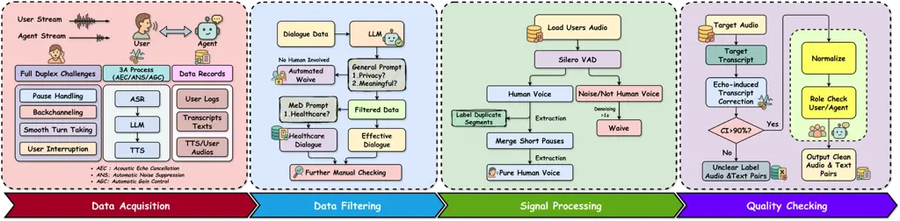

# MMedFD: A Real-world Healthcare Benchmark for Multi-turn Full-Duplex Automatic Speech Recognition

Hongzhao Chen, XiaoYang Wang, Jing Lan, Hexiao Ding, Yufeng Jiang,
MingHui Yang, DanHui Xu, Jun Luo, Nga-Chun Ng, Gerald W.Y. Cheng, Yunlin
Mao, Jung Sun Yoo ^(†)^(†)thanks: \*Co-first author^(†)^(†)thanks:
\#Corresponding author

###### Abstract

Automatic speech recognition (ASR) in clinical dialogue demands
robustness to full-duplex interaction, speaker overlap, and low-latency
constraints, yet open benchmarks remain scarce. We present MMedFD, the
first real-world Chinese healthcare ASR corpus designed for multi-turn,
full-duplex settings. Captured from a deployed AI assistant, the dataset
comprises 5,805 annotated sessions with synchronized user and
mixed-channel views, RTTM/CTM timing, and role labels. We introduce a
model-agnostic pipeline for streaming segmentation, speaker attribution,
and dialogue memory, and fine-tune Whisper-small on role-concatenated
audio for long-context recognition. ASR evaluation includes WER, CER,
and HC-WER, which measures concept-level accuracy across healthcare
settings. LLM-generated responses are assessed using rubric-based and
pairwise protocols. MMedFD establishes a reproducible framework for
benchmarking streaming ASR and end-to-end duplex agents in healthcare
deployment. The dataset and related resources are publicly available at
[https://github.com/Kinetics-JOJO/MMedFD](https://github.com/Kinetics-JOJO/MMedFD).

###### Index Terms: 

Automatic Speech Recognition, Healthcare Dialogue, Full-Duplex,
Multi-Turn Dialogue

^(†)^(†)address: ¹Department of Health Technology and Informatics  
The Hong Kong Polytechnic University, Hong Kong SAR, China  
² Multimedia and Algorithm Quality Team  
AntGroup, HangZhou, China  
Emails: {hongzhao.chen, jing-hti.lan, hexiao.ding, yufeng.jiang,
yunlin.mao}@connect.polyu.hk  
{wai-yeung.cheng, jungsun.yoo}@polyu.edu.hk  
{sam.nc.ng}@hksh.com, {yangxiao.wxy, minghui.ymh, xudanhui,
wuguo.lj}@antgroup.com  
[https://github.com/Kinetics-JOJO/MMedFD](https://github.com/Kinetics-JOJO/MMedFD)  
[https://huggingface.co/datasets/HanselZz/MMedFD](https://huggingface.co/datasets/HanselZz/MMedFD)

## 1 Introduction

Automatic speech recognition (ASR) transcribes speech into text and is
increasingly used in clinical workflows \[1\]. High-quality transcripts
improve documentation and enable downstream tasks such as entity
capture, concept linking, and note generation for patient care and
auditing \[23, 16\]. ASR remains challenged by real-world healthcare
dialogue with multi-turn and highly dynamic content. These conversations
include frequent interruptions and overlapping speech and require
reliable speaker diarization. Streaming systems also need robust context
tracking, recovery after barge-in, and low latency \[27\].

Recent full-duplex dialogue systems coordinate listening and speaking
via learned controllers and substantially reduce latency relative to
half-duplex interaction \[29\]. This motivates integrating streaming ASR
with overlap-aware control for deployment. Chinese clinical ASR still
lacks open corpora and harmonized evaluation standards, and public
real-world benchmarks remain scarce. PriMock57 \[14\] provides simulated
primary care consultations for controlled studies, but it also
underscores the shortage of publicly available real-world Chinese
clinical ASR corpora with standardized splits.

Multi-turn spoken benchmarks increasingly use rubric-guided evaluation
to assess competence beyond literal word accuracy \[8\]. Healthcare
dialogue has similar needs, where word error rate (WER) alone does not
capture medical concepts, dialogue coherence, or role consistency.
Post-processing with large language models (LLMs) can reduce WER and
improve medical concept recognition, but its effectiveness under
multi-turn full-duplex conditions is not established \[1\]. Recent
surveys highlight this gap and motivate end-to-end architectures that
jointly model recognition, speaker diarization, and dialogue management
under operational constraints \[16, 27\].

We introduce MMedFD, a real-world benchmark for multi-turn full-duplex
Chinese healthcare dialogue. Figure 1 summarizes the protocol for corpus
construction and dialogue evaluation. We make three contributions.

1.  1.  We release a real-world Chinese healthcare dialogue corpus with
        multi-turn structure, collected with consent and de-identified,
        annotated with role labels and medical entities for supervised
        training and evaluation.
2.  2.  We present a model-agnostic full-duplex pipeline that standardizes
        streaming segmentation, speaker diarization, context packaging, and
        cross-turn memory to support real-time barge-in and overlap
        handling.
3.  3.  We evaluate ASR with WER, Healthcare Concept WER (HC-WER),
        entity-level precision and recall, and metrics for dialogue
        coherence and role consistency.

Figure 1: Overview of the four-stage pipeline from left to right,
including Data Acquisition, Data Filtering, Signal Processing, and
Quality Checking, producing clean, high-quality audio and text pairs.

## 2 Related Work

Traditional spoken dialogue systems mostly rely on half-duplex paradigms
that execute a rigid, sequential turn-taking protocol. To deliver fluid
interaction, full-duplex systems have recently gained substantial
traction \[28, 7\]. This shift requires the assistant to concurrently
process streaming user inputs and manage proactive conversational
behaviors including interruption handling, backchanneling, and smooth
turn-taking during continuous audio playback \[28\].

However, full-duplex operations introduce severe upstream acoustic
complexities. The concurrent execution of text-to-speech synthesis and
user barge-in causes massive acoustic echo and non-stationary ambient
noise, demanding robust acoustic echo cancellation and noise suppression
frameworks \[11\]. Residual echo and spontaneous speaking styles also
heavily degrade downstream speaker diarization and context
tracking \[4\]. While benchmarks like SpokenWOZ \[24\] and
VoxDialogue \[5\] evaluate multi-turn conversational agents in general
domains, they overlook the strict medical concept fidelity and
role-consistency constraints required in clinical consultations. MMedFD
bridges this critical gap by providing the first real-world full-duplex
healthcare benchmark.

## 3 Methodology

### 3.1 Data Acquisition

We collected speech from a full-duplex healthcare assistant (agent)
during internal beta testing. The agent continuously listened while
generating synthesized replies. To match deployment acoustics, we
retained acoustic echo cancellation (AEC), automatic noise suppression
(ANS), and automatic gain control (AGC) \[12\]. Each session was stored
as long-form single-channel 16 kHz 16-bit pulse code modulation (PCM)
audio with wall-clock timestamps, enabling Rich Transcription Time
Marked (RTTM) turn annotation and Conversation Time Marked (CTM) word
alignment \[18\]. For each agent reply, we stored the text produced by
the LLM, a text-to-speech (TTS) waveform, a stable reply identifier and
order, role labels, and a session manifest linking text and audio. We
exported two synchronized views without filtering. The conversation view
retained the complete mixed timeline. The user view excluded non-user
segments while preserving residual echo to reflect full-duplex
artifacts.

### 3.2 Data Preprocessing

Preprocessing combined dialogue filtering with signal conditioning. An
LLM screened for personally identifiable information (PII), semantic
validity, and healthcare relevance, following governance-first curation
practices consistent with the BigScience ROOTS corpus \[15\].
PII-positive items were blocked from annotator access and removed.
Remaining content was manually verified and redacted before release.
Audio conditioning included DC offset removal, peak limiting, root mean
square (RMS) normalization, and band-limiting. Segmentation used Silero
voice activity detection (VAD) \[26\] with padding and short-gap
merging. Non-speech audio longer than one second was excluded from the
user view and retained in the conversation view. Playback-aware
diarization based on pyannote-style modeling refined user–agent
boundaries and identified overlapping speech excluded from supervised
training \[3\]. Residual echo was detected by correlating the microphone
signal with the agent TTS reference and was masked or down-weighted
\[12\]. This stage produced RTTM turns, segmentation for the user view
with per-segment signal-to-noise ratio (SNR), and updated session
manifests.

### 3.3 Quality Control

Quality control verified linguistic fidelity, privacy, role labeling,
and split hygiene. A domain-adapted end-to-end ASR model transcribed the
user view. We applied forced alignment on the conversation view to
obtain word timings and produced CTM files consistent with RTTM \[19,
18\]. Annotators followed predefined rules. TTS leakage caused by AEC
failures was not considered user speech. Segments with acoustic
ambiguity or ASR confidence below 0.90 were marked unclear. Text
normalization handled numerals, dates, units, drug names, and
abbreviations while preserving alignment with audio. This preserved
semantic-acoustic correspondence and improved data quality.
De-identification replaced personal identifiers with placeholders. Dual
validation used human annotators and an LLM. We enforced session-level
splits to avoid leakage when user and agent spoke concurrently. Each
release included raw conversation audio, user segments, RTTM and CTM
files, normalized transcripts with placeholders, and a manifest of known
artifacts.

## 4 Experiments

### 4.1 Experimental Setup

Whisper \[22\] is a robust foundation model for speech recognition,
pre-trained on a vast corpus of diverse multilingual audio. While it
exhibits strong zero-shot capabilities in general domains, its
performance often degrades when applied to specialized healthcare
dialogues. This domain gap primarily stems from the high density of
complex clinical terminology, medication names, and the conversational
nuances inherent in spoken Chinese medical consultations. To mitigate
this discrepancy and adapt the foundation model to our specific clinical
domain, domain-specific fine-tuning is essential.

To investigate the impact of model capacity on transcription accuracy,
we selected three distinct architectures of the Whisper model: Small,
Medium, and Large. The architectural specifications and parameter counts
for these variants are detailed in Table 1.

|                |            |              |              |
| -------------- | ---------- | ------------ | ------------ |
| Model          | Parameters | English-only | Multilingual |
| Whisper-small  | 244 M      | ✓            | ✓            |
| Whisper-medium | 769 M      | ✓            | ✓            |
| Whisper-large  | 1550 M     | $`\times`$   | ✓            |

Table 1: Parameter specifications and language support of the evaluated
Whisper variants.

We fine-tuned these models end-to-end utilizing the Chinese training
split for healthcare dialogue ASR. Rather than processing isolated short
utterances, we generated role-specific audio streams by independently
concatenating all User turns and Agent turns. This formulation leverages
the inherent long-context capabilities of the Whisper architecture,
enabling better cross-utterance normalization and enhancing the capture
of clinical terminology without necessitating strict turn-level
alignment. All models were trained solely on the Chinese dataset to
prevent catastrophic forgetting of the target language and evaluated on
a held-out Chinese test split.

### 4.2 Implementation Details

For all Whisper variants, we applied the same data processing and
training setup. To ensure clean text targets, we normalized the
transcripts by standardizing punctuation, numerals, dates, measurement
units, drug names, and medical abbreviations, all while maintaining
strict alignment with the audio. We trained the models on 4$`\times`$
NVIDIA L20 GPUs for 1,000 epochs, using a batch size of 8 and a learning
rate of $`1\times 10^{-4}`$. Decoding hyperparameters for both ASR and
response generation were tuned on the development set and kept fixed
during testing.

## 5 Results

### 5.1 Benchmark Description

MMedFD is a benchmark for Chinese healthcare spoken dialogue constructed
from live user–agent interactions under full-duplex operation. The
corpus contains 136.9 hours of role-labeled audio and turn-segmented
transcripts spanning 1,805 dialogues and 10,814 turns. As shown in
Table 2, most real-world healthcare corpora lack explicit multi-turn
annotation and rarely include full-duplex recordings. To our knowledge,
MMedFD is the first Chinese healthcare benchmark collected in real-world
settings and annotated at multi-turn granularity under full-duplex
operation. It supports systematic evaluation of duplex dialogue systems
and ASR models under realistic timing constraints, including
interruption handling and turn-taking behavior in healthcare scenarios.

### 5.2 Evaluation Results

We report two studies. The first evaluates ASR across Whisper model
scales, including whisper-small, whisper-medium, and whisper-largev3,
using role-specific metrics. The second evaluates downstream healthcare
response quality by feeding transcripts from the best ASR configuration
into multiple text-only LLMs.

#### 5.2.1 Role-wise ASR Performance and Scaling Behavior

Table 3 reports ASR metrics on the train and test splits. User speech is
consistently harder than Agent speech. For whisper-medium, Test WER is
35.25% for User and 13.04% for Agent. This gap reflects uncontrolled
patient-side acoustics and spontaneous speaking styles, while Agent
speech is cleaner and more regular.

Scaling improves robustness on User speech. Test WER drops from 53.11%
with whisper-small to 12.91% with whisper-largev3. In contrast, Agent
metrics do not improve with scale. whisper-small achieves the lowest
Agent WER at 1.84%, and larger variants regress on this subset.
Healthcare Concept WER (HC-WER) further shows that clinical terminology
remains a bottleneck. Despite better overall WER, whisper-largev3 yields
a User Test HC-WER of 36.84%, higher than smaller variants. This
suggests that scaling alone does not guarantee concept-level precision
without targeted domain adaptation.

#### 5.2.2 Downstream LLM Response Quality

We evaluated downstream response quality with fixed ASR transcripts and
compared our pipeline with proprietary and open-source text-only large
language models (LLMs) in Table 4. Under PairEval, our pipeline is
competitive and reaches a 49.0% Win rate against strong baselines. Tie
outcomes dominate across model pairs, with Tie rates between 95.0% and
99.8%. This suggests that for common healthcare queries, pairwise
preferences are weak and models often produce comparable answers.

G-Eval shows a similar pattern. Our pipeline achieves an Overall score
of 4.0 out of 5, comparable to Claude-Opus-4.1 at 4.1 and Gemini-2.5-Pro
at 4.0. Correctness and Safety are 36.9%, supporting that the generated
responses follow clinical facts and safety constraints. These results
indicate that domain-specific tuning can match general-purpose models on
clinical dialogue response quality.

Benchmark Multi- Turn Full- Duplex Health- Care Nature Roles Dur. (h)
\#Dialogs \#Turns Language Evaluation MultiMed\[16\] $`\times`$
$`\times`$ ✓ Real-world 6 150 – – Multiling. ASR(WER/CER) VietMed\[17\]
$`\times`$ $`\times`$ ✓ Real-world 6 16 – – Vietnamese ASR(WER)
PriMock57\[14\] ✓ $`\times`$ ✓ Simulated 2 9 57 $`\approx`$5244 English
ASR(WER), Task Fareez et al.\[9\] ✓ $`\times`$ ✓ Simulated 2 55.15 272 –
English ASR(WER), Human-Eval myMediCon\[13\] $`\times`$ $`\times`$ ✓
Read 2 11 – – Burmese ASR(WER) AfriSpeech-200\[20\] $`\times`$
$`\times`$ ✓ Mixed 1 $`\approx`$123 – – Afr. English ASR(WER)
SpokenWOZ\[25\] ✓ $`\times`$ $`\times`$ Real-world 2 249 5,700 203,000
English ASR(WER), Task VoxDialogue\[6\] ✓ $`\times`$ $`\times`$ Mixed 2
42.56 4,500 30,700 English LLM-Eval MTalk-Bench\[8\] ✓ $`\times`$
$`\times`$ Mixed 2 2.45 90 568 English S2S, LLM-Eval, Human-Eval MMedFD
(ours) ✓ ✓ ✓ Real-world 2 136.91 1,805 10,814 Chinese ASR(WER/HC-WER),
LLM-Eval Notes: The symbols ✓ and $`\times`$ denote presence and
absence, respectively, “–” indicates information not reported.
Definitions: _Multi-turn_ indicates explicit turn structure with
cross-turn context, _Full-duplex_ refers to user–agent settings in which
the system speaks while continuously listening, _Healthcare_ marks
corpora collected in clinical/medical contexts. _Nature_ categorizes
collection modality as _Real-world_ (naturally occurring audio),
_Simulated_ (scripted/acted clinical dialogues), _Read_ (read speech),
or _Mixed_ (combined sources). _Scale_: _Dur. (h)_ denotes total hours,
_\#Dialogs_ counts conversational sessions, _\#Turns_ counts
utterance-level turns, _Roles_ indicates the number of distinct speaker
roles. _Evaluation_ abbreviations: _ASR_ (Automatic Speech Recognition),
_WER_ (Word Error Rate), _CER_ (Character Error Rate), _HC-WER_
(Healthcare-content WER), _Task_ (objective task metrics such as
dialogue-state accuracy, slot F1, task success), _LLM-Eval_ (Large
Language Model–based evaluation), _Human-Eval_ (human evaluation), _TTS_
(Text-to-Speech evaluation), and _S2S_ (Speech-to-Speech evaluation via
arena/rubrics).

Table 2: Comparison of spoken-dialogue benchmarks and their evaluation
protocols, including healthcare setting, scale, and language.

|                |       |       |       |                       |                       |       |       |
| -------------- | ----- | ----- | ----- | --------------------- | --------------------- | ----- | ----- |
| Model          | Role  | WER   |       | HC-WER (95% CI)       |                       | CER   |       |
|                |       | Train | Test  | Train                 | Test                  | Train | Test  |
| whisper-small  | User  | 54.56 | 53.11 | 16.83 ( 15.51–18.16 ) | 15.37 ( 12.97–17.77 ) | 50.51 | 52.08 |
|                | Agent | 1.92  | 1.84  | 9.66 ( 9.17–10.15 )   | 9.81 ( 9.22–10.39 )   | 1.86  | 1.81  |
|                | All   | 28.24 | 27.48 | 13.25 ( 12.34–14.16 ) | 12.59 ( 11.10–14.08 ) | 26.19 | 26.95 |
| whisper-medium | User  | 33.77 | 35.25 | 35.96 ( 33.50–38.42 ) | 26.32 ( 22.30–30.34 ) | 33.25 | 33.99 |
|                | Agent | 11.12 | 13.04 | 9.39 ( 8.90–9.88 )    | 14.50 ( 13.50–15.50 ) | 10.44 | 11.48 |
|                | All   | 22.45 | 24.15 | 22.68 ( 21.20–24.15 ) | 20.41 ( 17.90–22.92 ) | 21.85 | 22.74 |
| whisper-large  | User  | 13.90 | 12.91 | 21.35 ( 19.35–23.35 ) | 36.84 ( 31.84–41.84 ) | 13.43 | 11.98 |
|                | Agent | 6.55  | 7.86  | 12.40 ( 11.60–13.20 ) | 19.85 ( 18.35–21.35 ) | 5.80  | 6.71  |
|                | All   | 10.23 | 10.39 | 16.88 ( 15.48–18.28 ) | 28.35 ( 25.10–31.60 ) | 9.62  | 9.35  |

- •
  Notes: Values are percentage means; 95% CIs are in parentheses. _All_
  is the unweighted average of User and Agent for each metric and split.
  WER = Word Error Rate; HC-WER = Healthcare-aware WER; CER = Character
  Error Rate.

Table 3: Role-wise ASR metrics across different Whisper variants on the
train and test splits

|                      |                           |      |           |                                 |          |         |
| -------------------- | ------------------------- | ---- | --------- | ------------------------------- | -------- | ------- |
| Model                | PairEval (Pairwise Judge) |      |           | G-Eval (Reference-Based Rubric) |          |         |
|                      | Win % (95% CI)            | Tie% | Any-Fail% | Overall (95% CI)                | Correct% | Safety% |
| GPT-5\[21\]          | 51.8 ( 49.0–54.5 )        | 96.3 | 94.4      | 3.9 ( 3.7–4.1 )                 | 35.2     | 35.2    |
| Claude-Opus-4.1\[2\] | 50.1 ( 47.3–52.8 )        | 99.8 | 99.8      | 4.1 ( 3.9–4.2 )                 | 38.4     | 38.4    |
| Gemini-2.5-Pro\[10\] | 52.3 ( 49.5–55.0 )        | 95.0 | 92.2      | 4.0 ( 3.8–4.1 )                 | 36.4     | 36.4    |
| Qwen3-30B-A3B\[30\]  | 51.3 ( 48.6–54.1 )        | 97.0 | 93.8      | 4.1 ( 3.9–4.2 )                 | 37.7     | 37.7    |
| Ours                 | 49.0 ( 46.2–51.7 )        | 97.0 | 95.0      | 4.0 ( 3.9–4.1 )                 | 36.9     | 36.9    |

- •
  Notes: PairEval compares two model outputs for each query using a
  fixed LLM judge; Win% treats a win as 1 and a tie as 0.5, Tie% is the
  share of ties, and Any-Fail% is the share of responses that show any
  failure (repetition, off-topic content, role confusion, or
  contradiction). G-Eval scores each output against references on a 1–5
  rubric; we report the mean and 95% confidence intervals for _Overall_
  (usefulness and coherence), _Correct%_ (alignment with references and
  medical facts), and _Safety%_ (avoiding harmful or inappropriate
  advice).

Table 4: LLM-judged results for healthcare queries using PairEval and
G-Eval with a consistent GPT-5 judge.

## 6 Discussion

Experimental results on MMedFD expose critical deployment bottlenecks in
real-world full-duplex healthcare spoken dialogues. First, we observe a
distinct trade-off between model scale and clinical precision: while
scaling from whisper-small to whisper-largev3 substantially improves
overall User Test WER from 53.11% to 12.91%, it inadvertently inflates
the User Test HC-WER from 15.37% to 36.84%, suggesting that larger
foundation models under constrained domain adaptation tend to substitute
low-frequency medical terms with phonetically similar general words.
Second, the significant performance disparity between Agent and User
subsets demonstrates that patient-side audio dominates full-duplex
acoustic errors. This vulnerability is primarily driven by unconstrained
reverberant environments, spontaneous prosody, and persistent
overlapping speech during barge-ins, which severely disrupt streaming
voice activity detection and speaker diarization sub-modules. Finally,
downstream generation quality exhibits marginal variance across
text-only LLMs when conditioned on identical upstream transcripts, with
PairEval tie rates dominating between 95.0% and 99.8%. This performance
equivalence indicates that response generation is primarily bounded by
upstream acoustic processing rather than text-only reasoning capacities,
strongly motivating a paradigm shift toward audio-native systems that
jointly optimize acoustics, diarization, and context. Furthermore,
mitigating these acoustic vulnerabilities is paramount for preserving
multi-turn interaction, as cumulative upstream transcription errors can
rapidly propagate and degrade downstream context tracking. Consequently,
developing robust streaming error-recovery mechanisms and
confidence-guided correction loops represents an essential prerequisite
for deploying reliable, autonomous AI assistants in high-stakes clinical
workflows.

## 7 Conclusion

We introduce MMedFD, a reproducible benchmark for multi-turn full-duplex
Chinese healthcare dialogue. MMedFD integrates governance-compliant data
collection, synchronized conversation view and user view audio, RTTM and
CTM timing, and role labels, together with healthcare-grounded metrics
and LLM-based evaluation. Experiments show that the primary bottleneck
in automated clinical consultations is upstream acoustic processing.
Current foundation models do not reliably trade off acoustic robustness
and clinical terminology precision under spontaneous User speech with
overlapping speech. By exposing errors in barge-in handling, role
attribution, and clinical concept recognition, MMedFD provides a
realistic testbed for streaming healthcare dialogue systems.

## References

- \[1\] A. Adedeji et al. (2024) The sound of healthcare: improving
  medical transcription asr accuracy with large language models. arXiv
  preprint arXiv:2402.07658. External Links: 2402.07658,
  [Link](https://arxiv.org/abs/2402.07658) Cited by: §1, §1.
- \[2\] Anthropic (2025) Claude opus 4.1 system card addendum. Technical
  report Anthropic PBC. Note: Accessed 2025-09-17 External Links:
  [Link](https://www.anthropic.com/claude-opus-4-1-system-card) Cited
  by: Table 4.
- \[3\] H. Bredin, R. Yin, J. M. Coria, G. Gelly, P. Korshunov, M.
  Lavechin, D. Fustes, H. Titeux, W. Bouaziz, and M. Gill (2020)
  Pyannote. audio: neural building blocks for speaker diarization. In
  ICASSP 2020-2020 IEEE International conference on acoustics, speech
  and signal processing (ICASSP), pp. 7124–7128. Cited by: §3.2.
- \[4\] H. Bredin, R. Yin, J. M. Coria, G. Gelly, P. Korshunov, M.
  Lavechin, D. Fustes, H. Titeux, W. Bouaziz, and M. Gill (2020)
  Pyannote.audio: neural building blocks for speaker diarization. In
  Proceedings of the IEEE International Conference on Acoustics, Speech
  and Signal Processing (ICASSP), pp. 7124–7128. Cited by: §2.
- \[5\] X. Cheng, R. Hu, X. Yang, J. Lu, D. Fu, Z. Wang, S. Ji, R.
  Huang, B. Zhang, T. Jin, et al. (2025) Voxdialogue: can spoken
  dialogue systems understand information beyond words?. In Proceedings
  of the International Conference on Learning Representations (ICLR),
  Cited by: §2.
- \[6\] X. Cheng, R. Hu, X. Yang, J. Lu, D. Fu, Z. Wang, S. Ji, R.
  Huang, B. Zhang, T. Jin, et al. (2025) VoxDialogue: can spoken
  dialogue systems understand information beyond words?. In
  International Conference on Learning Representations, Cited by: Table 2.
- \[7\] Y. Du, Q. Huang, G. Zhu, Z. Dai, S. Chen, Q. Zhu, L. Pan, M.
  Chen, Y. Zhang, L. Zhou, et al. (2025) Mtalk-bench: evaluating
  speech-to-speech models in multi-turn dialogues via arena-style and
  rubrics protocols. arXiv preprint arXiv:2508.18240. Cited by: §2.
- \[8\] Y. Du, Q. Huang, G. Zhu, Z. Dai, S. Chen, Q. Zhu, L. Pan, M.
  Chen, Y. Zhang, L. Zhou, et al. (2025) Mtalk-bench: evaluating
  speech-to-speech models in multi-turn dialogues via arena-style and
  rubrics protocols. arXiv preprint arXiv:2508.18240. Cited by: §1,
  Table 2.
- \[9\] F. Fareez, T. Parikh, C. Wavell, S. Shahab, M. Chevalier, S.
  Good, I. De Blasi, R. Rhouma, C. McMahon, J. Lam, et al. (2022) A
  dataset of simulated patient-physician medical interviews with a focus
  on respiratory cases. Scientific Data 9 (1), pp. 313. Cited by: Table 2.
- \[10\] Gemini Team (2025) Gemini 2.5: pushing the frontier with
  advanced reasoning, multimodality, long context, and next-generation
  agentic capabilities. arXiv preprint arXiv:2507.06261. External Links:
  2507.06261, [Link](https://arxiv.org/abs/2507.06261) Cited by: Table 4.
- \[11\] E. Hänsler and G. Schmidt (2004) Acoustic echo and noise
  control: a practical approach. Wiley-IEEE Press, Hoboken, NJ. Cited
  by: §2.
- \[12\] E. Hänsler and G. Schmidt (2004) Acoustic echo and noise
  control: a practical approach. Wiley-IEEE Press, Hoboken, NJ. External
  Links: [Document](https://dx.doi.org/10.1002/0471678406), ISBN
  978-0-471-45346-8,
  [Link](https://onlinelibrary.wiley.com/doi/book/10.1002/0471678406)
  Cited by: §3.1, §3.2.
- \[13\] H. M. Htun, Y. K. Thu, H. Chanlekha, K. Funakoshi, and T.
  Supnithi (2024) MyMediCon: end-to-end burmese automatic speech
  recognition for medical conversations. In Proceedings of the 2024
  Joint International Conference on Computational Linguistics, Language
  Resources and Evaluation (LREC-COLING 2024), pp. 12032–12039. Cited
  by: Table 2.
- \[14\] A. P. Korfiatis, F. Moramarco, R. Sarac, and A. Savkov (2022)
  Primock57: a dataset of primary care mock consultations. In
  Proceedings of the 60th Annual Meeting of the Association for
  Computational Linguistics (Volume 2: Short Papers), pp. 588–598. Cited
  by: §1, Table 2.
- \[15\] H. Laurençon, L. Saulnier, T. Wang, C. Akiki, A. Villanova del
  Moral, T. Le Scao, L. Von Werra, C. Mou, E. González Ponferrada, H.
  Nguyen, et al. (2022) The bigscience roots corpus: a 1.6 tb composite
  multilingual dataset. Advances in Neural Information Processing
  Systems 35, pp. 31809–31826. Cited by: §3.2.
- \[16\] K. Le-Duc, P. Phan, T. Pham, B. P. Tat, M. Ngo, T. Nguyen-Tang,
  and T. Hy (2025) Multimed: multilingual medical speech recognition via
  attention encoder decoder. In Proceedings of the 63rd Annual Meeting
  of the Association for Computational Linguistics (Volume 6: Industry
  Track), pp. 1113–1150. Cited by: §1, §1, Table 2.
- \[17\] K. Le-Duc (2024) Vietmed: a dataset and benchmark for automatic
  speech recognition of vietnamese in the medical domain. In Proceedings
  of the 2024 Joint International Conference on Computational
  Linguistics, Language Resources and Evaluation (LREC-COLING 2024),
  pp. 17365–17370. Cited by: Table 2.
- \[18\] NIST (2015) KWS15 keyword search evaluation plan. Technical
  report National Institute of Standards and Technology (NIST). Note:
  Appendix C: RTTM File Format Specification External Links:
  [Link](https://www.nist.gov/system/files/documents/itl/iad/mig/KWS15-evalplan-v05.pdf)
  Cited by: §3.1, §3.3.
- \[19\] NIST (2021) OpenASR21 challenge evaluation plan. Technical
  report National Institute of Standards and Technology (NIST). Note:
  Defines STM/CTM usage and scoring protocols External Links:
  [Link](https://www.nist.gov/document/openasr21-challenge-evaluation-plan)
  Cited by: §3.3.
- \[20\] T. Olatunji, T. Afonja, A. Yadavalli, C. C. Emezue, S.
  Singh, B. F. Dossou, J. Osuchukwu, S. Osei, A. L. Tonja, N. Etori, et
  al. (2023) Afrispeech-200: pan-african accented speech dataset for
  clinical and general domain asr. Transactions of the Association for
  Computational Linguistics 11, pp. 1669–1685. Cited by: Table 2.
- \[21\] OpenAI (2025) GPT-5 system card. Technical report OpenAI. Note:
  Accessed 2025-09-17 External Links:
  [Link](https://cdn.openai.com/gpt-5-system-card.pdf) Cited by: Table 4.
- \[22\] A. Radford, J. W. Kim, T. Xu, G. Brockman, C. McLeavey, and I.
  Sutskever (2023) Robust speech recognition via large-scale weak
  supervision. In International conference on machine learning,
  pp. 28492–28518. Cited by: §4.1.
- \[23\] X. Shi, Z. Liu, L. Du, Y. Wang, H. Wang, Y. Guo, T. Ruan, J.
  Xu, X. Zhang, and S. Zhang (2024) Medical dialogue system: a survey of
  categories, methods, evaluation and challenges. In Findings of the
  Association for Computational Linguistics (Findings of ACL),
  pp. 2840–2861. Cited by: §1.
- \[24\] S. Si, W. Ma, T. Lin, and Y. a. o. Dai (2023) SpokenWOZ: a
  large-scale speech-text benchmark for spoken task-oriented dialogue
  agents. In Advances in Neural Information Processing Systems, Vol. 36,
  pp. 39088–39118. Cited by: §2.
- \[25\] S. Si, W. Ma, H. Gao, Y. Wu, T. Lin, Y. Dai, H. Li, R. Yan, F.
  Huang, and Y. Li (2023) Spokenwoz: a large-scale speech-text benchmark
  for spoken task-oriented dialogue agents. Advances in Neural
  Information Processing Systems 36, pp. 39088–39118. Cited by: Table 2.
- \[26\] Silero Team (2021) Silero vad: pre-trained enterprise-grade
  voice activity detector. Note:
  [https://github.com/snakers4/silero-vad](https://github.com/snakers4/silero-vad)
  Cited by: §3.2.
- \[27\] M. Valizadeh and N. Parde (2022) The AI doctor is in: a survey
  of task-oriented dialogue systems for healthcare applications. In
  Proceedings of the 60th Annual Meeting of the Association for
  Computational Linguistics (ACL), pp. 6638–6660. Cited by: §1, §1.
- \[28\] P. Wang, S. Lu, Y. Tang, S. Yan, W. Xia, and Y. Xiong (2024) A
  full-duplex speech dialogue scheme based on large language model.
  Advances in Neural Information Processing Systems 37, pp. 13372–13403.
  Cited by: §2.
- \[29\] P. Wang, S. Lu, Y. Tang, S. Yan, W. Xia, and Y. Xiong (2024) A
  full-duplex speech dialogue scheme based on large language model.
  Advances in Neural Information Processing Systems 37, pp. 13372–13403.
  Cited by: §1.
- \[30\] A. Yang, A. Li, B. Yang, B. Zhang, B. Hui, B. Zheng, B. Yu, C.
  Gao, C. Huang, C. Lv, C. Zheng, D. Liu, F. Zhou, F. Huang, F. Hu, H.
  Ge, H. Wei, H. Lin, J. Tang, J. Yang, J. Tu, J. Zhang, J. Yang, J.
  Yang, J. Zhou, J. Zhou, J. Lin, K. Dang, K. Bao, K. Yang, L. Yu, L.
  Deng, M. Li, M. Xue, M. Li, P. Zhang, P. Wang, Q. Zhu, R. Men, R.
  Gao, S. Liu, S. Luo, T. Li, T. Tang, W. Yin, X. Ren, X. Wang, X.
  Zhang, X. Ren, Y. Fan, Y. Su, Y. Zhang, Y. Zhang, Y. Wan, Y. Liu, Z.
  Wang, Z. Cui, Z. Zhang, Z. Zhou, and Z. Qiu (2025) Qwen3 technical
  report. External Links: 2505.09388,
  [Link](https://arxiv.org/abs/2505.09388) Cited by: Table 4.
