# The Unheard Alternative: Contrastive Explanations for Speech-to-Text Models

Lina Conti    Dennis Fucci    Marco Gaido Affiliation: Fondazione Bruno
Kessler, Italy    Matteo Negri Affiliation: Fondazione Bruno Kessler,
Italy    Guillaume Wisniewski Affiliation: Laboratoire de Linguistique
Formelle, Université Paris Cité, CNRS, Paris,
France{lvarellaconti,dfucci,mgaido,negri,bentivo}@fbk.eu,
guillaume.wisniewski@u-paris.fr    Luisa Bentivogli
Affiliation: Fondazione Bruno Kessler, Italy Affiliation: University of
Trento, Italy

###### Abstract

Contrastive explanations, which indicate why an AI system produced one
output (the target) instead of another (the foil), are widely regarded
in explainable AI as more informative and interpretable than standard
explanations. However, obtaining such explanations for speech-to-text
(S2T) generative models remains an open challenge. Drawing from feature
attribution techniques, we propose the first method to obtain
contrastive explanations in S2T by analyzing how parts of the input
spectrogram influence the choice between alternative outputs. Through a
case study on gender assignment in speech translation, we show that our
method accurately identifies the audio features that drive the selection
of one gender over another. By extending the scope of contrastive
explanations to S2T, our work provides a foundation for better
understanding S2T models.

## 1 Introduction

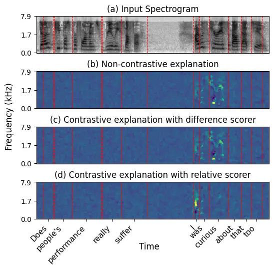

Figure 1: Input spectrogram (a) for the utterance of “Does people’s
performance really suffer? I was curious about that, too” with three
saliency maps (lighter = more relevant): a standard explanation for
translating ‘curious’ as curiosa (b), and two contrastive explanations
of why curiosa^(F) was preferred over curioso^(M) obtained with the
difference scorer (c) or the relative scorer (d).

The rise of deep neural networks has increased the demand for
explainable AI (XAI) methods to understand model behavior Räuker et al.
(2023); Ferrando et al. (2024). Within XAI, contrastive
explanations—which aim to answer the question ‘Why did P happen rather
than Q?’ instead of simply ‘Why did P happen?’ Lipton (1990)—have
emerged as a promising approach with increasing adoption across various
XAI applications Stepin et al. (2021). Their advantage stems from
mirroring human reasoning Byrne (2002); Miller (2019) and providing more
targeted insights than traditional explanations Lipton (1990); Jacovi
et al. (2021).

Nevertheless, contrastive explanations have yet to be applied to
speech-to-text (S2T) models. As S2T adoption grows Latif et al. (2023);
Barrault et al. (2025), extending XAI advances like contrastive
explanations to speech becomes crucial. Some pioneering works have
tackled the explanation of S2T models’ decisions, braving key challenges
including the multidimensional nature of speech signals, which span time
and frequency, and the variable length of output sequences Wu et al.
(2024). The main approach used in the literature is to measure how
perturbing the input audio signal affects the output Mandel (2016);
Kavaki and Mandel (2020); Trinh and Mandel (2020); Markert et al.
(2021); Mohebbi et al. (2023); Wu et al. (2023); Fucci et al. (2024); Wu
et al. (2024). The resulting explanations take the form of saliency maps
over a spectrogram representation of the audio input (Fig. 1.a). These
maps highlight the input regions that most strongly influence the
model’s predictions (Fig. 1.b). However, such explanations are holistic:
they identify features relevant for all aspects of word generation (e.g.
why the model produces ‘curioso’), without focusing on specific
contrastive aspects (why ‘curioso’, in the masculine, instead of
‘curiosa’). How, then, can we obtain contrastive explanations of the use
of speech features by S2T models?

To meet this challenge, we build upon a prior non-contrastive feature
attribution method for S2T, SPES (Fucci et al., 2024). Adapting it to
produce contrastive explanations requires two main interventions: i)
aggregating token-level probabilities for word-level analysis, since we
aim to explain why one word was generated instead of another, while
models generate subword tokens rather than complete words, and ii)
designing a scoring function that quantifies relative probability
changes between a target word and an alternative (the foil). We
investigate multiple approaches for both challenges, finding that
standard solutions from text-based NLP are inadequate for our scenario,
and propose improvements upon them.

We evaluate our method through a case study in speech translation (ST),
focusing on the translation of gender-neutral terms referring to the
speaker to languages requiring grammatical gender choices. For instance,
translating “I am curious” to Italian typically involves choosing
between an adjective with masculine inflection or one with feminine
inflection. This setting is well suited for evaluating contrastive
explanations in S2T as it provides natural pairs to contrast
(masculine/feminine forms), while offering an opportunity to study
whether models use acoustic cues like the speaker’s pitch to
disambiguate gender Bentivogli et al. (2020).¹¹ 1 We acknowledge that
using vocal features like pitch for gender prediction and framing gender
as a binary construct raise important ethical concerns, which we discuss
in §7.

Our method produces markedly different saliency maps from
non-contrastive approaches (see Fig. 1.d), and our experiments confirm
that these differences reflect its ability to isolate gender-specific
features, while non-contrastive explanations highlight regions affecting
general word prediction. Our contributions are: i) the first method for
contrastive explanations in S2T (§2), enabling precise identification of
the input features a model relies on to translate gender-ambiguous terms
referring to the speaker; ii) a methodology to evaluate their
faithfulness §3); iii) empirical validation on three language pairs
(en$`\rightarrow`$fr/it/es) demonstrating that our method successfully
isolates gender-relevant features (§4).²² 2 Our code is available at
https://github.com/hlt-mt/FBK-fairseq under the Apache License 2.0.

## 2 Contrastive Explanations for S2T

We build on SPES (Fucci et al., 2024), a state-of-the-art
perturbation-based method for feature attribution in S2T models. SPES
segments the input spectrogram by identifying acoustically meaningful
regions based on intensity patterns. It then performs multiple inference
passes, each time perturbing the input by randomly masking a subset of
these segments by setting them to zero. The influence of each segment on
the model’s output is quantified by comparing the perturbed and original
probabilities of a target token $`t`$, using a scoring function
$`S_{B}`$. The scores are averaged over all perturbations for each
segment, resulting in a final saliency map that highlights the most
relevant regions of the spectrogram for predicting $`t`$. These saliency
maps explain individual token predictions, not word-level patterns,
since S2T models generate subword tokens.

Obtaining contrastive explanations, that identify why one word was
chosen instead of another, requires two main changes to SPES: i)
aggregating token-level probabilities for a word-level analysis (§2.1)
and ii) designing a scoring function to quantify relative changes in
probability between target $`t`$ and foil $`f`$ (§2.2).

### 2.1 Word-Level Probabilities

Thus, the probability of a word $`t`$ must be reconstructed from its
$`k`$ constituent subwords $`w_{0,\dots,k}\in t`$. Previous work on
feature attribution for text generation Vafa et al. (2021); Ferrando
et al. (2022); Yin and Neubig (2022); Sarti et al. (2023) relies on
simplistic methods like subword-level attribution or basic aggregation
techniques (averaging, max-pooling), failling to account for potential
mismatches in the number of tokens in $`t`$ and $`f`$, and for the fact
that a subword sequence may be the prefix of a longer word, rather a
complete word.

Our Solution. To overcome the limitations of previous approaches and
obtain accurate word-level probabilities, we adopt the methodology of
Pimentel and Meister (2024). Unlike other simplistic methods, this
approach accounts for the fact that a sequence of subwords should be
followed by a beginning of word or punctuation token to form a word
rather than a prefix. This distinction is crucial to avoid
overestimating the likelihood of subword sequences that could be
prefixes (e.g., Italian: \_professor e^(M) vs. \_professor e ssa^(F)).
To the best of our knowledge, we are the first to apply this principled
method to feature attribution, ensuring accurate word-level
explanations.

### 2.2 Scoring Functions

In perturbation-based feature attribution, the base scoring function
$`S_{B}`$ is generally defined as the difference between the original
probability $`p(t)`$ and the probability $`\tilde{p}(t)`$ under the
perturbed input (Ancona et al., 2018; Seo et al., 2019):

```math
S_{B}(t)=p(t)-\tilde{p}(t) \tag{1}
```

Instead, to explain why a model produced an output rather than another,
contrastive feature attribution works in NLP Eberle et al. (2023);
Ferrando et al. (2023); Sarti et al. (2023); Sarti et al. (2024);
Krishna et al. (2024) typically use the contrastive difference scorer by
Yin and Neubig (2022):

```math
S_{CD}(t,f)=(p(t)-\tilde{p}(t))-(p(f)-\tilde{p}(f)) \tag{2}
```

$`S_{CD}(t,f)`$ assigns high scores to features whose perturbation
simultaneously decreases $`p(t)`$ and increases $`p(f)`$. However, if
the model strongly favors the target over the foil ($`p(t)\gg p(f)`$),
the difference score $`S_{CD}(t,f)`$ becomes nearly identical to the
base score $`S_{B}(t)`$. As shown in Fig. 1.c, this produces
explanations indistinguishable from non-contrastive ones, highlighting
features involved in every aspect of the prediction of $`t`$ rather than
focusing on the contrastive aspect under study—a limitation also noted
by Eberle et al. (2023) in NLP contexts.

Our Solution. To address this limitation, we repurpose the relative
scorer of Jacovi et al. (2021), originally introduced to evaluate
counterfactuals:

```math
S_{CR}(t,f)=\frac{p(t)}{p(t)+p(f)}-\frac{\tilde{p}(t)}{\tilde{p}(t)+\tilde{p}(f)} \tag{3}
```

This score normalizes the contribution of each term by their sum, which
ensures that both terms remain influential in the final score even when
their probabilities differ by orders of magnitude. The resulting
saliency maps (Fig. 1.d) differ significantly from non-contrastive ones,
indicating its precision in isolating gender-specific features. The
theoretical advantages of $`S_{CR}`$’s probability ratio normalization
extend beyond our S2T application, since generative models commonly
produce cases where $`p(t)\gg p(f)`$. Verifying whether $`S_{CR}`$ is
also preferable to $`S_{CD}`$ for contrastive explanations of other
generation tasks falls outside the scope of this work, but represents a
promising direction for future research within the broader XAI
community.

## 3 Evaluation

While existing work on contrastive explanations often evaluates against
linguistically plausible human-annotated explanations Yin and Neubig
(2022); Eberle et al. (2023); Ferrando et al. (2023), we focus on
faithfulness—how accurately explanations reflect model behavior,
regardless of human interpretability Jacovi and Goldberg (2020).

We adapt the flip rate metric proposed by Chemmengath et al. (2022) for
evaluating counterfactuals in text classification. In their work, the
flip rate measures how often a counterfactual input causes the model to
predict the foil instead of the target. Since our explanations are
saliency maps rather than input variants, we combine this concept with
the deletion metric—a common approach for evaluating feature attribution
methods Samek et al. (2016); Arras et al. (2017); Tomsett et al. (2020);
Samek et al. (2021); Fucci et al. (2024); Gevaert et al. (2024).
Starting with the most salient regions identified by our method, we
progressively remove input features and measure how quickly this causes
the model to switch from predicting the target to the foil. A faithful
explanation should identify features that require minimal deletion to
flip the model’s prediction.

However, unlike in classification tasks with fixed output classes,
generative models can produce any text when perturbed, including
synonyms or unrelated outputs. For our application, this complicates
detecting when the predicted gender changes. Therefore, we separate our
evaluation into two complementary metrics: coverage, which tracks the
percentage of cases where the model generates either term of interest,
and flip rate, which measures how often the model switches from target
to foil within these covered cases. While the flip rate indicates
whether we identified the right features for the target-foil contrast,
coverage ensures these features are specific to the contrast rather than
affecting general text generation.

## 4 Use Case

We test our contrastive feature attribution method on speaker’s gender
assignment in S2T translation. As a benchmark, we use MuST-SHE
Bentivogli et al. (2020), which contains
English-to-Spanish/French/Italian ST pairs annotated for terms that lack
explicit gender marking in the source but require gender assignment in
the target language. We focus on terms referring to the speaker,³³ 3 For
details on example selection, see Appendix C. for which MuST-SHE
provides both correct gender translations (based on gold speaker gender
labels) and their alternative incorrect versions⁴⁴ 4 Ethical
implications of this study are discussed in §7. (e.g., ‘curiosa^(F)’ vs.
‘curioso^(M)’) which we use to construct the target/foil pairs. Here, we
compare our relative scoring function with the difference scorer on the
en$`\rightarrow`$fr split, using the multilingual S2T Transformer
encoder-decoder model by Wang et al. (2020a), which has demonstrated
strong performance in gender translation accuracy. Experiments with
different architectures and language pairs, showing the same trends, are
reported in Appendix E, while the word-level aggregation methods are
compared in Appendix F.

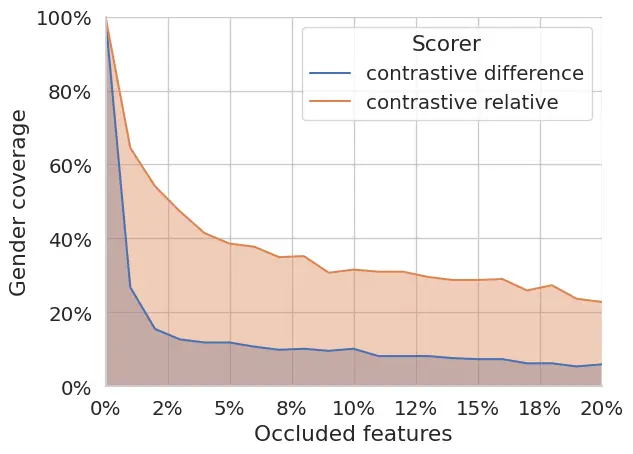

Figure 2: Coverage at different deletion steps for en$`\rightarrow`$fr.

#### Coverage.

Fig. 2 reports how coverage evolves as we progressively delete the
features identified as most important. The coverage of the difference
scorer drops below 20% after just 2% deletion, while the relative scorer
maintains higher coverage: more than 30% even after 20% deletion.⁵⁵ 5 We
focus on the first 20% of feature deletion, as beyond this point the
input becomes too degraded for meaningful model output. Full results are
reported in Appendix D. The dramatic coverage loss of the difference
scorer occurs because its explanations fail to be truly contrastive;
they do not target gender-relevant features. This is demonstrated by
their similarity to non-contrastive explanations: saliency maps obtained
with the contrastive difference scorer $`S_{CD}`$ on en-fr data exhibit
a Pearson correlation coefficient of 0.93 with those obtained with the
base scorer $`S_{B}`$, while relative scorer ($`S_{CR}`$) heatmaps show
only 0.33 correlation (see Appendix G for other languages and models).
We conclude that the difference scorer provides generic explanations,
while the features highlighted by the relative scorer are more precisely
linked to gender assignment.

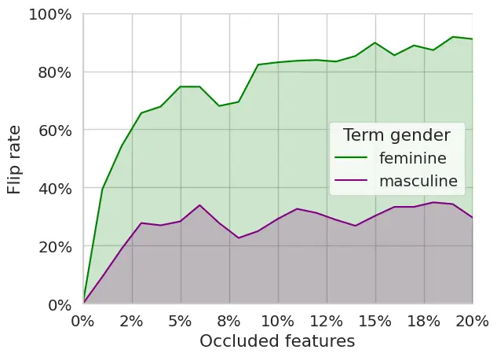

Figure 3: Flip rate at different deletion steps for en$`\rightarrow`$fr.

#### Flip rate.

We now demonstrate that the features identified by the relative scorer
are responsible for shifting the model’s predictions in the expected
direction along the gender axis. Fig. 3 shows that the relative scorer
effectively isolates features driving feminine gender predictions:
occluding the top 5% most relevant features causes the model to switch
to masculine translations for over 70% of the terms that remain in
coverage. This high flip rate, combined with the maintained coverage
discussed above, demonstrates that our method precisely discriminates
the exact input regions driving translation toward one gender instead of
the other: the model generates the same terms (coverage) but changes
their gender (flip rate) when these features are removed. For masculine
predictions, in contrast, the flip rate is much lower, plateauing at
$`\sim`$30%. However, this may not indicate a limitation of the method,
but rather reflect an underlying property of the ST model: if masculine
serves as the default prediction rather than one actively triggered by
specific input cues, then no occluded features could shift the
prediction toward the feminine class. The XAI literature on gender bias
supports this hypothesis: Jumelet et al. (2019) observe that models use
masculine as a default, generating feminine forms only when strong
feminine signals are present. This masculine default bias has also been
observed in ST systems’ internal language models (Fucci et al., 2023)
and likely stems from training data gender imbalance Tatman
(2017)—MuST-C contains twice as many male as female speakers Cattoni
et al. (2021). We defer to future work a thorough analysis of the
acoustic features the model exploits for gender translation and their
interaction with other model components and potential sources of bias.

Overall, our method effectively isolates features involved in gender
prediction, disentangling them from those encoding other semantic
content.

## 5 Conclusion

This paper has introduced the first method to obtain contrastive
explanations for S2T models, which identify input features that lead the
model to generate one output word instead of another. Our solution
builds on perturbation-based feature attribution over spectrograms. The
key element is our scorer, which ensures truly contrastive explanations,
unlike the difference scorer widely used in NLP. Our case study on the
input features driving the translation of speakers’ gender in ST
demonstrated the effectiveness of our approach in isolating the input
features driving the model’s choice between feminine and masculine
grammatical forms. Our methodology will enable future research not only
to investigate which phonetic cues ST models use for gender
disambiguation, but could also be applied to other phenomena and S2T
tasks.

## 6 Limitations

#### Extension to other use cases

While this work demonstrates the effectiveness of the proposed
contrastive explanation methodology for analyzing gender translation,
the method’s applicability beyond gender analysis remains to be
validated across other phenomena. However, we do not foresee any reason
for which its applicability could be limited. Possible areas of
investigation include: i) understanding homophone disambiguation (e.g.,
“plain” vs. “plane”) based on audio features Mohebbi et al. (2023); Yu
et al. (2024), ii) analyzing how models resolve coreference resolution
(e.g., identifying the features that make a model associate an ambiguous
pronoun with one referent over another) Amoia et al. (2012); Roesiger
et al. (2017), iii) investigating factuality issues by contrasting
correct translations against model errors, and iv) exploring politeness
register selection (e.g., why models choose formal “vous/Sie” over
informal “tu/du”) Sennrich et al. (2016).

#### Explaining gender assignment

As discussed in §4, the flip rate for feminine and masculine forms is
different, and never reaches 100%. For the Conformer models in Appendix
E, the flip rate is closer among genders. We propose potential reasons
for these variations, including differences in models’ initial gender
translation capabilities and possible masculine default bias in ST
models’ internal language models. But these remain conjectures that
require empirical verification. Such investigation of how different ST
models translate gender falls outside the scope of this work, which
focuses on developing and evaluating contrastive explanations rather
than reaching conclusions about gender translation mechanisms in ST
models.

## 7 Ethics Statement

The reliance of ST systems on vocal traits for gender prediction, as
examined in our use case, raises ethical concerns. These vocal
differences arise from both physiological and sociocultural factors,
which are well-documented in the literature (e.g., Simpson, 2001;
Hillenbrand and Clark, 2009; Coleman, 1976; Nylén et al., 2024). While
leveraging such traits has been shown to improve overall gender
translation accuracy in ST Bentivogli et al. (2020), it may also
disadvantage certain minorities and vulnerable populations. Transgender
speakers and individuals with vocal impairments could receive lower
quality translations if their vocal characteristics do not align with
typical gender-based expectations Matar et al. (2016); Pereira et al.
(2018); Villas-Bôas et al. (2021); Menezes et al. (2024). Prescribing
how ST systems should handle gender-related translations or which
characteristics they should consider when making gender-related
decisions is beyond the scope of this paper. Instead, our work focuses
on explaining current model behaviors and understanding how these
systems operate when left to make their own decisions.

Second, our contrastive study is constrained by the binary
(masculine/feminine) gender annotations in our dataset Bentivogli et al.
(2020). While this binary framework reflects the grammatical conventions
of our target languages, from a social perspective, it fails to
acknowledge individuals whose gender identity exists outside the
male/female binary Zimman (2020). Although we analyze grammatical
gender, we acknowledge its interaction with gender identity and
recognize that enforcing binary translations can erase non-binary
identities. While emerging linguistic innovations like neologisms,
neopronouns, and new morphological forms offer alternatives Piergentili
et al. (2023), to the best of our knowledge, ST datasets incorporating
these forms are not yet available. Once such data becomes available, our
methodology could be used to analyze how systems choose between binary
terms and neutral alternatives. Furthermore, extending this analysis to
languages with diverse gender systems could provide valuable insights
into how ST models handle varying degrees of grammatical gender
complexity Corbett (1991).

## Acknowledgements

This paper has received funding from the PNRR project FAIR - Future AI
Research (PE00000013), under the NRRP MUR program funded by the
NextGenerationEU and from the European Union’s Horizon research and
innovation programme under grant agreement No 101135798, project
Meetween (My Personal AI Mediator for Virtual MEETings BetWEEN People).

## References

- Achanta et al. (2012) Radhakrishna Achanta, Appu Shaji, Kevin Smith,
  Aurelien Lucchi, Pascal Fua, and Sabine Süsstrunk. 2012. Slic
  superpixels compared to state-of-the-art superpixel methods. _IEEE
  transactions on pattern analysis and machine intelligence_,
  34(11):2274–2282.
- Ahmad et al. (2024) Ibrahim Said Ahmad, Antonios Anastasopoulos,
  Ondřej Bojar, Claudia Borg, Marine Carpuat, Roldano Cattoni, Mauro
  Cettolo, William Chen, Qianqian Dong, Marcello Federico, Barry Haddow,
  Dávid Javorský, Mateusz Krubiński, Tsz Kin Lam, Xutai Ma, Prashant
  Mathur, Evgeny Matusov, Chandresh Maurya, John McCrae, Kenton Murray,
  Satoshi Nakamura, Matteo Negri, Jan Niehues, Xing Niu, Atul Kr. Ojha,
  John Ortega, Sara Papi, Peter Polák, Adam Pospíšil, Pavel Pecina,
  Elizabeth Salesky, Nivedita Sethiya, Balaram Sarkar, Jiatong Shi,
  Claytone Sikasote, Matthias Sperber, Sebastian Stüker, Katsuhito
  Sudoh, Brian Thompson, Alex Waibel, Shinji Watanabe, Patrick Wilken,
  Petr Zemánek, and Rodolfo Zevallos. 2024. [FINDINGS OF THE IWSLT 2024
  EVALUATION CAMPAIGN](https://doi.org/10.18653/v1/2024.iwslt-1.1). In
  _Proceedings of the 21st International Conference on Spoken Language
  Translation (IWSLT 2024)_, pages 1–11, Bangkok, Thailand (in-person
  and online). Association for Computational Linguistics.
- Amoia et al. (2012) Marilisa Amoia, Kerstin Kunz, and Ekaterina
  Lapshinova-Koltunski. 2012. Coreference in spoken vs. written texts: a
  corpus-based analysis. In _LREC_, pages 158–164.
- Ancona et al. (2018) Marco Ancona, Enea Ceolini, Cengiz Öztireli, and
  Markus Gross. 2018. Towards better understanding of gradient-based
  attribution methods for deep neural networks. In _6th International
  Conference on Learning Representations (ICLR)_, 1711.06104, pages 0–0.
  Arxiv-Computer Science.
- Ardila et al. (2020) Rosana Ardila, Megan Branson, Kelly Davis,
  Michael Kohler, Josh Meyer, Michael Henretty, Reuben Morais, Lindsay
  Saunders, Francis Tyers, and Gregor Weber. 2020. [Common voice: A
  massively-multilingual speech
  corpus](https://aclanthology.org/2020.lrec-1.520/). In _Proceedings of
  the Twelfth Language Resources and Evaluation Conference_, pages
  4218–4222, Marseille, France. European Language Resources Association.
- Arras et al. (2017) Leila Arras, Grégoire Montavon, Klaus-Robert
  Müller, and Wojciech Samek. 2017. Explaining recurrent neural network
  predictions in sentiment analysis. In _8th Workshop on Computational
  Approaches to Subjectivity, Sentiment and Social Media Analysis WASSA
  2017: Proceedings of the Workshop_, pages 159–168. The Association for
  Computational Linguistics.
- Barrault et al. (2025) Loïc Barrault, Yu-An Chung, Mariano Coria
  Meglioli, David Dale, Ning Dong, Paul-Ambroise Duquenne, Hady Elsahar,
  Hongyu Gong, Kevin Heffernan, John Hoffman, et al. 2025. Joint speech
  and text machine translation for up to 100 languages. _Nature_,
  637(8046):587–593.
- Bentivogli et al. (2020) Luisa Bentivogli, Beatrice Savoldi, Matteo
  Negri, Mattia A. Di Gangi, Roldano Cattoni, and Marco Turchi. 2020.
  [Gender in danger? evaluating speech translation technology on the
  MuST-SHE corpus](https://doi.org/10.18653/v1/2020.acl-main.619). In
  _Proceedings of the 58th Annual Meeting of the Association for
  Computational Linguistics_, pages 6923–6933, Online. Association for
  Computational Linguistics.
- Byrne (2002) Ruth MJ Byrne. 2002. Mental models and counterfactual
  thoughts about what might have been. _Trends in cognitive sciences_,
  6(10):426–431.
- Cattoni et al. (2021) Roldano Cattoni, Mattia Antonino Di Gangi, Luisa
  Bentivogli, Matteo Negri, and Marco Turchi. 2021. Must-c: A
  multilingual corpus for end-to-end speech translation. _Computer
  speech & language_, 66:101155.
- Chemmengath et al. (2022) Saneem Chemmengath, Amar Prakash Azad, Ronny
  Luss, and Amit Dhurandhar. 2022. [Let the CAT out of the bag:
  Contrastive attributed explanations for
  text](https://doi.org/10.18653/v1/2022.emnlp-main.484). In
  _Proceedings of the 2022 Conference on Empirical Methods in Natural
  Language Processing_, pages 7190–7206, Abu Dhabi, United Arab
  Emirates. Association for Computational Linguistics.
- Coleman (1976) Ralph O. Coleman. 1976. [A comparison of the
  contributions of two voice quality characteristics to the perception
  of maleness and femaleness in the
  voice](https://doi.org/10.1044/jshr.1901.168). _Journal of Speech &
  Hearing Research_, 19(1):168–180.
- Corbett (1991) Greville G Corbett. 1991. _Gender_. Cambridge
  University Press.
- Eberle et al. (2023) Oliver Eberle, Ilias Chalkidis, Laura Cabello,
  and Stephanie Brandl. 2023. [Rather a nurse than a physician -
  contrastive explanations under
  investigation](https://doi.org/10.18653/v1/2023.emnlp-main.427). In
  _Proceedings of the 2023 Conference on Empirical Methods in Natural
  Language Processing_, pages 6907–6920, Singapore. Association for
  Computational Linguistics.
- Ferrando et al. (2022) Javier Ferrando, Gerard I. Gállego, Belen
  Alastruey, Carlos Escolano, and Marta R. Costa-jussà. 2022. [Towards
  opening the black box of neural machine translation: Source and target
  interpretations of the
  transformer](https://doi.org/10.18653/v1/2022.emnlp-main.599). In
  _Proceedings of the 2022 Conference on Empirical Methods in Natural
  Language Processing_, pages 8756–8769, Abu Dhabi, United Arab
  Emirates. Association for Computational Linguistics.
- Ferrando et al. (2023) Javier Ferrando, Gerard I. Gállego, Ioannis
  Tsiamas, and Marta R. Costa-jussà. 2023. [Explaining how transformers
  use context to build
  predictions](https://doi.org/10.18653/v1/2023.acl-long.301). In
  _Proceedings of the 61st Annual Meeting of the Association for
  Computational Linguistics (Volume 1: Long Papers)_, pages 5486–5513,
  Toronto, Canada. Association for Computational Linguistics.
- Ferrando et al. (2024) Javier Ferrando, Gabriele Sarti, Arianna
  Bisazza, and Marta R Costa-jussà. 2024. A primer on the inner workings
  of transformer-based language models. _arXiv preprint
  arXiv:2405.00208_.
- Fucci et al. (2023) Dennis Fucci, Marco Gaido, Sara Papi, Mauro
  Cettolo, Matteo Negri, and Luisa Bentivogli. 2023. [Integrating
  language models into direct speech translation: An inference-time
  solution to control gender
  inflection](https://doi.org/10.18653/v1/2023.emnlp-main.705). In
  _Proceedings of the 2023 Conference on Empirical Methods in Natural
  Language Processing_, pages 11505–11517, Singapore. Association for
  Computational Linguistics.
- Fucci et al. (2024) Dennis Fucci, Marco Gaido, Beatrice Savoldi,
  Matteo Negri, Mauro Cettolo, and Luisa Bentivogli. 2024. Spes:
  Spectrogram perturbation for explainable speech-to-text generation.
  _arXiv preprint arXiv:2411.01710_.
- Gevaert et al. (2024) Arne Gevaert, Axel-Jan Rousseau, Thijs Becker,
  Dirk Valkenborg, Tijl De Bie, and Yvan Saeys. 2024. Evaluating feature
  attribution methods in the image domain. _Machine Learning_, pages
  1–46.
- Hernandez et al. (2018) François Hernandez, Vincent Nguyen, Sahar
  Ghannay, Natalia Tomashenko, and Yannick Estève. 2018. Ted-lium 3:
  Twice as much data and corpus repartition for experiments on speaker
  adaptation. In _Speech and Computer_, pages 198–208, Cham.
- Hillenbrand and Clark (2009) James M. Hillenbrand and Michael J.
  Clark. 2009. [The role of f0 and formant frequencies in distinguishing
  the voices of men and women](https://doi.org/10.3758/APP.71.5.1150).
  _Attention Perception & Psychophysics_, 71(5):1150–1166.
- Iranzo-Sánchez et al. (2020) Javier Iranzo-Sánchez, Joan Albert
  Silvestre-Cerdà, Javier Jorge, Nahuel Roselló, Adrià Giménez, Albert
  Sanchis, Jorge Civera, and Alfons Juan. 2020. [Europarl-st: A
  multilingual corpus for speech translation of parliamentary
  debates](https://doi.org/10.1109/ICASSP40776.2020.9054626). In _ICASSP
  2020 - 2020 IEEE International Conference on Acoustics, Speech and
  Signal Processing (ICASSP)_, pages 8229–8233.
- Jacovi and Goldberg (2020) Alon Jacovi and Yoav Goldberg. 2020.
  [Towards faithfully interpretable NLP systems: How should we define
  and evaluate
  faithfulness?](https://doi.org/10.18653/v1/2020.acl-main.386) In
  _Proceedings of the 58th Annual Meeting of the Association for
  Computational Linguistics_, pages 4198–4205, Online. Association for
  Computational Linguistics.
- Jacovi et al. (2021) Alon Jacovi, Swabha Swayamdipta, Shauli Ravfogel,
  Yanai Elazar, Yejin Choi, and Yoav Goldberg. 2021. [Contrastive
  explanations for model
  interpretability](https://doi.org/10.18653/v1/2021.emnlp-main.120). In
  _Proceedings of the 2021 Conference on Empirical Methods in Natural
  Language Processing_, pages 1597–1611, Online and Punta Cana,
  Dominican Republic. Association for Computational Linguistics.
- Jumelet et al. (2019) Jaap Jumelet, Willem Zuidema, and Dieuwke
  Hupkes. 2019. [Analysing neural language models: Contextual
  decomposition reveals default reasoning in number and gender
  assignment](https://doi.org/10.18653/v1/K19-1001). In _Proceedings of
  the 23rd Conference on Computational Natural Language Learning
  (CoNLL)_, pages 1–11, Hong Kong, China. Association for Computational
  Linguistics.
- Kavaki and Mandel (2020) Hassan Salami Kavaki and Michael I
  Mandel. 2020. Identifying important time-frequency locations in
  continuous speech utterances. In _Proceedings of Interspeech_.
- Krishna et al. (2024) Satyapriya Krishna, Jiaqi Ma, Dylan Slack, Asma
  Ghandeharioun, Sameer Singh, and Himabindu Lakkaraju. 2024. Post hoc
  explanations of language models can improve language models. _Advances
  in Neural Information Processing Systems_, 36.
- Latif et al. (2023) Siddique Latif, Moazzam Shoukat, Fahad Shamshad,
  Muhammad Usama, Yi Ren, Heriberto Cuayáhuitl, Wenwu Wang, Xulong
  Zhang, Roberto Togneri, Erik Cambria, et al. 2023. Sparks of large
  audio models: A survey and outlook. _arXiv preprint arXiv:2308.12792_.
- Lipton (1990) Peter Lipton. 1990. Contrastive explanation. _Royal
  Institute of Philosophy Supplements_, 27:247–266.
- Mandel (2016) Michael I Mandel. 2016. Directly comparing the listening
  strategies of humans and machines. In _INTERSPEECH_, pages 660–664.
- Markert et al. (2021) Karla Markert, Romain Parracone, Mykhailo
  Kulakov, Philip Sperl, Ching-Yu Kao, and Konstantin Böttinger. 2021.
  Visualizing automatic speech recognition–means for a better
  understanding? _ISCA Symposium on Security and Privacy in Speech
  Communication_.
- Matar et al. (2016) Nayla Matar, Cristel Portes, Leonardo Lancia,
  Thierry Legou, and Fabienne Baider. 2016. Voice quality and gender
  stereotypes: A study of lebanese women with reinke’s edema. _Journal
  of Speech, Language, and Hearing Research_, 59(6):S1608–S1617.
- Meister et al. (2020) Clara Meister, Ryan Cotterell, and Tim
  Vieira. 2020. [If beam search is the answer, what was the
  question?](https://doi.org/10.18653/v1/2020.emnlp-main.170) In
  _Proceedings of the 2020 Conference on Empirical Methods in Natural
  Language Processing (EMNLP)_, pages 2173–2185, Online. Association for
  Computational Linguistics.
- Menezes et al. (2024) Danielle Pereira Menezes, Zulina Souza de Lira,
  Ana Nery Barbosa de Araújo, Anna Alice Figueirêdo de Almeida, Adriana
  de Oliveira Camargo Gomes, Bruno Teixeira Moraes, and Jonia Alves
  Lucena. 2024. Prosodic differences in the voices of transgender and
  cisgender women: self-perception of voice-an auditory and acoustic
  analysis. _Journal of Voice_, 38(4):844–857.
- Miller (2019) Tim Miller. 2019. Explanation in artificial
  intelligence: Insights from the social sciences. _Artificial
  intelligence_, 267:1–38.
- Mohebbi et al. (2023) Hosein Mohebbi, Grzegorz Chrupała, Willem
  Zuidema, and Afra Alishahi. 2023. [Homophone disambiguation reveals
  patterns of context mixing in speech
  transformers](https://doi.org/10.18653/v1/2023.emnlp-main.513). In
  _Proceedings of the 2023 Conference on Empirical Methods in Natural
  Language Processing_, pages 8249–8260, Singapore. Association for
  Computational Linguistics.
- Nylén et al. (2024) Frida Nylén, Johan Holmberg, and Maria
  Södersten. 2024. [Acoustic cues to femininity and masculinity in
  spontaneous speech](https://doi.org/10.1121/10.0025932). _The Journal
  of the Acoustical Society of America_, 155(5):3090–3100.
- Panayotov et al. (2015) Vassil Panayotov, Guoguo Chen, Daniel Povey,
  and Sanjeev Khudanpur. 2015. [Librispeech: An asr corpus based on
  public domain audio
  books](https://doi.org/10.1109/ICASSP.2015.7178964). In _2015 IEEE
  International Conference on Acoustics, Speech and Signal Processing
  (ICASSP)_, pages 5206–5210.
- Papi et al. (2024) Sara Papi, Marco Gaido, Andrea Pilzer, and Matteo
  Negri. 2024. [When good and reproducible results are a giant with feet
  of clay: The importance of software quality in
  NLP](https://doi.org/10.18653/v1/2024.acl-long.200). In _Proceedings
  of the 62nd Annual Meeting of the Association for Computational
  Linguistics (Volume 1: Long Papers)_, pages 3657–3672, Bangkok,
  Thailand. Association for Computational Linguistics.
- Park et al. (2019) Daniel S Park, William Chan, Yu Zhang, Chung-Cheng
  Chiu, Barret Zoph, Ekin D Cubuk, and Quoc V Le. 2019. Specaugment: A
  simple data augmentation method for automatic speech recognition.
  _Interspeech 2019_, page 2613.
- Pereira et al. (2018) Amanda Maria Pereira, Ana Paula Dassie-Leite,
  Eliane Cristina Pereira, Juliana Benthien Cavichiolo, Marcelo
  de Oliveira Rosa, and Elmar Allen Fugmann. 2018. Percepção auditiva de
  juízes leigos quanto ao gênero de mulheres com edema de reinke. In
  _CoDAS_, volume 30, page e20170046. SciELO Brasil.
- Piergentili et al. (2023) Andrea Piergentili, Dennis Fucci, Beatrice
  Savoldi, Luisa Bentivogli, and Matteo Negri. 2023. [Gender
  neutralization for an inclusive machine translation: from theoretical
  foundations to open
  challenges](https://aclanthology.org/2023.gitt-1.7/). In _Proceedings
  of the First Workshop on Gender-Inclusive Translation Technologies_,
  pages 71–83, Tampere, Finland. European Association for Machine
  Translation.
- Pimentel and Meister (2024) Tiago Pimentel and Clara Meister. 2024.
  [How to compute the probability of a
  word](https://doi.org/10.18653/v1/2024.emnlp-main.1020). In
  _Proceedings of the 2024 Conference on Empirical Methods in Natural
  Language Processing_, pages 18358–18375, Miami, Florida, USA.
  Association for Computational Linguistics.
- Räuker et al. (2023) Tilman Räuker, Anson Ho, Stephen Casper, and
  Dylan Hadfield-Menell. 2023. Toward transparent ai: A survey on
  interpreting the inner structures of deep neural networks. In _2023
  ieee conference on secure and trustworthy machine learning (satml)_,
  pages 464–483. IEEE.
- Roesiger et al. (2017) Ina Roesiger, Sabrina Stehwien, Arndt Riester,
  and Ngoc Thang Vu. 2017. [Improving coreference resolution with
  automatically predicted prosodic
  information](https://doi.org/10.18653/v1/W17-4610). In _Proceedings of
  the Workshop on Speech-Centric Natural Language Processing_, pages
  78–83, Copenhagen, Denmark. Association for Computational Linguistics.
- Samek et al. (2016) Wojciech Samek, Alexander Binder, Grégoire
  Montavon, Sebastian Lapuschkin, and Klaus-Robert Müller. 2016.
  Evaluating the visualization of what a deep neural network has
  learned. _IEEE transactions on neural networks and learning systems_,
  28(11):2660–2673.
- Samek et al. (2021) Wojciech Samek, Grégoire Montavon, Sebastian
  Lapuschkin, Christopher J Anders, and Klaus-Robert Müller. 2021.
  Explaining deep neural networks and beyond: A review of methods and
  applications. _Proceedings of the IEEE_, 109(3):247–278.
- Sarti et al. (2024) Gabriele Sarti, Grzegorz Chrupała, Malvina Nissim,
  and Arianna Bisazza. 2024. [Quantifying the plausibility of context
  reliance in neural machine
  translation](https://openreview.net/forum?id=XTHfNGI3zT). In _The
  Twelfth International Conference on Learning Representations (ICLR 2024)_, Vienna, Austria. OpenReview.
- Sarti et al. (2023) Gabriele Sarti, Nils Feldhus, Ludwig Sickert, and
  Oskar van der Wal. 2023. [Inseq: An interpretability toolkit for
  sequence generation
  models](https://doi.org/10.18653/v1/2023.acl-demo.40). In _Proceedings
  of the 61st Annual Meeting of the Association for Computational
  Linguistics (Volume 3: System Demonstrations)_, pages 421–435,
  Toronto, Canada. Association for Computational Linguistics.
- Savoldi et al. (2022) Beatrice Savoldi, Marco Gaido, Luisa Bentivogli,
  Matteo Negri, and Marco Turchi. 2022. [Under the morphosyntactic lens:
  A multifaceted evaluation of gender bias in speech
  translation](https://doi.org/10.18653/v1/2022.acl-long.127). In
  _Proceedings of the 60th Annual Meeting of the Association for
  Computational Linguistics (Volume 1: Long Papers)_, pages 1807–1824,
  Dublin, Ireland. Association for Computational Linguistics.
- Sennrich et al. (2016) Rico Sennrich, Barry Haddow, and Alexandra
  Birch. 2016. [Controlling politeness in neural machine translation via
  side constraints](https://doi.org/10.18653/v1/N16-1005). In
  _Proceedings of the 2016 Conference of the North American Chapter of
  the Association for Computational Linguistics: Human Language
  Technologies_, pages 35–40, San Diego, California. Association for
  Computational Linguistics.
- Seo et al. (2019) Dasom Seo, Kanghan Oh, and Il-Seok Oh. 2019.
  Regional multi-scale approach for visually pleasing explanations of
  deep neural networks. _IEEE Access_, 8:8572–8582.
- Simpson (2001) Adrian P. Simpson. 2001. [Dynamic consequences of
  differences in male and female vocal tract
  dimensions](https://doi.org/10.1121/1.1356020). _The Journal of the
  Acoustical Society of America_, 109(5 Pt 1):2153–2164.
- Stepin et al. (2021) Ilia Stepin, Jose M Alonso, Alejandro Catala, and
  Martín Pereira-Fariña. 2021. A survey of contrastive and
  counterfactual explanation generation methods for explainable
  artificial intelligence. _IEEE Access_, 9:11974–12001.
- Tatman (2017) Rachael Tatman. 2017. [Gender and dialect bias in
  YouTube‘s automatic captions](https://doi.org/10.18653/v1/W17-1606).
  In _Proceedings of the First ACL Workshop on Ethics in Natural
  Language Processing_, pages 53–59, Valencia, Spain. Association for
  Computational Linguistics.
- Tomsett et al. (2020) Richard Tomsett, Dan Harborne, Supriyo
  Chakraborty, Prudhvi Gurram, and Alun Preece. 2020. Sanity checks for
  saliency metrics. In _Proceedings of the AAAI conference on artificial
  intelligence_, volume 34, pages 6021–6029.
- Trinh and Mandel (2020) Viet Anh Trinh and Michael Mandel. 2020.
  Directly comparing the listening strategies of humans and machines.
  _IEEE/ACM Transactions on Audio, Speech, and Language Processing_,
  29:312–323.
- Vafa et al. (2021) Keyon Vafa, Yuntian Deng, David Blei, and Alexander
  Rush. 2021. [Rationales for sequential
  predictions](https://doi.org/10.18653/v1/2021.emnlp-main.807). In
  _Proceedings of the 2021 Conference on Empirical Methods in Natural
  Language Processing_, pages 10314–10332, Online and Punta Cana,
  Dominican Republic. Association for Computational Linguistics.
- Villas-Bôas et al. (2021) Anna Paula Villas-Bôas, Karine Schwarz, Anna
  Martha Vaitses Fontanari, Angelo Brandelli Costa, Dhiordan Cardoso da
  Silva, Maiko Abel Schneider, Carla Aparecida Cielo, Poli Mara
  Spritzer, and Maria Inês Rodrigues Lobato. 2021. Acoustic measures of
  brazilian transgender women’s voices: a case–control study. _Frontiers
  in Psychology_, 12:622526.
- Wang et al. (2021) Changhan Wang, Morgane Riviere, Ann Lee, Anne Wu,
  Chaitanya Talnikar, Daniel Haziza, Mary Williamson, Juan Pino, and
  Emmanuel Dupoux. 2021. [VoxPopuli: A large-scale multilingual speech
  corpus for representation learning, semi-supervised learning and
  interpretation](https://doi.org/10.18653/v1/2021.acl-long.80). In
  _Proceedings of the 59th Annual Meeting of the Association for
  Computational Linguistics and the 11th International Joint Conference
  on Natural Language Processing (Volume 1: Long Papers)_, pages
  993–1003, Online. Association for Computational Linguistics.
- Wang et al. (2020a) Changhan Wang, Yun Tang, Xutai Ma, Anne Wu, Dmytro
  Okhonko, and Juan Pino. 2020a. [Fairseq S2T: Fast speech-to-text
  modeling with fairseq](https://doi.org/10.18653/v1/2020.aacl-demo.6).
  In _Proceedings of the 1st Conference of the Asia-Pacific Chapter of
  the Association for Computational Linguistics and the 10th
  International Joint Conference on Natural Language Processing: System
  Demonstrations_, pages 33–39, Suzhou, China. Association for
  Computational Linguistics.
- Wang et al. (2020b) Changhan Wang, Anne Wu, and Juan Pino. 2020b.
  [Covost 2: A massively multilingual speech-to-text translation
  corpus](https://arxiv.org/abs/2007.10310). _Preprint_,
  arXiv:2007.10310.
- Wu et al. (2023) Xiaoliang Wu, Peter Bell, and Ajitha Rajan. 2023.
  [Explanations for automatic speech
  recognition](https://doi.org/10.1109/ICASSP49357.2023.10094635). In
  _ICASSP 2023 - 2023 IEEE International Conference on Acoustics, Speech
  and Signal Processing (ICASSP)_, pages 1–5.
- Wu et al. (2024) Xiaoliang Wu, Peter Bell, and Ajitha Rajan. 2024. Can
  we trust explainable ai methods on asr? an evaluation on phoneme
  recognition. In _ICASSP 2024-2024 IEEE International Conference on
  Acoustics, Speech and Signal Processing (ICASSP)_, pages 10296–10300.
  IEEE.
- Yan et al. (2023) Brian Yan, Siddharth Dalmia, Yosuke Higuchi, Graham
  Neubig, Florian Metze, Alan W Black, and Shinji Watanabe. 2023. [CTC
  alignments improve autoregressive
  translation](https://doi.org/10.18653/v1/2023.eacl-main.119). In
  _Proceedings of the 17th Conference of the European Chapter of the
  Association for Computational Linguistics_, pages 1623–1639,
  Dubrovnik, Croatia. Association for Computational Linguistics.
- Yin and Neubig (2022) Kayo Yin and Graham Neubig. 2022. [Interpreting
  language models with contrastive
  explanations](https://doi.org/10.18653/v1/2022.emnlp-main.14). In
  _Proceedings of the 2022 Conference on Empirical Methods in Natural
  Language Processing_, pages 184–198, Abu Dhabi, United Arab Emirates.
  Association for Computational Linguistics.
- Yu et al. (2024) Tengfei Yu, Xuebo Liu, Liang Ding, Kehai Chen,
  Dacheng Tao, and Min Zhang. 2024. [Speech sense disambiguation:
  Tackling homophone ambiguity in end-to-end speech
  translation](https://doi.org/10.18653/v1/2024.acl-long.435). In
  _Proceedings of the 62nd Annual Meeting of the Association for
  Computational Linguistics (Volume 1: Long Papers)_, pages 8020–8035,
  Bangkok, Thailand. Association for Computational Linguistics.
- Zimman (2020) Lal Zimman. 2020. [Transgender language, transgender
  moment: Toward a trans
  linguistics](https://doi.org/10.1093/oxfordhb/9780190212926.013.45).
  In _The Oxford Handbook of Language and Sexuality_. Oxford University
  Press.

## Appendix A Occlusion-based Feature Attribution Configuration

Following the recommendations in Fucci et al. (2024), we configured our
occlusion-based feature attribution experiments using SLIC segmentation
Achanta et al. (2012) with dynamic adjustment of segments based on input
duration. To manage computational costs while maintaining explanation
quality for longer inputs, we applied a threshold of 750 frames before
capping the segment count. We employ a three-level segmentation strategy
by dividing the spectrogram into 2000, 2500, and 3000 segments to obtain
segmentations of varying granularity. We generate 20,000 random
perturbation masks generated per sample. Each segment has a 0.5
probability of being masked during perturbation. The SLIC sigma
parameter was set to 0.

## Appendix B Model Details

The ST Transformer encoder-decoder model by Wang et al. (2020a) is a
multilingual model trained on the 8 language directions of MuST-C
(Cattoni et al., 2021) with 72M of parameters, distributed under the MIT
License. The model takes as input 80 Mel-filterbank audio features
extracted every 10 milliseconds, employing a sample window of 25. The
input features are then preprocessed with two 1D convolutional layers
with stride 2, reducing input length by a factor of 4, before being fed
to the Transformer encoder. We choose this model for our experiments
both for its permissive license and its strong gender translation
accuracy (see Table 1). For inference, we used a beam size of 5 and a
no-repeat-ngram-size of 5. The maximum source position was set to 7,000.

|                       |       |       |       |       |       |       |       |       |       |       |       |       |
| --------------------- | ----- | ----- | ----- | ----- | ----- | ----- | ----- | ----- | ----- | ----- | ----- | ----- |
|                       | en-it |       |       |       | en-fr |       |       |       | en-es |       |       |       |
|                       | Cov.  |       | Acc.  |       | Cov.  |       | Acc.  |       | Cov.  |       | Acc.  |       |
|                       | F     | M     | F     | M     | F     | M     | F     | M     | F     | M     | F     | M     |
| Mult. Transformer     | 54.61 | 53.73 | 77.09 | 94.40 | 53.30 | 54.39 | 77.35 | 91.85 | 66.33 | 65.55 | 80.60 | 91.41 |
| Mono. Conformer       | 49.63 | 46.99 | 46.38 | 75.76 | 56.84 | 56.10 | 49.80 | 72.50 | 69.13 | 65.07 | 39.21 | 76.74 |
| Large-scale Conformer | \-    | \-    | \-    | \-    | \-    | \-    | \-    | \-    | 76.28 | 71.53 | 53.27 | 69.52 |

Table 1: Coverage (Cov.) and Accuracy (Acc.) for the the models
considered across the three language pairs.

## Appendix C Dataset Description and Processing

Our analysis uses MuST-SHE Bentivogli et al. (2020), a speech
translation dataset compiled from TED talks that includes annotations
for words which are gender-neutral in the source language but have
gender marking in the reference translation to the target language. The
dataset is licensed under CC BY NC ND 4.0 International, and our usage
aligns with its intended purpose of studying gender term translation in
speech translation systems. Comprehensive information about the
dataset’s domain coverage, language scope, linguistic phenomena, and
represented demographic groups is available in the dataset’s data
statement.⁶⁶ 6 https://mt.fbk.eu/data-statement-for-must-she/ Given its
origin in educational talks, the corpus is free of offensive content. It
contains identifiable information in the form of speaker names, which
are publicly available with their consent as part of their TED talks.
The dataset includes speaker’s gender information, which was annotated
based on speakers’ self-identification as documented in their public
profiles at the time of dataset creation.

We run our experiments on English-to-Spanish/French/Italian
translations, specifically examining gender terms that refer to the
speaker (category 1 in MuST-SHE), as these instances may benefit from
acoustic cues for gender disambiguation. The dataset provides pairs of
correct and incorrect gender translations for each term (e.g.,
‘curiosa’/‘curioso’), which we use in our contrastive analysis. Using
the annotations from Savoldi et al. (2022), we exclude gender articles
from our analysis due to their high frequency in both genders across
sentences, which makes it challenging to reliably identify specific
instances referring to the speaker and could introduce noise into the
evaluation.

Our analysis encompasses only those gender terms for which the model
generates one of the forms annotated in MuST-SHE (either correct or
incorrect version), as these are the only instances where we have access
to the contrastive alternative. For the Transformer model on
English-to-French translation, for which we present experimental results
in the main paper, this filtering process yields a final set of 975
terms for analysis.

## Appendix D Full Deletion Range Analysis

The choice to focus on the first 20% of feature deletion in our main
analysis stems from the fact that beyond this point the input becomes
too degraded for model outputs to be meaningful. As shown in Figure 4,
coverage drops substantially with increased deletion, making the flip
rate measurements unreliable, as evidenced by the erratic behavior of
the curve in Figure 5 at higher deletion percentages.

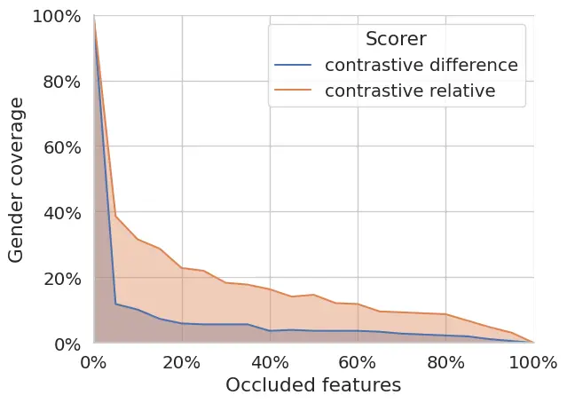

Figure 4: Gender coverage for all deletion steps for explanations with
different scorers for the Transformer model on en-fr data.

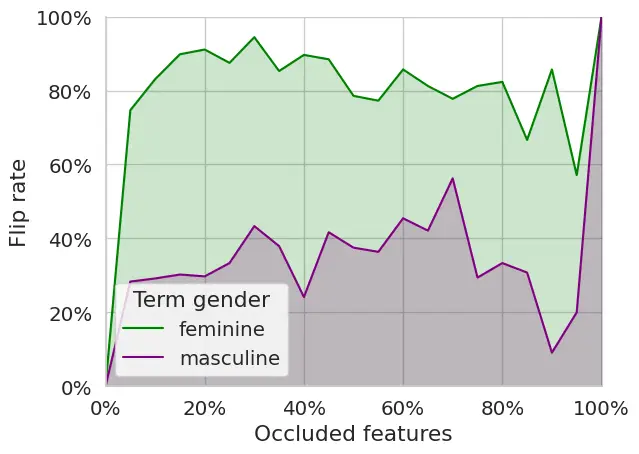

Figure 5: Flip rate for all deletion steps for explanations with
different scorers for the Transformer model on en-fr data.

## Appendix E Extended Results Across Models and Languages

In this section, to make sure our contrastive explanation method works
for different models and language pairs, we extend our study to the
English-Italian and English-Spanish sections of the data (§E.1) and to
two other types of models. In §E.2, we analyze the monolingual Conformer
encoder-Transformer decoder models by Papi et al. (2024). Similarly to
the Transformer model used in the main body of the paper, this model is
trained on MuST-C. In §E.3, to analyze a larger-scale system, we study a
Conformer encoder-Transformer decoder model trained on the
English-Spanish data of the constrained track of the last IWSLT campaign
(Ahmad et al., 2024). While our perturbation-based method for
contrastive explanations is inherently model-agnostic and applicable to
any architecture, we empirically validate that the explanations
generated across these diverse model configurations continue to satisfy
our quantitative faithfulness metrics.

### E.1 Results on Additional Language Pairs

For the multilingual Transformer model, we extend our analysis to
English-Italian and English-Spanish translations to verify whether the
patterns observed for English-French generalize across language pairs.
As shown in Figure 6, the relative scorer maintains substantially higher
coverage than the difference scorer across the two languages, confirming
the findings reported in the main paper for English-French. When
deleting 10% of the features, coverage remains above 20% for Italian and
Spanish, matching the robustness observed for French translations.

The gender-flipping behavior is also consistent across languages, as
shown in Figure 7. For feminine predictions, deleting just 5% of the
most relevant features identified by our method causes the model to
switch to masculine translations in over 60% of the covered cases for
both Italian and Spanish, as observed for French in §4. The asymmetry
between feminine and masculine predictions persists as well, with
masculine-to-feminine flip rates not going much higher than 40% across
all language pairs. This consistent pattern across three Romance
languages with similar grammatical gender systems suggests that our
earlier hypothesis about a masculine default could plausibly explain the
model’s behavior in these three cases.

The consistency across three target languages shows the robustness of
our method and suggests that the model may be using similar strategies
to make gender choices in all languages considered.

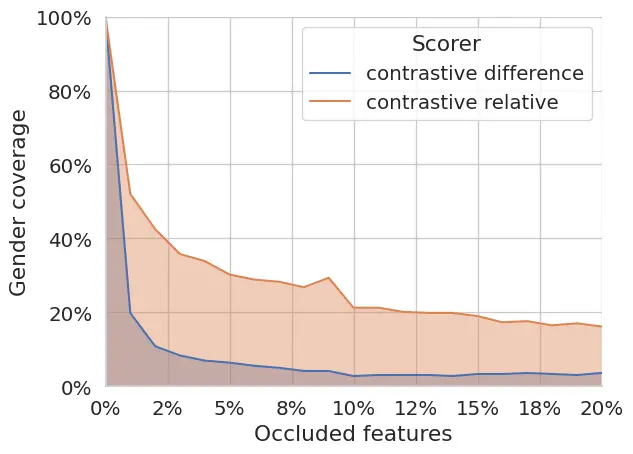

(a) en-it

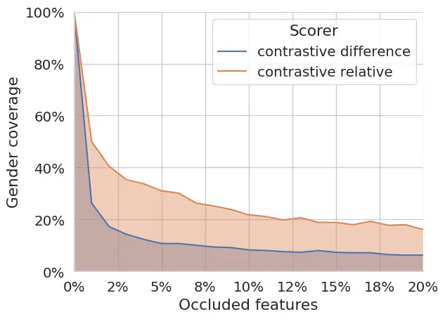

(b) en-es

Figure 6: Coverage for the first 20% deletion steps for explanations
with the difference and relative scorers for the Transformer model on
English-Italian and English-Spanish.

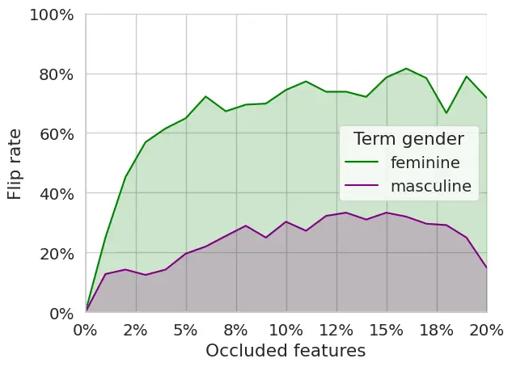

(a) en-it

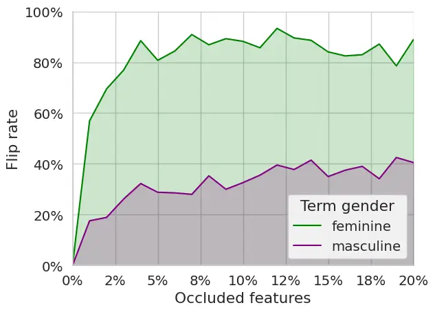

(b) en-es

Figure 7: Flip rate for the first 20% deletion steps for explanations
with the relative scorer for the Transformer model on English-Italian
and English-Spanish.

### E.2 Results on Conformer Models

In this section, we report the results obtained for the three language
pairs en-es/fr/it using the monolingual Conformer encoder-Transformer
decoder models by Papi et al. (2024), released under the Apache 2.0
License. Such models feature a higher translation quality than the
Transformer-based model we reported on above, but has a lower gender
accuracy, as reported in Table 1.

The coverage patterns observed for the Transformer model extend to the
monolingual Conformer models. As shown in Figure 8, the relative scorer
maintains consistently higher coverage than the difference scorer,
although with lower absolute values compared to the Transformer model.
At 10% deletion, coverage with the relative scorer remains above 30% for
all language pairs, indicating that our method still effectively
isolates gender-relevant features despite the architectural differences.

The gender-flipping behavior shows interesting variations from the
Transformer results. As seen in Figure 9, while the relative scorer
still triggers gender switches, the effect is more balanced between
feminine and masculine predictions - both achieving flip rates between
30-60% when 10% of features are deleted. This differs from the
Transformer’s strong asymmetry between genders. This more balanced
gender-flipping effect aligns with the Conformer models’ general gender
translation patterns (Table 1). Indeed, these models show substantially
lower gender accuracy, particularly for feminine terms referring to the
speaker, where performance approaches chance level. The reduced impact
of feature deletion on gender prediction suggests these models may rely
not only on the speech input but also on other factors, such as
previously generated tokens or potential biases embedded in the
decoder’s “internal language model” Fucci et al. (2023).

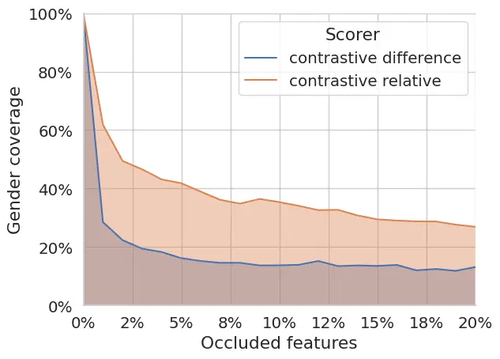

(a) en-es

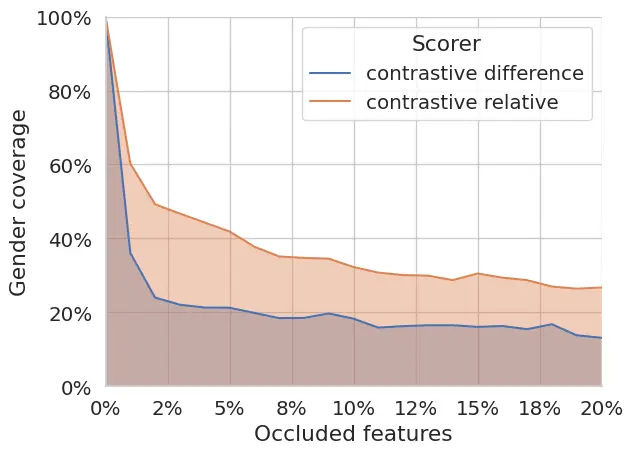

(b) en-fr

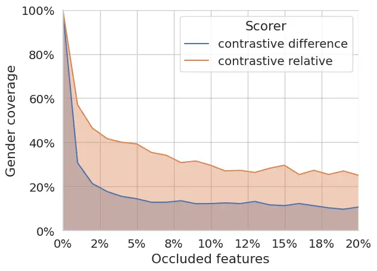

(c) en-it

Figure 8: Coverage for the first 20% deletion steps for explanations
with the difference and relative scorers for the Conformer models on
different language pairs.

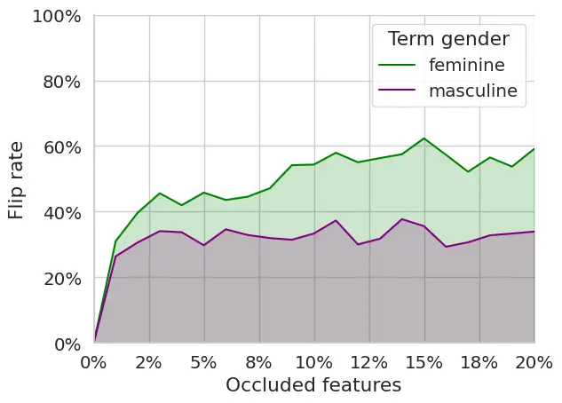

(a) en-es

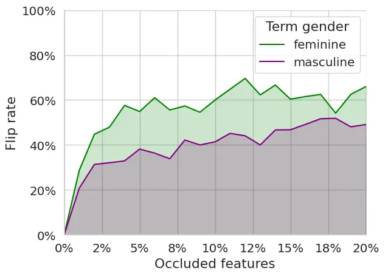

(b) en-fr

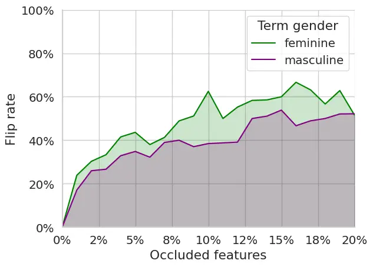

(c) en-it

Figure 9: Flip rate for the first 20% deletion steps for explanations
with the relative scorer for the Conformer models on different language
pairs.

### E.3 Results on Large-scale Model

To further confirm the robustness of our findings, we investigate
whether they also hold for larger-scale models trained on different data
from only MuST-C. To this aim, we train a model composed of a 12-layer
Conformer encoder and 6-layer Transformer decoder. Besides MuST-C, the
training data includes EuroParl-ST (Iranzo-Sánchez et al., 2020), CoVoST
v2 (Wang et al., 2020b), and the ASR datasets CommonVoice (Ardila
et al., 2020), LibriSpeech (Panayotov et al., 2015), TEDLIUM v3
(Hernandez et al., 2018), and VoxPopuli (Wang et al., 2021), whose
transcripts we automatically translate into Spanish using the NeMo MT
models.⁷⁷ 7 Publicly available at:
[https://docs.nvidia.com/deeplearning/nemo/user-guide/docs/en/main/nlp/machine_translation/machine_translation.html](https://docs.nvidia.com/deeplearning/nemo/user-guide/docs/en/main/nlp/machine_translation/machine_translation.html).
The model is trained with a composite loss function that comprises a
label-smoothed cross entropy on the decoder output, with the translation
as target, and two auxiliary CTC losses, respectively, on the encoder
output, with the translation as target and, on the 8th encoder layer,
with the transcript as target (Yan et al., 2023). The training is
performed using the Noam scheduler with 2e-3 as peak learning rate and
is stopped after 200,000 updates. Utterance-level Cepstral Mean and
Variance Normalization (CMVN) and SpecAugment Park et al. (2019) are
applied during training and segments longer than 30 seconds are filtered
out (fairseq-ST default) to avoid excessive VRAM requirements. The model
is the average of the last 7 checkpoints obtained from the training and
has 133M parameters. The training is run on 4 NVIDIA Ampere GPU A100
(64GB VRAM) with mini-batches of 40,000 input elements and 2 as update
frequency.

This large-scale model exhibits similar patterns to the smaller
Conformer models. As shown in Figures 10 and 11, the relative scorer
maintains higher coverage than the difference scorer. The flip rate
displays a reduced asymmetry between feminine and masculine predictions,
with the first reaching around 50% after 10% feature deletion, and the
second, a little over 40%. This behavior is aligned with that of the
monolignual small Conformer models.

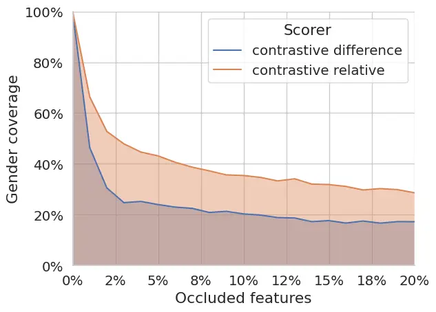

Figure 10: Coverage for the first 20% deletion steps for explanations
with the difference and relative scorers for the large-scale Conformer
model on English-Spanish.

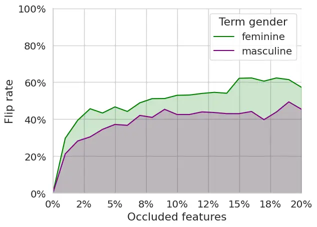

Figure 11: Flip rate for the first 20% deletion steps for explanations
with the relative scorer for the large-scale Conformer models on
English-Spanish.

## Appendix F Comparison of Subword-to-Word Probability Aggregation Techniques

| Method Comparison             | en-fr             | en-es             | en-it             |
| ----------------------------- | ----------------- | ----------------- | ----------------- |
| Word Boundary vs. Length Norm | $`<`$ 0.001\*\*\* | 0.218             | $`<`$ 0.001\*\*\* |
| Word Boundary vs. Chain Rule  | 0.376             | $`<`$ 0.001\*\*\* | $`<`$ 0.001\*\*\* |
| Length Norm vs. Chain Rule    | $`<`$ 0.001\*\*\* | $`<`$ 0.01\*\*    | $`<`$ 0.001\*\*\* |

\*\*\* p $`<`$ 0.001, \*\* p $`<`$ 0.01

Table 2: Statistical significance (p-values) of pairwise method
comparisons for coverage performance across language pairs.

| Method Comparison             | en-fr             | en-es | en-it |
| ----------------------------- | ----------------- | ----- | ----- |
| Word Boundary vs. Length Norm | $`<`$ 0.001\*\*\* | 0.196 | 0.129 |
| Word Boundary vs. Chain Rule  | 0.605             | 0.998 | 0.657 |
| Length Norm vs. Chain Rule    | $`<`$ 0.001\*\*\* | 0.110 | 0.074 |

\*\*\* p $`<`$ 0.001

Table 3: Statistical significance (p-values) of pairwise method
comparisons for flip rate performance across language pairs.

This section presents an empirical comparison, for our XAI application,
of different methods for computing word-level probabilities from the
sequences of subword token probabilities output by ST models. Previous
work has employed various approaches to address this issue. Some studies
have avoided the problem entirely by limiting their analysis to targets
and foils tokenized as single tokens Yin and Neubig (2022). Others have
worked at the subword level without aggregation Ferrando et al. (2022),
or employed the chain rule to multiply individual token probabilities
Sarti et al. (2023). Here, we leverage our evaluation metrics for
explanation faithfulness—coverage and flip rate—to compare three methods
and determine if any of them yields more reliable contrastive
explanations when integrated into our methodology.

The Chain Rule method simply multiplies the probabilities of all subword
tokens that compose a word, applying the standard chain rule of
probability:

```math
p(w)=\prod_{i=0}^{n-1}p(w_{i}) \tag{4}
```

This approach is commonly used for aggregating subword probabilities,
and serves as the default method in Sarti et al. (2023). While
straightforward, this method does not account for the varying number of
tokens across different words, potentially biasing toward shorter token
sequences.

The Length Normalization method addresses this limitation by taking the
n^(th) root of the product of token probabilities, where n is the number
of tokens:

```math
p(w)=\sqrt[n]{\prod_{i=0}^{n-1}p(w_{i})} \tag{5}
```

In the log domain, this corresponds to computing the average log
probability over the sequence of subwords, effectively normalizing by
the sequence length. This normalization, which is typically used in beam
search, attempts to create a fairer comparison between words of
different lengths Meister et al. (2020).

The Word Boundary method, proposed by Pimentel and Meister (2024),
considers not only the probability of the subword sequence itself but
also the probability that this sequence forms a complete word rather
than being part of a longer word. This is calculated using:

```math
p(w)=\prod_{i=0}^{n-1}p(w_{i})\cdot\frac{p(S^{bow}_{n+1})}{p(S^{bow}_{0})} \tag{6}
```

where $`S^{bow}_{i}`$ is the set of beginning-of-word tokens at step
$`i`$. This approach ensures that the subwords $`w_{0,...,n}\in w`$ are
followed by a new word boundary, preventing probability overestimation
for words that are prefixes of longer terms.

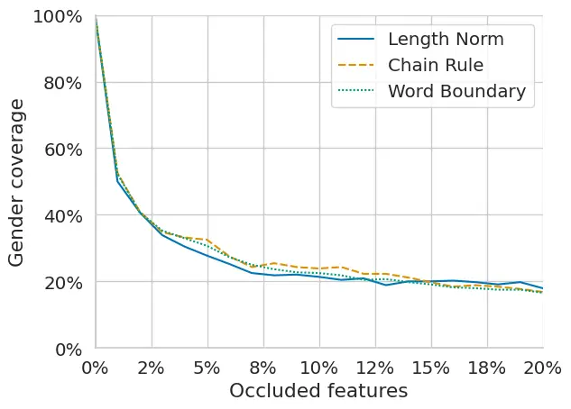

(a) en-es

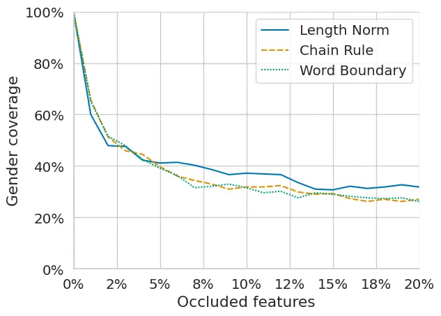

(b) en-fr

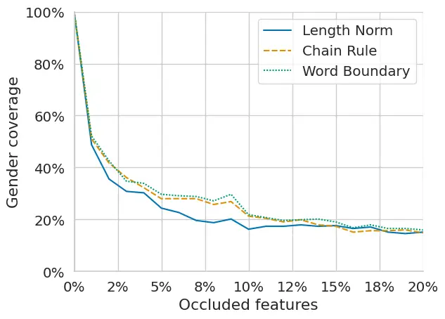

(c) en-it

Figure 12: Coverage for the first 20% deletion steps for explanations
obtained with different word probability computation methods, the
Transformer model, and different language pairs.

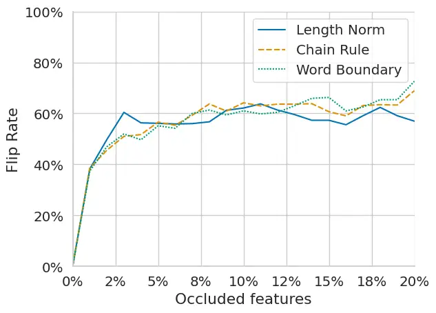

(a) en-es

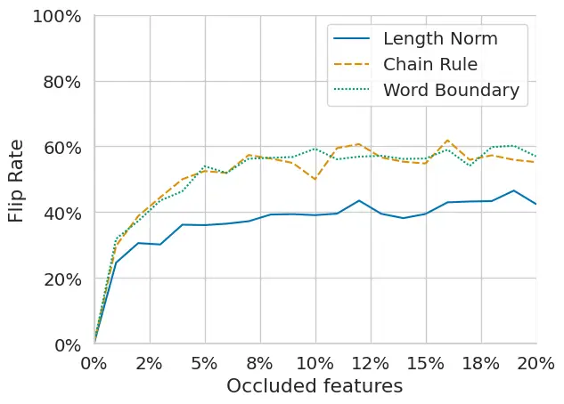

(b) en-fr

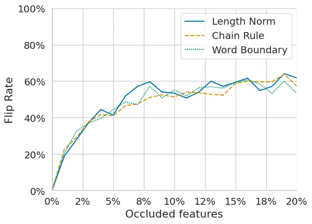

(c) en-it

Figure 13: Flip rate for the first 20% deletion steps for explanations
obtained with different word probability computation methods, the
Transformer model, and different language pairs.

|            | Mult. Transformer |       |       | Mono. Conformer |       | Large-scale Conformer |
| ---------- | ----------------- | ----- | ----- | --------------- | ----- | --------------------- |
|            | en-it             | en-fr | en-es | en-it           | en-fr | en-es                 |
| Difference | 0.94              | 0.93  | 0.92  | 0.88            | 0.86  | 0.89                  |
| Relative   | 0.36              | 0.33  | 0.39  | 0.29            | 0.32  | 0.43                  |

Table 4: Pearson correlation between non-contrastive explanations and
contrastive explanations obtained with the difference and relative
scorer for different models and language pairs.

To evaluate the performance of each method, we recorded coverage and
flip rate measurements at progressive deletion steps, as shown in
Figures 12 and 13. To quantitatively assess differences between methods,
we conducted paired t-tests comparing coverage and flip rate values.
Each pair of methods was evaluated using the sequence of measurements at
corresponding deletion percentages as dependent samples, allowing us to
determine whether observed differences were statistically significant.
Tables 2 and 3 present the resulting p-values for each comparison across
language pairs.

These comparisons reveal that all three methods perform similarly in
their ability to identify gender-relevant features. While coverage
differences are often statistically significant (Table 2), the absolute
differences are relatively small as can be seen in Figure 12, with all
methods maintaining sufficient coverage levels to ensure reliable flip
rate calculations. The flip rate analysis—our primary metric for
evaluating how precisely methods isolate features responsible for gender
prediction—shows no statistically significant differences ($`p>0.05`$)
between Word Boundary and Chain Rule methods across all language pairs
(Table 3). As we see in Figure 13, when over 10% of the highlighted
features are occluded, all methods achieve comparable flip rates between
50-60% for most language pairs. The only notable exception is the Length
Normalization method, which performs significantly worse for French in
terms of flip rate (Table 3, $`p<0.001`$). While the reasons for this
language-specific underperformance warrant further investigation, the
observation supports our decision to exclude the Length Normalization
method from our main experiments.

Since the Chain Rule and Word Boundary methods yield comparable
performance, we looked at individual examples in which the ranking of
the target and foil is different with the two methods to deepen our
comparison. Namely, we found a few examples in which the Chain Rule
method assigns a higher probability to the foil than to the target, even
though the beam search selects the target word in the end. For instance,
in the sentence “In one, I was the classic Asian student, relentless in
the demands that I made on myself”, translated into Italian as “In uno,
ero la classica studentessa asiatica, incantata nelle richieste di me
stessa”, the feminine form studentessa—tokenized as \_studente ssa—has a
joint probability of 0.899, while the masculine form \_studente scores
0.908. However, when applying the Word Boundary method, the unchosen
masculine form receives a much lower probability (0.004), reflecting a
more accurate estimate. This method’s principled treatment of complete
words versus prefixes makes it especially suited for analyzing gendered
terms, where precise probability computation is critical. However, the
number of cases in which this happens is fairly limited (less than 10),
which explains why there are no significant differences between the
scores of the two methods when aggregating over the whole dataset.
Nonetheless, this example demonstrates that in the few cases in which
they differ, the Word Boundary method provides the most correct
probability estimation.

## Appendix G Correlation Between Contrastive and Non-Contrastive Explanations

The patterns regarding similarity between contrastive and
non-contrastive explanations observed for the Transformer model on
English-French translations extend consistently across all models and
language pairs. Table 4 shows the Pearson correlation coefficients
between non-contrastive explanations and contrastive explanations
generated using the difference and relative scorers, respectively. The
difference scorer produces explanations that strongly correlate with
non-contrastive ones (correlation coefficients between 0.86 and 0.94),
while the relative scorer generates distinctly different explanations
(correlation coefficients between 0.29 and 0.43). These results
reinforce our findings from Section 4 regarding the relative scorer’s
superior ability to generate truly contrastive explanations.
