# Towards Unsupervised Speech Recognition at the Syllable-Level

Liming Wang Affiliation: Massachusetts Institute of Technology
Email: [limingw@csail.mit.edu](mailto:)    Junrui Ni ^(†)^(†)thanks:
Work done at UIUC, now at Amazon Affiliation: University of Illinois
Urbana-Champaign    Kai-Wei Chang Affiliation: Massachusetts Institute
of Technology    Saurabhchand Bhati Affiliation: Massachusetts Institute
of Technology    David Harwath Affiliation: University of Texas at
Austin    Mark Hasegawa-Johnson Affiliation: University of Illinois
Urbana-Champaign    James R. Glass Affiliation: Massachusetts Institute
of Technology

###### Abstract

Training speech recognizers with unpaired speech and text – known as
unsupervised speech recognition (UASR) – is a crucial step toward
extending ASR to low-resource languages in the long-tail distribution
and enabling multimodal learning from non-parallel data. However,
existing approaches based on phones often rely on costly resources such
as grapheme-to-phoneme converters (G2Ps) and struggle to generalize to
languages with ambiguous phoneme boundaries due to training instability.
In this paper, we address both challenges by introducing a
syllable-level UASR framework based on masked language modeling, which
avoids the need for G2P and the instability of GAN-based methods. Our
approach achieves up to a 40% relative reduction in character error rate
(CER) on LibriSpeech and generalizes effectively to Mandarin, a language
that has remained particularly difficult for prior methods. Code will be
released upon acceptance.

|     |
| --- |
|     |

## 1 Introduction

Recent advances in self-supervised learning (Baevski et al., 2020; Hsu
et al., 2021a; Chen et al., 2022; Chung et al., 2021; Chen et al., 2024;
Mohamed et al., 2022) and spoken language modeling (Arora et al., 2025;
Chu et al., 2024; Défossez et al., 2024) have enabled voice assistants
with increasingly human-like listening and speaking abilities. However,
they are far from _language-universal_: most systems support only a
handful of languages in the world (Chen et al., 2024; Conneau et al.,
2021), due to a lack of large-scale paired speech and text training
corpora.

A promising step toward language-universal assistants is to build speech
recognizers from _unpaired_ speech and text, or _unsupervised speech
recognition_ (UASR) (Glass, 2012; Baevski et al., 2021; Liu et al.,
2023; Tseng et al., 2024). UASR is a fundamental challenge: success
would enable downstream tasks such as speech synthesis (Ni et al., 2022;
Liu et al., 2022), translation (Wang et al., 2023a), and
understanding (Shi et al., 2023), paving the way for general-purpose
voice assistants. It is also a central case of *unpaired multimodal
learning* (Artetxe et al., 2018b; Artetxe et al., 2018a; Artetxe et al.,
2019; Lample et al., 2018a; Lample et al., 2018b; Ma et al., 2019;
Hoshen & Wolf, 2018), where modalities need to be aligned without
parallel data. In the absence of sentence-level alignment, the model
must infer higher-level linguistic units–phones, syllables, and
words–from raw speech waveforms in conjunction with global text
statistics. Thus, UASR provides broader insights into representation
learning and multimodal alignment without supervision.

The best existing UASR systems (Baevski et al., 2021; Liu et al., 2023;
Tseng et al., 2024) operate at the _phoneme-level_. To this end, they
need to convert raw text units, or _graphemes_, to phonemes, or minimal
sound units that encode meaning, using a grapheme-to-phoneme convertor
(G2P). However, training G2Ps requires resources such as pronunciation
dictionaries, which can be time-consuming and labor-intensive to create.
Without a G2P, such systems suffer from significant performance
degradation due to misalignment between speech and raw text in many
languages Liu et al. (2023); Ni et al. (2022). Even when pronunciation
dictionaries are available, the system may fail to detect clear
phone-level boundaries due to strong co-articulation effects for
languages such as Mandarin.

An alternative approach to phone-based models is to build a word-level
UASR system, which can be achieved without a G2P. Yet a major concern is
the coverage of the system on _rare words_, which can effectively be
infinite in vocabulary size, making it significantly harder to acquire
than phones. Furthermore, detecting word boundaries requires capturing
long-range contextual dependencies in speech, which risk destabilizing
segmentation mechanisms effective for phone-level UASR Wang et al.
(2023c).

In this work, we propose a third alternative – to build UASR at the
_syllable-level_, which can be justified on three grounds. First, unlike
words, the number of distinct syllables for a language is finite, which
reduces the long-tail token distribution issue and allows for better
generalization to unseen words; second, many languages exhibit the best
alignment between speech and text at the syllable level instead of the
phone or word level. For instance, Mandarin uses characters, which have
strong correspondences to spoken syllables; therefore, we expect that a
syllable-level UASR system could be more appropriate for UASR than a
phoneme-based system, which we also found to be the case empirically.

Last but not least, recent advancement in syllable boundary detection
and unit discovery (Baade et al., 2025; Cho et al., 2025) has made it
possible to segment raw speech into syllable-like units without any
textual supervision, and is often more reliable than unsupervised
segmentation methods at the word-level, while capturing most of the
word-level semantics Peng & Harwath (2022); Fuchs & Hoshen (2023).

In this paper, we make the following contributions.

1.  1.  This paper introduces SylCipher, to our knowledge, the first
        syllable-based UASR system. SylCipher jointly predicts syllable
        boundaries and embedding tokens from raw speech using a unified
        self-supervised objective. The learning mechanism avoids adversarial
        training, making it more stable and less sensitive to
        hyperparameters.
2.  2.  We provide an information-theoretic analysis on the proposed UASR
        system proving that our training objective achieves perfect
        distribution matching and zero-error UASR under regularity
        conditions.
3.  3.  We conduct extensive experiments across domains and languages. On
        LibriSpeech, SylCipher achieves up to 40% relative character error
        rate (CER) reduction over prior G2P-free UASR methods. On
        SpokenCOCO, improvements are even larger, demonstrating robustness
        across domains. On Mandarin, SylCipher achieves 12.2% phone error
        rate (PER), outperforming GAN-based UASR methods that fail to even
        converge.
4.  4.  We perform careful ablation and error analysis, examining the
        effects of token vocabulary size, syllabifier choice, and
        segmentation mechanisms.

Paper organizations. Section 2 reviews related work. Section 3
formalizes the syllable-level UASR problem. Section 4 presents SylCipher
and its theoretical guarantees. Section 5 reports experiments and
ablations. Section 6 concludes with limitations and future work.

## 2 Related work

#### Unsupervised speech recognition

Early work on UASR assumed the existence of a reliable G2P and formulate
the problem as an adversarial game, where a conditional generator
predicts a phoneme sequence given a speech waveform, and a discriminator
tries to tell real phonemized text apart from the generator’s
output (Wang et al., 2023b). Within this framework, several works have
explored different segmentation mechanisms such as fixed unsupervised
phoneme segmentation (Liu et al., 2018), iterative forced
alignment (Chen et al., 2019), de-duplication Baevski et al. (2021) and
reinforcement learning (Tseng et al., 2024). (Wang et al., 2023c)
proposed an alternative formulation of UASR as an explicit distribution
matching problem, by matching the lower-order $`N`$-gram distributions
of the generated and real texts. Later work further extended this
reformulation to use G2P-free tokens such as words (Wang et al., 2023c;
Ni et al., 2025), more expressive architecture such as transformers (Ni
et al., 2025) and more general text distribution such as masked
prediction probabilities (Ni et al., 2025). We adapt this word-level
UASR approach to the syllable-level, and supplement it with a simplified
training flow, a more stable differentiable boundary detector and
additional learning objectives.

#### Syllable-level self-supervised learning

Early work on syllable-level modeling of speech used signal processing
techniques (Zhang & Glass, 2009). To discover higher-level structure and
more efficient self-supervised learning (SSL) representations from raw
speech, (Peng et al., 2023; Cho et al., 2024) proposed to induce
syllabic structure from existing SSL models such as HuBERT (Hsu et al.,
2021a). To this end, (Peng et al., 2023) probed the self-attention
layers of VG-HuBERT (Peng & Harwath, 2022), a visually grounded SSL
model to detect syllable-like feature clusters and further refine such
clusters using a min-cut algorithm Shi & Malik (1997). To sidestep the
need for visual data, (Cho et al., 2024) employed a speech-only SSL
model trained with utterance-level self-distillation from a HuBERT
teacher. Due to the indirect manner of such approaches by which syllabic
structures are derived, they are often noisy and unreliable. To cope
with this issue, recent works (Baade et al., 2025; Cho et al., 2025)
proposed a more direct and targeted approach by performing
self-distillation at the syllable-level, which significantly improved
syllable boundary detection and unit discovery performance by
encouraging sharper contrast between within and between-syllable feature
frames.

## 3 Syllable-level unsupervised speech recognition

In this section, we formulate syllable-level UASR as follows. Let
$`X=[X_{1},\cdots,X_{T}]\in{\mathcal{X}}^{T}`$ be a padded sequence of
speech feature vectors and let
$`Y=[Y_{1},\cdots,Y_{L}]\in{\mathcal{Y}}^{L}`$ a padded sequence of text
tokens in the same language. Since a tokenized speech utterance
typically uses more tokens than the text transcription of the same
utterance, we assume the $`T\geq L`$. Assume $`X`$ and $`Y`$ come from
two _unpaired_ datasets and are therefore _statistically independent_.
Further, suppose they are _matched_, i.e., there exists an ASR function
$`y^{*}:{\mathcal{X}}\mapsto{\mathcal{Y}}`$ such that the distributions
of $`X`$ and $`Y`$, $`p_{X}`$ and $`p_{Y}`$ satisfy

```math
\displaystyle p_{Y}(y)=\int_{x\in{\mathcal{X}}:y^{*}(x)=y}p_{X}(x)\mathrm{d}x,\,\forall y\in{\mathcal{Y}}^{L}, \tag{1}
```

The goal of UASR is to recover $`y^{*}`$ given only unpaired $`X`$ and
$`Y`$. The syllable-level case is a special setting where the tokens of
$`Y`$ are syllables. The learning problem resembles _decipherment_,
where one decodes a message in an unknown script without a lexicon or
grammar. In practice, $`X`$ is formed from frame-level SSL features Hsu
et al. (2021a), and $`p_{X}`$ and $`p_{Y}`$ are only approximately
matched due to finite-sample noise and domain mismatch. As shown in
(Wang et al., 2023b), UASR is ill-posed in general, but the mapping
$`y^{*}`$ in equation 1 becomes identifiable if syllable boundaries are
known and the language satisfies mild conditions.

## 4 SylCipher: Syllable-level UASR via information-constrained masked language modeling

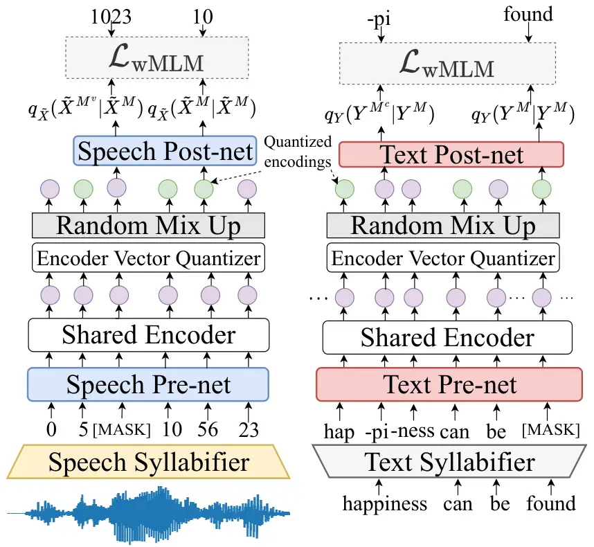

(a) MLM-based stages

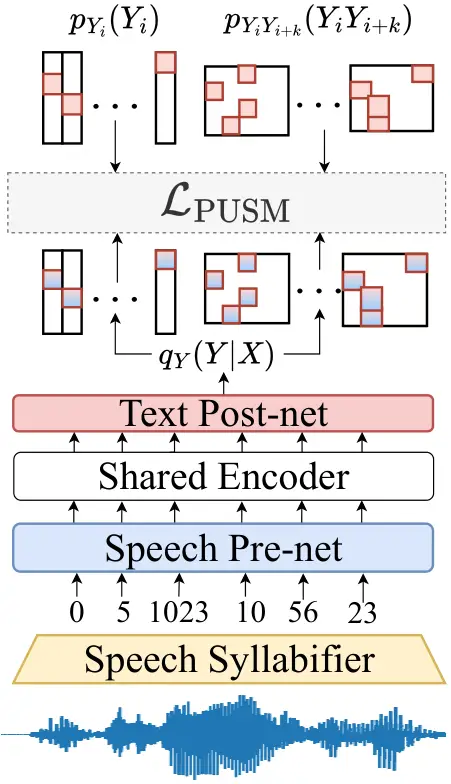

(b) PUSM stage

Figure 1: Overall architecture of SylCipher. Gray boxes are fixed during
training. (a) MLM-based stages: learn a compressed joint semantic space
with a shared encoder and random mix-up. (b) PUSM stage: align speech
and text spaces by matching lower-order marginals of their
distributions.

In this section, we describe SylCipher, our proposed model for
syllable-level UASR. We first present its architecture and training
objective, then justify the design theoretically, and finally introduce
several practical modifications for training and inference.

### 4.1 Training: UASR via information compression

As shown in Figure 1, SylCipher is an encoder-only language model with a
_shared encoder_ for speech and text modalities. To project both
modalities into a joint embedding space, we use two uni-modal
_pre-nets_:
$`e_{\tilde{X}}:{\mathcal{X}}^{T}\mapsto{\mathbb{R}}^{L\times d}`$ for
speech and $`e_{Y}:{\mathcal{Y}}^{L}\mapsto{\mathbb{R}}^{L\times d}`$
for text, each implemented as a linear embedding layer. Before the
speech pre-net, a _speech syllabifier_ converts the frame-level feature
vectors into a syllable-level sequence. It consists of: (i) a
_differentiable soft-pooler_
$`m:{\mathcal{X}}^{T}\mapsto{\mathcal{X}}^{L}`$ that aligns speech with
text on the syllable level (ii) a tokenizer
$`c:{\mathcal{X}}^{L}\mapsto\tilde{{\mathcal{X}}}^{L}`$ to discretizes
speech into syllable-like units. Thus the speech pre-net is

```math
\displaystyle e_{\tilde{X}}(\tilde{X})=e_{\tilde{X}}\circ c\circ m(X), \tag{2}
```

where $`f\circ g(x):=f(g(x))`$ for any functions $`f,g`$, and
$`\tilde{X}:=c\circ m(X)\in\tilde{{\mathcal{X}}}^{L}.`$ The soft-pooler
first estimates the boundary probabilities $`b(X)\in[0,1]^{T}`$ by
learning from an unsupervised syllable detector Sylber (Cho et al.,
2025), then constructs a pooling mask $`a(X)\in[0,1]^{L\times T}`$, as
illustrated in Figure 2:

```math
\displaystyle\tilde{a}_{it}(X):=\sigma_{\epsilon}\left(i-\sum_{\tau\leq t}b_{\tau}(X)\right), \displaystyle a_{it}(X)=\frac{\tilde{a}_{it}(X)}{\sum_{\tau=1}^{T}\tilde{a}_{i\tau}(X)},\quad m_{i}(X):=\sum_{t=1}^{T}a_{it}(X)X_{t}, \tag{3}
```

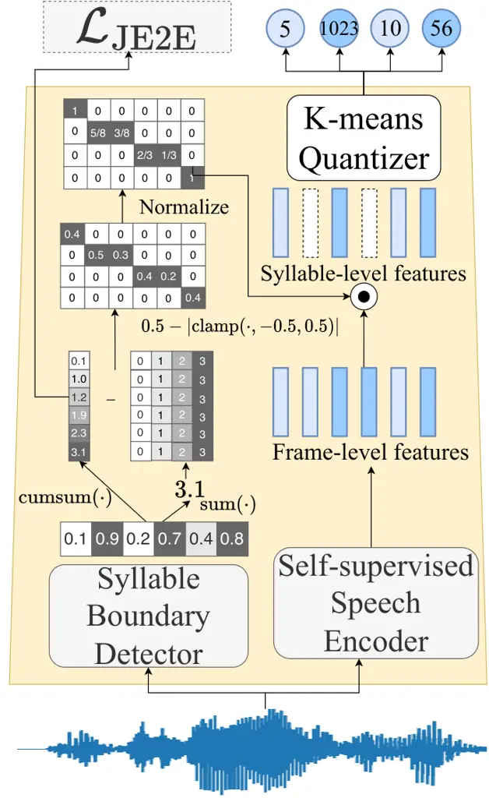

Figure 2: Speech syllabifier

where
$`\sigma_{\epsilon}(x):=\epsilon-|\mathrm{clamp}(x,-\epsilon,\epsilon)|`$
and $`\mathrm{clamp}(x,a,b)=x`$ for $`x\in[a,b]`$, $`a`$ if $`x<a`$ and
$`b`$ otherwise. The hyperparameter $`\epsilon`$ controls the _tapering
speed_ of pooling weights outside each syllabic segment. This creates
sparse pooling weights that avoid overflow/underflow issues common in
earlier soft-pooling methods with
$`\sigma_{\epsilon}(x)=\tanh(x/\epsilon)`$ (Bhati et al., 2022) and
$`\sigma_{\epsilon}(x)=\exp(x/\epsilon)`$ (Wang et al., 2024). To
contextualize embeddings, both modalities are processed by a shared
encoder $`f:{\mathbb{R}}^{T\times d}\mapsto{\mathbb{R}}^{T\times d}`$:

```math
\displaystyle f_{\tilde{X}}(\tilde{X}):=f\circ e_{\tilde{X}}(\tilde{X}),\quad f_{Y}(Y):=f\circ e_{Y}(Y). \tag{4}
```

In practice, a differentiable K-means vector quantizer (Ni et al., 2025)
is used for the tokenizer $`c`$ and a multi-layer transformer (Vaswani
et al., 2017) is used for the shared encoder.

#### Distribution matching.

Without paired speech-text data, we approximate each unimodal
distribution $`p_{\tilde{X}}`$ and $`p_{Y}`$. Let
$`g_{\tilde{X}},\,g_{Y}:{\mathbb{R}}^{d\times L}\mapsto[0,1]`$ be speech
and text _post-nets_ such that

```math
\displaystyle q_{Z}(Z) \displaystyle:=g_{Z}\circ f_{Z}(Z):=\prod_{i=1}^{L}g_{Z,i}(Z_{i}|f_{Z}(Z^{\{1,\cdots,i-1\}}))=\prod_{i=1}^{L}\frac{e^{W^{Z}_{iZ_{i}}f_{Z}(Z^{\{1,\cdots,i-1\}})}}{\sum_{z}e^{W^{Z}_{iz}f_{Z}(Z^{\{1,\cdots,i-1\})}}}, \tag{5}
```

where $`Z=\tilde{X}`$ or $`Y`$ with equal probabilities is a _mixture
random sequence_, and $`Z^{M}_{i}:=Z_{i},\,i\in M`$ and \[MASK\]
otherwise for some index set $`M`$, and
$`W^{Z}_{i}\in{\mathbb{R}}^{{\mathcal{Z}}\times dL}.`$

Training minimizes _Kullback–Leibler (KL) divergence_ to unimodal
distributions:

```math
\displaystyle\min_{q_{\tilde{X}},q_{Y}}D_{\mathrm{KL}}(p_{\tilde{X}}||q_{\tilde{X}})+D_{\mathrm{KL}}(p_{Y}||q_{Y})=D_{\mathrm{KL}}(p_{\tilde{X}}||g_{\tilde{X}}\circ f_{\tilde{X}})+D_{\mathrm{KL}}(p_{Y}||g_{Y}\circ f_{Y}). \tag{6}
```

To prevent speech and text from occupying disjoint embedding regions, we
further constrain the shared encoder _entropy_. Let $`H(X)`$ denotes the
entropy of discrete random variable $`X`$, consider

```math
\displaystyle\min_{f_{\tilde{X}},g_{\tilde{X}},f_{Y},g_{Y}}D_{\mathrm{KL}}(p_{\tilde{X}}||g_{\tilde{X}}\circ f_{\tilde{X}})+D_{\mathrm{KL}}(p_{Y}||g_{Y}\circ f_{Y})\quad\text{s.t.}\quad H(f_{Z}(Z))\leq H(Y), \tag{7}
```

#### Theoretical guarantee.

We prove that under regularity conditions, equation 7 matches true and
generated text distributions in the same way as GANs, but without
unstable straight-through gradients. Thus zero-error UASR is achievable
under conditions in (Wang et al., 2023b).

###### Theorem 1.

Suppose $`(f_{\tilde{X}}^{*},g_{\tilde{X}}^{*},f_{Y}^{*},g_{Y}^{*})`$
minimize equation 7, then under certain assumptions (See Appendix B),
$`f_{{\tilde{X}}}^{*}`$ and $`f_{Y}^{*}`$ are invertible and
$`q_{Y|X}^{*}(y|x):=\mathbbm{1}[f_{Y}^{*-1}\circ f_{\tilde{X}}^{*}\circ c\circ m(x)=y]`$
satisfies

```math
D_{\mathrm{KL}}(p_{Y}||\mathbb{E}_{X}[q_{Y|X}^{*}])=0,\quad y^{*}(x)=\argmax_{y\in{\mathcal{Y}}^{L}}q^{*}_{Y|X}(y|x),\quad\forall x\in{\mathcal{X}}^{T}.
```

#### Practical training.

In practice, SylCipher implements unimodal masked language modeling
(MLM) to approximate unimodal probability distributions. Given a mask
distribution $`p_{M}`$, we minimize the weighted loss:

```math
\displaystyle\mathcal{L}_{\mathrm{wMLM}}(\theta_{X},\theta_{Y}):=-\mathbb{E}_{Z\sim\frac{1}{2}p_{\tilde{X}}+\frac{1}{2}p_{Y},\,M\sim p_{M}}\left[\ln q_{Z}(Z^{M}|Z^{M^{c}})+\lambda\ln q_{Z}(Z^{M}|Z^{M})\right], \tag{8}
```

where $`\theta_{X}`$ and $`\theta_{Y}`$ are speech-related and
text-related parameters. Notice that $`g_{Y}`$ serves a dual role: it
acts both as the text post-net for unimodal MLM and as a _cross-modal
decoder_, defined as (similar for $`q_{X}`$)
$`q_{Y}(Y^{M}|Z^{M}):=\prod_{i\in M}g_{Y,i}(Y_{i}|f_{Z}(Z_{i})).`$ The
additional term weighted by $`\lambda`$ balances these two functions,
enabling $`g_{Y}`$ (or $`g_{X}`$) to reconstruct text (or speech) tokens
from either masked text or speech inputs. To further constrain the
entropy of the encoding outputs $`f_{Z}(Z)`$, we limit the transformer
depth to two layers and apply *random mix-up* (Ao et al., 2022). During
training, a random subset of encoder representations is quantized to a
finite set of code vectors before passed to the post-nets. This
restricts the variability of $`f_{Z}(Z)`$ without significantly reducing
its predictive capacity for masked tokens.

After pretraining with unsupervised syllable boundary labels
$`[\hat{b}_{1}(X),\cdots,\hat{b}_{T}(X)]`$, we perform _joint
end-to-end_ (JE2E) training. In this stage, the soft-pooler is trained
jointly with the rest of the model, guided by an additional soft
constraint on the predicted _syllable counts_:

```math
\displaystyle\mathcal{L}_{\mathrm{JE2E}}(\theta_{X}):=\mathbb{E}_{X}\left|\sum_{t=1}^{T}b_{t}(X)-\hat{b}_{t}(X)\right|, \tag{9}
```

which discourages both over- and under-segmentation.

While the MLM objective encourages _implicit_ distribution matching, we
found that _explicit_ distribution matching further improves a saturated
MLM system. To this end, we adopt positional unigram and skipgram
matching (PUSM) (Wang et al., 2024; Ni et al., 2025):

```math
\displaystyle\mathcal{L}_{\mathrm{PUSM}}(\theta_{X},\theta_{Y})=\|\mathbb{E}_{X}\left[q_{Y_{i}}(X)\right]-p_{Y_{i}}]\|_{1}+\sum_{k=1}^{K}\left\|\mathbb{E}_{X}\left[q_{Y_{i}Y_{i+k}}(X)\right]-p_{Y_{i}Y_{i+k}}\right\|_{1}, \tag{10}
```

where $`q_{Y}(x):=q_{Y}(\cdot|c\circ m(x))`$ and $`K`$ is the maximal
skip length. The first term matches unigram distributions at each
position, while the second aligns skipgram distributions. To stabilize
training, we disable random mix-up and approximate the empirical
probability distributions using the entire dataset as a single batch,
reducing memory cost via gradient accumulation (Ni et al., 2025). The
overall SylCipher objective combines all stages:

```math
\displaystyle\mathcal{L}_{\mathrm{SylCipher}}:=\lambda_{\mathrm{wMLM}}\mathcal{L}_{\mathrm{wMLM}}+\lambda_{\mathrm{JE2E}}\mathcal{L}_{\mathrm{JE2E}}+\lambda_{\mathrm{PUSM}}\mathcal{L}_{\mathrm{PUSM}}. \tag{11}
```

Because the PUSM stage requires different batch sizes, we adopt an
_iterative training schedule_ rather than fully end-to-end optimization.
Specifically:

1.  1.  Fixed boundary stage: freeze the boundary detector $`b`$ and set
        $`\lambda_{\mathrm{JE2E}}=\lambda_{\mathrm{PUSM}}=0`$;
2.  2.  JE2E stage: enable $`\lambda_{\mathrm{JE2E}}>0`$ to refine
        segmentation;
3.  3.  PUSM stage: disable $`\lambda_{\mathrm{wMLM}}`$, enable
        $`\lambda_{\mathrm{PUSM}}>0`$ for explicit distribution matching.

### 4.2 inference

During inference, the ASR system cascades the speech syllabifier, speech
pre-net and the text post-net as done in the PUSM stage:

```math
\displaystyle y(X):=\argmax_{y\in{\mathcal{Y}}^{L}}q_{Y}(y|X). \tag{12}
```

We observed that using the _first_ transformer layer of the shared
encoder, instead of the last, improves performance, consistent with
findings at the word-level (Ni et al., 2025). This may be due to
over-contextualization in later layers. Finally, replacing each \<OOV\>
token with the second most likely prediction reduces CER by about
$`1\%`$ compared to simply discarding \<OOV\>s.

## 5 Experiments

Section 5.1 introduces the datasets used for our experiments, followed
by the syllabification steps for speech and text preprocessing in
Section 5.2. Section 5.3 presents the main UASR results, and Section 5.4
discusses SylCipher’s boundary refinement ability. Section 5.5 provides
ablation studies on key design choices. Additional implementation
details of our method and the baselines are given in Appendix D.

### 5.1 Datasets

We evaluate SylCipher on three datasets. First, we train on the 460-hour
clean subset of LibriSpeech (Panayotov et al., 2015a), a standard UASR
benchmark of audiobook recordings. Second, to test domain
generalization, we train another model on SpokenCOCO (Hsu et al.,
2021b), which contains 742 hours of spoken image captions. Third, to
study languages with syllabic structures significantly different from
English, we apply SylCipher to Mandarin using AISHELL-3 (Shi et al.,
2021), which has 85 hours of read speech. We follow the same LibriSpeech
split as in (Ni et al., 2025), and use the standard splits for
SpokenCOCO and AISHELL-3. For LibriSpeech and SpokenCOCO, we consider
both the _matched_ setting, where empirical speech and text probability
distributions can be matched exactly, and the more realistic _unmatched_
setting where they cannot. In the matched case, we use paired
speech-text datasets with pairings removed; in the unmatched case,
LibriSpeech uses LibriLM (Panayotov et al., 2015b) with overlapping text
removed, while SpokenCOCO is randomly split in half, with one half
treated as speech-only and the other half treated as text-only. For
AISHELL-3, we consider only the matched setting and compare models
trained with/without tone labels. For all datasets, we apply a voice
activity detector¹¹ 1 https://github.com/wiseman/py-webrtcvad.git to
improve alignment.

### 5.2 Speech and text syllabification

For English text, we use Pyphen²² 2 https://github.com/Kozea/Pyphen, a
rule-based hyphenation tool re-purposed for syllabification without a
G2P. If Pyphen produces only a single chunk for a long word, we apply a
simple rule-based fallback (Appendix E). We denote this combined
approach as Pyphen+. We also experiment with other G2P-free approaches
such as byte-pair encoding (BPE) Liu et al. (2025); Sennrich et al.
(2016), and find SylCipher robust to syllabification errors. To avoid
long-tail distributions, we keep only the top-2048 most frequent English
syllables and replace the rest with a special \<OOV\> token (replacing
$`7\%`$ of tokens in LibriSpeech and $`2\%`$ in SpokenCOCO. For
Mandarin, we use the Pinyin of each Chinese character as a syllable,
with or without tone labels. We keep the top-1024 most frequent
syllables, covering 99.5% of occurrences. For speech syllabification, we
use K-means clustering on syllable-level speech features created by mean
pooling within the Sylber boundaries, with codebook size equal to the
number of non-\<OOV\> text tokens.

|                                    |             |          |                      |                      |     |
| ---------------------------------- | ----------- | -------- | -------------------- | -------------------- | --- |
| Model                              | Student     | Token    | Matched              | Unmatched            |     |
|                                    |             |          | CER ($`\downarrow`$) | CER ($`\downarrow`$) |     |
| _G2P-based approach_               |             |          |                      |                      |     |
| wav2vec-U\* (Baevski et al., 2021) | None        | Phone    | \-                   | 13.3                 |     |
| wav2vec-U 2.0\* (Liu et al., 2023) | None        | Phone    | \-                   | 12.2                 |     |
| REBORN\* (Tseng et al., 2024)      | None        | Phone    | \-                   | 8.3                  |     |
| _G2P-free approach_                |             |          |                      |                      |     |
| wav2vec-U (Baevski et al., 2021)   | None        | Char.    | 35.6                 | 43.3                 |     |
|                                    | wav2vec 2.0 | Char.    | 33.8                 | 42.1                 |     |
| REBORN (Tseng et al., 2024)        | None        | Char.    | 37.8                 | 76.6                 |     |
| JSTTI (forced align)               | None        | Char     | 81.4                 | 81.1                 |     |
| JSTTI (Ni et al., 2025)            | None        | Word     | 49.5                 | 54.2                 |     |
| PUSM (Sylber) (Wang et al., 2023c) | None        | Syllable | 35.5                 | 57.7                 |     |
|                                    | wav2vec 2.0 | Syllable | 33.0                 | 54.7                 |     |
| SylCipher (Ours, forced align)     | None        | Syllable | 38.5                 | 46.4                 |     |
| SylCipher (Ours, Sylber)           | None        | Syllable | 43.5                 | 48.6                 |     |
| SylCipher (Ours, Sylber+JE2E)      | None        | Syllable | 39.2                 | 46.8                 |     |
| SylCipher (Ours, Sylber+JE2E+PUSM) | None        | Syllable | 21.8                 | 35.9                 |     |
|                                    | wav2vec 2.0 | Syllable | 17.5                 | 33.3                 |     |

(a) UASR results on LibriSpeech (clean subsets)

| Model                              | Student     | Token    | Matched              | Unmatched            |
| ---------------------------------- | ----------- | -------- | -------------------- | -------------------- |
|                                    |             |          | CER ($`\downarrow`$) | CER ($`\downarrow`$) |
| wav2vec-U (Baevski et al., 2021)   | None        | Char.    | 45.0                 | 45.2                 |
|                                    | wav2vec 2.0 | Char.    | 46.3                 | 35.3                 |
| JSTTI                              | None        | Char.    | 78.3                 | 100                  |
| JSTTI (Ni et al., 2025)            | None        | Word     | 64.5                 | 64.5                 |
| PUSM (Sylber) (Wang et al., 2023c) | None        | Syllable | 41.5                 | 41.3                 |
|                                    | wav2vec 2.0 | Syllable | 34.7                 | 34.3                 |
| SylCipher (Ours, Sylber)           | None        | Syllable | 34.9                 | 36.1                 |
| SylCipher (Ours, Sylber+JE2E)      | None        | Syllable | 31.2                 | 32.4                 |
| SylCipher (Ours, Sylber+JE2E+PUSM) | None        | Syllable | 23.4                 | 26.8                 |
|                                    | wav2vec 2.0 | Syllable | 13.9                 | 17.6                 |

(b) UASR results on SpokenCOCO

Table 1: UASR results on LibriSpeech (clean subsets) and SpokenCOCO.
Inside the bracket lists the unsupervised boundary used for each model.
_Student_ stands for the student model used during the self-training
stage using pseudo-labels from each model. For tokens used for the text
data, _Char._ stands for characters and _Syllable_ stands for
syllable-level tokens converted using the Pyphen+ syllabifier without
using a G2P. CER stands for character error rate. \* indicates
evaluation on LibriSpeech dev-clean instead.

| Model                              | Student     | Token       | w/o Tone             | w. Tone              |
| ---------------------------------- | ----------- | ----------- | -------------------- | -------------------- |
|                                    |             |             | PER ($`\downarrow`$) | PER ($`\downarrow`$) |
| wav2vec-U (Baevski et al., 2021)   | None        | Phone       | 74.9                 | 76.2                 |
| JSTTI                              | None        | Init./Final | 96.4                 | 100                  |
| JSTTI (Ni et al., 2025)            | None        | Word        | 83.2                 | 169                  |
| PUSM (Sylber) (Wang et al., 2023c) | None        | Syllable    | 28.4                 | 26.5                 |
|                                    | wav2vec 2.0 | Syllable    | 18.5                 | 14.9                 |
| SylCipher (Ours, forced align)     | None        | Syllable    | 38.1                 | 38.9                 |
| SylCipher (Ours, Sylber)           | None        | Syllable    | 44.6                 | 48.3                 |
| SylCipher (Ours, Sylber+JE2E)      | None        | Syllable    | 41.7                 | 45.1                 |
| SylCipher (Ours, Sylber+JE2E+PUSM) | None        | Syllable    | 26.9                 | 24.9                 |
|                                    | wav2vec 2.0 | Syllable    | 15.3                 | 12.2                 |

Table 2: UASR results on AISHELL-3 test set. Inside the bracket lists
the unsupervised boundary used for each model. “Student” stands for the
student model used during the self-training stage using pseudo-labels
from each model. _Init./Final_ refers to initials and finals in the
Chinese phonetic alphabet. For text data tokens, _Syllable_ refers to
the pinyin representation of each Chinese character, while _Phone_
denotes the individual letters within the pinyin tokens. PER stands for
phone error rate.

### 5.3 Results: UASR

We compare SylCipher with UASR systems that differ in token type,
training objective, and architecture.

Word-level: *JSTTI* (Ni et al., 2025), the state-of-art word-level UASR
system, which is GAN-free and architecturally similar to ours, using
2048 non-\<OOV\> words.

Character-level: *wav2vec-U* (Baevski et al., 2021), a strong GAN-based
system; *REBORN* (Tseng et al., 2024), a state-of-the-art phoneme-based
GAN system; and a _phone-level JSTTI_, trained with phoneme boundaries
and 128 speech clusters (comparable to the number of character types).

Syllable-level: *PUSM* (Wang et al., 2023c), adapted from word-level
UASR to syllables using the same syllable boundary detector and
syllabifier as SylCipher.

We also report results with *self-training* Chen et al. (2019); Baevski
et al. (2021), where a wav2vec 2.0 Baevski et al. (2020) student is
further finetuned by distilling character (grapheme)-level pseudo-labels
from a UASR system. Performance is measured by character error rate
(CER) for English and phone error rate (PER) for Mandarin, as both are
tokenization-independent and easily comparable.

Syllable-level modeling performs best under G2P-free setting. Table 1(a)
summarizes results on LibriSpeech. Among baselines, PUSM performs best
in the matched setting, while wav2vec-U is strongest in the unmatched
setting, though its performance is limited by the lack of G2P. Unlike
phonemized training, REBORN trained directly on raw characters performs
worse than wav2vec-U, suggesting sensitivity to misalignment between
speech and text. By contrast, SylCipher with all three stages
(Sylber+JE2E+PUSM) achieves 21.8% CER (matched) and 35.9% (unmatched),
outperforming all baselines. Compared to the best-in-average system
wav2vec-U (35.6%/43.3%), SylCipher reduces by CER by 40% (matched) and
17% (unmatched) relative. Both syllable-level models (PUSM and
SylCipher) outperform word- or character-level models, confirming that
speech-text alignment is the best at the syllable level. Word-level
JSTTI performs worst due to poor rare-word coverage (\<OOV\>s
$`\approx`$ 17%), and adapting JSTTI to phone-level degrades further,
likely because phone clusters are noisier than syllable or word
clusters.

Iterative training helps. Stage-wise training shows progressive
improvements: JE2E reduces CER modestly, while PUSM yields the largest
gains (44% and 23% relative reductions over JE2E in matched/unmatched
settings). Combining MLM-based stages with PUSM outperforms PUSM-only
training by 33-34% relative, as MLM provides necessary initialization
for PUSM to converge. Indeed, PUSM alone fails when SylCipher is
randomly initialized, likely due to transformer training instability.
Lastly, using unsupervised Sylber boundaries performs nearly as well as
forced alignment, suggesting robustness to segmentation noise.
Self-training consistently improves performance, especially for stronger
models. For SylCipher, CER is further reduced by 20% relative.

Syllables are robust to domain shifts. Table 1(b) reports results on
SpokenCOCO. SylCipher again outperforms all baselines, surpassing PUSM
by 32% and wav2vec-U by 49% relative CER after all stages. The margin is
larger than LibriSpeech, especially in the unmatched setting. Notably,
even after the first training stages, SylCipher already outperforms
wav2vec-U by 22%. While wav2vec-U suffers from domain mismatch at the
character level, both syllable-level methods perform better, suggesting
syllable units are more robust to domain shifts. Self-training further
improves SylCipher by 39% relative CER, likely due to higher syllable
coverage reducing insertion/deletion errors. Moreover, performance
degrades only slightly in the unmatched setting, indicating the sharper
degradation on LibriSpeech stems from domain mismatch between its speech
and text corpora.

Syllable-level UASR works for Mandarin. Table 2 presents results on
Mandarin. Here, syllable-level models converge even without boundary
refinement, while phone- and word-level approaches struggle, confirming
that syllables are the most natural alignment unit for Mandarin.
Compared to the best baseline (PUSM), SylCipher achieves over 5.5%
relative PER reduction before self-training and 17% after.
Interestingly, including tone labels does not harm performance–in fact,
PER improves after the PUSM stage–suggesting that once phoneme labels
are predicted correctly, tone prediction is also reliable.

|                               | F1⁵⁰ ($`\uparrow`$) | F1²⁰ ($`\uparrow`$) | P. ($`\uparrow`$) | Re. ($`\uparrow`$) | R ($`\uparrow`$) |
| ----------------------------- | ------------------- | ------------------- | ----------------- | ------------------ | ---------------- |
| Feat-Sim (Peng et al., 2023)  | 47.3                | 24.7                | 46.6              | 48.0               | 54.4             |
| SDHuBERT (Cho et al., 2024)   | 66.1                | 32.2                | 64.9              | 67.4               | 70.7             |
| SylBoost (Baade et al., 2025) | 73.2                | 44.6                | 72.1              | 74.4               | 76.9             |
| Sylber (Cho et al., 2025)     | 83.4                | 44.1                | 84.8              | 84.1               | 86.4             |
| SylCipher (Ours, Sylber+JE2E) | 86.1                | 50.8                | 86.6              | 86.1               | 88.1             |

(a) Boundary detection results on LibriSpeech

|                               | F1⁵⁰ ($`\uparrow`$) | F1²⁰ ($`\uparrow`$) | P. ($`\uparrow`$) | Re. ($`\uparrow`$) | R ($`\uparrow`$) |
| ----------------------------- | ------------------- | ------------------- | ----------------- | ------------------ | ---------------- |
| Feat-Sim (Peng et al., 2023)  | 60.3                | \-                  | 57.4              | 63.6               | 64.3             |
| SylBoost (Baade et al., 2025) | 55.6                | 30.2                | 48                | 65.2               | 50.8             |
| Sylber (Cho et al., 2025)     | 53.5                | 28.6                | 52.3              | 54.9               | 59.6             |
| SylCipher (Ours, Sylber+JE2E) | 62.3                | 31.0                | 61.1              | 63.6               | 67.4             |

(b) Boundary detection results on SpokenCOCO

Table 3: Syllable boundary detection results on LibriSpeech and
SpokenCOCO. The superscript for F1 scores is tolerance threshold in ms
and the tolerance is 50ms for other metrics. P., Re. and R stand for
precision, recall and R-value respectively. SylCipher is trained under
unmatched settings.

### 5.4 Results: Unsupervised syllable boundary detection

To better understand the JE2E stage, we compare the syllable boundary
detection performance against the teacher model Sylber (Cho et al., 2025) (which provides SylCipher’s initial boundaries) and other
unsupervised approaches including Feat-Sim (Peng et al., 2023),
SDHuBERT (Cho et al., 2024), SylBoost (Baade et al., 2025). On
LibriSpeech, Sylber is the strongest baseline on most metrics, except
for the 20ms F1 score where SylBoost performs best. On SpokenCOCO,
SylBoost outperforms Sylber on three of five metrics. However, our
preliminary analysis show that SylBoost often over-segments, producing
too many syllables and causing cross-modal misalignment and training
instability in SylCipher. In contrast, Sylber predicts syllable counts
closer to ground truth, making it more suitable as an initialization for
UASR. When refined through JE2E, SylCipher improves upon its Sylber
teacher, achieving +14% relative F1 (20ms tolerance) and +3% relative F1
(50ms) on LibriSpeech. On SpokenCOCO, it surpasses Sylber by +15% F1 and
+11% R-value, and outperforms the best baseline Feat-Sim by +3% relative
F1 score and +4.6% R-value. These results suggest that unpaired text
provides additional guidance on syllable boundary detection.
Visualizations of the speech-text alignment predicted by SylCipher can
be found in Appendix G.

| Model                   | Tokenizer | Resource | SER ($`\downarrow`$) |
| ----------------------- | --------- | -------- | -------------------- |
| SylCipher (Sylber)      | Pyphen+   | Medium   | 48.9                 |
| SylCipher (Sylber+JE2E) | Pyphen+   | Medium   | 44.9                 |
| SylCipher (Sylber)      | Syllabify | High     | 51.3                 |
| SylCipher (Sylber)      | BPE+      | Low      | 52.5                 |
| SylCipher (Sylber+JE2E) | BPE+      | Low      | 49.9                 |

(a) Effect of syllabifier type

(b) SER vs. pooler type across datasets

(c) SER vs. token vocabulary size

Figure 3: Ablation studies on the effect of syllabifier type, pooling
type and token vocabulary size on SylCipher UASR performance. (a) The
effect of different pooler named after the type of $`\sigma_{\epsilon}`$
function used in equation 3.(b) The effect of the vocabulary size of
non-\<OOV\>-tokens on SylCipher performance during the fixed-boundary
stage on LibriSpeech (matched). (c) Effect of syllabifiers with
difference resource requirements on SylCipher performance during the
fixed-boundary stage on LibriSpeech (matched).

### 5.5 Ablation studies

We conduct ablation studies on various components and design choices in
SylCipher in Figure 3.

SylCipher is robust to syllabifiers. We first test alternative
syllabifiers beyond Pyphen, including the phoneme-based Syllabify³³ 3
https://github.com/kylebgorman/syllabify and a character-based approach
using byte-pair encoding (BPE) tokenization Sennrich et al. (2016). The
latter is attractive because it is language-agnostic and integrated
easily with spoken language models. For the BPE-based syllabifier, we
train the first stage of SuperBPE Liu et al. (2025) on LibriSpeech with
a 17k vocabulary, roughly matching the number of syllable types. We then
split BPE tokens containing multiple non-consecutive vowels and merge
consecutive tokens to ensure each unit contains at least one vowel
(details in Appendix F). We refer to this method as BPE+. All
syllabifier variants are trained only under the _fixed-boundary stage_,
since later stages show correlated trends. Instead of CER, we report
syllable error rate (SER) to more directly reflects syllable-level
performance. Among the methods, Pyphen+ achieves the lowest SER,
outperforming even the phoneme-based Syllabify. As shown in Figure 3(a),
BPE+ yields weaker but still competitive results, demonstrating that
SylCipher can generalize to linguistically simpler, resource-free
syllabifiers.

Clamp-based soft-pooler trains more stably. In Figure 3(b), we test our
modified soft-pooler in equation 3, which uses a clamp-based
$`\sigma_{\epsilon}`$ function (“Clamp”), against alternatives based on
$`\tanh`$ (Bhati et al., 2022) (“Tanh”) and softmax (Wang et al., 2024))
(“Softmax”). Following prior work, we set the tapering parameter
$`\epsilon=0.5`$ for “Clamp” and $`0.1`$ for the other two approaches.
On both SpokenCOCO and AISHELL-3, Clamp consistently outperforms the
sigmoid-based poolers by 6-36%. This suggests that our design provides
more stable and efficient training dynamics.

SylCipher works with different vocabulary sizes. We also experiment with
varying the non-\<OOV\> vocabulary size in Figure 3(c). SylCipher
displays consistent SERs across a wide range of vocabulary sizes,
reaching the lowest overall SER with 2048 tokens and the lowest
non-\<OOV\> SER with 1024 tokens.

## 6 Conclusion

In this work, we introduced SylCipher, a UASR system that avoids
phoneme-level resources such as G2P by recognizing speech at the
_syllable level_. Under the G2P-free setting, SylCipher outperforms the
best existing systems by 17-40% relative CER on LibriSpeech and shows
generalizability across other domains on SpokenCOCO, narrowing the gap
with G2P-based systems. It also demonstrates cross-lingual robustness:
on Mandarin, a tonal language where phoneme-based methods fail to
converge, SylCipher achieves a PER of 13%. These results suggest that
syllable-level modeling is a viable alternative to phoneme-level UASR
and can push the horizon of more accessible and inclusive spoken
language technology.

Limitations. SylCipher is not yet language-universal, since different
languages use different writing systems and require linguistic knowledge
to properly syllabify. For example, languages such as Hebrew and Arabic
omits vowels in their writing system, which could pose challenges to
existing syllabifiers. While our experiments show that the method can be
adapted to more resource-efficient tokenizers such as BPE with minimal
modifications, coming up with a language-universal tokenization method
remains an open problem. Further, the iterative training procedure can
be further simplified into an end-to-end approach. Lastly, improving the
robustness of SylCipher under domain mismatch between speech and text
remains an open challenge.

## References

- Ao et al. (2022) Junyi Ao, Rui Wang, Long Zhou, Chengyi Wang, Shuo
  Ren, Yu Wu, Shujie Liu, Tom Ko, Qing Li, Yu Zhang, Zhihua Wei, Yao
  Qian, Jinyu Li, and Furu Wei. SpeechT5: Unified-modal encoder-decoder
  pre-training for spoken language processing. In Smaranda Muresan,
  Preslav Nakov, and Aline Villavicencio (eds.), _Proceedings of the
  60th Annual Meeting of the Association for Computational Linguistics
  (Volume 1: Long Papers), ACL 2022, Dublin, Ireland, May 22-27, 2022_,
  pp. 5723–5738. Association for Computational Linguistics, 2022. doi:
  10.18653/V1/2022.ACL-LONG.393. URL
  [https://doi.org/10.18653/v1/2022.acl-long.393](https://doi.org/10.18653/v1/2022.acl-long.393).
- Arora et al. (2025) Siddhant Arora, Kai-Wei Chang, Chung-Ming Chien,
  Yifan Peng, Haibin Wu, Yossi Adi, Emmanuel Dupoux, Hung-Yi Lee, Karen
  Livescu, and Shinji Watanabe. On the landscape of spoken language
  models: A comprehensive survey. _TMLR_, 2025.
- Artetxe et al. (2018a) Mikel Artetxe, Gorka Labaka, and Eneko Agirre.
  Unsupervised statistical machine translation. In _Proceedings of the
  2018 Conference on Empirical Methods in Natural Language Processing_,
  pp. 3632–3642, 2018a.
- Artetxe et al. (2018b) Mikel Artetxe, Gorka Labaka, Eneko Agirre, and
  Kyunghyun Cho. Unsupervised neural machine translation. In _6th
  International Conference on Learning Representations, ICLR 2018,
  Vancouver, BC, Canada, April 30 - May 3, 2018, Conference Track
  Proceedings_. OpenReview.net, 2018b. URL
  [https://openreview.net/forum?id=Sy2ogebAW](https://openreview.net/forum?id=Sy2ogebAW).
- Artetxe et al. (2019) Mikel Artetxe, Gorka Labaka, and Eneko Agirre.
  An effective approach to unsupervised machine translation. In Anna
  Korhonen, David Traum, and Lluís Màrquez (eds.), _Proceedings of the
  57th Annual Meeting of the Association for Computational Linguistics_,
  pp. 194–203, Florence, Italy, July 2019. Association for Computational
  Linguistics. doi: 10.18653/v1/P19-1019. URL
  [https://aclanthology.org/P19-1019/](https://aclanthology.org/P19-1019/).
- Baade et al. (2025) Alan Baade, Puyuan Peng, and David Harwath.
  Syllablelm: Learning coarse semantic units for speech language models.
  In _ICLR_, 2025.
- Baevski et al. (2020) Alexei Baevski, Yuhao Zhou, Abdelrahman Mohamed,
  and Michael Auli. wav2vec 2.0: A framework for self-supervised
  learning of speech representations. In Hugo Larochelle, Marc’Aurelio
  Ranzato, Raia Hadsell, Maria-Florina Balcan, and Hsuan-Tien Lin
  (eds.), _Advances in Neural Information Processing Systems 33: Annual
  Conference on Neural Information Processing Systems 2020, NeurIPS
  2020, December 6-12, 2020, virtual_, pp. 12449–12460, 2020. URL
  [https://proceedings.neurips.cc/paper/2020/hash/92d1e1eb1cd6f9fba3227870bb6d7f07-Abstract.html](https://proceedings.neurips.cc/paper/2020/hash/92d1e1eb1cd6f9fba3227870bb6d7f07-Abstract.html).
- Baevski et al. (2021) Alexei Baevski, Wei-Ning Hsu, Alexis Conneau,
  and Michael Auli. Unsupervised speech recognition. In Marc’Aurelio
  Ranzato, Alina Beygelzimer, Yann N. Dauphin, Percy Liang, and
  Jennifer Wortman Vaughan (eds.), _Advances in Neural Information
  Processing Systems 34: Annual Conference on Neural Information
  Processing Systems 2021, NeurIPS 2021, December 6-14, 2021, virtual_,
  pp. 27826–27839, 2021. URL
  [https://papers.nips.cc/paper_files/paper/2021/hash/ea159dc9788ffac311592613b7f71fbb-Abstract.html](https://papers.nips.cc/paper_files/paper/2021/hash/ea159dc9788ffac311592613b7f71fbb-Abstract.html).
- Bhati et al. (2022) Saurabhchand Bhati, Jesús Villalba, Piotr Zelasko,
  Laureano Moro-Velázquez, and Najim Dehak. Unsupervised speech
  segmentation and variable rate representation learning using segmental
  contrastive predictive coding. _IEEE ACM Trans. Audio Speech Lang.
  Process._, 30:2002–2014, 2022. doi: 10.1109/TASLP.2022.3180684. URL
  [https://doi.org/10.1109/TASLP.2022.3180684](https://doi.org/10.1109/TASLP.2022.3180684).
- Chen et al. (2019) Kuan-Yu Chen, Che-Ping Tsai, Da-Rong Liu, Hung-yi
  Lee, and Lin-Shan Lee. Completely unsupervised phoneme recognition by
  a generative adversarial network harmonized with iteratively refined
  hidden markov models. In Gernot Kubin and Zdravko Kacic (eds.),
  _Interspeech 2019, 20th Annual Conference of the International Speech
  Communication Association, Graz, Austria, 15-19 September 2019_, pp.
  1856–1860. ISCA, 2019. doi: 10.21437/INTERSPEECH.2019-2068. URL
  [https://doi.org/10.21437/Interspeech.2019-2068](https://doi.org/10.21437/Interspeech.2019-2068).
- Chen et al. (2022) Sanyuan Chen, Chengyi Wang, Zhengyang Chen, Yu Wu,
  Shujie Liu, Zhuo Chen, Jinyu Li, Naoyuki Kanda, Takuya Yoshioka, Xiong
  Xiao, Jian Wu, Long Zhou, Shuo Ren, Yanmin Qian, Yao Qian, Jian Wu,
  Michael Zeng, Xiangzhan Yu, and Furu Wei. WavLM: Large-scale
  self-supervised pre-training for full stack speech processing.
  _IEEE J. Sel. Top. Signal Process._, 16(6):1505–1518, 2022. doi:
  10.1109/JSTSP.2022.3188113. URL
  [https://doi.org/10.1109/JSTSP.2022.3188113](https://doi.org/10.1109/JSTSP.2022.3188113).
- Chen et al. (2024) William Chen, Wangyou Zhang, Yifan Peng, Xinjian
  Li, Jinchuan Tian, Jiatong Shi, Xuankai Chang, Soumi Maiti, Karen
  Livescu, and Shinji Watanabe. Towards robust speech representation
  learning for thousands of languages. In _Proceedings of the 2024
  Conference on Empirical Methods in Natural Language Processing
  (EMNLP)_, pp. 10205–10224. Association for Computational
  Linguistics, 2024. doi: 10.48550/arXiv.2407.00837. Preprint available
  on arXiv: arXiv:2407.00837.
- Cho et al. (2024) Cheol Jun Cho, Abdelrahman Mohamed, Shang-Wen Li,
  Alan W Black, and Gopala K Anumanchipalli. Sd-hubert: Sentence-level
  self-distillation induces syllabic organization in hubert. In
  _ICASSP_, 2024.
- Cho et al. (2025) Cheol Jun Cho, Nicholas Lee, Akshat Gupta, Dhruv
  Agarwal, Ethan Chen, Alan W. Black, and Gopala K. Anumanchipalli.
  Sylber: Syllabic embedding representation of speech from raw audio. In
  _ICLR_, Singapore, 2025.
- Chu et al. (2024) Yunfei Chu, Jin Xu, Qian Yang, Haojie Wei, Xipin
  Wei, Zhifang Guo, Yichong Leng, Yuanjun Lv, Jinzheng He, Junyang Lin,
  et al. Qwen2-audio technical report. _arXiv preprint
  arXiv:2407.10759_, 2024.
- Chung et al. (2021) Yu-An Chung, Yu Zhang, Wei Han, Chung-Cheng Chiu,
  James Qin, Ruoming Pang, and Yonghui Wu. W2v-BERT: Combining
  contrastive learning and masked language modeling for self-supervised
  speech pre-training. In _2021 IEEE Automatic Speech Recognition and
  Understanding Workshop (ASRU)_, pp. 244–250. IEEE, 2021.
- Conneau et al. (2021) Alexis Conneau, Alexei Baevski, Ronan Collobert,
  Abdelrahman Mohamed, and Michael Auli. Unsupervised cross-lingual
  representation learning for speech recognition. In _Interspeech 2021_,
  pp. 2426–2430, 2021. doi: 10.21437/Interspeech.2021-329.
- Défossez et al. (2024) Alexandre Défossez, Laurent Mazaré, Manu
  Orsini, Amélie Royer, Patrick Pérez, Hervé Jégou, Edouard Grave, and
  Neil Zeghidour. Moshi: a speech-text foundation model for real-time
  dialogue. _arXiv preprint arXiv:2410.00037_, 2024.
- Fuchs & Hoshen (2023) Tzeviya Sylvia Fuchs and Yedid Hoshen.
  Unsupervised word segmentation using temporal gradient pseudo-labels.
  In _IEEE International Conference on Acoustics, Speech and Signal
  Processing ICASSP 2023, Rhodes Island, Greece, June 4-10, 2023_, pp.
  1–5. IEEE, 2023. doi: 10.1109/ICASSP49357.2023.10095363. URL
  [https://doi.org/10.1109/ICASSP49357.2023.10095363](https://doi.org/10.1109/ICASSP49357.2023.10095363).
- Glass (2012) James Glass. Towards unsupervised speech processing. In
  _International Conference on Information Sciences, Signal Processing
  and their Applications_, 2012. URL
  [https://groups.csail.mit.edu/sls/publications/2012/Glass-ISSPA12.pdf](https://groups.csail.mit.edu/sls/publications/2012/Glass-ISSPA12.pdf).
- Hoshen & Wolf (2018) Yedid Hoshen and Lior Wolf. Non-adversarial
  unsupervised word translation. In _Proceedings of the 2018 Conference
  on Empirical Methods in Natural Language Processing_, pp.
  469–478, 2018.
- Hsu et al. (2021a) Wei-Ning Hsu, Benjamin Bolte, Yao-Hung Hubert Tsai,
  Kushal Lakhotia, Ruslan Salakhutdinov, and Abdelrahman Mohamed.
  HuBERT: Self-supervised speech representation learning by masked
  prediction of hidden units. _IEEE ACM Trans. Audio Speech Lang.
  Process._, 29:3451–3460, 2021a. doi: 10.1109/TASLP.2021.3122291. URL
  [https://doi.org/10.1109/TASLP.2021.3122291](https://doi.org/10.1109/TASLP.2021.3122291).
- Hsu et al. (2021b) Wei-Ning Hsu, David Harwath, Chunxi Song, and James
  Glass. Text-free image-to-speech synthesis using learned segmental
  units. In _Proceedings of the 59th Annual Meeting of the Association
  for Computational Linguistics (ACL)_, pp. 5820–5831, 2021b. doi:
  10.18653/v1/2021.acl-long.454.
- Kahn et al. (2020) J. Kahn, M. Rivière, W. Zheng, E. Kharitonov,
  Q. Xu, P. E. Mazaré, J. Karadayi, V. Liptchinsky, R. Collobert,
  C. Fuegen, T. Likhomanenko, G. Synnaeve, A. Joulin, A. Mohamed, and
  E. Dupoux. Libri-light: A benchmark for asr with limited or no
  supervision. In _ICASSP_, pp. 7669–7673, 2020.
- Lample et al. (2018a) Guillaume Lample, Alexis Conneau, Ludovic
  Denoyer, and Marc’Aurelio Ranzato. Unsupervised machine translation
  using monolingual corpora only. In _6th International Conference on
  Learning Representations, ICLR 2018, Vancouver, BC, Canada, April 30 -
  May 3, 2018, Conference Track Proceedings_. OpenReview.net, 2018a. URL
  [https://openreview.net/forum?id=rkYTTf-AZ](https://openreview.net/forum?id=rkYTTf-AZ).
- Lample et al. (2018b) Guillaume Lample, Myle Ott, Alexis Conneau,
  Ludovic Denoyer, and Marc’Aurelio Ranzato. Phrase-based & neural
  unsupervised machine translation. In _Proceedings of the 2018
  Conference on Empirical Methods in Natural Language Processing_, pp.
  5039–5049, 2018b.
- Liu et al. (2022) Alexander H. Liu, Cheng-I Jeff Lai, Wei-Ning Hsu,
  Michael Auli, Alexei Baevski, and James Glass. Simple and effective
  unsupervised speech synthesis. In _Interspeech 2022_, pp. 843–847.
  ISCA, 2022. doi: 10.21437/Interspeech.2022-11071.
- Liu et al. (2023) Alexander H. Liu, Wei-Ning Hsu, Michael Auli, and
  Alexei Baevski. Towards end-to-end unsupervised speech recognition. In
  _2022 IEEE Spoken Language Technology Workshop (SLT)_, pp.
  221–228, 2023. doi: 10.1109/SLT54892.2023.10023187.
- Liu et al. (2025) Alisa Liu, Jonathan Hayase, Valentin Hofmann,
  Sewoong Oh, Noah A Smith, and Yejin Choi. SuperBPE: Space travel for
  language models. In _Second Conference on Language Modeling_, 2025.
  URL
  [https://arxiv.org/abs/2503.13423](https://arxiv.org/abs/2503.13423).
- Liu et al. (2018) Da-Rong Liu, Kuan-Yu Chen, Hung-Yi Lee, and Lin shan
  Lee. Completely unsupervised phoneme recognition by adversarially
  learning mapping relationships from audio embeddings. In
  _Interspeech_, 2018. URL
  [https://www.isca-speech.org/archive_v0/Interspeech_2018/pdfs/1800.pdf](https://www.isca-speech.org/archive_v0/Interspeech_2018/pdfs/1800.pdf).
- Ma et al. (2019) Shuang Ma, Daniel McDuff, and Yale Song. Unpaired
  image-to-speech synthesis with multimodal information bottleneck. In
  _Proceedings of the IEEE/CVF International Conference on Computer
  Vision (ICCV)_, pp. 7515–7524, 2019. doi: 10.1109/ICCV.2019.00765. URL
  [https://openaccess.thecvf.com/content_ICCV_2019/html/Ma_Unpaired_Image-to-Speech_Synthesis_With_Multimodal_Information_Bottleneck_ICCV_2019_paper.html](https://openaccess.thecvf.com/content_ICCV_2019/html/Ma_Unpaired_Image-to-Speech_Synthesis_With_Multimodal_Information_Bottleneck_ICCV_2019_paper.html).
- Mohamed et al. (2022) Abdelrahman Mohamed, Hung yi Lee, Lasse
  Borgholt, Jakob D. Havtorn, Joakim Edin, Christian Igel, Katrin
  Kirchhoff, Shang-Wen Li, Karen Livescu, Lars Maaløe, et al.
  Self-supervised speech representation learning: A review. _IEEE
  Journal of Selected Topics in Signal Processing_,
  16(6):1179–1210, 2022. doi: 10.1109/JSTSP.2022.3203489.
- Ni et al. (2022) Junrui Ni, Liming Wang, Heting Gao, Kaizhi Qian, Yang
  Zhang, Shiyu Chang, and Mark Hasegawa-Johnson. Unsupervised
  text-to-speech synthesis by unsupervised automatic speech recognition.
  In Hanseok Ko and John H. L. Hansen (eds.), _Interspeech 2022, 23rd
  Annual Conference of the International Speech Communication
  Association, Incheon, Korea, 18-22 September 2022_, pp. 461–465.
  ISCA, 2022. doi: 10.21437/INTERSPEECH.2022-816. URL
  [https://doi.org/10.21437/Interspeech.2022-816](https://doi.org/10.21437/Interspeech.2022-816).
- Ni et al. (2025) Junrui Ni, Liming Wang, Yang Zhang, Kaizhi Qian,
  Heting Gao, Mark Hasegawa-Johnson, and Chang D. Yoo. Towards
  unsupervised speech recognition without pronunciation models.
  _arXiv_, 2025. URL
  [https://arxiv.org/pdf/2406.08380](https://arxiv.org/pdf/2406.08380).
- Panayotov et al. (2015a) Vassil Panayotov, Guoguo Chen, Daniel Povey,
  and Sanjeev Khudanpur. Librispeech: An ASR corpus based on public
  domain audio books. In _ICASSP_, pp. 5206–5210, 2015a. doi:
  10.1109/ICASSP.2015.7178964. URL
  [https://doi.org/10.1109/ICASSP.2015.7178964](https://doi.org/10.1109/ICASSP.2015.7178964).
- Panayotov et al. (2015b) Vassil Panayotov, Guoguo Chen, Daniel Povey,
  and Sanjeev Khudanpur. Librispeech: An asr corpus based on public
  domain audio books. In _2015 IEEE International Conference on
  Acoustics, Speech and Signal Processing (ICASSP)_, pp. 5206–5210.
  IEEE, 2015b. doi: 10.1109/ICASSP.2015.7178964.
- Peng & Harwath (2022) Puyuan Peng and David Harwath. Word discovery in
  visually grounded, self-supervised speech models. In Hanseok Ko and
  John H. L. Hansen (eds.), _Interspeech 2022, 23rd Annual Conference of
  the International Speech Communication Association, Incheon, Korea,
  18-22 September 2022_, pp. 2823–2827. ISCA, 2022. doi:
  10.21437/INTERSPEECH.2022-10652. URL
  [https://doi.org/10.21437/Interspeech.2022-10652](https://doi.org/10.21437/Interspeech.2022-10652).
- Peng et al. (2023) Puyuan Peng, Shang-Wen Li, Okko Räsänen,
  Abdelrahman Mohamed, and David Harwath. Syllable segmentation and
  cross-lingual generalization in a visually grounded, self-supervised
  speech model. In _Interspeech_, 2023.
- Sennrich et al. (2016) Rico Sennrich, Barry Haddow, and Alexandra
  Birch. Neural machine translation of rare words with subword units. In
  Katrin Erk and Noah A. Smith (eds.), _Proceedings of the 54th Annual
  Meeting of the Association for Computational Linguistics (Volume 1:
  Long Papers)_, pp. 1715–1725, Berlin, Germany, August 2016.
  Association for Computational Linguistics. doi: 10.18653/v1/P16-1162.
  URL
  [https://aclanthology.org/P16-1162/](https://aclanthology.org/P16-1162/).
- Shi & Malik (1997) Jianbo Shi and Jitendra Malik. Normalized cuts and
  image segmentation. In _Proceedings of the IEEE Conference on Computer
  Vision and Pattern Recognition (CVPR)_, pp. 731–737, 1997. doi:
  10.1109/CVPR.1997.609407.
- Shi et al. (2023) Jiatong Shi, Chan-Jan Hsu, Holam Chung, Dongji Gao,
  Paola Garcia, Shinji Watanabe, Ann Lee, and Hung yi Lee. Bridging
  speech and text pre-trained models with unsupervised asr. In
  _Proceedings of the 2023 IEEE International Conference on Acoustics,
  Speech and Signal Processing (ICASSP)_, pp. 1–5. IEEE, 2023. doi:
  10.1109/ICASSP49357.2023.10096827.
- Shi et al. (2021) Yao Shi, Hui Bu, Xin Xu, Shaoji Zhang, and Ming Li.
  Aishell-3: A multi-speaker mandarin tts corpus. In _Interspeech 2021_,
  pp. 2756–2760, 2021. doi: 10.21437/Interspeech.2021-755.
- Tseng et al. (2024) Liang-Hsuan Tseng, En-Pei Hu, David Cheng-Han
  Chiang, Yuan Tseng, Hung-yi Lee, Lin-Shan Lee, and Shao-Hua Sun.
  REBORN: reinforcement-learned boundary segmentation with iterative
  training for unsupervised ASR. _CoRR_, abs/2402.03988, 2024. doi:
  10.48550/ARXIV.2402.03988. URL
  [https://doi.org/10.48550/arXiv.2402.03988](https://doi.org/10.48550/arXiv.2402.03988).
- Vaswani et al. (2017) Vaswani et al. Attention is all you need. In
  _Neural Information Processing Systems_, pp. 6000–6010, 2017.
- Wang et al. (2023a) Changhan Wang, Hirofumi Inaguma, Peng-Jen Chen,
  Ilia Kulikov, Yun Tang, Wei-Ning Hsu, Michael Auli, and Juan Pino.
  Simple and effective unsupervised speech translation. In _Proceedings
  of the 61st Annual Meeting of the Association for Computational
  Linguistics (Volume 1: Long Papers)_, pp. 10771–10784, Toronto,
  Canada, July 2023a. Association for Computational Linguistics. doi:
  10.18653/v1/2023.acl-long.602. URL
  [https://aclanthology.org/2023.acl-long.602/](https://aclanthology.org/2023.acl-long.602/).
- Wang et al. (2023b) Liming Wang, Mark Hasegawa-Johnson, and Chang Yoo.
  A theory of unsupervised speech recognition. In _Proceedings of the
  61st Annual Meeting of the Association for Computational Linguistics
  (Volume 1: Long Papers)_, pp. 1192–1215, Toronto, Canada, July 2023b.
  Association for Computational Linguistics.
- Wang et al. (2023c) Liming Wang, Junrui Ni, Heting Gao, Jialu Li,
  Kai Chieh Chang, Xulin Fan, Junkai Wu, Mark Hasegawa-Johnson, and
  Chang Dong Yoo. Listen, decipher and sign: Toward unsupervised
  speech-to-sign language recognition. In Anna Rogers, Jordan L.
  Boyd-Graber, and Naoaki Okazaki (eds.), _Findings of the Association
  for Computational Linguistics: ACL 2023, Toronto, Canada, July 9-14,
  2023_, pp. 6785–6800. Association for Computational Linguistics,
  2023c. doi: 10.18653/V1/2023.FINDINGS-ACL.424. URL
  [https://doi.org/10.18653/v1/2023.findings-acl.424](https://doi.org/10.18653/v1/2023.findings-acl.424).
- Wang et al. (2024) Liming Wang, Mark Hasegawa-Johnson, and Chang D.
  Yoo. Unsupervised speech recognition with n-skipgram and positional
  unigram matching. In _IEEE International Conference on Acoustics,
  Speech and Signal Processing, ICASSP 2024, Seoul, Republic of Korea,
  April 14-19, 2024_, pp. 10936–10940. IEEE, 2024. doi:
  10.1109/ICASSP48485.2024.10446327. URL
  [https://doi.org/10.1109/ICASSP48485.2024.10446327](https://doi.org/10.1109/ICASSP48485.2024.10446327).
- Zhang & Glass (2009) Yaodong Zhang and James R. Glass. Speech rhythm
  guided syllable nuclei detection. In _ICASSP_, pp. 3797–3800, 2009.
  doi: 10.1109/ICASSP.2009.4960454.

## Appendix A Limitations

SylCipher is not yet language-universal, since different languages use
different writing systems and require linguistic knowledge to properly
syllabify. For example, languages such as Hebrew and Arabic omits vowels
in their writing system, which could pose challenges to existing
syllabifiers. While our experiments show that the method can be adapted
to more resource-efficient tokenizers such as BPE with minimal
modifications, coming up with a language-universal tokenization method
remains an open problem. Further, the iterative training procedure can
be further simplified into an end-to-end approach. Lastly, improving the
robustness of SylCipher under domain mismatch between speech and text
remains an open challenge.

## Appendix B Proof of Theorem 1

We state the full version of Theorem 1 here.

###### Theorem 2.

Let $`(f_{\tilde{X}}^{*},g_{\tilde{X}}^{*},f_{Y}^{*},g_{Y}^{*})`$ be a
minimizer of equation 7, and suppose the following assumptions hold:

1.  1.  The speech feature sequence $`X`$ is a sequence of one-hot vectors
        with $`|{\mathcal{X}}|=|\tilde{{\mathcal{X}}}|=|{\mathcal{Y}}|`$;
2.  2.  The true syllable boundaries are used, i.e.,
        $`b_{t}(X)=\mathbbm{1}[y^{*}(X_{t})\neq y^{*}(X_{t+1})]`$;
3.  3.  The tokenizer $`c`$ is an optimal K-means quantizer with Euclidean
        distance metric and cluster size $`|\tilde{{\mathcal{X}}}|`$;
4.  4.  The true ASR $`y^{*}`$ is decomposable, i.e.,
        $`y^{*}({\tilde{X}})=[y^{*}({\tilde{X}}_{1}),\cdots,y^{*}({\tilde{X}}_{L})]`$;
5.  5.  $`f_{{\tilde{X}}}`$ and $`f_{Y}`$ are decomposable;
6.  6.  Assumption 1-2 in (Wang et al., 2023b) hold for $`(\tilde{X},Y)`$.

Then $`f_{{\tilde{X}}}^{*}`$ and $`f_{Y}^{*}`$ are invertible and
$`q_{Y|X}^{*}(y|x):=\mathbbm{1}[f_{Y}^{*-1}\circ f_{\tilde{X}}^{*}\circ c\circ m(x)=y]`$
satisfies

```math
D_{\mathrm{KL}}(p_{Y}||\mathbb{E}_{X}[q_{Y|X}^{*}])=0,\quad y^{*}(x)=\argmax_{y\in{\mathcal{Y}}^{L}}q^{*}_{Y|X}(y|x),\quad\forall x\in{\mathcal{X}}^{T}.
```

The proof relies on the following lemma proven in Appendix C.

###### Lemma 1.

Suppose Assumption 5 of Theorem 1 and Assumption 1 and 2 of (Wang
et al., 2023b) hold for $`({\tilde{X}},Y)`$, and functions
$`g_{X}:\tilde{{\mathcal{X}}}^{L}\mapsto[0,1],g_{Y}:\tilde{{\mathcal{Y}}}^{L}\mapsto[0,1]`$
of the form in equation 5 be such that $`p_{X}=g_{X}\circ f_{X}`$ and
$`p_{Y}=g_{Y}\circ f_{Y}`$. Then $`f_{X}`$ and $`f_{Y}`$ are both
invertible.

Now we are ready to prove the main theorem.

###### Proof.

The proof consists of two main parts: (i) First, we prove that at least
one minimizer $`(f_{\tilde{X},1},g_{\tilde{X},1},f_{Y,1},g_{Y,1})`$ can
achieve a minimum of 0 for equation 7; (ii) then we establish that for
any minimizers
$`(f_{\tilde{X}}^{*},g_{\tilde{X}}^{*},f_{Y}^{*},g_{Y}^{*})`$, the
marginal distribution of the text posterior $`q_{Y|X}^{*}`$ matches the
true text distribution $`p_{Y}`$. As a result, by Assumption 4, Theorem
1 of (Wang et al., 2023b) guarantees that
$`\argmax_{y\in{\mathcal{Y}}^{L}}q_{Y|X}^{*}(y|X)`$ achieves zero-error
UASR.

To prove (i), by the definition of $`y^{*}`$ and Assumption 1, $`y^{*}`$
is a invertible mapping between $`{\mathcal{X}}`$ and $`{\mathcal{Y}}`$.
Then let $`t_{i}=\min\{\tau:\sum_{t=1}^{\tau}b_{t}(X)\geq i-1\}`$ be the
_starting time_ of each syllable and apply Assumption 2, we have

```math
\displaystyle X_{s}=X_{t},\,\forall t_{i}\leq s<t<t_{i+1},\,1\leq i\leq L.
```

As a result, the output of the soft-pooler is simply
$`m_{i}(X)=X_{t_{i}}.`$ Further, by Assumption 3, $`c`$ is optimal, and
we claim that this is achievable if and only if for any
$`(x,x^{\prime})\in{\mathcal{X}}^{2},`$

```math
\displaystyle c(x)=c(x^{\prime})\Longleftrightarrow y^{*}(x)=y^{*}(x^{\prime}).
```

Otherwise, suppose for some $`(x,x^{\prime})\in{\mathcal{X}}^{2}`$ such
that $`c(x)=c(x^{\prime})=:c_{0}`$ but
$`y^{*}(x)\neq y^{*}(x^{\prime}),`$ then for any centroid
$`\mu_{c_{0}}`$ of cluster $`c_{0}`$ and triangle inequality,

```math
\displaystyle\|x-\mu_{c(x)}\|_{2}+\|x^{\prime}-\mu_{c(x^{\prime})}\|_{2}=\|x-\mu_{c_{0}}\|_{2}+\|x^{\prime}-\mu_{c_{0}}\|_{2}\geq\|x-x^{\prime}\|_{2}>0,
```

and therefore the K-means objective:

```math
\displaystyle\mathcal{L}_{\mathrm{km}}(\mu_{1},\cdots,\mu_{|{\mathcal{X}}|}):=\mathbb{E}_{X\sim p_{X}}\|X-\mu_{c(X)}\|^{2}_{2}>0.
```

However, by simply setting $`c(x)=y^{*}(x)`$ for all
$`x\in{\mathcal{X}}`$, we have $`\mu_{c(x)}=x`$ for any
$`x\in{\mathcal{X}}`$ and $`\mathcal{L}_{\mathrm{km}}=0`$ due to the
invertibility of $`y^{*}.`$ This contradicts with the optimality of
$`c`$ and thus proves the “$`\Longrightarrow`$” direction. Further, this
implies that the cluster size is at least $`|{\mathcal{Y}}|`$ and since
we set the cluster size to $`|{\mathcal{Y}}|`$, $`c\circ m`$ is
equivalent to $`y^{*}`$ up to a permutation. This then proves the other
direction. Let $`c\circ m=\pi\circ y^{*}`$ where $`\pi`$ is a
permutation, then the syllable-level features
$`\tilde{X}=\pi\circ y^{*}(X)`$ and thus by the permutation-invariance
of discrete entropy,

```math
\displaystyle H(\tilde{X})=H(y^{*}(X))=H(Y).
```

Therefore, set $`f_{\tilde{X},1}`$ to be a permutation on
$`\tilde{{\mathcal{X}}}`$, $`f_{Y,1}=f_{\tilde{X},1}\circ\pi`$,
$`g_{\tilde{X},1}=p_{\tilde{X}}\circ f_{X,1}^{-1}`$ and
$`g_{Y,1}=p_{Y}\circ f_{Y,1}^{-1},`$ we have

```math
\displaystyle D_{\mathrm{KL}}(p_{\tilde{X}}||g_{\tilde{X},1}\circ f_{\tilde{X},1})+D_{\mathrm{KL}}(p_{Y}||g_{Y,1}\circ f_{Y,1}) \displaystyle=D_{\mathrm{KL}}(p_{\tilde{X}}||p_{\tilde{X}})+D_{\mathrm{KL}}(p_{Y}||p_{Y})=0,
```

and

```math
\displaystyle f_{Y,1}(y(X))=f_{\tilde{X},1}\circ\pi\circ y(X)=f_{\tilde{X},1}\circ c\circ m(X)=f_{\tilde{X},1}(\tilde{X}).
```

The latter implies that the probability distribution of $`f_{Z,1}(Z)`$
satisfies

```math
\displaystyle p_{f_{Z,1}(Z)}=\frac{1}{2}p_{f_{\tilde{X},1}(\tilde{X})}+\frac{1}{2}p_{f_{Y,1}(Y)}=\frac{1}{2}p_{f_{\tilde{X},1}(\tilde{X})}+\frac{1}{2}p_{f_{Y}(y(X)),1}=p_{f_{\tilde{X},1}(\tilde{X})}, \tag{*}
```

and thus

```math
H(f_{Z,1}(Z))=H(f_{Y,1}(Y))=H(f_{X,1}({\tilde{X}}))\leq H(Y).
```

Therefore, by the nonnegativity of $`D_{\mathrm{KL}}`$,
$`(f_{\tilde{X},1},g_{\tilde{X},1},f_{Y,1},g_{Y,1})`$ is an optimal
solution of equation 7 with a minimum of $`0`$, which proves $`(i)`$.

To prove (ii), we first use (i) to conclude that

```math
\displaystyle p_{{\tilde{X}}}=g_{{\tilde{X}}}^{*}\circ f_{{\tilde{X}}}^{*},\,p_{Y}=g_{Y}^{*}\circ f_{Y}^{*}.
```

Then it amounts to prove that any minimizer
$`(f_{\tilde{X}}^{*},g_{\tilde{X}}^{*},f_{Y}^{*},g_{Y}^{*})`$ of
equation 7 satisfies

```math
\displaystyle p_{f_{Z}^{*}(Z)}=p_{f_{X}^{*}(X)}=p_{f_{Y}^{*}(Y)}. \tag{*}
```

Since if this is the case, by Lemma 1, $`f_{Y}^{*}`$ is invertible and
thus for any $`y\in{\mathcal{Y}}^{L}`$,

```math
\displaystyle p_{f_{Y}^{*-1}\circ f_{X}^{*}(X)}(y)\overset{(a)}{=}p_{f_{X}^{*}(X)}(f_{Y}^{*}(y))\overset{(b)}{=}p_{f_{Y}^{*}(Y)}(f_{Y}^{*}(y))\overset{(c)}{=}p_{Y}(y)
```

```math
\displaystyle\Longrightarrow \displaystyle D_{\mathrm{KL}}(p_{Y}||\mathbb{E}_{X}q^{*}_{Y|X})=0,
```

where $`(b)`$ uses (\*) and $`(a)(c)`$ uses Lemma 1.

To prove (\*), we use the concavity of the discrete entropy
$`h(p):=-\sum_{x}p(x)\log p(x)`$ and Lemma 1,

```math
\displaystyle H(f_{Z}^{*}(Z)) \displaystyle=h\left(\frac{1}{2}p_{f_{X}^{*}(X)}+\frac{1}{2}p_{f_{Y}^{*}(Y)}\right)\overset{(d)}{\geq}\frac{1}{2}h(p_{f_{X}^{*}(X)})+\frac{1}{2}h(p_{f_{Y}^{*}(Y)})
```

```math
\displaystyle\overset{(e)}{=}\frac{1}{2}(H(X)+H(Y))=H(Y),
```

with equality if and only if $`p_{f_{Y}^{*}(Y)}=p_{f_{X}^{*}(X)},`$
where $`(d)`$ uses the concavity of the entropy function and $`(e)`$
uses Lemma 1. This concludes the proof of $`(ii).`$ ∎

## Appendix C Proof of Lemma 1

###### Proof.

We prove the lemma by contradiction and focus on proving the
invertibility of $`f_{X}`$ since the proof is analogous for $`f_{Y}`$.
Suppose otherwise $`f_{X}`$ is not invertible, then by Assumption 5,
there exists
$`(x^{\prime},x^{\prime\prime})\in\tilde{{\mathcal{X}}}^{2}`$ such that
$`f_{X}(x^{\prime})=f_{X}(x^{\prime\prime})`$ but
$`x^{\prime}\neq x^{\prime\prime}`$, then by the definition of
$`g_{X}`$,

```math
p_{X_{i}}(x^{\prime})=\sum_{x_{-i}\in\tilde{{\mathcal{X}}}^{L-1}}p_{X}(x_{1},\cdots,x_{i-1},x^{\prime},x_{i+1},\cdots,x_{L})\\
=\sum_{x_{-i}\in{\mathcal{X}}^{L-1}}\prod_{j<i}g_{X}(x_{j}|f_{X}(x_{1}),\cdots,f_{X}(x_{j-1}))\cdot\\
\prod_{k\geq i}g_{X}(x_{k}|f_{X}(x_{1}),\cdots,f_{X}(x_{i-1}),f_{X}(x^{\prime}),f_{X}(x_{i+1})\cdots,f_{X}(x_{k-1}))\\
=\sum_{x_{-i}\in{\mathcal{X}}^{L-1}}\prod_{j<i}g_{X}(x_{j}|f_{X}(x_{1}),\cdots,f_{X}(x_{j-1}))\cdot\\
\prod_{k\geq i}g_{X}(x_{k}|f_{X}(x_{1}),\cdots,f_{X}(x_{i-1}),f_{X}(x^{\prime\prime}),f_{X}(x_{i+1})\cdots,f_{X}(x_{k-1}))\\
=\sum_{x_{-i}\in\tilde{{\mathcal{X}}}^{L-1}}p_{X}(x_{1},\cdots,x_{i-1},x^{\prime\prime},x_{i+1},\cdots,x_{L})=p_{X_{i}}(x^{\prime\prime}). \tag{13}
```

Therefore, the positional unigram matrix

```math
\displaystyle P^{X}:=\begin{bmatrix}p_{X_{1}}^{\top}\\
\vdots\\
p_{X_{L}}^{\top}\end{bmatrix}
```

is column-rank-deficient. However, Theorem 1 of (Wang et al., 2023b)
asserts that if Assumption 1 and 2 of (Wang et al., 2023b) holds,
$`P^{X}`$ has full column-rank, which is a contradiction. Therefore,
$`f_{X}(x^{\prime})\neq f_{X}(x^{\prime\prime})`$ if
$`x^{\prime}\neq x^{\prime\prime}`$ and $`f_{X}`$ is invertible. ∎

## Appendix D Implementation details of SylCipher

For English experiments, SylCipher uses a HuBERT-large⁴⁴ 4
https://dl.fbaipublicfiles.com/hubert/hubert_large_ll60k.pt model
pretrained on LibriLight (Kahn et al., 2020) as the SSL encoder in the
speech syllabifier, and initialize the soft-pooler with unsupervised
boundary labels from Sylber (Cho et al., 2025). For Mandarin, we instead
use XEUS⁵⁵ 5
https://huggingface.co/espnet/xeus/blob/main/model/xeus_checkpoint_new.pth (Chen
et al., 2024), which is pretrained on Mandarin (among other languages)
and significantly outperforms HuBERT. We also finetune Sylber on
AISHELL-3 to ensure stable convergence. For the pre-nets, shared
encoder, post-nets, MLM parameters, and most of the optimizer
hyperparameters, we follow JSTTI (Ni et al., 2025), as modifying them
did not yield consistent improvements.

## Appendix E Pseudo-code for the Pyphen+ syllabifier

1: function merge_novowel_segments(segs)

2:   new_segs $`\leftarrow`$ \[ \]

3:   n_seg $`\leftarrow`$ len(segs)

4:   i $`\leftarrow 0`$

5:   while $`i<n\_seg`$ do

6:    seg $`\leftarrow`$ segs\[i\]

7:    if seg has no vowels then

8:      if seg is the last segment then

9:       merge seg into previous segment (if any)

10:      else

11:       merge seg into the next segment

12:       $`i\leftarrow i+1`$

13:      end if

14:    else

15:      append seg to new_segs

16:    end if

17:    $`i\leftarrow i+1`$

18:   end while

19:   return new_segs

20: end function

21: function naive_syllabify(w)

22:   w0 $`\leftarrow`$ w

23:   if w ends with a silent ‘e’ (not “-le”) then

24:    drop the final ‘e’ in w

25:   end if

26:   if w ends with “-ed” and root does not end with ‘t’ or ‘d’ then

27:    drop the ‘e’ in “-ed” in w

28:   end if

29:   Apply rule to w: split V C-CC… V into VC-CC…V

30:   Apply rule to w: split VCCV into VC-CV

31:   Apply rule to w: split VCV into V-CV

32:   if modifications were made then

33:    if w0 ended with ‘e’ then

34:      add back ‘e’ to w

35:    else if w0 ended with ‘ed’ then

36:      restore ‘ed’ to w

37:    end if

38:   end if

39:   return syllabified w

40: end function

41: function pyphen_plus_syllabify(w)

42:   syls $`\leftarrow`$ \[\]

43:   segs $`\leftarrow`$
[wordsegment](https://github.com/grantjenks/python-wordsegment).segment(w)

44:   for each seg in segs do

45:    syls\_ $`\leftarrow`$ pyphen.inserted(seg)

46:    syls\_ $`\leftarrow`$ merge_novowel_segments(syls\_)

47:    if syls\_ has only one syllable and
[syllapy](https://github.com/mholtzscher/syllapy).count(syls\_) $`>`$ 1
then

48:      syls\_ $`\leftarrow`$ naive_syllabify(syls\_)

49:    end if

50:    extend syls with syls\_

51:   end for

52: end function

Algorithm 1 Merging No-Vowel Segments and Naive Syllabification

## Appendix F Pseudo-code of BPE+ syllabifier

1: function split_on_nonconsecutive_vowels(token)

2:   parts $`\leftarrow`$ \[ \]

3:   current $`\leftarrow`$ \[ \]

4:   vowel_positions $`\leftarrow`$ \[ \]

5:   for each character $`ch`$ in token do

6:    append $`ch`$ to current

7:    if $`ch\in`$ VOWELS then

8:      record position of $`ch`$ in current

9:    end if

10:    if two or more vowels are non-consecutive then

11:      cut before the last vowel

12:      append left substring to parts

13:      reset current and vowel_positions accordingly

14:    end if

15:   end for

16:   if current is not empty then

17:    append current to parts

18:   end if

19:   return parts

20: end function

21: function enforce_vowel_constraint(parts)

22:   remove empty parts

23:   new_parts $`\leftarrow`$ \[ \]

24:   buffer $`\leftarrow`$ empty string

25:   for each part $`p`$ in parts do

26:    buffer $`\leftarrow`$ buffer + $`p`$

27:    if buffer contains a vowel then

28:      if next part starts with a vowel or “E” then

29:       continue without breaking

30:      else

31:       append buffer to new_parts

32:       reset buffer

33:      end if

34:    end if

35:   end for

36:   if buffer not empty then

37:    if new_parts not empty then

38:      merge buffer into the last part

39:    else

40:      append buffer as a new part

41:    end if

42:   end if

43:   return new_parts

44: end function

45: function bpe_plus_syllabify(tokens)

46:   first_split $`\leftarrow`$ apply split_on_nonconsecutive_vowels to
each token

47:   final_parts $`\leftarrow`$ enforce_vowel_constraint(first_split)

48:   return final_parts

49: end function

Algorithm 2 Splitting and Processing BPE Tokens with Vowel Constraints

## Appendix G Spectrogram examples on LibriSpeech

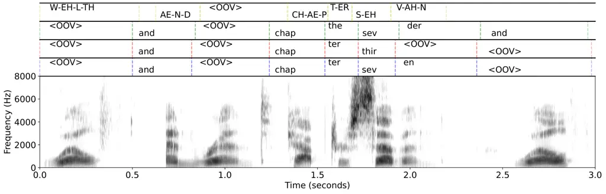

(a) Reference transcript: “Wealth and rent chap-ter sev-en wealth”.

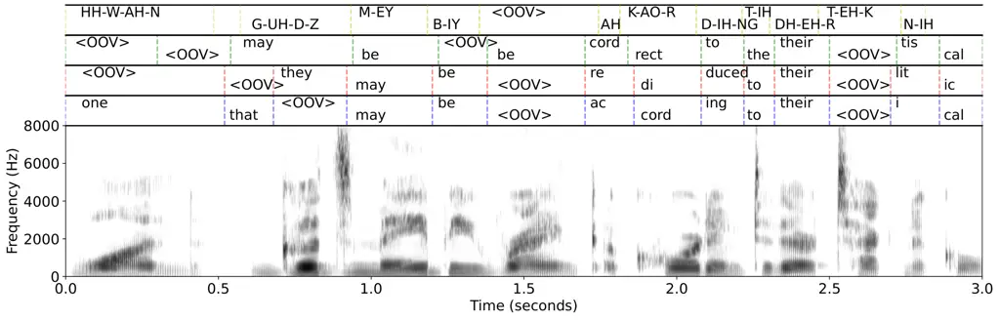

(b) Reference transcript: “One goods may be ranked ac-cord-ing to their
tech-ni-cal”.

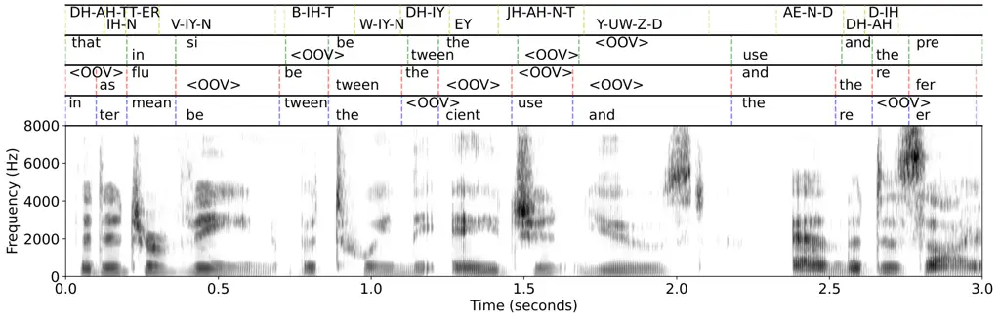

(c) Reference transcript: “That in-ter-vene be-tween the a-gent used and
the de-sired”

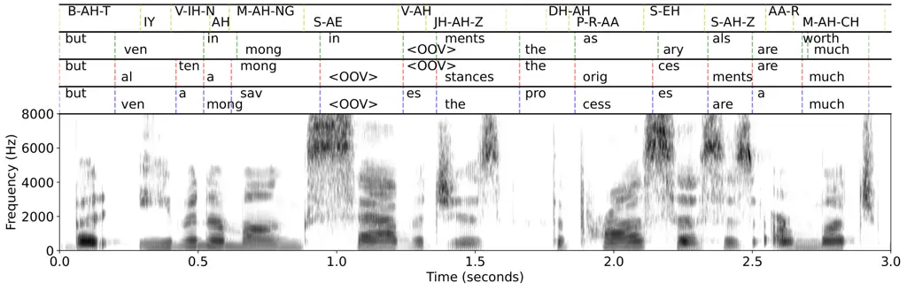

(d) Reference transcript: “But e-ven a-mong sav-ages the pro-cess-es are
much”

Figure 4: Spectrograms of audio examples in our test split of
LibriSpeech clean subsets (matched setting) and the predicted
speech-text alignment by SylCipher after different training stages.
Audios are truncated to the 3-second mark for better visualization. The
alignment bars from top to bottom: Forced alignment, Sylber,
Sylber+JE2E, Sylber+JE2E+PUSM.

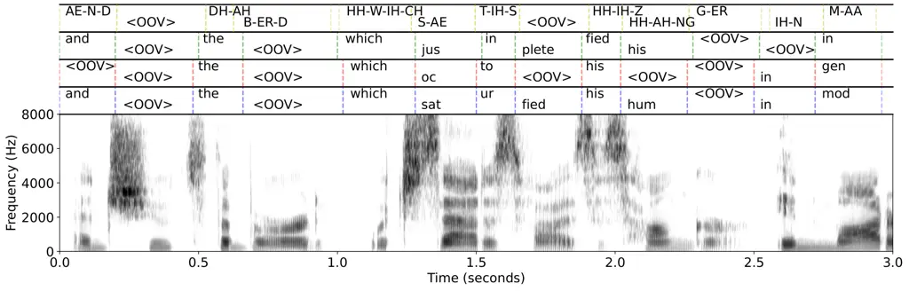

(a) Reference transcript: “And shoots the bird which sat-is-flies his
hun-ger”.

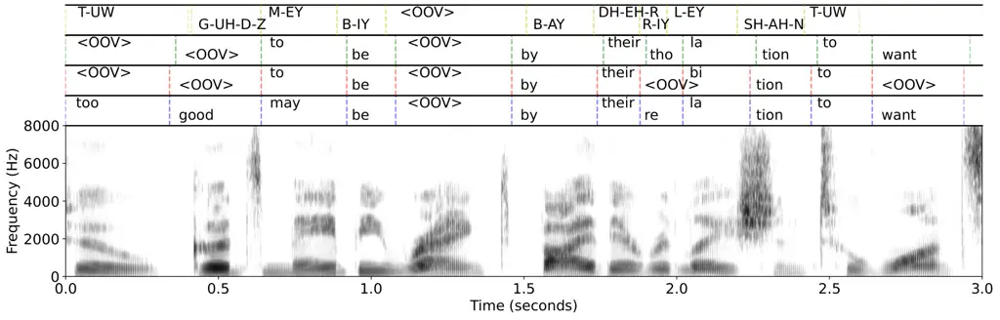

(b) Reference transcript: “two goods may be ranked by their re-la-tion
to wants”.

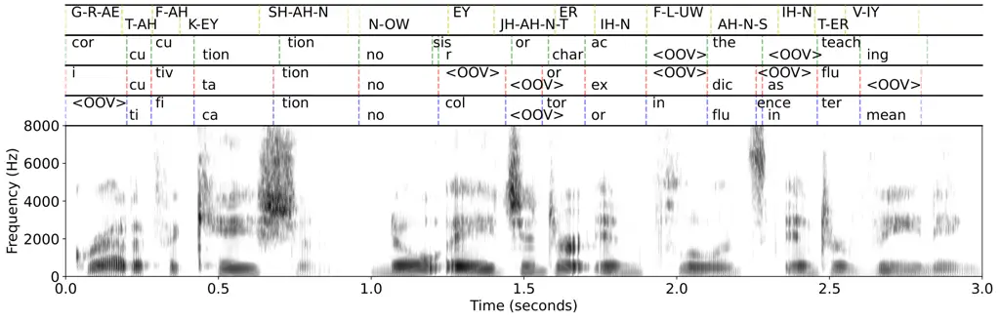

(c) Reference transcript: “Grat-i-fi-ca-tion no a-gent or in-flu-ence
in-ter-ven-ing”.

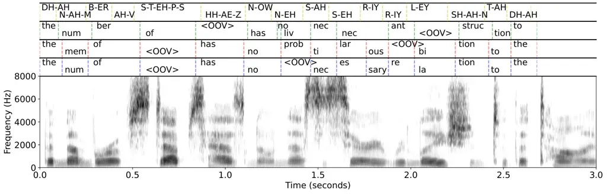

(d) Reference transcript: “The num-ber of steps has no nec-es-sary
re-la-tion to the”.

Figure 5: Spectrograms of audio examples in our test split of
LibriSpeech clean subsets (matched setting) and the predicted
speech-text alignment by SylCipher after different training stages.
Audios are truncated to the 3-second mark for better visualization. The
alignment bars from top to bottom: Forced alignment, Sylber,
Sylber+JE2E, Sylber+JE2E+PUSM.
