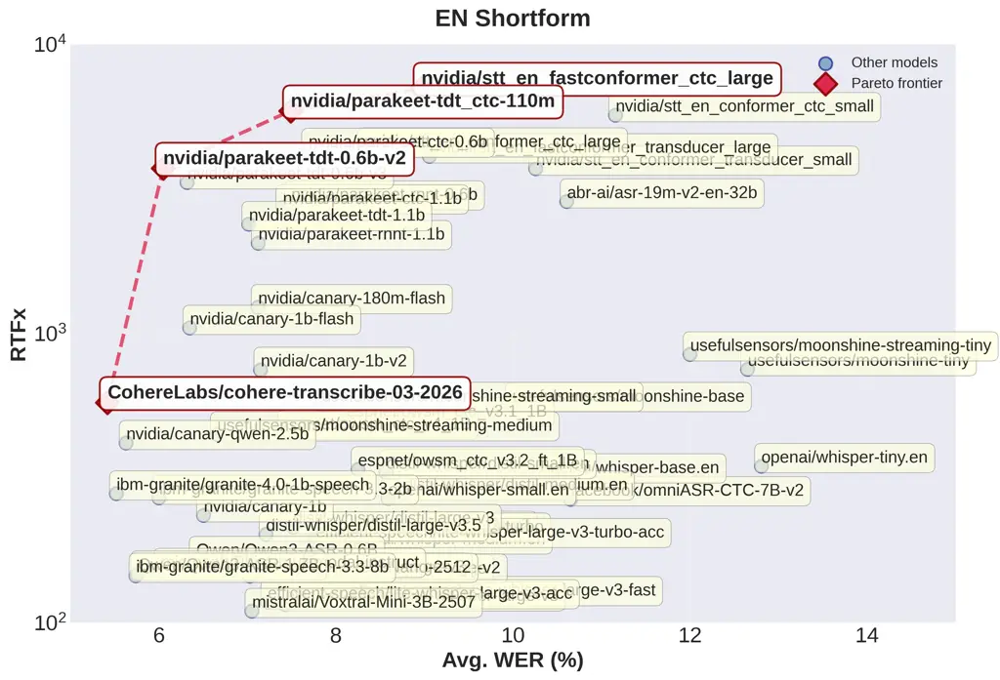
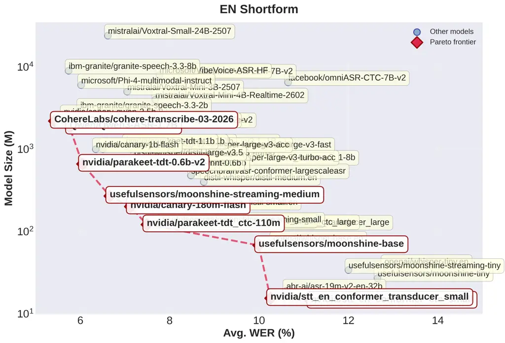
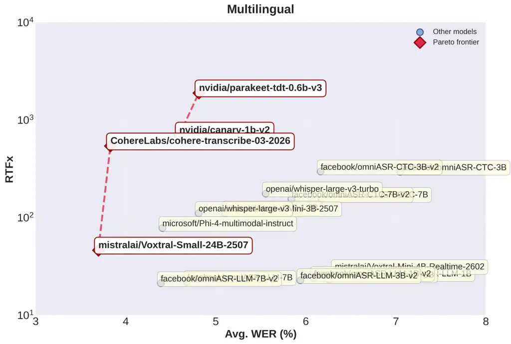
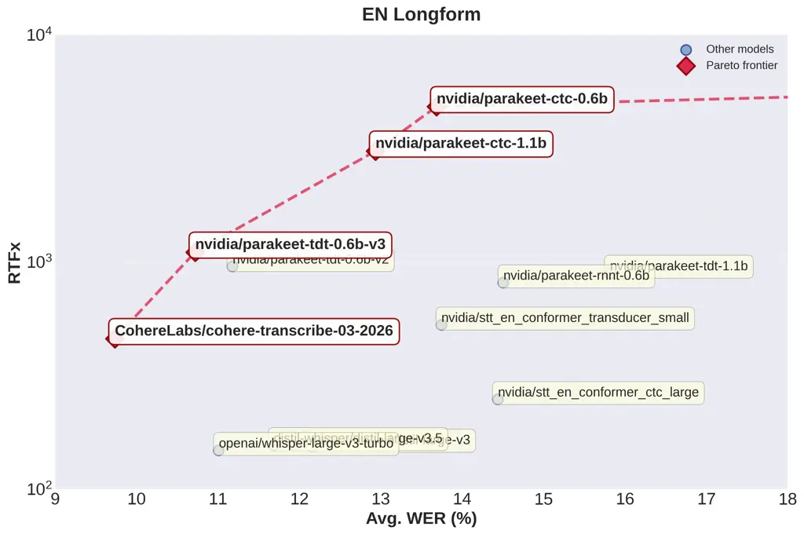

Srivastav Zheng Bezzam Le Bihan Koluguri Żelasko Majumdar Moumen Gandhi

# ASR Leaderboard: Towards Reproducible and Transparent Multilingual and Long-Form Speech Recognition Evaluation

Vaibhav    Steven    Eric    Eustache    Nithin Rao    Piotr   
Somshubra    Adel    Sanchit

###### Abstract

We present the ASR Leaderboard, a reproducible benchmarking platform
with community contributions from academia and industry. It compares 86
open-source and proprietary systems across 12 datasets, with English
short- and long-form and multilingual short-form tracks. We standardize
word error rate (WER) and inverse real-time factor (RTFx) evaluation for
consistent accuracy-efficiency comparisons across model architectures
and toolkits (_e.g._, ESPNet, NeMo, SpeechBrain, Transformers). We
observe that Conformer-based encoders paired with transformer-based
decoders achieve the best average WER, while connectionist temporal
classification (CTC) and token-and-duration transducer (TDT) decoders
offer superior RTFx, making them better suited for long-form and batched
processing. All code and dataset loaders are open-sourced to support
transparent, extensible evaluation. We present our evaluation
methodology to facilitate community-driven benchmarking in ASR and other
tasks.

###### keywords

benchmarking, automatic speech recognition, reproducible, multilingual,
long-form

^(†)^(†)address: ¹ Hugging Face, Inc., France  
² NVIDIA, United States of America  
³ University of Cambridge, United Kingdom  
⁴ Mistral AI, France  
⁵ OpenAI, United States of America ^(†)^(†)email: steven@huggingface.co,
eric.bezzam@huggingface.co

## 1 Introduction

Automatic speech recognition (ASR) has seen remarkable progress in
recent years, fueled in part by open-source contributions.
Publicly-available datasets \[1, 2\] and pre-trained models \[3, 4, 5\]
have enabled researchers across academia and industry to build on
existing work. Yet, as the number of datasets and models grows, it
becomes increasingly difficult for developers of new models to know
which baselines to compare against and how. Similarly, users focused on
inference may find it challenging to identify which model, whether
open-source or proprietary, best meets their needs in terms of
application and/or efficiency. Moreover, most existing benchmarks and
evaluations overwhelmingly emphasize English and short-form
transcription.

Several efforts have sought to address parts of this problem, including
benchmarks across multiple accents and diverse contexts in the French
language \[6\], under noise and reverberation in far-field
settings \[7\], and comparing commercial and open-source models in
English and Chinese \[8\]. Some common observations can be drawn from
these efforts: (1) there is no “catch-all” model, (2) no single dataset
is sufficient for evaluation, and (3) a single metric, _i.e._, word
error rate (WER), is not enough.

To address these challenges, we introduce the ASR Leaderboard. Our
contributions include:

1.  1.  An interactive leaderboard that compares $`86`$ open-source and
        proprietary models from $`26`$ organizations, with evaluations over
        $`12`$ datasets.¹¹ 1 Link omitted for anonymity. Our comparison
        standardizes the evaluation across multiple open-source toolkits
        (ESPNet \[9\], NeMo \[10\], SpeechBrain \[11\],
        Transformers \[12\]), commercial APIs (AssemblyAI, Aqua Voice,
        Google, ElevenLabs, Rev AI, Speechmatics, Zoom), and model-specific
        repositories.
2.  2.  A multilingual benchmark covering German, French, Italian, Spanish,
        and Portuguese.
3.  3.  A dedicated evaluation for long-form transcription.

For transparency and to facilitate the addition of new models and
datasets, the evaluation scripts for the leaderboard are open-sourced.²²
2 Link omitted for anonymity. The presented model, dataset, and
languages count are as of 27 March 2026, and continue to increase with
new additions to the leaderboard.

## 2 ASR Leaderboard

|                           |                               |                |                 |                             |                      |                                 |
| ------------------------- | ----------------------------- | -------------- | --------------- | --------------------------- | -------------------- | ------------------------------- |
| Dataset                   | Task(s)                       | Duration \[h\] | License         | Source                      | Style                | Transcriptions                  |
| AMI Meeting Corpus \[13\] | Leaderboard                   | 9              | CC-BY-4.0       | Meetings                    | Spontaneous          | Punctuated, cased, disfluencies |
| CoVoST-2 \[14\]           | Multilingual (de/fr/it/es/pt) | 5.3–23         | CC-BY-NC-4.0    | Open domain                 | Read                 | Punctuated, cased               |
| CORAAL \[15\]             | Long-form                     | 159            | CC-BY-NC-4.0    | Sociolinguistic interviews  | Spontaneous          | Punctuated, cased, disfluencies |
| Earnings21 \[16\]         | Long-form                     | 39             | CC-BY-SA-4.0    | Earnings calls              | Oratory, spontaneous | Punctuated, cased, disfluencies |
| Earnings22 \[17\]         | Leaderboard, Long-form        | 119            | CC-BY-SA-4.0    | Earnings calls              | Oratory, spontaneous | Punctuated, cased, disfluencies |
| FLEURS \[18\]             | Multilingual (de/fr/it/es/pt) | 2.0–3.5        | CC-BY-4.0       | Wikipedia                   | Read                 | Punctuated, cased               |
| GigaSpeech \[2\]          | Leaderboard                   | 40             | apache-2.0      | Audiobook, podcast, YouTube | Read, spontaneous    | Punctuated, disfluencies        |
| LibriSpeech (clean) \[1\] | Leaderboard                   | 5.4            | CC-BY-4.0       | Audiobooks                  | Read                 | Normalized                      |
| LibriSpeech (other) \[1\] | Leaderboard                   | 5.1            | CC-BY-4.0       | Audiobooks (noisier)        | Read                 | Normalized                      |
| MLS \[19\]                | Multilingual (fr/it/es/pt)    | 0.8–6.3        | CC-BY-4.0       | Audiobooks                  | Read                 | Normalized                      |
| SPGISpeech \[20\]         | Leaderboard                   | 100            | User Agreement  | Financial meetings          | Oratory, spontaneous | Punctuated, cased               |
| TED-LIUM v3 \[21\]        | Leaderboard, Long-form        | 3              | CC-BY-NC-ND 3.0 | TED Talks                   | Oratory              | Disfluencies                    |
| VoxPopuli \[22\]          | Leaderboard                   | 5              | CC0             | European Parliament         | Oratory              | Punctuated                      |

Table 1: Datasets used for the ASR Leaderboard. The Task(s) column
indicates which tasks (as denoted in Section 2.1) the dataset is used
for. The duration is of the test-split. The Multilingual datasets
indicate the range of durations for the evaluated languages. Note that
for Earnings22 a subset of \SI5\hour is used for short-form English
(Leaderboard) comparison.

### 2.1 Overview

The ASR Leaderboard contains evaluations on three tasks:

1.  1.  Leaderboard, which evaluates short-form English transcription. We
        define short-form as audio less than \SI30\second, namely the
        receptive field of Whisper \[3\].
2.  2.  Multilingual, which currently evaluates German, French, Italian,
        Spanish, and Portuguese transcription.
3.  3.  Long-form, which evaluates English transcription on audio longer
        than \SI30\second.

A separate Long-form evaluation is necessary because many recent models
are derived from the pretrained encoder and/or architecture of Whisper
(\SI32\percent of open models in our leaderboard; see Table 2).
Additionally, models may adopt different chunking strategies to reduce
inference latency or employ different context window sizes during
training (particularly for audio LLMs), both of which can impact
long-form transcription quality.

The datasets used for evaluation are presented in Section 2.2, while
evaluation metrics are described in Section 2.3. Section 2.4 provides an
overview of the models evaluated within the ASR Leaderboard, while
Section 2.5 outlines the community-based process for contributing new
models.

### 2.2 Datasets

Table 1 summarizes the datasets used for the ASR Leaderboard. For the
short-form evaluation (Leaderboard), we segment the original audio into
chunks of at most \SI30\second, with a small number of exceptions. For
normalized transcriptions, punctuation and casing is removed, as well as
disfluencies such as fillers (_e.g._, “ah”, “uh”, “um”), repetitions,
and repairs. Some datasets retain a subset of these features in their
provided transcriptions (as indicated in the last column of Table 1).

While it is not possible to fully guarantee the absence of test-set
contamination, namely that a given model has not been trained on a
specific evaluation set \[23\], the use of multiple evaluation datasets
per track enables us to identify anomalous performance on any single
dataset relative to the others. In addition, each track includes at
least one evaluation dataset released under a non-commercial license,
which helps mitigate the risk of test-set contamination for commercial
APIs and open-source models with commercial-friendly licenses: TED-LIUM
v3 for Leaderboard, CoVoST-2 for Multilingual, and TED-LIUM v3 and
CORAAL for Long-form.

Dataset retrieval and usage is enabled through the datasets
library \[24\]. The datasets themselves are hosted on the Hugging Face
Hub,³³ 3 Leaderboard: Link omitted for anonymity;  
Multilingual: Link omitted for anonymity;  
Long-form: Link omitted for anonymity. which enables interactive
exploration directly in the browser, including listening to individual
audio, inspecting metadata, and running SQL queries, all without
downloading the datasets. The datasets can be conveniently downloaded
and used in Python as such:

from datasets import load_dataset

ds = load_dataset("hf-audio/esb-datasets-test-only-sorted", "ami",
split="test")

audio_sample = ds\[0\]

Listing 1: Example of loading dataset.

### 2.3 Metrics

We report results on two metrics: word error rate (WER) for comparing
transcription quality, and inverse real-time factor (RTFx) for comparing
inference speed.

Not all models produce transcripts with punctuation, casing, or
disfluencies; in particular, some models explicitly remove the latter.
To account for discrepancies between model outputs and dataset
transcriptions (last column of Table 1), we normalize all text prior to
computing WER. This normalization removes punctuation and casing, and
applies an English text normalization pipeline closely following that of
Whisper \[3\]. The pipeline includes number normalization (_e.g._,
“zero” to “0”), spelling standardization, and the removal of filler
words. On the leaderboard, models are sorted according to average WER
across all datasets of a corresponding task.

We define RTFx as:

```math
\displaystyle\text{RTFx}=\frac{\text{Total duration of audio}}{\text{Transcription time}}. \tag{1}
```

Higher values indicate faster inference (_i.e._, lower latency). We
report the inverse real-time factor, rather than real-time factor (), so
that “higher is better” and relative speedups are easy to interpret
(_e.g._, 10$`\times`$ or 100$`\times`$ faster). RTFx can be computed for
a single utterance or over a batch of audio. RTFx (and related variants)
is commonly used to quantify a model’s efficiency on long-form
audio \[25\]. From the leaderboard page, models can be dynamically
sorted by WER-performance on a particular dataset, or by RTFx.

### 2.4 Current models

|                                          |             |     |           |     |       |
| ---------------------------------------- | ----------- | --- | --------- | --- | ----- |
| Enc $`\downarrow`$ / Dec $`\rightarrow`$ | Transformer | CTC | RNN-T/TDT | LLM | Total |
| Conformer-based                          | 6           | 9   | 8         | 5   | 28    |
| Whisper                                  | 18          | 3   | 0         | 4   | 25    |
| Self-supervised                          | 1           | 14  | 0         | 0   | 15    |
| Custom                                   | 7           | 0   | 0         | 3   | 10    |
| Total                                    | 32          | 26  | 8         | 12  | 78    |

Table 2: Distribution of encoder and decoder architectures for the
open-source models in the ASR Leaderboard. Some models use hybrid
architectures for the encoder or decoder, and are counted twice. See
Section 2.4 for the distinction between the encoder and decoder
architectures.

|                                     |      |                         |                   |                      |             |          |
| ----------------------------------- | ---- | ----------------------- | ----------------- | -------------------- | ----------- | -------- |
| Model                               | Open | Avg. WER $`\downarrow`$ | RTFx $`\uparrow`$ | Encoder              | Decoder     | \# Lang. |
| Cohere Labs Transcribe              | Yes  | 5.42                    | 525               | FastConformer \[26\] | Transformer | 14       |
| Zoom Scribe v1                      | No   | 5.47                    | \-                | \-                   | \-          | 1        |
| IBM Granite Speech 4.0 1B           | Yes  | 5.52                    | 280               | Conformer \[27\]     | LLM         | 6        |
| NVIDIA Canary Qwen 2.5B             | Yes  | 5.63                    | 418               | FastConformer \[26\] | LLM         | 1        |
| IBM Granite Speech 3.3 8B           | Yes  | 5.76                    | 145               | Conformer \[27\]     | LLM         | 5        |
| Qwen3 ASR 1.7B                      | Yes  | 5.76                    | 148               | Custom \[28\]        | LLM         | 52       |
| ElevenLabs Scribe v2                | No   | 5.83                    | –                 | –                    | –           | 90+      |
| IBM Granite Speech 3.3 2B           | Yes  | 6.00                    | 271               | Conformer \[27\]     | LLM         | 5        |
| Microsoft Phi 4 Multimodal Instruct | Yes  | 6.02                    | 151               | Conformer \[27\]     | LLM         | 8        |
| NVIDIA Parakeet TDT 0.6B v2         | Yes  | 6.05                    | 3390              | FastConformer \[26\] | TDT \[29\]  | 1        |
| AssemblyAI Universal 3 Pro          | No   | 6.21                    | –                 | –                    | –           | 99       |
| NVIDIA Parakeet TDT 0.6B v3         | Yes  | 6.32                    | 3330              | FastConformer \[26\] | TDT \[29\]  | 25       |
| Google Chirp v2                     | No   | 6.42                    | \-                | \-                   | \-          | 468      |
| NVIDIA Canary 1B                    | Yes  | 6.50                    | 235               | FastConformer \[26\] | Transformer | 4        |
| Mistral AI Voxtral Small 24B        | Yes  | 6.62                    | 54.1              | Whisper-FT \[30\]    | LLM         | 8        |
| Nyra Health CrisperWhisper          | Yes  | 6.67                    | 84.1              | Whisper-FT \[31\]    | Whisper-FT  | 1        |
| Speechmatic Enhanced                | No   | 6.91                    | –                 | –                    | \-          | 55       |
| RevAI Fusion                        | No   | 7.12                    | –                 | –                    | –           | 1        |
| NVIDIA Canary 1B v2                 | Yes  | 7.15                    | 749               | FastConformer \[26\] | Transformer | 25       |
| Distil-Whisper Large v3.5           | Yes  | 7.21                    | 202               | Whisper \[3\]        | Transformer | 1        |
| NVIDIA Parakeet CTC 1.1B            | Yes  | 7.40                    | 2730              | FastConformer \[26\] | CTC         | 1        |
| OpenAI Whisper Large v3             | Yes  | 7.44                    | 146               | Whisper \[3\]        | Whisper     | 99       |
| OpenAI Whisper Large v3 Turbo       | Yes  | 7.83                    | 200               | Whisper \[3\]        | Whisper     | 99       |
| Meta Omnilingual ASR LLM 7B v2      | Yes  | 8.14                    | 66.0              | wav2vec2 \[4\]       | Transformer | 1676     |
| NVIDIA FastConformer CTC Large      | Yes  | 8.96                    | 6400              | FastConformer \[26\] | CTC         | 1        |

Table 3: Subset of ASR Leaderboard results on short-form English. WER is
averaged over datasets corresponding to the Leaderboard in Table 1.
Whisper-FT stands for Whisper-finetuned. The top 10 are displayed along
with additional models to comments on various architectures. The full
and latest table can be found on Hugging Face.

Of the 86 models currently listed in the ASR Leaderboard (as of 27 March
2026), 74 are open-source. The models come from 26 organizations:
NVIDIA (18), Meta/Facebook (14), OpenAI (8), Hugging Face (5), Useful
Sensors (5), University of Washington (4), ESPNet (3), Google (3),
IBM (3), Mistral AI (3), Alibaba Cloud (2), ElevenLabs (2),
Microsoft (2), Rev AI (2), SpeechBrain (2), Applied Brain Research (1),
AssemblyAI (1), Aqua Voice (1), AssemblyAI (1), Cohere Labs (1),
Kyutai (1), Nyra Health (1), Speechmatics (1), Ultravox (1), Z.ai (1),
and Zoom (1).

A significant effort of this leaderboard has been to standardize the
usage across several libraries: four commonly-used open-source toolkits
(ESPNet, NeMo, SpeechBrain, Transformers), seven commercial APIs
(AssemblyAI, Aqua Voice, Google, ElevenLabs, Rev AI, Speechmatics,
Zoom), and model-specific repositories. The evaluation scripts for each
model are open-sourced.⁴⁴ 4 Link omitted for anonymity.

Table 2 summarizes the encoder and decoder architectures used by the
open-source models in the leaderboard. The following encoder
architectures are represented: Conformer-based encoders \[26, 27\],
Whisper-based encoders \[3\], self-supervised encoders (_i.e._,
wav2vec2 \[4\], HuBERT \[5\], data2vec \[32\]), and custom
approaches \[33, 34, 35, 36, 37\]. Whisper-based encoders either use the
encoder model without modification \[38\], apply low-rank
adaptation \[39\], fine-tune it \[30, 31\], or train from
scratch \[40\].

The evaluated decoder architectures include transformer-based, CTC
(Connectionist Temporal Classification), Recurrent Neural Network
Transducer (RNN-T), Token-and-Duration Transducer (TDT) \[29\], and LLM
(Large Language Model)-based approaches. Although both transformer-based
and LLM-based decoders rely on the same underlying architecture and
operate autoregressively, LLM-based decoders are pretrained on
large-scale text corpora and can function as standalone text language
models.

### 2.5 Adding a new model

External contributors can add a new model to the leaderboard by opening
a pull request (PR) that includes:

1.  1.  A Python script for evaluation on a specific dataset, optionally
        specifying a model version.⁵⁵ 5 Example scripts for each task can be
        found in: links omitted for anonymity.
2.  2.  A Bash script that calls the Python script for each dataset and
        model combination.⁶⁶ 6 An example can be found in: link omitted for
        anonymity.
3.  3.  Self-reported metrics.

We verify these scripts in our environment to ensure consistent
evaluation across models before updating the leaderboard. To date, 29
PRs have been merged to add 56 models following this process, and an
additional 34 PRs have been merged to address other aspects and fixes.

## 3 Results



(a) Average WER (%) vs. RTFx



(b) Average WER (%) vs. Model Size (M)

Figure 1: (a) Average word error rate (WER) vs. inverse real time factor
(RTFx) and (b) WER vs. model size trade-off plots for the open-source
ASR models, on short-form English transcription. See Table 3 for
metrics.

The evaluation scripts for each model were run on an NVIDIA
A100-SXM4-80GB GPU (driver 560.28.03, CUDA 12.6), using a batch size of
64 whenever memory allowed, and reduced adaptively (48, 32, 16, …) when
necessary to fit in device memory. Although the absolute RTFx values
depend on the underlying hardware and can vary substantially across
systems, all measurements reported here are obtained under the same
setup. As such, they provide a meaningful basis for comparing the
relative efficiency of models, even if the absolute numbers may not
directly transfer to other hardware configurations.

Since the full results are continuously updated on the ASR Leaderboard
and are too extensive to fully include here, we present a condensed
versions of the English leaderboard in Table 3, the multilingual results
in Table 4, and the long-form results in Table 5. The full leaderabords
can be found on Hugging Face:
[https://hf.co/spaces/hf-audio/open_asr_leaderboard](https://hf.co/spaces/hf-audio/open_asr_leaderboard)

### 3.1 Short-form (English)

Models that combine a Conformer-based encoder \[26, 27\] with a
transformer-based decoder (either custom or LLM-based) achieve the best
average WER. However, these models are significantly slower than those
using TDT or CTC decoders. While TDT/CTC approaches offer substantially
better RTFx, this speed advantage comes at the expense of accuracy: the
highest-ranking TDT model (NVIDIA Parakeet TDT 0.6B v2) places 10th,
while the best CTC model (NVIDIA Parakeet CTC 1.1B) ranks 34th.

As shown in Table 2, Conformer-based encoders are the most widely
adopted. Restricting the comparison to models with transformer/LLM-based
decoders (10 Conformer-based and 22 Whisper-based), Conformer-based
systems are on average $`3.77\times`$ faster, with an average RTFx of
758 compared to 201 for Whisper-based models.

Despite this, Whisper-based encoders remain popular due to pretraining
on large-scale multilingual data, enabling support for up to 99
languages. Models that fine-tune Whisper’s encoder for specific
languages (_e.g._, Nyra Health CrisperWhisper \[31\] and Mistral AI
Voxtral Small 24B \[30\]), or that train a new decoder (Distil-Whisper
Large v3.5 \[38\]) can achieve better average WER than OpenAI Whisper
Large v3. Self-supervised encoders make up \SI19\percent of the
approaches in the benchmark. While they enable systems for 1600+
languages \[41\], the best approach ranks only 53rd (Meta Omnilingual
ASR LLM 7B v2).

The scatter plots in Fig. 1 show all open-source models with a WER below
\SI15\percent plotted against RTFx and model size. The Pareto front is
overlaid to illustrate the trade-offs between WER and each of these
criteria.

### 3.2 Multilingual

|                                     |      |          |      |      |      |      |      |      |
| ----------------------------------- | ---- | -------- | ---- | ---- | ---- | ---- | ---- | ---- |
| Model                               | Open | Avg. WER | RTFx | DE   | FR   | IT   | ES   | PT   |
| ElevenLabs Scribe v2                | No   | 2.67     | –    | 2.27 | 3.28 | 2.58 | 2.33 | 2.83 |
| Assembly AI Universal 3 Pro         | No   | 3.23     | –    | 2.34 | 3.74 | 3.94 | 2.34 | 3.63 |
| Mistral AI Voxtral Small 24B        | Yes  | 3.70     | 42.0 | 3.01 | 4.13 | 3.91 | 3.04 | 4.40 |
| Cohere Labs Transcribe              | Yes  | 3.83     | 491  | 3.84 | 4.05 | 3.44 | 2.81 | 5.60 |
| Speechmatic Enhanced                | No   | 4.29     | –    | 2.84 | 5.04 | 5.58 | 2.78 | 4.97 |
| Meta Omnilingual ASR LLM 7B v2      | Yes  | 4.39     | 21.2 | 4.55 | 5.34 | 3.75 | 3.44 | 5.18 |
| Microsoft Phi 4 Multimodal Instruct | Yes  | 4.41     | 78.2 | 3.96 | 5.20 | 4.15 | 3.71 | 5.12 |
| NVIDIA Canary 1B v2                 | Yes  | 4.60     | 634  | 4.10 | 4.83 | 4.88 | 3.25 | 6.33 |
| Meta Omnilingual ASR LLM 7B         | Yes  | 4.68     | 21.8 | 4.58 | 5.46 | 3.80 | 3.73 | 6.36 |
| OpenAI Whisper Large v3             | Yes  | 4.81     | 111  | 4.26 | 6.36 | 4.69 | 3.65 | 4.96 |
| NVIDIA Parakeet TDT 0.6B v3         | Yes  | 4.81     | 1720 | 4.20 | 5.42 | 4.81 | 3.73 | 6.16 |
| Qwen3 ASR 1.7B                      | Yes  | 5.11     | 113  | 4.12 | 5.74 | 5.61 | 3.87 | 6.29 |
| Meta Omnilingual ASR CTC 7B v2      | Yes  | 5.84     | 155  | 6.05 | 7.63 | 4.79 | 4.49 | 6.57 |

Table 4: Average WERs for each language
(German/French/Italian/Spanish/Portuguese) and across all languages on
the Multilingual datasets in Table 1. The full and latest table on
Hugging Face.



(a) Multilingual: Average WER (%) vs. RTFx



(b) Average WER (%) vs. Model Size (M)

Figure 2: Average word error rate (WER) vs. inverse real time factor
(RTFx) for(a) multilingual and (b) longform. See Table 4 and Table 5
respectively for metrics.

Closed-source models achieve the best results on the multilingual
datasets (see Table 4). Among open-source models, we observe a trade-off
between specialization and broad multilingual coverage. With a large and
diverse set of models, NVIDIA’s systems provide a clear example of this
trade-off: Parakeet TDT 0.6B v3 adds multilingual support compared to
v2, and Canary 1B v2 expands from 4 to 25 languages. In both cases,
broader language coverage comes at the cost of English transcription
accuracy. Similarly, Meta Omnilingual ASR LLM 7B v2 ranks higher on the
multilingual benchmarks, outperforming several models that ranked higher
on the short-form English benchmark. Fig. 2(a) plots all open-source
models with a WER below \SI8\percent against RTFx.

### 3.3 Long-form (English)

|                               |      |          |      |
| ----------------------------- | ---- | -------- | ---- |
| Model                         | Open | Avg. WER | RTFx |
| ElevenLabs Scribe v2          | No   | 7.32     | –    |
| AssemblyAI Universal 3 Pro    | No   | 8.34     | –    |
| Speechmatics Enhanced         | No   | 8.80     | –    |
| RevAI Fusion                  | No   | 9.54     | –    |
| Cohere Labs Transcribe        | Yes  | 9.73     | 418  |
| NVIDIA Parakeet TDT 0.6B v3   | Yes  | 10.7     | 1000 |
| OpenAI Whisper Large v3 Turbo | Yes  | 11.0     | 148  |
| NVIDIA Canary Qwen 2.5B       | Yes  | 11.2     | 16.1 |
| OpenAI Whisper Large v3       | Yes  | 11.2     | 68.6 |
| Distil-Whisper Large v3.5     | Yes  | 11.7     | 156  |
| NVIDIA Parakeet CTC 1.1B      | Yes  | 12.9     | 2790 |
| Google Chirp                  | No   | 13.0     | –    |
| NVIDIA Parakeet CTC 0.6B      | Yes  | 13.7     | 4383 |

Table 5: Subset of results on the Long-form datasets of Table 1. The
full and latest table is on Hugging Face.

Closed-source models also deliver the strongest results on long-form
English, with a distinct gap over open-source alternatives (Table 5).
Although the exact reasons are not known, this may be due to
domain-specific fine-tuning. Moreover, differences between short-form
and long-form performance may also arise from factors such as model
context size, audio chunking strategies, and the handling of
disfluencies, which tend to occur more frequently in long-form
recordings (_e.g._, meetings, presentations, and interviews). Fig. 2(b)
plots all open-source models with a WER below \SI18\percent against
RTFx.

## 4 Conclusions

We present the ASR Leaderboard, a reproducible benchmark covering $`86`$
systems and $`12`$ datasets, including multilingual and long-form
speech. Our comparison standardizes the evaluation across multiple
open-source toolkits (ESPNet, NeMo, SpeechBrain, Transformers),
commercial APIs, and model-specific repositories. Standardized text
normalization enables a unified basis for comparing WER performance
accuracy, and our RTFx evaluation allows for efficiency comparisons.
Conformer-based encoders paired with transformer-based decoders achieve
the strongest English WER but at the cost of higher latency. In
contrast, CTC- and TDT-based decoders offer faster inference with only
modest accuracy trade-offs, making them attractive for long-form
transcription. Code and datasets are open-sourced to support transparent
and extensible evaluation.

Future work includes expanding evaluations across languages and domains
(_e.g._, far-field speech), incorporating additional metrics (_e.g._,
token error rate \[8\]), and exploring underrepresented encoder-decoder
combinations (Table 2). With the rise of LLMs and their demonstrated
strength in ASR, we anticipate more approaches leveraging them. To
further improve benchmark reliability, private evaluation sets could
help minimize the risk of test-set contamination. Additionally, because
models vary in how they handle disfluencies, it may be valuable to
differentiate tasks based on whether disfluencies are explicitly modeled
or whether verbatim transcription is required.

## References

- \[1\] V. Panayotov, G. Chen, D. Povey, and S. Khudanpur (2015)
  Librispeech: An ASR corpus based on public domain audio books. In IEEE
  International Conference on Acoustics, Speech and Signal Processing,
  Vol. , pp. 5206–5210. External Links:
  [Document](https://dx.doi.org/10.1109/ICASSP.2015.7178964) Cited by:
  §1, Table 1, Table 1.
- \[2\] G. Chen et al. (2021) GigaSpeech: An Evolving, Multi-domain ASR
  Corpus with 10,000 Hours of Transcribed Audio. In Proc. Interspeech,
  Cited by: §1, Table 1.
- \[3\] A. Radford, J. W. Kim, T. Xu, G. Brockman, C. McLeavey, and I.
  Sutskever (2023) Robust speech recognition via large-scale weak
  supervision. In Proc. International Conference on Machine Learning,
  Cited by: §1, item 1, §2.3, §2.4, Table 3, Table 3, Table 3.
- \[4\] A. Baevski, Y. Zhou, A. Mohamed, and M. Auli (2020) wav2vec 2.0:
  A Framework for Self-Supervised Learning of Speech Representations. In
  Advances in Neural Information Processing Systems, Vol. 33,
  pp. 12449–12460. Cited by: §1, §2.4, Table 3.
- \[5\] W. Hsu, B. Bolte, Y. H. Tsai, K. Lakhotia, R. Salakhutdinov,
  and A. Mohamed (2021) HuBERT: Self-Supervised Speech Representation
  Learning by Masked Prediction of Hidden Units. IEEE/ACM Transactions
  on Audio, Speech, and Language Processing 29 (), pp. 3451–3460.
  External Links:
  [Document](https://dx.doi.org/10.1109/TASLP.2021.3122291) Cited by:
  §1, §2.4.
- \[6\] S. Evain et al. (2021) Task Agnostic and Task Specific
  Self-Supervised Learning from Speech with LeBenchmark. In Conference
  on Neural Information Processing Systems (Datasets and Benchmarks
  Track), Cited by: §1.
- \[7\] J. Barker, R. Marxer, E. Vincent, and S. Watanabe (2015) The
  third ‘CHiME’ speech separation and recognition challenge: Dataset,
  task and baselines. In 2015 IEEE Workshop on Automatic Speech
  Recognition and Understanding, Vol. , pp. 504–511. External Links:
  [Document](https://dx.doi.org/10.1109/ASRU.2015.7404837) Cited by: §1.
- \[8\] J. Du, J. Li, G. Chen, and W. Zhang (2025) SpeechColab
  leaderboard: An open-source platform for automatic speech recognition
  evaluation. Computer Speech & Language 94. External Links: ISSN
  0885-2308,
  [Document](https://dx.doi.org/https%3A//doi.org/10.1016/j.csl.2025.101805)
  Cited by: §1, §4.
- \[9\] S. Watanabe, T. Hori, S. Karita, T. Hayashi, J. Nishitoba, Y.
  Unno, N. E. Y. Soplin, J. Heymann, M. Wiesner, N. Chen, et al. (2018)
  ESPnet: end-to-end speech processing toolkit. arXiv preprint
  arXiv:1804.00015. Cited by: item 1.
- \[10\] O. Kuchaiev, J. Li, H. Nguyen, O. Hrinchuk, R. Leary, B.
  Ginsburg, S. Kriman, S. Beliaev, V. Lavrukhin, J. Cook, et al. (2019)
  Nemo: a toolkit for building ai applications using neural modules.
  arXiv preprint arXiv:1909.09577. Cited by: item 1.
- \[11\] M. Ravanelli, T. Parcollet, A. Moumen, S. De Langen, C.
  Subakan, P. Plantinga, Y. Wang, P. Mousavi, L. Della Libera, A.
  Ploujnikov, et al. (2024) Open-source conversational ai with
  speechbrain 1.0. Journal of Machine Learning Research 25 (333),
  pp. 1–11. Cited by: item 1.
- \[12\] T. Wolf, L. Debut, V. Sanh, J. Chaumond, C. Delangue, A.
  Moi, P. Cistac, T. Rault, R. Louf, M. Funtowicz, et al. (2019)
  Huggingface’s transformers: state-of-the-art natural language
  processing. arXiv preprint arXiv:1910.03771. Cited by: item 1.
- \[13\] J. Carletta et al. (2005) The AMI Meeting Corpus: A
  Pre-Announcement. In Proc. International Conference on Machine
  Learning for Multimodal Interaction, pp. 28–39. External Links: ISBN
  3540325492, [Document](https://dx.doi.org/10.1007/11677482%5F3) Cited
  by: Table 1.
- \[14\] C. Wang, A. Wu, and J. Pino (2020) CoVoST 2: A Massively
  Multilingual Speech-to-Text Translation Corpus. arXiv:2007.10310.
  Cited by: Table 1.
- \[15\] T. Kendall and C. Farrington (2023) The Corpus of Regional
  African American Language. The Online Resources for African American
  Language Project, Eugene, OR. Note: Dataset Cited by: Table 1.
- \[16\] M. D. Rio et al. (2021) Earnings-21: A Practical Benchmark for
  ASR in the Wild. arXiv:2104.11348. Cited by: Table 1.
- \[17\] M. Del Rio, P. Ha, Q. McNamara, C. Miller, and S.
  Chandra (2022) Earnings-22: A Practical Benchmark for Accents in the
  Wild. arXiv:2203.15591. Cited by: Table 1.
- \[18\] A. Conneau et al. (2023) FLEURS: Few-Shot Learning Evaluation
  of Universal Representations of Speech. In IEEE Spoken Language
  Technology Workshop, Vol. , pp. 798–805. External Links:
  [Document](https://dx.doi.org/10.1109/SLT54892.2023.10023141) Cited
  by: Table 1.
- \[19\] V. Pratap, Q. Xu, A. Sriram, G. Synnaeve, and R.
  Collobert (2020) MLS: A Large-Scale Multilingual Dataset for Speech
  Research. arXiv:2012.03411. Cited by: Table 1.
- \[20\] P. K. O’Neill et al. (2021) SPGISpeech: 5,000 hours of
  transcribed financial audio for fully formatted end-to-end speech
  recognition. arXiv:2104.02014. Cited by: Table 1.
- \[21\] F. Hernandez, V. Nguyen, S. Ghannay, N. Tomashenko, and Y.
  Estève (2018) TED-LIUM 3: twice as much data and corpus repartition
  for experiments on speaker adaptation. In International Conference on
  Speech and Computer, pp. 198–208. Cited by: Table 1.
- \[22\] C. Wang et al. (2021) VoxPopuli: a large-scale multilingual
  speech corpus for representation learning, semi-supervised learning
  and interpretation. In Proc. Annual Meeting of the Association for
  Computational Linguistics and the International Joint Conference on
  Natural Language Processing, pp. 993–1003. External Links:
  [Document](https://dx.doi.org/10.18653/v1/2021.acl-long.80) Cited by:
  Table 1.
- \[23\] Y. Tseng, T. Parcollet, R. van Dalen, S. Zhang, and S.
  Bhattacharya (2025) Evaluation of llms in speech is often flawed: test
  set contamination in large language models for speech recognition.
  External Links: 2505.22251, [Link](https://arxiv.org/abs/2505.22251)
  Cited by: §2.2.
- \[24\] Q. Lhoest et al. (2021) Datasets: a community library for
  natural language processing. In Proc. Conference on Empirical Methods
  in Natural Language Processing: System Demonstrations, pp. 175–184.
  External Links:
  [Document](https://dx.doi.org/10.18653/v1/2021.emnlp-demo.21) Cited
  by: §2.2.
- \[25\] N. R. Koluguri et al. (2024) Investigating End-to-End ASR
  Architectures for Long Form Audio Transcription. In IEEE International
  Conference on Acoustics, Speech and Signal Processing, Vol. ,
  pp. 13366–13370. External Links:
  [Document](https://dx.doi.org/10.1109/ICASSP48485.2024.10448309) Cited
  by: §2.3.
- \[26\] D. Rekesh et al. (2023) Fast conformer with linearly scalable
  attention for efficient speech recognition. In IEEE Automatic Speech
  Recognition and Understanding Workshop, Vol. , pp. 1–8. External
  Links: [Document](https://dx.doi.org/10.1109/ASRU57964.2023.10389701)
  Cited by: §2.4, Table 3, Table 3, Table 3, Table 3, Table 3, Table 3,
  Table 3, Table 3, §3.1.
- \[27\] A. Gulati et al. (2020) Conformer: convolution-augmented
  transformer for speech recognition. arXiv:2005.08100. Cited by: §2.4,
  Table 3, Table 3, Table 3, Table 3, §3.1.
- \[28\] X. Shi et al. (2026) Qwen3-asr technical report. arXiv preprint
  arXiv:2601.21337. Cited by: Table 3.
- \[29\] H. Xu, F. Jia, S. Majumdar, H. Huang, S. Watanabe, and B.
  Ginsburg (2023) Efficient sequence transduction by jointly predicting
  tokens and durations. In Proc. International Conference on Machine
  Learning, Cited by: §2.4, Table 3, Table 3.
- \[30\] A. H. Liu et al. (2025) Voxtral. arXiv:2507.13264. Cited by:
  §2.4, Table 3, §3.1.
- \[31\] L. Wagner, B. Thallinger, and M. Zusag (2024) CrisperWhisper:
  Accurate Timestamps on Verbatim Speech Transcriptions.
  arXiv:2408.16589. Cited by: §2.4, Table 3, §3.1.
- \[32\] A. Baevski, W. Hsu, Q. Xu, A. Babu, J. Gu, and M. Auli (2022)
  Data2vec: a general framework for self-supervised learning in speech,
  vision and language. In Proc. International Conference on Machine
  Learning, Vol. 162, pp. 1298–1312. Cited by: §2.4.
- \[33\] N. Zeghidour et al. (2025) Streaming sequence-to-sequence
  learning with delayed streams modeling. arXiv:2509.08753. Cited by:
  §2.4.
- \[34\] N. Jeffries, E. King, M. Kudlur, G. Nicholson, J. Wang, and P.
  Warden (2024) Moonshine: speech recognition for live transcription and
  voice commands. arXiv:2410.15608. Cited by: §2.4.
- \[35\] X. Shi et al. (2026) Qwen3-asr technical report. arXiv preprint
  arXiv:2601.21337. Cited by: §2.4.
- \[36\] A. H. Liu, A. Ehrenberg, A. Lo, C. Sun, G. Lample, J.
  Delignon, K. R. Chandu, P. von Platen, P. R. Muddireddy, R. Arora, et
  al. (2026) Voxtral realtime. arXiv preprint arXiv:2602.11298. Cited
  by: §2.4.
- \[37\] Z. Peng, J. Yu, Y. Chang, Z. Wang, L. Dong, Y. Hao, Y. Tu, C.
  Yang, W. Wang, S. Xu, et al. (2026) VIBEVOICE-asr technical report.
  arXiv preprint arXiv:2601.18184. Cited by: §2.4.
- \[38\] S. Gandhi, P. von Platen, and A. M. Rush (2023) Distil-Whisper:
  Robust Knowledge Distillation via Large-Scale Pseudo Labelling.
  arXiv:2311.00430. Cited by: §2.4, §3.1.
- \[39\] K. Kamahori, J. Kasai, N. Kojima, and B. Kasikci (2025)
  LiteASR: Efficient Automatic Speech Recognition with Low-Rank
  Approximation. arXiv:2502.20583. Cited by: §2.4.
- \[40\] Y. Peng, M. Shakeel, Y. Sudo, W. Chen, J. Tian, C.-J. Lin,
  and S. Watanabe (2025) OWSM v4: Improving Open Whisper-Style Speech
  Models via Data Scaling and Cleaning. In Proc. Interspeech,
  pp. 2225–2229. External Links:
  [Document](https://dx.doi.org/10.21437/Interspeech.2025-1062) Cited
  by: §2.4.
- \[41\] G. Keren et al. (2025) Omnilingual ASR: Open-Source
  Multilingual Speech Recognition for 1600+ Languages. arXiv:2511.09690.
  Cited by: §3.1.
