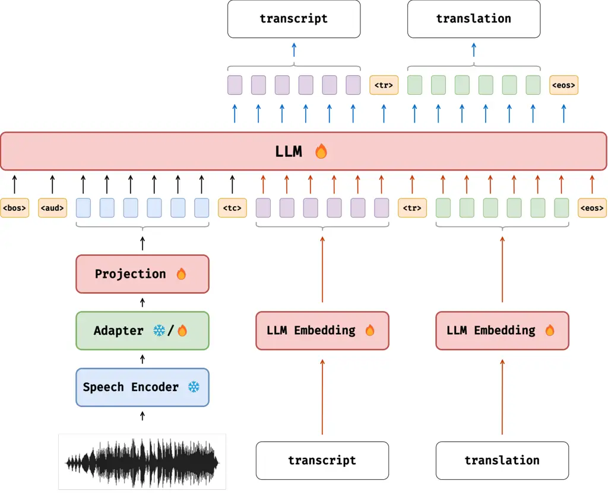
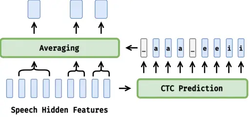
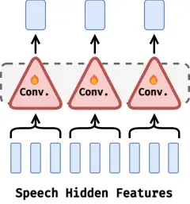
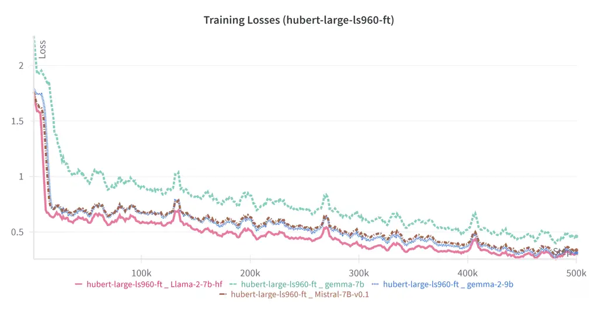
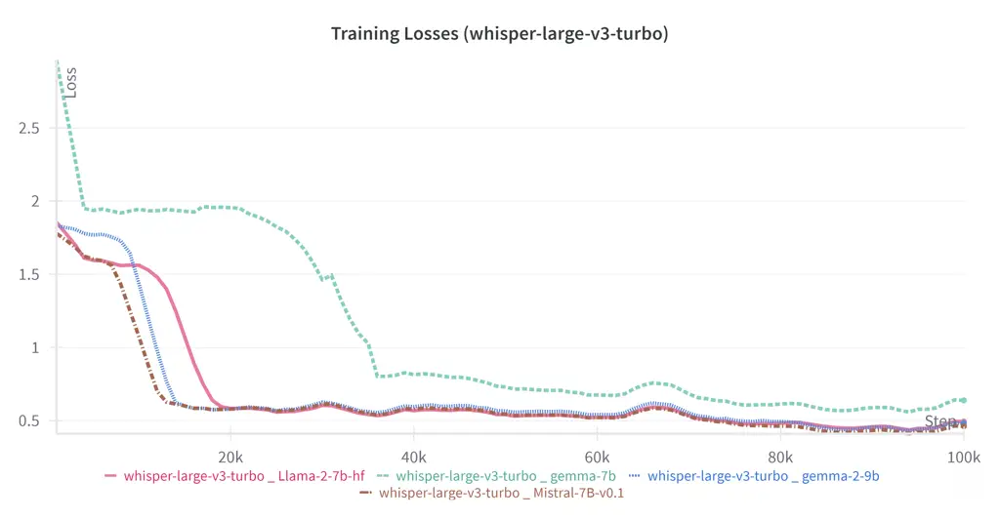

# End-to-end Automatic Speech Recognition and Speech Translation: Integration of Speech Foundational Models and LLMs

Nam Luu    Ondřej Bojar Affiliation: Charles University Affiliation:
Faculty of Mathematics and Physics Affiliation: Institute of Formal and
Applied Linguistics Email: [{luu,bojar}@ufal.mff.cuni.cz](mailto:)

###### Abstract

Speech Translation (ST) is a machine translation task that involves
converting speech signals from one language to the corresponding text in
another language; this task has two different approaches, namely the
traditional _cascade_ and the more recent _end-to-end_. This paper
explores a combined end-to-end architecture of pre-trained speech
encoders and Large Language Models (LLMs) for performing both Automatic
Speech Recognition (ASR) and ST simultaneously. Experiments with the
English-to-German language pair show that our best model not only can
achieve better translation results than SeamlessM4T (Communication et
al., 2023), a large foundational end-to-end, multi-modal translation
model, but can also match the performance of a cascaded system with
Whisper (Radford et al., 2022) and NLLB (Team et al., 2022), with up to
a score gain of 8% in $`\text{COMET}^{\text{DA}}_{22}`$ metric.

## 1 Introduction

End-to-end Speech Translation is a growing research direction that aims
to ignore the intermediate ASR step to directly translate the audio
input into its corresponding text in another language. This approach
simplifies the overall architecture, which has been shown to match the
performance of the cascaded counterpart (Bérard et al., 2018; Liu et
al., 2019; Gaido et al., 2020).

Large Language Models (LLMs) have demonstrated their emergent
capabilities on a large number of complex natural language tasks,
including machine translation (Minaee et al., 2024; Zhang et al., 2024;
Zhao et al., 2023; Naveed et al., 2024). With the ever-improving
potential of LLMs, researchers have been trying to integrate different
components used for other modalities, in order to extend their abilities
to go beyond text-only tasks (Li et al., 2023a; Gao et al., 2023; Liu et
al., 2023; Li et al., 2023b; Zhang et al., 2023).

Motivated by recent contributions in speech representation learning and
LLMs, we aim to investigate an end-to-end architecture that
simultaneously performs both ASR and ST. This architecture combines the
high-quality audio representation from the pre-trained acoustic models
with the excellent performance of LLMs to serve as an end-to-end speech
translation system, while still having the ability to transcribe from
the audio signal. Our proposed model, after being fine-tuned with the
Quantized Low-Rank Adaptation (QLoRA; Dettmers et al., 2023) technique,
achieves a robust translation performance, comparable to a cascaded
system, which is still a state-of-the-art approach for this task.

The paper is structured as follows:

- •
  Section 2 describes the details of the pipeline, along with the
  dataset used for training and evaluation.
- •
  Section 3 provides the ASR and ST evaluation results of the model in
  different public test sets, and compares them to some baselines from
  out-of-the-box models.
- •
  Section 4 proposes possible directions to improve the architecture.

## 2 Methods and Dataset

### 2.1 Architecture

The overall architecture is illustrated in Figure 1. For each training
sample, given the speech signal, its corresponding transcript, and the
translated text, the speech hidden features are obtained using a speech
encoder, including HuBERT (Hsu et al., 2021) and Whisper encoder
(Radford et al., 2022).

Figure 1: The overall architecture includes a frozen speech encoder
component, an adapter, and a fine-tuned LLM. The adapter can be frozen
or trainable depending on the adapter type. Red arrows denote the usage
of tokens during training, and blue arrows indicate tokens generated
during inference; while black arrows represent the prompt fed to the
LLM.

Next, the speech features are fed to a Projection layer, in order to
convert the feature dimension to match the LLM’s embedding dimension.
The resulting speech embeddings are subsequently given to the LLM as the
prompt for it to generate the corresponding transcription and the
translated text simultaneously. The LLM is then fine-tuned in the
next-token-prediction fashion.

### 2.2 Speech Encoder

We adopted HuBERT (Hsu et al., 2021) and Whisper (Radford et al., 2022)
as the speech encoders, utilizing their capability of extracting
high-quality representation from audio data. We used the
hubert-large-ls960-ft variation, which was trained on 60,000 hours of
data from the LibriLight (Kahn et al., 2020) corpus, then fine-tuned on
960 hours of data from the LibriSpeech (Panayotov et al., 2015a) corpus.
For Whisper-based models, we only used the encoder part of the
pre-trained whisper-large-v3-turbo to extract the audio hidden features.

### 2.3 Length Adapter

Because the length of the speech feature sequence can be longer than the
supported length of the LLM, it is more favorable to shorten it
beforehand.

For HuBERT-based models, we followed the work of Gaido et al. (2021),
and compressed the feature sequence by taking an average of vectors
whose repeated labels were obtained from the followed Connectionist
Temporal Classification (CTC) layer. Wu et al. (2023) illustrated that
speech feature sequence compression with CTC gave better results than
the traditional collapsing approach with convolution layers in the
speech translation task. Hence, in our pipeline, from the obtained
labels predicted by CTC, we merged the vectors with repeating labels by
averaging their corresponding values.

While for Whisper-based models, a convolution-based downsampling layer
with a kernel size of 5 and a stride of 5 is used to reduce the length
of the speech feature sequence. The details of both length adapters are
illustrated in Figure 2.

((a)) CTC collapse

((b)) Convolution

Figure 2: Details of different adapters

### 2.4 Projection Layer

For the Projection layer, we used only one simple feed-forward layer to
map from the encoder’s hidden size to the corresponding LLM’s hidden
size. This layer ensures the resulting speech representation is well
integrated into the LLM’s embedding space, giving it enough information
for the downstream task.

### 2.5 LLMs

We experimented with four different pre-trained LLMs available on
HuggingFace, namely _Gemma 7B_ (gemma-7b), _Gemma 2 9B_ (gemma-2-9b),
_Llama 2 7B_ (Llama-2-7b-hf), and _Mistral 7B v0.1_ (Mistral-7B-v0.1).
Details about each variation are described in Table 1.

| Encoder      | Decoder         | Adapter         |
| ------------ | --------------- | --------------- |
| HuBERT       | Gemma 7B        | CTC collapse    |
|              | Gemma 2 9B      |                 |
|              | Llama 2 7B      |                 |
|              | Mistral 7B v0.1 |                 |
| Whisper enc. | Gemma 7B        | 5x5 Convolution |
|              | Gemma 2 9B      |                 |
|              | Llama 2 7B      |                 |
|              | Mistral 7B v0.1 |                 |

Table 1: Details of each model, with its corresponding Encoder and
Decoder components

### 2.6 Dataset

All models were trained using the MuST-C dataset (Cattoni et al., 2021),
a large multilingual corpus built from English TED Talks, which contains
the audio data, the English transcription of such audio, with its
translation in multiple languages. In specific, we used the
English-to-German subset from version 1.0 of the dataset, with
approximately 400 hours of audio data.

For evaluation, MuST-C also provides two public test sets, both named
tst-COMMON in version 2.0 and 3.0. We also used the test sets from the
Offline Track of IWSLT’21 and ’22. In addition, to evaluate ASR
performance, we used two test sets from the LibriSpeech (Panayotov et
al., 2015b) dataset, namely test-clean and test-other, both of which are
the standard datasets for this task. As all models can perform both ASR
and ST simultaneously, evaluation results for both tasks are described
in Sections 3.2 and 3.3, respectively.

## 3 Evaluation

### 3.1 Metrics and Tools

For the Offline Speech Translation task, we evaluated all models using
standard metrics, namely BLEU (Papineni et al., 2002),
$`\text{COMET}^{\text{DA}}_{22}`$ (Rei et al., 2022a),¹¹ 1
[https://huggingface.co/Unbabel/wmt22-comet-da](https://huggingface.co/Unbabel/wmt22-comet-da)
and $`\text{COMET}^{\text{KIWI-DA}}_{22}`$ (Rei et al., 2022b).²² 2
[https://huggingface.co/Unbabel/wmt22-cometkiwi-da](https://huggingface.co/Unbabel/wmt22-cometkiwi-da)
For the Automatic Speech Recognition Task, we used WER, the standard
metric for speech recognition.

For the evaluation purpose, we used the SLTev (Ansari et al., 2021)
library, because it supports both MT and ASR evaluation in one package,
using sacreBLEU (Post, 2018) to calculate BLEU score. However, since
SLTev does not report any COMET-family metrics, we had to change the
structure of the sentence with mwerSegmenter,³³ 3
[https://www-i6.informatik.rwth-aachen.de/web/Software/mwerSegmenter.tar.gz](https://www-i6.informatik.rwth-aachen.de/web/Software/mwerSegmenter.tar.gz)
to automatically resegment the models’ output according to the
reference, before evaluating with the unbabel-comet package. The
evaluation was done using python-3.11.5, SLTev-1.2.3, and
unbabel-comet-2.2.2.

We compared our architecture with two out-of-the-box baselines: a
cascaded pipeline of Whisper (whisper-large-v3-turbo; Radford et al., 2022) producing the transcript and NLLB (nllb-200-3.3B; Team et al., 2022) translating the transcript, along with SeamlessM4T
(seamless-m4t-v2-large; Communication et al., 2023) - an end-to-end,
multi-modal translation model.

### 3.2 ASR Results

Table 2 details the ASR evaluation results against the four test sets.
We reported the WER score after applying the “LPW” pre-processing
strategy available in SLTev, which first lowercased every character,
removed all punctuation, then used the built-in mwerSegmenter tool to
resegment the output transcripts. Due to some bugs when processing the
IWSLT’21 test set (tst2021), mwerSegmenter failed to run during
evaluation, hence we could not obtain the results. It can be seen that
models with Gemma 2 9B as the decoder have the best result among the
four LLMs, albeit still lagging behind the performance of Whisper.

|                                |                    |                    |                     |                    |                    |
| ------------------------------ | ------------------ | ------------------ | ------------------- | ------------------ | ------------------ |
| Model                          | MuST-C             |                    | IWSLT               | LibriSpeech        |                    |
|                                | tst-COMMON v2      | tst-COMMON v3      | tst2022             | test-clean         | test-other         |
| Whisper                        | $`\mathbf{6.7\%}`$ | $`\mathbf{7.7\%}`$ | $`\mathbf{11.8\%}`$ | $`\mathbf{4.1\%}`$ | $`\mathbf{7.2\%}`$ |
| HuBERT + Gemma 2 9B            | $`11.1`$%          | $`12.5`$%          | $`21.9`$%           | $`8.4`$%           | $`13.1`$%          |
| HuBERT + Gemma 7B              | $`12.9`$%          | $`14.5`$%          | $`30.7`$%           | $`11.7`$%          | $`17.4`$%          |
| HuBERT + Llama 2 7B            | $`11.1`$%          | $`12.6`$%          | $`22.9`$%           | $`8.7`$%           | $`13.2`$%          |
| HuBERT + Mistral 7B v0.1       | $`11.1`$%          | $`12.4`$%          | $`22.9`$%           | $`8.5`$%           | $`13.3`$%          |
| Whisper enc. + Gemma 2 9B      | $`8.2`$%           | $`8.1`$%           | $`22.6`$%           | $`8.0`$%           | $`13.7`$%          |
| Whisper enc. + Gemma 7B        | $`8.6`$%           | $`10.4`$%          | $`25.1`$%           | $`11.7`$%          | $`18.8`$%          |
| Whisper enc. + Llama 2 7B      | $`10.5`$%          | $`12.8`$%          | $`22.5`$%           | $`9.2`$%           | $`14.8`$%          |
| Whisper enc. + Mistral 7B v0.1 | $`9.0`$%           | $`10.2`$%          | $`23.7`$%           | $`8.2`$%           | $`14.5`$%          |

Table 2: ASR evaluation results (WER)

### 3.3 Offline ST Results

Tables 3 and 4 report the BLEU and COMET-family scores, respectively, on
the four test sets. For evaluating with BLEU, we included both
docAsWhole score, which concatenated all reference segments and
candidate complete segments as two documents, and mwerSegmenter score,
which resegments complete candidate segments according to reference
segments to minimize WER. Similar to Section 3.2, mwerSegmenter scores
for IWSLT’21 test set could not be obtained, hence we did not include
them.

Similarly, the models with Gemma 2 9B still have the best evaluation
score among the four fine-tuned LLMs. In combination with the Whisper
encoder, it even surpassed the performance of the cascaded system of
Whisper + NLLB in most of the test sets and metrics.

| Model                          | MuST-C                                  |                                         | IWSLT                  |                                         |
| ------------------------------ | --------------------------------------- | --------------------------------------- | ---------------------- | --------------------------------------- |
|                                | tst-COMMON v2                           | tst-COMMON v3                           | tst2021                | tst2022                                 |
| Cascaded Whisper + NLLB        | $`39.84`$ / $`31.06`$                   | $`40.30`$ / $`31.60`$                   | $`\mathbf{43.84}`$ / - | $`\mathbf{41.86}`$ / $`\mathbf{30.48}`$ |
| SeamlessM4T                    | $`32.62`$ / $`22.98`$                   | $`33.36`$ / $`23.59`$                   | $`35.97`$ / -          | $`34.08`$ / $`22.68`$                   |
| HuBERT + Gemma 2 9B            | $`37.98`$ / $`28.15`$                   | $`37.50`$ / $`27.59`$                   | $`37.59`$ / -          | $`37.04`$ / $`25.86`$                   |
| HuBERT + Gemma 7B              | $`36.20`$ / $`25.89`$                   | $`36.24`$ / $`26.02`$                   | $`33.00`$ / -          | $`34.27`$ / $`22.98`$                   |
| HuBERT + Llama 2 7B            | $`36.52`$ / $`26.42`$                   | $`35.93`$ / $`25.89`$                   | $`35.66`$ / -          | $`35.13`$ / $`23.88`$                   |
| HuBERT + Mistral 7B v0.1       | $`36.91`$ / $`26.90`$                   | $`36.94`$ / $`27.05`$                   | $`36.29`$ / -          | $`36.09`$ / $`25.07`$                   |
| Whisper enc. + Gemma 2 9B      | $`\mathbf{41.33}`$ / $`\mathbf{31.98}`$ | $`\mathbf{41.16}`$ / $`\mathbf{31.72}`$ | $`40.76`$ / -          | $`39.64`$ / $`29.18`$                   |
| Whisper enc. + Gemma 7B        | $`38.62`$ / $`28.55`$                   | $`38.81`$ / $`28.81`$                   | $`37.02`$ / -          | $`37.58`$ / $`26.29`$                   |
| Whisper enc. + Llama 2 7B      | $`38.95`$ / $`29.17`$                   | $`38.79`$ / $`28.94`$                   | $`37.18`$ / -          | $`36.94`$ / $`26.18`$                   |
| Whisper enc. + Mistral 7B v0.1 | $`39.52`$ / $`30.03`$                   | $`39.28`$ / $`29.59`$                   | $`38.60`$ / -          | $`37.55`$ / $`26.64`$                   |

Table 3: Offline ST en2de BLEU results, with both docAsWhole and
mwerSegmenter scores, respectively

| Model                          | MuST-C                                  |                                         | IWSLT                                   |                                         |
| ------------------------------ | --------------------------------------- | --------------------------------------- | --------------------------------------- | --------------------------------------- |
|                                | tst-COMMON v2                           | tst-COMMON v3                           | tst2021                                 | tst2022                                 |
| Cascaded Whisper + NLLB        | $`83.00`$ / $`79.98`$                   | $`82.49`$ / $`80.53`$                   | $`64.47`$ / $`58.23`$                   | $`65.32`$ / $`59.27`$                   |
| SeamlessM4T                    | $`76.72`$ / $`73.49`$                   | $`76.42`$ / $`74.03`$                   | $`59.63`$ / $`53.92`$                   | $`60.34`$ / $`54.93`$                   |
| HuBERT + Gemma 2 9B            | $`80.98`$ / $`77.42`$                   | $`80.17`$ / $`77.45`$                   | $`67.63`$ / $`60.34`$                   | $`67.11`$ / $`59.68`$                   |
| HuBERT + Gemma 7B              | $`79.64`$ / $`75.52`$                   | $`78.85`$ / $`75.53`$                   | $`65.22`$ / $`57.51`$                   | $`64.77`$ / $`57.23`$                   |
| HuBERT + Llama 2 7B            | $`79.88`$ / $`76.30`$                   | $`79.08`$ / $`76.32`$                   | $`66.54`$ / $`59.27`$                   | $`65.70`$ / $`58.70`$                   |
| HuBERT + Mistral 7B v0.1       | $`80.12`$ / $`76.92`$                   | $`79.45`$ / $`76.92`$                   | $`66.97`$ / $`59.73`$                   | $`66.62`$ / $`59.85`$                   |
| Whisper enc. + Gemma 2 9B      | $`\mathbf{84.22}`$ / $`\mathbf{81.15}`$ | $`\mathbf{83.65}`$ / $`\mathbf{81.29}`$ | $`\mathbf{70.51}`$ / $`\mathbf{62.80}`$ | $`\mathbf{70.34}`$ / $`\mathbf{63.27}`$ |
| Whisper enc. + Gemma 7B        | $`82.55`$ / $`79.69`$                   | $`82.15`$ / $`79.88`$                   | $`67.63`$ / $`60.06`$                   | $`68.24`$ / $`60.91`$                   |
| Whisper enc. + Llama 2 7B      | $`82.84`$ / $`80.09`$                   | $`82.14`$ / $`80.05`$                   | $`68.82`$ / $`61.82`$                   | $`68.64`$ / $`61.91`$                   |
| Whisper enc. + Mistral 7B v0.1 | $`83.13`$ / $`80.24`$                   | $`82.43`$ / $`80.37`$                   | $`69.73`$ / $`62.40`$                   | $`68.86`$ / $`61.79`$                   |

Table 4: Offline ST en2de $`\text{COMET}^{\text{DA}}_{22}`$ and
$`\text{COMET}^{\text{KIWI-DA}}_{22}`$ results, respectively

## 4 Future work

To date, we could only conduct experiments for the English-to-German
direction; hence, in the future, we will expand our experiments to more
language pairs and directions. In addition, we have some ideas to
improve the pipeline:

- •
  Try replacing the CTC collapsing procedure with a length adapter of
  convolution layers for the HuBERT encoder. Try other modal adapter
  methods, like Q-Former.
- •
  Experiment with smaller variants of the LLMs for faster training and
  inference, while retaining the robustness in translation, by
  distilling knowledge from fine-tuned systems.
- •
  Integrate some reinforcement learning techniques into the pipeline for
  better performance.

## 5 Conclusion

In this paper, we leveraged pre-trained speech encoders and LLMs and
connected them to become an end-to-end architecture for speech
translation. The overall result is expected: for the English-to-German
direction, even though our models performed better than the end-to-end
SeamlessM4T model all of the time, there was still a gap compared to the
performance of the cascaded Whisper + NLLB pipeline. It suggests that
cascaded models are still the state-of-the-art approach in the speech
translation task; this is also confirmed according to Ahmad et al.
(2024), in which all systems submitted to the Offline Track of IWSLT’24
were cascaded systems.

## 6 Limitations

The first problem we found was a limitation involving the sparse amount
of parallel training data. This has been a notable issue for text
translation, but for speech data, it is an even bigger concern,
especially for low-resource languages. The two languages in our
experiments, English and German, are considered high-resource languages,
but the dataset only contains approximately 400 hours of audio.

Second, considering the size of the LLMs, our models were inferior
regarding inference speed, compared to the two baselines. Our models
also managed to surpass the performance of the cascaded system in the
translation task; however, the differences were not too substantial. In
addition, despite being a much smaller model, Whisper alone still excels
at speech recognition. This raises a question: "Can end-to-end speech
translation systems be smaller in size, while still keeping the
robustness in translation, especially for the rising need to be used in
mobile devices?"

## 7 Acknowledgment

Computational resources were provided by the e-INFRA CZ project
(ID:90254), supported by the Ministry of Education, Youth and Sports of
the Czech Republic.

Nam Luu has been supported by the Erasmus Mundus program in Language and
Communication Technologies (LCT).

Ondřej Bojar has received funding from the Project OP JAK Mezisektorová
spolupráce Nr. CZ.02.01.01/00/23_020/0008518 named “Jazykověda, umělá
inteligence a jazykové a řečové technologie: od výzkumu k aplikacím.”

## References

- Ahmad et al. (2024) Ibrahim Said Ahmad, Antonios Anastasopoulos,
  Ondřej Bojar, Claudia Borg, Marine Carpuat, Roldano Cattoni, Mauro
  Cettolo, William Chen, Qianqian Dong, Marcello Federico, Barry Haddow,
  Dávid Javorský, Mateusz Krubiński, Tsz Kim Lam, Xutai Ma, Prashant
  Mathur, Evgeny Matusov, Chandresh Maurya, John McCrae, Kenton Murray,
  Satoshi Nakamura, Matteo Negri, Jan Niehues, Xing Niu, Atul Kr. Ojha,
  John Ortega, Sara Papi, Peter Polák, Adam Pospíšil, Pavel Pecina,
  Elizabeth Salesky, Nivedita Sethiya, Balaram Sarkar, Jiatong Shi,
  Claytone Sikasote, Matthias Sperber, Sebastian Stüker, Katsuhito
  Sudoh, Brian Thompson, Alex Waibel, Shinji Watanabe, Patrick Wilken,
  Petr Zemánek, and Rodolfo Zevallos. 2024. [FINDINGS OF THE IWSLT 2024
  EVALUATION CAMPAIGN](https://aclanthology.org/2024.iwslt-1.1). In
  _Proceedings of the 21st International Conference on Spoken Language
  Translation (IWSLT 2024)_, pages 1–11, Bangkok, Thailand (in-person
  and online). Association for Computational Linguistics.
- Ansari et al. (2021) Ebrahim Ansari, Ondřej Bojar, Barry Haddow, and
  Mohammad Mahmoudi. 2021. [SLTEV: Comprehensive Evaluation of Spoken
  Language Translation](https://doi.org/10.18653/v1/2021.eacl-demos.9).
  In _Proceedings of the 16th Conference of the European Chapter of the
  Association for Computational Linguistics: System Demonstrations_,
  pages 71–79, Online. Association for Computational Linguistics.
- Bérard et al. (2018) Alexandre Bérard, Laurent Besacier, Ali Can
  Kocabiyikoglu, and Olivier Pietquin. 2018. [End-to-End Automatic
  Speech Translation of Audiobooks](http://arxiv.org/abs/1802.04200).
- Cattoni et al. (2021) Roldano Cattoni, Mattia Antonino Di Gangi, Luisa
  Bentivogli, Matteo Negri, and Marco Turchi. 2021. [MuST-C: A
  multilingual corpus for end-to-end speech
  translation](https://doi.org/https://doi.org/10.1016/j.csl.2020.101155).
  _Computer Speech & Language_, 66:101155.
- Communication et al. (2023) Seamless Communication, Loïc Barrault,
  Yu-An Chung, Mariano Cora Meglioli, David Dale, Ning Dong,
  Paul-Ambroise Duquenne, Hady Elsahar, Hongyu Gong, Kevin Heffernan,
  John Hoffman, Christopher Klaiber, Pengwei Li, Daniel Licht, Jean
  Maillard, Alice Rakotoarison, Kaushik Ram Sadagopan, Guillaume Wenzek,
  Ethan Ye, Bapi Akula, Peng-Jen Chen, Naji El Hachem, Brian Ellis,
  Gabriel Mejia Gonzalez, Justin Haaheim, Prangthip Hansanti, Russ
  Howes, Bernie Huang, Min-Jae Hwang, Hirofumi Inaguma, Somya Jain,
  Elahe Kalbassi, Amanda Kallet, Ilia Kulikov, Janice Lam, Daniel Li,
  Xutai Ma, Ruslan Mavlyutov, Benjamin Peloquin, Mohamed Ramadan,
  Abinesh Ramakrishnan, Anna Sun, Kevin Tran, Tuan Tran, Igor Tufanov,
  Vish Vogeti, Carleigh Wood, Yilin Yang, Bokai Yu, Pierre Andrews, Can
  Balioglu, Marta R. Costa-jussà, Onur Celebi, Maha Elbayad, Cynthia
  Gao, Francisco Guzmán, Justine Kao, Ann Lee, Alexandre Mourachko, Juan
  Pino, Sravya Popuri, Christophe Ropers, Safiyyah Saleem, Holger
  Schwenk, Paden Tomasello, Changhan Wang, Jeff Wang, and Skyler
  Wang. 2023. [SeamlessM4T: Massively Multilingual & Multimodal Machine
  Translation](http://arxiv.org/abs/2308.11596).
- Dettmers et al. (2023) Tim Dettmers, Artidoro Pagnoni, Ari Holtzman,
  and Luke Zettlemoyer. 2023. [QLoRA: Efficient Finetuning of Quantized
  LLMs](http://arxiv.org/abs/2305.14314).
- Gaido et al. (2021) Marco Gaido, Mauro Cettolo, Matteo Negri, and
  Marco Turchi. 2021. [CTC-based Compression for Direct Speech
  Translation](http://arxiv.org/abs/2102.01578).
- Gaido et al. (2020) Marco Gaido, Mattia Antonino Di Gangi, Matteo
  Negri, and Marco Turchi. 2020. [End-to-End Speech-Translation with
  Knowledge Distillation:
  FBK@IWSLT2020](http://arxiv.org/abs/2006.02965).
- Gao et al. (2023) Peng Gao, Jiaming Han, Renrui Zhang, Ziyi Lin,
  Shijie Geng, Aojun Zhou, Wei Zhang, Pan Lu, Conghui He, Xiangyu Yue,
  Hongsheng Li, and Yu Qiao. 2023. [LLaMA-Adapter V2:
  Parameter-Efficient Visual Instruction
  Model](http://arxiv.org/abs/2304.15010).
- Hsu et al. (2021) Wei-Ning Hsu, Benjamin Bolte, Yao-Hung Hubert Tsai,
  Kushal Lakhotia, Ruslan Salakhutdinov, and Abdelrahman Mohamed. 2021.
  [HuBERT: Self-Supervised Speech Representation Learning by Masked
  Prediction of Hidden Units](http://arxiv.org/abs/2106.07447).
- Kahn et al. (2020) J. Kahn, M. Riviere, W. Zheng, E. Kharitonov, Q.
  Xu, P.E. Mazare, J. Karadayi, V. Liptchinsky, R. Collobert, C.
  Fuegen, T. Likhomanenko, G. Synnaeve, A. Joulin, A. Mohamed, and E.
  Dupoux. 2020. [Libri-Light: A Benchmark for ASR with Limited or No
  Supervision](https://doi.org/10.1109/icassp40776.2020.9052942). In
  _ICASSP 2020 - 2020 IEEE International Conference on Acoustics, Speech
  and Signal Processing (ICASSP)_. IEEE.
- Li et al. (2023a) Junnan Li, Dongxu Li, Silvio Savarese, and Steven
  Hoi. 2023a. [BLIP-2: Bootstrapping Language-Image Pre-training with
  Frozen Image Encoders and Large Language
  Models](http://arxiv.org/abs/2301.12597).
- Li et al. (2023b) Yuang Li, Yu Wu, Jinyu Li, and Shujie Liu. 2023b.
  [Prompting Large Language Models for Zero-Shot Domain Adaptation in
  Speech Recognition](http://arxiv.org/abs/2306.16007).
- Liu et al. (2023) Haotian Liu, Chunyuan Li, Qingyang Wu, and Yong Jae
  Lee. 2023. [Visual Instruction
  Tuning](http://arxiv.org/abs/2304.08485).
- Liu et al. (2019) Yuchen Liu, Hao Xiong, Zhongjun He, Jiajun Zhang,
  Hua Wu, Haifeng Wang, and Chengqing Zong. 2019. [End-to-End Speech
  Translation with Knowledge
  Distillation](http://arxiv.org/abs/1904.08075).
- Loshchilov and Hutter (2017) Ilya Loshchilov and Frank Hutter. 2017.
  [SGDR: Stochastic Gradient Descent with Warm
  Restarts](http://arxiv.org/abs/1608.03983).
- Loshchilov and Hutter (2019) Ilya Loshchilov and Frank Hutter. 2019.
  [Decoupled Weight Decay
  Regularization](https://doi.org/10.48550/arXiv.1711.05101).
  ArXiv:1711.05101 \[cs, math\].
- Minaee et al. (2024) Shervin Minaee, Tomas Mikolov, Narjes Nikzad,
  Meysam Chenaghlu, Richard Socher, Xavier Amatriain, and Jianfeng
  Gao. 2024. [Large Language Models: A
  Survey](http://arxiv.org/abs/2402.06196).
- Naveed et al. (2024) Humza Naveed, Asad Ullah Khan, Shi Qiu, Muhammad
  Saqib, Saeed Anwar, Muhammad Usman, Naveed Akhtar, Nick Barnes, and
  Ajmal Mian. 2024. [A Comprehensive Overview of Large Language
  Models](http://arxiv.org/abs/2307.06435).
- Panayotov et al. (2015a) Vassil Panayotov, Guoguo Chen, Daniel Povey,
  and Sanjeev Khudanpur. 2015a. [LibriSpeech: An ASR corpus based on
  public domain audio
  books](https://doi.org/10.1109/ICASSP.2015.7178964). In _2015 IEEE
  International Conference on Acoustics, Speech and Signal Processing
  (ICASSP)_, pages 5206–5210.
- Panayotov et al. (2015b) Vassil Panayotov, Guoguo Chen, Daniel Povey,
  and Sanjeev Khudanpur. 2015b. [Librispeech: An asr corpus based on
  public domain audio
  books](https://doi.org/10.1109/ICASSP.2015.7178964). In _2015 IEEE
  International Conference on Acoustics, Speech and Signal Processing
  (ICASSP)_, pages 5206–5210.
- Papineni et al. (2002) Kishore Papineni, Salim Roukos, Todd Ward, and
  Wei-Jing Zhu. 2002. [BLEU: a method for automatic evaluation of
  machine translation](https://doi.org/10.3115/1073083.1073135). In
  _Proceedings of the 40th Annual Meeting on Association for
  Computational Linguistics_, ACL ’02, page 311–318, USA. Association
  for Computational Linguistics.
- Post (2018) Matt Post. 2018. [A Call for Clarity in Reporting BLEU
  Scores](http://arxiv.org/abs/1804.08771).
- Radford et al. (2022) Alec Radford, Jong Wook Kim, Tao Xu, Greg
  Brockman, Christine McLeavey, and Ilya Sutskever. 2022. [Robust Speech
  Recognition via Large-Scale Weak
  Supervision](http://arxiv.org/abs/2212.04356).
- Rei et al. (2022a) Ricardo Rei, José G. C. de Souza, Duarte Alves,
  Chrysoula Zerva, Ana C Farinha, Taisiya Glushkova, Alon Lavie, Luisa
  Coheur, and André F. T. Martins. 2022a. [COMET-22: Unbabel-IST 2022
  Submission for the Metrics Shared
  Task](https://aclanthology.org/2022.wmt-1.52). In _Proceedings of the
  Seventh Conference on Machine Translation (WMT)_, pages 578–585, Abu
  Dhabi, United Arab Emirates (Hybrid). Association for Computational
  Linguistics.
- Rei et al. (2022b) Ricardo Rei, Marcos Treviso, Nuno M. Guerreiro,
  Chrysoula Zerva, Ana C. Farinha, Christine Maroti, José G. C. de
  Souza, Taisiya Glushkova, Duarte M. Alves, Alon Lavie, Luisa Coheur,
  and André F. T. Martins. 2022b. [CometKiwi: IST-Unbabel 2022
  Submission for the Quality Estimation Shared
  Task](http://arxiv.org/abs/2209.06243).
- Team et al. (2022) NLLB Team, Marta R. Costa-jussà, James Cross, Onur
  Çelebi, Maha Elbayad, Kenneth Heafield, Kevin Heffernan, Elahe
  Kalbassi, Janice Lam, Daniel Licht, Jean Maillard, Anna Sun, Skyler
  Wang, Guillaume Wenzek, Al Youngblood, Bapi Akula, Loic Barrault,
  Gabriel Mejia Gonzalez, Prangthip Hansanti, John Hoffman, Semarley
  Jarrett, Kaushik Ram Sadagopan, Dirk Rowe, Shannon Spruit, Chau Tran,
  Pierre Andrews, Necip Fazil Ayan, Shruti Bhosale, Sergey Edunov,
  Angela Fan, Cynthia Gao, Vedanuj Goswami, Francisco Guzmán, Philipp
  Koehn, Alexandre Mourachko, Christophe Ropers, Safiyyah Saleem, Holger
  Schwenk, and Jeff Wang. 2022. [No Language Left Behind: Scaling
  Human-Centered Machine Translation](http://arxiv.org/abs/2207.04672).
- Wu et al. (2023) Jian Wu, Yashesh Gaur, Zhuo Chen, Long Zhou, Yimeng
  Zhu, Tianrui Wang, Jinyu Li, Shujie Liu, Bo Ren, Linquan Liu, and Yu
  Wu. 2023. [On decoder-only architecture for speech-to-text and large
  language model integration](http://arxiv.org/abs/2307.03917).
- Zhang et al. (2023) Dong Zhang, Shimin Li, Xin Zhang, Jun Zhan, Pengyu
  Wang, Yaqian Zhou, and Xipeng Qiu. 2023. [SpeechGPT: Empowering Large
  Language Models with Intrinsic Cross-Modal Conversational
  Abilities](http://arxiv.org/abs/2305.11000).
- Zhang et al. (2024) Shengyu Zhang, Linfeng Dong, Xiaoya Li, Sen Zhang,
  Xiaofei Sun, Shuhe Wang, Jiwei Li, Runyi Hu, Tianwei Zhang, Fei Wu,
  and Guoyin Wang. 2024. [Instruction Tuning for Large Language Models:
  A Survey](http://arxiv.org/abs/2308.10792).
- Zhao et al. (2023) Wayne Xin Zhao, Kun Zhou, Junyi Li, Tianyi Tang,
  Xiaolei Wang, Yupeng Hou, Yingqian Min, Beichen Zhang, Junjie Zhang,
  Zican Dong, Yifan Du, Chen Yang, Yushuo Chen, Zhipeng Chen, Jinhao
  Jiang, Ruiyang Ren, Yifan Li, Xinyu Tang, Zikang Liu, Peiyu Liu,
  Jian-Yun Nie, and Ji-Rong Wen. 2023. [A Survey of Large Language
  Models](http://arxiv.org/abs/2303.18223).

## Appendix A Training and Inference Details

All models were fine-tuned using 4-bit QLoRA (Dettmers et al., 2023)
adapters in bfloat16 precision, with the following LoRA parameters: rank
of $`r=8`$, alpha of $`\alpha=8`$. For the models with HuBERT as the
encoder, because of the manual CTC collapsing procedure, we could only
process one example at a time, hence the batch size was set to $`1`$;
while for those with Whisper, the batch size was set to $`2`$. Other
training hyperparameters included the learning rate of $`1e-4`$ with
$`10`$ warmup steps, and an AdamW optimizer Loshchilov and Hutter (2019)
with a cosine scheduler Loshchilov and Hutter (2017). All HuBERT-encoder
models were trained for $`500,000`$ steps, while Whisper-encoder models
were trained for $`100,000`$ steps.

During training, we added three new tokens to feed into the LLMs, namely
“\<\>audio\<\>”, “\<\>transcript\<\>”, and “\<\>translation\<\>”, which
acted as separators between the extracted audio features, the ASR
transcript, and the corresponding translation, respectively. For each
sample, the training data is formatted as follows: “\<bos\>
\<\>audio\<\> {audio features} \<\>transcript\<\> {transcript}
\<\>translation\<\> {translation} \<eos\>”. The cross-entropy loss was
computed only for the tokens following “\<\>transcript\<\>”. Each
model’s training loss details are illustrated in Figures 3(a) and 3(b).

((a)) With HuBERT encoder

((b)) With Whisper encoder

Figure 3: Training loss of models

During inference, for each audio data, the LLMs were prompted using the
following format: “\<bos\> \<\>audio\<\> {audio features}
\<\>transcript\<\>”, then generated the transcript and the corresponding
translated text in an auto-regressive manner. We performed inference
using the beam search algorithm, with a beam size of 2 for all models.
All evaluation results, are described in Sections 3.2 and 3.3.
