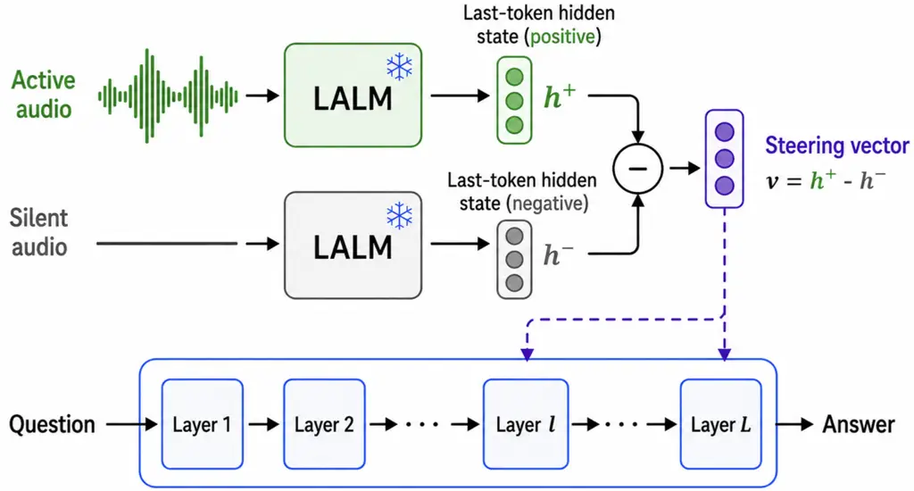
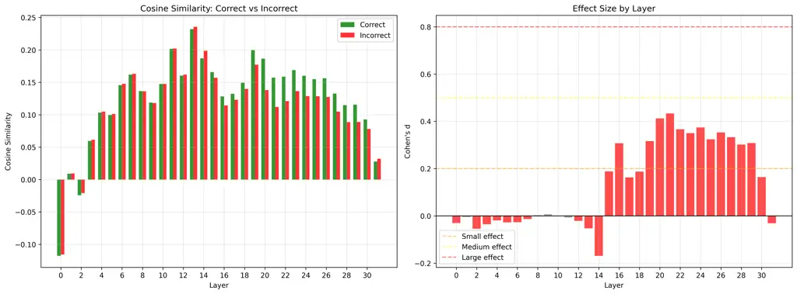
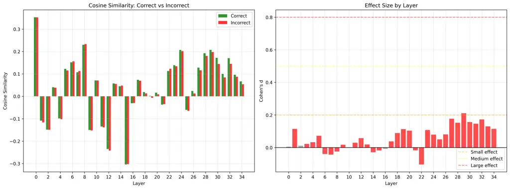

Lin Lee Lee

# Silence is Golden: Mitigating Hallucinations in Large Audio-Language Models via Layer-Weighted Vector Steering

Tsung-En    Kuan-Yi    Hung-Yi

###### Abstract

Large Audio-Language Models (LALMs) excel in Audio QA but often suffer
from hallucinations ungrounded in the audio. To our knowledge, we are
the first to propose applying vector steering to the audio domain to
mitigate this. Unlike text-based steering, our silence-anchored
contrastive approach steers the model away from hallucinations by
contrasting active audio against a silent baseline. Probing internal
states reveals a strong correlation between specific layer
representations and output correctness. Leveraging this, we introduce
Layer-Weighted Vector Steering (LWVS), a training-free intervention that
increases steering strength at influential layers. On the Audio
Hallucination QA dataset, LWVS significantly outperforms baselines,
boosting Recall on the Gemma model by 15.6% (53.4% to 69.0%). Crucially,
MMAU benchmark tests confirm LWVS preserves and even enhances general
audio understanding, achieving an 8% relative accuracy increase on the
Qwen model (54.8% to 59.2%).

###### keywords

Large audio-language models, Vector steering, Hallucination mitigation,
Model probing and interpretability

^(†)^(†)address: ¹ National Taiwan University, Taipei, Taiwan  
² Internship at ASUS Open Cloud Infrastructure Software Center, Taipei,
Taiwan  
³ NTU Artificial Intelligence Center of Research Excellence (NTU
AI-CoRE), Taipei, Taiwan ^(†)^(†)email: {b11901154, b10901091,
hungyilee}@ntu.edu.tw

## 1 Introduction

Large Audio-Language Models \[1, 2, 3, 4, 5, 6, 7\] have extended the
capabilities of LLMs to multimodal tasks like audio captioning and
question answering. Concurrently, specialized Speech Language Models
(SLMs) \[8, 9, 10, 11, 12, 13\] have significantly advanced discrete
speech modeling and spoken dialogue. However, both architectures
frequently suffer from hallucination, generating content ungrounded in
the audio input \[14\].

To address this, we draw inspiration from VISTA \[15\], which utilizes
activation steering to guide vision language model behavior. However,
applying steering vectors derived solely from text or methods that lack
audio context is suboptimal for LALMs. To effectively ground the model,
we introduce a modality-aware strategy. We construct a steering vector
that explicitly contrasts the active audio representation against a
silent audio clip of the same length. This forces the model to attend to
the presence of acoustic information, reducing the likelihood of
generating events that do not exist.

To determine the most effective intervention layers, we investigate the
internal mechanics of hallucination, drawing on established practices of
layer-wise analysis in speech models \[16, 17, 18\]. We probe the
model’s hidden states by calculating the cosine similarity between the
original hidden state and our steering vector for each layer. We then
compute Cohen’s $`d`$ effect size on these similarity scores to quantify
their relationship with output correctness. Our analysis, visualized in
Figure 2, reveals that later layers exhibit a significantly larger
positive effect size, indicating that a higher cosine similarity in
these layers strongly correlates with correct, grounded generation.

Leveraging these insights, we propose Layer-Weighted Vector Steering
(LWVS). Unlike uniform steering, LWVS applies an adaptive weight
schedule that amplifies intervention in the influential later layers
while reducing it in earlier layers. This design concentrates the
steering effect where it is most mechanically relevant.

Our main contributions are summarized as follows:

- •
  We propose a novel modality-aware vector steering method that utilizes
  silent audio of the same length to isolate acoustic information,
  distinguishing our approach from steering methods like VISTA \[15\]
  that use only text for negative instance.
- •
  We design a probing framework using cosine similarity and Cohen’s
  $`d`$ effect size to analyze internal model states. Our findings
  demonstrate that later layers have a disproportionately higher
  influence on output correctness.
- •
  Based on this layer-wise analysis, we propose Layer-Weighted Vector
  Steering (LWVS), a training-free intervention that adapts steering
  strength to influential layers, significantly mitigating hallucination
  while preserving general audio understanding capabilities.



Figure 1: Modality-Aware Vector Steering The steering vector is defined
as the contrast between the last-token hidden states of the residual
streams, computed by subtracting the representation of the negative
instance(silent audio) from that of the positive instance.

## 2 Related Work

Mitigating hallucinations in Large Language Models and Vision Langauge
Models remains a critical challenge \[19, 20\]. Conventional strategies,
such as fine-tuning on domain-specific corpora or employing
Retrieval-Augmented Generation (RAG) \[21\], often demand substantial
data annotation or complex retrieval infrastructure. In contrast, our
work explores inference-time intervention, offering a training-free and
computationally efficient alternative.

### 2.1 Activation Steering and VISTA

Activation steering \[22, 23\] involves modifying a model’s internal
states during inference to guide its behavior. This technique has been
successfully applied to LLMs to control stylistic attributes \[24\] or
to enhance truthfulness by identifying “truth directions” in activation
space \[25\].

Recently, VISTA \[15\] adapted this concept to Vision-Language Models
(VLMs). VISTA constructs a steering vector by contrasting the
activations of an image-text pair against a negative instance lacking
image tokens. By adding this vector, the model is steered to prioritize
visual context over language priors. However, VISTA typically applies a
uniform steering strength across all layers. We differentiate our work
by (1) extending this to the audio domain via a novel silence-based
contrast, and (2) showing uniform steering is suboptimal, as
hallucination influence is layer-dependent.

### 2.2 Hallucination in Large Audio Models

As Large Audio-Language Models (LALMs) proliferate, addressing their
tendency to hallucinate has become a priority. Recent studies have
characterized this phenomenon: \[26\] investigated audio hallucinations
in Video-LLAMA, while \[14\] categorized object hallucinations in LALMs.

Current mitigations generally rely on decoding-time interventions
\[27\]. For instance, Audio-Aware Decoding (AAD) \[28\] employs
contrastive decoding to penalize ungrounded tokens. While effective, AAD
is computationally expensive, requiring two forward passes per generated
token. In contrast, our proposed Layer-Weighted Vector Steering (LWVS)
computes the steering vector once and adds it directly to the hidden
states, incurring negligible latency while effectively mitigating
hallucination.

## 3 Methodology

In this section, we detail our approach to mitigating hallucination in
Large Audio-Language Models. We begin in Section 3.2 by addressing the
limitations of directly applying standard text-based steering to audio.
To overcome these shortcomings, we introduce a Modality-Aware Steering
Vector (MAVS), constructed by explicitly contrasting audio activations
against a silence audio with equal duration. Next, to determine the
optimal application of this vector, we probe the model’s internal states
in Section 3.1, identifying a significant layer-dependent correlation
between vector similarity and output correctness. Finally, leveraging
these empirical insights, we propose Layer-Weighted Vector Steering
(LWVS) in Section 3.3, a targeted intervention that adaptively scales
steering strength to maximize grounding.

### 3.1 Internal state analysis

To determine the optimal application of our steering vector, we
investigate how different layers contribute to the model’s ability to
distinguish between grounded and ungrounded content. We hypothesize that
not all layers are equally sensitive to the acoustic evidence captured
by our modality-aware vector (defined in Section 3.2).

To quantify this, we categorize model generations into two groups:
correct (grounded) and incorrect (hallucinated). For each group, we
compute the cosine similarity between the model’s internal hidden states
$`h_{l}`$ at layer $`l`$ and the steering vector $`v`$. As shown in the
left panels of Figure 2, we observe the distribution of these similarity
scores across layers.

To rigorously measure the separation between these two distributions, we
calculate Cohen’s $`d`$ effect size for each layer (right panels). A
higher effect size indicates a stronger distinction in the internal
representation between grounded and ungrounded states. Our results
reveal a consistent trend across both Qwen and Gemma models: while early
layers show negligible separation, the effect size increases
dramatically in the later layers.

This finding suggests that the model’s critical decision-making
regarding audio grounding occurs predominantly in the deeper layers.
These empirical insights directly motivate our Layer-Weighted Vector
Steering (LWVS) approach, which we detail in Section 3.3. Instead of
uniform application, interventions should be concentrated in these
high-influence layers to maximize efficacy.





Figure 2: Layer-wise analysis for Gemma and Qwen. Top-Left: Cosine
similarity of Qwen. Top-Right: Effect size of Qwen. Bottom-Left: Cosine
similarity of Gemma. Bottom-Right: Effect size of Gemma.

### 3.2 Modality-Aware Vector Steering

Standard steering approaches often rely on text-only contrasts, which
fail to capture the acoustic nature of audio hallucinations. To address
this, we introduce a Modality-Aware Steering Vector that explicitly
isolates acoustic information.

We define a positive instance $`X^{+}=(x_{a},x_{q})`$, consisting of the
input audio $`x_{a}`$ and the user query $`x_{q}`$. Correspondingly, we
construct a negative instance $`X^{-}=(x_{s},x_{q})`$, where $`x_{s}`$
is a silent audio clip of the same duration as $`x_{a}`$. Let
$`F_{l}(X)`$ denote the activation of the residual stream at the final
token index $`T`$ for layer $`l`$. The steering vector $`v^{l}`$ is
computed as the difference between the activations of the audio-grounded
and silence-grounded instances:

```math
v^{l}=F_{l}(X^{+})-F_{l}(X^{-}),\quad l\in\{0,\dots,L-1\}. \tag{1}
```

During inference, we inject this vector into the residual stream
$`h_{t,l}`$ at every generation step $`t`$. To prevent the intervention
from altering the magnitude of the model’s features, we apply a
normalization constraint:

```math
\tilde{h}_{t,l}=\text{Norm}(h_{t,l}+\lambda^{l}v^{l}), \tag{2}
```

where
$`\text{Norm}(u)=u\cdot\frac{\lVert h_{t,l}\rVert_{2}}{\lVert u\rVert_{2}}`$
ensures that the norm of the modified hidden state matches the original.

| Method     | Model | Random |      |      |      | Popular |      |      |      | Adversarial |      |      |      | Total |      |      |      |
| ---------- | ----- | ------ | ---- | ---- | ---- | ------- | ---- | ---- | ---- | ----------- | ---- | ---- | ---- | ----- | ---- | ---- | ---- |
|            |       | Acc    | Prec | Rec  | F1   | Acc     | Prec | Rec  | F1   | Acc         | Prec | Rec  | F1   | Acc   | Prec | Rec  | F1   |
| Original   | Gemma | 69.4   | 70.3 | 67.2 | 68.7 | 48.6    | 50.4 | 46.7 | 48.5 | 47.6        | 49.8 | 47.2 | 48.5 | 55.0  | 56.6 | 53.4 | 55.0 |
|            | Qwen  | 68.6   | 63.0 | 89.9 | 74.1 | 51.5    | 53.1 | 55.2 | 54.1 | 45.2        | 47.8 | 55.3 | 51.3 | 55.0  | 55.1 | 66.2 | 60.2 |
| TVS        | Gemma | 68.5   | 75.6 | 54.6 | 63.4 | 47.2    | 48.7 | 34.1 | 40.1 | 47.5        | 49.6 | 34.6 | 40.8 | 54.3  | 57.7 | 40.8 | 47.8 |
|            | Qwen  | 70.8   | 64.9 | 90.6 | 75.7 | 50.1    | 51.8 | 55.6 | 53.6 | 44.6        | 47.4 | 55.7 | 51.2 | 55.0  | 55.1 | 66.8 | 60.4 |
| MAVS(ours) | Gemma | 69.5   | 66.7 | 78.1 | 71.9 | 51.0    | 52.5 | 58.2 | 55.2 | 48.5        | 50.6 | 58.6 | 54.3 | 56.2  | 56.5 | 64.6 | 60.3 |
|            | Qwen  | 75.7   | 69.2 | 93.0 | 79.3 | 54.1    | 55.9 | 54.6 | 55.2 | 47.5        | 49.7 | 54.8 | 52.2 | 59.0  | 58.8 | 66.9 | 62.6 |
| LWVS(ours) | Gemma | 69.3   | 65.4 | 81.9 | 72.7 | 51.5    | 52.7 | 62.8 | 57.3 | 48.9        | 50.8 | 63.1 | 56.3 | 56.4  | 56.2 | 69.0 | 61.9 |
|            | Qwen  | 77.3   | 70.6 | 93.7 | 80.5 | 54.7    | 56.6 | 54.6 | 55.5 | 48.1        | 50.3 | 54.8 | 52.4 | 59.9  | 59.7 | 67.1 | 63.2 |

Table 1: Comparison of 4 methods using Gemma and Qwen. Acc:Accuracy,
Prec:Precision, Rec:Recall. TVS: Text-Only Vector Steering, MAVS:
Modality-Aware Vector Steering, LWVS:Layer-Weighted Vector Steering.

| Method     | MMAU Test |      | MMAU Test-mini |      |
| ---------- | --------- | ---- | -------------- | ---- |
|            | Gemma     | Qwen | Gemma          | Qwen |
| Original   | 63.8      | 54.8 | 66.1           | 56.4 |
| TVS        | 63.1      | 58.3 | 65.5           | 59.2 |
| MAVS(ours) | 64.2      | 58.4 | 66.6           | 60.6 |
| LWVS(ours) | 64.1      | 59.2 | 66.4           | 61.4 |

Table 2: Accuracy comparison on MMAU benchmarks. TVS: Text-Only Vector
Steering, MAVS: Modality-Aware Vector Steering, LWVS: Layer-Weighted
Vector Steering.

### 3.3 Layer-Weighted Vector Steering (LWVS)

Standard Vector Steering applies a uniform intervention strength
($`\lambda^{l}=\lambda`$) across all layers. However, our internal state
analysis (Section 3.1) reveals that early layers contribute minimally to
grounding, while later layers are highly influential. Furthermore, prior
work suggests that lower layers in speech models encode speaker
characteristics, whereas upper layers process phonetic and semantic
content \[18\].

Based on these insights, we propose Layer-Weighted Vector Steering
(LWVS). We partition the model layers into a “boost” set
$`\mathcal{L}_{inc}`$ (later layers) and a “suppress” set
$`\mathcal{L}_{dec}`$ (early layers and the final output layers). We
define a layer-specific strength schedule $`\lambda^{l}`$:

```math
\lambda^{l}=\begin{cases}\lambda\cdot(1+\frac{|\mathcal{L}_{dec}|}{|\mathcal{L}_{inc}|}\beta)&\text{if }l\in\mathcal{L}_{inc}\\
\lambda\cdot(1-\beta)&\text{if }l\in\mathcal{L}_{dec}\end{cases} \tag{3}
```

where $`\beta\in[0,1]`$ is a hyperparameter controlling the degree of
adaptation. This design satisfies two critical constraints:

1.  1.  Energy Conservation: The total steering effort remains constant
        ($`\sum\lambda^{l}=L\lambda`$), ensuring a fair comparison to
        uniform steering.
2.  2.  Logit Protection & Empirical Alignment: We exclude the final layers
        from the boost set to preserve the output distribution. Empirically,
        Figure 2 show that intervention efficacy diminishes or even becomes
        negative in these final stages compared to the peak intermediate
        layers.

## 4 Experimental Setup

### 4.1 Models

We evaluate our method on two distinct multimodal architectures:
Qwen2-Audio-7B-Instruct \[1\], a specialized Large Audio-Language Model
(LALM), and Gemma-3n-E4B-It \[3\], a general Multimodal Large Language
Model (MLLM). These models represent different architectural paradigms,
allowing us to assess the generalizability of LWVS. Notably, Gemma
utilizes the AltUp (Alternating Updates) transformer architecture. For
this model, we apply steering vectors exclusively to the primary
residual stream, leaving the auxiliary prediction and correction
branches unmodified.

### 4.2 Implementation Details

We configure the layer-weighted hyperparameters based on the analysis in
Section 3.

- •
  Qwen: We define the boost set $`\mathcal{L}_{inc}=\{14,\dots,29\}`$.
- •
  Gemma: We define $`\mathcal{L}_{inc}=\{16,\dots,32\}`$.

For both models, the remaining layers (early layers and the final two
layers) form the suppression set $`\mathcal{L}_{dec}`$. We fix the base
steering strength $`\lambda=0.05`$ for all experiments. For our proposed
LWVS, we set the adaptation factor $`\beta=0.5`$, balancing the
redistribution of steering energy towards the influential layers.

### 4.3 Benchmarks

We employ two benchmarks to evaluate hallucination mitigation and
general capability preservation. Given that both tasks require
discriminative answers (binary classification or multiple-choice
selection), we utilize greedy decoding to strictly select the most
probable answer token.

To measure object hallucination, we utilize the Audio Hallucination QA
dataset, where the model must identify the presence of specific audio
events. We prepend the instruction “Focus on the given audio and answer
the following question” and append “Answer with only yes or no.”

To verify that our steering does not degrade general audio
understanding, we evaluate on the Multi-Modal Audio Understanding (MMAU)
benchmark\[29\]. This suite consists of 10,000 expert-level
multiple-choice questions. We append the instruction “Answer with ONLY
the option letter ” to constrain the generation to a single character.

## 5 Results and Analysis

In this section, we evaluate the effectiveness of our proposed methods
in mitigating hallucination and preserving general audio understanding.
We compare our Modality-Aware Vector Steering (MAVS) and Layer-Weighted
Vector Steering (LWVS) against two baselines: the Original model (no
steering) and Text-Only Vector Steering (TVS), which adapts standard
VISTA-like text steering to audio.

### 5.1 Audio Hallucination Mitigation

Table 1 presents the performance on the Audio Hallucination QA dataset.
The results highlight three key findings:

1.  1.  Text-centric steering is insufficient for audio. Directly applying
        text-based steering (TVS) yields inconsistent results. While it
        offers marginal gains on Qwen, it significantly degrades performance
        on Gemma, dropping the Total F1 score from 55.0 to 47.8. This
        confirms our hypothesis that steering vectors must explicitly
        capture the acoustic modality to be effective in LALMs.
2.  2.  Modality-Aware steering provides robust grounding. Our MAVS method,
        which constructs vectors via audio-silence contrast, consistently
        outperforms both the Original baseline and TVS. On Gemma, MAVS
        recovers the performance lost by TVS, achieving a Total F1 of 60.3
        (+5.3 over baseline). On Qwen, it improves the Total F1 to 62.6.
        This demonstrates that anchoring the steering vector in the acoustic
        domain is essential for reducing ungrounded content.
3.  3.  Layer-Weighted Vector Steering (LWVS) achieves optimal performance.
        By concentrating intervention on the high-influence layers
        identified in Section 3, LWVS further refines the steering effect.
        It achieves the highest scores across the board, reaching a Total F1
        of 61.9 on Gemma and 63.2 on Qwen. Notably, LWVS shows substantial
        improvements in the “Random” and “Popular” subsets, indicating that
        targeted steering effectively suppresses hallucinations even in
        challenging, diverse scenarios.

### 5.2 Impact on General Capabilities

A critical concern with hidden-state intervention is the potential
degradation of general reasoning capabilities. To assess this, we
evaluate our methods on the MMAU benchmark, as shown in Table 2.

Robustness across architectures. For Gemma, LWVS maintains performance
parity with the original model (64.1% vs. 63.8%), confirming that our
targeted intervention does not disrupt the model’s core multimodal
reasoning.

Synergy in Qwen. For Qwen, LWVS yields a significant performance boost,
increasing MMAU accuracy from 54.8% to 59.2%. This suggests that for
some architectures, reducing hallucination has a positive downstream
effect on general reasoning, likely by filtering out noise that would
otherwise interfere with complex audio comprehension tasks.

## 6 Conclusion

In this work, we address the limitations of traditional text-only
steering, which often fails to mitigate the unique hallucination
patterns found in Large Audio-Language Models (LALMs). To overcome this,
we propose modality-aware steering, a contrastive approach that
constructs a steering vector $`v`$ by anchoring audio-derived internal
states against a silence counterpart. Through extensive probing of the
model’s internal states, we identified that the critical distinction
between grounded and ungrounded content—measured via cosine similarity
and Cohen’s $`d`$ effect sizes—emerges predominantly within the deeper
layers of the transformer stack. Building on this discovery, we
introduce Layer-Weighted Vector Steering (LWVS), a training-free
intervention that adaptively applies the modality-aware vector to these
high-influence layers. Our evaluations on the Audio Hallucination QA and
MMAU benchmarks demonstrate that LWVS significantly reduces ungrounded
generation and preserves multimodal reasoning performance. Collectively,
these findings provide a computationally efficient and interpretable
framework for enhancing the reliability of audio-language models without
the need for resource-intensive fine-tuning.

## 7 Acknowledgment

We gratefully acknowledge the National Center for High-performance
Computing (NCHC) of the National Institutes of Applied Research (NIAR)
in Taiwan for providing computational and storage resources. This work
was supported by the Ministry of Education (MOE) of Taiwan under the
project Taiwan Centers of Excellence in Artificial Intelligence, through
the NTU Artificial Intelligence Center of Research Excellence (NTU
AI-CoRE). We would like to thank Jen-Hao Cheng, Dau-Cheng Lyu,
Tsung-Ying Yang, Hsiao-Tsung Hung, Chung-Cheng Chen and Chi-Yuan Hsiao
at ASUS-OCIS for their helpful discussions and feedback throughout this
work.

## 8 Use of Generative AI Disclosure

The authors disclose the use of generative AI tools (specifically, large
language models) during the preparation of this manuscript. In
accordance with ISCA policy, these tools were utilized solely for
editing, polishing, and formatting text (such as condensing the abstract
to meet submission length constraints) to improve readability.
Generative AI was not used to produce any significant part of the
scientific content, claims, or experimental results presented in this
work. All co-authors remain fully responsible and accountable for the
complete work and content of this paper and have consented to its
submission.

## References

- \[1\] Y. Chu, J. Xu, Q. Yang, H. Wei, X. Wei, Z. Guo, Y. Leng, Y.
  Lv, J. He, J. Lin, et al. (2024) Qwen2-audio technical report. CoRR.
  Cited by: §1, §4.1.
- \[2\] A. Goel, S. Ghosh, J. Kim, S. Kumar, Z. Kong, S. Lee, C. H.
  Yang, R. Duraiswami, D. Manocha, R. Valle, et al. (2025) Audio
  flamingo 3: advancing audio intelligence with fully open large audio
  language models. arXiv preprint arXiv:2507.08128. Cited by: §1.
- \[3\] G. Team, A. Kamath, J. Ferret, S. Pathak, N. Vieillard, R.
  Merhej, S. Perrin, T. Matejovicova, A. Ramé, M. Rivière, et al. (2025)
  Gemma 3 technical report. arXiv preprint arXiv:2503.19786. Cited by:
  §1, §4.1.
- \[4\] L. Tseng, Y. Chen, K. Lee, D. Shiu, and H. Lee (2025) TASTE:
  text-aligned speech tokenization and embedding for spoken language
  modeling. arXiv preprint arXiv:2504.07053. Cited by: §1.
- \[5\] B. Wu, C. Yan, C. Hu, C. Yi, C. Feng, F. Tian, F. Shen, G.
  Yu, H. Zhang, J. Li, et al. (2025) Step-audio 2 technical report.
  arXiv preprint arXiv:2507.16632. Cited by: §1.
- \[6\] S. Deshmukh, B. Elizalde, R. Singh, and H. Wang (2023) Pengi: an
  audio language model for audio tasks. In Advances in Neural
  Information Processing Systems, Vol. 36, pp. 18092–18108. Cited by:
  §1.
- \[7\] C. Tang, W. Yu, G. Sun, X. Chen, T. Hu, C. Lin, T. Zeng, S.
  Liu, C. Li, T. Shen, et al. (2024) SALMONN: towards generic hearing
  abilities for large language models. In The Twelfth International
  Conference on Learning Representations, Cited by: §1.
- \[8\] K. Lakhotia, E. Kharitonov, W. Hsu, Y. Adi, A. Polyak, B.
  Bolte, T. Nguyen, J. Copet, A. Baevski, A. Mohamed, et al. (2021) On
  generative spoken language modeling from raw audio. Transactions of
  the Association for Computational Linguistics 9, pp. 1336–1354. Cited
  by: §1.
- \[9\] Z. Borsos, R. Marinier, D. Vincent, E. Kharitonov, O.
  Pietquin, M. Sharifi, D. Roblek, O. Teboul, D. Grangier, M.
  Tagliasacchi, et al. (2023) AudioLM: a language modeling approach to
  audio generation. IEEE/ACM Transactions on Audio, Speech, and Language
  Processing 31, pp. 2523–2535. Cited by: §1.
- \[10\] C. Wang, S. Chen, Y. Wu, Z. Zhang, L. Zhou, S. Liu, Z. Chen, Y.
  Liu, H. Wang, J. Li, et al. (2023) Neural codec language models are
  zero-shot text to speech synthesizers. arXiv preprint
  arXiv:2301.02111. Cited by: §1.
- \[11\] D. Zhang, S. Li, X. Zhang, J. Zhan, P. Wang, Y. Zhou, and X.
  Qiu (2023) SpeechGPT: empowering large language models with intrinsic
  cross-modal conversational abilities. arXiv preprint arXiv:2305.11000.
  Cited by: §1.
- \[12\] A. Défossez, L. Mazaré, M. Orsini, A. Royer, P. Pérez, H.
  Jégou, E. Grave, and N. Zeghidour (2024) Moshi: a speech-text
  foundation model for real-time dialogue. arXiv preprint
  arXiv:2410.00037. Cited by: §1.
- \[13\] Q. Fang, S. Guo, Y. Zhou, Z. Ma, S. Zhang, and Y. Feng (2024)
  LLaMA-Omni: seamless speech interaction with large language models.
  arXiv preprint arXiv:2409.06666. Cited by: §1.
- \[14\] C. Kuan, W. Huang, and H. Lee (2024) Understanding sounds,
  missing the questions: the challenge of object hallucination in large
  audio-language models. 2024 Conference of the International Speech
  Communication Association (INTERSPEECH). Cited by: §1, §2.2.
- \[15\] Z. Li, H. Shi, Y. Gao, D. Liu, Z. Wang, Y. Chen, T. Liu, L.
  Zhao, H. Wang, and D. N. Metaxas (2025) The hidden life of tokens:
  reducing hallucination of large vision-language models via visual
  information steering. In Forty-second International Conference on
  Machine Learning, Cited by: 1st item, §1, §2.1.
- \[16\] A. Pasad, J. Chou, and K. Livescu (2021) Layer-wise analysis of
  a self-supervised speech representation model. In 2021 IEEE Automatic
  Speech Recognition and Understanding Workshop (ASRU), pp. 914–921.
  Cited by: §1.
- \[17\] S. Chen, C. Wang, Z. Chen, Y. Wu, S. Liu, Z. Chen, J. Li, N.
  Kanda, T. Yoshioka, X. Xiao, et al. (2022) WavLM: large-scale
  self-supervised pre-training for full stack speech processing. IEEE
  Journal of Selected Topics in Signal Processing 16 (6), pp. 1505–1518.
  Cited by: §1.
- \[18\] Y. Chung, W. Hsu, H. Tang, and J. Glass (2019) An unsupervised
  autoregressive model for speech representation learning. Interspeech 2019. Cited by: §1, §3.3.
- \[19\] L. Huang, W. Yu, W. Ma, W. Zhong, Z. Feng, H. Wang, Q. Chen, W.
  Peng, X. Feng, B. Qin, et al. (2025) A survey on hallucination in
  large language models: principles, taxonomy, challenges, and open
  questions. ACM Transactions on Information Systems 43 (2), pp. 1–55.
  Cited by: §2.
- \[20\] Y. Li, Y. Du, K. Zhou, J. Wang, W. X. Zhao, and J. Wen (2023)
  Evaluating object hallucination in large vision-language models. In
  Proceedings of the 2023 Conference on Empirical Methods in Natural
  Language Processing, pp. 292–305. Cited by: §2.
- \[21\] W. Hu, W. Zhang, Y. Jiang, C. J. Zhang, X. Wei, and L.
  Qing (2025) Removal of hallucination on hallucination:
  debate-augmented RAG. In Proceedings of the 63rd Annual Meeting of the
  Association for Computational Linguistics (Volume 1: Long Papers), W.
  Che, J. Nabende, E. Shutova, and M. T. Pilehvar (Eds.), Vienna,
  Austria, pp. 15839–15853. External Links:
  [Link](https://aclanthology.org/2025.acl-long.770/),
  [Document](https://dx.doi.org/10.18653/v1/2025.acl-long.770), ISBN
  979-8-89176-251-0 Cited by: §2.
- \[22\] A. Turner, L. Thiergart, D. Udell, G. Leech, U. Mini, and M.
  MacDermott (2023) Activation addition: steering language models
  without optimization. arXiv preprint arXiv:2308.10248. Cited by: §2.1.
- \[23\] A. Zou, L. Phan, S. Chen, J. Campbell, P. Guo, R. Ren, A.
  Pan, X. Yin, M. Mazeika, A. Dombrowski, et al. (2023) Representation
  engineering: a top-down approach to AI transparency. arXiv preprint
  arXiv:2310.01405. Cited by: §2.1.
- \[24\] K. Konen, S. F. Jentzsch, D. Diallo, P. Schütt, O. Bensch, R.
  El Baff, D. Opitz, and T. Hecking (2024) Style vectors for steering
  generative large language models. In 18th Conference of the European
  Chapter of the Association for Computational Linguistics, EACL
  2024-Findings of EACL 2024, Cited by: §2.1.
- \[25\] S. Park, X. Du, M. Yeh, H. Wang, and Y. Li (2025) Steer llm
  latents for hallucination detection. In Forty-second International
  Conference on Machine Learning, Cited by: §2.1.
- \[26\] T. Nishimura, S. Nakada, and M. Kondo (2024) On the audio
  hallucinations in large audio-video language models. CoRR. Cited by:
  §2.2.
- \[27\] X. L. Li, A. Holtzman, D. Fried, P. Liang, L. Zettlemoyer,
  and M. Lewis (2023) Contrastive decoding: open-ended text generation
  as optimization. In Proceedings of the 61st Annual Meeting of the
  Association for Computational Linguistics (Volume 1: Long Papers),
  pp. 12286–12312. Cited by: §2.2.
- \[28\] T. Hsu, K. Lu, C. Chiang, and H. Lee (2025) Reducing object
  hallucination in large audio-language models via audio-aware decoding.
  arXiv preprint arXiv:2506.07233. Cited by: §2.2.
- \[29\] S. Sakshi, U. Tyagi, S. Kumar, A. Seth, R. Selvakumar, O.
  Nieto, R. Duraiswami, S. Ghosh, and D. Manocha (2024) MMAU: a massive
  multi-task audio understanding and reasoning benchmark. CoRR. Cited
  by: §4.3.
