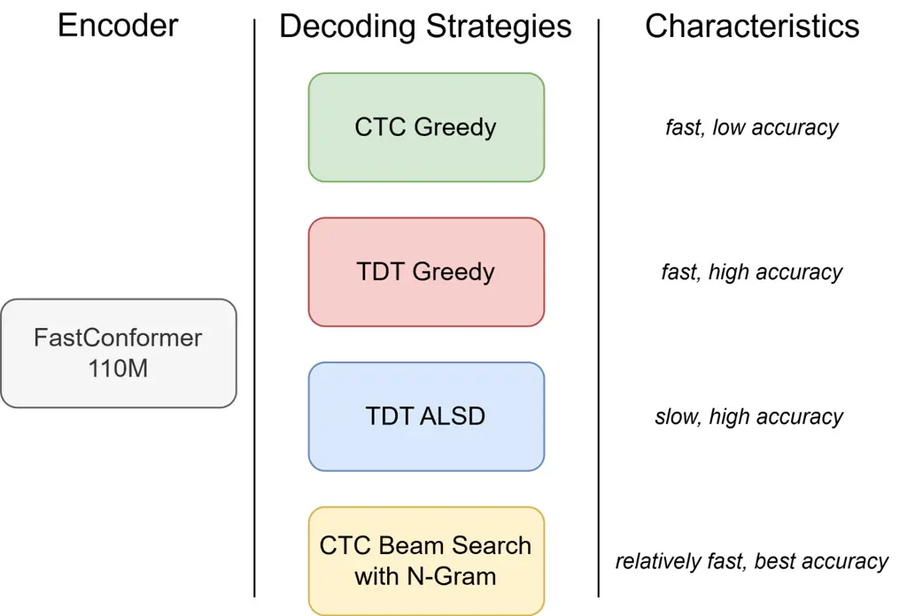

# Open Source State-Of-the-Art Solution for Romanian Speech Recognition

Gabriel Pîrlogeanu, Alexandru-Lucian Georgescu, Horia Cucu
Affiliation: Speech and Dialogue Research Laboratory, POLITEHNICA
Bucharest  
Bucharest, Romania  
{gabriel.pirlogeanu, lucian.georgescu, horia.cucu}@upb.ro

###### Abstract

In this work, we present a new state-of-the-art Romanian Automatic
Speech Recognition (ASR) system based on NVIDIA’s FastConformer
architecture—explored here for the first time in the context of
Romanian. We train our model on a large corpus of, mostly, weakly
supervised transcriptions, totaling over 2,600 hours of speech.
Leveraging a hybrid decoder with both Connectionist Temporal
Classification (CTC) and Token-Duration Transducer (TDT) branches, we
evaluate a range of decoding strategies including greedy, ALSD, and CTC
beam search with a 6-gram token-level language model. Our system
achieves state-of-the-art performance across all Romanian evaluation
benchmarks, including read, spontaneous, and domain-specific speech,
with up to 27% relative WER reduction compared to previous
best-performing systems. In addition to improved transcription accuracy,
our approach demonstrates practical decoding efficiency, making it
suitable for both research and deployment in low-latency ASR
applications.

###### Index Terms: 

Romanian language, automatic speech recognition, fastconformer, hybrid
decoder, low-resource

## I Introduction

Automatic Speech Recognition (ASR) has undergone a paradigm shift over
the past decade, driven by the rise of end-to-end architectures and the
increasing availability of large-scale datasets. Models such as
RNN-Transducer, Transformer-Transducer, wav2vec, Whisper,
Conformer \[1\] have dramatically improved recognition accuracy across
many languages. Most recently, Speech Large Language Models (SpeechLLMs)
\[2\] have further advanced the field by integrating multimodal and
multilingual supervision at unprecedented scale.

Besides architectural innovations, decoding strategies have also evolved
significantly. Beyond the ubiquitous Connectionist Temporal
Classification (CTC) and RNN-T approaches, recent work has demonstrated
the utility of advanced techniques such as Alignment-Length Synchronous
Decoding (ALSD) \[3\], token-duration modeling \[4\] and hybrid decoding
frameworks that combine the strengths of multiple objectives \[5\].
Furthermore, the integration of external language models (LMs),
particularly n-gram or neural LMs, has proven essential in bridging
acoustic and linguistic gaps, especially for under-resourced languages.

Despite these advances, Romanian remains a low-resource language in the
context of ASR. Earlier efforts have primarily focused on hybrid HMM-DNN
systems, which established strong baselines on several benchmarks \[6\].
While neural ASR systems have recently been applied to Romanian, they
often rely on architectures or training strategies that do not reflect
the latest developments in the field. For instance, DeepSpeech \[7\],
wav2vec-based approaches \[8\] and Whisper adaptations \[9\] have shown
promising results, but no prior work has explored the Conformer \[10\]
or FastConformer \[11\] architecture for Romanian speech, nor has there
been an exhaustive exploration of decoding strategies tailored to this
language.

The scarcity of manually annotated Romanian data poses a significant
barrier to fully supervised learning. The largest publicly available
dataset, the Read Speech Corpus (RSC) \[12\], provides high-quality
transcriptions but remains modest in size. However, recent efforts have
expanded coverage across domains, dialects, and speech styles. Resources
such as CoBiLiRo \[13\], CoRoLa \[14\], and USPDATRO \[15\] have
introduced more spontaneous and dialectal content. Notably, Georgescu et
al. \[6\] demonstrated that training on over 600 hours of mostly weakly
labeled read and spontaneous speech can significantly enhance ASR
robustness and generalization. However, the authors also observed a
degradation in spontaneous speech recognition performance when adding
$`2000`$ hours of oratory speech.

Large-scale weak supervision, such as learning from pseudo-labels or
partially aligned transcripts, has emerged as a powerful strategy for
under-resourced languages \[16, 17, 18\]. These techniques enable the
use of vast audio corpora with minimal human supervision, thereby
bridging the gap between resource-rich and resource-poor settings.
Whisper \[17\], for instance, exemplifies how weakly supervised
multilingual training can yield high-quality models even with noisy
labels.

In this paper, we propose the first adaptation of NVIDIA’s FastConformer
architecture for Romanian ASR. We fine-tune a 110M parameter hybrid
CTC-TDT \[11, 5\] model using over 2600 hours of Romanian speech,
composed of both high-quality manual transcriptions and weakly labeled
data obtained through partial alignment techniques. Our study not only
benchmarks transcription accuracy through Word Error Rate (WER), but
also evaluates computational efficiency via the Real-Time Factor (RTFx).
We explore a spectrum of decoding strategies—including CTC greedy, TDT
greedy, TDT with ALSD, and CTC beam search with an external 6-gram
language model—leveraging the decoder’s hybrid nature to gain insight
into performance trade-offs.

Our system achieves state-of-the-art results across seven diverse
Romanian ASR benchmarks, covering read, spontaneous, oratory, and
underrepresented speech. These results highlight the effectiveness of
the FastConformer architecture when combined with scalable training and
decoding pipelines, offering a powerful new baseline for Romanian speech
recognition research. To promote continued progress in Romanian speech
processing, we will publicly release our trained model, along with
comprehensive training and inference recipes, and the standardized
evaluation datasets¹¹ 1 https://github.com/gabitza-tech/SpeD-RoASR.

## II Methodology

### II-A Encoder Architecture

The encoder used in this work is based on the FastConformer \[11\], a
highly efficient variant of the Conformer \[10\] architecture designed
for ASR. The Conformer architecture itself extends the
Transformer \[19\] by incorporating convolutional modules to better
capture local dependencies in speech, which are often missed by purely
self-attentive models. Each Conformer block consists of a feed-forward
module, a multi-headed self-attention module with relative positional
encoding, a convolution module, and a second feed-forward module, all
connected via residual connections and layer normalization. This design
enables modeling of both global and local temporal relationships, making
the Conformer particularly effective for speech tasks.

Building on this foundation, the FastConformer introduces architectural
optimizations aimed at reducing computational cost while preserving
accuracy. The FastConformer encoder addresses these limitations by
redesigning the downsampling schema and optimizing key architectural
components to improve both training and inference efficiency. One of the
primary modification of the FastConformer is the introduction of an
eightfold downsampling step at the beginning of the encoder using a
stack of three depthwise separable convolutional layers. This reduces
the input sequence length significantly, thereby decreasing the
computational burden on subsequent attention and convolution blocks
without sacrificing model accuracy. Additionally, FastConformer reduces
the convolutional kernel size from 31 to 9 and decreases the number of
channels in the subsampling layers from 512 to 256. These changes lower
the model’s parameter count and operation cost while preserving its
representational capacity.

FastConformer enhances efficiency for long-form audio by replacing
global attention with limited-context attention and a global token,
inspired by the Longformer \[20\]. This enables processing of sequences
up to 11 hours in a single forward pass while maintaining or improving
word error rates. Importantly, the overall Conformer architecture and
block design remain unchanged, allowing FastConformer to preserve the
strong performance of its predecessor while delivering up to
2.8$`\times`$ faster inference with substantially lower compute demands.

In this work, we adopt a 17-layer FastConformer encoder, resulting in
approximately 110 million parameters.

### II-B Decoder

Fig. 1: Comparative analysis of the decoding strategies explored in this
work, evaluated in terms of ASR accuracy and inference latency on
Romanian speech.

In this section, we provide a detailed analysis of the decoder
architectures employed in this study, along with advanced decoding
strategies aimed at improving ASR performance. Figure 1 offers a
comparative overview of the decoding approaches evaluated on Romanian
speech, highlighting their respective trade-offs in terms of latency and
recognition accuracy.

The Recurrent Neural Network Transducer (RNN-T) \[21\] loss is
foundational in end-to-end ASR, capable of jointly learning acoustic and
language modeling. To address issues like alignment ambiguity and
training instability, the Token-Duration Transducer (TDT) \[4\]
explicitly models token durations, improving temporal alignment,
convergence, and accuracy. While a greedy TDT decoder offers good
computational speed, its sub-optimal search can yield significantly
lower accuracy by easily getting stuck to local maxima. For efficient
yet accurate inference, the Alignment-Length Synchronous Decoding
(ALSD) \[3\] method for RNN-T/TDT models is preferred over greedy
approaches. ALSD employs a beam search controlled by total alignment
length, providing a superior balance between speed and performance. Its
key advantages include significantly improved accuracy over greedy
methods and enhanced computational efficiency compared to standard
time-synchronous beam decoding, often with reduced tuning. However, ALSD
remains computationally more intensive than pure greedy decoding,
representing a trade-off for its higher fidelity results.

Connectionist Temporal Classification (CTC) \[22\] defines a common ASR
loss function. While a greedy CTC decoder is fast, it yields sub-optimal
transcripts as it performs a limited search. For improved accuracy, Beam
Search CTC decoding explores multiple hypotheses. A key advantage is its
integration with an external Language Model (LM), which re-scores
hypotheses to enhance linguistic plausibility and achieve
state-of-the-art performance. However, beam search incurs higher
computational cost and latency than greedy decoding, and requires
careful tuning of LM interpolation weights. Despite these drawbacks, the
accuracy gains typically favor beam search with an external LM for
robust ASR systems.

Following the approach proposed in \[5\], we employ a unified and
efficient hybrid decoder architecture that integrates both a
Connectionist Temporal Classification (CTC) \[22\] decoder and a
Token-Duration Transducer (TDT) \[4\] decoder, sharing a common encoder.
This design enables flexible decoding at inference time, allowing for
the selection of the most appropriate strategy depending on the target
application. Beyond its versatility, this hybrid framework offers
several practical advantages: it eliminates the need to train and
maintain separate models, thereby reducing computational overhead; it
accelerates the convergence of the CTC decoder; and it enhances the
overall recognition accuracy of both decoding branches, likely due to
the benefits of joint optimization. During training, the final loss is
computed as a weighted sum of the individual losses from the CTC and TDT
decoders, encouraging the model to learn representations that are
beneficial to both objectives.

## III Experimental Setup

In this section we will offer a comprehensive description of the
datasets employed in this study, the training strategy, the language
modeling step, the baseline systems, and we also describe the evaluation
protocol.

### III-A Speech Datasets

|            |                |                  |                      |
| ---------- | -------------- | ---------------- | -------------------- |
| Subset     | Datasets       | Total Dur. \[h\] | Avg. Utt. Dur. \[s\] |
| Training   | RSC-train      | 93.7             | 2.5                  |
|            | CoBiLiro-train | 30.3             | 2.2                  |
|            | CoRoLa-train   | 56.3             | 7.7                  |
|            | SSC-train      | 407.3            | 2.7                  |
|            | CDEP-train     | 2048.5           | 4.4                  |
| Validation | SSC-dev        | 10.9             | 25.1                 |
|            | CoRoLa-dev     | 27.3             | 32.3                 |
| Test       | RSC-eval       | 5.2              | 7.6                  |
|            | SSC-eval1      | 3.5              | 4.12                 |
|            | SSC-eval2      | 1.5              | 54.7                 |
|            | CDEP-eval      | 4.9              | 60                   |
|            | CV21-RO        | 4.6              | 4.2                  |
|            | Fleurs-RO      | 2.5              | 10.3                 |
|            | USPDATRO       | 4.3              | 5.9                  |

TABLE I: The composition of the training, validation and evaluation
datasets. For each subset, we report the total duration in hours, as
well as the average utterance duration in seconds.

In Table I we present all the datasets used in this study for training,
validation and evaluation, comprising of both read and spontaneous
speech, with annotations obtained either manually or automatically.

The training dataset is comprised of subsets also explored in \[6\]: the
Read Speech Corpus (RSC-train) \[12\], the Spontaneous Speech Corpus
(SSC-train) - comprised of 4 subsets, the Chamber of DEPuties Corpus
(CDEP-train), the Bimodal Corpus for Romanian Language
(CoBiLiRo-train) \[13\] and the Corpus of the Contemporary Romanian
Language (CoRoLa-train) \[14\]. Due to architectural limitations, we
limit the durations of the training audio files to a minimum of $`0.1`$s
and a maximum of $`20`$s. Notably, the majority of this corpus consists
of automatically generated annotations, obtained by aligning two ASR
systems over the SSC-train and CDEP-train datasets, amounting to
approximately $`2455`$ hours of annotations. In total, the training set
consisted of around $`2636`$h, with $`2.4`$M utterances and an average
file duration of $`3.9`$s.

The validation set has an important role in both training monitoring, as
well as subsequent hyper-parameter tuning for the decoding strategies.
In order to better model real life distributions of offline speech
recordings, we choose audio files that are longer than $`20`$s. We also
want to focus on spontaneous speech in this study, therefore we select
the recordings from the SSC (SSC-dev) and CoRoLa (CoRoLa-dev) datasets.
Our development set totals around $`38`$h and an average duration fo
$`29.85`$s.

We employ an exhaustive evaluation over multiple Romanian speech
datasets, containing both read and spontaneous speech. For read speech,
we evaluate on the test set of the RSC (RSC-eval) dataset and for
oratory speech (formal public speaking–Chamber of Deputies speech), we
utilize the CDEP (cdep-eval) dataset. For spontaneous speech, we utilize
the SSC-eval1 and SSC-eval2 \[6\] evaluation sets, as well as the
USPDATRO dataset \[9, 15\]. We also evaluate on the Romanian test
subsets of two large multilingual datasets: Common Voice 21.0 Romanian
(CV21-RO) \[23\] and Fleurs Romanian (Fleurs-RO)\[24\].

### III-B ASR Model setup

Several prior studies have demonstrated that initializing speech
processing models—such as those used for Automatic Speech Recognition
(ASR) or Speech Translation—from pre-trained models on high-resource
languages (e.g., English) significantly improves performance on
low-resource languages \[25\]. This transfer learning approach is
particularly effective when leveraging models trained via
Self-Supervised Learning (SSL) on large-scale English audio corpora.
Such pre-trained encoders capture universal low-level acoustic
representations (e.g., phonetic features) that generalize well across
languages, thereby providing a strong foundation for fine-tuning on
target languages with limited labeled data. In contrast, models trained
from scratch on low-resource languages often struggle to learn such
robust representations due to insufficient training data.

We initialize our model from the 110M variant of the Parakeet Hybrid
TDT-CTC architecture from Nvidia’s NeMo toolkit \[26\]. This model was
pretrained in a SSL manner on the Librilight dataset \[27\], then
finetuned for offline speech recognition on $`36`$k hours of English
annotated recordings. It has a tokenizer of 1024 BPE tokens.

In order to fine-tune this model on Romanian, we built a new tokenizer
using the $`2.4`$M annotations from the speech training sets, as well as
$`24.6`$M texts from a cleaned version of the news-corpus used in \[6\],
which will be further discuss in Section III-C. We clean the text
corpora in order to keep only the 31 official characters of the Romanian
alphabet, alongside the hyphen (“-“) character. We built a tokenizer
with a vocabulary size of 1024 using the SentencePiece \[28\] toolkit,
limiting subwords to a maximum of 5 subword tokens.

During training, besides the $`2636`$ hours of training speech, we also
add noise augmentations using a $`6`$h Freesound subset from the MUSAN
dataset \[29\], with an augmentation probability of $`0.2`$ and SNR in
the range of $`10`$ to $`30`$. Additionally, we add speed perturbations
in the range $`0.9`$ to $`1.1`$, with a $`0.4`$ augmentation
probability. We also perform spectogram augmentations using SpecAugment
and SpecCutout \[30\]. Due to the fact that the decoder architecture
includes both a TDT and CTC decoder, we set the weight of the CTC loss
to $`0.3`$, when computing the combined hybrid loss. For the training
strategy, we utilize the weighted Adam (AdamW) \[31\] optimizer with an
initial learning rate of $`2.0`$ and a weight decay of $`10^{-3}`$. We
use a Noam Annealing scheduler, with $`10`$k warming steps.

We train the model for 30 epochs with a batch size of $`32`$ and a
gradient accumulation factor of $`8`$. Training is performed on a
$`24`$GB NVIDIA RTX $`4090`$ GPU using BFloat16 precision, resulting in
an epoch duration of approximately $`5.5`$ hours. The final model is
derived through checkpoint averaging over the 10 checkpoints that
achieve the lowest validation WER.

### III-C Language Modeling and Decoding

Language modeling using n-grams helps automatic speech recognition (ASR)
by predicting the most likely sequence of words based on context,
thereby improving accuracy in distinguishing between acoustically
similar words. Therefore, we train a token n-gram model using the KenLM
toolkit \[32\]. The unigrams are based on the ASR model’s tokenizer.
Similar to the tokenizer building, we use $`2.4`$M lines from the
training annotations, as well as a cleaned version of the news_corpus
used in \[6\] (formed from news002 and news2020). The unprocessed corpus
contained over $`1.4`$M words in its lexicon. In order to reduce the
dataset’s size and remove unnecessary words, we limit the lexicon to the
most frequent $`500`$k words by appearance, resulting in a corpus of
$`24.6`$M lines.

With the $`27`$M input lines, we train a 6-gram token LM model. The
resulting n-gram reaches a disk size of approx. $`15`$GB in the
binarized form, leading to a significant memory consumption. We decide
to prune the 6-gram model by the following scheme: $`[0,1,3,5]`$. This
means that we drop bigrams that appear only once, trigrams that appear 3
times or less and 4/5/6-grams that appear 5 times or less. Pruning the
model leads to a reduction in memory footprint to $`2`$GB.

We utilize this 6-gram model in a CTC beam decoding strategy. We tune
the decoding hyper-parameters on the $`38`$h validation subset. For the
CTC-beam decoding strategy, we set the beam size to $`32`$, the language
model weight $`\alpha`$ to $`0.9`$ and the sequence length penalty score
$`\beta`$ to $`2`$. For the TDT-ALSD strategy, we do not utilize and
external language model and we only tune the beam size to $`32`$.

### III-D Baseline Systems

To assess the effectiveness of our proposed method, we compare it
against state-of-the-art ASR systems that have been evaluated on
established Romanian speech recognition benchmarks. The first baseline
is a hybrid HMM-DNN system implemented using the Kaldi toolkit \[6,
33\], which features a 13-layer Time-Delay Neural Network (TDNN) as the
acoustic model. Decoding is performed using a 3-gram language model,
followed by rescoring with an RNN-based language model. The acoustic
model is trained on over 600 hours of Romanian speech data drawn from
the RSC, SSC, CoBiLiRo, and CoRoLa corpora, while the language models
are trained on a corpus of approximately 600 million words. In \[6\],
the authors further investigate the impact of incorporating an
additional 2000 hours of speech from the CDEP dataset; however, their
findings indicate that this addition led to a degradation in
transcription quality for spontaneous speech.

The second baseline leverages a Whisper-based architecture, specifically
the Whisper-large-v2 model with 1.55 billion parameters, fine-tuned on
Romanian data (denoted as “RoWhisper-large-v2”) \[9\]. This model was
evaluated on several standard Romanian ASR test sets, as well as a newly
introduced dataset targeting underrepresented Romanian dialectal and
spontaneous speech, USPDATRO. For this baseline, we report results
obtained using beam search decoding.

### III-E Data Preprocessing and Evaluation Protocol

|                             |                        | Evaluation Datasets \[WER\] |           |           |           |       |           |          | RTFx   |
| --------------------------- | ---------------------- | --------------------------- | --------- | --------- | --------- | ----- | --------- | -------- | ------ |
| Architecture                | Decoding Strategy      | RSC-eval                    | SSC-eval1 | SSC-eval2 | CDEP-eval | CV-21 | Fleurs-RO | USPDATRO |        |
| HMM-DNN (TDNN) \[6\]        | N-gram + RNN rescoring | 1.90                        | 9.40      | 11.40     | 5.40      | –     | –         | –        | –      |
| RoWhisper-large-v2 \[9\]    | Beam                   | 3.09                        | 25.05     | 61.46     | 62.83     | 9.31  | –         | 28.00\*  | –      |
| Parakeet Ro 110M TDT (ours) | Greedy                 | 2.16                        | 9.08      | 10.85     | 4.20      | 3.57  | 10.61     | 24.08    | 126.15 |
|                             | ALSD                   | 2.05                        | 8.64      | 10.88     | 4.17      | 3.38  | 10.16     | 24.3     | 66.63  |
| Parakeet Ro 110M CTC (ours) | Greedy                 | 2.57                        | 10.10     | 12.65     | 4.80      | 4.20  | 11.85     | 27.80    | 130.55 |
|                             | Beam Token N-gram      | 1.73                        | 8.12      | 10.75     | 3.92      | 3.29  | 8.85      | 23.4     | 109.46 |

TABLE II: Comparison of ASR system performance on seven Romanian
evaluation datasets. Word Error Rate (WER) is reported as a percentage,
with lower values indicating better transcription accuracy. Real-Time
Factor (RTFx) is also reported, where higher values correspond to faster
inference speed. \* indicates that we report the value for
RoWhisper-medium \[9\].

To ensure a consistent evaluation across all datasets, we perform text
normalization on the n-gram language model corpus, as well as on both
training and evaluation annotations. Specifically, we retain only the
lowercase forms of the 31 official characters of the Romanian alphabet,
along with the hyphen character. All other punctuation marks and special
symbols are removed. Additionally, for datasets such as Fleurs-RO and
USPDATRO, we apply numeral-to-text conversion in order to unify numeric
expressions across all corpora. On the audio processing side, the model
accepts $`16k`$Hz mono-channel audio (wav) files as input.

We evaluate automatic speech recognition performance using the Word
Error Rate (WER), a widely adopted metric defined as the total number of
substitutions, deletions, and insertions divided by the number of words
in the reference transcript. WER provides an intuitive measure of
transcription accuracy, where lower values indicate higher fidelity to
the ground truth. Due to its simplicity and interpretability, WER
remains a standard benchmark for comparing ASR models across different
datasets.

In addition to accuracy, we assess the computational efficiency of ASR
models using the Real-Time Factor (RTFx), which measures the speed of
transcription relative to the duration of the audio. For example, an
RTFx of $`\times 100`$ indicates that the system processes audio 100
times faster than its actual length. Unlike WER, RTFx captures the
practical runtime efficiency of a model and is crucial in deployment
scenarios. All decoding strategies are evaluated under a common setup: a
24 cores Intel i9-13900KF CPU-only environment with a batch size of 64.
The final RTFx values are computed as the average over approximately
13,000 audio files, spanning durations from 0.2 to 260.4 seconds, across
seven evaluation datasets.

## IV Results

We evaluate our proposed approach on seven Romanian speech recognition
datasets, benchmarking it against two baseline systems: a hybrid HMM-DNN
(TDNN) model and a fine-tuned Romanian Whisper-large-v2 model. Table II
reports the Word Error Rate (WER) for each evaluation dataset, along
with the Real-Time Factor (RTFx) computed over the concatenated
evaluation sets using a CPU-only configuration.

As anticipated, the most efficient configuration in terms of latency is
the CTC greedy decoding strategy. However, this comes at the cost of
recognition accuracy, as it yields the highest Word Error Rate (WER)
among the evaluated setups. Despite the absence of any language
modeling, this configuration performs comparably to more complex
decoding strategies and substantially outperforms the fine-tuned
RoWhisper-large-v2 model across all evaluation datasets. In comparison
with the Kaldi-based baseline, the CTC greedy decoder achieves a
relative WER reduction of 12.2% on the CDEP-eval dataset.

The TDT greedy decoding setup yields consistent improvements over the
baseline systems across all evaluation sets, with the exception of the
RSC-eval dataset, where the HMM-DNN model achieves a lower WER. This
decoding strategy serves as an effective trade-off between the
simplicity of the CTC greedy approach—which makes frame-level
independent predictions—and the more computationally intensive CTC beam
search with external language modeling. Utilizing an internal language
model, the TDT greedy decoder provides competitive performance close to
that of the best-performing setup, while maintaining faster inference
speed and eliminating the need for external language model training or
tuning. Notably, the TDT decoding strategy demonstrates the model’s
ability to effectively leverage the 2000 hours of oratory speech from
the CDEP-train dataset. In contrast to the baseline HMM-DNN
system\[6\]—which exhibited degraded performance on spontaneous speech
when incorporating this domain—the FastConformer acoustic model benefits
from the inclusion of oratory data, leading to improved performance even
on spontaneous speech.

Finally, when employing the TDT decoder in conjunction with the ALSD
strategy, we observe modest improvements in WER, compared to the greedy
version, on most evaluation datasets, accompanied by a significant
increase in latency as reflected in the RTFx values. While this approach
is tuning-free and offers marginal transcription quality gains, its
elevated computational cost may limit its practical applicability in
latency-sensitive scenarios.

Our best-performing configuration, which employs CTC beam search
decoding with a 6-gram token-level language model, achieves
state-of-the-art performance across all evaluation datasets.
Specifically, we observe a relative WER reduction of 9% on the read
speech dataset (RSC-eval), and a 27% relative improvement on the oratory
speech dataset (CDEP-eval). Furthermore, we obtain consistent gains on
spontaneous speech datasets, with relative improvements of 14% and 6% on
SSC-eval1 and SSC-eval2, respectively. For the Romanian subset of
multilingual corpora, our system achieves 3.3% WER on CV-21 and 8.85%
WER on the FLEURS-RO dataset. Lastly, on the underrepresented speech
dataset USPDATRO, we report a 16.5% relative WER reduction, underscoring
the potential for further advancement in Romanian ASR, particularly for
low-resource or domain-specific conditions. In terms of inference speed,
this method exhibits a $`16\%`$ relative reduction compared to the CTC
greedy decoding strategy. However, it achieves an improvement of over
$`64\%`$ relative to the TDT-ALSD approach, while consistently
delivering significantly higher transcription quality across all
evaluation datasets.

## V Conclusions

In this work, we introduce a state-of-the-art Automatic Speech
Recognition (ASR) system for Romanian, leveraging the FastConformer
architecture for the first time in this context. By combining over 2600
hours of manually and weakly labeled Romanian speech data, we
demonstrate that modern end-to-end architectures—when properly adapted
and fine-tuned—can significantly surpass existing systems, including
both traditional hybrid HMM-DNN models and large multilingual
transformers like Whisper.

Our exhaustive evaluation across seven diverse Romanian
benchmarks—including read, spontaneous, oratory, and dialectal
speech—confirms the robustness of our system compared to other evaluated
systems. We report consistent Word Error Rate (WER) improvements across
all test sets, establishing new state-of-the-art results on each.
Furthermore, our exploration of multiple decoding strategies, including
CTC beam search with a 6-gram token-level language model and TDT-based
decoding with ALSD, provides valuable insights into the trade-offs
between transcription accuracy and computational efficiency.

To support future research and reproducibility in Romanian speech
processing, we commit to publicly releasing our trained model, along
with complete training and inference recipes, as well as standardized
evaluation datasets. We believe this open-source contribution will help
accelerate progress in the broader field of low-resource ASR and foster
more inclusive, language-diverse speech technologies.

Acknowledgements. This work was co-funded by EU Horizon project AI4TRUST
(No. 101070190) and by a grant of the Ministry of Research, Innovation
and Digitization, CNCS/CCCDI - UEFISCDI, project number
PN-IV-P8-8.1-PRE-HE-ORG-2023-0078, within PNCDI IV.

## References

- \[1\] R. Prabhavalkar, T. Hori, T. N. Sainath, R. Schlüter, and S.
  Watanabe (2023) End-to-end speech recognition: a survey. External
  Links: 2303.03329, [Link](https://arxiv.org/abs/2303.03329) Cited by:
  §I.
- \[2\] J. Peng, Y. Wang, Y. Fang, Y. Xi, X. Li, X. Zhang, and K.
  Yu (2025) A survey on speech large language models. External Links:
  2410.18908, [Link](https://arxiv.org/abs/2410.18908) Cited by: §I.
- \[3\] G. Saon, Z. Tüske, and K. Audhkhasi (2020) Alignment-length
  synchronous decoding for rnn transducer. In Proc. ICASSP, Vol. ,
  pp. 7804–7808. External Links:
  [Document](https://dx.doi.org/10.1109/ICASSP40776.2020.9053040) Cited
  by: §I, §II-B.
- \[4\] H. Xu, F. Jia, S. Majumdar, H. Huang, S. Watanabe, and B.
  Ginsburg (2023) Efficient sequence transduction by jointly predicting
  tokens and durations. External Links: 2304.06795,
  [Link](https://arxiv.org/abs/2304.06795) Cited by: §I, §II-B, §II-B.
- \[5\] V. Noroozi, S. Majumdar, A. Kumar, J. Balam, and B.
  Ginsburg (2024) Stateful conformer with cache-based inference for
  streaming automatic speech recognition. In Proc. ICASSP, External
  Links:
  [Document](https://dx.doi.org/10.1109/ICASSP48485.2024.10446861) Cited
  by: §I, §I, §II-B.
- \[6\] A. Georgescu, H. Cucu, and C. Burileanu (2021) Improvements of
  speed’s romanian asr system during reterom project. In 2021
  International Conference on Speech Technology and Human-Computer
  Dialogue (SpeD), External Links:
  [Document](https://dx.doi.org/10.1109/SpeD53181.2021.9587383) Cited
  by: §I, §I, §III-A, §III-A, §III-B, §III-C, §III-D, TABLE II, §IV.
- \[7\] D. Ungureanu, M. Badeanu, G. Marica, M. Dascalu, and D. I.
  Tufis (2021) Establishing a baseline of romanian speech-to-text
  models. In 2021 International Conference on Speech Technology and
  Human-Computer Dialogue (SpeD), Vol. , pp. 132–138. External Links:
  [Document](https://dx.doi.org/10.1109/SpeD53181.2021.9587345) Cited
  by: §I.
- \[8\] A. Avram, R. Smădu, V. Păiş, D. Cercel, R. Ion, and D.
  Tufiş (2023) Towards improving the performance of pre-trained speech
  models for low-resource languages through lateral inhibition. External
  Links: 2306.17792, [Link](https://arxiv.org/abs/2306.17792) Cited by:
  §I.
- \[9\] V. Păis, V. B. Mititelu, R. Ion, and E. Irimia (2023) Evaluating
  a fine-tuned whisper model on underrepresented romanian speech. In
  2023 International Conference on Speech Technology and Human-Computer
  Dialogue (SpeD), Vol. , pp. 141–145. External Links:
  [Document](https://dx.doi.org/10.1109/SpeD59241.2023.10314923) Cited
  by: §I, §III-A, §III-D, TABLE II, TABLE II.
- \[10\] A. Gulati, J. Qin, C. Chiu, N. Parmar, Y. Zhang, J. Yu, W.
  Han, S. Wang, Z. Zhang, Y. Wu, and R. Pang (2020) Conformer:
  convolution-augmented transformer for speech recognition.. In Proc.
  Interspeech, Cited by: §I, §II-A.
- \[11\] D. Rekesh, N. R. Koluguri, S. Kriman, S. Majumdar, V.
  Noroozi, H. Huang, O. Hrinchuk, K. Puvvada, A. Kumar, J. Balam, and B.
  Ginsburg (2023) Fast conformer with linearly scalable attention for
  efficient speech recognition. External Links: 2305.05084,
  [Link](https://arxiv.org/abs/2305.05084) Cited by: §I, §I, §II-A.
- \[12\] A. Georgescu, H. Cucu, A. Buzo, and C. Burileanu (2020) RSC: a
  Romanian read speech corpus for automatic speech recognition. In Proc.
  LREC, Cited by: §I, §III-A.
- \[13\] D. Cristea, I. Pistol, Ş. Boghiu, A. Bibiri, D. Gîfu, A.
  Scutelnicu, M. Onofrei, D. Trandabăţ, and G. Bugeag (2020) CoBiLiRo: a
  research platform for bimodal corpora. In Proceedings of the 1st
  International Workshop on Language Technology Platforms, Cited by: §I,
  §III-A.
- \[14\] V. B. Mititelu, E. Irimia, and D. Tufiș (2014) CoRoLa — the
  reference corpus of contemporary Romanian language. In Proc. LREC,
  Cited by: §I, §III-A.
- \[15\] V. Păiș, V. Mititelu, E. Irimia, R. Ion, and D. Tufis (2024)
  Under-represented speech dataset from open data: case study on the
  romanian language. Applied Sciences 14, pp. 9043. External Links:
  [Document](https://dx.doi.org/10.3390/app14199043) Cited by: §I,
  §III-A.
- \[16\] G. Synnaeve, Q. Xu, J. Kahn, T. Likhomanenko, E. Grave, V.
  Pratap, A. Sriram, V. Liptchinsky, and R. Collobert (2020) End-to-end
  asr: from supervised to semi-supervised learning with modern
  architectures. External Links: 1911.08460,
  [Link](https://arxiv.org/abs/1911.08460) Cited by: §I.
- \[17\] A. Radford, J. W. Kim, T. Xu, G. Brockman, C. McLeavey, and I.
  Sutskever (2022) Robust speech recognition via large-scale weak
  supervision. External Links: 2212.04356,
  [Link](https://arxiv.org/abs/2212.04356) Cited by: §I.
- \[18\] A. Baevski, H. Zhou, A. Mohamed, and M. Auli (2020) Wav2vec
  2.0: a framework for self-supervised learning of speech
  representations. External Links: 2006.11477,
  [Link](https://arxiv.org/abs/2006.11477) Cited by: §I.
- \[19\] A. Vaswani, N. Shazeer, N. Parmar, J. Uszkoreit, L.
  Jones, A. N. Gomez, Ł. Kaiser, and I. Polosukhin (2017) Attention is
  all you need. In Proc. NIPS, Cited by: §II-A.
- \[20\] I. Beltagy, M. E. Peters, and A. Cohan (2020) Longformer: the
  long-document transformer. External Links: 2004.05150,
  [Link](https://arxiv.org/abs/2004.05150) Cited by: §II-A.
- \[21\] A. Graves (2012) Sequence transduction with recurrent neural
  networks. External Links: 1211.3711,
  [Link](https://arxiv.org/abs/1211.3711) Cited by: §II-B.
- \[22\] A. Graves, S. Fernández, F. Gomez, and J. Schmidhuber (2006)
  Connectionist temporal classification: labelling unsegmented sequence
  data with recurrent neural ’networks. Vol. 2006, pp. 369–376. External
  Links: [Document](https://dx.doi.org/10.1145/1143844.1143891) Cited
  by: §II-B, §II-B.
- \[23\] R. Ardila, M. Branson, K. Davis, M. Kohler, J. Meyer, M.
  Henretty, R. Morais, L. Saunders, F. Tyers, and G. Weber (2020) Common
  voice: a massively-multilingual speech corpus. In Proceedings of the
  Twelfth Language Resources and Evaluation Conference, Cited by:
  §III-A.
- \[24\] A. Conneau, M. Ma, S. Khanuja, Y. Zhang, V. Axelrod, S.
  Dalmia, J. Riesa, C. Rivera, and A. Bapna (2023) FLEURS: few-shot
  learning evaluation of universal representations of speech. In Proc.
  SLT, Cited by: §III-A.
- \[25\] S. Bansal, H. Kamper, K. Livescu, A. Lopez, and S.
  Goldwater (2019) Pre-training on high-resource speech recognition
  improves low-resource speech-to-text translation. In Proceedings of
  the 2019 Conference of the North American Chapter of the Association
  for Computational Linguistics: Human Language Technologies, Volume 1
  (Long and Short Papers), Cited by: §III-B.
- \[26\] O. Kuchaiev, J. Li, H. Nguyen, O. Hrinchuk, R. Leary, B.
  Ginsburg, S. Kriman, S. Beliaev, V. Lavrukhin, J. Cook, P.
  Castonguay, M. Popova, J. Huang, and J. M. Cohen (2019) NeMo: a
  toolkit for building ai applications using neural modules. External
  Links: 1909.09577, [Link](https://arxiv.org/abs/1909.09577) Cited by:
  §III-B.
- \[27\] J. Kahn, M. Riviere, W. Zheng, E. Kharitonov, Q. Xu, P.E.
  Mazare, J. Karadayi, V. Liptchinsky, R. Collobert, C. Fuegen, T.
  Likhomanenko, G. Synnaeve, A. Joulin, A. Mohamed, and E. Dupoux (2020)
  Libri-light: a benchmark for asr with limited or no supervision. In
  Proc. ICASSP, Cited by: §III-B.
- \[28\] T. Kudo and J. Richardson (2018) SentencePiece: a simple and
  language independent subword tokenizer and detokenizer for neural text
  processing. In Proceedings of the 2018 Conference on Empirical Methods
  in Natural Language Processing: System Demonstrations, E. Blanco
  and W. Lu (Eds.), Brussels, Belgium, pp. 66–71. External Links:
  [Link](https://aclanthology.org/D18-2012/),
  [Document](https://dx.doi.org/10.18653/v1/D18-2012) Cited by: §III-B.
- \[29\] D. Snyder, G. Chen, and D. Povey (2015) MUSAN: a music, speech,
  and noise corpus. External Links: 1510.08484,
  [Link](https://arxiv.org/abs/1510.08484) Cited by: §III-B.
- \[30\] D. S. Park, W. Chan, Y. Zhang, C. Chiu, B. Zoph, E. D. Cubuk,
  and Q. V. Le (2019) SpecAugment: a simple data augmentation method for
  automatic speech recognition. In Interspeech 2019, Cited by: §III-B.
- \[31\] I. Loshchilov and F. Hutter (2019) Decoupled weight decay
  regularization. External Links: 1711.05101,
  [Link](https://arxiv.org/abs/1711.05101) Cited by: §III-B.
- \[32\] K. Heafield (2011) KenLM: faster and smaller language model
  queries. In Proceedings of the Sixth Workshop on Statistical Machine
  Translation, Cited by: §III-C.
- \[33\] A. Ghoshal, G. Boulianne, L. Burget, O. Glembek, N. Goel, M.
  Hannemann, P. Motlíček, Y. Qian, P. Schwarz, J. Silovský, G. Stemmer,
  and K. Vesel (2011) The kaldi speech recognition toolkit. Proc. ASRU.
  Cited by: §III-D.
