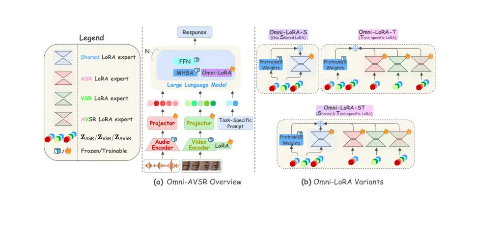
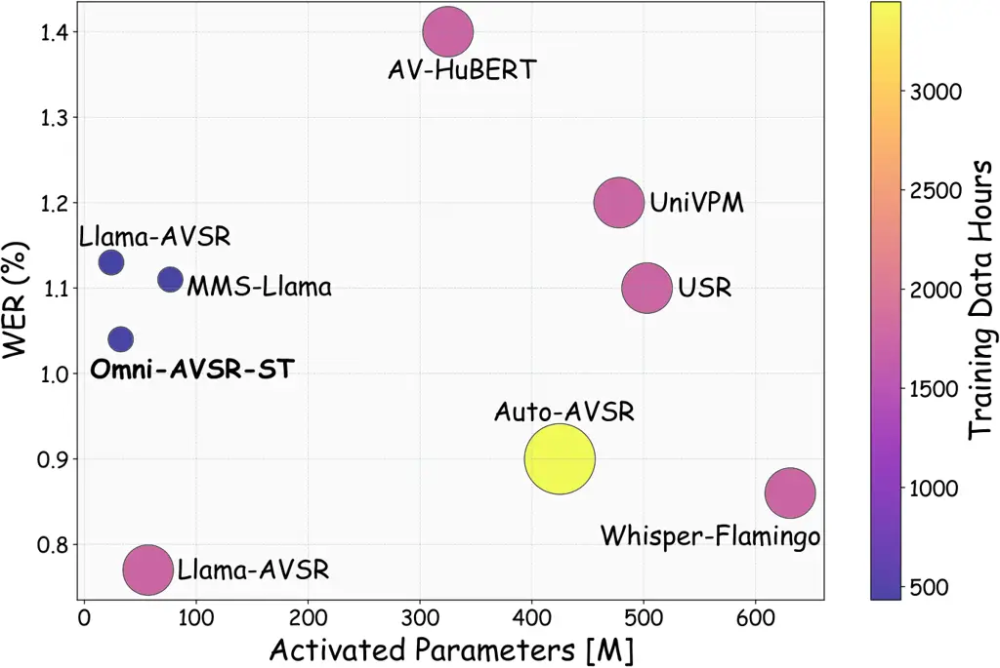

# OMNI-AVSR: Towards Unified Multimodal Speech Recognition with Large Language Models

Umberto Cappellazzo    Xubo Liu    Pingchuan Ma    Stavros Petridis   
Maja Pantic

###### Abstract

Large language models (LLMs) have recently achieved impressive results
in speech recognition across multiple modalities, including Auditory
Speech Recognition (ASR), Visual Speech Recognition (VSR), and
Audio-Visual Speech Recognition (AVSR). Despite this progress, current
LLM-based approaches typically address each task independently, training
separate models that raise computational and deployment resource use
while missing potential cross-task synergies. They also rely on
fixed-rate token compression, which restricts flexibility in balancing
accuracy with efficiency. These limitations highlight the need for a
unified framework that can support ASR, VSR, and AVSR while enabling
elastic inference. To this end, we present Omni-AVSR, a unified
audio-visual LLM that combines efficient multi-granularity training with
parameter-efficient adaptation. Specifically, we adapt the matryoshka
representation learning paradigm to efficiently train across multiple
audio and visual granularities, reducing its inherent training resource
use. Furthermore, we explore three LoRA-based strategies for adapting
the backbone LLM, balancing shared and task-specific specialization.
Experiments on LRS2 and LRS3 show that Omni-AVSR achieves comparable or
superior accuracy to state-of-the-art baselines while training a single
model at substantially lower training and deployment resource use. The
model also remains robust under acoustic noise, and we analyze its
scaling behavior as LLM size increases, providing insights into the
trade-off between performance and efficiency. Our code is available at:
[https://github.com/umbertocappellazzo/Omni-AVSR](https://github.com/umbertocappellazzo/Omni-AVSR)

###### Index Terms: 

Audio-Visual Speech Recognition, Multimodal LLMs, Matryoshka
Representation Learning

^(†)^(†)address: ^(♠) Imperial College London, UK    ^(♣) University of
Surrey, UK

## I Introduction

Auditory Speech Recognition (ASR) \[1, 2, 3\] often degrades in noisy
environments such as crowded areas or subways. To address this
limitation, Audio-Visual Speech Recognition (AVSR) \[4, 5, 6\]
incorporates visual cues, such as lip movements, which remain unaffected
by acoustic noise, thereby enhancing recognition robustness and
accuracy. Early AVSR methods relied on modality-specific encoders and
handcrafted fusion strategies \[7, 8, 9\]. The introduction of
Transformers \[10\] significantly advanced performance \[11, 12\],
spurring research into multimodal learning paradigms such as
self-supervision \[13, 14, 15\], ASR-to-AVSR distillation \[16, 17\],
and cross-modal complementarity \[18, 19\].

More recently, Multimodal Large Language Models (MLLMs) have
demonstrated that integrating modalities such as vision and speech
significantly extends the capabilities of LLMs, yielding
state-of-the-art results across diverse tasks \[20, 21, 22, 23, 24\].
Building on this progress, several studies have applied LLMs to ASR,
Visual Speech Recognition (VSR), and AVSR, with promising results \[25,
26, 27, 28, 29, 30, 31\].

However, most existing approaches treat each task in isolation, training
separate models for ASR, VSR, and AVSR. This not only increases
computational cost and complexity but also overlooks potential synergies
across tasks. In contrast, studies across multiple domains have
demonstrated the feasibility of unified multi-task multimodal LLMs \[32,
33, 34, 35, 36\]. While some attempts have been made to unify ASR, VSR,
and AVSR, these either rely on cumbersome student-teacher
pseudo-labeling frameworks \[37\] or underperform compared to
task-specific models \[38, 39, 40\].

Motivated by these limitations, we introduce Omni-AVSR, a unified
audio-visual LLM capable of performing ASR, VSR, and AVSR within a
single framework. To adapt the backbone LLM to all tasks in a
parameter-efficient manner, we propose three LoRA-based methods.
Furthermore, we adapt and optimize the matryoshka representation
learning paradigm \[41, 42, 30\] for our setting, enabling efficient
multi-granularity training while mitigating its inherent computational
cost. This allows the number of tokens to be dynamically adjusted at
inference according to resource availability and task requirements. To
the best of our knowledge, Omni-AVSR is the first audio-visual LLM that
supports ASR, VSR, and AVSR jointly while enabling elastic inference
under a single set of weights.

Our contributions are summarized as follows: (1) We provide a
comprehensive evaluation of Omni-AVSR on the LRS2 and LRS3 benchmarks,
showing that it achieves comparable or superior WER results across all
three tasks. Unlike prior methods that support only joint ASR–VSR–AVSR
within a single model, only multi-granularity, or neither, Omni-AVSR
simultaneously supports both within a single framework, substantially
reducing training and deployment resource use. (2) We demonstrate that
Omni-AVSR remains competitive with state-of-the-art methods under both
clean and noisy conditions. (3) We conduct scaling experiments to
analyze the trade-off between LLM size, performance, and computational
efficiency.

## II Omni-AVSR



Fig. 1: Overview of (a) the proposed Omni-AVSR model and (b) its
Omni-LoRA variants. Audio and video inputs are encoded by pre-trained
modality-specific encoders and compressed by applying selected audio and
video rates before projection into the LLM space. Omni-AVSR explores
three LoRA-based LLM adaptation strategies: 1) Omni-LoRA-S defines a
single LoRA module for both ASR, VSR, and AVSR; 2) Omni-LoRA-T dedicates
task-specific LoRAs; 3) Omni-LoRA-ST makes use of both a shared LoRA and
task-specific LoRA modules.

The goal of Omni-AVSR is to train a single unified LLM-based model
capable of performing ASR, VSR, and AVSR. At the same time, it enables
flexible control of audio–visual granularity at inference according to
resource constraints. In this way, Omni-AVSR supports multiple
modalities and granularities within a single set of weights, while
reducing training and deployment resource use and achieving performance
on par with, or even surpassing, state-of-the-art models trained
independently for specific tasks or granularities.

Following prior audio-visual LLMs \[25, 30, 26, 27\], Omni-AVSR
comprises pre-trained audio and video encoders, projection layers, and
an LLM backbone (see Fig. 1a). In the next sections, we detail how
Omni-AVSR is endowed with 1) explicit control over audio-visual
granularities during inference and 2) the ability to jointly support
ASR, VSR, and AVSR within a single model.

### II-A Multi-Granularity via Efficient Matryoshka Training

Given an audio waveform $`\mathbf{a}`$ and its corresponding lip
movement video $`\mathbf{v}`$, we process them with a pre-trained audio
encoder (e.g., Whisper \[43\]) and video encoder (e.g., AV-HuBERT
\[13\]) to obtain audio and visual tokens, $`\mathbf{Z}^{a}`$ and
$`\mathbf{Z}^{v}`$, respectively. Reducing token granularity lowers
computational cost and improves efficiency when feeding audio-visual
tokens into an LLM. In AVSR, temporal continuity across modalities
creates redundancy, yet most compression methods rely on fixed rates,
limiting adaptability to performance and resource trade-offs \[25, 26,
27\]. While finer-grained tokens enhance recognition accuracy, they
substantially increase inference compute cost due to the quadratic
complexity of Transformers.

To address this, Llama-MTSK \[30\] exploits the matryoshka
representation learning (MRL) principle \[42\] to flexibly control
audio-visual granularity at inference based on user requirements. During
training, token sequences at varying granularities are generated by
applying $`C_{A}`$ audio compression rates
{$`a_{1},a_{2},\cdots,a_{C_{A}}`$} and $`C_{V}`$ video rates
$`\{v_{1},v_{2},\cdots,v_{C_{V}}`$ to the input streams. For AVSR, each
of the $`C_{A}\cdot C_{V}`$ audio-visual sequences is fed to the LLM,
requiring $`C_{A}\cdot C_{V}`$ forward/backward passes per batch.

However, when extended to Omni-AVSR, which also supports ASR and VSR,
the compute cost grows further: $`C_{A}`$ passes for ASR, $`C_{V}`$ for
VSR, and $`C_{A}\cdot C_{V}`$ for AVSR. This leads to prohibitive
computational overhead and potential interference among multiple
objectives. To overcome this limitation, we introduce a key
modification: during training, we randomly select one audio rate
$`a_{i}`$ and one video rate $`v_{j}`$ at each iteration, yielding
compressed sequences $`\mathbf{Z}^{a_{i}}`$ and $`\mathbf{Z}^{v_{j}}`$.
This reduces the number of forward/backward LLM passes to only three,
one per task, instead of $`C_{A}+C_{V}+C_{A}\cdot C_{V}`$. These
compressed sequences are then passed through modality-specific
projection layers and concatenated with task-specific text tokens
$`X^{\text{P}}_{t}`$, where
$`t\in\{\mathsf{ASR},\mathsf{VSR},\mathsf{AVSR}\}`$ and
$`X^{\text{P}}_{t}`$ encodes both the task prompt and the transcription.
Therefore, we obtain:
$`\mathbf{Z}_{\mathsf{ASR}}=[\mathbf{Z}^{a_{i}},X^{\text{P}}_{\mathsf{ASR}}]`$,
$`\mathbf{Z}_{\mathsf{VSR}}=[\mathbf{Z}^{v_{j}},X^{\text{P}}_{\mathsf{VSR}}]`$,
and
$`\mathbf{Z}_{\mathsf{AVSR}}=[\mathbf{Z}^{a_{i}},\mathbf{Z}^{v_{j}},X^{\text{P}}_{\mathsf{AVSR}}]`$.
This strategy preserves the flexibility of MRL at inference while
substantially reducing its training resource use.

### II-B Joint ASR-VSR-AVSR Training Formulation

Omni-AVSR is trained by averaging the auto-regressive next token
prediction loss for each task for each input data. The LLM predicts the
response $`\mathbf{Y}=\{y_{s}\}_{s=1}^{S}`$ conditioned on the
multimodal input tokens, where $`S`$ represents the number of tokens of
the ground truth transcription. Accordingly, for each task-specific
sequence $`\mathbf{Z}_{t}`$, the probability of the target
$`\mathbf{Y}`$ is computed by
$`p(\mathbf{Y}|\mathbf{Z}_{t})=\prod_{s=1}^{S}p_{\theta}(y_{s}|\mathbf{Z}_{t},y_{<s})`$,
and the corresponding loss is defined as
$`\mathcal{L}_{t}=-\log p(\mathbf{Y}|\mathbf{Z}_{t})`$, where $`y_{<s}`$
is the generated output sequence up to token $`s-1`$, $`\theta`$ is the
trainable parameters, and
$`t\in\{\mathsf{ASR},\mathsf{VSR},\mathsf{AVSR}\}`$. Overall, the final
objective we train on is:

```math
\mathcal{L}_{\text{OMNI}}=\lambda_{\mathsf{ASR}}\mathcal{L}_{\mathsf{ASR}}+\lambda_{\mathsf{VSR}}\mathcal{L}_{\mathsf{VSR}}+\lambda_{\mathsf{AVSR}}\mathcal{L}_{\mathsf{AVSR}}, \tag{1}
```

where $`\lambda_{\mathsf{ASR}}`$, $`\lambda_{\mathsf{VSR}}`$,
$`\lambda_{\mathsf{AVSR}}`$ are task-specific weights.

### II-C Efficient LLM Adaptation via Omni-LoRA

In Omni-AVSR, following prior works \[25, 26, 30, 29, 27\], the
pre-trained LLM is kept frozen while low-rank LoRA modules \[44\] are
employed to parameter-efficiently fine-tune it. Given our multi-task
setting, we explore three configurations: 1) Omni-LoRA-S, 2)
Omni-LoRA-T, and 3) Omni-LoRA-ST, illustrated in Fig. 1b. These variants
allow us to systematically investigate the trade-off between parameter
sharing and task specialization within Omni-AVSR.

The Omni-LoRA-S variant employs a single Shared LoRA module to adapt the
query and value projection matrices of each LLM self-attention layer
across ASR, VSR, and AVSR tasks. Specifically, a frozen pre-trained
weight matrix $`W`$ is decomposed into low-rank factors with
down-projection parameters $`W_{down}\in\mathbb{R}^{d\times r}`$ and
up-projection parameters $`W_{up}\in\mathbb{R}^{r\times d}`$, where
$`r\ll d`$. Given an input $`\mathbf{Z}_{t}`$ for task $`t`$, the output
is computed as:
$`\mathbf{O}_{t}=\mathbf{Z}_{t}W+\alpha(\mathbf{Z}_{t}W_{down})W_{up}`$,
where $`\alpha`$ is a scaling hyperparameter.

The Omni-LoRA-T variant instead defines separate Task-specific LoRA
modules, with parameters $`W_{down}^{t}`$ and $`W_{up}^{t}`$ specialized
to each task. The output is then computed as:
$`\mathbf{O}_{t}=\mathbf{Z}_{t}W+\alpha(\mathbf{Z}_{t}W_{down}^{t})W_{up}^{t}`$.
Finally, Omni-LoRA-ST combines both Shared and Task-specific LoRA
modules, yielding:
$`\mathbf{O}_{t}=\mathbf{Z}_{t}W+\alpha(\mathbf{Z}_{t}W_{down})W_{up}+\alpha(\mathbf{Z}_{t}W_{down}^{t})W_{up}^{t}`$.
During training, Omni-LoRA-T and Omni-LoRA-ST activate all task-specific
modules. At inference, however, only the module corresponding to the
selected task is used, ensuring efficiency.

## III Experiments and Results

|                   |     |      |      |      |       |       |        |        |     |
| ----------------- | --- | ---- | ---- | ---- | ----- | ----- | ------ | ------ | --- |
| Method            | ASR |      | VSR  |      | AVSR  |       |        |        | Avg |
|                   | (4) | (16) | (2)  | (5)  | (4,2) | (4,5) | (16,2) | (16,5) |     |
| LRS2 Dataset      |     |      |      |      |       |       |        |        |     |
| Llama-AVSR \[25\] | 3.3 | 4.3  | 26.9 | 30.0 | 2.5   | 2.6   | 3.9    | 4.6    | 9.8 |
| Llama-MTSK \[30\] | 2.5 | 3.9  | 26.7 | 28.5 | 2.5   | 2.5   | 3.7    | 4.0    | 9.3 |
| Llama-MT          | 2.6 | 4.1  | 27.2 | 28.8 | 2.5   | 2.4   | 3.5    | 3.9    | 9.4 |
| Omni-AVSR-S       | 2.8 | 5.0  | 27.8 | 28.5 | 2.7   | 2.6   | 3.8    | 4.0    | 9.6 |
| Omni-AVSR-T       | 2.7 | 4.5  | 26.8 | 28.3 | 2.6   | 2.7   | 3.9    | 4.0    | 9.4 |
| Omni-AVSR-ST      | 2.7 | 4.8  | 27.8 | 29.5 | 2.5   | 2.7   | 3.9    | 4.2    | 9.8 |
| LRS3 Dataset      |     |      |      |      |       |       |        |        |     |
| Llama-AVSR \[25\] | 1.1 | 2.0  | 27.4 | 29.5 | 1.1   | 1.2   | 2.0    | 2.1    | 8.3 |
| Llama-MTSK \[30\] | 1.0 | 2.0  | 26.9 | 27.8 | 1.0   | 1.0   | 1.9    | 2.0    | 8.0 |
| Llama-MT          | 1.0 | 2.1  | 27.2 | 28.4 | 1.0   | 1.0   | 1.8    | 1.9    | 8.0 |
| Omni-AVSR-S       | 1.1 | 2.4  | 26.6 | 27.4 | 1.1   | 1.0   | 1.9    | 2.0    | 7.9 |
| Omni-AVSR-T       | 1.2 | 1.9  | 26.7 | 27.8 | 1.2   | 1.2   | 2.0    | 2.2    | 8.0 |
| Omni-AVSR-ST      | 1.2 | 2.0  | 26.8 | 27.1 | 1.0   | 1.1   | 1.8    | 1.9    | 7.9 |

TABLE I: ASR, VSR, AVSR results in terms of WER (%) across different
audio and video compression rates (e.g., (4,2)). The best results for
each specific task, rate and dataset are shown in bold.

|                   |                                        |                                        |
| ----------------- | -------------------------------------- | -------------------------------------- |
| Method            | \# Trained Models                      | \# LLM F/B Passes                      |
| Llama-AVSR \[25\] | $`C_{A}`$ + $`C_{V}`$ + $`C_{A}C_{V}`$ | $`C_{A}`$ + $`C_{V}`$ + $`C_{A}C_{V}`$ |
| Llama-MTSK \[30\] | $`T`$                                  | $`C_{A}`$ + $`C_{V}`$ + $`C_{A}C_{V}`$ |
| Llama-MT          | $`C_{A}C_{V}`$                         | $`T`$($`C_{A}C_{V}`$)                  |
| Omni-AVSR         | 1                                      | T                                      |

TABLE II: Computational cost analysis in terms of 1) the number of
trained models and 2) LLM forward/backward passes required to cover all
tasks and rates in training. Here, $`T`$ denotes the number of tasks,
while $`C_{A}`$/$`C_{V}`$ denotes the number of audio/video rates.

### III-A Experiment Settings

Datasets. We conduct experiments on LRS2 \[45\] and LRS3 \[46\]
datasets. LRS2 includes $`225`$ hours of footage from BBC programs. LRS3
contains $`433`$ hours of English video clips from TED talks.

Pre-Processing. We follow \[17, 25, 30\] for the datasets
pre-processing. For video, we crop the mouth region of interests (ROIs)
through a bounding box of $`96`$ × $`96`$. Each frame is normalised by
subtracting the mean and dividing by the standard deviation of the
training set. Audio data undergo z-normalisation per utterance.

Omni-AVSR Details. We use AV-HuBERT Large as the visual encoder and
Whisper medium as the audio encoder. The projection layers consist of
two linear layers with a ReLU activation in between. For the LLM
backbone, we adopt LLaMA 3.2-1B \[47\] in our main experiments.
Following prior work \[25, 30, 26\], both the LLM and video encoder are
fine-tuned via LoRA modules applied to the query and value projection
matrices with rank $`64`$.

Training/Inference Details. Following \[17, 25, 30\], we augment visual
inputs through horizontal flipping, random cropping, and adaptive time
masking, while for audio we apply adaptive time masking. We set the
textual prompts as in \[25, 30, 26\]: “Transcribe {task*prompt} to
text.”, where task_prompt $`\in`$ {“speech”, “video”, “speech and
video”}. We set $`\lambda*{\mathsf{ASR}}=\lambda*{\mathsf{AVSR}}=1`$ and
$`\lambda*{\mathsf{VSR}}=1.5`$. We train our Omni-AVSR models for $`8`$
epochs with AdamW optimizer with cosine annealing scheduler and weight
decay set to $`0.1`$. The learning rate is 1e-3. For decoding, we use
beam search with a beam width of $`15`$ and temperature of $`0.6`$.

Audio-Visual Granularities. For fair comparison with prior work \[30\],
we adopt the same compression rates, chosen to capture a spectrum of
efficiency–performance trade-offs at inference. Specifically, we use
{4,16} for ASR, {2,5} for VSR, and their Cartesian product for AVSR,
yielding four audio-visual configurations. Token compression is
performed via average pooling \[30\].

Baselines. As shown in Tables I and III, we compare Omni-AVSR variants
with three main approaches: 1) Llama-AVSR \[25\], which trains a
separate model for each task and compression rate; 2) Llama-MTSK \[30\],
which enables elastic inference by training on multiple rates but only
within a single task; 3) Llama-MT, which supports multi-task (MT)
training across ASR, VSR, and AVSR but requires a separate model for
each rate. In contrast, Omni-AVSR unifies both elastic inference and
multi-task learning within a single framework, subsuming these baselines
as special cases. Additional comparisons with AVSR sota methods are
provided in Section III-C.

|                           |          |     |     |      |      |
| ------------------------- | -------- | --- | --- | ---- | ---- |
| Method                    | SNR (dB) |     |     |      |      |
|                           | 5        | 2.5 | 0   | -2.5 | -5   |
| Compression rates: (4,2)  |          |     |     |      |      |
| Llama-AVSR \[25\]         | 2.6      | 4.1 | 4.8 | 12.1 | 19.1 |
| Llama-MTSK \[30\]         | 2.5      | 3.9 | 4.8 | 11.7 | 18.5 |
| Llama-MT                  | 2.6      | 3.9 | 4.4 | 11.1 | 17.8 |
| Omni-AVSR-ST              | 2.5      | 3.8 | 4.4 | 11.4 | 18.0 |
| Compression rates: (16,5) |          |     |     |      |      |
| Llama-AVSR \[25\]         | 4.2      | 5.8 | 6.5 | 14.9 | 22.1 |
| Llama-MTSK \[30\]         | 3.8      | 5.5 | 6.0 | 14.0 | 20.5 |
| Llama-MT                  | 3.7      | 5.1 | 6.0 | 13.4 | 20.1 |
| Omni-AVSR-ST              | 3.9      | 5.3 | 5.9 | 13.5 | 19.5 |

TABLE III: AVSR results on LRS3 across acoustic noise conditions.

|                     |          |       |                    |      |      |
| ------------------- | -------- | ----- | ------------------ | ---- | ---- |
| Method              | Train    | Train | WER $`\downarrow`$ |      |      |
|                     | Par. (M) | Hours | ASR                | VSR  | AVSR |
| u-HuBERT \[38\]^(‡) | 325      | 1759  | 1.5                | 29.1 | 1.3  |
| AV-CPL \[39\]^(‡)   | 325      | 1759  | 2.3                | 47.4 | 2.2  |
| MultiAVSR \[40\]    | 274      | 433   | 2.4                | 31.1 | 2.5  |
| USR \[37\]          | 171      | 433   | 1.9                | 34.3 | 1.6  |
| Omni-AVSR-ST (4,2)  | 58       | 433   | 1.2                | 26.8 | 1.0  |
| Omni-AVSR-ST (16,5) | 58       | 433   | 2.0                | 27.1 | 1.9  |

TABLE IV: Comparison with state-of-the-art methods using a single model
for ASR, VSR, and AVSR on LRS3. ^(‡)u-HuBERT and AV-CPL are trained on
LRS3 and VoxCeleb2, totaling $`1759`$ hours.



Fig. 2: Left: Comparison of Omni-AVSR-ST with state-of-the-art AVSR
methods in terms of WER, activated parameters, and training data hours
on LRS3. Right: Scaling trend of Omni-AVSR-ST when we increase the LLM
size on LRS3.

### III-B Main Results

Table I reports the ASR/VSR/AVSR results of our three Omni-AVSR variants
on LRS2 and LRS3. On LRS2, among the three proposed variants,
Omni-AVSR-T achieves the best performance, while on LRS3 all three
variants yield comparable results. This difference is likely due to the
larger training set of LRS3, which enables lower WERs overall,
particularly for ASR and AVSR. Compared with the baselines, we observe
the following: (1) all Omni-AVSR variants consistently outperform
Llama-AVSR, which requires a separate model per rate and task; (2)
Omni-AVSR-T on LRS2, and all three variants on LRS3, match or surpass
Llama-MTSK and Llama-MT, with Omni-AVSR-S and -T attaining average WERs
as low as $`7.9`$ across tasks on LRS3; (3) task-wise, Omni-AVSR
particularly benefits VSR; and (4) performance trends remain consistent
across compression rates. These results demonstrate that Omni-AVSR
delivers competitive or superior accuracy while unifying elastic
inference and multi-task learning within a single framework.

Beyond delivering strong recognition performance, Omni-AVSR also offers
significant computational advantages, as summarized in Table II. (1)
Omni-AVSR requires training only a single model, independent of the
number of tasks $`T`$ (ASR, VSR, and AVSR in our case, so $`T=3`$) and
the number of audio $`C_{A}`$ and video $`C_{V}`$ compression rates
($`C_{A}=C_{V}=2`$ in our setup). In contrast, the other three baselines
train multiple models that scale with the number of compression rates
(Llama-AVSR and Llama-MT) or with the number of tasks (Llama-MT). (2) We
further compare the methods in terms of the number of forward/backward
passes required over the LLM, since this constitutes the dominant
computational cost during training. Llama-AVSR and Llama-MTSK must
compute the loss separately for each compression rate and task,
requiring $`C_{A}`$ passes for ASR, $`C_{V}`$ for VSR, and
$`C_{A}C_{V}`$ for AVSR. Llama-MT trains one multi-task model for each
audio–visual rate pair, which results in $`T(C_{A}C_{V})`$ passes. In
contrast, Omni-AVSR computes the loss only once per task, as it samples
a single audio and video rate at each iteration, thus reducing the
requirement to just $`T`$ passes. Overall, Omni-AVSR requires only a
single model and substantially reduces overall training computations
compared to all baselines.

Results under Acoustic Noise. To evaluate the robustness of Omni-AVSR
under noisy conditions, we inject babble noise from the NOISEX dataset
\[48\] at varying SNRs. As shown in Table III, Omni-AVSR-ST consistently
outperforms Llama-AVSR and Llama-MTSK, and remains competitive with
Llama-MT across noise levels, often surpassing it at lower SNRs.

Comparison with Other Multi-task Methods.

In Table IV, we compare Omni-AVSR-ST with three state-of-the-art methods
that train a single model for ASR, VSR, and AVSR: u-HuBERT \[38\],
AV-CPL , MultiAVSR \[40\], and USR \[37\]. Unlike Omni-AVSR, these
methods do not support elastic inference. At the (4,2) compression
setting, Omni-AVSR-ST achieves the best performance across all tasks
while requiring significantly fewer parameters and surpassing u-HuBERT
and AV-CPL, despite both being trained on $`1759`$ hours of data (LRS3 +
VoxCeleb2 datasets). Even under the more extreme (16,5) compression,
Omni-AVSR-ST maintains competitive results within a single set of
weights.

### III-C Ablation Studies

|                            |                            |                             |     |      |      |      |       |        |
| -------------------------- | -------------------------- | --------------------------- | --- | ---- | ---- | ---- | ----- | ------ |
| $`\lambda_{\mathsf{ASR}}`$ | $`\lambda_{\mathsf{VSR}}`$ | $`\lambda_{\mathsf{AVSR}}`$ | ASR |      | VSR  |      | AVSR  |        |
|                            |                            |                             | (4) | (16) | (2)  | (5)  | (4,2) | (16,5) |
| 1                          | 1                          | 1                           | 2.9 | 5.7  | 27.0 | 28.6 | 2.7   | 4.4    |
| 1                          | 1.5                        | 1                           | 2.7 | 4.4  | 26.8 | 28.3 | 2.6   | 4.0    |
| 1                          | 2                          | 1                           | 2.7 | 4.4  | 27.0 | 28.5 | 2.5   | 4.0    |

TABLE V: Ablation on the best values of ASR/VSR/AVSR weights.

AVSR Comparison with Sota Methods. Fig. 2 (left) presents a comparison
of Omni-AVSR-ST with recent state-of-the-art approaches on LRS3 for the
AVSR task. Baselines include UniVPM \[49\], USR \[37\], Whisper-Flamingo
\[16\], Llama-AVSR \[25\], Auto-AVSR \[17\], AV-HuBERT \[13\], and
MMS-Llama \[27\]. Omni-AVSR-ST (evaluated at audio-video rates of (4,2))
achieves competitive WERs while requiring substantially fewer parameters
and training data hours than all baselines, within one consistent
framework.

LLM Scaling Trend. We study how scaling the LLM impacts performance in
Fig. 2 (right). Specifically, we evaluate Llama 3.2–1B, 3B, and 3.1–8B
\[47\], as well as Qwen 2.5–0.5B, 1.5B, 3B, 7B, 14B, and 32B \[50\].
Results are reported for ASR at audio rate 16 (black outline), VSR at
video rate 2 (violet outline), and AVSR at (4,2) rates. As shown,
performance improves with larger LLMs, with higher gains observed on
more challenging tasks (e.g., VSR) or under higher compression (e.g.,
ASR at rate 16). However, larger models incur greater training
computations, memory usage, and slower inference. Overall, LLMs in the
1–3B parameter range represent a favorable trade-off between accuracy
and efficiency.

Optimal Task-specific Weights. In Table V, we analyze the impact of
varying the loss weight coefficients in Eq. 1 for each task on LRS2. The
best performance is obtained with
$`\lambda_{\mathsf{ASR}}=\lambda_{\mathsf{AVSR}}=1`$ and
$`\lambda_{\mathsf{VSR}}=1.5`$. Since VSR is the most challenging of the
three tasks, assigning it a higher weight leads to improved overall
results.

## IV Conclusion

In this work, we present Omni-AVSR, the first unified audio-visual LLM
that jointly supports ASR, VSR, and AVSR while enabling elastic
inference under a single set of weights. By combining efficient
matryoshka-based multi-granularity training with LoRA adaptation
strategies, Omni-AVSR achieves strong performance while reducing
training and deployment resource use. Experiments on LRS2 and LRS3 show
that Omni-AVSR matches or surpasses state-of-the-art baselines, remains
robust in noisy conditions, and delivers favorable trade-offs when
scaling LLM size. Furthermore, Omni-AVSR provides significant
computational savings, requiring only one model and a reduced number of
LLM passes during training.

## References

- \[1\] D. Amodei et al. (2016) Deep speech 2: end-to-end speech
  recognition in english and mandarin. In ICML, Cited by: §I.
- \[2\] S. Watanabe et al. (2017) Hybrid ctc/attention architecture for
  end-to-end speech recognition. IEEE Journal of Selected Topics in
  Signal Processing 11, pp. 1240–1253. Cited by: §I.
- \[3\] R. Prabhavalkar et al. (2023) End-to-end speech recognition: a
  survey. IEEE/ACM TASLP 32, pp. 325–351. Cited by: §I.
- \[4\] S. Dupont and J. Luettin (2000) Audio-visual speech modeling for
  continuous speech recognition. IEEE transactions on multimedia 2,
  pp. 141–151. Cited by: §I.
- \[5\] G. Potamianos, C. Neti, J. Luettin, and I. Matthews (2004)
  Audio-visual automatic speech recognition: an overview. Issues in
  visual and audio-visual speech processing 22, pp. 23. Cited by: §I.
- \[6\] S. Petridis et al. (2018) End-to-end audiovisual speech
  recognition. In ICASSP, Cited by: §I.
- \[7\] K. Noda et al. (2015) Audio-visual speech recognition using deep
  learning. Applied intelligence 42, pp. 722–737. Cited by: §I.
- \[8\] Y. Mroueh et al. (2015) Deep multimodal learning for
  audio-visual speech recognition. In ICASSP, Cited by: §I.
- \[9\] S. Petridis et al. (2018) Audio-visual speech recognition with a
  hybrid ctc/attention architecture. In SLT, Cited by: §I.
- \[10\] A. Vaswani et al. (2017) Attention is all you need. NeurIPS.
  Cited by: §I.
- \[11\] T. Afouras et al. (2018) Deep audio-visual speech recognition.
  In TPAMI, Vol. 44, pp. 8717–8727. Cited by: §I.
- \[12\] P. Ma et al. (2021) End-to-end audio-visual speech recognition
  with conformers. In ICASSP, Cited by: §I.
- \[13\] B. Shi et al. (2022) Learning audio-visual speech
  representation by masked multimodal cluster prediction. In ICLR, Cited
  by: §I, §II-A, §III-C.
- \[14\] B. Shi et al. (2022) Robust self-supervised audio-visual speech
  recognition. In Interspeech, Cited by: §I.
- \[15\] A. Haliassos et al. (2023) Jointly learning visual and auditory
  speech representations from raw data. In ICLR, Cited by: §I.
- \[16\] A. Rouditchenko et al. (2024) Whisper-flamingo: integrating
  visual features into whisper for audio-visual speech recognition and
  translation. In Interspeech, Cited by: §I, §III-C.
- \[17\] P. Ma et al. (2023) Auto-avsr: audio-visual speech recognition
  with automatic labels. In ICASSP, Cited by: §I, §III-A, §III-A,
  §III-C.
- \[18\] J. Hong et al. (2023) Watch or listen: robust audio-visual
  speech recognition with visual corruption modeling and reliability
  scoring. In CVPR, Cited by: §I.
- \[19\] C. Chen et al. (2023) Leveraging modality-specific
  representations for audio-visual speech recognition via reinforcement
  learning. In AAAI, Cited by: §I.
- \[20\] S. Bai et al. (2025) Qwen2. 5-vl technical report. arXiv
  preprint arXiv:2502.13923. Cited by: §I.
- \[21\] H. Yao et al. (2024) Dense connector for mllms. In NeurIPS,
  Cited by: §I.
- \[22\] Y. Fathullah et al. (2024) Prompting large language models with
  speech recognition abilities. In ICASSP, Cited by: §I.
- \[23\] A. Goel et al. (2025) Audio flamingo 3: advancing audio
  intelligence with fully open large audio language models. arXiv
  preprint arXiv:2507.08128. Cited by: §I.
- \[24\] B. Wu et al. (2025) Step-audio 2 technical report. arXiv
  preprint arXiv:2507.16632. Cited by: §I.
- \[25\] U. Cappellazzo et al. (2025) Large language models are strong
  audio-visual speech recognition learners. In ICASSP, Cited by: §I,
  §II-A, §II-C, §II, §III-A, §III-A, §III-A, §III-A, §III-C, TABLE I,
  TABLE I, TABLE II, TABLE III, TABLE III.
- \[26\] U. Cappellazzo et al. (2025) Scaling and enhancing llm-based
  avsr: a sparse mixture of projectors approach. In Interspeech, Cited
  by: §I, §II-A, §II-C, §II, §III-A, §III-A.
- \[27\] J. Yeo et al. (2025) MMS-llama: efficient llm-based
  audio-visual speech recognition with minimal multimodal speech tokens.
  In ACL Findings, Cited by: §I, §II-A, §II-C, §II, §III-C.
- \[28\] J. Yeo et al. (2025) Zero-avsr: zero-shot audio-visual speech
  recognition with llms by learning language-agnostic speech
  representations. In ICCV, Cited by: §I.
- \[29\] J. Yeo et al. (2024) Where visual speech meets language:
  vsp-llm framework for efficient and context-aware visual speech
  processing. In EMNLP Findings, Cited by: §I, §II-C.
- \[30\] U. Cappellazzo et al. (2025) Adaptive audio-visual speech
  recognition via matryoshka-based multimodal llms. In ASRU, Cited by:
  §I, §I, §II-A, §II-C, §II, §III-A, §III-A, §III-A, §III-A, §III-A,
  TABLE I, TABLE I, TABLE II, TABLE III, TABLE III.
- \[31\] U. Cappellazzo et al. (2025) MoME: mixture of matryoshka
  experts for audio-visual speech recognition. In NeurIPS, Cited by: §I.
- \[32\] X. Zhu et al. (2024) Uni-med: a unified medical generalist
  foundation model for multi-task learning via connector-moe. In
  NeurIPS, Cited by: §I.
- \[33\] Z. Li et al. (2025) UnifiedMLLM: enabling unified
  representation for multi-modal multi-tasks with large language model.
  In NAACL Findings, Cited by: §I.
- \[34\] J. Wu et al. (2024) Omni-smola: boosting generalist multimodal
  models with soft mixture of low-rank experts. In CVPR, Cited by: §I.
- \[35\] J. Xu et al. (2025) Qwen2. 5-omni technical report. arXiv
  preprint arXiv:2503.20215. Cited by: §I.
- \[36\] S. Zhang et al. (2025) Stream-omni: simultaneous multimodal
  interactions with large language-vision-speech model. arXiv preprint
  arXiv:2506.13642. Cited by: §I.
- \[37\] A. Haliassos et al. (2024) Unified speech recognition: a single
  model for auditory, visual, and audiovisual inputs. In NeurIPS, Cited
  by: §I, §III-B, §III-C, TABLE IV.
- \[38\] W. Hsu et al. (2022) U-hubert: unified mixed-modal speech
  pretraining and zero-shot transfer to unlabeled modality. In NeurIPS,
  Cited by: §I, §III-B, TABLE IV.
- \[39\] A. Rouditchenko et al. (2024) Av-cpl: continuous
  pseudo-labeling for audio-visual speech recognition. In ECCV, Cited
  by: §I, TABLE IV.
- \[40\] S. Torrie et al. (2025) MultiAVSR: robust speech recognition
  via supervised multi-task audio–visual learning. Electronics. Cited
  by: §I, §III-B, TABLE IV.
- \[41\] A. Kusupati et al. (2022) Matryoshka representation learning.
  In NeurIPS, Cited by: §I.
- \[42\] M. Cai et al. (2025) Matryoshka multimodal models. In ICLR,
  Cited by: §I, §II-A.
- \[43\] A. Radford et al. (2023) Robust speech recognition via
  large-scale weak supervision. In ICML, Cited by: §II-A.
- \[44\] E. Hu et al. (2022) Lora: low-rank adaptation of large language
  models.. In ICLR, Cited by: §II-C.
- \[45\] J. Chung et al. (2017) Lip reading sentences in the wild. In
  CVPR, Cited by: §III-A.
- \[46\] T. Afouras et al. (2018) LRS3-ted: a large-scale dataset for
  visual speech recognition. arXiv preprint arXiv:1809.00496. Cited by:
  §III-A.
- \[47\] A. Dubey et al. (2024) The llama 3 herd of models. arXiv
  preprint arXiv:2407.21783. Cited by: §III-A, §III-C.
- \[48\] A. Varga (1992) Assessment for automatic speech
  recognition: ii. noisex-92: a database and an experiment to study the
  effect of additive noise on speech recognition systems. Elsevier
  Speech Commun. Cited by: §III-B.
- \[49\] Y. Hu et al. (2023) Hearing lips in noise: universal
  viseme-phoneme mapping and transfer for robust audio-visual speech
  recognition. arXiv preprint arXiv:2306.10563. Cited by: §III-C.
- \[50\] A. Yang et al. (2024) Qwen2.5 technical report. arXiv preprint
  arXiv:2412.15115. Cited by: §III-C.
