# Towards Effective and Efficient Non-autoregressive decoders for Conformer and LLM-based ASR using Block-based Attention Mask

Tianzi Wang    Xurong Xie    Zengrui Jin    Mengzhe Geng    Jiajun Deng
   Zhaoqing Li    Shoukang Hu    Shujie Hu    Guinan Li    Mingyu Cui   
Helen Meng    Xunying Liu ^(†)^(†)thanks: Tianzi Wang, Jiajun Deng,
Zhaoqing Li, Shujie Hu, Guinan Li, Mingyu Cui, Helen Meng, and Xunying
Liu are with the Chinese University of Hong Kong, China (email: {twang,
jjdeng, zqli, sjhu, gnli, mycui, hmmeng,
xyliu}@se.cuhk.edu.hk)^(†)^(†)thanks: Xurong Xie is with the Institute
of Software, Chinese Academy of Sciences, China (email:
xurong@iscas.ac.cn)^(†)^(†)thanks: Zengrui Jin is with Tsinghua
University, China (email:˜zrjin@tsinghua.edu.cn)^(†)^(†)thanks: Mengzhe
Geng is with National Research Council Canada, Canada (email:
Mengzhe.Geng@nrc-cnrc.gc.ca)^(†)^(†)thanks: Shoukang Hu is with Nanyang
Technological University, Singapore (email:
shoukang.hu@ntu.edu.sg)^(†)^(†)thanks: Xunying Liu and Xurong Xie are
the corresponding authors.

###### Abstract

Automatic speech recognition (ASR) systems often rely on autoregressive
(AR) Transformer decoder architectures, which limit efficient inference
parallelization due to their sequential nature. To this end,
non-autoregressive (NAR) approaches aim primarily to achieve significant
decoding speedup while the maintaining recognition accuracy that is
comparable to AR baselines. This paper proposes a novel NAR block-based
attention mask decoder (AMD) that effectively improves decoding
efficiency while maintaining ASR accuracy, and also offering flexibility
in balancing the performance-efficiency trade-off on both Conformer and
large language model (LLM)-based ASR systems. The proposed AMD performs
parallel inference within contiguous blocks of output labels while
maintaining monotonic left-to-right prediction between blocks. A
one-pass beam search algorithm is designed to dynamically fuse
Connectionist Temporal Classification (CTC), AR decoder, and AMD
probabilities. Experiments are conducted on normal speech LS960 and
DBank elderly speech across: a) The Conformer encoder-decoder ASR system
with filterbank input features; b) its integration with WavLM features;
and c) further advancement by integrating an LLM-based decoder. On the
LS960 task, the proposed AMD empowered tripartite decoder achieves
decoding speedup ratios of up to 1.44x, 1.55x, and 2.31x under the three
model configurations over the CTC + AR baselines, without statistically
significant WER increases. When operating with real-time factors (RTFs)
comparable to the baselines, the tripartite decoder produces
statistically significant WER reductions of 0.19%, 0.62% and 0.13%
absolute (4.3%, 16.3%, and 3.8% relative). Similar improvements are also
obtained on the DBank task, where the tripartite decoder accelerates
decoding by up to 1.38x, 1.64x and 1.61x without statistically
significant WER increase, and yields statistically significant WER
reductions of 0.46%, 0.38% and 0.41% absolute (1.8%, 1.8%, and 2.0%
relative) when operating with RTFs comparable to the CTC + AR baselines.

###### Index Terms: 

Speech Recognition, Non-autoregressive decoder, Autoregressive decoder,
LLM, Conformer, Beam Search

## I Introduction

State-of-the-art automatic speech recognition (ASR) systems, in
particular Conformer encoder-decoder models with joint Connectionist
Temporal Classification (CTC) and attention cost  \[1, 2, 3, 4, 5\], are
often based on an autoregressive (AR) Transformer decoder architectures.
Under this paradigm, AR model inference is conditioned only on the
left-context, enforcing a strictly monotonic, left-to-right decoding
process in which each output token is predicted one at a time. AR
Transformer decoders have been successfully adopted by current ASR
systems, and in a wider context, mainstream large language models
(LLMs) \[6, 7, 8, 9, 10, 11, 12, 13, 14, 15, 16, 17, 18, 19, 20, 21, 22,
23\] that have been increasingly integrated into these systems  \[24,
25, 26, 27, 28, 29, 30, 31, 32, 33, 34, 35, 36, 37\] and sparked a
paradigm shift in speech technology research. However, the sequential
nature of AR Transformer decoders limits their potential for model
inference parallelization for practical application scenarios that are
not only performance-critical but also efficiency-sensitive. One general
solution to address the above issue is to adopt non-autoregressive (NAR)
Transformer based decoder designs. NAR Transformers provide more
powerful parallelization than their AR counterparts to improve inference
speed. Their efficient designs have been widely exploited across a wide
range of applications including, but not limited to, machine translation
 \[38, 39, 40, 41, 42, 43, 44, 45, 46, 47, 48, 49\], dialogue systems
 \[50, 51, 52, 53\] and speech translation  \[54, 55, 56, 57\].

### I-A Non-autoregressive Approaches for ASR

However, the development of NAR Transformer decoder architectures that
can flexibly balance the performance-efficiency trade-off for ASR
systems remains a notoriously challenging “zero sum game”, and has
attracted increasingly research attention in recent years. To this end,
prior researches include, but not limited to, the following categories:
a) mask-based NAR  \[58, 59, 60, 61, 62, 63\] learn to fill the randomly
masked training label tokens conditioned on the unmasked ones. Among
these, conditional masked language models (CMLMs) were first introduced
in  \[61\], before being further used by Mask-CTC and its variants
 \[58, 59, 60\] to refine CTC predictions. b) alignment-refinement based
approaches  \[64, 65, 66, 67, 68\] that aim to refine the initial CTC
produced alignment by injecting noisy labels extracted from, for
example, auto-encoders in the Align-Refine method  \[64\], or noise
perturbed encoder alignment posteriors in the Align-Denoise approach
 \[65\]. Further developments in this category include CASS-NAT and its
variants  \[66, 67, 68\], which employ CTC alignments to extract
token-level acoustic embeddings to allow parallel decoding using
bidirectional attention-based decoders. c) integrate-and-fire (IF) based
approaches  \[69, 70, 71, 72\]. Continuous IF (CIF)  \[69\] alignment
modules and their variants  \[70\] are utilized by Paraformer  \[71\]
and E-Paraformer  \[72\] models to perform parallel inference over
output tokens. d) hybrid AR+NAR decoders that exploit their
complementarity in combination  \[73, 74, 75\]. The 4D ASR approach
 \[73\] jointly trains CTC \[76\], attention, RNN-T and mask-prediction
decoders, while using only mask-prediction decoder for NAR inference.
 \[74\] adopts NAR for initial prediction followed by AR rescoring.
Deliberation-based approaches  \[75\] refine streaming RNN-T hypotheses
using Align-Refine NAR. These hybrid approaches either operate with an
expensive multi-pass decoding strategy, or rely solely on a single NAR
decoder to “correct” the errors in the initial recognition hypotheses.
In contrast, only limited researches have been conducted on LLM oriented
NAR decoding techniques. Existing researches in this direction largely
focus on using multi-pass rescoring based approaches. For example, PaLM
2 language model  \[77\] was used in  \[78\] to rescore the CTC decoding
outputs produced by the first decoding pass Universal Speech Model (USM)
 \[79\]. Beyond these LLM rescoring based shallow fusion approaches,
there is a notable lack of exploration on effective and efficient NAR
decoding techniques when LLMs serve directly as the decoders in a single
pass recognition framework  \[24, 25, 26, 27, 28, 29, 30, 31, 32, 33,
34, 35, 36, 37, 80\].

### I-B Key Challenges in Non-autoregressive ASR

Efforts on developing high-performance and low-latency NAR-based ASR
models require several key challenges to be addressed.

a) NAR models’ assumption of conditional independence among output
tokens results in an intrinsic lack of monotonic sequence modeling
constraints, which leads to their large performance gap against
state-of-the-art ASR systems based on AR designs. The individual output
tokens predicted by the NAR decoder are assumed to be temporally
independent against each other. Despite recent attempts to mitigate such
modeling deficiency of NAR ASR systems using, for example, Mask-CTC and
its improved variants  \[58, 59\], or iterative alignment-refinement
approaches  \[64, 65\], their performance gap against AR counterparts
still exists.

b) Lack of effective and efficient one-pass decoding algorithm that is
purpose-designed for NAR decoders and their further integration with CTC
and AR ones. Prior research in this direction either deployed standalone
NAR decoders in a later rescoring pass within a multi-pass decoding
framework  \[73\], while the first pass recurrent neural network
transducer (RNN-T) decoding serves to produce an initial set of
hypotheses  \[75\], or vice versa when the NAR decoders are used in the
initial N-best generation before AR rescoring  \[74\].

c) Lack of efficient and effective NAR decoders in LLM-based speech and
audio models that are mainly based on AR decoder architectures \[24, 25,
26, 27, 28, 29, 30, 31, 32, 33, 34, 35, 36, 37\]. Research on
LLM-oriented NAR decoding techniques remains limited to date. Existing
efforts predominantly following multi-pass rescoring-based
paradigms \[78\], rather than employing LLMs directly as NAR decoders in
a one-pass recognition framework.

d) Lack of application to atypical speech domains. Prior research on
NAR-based ASR have been mainly conducted on typical speech where large
quantities of domain data are often available  \[58, 59, 60, 61, 64, 65,
66, 67, 68, 69, 70, 71, 72, 73, 74, 75, 81, 82\]. In contrast, their
efficacy when being applied to medical and healthcare domain data, for
example, the highly scarce, disfluent, inarticulate and diverse elderly
speech recorded during neurocognitive impairment assessment interviews,
remains under-explored to date.

### I-C The Proposed Approach

To this end, building upon \[83\], this paper proposes a novel
non-autoregressive block-based attention mask decoder (AMD) that
flexibly balances performance-efficiency trade-offs for both
Conformer \[84\] encoder-decoder and LLM-based ASR systems. The AMD
leverages both parallel NAR inference and monotonic left-to-right AR
prediction. A beam search algorithm is designed to leverage a dynamic
fusion of CTC, AR decoder, and AMD probabilities. In addition to
fixed-size attention-masking blocks during NAR inference, mixed-size
blocks were also explored to facilitate cold start monotonic inference
(block size = 1) for the initial N labels of each speech segment, before
switching to parallel label prediction (block size $`>`$ 1) for the
remaining labels. The effectiveness of our AMD is demonstrated on both
WavLM  \[85\] features empowered Conformer encoder-decoder models and
LLM (Llama-3.2-1B-Instruct  \[86\]) based ASR systems across both
typical and atypical, elderly speech domain data.

Experiments are conducted on the benchmark LibriSpeech 960-hour (LS960)
normal speech dataset \[87\] and DementiaBank Pitt \[88\] (DBank)
elderly speech corpus across three model configurations: a) The
Conformer encoder-decoder ASR system with filterbank (FBank) input
features; b) its integration with WavLM features; and c) further
advancement by replacing the original decoder with an LLM-based decoder.

On the LS960 task, the proposed AMD empowered tripartite decoder
respectively achieves speedup ratios of up to 1.44x, 1.55x, and 2.31x
under the three model configurations, without statistically significant
WER increase over the CTC + AR baselines. When operating with RTFs
comparable to the CTC + AR baselines, the tripartite decoder produces
statistically significant absolute WER reductions of 0.19%, 0.62% and
0.13% (4.3%, 16.3%, and 3.8% relative) across the three configurations
over their respective CTC + AR baselines. Similar trends are observed on
the DBank task.

The main contributions of this paper are as follows:

a) This paper presents a novel block-based attention mask decoder (AMD)
that flexibly balances performance-efficiency trade-offs for Conformer
ASR systems in recognition time. For the first time, this NAR decoder
allows: 1) decoding time speedup via non-autoregressive, parallel
inference without increasing ASR WERs; and 2) statistically significant
WER reductions over AR decoders when operating with the same decoding
real-time factors. In contrast, large performance degradation was often
observed in prior research when alternative forms of NAR decoders  \[58,
59, 65\], e.g. Mask-CTC, were used, or failed to provide the WERs at
equivalent real- time factors for fair comparison  \[71\].

b) A novel one-pass beam search algorithm is designed to leverage a
dynamic fusion of CTC, AR decoder, and AMD probabilities. In contrast,
prior research have largely deployed NAR decoders in a more
time-consuming multi-pass decoding framework  \[73, 75, 60, 89, 90\].

c) In contrast to prior LLM-based ASR systems that largely operate with
AR decoders, this paper presents a novel NAR LLM-based decoder using our
AMD. Experimental results show that compared to the CTC + AR baseline,
the proposed tripartite decoder achieves significant decoding speedups
without a statistically significant WER increase. And when operating at
an RTF comparable to the baseline, the tripartite decoder yields
statistically significant WER reductions. In contrast, prior research
either uses only LLM-based AR decoders \[24, 25, 26, 27, 28, 29, 30, 31,
32, 33, 34, 35, 36\] or employs LLM-oriented NAR decoding techniques in
multi-pass rescoring  \[78\].

d) This paper demonstrates that the ASR performance gains and efficiency
enhancement from AMD tripartite decoders on typical speech (LS960) are
preserved when they are applied to highly scarce, disfluent,
inarticulate and diverse elderly speech. These consistent improvements
across typical and atypical speech domains highlight the robustness of
our approach. In contrast, prior NAR-based ASR research primarily
focused on typical speech domains \[58, 59, 60, 61, 64, 65, 66, 67, 68,
69, 70, 71, 72, 73, 74, 75\] with abundant training data.

Compared to our prior conference paper \[83\], this paper represents a
large extension include: 1) novel algorithmic enhancements through the
integration of our AMD framework with LLMs, featuring a
parameter-efficient shared-backbone design; and 2) extensive
experimental validation, scaling results to the full LS960 dataset and a
new domain of atypical elderly speech (DBank).

The rest of the paper is organized as follows. Section II reviews the
hybrid CTC + AR encoder-decoder based Conformer ASR system. Section III
describes the proposed AMD-empowered tripartite decoder for Conformer
ASR, as well as their further integration with WavLM features and
LLM-based decoders. Section IV presents the one-pass beam search
algorithm and mixed block size decoding approaches for the AMD
tripartite decoder. Section V details the experimental setup, Section VI
describes the ablation studies that inform our design choices, and
Section VII presents the final comparative results on the normal speech
LS960 and DBank elderly speech corpora. Conclusion is drawn in Section
VIII together with discussion of possible future work.

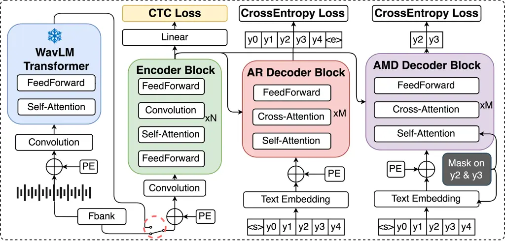

Fig. 1: The proposed ASR system architecture illustrating two
configurations: using FBank features directly as input (lower one in the
red dotted circle); or using frozen pre-trained WavLM (blue) as a
feature extractor (upper one in the red dotted circle). Both
configurations utilize the Conformer encoder followed by a tripartite
decoder that includes the proposed non-autoregressive block-based
attention mask decoder (AMD) (purple) in addition to the CTC module
(yellow) and attention-based AR decoder (red).

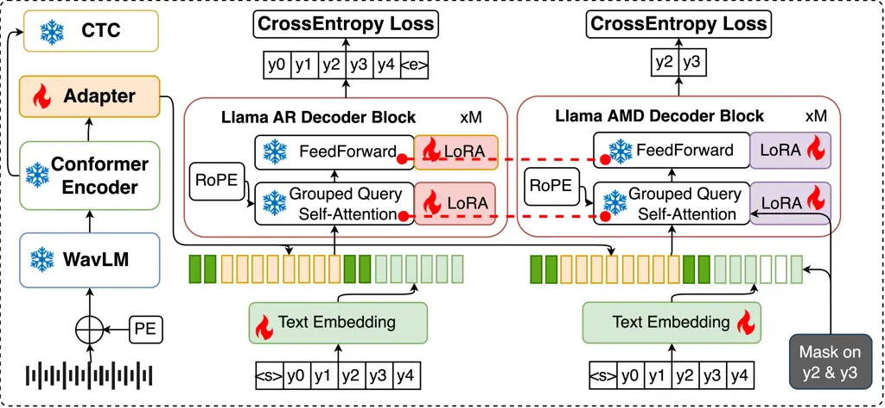

Fig. 2: The enhanced ASR architecture incorporating frozen pre-trained
WavLM feature extractor, Conformer encoder and CTC decoder, integrated
with Llama-based AR and AMD decoders. While the Llama backbone remains
frozen, only the adapters (left, yellow) between encoder and decoder and
decoder-specific LoRA (red and purple) parameters are trained, along
with text embeddings (green). The adapted encoder outputs are
concatenated with text embeddings before feeding into the decoders.
Dotted red lines denote shared weights between components.

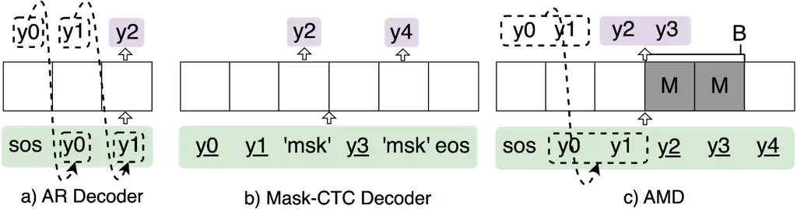

Fig. 3: Inference using: a) an AR decoder, b) a Mask Prediction decoder;
c) the proposed AMD. “msk” refers to input mask tokens, M is the
attention mask within contiguous blocks for parallel inference via AMD,
‘B’ refers to the block size. Tokens (green) denote decoder inputs at
the current inference step. Tokens (purple) denote predicted tokens at
current step. Tokens in dashed boxes in a) and c) represent those from
the previous inference step. Tokens with “\_” denote those obtained from
CTC prediction.

## II Hybrid CTC + AR Encoder-Decoder Based ASR

This paper employs a hybrid CTC-attention encoder-decoder (AED) based
ASR system  \[1\] comprising three key components: A shared
Conformer-based encoder, a CTC decoder and an attention-based AR
decoder. The combined CTC plus AR loss function is used for model
training,

```math
\vskip-2.84526pt\mathcal{L}_{\text{C-A}}=\gamma_{1}\mathcal{L}_{\text{CTC}}+\gamma_{2}\mathcal{L}_{\text{AR}}, \tag{1}
```

where $`\gamma_{1}`$ and $`\gamma_{2}`$ denote the weights applied to
the CTC and AR decoder objectives during training, respectively.

This ASR system employs a label synchronous autoregressive beam search
strategy  \[1\] during inference, incorporating both CTC and AR decoder
probabilities to generate the final hypothesis. For a partial hypothesis
$`\bm{h}{\leq i}`$ at the $`i`$-th decoding step, its score is computed
as

```math
\vskip-2.84526pt\alpha_{\text{C-A}}(\bm{h}_{\leq i})=\lambda_{1}\alpha_{\text{CTC}}(\bm{h}_{\leq i})+\lambda_{2}\alpha_{\text{AR}}(\bm{h}_{\leq i}), \tag{2}
```

where $`\lambda_{1}`$ and $`\lambda_{2}`$ represent the respective
weights for the CTC and AR decoder scores during the decoding process.

The CTC score $`\alpha_{\text{CTC}}`$ represents the log probability of
all possible token sequences sharing the common prefix
$`\bm{h}_{\leq i}`$,

```math
\vskip-2.84526pt\alpha_{\text{CTC}}(\bm{h}_{\leq i})=\text{log}P_{\text{CTC}}(\bm{h}_{\leq i},\cdots\mid\bm{\mathcal{X}}), \tag{3}
```

where $`\bm{\mathcal{X}}`$ denote the encoder outputs.

The AR decoder generates token probabilities conditioned on both the
previous tokens $`\bm{h}_{<i}`$ and encoder outputs
$`\bm{\mathcal{X}}`$, expressed as
$`P_{AR}(y_{i}\mid\bm{h}_{<i},\bm{\mathcal{X}})`$. The AR decoder score
is

```math
\alpha_{\text{AR}}(\bm{h}_{\leq i})=\text{log}\prod_{j=1}^{i}P_{\text{AR}}(y_{j}\mid\bm{h}_{<j},\bm{\mathcal{X}}).\vskip-8.53581pt \tag{4}
```

However, the sequential nature of the AR decoder limits its potential
for parallelization, making it a bottleneck in efficiency-sensitive
applications.

## III AMD Empowered Tripartite Decoder

To address this limitation, we propose an AMD-empowered tripartite
decoder designed to flexibly balance the performance-efficiency
trade-off. As detailed in Section III-A, this architecture integrates a
novel non-autoregressive block-based attention mask decoder (AMD)
(Figure 2, purple) alongside the standard CTC module (Figure 2, yellow)
and attention-based AR decoder (Figure 2, red). Further integration with
both WavLM features (Figure 2, blue) and LLM-based decoder (Figure 2)
are introduced in Section III-B and Section III-C respectively.

### III-A Block-Based Attention-Mask Decoder

Figure 3 shows three decoding approaches respectively using: a) an AR
decoder; b) a Mask Prediction decoder; and c) our proposed AMD.

As illustrated in Figure 3 (a), the AR decoder generates output tokens
autoregressively, with each token’s probability conditioned on all
previously predicted tokens in a strictly left-to-right manner. In
contrast, the NAR Mask-CTC decoder  \[58\] enables concurrent prediction
of multiple tokens by replacing selected input positions with special
“msk” symbols (e.g., $`{y_{2}}`$ and $`y_{4}`$, Figure 3 (b)), thereby
relaxing the sequential dependencies between masked positions. To
address potential performance degradation associated with predicting all
tokens simultaneously, the Mask-CTC decoder can be restricted to
selectively predict only a small subset of tokens, with these positions
determined by CTC scores at inference time.

However, the embedding of the “msk” token can still receive non-zero
attention from other positions. In contrast, the proposed AMD enforces a
hard constraint by directly modifying the attention scores to completely
prevent the masked positions from contributing to the context vectors of
other tokens. As illustrated in Figure 3 (c), AMD uniquely combines
parallel NAR inference and AR prediction. It employs block-based
attention masks “M” to perform parallel inference within contiguous
token blocks (e.g., $`{y_{2}}`$ and $`{y_{3}}`$), while maintaining
sequential AR prediction between blocks. To prevent information leakage,
AMD sets both the attention weights and token embedding outputs at
masked positions to zeros. Unlike Mask-CTC, AMD performs prediction over
all tokens without subset selection.

For a given input sequence $`\bm{h}`$ and encoder outputs
$`\bm{\mathcal{X}}`$, the AMD probability for the $`j`$-th token within
an attention-masked block spanning positions $`[i,i+B-1]`$ is defined as

```math
P_{\text{AMD}}(y_{j}\mid\bm{h},\bm{\mathcal{X}})=P_{\text{AMD}}(y_{j}\mid\bm{h}_{<i},\bm{h}_{>i+B-1},\bm{\mathcal{X}})\vskip-2.84526pt \tag{5}
```

where $`B`$ represents the block size. During training, AMD utilizes
ground truth labels as input. We employ a specific training strategy to
enhance the AMD model’s generalization to all tokens in the training
data, and its adaptability to varying block sizes during inference. For
each training sentence, we perform four forward passes over all tokens.
Each pass uses attention-mask blocks of a different size. The size is
randomly sampled from the range \[1, $`L`$\], where $`L`$ is the
sentence length. The AMD loss function $`\mathcal{L}_{\text{AMD}}`$ is
formulated as

```math
\mathcal{L}_{\text{AMD}}=-\sum_{n=1}^{4}\text{log}\prod_{j=1}^{L}P_{\text{AMD}}(y_{j}\mid\bm{h}_{<i},\bm{h}_{>i+B_{n}-1},\bm{\mathcal{X}}) \tag{6}
```

In this work, we investigate two distinct random masking strategies in
our proposed AMD for implementing the AMD loss function
$`\mathcal{L}_{\text{AMD}}`$,

a) Uniform attention-mask block size sampling (UNI.) maintains
consistent block sizes within each of the 4 attention masked forward
passes ($`n=1,\dots,4`$) performed over each utterance. For a given
utterance of $`L`$ tokens, each forward pass $`n`$ randomly samples and
uses a single block size $`B_{n}\in[1,L]`$ that remains constant for all
the token positions $`1\leq j\leq L`$ within this utterance.

b) Variable attention-mask block size sampling (VAR.) introduces varying
block sizes within each of the 4 forward passes performed for a training
data utterance. For a given utterance of $`L`$ tokens, each forward pass
$`n`$ randomly samples and uses a locally varying block size
$`B_{n}\in[1,L]`$ that remains constant for all the token positions
$`j`$ within the same attention masked region
($`i\leq j\leq i+B_{n}-1`$) within this utterance.

The AMD framework is designed to be model-agnostic and can be integrated
into various AR-based architectures. This is demonstrated in the
following sections, where it is applied to a Conformer-based ASR system
(enhanced with pre-trained speech features) and an LLM-based ASR system.

### III-B Integration with Pre-trained Speech Model

A common approach of integrating pre-trained speech models \[91, 92, 85,
93\] into ASR systems is to use their features. These domain invariant
features are learned during pre-training using large quantities of
diverse speech data. To accomplish this, the constructed ASR system
employs WavLM  \[85\] as the feature extractor, which is then passed
through a Conformer-based encoder, followed by the proposed tripartite
decoder. WavLM is particularly well-suited for this role as it comprises
CNN downsampling layers and Transformer blocks that jointly learn masked
speech token prediction and denoising during pre-training.

As shown in Figure 2 (left, blue), let $`\bm{\mathcal{M}}_{\text{WL}}`$
denote the WavLM-model that produces contextualized representations
$`\bm{\mathcal{X}}_{\text{WL}}\in\mathbb{R}^{T^{\prime}\times D}`$ for a
given input waveform $`\bm{x}\in\mathbb{R}^{T}`$,

```math
\bm{\mathcal{X}}_{\text{WL}}=\bm{\mathcal{M}}_{\text{WL}}(\bm{x}\mid\bar{\bm{W}}_{\text{WL}}),\vskip-2.84526pt \tag{7}
```

where $`T`$ and $`T^{\prime}`$ denote the temporal dimensions before and
after downsampling is performed by WavLM’s CNN encoder, respectively.
$`D`$ is the WavLM features dimensionality, and
$`\bar{\bm{W}}_{\text{WL}}`$ represents the frozen WavLM parameters. The
extracted representations $`\bm{\mathcal{X}}_{\text{WL}}`$ are first
transformed by a linear projection layer to match the Conformer encoder
input dimension ($`D\rightarrow D^{\prime}`$, where $`D^{\prime}`$ is
the input dimensionality of the Conformer encoder), then processed by
the Conformer encoder $`\bm{\mathcal{M}}_{\text{CF}}`$, before producing
the final tandem encoder outputs
$`\bm{\mathcal{X}}\in\mathbb{R}^{T^{\prime\prime}\times D^{\prime\prime}}`$,
as shown in Figure 2 (the upper choice of Conformer input features in
the red dotted circle),

```math
\bm{\mathcal{X}}=\bm{\mathcal{M}}_{\text{CF}}(\text{Linear}(\bm{\mathcal{X}}_{\text{WL}})\mid\bm{W}_{\text{CF}}),\vskip-2.84526pt \tag{8}
```

where $`T^{\prime\prime}`$ is the temporal dimension after Conformer’s
downsampling, $`D^{\prime\prime}`$ and $`\bm{W}_{\text{CF}}`$ denote the
output dimensionality and parameters of the Conformer encoder,
respectively.

### III-C Integration with Large Language Model based Decoder

Integrating a pre-trained LLM as an ASR decoder presents several design
challenges, such as how to efficiently fuse modalities between the
speech encoder and the text-based LLM, and how to adapt the fused LLM to
the ASR task in a parameter-efficient manner. Integrating the proposed
AMD framework introduces the additional challenge of supporting two
distinct decoding objectives (AR and AMD) on a single backbone without
doubling the model size. To address these, a novel, parameter-efficient
architecture is proposed, as illustrated in Figure 2. In this
architecture, a pre-trained Llama-3.2-1B¹¹ 1
https://huggingface.co/meta-llama/Llama-3.2-1B LLM is adopted as a
shared, frozen backbone for both the AR and AMD decoders. The parameter
increase is small, consisting of the AMD-specific text embedding and
output layers, as well as the separate lightweight LoRA modules for each
of the AR decoder and AMD. A trainable adapter
$`\bm{\mathcal{M}}_{\text{ADP}}`$ is introduced between the pre-trained
speech encoder and the LLM-based decoder for modality fusion, to produce
modality adapted features $`\bm{\mathcal{X}}_{\text{ADP}}`$ as

```math
\bm{\mathcal{X}}_{\text{ADP}}=\bm{\mathcal{M}}_{\text{ADP}}(\bm{\mathcal{X}}\mid\bm{W}_{\text{ADP}}), \tag{9}
```

```math
\bm{\mathcal{M}}_{\text{ADP}}(\bm{\cdot})=\operatorname{Linear}(\operatorname{ReLU}(\operatorname{Linear}(\operatorname{Attn}(\bm{\cdot})))), \tag{10}
```

where $`\operatorname{Attn}(\cdot)`$ denotes a self-attention mechanism,
followed by two sequential linear transformations
$`\operatorname{Linear}(\cdot)`$ with an intermediate ReLU activation
$`\operatorname{ReLU}(\cdot)`$ applied in between these two. All the
trainable parameters of these adapter internal modules are collectively
denoted as $`\bm{W}_{\text{ADP}}`$.

The adapted representations $`\bm{\mathcal{X}}_{\text{ADP}}`$ are
concatenated with the embedded instruction prompts and text tokens
$`\bm{h}`$, where the text embedding layer $`E(\cdot)`$ is applied to
all text inputs,

```math
\bm{\mathcal{H}}=E(\bm{s_{1}})\oplus\bm{\mathcal{X}}_{\text{ADP}}\oplus E(\bm{s_{2}})\oplus E(\bm{h}),\vskip-2.84526pt \tag{11}
```

where $`\oplus`$ denotes concatenation along temporal dimensions. The
two instruction prompts $`\bm{s_{1}}`$ and $`\bm{s_{2}}`$ are “THE
SPEECH IS:” and “THE TRANSCRIPT IS:”, respectively.

Let $`\bar{\bm{W}}\in\mathbb{R}^{d_{out}\times d_{in}}`$ stand for one
of the frozen weight matrices in the feed-forward networks and group
query attention layers (query, key, value, and output projections) of
the pre-trained Llama model. LoRA  \[94\] introduces a low-rank offset,
bias parameter matrix that is target domain fine-tuned, before being
added to the frozen Llama model parameters .

```math
\bm{W}=\bar{\bm{W}}+\Delta=\bar{\bm{W}}+\bm{BA},\vskip-2.84526pt \tag{12}
```

where $`\bm{B}\in\mathbb{R}^{d_{out}\times r}`$ and
$`\bm{A}\in\mathbb{R}^{r\times d_{in}}`$ represent the trainable
low-rank adapter parameter matrices, and $`r`$ is the rank of the
decomposition, with $`r\ll\min(d_{in},d_{out})`$. Both the AR and AMD
decoders share the same base parameters $`\bar{\bm{W}}`$, while
maintaining their respective LoRA parameters $`\Delta_{\text{AR}}`$ and
$`\Delta_{\text{AMD}}`$.

Given the LoRA adapted speech encoder features that are augmented with
instruction prompts in Eqn. (11), $`\bm{\mathcal{H}}`$, the respective
AR and AMD probabilities assigned the $`j`$-th token in the predicted
sequence $`\bm{h}`$ are defined as

```math
P_{\text{AR}}(y_{j}\mid\bm{\mathcal{H}})=P_{\text{AR}}(y_{j}\mid\bm{\mathcal{H}}_{<j};\Delta_{\text{AR}},\bar{\bm{W}}), \tag{13}
```

```math
\resizebox{9722100}{}{$P_{\text{AMD}}(y_{j}\mid\bm{\mathcal{H}})=P_{\text{AMD}}(y_{j}\mid\bm{\mathcal{H}}_{<i},\bm{\mathcal{H}}_{>i+B-1};\Delta_{\text{AMD}},\bar{\bm{W}})$}, \tag{14}
```

where $`j`$ and $`i`$ denote the $`j`$-th token and the AMD attention
mask block’s starting position $`i`$ within the full composite sequence
$`\bm{\mathcal{H}}`$, respectively.

## IV Decoding Utilizing Tripartite Decoder

$`L_{\text{max}}`$: Maximum allowed hypothesis length (e.g. 512)

$`B`$: AMD NAR parallel inference block size (e.g. 2)

$`K_{\text{main}}`$: main top-K hypotheses beam for tripartite decoder
(e.g. 4)

$`K_{\text{1}}`$: local top-K hypotheses beam in AMD search (e.g. 5)

$`K_{\text{2}}`$: local top-K hypotheses beam in CTC + AMD search (e.g. 5)

$`{\cal H}^{\text{main}}`$: Top $`K_{\text{main}}`$ hypotheses by CTC +
AR + AMD tripartite decoder

$`{\cal H}_{j}^{\text{C-M}}`$: Top $`K_{\text{1}}`$ hypotheses by CTC +
AMD decoding up to slot j

$`\bm{h}^{\text{CTC}}`$: CTC greedy search 1-best hypothesis

$`\#`$ Each fixed size attention-mask block of $`B`$ label slots

1 for _$`i=1\text{ to }L_{\text{max}}`$ with step $`B`$_ do

       2 for _$`\bm{h}_{<i}\in{\cal H}^{\text{main}}`$_ do in parallel

             $`\#`$ AMD decoding on each of $`B`$ in-block label slots

             3 for _$`j=i\text{ to }i+B-1`$_ do in parallel

                   $`\#`$ Top $`K_{\text{1}}`$ labels predicted for each
of $`B`$ in-block slots, $`\alpha_{\text{AMD}}`$ refers to the AMD score
as defined in Eqn. 15

                   4
$`\cal{Y}`$$`{}_{j}=\{y_{j}|y_{j}\in\text{Topk($\alpha*{{\text{AMD}}}(\bm{h}*{\leq j}),K\_{\text{1}}$)}\}`$

                   $`\#`$ Union with $`j^{th}`$ label of CTC hypothesis
$`\bm{h}^{\text{CTC}}`$

                   5
$`\cal{Y}`$$`{}_{j}=\cal{Y}`$$`{}_{j}\cup\bm{h}^{\text{CTC}}_{j}`$

             6 end

             $`\#`$ CTC + AMD decoding on each of $`B`$ in-block label
slots

             7 for _$`j=i\text{ to }i+B-1`$_ do

                   $`\#`$ Connecting ($`\circ`$) previous paths
$`{\cal H}_{j-1}^{\text{C-M}}`$ up to label slot $`j-1`$ located
immediately before slot $`j`$ with the $`K_{\text{1}}`$+1 in-block label
predictions $`{\cal Y}_{j}`$ at position $`j`$

                   8
$`{\cal H}_{j}=\{\bm{h}_{\leq j-1}\circ y_{i}|\bm{h}_{\leq j-1}\in{\cal H}_{j-1}^{\text{C-M}}`$
and $`y_{i}\in\cal{Y}`$$`{}_{j}\}`$

                   $`\#`$ CTC + AMD scores for expanded paths up to slot
$`j`$

                   9 for _$`\bm{h}_{\leq j}\in{\cal H}_{j}`$_ do

                         10
$`\alpha_{\text{C-M}}(\bm{h}_{\leq j})=\lambda_{1}\alpha_{{\text{CTC}}}(\bm{h}_{\leq j})+\lambda_{3}\alpha_{{\text{AMD}}}(\bm{h}_{\leq j})`$

                   11 end for

                   $`\#`$ Pruning to top $`K_{\text{2}}`$ partial
hypotheses up to slot $`j`$

                   12
$`{\cal H}_{j}^{\text{C-M}}=\mathop{\text{Topk}}\limits_{\bm{h}_{\leq j}\in{\cal H}_{j}}(\alpha_{\text{C-M}}(\bm{h}_{\leq j}),K_{\text{2}})`$

             13 end for

       14 end

       $`\#`$ CTC + AR + AMD Tripartite re-ranking by adding AR scores

       15 for _$`\bm{h}_{\leq i+B-1}\in{\cal H}_{i+B-1}^{\text{C-M}}`$_
do in parallel

             16
$`\alpha_{\text{C-M-A}}(\bm{h}_{\leq i+B-1})=\alpha_{\text{C-M}}(\bm{h}_{\leq i+B-1})+\lambda_{2}\alpha_{{\text{AR}}}(\bm{h}_{\leq i+B-1})`$

       17 end

       $`\#`$ Pruning to top $`K_{\text{main}}`$ hypotheses leading up
to last in-block slot

       18
$`{\cal H}^{\text{main}}=\mathop{\text{Topk}}\limits_{\bm{h}_{\leq i+B-1}\in{\cal H}_{i+B-1}^{\text{C-M}}}(\alpha_{\text{C-M-A}}(\bm{h}_{\leq i+B-1}),K_{\text{main}})`$

19 end for

20 return _$`{\cal H}^{\text{main}}`$_

Algorithm 1 NAR Beam Search with Tripartite Decoder

Unlike the training procedure, which utilizes ground-truth input labels
for block attention masking, the AMD decoding process relies on label
hypotheses generated by a preliminary CTC greedy search. We found this
reliance on the CTC greedy search to be robust; an ablation study on
LS960 test sets showed no statistically significant WER difference
between using the CTC hypothesis and the oracle ground truth as future
context (3.22% vs. 3.21% average WER). The AMD probabilities are
dynamically fused with the CTC and AR decoder scores in a novel beam
search algorithm (Algorithm 1) tailored for AMD in this paper.

The algorithm encompasses several crucial components beyond its
NAR-based parallel processing within each block (line 3-6, Algorithm 1):

(1) The left-to-right sequential nature of AR prediction necessitates
maintaining contextual continuity between adjacent blocks. This is
achieved by establishing connections between existing partial hypotheses
up to the $`(j{-}1)`$-th position and the top-K candidate labels for
position $`j`$ (line 7-8).

(2) To improve the hypothesis diversity, the algorithm incorporates the
CTC greedy search best-path output alongside AMD decoded results (line
5).

(3) The search efficiency is optimized through a three-stage pruning
strategy. The initial top $`K`$ pruning is applied to individual token
outputs within blocks using AMD scores (line 4, via $`K_{\text{1}}`$).
This is followed by the intermediate top-$`K`$ pruning that targets
expanded partial sequences using a weighted combination of CTC and AMD
scores with their respective weights $`\lambda_{1}`$ and $`\lambda_{3}`$
(line 9-12, via $`K_{\text{2}}`$). The final top-$`K`$ pruning step
using the tripartite CTC + AR + AMD decoder scores re-ranked hypotheses,
where $`\lambda_{2}`$ is the weight for the AR decoder (line 15-18, via
$`K_{\text{main}}`$). The CTC score can be calculated efficiently
following  \[1\], while the AMD score for a partial hypothesis sequence
$`\bm{h}_{\leq i}`$ is calculated as:

```math
\alpha_{\text{AMD}}(\bm{h}_{\leq i})=\text{log}\prod_{j=1}^{i}P_{\text{AMD}}(y_{j}\mid\cdot),\vskip-5.69054pt \tag{15}
```

where $`P_{\text{AMD}}(y_{j}\mid\cdot)`$ follows the same formulation as
training in Eqn. (5) and Eqn. (14), except that during decoding, the
future context is approximated using CTC greedy search hypotheses, i.e.,
$`P_{\text{AMD}}(y_{j}\mid\bm{h}_{<i},\bm{h}^{\text{\tiny CTC}}_{>i+B-1},\bm{\mathcal{X}})`$
for standard AMD and
$`P_{\text{AMD}}(y_{j}\mid\bm{\mathcal{H}}_{<i},\bm{\mathcal{H}}^{\text{\tiny CTC}}_{>i+B-1};\Delta_{\text{AMD}},\bar{\bm{W}})`$
for LoRA-adapted LLM-based AMD, respectively.

### IV-A AMD Decoding Using Mixed Block Sizes

To achieve more flexible balance between performance and efficiency, we
further propose AMD decoding using mixed block sizes, as illustrated in
Figure 4. In addition to using fixed-size attention-masking blocks
during NAR inference, cold start monotonic inference (block size
$`B=1`$) are employed for the initial N tokens’ prediction. This enables
a more steady, token by token build-up of history context in an AR
fashion, before switching to faster parallel prediction ($`B>1`$) for
the remaining tokens in the same utterance. This approach flexibly
balances the need of more precise history context modeling for initial
few tokens, and the inference speed up brought by parallel decoding the
remaining ones.

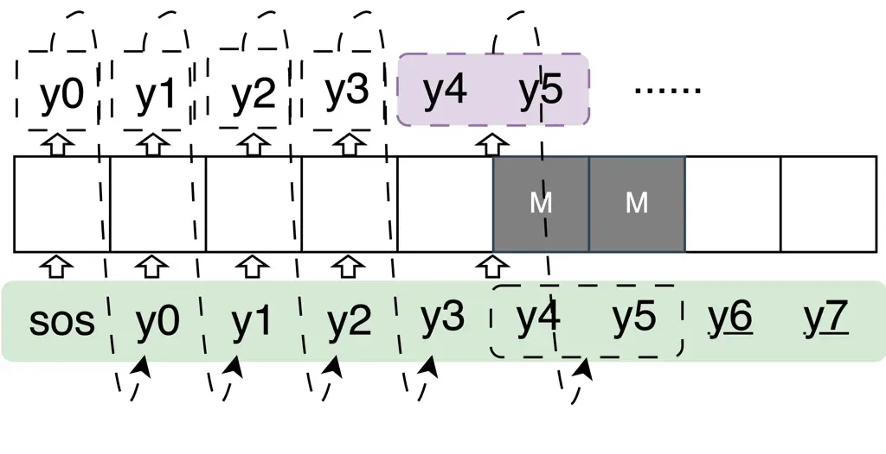

Fig. 4: Inference using mixed size block sizes. Begins with cold start
monotonic inference ($`B=1`$) for initial tokens y0-y3, then switches to
larger ($`B=2`$) block sizes for parallel inference (y4, y5, pink)

## V Experimental Setup

In this section, we detail the experimental setup used to evaluate the
baseline and the proposed AMD-empowered tripartite decoder. The
evaluation is conducted on the widely used LS960 \[87\] dataset and the
DBank \[88\] elderly speech corpus. Three model configurations are
examined on both corpora:

Config. 1: The Conformer encoder-decoder ASR system with filterbank
(FBank) input features, where the attention-based decoder is of
approximately 30M parameters;

Config. 2: Integration of Config. 1 with WavLM features as described in
Section III-B;

Config. 3: Further advances Config. 2 by replacing the original decoder
with a 1B-parameter LLM-based decoder as detailed in Section III-C.

Table I lists the number of parameters for the baseline and proposed
AMD-empowered ASR systems under Config. 1-3.

|         |                                                  |           |
| ------- | ------------------------------------------------ | --------- |
| Config. | Decoder                                          | \# Params |
| 1       | CTC+AR                                           | 116.15 M  |
|         | CTC+AR+AMD                                       | 146.50 M  |
| 2       | CTC+AR                                           | 431.68 M  |
|         | CTC+AR+AMD                                       | 462.03 M  |
| 3       | CTC+AR$`{}_{\text{LLM}}`$                        | 1.39 B    |
|         | CTC+AR$`{}_{\text{LLM}}`$+AMD$`{}_{\text{LLM}}`$ | 1.42 B    |

TABLE I: Number of parameters for the baseline and proposed
AMD-empowered ASR systems under Config. 1-3. “M” and “B” denote millions
and billions of parameters, respectively.

For training, models under Config. 1 are trained on a single NVIDIA A40
GPU, models under Config. 2 on 1$`\times`$A800 GPU, and models under
Config. 3 on 2$`\times`$A800 GPUs. For RTF measurements, models under
Config. 1 and 2 are evaluated on a single NVIDIA A40-48GB GPU, while
models under Config. 3 are evaluated on 1$`\times`$A800-80GB GPU. All
experiments are conducted without external language models. Statistical
significance testing is performed using matched pairs sentence-segment
word error (MAPSSWE) \[95\] at a significance level $`\alpha`$= 0.05.

### V-A Experimental Setup for the LS960

#### V-A1 Dataset

The LS960 \[87\] corpus comprises 960 hours of English read speech from
audiobooks for training, along with a 5.4-hour “test-clean” set
featuring 40 speakers and a 5.1-hour “test-other” set featuring 33
speakers.

#### V-A2 Experimental Setup

The Baseline Systems: The Conformer ASR baseline system under Config. 1
using CTC + AR decoder is constructed following the ESPnet \[96\]
recipe²² 2
https://github.com/espnet/espnet/tree/master/egs2/librispeech/asr1#conformer-hop_length160
with 12 Conformer blocks as encoder and 6 Transformer-based AR blocks as
decoder³³ 3 \# attention heads = 8; attention dim = 512; feed forward
dim = 2048; convolution kernel size = 31.. The Conformer encoder
achieves a 25Hz frame rate by applying a fourfold downsampling through
its convolutional subsampling module to the input 80-dim FBank features
extracted at 10ms intervals. The AR decoder produces Byte-Pair-Encoding
(BPE)  \[97\] tokens with a vocabulary size of 5000. Speed perturbation
 \[98\] and SpecAugment  \[99\] are also performed for data
augmentation. The model is trained for 50 epochs using the Adam \[100\]
optimizer with a learning rate of 0.0025, 40,000 warmup steps, and a
weight decay of 1e-6, using a combined CTC + AR loss function where
weights are empirically set to $`\gamma_{1}=0.3`$ and $`\gamma_{2}=0.7`$
as specified in Eqn. (1). The final model is an average of the top 10
checkpoints based on dev set accuracy. The baseline system under Config.
2 is constructed following the ESPnet recipe⁴⁴ 4
https://github.com/espnet/espnet/tree/master/egs2/librispeech/asr1#self-supervised-learning-features-wavlm_large-conformer-utt_mvn-with-transformer-lm,
with the WavLM features ($`D=1024`$) linearly projected to match the
input dimension of Conformer encoder ($`D^{\prime}=80`$). The other
setups are the same as those in the baseline system under Config. 1. For
the baseline system under Config. 3, the WavLM feature extractor and
Conformer encoder are identical to those used in the baseline model
under Config. 2, with their weights inherited and kept frozen during
training. A Llama-3.2-1B-Instruct model serves as the frozen backbone
for AR*(LLM) decoder and is parameter-efficiently fine-tuned using the
AdamW optimizer for 10 epochs (learning rate=0.001, warmup=1,000). The
final model is obtained by element-wise averaging the LoRA weights from
the top 5 checkpoints, selected based on dev set accuracy. The training
costs for these baselines are as follows: the public recipe for Config.
1 reports approximately 336 GPU hours on V100-32GB⁵⁵ 5
https://github.com/espnet/espnet/blob/master/egs2/librispeech/asr1/conf/tuning/train_asr_conformer10_hop_length160.yaml;
the recipe for Config. 2 reports approximately 480 GPU hours on
A6000-48GB⁶⁶ 6
https://github.com/espnet/espnet/blob/master/egs2/librispeech/asr1/conf/tuning/train_asr_conformer7_wavlm_large.yaml.
For Config. 3, the 1B LLM backbone’s pre-training is reported as  370k
GPU hours on H100-80GB⁷⁷ 7
https://huggingface.co/meta-llama/Llama-3.2-1B, and our AR*(LLM) LoRA
fine-tuning required approximately 106 GPU hours on A800-80GB.

The ASR Systems with the AMD Empowered Tripartite Decoder: Under Config.
1 and Config. 2, the CTC and AR components inherit frozen weights from
the baseline system under Config. 1 and Config. 2, respectively. The AMD
employs the same architecture as the AR decoder, and is initialized with
the AR decoder’s parameters and subsequently fine-tuned on the LS960
training set following the same training setup as the baseline system
under Config. 1. Under Config. 3, the LLM-based AMD
(AMD$`{}_{\text{LLM}}`$) shares the pretrained frozen LLM weights with
AR$`{}_{\text{LLM}}`$, where only the adapter, LoRA, and text embedding
layers of AMD are randomly initialized and trained on the LS960,
following the same training setup as the baseline system under Config. 3. The AMD fine-tuning required 161 GPU hours on A40-48GB for Config 1
and 264 GPU hours on A800-80GB for Config 2. For Config 3, both the
AR*(LLM) and AMD*(LLM) LoRA fine-tuning converged in 10 epochs,
requiring about 106 GPU hours and 366 GPU hours, respectively, on
A800-80GB.

### V-B Experimental Setup for the DBank

#### V-B1 Dataset

The DBank \[88\] corpus contains approximately 33 hours of
neurocognitive assessment interviews recorded between 292 elderly
participants (Par.) and clinical investigators (Inv.). The corpus is
partitioned into a 27.2-hour training set, a 4.8-hour development (Dev)
set, and a 1.1-hour evaluation (Eval) set. The Eval set contains Cookie
task recordings from 48 speakers identical to those in the ADReSS
 \[101\] test set, while the Dev set includes these speakers’ recordings
from other tasks. The training, Dev, and Eval sets contain 688 speakers
(244 elderly participants and 444 investigators), 119 speakers (43
elderly participants and 76 investigators), and 95 speakers (48 elderly
participants and 47 investigators), respectively, with no speaker
overlap between these sets. After silence removal  \[102\], the training
set contains 15.7 hours (29,682 utterances), while the Dev and Eval sets
contain 2.5 hours (5,103 utterances) and 0.6 hours (928 utterances),
respectively. Data augmentation via SpecAugment  \[99\] and
speaker-independent speed perturbation of elderly speech and elderly
speaker-dependent speed perturbation of non-aged investigators’ speech
 \[102\] expanded the training set to 58.9 hours.

#### V-B2 Experimental Setup

The Baseline Systems: The Conformer ASR baseline system under Config. 1
follows the same architecture as the LS960 Config. 1 baseline system.
The LS960 trained model was fine-tuned on the DBank training data for 25
epochs (Adam optimizer, learning rate=0.0025, warmup=2,000, weight
decay=1e-6), with its output layer replaced to produce 100 BPE tokens
derived from DBank transcripts. The final model is an average of the top
10 checkpoints based on dev set accuracy. The baseline system under
Config. 2 employs a WavLM feature extractor that is initially fine-tuned
on LS960, before being further fine-tuned on the DBank elderly speech
data following  \[103\], and kept frozen for subsequent experiments. It
adopts the same architecture as the LS960 Config. 2 baseline except for
the following two hyper-parameters further adjusted for the DBank task:
the convolutional downsampling module in the Conformer encoder (two-fold
instead of four-fold); and the input dimensionality of Conformer encoder
($`D^{\prime}=1024`$ rather than $`D^{\prime}=80`$). For the Config. 2
baseline, the Conformer encoder, CTC, and AR decoder are randomly
initialized and trained on the DBank data in the same way as the Config.
1 baseline system. For the baseline system under Config. 3, the WavLM
feature extractor, Conformer encoder, and CTC are the same as those used
in the baseline model under Config. 2, with their weights inherited and
kept frozen during training. The AR\_(LLM) decoder follows the same setup
as the LS960 Config. 3 baseline system (Sys. 9, Table IV) and is LoRA
fine-tuned on the DBank for 10 epochs (AdamW, learning rate=0.001,
warmup=1,000). The final model is an average of the top 5 checkpoints
based on dev set accuracy. The DBank fine-tuning required 3 GPU hours on
A40-48GB for Config 1, 4 GPU hours on A800-80GB for Config 2, and 9 GPU
hours on A800-80GB for Config 3.

The ASR Systems with the AMD Empowered Tripartite Decoder: Model
configurations of the AMD Empowered Tripartite decoder Config. 1-3 are
implemented following the same settings as in the LS960 task (Section
V-A2): The CTC and AR decoders are kept frozen while only the AMDs are
either fully fine-tuned (Config. 1, 2) or LoRA fine-tuned (Config. 3),
using the DBank dataset. The same training setup and hyper-parameters as
the corresponding DBank baseline systems are used for each model
configuration. The AMD fine-tuning required 4 GPU hours on A40-48GB for
Config 1, 10 GPU hours on A800-80GB for Config 2, and 32 GPU hours on
A800-80GB for Config 3.

## VI Implementation Details and Ablation Studies

This section discusses several implementation details and ablation
studies that affect the performance of the baseline and proposed
AMD-empowered system. The ablation studies conducted on LS960 include:
A. the sampling strategy for attention mask block sizes (UNI. vs. VAR.);
B. the selection of local top-K beam sizes ($`K_{1},K_{2}`$) in the AMD
beam search; and C. key factors for LLM integration (i.e. LoRA
configurations, adapter architectures, and instruction prompts). For the
DBank task, the optimal settings for the sampling strategy and LLM
integration were adopted from the LS960 findings, while D. local top-K
beam sizes were re-tuned and additional ablations on E. WavLM
integration were performed.

### VI-A Sampling Strategies for Attention Mask Block Sizes on LS960

| Sys.                                  | Encoder   | Decoder     | Weights      | B\_(TR) | B\_(DEC) | WER   |       |      | RTF   |
| ------------------------------------- | --------- | ----------- | ------------ | ------- | -------- | ----- | ----- | ---- | ----- |
|                                       |           |             |              |         |          | clean | other | Ave. |       |
| Greedy Search ($`K_{\text{main}}=1`$) |           |             |              |         |          |       |       |      |       |
| 1                                     | Conformer | CTC+AR +AMD | 0.3:0.6 :0.1 | UNI.    | 1        | 2.55  | 5.57  | 4.06 | 0.177 |
| 2                                     |           |             |              |         | 4        | 2.69  | 5.87  | 4.28 | 0.114 |
| 3                                     |           |             |              | VAR.    | 1        | 2.68  | 5.65  | 4.16 | 0.176 |
| 4                                     |           |             |              |         | 4        | 2.81  | 5.97  | 4.43 | 0.113 |
| Beam Search ($`K_{\text{main}}=60`$)  |           |             |              |         |          |       |       |      |       |
| 5                                     | Conformer | CTC+AR +AMD | 0.3:0.6 :0.1 | UNI.    | 1        | 2.45  | 5.22  | 3.83 | 0.461 |
| 6                                     |           |             |              |         | 4        | 2.51  | 5.40  | 3.95 | 0.269 |
| 7                                     |           |             |              | VAR.    | 1        | 2.52  | 5.43  | 3.97 | 0.460 |
| 8                                     |           |             |              |         | 4        | 2.60  | 5.61  | 4.07 | 0.269 |

TABLE II: Ablation study of the sampling strategies for attention mask
block sizes (UNI. vs. VAR.) during training. Results are obtained using
both greedy search ($`K_{\text{main}}=1`$) and beam search
($`K_{\text{main}}=60`$) under Config. 1. “Weights” denotes the
respective decoding weights for CTC, AR and AMD ($`\lambda_{1}=0.3`$,
$`\lambda_{2}=0.6`$, $`\lambda_{3}=0.1`$) as specified in Algorithm 1.
“Ave.” denotes the average WER over LS960 “test-clean/other” sets.
“B*(TR)” and “B*(DEC)” denote the UNI./VAR. attention mask block size
strategy used in training, and the fixed block size used during
decoding, respectively.

As shown in Table II, systems trained with UNI. mask sampling strategy
consistently achieve lower WER than their VAR. counterparts at both
B*(DEC)=1 and B*(DEC)=4, while exhibiting similar RTF values. This trend
is observed in both greedy (Sys. 1 vs. 3, and Sys. 2 vs. 4, Table II)
and beam search scenario (Sys. 5 vs. 7, and Sys. 6 vs. 8, Table II).
This indicates that the UNI. mask sampling strategy provides more stable
training process compared to the VAR. strategy, and is selected for
subsequent experiments in Section VII.

### VI-B Local Top-K Hypotheses Selection on LS960


Fig. 5: Average WER (%) and RTF trade-off for different $`K_{1}`$ and
$`K_{2}`$ values across LS960 “test-clean+other” sets using (a) greedy
search ($`K_{\text{main}}`$=1) under Config. 1; (b) beam search
($`K_{\text{main}}`$=60) under Config. 1, and (c) beam search
($`K_{\text{main}}`$=4) under Config. 3, all using fixed decoding block
size B*(DEC)=4, where $`K*{1}`$ determines the number of individual
token candidates in the first pruning stage (Algorithm 1 line 4) and
$`K*{2}`$ controls the beam width for partial hypotheses in the second
pruning stage (Algorithm 1 line 12). Each point shows specific
$`(K*{1},K*{2})`$ combinations. Red circles indicate optimal $`K*{1}`$
$`K\_{2}`$ settings shown in Table III.

For greedy search ($`K_{\text{main}}=1`$), experiments shown in Figure
5(a) for Config. 1 demonstrate that modest increases in $`K_{1}`$ and
$`K_{2}`$ relative to $`K_{\text{main}}=1`$ ($`K_{1}=K_{2}=2`$) yield
strong performance improvements, while further increases offer
negligible WER reductions ($`\leq`$0.01% absolute) despite large RTF
increases. Thus, $`K_{1}=K_{2}=2`$ is adopted for greedy search under
Config. 1. This setting is also applied in Config. 2 and Config. 3 for
greedy search to maintain consistency across different configurations.

For beam search, two specific scenarios were analyzed: Config. 1-2 with
$`K_{\text{main}}=60`$ (following the open-sourced ESPnet recipes, which
can be found in footnotes 2 and 4), and Config. 3 with
$`K_{\text{main}}=4`$⁸⁸ 8 Empirically determined based on
memory-latency-performance trade-off.. Under Config. 1 (Figure 5 (b)),
increasing $`K_{1}`$ or $`K_{2}`$ beyond 75 yields diminishing returns
in WER reduction while largely increasing computational cost. Therefore,
$`K_{1}=K_{2}=75`$ is adopted for beam search under Config. 1. This same
setting is applied for beam search under Config. 2 because of the
identical decoder architecture and beam size ($`K_{\text{main}}=60`$).
Under Config. 3 with $`K_{\text{main}}=4`$ (Figure 5 (c)), varying
$`K_{1}`$ and $`K_{2}`$ values from 5 to 8 produces nearly identical WER
performance (ranging from 3.16% to 3.15%), while RTF gradually increases
from 0.242 to 0.299. Therefore, $`K_{1}=K_{2}=5`$ is selected for
Config. 3 to optimize the WER-RTF trade-off.

Table III summarizes the optimal parameter settings across Config. 1-3
under greedy and beam search scenarios.

| Search Method | Config. 1           |           |           | Config. 2           |           |           | Config. 3           |           |           |
| ------------- | ------------------- | --------- | --------- | ------------------- | --------- | --------- | ------------------- | --------- | --------- |
|               | $`K_{\text{main}}`$ | $`K_{1}`$ | $`K_{2}`$ | $`K_{\text{main}}`$ | $`K_{1}`$ | $`K_{2}`$ | $`K_{\text{main}}`$ | $`K_{1}`$ | $`K_{2}`$ |
| Greedy search | 1                   | 2         | 2         | 1                   | 2         | 2         | 1                   | 2         | 2         |
| Beam search   | 60                  | 75        | 75        | 60                  | 75        | 75        | 4                   | 5         | 5         |

TABLE III: Summary of $`K_{\rm main}`$, $`K_{1}`$ and $`K_{2}`$ settings
on LS960.

### VI-C Key Factors for LLM Integration on LS960

[TABLE]

TABLE IV: Performance of published LLM-based ASR results (Sys. 1-3) and
baseline systems with CTC + AR$`{}_{\text{LLM}}`$ decoder (Sys. 4-9) on
LS960 test sets. Systems vary in their settings of: a) LoRA rank (Sys.
4, 5, 6); b) adapter architectures (Sys. 6, 7, 8); and c) whether using
instruction prompts or not (Sys. 9, 8).

Table IV presents the performance of ASR systems with CTC +
AR$`{}_{\text{LLM}}`$ decoder on the LS960 test sets, focusing on three
critical aspects: the decoder LoRA configurations, where LoRA is applied
to the grouped query attention components and feed-forward networks in
each decoder layer, with ranks of 16 and 32 being examined; the adapter
architectures, where three variants are considered: a simple linear
network, a convolution-based sub-sampling layer with linear layers, and
a self-attention layer with linear layers; and the instruction prompts,
specifically the use of the “THE SPEECH IS: ... THE TRANSCRIPT IS: ...”
template. Several findings can be found:

First, the introduction of LoRA adaptation in the LLM-based AR decoder
significantly improves system performance. Using a simple linear
adapter, applying LoRA with rank $`r=16`$ to the decoder yields absolute
WER reductions of 1.09%/0.74% (24.0%/11.6% relative) on
“test-clean/other” sets respectively (Sys. 5 vs. 4, Table IV), while
further increasing the rank $`r`$ to 32 results in marginal improvements
(Sys. 6 vs. 5, Table IV);

Second, among different adapter architectures, the “Attention+Linear”
adapter outperforms both the simple “Linear” adapter and the
convolution-based “Subsample+Linear” adapter. When using a LoRA rank of
$`r=16`$, it produces absolute WER reductions of 0.06% and 0.09% (1.7%
and 1.6% relative) on the “test-clean/other” sets, respectively, against
the simple “Linear” adapter (Sys. 8 vs. 5, Table IV), and also absolute
reductions of 2.21% and 2.27% (39.4% and 29.1% relative) over the
convolution-based “Subsample+Linear” adapter (Sys. 8 vs. 7, Table IV);

Third, the use of instruction prompt template is crucial for the
LLMs-based decoder. Incorporating the prompt template leads to absolute
WER reductions of 1.15% and 1.11% (33.8% and 20.0% relative on the
”test-clean/other” sets, respectively (Sys. 9 vs. 8, Table IV). By using
instruction prompts, competitive performance that is comparable to
recently published LLM-based ASR results on the same task (Sys. 1-3,
Table IV) are obtained (Sys. 9, Table IV).

Based on these findings, the “Attention+Linear” adapter with LoRA rank
$`r=16`$ and the instruction prompt is adopted as the optimal
configuration (Sys. 9, Table IV) for the systems under Config. 3.

### VI-D Local Top-K Hypotheses Selection on DBank

Comparable ablation studies to LS960 task (Section VI-B) were conducted
for the DBank dataset. The optimal parameter settings are summarized in
Table V.

| Search Method | Config. 1           |           |           | Config. 2           |           |           | Config. 3           |           |           |
| ------------- | ------------------- | --------- | --------- | ------------------- | --------- | --------- | ------------------- | --------- | --------- |
|               | $`K_{\text{main}}`$ | $`K_{1}`$ | $`K_{2}`$ | $`K_{\text{main}}`$ | $`K_{1}`$ | $`K_{2}`$ | $`K_{\text{main}}`$ | $`K_{1}`$ | $`K_{2}`$ |
| Greedy search | 1                   | 6         | 2         | 1                   | 6         | 2         | 1                   | 6         | 2         |
| Beam search   | 60                  | 75        | 65        | 60                  | 75        | 65        | 4                   | 24        | 8         |

TABLE V: Summary of $`K_{\rm main}`$, $`K_{1}`$, and $`K_{2}`$ settings
on DBank.

### VI-E Key Factors for WavLM Integration on DBank

Unlike LS960 task where the open-sourced model structure was directly
used as baseline system under Config. 2, ablation studies were conducted
for DBank Config. 2 baseline system. Based on Sys. 1, Table VI, which
has the same structure as LS960’s Config. 2 baseline system, increasing
frame rate ($`\text{FR}_{x}`$) from 12.5 Hz to 25 Hz by reducing the
Conformer encoder convolutional downsampling factor from 4 to 2 leads to
WER reduction by 2.35% absolute (9.74% relative, Sys. 2 vs. 1, Table
VI), while expanding encoder input dimensionality ($`D^{\prime}`$) from
80 to 1024 further reduced WER by 0.31% absolute (1.42% relative, Sys. 3
vs. 2, Table VI). Based on these results, FR$`{}_{x}=25`$ Hz and
$`D^{\prime}=1024`$ are adopted as the optimal configurations for the
systems under Config. 2 (Sys. 7, Table XI).

| Sys. | Feats. | Encoder   | $`D^{\prime}`$ | FR\_(x) (Hz) | Decoder | Eval-WER |       | Dev-WER |       | Ave.  |
| ---- | ------ | --------- | -------------- | ------------ | ------- | -------- | ----- | ------- | ----- | ----- |
|      |        |           |                |              |         | Inv.     | Par.  | Inv.    | Par.  |       |
| 1    | WavLM  | Conformer | 80             | 12.5         | CTC+AR  | 16.53    | 24.60 | 16.21   | 32.60 | 24.12 |
| 2    |        |           | 80             | 25           |         | 14.76    | 22.27 | 13.88   | 30.18 | 21.77 |
| 3    |        |           | 1024           | 25           |         | 14.76    | 21.70 | 13.78   | 29.76 | 21.46 |

TABLE VI: Ablation studies of the frame rate of encoder output
$`\bm{\mathcal{X}}`$ (FR$`{x}`$) and encoder input dimensionality
($`D^{\prime}`$).

## VII Main Results

### VII-A Main Results on LS960

This section presents the main results tested on the LS960
“test-clean/other” sets, comparing the performance of ASR systems with
the CTC + AR decoder and with the AMD enhanced tripartite decoder under
Config. 1-3 . The detailed results are shown in Tables VII, VIII, and
IX.

|                                       |           |             |              |                      |       |       |                  |                   |
| ------------------------------------- | --------- | ----------- | ------------ | -------------------- | ----- | ----- | ---------------- | ----------------- |
| Sys.                                  | Encoder   | Decoder     | Weights      | B$`{}_{\text{DEC}}`$ | WER   |       |                  | RTF               |
|                                       |           |             |              |                      | clean | other | Ave.             |                   |
| Greedy Search ($`K_{\text{main}}=1`$) |           |             |              |                      |       |       |                  |                   |
| 1                                     | Conformer | CTC + AR    | 0.3:0.7      | -                    | 2.96  | 5.80  | 4.37             | 0.148             |
| 2                                     |           | CTC+AR +AMD | 0.3:0.6 :0.1 | 1                    | 2.55  | 5.57  | 4.06$`\ddagger`$ | 0.177             |
| 3                                     |           |             |              | 2                    | 2.61  | 5.75  | 4.18$`\ddagger`$ | 0.149$`\diamond`$ |
| 4                                     |           |             |              | 4                    | 2.69  | 5.87  | 4.28$`\dagger`$  | 0.114             |
| 5                                     |           |             |              | 8                    | 2.74  | 5.92  | 4.35$`\dagger`$  | 0.103             |
| Beam Search ($`K_{\text{main}}=60`$)  |           |             |              |                      |       |       |                  |                   |
| 6                                     | Conformer | CTC+AR      | 0.3:0.7      | -                    | 2.43  | 5.18  | 3.79             | 0.364             |
| 7                                     |           | CTC+AR +AMD | 0.3:0.6 :0.1 | 1                    | 2.45  | 5.22  | 3.83$`\dagger`$  | 0.461             |
| 8                                     |           |             |              | 2                    | 2.47  | 5.34  | 3.89$`\dagger`$  | 0.367$`\diamond`$ |
| 9                                     |           |             |              | 4                    | 2.51  | 5.40  | 3.95             | 0.269             |
| 10                                    |           |             |              | 8                    | 2.63  | 5.73  | 4.18             | 0.266             |
| 11                                    |           |             |              | 1-20-4               | 2.52  | 5.35  | 3.93$`\dagger`$  | 0.279             |

TABLE VII: Performance comparison of systems under under Config. 1 using
a) CTC + AR decoder (Sys. 1, 6) and b) tripartite decoder using either
greedy search (K$`{}_{\text{main}}=1`$, Sys. 2-5) or (c) beam search
(K$`{}_{\text{main}}=60`$, Sys. 7-11) on LS960 “test-clean/other” For
Sys. 11, “1-N-B” denotes decoding with mixed block size(Section IV-A),
where the first N tokens are decoded in an AR manner, followed by non-AR
decoding of remaining tokens with block size B. $`\dagger`$ and
$`\ddagger`$ denote that the average (Ave.) WER shows no statistically
significant difference from, or achieves a statistically significant
reduction compared to the corresponding baseline (Sys. 1 or Sys. 7),
respectively. $`\diamond`$ denotes the highlighted RTF is similar to the
corresponding baselines. Other naming conventions follow those used in
Table II

#### VII-A1 Performance Analysis under Config. 1

Several trends can be observed from Table VII:

1.  a)
    Using a decoding block size B$`{}_{\text{DEC}}`$ of 1, the proposed
    AMD performs purely serial, non-parallel inference, akin to the AR
    decoder. The tripartite decoder integrating AMD outperforms the
    baseline CTC + AR system in greedy search. The tripartite decoder
    achieves an absolute averaged WER reduction of 0.31% (7.1% relative;
    Sys. 2 vs. 1, Table VII)⁹⁹ 9 Such performance gains may be
    attributed to the complementarity between the AMD and CTC + AR
    decoders when being combined., while incurs a 1.2x RTF increase due
    to the computational overhead of the AMD decoder (Sys. 2 vs. 1,
    Table VII).

    (a) Config. 1

    (b) Config. 2

    (c) Config. 3

    Fig. 6: Visualization of the Average WER (%) vs. RTF trade-off on
    the LS960 “test-clean+other” sets for greedy search under (a)
    Config. 1 (Sys. 1-5 in Table VII); (b) Config. 2 (Sys. 2-8 in
    Table VIII); and (c) Config. 3 (Sys. 3-8 in Table IX).

2.  b)
    As the decoding block size (B$`{}_{\text{DEC}}`$) increase from 1 to
    8, the proposed tripartite decoder exhibit a clear trade-off between
    WER and RTF (as visualized in Figure 6, (a)), showing an increase in
    average WER from 4.06% to 4.35% (Sys. 2-5, Table VII) alongside a
    decrease in RTF from 0.177 to 0.103 in greedy search.
3.  c)
    In greedy search, with a decoding block size B*(DEC) of 8, the
    proposed tripartite decoder achieves a 1.44x speedup ratio over the
    baseline CTC + AR system (Sys. 5 vs. 1, Table VII), with no
    statistically significant changes on averaged WERs. The tripartite
    decoder system (B*(DEC)=2) operating with the RTF comparable to the
    baseline yield statistically significant WER reductions of up to
    0.19% absolute (4.3% relative; Sys. 3 vs. 1, Table VII).
4.  d)
    In beam search, mixed-size decoding (Section IV-A) enables the
    tripartite decoder to achieve up to a 1.30x speedup ratio relative
    to the baseline CTC + AR system (Sys. 11 vs. 6, Table VII) without
    statistically significant WER increase. When operating with a
    similar RTF, the tripartite decoder shows no significant difference
    in average WER compared to the CTC + AR baseline (Sys. 8 vs. 6,
    Table VII). This is in contrast to the greedy search results, where
    systems with comparable RTF achieved significant WER reductions
    relative to the baseline (Sys. 3 vs. 1, Table VII). This performance
    disparity between greedy search and beam search will be analyzed in
    detail in Section VII-A4.

|                                       |        |           |              |             |              |          |       |       |                  |                   |
| ------------------------------------- | ------ | --------- | ------------ | ----------- | ------------ | -------- | ----- | ----- | ---------------- | ----------------- |
| Sys.                                  | Feats. | Encoder   | FR\_(x) (Hz) | Decoder     | Weights      | B\_(DEC) | WER   |       |                  | RTF               |
|                                       |        |           |              |             |              |          | clean | other | Ave.             |                   |
| Greedy Search ($`K_{\text{main}}=1`$) |        |           |              |             |              |          |       |       |                  |                   |
| 1                                     | FBank  | Conformer | 25           | CTC+AR      | 0.3:0.7      | \-       | 2.96  | 5.80  | 4.37             | 0.148             |
| 2                                     | WavLM  |           | 12.5         | CTC+AR      | 0.3:0.7      | \-       | 2.78  | 4.85  | 3.81             | 0.062             |
| 3                                     |        |           |              | CTC+AR +AMD | 0.3:0.6 :0.1 | 1        | 2.09  | 4.22  | 3.16$`\ddagger`$ | 0.108             |
| 4                                     |        |           |              |             |              | 2        | 2.09  | 4.29  | 3.19$`\ddagger`$ | 0.064$`\diamond`$ |
| 5                                     |        |           |              |             |              | 4        | 2.10  | 4.24  | 3.17$`\ddagger`$ | 0.050             |
| 6                                     |        |           |              |             |              | 8        | 2.14  | 4.27  | 3.21$`\ddagger`$ | 0.043             |
| 7                                     |        |           |              |             |              | 16       | 2.15  | 4.34  | 3.24$`\ddagger`$ | 0.041             |
| 8                                     |        |           |              |             |              | 64       | 2.64  | 4.85  | 3.75$`\dagger`$  | 0.040             |
| Beam Search ($`K_{\text{main}}=60`$)  |        |           |              |             |              |          |       |       |                  |                   |
| 9                                     | FBank  | WavLM     | 25           | CTC+AR      | 0.3:0.7      | \-       | 2.43  | 5.18  | 3.79             | 0.364             |
| 10                                    | WavLM  |           | 12.5         | CTC+AR      | 0.3:0.7      | \-       | 2.04  | 4.15  | 3.09             | 0.268             |
| 11                                    |        |           |              | CTC+AR +AMD | 0.3:0.6 :0.1 | 1        | 1.99  | 4.15  | 3.07$`\dagger`$  | 0.485             |
| 12                                    |        |           |              |             |              | 2        | 2.08  | 4.15  | 3.11$`\dagger`$  | 0.298             |
| 13                                    |        |           |              |             |              | 4        | 2.09  | 4.19  | 3.14$`\dagger`$  | 0.224             |
| 14                                    |        |           |              |             |              | 8        | 2.07  | 4.20  | 3.13$`\dagger`$  | 0.191             |
| 15                                    |        |           |              |             |              | 16       | 2.06  | 4.22  | 3.13$`\dagger`$  | 0.191             |
| 16                                    |        |           |              |             |              | 1-20-8   | 2.08  | 4.19  | 3.13$`\dagger`$  | 0.262$`\diamond`$ |

TABLE VIII: Performance comparison of systems using (a) CTC + AR decoder
under Config. 1 (Sys. 1, 9) and Config. 2 (Sys. 2, 10); (b) CTC + AR +
AMD tripartite decoder (Config. 2) using either greedy search
(K$`{}_{\text{main}}=1`$, Sys. 3-8) or (c) beam search
(K$`{}_{\text{main}}=60`$, Sys. 11-16). FR\_(x) indicates the frame rate
of encoder output $`\bm{\mathcal{X}}`$ in Eqn. (8). $`\dagger`$ and
$`\ddagger`$ denote that the average (Ave.) WER shows no statistically
significant difference from, or achieves a statistically significant
reduction compared to the corresponding baseline (Sys. 2 or Sys. 10),
respectively. $`\diamond`$ denotes the highlighted RTF is similar to the
corresponding baselines. Other naming conventions follow those used in
Table II and VII.

#### VII-A2 Performance Analysis under Config. 2

Several trends can be observed from Table VIII:

1.  a)
    The incorporation of WavLM features significantly improves the CTC +
    AR system performance, with an absolute WER reduction of 0.56% and
    0.70% (12.8% and 18.5% relative, Sys. 2 vs. 1, Sys. 10 vs. 9, Table
    VIII) using greedy search and beam search, respectively. Notably,
    compared to the baseline system with an encoder output frame rate of
    25 Hz, WavLM-based systems operate at 12.5 Hz, further reducing the
    overall RTF;
2.  b)
    In greedy search, a clear trade-off between WER and RTF is observed,
    similar to the trend in Config. 1 (visualized in Figure 6, (b)). Our
    tripartite decoder achieves up to a 1.55x speedup ratio over the
    WavLM-enhanced CTC + AR baseline (Sys. 8 vs. 2, Table VIII) with no
    statistically significant changes on averaged WERs. When operating
    with an RTF comparable to the baseline (Sys. 4 vs. 2, Table VIII),
    the tripartite decoder system gives an absolute WER reduction of
    0.62% (16.3% relative);
3.  c)
    In beam search, the tripartite decoder accelerates decoding by up to
    1.40x relative to the baseline CTC + AR system (Sys. 14 vs. 10,
    Table VIII) without significant WER degradation. Moreover,
    mixed-size decoding allows the tripartite decoder to achieve an RTF
    comparable to the baseline while maintaining similar WER performance
    (Sys. 16 vs. 10, Table VIII), consistent with observations under
    Config. 1. The performance disparity between greedy search and beam
    search will be analyzed in detail in Section VII-A4.

[TABLE]

TABLE IX: Performance comparison of (a) baseline systems under Config. 1
(Sys. 1), Config. 2 (Sys. 2), Config. 3 (Sys. 3, 10) and (b) proposed
tripartite decoder under Config. 3 using either greedy search
(K$`{}_{\text{main}}=1`$, Sys. 3-9) or (c) beam search
(K$`{}_{\text{main}}=4`$, Sys. 11-16). $`\dagger`$ and $`\ddagger`$
denote that the average (Ave.) WER shows no statistically significant
difference from, or achieves a statistically significant reduction
compared to the corresponding baseline (Sys. 3 or Sys. 10),
respectively. $`\diamond`$ denotes the highlighted RTF is similar to the
corresponding baselines. Other naming conventions follow those used in
Table II and VII.

#### VII-A3 Performance Analysis under Config. 3

Table IX reveals several key trends:

1.  a)
    The integration of LLM as AR decoder significantly improves CTC + AR
    system performance, yielding an average WER reduction of 0.47%
    (12.3% relative) compared to the conventional AR decoder (Sys. 3 vs.
    2, Table IX) using greedy search.
2.  b)
    When performing greedy search, a similar trade-off between WER and
    RTF is present, consistent with Config. 1 and 2 (visualized in
    Figure 6, (c)). The tripartite decoder achieves a speedup ratio of
    up to 1.61x relative to the CTC + AR baseline system (Sys. 8 vs. 3,
    Table IX) with no statistically significant WER difference. When
    operating with an RTF comparable to the baseline, the system
    achieves an absolute average WER reduction of 0.13% (3.8% relative,
    Sys. 9 vs. 3, Table IX);
3.  c)
    In beam search, the tripartite decoder accelerates the decoding
    speed by up to 2.31x compared to the CTC + AR baseline (Sys. 15 vs.
    10, Table IX) without significant WER degradation. When using
    mixed-size decoding, the tripartite decoder achieves similar RTF to
    the baseline while maintaining comparable WER performance (Sys. 16
    vs. 10, Table IX). Section VII-A4 presents the analysis of this
    disparity in performance gains over CTC + AR baselines between
    greedy and beam search when using tripartite decoders.

#### VII-A4 Performance Disparity between AMD Greedy and Beam Search

In order to investigate the performance disparity when using AMD systems
in greedy and beam search that previously observed (Sys. 3, 4, 9 vs. 8,
16, 16 in Tab. VII, VIII and IX for Config. 1-3 respectively)¹⁰¹⁰ 10
Specifically, the AMD tripartite decoder produces statistically
significant WER reductions over the CTC + AR baselines with greedy
search (0.19% absolute for Sys. 3 vs. Sys. 1 in Tab. VII, 0.62% absolute
for Sys. 4 vs. Sys. 2 in Tab. VIII, and 0.13% absolute for Sys. 9 vs.
Sys. 3 in Tab. IX), while only maintaining WERs comparable to the CTC +
AR baselines with beam search (Sys. 8 vs. Sys. 6 in Tab. VII, Sys. 16
vs. Sys. 10 in Tab. VIII, and Sys. 16 vs. Sys. 10 in Tab. IX)., their
corresponding lattice density and oracle WER measures are analyzed in
this section. Lattice density measures the average number of distinct
tokens in the 100-best list for each ground truth token. Oracle WER
indicates the lowest possible WER achievable by selecting the optimal
hypothesis in the 100-best list. Two trends can be observed in Figure 7:

1.  a)
    For greedy search (K$`{}_{\text{main}}`$=1), the tripartite decoder
    produces lattices with higher (when B$`{}_{\text{DEC}}`$=1) or
    comparable (when B$`{}_{\text{DEC}}>`$1) density, when compared to
    those produced by the CTC + AR counterparts across Config. 1-3
    (black & blue vs. red bars in the leftmost bar chart of Figure 7,
    (a), (c), (e)). This is achieved while maintaining lower
    (B$`{}_{\text{DEC}}`$=1) or comparable (B$`{}_{\text{DEC}}>`$1)
    oracle WERs (black & blue vs. red bars in the leftmost bar chart of
    Figure 7, (b), (d), (f)). This indicates that the AMD tripartite
    decoder produces fewer search errors than the CTC + AR baselines
    under greedy search.
2.  b)
    For beam search (K$`{}_{\text{main}}>1`$), we observe different
    trends. When B$`{}_{\text{DEC}}`$=1, AMD performs serial,
    non-parallel prediction akin to the AR decoder. In this case, the
    AMD tripartite decoder produces higher or comparable lattice density
    measures, and lower oracle WERs when compared to the CTC + AR
    baselines (black vs. red bars in Figure 7, (a), (c), (e) for lattice
    density, and Figure 7, (b), (d), (f) for oracle WER, from second to
    rightmost bar chart groups). These trends are similar to those found
    in the greedy search scenario in a). In contrast, when
    B$`{}_{\text{DEC}}=2,4,8,16`$, AMD performs parallel NAR prediction.
    In these cases, the AMD tripartite decoder produces lower or
    comparable lattice density measures, and higher oracle WERs when
    compared to the CTC + AR baselines (blue bars from dark to light vs.
    red bars in Figure 7, (a), (c), (e) for lattice density, and Figure
    7, (b), (d), (f) for oracle WER, from second to rightmost bar chart
    groups). These led to reduced performance gains from AMD over the
    CTC + AR baselines in beam search compared to those obtained in
    greedy search (Sys. 3, 4, 9 vs. 8, 16, 16 in Tab. VII, VIII and IX
    for Config. 1-3).

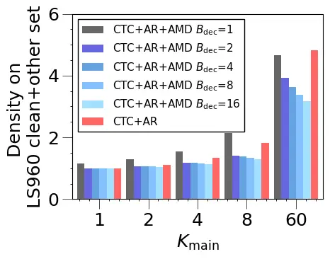

(a) Lattice Density of Config. 1

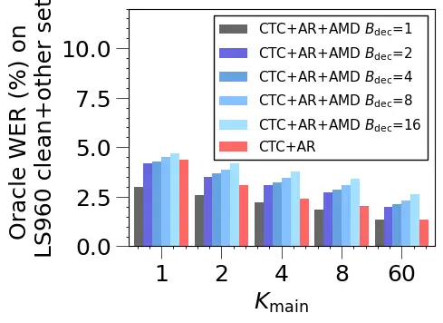

(b) Oracle WER of Config. 1

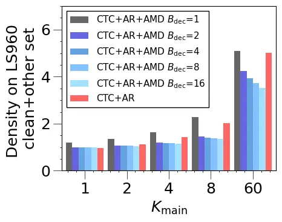

(c) Lattice Density of Config. 2

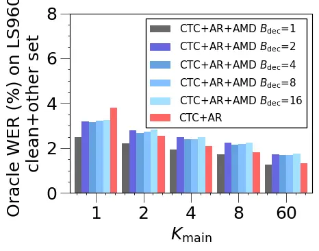

(d) Oracle WER of Config. 2

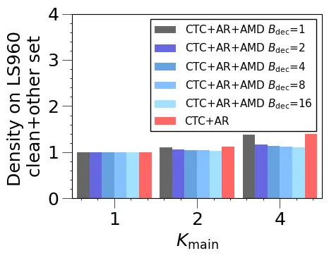

(e) Lattice Density of Config. 3

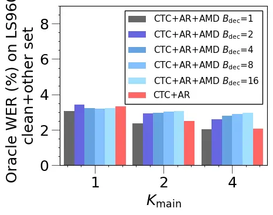

(f) Oracle WER of Config. 3

Fig. 7: Lattice density (a, c, e) and Oracle WERs (b, d, f) computed for
Conformer ASR systems using CTC + AR decoder (red bars) and using CTC +
AR + AMD tripartite decoder (black and blue bars) over varying settings
of $`K_{\rm main}`$, the main top-K hypotheses beam for the tripartite
(Algorithm 1) and baseline CTC + AR decoders. Results are presented for
three model configurations introduced in the 1st paragraph of VII:
Config. 1 (a, b), Config. 2 (c, d) with $`K_{\text{main}}`$ varying from
1 to 60, and Config. 3 (e, f) with $`K_{\text{main}}`$ varying from 1 to 4. Both lattice density and oracle WERs are computed using 100-best
hypotheses obtained on the LS960 “test-clean+other” sets.

#### VII-A5 Analysis of Mixed Block-Size Decoding

To empirically validate the mixed block-size decoding technique
described in Section IV-A, we conducted a further analysis for greedy
search under Config. 3. The mixed block-size decoding strategy offers a
more flexible balance between performance and efficiency compared to the
fixed block-size decoding, as shown in Table X:

1.  a)
    The strategy allows for configurations that prioritize accuracy. For
    instance, the system with B*(DEC)=4 and N=10 achieves a
    statistically significant absolute WER reduction of 0.13% (3.9%
    relative) compared to the CTC+AR$`{}*{\text{LLM}}`$ baseline, while
    operating at a similar RTF (0.137 vs. 0.132).
2.  b)
    Conversely, it also enables configurations that prioritize speed
    without performance degradation. The system with B\_(DEC)=16 and N=20
    achieves a 1.28x speedup over the baseline (RTF of 0.103 vs. 0.132)
    while maintaining a comparable (and slightly improved) WER.

| B\_(DEC)                  | N   | WER (%) | RTF   |
| ------------------------- | --- | ------- | ----- |
| CTC+AR$`{}_{\text{LLM}}`$ |     | 3.34    | 0.132 |
| 4                         | 0   | 3.22    | 0.116 |
|                           | 10  | 3.21    | 0.137 |
|                           | 20  | 3.20    | 0.163 |
| 8                         | 0   | 3.33    | 0.085 |
|                           | 10  | 3.27    | 0.107 |
|                           | 20  | 3.22    | 0.124 |
| 16                        | 0   | 3.43    | 0.082 |
|                           | 10  | 3.39    | 0.092 |
|                           | 20  | 3.32    | 0.103 |

TABLE X: Ablation study on the mixed block size decoding strategy under
Config. 3, grouped by Parallel Block Size (B\_(DEC)). “N” denotes the
Switch Point, the number of initial tokens decoded autoregressively; N=0
indicates the Fixed Block Size strategy.

#### VII-A6 Analysis of AR and AMD Attention

To provide mechanistic insight of the AMD, we compares the attention
patterns of the AR decoder and the AMD, examining both self-attention
and cross-attention. As shown in Figure 8, two observations can be made:

1.  a)
    Both the AR decoder and AMD attend to encoder frames in a roughly
    monotonic alignment, and the AMD exhibit broader attention
    corresponding to the block ((c) vs. (a)).
2.  b)
    By comparing (b) and (d), the AR decoder attends primarily to the
    immediately preceding token, reflecting its strict left-to-right,
    token-level dependency. In contrast, the AMD decoder attends to both
    the preceding left context tokens and the right context tokens
    provided by the CTC greedy result, demonstrating its block-level
    processing which incorporates future context.

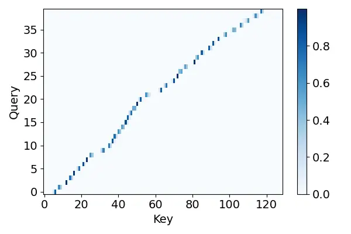

(a) AR Cross Attention

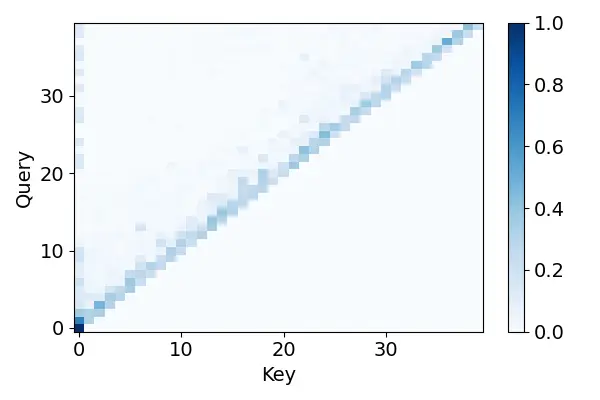

(b) AR Self Attention

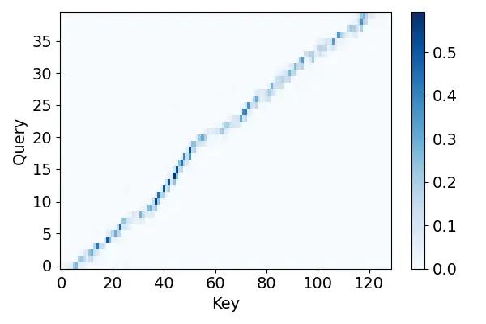

(c) AMD Cross Attention

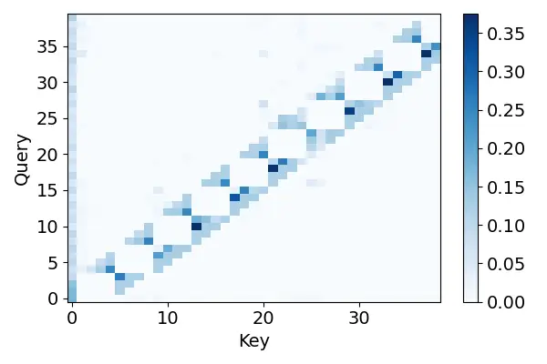

(d) AMD Self Attention

Fig. 8: Visualization of self and cross-attention patterns under Config.
2 for (a)-(b) the AR decoder and (c)-(d) the AMD. (a) and (c) display
the cross-attention between decoder output tokens and speech embeddings,
while (b) and (d) display the self-attention maps of the decoder output
tokens. The utterance is from the LS960 “test-clean” set, and the
attention map is extracted from the last layer and averaged across all
attention heads.

### VII-B Main Results on DBank task

Table XI presents the performance comparison between baseline systems
and the proposed tripartite decoder across Config. 1-3 on the DBank Eval
and Dev sets.

[TABLE]

TABLE XI: Performance comparison of (a) baseline systems under Config. 1
(Sys. 1, 21), Config. 2 (Sys. 7, 27), and Config. 3 (Sys. 14, 33); and
Config. 3 (Sys. 14, 33); and (b) proposed tripartite decoder integrating
AMD under Config. 1 (Sys. 2-6, 22-26), Config. 2 (Sys. 8-13, 28-32), and
Config. 3 (Sys. 15-20, 34-38). Results are reported for both greedy
search (Sys. 1-20) and beam search (Sys. 21-38). “Ave.” denotes the
average WER across DBank Eval and Dev sets. $`\dagger`$ and $`\ddagger`$
denote that the average (Ave.) WER shows no statistically significant
difference from, or achieves a statistically significant reduction over
the comparable baseline. $`\diamond`$ denotes the highlighted RTF is
similar to the comparable baselines. Other naming conventions follow
those used in Table II and VII.

#### VII-B1 Performance Analysis of greedy search

Several trends can be observed when performing greedy search (Sys. 1 -
20, Table XI) under Config. 1-3:

1.  a)
    The baseline systems with CTC + AR decoder demonstrate progressive
    performance improvements across Config. 1-3. The integration of
    WavLM features shows WER reduction of 3.68% absolute (14.6%
    relative) (Sys. 7 vs. 1, Table XI) compared to the baseline system
    under Config. 1, and the integration of AR\_(LLM) decoder yields a
    further WER reduction of 0.71% absolute (3.3% relative) (Sys. 14 vs.
    7, Table XI);
2.  b)
    When performing purely serial, non-parallel inference
    (B$`{}_{\text{DEC}}=1`$), the tripartite decoder integrating AMD
    consistently outperforms the baselines across Config.1-3. The
    tripartite decoder achieves statistically significant average WER
    reductions of 0.75%, 1.20% and 0.29% absolute (3.0%, 5.6% and 1.4%
    relative) under Config. 1-3 respectively (Sys. 2 vs. 1, Sys. 8 vs.
    7, Sys. 15 vs. 14, Table XI), while incurs RTF increases of 1.42x,
    1.71x, and 1.33x due to the computational overhead of the AMD
    decoder.
3.  c)
    As the B$`{}_{\text{DEC}}`$ increases from 1 to 16, the proposed
    tripartite decoder exhibits a clear trade-off between WER and RTF,
    showing an increase in average WER from 24.55% to 27.09% alongside a
    decrease in RTF from 0.167 to 0.066 under Config. 1. The same
    patterns are observed under Config. 2 (Sys. 12 - 8, Table XI) and
    Config. 3 (Sys. 19 - 15, Table XI).
4.  e)
    The tripartite decoder achieves consistent speedup over the
    corresponding CTC + AR baselines without statistically significant
    WER increase. The tripartite decoder achieves speedup ratios of up
    to 1.38x, 1.64x and 1.61x with B\_(DEC) of 4, 8, and 8 under Config.
    1-3 respectively (Sys. 4 vs. 1, Sys. 11 vs. 7, Sys. 18 vs. 14, Table
    XI);
5.  f)
    When operating at comparable RTFs to CTC + AR baseline systems, the
    tripartite decoder consistently yields statistically significant WER
    reductions over the baselines. Absolute averaged WER reductions of
    0.46%, 0.38% and 0.41% (1.8%, 1.8% and 2.0% relative) are achieved
    under Config. 1-3 respectively, using B\_(DEC) values of 2, 1-15-8
    and 1-2-4 (Sys. 3 vs. 1, Sys. 13 vs. 7, Sys. 20 vs. 14, Table XI);

#### VII-B2 Performance Analysis of beam search

With beam search (Sys. 21 - 38, Table XI), the following trends can be
observed under Config. 1-3:

1.  a)
    When using B$`{}_{\text{DEC}}=2`$ under Config. 1-3, the tripartite
    decoder achieves similar RTFs to the baselines while maintaining
    comparable WER performance (Sys. 23 vs. 21, Sys. 29 vs. 27, Sys. 35
    vs. 33, Table XI). This disparity in performance gains over CTC + AR
    baselines between greedy and beam search when using tripartite
    decoders is consistent with observations on LS960 task.
2.  b)
    With B$`{}_{\text{DEC}}=4`$, the proposed tripartite decoder
    accelerates decoding by up to 1.22x, 1.32x and 1.54x over the
    corresponding CTC + AR baselines under Config. 1-3 respectively,
    without statistically significant WER increase (Sys. 24 vs. 21, Sys.
    30 vs. 27, Sys. 36 vs. 33, Table XI).

## VIII Conclusion

NAR approaches aim primarily to achieve significant decoding speedup
while the maintaining recognition accuracy that is comparable to AR
baselines. This paper proposed a novel NAR block-based attention mask
decoder (AMD) that effectively improves decoding efficiency while
maintaining ASR accuracy, and also offers flexibility in balancing
performance-efficiency trade-offs for ASR systems. The proposed AMD
decoder performs parallel inference within contiguous blocks of output
labels while maintaining monotonic left-to-right prediction between
blocks. A one-pass beam search algorithm was designed to dynamically
combine CTC, AR, and AMD probabilities during inference, eliminating the
need for multi-pass decoding frameworks commonly used in prior NAR
approaches. Mixed-size attention-masking blocks were further developed
to facilitate cold-start monotonic inference for initial tokens before
switching to parallel label prediction for the remaining sequence.
Experiments on the normal speech LS960 and DBank elderly speech corpus
demonstrate the effectiveness of the proposed tripartite decoder across
three model configurations: a) Conformer encoder-decoder ASR systems; b)
their integration with WavLM features; and c) their further integration
with an LLM-based decoder. When evaluated on the LS960 task, the AMD
empowered tripartite decoder achieves decoding speedup ratios of up to
1.44x, 1.55x, and 2.31x under the three model configurations
respectively, without statistically significant WER increase. When
operating with RTFs comparable to the CTC + AR baselines, the tripartite
decoder yields statistically significant absolute averaged WER
reductions of 0.19%, 0.62% and 0.13% (4.3%, 16.3%, and 3.8% relative)
across the three model configurations. Similar trends were observed on
the DBank task.

While the proposed AMD is theoretically applicable to larger LLM
backbones due to its model-agnostic design and the use of scalable
components like LoRA, practical computational resource constraints
limited the scope of our LLM experiments to a 1B parameter model.
Nevertheless, these experiments provide valuable insights for
resource-constrained scenarios and demonstrate the feasibility of
efficiently integrating AMD within an LLM using parameter-sharing and
LoRA fine-tuning. Future work could explore scaling to larger models as
resources permit.

## IX Acknowledgements

This research is supported by Hong Kong RGC GRF grant No. 14200021,
14200220, 14200324, TRS grant No. T45-407/19N, Innovation & Technology
Fund grant No. ITS/218/21, Research Project of Institute of Software,
Chinese Academy of Sciences (ISCAS-ZD-202401, ISCAS-JCMS-202306), Youth
Innovation Promotion Association CAS Grant (2023119)

## References

- \[1\] S. Watanabe, T. Hori, S. Kim, J. R. Hershey, and T.
  Hayashi (2017) Hybrid CTC/Attention architecture for end-to-end speech
  recognition. IEEE Journal of Selected Topics in Signal Processing.
  Cited by: §I, §II, §II, §IV.
- \[2\] P. Guo, F. Boyer, X. Chang, T. Hayashi, Y. Higuchi, H.
  Inaguma, N. Kamo, C. Li, D. Garcia-Romero, J. Shi, et al. (2021)
  Recent developments on ESPnet toolkit boosted by conformer. In ICASSP,
  Cited by: §I.
- \[3\] S. Kim, T. Hori, and S. Watanabe (2017) Joint CTC-attention
  based end-to-end speech recognition using multi-task learning. In
  ICASSP, Cited by: §I.
- \[4\] T. N. Sainath, R. Pang, D. Rybach, Y. He, R. Prabhavalkar, W.
  Li, M. Visontai, Q. Liang, T. Strohman, Y. Wu, et al. (2019) Two-pass
  end-to-end speech recognition. INTERSPEECH. Cited by: §I.
- \[5\] Z. Yao, D. Wu, X. Wang, B. Zhang, F. Yu, C. Yang, Z. Peng, X.
  Chen, L. Xie, and X. Lei (2021) WeNet: production oriented streaming
  and non-streaming end-to-end speech recognition toolkit. INTERSPEECH.
  Cited by: §I.
- \[6\] A. Radford, J. W. Kim, T. Xu, G. Brockman, C. McLeavey, and I.
  Sutskever (2023) Robust speech recognition via large-scale weak
  supervision. In ICML, Cited by: §I.
- \[7\] L. Barrault, Y. Chung, M. C. Meglioli, D. Dale, N. Dong, M.
  Duppenthaler, P. Duquenne, B. Ellis, H. Elsahar, J. Haaheim, et
  al. (2023) Seamless: multilingual expressive and streaming speech
  translation. arXiv preprint arXiv:2312.05187. Cited by: §I.
- \[8\] B. Mann, N. Ryder, M. Subbiah, J. Kaplan, P. Dhariwal, A.
  Neelakantan, P. Shyam, G. Sastry, A. Askell, S. Agarwal, et al. (2020)
  Language models are few-shot learners. arXiv preprint
  arXiv:2005.14165. Cited by: §I.
- \[9\] Z. Du, Y. Qian, X. Liu, M. Ding, J. Qiu, Z. Yang, and J.
  Tang (2022) GLM: general language model pretraining with
  autoregressive blank infilling. ACL. Cited by: §I.
- \[10\] J. Hoffmann, S. Borgeaud, A. Mensch, E. Buchatskaya, T. Cai, E.
  Rutherford, D. de Las Casas, L. A. Hendricks, J. Welbl, A. Clark, et
  al. (2022) Training compute-optimal large language models. In NeurIPS,
  Cited by: §I.
- \[11\] A. Chowdhery, S. Narang, J. Devlin, M. Bosma, G. Mishra, A.
  Roberts, P. Barham, H. W. Chung, C. Sutton, S. Gehrmann, et al. (2023)
  PaLM: scaling language modeling with pathways. JMLR. Cited by: §I.
- \[12\] W. Chiang, Z. Li, Z. Lin, Y. Sheng, Z. Wu, H. Zhang, L.
  Zheng, S. Zhuang, Y. Zhuang, J. E. Gonzalez, et al. (2023) Vicuna: an
  open-source chatbot impressing GPT-4 with 90%\* ChatGPT quality.
  https://vicuna.lmsys.org. Cited by: §I.
- \[13\] H. W. Chung, L. Hou, S. Longpre, B. Zoph, Y. Tay, W. Fedus, Y.
  Li, X. Wang, M. Dehghani, S. Brahma, et al. (2024) Scaling
  instruction-finetuned language models. JMLR. Cited by: §I.
- \[14\] J. Achiam, S. Adler, S. Agarwal, L. Ahmad, I. Akkaya, F. L.
  Aleman, D. Almeida, J. Altenschmidt, S. Altman, S. Anadkat, et
  al. (2023) GPT-4 technical report. arXiv:2303.08774. Cited by: §I.
- \[15\] H. Touvron, T. Lavril, G. Izacard, X. Martinet, M. Lachaux, T.
  Lacroix, B. Rozière, N. Goyal, E. Hambro, F. Azhar, et al. (2023)
  Llama: open and efficient foundation language models. arXiv preprint
  arXiv:2302.13971. Cited by: §I.
- \[16\] J. Bai, S. Bai, Y. Chu, Z. Cui, K. Dang, X. Deng, Y. Fan, W.
  Ge, Y. Han, F. Huang, et al. (2023) Qwen technical report.
  arXiv:2309.16609. Cited by: §I.
- \[17\] A. Yang, B. Yang, B. Zhang, B. Hui, B. Zheng, B. Yu, C. Li, D.
  Liu, F. Huang, H. Wei, et al. (2024) Qwen2.5 technical report. arXiv
  preprint arXiv:2412.15115. Cited by: §I.
- \[18\] S. Zhang, S. Roller, N. Goyal, M. Artetxe, M. Chen, S. Chen, C.
  Dewan, M. Diab, X. Li, X. V. Lin, et al. (2022) OPT: open pre-trained
  transformer language models. arXiv preprint arXiv:2205.01068. Cited
  by: §I.
- \[19\] T. Henighan, J. Kaplan, M. Katz, M. Chen, C. Hesse, J.
  Jackson, H. Jun, T. B. Brown, P. Dhariwal, S. Gray, et al. (2020)
  Scaling laws for autoregressive generative modeling. arXiv preprint
  arXiv:2010.14701. Cited by: §I.
- \[20\] T. Kojima, S. S. Gu, M. Reid, Y. Matsuo, and Y. Iwasawa (2022)
  Large language models are zero-shot reasoners. NeurIPS. Cited by: §I.
- \[21\] J. Huang, S. Gu, L. Hou, Y. Wu, X. Wang, H. Yu, and J.
  Han (2023) Large language models can self-improve. In EMNLP, Cited by:
  §I.
- \[22\] J. W. Rae, S. Borgeaud, T. Cai, K. Millican, J. Hoffmann, F.
  Song, J. Aslanides, S. Henderson, R. Ring, S. Young, et al. (2021)
  Scaling language models: methods, analysis & insights from training
  Gopher. arXiv preprint arXiv:2112.11446. Cited by: §I.
- \[23\] A. Q. Jiang, A. Sablayrolles, A. Mensch, C. Bamford, D. S.
  Chaplot, D. de las Casas, F. Bressand, G. Lengyel, G. Lample, L.
  Saulnier, L. R. Lavaud, M. Lachaux, P. Stock, T. Le Scao, T.
  Lavril, T. Wang, T. Lacroix, and W. El Sayed (2023) Mistral 7B.
  External Links: 2310.06825 Cited by: §I.
- \[24\] Y. Chu, J. Xu, X. Zhou, Q. Yang, S. Zhang, Z. Yan, C. Zhou,
  and J. Zhou (2023) Qwen-Audio: advancing universal audio understanding
  via unified large-scale audio-language models. arXiv preprint
  arXiv:2311.07919. Cited by: §I-A, §I-B, §I-C, §I, TABLE IV.
- \[25\] Z. Du, J. Wang, Q. Chen, Y. Chu, Z. Gao, Z. Li, K. Hu, X.
  Zhou, J. Xu, Z. Ma, et al. (2023) LauraGPT: listen, attend,
  understand, and regenerate audio with GPT. arXiv preprint
  arXiv:2310.04673. Cited by: §I-A, §I-B, §I-C, §I.
- \[26\] S. Hu, L. Zhou, S. Liu, S. Chen, L. Meng, H. Hao, J. Pan, X.
  Liu, J. Li, S. Sivasankaran, et al. (2024) WavLLM: towards robust and
  adaptive speech large language model. EMNLP. Cited by: §I-A, §I-B,
  §I-C, §I.
- \[27\] Y. Shu, S. Dong, G. Chen, W. Huang, R. Zhang, D. Shi, Q. Xiang,
  and Y. Shi (2023) LLASM: large language and speech model. arXiv
  preprint arXiv:2308.15930. Cited by: §I-A, §I-B, §I-C, §I.
- \[28\] C. Wang, M. Liao, Z. Huang, J. Lu, J. Wu, Y. Liu, C. Zong,
  and J. Zhang (2023) BLSP: bootstrapping language-speech pre-training
  via behavior alignment of continuation writing. arXiv preprint
  arXiv:2309.00916. Cited by: §I-A, §I-B, §I-C, §I.
- \[29\] C. Tang, W. Yu, G. Sun, X. Chen, T. Tan, W. Li, L. Lu, Z. Ma,
  and C. Zhang (2023) SALMONN: towards generic hearing abilities for
  large language models. ICLR. Cited by: §I-A, §I-B, §I-C, §I, TABLE IV.
- \[30\] P. K. Rubenstein, C. Asawaroengchai, D. D. Nguyen, A. Bapna, Z.
  Borsos, F. d. C. Quitry, P. Chen, D. E. Badawy, W. Han, E. Kharitonov,
  et al. (2023) AudioPaLM: a large language model that can speak and
  listen. arXiv preprint arXiv:2306.12925. Cited by: §I-A, §I-B, §I-C,
  §I.
- \[31\] F. Chen, M. Han, H. Zhao, Q. Zhang, J. Shi, S. Xu, and B.
  Xu (2023) X-LLM: bootstrapping advanced large language models by
  treating multi-modalities as foreign languages. arXiv preprint
  arXiv:2305.04160. Cited by: §I-A, §I-B, §I-C, §I.
- \[32\] R. Huang, M. Li, D. Yang, J. Shi, X. Chang, Z. Ye, Y. Wu, Z.
  Hong, J. Huang, J. Liu, et al. (2024) AudioGPT: understanding and
  generating speech, music, sound, and talking head. In AAAI, Cited by:
  §I-A, §I-B, §I-C, §I.
- \[33\] Y. Li, Y. Wu, J. Li, and S. Liu (2023) Prompting large language
  models for zero-shot domain adaptation in speech recognition. In ASRU,
  Cited by: §I-A, §I-B, §I-C, §I.
- \[34\] W. Yu, C. Tang, G. Sun, X. Chen, T. Tan, W. Li, L. Lu, Z. Ma,
  and C. Zhang (2024) Connecting speech encoder and large language model
  for ASR. In ICASSP, Cited by: §I-A, §I-B, §I-C, §I.
- \[35\] Y. Fathullah, C. Wu, E. Lakomkin, J. Jia, Y. Shangguan, K.
  Li, J. Guo, W. Xiong, J. Mahadeokar, O. Kalinli, et al. (2024)
  Prompting large language models with speech recognition abilities. In
  ICASSP, Cited by: §I-A, §I-B, §I-C, §I.
- \[36\] J. Wu, Y. Gaur, Z. Chen, L. Zhou, Y. Zhu, T. Wang, J. Li, S.
  Liu, B. Ren, L. Liu, et al. (2023) On decoder-only architecture for
  speech-to-text and large language model integration. In ASRU, Cited
  by: §I-A, §I-B, §I-C, §I.
- \[37\] N. Das, S. Dingliwal, S. Ronanki, R. Paturi, Z. Huang, P.
  Mathur, J. Yuan, D. Bekal, X. Niu, S. M. Jayanthi, et al. (2024)
  SpeechVerse: a large-scale generalizable audio language model. arXiv
  preprint arXiv:2405.08295. Cited by: §I-A, §I-B, §I.
- \[38\] J. Gu, J. Bradbury, C. Xiong, V. O. Li, and R. Socher (2017)
  Non-autoregressive neural machine translation. ICLR. Cited by: §I.
- \[39\] C. Wang, J. Zhang, and H. Chen (2018) Semi-autoregressive
  neural machine translation. EMNLP. Cited by: §I.
- \[40\] J. Guo, X. Tan, D. He, T. Qin, L. Xu, and T. Liu (2019)
  Non-autoregressive neural machine translation with enhanced decoder
  input. In AAAI, Cited by: §I.
- \[41\] L. Qian, H. Zhou, Y. Bao, M. Wang, L. Qiu, W. Zhang, Y. Yu,
  and L. Li (2021) Glancing transformer for non-autoregressive neural
  machine translation. In ACL, Cited by: §I.
- \[42\] F. Huang, H. Zhou, Y. Liu, H. Li, and M. Huang (2022) Directed
  acyclic transformer for non-autoregressive machine translation. In
  ICML, Cited by: §I.
- \[43\] X. Ma, C. Zhou, X. Li, G. Neubig, and E. Hovy (2019) FlowSeq:
  non-autoregressive conditional sequence generation with generative
  flow. EMNLP. Cited by: §I.
- \[44\] M. Stern, W. Chan, J. Kiros, and J. Uszkoreit (2019) Insertion
  transformer: flexible sequence generation via insertion operations. In
  ICML, Cited by: §I.
- \[45\] J. Gu, C. Wang, and J. Zhao (2019) Levenshtein transformer.
  NeurIPS. Cited by: §I.
- \[46\] J. Libovickỳ and J. Helcl (2018) End-to-end non-autoregressive
  neural machine translation with connectionist temporal classification.
  EMNLP. Cited by: §I.
- \[47\] L. Kaiser, S. Bengio, A. Roy, A. Vaswani, N. Parmar, J.
  Uszkoreit, and N. Shazeer (2018) Fast decoding in sequence models
  using discrete latent variables. In ICML, Cited by: §I.
- \[48\] J. Lee, E. Mansimov, and K. Cho (2018) Deterministic
  non-autoregressive neural sequence modeling by iterative refinement.
  In EMNLP, Cited by: §I.
- \[49\] J. Gu and X. Kong (2020) Fully non-autoregressive neural
  machine translation: tricks of the trade. ACL. Cited by: §I.
- \[50\] Q. Han, Y. Meng, F. Wu, and J. Li (2020) Non-autoregressive
  neural dialogue generation. arXiv preprint arXiv:2002.04250. Cited by:
  §I.
- \[51\] Y. Zou, Z. Liu, X. Hu, and Q. Zhang (2021) Thinking clearly,
  talking fast: concept-guided non-autoregressive generation for
  open-domain dialogue systems. EMNLP. Cited by: §I.
- \[52\] M. Huang, F. Li, W. Zou, and W. Zhang (2021) SARG: a novel semi
  autoregressive generator for multi-turn incomplete utterance
  restoration. In AAAI, Cited by: §I.
- \[53\] X. Liang, Z. Tang, J. Li, and M. Zhang (2023) Open-ended long
  text generation via masked language modeling. In ACL, Cited by: §I.
- \[54\] S. Chuang, Y. Chuang, C. Chang, and H. Lee (2021) Investigating
  the reordering capability in CTC-based non-autoregressive end-to-end
  speech translation. ACL. Cited by: §I.
- \[55\] H. Inaguma, Y. Higuchi, K. Duh, T. Kawahara, and S.
  Watanabe (2021) Orthros: non-autoregressive end-to-end speech
  translation with dual-decoder. In ICASSP, Cited by: §I.
- \[56\] H. Inaguma, Y. Higuchi, K. Duh, T. Kawahara, and S.
  Watanabe (2021) Non-autoregressive end-to-end speech translation with
  parallel autoregressive rescoring. arXiv preprint arXiv:2109.04411.
  Cited by: §I.
- \[57\] H. Inaguma, S. Dalmia, B. Yan, and S. Watanabe (2021) Fast-MD:
  fast multi-decoder end-to-end speech translation with
  non-autoregressive hidden intermediates. In ASRU, Cited by: §I.
- \[58\] Y. Higuchi, S. Watanabe, N. Chen, T. Ogawa, and T.
  Kobayashi (2020) Mask CTC: non-autoregressive end-to-end ASR with CTC
  and mask predict. INTERSPEECH. Cited by: §I-A, §I-B, §I-B, §I-C, §I-C,
  §III-A.
- \[59\] Y. Higuchi, H. Inaguma, S. Watanabe, T. Ogawa, and T.
  Kobayashi (2021) Improved Mask-CTC for non-autoregressive end-to-end
  ASR. In ICASSP, Cited by: §I-A, §I-B, §I-B, §I-C, §I-C.
- \[60\] X. Song, Z. Wu, Y. Huang, C. Weng, D. Su, and H. Meng (2021)
  Non-autoregressive transformer ASR with CTC-enhanced decoder input. In
  ICASSP, Cited by: §I-A, §I-B, §I-C, §I-C.
- \[61\] N. Chen, S. Watanabe, J. Villalba, P. Żelasko, and N.
  Dehak (2020) Non-autoregressive transformer for speech recognition.
  IEEE Signal Processing Letters. Cited by: §I-A, §I-B, §I-C.
- \[62\] V. Sunder, B. Kingsbury, G. Saon, S. Thomas, S. Shechtman, H.
  Aronowitz, E. Fosler-Lussier, and L. Lastras (2025) A
  non-autoregressive model for joint stt and tts. In ICASSP 2025-2025
  IEEE International Conference on Acoustics, Speech and Signal
  Processing (ICASSP), pp. 1–5. Cited by: §I-A.
- \[63\] Y. Higuchi, A. Rosenberg, Y. Wang, M. K. Baskar, and B.
  Ramabhadran (2023) Mask-conformer: augmenting conformer with
  mask-predict decoder. In 2023 IEEE Automatic Speech Recognition and
  Understanding Workshop (ASRU), pp. 1–8. Cited by: §I-A.
- \[64\] E. A. Chi, J. Salazar, and K. Kirchhoff (2021) Align-Refine:
  non-autoregressive speech recognition via iterative realignment. In
  NAACL, Cited by: §I-A, §I-B, §I-B, §I-C.
- \[65\] N. Chen, P. Zelasko, L. Moro-Velázquez, J. Villalba, and N.
  Dehak (2021) Align-Denoise: single-pass non-autoregressive speech
  recognition. In INTERSPEECH, Cited by: §I-A, §I-B, §I-B, §I-C, §I-C.
- \[66\] R. Fan, W. Chu, P. Chang, and J. Xiao (2021) CASS-NAT: CTC
  alignment-based single step non-autoregressive transformer for speech
  recognition. In ICASSP, Cited by: §I-A, §I-B, §I-C.
- \[67\] R. Fan, W. Chu, P. Chang, J. Xiao, and A. Alwan (2021) An
  improved single step non-autoregressive transformer for automatic
  speech recognition. INTERSPEECH. Cited by: §I-A, §I-B, §I-C.
- \[68\] R. Fan, W. Chu, P. Chang, and A. Alwan (2023) A CTC
  alignment-based non-autoregressive transformer for end-to-end
  automatic speech recognition. Transactions on Audio, Speech, and
  Language Processing. Cited by: §I-A, §I-B, §I-C.
- \[69\] L. Dong and B. Xu (2020) CIF: continuous integrate-and-fire for
  end-to-end speech recognition. In ICASSP, Cited by: §I-A, §I-B, §I-C.
- \[70\] F. Yu, H. Luo, P. Guo, Y. Liang, Z. Yao, L. Xie, Y. Gao, L.
  Hou, and S. Zhang (2021) Boundary and context aware training for
  CIF-based non-autoregressive end-to-end ASR. In ASRU, Cited by: §I-A,
  §I-B, §I-C.
- \[71\] Z. Gao, S. Zhang, I. McLoughlin, and Z. Yan (2022) Paraformer:
  fast and accurate parallel transformer for non-autoregressive
  end-to-end speech recognition. INTERSPEECH. Cited by: §I-A, §I-B,
  §I-C, §I-C.
- \[72\] K. Zou, F. Tan, Z. Zhuang, C. Miao, T. Wei, S. Zhai, Z. Li, W.
  Hu, S. Wang, and J. Xiao (2024) E-Paraformer: a faster and better
  parallel transformer for non-autoregressive end-to-end mandarin speech
  recognition. In INTERSPEECH, Cited by: §I-A, §I-B, §I-C.
- \[73\] Y. Sudo, M. Shakeel, B. Yan, J. Shi, and S. Watanabe (2023) 4D
  ASR: joint modeling of CTC, attention, transducer, and mask-predict
  decoders. INTERSPEECH. Cited by: §I-A, §I-B, §I-B, §I-C, §I-C.
- \[74\] Z. Tian, J. Yi, J. Tao, S. Zhang, and Z. Wen (2022) Hybrid
  autoregressive and non-autoregressive transformer models for speech
  recognition. IEEE Signal Processing Letters. Cited by: §I-A, §I-B,
  §I-B, §I-C.
- \[75\] W. Wang, K. Hu, and T. N. Sainath (2022) Deliberation of
  streaming rnn-transducer by non-autoregressive decoding. In ICASSP,
  Cited by: §I-A, §I-B, §I-B, §I-C, §I-C.
- \[76\] A. Graves, S. Fernández, F. Gomez, and J. Schmidhuber (2006)
  Connectionist temporal classification: labelling unsegmented sequence
  data with recurrent neural networks. In ICML, Cited by: §I-A.
- \[77\] R. Anil, A. M. Dai, O. Firat, M. Johnson, D. Lepikhin, A.
  Passos, S. Shakeri, E. Taropa, P. Bailey, Z. Chen, et al. (2023) PaLM
  2 technical report. arXiv preprint arXiv:2305.10403. Cited by: §I-A.
- \[78\] W. R. Huang, C. Allauzen, T. Chen, K. Gupta, K. Hu, J. Qin, Y.
  Zhang, Y. Wang, S. Chang, and T. N. Sainath (2024) Multilingual and
  fully non-autoregressive ASR with large language model fusion: a
  comprehensive study. In ICASSP, Cited by: §I-A, §I-B, §I-C.
- \[79\] Y. Zhang, W. Han, J. Qin, Y. Wang, A. Bapna, Z. Chen, N.
  Chen, B. Li, V. Axelrod, G. Wang, et al. (2023) Google USM: scaling
  automatic speech recognition beyond 100 languages. arXiv preprint
  arXiv:2303.01037. Cited by: §I-A.
- \[80\] G. Saon, A. Dekel, A. Brooks, T. Nagano, A. Daniels, A.
  Satt, A. Mittal, B. Kingsbury, D. Haws, E. Morais, et al. (2025)
  Granite-speech: open-source speech-aware llms with strong english asr
  capabilities. arXiv preprint arXiv:2505.08699. Cited by: §I-A.
- \[81\] E. G. Ng, C. Chiu, Y. Zhang, and W. Chan (2021) Pushing the
  limits of non-autoregressive speech recognition. INTERSPEECH. Cited
  by: §I-B.
- \[82\] Y. Higuchi, N. Chen, Y. Fujita, H. Inaguma, T. Komatsu, J.
  Lee, J. Nozaki, T. Wang, and S. Watanabe (2021) A comparative study on
  non-autoregressive modelings for speech-to-text generation. In ASRU,
  Cited by: §I-B.
- \[83\] T. Wang, X. Xie, Z. Li, S. Hu, Z. Jin, J. Deng, M. Cui, S.
  Hu, M. Geng, G. Li, et al. (2024) Towards effective and efficient
  non-autoregressive decoding using block-based attention mask. In
  INTERSPEECH, Cited by: §I-C, §I-C.
- \[84\] A. Gulati, J. Qin, C. Chiu, N. Parmar, Y. Zhang, J. Yu, W.
  Han, S. Wang, Z. Zhang, Y. Wu, et al. (2020) Conformer:
  convolution-augmented transformer for speech recognition. INTERSPEECH.
  Cited by: §I-C.
- \[85\] S. Chen, C. Wang, Z. Chen, Y. Wu, S. Liu, Z. Chen, J. Li, N.
  Kanda, T. Yoshioka, X. Xiao, et al. (2022) WavLM: large-scale
  self-supervised pre-training for full stack speech processing. IEEE
  Journal of Selected Topics in Signal Processing. Cited by: §I-C,
  §III-B.
- \[86\] A. Dubey, A. Jauhri, A. Pandey, A. Kadian, A. Al-Dahle, A.
  Letman, A. Mathur, A. Schelten, A. Yang, A. Fan, et al. (2024) The
  Llama 3 herd of models. arXiv preprint arXiv:2407.21783. Cited by:
  §I-C.
- \[87\] V. Panayotov, G. Chen, D. Povey, and S. Khudanpur (2015)
  LibriSpeech: an ASR corpus based on public domain audio books. In
  ICASSP, Cited by: §I-C, §V-A1, §V.
- \[88\] J. T. Becker, F. Boiler, O. L. Lopez, J. Saxton, and K. L.
  McGonigle (1994) The natural history of Alzheimer’s disease:
  description of study cohort and accuracy of diagnosis. Archives of
  Neurology. Cited by: §I-C, §V-B1, §V.
- \[89\] W. Qi, Y. Gong, J. Jiao, Y. Yan, W. Chen, D. Liu, K. Tang, H.
  Li, J. Chen, R. Zhang, M. Zhou, and N. Duan (2021) BANG: bridging
  autoregressive and non-autoregressive generation with large scale
  pretraining. In ICML, Cited by: §I-C.
- \[90\] X. Liang, L. Wu, J. Li, and M. Zhang (2022) JANUS: joint
  autoregressive and non-autoregressive training with auxiliary loss for
  sequence generation. In EMNLP, Cited by: §I-C.
- \[91\] A. Baevski, Y. Zhou, A. Mohamed, and M. Auli (2020) wav2vec
  2.0: a framework for self-supervised learning of speech
  representations. NeurIPS. Cited by: §III-B.
- \[92\] W. Hsu, B. Bolte, Y. H. Tsai, K. Lakhotia, R. Salakhutdinov,
  and A. Mohamed (2021) HuBERT: self-supervised speech representation
  learning by masked prediction of hidden units. Transactions on Audio,
  Speech, and Language Processing. Cited by: §III-B.
- \[93\] A. Babu, C. Wang, A. Tjandra, K. Lakhotia, Q. Xu, N. Goyal, K.
  Singh, P. Von Platen, Y. Saraf, J. Pino, et al. (2021) XLS-R:
  self-supervised cross-lingual speech representation learning at scale.
  INTERSPEECH. Cited by: §III-B.
- \[94\] E. J. Hu, Y. Shen, P. Wallis, Z. Allen-Zhu, Y. Li, S. Wang, L.
  Wang, and W. Chen (2021) LoRA: low-rank adaptation of large language
  models. ICLR. Cited by: §III-C.
- \[95\] L. Gillick and S. J. Cox (1989) Some statistical issues in the
  comparison of speech recognition algorithms. In ICASSP, Cited by: §V.
- \[96\] S. Watanabe, T. Hori, S. Karita, T. Hayashi, J. Nishitoba, Y.
  Unno, N. Enrique Yalta Soplin, J. Heymann, M. Wiesner, N. Chen, A.
  Renduchintala, and T. Ochiai (2018) ESPnet: end-to-end speech
  processing toolkit. In INTERSPEECH, Cited by: §V-A2.
- \[97\] P. Gage (1994) A new algorithm for data compression. The C
  Users Journal. Cited by: §V-A2.
- \[98\] T. Ko, V. Peddinti, D. Povey, and S. Khudanpur (2015) Audio
  augmentation for speech recognition. In INTERSPEECH, Cited by: §V-A2.
- \[99\] D. S. Park, W. Chan, Y. Zhang, C. Chiu, B. Zoph, E. D. Cubuk,
  and Q. V. Le (2019) SpecAugment: a simple data augmentation method for
  automatic speech recognition. INTERSPEECH. Cited by: §V-A2, §V-B1.
- \[100\] D. P. Kingma and J. Ba (2015) Adam: a method for stochastic
  optimization. In ICLR, Cited by: §V-A2.
- \[101\] S. Luz, F. Haider, S. de la Fuente Garcia, D. Fromm, and B.
  MacWhinney (2021) Alzheimer’s dementia recognition through spontaneous
  speech. Frontiers Media SA. Cited by: §V-B1.
- \[102\] Z. Ye, S. Hu, J. Li, X. Xie, M. Geng, J. Yu, J. Xu, B. Xue, S.
  Liu, X. Liu, et al. (2021) Development of the CUHK elderly speech
  recognition system for neurocognitive disorder detection using the
  DementiaBank corpus. In ICASSP, Cited by: §V-B1.
- \[103\] S. Hu, X. Xie, M. Geng, Z. Jin, J. Deng, G. Li, Y. Wang, M.
  Cui, T. Wang, H. Meng, et al. (2024) Self-supervised ASR models and
  features for dysarthric and elderly speech recognition. Transactions
  on Audio, Speech, and Language Processing. Cited by: §V-B2.
- \[104\] Z. Ma, G. Yang, Y. Yang, Z. Gao, J. Wang, Z. Du, F. Yu, Q.
  Chen, S. Zheng, S. Zhang, et al. (2024) An embarrassingly simple
  approach for LLM with strong ASR capacity. arXiv preprint
  arXiv:2402.08846. Cited by: TABLE IV.

|                                                                               |                                                                                                                                                                                                                                                                                                                                         |
| ----------------------------------------------------------------------------- | --------------------------------------------------------------------------------------------------------------------------------------------------------------------------------------------------------------------------------------------------------------------------------------------------------------------------------------- |
| ![[Uncaptioned image]](arxiv-2511-09084--400e25867a13.figures/figure-16.webp) | Tianzi Wang recieved the M.S. degree in electrical and computer engineering from Johns Hopkins University, Baltimore, MD, USA in 2020. She is currently working toward the Ph.D. degree with The Chinese University of Hong Kong, Hong Kong. Her research interests include architectural adaptation and disordered speech recognition. |

|                                                                               |                                                                                                                                                                                                                                                                                                                                                                                                                                                                                                                                                                                                                                                                     |
| ----------------------------------------------------------------------------- | ------------------------------------------------------------------------------------------------------------------------------------------------------------------------------------------------------------------------------------------------------------------------------------------------------------------------------------------------------------------------------------------------------------------------------------------------------------------------------------------------------------------------------------------------------------------------------------------------------------------------------------------------------------------- |
| ![[Uncaptioned image]](arxiv-2511-09084--400e25867a13.figures/figure-17.webp) | Xurong Xie received the B.S. degree in mathematics from Sun Yat-sen University, Guangzhou, China, the M.S. degree in machine learning from University College London, London, U.K., and the Ph.D. degree in electronic engineering from The Chinese University of Hong Kong, Hong Kong. He is currently an Associate Professor with the Institute of Software, Chinese Academy of Sciences, Beijing, China. His research interests include disorder speech processing, adaptation techniques on speech and language modeling, human-computer interaction, and computational neuroscience. He was the recipient of the Best Student Paper Award at IEEE ICASSP 2019. |

|                                                                               |                                                                                                                                                                                                                                                                                                                                                                                                                                                                                                  |
| ----------------------------------------------------------------------------- | ------------------------------------------------------------------------------------------------------------------------------------------------------------------------------------------------------------------------------------------------------------------------------------------------------------------------------------------------------------------------------------------------------------------------------------------------------------------------------------------------ |
| ![[Uncaptioned image]](arxiv-2511-09084--400e25867a13.figures/figure-18.webp) | Zengrui Jin received the Ph.D. degree from the Department of Systems Engineering and Engineering Management, The Chinese University of Hong Kong, under the supervision of Prof. Xunying Liu, following his undergraduate studies with the Dalian University of Technology. His Ph.D. thesis focuses on adversarial learning and reinforcement learning based data augmentation for pathological speech recognition systems. He is currently a Postdoctoral Researcher with Tsinghua University. |

|                                                                               |                                                                                                                                                                                                                                                                                                                                                                                                                                                                                           |
| ----------------------------------------------------------------------------- | ----------------------------------------------------------------------------------------------------------------------------------------------------------------------------------------------------------------------------------------------------------------------------------------------------------------------------------------------------------------------------------------------------------------------------------------------------------------------------------------- |
| ![[Uncaptioned image]](arxiv-2511-09084--400e25867a13.figures/figure-19.webp) | Mengzhe Geng received the B.Sc. degree in mathematics & information engineering and the Ph.D. degree in systems engineering & engineering management from The Chinese University of Hong Kong, Hong Kong, in 2019 and 2023, respectively. He is currently an assistant research officer at the National Research Council Canada. His research focuses on developing inclusive speech technologies for healthcare and low-resource languages, as well as advancing equitable AI solutions. |

|                                                                               |                                                                                                                                                                                                                                                                                                                                                                                                            |
| ----------------------------------------------------------------------------- | ---------------------------------------------------------------------------------------------------------------------------------------------------------------------------------------------------------------------------------------------------------------------------------------------------------------------------------------------------------------------------------------------------------- |
| ![[Uncaptioned image]](arxiv-2511-09084--400e25867a13.figures/figure-20.webp) | Jiajun Deng received the Bachelor’s degree from Central China Normal University, Wuhan, China, in 2017 and the Master’s degree from University of Science and Technology of China, Hefei, China, in 2020. He is currently working toward the Ph.D. degree with The Chinese University of Hong Kong, Hong Kong. His current research interests include speaker and domain adaptation in speech recognition. |

|                                                                               |                                                                                                                                                                                                                                                                                                                                                                                     |
| ----------------------------------------------------------------------------- | ----------------------------------------------------------------------------------------------------------------------------------------------------------------------------------------------------------------------------------------------------------------------------------------------------------------------------------------------------------------------------------- |
| ![[Uncaptioned image]](arxiv-2511-09084--400e25867a13.figures/figure-21.webp) | Zhaoping Li received his B.S. and M.S. degrees in Electrical Engineering from Northwestern Polytechnical University, Xi’an, China. He is currently a Ph.D. candidate at the Chinese University of Hong Kong, where his research focuses on machine learning and speech and language processing. His work specializes in developing lightweight and efficient deep learning systems. |

|                                                                               |                                                                                                                                                                                                                                                                                                                                                                                                                                                                                                                                                                                                          |
| ----------------------------------------------------------------------------- | -------------------------------------------------------------------------------------------------------------------------------------------------------------------------------------------------------------------------------------------------------------------------------------------------------------------------------------------------------------------------------------------------------------------------------------------------------------------------------------------------------------------------------------------------------------------------------------------------------- |
| ![[Uncaptioned image]](arxiv-2511-09084--400e25867a13.figures/figure-22.webp) | Shoukang Hu received the B.E. degree in Mechanical and Electrical Engineering from University of Electronic Science and Technology of China, Chengdu, China, in 2017. and the Ph.D. degree in system engineering and engineering management from The Chinese University of Hong Kong, Hong Kong, China. He was a Research Fellow in Nanyang Technological University, Singapore, and a research scientist at Sony AI, Japan. He is currently a senior researcher at Microsoft Research Asia. His current research interests include Automatic Speech Recognition, 3D Vision and Automated Deep Learning. |

|                                                                               |                                                                                                                                                                                                                                                                                                                                                   |
| ----------------------------------------------------------------------------- | ------------------------------------------------------------------------------------------------------------------------------------------------------------------------------------------------------------------------------------------------------------------------------------------------------------------------------------------------- |
| ![[Uncaptioned image]](arxiv-2511-09084--400e25867a13.figures/figure-23.webp) | Shujie Hu received the B.E. degree in computer science and technology from Sichuan University, Chengdu, China, in 2021. He is currently working toward the Ph.D. degree with The Chinese University of Hong Kong, Hong Kong. His current research interests include elderly and disordered speech recognition, and multimodal speech recognition. |

|                                                                               |                                                                                                                                                                                                                                                                                                                                                                                                                                                                           |
| ----------------------------------------------------------------------------- | ------------------------------------------------------------------------------------------------------------------------------------------------------------------------------------------------------------------------------------------------------------------------------------------------------------------------------------------------------------------------------------------------------------------------------------------------------------------------- |
| ![[Uncaptioned image]](arxiv-2511-09084--400e25867a13.figures/figure-24.webp) | Guinan Li received the B.E. degree in automation from Nanjing University of Aeronautics and Astronautics, Nanjing, China, in 2015 and the M.S. degree in control science and engineering from Zhejiang University, Hangzhou, China, in 2018. He is currently working toward the Ph.D. degree with The Chinese University of Hong Kong, Hong Kong. His current research interests include multi-modal speech separation, dereverberation and automatic speech recognition. |

|                                                                               |                                                                                                                                                                                                                                                       |
| ----------------------------------------------------------------------------- | ----------------------------------------------------------------------------------------------------------------------------------------------------------------------------------------------------------------------------------------------------- |
| ![[Uncaptioned image]](arxiv-2511-09084--400e25867a13.figures/figure-25.webp) | Mingyu Cui reveived the B.E. degree in Computer Science and Software Engineering from SouthEast University in 2019. Currently, he is a Ph.D. student at the Chinese University of Hong Kong. His current research interests include long context ASR. |

|                                                                               |                                                                                                                                                                                                                                                                                                                                                                                                                                                                                                                                                                                                                                                                                                                                                                                                                                                                                                                                                                                                                                                                                                                                                                                |
| ----------------------------------------------------------------------------- | ------------------------------------------------------------------------------------------------------------------------------------------------------------------------------------------------------------------------------------------------------------------------------------------------------------------------------------------------------------------------------------------------------------------------------------------------------------------------------------------------------------------------------------------------------------------------------------------------------------------------------------------------------------------------------------------------------------------------------------------------------------------------------------------------------------------------------------------------------------------------------------------------------------------------------------------------------------------------------------------------------------------------------------------------------------------------------------------------------------------------------------------------------------------------------ |
| ![[Uncaptioned image]](arxiv-2511-09084--400e25867a13.figures/figure-26.webp) | Helen Meng (Fellow, IEEE) received the B.S., M.S., and Ph.D. degrees in electrical engineering from the Massachusetts Institute of Technology, Cambridge, MA, USA. In 1998, she joined the Chinese University of Hong Kong, Hong Kong, where she is currently the Chair Professor with the Department of Systems Engineering and Engineering Management. She was the former Department Chairman and Associate Dean of Research with the Faculty of Engineering. Her research interests include human–computer interaction via multimodal and multilingual spoken language systems, spoken dialog systems, computer-aided pronunciation training, speech processing in assistive technologies, health-related applications, and Big Data decision analytics. She was the Editor-in-Chief of the IEEE Transactions on Audio, Speech and Language Processing from 2009 to 2011. She was the recipient of the IEEE Signal Processing Society Leo L. Beranek Meritorious Service Award in 2019. She was also on the Elected Board Member of the International Speech Communication Association and an International Advisory Board Member. She is a Fellow of ISCA, HKCS, and HKIE. |

|                                                                               |                                                                                                                                                                                                                                                                                                                                                                                                                                                                                                                                                                                                                                                                                                                                                                                                                                                                                                                                                                                                                                                                                                                                                                                                                                                   |
| ----------------------------------------------------------------------------- | ------------------------------------------------------------------------------------------------------------------------------------------------------------------------------------------------------------------------------------------------------------------------------------------------------------------------------------------------------------------------------------------------------------------------------------------------------------------------------------------------------------------------------------------------------------------------------------------------------------------------------------------------------------------------------------------------------------------------------------------------------------------------------------------------------------------------------------------------------------------------------------------------------------------------------------------------------------------------------------------------------------------------------------------------------------------------------------------------------------------------------------------------------------------------------------------------------------------------------------------------- |
| ![[Uncaptioned image]](arxiv-2511-09084--400e25867a13.figures/figure-27.webp) | Xunying Liu (Member, IEEE) received his Ph.D. degree in speech recognition and M.Phil. degree in computer speech and language processing both from University of Cambridge, prior to his undergraduate study Shanghai Jiao Tong University. He had been a Senior Research Associate at the Machine Intelligence Laboratory of the Cambridge University Engineering Department, and from 2016 has been an Associate Professor in the Department of Systems Engineering and Engineering Management, the Chinese University of Hong Kong. He and his students received a number of best paper awards and nominations, including a Best Paper Award at ISCA Interspeech2010 for the paper titled “Language Model Cross Adaptation for LVCSR System Combination”, and a Best Paper Award at IEEE ICASSP2019 for their paper titled “BLHUC: Bayesian Learning of Hidden Unit Contributions for Deep Neural Network Speaker Adaptation”. His current research interests include machine learning, large vocabulary continuous speech recognition, statistical language modelling, noise robust speech recognition, audio-visual speech recognition, computer aided language learning, speech synthesis and assistive technology. He is a Member of ISCA. |
