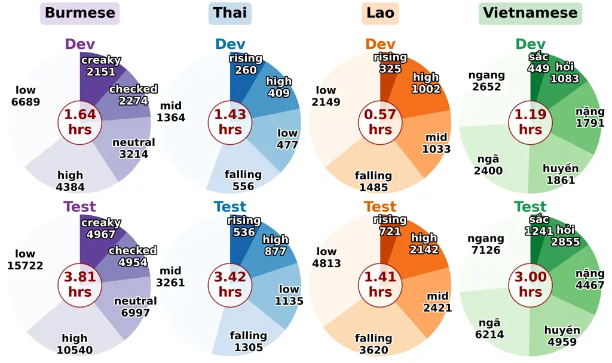
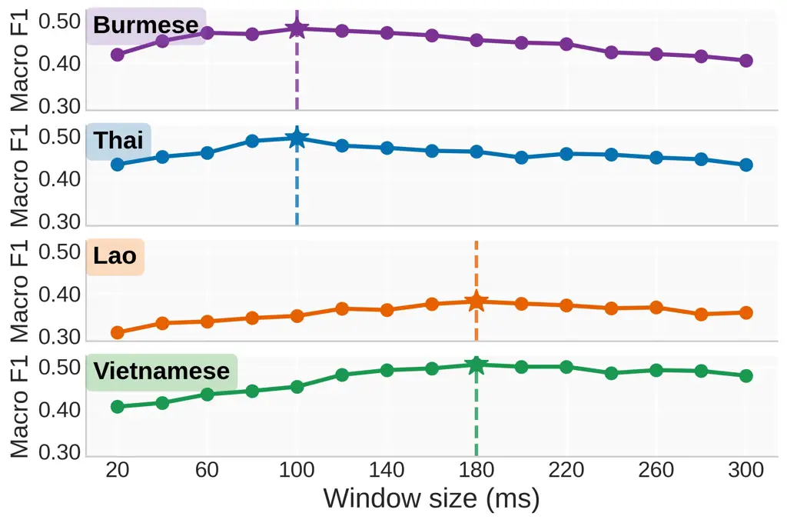
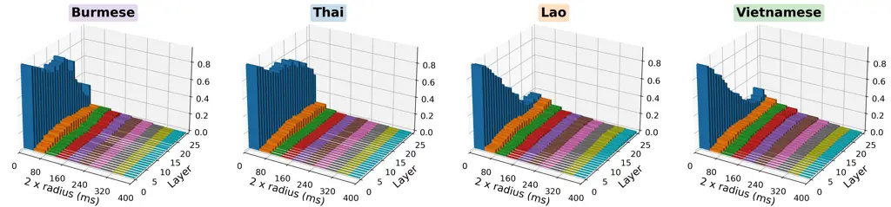
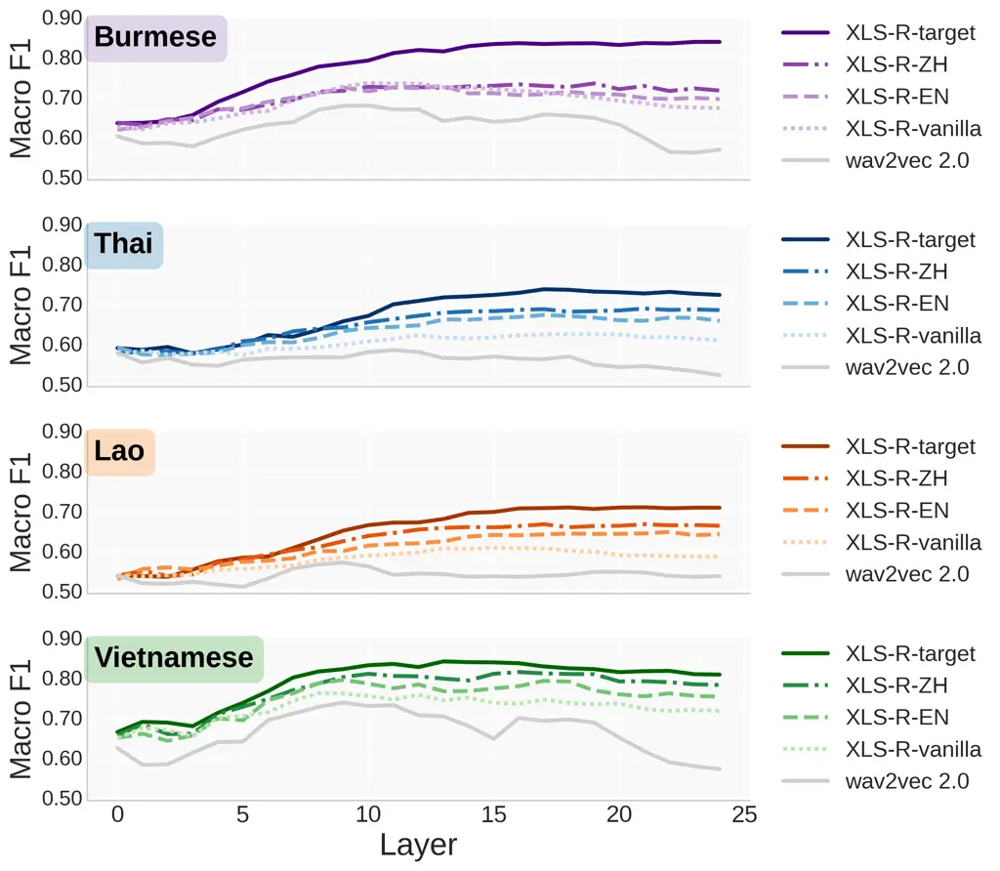
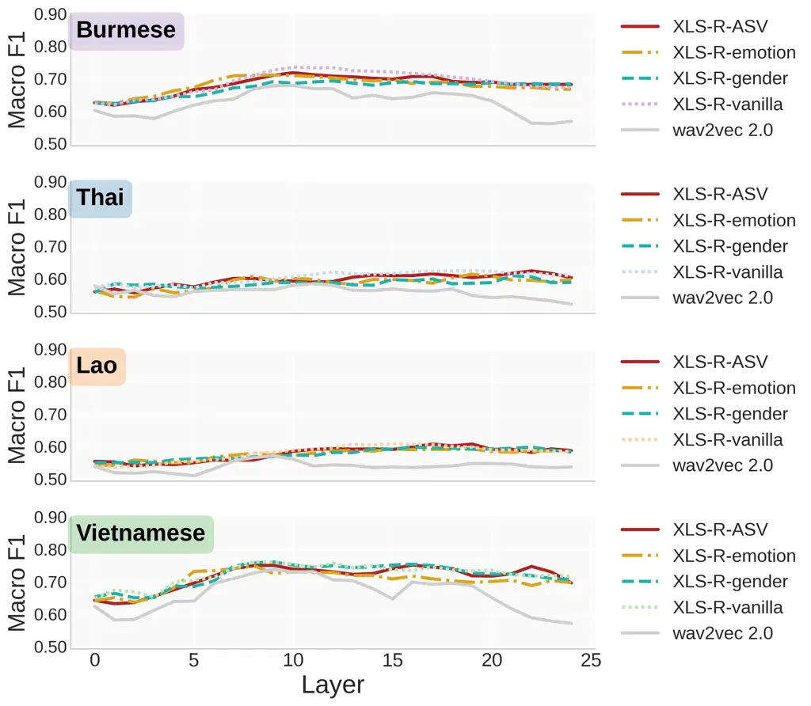
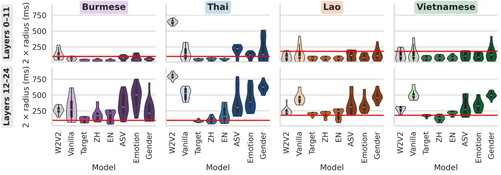
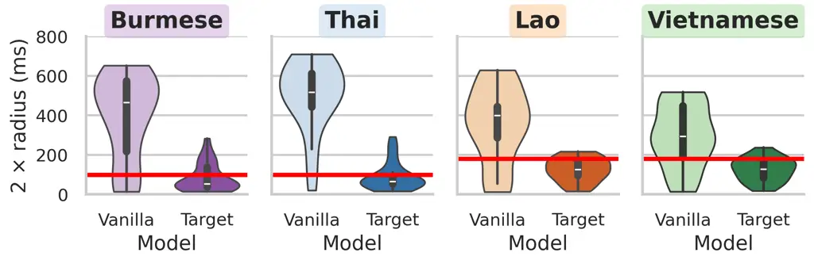
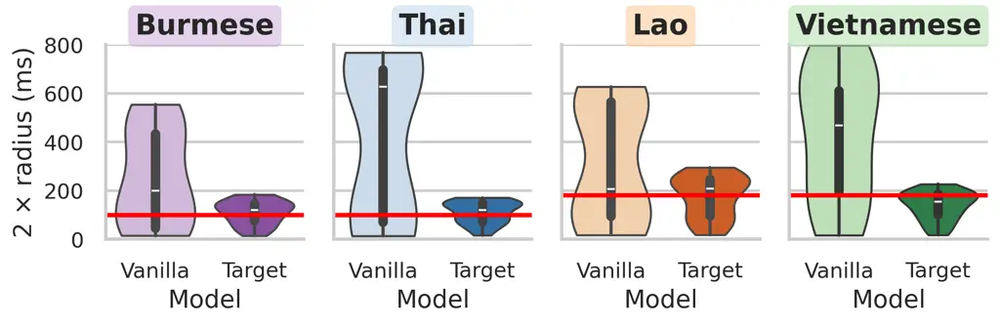

# How Far Do SSL Speech Models Listen for Tone? Temporal Focus of Tone Representation under Low-resource Transfer

Minu Kim     Ji Sub Um     Hoirin Kim

###### Abstract

Lexical tone is central to many languages but remains underexplored in
self-supervised learning (SSL) speech models, especially beyond
Mandarin. We study four languages with complex and diverse tone systems
(Burmese, Thai, Lao, and Vietnamese) to ask how far such models “listen”
for tone and how transfer operates in low-resource conditions. As a
baseline reference, we estimate the temporal span of tone cues:
approximately 100 ms (Burmese/Thai) and 180 ms (Lao/Vietnamese). Probes
and gradient analysis on fine-tuned SSL models reveal that tone transfer
varies by downstream task: automatic speech recognition fine-tuning
aligns spans with language-specific tone cues, while prosody- and
voice-related tasks bias toward overly long spans. These findings
indicate that tone transfer is shaped by downstream task, highlighting
task effects on temporal focus in tone modeling.

###### Index Terms: 

Tone, self-supervised learning, transfer learning, low-resource speech,
layer-wise probe

^(†)^(†)address: School of Electrical Engineering, KAIST, Daejeon,
Republic of Korea

## 1 Introduction

Lexical tone is a defining feature of many of the world’s languages,
accounting for about 40% \[9\], or up to 60–70% with pitch-accent
systems \[30\]. As a core linguistic cue for distinguishing word
meanings, tone is also vital in speech technology: failing to model it
degrades recognition and synthesis, while accurate encoding improves
robustness and intelligibility \[17, 7, 13, 28\]. Tone is thus central
not only in linguistic typology but also in the design of robust speech
systems.

Meanwhile, recent advances in self-supervised learning (SSL) for speech
have improved how speech is modeled and represented \[20\]. These models
have been shown to encode rich segmental information, particularly
phonemes \[12\], and have achieved strong results in multilingual
automatic speech recognition (ASR) and related tasks \[19, 33\].
However, supra-segmental features such as lexical tone have received far
less attention. Existing analyses have largely focused on Mandarin or a
few other languages \[26, 8, 10\], while systematic study of Southeast
Asian languages is still lacking, despite their complex tone systems
with dynamic pitch movements \[5\]. Since their tone cues unfold over
time, this highlights the importance of analyzing temporal spans in tone
modeling.

We thus focus on four Southeast Asian languages, relying on temporal
tone cues and encompassing diverse families: Burmese, Thai, Lao, and
Vietnamese, which remain under-studied and relatively low-resource in
speech technology. We first estimate the optimal temporal span for tone
classification with a log-Mel spectrogram and logistic regression,
finding shorter spans for Burmese and Thai ($`\approx`$100 ms) and
longer ones for Lao and Vietnamese ($`\approx`$180 ms). We then probe
SSL models layer by layer to analyze tone-centered gradient activity,
and evaluate how different fine-tuning strategies (e.g., ASR in the same
or different languages, prosody- or voice-related tasks such as
emotion/gender classification, and vanilla pretrained models) transfer
to tone recognition under low-resource settings by aligning with these
spans.

Our contributions are threefold. (1) We provide a systematic analysis of
the temporal span needed for tone recognition in tonal languages. (2) We
present a gradient-based layer-wise probe to examine how SSL models
capture tone spans. (3) We show that fine-tuning on tonal ASR yields
representations most consistent with these spans. Taken together, our
results demonstrate that tone representations are transferable in SSL
models when downstream finetuning aligns with tone spans.

## 2 Models and Data

### 2.1 Models

Base architectures. We analyze a set of representative self-supervised
speech encoders. Our primary focus is on wav2vec 2.0 large \[3\] and its
multilingual extension XLS-R 300M \[2\]. For additional comparison, we
also include MMS 300M \[25\] and mHuBERT-147 \[31\].

Fine-tuning settings. To examine how downstream adaptation shapes tone
representations, we consider single-language fine-tuned variants of
XLS-R 300M. For ASR, models are separately fine-tuned on Burmese, Thai,
Lao, and Vietnamese (FLEURS \[6\]), as well as on English and Mandarin
(CommonVoice v22.0 \[1\]). For prosody- and voice-related tasks, we use
models fine-tuned on emotion recognition (RAVDESS \[18\]), gender
classification (LibriSpeech train-clean-100 \[22\]), and speaker
verification (VoxCeleb1 \[21\]). For comparison, we include both vanilla
and target-language ASR fine-tuned MMS 300M and mHuBERT-147.

### 2.2 Languages and Data

Languages. We analyze four tonal languages using the FLEURS corpus
\[6\]: Burmese (Sino-Tibetan), Thai (Tai-Kadai), Lao (Tai-Kadai), and
Vietnamese (Austroasiatic). To ensure no data overlap, we fine-tune ASR
models on the train splits, while the tone-related probing classifiers
are trained on the dev sets and evaluated on the test sets. Figure 1
summarizes the tone distributions and dataset sizes across languages,
highlighting their data scarcity and the need for representation
transfer in low-resource settings \[14\].

Tone alignment. To obtain time-aligned tone units, we first apply
language-specific grapheme-to-phoneme (G2P) conversion (Burmese:
burmese-G2P¹¹ 1
[https://github.com/kyaw-yethu/burmese-G2P](https://github.com/kyaw-yethu/burmese-G2P);
Thai, Lao, Vietnamese: espeak-based phonemizer \[4\]) and extract tone
labels. We then perform CTC-based forced alignment \[11\] with wav2vec
2.0 models fine-tuned on the same corpus, in line with established
token-level alignment procedures \[15, 32\].



Figure 1: Tone distributions across languages. (Vietnamese tones: ngang
(high level), huyền (low level), sắc (rising), hỏi (falling-rising), ngã
(broken), nặng (falling) \[24\].)

## 3 Analysis Methods

### 3.1 Span Analysis with Acoustic Features

Before analyzing self-supervised models, we establish a baseline of the
temporal resolution required for tone recognition. Lexical tones can
rely on different temporal cues, ranging from brief pitch movements to
longer F₀ trajectories \[29, 23\], which motivates estimating the span
at which tone distinctions become reliably detectable across languages.
To this end, we train logistic regression classifiers on log-Mel
features using fixed windows (20–300 ms). Performance across window
sizes, evaluated with macro-F1, yields the optimal span per language,
providing a reference point for interpreting how SSL model
representations capture tone.

### 3.2 Probing SSL Representations

To examine how tone information is localized in SSL models, we adopt a
gradient-based sensitivity analysis \[27, 16\]. We first train simple
linear probes on each frozen SSL layer, evaluating their performance
with macro-F1: for each tone segment, the hidden state at the center
frame is used to predict its tone label. We then compute input gradients
with respect to the gold-class logit $`z^{(\ell)}_{y}`$ at
layer $`\ell`$, yielding squared gradient energies aligned to input time
frames (Eq. 1).

```math
g^{(\ell)}=\frac{\partial z^{(\ell)}_{y}}{\partial x},\hskip 20.00003ptE^{(\ell)}(t)=\bigl(g^{(\ell)}_{t}\bigr)^{2}. \tag{1}
```

Energies are aligned to time offsets $`\Delta t=|t-t_{c}|/f_{s}`$
relative to the tone center $`t_{c}`$, where $`f_{s}`$ is the sampling
rate (16 kHz), and binned (20 ms up to 1000 ms) to form normalized
histograms $`H^{(\ell)}(\Delta t)`$. From these, we derive the
center-of-mass radius $`r_{\mathrm{com}}^{(\ell)}`$ (in ms; Eq. 2),
summarizing the average temporal focus of gradient sensitivity. Smaller
$`r_{\mathrm{com}}^{(\ell)}`$ indicates sharper temporal concentration
around tone centers.

```math
r_{\mathrm{com}}^{(\ell)}=\frac{\sum_{\Delta t}\Delta t\,H^{(\ell)}(\Delta t)}{\sum_{\Delta t}H^{(\ell)}(\Delta t)}. \tag{2}
```



Figure 2: Baseline tone classification macro-F1 with logistic regression
across varying window lengths (20–300 ms). Shorter spans suffice for
Burmese and Thai, whereas Lao and Vietnamese require longer spans.



Figure 3: Normalized gradient energy around tone centers with XLS-R ASR
models fine-tuned in each language. Burmese/Thai show sharper focus,
while Lao/Vietnamese show broader spreads, consistent with acoustic span
baselines.





Figure 4: Layer-wise probe performance (macro-F1) across Burmese, Thai,
Lao, and Vietnamese using different SSL models (XLS-R-target: ASR on
target language; XLS-R-ZH: ASR on Mandarin Chinese; XLS-R-EN: ASR on
English; XLS-R-ASV: speaker verification; XLS-R-emotion: emotion
recognition; XLS-R-gender: gender classification). Probe performance
usually peaks in mid-to-high layers, showing that lexical tone
information is mainly captured at those layers.

## 4 Results

### 4.1 Baseline Span Analysis

We begin by quantifying the temporal resolution required for tone
recognition using acoustic features. Figure 2 shows tone classification
macro-F1 as a function of window length. Burmese and Thai perform best
with spans around 100 ms, while Lao and Vietnamese require longer spans
of roughly 180 ms. Performance declines when windows grow beyond these
ranges, confirming that the effective tone span is language-specific and
providing a reference scale for evaluating SSL model representations.

### 4.2 Gradient-based Temporal Sensitivity

Figure 3 shows normalized gradient energy around tone centers for
Burmese, Thai, Lao, and Vietnamese, using XLS-R models fine-tuned for
ASR in each language. Gradients are measured within a 1000 ms window and
normalized across time; for readability, only the inner 200 ms radius
($`\approx`$400 ms total span) is displayed. The x-axis marks temporal
offset from the tone center, the y-axis encoder layers, and the z-axis
the proportion of gradient energy.

Across languages, clear differences emerge: Burmese and Thai show sharp
concentration around tone centers, indicating narrow focus, whereas Lao
and Vietnamese display a bit broader spreads, especially in higher
layers, suggesting longer-span tone cues. These differences mirror the
acoustic baseline: languages with inherently short-span tone cues
produce tighter sensitivity, while those with longer cues induce wider
temporal receptive fields. Overall, the findings suggest that ASR
fine-tuning adapts SSL representations to match the language-specific
temporal scope of tone cues.



Figure 5: Distributions of layerwise effective span
($`2\times r_{\mathrm{com}}^{(\ell)}`$) for tone gradients, shown
separately for lower (0–11) and higher (12–24) layers across models
(W2V2: wav2vec 2.0 large; Vanilla: XLS-R-vanilla; ZH: XLS-R-ZH; EN:
XLS-R-EN; ASV: XLS-R-ASV; Emotion: XLS-R-emotion; Gender: XLS-R-gender).
Red line indicates baseline span; target ASR shows the closest fit.



Figure 6: Distributions of tone gradient spans along layers in MMS
models. Target ASR fine-tuning yields span alignment.

### 4.3 Effect of Fine-tuning Task

Layer-wise probe performance. Figure 4 compares the effect of different
fine-tuning strategies on probe performance. ASR fine-tuning
consistently yields the highest layer-wise F1 scores, with the advantage
becoming most pronounced in the middle to higher encoder layers where
tone cues are captured most effectively. Among the cross-lingual
settings, Mandarin ASR fine-tuning, which itself involves lexical tone,
achieves the second-best results, while English ASR fine-tuning still
improves macro-F1 over the XLS-R vanilla model. In contrast, fine-tuning
for prosody- or voice-related tasks (emotion, gender, speaker) produces
little to no improvement: their probe performance is nearly
indistinguishable from the vanilla model, indicating that these
objectives do not effectively separate tone information.

Layer-wise gradient sensitivity. Building on the analysis in
subsection 4.2, we quantify layerwise gradient concentration using the
effective span ($`2\times r_{\mathrm{com}}^{(\ell)}`$) around tone
centers. Figure 5 shows results for XLS-R under different fine-tuning
settings. We separate lower (0–11) and higher (12–24) layers since tone
information is more salient in higher layers. Target-language ASR
fine-tuning yields the most stable localization: in higher layers, spans
match the language-specific baselines (red lines) from subsection 4.1
(100 ms; 180 ms), whereas early layers lack such concentration,
explaining weaker tone probe results in 0-11. Cross-lingual ASR shows
similar trends, with Mandarin aligning more closely than English. In
contrast, prosody- and voice-related fine-tuning pushes spans overly
long, reflecting their broad acoustic focus and explaining lower probe
scores. Overall, span alignment is a key factor for capturing tone
information effectively.



Figure 7: Distributions of tone gradient spans in mHuBERT models. Target
ASR fine-tuning enhances tone localization.

### 4.4 Comparison with Other Models

Figures 6 and 7 show results for MMS \[25\] and mHuBERT-147 \[31\]. For
simplicity, we report radii across the full depth of each model. Both
models broadly mirror the patterns observed with XLS-R: Vanilla models
localize tone weakly, while target-language ASR fine-tuning sharpens
span alignment to language-specific cues.

## 5 Conclusion

We analyzed tone representations in SSL models for four Southeast Asian
languages, showing that mid-to-high layers capture tone most effectively
and that transfer is strongest when fine-tuning tasks align with the
language-specific span of tone cues. These findings highlight tone as a
transferable suprasegmental feature, providing a guide for seed model
selection and performance tuning in low-resource settings.

## 6 Acknowlegements

This work was supported by Institute of Information & communications
Technology Planning & Evaluation (IITP) grant funded by the Korea
government(MSIT) (No.RS-2025-02215393).

## References

- \[1\] R. Ardila, M. Branson, K. Davis, M. Henretty, M. Kohler, J.
  Meyer, R. Morais, L. Saunders, F. M. Tyers, and G. Weber (2019) Common
  voice: a massively-multilingual speech corpus. arXiv preprint
  arXiv:1912.06670. Cited by: §2.1.
- \[2\] A. Babu, C. Wang, A. Tjandra, K. Lakhotia, Q. Xu, N. Goyal, K.
  Singh, P. Von Platen, Y. Saraf, J. Pino, et al. (2021) XLS-r:
  self-supervised cross-lingual speech representation learning at scale.
  arXiv preprint arXiv:2111.09296. Cited by: §2.1.
- \[3\] A. Baevski, Y. Zhou, A. Mohamed, and M. Auli (2020) Wav2vec 2.0:
  a framework for self-supervised learning of speech representations.
  Advances in neural information processing systems 33, pp. 12449–12460.
  Cited by: §2.1.
- \[4\] M. Bernard and H. Titeux (2021) Phonemizer: text to phones
  transcription for multiple languages in python. Journal of Open Source
  Software 6 (68), pp. 3958. Cited by: §2.2.
- \[5\] M. Brunelle and J. Kirby (2016) Tone and phonation in southeast
  asian languages. Language and Linguistics Compass 10 (4), pp. 191–207.
  Cited by: §1.
- \[6\] A. Conneau, M. Ma, S. Khanuja, Y. Zhang, V. Axelrod, S.
  Dalmia, J. Riesa, C. Rivera, and A. Bapna (2023) Fleurs: few-shot
  learning evaluation of universal representations of speech. In 2022
  IEEE Spoken Language Technology Workshop (SLT), pp. 798–805. Cited by:
  §2.1, §2.2.
- \[7\] R. Coto-Solano (2021) Explicit tone transcription improves asr
  performance in extremely low-resource languages: a case study in
  bribri. In Proceedings of the first workshop on natural language
  processing for Indigenous languages of the Americas, pp. 173–184.
  Cited by: §1.
- \[8\] A. de la Fuente and D. Jurafsky (2024) A layer-wise analysis of
  mandarin and english suprasegmentals in ssl speech models. In Proc.
  Interspeech 2024, pp. 1290–1294. Cited by: §1.
- \[9\] M. S. Dryer and M. Haspelmath (Eds.) (2013) WALS online
  (v2020.4). Data set, Zenodo. External Links:
  [Link](https://doi.org/10.5281/zenodo.13950591),
  [Document](https://dx.doi.org/10.5281/zenodo.13950591) Cited by: §1.
- \[10\] P. Gogoi, S. Kalita, W. Lalhminghlui, V. Terhiija, M.
  Tzudir, P. Sarmah, and S. Prasanna (2025) Tone recognition in
  low-resource languages of north-east india: peeling the layers of
  ssl-based speech models. arXiv preprint arXiv:2506.03606. Cited by:
  §1.
- \[11\] A. Graves, S. Fernández, F. Gomez, and J. Schmidhuber (2006)
  Connectionist temporal classification: labelling unsegmented sequence
  data with recurrent neural networks. In Proceedings of the 23rd
  international conference on Machine learning, pp. 369–376. Cited by:
  §2.2.
- \[12\] H. Ji, T. Patel, and O. Scharenborg (2022) Predicting within
  and across language phoneme recognition performance of self-supervised
  learning speech pre-trained models. arXiv preprint arXiv:2206.12489.
  Cited by: §1.
- \[13\] C. Jiang, Y. Gao, W. W. Ng, J. Zhou, J. Zhong, H. Zhen, and X.
  Hu (2024) Semantic dependency and local convolution for enhancing
  naturalness and tone in text-to-speech synthesis. Neurocomputing 608,
  pp. 128430. Cited by: §1.
- \[14\] M. Kim, K. Jang, and H. Kim (2025) Improving cross-lingual
  phonetic representation of low-resource languages through language
  similarity analysis. In ICASSP 2025-2025 IEEE International Conference
  on Acoustics, Speech and Signal Processing (ICASSP), pp. 1–5. Cited
  by: §2.2.
- \[15\] L. Kürzinger, D. Winkelbauer, L. Li, T. Watzel, and G.
  Rigoll (2020) Ctc-segmentation of large corpora for german end-to-end
  speech recognition. In International Conference on Speech and
  Computer, pp. 267–278. Cited by: §2.2.
- \[16\] J. Li, W. Monroe, and D. Jurafsky (2016) Understanding neural
  networks through representation erasure. arXiv preprint
  arXiv:1612.08220. Cited by: §3.2.
- \[17\] S. Liang and G. Levow (2025) Tone in perspective: a
  computational typological analysis of tone function in asr. In
  Proceedings of the 7th Workshop on Research in Computational
  Linguistic Typology and Multilingual NLP, pp. 82–92. Cited by: §1.
- \[18\] S. R. Livingstone and F. A. Russo (2018) The ryerson
  audio-visual database of emotional speech and song (ravdess): a
  dynamic, multimodal set of facial and vocal expressions in north
  american english. PloS one 13 (5), pp. e0196391. Cited by: §2.1.
- \[19\] V. S. Lodagala, A. Biswas, S. Das, S. Umesh, et al. (2024) All
  ears: building self-supervised learning based asr models for indian
  languages at scale. In Proc. interspeech 2024, pp. 3944–3948. Cited
  by: §1.
- \[20\] A. Mohamed, H. Lee, L. Borgholt, J. D. Havtorn, J. Edin, C.
  Igel, K. Kirchhoff, S. Li, K. Livescu, L. Maaløe, et al. (2022)
  Self-supervised speech representation learning: a review. IEEE Journal
  of Selected Topics in Signal Processing 16 (6), pp. 1179–1210. Cited
  by: §1.
- \[21\] A. Nagrani, J. S. Chung, and A. Zisserman (2017) Voxceleb: a
  large-scale speaker identification dataset. arXiv preprint
  arXiv:1706.08612. Cited by: §2.1.
- \[22\] V. Panayotov, G. Chen, D. Povey, and S. Khudanpur (2015)
  Librispeech: an asr corpus based on public domain audio books. In 2015
  IEEE international conference on acoustics, speech and signal
  processing (ICASSP), pp. 5206–5210. Cited by: §2.1.
- \[23\] J. Perkins, S. J. Lee, and J. Villegas (2024) The interaction
  between tone and duration in du’an zhuang. Journal of the
  International Phonetic Association 54 (3), pp. 939–973. Cited by:
  §3.1.
- \[24\] A. H. Pham (2003) The key phonetic properties of vietnamese
  tone: a reassessment. In International Congress of Phonetic Sciences,
  Barcelona, pp. 1703–1706. Cited by: Figure 1, Figure 1.
- \[25\] V. Pratap, A. Tjandra, B. Shi, P. Tomasello, A. Babu, S.
  Kundu, A. Elkahky, Z. Ni, A. Vyas, M. Fazel-Zarandi, et al. (2024)
  Scaling speech technology to 1,000+ languages. Journal of Machine
  Learning Research 25 (97), pp. 1–52. Cited by: §2.1, §4.4.
- \[26\] G. Shen, M. Watkins, A. Alishahi, A. Bisazza, et al. (2024)
  Encoding of lexical tone in self-supervised models of spoken language.
  arXiv preprint arXiv:2403.16865. Cited by: §1.
- \[27\] K. Simonyan, A. Vedaldi, and A. Zisserman (2013) Deep inside
  convolutional networks: visualising image classification models and
  saliency maps. arXiv preprint arXiv:1312.6034. Cited by: §3.2.
- \[28\] D. Tao, D. Tan, Y. T. Yeung, X. Chen, and T. Lee (2024)
  Toneunit: a speech discretization approach for tonal language speech
  synthesis. arXiv preprint arXiv:2406.08989. Cited by: §1.
- \[29\] J. Yang, Y. Zhang, A. Li, and L. Xu (2017) On the duration of
  mandarin tones.. In Interspeech, pp. 1407–1411. Cited by: §3.1.
- \[30\] M. J. W. Yip (2002) Tone. Cambridge University Press. Cited by:
  §1.
- \[31\] M. Zanon Boito, V. Iyer, N. Lagos, L. Besacier, and I.
  Calapodescu (2024) MHuBERT-147: a compact multilingual hubert model.
  In Proc. Interspeech 2024, pp. 3939–3943. Cited by: §2.1, §4.4.
- \[32\] J. Zhu, C. Zhang, and D. Jurgens (2022) Phone-to-audio
  alignment without text: a semi-supervised approach. In ICASSP
  2022-2022 IEEE International Conference on Acoustics, Speech and
  Signal Processing (ICASSP), pp. 8167–8171. Cited by: §2.2.
- \[33\] X. Zhuang, Y. Qian, and M. Wang (2024) SVQ-mae: an efficient
  speech pre-training framework with constrained computational
  resources. EURASIP Journal on Audio, Speech, and Music Processing 2024
  (1), pp. 55. Cited by: §1.
