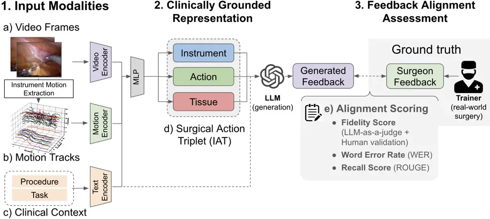
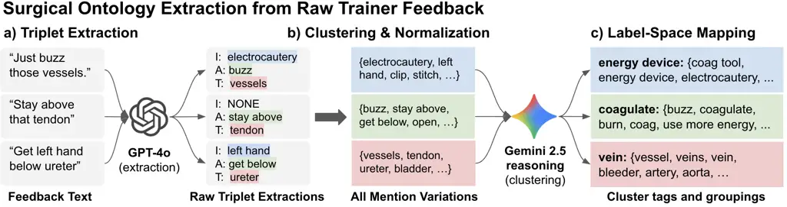
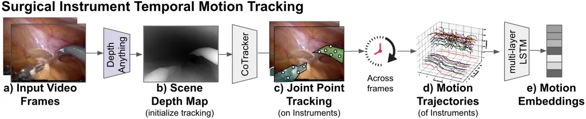
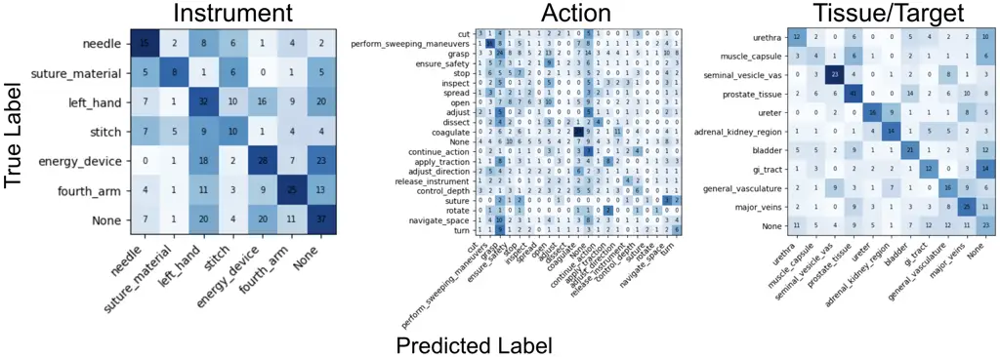
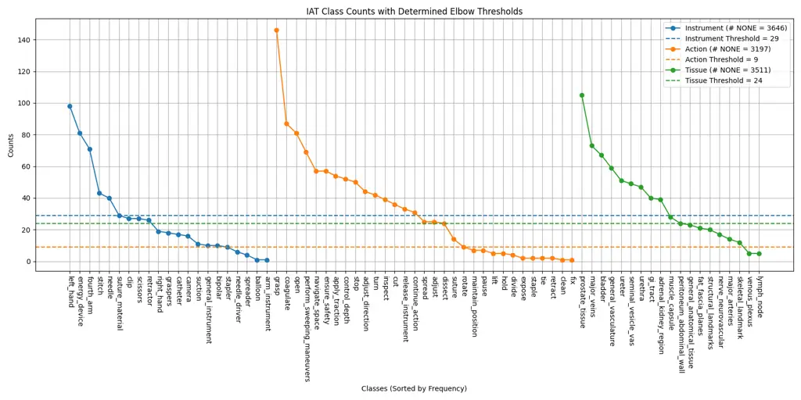

# Generating Natural-Language Surgical Feedback: From Structured Representation to Domain-Grounded Evaluation

These authors contributed equally

Firdavs Nasriddinov Email: <firdavs@caltech.edu> Affiliation: California
Institute of Technology, USA and ¹¹footnotemark: 1  
California Institute of Technology, Cedars-Sinai Medical Center, USA
and  
California Institute of Technology, USA and  
Cedars-Sinai Medical Center, USA    Rafal Kocielnik
Email: [rafalko@caltech.edu,
Rafal.Kocielnik@cshs.org](mailto:rafalko@caltech.edu,%20Rafal.Kocielnik@cshs.org)
Affiliation:     Anima Anandkumar Email: <anima@caltech.edu>
Affiliation:     Andrew J. Hung Email: <andrew.hung@cshs.org>
Affiliation: 

###### Abstract

High-quality intraoperative feedback from a surgical trainer is pivotal
for improving trainee performance and long-term skill acquisition.
Automating natural, trainer-style feedback promises timely, accessible,
and consistent guidance at scale—but requires models that understand
clinically relevant representations. We present a structure-aware
pipeline that learns a surgical action ontology from real
trainer$`\rightarrow`$trainee transcripts (33 surgeries) and uses it to
condition feedback generation. We contribute by 1) mining
Instrument-Action-Target (IAT) triplets from real-world feedback text
and clustering surface forms into normalized categories, 2) fine-tuning
a video$`\rightarrow`$IAT model that leverages the surgical procedure
and task contexts, as well as fine-grained temporal instrument motion
(crucial for representing instruments and actions over time), and 3)
demonstrating how to effectively leverage IAT triplet representation to
guide GPT-4o in generating clinically-grounded natural, trainer-style
feedback. We show that, on Task 1: Video$`\rightarrow`$IAT recognition,
our context injection and temporal tracking deliver consistent AUC gains
– Instrument: 0.67$`\rightarrow`$0.74, Action: 0.60$`\rightarrow`$0.63,
Tissue: 0.74$`\rightarrow`$0.79. For Task 2: Feedback text generation (1
\[opposite/unsafe\] - 3 \[admissible\] - 5 \[perfect match\] fidelity
rubric against human trainer), GPT-4o from video alone scores 2.17; IAT
conditioning reaches 2.44 (+12.4%), increasing the admissible
generations with score $`\geq`$3: 21%$`\rightarrow`$42%. Traditional
metrics also improve: Word Error Rate (WER): $`\downarrow`$15–31% and
ROUGE (phrase/substring overlap): $`\uparrow`$9–64%. Grounding
generation in explicit IAT structure improves fidelity and yields
clinician-verifiable rationales, supporting auditable use in surgical
training.

^(†)^(†)volume: 297^(†)^(†)year: 2025^(†)^(†)workshop: Machine Learning
for Health (ML4H) 2025

###### keywords

Surgical training; Feedback generation; Action triplets (IAT); Video
understanding; Surgical instrument tracking

#### Data and Code Availability

Due to privacy restrictions, data is available upon request. The code is
publically available on [GitHub](https://github.com/firdavsn/SurgFBGen).

#### Institutional Review Board (IRB)

The data used was collected under IRB of the University of Southern
California (HS-17-00113).

## 1 Introduction

Figure 1: Structure-aware pipeline for clinically aligned surgical
feedback. (1) Multimodal inputs: video, inferred instrument motion, and
procedure/task context are encoded and fused. (2) Clinically grounded
representation: the fused features yield an _Instrument–Action–Tissue
(IAT)_ triplet summarizing the tool–tissue interaction. (3) Feedback
generation & evaluation: predicted IATs condition an LLM to produce
trainer-style feedback, assessed with a clinician-aligned _fidelity_ and
standard text metrics.

#### Importance:

High-quality intraoperative feedback from the surgical trainer is
pivotal for improving trainee performance and long-term skill
acquisition. Real-time trainer feedback aimed at modifying trainee
behavior helps avoid errors (Wong et al., 2023), and the quality of
feedback is linked to intraoperative performance (Bonrath et al., 2015),
long-term learning outcomes (Agha et al., 2015), and operative outcomes
via communication quality (D’Angelo et al., 2020). Automatically
generation natural, trainer-style feedback promises timely, accessible,
and consistent guidance at scale—extending expert coaching beyond what
busy trainers can provide in real time—while mitigating the inefficiency
and rater biases inherent to manual assessment (Chinh et al., 2019).
Realizing this promise requires approaches that leverage clinically
meaningful representations, so that generated guidance remains
clinically grounded, interpretable, and auditable.

#### Challenges:

Surgical feedback is high-stakes: guidance must be technically correct
and grounded in the live operative scene. In practice, feedback is
spontaneous, conversational speech that entangles clinically critical
_semantics_—which instrument, which action, which target—with surface
_syntax_ (style, tone, hedges) (Wong et al., 2023), while the scene
itself is visually complex and evolves through tightly coupled
instrument–tissue interactions (Ma et al., 2022). Large, diverse corpora
of synchronized surgical video and trainer feedback are rare due to
privacy/IRB constraints and the cost of expert annotation, yielding
_data scarcity_ and amplifying _domain shift_ between general purpose
and surgery-specific video-language representations Philipp et al.
(2022). Off-the-shelf VLMs often miss procedure/task context and lack
mechanisms to bind utterances to concrete visual evidence under these
shifts (Kiyasseh et al., 2023). Moreover, text-overlap metrics (e.g.,
WER/ROUGE) poorly reflect clinical correctness, motivating
structure-aware, clinically grounded representations (e.g.,
Instrument–Action–Tissue semantics) and clinician-aligned evaluation.

#### Our Approach:

We introduce a *structure-aware pipeline*¹¹ 1 ’structure-aware’ - using
explicit, clinically meaningful intermediate schema to guide perception
and generation. that (i) learns a feedback-induced surgical action
ontology from real trainer $`\to`$ trainee transcripts and (ii) uses
that structure to guide natural language feedback generation from
surgical videos.

An overview of our feedback generation pipeline is depicted in Fig. 1.
We first train a video$`\rightarrow`$IAT predictor that fuses three
inputs: (1a) video frames from endoscopic camera (mean-pooled
embeddings), (1b) _instrument motion tracks_ derived by estimating depth
and tracking multi-point trajectories (details in Fig. 3), and (1c)
_clinical context_ (procedure and local task) as text embeddings. These
streams are concatenated with an MLP to produce multi-head predictions
of the (2d) _Instrument–Action–Tissue (IAT)_ triplet. The predicted
triplets then condition GPT-4o to generate natural language feedback,
with an uncertainty gate forwarding only confident triplets to mitigate
hallucinations; outputs are compared to trainer ground truth using a
clinician-aligned 1-–5 _fidelity_ score and secondary WER/ROUGE (3e).

To enable this pipeline, we automatically mine _Instrument–Action–Target
(IAT)_ mentions from trainer $`\to`$ trainee teaching transcripts
delivered in 33 real surgeries collected by Wong et al. (2023). We
cluster various mentions into normalized categories, yielding a
data-driven dictionary aligned with clinical language which supports
Video$`\rightarrow`$IAT mapping.

#### Findings:

- •
  IAT triplet recognition from video: Adding temporal instrument
  tracking and surgical context yields consistent gains across backbones
  (Table 19)—roughly _+0.07–0.08 AUC_ for Instrument
  ($`\sim\!+10`$–$`12\%`$), _+0.02–0.03_ for Action
  ($`\sim\!+4`$–$`5\%`$), and _+0.05–0.09_ for Tissue
  ($`\sim\!+7`$–$`13\%`$).
- •
  Feedback generation: Structure-aware prompting raises scores on 1-–5
  fidelity rubric (Table 3) from $`\mathit{2.17}`$ (video-only) to
  $`\mathit{2.42}`$ with high-confidence triplets ($`+12.4\%`$),
  increasing the share of admissible ($`\geq\!3`$: $`+22`$ pp) and
  high-quality feedback ($`\geq\!4`$: $`+3`$ pp). Secondary metrics also
  improve (WER $`\downarrow`$ $`31\%`$; ROUGE $`\uparrow`$ $`64\%`$).

#### Contributions:

- •
  Surgeon-aligned feedback from video: To the best of our knowledge, we
  are the first to propose an end-to-end generation of natural-language
  feedback in robot-assisted surgery, grounded in interpretable IAT
  triplets and motion cues.
- •
  Two-step, structure-aware framework: (1) video, procedure/task text,
  instrument motion$`\rightarrow`$IAT prediction; (2) controlled LLM
  feedback generation conditioned on triplets.
- •
  Clinically grounded evaluation: A reproducible protocol combining a
  clinician-aligned 1–-5 fidelity rubric with an interpretable,
  surgery-specific LLM-as-judge alignment score.

## 2 Related Work

#### Feedback in Robot-Assisted Surgery.

Natural-language feedback is the primary medium of trainer guidance in
surgery (Wong et al., 2023), and its quality is linked to intraoperative
performance (Bonrath et al., 2015) and operative outcomes (D’Angelo
et al., 2020). Prior work has largely _measured_ rather than _delivered_
feedback: content categorization (Wong et al., 2023; Kocielnik et al.,
2023), delivery-style quantification (Knudsen et al., 2025; Kocielnik
et al., 2024), and multimodal prediction of effectiveness (Gupta et al.,
2025). On the delivery side, rubric-based tools (e.g., EASE) support
targeted coaching (Haque et al., 2022); wizard-of-oz studies show
real-time standardized coaching can help (Laca et al., 2022); early
automated systems provide narrow, clip-level video feedback (Ma et al.,
2024); and complementary hardware work explores force feedback (Servais
et al., 2025). We instead generate _surgeon-aligned natural-language
feedback_ directly from operative video by grounding an LLM in
clinically meaningful _Instrument–Action–Target_ structure predicted via
multimodal fusion.

#### Vision–Language Models in Surgery.

Recent surgical VLMs target different goals. GP-VLS trains on six
surgery-focused datasets and evaluates with SurgiQual, showing strong
knowledge and vision–language performance (Schmidgall et al., 2024a).
SurgRAW uses a multi-agent, chain-of-thought framework with retrieval to
reduce hallucinations across workflow tasks such as instrument/action
recognition and outcome assessment (Low et al., 2025). Surgical-LVLM
adapts a large VLM with VP-LoRA and a token-interaction module to couple
answers with localized evidence, achieving SOTA on EndoVis VQA/VQLA
benchmarks (Wang et al., 2024). Earlier systems (SurgicalGPT (Seenivasan
et al., 2023), Surgical-VQA (Seenivasan et al., 2022), Surgical-VQLA
(Bai et al., 2023)) often reframe classification datasets or attach
heads, yielding descriptive scene understanding rather than prescriptive
guidance. In parallel, foundational surgical video models improve
representation transfer: GSViT pre-trains on 680h with next-frame
objectives (Schmidgall et al., 2024b); SurgVLP aligns 3k hours of
lecture video with transcripts (Yuan et al., 2023); and PeskaVLP adds
hierarchical knowledge augmentation with procedure-aware, DTW-aligned
pretraining (Yuan et al., 2024). For feedback, prior video-based work
stops at _classification_ of effectiveness (Kocielnik et al., 2023; Wong
et al., 2023). In contrast, we generate _surgeon-aligned_
natural-language feedback from operative video by grounding an LLM in
predicted _Instrument–Action–Target_ structure and evaluate with a
clinician-aligned fidelity rubric.

#### Surgical Action Triplets.

Surgical action triplets—⟨instrument, action/verb, target⟩—are a
standard fine-grained representation of tool–tissue interactions in
endoscopic/robotic surgery, offering richer context than phase/step
labels (Nwoye et al., 2020). The community formalized this via
CholecTriplet 2021/2022, progressing from recognition (per-frame
triplet) to detection (localizing tools and associating verb–target)
(Nwoye et al., 2023a; Nwoye et al., 2023b). Advances include
attention-based association (Nwoye et al., 2022), mixed-supervised
instrument–tissue detection (Sharma et al., 2023), and multi-task
spatiotemporal models (e.g., MT-FiST) (Li et al., 2023). Prior work
largely stops at triplet prediction from video; in contrast, we (i)
_induce a triplet ontology from trainer–trainee transcripts_, (ii)
_predict triplets via multimodal fusion_, and (iii) _use triplets to
control LLM feedback generation_—turning triplets from an analysis
endpoint into a grounding interface for safe, surgeon-aligned
natural-language feedback.

## 3 Methods

|                         |           |         |
| ----------------------- | --------- | ------- |
| Category                | Count     | % Total |
| Lines of Feedback Text  | 4210      | 100.0%  |
| Unique Procedures       | 7         | –       |
| Unique Tasks            | 36        | –       |
| Unique Instruments^(\*) | 114 (7)   | –       |
| Unique Actions^(\*)     | 1107 (21) | –       |
| Unique Targets^(\*)     | 251 (11)  | –       |
| Feedback w/ Instrument  | 344       | 8.2%    |
| Feedback w/ Action      | 875       | 20.8%   |
| Feedback w/ Tissue      | 512       | 12.2%   |
| Single value triplet    | 1405      | 33.4%   |
| Multiple value triplets | 416       | 9.9%    |

^(\*) Number before parenthesis represents raw counts. Number in
parenthesis represents counts after clustering and selection.

Table 1: Summary statistics of our dataset with breakdowns of counts of
IAT triplets extracted.

### 3.1 Data Acquisition

We use authentic trainer$`\to`$trainee feedback from real robot-assisted
surgeries collected by Wong et al. (2023) (Table 1). Audio was recorded
via surgeon-worn wireless microphones and synchronized with endoscopic
point-of-view video using an external device integrated with the da
Vinci Xi system (DiMaio et al., 2011). In total, 4,210 feedback
instances were transcribed and paired with procedure labels (e.g.,
radical prostatectomy, nephrectomy) and coarse task annotations (e.g.,
adenoma dissection, closing peritoneum).

Figure 2: Surgical ontology extraction from raw trainer feedback. (a)
Triplet Extraction — GPT-4o parses free-text feedback into one or more
_Instrument–Action–Tissue_ triplets
$`[\mathrm{I},\mathrm{A},\mathrm{T}]`$, permitting _null_ components
when unmentioned. (b) Clustering & Normalization — a reasoning LLM
(Gemini 2.5) clusters semantically related surface forms for each slot
(I/A/T), merges them into functionally coherent meta-clusters, and
prunes low-frequency categories. (c) Label-Space Mapping — canonical
tags (e.g., energy device, coagulate, vein) and raw$`\rightarrow`$tag
mappings are produced; this normalized label space provides weak
supervision for the video$`\rightarrow`$ IAT model and conditions
feedback generation.

### 3.2 Surgical Feedback Definition

We adopt the clinically validated definition of Wong et al. (2023):
surgical feedback is _any dialogue intended to modify a trainee’s
thinking or behavior during live surgery_. In our dataset, this
comprises real-time trainer$`\to`$trainee utterances directed to a
console-operating trainee and _contextually tied_ to the ongoing task to
guide actions, decisions, or understanding. Social/irrelevant
conversation is excluded.

### 3.3 Natural Language Surgical Feedback Generation Pipeline

As shown in Fig. 1, our pipeline (i) fuses multimodal inputs (video,
motion, clinical context), (ii) grounds predictions in an interpretable
surgical IAT representation, and (iii) evaluates generated trainer-style
feedback against trainer references.

#### (1) Input Modalities.

We predict the _Instrument–Action–Tissue (IAT)_ triplet from short video
clips (10 s at 5 fps) by fusing three complementary sources: endoscopic
video frames, temporal instrument motion, and clinical context of
procedure and task. Next, we describe how each is obtained.

(a) Video Encoding. Frames are passed through a surgically pretrained
backbone—_PeskaVLP_ (Yuan et al., 2024) or _SurgVLP_ (Yuan et al.,
2025)—to obtain per-frame embeddings, which we mean-pool across time
into a clip-level _video embedding_. We leverage surgical backbones
because general-purpose models exhibit reduced sensitivity to clinically
salient events across clips (Philipp et al., 2022).

(b) Motion Tracks. From the same clip we extract multi-point
trajectories of instrument motion and embed them with a dedicated
temporal motion encoder (LSTM) to represent tool kinematics.
_Integrating temporal motion tracking is one of our key contributions_
(details in Sec. §3.5). This step produces _motion embeddings_.

(c) Clinical Context Encoding. For each clip, we expand the provided
_procedure_ and _local task_ into concise, clinically phrased summaries
with GPT-4o (definitions in Tables 21, 22–25; prompts in Tables 8, 9),
following the knowledge-augmentation strategy of Yuan et al. (2024). We
then encode these summaries using the _text encoder of the same
surgically pretrained video–language backbone_ as the video stream
(i.e., _SurgVLP_ or _PeskaVLP_) to preserve an aligned vision–text
latent space and leverage surgical priors, yielding _procedure_ and
_task_ embeddings.

#### (2) Clinically Grounded Representation (IAT triplet).

We fuse the clip-level _video_, _procedure/task_, and _motion_
embeddings and pass the result to three identical MLP heads for I/A/T (3
layers: $`64\!\rightarrow\!32\!\rightarrow\!16`$). The heads produce the
(d) predicted Instrument–Action–Tissue triplet—an interpretable
abstraction of “which instrument did what to which tissue” that grounds
downstream feedback generation. Supervision derives from ground-truth
triplets mined from trainer feedback via _our contribution in the form
of ontology extraction pipeline_ (Sec. §3.4).

#### (3) Feedback Generation and Alignment Assessment.

We cast feedback generation as _data-to-text_: GPT-4o is conditioned on
(i) _procedure/task_ summaries situating the clip in workflow, (ii)
predicted _IAT_ triplets, (iii) _video frames_ from a 10 s window at
1 fps, and (iv) a _reference lexicon_ plus a few
_IAT$`\rightarrow`$feedback_ examples. A single prompt (App. C.1) frames
the model as a surgical training assistant, constrains outputs to 1–3
sentences, and steers toward actionable, safety-oriented guidance tied
to the observed tool–tissue interaction while avoiding redundancy.
Generated feedback is then compared (via  15) to trainer references
using a clinician-aligned _fidelity_ score and standard NLP metrics
(Sec. §4).

### 3.4 Ontology Extraction and Weakly Supervised Label Construction

Figure 2 overviews our _novel three-step ontology extraction pipeline_,
which provides a weak supervision labels for Video$`\rightarrow`$IAT
prediction task.

Figure 3: Surgical instrument temporal motion tracking pipeline. (a)
_Input video frames_ from the endoscopic view are processed to capture
tool appearance and motion. (b) A _scene depth map_ is estimated (Depth
Anything) to initialize spatially consistent point tracking. (c) _Joint
point tracking_ of instrument keypoints is performed across frames using
CoTracker. (d) The resulting _motion trajectories_ capture fine-grained
temporal dynamics of instrument movement. (e) An LSTM encodes these
trajectories into compact _motion embeddings_ for downstream modeling.

- •
  Triplet Extraction (Fig 2.a) We treat live trainer feedback
  transcripts as a source of _weak supervision_ for surgical action
  recognition. Each feedback snippet is processed with GPT-4o to extract
  one or more _Instrument–Action–Target (IAT)_ triplets in the form \[I,
  A, T\] (prompts in Tables  10,  11,  12). This converts naturalistic
  comments into _sparse multi-class labels_ suitable for video
  classification; e.g., “use your grasper to gently pull back on the
  peritoneum” $`\rightarrow`$ (grasper, gently pull back, peritoneum).
  As feedback is not designed to enumerate all elements, triplets may be
  _incomplete_; we permit _null_ fields for missing components.
- •
  Clustering & Normalization (Fig 2.b) The raw extractions exhibit
  substantial lexical variation (e.g., _“buzz”/“burn”/“coagulate”_ and
  long-tail distributions, requiring both grouping of semantically
  related mentions and normalization of exact synonyms. We use Gemini
  2.5 Pro (Comanici et al., 2025) for clustering and ontology
  construction, inspired by  Babaei Giglou et al. (2024); Yang et al.
  (2024b). We introduce a semi-automated two-step procedure. First, the
  LLM clusters surface forms into fine-grained, semantically coherent
  groups (prompt in Table  13). Second, with few-shot prompting (Table
   14), it merges these into relevant meta-clusters, followed by
  elbow-based pruning to drop low-frequency categories (Figure  5).
  Cluster coherence comparison against other methods can be found in
  Table 6, App. B.
- •
  Label-space Mapping (Fig 2.c) The resulting hierarchy maps varied
  surface forms to canonical, clinically meaningful tags (see App. K),
  balancing fidelity to nuance (fine-grained clusters) against label
  frequency needed for robust video classification (meta-clusters). We
  preserve links across raw feedback text and canonical tags—yielding a
  normalized label space for video$`\rightarrow`$IAT supervision and
  conditioning of feedback generation.

### 3.5 Temporal Instrument Motion Tracking

Figure 3 illustrates our _novel pipeline for extracting instrument
motion trajectories_ from surgical video. While video and context
embeddings capture visual and procedure priors, they underutilize the
rich kinematics of surgical tools. We contribute with a dedicated
_motion stream_ in five sequential stages:

- •
  Input Frames (Fig. 3.a) Video clips (10s at 5 fps) provide the raw
  input for motion extraction.
- •
  Scene Depth Map (Fig. 3.b) We pre-emphasize metallic tools by dimming
  the first frame (distance-to-gray heuristic) and then run
  DepthAnything (Yang et al., 2024a) to produce a dense depth map,
  providing geometric grounding and more reliable instrument point
  initialization.
- •
  Joint Point Tracking (Fig. 3.c) From the depth map, we construct an
  _instrument-edge mask_ via OpenCV edge detection with circular
  contouring. Within this mask, CoTracker (Karaev et al., 2024) tracks a
  uniform $`20{\times}20`$ grid of candidate points across the clip,
  discarding those outside the mask.
- •
  Motion Trajectories (Fig. 3.d) The tracked points produce dense
  temporal trajectories. A _kinematic filter_ selects the top 50% of
  points with the largest displacement magnitude, retaining instrument
  tracks and filtering out background.
- •
  Motion Embeddings (Fig. 3.e) The filtered trajectories (2D coordinates
  over time, optionally augmented with depth at $`t{=}0`$) are encoded
  by a 10-layer LSTM into compact _motion embeddings_.

## 4 Experimental Setup

|            |                            |                         |                                                           |                         |                                                           |                          |                                                           |
| ---------- | -------------------------- | ----------------------- | --------------------------------------------------------- | ----------------------- | --------------------------------------------------------- | ------------------------ | --------------------------------------------------------- |
| Base Model | Context                    | Instrument              |                                                           | Action                  |                                                           | Tissue                   |                                                           |
|            |                            | AUC                     | Gain                                                      | AUC                     | Gain                                                      | AUC                      | Gain                                                      |
| GPT-4o     | Vision+Proc./Task+Tracking | $`0.50_{\pm 0.01}`$     | -                                                         | $`0.51_{\pm 0.01}`$     | -                                                         | $`0.52_{\pm 0.02}`$      | -                                                         |
| SurgVLP    | Vision                     | $`0.65_{\pm 0.02}`$     | -                                                         | $`0.58_{\pm 0.02}`$     | -                                                         | $`0.70_{\pm 0.01}`$      | -                                                         |
|            | + Procedure                | $`0.67_{\pm 0.02}`$     |   | $`0.58_{\pm 0.02}`$     |   | $`0.73_{\pm 0.01}`$      |   |
|            | + Task                     | $`0.70_{\pm 0.01}`$     |   | $`0.60^{*}_{\pm 0.01}`$ |   | $`0.76_{\pm 0.02}`$      |   |
|            | + Temporal Tracking (our)  | $`0.73_{\pm 0.03}`$     |   | $`0.61_{\pm 0.01}`$     |   | $`0.79^{**}_{\pm 0.01}`$ |   |
| HecVL      | Vision                     | $`0.68_{\pm 0.04}`$     | -                                                         | $`0.60_{\pm 0.01}`$     | -                                                         | $`0.74_{\pm 0.02}`$      | -                                                         |
|            | + Procedure                | $`0.68_{\pm 0.03}`$     |  | $`0.60_{\pm 0.01}`$     |  | $`0.76_{\pm 0.02}`$      |  |
|            | + Task                     | $`0.71_{\pm 0.04}`$     |  | $`0.61_{\pm 0.01}`$     |  | $`0.77_{\pm 0.03}`$      |  |
|            | + Temporal Tracking (our)  | $`0.74_{\pm 0.03}`$     |  | $`0.62_{\pm 0.01}`$     |  | $`0.77_{\pm 0.01}`$      |  |
| PeskaVLP   | Vision                     | $`0.67_{\pm 0.03}`$     | -                                                         | $`0.60_{\pm 0.02}`$     | -                                                         | $`0.74_{\pm 0.02}`$      | -                                                         |
|            | + Procedure                | $`0.68_{\pm 0.03}`$     |  | $`0.59_{\pm 0.02}`$     |  | $`0.75_{\pm 0.02}`$      |  |
|            | + Task                     | $`0.69_{\pm 0.03}`$     |  | $`0.60_{\pm 0.01}`$     |  | $`0.74_{\pm 0.02}`$      |  |
|            | + Temporal Tracking (our)  | $`0.74^{*}_{\pm 0.03}`$ |  | $`0.63_{\pm 0.02}`$     |  | $`0.79^{*}_{\pm 0.01}`$  |  |

Table 2: Performance of automated Surgical Action Triplet recognition
from surgical video. Reporting AUCs and relative gains for Instrument,
Action, and Tissue prediction across different context inputs with
SurgVLP, HecVL, and PeskaVLP base models. We observe consistent gains
from added clinical context and further improvements from our _temporal
instrument tracking_. Superscripts mark statistically significant AUC
gains compared to the previous context condition (paired DeLong test
with Holm correction within base model: $`{}^{**}p_{\text{adj}}<0.01`$,
$`{}^{*}p_{\text{adj}}<0.05`$); analysis details in Appendix G.1.

|                |                  |                        |                                                           |            |            |                        |                                                           |                   |                                                           |
| -------------- | ---------------- | ---------------------- | --------------------------------------------------------- | ---------- | ---------- | ---------------------- | --------------------------------------------------------- | ----------------- | --------------------------------------------------------- |
| Model          | Condition        | Alignment Score        |                                                           |            |            | Text Generation Scores |                                                           |                   |                                                           |
|                |                  | Mean$`\uparrow`$       | Gain                                                      | $`\geq 3`$ | $`\geq 4`$ | WER$`\downarrow`$      | %imp.                                                     | ROUGE$`\uparrow`$ | %imp.                                                     |
| VQA Llama      | Video+context    | $`1.93_{\pm.03}`$      |                                                           | 10.1%      | 1.4%       | $`11.0_{\pm 1.0}`$     |                                                           | $`0.09_{\pm.02}`$ |                                                           |
| SurgVLP\_(+LM) | Video+context    | $`1.84_{\pm.03}`$      |                                                           | 3.8%       | 2.9%       | $`10.5_{\pm 0.7}`$     |                                                           | $`0.11_{\pm.02}`$ |                                                           |
| GPT-4o         | Video+context    | $`2.17_{\pm.02}`$      |                                                           | 20.6%      | 0.3%       | $`5.1_{\pm 0.3}`$      |                                                           | $`0.11_{\pm.01}`$ |                                                           |
| GPT-4o         | +(I,A,T)         | $`2.23^{**}_{\pm.02}`$ |  | 25.1%      | 1.7%       | $`4.3_{\pm 0.2}`$      |  | $`0.12_{\pm.01}`$ |  |
| GPT-4o         | Context+(I,A,T)  | $`2.33^{**}_{\pm.02}`$ |  | 32.7%      | 2.4%       | $`4.2_{\pm 0.2}`$      |  | $`0.13_{\pm.01}`$ |  |
| GPT-4o         | +confidence gate | $`2.44^{**}_{\pm.03}`$ |  | 42.0%      | 2.9%       | $`3.5_{\pm 0.4}`$      |  | $`0.18_{\pm.01}`$ |  |

Table 3: Performance of our IAT triplet grounded Surgical Feedback
Generation. Comparison of baselines and our methods. Alignment Score
(LLM-as-a-judge) and text generation metrics (WER, ROUGE) are reported.
Gains and improvements are relative to the best baseline (GPT-4o,
Video+context). Superscripts on Alignment Score indicate statistically
significant improvements over the GPT-4o Video+context baseline
(stratified Wilcoxon/van Elteren with Holm correction:
$`{}^{**}p_{\text{adj}}<.01`$, $`{}^{*}p_{\text{adj}}<.05`$); see
Appendix G.2.

All models are trained with a fixed random seed (0) for reproducibility,
using GPT-4o (gpt-4o-2024-11-20) for LLM-based tasks (context
definitions, triplet extractions, feedback generation) and Gemini 2.5
Pro (gemini-2.5-pro) for ontology construction. Full implementation
details, including hyperparameters and specific architectures, are
provided in Appendix E.

Task 1: Video $`\rightarrow`$ IAT Prediction

We frame IAT prediction as a multi-class classification task with three
independent heads (for Instrument, Action, and Tissue) trained on fused
multimodal embeddings. The evaluation follows a 5-fold stratified
cross-validation scheme to ensure robust performance estimates. We use a
two-stage hybrid model for incorporating motion: first, an LSTM is
trained as part of a larger fusion architecture to learn a task-relevant
motion representation. Then, this trained LSTM component is used as a
fixed feature extractor to generate motion embeddings, which are fused
with video and text embeddings to train a final MLP classifier.

Conditions: All variants use identical data splits. Results for both
SurgVLP and PeskaVLP backbones are in Table 19.

- •
  _Vision_: MLP trained on video embeddings only.
- •
  _+ Procedure_ and _+ Task_: Adds procedure and task text embeddings to
  the MLP input.
- •
  _+ Temporal Tracking (ours)_: Our full, two-stage hybrid model which
  adds the LSTM-generated motion embeddings.

Metrics: AUC per head (Instrument, Action, Tissue), with mean$`\pm`$STD
over 5 folds, which is robust to class imbalance.

Task 2: Feedback Generation

For this task, we compare two main approaches: (1) fine-tuning existing
vision-language models directly on our video-to-feedback pairs, and (2)
few-shot prompting of a state-of-the-art multimodal model (GPT-4o), both
with and without our proposed IAT structural conditioning. The
fine-tuned baselines explore both a general-domain VLM adapted with LoRA
and a surgery-specific video captioning architecture trained end-to-end.

|                       |                                   |                     |                     |
| --------------------- | --------------------------------- | ------------------- | ------------------- |
| Comparison            | $`\kappa_{\text{quad}}`$ (95% CI) | $`\rho`$ (95% CI)   | $`P_{o}`$ (95% CI)  |
| Human–Human           | 0.70 \[0.17, 0.92\]               | 0.58 \[0.24, 0.86\] | 0.77 \[0.60, 0.90\] |
| LLM vs. Avg. Human    | 0.82 \[0.56, 0.94\]               | 0.64 \[0.33, 0.87\] | 0.80 \[0.63, 0.93\] |
| Human Rater 1 vs. LLM | 0.80 \[0.54, 0.93\]               | 0.79 \[0.62, 0.93\] | 0.77 \[0.60, 0.90\] |
| Human Rater 2 vs. LLM | 0.91 \[0.70, 1.00\]               | 0.88 \[0.68, 1.00\] | 0.90 \[0.80, 1.00\] |

Table 4: Inter-rater agreement on Alignment Score for LLM-as-judge.
Based on blind Human ratings of 30 stratified examples of aligned
LLM-generated and real-world surgeon provided feedback.

Conditions: Comparisons are shown in Table 3.

- •
  _VQA LLaMA 3.2 (11B)_: A general VLM fine-tuned using Low-Rank
  Adaptation (LoRA).
- •
  _SurgVLP\_(+LM)_: A surgery-specific video captioning model, fine-tuned
  end-to-end.
- •
  _GPT-4o (video+context)_: A prompted baseline using video and clinical
  context; no IAT conditioning.
- •
  _GPT-4o + IAT_: Our method using IAT-conditioned prompting.
- •
  _GPT-4o + IAT + confidence_: Our full method with an uncertainty gate
  on IAT predictions.

Metrics: Alignment Score (1–-5): A clinician-aligned _LLM-as-judge_
score (see Tab. 5) for semantic alignment. Following recent work on
LLM-as-judge evaluation, which recommends establishing human inter-rater
reliability before using human scores as a reference for LLM evaluators
(Tam et al., 2024), we had two trained raters score a stratified sample
and computed quadratic-weighted Cohen’s $`\kappa`$, Spearman’s $`\rho`$,
and percent agreement ($`P_{o}`$) to validate the rubric and alignment
metric. Uncertainty estimates were using a 2,000-sample nonparametric
bootstrap. WER and ROUGE-Recall are used as secondary scores.

## 5 Results

#### Task 1: Video$`\rightarrow`$IAT Prediction.

As summarized in Table 19, adding _procedure/task_ context yields
modest, consistent gains for Instrument and Tissue across both
backbones, with smaller or mixed changes for Action. The _largest
improvements come from combining context with our temporal tracking_
stream: with _SurgVLP_ AUC reaches 0.73/0.61/0.79 for
Instrument/Action/Tissue ( +12.3%, +5.2%, +12.9%), and with _PeskaVLP_
0.74/0.63/0.79 ( +10.4%, +5.0%, +6.8%). Context helps with recognition
of instrument and tissue in feedback delivery, while explicit kinematics
provide the bulk of the lift—especially for Instrument and
Tissue—leaving Action as the hardest subtask. Confusion matrices are in
Fig. 4 with additional metrics in Appendix F and additional models
tested in Table 18. Statistical analysis is described in Appendix G.1.

#### Task 2: Feedback Generation.

Table 3 shows that adding structured conditioning to GPT-4o improves
alignment over Video+context baseline. Notably, grounding with the IAT
triplet alone (Fidelity $`2.23\pm 0.02`$) performs comparably to
combining triplets with raw video, while the Context+(I,A,T) condition
achieves a higher mean Fidelity of $`2.33\pm 0.02`$. This suggests that
explicit triplet conditioning is more effective than attempting
multimodal fusion via GPT-4o with both structured and raw video frame
inputs. _Our full model with IAT + confidence gating yields the best
results._ Filtering the evaluation set to high-confidence cases (N = 307
down from 1405) further strengthens performance, with a mean Fidelity of
$`2.44\pm 0.03`$ (+12.4%). In this subset, 42.0% of outputs are rated
$`\geq 3`$ and 2.9% rated $`\geq 4`$. Text generation metrics also
improve markedly: WER drops by 31.3% to $`3.47\pm 0.4`$, and ROUGE rises
by 63.6% to $`0.18\pm 0.01`$. All three structured variants yield
statistically significant improvements in the ordinal Fidelity scores
over the GPT-4o Video+context baseline (Appendix G.2), with effect sizes
increasing from small (IAT-only) to small-to-moderate
(Context+IAT+gate). These results highlight that structured, clinically
grounded conditioning—when coupled with confidence-based
filtering—yields the strongest performance.

### 5.1 Additional Inspection and Analysis

#### Qualitative Inspection.

We manually reviewed generations at the extremes of the fidelity rubric.
Perfectly aligned outputs (score=5) often arose when the trainer
mentioned only a single triplet component (e.g., an action such as
“open”); the model captured this aspect precisely (examples in
Table 20). In contrast, _unsafe_ outputs (score=1) were rare—37/1365
cases—and were overwhelmingly (31/37) triggered by negated trainer
instructions (e.g., “stop”, “don’t buzz”). Our current IAT
representation does not encode negation or “do-not” intent, suggesting a
useful extension with an explicit _polarity_ tag.

#### Calibration and Confidence Gating.

The Video$`\rightarrow`$IAT heads exhibit good-to-fair calibration with
Expected Calibration Error (ECE) of roughly 0.07, 0.04, and 0.08
percentage points (lower is better). This _supports our use of
confidence gating_: conditioning feedback only on high-confidence
triplets yields the best results in Table 3 (“ +IAT + confidence ”).

#### Human Validation of LLM-as-judge.

We compared LLM and human expert application of the fidelity score.
Agreement between LLM and human raters on the ordinal 1–5 fidelity scale
was substantial and comparable to human–human agreement in this sample
(Table 4). The Average-Human vs. LLM quadratic-weighted Cohen’s
$`\kappa_{\text{quad}}=0.82`$ (95% CI $`[0.56,0.94]`$) indicates
reliability well above chance. Residual disagreements were rare and
largely off by one point around mid-range scores (2–4), consistent with
ordinal judgments.

## 6 Discussion

Our results show that clinically grounded structure enables both
recognition and generation: fusing video, procedure/task context, and
explicit tool kinematics improves Video$`\rightarrow`$IAT prediction
(Table 19), and conditioning GPT-4o on the predicted triplets improves
_fidelity_ of generated feedback beyond strong baselines (Table 3). A
score of 3 on our 1–5 rubric denotes _admissible_ alignment (captures
the trainer’s intent but may miss detail), whereas 5 indicates
near-exact match—an idealization that is uncommon even across human
trainers (Gawad et al., 2019).

#### Why a Sparse, Structured Representation?

We adopt a compact IAT representation because it is _clinically grounded
and validated_ for modeling tool–tissue interactions in
endoscopic/robotic surgery (Nwoye et al., 2023b); _auditable_, letting
each sentence trace to explicit instrument–action–tissue evidence; and
_data-efficient_ under the heterogeneity of feedback delivery,
abstracting away surface variation while preserving core semantics.
Crucially, IATs separate _content_ (instrument, action, tissue) from
_delivery_ (tone, hedges, praise): both matter for feedback
effectiveness (Wong et al., 2023), but once the core content is correct
and inspectable, delivery style can easily be modulated with modern
LLMs. Our ontology is induced from real trainer$`\to`$trainee language,
following use of LLMs in medical annotation (Goel et al., 2023), and
normalized with LLM-based clustering (App. B), aligning labels with
clinical usage and mitigating long-tail infrequent variations.

#### Practical Value in Clinical Settings.

The pipeline supports _post hoc_ review: trainees can receive concise,
surgeon-style messages linked to concrete tool–tissue events,
complementing sparse real-world feedback and helping trainers
standardize coaching (Ma et al., 2024). The same structure is amenable
to _in-room_ assistance: controlled style preserves naturalistic
delivery—features known to influence trainee acceptance (Kocielnik
et al., 2024; Knudsen et al., 2025). Such systems may also reduce senior
faculty burden during simulation-based practice.

#### Scale and Generalizability of the Data.

Although our dataset is modest in size and drawn from a single
institution, several design choices support generalizability beyond our
specific setting. First, we build on pre-trained surgical video/text
encoders (e.g., PeskaVLP), adapting representations that were originally
trained on broader surgical benchmarks; the strong performance of
adapted models suggests that our video data is meaningfully aligned with
these wider distributions. Second, we adopt a clinically meaningful
sparse triplet representation established in prior work (Nwoye et al.,
2023b), reducing the risk of overfitting to an idiosyncratic,
task-specific coding scheme. Third, our dataset spans multiple
procedures, roughly forty distinct teaching tasks/steps, and a broad set
of instrument, action, and tissue mentions, providing coverage across
varied surgical contexts rather than a single narrow skill niche.

#### Limitations.

First, we used LLM-as-a-judge as one of the metrics. While we show high
agreement with human judgment on a subset, there is always a risk of
systematic drift at scale. Second, because the _polarity_ is not
explicit in the IAT representation, prohibitions (e.g., “don’t buzz the
ureter”) are poorly captured, and most unsafe outputs arise from such
negations. Third, IAT representation is _coarse_, degrees of adjustment
(“a bit closer”), skill quality, and clinical _criticality_ are not
represented, which caps the achievable fidelity even with perfect
recognition.

#### Future Directions.

We see three immediate avenues: (1) enrich the IAT representation with
tags for _polarity_ (prohibit/encourage), _intensity_
(degree/magnitude), and _criticality_ (clinical importance); (2) model
_permissible alternatives_ by collecting multiple valid trainer
responses for the same context and scoring clinical usefulness rather
than alignment; and (3) incorporate constraint-based reasoning to rule
out implausible IAT combinations and enforce procedure- and
step-specific safety constraints in context.

## 7 Conclusion

We present the first end-to-end system that generates surgeon-aligned,
natural-language feedback directly from operative video and clinical
context, grounded in explicit Instrument–Action–Tissue (IAT) semantics.
Our contributions—(i) a feedback-induced, clinically normalized IAT
ontology, (ii) a multimodal video$`\rightarrow`$IAT predictor that fuses
procedure/task context with temporal instrument motion, and (iii)
IAT-conditioned GPT-4o with confidence gating and a clinician-aligned
evaluation. These yield better alignment while remaining interpretable
and auditable, laying the groundwork for scalable surgical coaching,
easing workload, and lowering training costs.

###### acknowledgments-disclosure-of-funding.

Research supported by NCI NIH under Award Numbers R01CA251579 and
R01CA298988. The content is solely the responsibility of the authors and
does not necessarily represent the official views of the NIH.

## References

- Agha et al. (2015) Riaz A Agha, Alexander J Fowler, and Nick Sevdalis.
  The role of non-technical skills in surgery. _Annals of medicine and
  surgery_, 4(4):422–427, 2015.
- Assran et al. (2025) Mido Assran, Adrien Bardes, David Fan, Quentin
  Garrido, Russell Howes, Matthew Muckley, Ammar Rizvi, Claire Roberts,
  Koustuv Sinha, Artem Zholus, et al. V-jepa 2: Self-supervised video
  models enable understanding, prediction and planning. _arXiv preprint
  arXiv:2506.09985_, 2025.
- Babaei Giglou et al. (2024) Hamed Babaei Giglou, Jennifer D’Souza,
  Felix Engel, and Sören Auer. Llms4om: matching ontologies with large
  language models. In _European Semantic Web Conference_, pages 25–35.
  Springer, 2024.
- Bai et al. (2023) Long Bai, Mobarakol Islam, Lalithkumar Seenivasan,
  and Hongliang Ren. Surgical-vqla: Transformer with gated
  vision-language embedding for visual question localized-answering in
  robotic surgery. In _2023 IEEE International Conference on Robotics
  and Automation (ICRA)_, pages 6859–6865. IEEE, 2023.
- Bonrath et al. (2015) Esther M Bonrath, Nicolas J Dedy, Lauren E
  Gordon, and Teodor P Grantcharov. Comprehensive surgical coaching
  enhances surgical skill in the operating room. _Annals of surgery_,
  262(2):205–212, 2015.
- Chinh et al. (2019) Bonnie Chinh, Himanshu Zade, Abbas Ganji, and
  Cecilia Aragon. Ways of qualitative coding: A case study of four
  strategies for resolving disagreements. In _Extended abstracts of the
  2019 CHI conference on human factors in computing systems_, pages
  1–6, 2019.
- Comanici et al. (2025) Gheorghe Comanici, Eric Bieber, Mike
  Schaekermann, Ice Pasupat, Noveen Sachdeva, Inderjit Dhillon, Marcel
  Blistein, Ori Ram, Dan Zhang, Evan Rosen, et al. Gemini 2.5: Pushing
  the frontier with advanced reasoning, multimodality, long context, and
  next generation agentic capabilities. _arXiv preprint
  arXiv:2507.06261_, 2025.
- DiMaio et al. (2011) Simon DiMaio, Mike Hanuschik, and Usha Kreaden.
  The da vinci surgical system. _Surgical robotics: systems applications
  and visions_, pages 199–217, 2011.
- D’Angelo et al. (2020) Anne-Lise D D’Angelo, Andrew R Ruis, Wesley
  Collier, David Williamson Shaffer, and Carla M Pugh. Evaluating how
  residents talk and what it means for surgical performance in the
  simulation lab. _The American Journal of Surgery_, 220(1):37–43, 2020.
- Gawad et al. (2019) Nada Gawad, Amanda Fowler, Richard Mimeault, and
  Isabelle Raiche. The inter-rater reliability of technical skills
  assessment and retention of rater training. _Journal of surgical
  education_, 76(4):1088–1093, 2019.
- Goel et al. (2023) Akshay Goel, Almog Gueta, Omry Gilon, Chang Liu,
  Sofia Erell, Lan Huong Nguyen, Xiaohong Hao, Bolous Jaber, Shashir
  Reddy, Rupesh Kartha, et al. Llms accelerate annotation for medical
  information extraction. In _machine learning for health (ML4H)_, pages
  82–100. PMLR, 2023.
- Gupta et al. (2025) Arushi Gupta, Rafal Dariusz Kocielnik, Jiayun
  Wang, Firdavs Nasriddinov, Cherine Yang, Elyssa Wong, Anima
  Anandkumar, and Andrew Hung. Multi-modal self-supervised learning for
  surgical feedback effectiveness assessment. In _Machine Learning for
  Health (ML4H)_, pages 440–455. PMLR, 2025.
- Haque et al. (2022) Taseen F Haque, Alvin Hui, Jonathan You, Runzhuo
  Ma, Jessica H Nguyen, Xiaomeng Lei, Steven Cen, Monish Aron, Justin W
  Collins, Hooman Djaladat, et al. An assessment tool to provide
  targeted feedback to robotic surgical trainees: development and
  validation of the end-to-end assessment of suturing expertise (ease).
  _Urology practice_, 9(6):532–539, 2022.
- Karaev et al. (2024) Nikita Karaev, Ignacio Rocco, Benjamin Graham,
  Natalia Neverova, Andrea Vedaldi, and Christian Rupprecht. Cotracker:
  It is better to track together. In _European conference on computer
  vision_, pages 18–35. Springer, 2024.
- Kiyasseh et al. (2023) Dani Kiyasseh, Runzhuo Ma, Taseen F Haque,
  Brian J Miles, Christian Wagner, Daniel A Donoho, Animashree
  Anandkumar, and Andrew J Hung. A vision transformer for decoding
  surgeon activity from surgical videos. _Nature biomedical
  engineering_, 7(6):780–796, 2023.
- Knudsen et al. (2025) J Everett Knudsen, Rafal Kocielnik, Elyssa Y
  Wong, Jasmine Lin, Alex Shiang, Lydia Lin, Mitchell Goldenberg,
  Randall A Lee, and Andrew J Hung. Mp06-15 ai discovery of surgical
  feedback quality: A first step towards automated real-time delivery of
  feedback. _Journal of Urology_, 213(5S):e148, 2025.
- Kocielnik et al. (2023) Rafal Kocielnik, Elyssa Y Wong, Timothy N Chu,
  Lydia Lin, De-An Huang, Jiayun Wang, Anima Anandkumar, and Andrew J
  Hung. Deep multimodal fusion for surgical feedback classification. In
  _Machine Learning for Health (ML4H)_, pages 256–267. PMLR, 2023.
- Kocielnik et al. (2024) Rafal Kocielnik, Cherine H Yang, Runzhuo Ma,
  Steven Y Cen, Elyssa Y Wong, Timothy N Chu, J Everett Knudsen, Peter
  Wager, John Heard, Umar Ghaffar, et al. Human ai collaboration for
  unsupervised categorization of live surgical feedback. _NPJ Digital
  Medicine_, 7(1):372, 2024.
- Laca et al. (2022) Jasper A Laca, Rafal Kocielnik, Jessica H Nguyen,
  Jonathan You, Ryan Tsang, Elyssa Y Wong, Andrew Shtulman, Anima
  Anandkumar, and Andrew J Hung. Using real-time feedback to improve
  surgical performance on a robotic tissue dissection task. _European
  Urology Open Science_, 46:15–21, 2022.
- Li et al. (2023) Yuchong Li, Tong Xia, Huoling Luo, Baochun He, and
  Fucang Jia. Mt-fist: a multi-task fine-grained spatial-temporal
  framework for surgical action triplet recognition. _IEEE journal of
  biomedical and health informatics_, 27(10):4983–4994, 2023.
- Low et al. (2025) Chang Han Low, Ziyue Wang, Tianyi Zhang, Zhitao
  Zeng, Zhu Zhuo, Evangelos B Mazomenos, and Yueming Jin. Surgraw:
  Multi-agent workflow with chain-of-thought reasoning for surgical
  intelligence. _arXiv preprint arXiv:2503.10265_, 2025.
- Ma et al. (2022) Runzhuo Ma, Ashwin Ramaswamy, Jiashu Xu, Loc Trinh,
  Dani Kiyasseh, Timothy N Chu, Elyssa Y Wong, Ryan S Lee, Ivan
  Rodriguez, Gina DeMeo, et al. Surgical gestures as a method to
  quantify surgical performance and predict patient outcomes. _NPJ
  Digital Medicine_, 5(1):187, 2022.
- Ma et al. (2024) Runzhuo Ma, Dani Kiyasseh, Jasper A Laca, Rafal
  Kocielnik, Elyssa Y Wong, Timothy N Chu, Steven Cen, Cherine H Yang,
  Istabraq S Dalieh, Taseen F Haque, et al. Artificial
  intelligence-based video feedback to improve novice performance on
  robotic suturing skills: a pilot study. _Journal of Endourology_,
  38(8):884–891, 2024.
- Nwoye et al. (2020) Chinedu Innocent Nwoye, Cristians Gonzalez, Tong
  Yu, Pietro Mascagni, Didier Mutter, Jacques Marescaux, and Nicolas
  Padoy. Recognition of instrument-tissue interactions in endoscopic
  videos via action triplets. In _International conference on medical
  image computing and computer-assisted intervention_, pages 364–374.
  Springer, 2020.
- Nwoye et al. (2022) Chinedu Innocent Nwoye, Tong Yu, Cristians
  Gonzalez, Barbara Seeliger, Pietro Mascagni, Didier Mutter, Jacques
  Marescaux, and Nicolas Padoy. Rendezvous: Attention mechanisms for the
  recognition of surgical action triplets in endoscopic videos. _Medical
  Image Analysis_, 78:102433, 2022.
- Nwoye et al. (2023a) Chinedu Innocent Nwoye, Deepak Alapatt, Tong Yu,
  Armine Vardazaryan, Fangfang Xia, Zixuan Zhao, Tong Xia, Fucang Jia,
  Yuxuan Yang, Hao Wang, et al. Cholectriplet2021: A benchmark challenge
  for surgical action triplet recognition. _Medical Image Analysis_,
  86:102803, 2023a.
- Nwoye et al. (2023b) Chinedu Innocent Nwoye, Tong Yu, Saurav Sharma,
  Aditya Murali, Deepak Alapatt, Armine Vardazaryan, Kun Yuan, Jonas
  Hajek, Wolfgang Reiter, Amine Yamlahi, et al. Cholectriplet2022: Show
  me a tool and tell me the triplet—an endoscopic vision challenge for
  surgical action triplet detection. _Medical Image Analysis_,
  89:102888, 2023b.
- Philipp et al. (2022) Markus Philipp, Anna Alperovich, Marielena
  Gutt-Will, Andrea Mathis, Stefan Saur, Andreas Raabe, and Franziska
  Mathis-Ullrich. Dynamic cnns using uncertainty to overcome domain
  generalization for surgical instrument localization. In _Proceedings
  of the IEEE/CVF Winter Conference on Applications of Computer Vision_,
  pages 3612–3621, 2022.
- Romano et al. (2006) Jeanine Romano, Jeffrey D Kromrey, Jesse
  Coraggio, and Jeff Skowronek. Appropriate statistics for ordinal level
  data: Should we really be using t-test and cohen’sd for evaluating
  group differences on the nsse and other surveys. In _annual meeting of
  the Florida Association of Institutional Research_, volume 177, 2006.
- Schmidgall et al. (2024a) Samuel Schmidgall, Joseph Cho, Cyril Zakka,
  and William Hiesinger. Gp-vls: A general-purpose vision language model
  for surgery. _arXiv preprint arXiv:2407.19305_, 2024a.
- Schmidgall et al. (2024b) Samuel Schmidgall, Ji Woong Kim, Jeffery
  Jopling, and Axel Krieger. General surgery vision transformer: A video
  pre-trained foundation model for general surgery. _arXiv preprint
  arXiv:2403.05949_, 2024b.
- Seenivasan et al. (2022) Lalithkumar Seenivasan, Mobarakol Islam,
  Adithya K Krishna, and Hongliang Ren. Surgical-vqa: Visual question
  answering in surgical scenes using transformer. In _International
  Conference on Medical Image Computing and Computer-Assisted
  Intervention_, pages 33–43. Springer, 2022.
- Seenivasan et al. (2023) Lalithkumar Seenivasan, Mobarakol Islam,
  Gokul Kannan, and Hongliang Ren. Surgicalgpt: end-to-end
  language-vision gpt for visual question answering in surgery. In
  _International conference on medical image computing and
  computer-assisted intervention_, pages 281–290. Springer, 2023.
- Servais et al. (2025) Elliot L Servais, Laila Rashidi, Priyanshi
  Porwal, Mark Garibaldi, and Andrew J Hung. Novel force feedback
  technology improves suturing in robotic-assisted surgery: a
  pre-clinical study. _Surgical Endoscopy_, 39(2):1217–1226, 2025.
- Sharma et al. (2023) Saurav Sharma, Chinedu Innocent Nwoye, Didier
  Mutter, and Nicolas Padoy. Surgical action triplet detection by mixed
  supervised learning of instrument-tissue interactions. In
  _International Conference on Medical Image Computing and
  Computer-Assisted Intervention_, pages 505–514. Springer, 2023.
- Tam et al. (2024) Thomas Yu Chow Tam, Sonish Sivarajkumar, Sumit
  Kapoor, Alisa V Stolyar, Katelyn Polanska, Karleigh R McCarthy, Hunter
  Osterhoudt, Xizhi Wu, Shyam Visweswaran, Sunyang Fu, et al. A
  framework for human evaluation of large language models in healthcare
  derived from literature review. _NPJ digital medicine_,
  7(1):258, 2024.
- Terragni et al. (2021) Silvia Terragni, Elisabetta Fersini,
  Bruno Giovanni Galuzzi, Pietro Tropeano, and Antonio Candelieri.
  OCTIS: Comparing and optimizing topic models is simple! In
  _Proceedings of the 16th Conference of the European Chapter of the
  Association for Computational Linguistics: System Demonstrations_,
  pages 263–270. Association for Computational Linguistics, April 2021.
  URL
  [https://www.aclweb.org/anthology/2021.eacl-demos.31](https://www.aclweb.org/anthology/2021.eacl-demos.31).
- Tong et al. (2022) Zhan Tong, Yibing Song, Jue Wang, and Limin Wang.
  Videomae: Masked autoencoders are data-efficient learners for
  self-supervised video pre-training. _Advances in neural information
  processing systems_, 35:10078–10093, 2022.
- Wang et al. (2024) Guankun Wang, Long Bai, Wan Jun Nah, Jie Wang,
  Zhaoxi Zhang, Zhen Chen, Jinlin Wu, Mobarakol Islam, Hongbin Liu, and
  Hongliang Ren. Surgical-lvlm: Learning to adapt large vision-language
  model for grounded visual question answering in robotic surgery.
  _arXiv preprint arXiv:2405.10948_, 2024.
- Wong et al. (2023) Elyssa Y Wong, Timothy N Chu, Runzhuo Ma,
  Istabraq S Dalieh, Cherine H Yang, Ashwin Ramaswamy, Luis G Medina,
  Rafal Kocielnik, Seyedeh-Sanam Ladi-Seyedian, Andrew Shtulman, et al.
  Development of a classification system for live surgical feedback.
  _JAMA Network Open_, 6(6):e2320702–e2320702, 2023.
- Yang et al. (2024a) Lihe Yang, Bingyi Kang, Zilong Huang, Xiaogang Xu,
  Jiashi Feng, and Hengshuang Zhao. Depth anything: Unleashing the power
  of large-scale unlabeled data. In _Proceedings of the IEEE/CVF
  conference on computer vision and pattern recognition_, pages
  10371–10381, 2024a.
- Yang et al. (2024b) Xiaohao Yang, He Zhao, Weijie Xu, Yuanyuan Qi,
  Jueqing Lu, Dinh Phung, and Lan Du. Neural topic modeling with large
  language models in the loop. _arXiv preprint arXiv:2411.08534_, 2024b.
- Yuan et al. (2023) Kun Yuan, Vinkle Srivastav, Tong Yu, Joel Lavanchy,
  Pietro Mascagni, Nassir Navab, and Nicolas Padoy. Learning multi-modal
  representations by watching hundreds of surgical video lectures.
  _arXiv preprint arXiv:2307.15220_, 2023.
- Yuan et al. (2024) Kun Yuan, Nassir Navab, Nicolas Padoy, et al.
  Procedure-aware surgical video-language pretraining with hierarchical
  knowledge augmentation. _Advances in Neural Information Processing
  Systems_, 37:122952–122983, 2024.
- Yuan et al. (2025) Kun Yuan, Vinkle Srivastav, Tong Yu, Joel L
  Lavanchy, Jacques Marescaux, Pietro Mascagni, Nassir Navab, and
  Nicolas Padoy. Learning multi-modal representations by watching
  hundreds of surgical video lectures. _Medical Image Analysis_, page
  103644, 2025.

## Appendix A Fidelity Scoring Rubric (LLM-as-a-Judge)

This appendix specifies the 1–5 _Fidelity_ scale used to judge how well
a generated message aligns with a trainer’s reference. The evaluator
(GPT-4o) compares _only_ the requested tool–tissue action(s), ignoring
phrasing/style, and outputs a single integer score. The levels below
capture semantic/clinical agreement from unsafe/opposite (1) to exact
match in intent, action, and target (5). See Table 5.

|                                               |                                                                                                          |                                                                                                              |
| --------------------------------------------- | -------------------------------------------------------------------------------------------------------- | ------------------------------------------------------------------------------------------------------------ |
| Score                                         | Definition                                                                                               | Examples                                                                                                     |
| 1 — Opposite or Unsafe Action                 | Feedback suggests an action that is opposite in intent or clearly unsafe compared with the ground truth. | “cut the vein” vs. “secure the vein”; “stop” vs. “continue”; “only one clip” vs. “put all the clips”         |
| 2 — Wrong or Mismatched Action                | Feedback conveys a different type or modality of action.                                                 | “sweep towards you” vs. “pull the tissue”; “buzz the artery” vs. “clip the artery”                           |
| 3 — Partially Aligned, Missing/Extra Detail   | Matches the general action but adds or omits key details (amount, precision, target tissue, force).      | “stop the bleed” vs. “buzz that bleeder”; “clip to the artery” vs. “only one clip to artery”                 |
| 4 — Mostly Aligned, Minor Wording Differences | Core action and target match; differences are hedging, emphasis, or style only.                          | “cauterize this” vs. “buzz that bleeder”; “closer to prostate” vs. “come 1 mm closer to the prostate”        |
| 5 — Perfectly Aligned                         | Exactly matches intent, action, and target tissue/instrument.                                            | “coag the vein” vs. “buzz that bleeder”; “move the left hand under the ureter” vs. “get L hand below ureter” |

Table 5: Alignment Score: LLM-as-a-judge scoring rubric for judging
alignment between generated vs. trainer provided feedback. Evaluator
compares the generated message to the expert reference and scores _only_
the requested action(s) on a 1–5 fidelity scale.

## Appendix B Ontology Induction and Clustering Benchmarks

To normalize free-form trainer $`\rightarrow`$ trainee language into a
clinically usable label space, we cluster surface forms for
_Instrument_, _Action_, and _Tissue_ mentions and map them to canonical
tags. We compared three clustering pipelines using an embedding-based
cluster coherence metric implementation from Terragni et al. (2021)
(higher is better): (i) an unsupervised BERTopic baseline, (ii) an
initial LLM-driven clustering, which used a zero-shot prompt to group
raw textual mentions into semantically related clusters without
domain-specific examples, and (iii) a refined LLM-driven variant (_Final
LLM clustering_). The refined variant takes the initial LLM mappings and
few-shot examples as input and merges overly nuanced clusters into more
general, functionally relevant categories. This two-step approach
ensures that the final label space is robust to minor lexical variations
and contains categories frequent enough for effective model training,
while still preserving core clinical meaning. As shown in Table 6, the
final approach yields the highest coherence for Action and Tissue (+0.18
and +0.36 over baseline, respectively) and competitive Instrument
coherence, so we adopt it to build the feedback-induced IAT dictionary
used throughout our modeling pipeline (Sec. 3.3).

|                        |        |            |        |            |        |            |
| ---------------------- | ------ | ---------- | ------ | ---------- | ------ | ---------- |
| Method                 | Instr. | $`\Delta`$ | Action | $`\Delta`$ | Tissue | $`\Delta`$ |
| BERTopic clustering    | 0.49   | 0.00       | 0.56   | 0.00       | 0.50   | 0.00       |
| Initial LLM clustering | 0.58   | +0.18      | 0.59   | +0.05      | 0.55   | +0.10      |
| Final LLM clustering   | 0.55   | +0.12      | 0.66   | +0.18      | 0.68   | +0.36      |

Table 6: Evaluation of clustering methods for grouping the individual
IAT mentions mined from feedback text. Cluster coherence (higher is
better) for ontology induction across the three components of the
surgical action triplet. $`\Delta`$ denotes absolute improvement over
the BERTopic baseline. We adopt the _Final LLM clustering_ in the main
pipeline.

## Appendix C Concrete LLM Prompts

### C.1 GPT-4o Prompt for Surgical Feedback Generation

We provide the prompt used to generate surgeon-aligned natural-language
feedback conditioned on _structured knowledge_ extracted from the
surgical scene. Concretely, the prompt (Table 7) conditions GPT-4o on
predicted _Instrument–Action–Tissue (IAT)_ triplets, procedure and task
summaries, optional class definitions, a few reference
(IAT$`\rightarrow`$feedback) examples, and short frame sequences. The
model is instructed to return a single, concise (1–3 sentence)
trainee-directed message without boilerplate. At inference, only
triplets that pass our calibrated confidence gate are injected;
otherwise a no-evidence placeholder is used. We apply this same prompt
across all experiments reported in the paper.

Table 7: Prompt for surgeon-aligned feedback generation from video and
IAT context.

Table 8: Prompt for generating concise definitions of urologic
procedures.

Table 9: Prompt for generating concise definitions of urologic surgical
tasks.

Table 10: Prompt for extracting _instrument_ component of triplet from a
feedback line.

Table 11: Prompt for extracting _action_ component of triplet from a
feedback line.

Table 12: Prompt for extracting _tissue_ component of triplet from a
feedback line.

Table 13: Prompt for Step 1: Initial fine-grained clustering of IAT
mentions.

Table 14: Prompt for Step 2: Merging fine-grained clusters into
functional meta-clusters.

Table 15: Prompt for scoring feedback generations and getting
clinician-aligned fidelity via LLM-as-Judge.

## Appendix D Task1: Video$`\rightarrow`$IAT Details

### D.1 Confusion-Matrix Diagnostics for Video$`\rightarrow`$IAT

Figure 4 shows combined confusion matrices for the _Instrument_,
_Action_, and _Tissue/Target_ heads on the validation set. We observe
expected, semantically proximate confusions—e.g., _left_hand_ vs.
_fourth_arm_, energy-related verbs around _coagulate_, and vascular
targets such as _general_vasculature_ vs. _major_veins_—as well as
misclassifications into _None_. These patterns align with the
quantitative gains in Table 19, where adding clinical context and
temporal instrument tracking improves discrimination, particularly for
instrument and tissue components.

Figure 4: Video$`\rightarrow`$IAT confusion matrices (combined).
Per-class confusion for the three prediction heads—Instrument, Action,
and Tissue/Target—computed on the validation split and visualized
side-by-side in a single panel. The plots highlight characteristic
confusions (e.g., _left_hand_ vs. _fourth_arm_, energy actions around
_coagulate_, and vascular classes such as _general_vasculature_ vs.
_major_veins_), as well as the impact of _None_ labels. These
diagnostics complement the AUC results in Table 19 by illustrating where
temporal tracking and clinical context reduce ambiguity.

Figure 5: IAT class frequency and elbow thresholds. Class counts for
instruments, actions, and tissues (sorted by frequency). Dashed lines
indicate elbow‐derived cutoffs (29/9/24); legend also reports the number
of feedback lines with NONE for that triplet component.

## Appendix E Training and Implementation Details

This section provides detailed information on the training procedures
and model configurations used in our experiments.

Task 1: Video $`\rightarrow`$ IAT Prediction.

The models for this task are trained and evaluated using a 5-fold
stratified cross-validation scheme. Each of the three heads (Instrument,
Action, Tissue) is trained as an independent multi-class classifier.

- •
  Context-Only Models: For baselines that fuse video and clinical
  context embeddings without temporal tracking, we use an
  ‘MLPClassifier‘ from Scikit-learn. The network consists of three
  hidden layers with (64, 32, 16) units respectively, using a ReLU
  activation function and the Adam optimizer, trained for a maximum of
  1000 iterations.
- •
  Temporal Tracking Model (Ours): Our full model uses a two-stage hybrid
  approach to incorporate motion. Stage 1 (Learning Motion
  Representation): We first train a PyTorch fusion model containing an
  LSTM component. This initial end-to-end training teaches the LSTM to
  extract task-relevant features from instrument coordinate sequences.
  The model’s core is a 10-layer LSTM with 32 hidden units, and it is
  trained for 20 epochs (Adam optimizer, LR $`1\times 10^{-3}`$, batch
  size 8). Stage 2 (Final Classification): After Stage 1, the trained
  LSTM component is used as a fixed feature extractor to generate a
  motion embedding for each video clip. These motion embeddings are then
  concatenated with the video and clinical context embeddings. A
  Scikit-learn ‘MLPClassifier‘ is trained on this final combined feature
  vector to perform the classification. This MLP’s architecture is
  identical to our context-only baselines: three hidden layers (64,
  32, 16) with ReLU activation, trained for up to 1000 iterations.

Task 2: Feedback Generation.

All fine-tuned models are trained for three full passes over the
training data unless otherwise specified.

- •
  VQA LLaMA (11B): This baseline uses a pre-trained
  ‘unsloth/llama-3.2-11b-vision-instruct-bnb-4bit‘ model. We frame the
  task as visual question answering, prompting the model with the
  procedure, task, and a single video frame to generate the
  corresponding feedback. The model is fine-tuned using Low-Rank
  Adaptation (LoRA, rank=16) on all self-attention projection layers
  (‘q_proj‘, ‘k_proj‘, ‘v_proj‘, ‘o_proj‘, etc.). From each 10-second
  video clip, we create 10 separate training instances by uniformly
  sampling 10 frames and pairing each frame individually with the
  ground-truth feedback. Training is performed using an 8-bit AdamW
  optimizer with a learning rate of $`2\times 10^{-4}`$ and a linear
  scheduler.
- •
  SurgVLP Gen: This baseline is a video captioning model composed of a
  SurgVLP encoder (ResNet-50 backbone) and a standard GPT-2 decoder. A
  trainable two-layer mapping network translates the video embedding
  into a soft prompt (prefix length of 8 tokens) for the decoder. The
  video embedding is derived by mean-pooling the features of 3 uniformly
  sampled frames from each clip. The entire model—encoder, mapper, and
  decoder—is fine-tuned end-to-end for 30 epochs using an AdamW
  optimizer with distinct learning rates for the mapper
  ($`3\times 10^{-4}`$) and the language model ($`5\times 10^{-6}`$),
  with a cosine learning rate schedule.

## Appendix F Additional Results for IAT Triplet Extraction

Tables 16 and 17 report additional metrics for the IAT prediction task
from video using SurgVLP, HecVL, and PeskaVLP surgery specific models.
Table 18 complements the main-text Table 19 by presenting AUCs for
additional video encoders evaluated under _full context_ (Vision +
Procedure/Task + Temporal Instrument Tracking). As an anchor, a generic,
non-surgical LLM without a specialized video encoder or fine-tuning
(GPT-4o) operates near chance on AUC ($`\approx 0.5`$), whereas
self-/pre-trained video encoders (VideoMAE, V-JEPA-2) yield clear gains,
particularly for Instrument and Tissue. Action remains the hardest
subtask across models.

#### Model and implementation notes.

Beyond SurgVLP and PeskaVLP (evaluated in stages: Vision $`\rightarrow`$
+Procedure $`\rightarrow`$ +Task $`\rightarrow`$ +Temporal Tracking), we
include strong encoder baselines under identical full-context inputs.
Specifically, we evaluate _VideoMAE_ (Kinetics-400 pretrained²² 2
[https://huggingface.co/MCG-NJU/videomae-base](https://huggingface.co/MCG-NJU/videomae-base)) (Tong
et al., 2022) and a _surgery-pretrained VideoMAE³³ 3
[https://github.com/arushig100/Multi-Modal-SSL-for-Surgical-Feedback-Effectiveness-Assessment](https://github.com/arushig100/Multi-Modal-SSL-for-Surgical-Feedback-Effectiveness-Assessment)_
from prior ML4H work (Gupta et al., 2025), as well as _V-JEPA-2_ (ViT-L,
fpc64-256, base checkpoint⁴⁴ 4
[https://huggingface.co/facebook/vjepa2-vitl-fpc64-256](https://huggingface.co/facebook/vjepa2-vitl-fpc64-256)) (Assran
et al., 2025). For non–GPT-4o rows, text features use the MedEmbed
sentence transformer⁵⁵ 5
[https://github.com/abhinand5/MedEmbed](https://github.com/abhinand5/MedEmbed)..
To our knowledge there is no publicly released surgery-finetuned
V-JEPA-2; we therefore report its base encoder.

#### Interpretation.

Compared to GPT-4o without a dedicated video backbone, self-/pre-trained
video encoders substantially improve AUC, with surgery-pretrained
VideoMAE strongest on Tissue (0.77) and V-JEPA-2 slightly ahead on
Instrument (0.69). These trends align with the main-text finding that
adding clinically meaningful context and temporal instrument tracking is
most beneficial for Instrument and Tissue, while Action remains more
challenging.

|            |                    |                   |                   |                   |                   |                   |                   |
| ---------- | ------------------ | ----------------- | ----------------- | ----------------- | ----------------- | ----------------- | ----------------- |
| Base Model | Context            | Instrument        |                   | Action            |                   | Tissue            |                   |
|            |                    | Precision         | Recall            | Precision         | Recall            | Precision         | Recall            |
| SurgVLP    | Vision             | $`0.29_{\pm.03}`$ | $`0.29_{\pm.02}`$ | $`0.09_{\pm.01}`$ | $`0.09_{\pm.01}`$ | $`0.34_{\pm.03}`$ | $`0.29_{\pm.01}`$ |
|            | +Procedure         | $`0.31_{\pm.03}`$ | $`0.31_{\pm.02}`$ | $`0.11_{\pm.02}`$ | $`0.10_{\pm.02}`$ | $`0.32_{\pm.04}`$ | $`0.29_{\pm.03}`$ |
|            | +Task              | $`0.32_{\pm.05}`$ | $`0.31_{\pm.04}`$ | $`0.13_{\pm.04}`$ | $`0.12_{\pm.03}`$ | $`0.35_{\pm.04}`$ | $`0.33_{\pm.04}`$ |
|            | +Temporal Tracking | $`0.33_{\pm.04}`$ | $`0.35_{\pm.05}`$ | $`0.11_{\pm.02}`$ | $`0.11_{\pm.02}`$ | $`0.35_{\pm.01}`$ | $`0.35_{\pm.02}`$ |
| HecVL      | Vision             | $`0.35_{\pm.06}`$ | $`0.35_{\pm.05}`$ | $`0.11_{\pm.02}`$ | $`0.11_{\pm.02}`$ | $`0.32_{\pm.05}`$ | $`0.31_{\pm.04}`$ |
|            | +Procedure         | $`0.30_{\pm.05}`$ | $`0.30_{\pm.05}`$ | $`0.11_{\pm.01}`$ | $`0.12_{\pm.01}`$ | $`0.34_{\pm.03}`$ | $`0.32_{\pm.02}`$ |
|            | +Task              | $`0.33_{\pm.07}`$ | $`0.34_{\pm.07}`$ | $`0.10_{\pm.02}`$ | $`0.11_{\pm.02}`$ | $`0.34_{\pm.04}`$ | $`0.33_{\pm.04}`$ |
|            | +Temporal Tracking | $`0.39_{\pm.07}`$ | $`0.39_{\pm.07}`$ | $`0.12_{\pm.02}`$ | $`0.12_{\pm.01}`$ | $`0.38_{\pm.04}`$ | $`0.36_{\pm.03}`$ |
| PeskaVLP   | Vision             | $`0.33_{\pm.06}`$ | $`0.32_{\pm.03}`$ | $`0.10_{\pm.04}`$ | $`0.10_{\pm.03}`$ | $`0.32_{\pm.04}`$ | $`0.32_{\pm.04}`$ |
|            | +Procedure         | $`0.30_{\pm.05}`$ | $`0.29_{\pm.05}`$ | $`0.09_{\pm.02}`$ | $`0.10_{\pm.02}`$ | $`0.32_{\pm.04}`$ | $`0.30_{\pm.04}`$ |
|            | +Task              | $`0.37_{\pm.04}`$ | $`0.34_{\pm.05}`$ | $`0.12_{\pm.02}`$ | $`0.11_{\pm.02}`$ | $`0.35_{\pm.04}`$ | $`0.33_{\pm.04}`$ |
|            | +Temporal Tracking | $`0.39_{\pm.05}`$ | $`0.37_{\pm.04}`$ | $`0.13_{\pm.01}`$ | $`0.13_{\pm.02}`$ | $`0.41_{\pm.04}`$ | $`0.40_{\pm.03}`$ |

Table 16: Precision and Recall scores for IAT triplet prediction from
video task.

|            |                           |                     |                                                           |                     |                                                           |                     |                                                           |
| ---------- | ------------------------- | ------------------- | --------------------------------------------------------- | ------------------- | --------------------------------------------------------- | ------------------- | --------------------------------------------------------- |
| Base Model | Context                   | Instrument          |                                                           | Action              |                                                           | Tissue              |                                                           |
|            |                           | F1                  | Gain                                                      | F1                  | Gain                                                      | F1                  | Gain                                                      |
| SurgVLP    | Vision                    | $`0.28_{\pm 0.02}`$ | -                                                         | $`0.09_{\pm 0.01}`$ | -                                                         | $`0.30_{\pm 0.01}`$ | -                                                         |
|            | + Procedure               | $`0.29_{\pm 0.02}`$ |  | $`0.10_{\pm 0.02}`$ |  | $`0.29_{\pm 0.03}`$ |  |
|            | + Task                    | $`0.31_{\pm 0.05}`$ |  | $`0.12_{\pm 0.03}`$ |  | $`0.33_{\pm 0.04}`$ |  |
|            | + Temporal Tracking (our) | $`0.33_{\pm 0.04}`$ |  | $`0.10_{\pm 0.02}`$ |  | $`0.34_{\pm 0.02}`$ |  |
| HecVL      | Vision                    | $`0.28_{\pm 0.05}`$ | -                                                         | $`0.10_{\pm 0.01}`$ | -                                                         | $`0.30_{\pm 0.04}`$ | -                                                         |
|            | + Procedure               | $`0.29_{\pm 0.04}`$ |  | $`0.11_{\pm 0.01}`$ |  | $`0.32_{\pm 0.03}`$ |  |
|            | + Task                    | $`0.33_{\pm 0.06}`$ |  | $`0.10_{\pm 0.02}`$ |  | $`0.32_{\pm 0.04}`$ |  |
|            | + Temporal Tracking (our) | $`0.38_{\pm 0.07}`$ |  | $`0.12_{\pm 0.01}`$ |  | $`0.36_{\pm 0.04}`$ |  |
| PeskaVLP   | Vision                    | $`0.32_{\pm 0.03}`$ | -                                                         | $`0.10_{\pm 0.03}`$ | -                                                         | $`0.32_{\pm 0.04}`$ | -                                                         |
|            | + Procedure               | $`0.30_{\pm 0.05}`$ |  | $`0.10_{\pm 0.02}`$ |  | $`0.30_{\pm 0.04}`$ |  |
|            | + Task                    | $`0.34_{\pm 0.04}`$ |  | $`0.11_{\pm 0.02}`$ |  | $`0.33_{\pm 0.04}`$ |  |
|            | + Temporal Tracking (our) | $`0.36_{\pm 0.03}`$ |  | $`0.12_{\pm 0.01}`$ |  | $`0.39_{\pm 0.03}`$ |  |

Table 17: F1 scores for IAT triplet prediction from video.
Macro-averaged F1 and relative gains for Instrument (7-way), Action
(21-way), and Tissue (11-way) prediction across context inputs. A
uniform random top-1 guess would achieve only about $`1/C`$ F1 (roughly
0.14, 0.05, and 0.09 for Instrument, Action, and Tissue, respectively).
Our best models reach F1 $`\approx 0.33`$–$`0.39`$ for Instrument and
$`\approx 0.34`$–$`0.39`$ for Tissue (around 2–4$`\times`$ chance),
while Action remains the hardest 21-way task with F1
$`\approx 0.10`$–$`0.12`$ (about 2–3$`\times`$ chance), and still
benefits consistently from added context and temporal tracking.

|                                                                                                                                                    |                     |                     |                     |
| -------------------------------------------------------------------------------------------------------------------------------------------------- | ------------------- | ------------------- | ------------------- |
| Base Model                                                                                                                                         | Instrument          | Action              | Tissue              |
| GPT-4o                                                                                                                                             | $`0.50_{\pm 0.01}`$ | $`0.51_{\pm 0.01}`$ | $`0.52_{\pm 0.02}`$ |
| VideoMAE ([kinetics-pretrained](https://huggingface.co/MCG-NJU/videomae-base)) (Tong et al., 2022)                                                 | $`0.68_{\pm 0.02}`$ | $`0.58_{\pm 0.02}`$ | $`0.74_{\pm 0.01}`$ |
| VideoMAE ([surgery-pretrained](https://github.com/arushig100/Multi-Modal-SSL-for-Surgical-Feedback-Effectiveness-Assessment)) (Gupta et al., 2025) | $`0.65_{\pm 0.02}`$ | $`0.60_{\pm 0.02}`$ | $`0.77_{\pm 0.02}`$ |
| V-JEPA-2 ([base](https://huggingface.co/facebook/vjepa2-vitl-fpc64-256)) (Assran et al., 2025)                                                     | $`0.69_{\pm 0.02}`$ | $`0.57_{\pm 0.02}`$ | $`0.73_{\pm 0.01}`$ |

Table 18: IAT triplet prediction from video using additional models. All
reported scores are AUCs for models evaluated using full context
(Vision + Procedure/Task + Temporal Tracking). These results are
complementary to the ones reported in Table 19

|                     |                            |                         |                                                           |                         |                                                           |                          |                                                           |
| ------------------- | -------------------------- | ----------------------- | --------------------------------------------------------- | ----------------------- | --------------------------------------------------------- | ------------------------ | --------------------------------------------------------- |
| Base Model          | Context                    | Instrument              |                                                           | Action                  |                                                           | Tissue                   |                                                           |
|                     |                            | AUC                     | Gain                                                      | AUC                     | Gain                                                      | AUC                      | Gain                                                      |
| GPT-4o              | Vision+Proc./Task+Tracking | $`0.50_{\pm 0.01}`$     | -                                                         | $`0.51_{\pm 0.01}`$     | -                                                         | $`0.52_{\pm 0.02}`$      | -                                                         |
| VideoMAE (kinetics) | Vision+Proc./Task+Tracking | $`0.68_{\pm 0.02}`$     | -                                                         | $`0.58_{\pm 0.02}`$     | -                                                         | $`0.74_{\pm 0.01}`$      | -                                                         |
| VideoMAE (surgery)  | Vision+Proc./Task+Tracking | $`0.65_{\pm 0.02}`$     | -                                                         | $`0.60_{\pm 0.02}`$     | -                                                         | $`0.77_{\pm 0.02}`$      | -                                                         |
| V-JEPA-2 (base)     | Vision+Proc./Task+Tracking | $`0.69_{\pm 0.02}`$     | -                                                         | $`0.57_{\pm 0.02}`$     | -                                                         | $`0.73_{\pm 0.01}`$      | -                                                         |
| SurgVLP             | Vision                     | $`0.65_{\pm 0.02}`$     | -                                                         | $`0.58_{\pm 0.02}`$     | -                                                         | $`0.70_{\pm 0.01}`$      | -                                                         |
|                     | + Procedure                | $`0.67_{\pm 0.02}`$     |  | $`0.58_{\pm 0.02}`$     |  | $`0.73_{\pm 0.01}`$      |  |
|                     | + Task                     | $`0.70_{\pm 0.01}`$     |  | $`0.60^{*}_{\pm 0.01}`$ |  | $`0.76_{\pm 0.02}`$      |  |
|                     | + Temporal Tracking (our)  | $`0.73_{\pm 0.03}`$     |  | $`0.61_{\pm 0.01}`$     |  | $`0.79^{**}_{\pm 0.01}`$ |  |
| HecVL               | Vision                     | $`0.68_{\pm 0.04}`$     | -                                                         | $`0.60_{\pm 0.01}`$     | -                                                         | $`0.74_{\pm 0.02}`$      | -                                                         |
|                     | + Procedure                | $`0.68_{\pm 0.03}`$     |  | $`0.60_{\pm 0.01}`$     |  | $`0.76_{\pm 0.02}`$      |  |
|                     | + Task                     | $`0.71_{\pm 0.04}`$     |  | $`0.61_{\pm 0.01}`$     |  | $`0.77_{\pm 0.03}`$      |  |
|                     | + Temporal Tracking (our)  | $`0.74_{\pm 0.03}`$     |  | $`0.62_{\pm 0.01}`$     |  | $`0.77_{\pm 0.01}`$      |  |
| PeskaVLP            | Vision                     | $`0.67_{\pm 0.03}`$     | -                                                         | $`0.60_{\pm 0.02}`$     | -                                                         | $`0.74_{\pm 0.02}`$      | -                                                         |
|                     | + Procedure                | $`0.68_{\pm 0.03}`$     |  | $`0.59_{\pm 0.02}`$     |  | $`0.75_{\pm 0.02}`$      |  |
|                     | + Task                     | $`0.69_{\pm 0.03}`$     |  | $`0.60_{\pm 0.01}`$     |  | $`0.74_{\pm 0.02}`$      |  |
|                     | + Temporal Tracking (our)  | $`0.74^{*}_{\pm 0.03}`$ |  | $`0.63_{\pm 0.02}`$     |  | $`0.79^{*}_{\pm 0.01}`$  |  |

Table 19: Performance of automated Surgical Action Triplet recognition
from surgical video. Reporting AUCs and relative gains for Instrument,
Action, and Tissue prediction across different context inputs with
SurgVLP, HecVL, and PeskaVLP base models. We observe consistent gains
from added clinical context and further improvements from our _temporal
instrument tracking_. Superscripts mark statistically significant AUC
gains compared to the previous context condition (paired DeLong test
with Holm correction within base model: $`{}^{**}p_{\text{adj}}<0.01`$,
$`{}^{*}p_{\text{adj}}<0.05`$); analysis details in Appendix G.1.

## Appendix G Details of Statistical Analysis and Results

### G.1 Statistical Tests for Table 19

Our primary evaluation metric for Task 1 (Video$`\rightarrow`$IAT
prediction) is the area under the ROC curve (AUC). To assess whether
successive additions of context and temporal tracking yield
statistically reliable improvements, we performed paired comparisons of
AUC between adjacent conditions for each base model and task. For each
base model (SurgVLP, HecVL, PeskaVLP) and each addition to the context
(Vision $`\rightarrow`$ +Procedure, +Procedure $`\rightarrow`$ +Task,
+Task $`\rightarrow`$ +Temporal Tracking), we:

1.  1.  Computed class-level ROC curves and AUCs for each of the three IAT
        components (Instrument, Action, Tissue) on the same held-out
        examples under both conditions.
2.  2.  Applied the paired DeLong test to obtain a $`z`$-score and
        $`p`$-value for the difference in AUC for each component.⁶⁶ 6 We
        follow the standard implementation of the DeLong test for correlated
        ROC curves.
3.  3.  Aggregated the three component-level $`z`$-scores into a single
        task-level statistic using a weighted Stouffer method, with weights
        proportional to the number of positive examples per component. This
        yields one combined $`z`$-score and $`p`$-value per task and upgrade
        step.
4.  4.  Controlled for multiple comparisons _within_ each base model (9
        tests = 3 tasks $`\times`$ 3 steps) using the Holm procedure,
        yielding adjusted $`p_{\text{adj}}`$ values.

We treat $`p_{\text{adj}}\leq 0.05`$ as statistically significant and
report these effects in Table 19 using superscripts (\*\*
$`p_{\text{adj}}<0.01`$, \* $`p_{\text{adj}}<0.05`$). For completeness,
we also reserve ^(†) to denote exploratory effects at $`p\leq 0.10`$
(uncorrected), though no such effects are highlighted in Table 19.

The following upgrade steps showed statistically significant gains in
AUC:

- •
  SurgVLP, Action: +Task vs. +Procedure, $`\Delta\text{AUC}=+0.02`$
  (0.58 $`\rightarrow`$ 0.60), combined DeLong $`p=0.0051`$,
  Holm-adjusted $`p_{\text{adj}}=0.041`$ (marked with \* in the Action
  gain for the +Task row).
- •
  SurgVLP, Tissue: +Temporal Tracking vs. +Task,
  $`\Delta\text{AUC}=+0.03`$ (0.76 $`\rightarrow`$ 0.79), combined
  DeLong $`p=2.9\times 10^{-5}`$, Holm-adjusted
  $`p_{\text{adj}}=2.6\times 10^{-4}`$ (marked with \*\* in the Tissue
  gain for the +Temporal Tracking row).
- •
  PeskaVLP, Instrument: +Temporal Tracking vs. +Task,
  $`\Delta\text{AUC}=+0.05`$ (0.69 $`\rightarrow`$ 0.74), combined
  DeLong $`p=0.0072`$, Holm-adjusted $`p_{\text{adj}}=0.046`$ (marked
  with \* in the Instrument gain for the +Temporal Tracking row).
- •
  PeskaVLP, Tissue: +Temporal Tracking vs. +Task,
  $`\Delta\text{AUC}=+0.05`$ (0.74 $`\rightarrow`$ 0.79), combined
  DeLong $`p=0.0016`$, Holm-adjusted $`p_{\text{adj}}=0.014`$ (marked
  with \* in the Tissue gain for the +Temporal Tracking row).

These results substantiate that (i) task-level context provides a
statistically reliable improvement for the Action component under
SurgVLP, and (ii) temporal tracking produces robust gains for Instrument
and Tissue under both backbones where the largest AUC increases are
observed, complementing the descriptive improvements reported in
Table 19.

### G.2 Statistical Tests for Table 3

We compared ordinal Fidelity scores (1–5) across the GPT-4o variants in
Table 3 against the strongest baseline (GPT-4o, Video+context). Because
procedure and task may affect difficulty, the primary analysis used a
stratified Wilcoxon (van Elteren) test by procedure$`\times`$task. As a
robustness check, we also ran pooled Mann–Whitney U tests (Wilcoxon
rank-sum) with Holm family-wise error correction.

For effect sizes, we report Vargha–Delaney $`A_{12}`$ (probability that
a random item from group A, the baseline, scores higher than a random
item from group B, the variant) and Cliff’s $`\delta`$ (rank-based
effect size in $`[-1,1]`$). We interpret $`|\delta|`$ based on Romano
et al. (2006): $`\approx 0.00`$–$`0.147`$ small, $`0.147`$–$`0.33`$
medium, $`>0.33`$ large.

Let Baseline denote GPT-4o, Video+context ($`n=1405`$, mean
$`\approx 2.17`$), we compare:

- •
  IAT-only (GPT-4o +(I,A,T)) vs. Baseline ($`n=1449`$, mean
  $`2.253`$):  
  Mann–Whitney $`U=976{,}413`$, Holm-adjusted $`p=2.69\times 10^{-5}`$
  ($`p<0.001`$).  
  Effect sizes: $`A_{12}=0.465`$, Cliff’s $`\delta=-0.071`$.
  Interpreting $`A_{12}`$ relative to the variant, the IAT-only variant
  wins in about $`1-A_{12}\approx 0.535`$ (53.5%) of random
  baseline–variant pairings, a small effect.
- •
  Context+IAT (GPT-4o Context+(I,A,T)) vs. Baseline ($`n=1364`$, mean
  $`2.326`$):  
  Mann–Whitney $`U=858{,}247`$, Holm-adjusted $`p=1.06\times 10^{-13}`$
  ($`p<10^{-12}`$).  
  Effect sizes: $`A_{12}=0.434`$, Cliff’s $`\delta=-0.132`$. The variant
  wins in about $`1-A_{12}\approx 0.566`$ (56.6%) of random pairings,
  still a small effect but larger than IAT-only.
- •
  Context+IAT+gate (GPT-4o +confidence gate) vs. Baseline ($`n=228`$,
  mean $`2.443`$):  
  Mann–Whitney $`U=128{,}584`$, Holm-adjusted $`p=7.36\times 10^{-12}`$
  ($`p<10^{-11}`$).  
  Effect sizes: $`A_{12}=0.389`$, Cliff’s $`\delta=-0.222`$. The gated
  variant wins in about $`1-A_{12}\approx 0.611`$ (61.1%) of random
  pairings, corresponding to a small-to-moderate effect.

In summary, compared to the GPT-4o Video+context baseline, each added
layer of structure yields a statistically significant improvement in
ordinal Fidelity scores after Holm correction. IAT-only provides a small
uplift; Context+IAT yields a stronger small uplift; and Context+IAT+gate
achieves a small-to-moderate effect, consistent with the monotonic gains
in mean Alignment Score reported in Table 3.

## Appendix H Task 2: Feedback Generation Details

Qualitative examples. Table 20 illustrates representative cases from
_Task 2: Feedback Generation_. For each procedure/task, we list the
trainer’s ground-truth feedback, the predicted _Instrument–Action–Tissue
(IAT)_ triplet used to condition GPT-4o (prompt in App. C.1), the
model’s generated message, and the LLM-as-judge _Alignment_ score (1–5).
These examples show how triplet grounding steers outputs toward
specific, clinically meaningful guidance, and where residual gaps
remain.

[TABLE]

Table 20: Examples of surgeon-aligned feedback generation. For each
procedure/task, we show the trainer’s ground-truth feedback, the
predicted Instrument–Action–Target (IAT) triplet, the model’s generated
feedback, and the alignment score (1–5).

## Appendix I Procedure Definitions Used for Clinical Context

To condition the text encoder with situational priors (Sec. 3.3), we
expanded procedure names into concise, clinically phrased summaries
using GPT-4o. Table 21 lists the definitions used during inference.

|                        |       |                                                                                                                                                                                                                                                                                                                                                                                                                                                                                                                                                                                                                                                                                                                                 |
| ---------------------- | ----- | ------------------------------------------------------------------------------------------------------------------------------------------------------------------------------------------------------------------------------------------------------------------------------------------------------------------------------------------------------------------------------------------------------------------------------------------------------------------------------------------------------------------------------------------------------------------------------------------------------------------------------------------------------------------------------------------------------------------------------- |
| Procedure              | Count | Definition (GPT-4o-generated)                                                                                                                                                                                                                                                                                                                                                                                                                                                                                                                                                                                                                                                                                                   |
| radical prostatectomy  | 822   | Radical prostatectomy is a surgical procedure that involves the complete removal of the prostate gland along with some surrounding tissue, including the seminal vesicles and sometimes nearby lymph nodes. This procedure is primarily performed to treat localized prostate cancer and aims to eliminate cancerous cells while preserving as much surrounding healthy tissue as possible. It can be done through open surgery or minimally invasive techniques, such as laparoscopic or robotic-assisted surgery. Postoperative recovery may involve managing urinary incontinence and erectile dysfunction, which are common side effects.                                                                                   |
| simple prostatectomy   | 279   | A simple prostatectomy is a surgical procedure aimed at removing the prostate gland and some surrounding tissue to alleviate symptoms caused by benign prostatic hyperplasia (BPH) or prostate cancer. This procedure is typically performed through an incision in the lower abdomen or via a transurethral approach, depending on the patient’s condition and the surgeon’s preference. The goal is to relieve urinary obstruction and improve urinary flow while minimizing complications. Recovery time varies, but patients often experience significant improvement in urinary symptoms post-surgery.                                                                                                                     |
| nephrectomy            | 244   | Nephrectomy is a surgical procedure that involves the removal of a kidney. It can be performed as a partial nephrectomy, where only a portion of the kidney is excised, or as a radical nephrectomy, which entails the complete removal of the kidney along with surrounding tissues, including the adrenal gland and nearby lymph nodes. This procedure is typically indicated for conditions such as kidney cancer, severe kidney damage, or donor kidney retrieval. Nephrectomy can be performed using open surgery or minimally invasive techniques, such as laparoscopic surgery, depending on the patient’s condition and the surgeon’s expertise.                                                                        |
| partial nephrectomy    | 67    | Partial nephrectomy is a surgical procedure that involves the removal of a portion of a kidney while preserving the remaining healthy tissue. This technique is typically employed to treat localized kidney tumors or lesions, allowing for the excision of cancerous or diseased tissue while maintaining kidney function. The procedure can be performed using open surgery or minimally invasive techniques, such as laparoscopic or robotic-assisted surgery. Postoperative care focuses on monitoring kidney function and managing any potential complications.                                                                                                                                                           |
| inguinal hernia repair | 27    | Inguinal hernia repair is a surgical procedure aimed at correcting an inguinal hernia, which occurs when tissue, often part of the intestine, protrudes through a weak spot in the abdominal muscles in the groin area. The surgery can be performed using an open technique or laparoscopically, where small incisions are made, and a camera is used to guide the repair. The surgeon repositions the protruding tissue back into the abdomen and reinforces the abdominal wall, typically using mesh to provide additional support and reduce the risk of recurrence. Postoperative care includes monitoring for complications and managing pain, with most patients able to return to normal activities within a few weeks. |
| nephroureterectomy     | 11    | Nephroureterectomy is a surgical procedure that involves the removal of a kidney (nephrectomy) along with the entire ureter, which is the tube that carries urine from the kidney to the bladder. This procedure is typically performed to treat conditions such as kidney cancer, ureteral cancer, or severe urinary tract infections that do not respond to other treatments. The surgery can be done through an open approach or laparoscopically, depending on the patient’s condition and the surgeon’s expertise. Postoperative care is essential to monitor for complications and ensure proper recovery.                                                                                                                |

Table 21: Procedure definitions used to provide clinical context. GPT-4o
was prompted to produce concise, clinically oriented summaries for each
procedure. These texts were encoded with the same surgery-pretrained
video–language backbone used for the video stream (Sec. 3.3).

## Appendix J Task Definitions Used for Clinical Context

To condition the text encoder with situational priors (Sec. 3.3), we
expanded task names into concise, clinically phrased summaries using
GPT-4o. Tables  22,  23,  24,  25 lists the definitions used during
inference.

|                       |       |                                                                                                                                                                                                                                                                                                                                                                                                                                                                                                          |
| --------------------- | ----- | -------------------------------------------------------------------------------------------------------------------------------------------------------------------------------------------------------------------------------------------------------------------------------------------------------------------------------------------------------------------------------------------------------------------------------------------------------------------------------------------------------- |
| Local Task            | Count | Definition (GPT-4o-generated)                                                                                                                                                                                                                                                                                                                                                                                                                                                                            |
| Bladder Neck          | 123   | The bladder neck is the region where the bladder connects to the urethra, and during surgical teaching, it is crucial to demonstrate the anatomy and function of this area, emphasizing its role in urinary continence and the potential complications that can arise from surgical manipulation, such as in prostatectomy procedures. Instruct trainees on identifying the bladder neck’s landmarks and techniques for preserving its integrity during surgery to minimize postoperative complications. |
| SV                    | 54    | In urology surgery, the teaching step ”SV” refers to ”Surgical Visualization,” which emphasizes the importance of clear and effective visualization of the surgical field through proper positioning, retraction, and use of appropriate lighting and magnification techniques to enhance the surgeon’s ability to identify anatomical structures and perform precise interventions.                                                                                                                     |
| Posterior Plane       | 6     | The posterior plane refers to the anatomical space located behind the bladder and prostate, which is critical for accessing the pelvic structures during urological surgeries. In teaching this step, emphasize the importance of identifying and carefully dissecting the posterior plane to avoid injury to surrounding nerves and vessels while facilitating access to the surgical site.                                                                                                             |
| Pedicle/NVB           | 24    | The Pedicle/Nerve Vascular Bundle (NVB) step involves careful identification and preservation of the neurovascular structures during urological surgery, particularly in procedures like prostatectomy, to minimize the risk of nerve damage and maintain erectile function. Surgeons should be trained to meticulously dissect around these structures, using appropriate techniques to ensure their integrity while achieving the surgical goals.                                                      |
| Apical Dissection     | 10    | Apical dissection involves carefully separating the tissue at the apex of the prostate to access the surrounding structures while preserving critical neurovascular bundles. This step is crucial for minimizing complications and ensuring adequate oncological control during prostatectomy procedures.                                                                                                                                                                                                |
| DVC                   | 7     | DVC, or ”Dorsal Venous Complex,” refers to the anatomical structure that is critical in urological surgeries, particularly during penile procedures. Teaching this step involves instructing trainees on the identification and management of the DVC to prevent excessive bleeding and ensure proper surgical technique during operations such as circumcision or penile reconstruction.                                                                                                                |
| Oblique Checks        | 8     | Oblique checks involve assessing the orientation and positioning of the surgical instruments and anatomical structures during a urological procedure to ensure proper alignment and access. This step is crucial for minimizing complications and optimizing the surgical approach.                                                                                                                                                                                                                      |
| VUA                   | 154   | Vesicourethral anastomosis (VUA) is the surgical step where the bladder is reconnected to the urethra after prostatectomy or bladder surgery, ensuring proper alignment and tension-free suturing to facilitate optimal healing and urinary function. This step typically involves careful dissection, identification of anatomical landmarks, and the use of absorbable sutures to secure the anastomosis.                                                                                              |
| Adenoma Dissection    | 115   | Adenoma dissection involves carefully identifying and separating the adenomatous tissue from surrounding structures using precise surgical techniques, ensuring minimal trauma to adjacent healthy tissue. This step is crucial for achieving complete resection while preserving functional anatomy and reducing the risk of complications.                                                                                                                                                             |
| Lymph Node Dissection | 197   | Lymph node dissection involves the surgical removal of lymph nodes to assess for cancer spread, typically performed in conjunction with other procedures such as radical prostatectomy or cystectomy. The teaching step includes identifying the anatomical landmarks, ensuring proper technique to minimize complications, and understanding the implications of lymphatic drainage in urological malignancies.                                                                                         |

Table 22: (1) Local task definitions used to provide clinical context
alongside the procedure. GPT-4o was prompted to produce concise,
clinically oriented summaries for each procedure. These texts were
encoded with the same surgery-pretrained video–language backbone used
for the video stream (Sec. 3.3).

|                                |       |                                                                                                                                                                                                                                                                                                                                                                                 |
| ------------------------------ | ----- | ------------------------------------------------------------------------------------------------------------------------------------------------------------------------------------------------------------------------------------------------------------------------------------------------------------------------------------------------------------------------------- |
| Local Task                     | Count | Definition (GPT-4o-generated)                                                                                                                                                                                                                                                                                                                                                   |
| Dropping Bladder               | 104   | Dropping the bladder involves carefully mobilizing the bladder from its anatomical attachments to the pelvic structures, ensuring that the surrounding tissues are preserved while providing adequate exposure for the surgical procedure. This step is crucial for accessing the underlying structures and minimizing the risk of injury during surgery.                       |
| Endopelvic Fascia              | 32    | The endopelvic fascia is a connective tissue layer that supports pelvic organs and is crucial in urological surgeries. During teaching, emphasize its anatomical significance, the importance of preserving it to maintain pelvic support, and techniques for identifying and dissecting it safely to avoid complications.                                                      |
| Pedicles/NVB/Apical Dissection | 5     | During the pedicles, neurovascular bundles (NVB), and apical dissection step, the surgeon carefully identifies and preserves the neurovascular structures while mobilizing the prostate and surrounding tissues. This involves meticulous dissection to minimize damage to the nerves and blood vessels, ensuring optimal functional outcomes post-surgery.                     |
| Bowel Mobilization             | 131   | Bowel mobilization involves carefully dissecting and freeing the bowel from surrounding structures to create a clear surgical field, ensuring that the bowel can be safely retracted or manipulated without compromising its blood supply or function. This step is crucial for accessing the surgical site and minimizing the risk of postoperative complications.             |
| Dissection                     | 181   | Dissection involves carefully separating and isolating anatomical structures using surgical instruments, ensuring minimal trauma to surrounding tissues while providing clear access to the target area for further surgical intervention. This step requires a thorough understanding of anatomy and meticulous technique to avoid complications.                              |
| Stapling Ureter                | 1     | The teaching step for stapling the ureter involves carefully aligning the ureteral edges to ensure proper tension and orientation, followed by the application of a surgical stapler to create a secure and watertight anastomosis. It is crucial to assess the integrity of the staple line and ensure there are no obstructions or kinks in the ureter post-stapling.         |
| Bagging Specimen               | 4     | Bagging the specimen involves carefully placing the excised tissue or organ into a sterile bag to prevent contamination and facilitate safe handling during transport to pathology. This step is crucial for maintaining specimen integrity and ensuring accurate diagnostic evaluation.                                                                                        |
| Cystotomy                      | 17    | Cystotomy is the surgical procedure involving an incision into the bladder to access its interior, typically performed to remove bladder stones, tumors, or to facilitate other surgical interventions. During teaching, emphasize the importance of proper incision technique, maintaining hemostasis, and ensuring bladder integrity to prevent complications.                |
| Closing Bladder                | 112   | Closing the bladder involves carefully suturing the bladder wall using absorbable sutures in a continuous or interrupted fashion, ensuring proper alignment of the tissue layers to prevent leakage and promote healing. It is essential to maintain hemostasis and avoid tension on the sutures to minimize complications.                                                     |
| Hemostasis/Bladder Neck        | 1     | In the hemostasis step at the bladder neck, the surgeon meticulously identifies and controls any bleeding vessels using techniques such as cauterization or ligation, ensuring a clear surgical field and minimizing the risk of postoperative complications. This step is crucial for maintaining hemostatic balance and facilitating a safe and effective surgical procedure. |

Table 23: (2) Local task definitions used to provide clinical context
alongside the procedure. GPT-4o was prompted to produce concise,
clinically oriented summaries for each procedure. These texts were
encoded with the same surgery-pretrained video–language backbone used
for the video stream (Sec. 3.3).

|                                            |       |                                                                                                                                                                                                                                                                                                                                                                                                                                                                        |
| ------------------------------------------ | ----- | ---------------------------------------------------------------------------------------------------------------------------------------------------------------------------------------------------------------------------------------------------------------------------------------------------------------------------------------------------------------------------------------------------------------------------------------------------------------------- |
| Local Task                                 | Count | Definition (GPT-4o-generated)                                                                                                                                                                                                                                                                                                                                                                                                                                          |
| DVC, Hemostasis, Rocco Stitch              | 5     | DVC (Dorsal Venous Complex) management involves careful identification and control of the dorsal venous complex to minimize bleeding during prostatectomy. Hemostasis is achieved by meticulously ligating or cauterizing blood vessels to prevent excessive blood loss, while the Rocco stitch is a surgical technique used to reinforce the posterior urethral support by suturing the bladder neck to the pelvic floor, enhancing continence postoperatively.       |
| DVC, Hemostasis                            | 1     | DVC (Dorsal Venous Complex) hemostasis involves identifying and controlling the dorsal venous complex during urological procedures, typically by clamping, ligating, or cauterizing the vessels to prevent excessive bleeding. This step is crucial for maintaining a clear surgical field and ensuring patient safety throughout the operation.                                                                                                                       |
| Bladder Neck (Trigonization?)              | 7     | Bladder neck trigonization involves the surgical technique of reshaping or reconstructing the bladder neck to improve urinary function, often performed during procedures for conditions like bladder outlet obstruction or incontinence. The teaching step emphasizes the importance of identifying anatomical landmarks, ensuring proper tension on the bladder neck, and achieving a secure closure to maintain urinary continence postoperatively.                 |
| Tumor Dissection                           | 1     | Tumor dissection involves carefully separating the tumor from surrounding tissues and structures while preserving critical anatomical landmarks and minimizing damage to adjacent organs. This step requires meticulous technique to ensure complete tumor removal and to reduce the risk of recurrence or complications.                                                                                                                                              |
| Suturing Kidney                            | 1     | When suturing the kidney, begin by selecting an appropriate suture material and needle, then carefully approximate the renal tissue edges using a continuous or interrupted technique, ensuring to avoid excessive tension to preserve blood supply and function. Finally, secure the sutures with adequate knots, ensuring hemostasis and proper alignment of the renal parenchyma.                                                                                   |
| Peritoneal Flap and Mesh Pocket Dissection | 11    | Peritoneal flap and mesh pocket dissection involves carefully mobilizing the peritoneum to create a flap that can be used to cover a surgical site, while simultaneously dissecting a pocket for the placement of mesh. This step requires meticulous attention to avoid injury to surrounding structures and ensure adequate space for secure mesh placement, promoting optimal healing and minimizing complications.                                                 |
| Anchoring of Mesh                          | 4     | Anchoring of mesh involves securely attaching the surgical mesh to the surrounding tissue to provide support and prevent migration, typically using sutures or fixation devices. This step is crucial for ensuring the stability and effectiveness of the mesh in reinforcing the pelvic floor or repairing hernias.                                                                                                                                                   |
| Closing Peritoneum                         | 12    | Closing the peritoneum involves carefully approximating the edges of the peritoneal layer using absorbable sutures, ensuring that the tissue is aligned properly to promote healing and minimize the risk of adhesions. It is important to maintain a tension-free closure while avoiding excessive manipulation of surrounding structures.                                                                                                                            |
| Bladder Closure                            | 7     | Bladder closure involves meticulously suturing the bladder wall to ensure a secure and watertight seal, typically using absorbable sutures in a continuous or interrupted fashion, while carefully avoiding tension on the tissue to promote optimal healing and prevent complications such as leakage or stricture. It is essential to assess the integrity of the closure before concluding the procedure, often by performing a saline test to check for any leaks. |

Table 24: (3) Local task definitions used to provide clinical context
alongside the procedure. GPT-4o was prompted to produce concise,
clinically oriented summaries for each procedure. These texts were
encoded with the same surgery-pretrained video–language backbone used
for the video stream (Sec. 3.3).

|                       |       |                                                                                                                                                                                                                                                                                                                                                                                                                                 |
| --------------------- | ----- | ------------------------------------------------------------------------------------------------------------------------------------------------------------------------------------------------------------------------------------------------------------------------------------------------------------------------------------------------------------------------------------------------------------------------------- |
| Local Task            | Count | Definition (GPT-4o-generated)                                                                                                                                                                                                                                                                                                                                                                                                   |
| SVs                   | 50    | SVs, or surgical videos, are utilized as a teaching step to provide visual demonstrations of surgical techniques and procedures. They serve as an educational tool to enhance understanding of anatomy, instrumentation, and surgical maneuvers, allowing trainees to visualize complex steps before performing them in the operating room.                                                                                     |
| SV/Vas                | 20    | The SV/Vas teaching step involves the identification and dissection of the seminal vesicles (SV) and vas deferens (Vas) during urological surgery, ensuring careful preservation of surrounding structures while facilitating access for procedures such as vasectomy or prostatectomy. This step emphasizes the importance of anatomical landmarks and the technique of blunt and sharp dissection to minimize complications.  |
| Bladder Neck (Suture) | 4     | The bladder neck suture step involves placing sutures at the bladder neck to provide support and maintain proper anatomical alignment, which is crucial for preventing postoperative complications such as urinary incontinence. This step requires careful technique to ensure the sutures are secure yet not overly tight, allowing for normal bladder function.                                                              |
| NVB                   | 7     | NVB, or Neurovascular Bundle, refers to the critical anatomical structures that include nerves and blood vessels surrounding the prostate. In surgical teaching, it is essential to identify and preserve the NVB during prostatectomy to maintain erectile function and minimize complications, emphasizing careful dissection and awareness of anatomical landmarks.                                                          |
| Pexy                  | 7     | Pexy refers to the surgical technique of anchoring or securing an organ or tissue to another structure, often used in procedures like cystopexy or nephropexy to stabilize the bladder or kidney, respectively. In teaching this step, emphasize the importance of proper anatomical identification, tension management, and the choice of suturing technique to ensure effective stabilization while minimizing complications. |
| Defatting Prostate    | 2     | Defatting the prostate involves carefully removing excess adipose tissue surrounding the prostate gland to enhance visibility and access during surgery. This step is crucial for minimizing bleeding and facilitating the subsequent surgical procedures, such as prostatectomy or other interventions.                                                                                                                        |
| Leak Testing, etc     | 2     | Leak testing involves filling the surgical site or reconstructed structure with a fluid (usually saline) to assess for any leaks or defects in the anastomosis or closure. This step is crucial to ensure the integrity of the surgical repair before finalizing the procedure, as it helps identify potential complications that could lead to postoperative issues.                                                           |

Table 25: (4) Local task definitions used to provide clinical context
alongside the procedure. GPT-4o was prompted to produce concise,
clinically oriented summaries for each procedure. These texts were
encoded with the same surgery-pretrained video–language backbone used
for the video stream (Sec. 3.3).

## Appendix K Ontology: Mapping Cluster Tags to Individual Mentions

### K.1 Instrument Ontology: Cluster–to–Mention Mapping

Table 26 lists the mapping between _instrument_ cluster tags and the raw
surface forms (with counts) mined from trainer$`\rightarrow`$trainee
feedback. These mappings were used to normalize lexical variation during
ontology construction (Sec. 3.4).

|                        |                                                                                                                                                                                                    |
| ---------------------- | -------------------------------------------------------------------------------------------------------------------------------------------------------------------------------------------------- |
| Instrument cluster tag | Individual mentions (count)                                                                                                                                                                        |
| energy_device          | electrocautery (59); hook (6); energy device (3); bovie (2); coagulation tool (1); clip (1); coagulator (1); monopolar (1); bipolar (1); vessel sealer (1); bovy (1); buzz (1); energy devices (1) |
| fourth_arm             | fourth arm (32); 4th arm (30); stitch (2); retractor (1); scissors (1)                                                                                                                             |
| left_hand              | left hand (86); left arm (2); right hand (2); scissors (2); 4th arm (1); fourth arm (1); left hand instrument (1)                                                                                  |
| needle                 | needle (33); needles (3); balloon (1); suture (1)                                                                                                                                                  |
| stitch                 | stitch (29); stitches (9); chromic stitch (1); foley (1)                                                                                                                                           |
| suture_material        | suture (18); sutures (5); vicryl (1); 3-0 suture (1); vicyl stitch (1)                                                                                                                             |

Table 26: Instrument cluster tags and their constituent mentions. Counts
in parentheses reflect frequency in the raw feedback corpus; items are
shown verbatim (including capitalization and spelling variants).

### K.2 Tissue Ontology: Cluster–to–Mention Mapping

Table 27 lists the mapping between _tissue_ cluster tags and the raw
surface forms (with counts) mined from trainer$`\rightarrow`$trainee
feedback. These mappings were used to normalize lexical variation during
ontology construction (Sec. 3.4).

|                       |                                                                                                                                                                                                                                                                              |
| --------------------- | ---------------------------------------------------------------------------------------------------------------------------------------------------------------------------------------------------------------------------------------------------------------------------- |
| Tissue cluster tag    | Individual mentions (count)                                                                                                                                                                                                                                                  |
| adrenal_kidney_region | kidney (10); liver (5); psoas (5); adrenal (2); lateral edge of adrenal (2); cyst (2); adrenal vessels (1); lower pole (1); fascia of psoas (1); psoas sheets (1); pancreas (1); adrenal gland (1); pelvic brim (1); fat plane (1); adrenal area (1); tendon (1); spleen (1) |
| bladder               | bladder (37); bladder neck (13); posterior bladder neck (3); anterior bladder neck (2); prostate (2); bladder fibers (1); central suture (1); vessels (1); abdominal fat (1); needle catheter (1)                                                                            |
| general_vasculature   | vessel (27); vessels (10); veins (3); aorta (3); arteries (2); vein (2); pedicles (1); blood vessel (1); lateral structure (1); arterial pumper (1); blood clot (1); epigastric vessel (1); tissue (1); nerves (1)                                                           |
| gi_tract              | mucosa (22); bowel (6); rectum (4); diverticuli (1); mucosal edge (1); colon (1); rectal integrity (1); inner mucosa (1); bowel wall (1); ileostomy (1); ileum (1)                                                                                                           |
| major_veins           | vein (55); veins (4); tissue (2); lumbar vein (1); cava (1); puboprostatic ligaments (1); external iliac vein (1); inferior vena cava (1)                                                                                                                                    |
| muscle_capsule        | muscle (8); capsule (6); detrusor fibers (3); capsule fibers (2); muscle fiber (1); tendon (1); detrusor muscle (1); muscle fibers (1); rectourethralis muscle (1); diaphragm (1); detrusor (1)                                                                              |
| prostate_tissue       | prostate (67); adenoma (11); prostate contour (6); tumor (2); median lobe (2); fat (1); apex (1); peripheral zone (1); vessel (1); tissue (1); small prostate (1); detrusor fibers (1)                                                                                       |
| seminal_vesicle_vas   | Seminal Vesicles (18); vas deferens (15); tissue (3); Vas deferens (2); septum (1); VAS (1); spermatic cord (1); medial aspect (1); vessels (1); vesicles (1); medial surface (1)                                                                                            |
| ureter                | ureter (38); gondal (1); gonadal (1); colon (1); fat (1); urether (1)                                                                                                                                                                                                        |
| urethra               | urethra (28); bladder (4); sphincter (3); lateral structure (1); posterior plane (1); tissue around urethra (1); periurethral tissue (1); bladder neck (1); urethra edge (1); posterior structure (1); apex (1)                                                              |

Table 27: Tissue cluster tags and their constituent mentions. Counts in
parentheses reflect frequency in the raw feedback corpus; items are
shown verbatim (including capitalization and spelling variants).

### K.3 Action Ontology: Cluster–to–Mention Mapping

Tables 28 and 29 list the mapping between _action_ cluster tags and the
raw surface forms (with counts) mined from trainer$`\rightarrow`$trainee
feedback. These mappings were used to normalize lexical variation during
ontology construction (Sec. 3.4).

|                    |                                                                                                                                                                                                                                                                                                                                                                                                                                                                                                                                                                                                                                                                                                                                                               |
| ------------------ | ------------------------------------------------------------------------------------------------------------------------------------------------------------------------------------------------------------------------------------------------------------------------------------------------------------------------------------------------------------------------------------------------------------------------------------------------------------------------------------------------------------------------------------------------------------------------------------------------------------------------------------------------------------------------------------------------------------------------------------------------------------- |
| Action cluster tag | Individual mentions (count)                                                                                                                                                                                                                                                                                                                                                                                                                                                                                                                                                                                                                                                                                                                                   |
| adjust             | get right (3); slow down (2); go slow (2); narrow down (2); match up (1); take (1); increase (1); go slower (1); go (1); ease (1); use less (1); give yourself enough length (1); spend a little extra time (1); narrow it down (1); set up (1); be slower (1); see (1); T it (1)                                                                                                                                                                                                                                                                                                                                                                                                                                                                             |
| adjust_direction   | go lateral (4); be more midline (1); Aim back up (1); err on the lateral sides (1); come from the lateral side (1); go obliquely (1); avoid (1); come obliquely (1); come from the sides (1); go cephalad more (1); come across (1); go to the other side (1); go more anterior (1); proceed lateral (1); "go to other side" (1); go anterior (1); get to midline (1); go medial (1); bring right (1); push medially (1); get to the medial (1); stay medial (1); perpendicular (1); start laterally (1); get out laterally (1); march medially (1); cock (1); "go to the other side" (1); extend right (1); come proximal (1); come from the other side (1); march up laterally (1); come to the other side (1); go in (1); work towards midline (1); up (1) |
| apply_traction     | grab (9); don’t pull (3); pull down (3); pull (3); pull back (2); hold (2); take (2); Press (2); stop (2); pull up (2); press (2); get better (1); pull with two hands (1); go (1); pull through (1); pull towards you (1); put (1); take out (1); regrab (1); bring (1); keep pulling down (1); pick up (1); press up (1); drop (1)                                                                                                                                                                                                                                                                                                                                                                                                                          |
| coagulate          | buzz (56); sweep (2); Buzz (2); don’t buzz blindly (1); be patient (1); burn (1); coag (1); buzz on that crease (1); give a little buzz (1); bovie (1); wait (1); buzz directly (1); start buzzing (1); buzz off (1); buzz little (1); do buzzing (1); lift (1); buzz it (1); buzz right above (1); identify (1); pre buzz (1); keep buzzing (1); Buzz higher (1); buzz slowly (1); get around (1); look (1); take (1); go down (1)                                                                                                                                                                                                                                                                                                                           |
| continue_action    | give (7); do (5); try (3); use (3); exhaust (1); create more (1); do more (1); use it (1); Do (1); do again (1); practice (1); do one (1); try doing (1); Be proactive (1)                                                                                                                                                                                                                                                                                                                                                                                                                                                                                                                                                                                    |
| control_depth      | go down (4); go higher (3); come down (2); go deeper (2); keep going down (2); stay up (2); get up (2); take higher (2); try to get (1); come above (1); go lower (1); put one below first (1); stay low (1); work (1); go further down (1); stay above (1); start higher (1); go below (1); get below (1); take (1); go down more (1); go above (1); go right below (1); get lower (1); higher up (1); don’t go deep (1); take lower (1); get deeper (1); keep it low (1); stay down (1); get down (1); get under (1); get underneath (1); go deep (1)                                                                                                                                                                                                       |
| cut                | cut (15); cut down (3); cold cut (2); do one thing (1); cut just above (1); slice (1); suture cut (1); cut carefully (1); keep cutting (1); start cutting (1); cut through (1)                                                                                                                                                                                                                                                                                                                                                                                                                                                                                                                                                                                |
| dissect            | get off (7); deliver (2); free up (2); take out (2); take away (1); define (1); bloc it (1); stay sharp (1); go down (1); scrape (1); bag (1); dont scrape (1); get more out (1); get off first (1)                                                                                                                                                                                                                                                                                                                                                                                                                                                                                                                                                           |
| ensure_safety      | be careful (24); rip (5); be gentle (3); don’t cut (3); rip carefully (2); be aware (1); dont rip (1); get first (1); err (1); DONT rip (1); rip out (1); spare (1); hit (1); dont be aggressive (1); come right (1); see (1); watch out (1); vigilant (1); rip off (1)                                                                                                                                                                                                                                                                                                                                                                                                                                                                                       |

Table 28: Action cluster tags and their constituent mentions (part 1).
Counts in parentheses reflect frequency in the raw feedback corpus;
items are shown verbatim (including capitalization and contractions).

|                            |                                                                                                                                                                                                                                                                                                                                                                                                                                                                                                                                                                                                                                                                        |
| -------------------------- | ---------------------------------------------------------------------------------------------------------------------------------------------------------------------------------------------------------------------------------------------------------------------------------------------------------------------------------------------------------------------------------------------------------------------------------------------------------------------------------------------------------------------------------------------------------------------------------------------------------------------------------------------------------------------- |
| Action cluster tag         | Individual mentions (count)                                                                                                                                                                                                                                                                                                                                                                                                                                                                                                                                                                                                                                            |
| grasp                      | grab (51); take (44); regrab (5); take it (4); hold (2); hang on (2); take less (2); don’t grab (2); look up (2); start (1); take first (1); push up (1); take one more (1); let go (1); grab lower (1); grab over (1); let it fall (1); "Take" (1); get more tissue (1); grab with left hand (1); grab less (1)                                                                                                                                                                                                                                                                                                                                                       |
| inspect                    | see (10); watch (6); do (2); look (2); reduce (1); see below (1); see posterior plane (1); extract (1); look down (1); grab (1); look higher (1); take (1); watch videos (1); look back (1); do one side (1); see more structures (1); UA back (1); make sure (1)                                                                                                                                                                                                                                                                                                                                                                                                      |
| navigate_space             | come (5); travel more (4); come back (3); get out (2); back up (2); come out (2); bring (2); go back (2); travel (2); travel a little bit (2); come back a little bit (1); inch a little bit (1); get right on (1); come in a little bit (1); travel here (1); come back a little more (1); proceed up (1); come more (1); don’t travel so much (1); move (1); Rock out a little bit (1); travel a little bit more (1); come up (1); go more (1); bring back up (1); go back down (1); bring in (1); enter back (1); travel less (1); rock back (1); move back (1); come back down (1); get in (1); get away (1); get the tip out (1); get on the plane (1); go in (1) |
| open                       | open (45); open up (8); open more (3); open up a little bit more (2); open up wide (1); show (1); open completely (1); Get tips in (1); make (1); forget (1); keep going (1); let go (1); open out a little bit more (1); stop (1); open laterally (1); open spaces (1); open wide (1); come out (1); extend (1)                                                                                                                                                                                                                                                                                                                                                       |
| perform_sweeping_maneuvers | sweep (23); sweep down (5); sweep off (3); don’t sweep (2); sweep up (2); sweep towards you (2); swipe (2); sweep back (2); preserve (1); swipe up (1); Sweep it down (1); sweep further (1); gently sweep (1); sweep away (1); stay (1); sweep more (1); drive (1); sweep towards (1); sweep again (1); spread transversely (1); lateral sweep (1); be gentle (1); bluntly sweep off (1); do shorter sweeps (1); gently sweep back (1); sweep shorter (1); start from top down (1); sweep laterally (1); use more energy (1)                                                                                                                                          |
| release_instrument         | drop (11); leave (6); leave it (2); drop down (1); leave it be (1); leave a little bit (1); leave alone (1); leave it alone (1); Release a little bit (1); leave a little more (1); finish dropping (1); start (1); get in (1)                                                                                                                                                                                                                                                                                                                                                                                                                                         |
| rotate                     | rotate (6); reverse (1); Rotate (1); do (1)                                                                                                                                                                                                                                                                                                                                                                                                                                                                                                                                                                                                                            |
| spread                     | separate (4); widen (3); make it wide (1); extend distally (1); skinny down (1); thin out (1); don’t go too wide (1); open (1); open up (1); go right (1); go wide (1); spread (1); put (1); let go (1); don’t go wide (1)                                                                                                                                                                                                                                                                                                                                                                                                                                             |
| stop                       | stop (48); stop short (1); Stop (1)                                                                                                                                                                                                                                                                                                                                                                                                                                                                                                                                                                                                                                    |
| suture                     | throw (5); sew (1); don’t pull (1); loop up (1); take stitch (1); bigger loop (1); throw sutures (1); take (1); loop (1)                                                                                                                                                                                                                                                                                                                                                                                                                                                                                                                                               |
| turn                       | turn (19); flip (5); flip up (2); U it back (1); Turn more (1); curl (1); go in (1); round (1); Grab (1); turn more (1); try turning (1); turn towards (1); turn up (1); learn (1); curve (1); turn out (1)                                                                                                                                                                                                                                                                                                                                                                                                                                                            |

Table 29: Action cluster tags and their constituent mentions (part 2).
Counts in parentheses reflect frequency in the raw feedback corpus;
items are shown verbatim (including capitalization and contractions).
