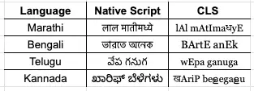
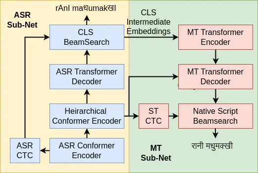

# Building Robust and Scalable Multilingual ASR for Indian Languages

Arjun Gangwar Affiliation: Wadhwani School of Data Science & AI  
Indian Institute of Technology, Madras  
Chennai, India  
arjungangwar@gmail.com    Kaousheik Jayakumar Affiliation: Department of
Electrical Engineering  
Indian Institute of Technology, Madras  
Chennai, India  
kaousheik@gmail.com    S. Umesh Affiliation: Department of Electrical
Engineering  
Indian Institute of Technology, Madras  
Chennai, India  
umeshs@ee.iitm.ac.in

###### Abstract

This paper describes the systems developed by SPRING Lab, Indian
Institute of Technology Madras, for the ASRU MADASR 2.0 challenge. The
systems developed focuses on adapting ASR systems to improve in
predicting the language and dialect of the utterance among 8 languages
across 33 dialects. We participated in Track 1 and Track 2, which
restricts the use of additional data and develop from-the-scratch
multilingual systems. We presented a novel training approach using
Multi-Decoder architecture with phonemic Common Label Set (CLS) as
intermediate representation. It improved the performance over the
baseline (in the CLS space). We also discuss various methods used to
retain the gain obtained in the phonemic space while converting them
back to the corresponding grapheme representations. Our systems beat the
baseline in 3 languages (Track 2) in terms of WER/CER and achieved the
highest language ID and dialect ID accuracy among all participating
teams (Track 2).

###### Index Terms: 

Automatic Speech Recognition, Multi-Decoder, Common Label Set

## I Introduction

The ASRU MADASR 2.0¹¹ 1
https://sites.google.com/view/respinasrchallenge2025/home challenge
presents a multilingual, multi-dialect dataset spanning over 8
low-resource Indian languages. The challenge provides a dataset of 1200
hours - 150 hours per language - and is evaluated over 4 tracks. The ASR
systems developed are evaluated on hidden test sets with metrics such as
word error rate (WER), character error rate (CER), language ID accuracy
(LID accuracy) and dialect ID accuracy (DID accuracy). These are the 4
tracks with different levels of restrictions.

- •
  Track 1 allows only the use of given 30 hours small subset per
  language with no no external data or models.
- •
  Track 2 allows only the use of given 120 hours large subset per
  language with no external data or models.
- •
  Track 3 - an extension of track 1 with the usage of any external data
  or pre-trained models (open-sourced).
- •
  Track 4 - an extension of track 2 with the usage of any external data
  or pre-trained models (open-sourced).

This challenge is among the first works that open sources a labelled
language ID and dialect ID tokens inclusive dataset to develop ASR
systems for Indian languages.

This paper presents the ASR systems developed by the SPRING Lab, IIT
Madras for tracks 1 and 2. We mainly focus on leveraging the phonemic
similarities among Indian languages through a common label set \[1\] and
discuss ways to retain the gains from the ASR while converting back from
the CLS space to corresponding graphemic notations.

## II Common Label Set

A very strong correlation exists between phonemes and graphemes of
Indian languages, which eases the (grapheme-to-phoneme) G2P conversion.
Moreover, the strong phonemic and graphemic similarities between many
Indian languages stem from their common roots in related language
families. For instance, among the languages used in this challenge,
Bhojpuri, Magahi, Marathi, and Chhattisgarhi use the same Devanagari
script. Whereas Telugu and Kannada belong to the same Dravidian language
family. We exploit these facts by converting the graphemic
representations into a common phonemic space using the unified parser
\[2\]. A standard set of labels are given to phonetically similar speech
sounds among different Indian languages known as the Common Label Set.
Examples of CLS representation across different languages is shown in
Fig 1. Reconstructing text in the native script from CLS representations
is inherently challenging due to linguistic phenomena like schwa
deletion, geminate correction, and the intricacies of syllable
segmentation. This paper discuss a few text-to-text machine
transliteration (MT) approaches to retain the gains obtained by the CLS
ASR.

## III Multilingual ASR models

We use the ESPnet toolkit \[3\] for all our experiments. Track 1 models
are trained on the small dataset (approx. 240 hours), and Track 2 models
are trained on the large dataset (approx. 1200 hours). We use
80-dimensional log-Mel Spectrogram as speech features for all our
experiments.

Fig. 1: CLS representations of different languages

The Mel Spectrogram are computed using 80 Mel filter banks, with hop
length of 10ms and window size of 25ms. All audio files are in 16KHz. We
use unified parser to convert native text to CLS. For all our models,
language ID and dialect ID information is passed as special token
$`<LID\_DID>`$ in the beginnning of both the CLS and native script text.

### III-A Baseline

The baseline system follows a standard encoder-decoder architecture,
comprising a Conformer \[4\] encoder and a Transformer decoder \[5\]. It
takes log-Mel spectrograms as input to the encoder and generates output
in the native script. A special token $`<LID>`$ is prepended to the
target text to indicate language identity. The baseline model does not
predict dialects and is trained using a hybrid CTC-Attention loss \[6\].

### III-B Approach 1: Cascaded ASR and MT models

In this approach, we employ a cascaded system comprising two models. The
first model performs speech recognition in the CLS (Common Label Set)
space. It takes log-Mel spectrograms as input and generates
transcriptions in the CLS format. The second model handles machine
transliteration by converting the CLS transcriptions into the target
language’s native script. Both the models are trained separately.

For speech recognition, we use an encoder-decoder architecture with a
Conformer encoder and a Transformer decoder. The model is trained using
a hybrid CTC-Attention loss function. The machine transliteration model
also follows an encoder-decoder architecture, utilising transformer
layers for both the encoder and decoder, and is trained using only the
attention-based cross-entropy loss.

### III-C Approach 2: Multi-Decoder model

The multi-decoder architecture \[7\] consists of two sub-networks as
shown in the Fig 2: an ASR sub-network and an MT (machine
transliteration) sub-network. The ASR sub-network employs a Conformer
encoder followed by a Transformer decoder, while the MT sub-network uses
a lightweight Transformer encoder and a Transformer decoder.

The ASR sub-network takes log-Mel spectrograms as input and generates
hidden states through its decoder. These hidden states are passed
directly to the encoder of the MT sub-network. The MT decoder then
produces the final output in the target language’s native script. The
ASR sub-network is trained using a hybrid CTC-Attention loss, where the
CTC loss is computed with respect to the CLS (Common Label Set)
transcription. The MT sub-network is trained using an attention-based
cross-entropy loss. Both the sub-nets are jointly trained.

Fig. 2: Multi-decoder architecture

Additionally, the MT decoder incorporates cross-attention over the
speech encoder outputs, allowing it to access acoustic information
directly. This auxiliary speech context helps correct errors in the ASR
output during transliteration. An optional hierarchical encoder can also
be inserted on top of the speech encoder, comprising additional
Transformer layers and enabling an auxiliary CTC loss computed with
native script transcriptions. This hierarchical setup has been shown to
improve transliteration performance.

The multi-decoder architecture retains the benefits of a cascaded system
such as the ability to perform beam search and re-scoring on
intermediate ASR outputs while reducing the error propagation typically
associated with cascaded pipelines.

#### III-C1 From Scratch training

In this approach, the weights of both sub-networks are randomly
initialized. We observed that the ASR sub-network requires significantly
more training time compared to the MT sub-network. Since the MT task is
relatively easier in this setup, the MT sub-network tends to overfit
early during training.

#### III-C2 ASR initialization

To mitigate the overfitting of the MT sub-network, we initialize the ASR
sub-network with pretrained weights from the cascaded ASR model. This
alignment helps both sub-networks converge at a similar pace, leading to
improved overall performance.

|                                        |                    |              |                    |              |             |              |               |             |               |               |       |       |
| -------------------------------------- | ------------------ | ------------ | ------------------ | ------------ | ----------- | ------------ | ------------- | ----------- | ------------- | ------------- | ----- | ----- |
| Models/Languages                       | Language-Wise CER% |              |                    |              |             |              |               |             | Average CER % | Average WER % | LID % | DID % |
|                                        | Bhojpuri (bh)      | Bengali (bn) | Chhattisgarhi (ch) | Kannada (kn) | Magahi (mg) | Marathi (mr) | Maithili (mt) | Telugu (te) |               |               |       |       |
| Read Speech                            |                    |              |                    |              |             |              |               |             |               |               |       |       |
| Baseline with Dialect (Char)           | 4.56               | 4.8          | 3.52               | 5.45         | 6.44        | 4.05         | 5.27          | 4.91        | 4.86          | 18.7          | 97.08 | \-    |
| Multi-Decoder (Char) - ASR Initialized | 4.86               | 5.92         | 4.25               | 6.13         | 7.01        | 4.64         | 6.04          | 5.76        | 5.57          | 21.09         | 96.80 | 70.80 |
| Spontaneous Speech                     |                    |              |                    |              |             |              |               |             |               |               |       |       |
| Baseline with Dialect (Char)           | 26.08              | 25.64        | 20.52              | 30.74        | 27.32       | 16.06        | 27.33         | 26.28       | 25.39         | 61.7          | 79.94 | \-    |
| Multi-Decoder (Char) - ASR Initialized | 29.63              | 39.03        | 23.29              | 40.39        | 30.27       | 17.82        | 30.1          | 29.7        | 30.63         | 67.01         | 72.68 | 29.08 |

TABLE I: Test results for Track 1

|                                        |                    |              |                    |              |             |              |               |             |               |               |       |       |
| -------------------------------------- | ------------------ | ------------ | ------------------ | ------------ | ----------- | ------------ | ------------- | ----------- | ------------- | ------------- | ----- | ----- |
| Models/Languages                       | Language-Wise CER% |              |                    |              |             |              |               |             | Average CER % | Average WER % | LID % | DID % |
|                                        | Bhojpuri (bh)      | Bengali (bn) | Chhattisgarhi (ch) | Kannada (kn) | Magahi (mg) | Marathi (mr) | Maithili (mt) | Telugu (te) |               |               |       |       |
| Read Speech                            |                    |              |                    |              |             |              |               |             |               |               |       |       |
| Baseline with Dialect (Char)           | 4.14               | 4.19         | 3.15               | 4.7          | 5.63        | 3.28         | 5.04          | 4.4         | 4.3           | 16.92         | 96.03 | \-    |
| Multi-Decoder (Char) - ASR Initialized | 4.11               | 4.6          | 3.24               | 4.93         | 5.57        | 3.39         | 4.93          | 4.47        | 4.4           | 17.06         | 97.39 | 75.36 |
| Spontaneous Speech                     |                    |              |                    |              |             |              |               |             |               |               |       |       |
| Baseline with Dialect (Char)           | 25.5               | 30.06        | 19.97              | 30.86        | 26.1        | 14.37        | 25.59         | 25.34       | 25.11         | 59.01         | 76.89 | \-    |
| Multi-Decoder (Char) - ASR Initialized | 27.08              | 31.39        | 20.98              | 33.1         | 27.55       | 15.26        | 28.68         | 28.63       | 26.99         | 62.32         | 77.61 | 33.33 |

TABLE II: Test results for Track 2

| Models/Languages                       | Language-Wise WER% |              |                    |              |             |              |               |             | Average CER % | Average WER % | LID % | DID % |
| -------------------------------------- | ------------------ | ------------ | ------------------ | ------------ | ----------- | ------------ | ------------- | ----------- | ------------- | ------------- | ----- | ----- |
|                                        | Bhojpuri (bh)      | Bengali (bn) | Chhattisgarhi (ch) | Kannada (kn) | Magahi (mg) | Marathi (mr) | Maithili (mt) | Telugu (te) |               |               |       |       |
| Baseline with Dialect (Char)           | 15.12              | 19.73        | 12.39              | 23.84        | 19.78       | 16.32        | 18.11         | 22.04       | 4.22          | 17.93         | 97.34 | 69.68 |
| CLS ASR (Char)                         | 15.25              | 19.41        | 12.54              | 23.52        | 19.91       | 16.17        | 17.17         | 22.38       | 3.92          | 17.78         | 97.45 | 70.3  |
| \+ MT (BPE)                            | 17.29              | 28.88        | 14.21              | 23.8         | 21.4        | 16.26        | 18.29         | 22.64       | 5.22          | 19.99         |       |       |
| Multi-Decoder (BPE) - From Scratch     | 16.61              | 27.85        | 13.4               | 23.48        | 20.76       | 15.68        | 18.45         | 22.71       | 5.02          | 19.86         | 97.39 | 70.55 |
| Multi-Decoder (Char) - From Scratch    | 16.44              | 22.09        | 12.52              | 25.75        | 21.86       | 19.43        | 19.4          | 24.79       | 4.72          | 19.69         | 96.72 | 65.73 |
| Multi-Decoder (Char) - ASR Initialized | 15.88              | 22.18        | 12.23              | 25.63        | 21.25       | 18.87        | 19.48         | 24.6        | 4.66          | 19.54         | 97.21 | 69.8  |

TABLE III: Dev set results for Track 1

| Models/Languages                       | Language-Wise WER% |              |                    |              |             |              |               |             | Average CER % | Average WER % | LID % | DID % |
| -------------------------------------- | ------------------ | ------------ | ------------------ | ------------ | ----------- | ------------ | ------------- | ----------- | ------------- | ------------- | ----- | ----- |
|                                        | Bhojpuri (bh)      | Bengali (bn) | Chhattisgarhi (ch) | Kannada (kn) | Magahi (mg) | Marathi (mr) | Maithili (mt) | Telugu (te) |               |               |       |       |
| Baseline with Dialect (Char)           | 13.71              | 16.51        | 9.74               | 20.57        | 17.42       | 13.12        | 15.67         | 20.73       | 3.52          | 15.31         | 98.37 | 74.87 |
| CLS ASR (Char)                         | 13.19              | 16.05        | 9.80               | 20.73        | 17.04       | 13.02        | 14.84         | 18.95       | 3.18          | 14.88         | 98.13 | 76.28 |
| \+ MT (BPE)                            | 15.17              | 26.07        | 11.56              | 20.83        | 18.59       | 13.22        | 16.04         | 19.32       | 4.4           | 17.21         |       |       |
| Multi-Decoder (BPE) - From Scratch     | 15.67              | 26.67        | 12.34              | 22.97        | 19.27       | 15.15        | 18.20         | 22.32       | 4.8           | 18.69         | 97.35 | 72.78 |
| Multi-Decoder (Char) - From Scratch    | 14.53              | 18.15        | 10.95              | 22.57        | 17.87       | 15.22        | 15.94         | 21.42       | 3.83          | 16.51         | 97.26 | 71.46 |
| Multi-Decoder (Char) - ASR Initialized | 13.83              | 18.24        | 10.66              | 22.58        | 17.63       | 14.84        | 16.17         | 21.53       | 3.84          | 16.30         | 97.63 | 74    |

TABLE IV: Dev set results for Track 2

### III-D Implementation Details

The ASR encoder in the baseline model follows a Conformer architecture
with 8 encoder blocks, each comprising a model dimension of 256, a
1024-dimensional position-wise feed-forward layer, and 4 attention
heads. A kernel size of 31 is used, along with the Swish activation
function. The ASR decoder is implemented using a Transformer
architecture with 6 decoder blocks, a model dimension of 256, a
2048-dimensional feed-forward layer, and 4 attention heads, employing
ReLU as the activation function. We use the same configuration for the
ASR model in both our cascaded pipeline and the ASR sub-network in the
multi-decoder setup. Character-level tokenization is used for the ASR
decoder in all cases, whether generating native script in the baseline
or CLS outputs in the cascaded pipeline.

The MT model in the cascaded pipeline consists of a Transformer encoder
with 6 blocks, each having a model dimension of 512, a 1024-dimensional
feed-forward layer, and 4 attention heads. The corresponding Transformer
decoder has 6 blocks with a model dimension of 256, a 1024-dimensional
feed-forward layer, and 4 attention heads. We employ joint tokenization
of both source (CLS) and target (native script) texts using Byte Pair
Encoding (BPE) with the SentencePiece library. The vocabulary size is
set to 1500 for the small dataset and 3000 for the large dataset.

In the multi-decoder setup, the optional hierarchical encoder shares the
same configuration as the ASR encoder described above but uses 6 layers.
The MT sub-network consists of a Transformer encoder and decoder, each
with 2 blocks, a model dimension of 256, a 2048-dimensional feed-forward
layer, and 4 attention heads. We experiment with both character-level
and BPE tokenizations in this setup. For the small dataset, we use 500
tokens for CLS and 1500 tokens for the native script. For the large
dataset, we use 1000 tokens for CLS and 3000 tokens for the native
script.

## IV Results and Discussion

We start by comparing the results of the baseline with the cascaded CLS
ASR + MT pipeline. We see that CLS ASR model comfortably beats the
conformer baseline (in CLS space). This is because of the fewer number
of target outputs for the decoder to predict, resulting in less
confusion. But while converting back to the native-script space we see a
drop in performance due to errors propagating from ASR to MT.

To reduced the errors being cascaded, we implement a multi-decoder
approach trained on BPE and char tokens. The char model outperforms the
BPE model due to the nature of the dataset, where the same utterance is
spoken in multiple dialects, potentially causing the BPE-based models to
overfit. The char-based multi-decoder model performs better than the BPE
models across all languages.

The multi-decoder approach improves over the cascaded pipeline as the
loss is not cascaded. But we observe that the MT-subnetwork is
overfitted due to the mismatch in saturation times. A multi-decoder
network with ASR initialisation allows both sub-networks to saturate at
the same time. This is seen in the results tabulated, as the
multi-decoder with ASR initialisation outperforms all our models.

We also see that in Table II, the LID accuracy improves drastically over
the baseline using the multi-decoder approach in both read speech and
spontaneous speech subtasks. By splitting tasks, specialising decoders,
and using joint end-to-end training, the multi-decoder model avoids
conflating transcription in both the CLS and native script domains. This
modular approach improves language identification by allowing each
component to learn its role more effectively, reducing mislabelled
representations due to feedback from multiple decoders, thus enabling
clearer cross-stage signals.

## References

- \[1\] B. Ramani, S. L. Christina, G. A. Rachel, V. S. Solomi, M. K.
  Nandwana, A. Prakash, S. A. Shanmugam, R. Krishnan, S. K. Prahalad, K.
  Samudravijaya, P. Vijayalakshmi, T. Nagarajan, and H. A. Murthy (2013)
  A common attribute based unified hts framework for speech synthesis in
  indian languages. In 8th ISCA Workshop on Speech Synthesis (SSW 8),
  pp. 291–296. Cited by: §I.
- \[2\] A. Baby, N. N.L., A. Thomas, and H. Murthy (2016) A unified
  parser for developing indian language text to speech synthesizers.
  Vol. 9924, pp. 514–521. External Links: ISBN 978-3-319-45509-9,
  [Document](https://dx.doi.org/10.1007/978-3-319-45510-5%5F59) Cited
  by: §II.
- \[3\] S. Watanabe, T. Hori, S. Karita, T. Hayashi, J. Nishitoba, Y.
  Unno, N. E. Y. Soplin, J. Heymann, M. Wiesner, N. Chen, A.
  Renduchintala, and T. Ochiai (2018) ESPnet: end-to-end speech
  processing toolkit. External Links: 1804.00015,
  [Link](https://arxiv.org/abs/1804.00015) Cited by: §III.
- \[4\] A. Gulati, J. Qin, C. Chiu, N. Parmar, Y. Zhang, J. Yu, W.
  Han, S. Wang, Z. Zhang, Y. Wu, and R. Pang (2020) Conformer:
  convolution-augmented transformer for speech recognition. External
  Links: 2005.08100, [Link](https://arxiv.org/abs/2005.08100) Cited by:
  §III-A.
- \[5\] A. Vaswani, N. Shazeer, N. Parmar, J. Uszkoreit, L. Jones, A. N.
  Gomez, L. Kaiser, and I. Polosukhin (2023) Attention is all you need.
  External Links: 1706.03762, [Link](https://arxiv.org/abs/1706.03762)
  Cited by: §III-A.
- \[6\] S. Watanabe, T. Hori, S. Kim, J. R. Hershey, and T.
  Hayashi (2017) Hybrid ctc/attention architecture for end-to-end speech
  recognition. IEEE Journal of Selected Topics in Signal Processing 11
  (8), pp. 1240–1253. External Links:
  [Document](https://dx.doi.org/10.1109/JSTSP.2017.2763455) Cited by:
  §III-A.
- \[7\] S. Dalmia, B. Yan, V. Raunak, F. Metze, and S. Watanabe (2021)
  Searchable hidden intermediates for end-to-end models of decomposable
  sequence tasks. In Proceedings of the 2021 Conference of the North
  American Chapter of the Association for Computational Linguistics:
  Human Language Technologies, K. Toutanova, A. Rumshisky, L.
  Zettlemoyer, D. Hakkani-Tur, I. Beltagy, S. Bethard, R. Cotterell, T.
  Chakraborty, and Y. Zhou (Eds.), Online, pp. 1882–1896. External
  Links: [Link](https://aclanthology.org/2021.naacl-main.151/),
  [Document](https://dx.doi.org/10.18653/v1/2021.naacl-main.151) Cited
  by: §III-C.
