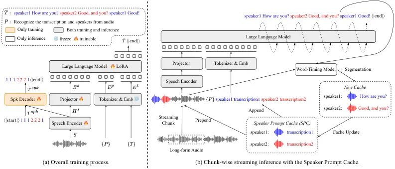

# Train Short, Infer Long: Speech-LLM Enables Zero-Shot Streamable Joint ASR and Diarization on Long Audio

Mohan Shi    Xiong Xiao    Ruchao Fan    Shaoshi Ling    Jinyu Li
^(†)^(†)thanks: ^(\*)Work done during an internship at Microsoft.

###### Abstract

Joint automatic speech recognition (ASR) and speaker diarization aim to
answer the question “who spoke what” in multi-speaker scenarios. In this
paper, we present an end-to-end speech large language model (Speech-LLM)
for Joint strEamable DIarization and aSr (JEDIS-LLM). The model is
trained only on short audio under 20s but is capable of streamable
inference on long-form audio without additional training. This is
achieved by introducing a Speaker Prompt Cache (SPC) with an on-the-fly
update mechanism during chunk-wise streaming inference, inspired by the
autoregressive nature of LLMs. The SPC also allows the seamless use of
pre-enrolled speaker profiles which is common in many scenarios like
meeting transcription. To further enhance diarization capability, we
incorporate word-level speaker supervision into the speech encoder
during training.

Experimental results demonstrate that our system outperforms strong
baselines, including Sortformer and Meta-Cat in the local setting on
audio up to 20s, and DiarizationLM on long-form audio, despite being
fully end-to-end and streamable while DiarizationLM follows a cascaded
offline pipeline. To the best of our knowledge, this is the first work
enabling zero-shot streamable joint ASR and diarization on long audio
using a Speech-LLM trained only on short audio, achieving
state-of-the-art performance.

###### Index Terms: 

Speech-LLM, ASR, Speaker Diarization, Speaker Prompt Cache, Long-form
Audio, Streaming

^(†)^(†)address: ¹University of California, Los Angeles, USA  
²Microsoft CoreAI, Redmond, USA

## 1 Introduction

With advances in deep learning and automatic speech recognition
(ASR) \[1, 2, 3\], multi-speaker scenarios such as meetings and
conversations have received increasing attention. Speaker
diarization \[4, 5, 6\] aims to identify “who spoke when” in a
recording. Combined with ASR, it forms the joint ASR and diarization
task \[7, 8\], also known as speaker-attributed ASR \[8, 9, 10, 11\],
which addresses “who spoke what” and is crucial for understanding
multi-speaker conversations.

Previous works combined independent ASR and diarization outputs to
obtain speaker-attributed transcriptions \[12, 13, 14\], but such
cascaded systems suffer from error propagation. Recent approaches, such
as Sortformer \[15\] and Meta-Cat \[16\], integrate speaker IDs directly
into multi-talker transcriptions, enabling end-to-end training and
achieving reasonable performance on short audio (up to 20 s). However,
these methods still rely on two separate pre-trained encoders for ASR
and diarization, whose representations are fused during decoding. More
importantly, they are not suitable for long-form audio that requires
global diarization. Streaming Sortformer \[17\] introduces a cache
mechanism for global diarization, but it does not incorporate the ASR
task.

The long-context reasoning and cross-utterance awareness abilities of
large language models (LLMs) \[18, 19, 20\] make them well-suited for
multi-talker conversations. Prior works \[21, 22\] showed that
Speech-LLMs perform well on multi-talker ASR, but without incorporating
speaker diarization. The recent DiarizationLM \[23\] is a
post-processing LLM that refines outputs from independent ASR and
diarization systems to produce better speaker-attributed transcriptions.
However, it is not end-to-end and suffers from error propagation.
Concurrently, SpeakerLM \[24\] trains a Speech-LLM jointly for ASR and
diarization in an end-to-end manner, yet it is limited to short audio in
local settings and was not compared against recent strong
baselines \[15, 16, 23\].

In this paper, we propose an end-to-end Speech-LLM for Joint strEamable
DIarization and aSr (JEDIS-LLM). Although trained only on short audio
($`\leq`$20s), the model supports chunk-wise streaming inference on
arbitrary long-form recordings without additional training. A central
challenge of long audio diarization is that splitting audio into short
chunks often causes speaker permutation inconsistency \[25\].
Traditional methods address this with post-hoc global clustering \[26\].
Inspired by prior works \[25, 17\] and the autoregressive property of
LLMs, we introduce the Speaker Prompt Cache (SPC) with an on-the-fly
update mechanism for chunk-wise streaming inference that preserves
speaker consistency across chunks without explicit permutation
resolution or retraining. SPC stores a representative utterance for each
speaker and combines it with the current chunk during inference. It also
naturally supports pre-enrolled Speaker Profiles, which are commonly
used in scenarios such as meeting transcription. During training, we
enhance the diarization capability of our proposed model by introducing
Word-level Speaker Supervision to the speech encoder, in contrast to
prevailing Speech-LLM architectures \[27, 21\] for ASR that consist only
of a speech encoder, a projector, and an LLM.

Experimental results show that our approach outperforms strong
baselines, including Sortformer \[15\] and Meta-Cat \[16\] in the local
setting (audio up to 20s), and DiarizationLM \[23\] on long-form audio,
while remaining fully end-to-end and streamable, unlike DiarizationLM’s
cascaded offline pipeline. To the best of our knowledge, this is the
first work to achieve zero-shot, streamable joint ASR and diarization on
arbitrary long-form audio using a Speech-LLM trained only on short
clips, achieving state-of-the-art results.



Figure 1: Overall training pipeline (a) and chunk-wise streaming
inference using the Speaker Prompt Cache (SPC) for long-form audio (b).
The Word-Timing Model provides timestamp alignment of each word for
segmentation. SPC is not required for offline inference on short audio.

## 2 method

### 2.1 Training on Short Audio

As shown in Figure 1 (a), our proposed JEDIS-LLM is built on the
prevailing Speech-LLM architecture \[27, 21\] with speaker-attributed
transcription as the LLM objective. The key difference is the addition
of a Spk-Decoder for speaker supervision to enhance diarization
capability. We describe these components separately below.

#### 2.1.1 Speech-LLM for joint ASR and Diarization

We construct speaker-attributed transcriptions by integrating
multi-talker transcriptions with speaker IDs, which serve as the LLM
training objective. For multi-speaker utterances, words are arranged in
temporal order, with a speaker ID inserted whenever the speaker changes,
thus forming the segment-level objective. In contrast, the word-level
objective inserts a speaker ID before every word \[15, 16\], which
under-utilizes the contextual modeling ability of LLMs and slows
inference due to longer sequence. Therefore, we adopt the segment-level
objective in this work. Given a speech signal $`S`$, the forward process
is defined as:

```math
\displaystyle H^{s}=\text{Speech-Encoder}(S),\ \ E^{s}=\text{Projector}(H^{s}), \tag{1}
```

```math
\displaystyle E^{t}=\text{Emb}(\text{Tokenizer}(T)),\ \ E^{p}=\text{Emb}(\text{Tokenizer}(P)), \tag{2}
```

```math
\displaystyle\hat{T}=\text{LLM}(\text{Concat}(E^{s},E^{p},E^{t})), \tag{3}
```

where $`T`$ denotes the speaker-attributed transcription and $`P`$ is
the text prompt. The Tokenizer and Emb correspond to the LLM’s tokenizer
and text embedding layers. An additional LoRA \[28\] is introduced to
adapt the LLM outputs to the format required for joint ASR and
diarization. Finally, the Cross-Entropy (CE) loss is computed between
the predicted sequence $`\hat{T}`$ and the ground truth $`T`$:

```math
\displaystyle\mathcal{L}_{\text{LLM}}=\text{CE}(\hat{T},T). \tag{4}
```

#### 2.1.2 Word-level Speaker Supervision for Speech Encoder

To enhance the speaker diarization capability of the speech encoder, we
introduce additional speaker supervision during training to encourage
the encoder to learn speaker-discriminative features. While prior works
typically adopt frame-level multi-class binary classification loss for
speaker diarization \[5, 15\], we observe that this approach can harm
ASR performance in the joint ASR and diarization task, as frame-level
labels lack semantic information. Moreover, such labels are obtained
from forced alignment and often contain annotation errors. To address
this, we propose a new scheme, termed Word-level Speaker Supervision
(distinct from the “word-level” objective in Section 2.1.1). As
illustrated in Figure 1 (a), each word in the transcription is replaced
with its corresponding speaker ID, forming a word-level speaker ID
sequence. This sequence is predicted by a transformer-based Spk-Decoder
applied to the encoder output. Finally, the CE loss is computed between
the predicted and reference sequences:

```math
\displaystyle\hat{T}^{spk}=\text{Spk-Decoder}(T^{spk},H^{s}),\ \ \mathcal{L}_{\text{Spk}}=\text{CE}(\hat{T}^{spk},T^{spk}), \tag{5}
```

where $`T^{spk}`$ and $`\hat{T}^{spk}`$ denote the reference and
predicted speaker ID sequences, respectively.

Since speaker supervision is an auxiliary task aimed at enhancing the
encoder’s diarization capability, the Spk-Decoder is used only during
training and discarded at inference. The overall objective is a weighted
sum of the LLM token prediction loss and the speaker supervision loss:

```math
\displaystyle\mathcal{L}=\mu\cdot\mathcal{L}_{\text{LLM}}+(1-\mu)\cdot\mathcal{L}_{\text{Spk}}, \tag{6}
```

where $`\mu`$ is a hyperparameter that balances the two losses.

|                          |               |                                        |          |       |            |       |                   |       |
| ------------------------ | ------------- | -------------------------------------- | -------- | ----- | ---------- | ----- | ----------------- | ----- |
| System                   | LLM Objective | Speaker Supervision for Speech Encoder | AMI Test |       | CH109 Full |       | Internal Test Set |       |
|                          |               |                                        | WDER     | cpWER | WDER       | cpWER | WDER              | cpWER |
| Sortformer \[15\]        | \-            | \-                                     | \-       | 26.71 | \-         | 21.45 | \-                | \-    |
| Meta-Cat \[16\]          | \-            | \-                                     | \-       | 26.02 | \-         | 26.17 | \-                | \-    |
| Phi-4-Multimodal1 \[29\] | \-            | \-                                     | 14.52    | 28.09 | 17.25      | 33.09 | 14.68             | 31.10 |
| JEDIS-LLM (Ablation)     | Segment-level | None                                   | 10.87    | 26.00 | 3.67       | 19.90 | 7.27              | 23.92 |
|                          | Segment-level | Frame-level                            | 8.01     | 35.67 | 2.49       | 25.08 | 2.44              | 24.34 |
|                          | Word-level    | Word-level                             | 6.34     | 24.08 | 2.40       | 24.55 | 2.65              | 18.77 |
| JEDIS-LLM (Final Model)  | Segment-level | Word-level                             | 6.97     | 23.13 | 2.06       | 19.46 | 2.49              | 18.14 |

Table 1: Performance comparison of different methods in the local
setting (audio up to 20s), reported in WDER (%) and cpWER (%). All
inference is non-streaming. Phi-4-Multimodal baseline attributes all
hypotheses to “speaker1” as it does not support speaker diarization.

### 2.2 Inference on Long Audio

#### 2.2.1 SPC for Streaming Inference on Long-Form Audio

For long-form global diarization, inference on short chunks may cause
speaker permutation inconsistencies \[25\], where the same speaker is
assigned different labels across chunks. Traditional methods resolve
this with global clustering as a post-processing step \[26\].

We propose an alternative: the Speaker Prompt Cache (SPC) for chunk-wise
streaming inference. As illustrated in Figure 1 (b), during inference,
SPC preserves speaker consistency without explicit permutation
resolution by storing one utterance (audio clip and its transcription)
for each previously observed speaker.

During chunk-wise inference, leveraging the autoregressive nature of the
LLM, we prepend cached audio clips to the current chunk and append
cached speaker-attributed transcriptions to the prompt as initial
context, ordered by speaker index. This operation provides an exact
speaker permutation that serves as the condition for LLM inference,
allowing the LLM to follow the same permutation and generate
speaker-attributed transcriptions for the current chunk while
maintaining speaker consistency.

Additionally, we design a cache update algorithm to maintain the SPC
during inference, detailed in Algorithm 1.

#### 2.2.2 Seamless Integration with Speaker Profiles

Building on the SPC, we enable seamless integration of Speaker Profiles
during inference by replacing the SPC with fixed, manually segmented
audio clips and their transcriptions, which serve as speaker profiles.
This design provides two main benefits:

- •
  The exact speaker names can be retrieved through the speaker-profile
  mapping. For example, a profile map may be {speaker1: Mike, speaker2:
  Susan}.
- •
  Using fixed high-quality audio clips and transcriptions instead of
  on-the-fly SPC eliminates the need for cache updates, yielding more
  stable performance.

|                                |                                                        |                  |            |            |       |             |       |
| ------------------------------ | ------------------------------------------------------ | ---------------- | ---------- | ---------- | ----- | ----------- | ----- |
| System                         | Strategy to Maintain Global Speaker Consistency        | Streaming Chunks | SPC Update | CH109 Test |       | Fisher Test |       |
|                                |                                                        |                  |            | WDER       | cpWER | WDER        | cpWER |
| Non-streaming Inference        |                                                        |                  |            |            |       |             |       |
| DiarizationLM (Llama 3) \[23\] | Independent ASR & Diarization with LLM Post Processing | \-               | \-         | 6.66       | 23.57 | 3.28        | 18.37 |
| DiarizationLM (PaLM 2) \[23\]  |                                                        | \-               | \-         | 4.25       | 20.22 | 2.37        | 16.93 |
| JEDIS-LLM                      | Offline Chunk Inference + Global Clustering            | \-               | \-         | 2.48       | 19.03 | 2.06        | 15.03 |
| Chunk-wise Streaming Inference |                                                        |                  |            |            |       |             |       |
| JEDIS-LLM                      | Streaming Inference with Speaker Prompt Cache (SPC)    | Oracle Chunks    | ✗          | 2.09       | 18.58 | 2.51        | 16.40 |
|                                |                                                        |                  | ✓          | 1.73       | 18.20 | 2.05        | 15.88 |
|                                |                                                        | VAD Chunks       | ✗          | 2.62       | 19.32 | 2.95        | 17.37 |
|                                |                                                        |                  | ✓          | 2.54       | 19.09 | 2.35        | 16.60 |

Table 2: Performance comparison of different approaches in the global
setting for long-form audio, reported in terms of WDER (%) and cpWER
(%). “Without SPC Update” refers to not updating the speakers already
stored in the Speaker Prompt Cache.

|                  |                  |       |        |            |
| ---------------- | ---------------- | ----- | ------ | ---------- |
| Streaming Chunks | Speaker Profiles | cpWER | SA-WER | $`\Delta`$ |
| Oracle Chunks    | ✗                | 18.20 | 25.98  | 7.78       |
|                  | ✓                | 17.91 | 19.98  | 2.07       |
| VAD Chunks       | ✗                | 19.09 | 30.79  | 11.7       |
|                  | ✓                | 19.18 | 21.94  | 2.76       |

Table 3: Comparison of streaming inference with and without speaker
profiles on the CH109 test set for long-form audio in the global
setting, showing cpWER (%), SA-WER (%), and their difference
($`\Delta`$), where $`\Delta`$ indicates how strictly predicted speaker
IDs match the reference.

## 3 Experimental Settings

### 3.1 Training Datasets

We trained the proposed JEDIS-LLM on five data sources. Public datasets
include the AMI Corpus \[30\] (train and dev sets, IHM-Mix channel, up
to 4 speakers/session, $`\sim`$90 h), the ICSI Corpus \[31\] (IHM-Mix
channel, all subsets, up to 11 speakers/session, $`\sim`$71 h), and the
Fisher Corpus \[32\] (2 speakers/session, $`\sim`$1929 h). We also
incorporated internally collected data (up to 7 speakers/session,
$`\sim`$6734 h) and simulated conversations from VoxCeleb1 \[33\] and
VoxCeleb2 \[34\] ($`\sim`$964 h). For the simulations, we removed
non-English utterances using language identification \[35, 36\], and
mixed 5 speakers per conversation, each contributing 3–5 sentences with
mild overlap ($`\leq`$1%) and room impulse responses up to 0.2 s. In
total, the training data amounts to about 10k hours.

### 3.2 Training Setting

Our model builds on Phi-4-Multimodal¹¹ 1
[https://huggingface.co/microsoft/Phi-4-multimodal-instruct](https://huggingface.co/microsoft/Phi-4-multimodal-instruct) \[29\],
using its speech branch as initialization of speech encoder, projector
and LLM. The additional LoRA is configured with $`\alpha=32`$ and
$`rank=16`$. The Spk-Decoder has 3 transformer layers with
1024-dimensional hidden states, 16 attention heads, and 1024-dimensional
feed-forward layers. The loss weight $`\mu`$ is set to 0.5. Long-form
audio is randomly segmented into 15$`\sim`$20s clips for training. The
model is trained on 16 NVIDIA A100 80GB GPUs with 256s per GPU batch
size, using AdamW optimizer (peak learning rate 0.0001) with linear
warmup-decay scheduling (1000 warmup steps, 40,000 steps total).

Input: Long audio $`A`$, well-trained model $`M`$, $`prompt`$

Output: Speaker-attributed transcriptions $`R`$

Initialize empty speaker prompt cache $`C`$, result list $`R`$

Define profile audio length threshold $`l`$, text length threshold
$`n`$;

Define dvector similarity threshold $`\theta`$;

for each _chunk $`a`$ in $`A`$_ do

   if _$`C=\emptyset`$_ then

      $`a_{\text{infer}}\leftarrow a,\;p_{\text{infer}}\leftarrow prompt`$;

   else

      $`a_{\text{infer}}\leftarrow\{C[s].audio,\forall s\in C\}+a`$;

      $`p_{\text{infer}}\leftarrow prompt+\{C[s].text,\forall s\in C\}`$;

   $`r\leftarrow M(a_{\text{infer}},p_{\text{infer}})`$, Append $`r`$ to
$`R`$;

   for each _speaker $`s`$ in $`r`$_ do

      $`Ali\leftarrow\text{WordTimingModel}(a,s.text)`$;

      $`(A_{s},T_{s})\leftarrow\text{Segmentation}(Ali,\text{len}\leq l,\text{exclude overlap})`$;

      $`(\hat{a}_{s},\hat{t}_{s})\leftarrow`$
FindLongest$`(A_{s},T_{s})`$;

      if _$`s\notin C`$_ then

         $`C[s].audio\leftarrow\hat{a}_{s},\;C[s].text\leftarrow\hat{t}_{s}`$;

      else if _len$`(C[s].text)<n`$ or
$`\neg`$HasPunctuation$`(C[s].text)`$_ then

         if _len$`(\hat{a}_{s})>`$len$`(C[s].audio)`$_ then

            $`\sigma\leftarrow`$ CosSim(dvector$`(\hat{a}_{s})`$,
dvector$`(C[s].audio))`$;

            if _$`\sigma>\theta`$_ then

               $`C[s].audio\leftarrow\hat{a}_{s},\;C[s].text\leftarrow\hat{t}_{s}`$;

return $`R`$;

Algorithm 1 Streaming Inference with Speaker Prompt Cache

### 3.3 Evaluation Setting

We evaluate our JEDIS-LLM under both local (short audio) and global
(long audio) settings. In the local setting, following prior works \[15,
16\], we evaluate on two datasets: the AMI-IHM-Mix test set (_AMI Test_;
up to 4 speakers per session) and the 2-speaker subset of 109 sessions
from the Callhome American English Speech corpus (_CH109 Full_) \[37\].
In both datasets, long-form audio is segmented into 10$`\sim`$20s clips.
We additionally evaluate on an internal test set (with up to 5 speakers
per session).

For the global setting, following prior work \[23\], we use test subset
of CH109 and Fisher, referred to as _CH109 Test_ and _Fisher Test_. In
chunk-wise streaming inference, we consider Oracle Chunks, derived from
ground-truth sentence boundaries, and VAD Chunks, obtained via voice
activity detection²² 2
[https://github.com/snakers4/silero-vad](https://github.com/snakers4/silero-vad).
Chunks are up to 10 seconds long, and regions without transcriptions at
the beginning and end of the long audio are excluded. The dvector
extractor in Algorithm 1 is a well-trained Res2Net \[38\] trained for
speaker verification, and the Word-Timing Model is an internal forced
alignment model. The profile audio length threshold $`l`$ and text
length threshold $`n`$ are set to 5 seconds and 8, respectively. The
dvector similarity threshold $`\theta`$ is set to 0.7. For speaker
profile integration, we evaluate on _CH109 Test_ by extracting audio
clips shorter than 5 seconds from non-transcribed portions and manually
annotating them as speaker profiles.

We report Word Diarization Error Rate (WDER) \[7\] and concatenated
minimum-permutation Word Error Rate (cpWER) \[39\] as primary metrics.
Pure WER is ambiguous in multi-speaker scenarios and is thus excluded.
For speaker profiles, we also report Speaker-Attributed WER
(SA-WER) \[8\], which directly matches predicted speaker IDs with the
reference without finding best permutation, providing a stricter measure
than cpWER.

## 4 Experimental Results

### 4.1 Evaluation on Local Setting for Short Audio

Table 1 presents the performance comparison in the local setting (audio
clips under 20 seconds) using non-streaming inference. Compared with
previous strong baselines (Sortformer \[15\] and Meta-Cat \[16\]), our
JEDIS-LLM achieves significantly better cpWER, demonstrating both the
advantages of Speech-LLMs for joint ASR and diarization and the
effectiveness of our proposed method.

The ablation study further shows that speaker supervision on the encoder
is crucial for diarization, as removing it leads to higher WDER.
Frame-level speaker supervision \[5, 15\] improves diarization
performance compared to no speaker supervision, but degrades cpWER,
indicating that frame-level loss negatively affects the encoder’s ASR
capability. Using word-level speaker-attributed transcription as the LLM
objective yields reasonable WDER performance, particularly on AMI where
speaker turns are frequent, but its cpWER is still worse than that of
segment-level transcription. This is because word-level
speaker-attributed transcription introduces excessive speaker label
splits, disrupting context. Overall, combining segment-level
transcription for the LLM with word-level speaker supervision for the
encoder yields the best performance.

### 4.2 Evaluation on Global Setting for Long-form Audio

Table 2 presents the performance comparison in the global setting for
long-form audio. Previous work, DiarizationLM \[23\], aligns independent
ASR and speaker diarization results and subsequently employs a finetuned
LLM for post-processing. We evaluate our model under both offline and
chunk-wise streaming inference. For offline inference, long-form audio
is segmented into chunks under 20 seconds based on oracle sentence
boundaries, followed by offline inference. The word-timing model and
global clustering are then applied to produce global results. For
chunk-wise streaming inference, we employ the Speaker Prompt Cache (SPC)
to maintain speaker consistency across chunks.

The results show that our proposed streaming JEDIS-LLM produces
substantially better performance, significantly outperforming
DiarizationLM using either oracle or VAD chunks, despite the latter
being a cascaded system using offline post-processing. As expected,
enabling the SPC update mechanism improves performance by refreshing the
cache with higher-quality speaker prompts. Moreover, streaming inference
surpasses the “Offline Chunk Inference + Global Clustering” baseline on
the CH109 test set and achieves the best WDER on the Fisher test set
when using oracle chunks. These results demonstrate the effectiveness of
SPC and its update strategy.

### 4.3 Performance of Speaker Profiles Integration

Table 3 presents the results of streaming inference with and without
speaker profiles on long-form audio in the global setting, evaluated by
cpWER (%), SA-WER (%), and their difference ($`\Delta`$). Without
profiles, reference speaker IDs are assigned by order of appearance
(speaker1, speaker2, …), whereas with profiles they follow the
concatenation order of the given profiles. The results show that
incorporating profiles narrows the gap between SA-WER and cpWER,
indicating that fixed, manually segmented profiles align predicted IDs
with reference speakers more effectively than an on-the-fly
automatically updated SPC. In addition, profiles allow direct mapping
from predicted IDs to real speaker names, rather than index labels,
which is especially valuable for real-world applications.

## 5 Conclusion

In this work, we propose an end-to-end Speech-LLM for joint ASR and
speaker diarization, trained only on short audio segments under 20
seconds, yet capable of performing chunk-wise streaming inference on
long-form audio without additional training. We introduce a speaker
prompt cache with an on-the-fly update mechanism, which enables
chunk-wise streaming inference while preserving speaker consistency
across chunks. Furthermore, replacing the speaker prompt cache with
manually defined high-quality utterances allows seamless integration
with speaker profiles. In addition, incorporating word-level speaker
supervision into the speech encoder during training enhances the model’s
diarization capability. Experimental results show that our approach
outperforms strong baselines, including Sortformer and Meta-Cat in the
local diarization setting (up to 20 seconds), and DiarizationLM in the
global setting for long-form audio, while remaining fully end-to-end and
streamable, in contrast to DiarizationLM’s cascaded offline pipeline. To
the best of our knowledge, this is the first work to enable streamable
joint ASR and diarization on long audio using a Speech-LLM trained only
on short audio, achieving state-of-the-art performance.

## References

- \[1\] J. Li _et al._, “Recent advances in end-to-end automatic speech
  recognition,” _APSIPA Transactions on Signal and Information
  Processing_, vol. 11, no. 1, 2022.
- \[2\] A. Gulati _et al._, “Conformer: Convolution-augmented
  transformer for speech recognition,” in _Proc. Interspeech_, 2020, pp.
  5036–5040.
- \[3\] Z. Yao _et al._, “Zipformer: A faster and better encoder for
  automatic speech recognition,” in _Proc. ICLR_, 2024.
- \[4\] T. J. Park _et al._, “A review of speaker diarization: Recent
  advances with deep learning,” _Computer Speech & Language_,
  vol. 72, p. 101317, 2022.
- \[5\] Y. Fujita _et al._, “End-to-end neural speaker diarization with
  permutation-free objectives,” in _Proc. Interspeech_, 2019, pp.
  4300–4304.
- \[6\] I. Medennikov _et al._, “Target-speaker voice activity
  detection: A novel approach for multi-speaker diarization in a dinner
  party scenario,” in _Proc. Interspeech_, 2020, pp. 274–278.
- \[7\] L. E. Shafey _et al._, “Joint speech recognition and speaker
  diarization via sequence transduction,” in _Proc. Interspeech_, 2019,
  pp. 396–400.
- \[8\] N. Kanda _et al._, “Joint speaker counting, speech recognition,
  and speaker identification for overlapped speech of any number of
  speakers,” in _Proc. Interspeech_, 2020, pp. 36–40.
- \[9\] ——, “End-to-end speaker-attributed ASR with transformer,” in
  _Proc. Interspeech_, 2021, pp. 4413–4417.
- \[10\] M. Shi _et al._, “CASA-ASR: context-aware speaker-attributed
  ASR,” in _Proc. Interspeech_, 2023, pp. 411–415.
- \[11\] Y. Liang _et al._, “The second multi-channel multi-party
  meeting transcription challenge (m2met 2.0): A benchmark for
  speaker-attributed ASR,” in _Proc. ASRU_, 2023, pp. 1–8.
- \[12\] N. Kanda _et al._, “A comparative study of modular and joint
  approaches for speaker-attributed ASR on monaural long-form audio,” in
  _Proc. ASRU_, 2021, pp. 296–303.
- \[13\] F. Yu _et al._, “A comparative study on speaker-attributed
  automatic speech recognition in multi-party meetings,” in _Proc.
  Interspeech_, 2022, pp. 560–564.
- \[14\] M. Shi _et al._, “A comparative study on multichannel
  speaker-attributed automatic speech recognition in multi-party
  meetings,” in _Proc. APSIPA ASC_, 2023, pp. 1943–1948.
- \[15\] T. Park _et al._, “Sortformer: Seamless integration of speaker
  diarization and ASR by bridging timestamps and tokens,” _arXiv
  preprint_, vol. arXiv:2409.06656, 2024.
- \[16\] J. Wang _et al._, “META-CAT: speaker-informed speech embeddings
  via meta information concatenation for multi-talker ASR,” in _Proc.
  ICASSP_, 2025, pp. 1–5.
- \[17\] I. Medennikov _et al._, “Streaming sortformer: Speaker
  cache-based online speaker diarization with arrival-time ordering,”
  _arXiv preprint_, vol. arXiv:2507.18446, 2025.
- \[18\] J. Achiam _et al._, “Gpt-4 technical report,” _arXiv preprint_,
  vol. arXiv:2303.08774, 2023.
- \[19\] A. Dubey _et al._, “The llama 3 herd of models,” _arXiv
  preprint_, vol. arXiv:2407, 2024.
- \[20\] M. Abdin _et al._, “Phi-4 technical report,” _arXiv preprint_,
  vol. arXiv:2412.08905, 2024.
- \[21\] M. Shi _et al._, “Advancing multi-talker ASR performance with
  large language models,” in _Proc. SLT_, 2024, pp. 14–21.
- \[22\] L. Meng _et al._, “Large language model can transcribe speech
  in multi-talker scenarios with versatile instructions,” in _Proc.
  ICASSP_, 2025, pp. 1–5.
- \[23\] Q. Wang _et al._, “Diarizationlm: Speaker diarization
  post-processing with large language models,” in _Proc.
  Interspeech_, 2024.
- \[24\] H. Yin _et al._, “Speakerlm: End-to-end versatile speaker
  diarization and recognition with multimodal large language models,”
  _arXiv preprint_, vol. arXiv:2508.06372, 2025.
- \[25\] Y. Xue _et al._, “Online end-to-end neural diarization with
  speaker-tracing buffer,” in _Proc. SLT_, 2021, pp. 841–848.
- \[26\] K. Kinoshita _et al._, “Integrating end-to-end neural and
  clustering-based diarization: Getting the best of both worlds,” in
  _Proc. ICASSP_, 2021, pp. 7198–7202.
- \[27\] Y. Fathullah _et al._, “Prompting large language models with
  speech recognition abilities,” in _Proc. ICASSP_, 2024, pp.
  13 351–13 355.
- \[28\] E. J. Hu _et al._, “Lora: Low-rank adaptation of large language
  models,” in _Proc. ICLR_, 2022.
- \[29\] A. Abouelenin _et al._, “Phi-4-mini technical report: Compact
  yet powerful multimodal language models via mixture-of-loras,” _arXiv
  preprint_, vol. arXiv:2503.01743, 2025.
- \[30\] J. Carletta _et al._, “The AMI meeting corpus: A
  pre-announcement,” in _Proc. MLMI_, 2005, pp. 28–39.
- \[31\] A. Janin _et al._, “The ICSI meeting corpus,” in _Proc.
  ICASSP_, 2003, pp. 364–367.
- \[32\] C. Cieri _et al._, “The fisher corpus: A resource for the next
  generations of speech-to-text,” in _Proc. LREC_, 2004, pp. 69–71.
- \[33\] A. Nagrani _et al._, “Voxceleb: Large-scale speaker
  verification in the wild,” _Computer Speech & Language_,
  vol. 60, 2020.
- \[34\] J. S. Chung _et al._, “Voxceleb2: Deep speaker recognition,” in
  _Proc. Interspeech_, 2018, pp. 1086–1090.
- \[35\] M. Ravanelli _et al._, “SpeechBrain: A general-purpose speech
  toolkit,” _arXiv preprint_, vol. arXiv:2106.04624, 2021.
- \[36\] J. Valk _et al._, “VoxLingua107: a dataset for spoken language
  recognition,” in _Proc. SLT_, 2021.
- \[37\] A. Canavan _et al._, “Callhome american english speech,”
  [https://catalog.ldc.upenn.edu/LDC97S42](https://catalog.ldc.upenn.edu/LDC97S42),
  1997, lDC97S42.
- \[38\] T. Zhou _et al._, “Resnext and res2net structures for speaker
  verification,” in _Proc. SLT_, 2021, pp. 301–307.
- \[39\] S. Watanabe _et al._, “Chime-6 challenge: Tackling multispeaker
  speech recognition for unsegmented recordings,” _arXiv preprint_, vol.
  arXiv:2004.09249, 2020.

## 6 appendix

### 6.1 Detail of Training Data

The statistics of the training dataset are shown in Table 4.

|               |            |                        |                  |
| ------------- | ---------- | ---------------------- | ---------------- |
| Dataset       | \#sessions | \#speakers per session | Duration (hours) |
| AMI train&dev | 155        | 4                      | 90               |
| ICSI all      | 75         | 3$`\sim`$11            | 71               |
| Fisher train  | 11,527     | 2                      | 1929             |
| Internal      | 36,118     | 2$`\sim`$7             | 6734             |
| Simulated     | 21,943     | 5                      | 964              |

Table 4: Statistics of the training data sets.

### 6.2 Different Chunk and SPC Lengths for Streaming Inference

Beyond the default experimental setting, we further explore different
chunk lengths and per-speaker SPC lengths in streaming inference for
long-form audio. As shown in Table 5, reducing the SPC length to 3
seconds proves beneficial for ASR. This is because the text in SPC is a
hypothesis rather than ground truth; shorter SPCs contain fewer errors,
which improves the quality of the initial context for LLM inference. In
contrast, reducing the chunk length degrades overall performance, since
shorter chunks make it more difficult to find high-quality segments
within the chunk for updating the SPC on-the-fly.

|                  |              |             |            |       |             |       |
| ---------------- | ------------ | ----------- | ---------- | ----- | ----------- | ----- |
| Streaming Chunks | Chunk Length | SPC Length  | CH109 Test |       | Fisher Test |       |
|                  |              |             | WDER       | cpWER | WDER        | cpWER |
| Oracle Chunks    | $`\leq 10s`$ | $`\leq 5s`$ | 1.73       | 18.20 | 2.05        | 15.88 |
|                  | $`\leq 10s`$ | $`\leq 3s`$ | 2.11       | 18.43 | 2.05        | 15.65 |
| VAD Chunks       | $`\leq 10s`$ | $`\leq 5s`$ | 2.54       | 19.09 | 2.35        | 16.60 |
|                  | $`\leq 10s`$ | $`\leq 3s`$ | 2.55       | 18.91 | 2.20        | 16.27 |
|                  | $`\leq 5s`$  | $`\leq 5s`$ | 2.85       | 23.38 | 2.91        | 18.35 |
|                  | $`\leq 5s`$  | $`\leq 3s`$ | 2.88       | 21.46 | 2.93        | 18.18 |
|                  | $`\leq 3s`$  | $`\leq 3s`$ | 4.29       | 25.54 | 3.83        | 21.03 |

Table 5: Performance comparison of different chunk lengths and
per-speaker SPC lengths in streaming inference for long-form audio,
reported in terms of WDER (%) and cpWER (%).

### 6.3 Chain-of-Thought Exploration

Since joint ASR and diarization in multi-talker scenarios is
challenging, we explore the use of Chain-of-Thought (CoT) reasoning
within the Speech-LLM. Specifically, we prepend a simple reasoning chain
before the speaker-attributed transcription to estimate the number of
speakers in the input audio, e.g., “estimated_speaker_number: 3”. We
denote the reasoning chain as $`C`$ with embedding $`E^{c}`$, and modify
Eq. (5) as:

```math
\displaystyle\text{Concat}(\hat{C},\hat{T})=\text{LLM}(\text{Concat}(E^{s},E^{p},E^{c},E^{t})), \tag{7}
```

where the token prediction loss is computed jointly over the reasoning
chain and the transcription.

The results on the AMI test set are shown in Table 6. We observe that
incorporating CoT yields slightly better WDER and speaker counting
accuracy, particularly for utterances involving four speakers,
suggesting that CoT helps in estimating larger speaker numbers. When
using ground-truth CoT that includes the true number of speakers for
inference, WDER is further reduced and speaker counting accuracy
approaches 100%, indicating that the reasoning chain can effectively
guide speaker-attributed transcription. However, even when the number of
speakers was estimated accurately, the cpWER did not improve, and the
WDER improvement was also limited. This suggests that the model did not
truly capture the conversational dynamics when provided with the actual
number of speakers in the reasoning chain.

|              |      |       |                           |       |       |       |      |
| ------------ | ---- | ----- | ------------------------- | ----- | ----- | ----- | ---- |
| CoT Type     | WDER | cpWER | Speaker Counting Accuracy |       |       |       |      |
|              |      |       | 1-spk                     | 2-spk | 3-spk | 4-spk | avg  |
| w/o CoT      | 6.97 | 23.13 | 96.1                      | 84.4  | 60.0  | 30.4  | 68.9 |
| Predicted    | 6.93 | 23.43 | 93.7                      | 82.2  | 61.0  | 37.0  | 69.5 |
| Ground-truth | 6.60 | 23.83 | 100                       | 100   | 98.5  | 98.2  | 99.2 |

Table 6: Performance comparison of our JEDIS-LLM with and without
Chain-of-Thought (CoT) on the AMI test set, reported in terms of WDER
(%), cpWER (%), and Speaker Counting Accuracy (%). For speaker counting,
the number of speakers is taken from the predicted speaker-attributed
transcriptions, rather than from the reasoning chain.
