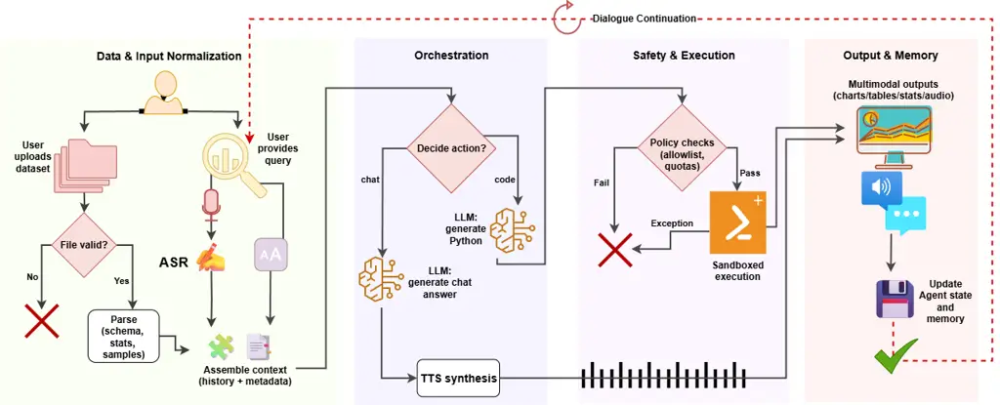

# A Multimodal Conversational Agent for Tabular Data Analysis

Mohammad Nour Al Awad Affiliation: ITMO University  
Saint Petersburg, Russia  
MohammadNourAlAwad@itmo.ru    Sergey Ivanov Affiliation: ITMO
University  
Saint Petersburg, Russia  
svivanov@itmo.ru    Olga Tikhonova Affiliation: ITMO University  
Saint Petersburg, Russia  
tikhonova_ob@itmo.ru    Ivan Khodnenko Affiliation: ITMO University  
Saint Petersburg, Russia  
ivan.khodnenko@itmo.ru

###### Abstract

Large language models (LLMs) can reshape information processing by
handling data analysis, visualization, and interpretation in an
interactive, context-aware dialogue with users, including voice
interaction, while maintaining high performance. In this article, we
present Talk2Data, a multimodal LLM-driven conversational agent for
intuitive data exploration. The system lets users query datasets with
voice or text instructions and receive answers as plots, tables,
statistics, or spoken explanations. Built on LLMs, the suggested design
combines OpenAI Whisper automatic speech recognition (ASR) system,
Qwen-coder code generation LLM/model, custom sandboxed execution tools,
and Coqui library for text-to-speech (TTS) within an agentic
orchestration loop. Unlike text-only analysis tools, it adapts responses
across modalities and supports multi-turn dialogues grounded in dataset
context. In an evaluation of 48 tasks on three datasets, our prototype
achieved 95.8% accuracy with model-only generation time under 1.7
seconds (excluding ASR and execution time). A comparison across five LLM
sizes (1.5B–32B) revealed accuracy–latency–cost trade-offs, with a 7B
model providing the best balance for interactive use. By routing between
conversation with user and code execution, constrained to a transparent
sandbox, with simultaneously grounding prompts in schema-level context,
the Talk2Data agent reliably retrieves actionable insights from tables
while making computations verifiable. In the article, except for the
Talk2Data agent itself, we discuss implications for human–data
interaction, trust in LLM-driven analytics, and future extensions toward
large-scale multimodal assistants.

###### Index Terms: 

Conversational AI, Multimodal Interaction, Data Analysis, Tabular Data,
Human-Data Interaction, Data Visualization, AI Agent

^(†)^(†) ©2025 IEEE. Personal use of this material is permitted.
Permission from IEEE must be obtained for all other uses.

## I Introduction

Interacting with data often requires programming skills or statistical
expertise, creating barriers for managers, analysts, and other
non-technical users \[1, 2\]. Natural language interfaces (NLIs) aim to
improve this information seeking process by allowing users to query data
conversationally \[3, 4\]. At the same time, voice interfaces are
becoming increasingly common in daily life, yet existing voice
assistants remain limited: they can answer factual questions or control
devices, but they lack the analytical capabilities needed for meaningful
data exploration.

LLMs now provide a powerful foundation for code generation and complex
reasoning \[5, 6, 7\]. Systems such as OpenAI’s Code Interpreter \[8\]
demonstrate this potential, but they typically support only text-based
input/output. Another problem is that features like multimodal responses
and transparent execution of generated code (capabilities that are
increasingly important for reliable human–data interaction in the
information seeking process) are less present in current voice assistant
designs.

We present Talk2Data, a multimodal conversational agent that enables
users to effectively seek, retrieve, and analyze data stored in tabular
datasets through either voice or text instructions, and to receive
answers and insights as plots, tables, or spoken explanations. For
example, users can ask “What’s the average delay for United flights?” or
“Plot a histogram of age,” and the agent dynamically determines whether
to generate Python code or provide a direct natural language response.
Code is executed in a secure sandbox, results are narrated through
text-to-speech (TTS), and multi-turn dialogue is supported via
conversational memory. This design allows to adapt its responses to user
intent, offering both analytical depth and accessibility.

At the core of this agent is a orchestration module that reasons about
each query’s intent and selects the appropriate response path. Dataset
metadata and conversation history are injected into structured prompts,
enabling grounded, context-aware behavior. By integrating these
components, this design demonstrates how LLMs can support natural,
multimodal workflows for data analysis.

Our contributions are as follows:

- •
  Multimodal information-seeking agent. An end-to-end system that
  unifies voice/text input with visual, tabular, and spoken outputs for
  exploratory analysis, supporting multi-turn, back-and-forth dialogue
  for information seeking over tabular corpora.
- •
  Orchestration with transparent code execution. A router that
  adaptively selects narration vs. code generation within one dialog
  using grounded prompts, paired with a secure sandbox that exposes code
  for provenance.
- •
  Empirical study across models and tasks. A 48-task benchmark on three
  public datasets evaluating five Qwen2.5-Coder sizes to show how model
  scale affects information-seeking quality. The best mid-size
  configuration attains 95.8% accuracy with _model-only_ latency of
  1.15–1.64 s (excluding ASR and execution time), and we analyze failure
  modes due to routing vs. runtime guardrails.

The remainder of this paper is organized as follows. Section II reviews
related research. Section III details the system architecture.
Section IV presents experiments and benchmarks. Section V discusses
implications, Section VI outlines limitations. Section VII discusses
ethical and responsible-AI considerations, and Section VIII concludes
with future directions.

## II Related Work

We review prior research in three areas most relevant to our work: (i)
NLIs for data analytics and information retrieval, (ii) LLM-based code
generation for data science, and (iii) voice-enabled data assistants.

Text-Based NLIs. Commercial tools such as Tableau Ask Data \[9\], Power
BI Q&A \[10\], AWS QuickSight Q \[11\], and Qlik Sense \[12\] enable
querying structured data in natural language \[1, 2, 3\]. These
interfaces lower the barrier to entry for exploration, but remain
limited to text-based input/output. Recent surveys document the
resurgence of neural methods for conversational information retrieval,
highlighting the growing importance of multi-turn dialogue in
facilitating interaction \[13, 14, 15, 16\]. More recent LLM-powered
utilities such as Powerdrill AI and ChatCSV \[17, 18\] automate chart
generation, but still do not support spoken interaction or adaptive
response modalities.

LLM-Based Code Generation. Advances in program synthesis with
LLMs—including OpenAI Codex \[5\], Code Llama \[6\], and
Qwen-2.5-Coder \[7\]—have demonstrated strong performance in generating
analysis pipelines and data visualizations from text instructions \[19\]
which largely aids the process of retrieving insights using the
generated code. However, these models are typically deployed in static,
text-only settings. They lack conversational memory, execution tool,
transparency of execution, and the ability to adapt outputs to user
context or modality preferences.

Voice-Enabled Data Assistants. Early prototypes built with LangChain,
Streamlit, and gTTS \[20, 21, 22, 23\] have demonstrated
proof-of-concept voice interaction with tabular data. While promising,
these systems remain limited: they provide only one-way voice
interfaces, offer minimal multimodal feedback, and rely on heuristics
rather than agentic decision-making about when to generate code versus
when to respond conversationally.

### II-A System Comparison

We contrast representative systems along input/output modality,
execution model, memory, and adaptivity. Table I summarizes key
properties of existing systems. Unlike prior work, our design uniquely
integrates (1) dual input and output modalities (voice and text), (2)
LLM-powered code generation with safe and transparent sandboxed
execution, (3) adaptive modality switching, i.e., flexibly choosing
between charts, tables, or brief spoken/text responses within one
dialogue, and (4) conversational memory for multi-turn analysis.

| System              | Input Modality | Execution             | Visualization | Multimodal     | Memory  | Adaptive | License / Deploy             |
| ------------------- | -------------- | --------------------- | ------------- | -------------- | ------- | -------- | ---------------------------- |
| Tableau Ask Data    | Text           | — (no code)           | Yes           | No             | Yes     | No       | Prop.; On​-prem              |
| Power BI Q&A        | Text           | — (no code)           | Yes           | No             | Partial | No       | Proprietary; SaaS            |
| ChatCSV             | Text (CSV)     | — (auto charts)       | Yes           | No             | No      | No       | Proprietary; SaaS            |
| Powerdrill AI       | Text           | Auto analytics        | Yes           | No             | Yes     | No       | Proprietary; SaaS            |
| LangChain Demos     | Voice + Text   | Prototype code gen    | Basic         | Partial        | Yes     | No       | Open-source; On​-prem        |
| Amazon QuickSight Q | Text           | Auto analytics        | Yes           | No             | Yes     | No       | Proprietary; SaaS            |
| Qlik Sense          | Voice + Text   | Auto suggestions      | Yes           | No             | Yes     | No       | Proprietary; SaaS + On​-prem |
| Talk2Data (Ours)    | Voice + Text   | Secure code execution | Yes           | Voice & Visual | Yes     | Yes      | Open-source; On​-prem        |

TABLE I: Comparison of representative voice/data analytics systems.

We position our work within prior art by noting that earlier systems
typically emphasize one or two axes of the problem: (i) text-only NLIs
that translate simple questions into charts or aggregations \[9, 10, 11,
12, 17, 18\], (ii) LLM-based code synthesis for analysis and
visualization \[5, 6, 7, 19\], or (iii) voice front-ends that surface
data with limited analytics depth \[20, 21, 22, 23\]. Several recent
demos combine two of these (e.g., voice _plus_ auto-charts, or text
_plus_ code execution), but typically stop short of a unified
conversation loop with memory, guarded execution, and modality-aware
responses.

Another dimension of differentiation is deployment: most commercial NLIs
such as Tableau Ask Data, Power BI Q&A, or Amazon QuickSight Q are
proprietary SaaS features with limited or no on-prem support. By
contrast, our Talk2Data prototype follows an open-source, self-hostable
trajectory, emphasizing transparency and feasibility for on-prem
deployments.

The suggested design stays within this lineage and assembles known
components—ASR, an LLM, and TTS—into a single workflow. The incremental
aspects we explore are: (1) an explicit routing step (via a lightweight
LangGraph node) that decides between code generation and direct
narration using dataset-aware prompts; and (2) a restricted execution
path that treats LLM code as a first-class artifact but runs it with
guardrails (timeouts, whitelisting) and returns structured errors.
Neither routing nor sandboxing is novel in isolation; our contribution
is an empirical look at how these choices affect _end-to-end_ usability
(accuracy, latency, and dialogue continuity) for tabular analysis,
including when speech is the entry point.

Compared with text-only NLIs in commercial business intelligence (BI)
tools \[9, 10, 11, 12\], the suggested design emphasizes transparency
and adaptability over enterprise-specific heuristics. Whereas BI
platforms often rely on curated semantic layers, governed vocabularies,
and policy enforcement, our system favors flexibility by exposing
generated code and supporting free-form queries across arbitrary tabular
datasets. This design trades some enterprise features (e.g., lineage
tracking, synonym governance) for openness and
interpretability—qualities important for exploratory analysis and
educational use.

Relative to LLM “code interpreter” environments \[8, 19\], our scope
extends by adding dual input/output modalities (voice and text, visuals
and speech) and an explicit routing layer that determines when to
generate code and when to respond conversationally. These choices enable
multimodal, multi-turn interaction rather than single-shot code
execution.

Voice-centric prototypes \[20, 21, 22, 23\] demonstrate the feasibility
of ASR–LLM–TTS pipelines but treat prompts as one-shot. By contrast,
this design integrates a guarded execution environment with explicit
error surfacing and conversational memory, supporting iterative
refinement of queries while maintaining predictability and safety.

In that sense, this work demonstrates how combining speech recognition,
LLM-based reasoning, guarded code execution, and text-to-speech within a
single orchestration loop can yield a dependable multimodal assistant
for tabular data. The suggested design offers an open-ended yet safe
exploration of datasets through natural conversation, which forms a path
toward more accessible and trustworthy multimodal data assistants.

## III System Architecture

Figure 1 presents the architecture and turn-level interaction loop. A
user query enters a conversational workflow that initializes the agent
state, selects an action, and returns a structured response. The
pipeline is organized into four conceptual stages: preparing inputs and
dataset context, deciding how to answer (code vs. narration), executing
with safeguards, and delivering multimodal outputs while updating
conversation state.

### III-A Input and Context Assembly

This stage aligns two inputs—the dataset and the user’s utterance—into a
shared, compact context that the rest of the pipeline can reliably
consume (Fig. 1). On the data side, we parse a lightweight schema and
exemplars: column names and inferred types, a few sample rows, numeric
ranges for quantitative fields, and representative values for
categoricals. On the query side, both voice and text are normalized into
a single text form (speech $`\rightarrow`$ ASR $`\rightarrow`$ text)
using OpenAI’s Whisper \[24\] for English speech; the ASR component is
drop-in replaceable and can be extended to other languages by switching
Whisper checkpoints or equivalent multilingual models.

The result is a _context pack_ that travels with the turn: it grounds
routing (the decision prompt), constrains narration (the chat prompt),
and anchors code synthesis (the code prompt) to what actually exists in
the table. Ambiguities are reduced by aligning user words to schema
tokens (e.g., resolving “GPA four” to GPA4 when present) and by exposing
recent conversation state so follow-ups (“now color by gender”) inherit
prior choices without restating them.

Two invariants make this stage effective: (i) _faithfulness_—only facts
derived from the uploaded data (schema, ranges, exemplars) are injected;
(ii) _compactness_—the context is trimmed to remain stable across turns
(e.g., small samples and capped categorical exemplars) so later stages
see a consistent, prompt-friendly view. When the dataset cannot be
parsed or violates basic expectations, the pipeline fails fast with a
user-facing message rather than proceeding with an ungrounded context.
This keeps subsequent decisions predictable and makes downstream
successes attributable to a single, explicit source of grounding.



Fig. 1: System and end-to-end user interaction in _Talk2Data_. The
router selects between chat and code paths; safety is enforced via
sandboxed execution. Outputs may be visual, textual, or spoken, and the
conversation state updates for subsequent turns.

### III-B Decision and Orchestration

At the core of the loop is a single decision point (Fig. 1,
_decide_action_) that classifies each turn as either _code generation_
or _chat response_. Concentrating modality choice in one place keeps the
rest of the pipeline simple: only one branch executes per turn, and
every downstream component can assume a clear contract about what
arrives next (either narration to render or code to check and run).

Orchestration is lightweight; it passes the same grounded context
forward, selects the branch, and records the choice in the conversation
state. This achieves three properties we rely on throughout the paper:
(i) _Adaptivity_ — the agent aligns response mode with user intent and
dataset characteristics; (ii) _Predictability_ — heavy operations
(policy checks, execution) only occur when the decision warrants them;
(iii) _Auditability_ — each turn carries an explicit decision and
rationale, so failures can be traced to a visible fork rather than
hidden heuristics.

By separating _decision_ (what to do) from _realization_ (how it is
done), the architecture admits evolution without churn: improving
examples or style in the decision layer changes behavior immediately,
while the execution and rendering layers remain stable. This division of
concerns is what allows the whole design to be both adaptive in
interaction and steady in operation.

### III-C Prompt Design and Architectural Role

Prompting is the policy layer of our architecture: it encodes how the
agent interprets intent, how it speaks, and how it produces computable
artifacts—without hard-coding logic. The prompts operate at the three
decision points highlighted in Figure 1: (i) selecting the response
mode, (ii) producing narration suited for TTS, and (iii) emitting code
that downstream components can execute and capture reliably. Each prompt
consumes the same structured context (dataset metadata and dialogue
history) so that routing, language, and code are grounded in the same
view of the data.

#### Decision prompt

This prompt helps the LLM to classify the user’s request into
code_generation or chat_response, returning the decision as minimal
JSON. It is seeded with short, contrastive few-shot examples
(“distribution” $`\rightarrow`$ code; “what columns” $`\rightarrow`$
chat) to bias toward the most useful modality while still allowing
clarification. Architecturally, this concentrates adaptivity into a
single, auditable step: the rest of the pipeline remains simple because
the mode is fixed before execution. When the request is ambiguous, the
prompt favors a low-risk chat response and invites follow-up.

#### Chat response prompt

Here the policy is stylistic and accessibility-driven: produce brief,
speakable text with no formatting, suitable for TTS, and grounded in the
provided metadata/history. The prompt explicitly allows the assistant to
ask clarifying questions and to propose switching to computation when
the user’s intent is analytical. This preserves continuity (the
conversation advances even when the dataset or request is unclear) and
keeps narration aligned with what the code path would compute later.

#### Code generation prompt

This prompt constrains outputs to executable, comment-free Python that
assumes a preloaded df. Two invariants matter architecturally: (1)
_grounding_—the code should reference only columns/types present in
metadata; (2) _capturability_—outputs end with an expression (e.g., a
figure or dataframe variable) rather than prints. These constraints make
execution predictable and simplify capture/rendering, while the few-shot
patterns (simple histogram; head of a table) keep generations within the
capabilities of the guarded runtime.

Embedding these policies in prompts yields a flexible control surface:
we can adjust examples, brevity, or safety cues without modifying the
orchestration logic. In practice, this reduced misclassifications and
made failures legible—when pre-checks block an operation, the prompts
already prime the assistant to explain the limitation and suggest a
safer alternative.

### III-D Code Generation and Secure Execution

When the decision module selects the computational path, the agents
constructs the code generation prompt. This prompt instructs the LLM to
produce concise, expression-oriented Python code. The generated snippets
typically leverage standard data analysis libraries such as pandas,
matplotlib, plotly, or seaborn. By encouraging expression-based outputs
rather than long scripts, the agent ensures that results are captured
cleanly (e.g., figures, summary tables) and remain interpretable for
users.

Generated code is passed to a sandboxed runtime that enforces strict
constraints. Only whitelisted libraries are exposed, with file system,
operating system, and network access disabled. Execution is bounded by
timeouts and resource quotas to avoid denial-of-service or runaway
computations. The pipeline captures outputs in structured form:
numerical results are returned as JSON, and figures are converted to
Base64 images that can be rendered in the user interface. This design
also facilitates error handling: exceptions are intercepted, logged, and
summarized into user-friendly explanations.

Allowing an LLM to generate and execute code introduces security and
reliability risks. Without safeguards, generated code could accidentally
overwrite files, exhaust memory, or leak private data. This sandbox
design prioritizes safety and transparency by restricting system calls,
limiting resource usage, and surfacing errors explicitly. This is a
trade-off: some advanced operations (e.g., dynamic imports, external
APIs) are not supported, which occasionally leads to task failures (see
Section IV). However, we argue that constrained but safe execution is
preferable to unrestricted but opaque pipelines, particularly for
non-technical users who may not detect silent errors.

This secure execution pipeline provides several advantages to users.
First, it builds trust: users can see and verify the code that produced
their results, rather than relying on a “black box.” Second, it supports
transparency: errors and limitations are explained instead of hidden,
encouraging realistic expectations. Third, it maintains reproducibility:
since outputs are generated from explicit code, they can be re-run or
adapted manually by analysts.

This design treats code generation not as a hidden mechanism, but as a
transparent, auditable process. This aligns with our broader design
principle of _trustworthy AI_, ensuring that powerful LLM-driven
analysis remains safe, interpretable, and user-centered.

### III-E Narrative Response and Dialogue Management

When the agent chooses the narrative response path, it advances the
conversation without running code: it interprets the user’s request
against the current dataset context and recent turns, then produces a
brief, speakable explanation. The aim is to keep momentum—clarify what a
field means, summarize what a prior chart already showed, or resolve
ambiguity with the smallest possible clarification—while remaining
grounded in the same context that drives the analytic path.

Two short examples illustrate the role of this path:

> User: “What does carrier mean here?”  
> Agent: “It’s the airline operating the flight, like UA or DL, recorded
> as a short code.”

> User: “How did you compute the on-time rate by carrier?”  
> Agent: “I filtered out canceled flights, treated arrival delay
> $`\leq 15`$ minutes as on-time, grouped rows by carrier, and divided
> the on-time count by the total flights for each carrier.”

Such answers reflect interpretive reasoning over metadata and align with
human expectations. In this way, the agent not only delivers results but
also explains them in terms accessible to non-specialists.

Providing natural explanations addresses a common limitation of analytic
systems: non-technical users may not understand why a result looks the
way it does. By embedding interpretive narratives into the workflow,
this design increases trust, usability, and inclusivity. This
functionality also enables accessibility scenarios (e.g., blind users
receiving spoken feedback), underscoring the value of a multimodal
conversational design.

In our prototype, narrative turns are rendered to audio via Coqui TTS
(tts_models/en/vctk/vits, speaker p260) \[25, 26\]

### III-F Multi-turn Interactions

To support multi-turn conversations, the agent maintains a lightweight
dialogue memory that includes active dataset metadata and a running
history of prior queries and outputs (code or explanations). This
context is injected into each new LLM prompt, allowing the agent to
generate coherent, contextually aware responses. This design allows
users to interact iteratively without restating full queries. For
example:

> “Plot math vs. reading score.” $`\rightarrow`$ \[scatter plot\]  
> “Now color by gender.” $`\rightarrow`$ \[updated plot with hue\]

Here, the second query is resolved only by referencing the prior
visualization and metadata. Such incremental refinement is
characteristic of real-world analysis workflows and is not supported by
one-shot NLIs.

We note that maintaining conversational memory introduces challenges:
context windows are finite, and long interaction histories can increase
latency or induce hallucinations. To mitigate this, we keep only last N
interactions in the history. In future work, we plan to explore semantic
memory compression, episodic summaries, and retrieval-augmented
prompting to handle longer and more complex sessions.

Memory transforms the design from a query engine into a conversational
partner. Users can build on prior steps naturally, explore alternative
perspectives, and carry forward insights across turns. This supports
more exploratory and human-like interaction with data.

Together, these capabilities—natural explanations, conversational
memory, and multimodal output—differentiate this design from text-only
NLIs and prototype voice demos, supporting the idea of a general-purpose
conversational agent for data analysis.

Table II illustrates a three-turn refinement on the insurance dataset:
the agent plots charges vs. BMI, colors by smoker status, then adds a
regression line.

| Step | User Command               | Generated Code (snippet)                                                                                                                                                                                                                                                                                                                                                            | Resulting Plot                                                               |
| ---- | -------------------------- | ----------------------------------------------------------------------------------------------------------------------------------------------------------------------------------------------------------------------------------------------------------------------------------------------------------------------------------------------------------------------------------- | ---------------------------------------------------------------------------- |
| 1    | Plot charges vs BMI        | plt.scatter(df\[’bmi’\], df\[’charges’\]) plt.xlabel(’BMI’) plt.ylabel(’Charges’) plt.title(’Charges vs BMI’) plt.show()                                                                                                                                                                                                                                                            | ![[Uncaptioned image]](arxiv-2511-18405--9154fcbbbcd1.figures/figure-2.webp) |
| 2    | now color by smoker status | plt.scatter(df\[’bmi’\], df\[’charges’\], c=df\[’smoker’\].map({’yes’: ’red’, ’no’: ’blue’})) plt.xlabel(’BMI’) plt.ylabel(’Charges’) plt.title(’Charges vs BMI by Smoker Status’) plt.legend(\[’Smoker’, ’Non-Smoker’\]) plt.show()                                                                                                                                                | ![[Uncaptioned image]](arxiv-2511-18405--9154fcbbbcd1.figures/figure-3.webp) |
| 3    | now add a regression line  | plt.scatter(df\[’bmi’\], df\[’charges’\], c=df\[’smoker’\].map({’yes’: ’red’, ’no’: ’blue’})) plt.xlabel(’BMI’) plt.ylabel(’Charges’) plt.title(’Charges vs BMI by Smoker Status’) x = df\[’bmi’\] y = df\[’charges’\] slope, intercept = np.polyfit(x, y, 1) plt.plot(x, slope\*x + intercept, color=’green’) plt.legend(\[’Smoker’, ’Non-Smoker’, ’Regression Line’\]) plt.show() | ![[Uncaptioned image]](arxiv-2511-18405--9154fcbbbcd1.figures/figure-4.webp) |

TABLE II: Stepwise refinement scenario on an insurance dataset: user
command, generated code, and resulting plot.

## IV Experiments & Benchmarks

We evaluated the developer Talk2Data prototype on an NVIDIA RTX 6000 Ada
(48 GB VRAM) server, assessing both (1) task performance (accuracy on
varied query types), and (2) latency (end-to-end response time). We also
report qualitative observations of multi-turn behavior and
decision-making.

### IV-A Benchmark Design

We tested on three public datasets (Table III) spanning different sizes
and complexities: the Otto Group product dataset \[27\], US Flights
2008 \[28\], and a student performance dataset \[29\]. Each dataset was
evaluated with 16 natural language tasks, totaling 48.

| Dataset         | Cols | Rows       | Size          |
| --------------- | ---- | ---------- | ------------- |
| Otto Products   | 94   | 144,000    | $`\sim`$27 MB |
| Student Scores  | 8    | 1,000      | 0.07 MB       |
| US Flights 2008 | 29   | $`\sim`$7M | 673 MB        |

TABLE III: Datasets used in evaluation.

Tasks fell into three categories: 26 visualization requests (e.g.,
scatter plots), 13 analytical/statistical queries (e.g., finding max
values), and 9 explanatory/narrative prompts (Table IV).

| Category         | Example Query                                                             |
| ---------------- | ------------------------------------------------------------------------- |
| 26 Visualization | ”Create a scatter plot of departure vs. arrival delay with a trend line.” |
| 13 Analytical    | ”Find the product ID with the maximum value in feature 3.”                |
| 9 Narrative      | ”Summarize the relationship between departure and arrival delays.”        |

TABLE IV: Evaluation query categories with examples.

Each task was evaluated manually. A query was marked correct if the
output chart or response was accurate and aligned with expectations
(based on manual ground truth calculations). Visualization tasks were
also checked for proper axis labeling and scaling.

#### Model variants and protocol.

We evaluated five Qwen2.5-Coder instruction models (1.5B, 3B, 7B, 14B,
and 32B-AWQ). Prompts, routing logic, datasets, and the guarded runtime
were held constant across runs so that differences reflect the model’s
contribution rather than orchestration or policy changes. Each task was
executed once per model. We report: (i) _Code_ and _Chat_ correctness;
(ii) _Misclassification_ when the router chose the wrong path; and (iii)
_Execution errors_ when the sandbox blocked or the code failed at
runtime.

### IV-B Accuracy and Model Trade-offs

Table V summarizes accuracy across models. Performance increases sharply
from 1.5B$`\rightarrow`$3B$`\rightarrow`$7B, then shows diminishing
returns: 7B and 32B-AWQ both reach 95.8% overall, while 14B edges higher
to 97.9%.

| Model   | Code        | Chat | Misclassification | Exec errors | Overall       |
| ------- | ----------- | ---- | ----------------- | ----------- | ------------- |
| 1.5B    | 21/39 (54%) | 9/9  | 17                | 1           | 30/48 (62.5%) |
| 3B      | 36/39 (92%) | 6/9  | 3                 | 3           | 42/48 (87.5%) |
| 7B      | 37/39 (95%) | 9/9  | 1                 | 1           | 46/48 (95.8%) |
| 32B-AWQ | 37/39 (95%) | 9/9  | 0                 | 2           | 46/48 (95.8%) |
| 14B     | 38/39 (97%) | 9/9  | 0                 | 1           | 47/48 (97.9%) |

TABLE V: Performance of Qwen2.5-Coder-\*B-Instruct across 48 tasks (39
code + 9 chat).

We notice that smaller models behaved conservatively. The 1.5B variant
often sought clarification or proposed how to proceed instead of
producing code—counted as routing mistakes (17). When it did generate
code, artifacts met minimal criteria but were simplified (e.g., default
binning, missing groupings/labels), yielding 21/39 on code vs. 9/9 on
chat; many turns ended in narration without an artifact.

At 3B, code correctness rose to 36/39, but the generated programs were
generally simplistic (e.g. default setting for plotting), and chat
dropped to 6/9: several narrative turns were terse or weakly grounded,
reflecting a bias toward computation when a short explanation would have
sufficed.

The 7B model had the most preferable results: one routing mistake, 37/39
code and 9/9 chat, with residual errors attributable to guardrails or
environment (e.g., blocked imports) rather than misunderstanding.

Larger models offered better returns under our sandbox. The 14B model
reached 38/39 code for the best overall score; 32B-AWQ matched 7B
overall but showed slightly more execution errors (2), both rose from
ambitious code blocked by the sandbox, i.e. attempting functionality
beyond its restrictions.

In practice, the 7B model balances reliability and responsiveness at a
substantially lower cost than larger variants. Specifically, the two
failures of the 7B model were as follows:

- •
  PCA failure: A PCA scatter plot request failed because scikit-learn’s
  PCA import was blocked by the sandbox (no dynamic imports),
  illustrating that execution restrictions were correctly enforced.
- •
  Routing mistake: A clear plotting request was classified as a
  narrative response; the assistant asked for clarification instead of
  generating code, so no artifact was produced and the task was marked
  incorrect.

These two failures reflect distinct modes: one intentional policy block
by the runtime and one decision error at the routing step. Other
visualizations—including histograms, boxplots, and correlation
plots—were generated correctly. Analytical results (e.g., means, counts)
matched expected values, and explanatory responses were grounded in the
dataset metadata.

### IV-C Latency Analysis

We measured per-query _model-only time_ across datasets. Here,
_model-only time_ is defined as decision + (code generation _or_ chat
response) + TTS, and excludes both automatic speech recognition (ASR)
and code execution.

| Dataset           | Decision | Code Gen. | Exec. | Chat Resp. | TTS  | Model-only time (no ASR/exec.) |
| ----------------- | -------- | --------- | ----- | ---------- | ---- | ------------------------------ |
| Products (medium) | 0.30     | 0.69      | 1.82  | 0.66       | 1.78 | 1.33                           |
| Students (small)  | 0.43     | 0.56      | 0.06  | 1.01       | 2.96 | 1.64                           |
| Flights (large)   | 0.32     | 0.57      | 3.82  | 0.45       | 1.13 | 1.15                           |

TABLE VI: Average latency per query (seconds) across stages and
datasets. The Model-only time column equals Decision + (Code Gen. or
Chat Resp.) + TTS.

Decision time averaged $`0.30\text{--}0.43`$ s, with code generation at
$`0.56\text{--}0.69`$ s. Sandbox execution (reported for context, not
included in model-only time) scaled with dataset size—$`0.06`$ s
(Students), $`1.82`$ s (Products), and $`3.82`$ s (Flights). Chat
responses took $`0.45\text{--}1.01`$ s, and TTS added roughly
$`1.1\text{--}3.0`$ s per utterance. The resulting _model-only time_
averaged $`1.15\text{--}1.64`$ s across datasets, comfortably within
interactive bounds. Further gains are likely from streaming TTS and
light pipelining (e.g., overlapping execution with rendering).

ASR is omitted because our benchmark sessions were text-only; code
execution is excluded because it runs in a client-side sandbox and is
highly machine-dependent. Thus, _model-only time_ should be interpreted
as the latency to generate a response (code or narration) and synthesize
speech, not the full end-to-end duration including execution.

Formally, the average _model-only time_ is

```math
T_{\text{model}}\;=\;t_{\mathrm{dec}}\;+\;\frac{t_{\mathrm{code}}\cdot N_{\mathrm{code}}\;+\;(t_{\mathrm{chat}}+t_{\mathrm{tts}})\cdot N_{\mathrm{chat}}}{N_{\mathrm{total}}},
```

where $`t_{\mathrm{dec}}`$ is decision latency, $`t_{\mathrm{code}}`$ is
average code-generation time, $`t_{\mathrm{chat}}`$ is average narrative
generation time, $`t_{\mathrm{tts}}`$ is average text-to-speech time,
$`N_{\mathrm{code}}`$ and $`N_{\mathrm{chat}}`$ are the counts of code
and chat turns, and
$`N_{\mathrm{total}}=N_{\mathrm{code}}+N_{\mathrm{chat}}`$.

We expect additional reductions in $`T_{\text{model}}`$ from streaming
TTS and stage pipelining (e.g., rendering while narration is being
synthesized).

## V Discussion

Our evaluation surfaces where a conversational, multimodal analysis
agent such as Talk2Data provides tangible advantages over text-only NLIs
and one-shot code interpreters.

### V-A Design objectives

The architecture was shaped by several design goals that guided the
technical choices:

Accessibility. By lowering entry barriers for non-technical users by
supporting both text and voice queries, multimodal outputs, and
conversational memory. This enables managers, analysts, and students to
interact with data without writing code.

Trust and safety. Since the agent executes LLM-generated code, ensuring
safety was a core requirement. We enforce this through sandboxed and
transparent execution, and restrictions on file system and network
access. These measures build user confidence and align with responsible
AI principles.

Adaptivity. Unlike static dashboards or text-only assistants, this agent
design adapts to user intent by switching modalities (charts, tables,
speech). This adaptivity makes interaction more efficient and natural.
An alternative axis of adaptivity, complementary to ours, is routing
among search strategies for retrieval-augmented generation (RAG)
pipelines to trade off quality and cost in multi-turn settings \[30\].

Extensibility. The architecture was designed to be modular. Components
such as the LLM, ASR, or TTS engine can be replaced with improved
models. The agentic orchestration layer also allows easy integration of
additional tools (e.g., retrieval modules, domain-specific analytics).

These principles emphasize that this design is a blueprint for building
reliable, user-centered multimodal agents. They provide a foundation for
future extensions, such as multilingual support, richer memory
management, and domain-specific plugins.

### V-B Implications for Human-Data Interaction

The Talk2Data design shows that combining voice input with LLM-driven
analysis makes data exploration more natural: users can ask open-ended
questions and quickly obtain plots, tables, or brief spoken
explanations. The high success rate (46/48) suggests current LLMs can
handle diverse, average-difficulty queries on structured datasets.

Conversational memory supports exploratory analysis. Unlike one-shot
NL2Viz systems, this design enables iterative probing—users ask a
general question, then refine naturally—mirroring how analysts work and
deepening understanding.

Users do not always know how to phrase a request or which format is
ideal. The agent fills that gap: if a user asks, “What’s interesting in
this dataset?”, it may produce a spoken summary and then offer a chart;
follow-ups like “Plot that” continue seamlessly. Centralizing modality
selection at the turn level simplifies interaction: the system commits
to either narration or computation, avoiding partial, mixed responses.
Code transparency makes results auditable; short, expression-final
snippets connect outputs to causes and enable reuse.

### V-C Broader usability

While Talk2Data is presented as a research prototype, its design enables
deployment in several practical scenarios where conversational and
multimodal data access can add value. Below we outline representative
use cases that illustrate the agent’s potential impact.

- •
  On-the-go & meetings: Hands-free voice queries with spoken summaries
  and optional charts for quick check-ins.
- •
  Mobile / limited screens: Concise answers and single-view visuals
  reduce navigation and typing.
- •
  Accessibility: TTS explanations of distributions, trends, and
  outliers; screen-reader friendly flow.
- •
  Managerial support: High-level KPIs, deltas, and “what changed?”
  prompts; easy export of figures.
- •
  Education & training: Explain–then–show interactions (e.g., “What is a
  boxplot?”) with iterative follow-ups.
- •
  Collaborative sessions: Shared visuals plus narration in real time;
  where memory enables fast refinements.
- •
  Analyst prototyping: First-pass code/plots to copy, edit, and rerun in
  notebooks; reproducible snippets.

These scenarios illustrate how an agentic, multimodal interface for data
analysis can benefit both technical and non-technical users. This also
highlight the broader potential of LLMs in enabling accessible,
trustworthy, and adaptive interaction with structured data. Importantly,
the same design pattern can orchestrate other tools (e.g., SQL engines,
geospatial queries, simulators, or document extractors), enabling
end-to-end workflows that mix retrieval, transformation, visualization,
and explanation.

## VI Limitations and Threats to Validity

This section consolidates the work’s limitations and threats to
validity, clarifying scope, assumptions, and potential biases.

Coverage and generalization. Our 48-task benchmark spans mostly clean
tabular datasets. Performance on noisy, domain-specific, time-series, or
hierarchical tables may differ. Extending to schema repair and
retrieval-augmented prompting is future work.

Speech recognition realism. Our evaluation excluded ASR by using
text-only queries. In practice, real-world use introduces variability
from accents, background noise, and device microphones, which may reduce
accuracy or increase latency.

Prompt and memory policies. Prompt templates and the lightweight
dialogue memory (last-$`N`$ turns) may not transfer unchanged across
model families or long sessions; context limits can induce omissions or
hallucinations. Episodic summaries and policy re-tuning are likely
needed for longer dialogues and other LLMs.

Evaluation procedure and bias. Correctness was judged manually with
ground-truth checks but without blinded raters; inter-rater reliability
was not measured. Broader user studies (incl. non-technical participants
and screen-reader users) are needed to assess usability, trust, and
cognitive load.

Scalability and cost. Serving ASR, TTS, and larger LLMs concurrently is
resource-intensive. While 7B models offered a strong cost–quality point
here, deployment may require quantization, speculative decoding, or
tiered routing to smaller models.

Security surface. Sandboxing blocks OS/network access and enforces
time/CPU limits, but residual risks remain (e.g., resource exhaustion).
Micro-VM isolation, stricter quotas, and policy checks for visual
integrity can further reduce attack surface.

Audio latency. TTS dominates short-turn latency in Talk2Data current
design. Streaming/duplex audio (barge-in) and overlapping synthesis with
rendering can reduce perceived delay substantially.

We plan to (i) support cross-dataset joins with retrieval and schema
repair, (ii) add streaming TTS with interruption, and (iii) expose a
plug-in API with micro-VM execution and resource quotas for even safer
extensibility.

## VII Ethical and Responsible Considerations

Deploying multimodal agents such as our Talk2Data raises important
ethical and responsible AI concerns. While our work focuses on technical
feasibility, we highlight key dimensions that must be addressed when
moving toward real-world deployment.

Trust and transparency. Users should understand how results are produced
and when code is executed. This design promotes transparency by
surfacing generated Python code. This helps users distinguish between
correct outputs and system limitations.

Data privacy. Voice queries and dataset content may contain sensitive
information. Deployments of such agent design should ensure strict data
governance, including local execution or encryption of queries, and
careful handling of conversational histories.

Accessibility and inclusion. A positive ethical dimension of this design
is its ability to support users who are traditionally under-served by
data tools, such as visually impaired individuals. However,
accessibility should not come at the cost of accuracy or safety, and
careful evaluation is needed to ensure inclusive benefit.

Security risks. Even with sandboxing, executing generated code
introduces potential attack surfaces such as denial-of-service through
resource exhaustion. Strengthening the sandbox with quotas, micro-VMs,
or policy enforcement layers is critical to prevent misuse.

By foregrounding these considerations, we aim to emphasize that
technical progress in multimodal agents must go with responsible design.
We view Talk2Data not as a technical contribution but also as an
opportunity to reflect on how agentic systems can be made trustworthy,
transparent, and inclusive.

## VIII Conclusion

We presented _Talk2Data_, a multimodal conversational agent for tabular
analytics that combines ASR, LLM-based decision making and code
generation, secure sandboxed execution, and TTS within a single
orchestration loop. By centralizing the code-vs-chat decision in a
lightweight router and grounding all prompts in a compact dataset
context, the system delivers transparent, auditable analytics while
remaining accessible to non-technical users.

Across 48 tasks on three public datasets, our prototype achieved 95.8%
accuracy with model-only latency within 1.15–1.64 s, suggesting that
careful assembly of existing components—paired with explicit guardrails
and prompt policies—is sufficient for dependable, interactive analysis.
Beyond raw accuracy, we find that conversational memory, and code
transparency are key to user trust and iterative refinement. While not a
new primitive, the design demonstrates a practical blueprint for
building dependable, voice- and text-driven data assistants that
prioritize safety, adaptability, and interpretability.

### VIII-A Future Work and Challenges

We see several directions to extend capability, robustness, and
real-world utility:

- •
  Broader data coverage. Extend beyond clean tabular data to time
  series, relational joins, and schema mismatch via
  retrieval-and-rewrite (schema repair, type reconciliation) and light
  feature discovery.
- •
  Safety and isolation. Harden execution with micro-VMs, stricter
  resource quotas, and a policy engine for API/library allowlists; add
  static analysis of generated code and visual-integrity checks on
  produced figures.
- •
  Richer memory and longer contexts. Replace last-$`N`$ history with
  episodic summaries and retrieval-augmented prompting; explore semantic
  compression and tool-aware state to preserve salient decisions
  (filters, encodings) across long sessions.
- •
  Lower-perceived latency audio. Add streaming ASR/TTS with barge-in and
  turn-taking cues; pipeline narration with rendering to reduce
  time-to-first-token and enable mid-utterance corrections.
- •
  Model efficiency. Explore tiered routing (small model first, escalate
  on uncertainty), speculative decoding, quantization/LoRA variants, and
  knowledge distillation to maintain quality at lower cost.
- •
  User studies and evaluation. Run controlled studies with non-technical
  users to measure task time, trust, and cognitive load; add blinded
  multi-rater correctness and scenario-driven stress tests.

Together, these steps move the system from a research prototype toward a
deployable assistant that maintains transparency and safety while
scaling to richer data, longer dialogues, and diverse users.

## Artifact Availability

The full implementation—including code, evaluation scripts, results, and
a demo video—is available at:

https://github.com/mohammad-nour-alawad/talk2data

## Acknowledgment

This work supported by the Ministry of Economic Development of the
Russian Federation (IGK 000000C313925P4C0002), agreement
No139-15-2025-010

## References

- \[1\] M. Zheng, X. Feng, Q. Si, Q. She, Z. Lin, W. Jiang, and W. Wang,
  “Multimodal table understanding,” _arXiv preprint
  arXiv:2406.08100_, 2024. \[Online\]. Available:
  https://arxiv.org/abs/2406.08100
- \[2\] A. S. Sundar and L. Heck, “ctbls: Augmenting large language
  models with conversational tables,” _arXiv preprint
  arXiv:2303.12024_, 2023. \[Online\]. Available:
  https://arxiv.org/abs/2303.12024
- \[3\] M. Li, Y. Zhao, and Q. Chen, “Natural language interfaces for
  tabular data querying and visualization: A survey,” _IEEE Transactions
  on Knowledge and Data Engineering_, vol. 36, no. 11, pp.
  6699–6718, 2024. \[Online\]. Available:
  https://ieeexplore.ieee.org/document/10530359
- \[4\] J. Dalton, S. Fischer, P. Owoicho, F. Radlinski, F. Rossetto,
  J. R. Trippas, and H. Zamani, “Conversational information seeking:
  Theory and application,” 2022, p. 3455–3458. \[Online\]. Available:
  https://doi.org/10.1145/3477495.3532678
- \[5\] M. Chen and J. Tworek, “Evaluating large language models trained
  on code,” _arXiv preprint_, vol. arXiv:2107.03374, 2021. \[Online\].
  Available: https://arxiv.org/abs/2107.03374
- \[6\] B. Rozière and J. Schreiber, “Code llama: Open foundation models
  for code,” _arXiv preprint_, vol. arXiv:2308.12950, 2023. \[Online\].
  Available: https://arxiv.org/abs/2308.12950
- \[7\] B. Hui and Y. Lin, “Qwen-2.5-coder technical report,” _arXiv
  preprint_, vol. arXiv:2409.12186, 2024. \[Online\]. Available:
  https://arxiv.org/abs/2409.12186
- \[8\] OpenAI, “Chatgpt code interpreter (advanced data analysis) —
  beta release notes,” https://openai.com/blog/chatgpt-plugins, 2023.
- \[9\] Tableau Software, “Ask data,”
  https://www.tableau.com/learn/tutorials/on-demand/ask-data, 2025.
- \[10\] Microsoft, “Power bi q&a,”
  https://powerbi.microsoft.com/en-us/blog/power-bi-april-2025-feature-summary/, 2025.
- \[11\] Amazon Web Services, “Amazon quicksight q – natural language
  analytics,” https://aws.amazon.com/quicksight/, 2025.
- \[12\] Qlik, “Insight advisor chat,”
  https://insightsoftware.com/vizlib/, 2025.
- \[13\] J. Gao, M. Galley, and L. Li, “Neural approaches to
  conversational ai,” in _The 41st International ACM SIGIR Conference on
  Research & Development in Information Retrieval_, 2018, p. 1371–1374.
  \[Online\]. Available: https://doi.org/10.1145/3209978.3210183
- \[14\] K. A. Hambarde and H. Proença, “Information retrieval: Recent
  advances and beyond,” _IEEE Access_, vol. 11, pp. 76 581–76 604, 2023.
- \[15\] O. Alonso and R. Baeza-Yates, Eds., _Information Retrieval:
  Advanced Topics and Techniques_, 1st ed., 2024, vol. 60. \[Online\].
  Available: https://dl.acm.org/doi/book/10.1145/3674127
- \[16\] Y. Zhang, Z. Liu, Q. Wen, L. Pang, W. Liu, and P. S. Yu, “Ai
  agent for information retrieval: Generating and ranking,” in
  _Proceedings of the 33rd ACM International Conference on Information
  and Knowledge Management_, 2024, p. 5605–5607. \[Online\]. Available:
  https://doi.org/10.1145/3627673.3680120
- \[17\] Powerdrill AI, “Powerdrill ai csv assistant,”
  https://powerdrill.ai/features/csv-ai-assistant, 2025.
- \[18\] ChatCSV, “Chat with your csv,” https://www.chatcsv.co/, 2025.
- \[19\] N. Nascimento and J. Pérez, “Llm4ds: Evaluating large language
  models for data science code generation,” _arXiv preprint_, vol.
  arXiv:2411.11908, 2024. \[Online\]. Available:
  https://arxiv.org/abs/2411.11908
- \[20\] Ngonidzashe, “Chat with your csv: Visualize your data with
  langchain and streamlit,” Dev.to, May 2023. \[Online\]. Available:
  https://dev.to/ngonidzashe/chat-with-your-csv-visualize-your-data-with-langchain-and-streamlit-ej7
- \[21\] A. Kumar and P. Singh, “A voice‐based interface for data
  visualization and summarisation,” _Ijisae_, 2023. \[Online\].
  Available: https://www.ijisae.org/index.php/IJISAE/article/view/4063
- \[22\] M. Gomez-Vazquez, J. Cabot, and R. Clarisó, “Automatic
  generation of conversational interfaces for tabular data analysis,” in
  _Proceedings of the ACM Conversational User Interfaces 2024 (CUI
  ’24)_, 2024. \[Online\]. Available:
  https://dl.acm.org/doi/10.1145/3640794.3665577
- \[23\] Y. Zhao and Z. Qi, “Qtsumm: Query-focused summarization over
  tabular data,” _arXiv preprint arXiv:2305.14303_, 2023. \[Online\].
  Available: https://arxiv.org/abs/2305.14303
- \[24\] A. Radford and J. W. Kim, “Robust speech recognition via
  large-scale weak supervision,” _arXiv preprint_, vol.
  arXiv:2212.04356, 2022. \[Online\]. Available:
  https://arxiv.org/abs/2212.04356
- \[25\] Coqui AI, “Coqui tts — an open-source toolkit for
  text-to-speech,” https://github.com/coqui-ai/TTS, 2023.
- \[26\] J. Kim and J. Kong, “Conditional variational autoencoder with
  adversarial learning for end-to-end text-to-speech,” _arXiv preprint_,
  vol. arXiv:2106.06103, 2021. \[Online\]. Available:
  https://arxiv.org/abs/2106.06103
- \[27\] Otto Group, “Otto group product classification challenge
  dataset,” Kaggle, 2019. \[Online\]. Available:
  https://www.kaggle.com/c/otto-group-product-classification-challenge
- \[28\] V. Dongre, “Us flights data 2008,” Kaggle, 2015. \[Online\].
  Available:
  https://www.kaggle.com/datasets/vikalpdongre/us-flights-data-2008
- \[29\] SPSCIENTIST, “Students performance in exams,” Kaggle, 2016.
  \[Online\]. Available:
  https://www.kaggle.com/datasets/spscientist/students-performance-in-exams
- \[30\] Y. Wang and H. Xu, “ SRSA: A Cost-Efficient Strategy-Router
  Search Agent for Real-world Human-Machine Interactions ,” in _2024
  IEEE International Conference on Data Mining Workshops (ICDMW)_. IEEE
  Computer Society, Dec. 2024, pp. 307–316. \[Online\]. Available:
  https://doi.ieeecomputersociety.org/10.1109/ICDMW65004.2024.00046
