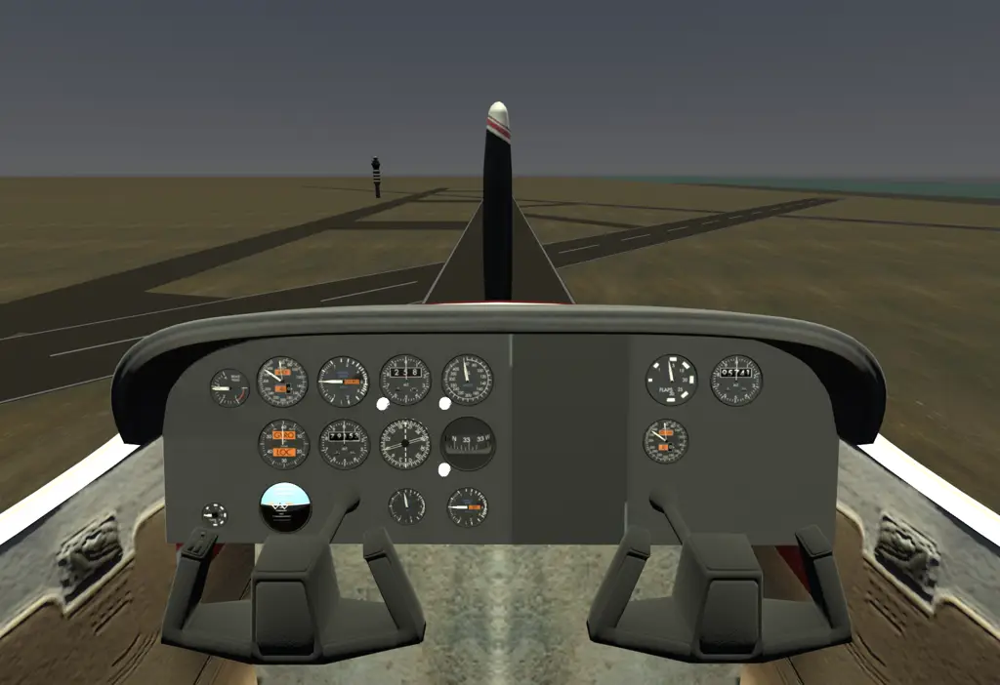
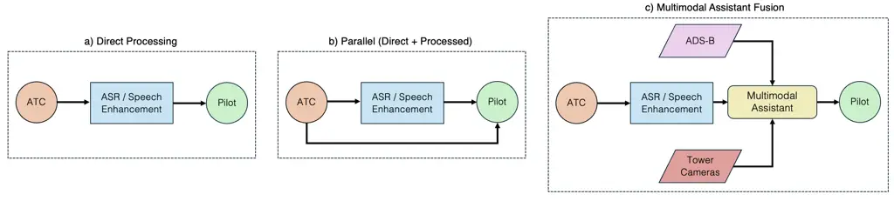
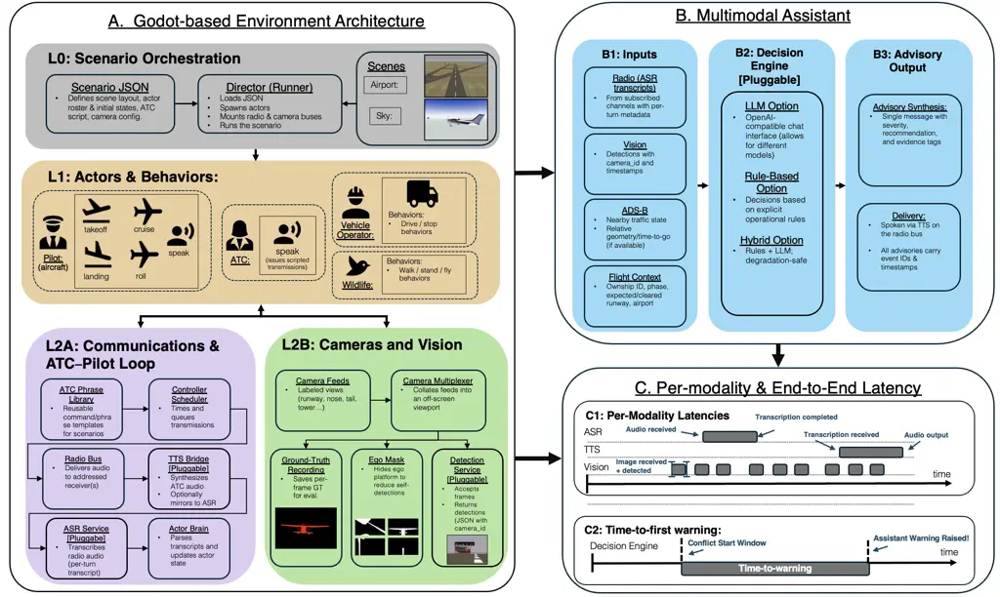

# AIRHILT: A Human-in-the-Loop Testbed for Multimodal Conflict Detection in Aviation

Omar Garib Affiliation: Daniel Guggenheim School of Aerospace
Engineering, Georgia Institute of Technology    Jayaprakash D.
Kambhampaty Affiliation: Daniel Guggenheim School of Aerospace
Engineering, Georgia Institute of Technology    Olivia J. Pinon Fischer
Affiliation: Daniel Guggenheim School of Aerospace Engineering, Georgia
Institute of Technology    Dimitri N. Mavris Affiliation: Daniel
Guggenheim School of Aerospace Engineering, Georgia Institute of
Technology

###### Abstract

We introduce AIRHILT (Aviation Integrated Reasoning, Human-in-the-Loop
Testbed), a modular and lightweight simulation environment designed to
evaluate multimodal pilot and ATC assistance systems for aviation
conflict detection. Built on the Godot engine \[1\], AIRHILT
synchronizes pilot and air traffic controller (ATC) communications,
visual scene understanding from camera streams, and ADS-B surveillance
data within a unified, scalable platform. The environment supports
pilot- and controller-in-the-loop interactions, providing a
comprehensive scenario suite covering both terminal area and en route
operational conflicts, including communication errors and procedural
mistakes. AIRHILT offers standardized JSON-based interfaces enabling
researchers to easily integrate, swap, and evaluate various automatic
speech recognition (ASR), visual detection, decision-making, and
text-to-speech (TTS) models. We demonstrate AIRHILT through a reference
pipeline incorporating fine-tuned Whisper ASR, YOLO-based visual
detection, ADS-B-based conflict logic, and GPT-OSS-20B structured
reasoning, presenting preliminary results from representative
runway-overlap scenarios where the assistant achieves an average
time-to-first-warning of $`{\sim}7.7`$ s with average ASR and vision
latencies of $`{\sim}5.9`$ s and $`{\sim}0.4`$ s, respectively. The
AIRHILT environment and scenario suite are openly available, supporting
reproducible research on multimodal situational awareness and conflict
detection in aviation. The complete repository is available at
[github.com/ogarib3/airhilt](https://github.com/ogarib3/airhilt).

## I INTRODUCTION

Aircraft situational awareness and conflict detection currently rely on
accurate multi-aircraft surveillance and radio communications, with
command and control of airspace operations managed centrally by human
air traffic controllers (ATCs). However, human ATCs and pilots are
vulnerable to overwork, fatigue, and loss of attention, increasing the
risk of operational errors and conflict events \[2, 3\].

To alleviate workload pressures and reduce operational errors, there is
a growing need for assistive aviation systems that incorporate recent
advancements in _automatic speech recognition_ (ASR) and _vision-based
detection_, alongside existing aircraft and radar surveillance data
(e.g., ADS-B, radar). Such systems could proactively identify hazards
such as traffic conflicts and runway incursions, while enhancing
situational awareness and minimizing additional workload for pilots and
controllers.



Fig. 1: AIRHILT at a glance. Cockpit view from the simulation showing
the setting used for pilot‑in‑the‑loop evaluations. AIRHILT synchronizes
radio traffic, vision feeds, and ADS‑B to test end‑to‑end assistive
warning pipelines.

However, the current testing landscape for such aviation assistive
systems presents notable challenges. Physically collocated test
environments are costly, time-consuming, and require careful scheduling
of limited ATC and pilot availability. These sophisticated facilities
typically include several pilot and controller workstations along with
integrated displays and are commonly utilized for operational scenario
studies \[4, 5\]. Yet, their availability is increasingly constrained by
growing global aviation traffic and rising research demands associated
with emerging aviation concepts such as unmanned aerial systems (UAS)
and advanced air mobility (AAM) \[6, 7\]. Although rigorous testing at
physical facilities remains essential for advanced development and
certification phases, it is impractical for early-stage concept
evaluations. Additionally, the rapidly expanding design space, driven by
new machine learning models and varied computational, sensing, and
communication architectures, further underscores the necessity of
flexible, efficient, simulation-based environments suitable for rapid,
systematic evaluations.

Such a simulation-based environment would significantly broaden access
to aviation situational awareness research, allowing researchers
worldwide to efficiently explore and identify promising candidate
systems while conserving limited pilot and ATC resources. To address
these needs, we introduce _AIRHILT_, a simulation environment explicitly
designed to facilitate research into multimodal AI assistance systems
through pilot and controller-in-the-loop experimentation.

Contributions. Our contributions in this effort are as follows:

1.  1.  An open simulation environment that synchronizes pilot-to-ATC
        communications, ATC control tower camera views, aircraft-mounted
        camera streams, and ADS-B/radar data, enabling systematic evaluation
        of multimodal assistive systems with pilot- and
        controller-in-the-loop interactions.
2.  2.  A scalable scenario suite consisting of six conflict scenario
        families (three terminal and three en route) that model
        communication, procedural, and visually driven hazards, with
        parameterized variations in noise, visibility, geometry, and traffic
        configurations.
3.  3.  A reference multimodal pipeline that demonstrates environment
        capabilities through interchangeable components such as
        Whisper-based ASR, YOLO-based visual detection, ADS-B-based conflict
        logic, and a structured large language model (LLM) decision layer,
        with preliminary latency and time-to-first-warning metrics reported.
4.  4.  Reproducible artifacts including the simulation environment,
        scenario definitions, evaluation scripts, and documentation to
        support community use and extension.

The remainder of this paper is structured as follows: Section II
provides background on air traffic management operations and the key
components relevant to aviation situational awareness. Section III
outlines related challenges to building such systems. Section IV details
the environment and interfaces. Section V presents the designed
scenarios. Section VI describes the reference pipeline and presents
preliminary results from representative runway-overlap scenarios.
Section VII provides concluding remarks, discusses current limitations,
and introduces avenues for future work.

## II Background

Aviation operations encompass both air traffic management and conflict
detection, including the determination, sequencing, and issuance of
clearances from departure through en route and approach phases \[8, 9\],
as well as the identification and mitigation of hazards such as wildlife
encounters, mechanical issues, and other unexpected conflicts \[10\].
Effective traffic management maintains prescribed separation between
aircraft while preserving operational efficiency under current
operational conditions. Controllers integrate surveillance data (e.g.,
ADS-B and radar) provided via tower infrastructure, direct visual
observations from the control tower, and standardized voice
communications with pilots to formulate and issue clearances and
instructions \[11\]. In parallel, pilots routinely manage additional
hazards, including wildlife (e.g., birds) activity, uncooperative or
untracked intruder aircraft, and onboard mechanical anomalies, by
synthesizing external visual cues with onboard sensor data and
established procedures.

Many unsafe conditions arise from (i) _traffic-management breakdowns_
(e.g., violations of separation minima or runway occupancy conflicts)
and (ii) _aircraft or airspace hazards_ (e.g., bird strikes,
uncooperative intruder aircraft, or mechanical anomalies). It is
important to note that existing radar-based surveillance systems such as
Automatic Dependent Surveillance-Broadcast (ADS-B), and
collision-avoidance systems such as the Traffic Collision Avoidance
System (TCAS/ACAS), already provide critical support. However, incidents
have occurred and continue to occur even with these systems in place.
For example, the Überlingen mid-air collision highlighted critical
vulnerabilities when ATC instructions conflict with TCAS resolution
advisories (RAs), reinforcing that TCAS RAs must always take precedence
over controller clearances \[12\]. Moreover, it is important to note
that TCAS RAs are intentionally inhibited at low altitudes \[11\],
impacting its operation to resolve situations such as runway incursions.
These realities motivate the development of an assistive layer that
fuses visual streams, voice communications, and surveillance data to
identify and flag potential conflicts _before_ situations escalate to
require intervention from safety systems such as TCAS.

### II-A Operational Communication Loop

We focus on the standard pilot–controller communication loop used across
terminal and en route operations. At a high level:

1.  1.  Pilot _establishes contact with the appropriate ATC facility_ (e.g.,
        tower or approach).
2.  2.  Controller _issues an instruction or clearance_.
3.  3.  Pilot _reads back_ the instruction or clearance.
4.  4.  Controller _monitors_ the readback, correcting if necessary, after
        which the pilot executes.

Failures can occur at multiple points (e.g., mishearing, incorrect
readback, or delayed compliance), motivating assistive monitoring across
modalities.

### II-B Multimodal Components and Perception Tasks

Recent progress in multimodal AI provides essential building blocks for
assistance: (i) ASR for transcribing and parsing ATC/pilot
communications; (ii) vision detection models operating on tower or
onboard cameras for surface/aircraft/vehicle detection and tracking; and
(iii) surveillance and trajectory analytics from ADS-B/radar data.
However, performance thresholds and latency budgets required for
operational usefulness remain under-specified, and real systems must
handle missing or degraded modalities.



Fig. 2: Canonical topology alternatives for assistive processing in the
ATC–pilot loop. (a) ASR/SE first: audio is enhanced (SE) and/or
transcribed (ASR) first; the resulting output directly informs the
advisory presented to the pilot; (b) Parallel paths: raw audio reaches
the pilot while a copy is processed by ASR/SE in parallel; (c)
Assistant-gated fusion: ASR/SE, vision, and ADS-B are fused before any
advisory is issued. All variants incorporate vision detections and ADS-B
tracks within a common decision layer that outputs graded advisories to
the pilot and/or controller.

#### II-B1 ASR for ATC/Pilot Communications

Several automatic speech recognition (ASR) models have been proposed to
reduce the Word Error Rate (WER) of ATC and pilot radio transmissions,
with the aim of integration into ATC and pilot communication workflows.
A comprehensive review of recent approaches can be found in the special
collection by Helmke et al. \[13\]. Notably, substantial improvements in
WER have recently been achieved by fine-tuning OpenAI’s Whisper ASR
model \[14\] on simulated and synthetic ATC speech datasets \[15, 16\].

Despite recent WER reductions, the safety impact remains uncertain. WER
measures transcription accuracy, not how recognition errors influence
pilot/controller performance during critical events. As noted by van
Doorn et al. \[17\], concrete performance requirements for safety
management are not well specified. Moreover, the events where ASR would
help most are rare and highly context dependent (airport geometry,
traffic density, fatigue).

#### II-B2 Visual Scene Understanding

Image processing advances in the ATC context include the identification
of aircraft in the air \[18, 19\], on the ground \[20, 21, 22\], or in
operational contexts \[23\]. These models are often built on top of the
YOLO object detection architecture \[24\].

### II-C Architectural Topologies

Assistive systems offer various design choices: placement of ASR/Speech
enhancement (SE) relative to pilot audio (ASR/SE-first or parallel),
fusion approach for vision and ADS-B (early or late), and recipient of
advisories (pilot, controller, or both). Figure 2 illustrates three
representative configurations, highlighting the need for flexible
simulation environments to systematically evaluate diverse architectures
across various operational scenarios.

## III Challenges

Evaluating air traffic situational awareness systems presents four key
challenges: (1) moving from subtask accuracy to operational safety
gains, (2) modeling rare failure scenarios with limited real-world data,
(3) integrating multimodal context in evaluation frameworks, and (4)
enabling simulation environments that support human-in-the-loop input
and intelligent system responses.

### III-A Operational Evaluation

Subtask performance metrics, such as ASR’s WER, are insufficient alone
to characterize safety system performance, since they do not capture how
recognition errors interact with airspace geometry, traffic, and
operator state. In AIRHILT we therefore emphasize scenario-based
evaluation, using metrics such as time-to-first-warning and avoided
conflicts to quantify the contribution of assistive systems to
preventing unsafe outcomes.

### III-B Human-in-the-Loop Operation

A related challenge for the design of the simulation environment is to
incorporate humans in the scenarios via simulated ATC and pilot
workstations. To actually execute operational evaluations as described
above, the environment must support pilot- and controller-in-the-loop
operation, so that human behaviors can be incorporated into the chain of
events.

### III-C Scarcity of Failure Data

Safety-critical events are rare and underrepresented in public datasets,
making the evaluation of assistive systems for conflict detection
challenging. Therefore, these systems typically require evaluation
through carefully constructed simulated scenarios developed with expert
input and supplemented by synthetic generation and real ATC data when
available. However, effectively decreasing the sim-to-real gap between
actual incidents and simulated scenarios remains a significant
challenge.

### III-D Multimodal Context Integration

Current evaluations often rely on narrow, single-channel data inputs.
Richer simulation frameworks should be able to synchronize visual,
audio, and state data (e.g., from TartanAviation \[25\]) to reflect the
true complexity of operational environments.

## IV Simulation Environment and Interfaces



Fig. 3: Modular simulation environment and onboard assistant
architecture. A) Godot-based environment with scenario orchestration
(L0), actors (L1), and I/O subsystems (L2A/L2B). B) Multimodal assistant
with pluggable decision engine and advisory output. C) Built-in logging
for per-modality and end-to-end latencies.

To enable efficient and scalable evaluation of different multimodal
pilot-assist architectures with representative human-in-the-loop
interactions, we introduce _AIRHILT_, a lightweight, modular simulation
environment built upon the Godot engine. _AIRHILT_ offers a unified
simulation platform that synchronizes pilot-to-ATC communications,
camera-based visual perception, and ADS-B traffic data, enabling
systematic evaluation of assistive systems designed for aviation
conflict detection and resolution.

### IV-A Design Goals and Scope

The design of _AIRHILT_ directly targets the operational and
methodological challenges outlined in Section III, structured around the
following primary design goals:

#### IV-A1 Modularity and Interoperability

All components communicate via stable REST/JSON interfaces, allowing
ASR, vision, decision, and text-to-speech (TTS) modules to be swapped
with minimal code changes.

#### IV-A2 Reproducibility

Each simulation run leverages deterministic seeding, stable event
identifiers, and unified timestamps, enabling consistent and repeatable
experimentation.

#### IV-A3 Representative Human-in-the-loop Interactions

Frequency-specific, addressed radio traffic and confidence-gated actor
behaviors approximate operational interactions.

#### IV-A4 Logging and Timing

Built‑in logging records per‑modality and end‑to‑end latencies for each
advisory event.

#### IV-A5 Deployment

A lightweight Godot runtime with compact FastAPI services runs on a
single workstation and benefits from optional GPU acceleration.

Fig. 3 presents a high-level overview of the _AIRHILT_ architecture,
while the following subsections provide a deeper exploration into the
design, functionality, and implementation details of each layer and
component.

### IV-B Scenario Orchestration (L0)

The scenario execution in _AIRHILT_ is orchestrated through a clearly
structured, declarative Scenario JSON, providing researchers with full
control over simulation initialization and runtime conditions. Each
scenario specification encapsulates:

- •
  Scene type and geometry: Defines whether the scenario involves airport
  surface operations or en route airborne interactions, alongside
  geometric details for each actor’s initial placement and orientation.
- •
  Actor roster and initial states: Specifies actors such as aircraft,
  ATCs, vehicles, and wildlife, assigning each with initial behavior
  states.
- •
  Scripted ATC communication timeline: Specifies structured, timestamped
  radio exchanges with unique identifiers, including addressed
  clearances and instructions, with options to inject controlled noise
  artifacts.
- •
  Camera configuration: Determines the placement and orientation of
  cameras (e.g., aircraft-mounted and/or tower-based), along with
  sampling rates for visual perception components.
- •
  Randomization seed: Controls deterministic variants for reproducible
  small geometric and timing perturbations, for example small shifts in
  clearance timing or initial longitudinal spacing between aircraft.

Upon ingestion of the Scenario JSON, the Director (Runner) automatically
loads and initializes all scene assets and actors as defined in the
scenario specification. It subsequently mounts synchronized
communication and vision buses to maintain consistent alignment of audio
(radio), visual (camera), and corresponding ground-truth data streams.

The environment explicitly supports two primary scene types selected for
their operational relevance to aviation safety:

- •
  Airport Surface Scene: Inspired by Ronald Reagan Washington National
  Airport (DCA), featuring intersecting runways and high‑complexity
  ground operations representative of common conflict scenarios.
- •
  En route Airspace Scene: Represents typical airborne interactions,
  including converging flight paths and altitude‑based conflict
  geometries.

### IV-C Actors and Behavior Abstractions (L1)

The environment defines a set of actor types and structured behaviors
that aim to closely represent operational interactions in aviation
scenarios, balancing fidelity and computational efficiency. These models
support pilot‑in‑the‑loop interactions without the overhead of
full‑fidelity flight dynamics. Additionally, the environment was
intentionally designed to simplify the addition of new actor types and
behaviors, with clear guidance provided in the repository documentation.

- •
  Actor Types: The environment currently models four primary actor
  classes:
  - –
    _Pilot/Aircraft_: Capable of executing named behaviors such as
    takeoff, cruise, landing, and responding to radio commands.
  - –
    _Air Traffic Controller (ATC)_: Issues scripted, addressed
    instructions and clearances, following structured timelines.
  - –
    _Vehicle Operators_: Simulate ground vehicles with pre-defined
    driving patterns (e.g., drive, stop).
  - –
    _Wildlife_: Incorporates animal actors exhibiting basic behaviors
    (walk, stand, fly), serving as hazard sources.

- •
  Control Inputs: For all non‑wildlife actors, addressed radio
  transmissions are parsed with a slot-based method that approximates
  how real operators extract intent from speech (callsign,
  runway/altitude assignments, temporal instructions such as “hold
  short” or “cleared for takeoff”). For example, “N123AB, cleared for
  takeoff runway one nine” is parsed into slots callsign = N123AB,
  action = cleared_for_takeoff, runway = 19. Low‑confidence or ambiguous
  inputs trigger structured clarification behavior at the actor layer.
- •
  Physics-based Motion: Actor movements use computationally efficient,
  physics-informed models sufficient to maintain timing and geometric
  realism in conflict scenarios. Motion behaviors include timed vertical
  maneuvers (climbs and descents), and relatively simplified
  representations of landing (glide, flare, rollout) and takeoff (roll,
  rotate, climb-out) phases, among others. Detailed equations and
  parameter choices are provided in the repository.

### IV-D Communications Loop: Radio, TTS, and ASR (L2A)

The communications subsystem of _AIRHILT_ is structured to approximate
operational aviation radio interactions while supporting controlled
experimentation with pilot and ATC communications. This communication
loop incorporates clearly defined interfaces for radio transmissions,
TTS synthesis, and ASR, all implemented as interchangeable modules
accessible through standardized REST/JSON endpoints:

- •
  Radio Bus: The radio subsystem utilizes frequency-specific channels
  for addressed transmissions and includes optional overhearing
  capabilities. Transmission guarantees include ordered delivery, stable
  identifiers for each radio turn, and precise emission timestamps
  ($`t_{\text{tx}}`$).
- •
  ASR Service (Interchangeable): Pluggable ASR models transcribe
  received audio and emit finalization timestamps
  ($`t_{\text{asr\_out}}`$) and optional confidences. By default, the
  ASR runs in parallel to the pilot audio path (matching the topology in
  Fig. 2b), so pilots hear raw audio while a copy is forwarded to the
  recognizer; users may alternatively configure the ASR output as an
  intermediate step prior to pilot reception, depending on the assistive
  architecture and experimental setup being evaluated.
- •
  TTS Bridge (Interchangeable): The environment integrates pluggable TTS
  services (e.g., XTTS-v2 \[26\]) that convert scripted text
  instructions into realistic audio. An optional augmentation layer adds
  configurable radio-channel effects, including noise and distortion,
  with precise control over signal-to-noise ratio (SNR) and mixing
  parameters. In our experiments, all radio-path audio is encoded as
  single-channel PCM at a $`16\,\text{kHz}`$ sample rate to match the
  reference ASR and SimuGAN configurations.

To support latency evaluation, the logger records the timestamps needed
to compute per‑module and end‑to‑end timings (e.g., $`t_{\text{tx}}`$,
$`t_{\text{asr\_out}}`$, augmentation/SNR settings, and stable
transmission IDs).

### IV-E Camera and Vision Pipeline (L2B)

The visual perception subsystem of _AIRHILT_ provides configurable,
synchronized camera feeds designed to replicate representative visual
data streams. This pipeline maintains clearly defined and stable
REST/JSON interfaces for seamless module interchangeability, supporting
systematic experimentation and reproducibility:

- •
  Camera Feeds: The environment includes multiple predefined camera
  perspectives such as runway views, aircraft nose and tail cameras, and
  tower-based views. These feeds are captured at configurable sampling
  rates (typically $`16`$–$`20\,\mathrm{Hz}`$ in our reference
  configuration) and resolutions ($`W\times H`$ pixels), with optional
  per-actor sampling control for targeted experimentation.
- •
  Multiplexer: A configurable multiplexer mirrors camera feeds to
  off-screen viewports, enabling simultaneous data capture without
  disrupting primary simulation rendering performance.
- •
  Ego Mask: Per-camera visibility masks are implemented to suppress
  model self-detections.
- •
  Detection Service (Interchangeable): Visual detection services operate
  as independently swappable modules accessible via REST APIs. They
  receive images (alongside optional ego masks), timestamps (ts_ms), and
  camera identifiers (camera_id), and return structured detections in
  JSON. Each detection object includes classification labels, confidence
  scores, and bounding box coordinates.
- •
  Ground Truth Data: Each actor is assigned a unique color in dedicated
  viewport renders. From these per‑frame masks we derive presence labels
  and ideal (axis‑aligned) bounding boxes, and log them alongside class
  IDs for analysis and visualization.

### IV-F Multimodal Assistant Interface (B): Inputs, Decision Engine (Interchangeable), and Outputs

The multimodal assistant exposes a well‑specified interface that defines
inputs, outputs, and the pluggable decision module. This decouples
environment integration from any particular algorithm and allows
alternative implementations to be swapped with minimal code changes
elsewhere.

- •
  Inputs: The assistant receives synchronized multimodal data in three
  categories:
  - –
    _Radio Transcripts_: Structured sequences of communications with
    timestamps (ts_ms), speaker IDs, transcript text, frequency, unique
    turn IDs, optional _overhearing/subscription_ flags (to receive
    nearby actors’ traffic), addressed callsigns, and confidences when
    available.
  - –
    _Vision Detections_: Lists of detection results from visual
    perception, each containing frame timestamps (ts_ms), associated
    camera identifiers, detected object classifications, confidence
    scores, and bounding box coordinates.
  - –
    _ADS-B and Flight Context_: Data slices summarizing ownship
    operational states, expected and cleared runway information, and
    positional and velocity tracks.

- •
  Decision Engine (Interchangeable): Decision-making modules are
  integrated via standardized HTTP/JSON interfaces, allowing simple
  substitution between the different options of rule-based logic,
  LLM-based reasoning, or other hybrid methods. Inputs are posted as
  structured requests, and modules return standardized advisory objects
  (message, severity, optional recommendations, metadata).
- •
  Outputs: The output schema is user‑configurable. Advisories could
  include concise text, a severity level
  (INFO/ADVISORY/CAUTION/WARNING), optional recommendations, and
  supporting metadata for traceability and debugging.
- •
  Severity scale and speech threshold: In the reference pipeline we use
  a four-level severity scale {INFO, ADVISORY, CAUTION, WARNING} and map
  these to integer levels; only advisories at or above a configurable
  threshold SPEAK_MIN_LEVEL are synthesized via TTS (Section VI), so
  that lower-severity findings can be logged without contributing to
  pilot workload.
- •
  Advisory Delivery: Advisory objects are synthesized into audible
  alerts via the previously described TTS subsystem and delivered
  through the appropriate radio channel.

### IV-G Timebase and Latency Accounting (C)

We instrument all subsystems with a shared monotonic timebase and log
start/end events for each module. For radio/ASR we record the
transmission time $`t_{\text{tx}}`$ and ASR finalization
$`t_{\text{asr}}`$. For vision we record frame exposure end
$`t_{\text{frame}}`$ and detector completion $`t_{\text{vision}}`$. For
ADS-B we record ingest $`t_{\text{adsb,in}}`$ and post‑processor output
$`t_{\text{adsb,out}}`$. The decision engine records when all required
inputs are available $`t_{\text{ready}}`$ and when an advisory is
produced $`t_{\text{dec}}`$ (this includes LLM inference when used). The
audio path records the first audible sample delivered to the radio bus
$`t_{\text{tts}}`$. Each scenario annotates the conflict‑window opening
time $`t_{\text{conflict}}`$.

From these timestamps we compute per‑module and end‑to‑end timings
during post‑processing:

```math
\displaystyle=t_{\text{asr,out}}-t_{\text{tx}}, \tag{1}
```

```math
\displaystyle=t_{\text{vision}}-t_{\text{frame}}, \tag{2}
```

```math
\displaystyle=t_{\text{adsb,out}}-t_{\text{adsb,in}}, \tag{3}
```

```math
\displaystyle=t_{\text{dec}}-t_{\text{ready}}, \tag{4}
```

```math
\displaystyle=t_{\text{tts}}-t_{\text{dec}}, \tag{5}
```

```math
\displaystyle=t_{\text{tts}}-t_{\text{conflict}}. \tag{6}
```

All timestamps share a common monotonic timebase within the simulation
process, which allows these per-module and end-to-end latencies to be
compared across runs and across alternative assistant implementations.
Figure 3C illustrates the latencies and warning intervals.

## V Evaluation Scenarios

Six primary scenario families were developed to evaluate diverse,
realistic aviation conflicts across terminal and en route airspace,
illustrated in Figure . We focus exclusively on human-, procedural-, and
communication-driven conflicts, whereas mechanical failures are out of
scope in the current release.

In terminal airspace (airport surface operations), three scenario
families assess runway incursions and occupancy conflicts:

- •
  S01A (Runway Overlap) evaluates conflicts such as miscommunication
  during runway clearances, including bad readbacks, missed cancellation
  transmissions, and misaddressed instructions.
- •
  S01B (Vehicle Runway Incursions) involves ground vehicle incursions
  due to delayed or dropped HOLD commands, misaddressing, or intentional
  noncompliance.
- •
  S01C (Wildlife Runway Incursions) addresses wildlife presence hazards,
  particularly delayed wildlife warnings or failures to detect wildlife
  incursions.

In en route airspace (sky domain), three scenario families cover
airspace geometry and coordination conflicts:

- •
  S02A (Geometric Airspace Conflicts) evaluates situations like in-trail
  closing, head-on trajectories, and vertical separation violations.
- •
  S02B (Airborne Emergency Coordination) assesses emergency situations
  such as bird strikes and engine-out drift-down scenarios requiring
  precise coordination.
- •
  S02C (Uncoordinated Intruders) focuses on encounters with
  non-cooperative aircraft lacking ADS-B/TCAS coordination, requiring
  purely visual detection.

The environment was deliberately designed to simplify the creation of
these scenarios, providing a structured and intuitive JSON-based
configuration. A comprehensive guide to scenario creation, detailing
workflows, parameters, and extensions, is included in our public
repository.

## VI Reference Pipeline

To demonstrate AIRHILT, we implemented a reference pipeline and tested
it on S01A—Runway Overlap. For instance, in the _bad readback accepted_
variant, an arrival is cleared to land runway 01, the pilot incorrectly
reads back runway 19, the tower replies “roger,” and later a departure
is cleared for takeoff on runway 01, creating an occupancy conflict.
These variants allow us to study end-to-end assistant behavior at the
scenario level, in terms of whether and when warnings are raised
relative to the opening of the conflict window. Other S01A conflict
types exercised in the suite include: _cancel takeoff not received_
(tower cancels the departure but the intended aircraft never hears it),
_misaddressed takeoff clearance_ (clearance spoken with the wrong
callsign, departure accepts), and _tight timing overlap_ (both
clearances valid, but spacing is insufficient).

### VI-A Models and Interfaces

Table I summarizes the modules and essential information regarding the
models used in the reference pipeline.

|                         |                                                             |                                                       |                                                                                                                                                             |
| ----------------------- | ----------------------------------------------------------- | ----------------------------------------------------- | ----------------------------------------------------------------------------------------------------------------------------------------------------------- |
| Subsystem               | Model / version                                             | Training / fine-tune                                  | Key I/O and behavior                                                                                                                                        |
| ASR                     | Whisper (OpenAI), fine-tuned                                | ATC-focused fine-tune (large-v2) \[16\]               | Inputs: speaker, frequency. Output: transcript and $`t_{\mathrm{ASR}}`$. Notes: runway token canonicalization; confidence gate $`\geq\tau_{\mathrm{ASR}}`$. |
| TTS (advisories)        | Coqui XTTS-v2 \[26\]                                        | —                                                     | Advisory audio (no noise augmentation).                                                                                                                     |
| Radio noise (ATC–pilot) | SimuGAN (learned RF/VHF); DSP fallback (SNR)                | approx. 4.5 h TartanAviation ATC (for SimuGAN) \[16\] | Applied only to ATC and pilot received audio. Controls: SNR, wet mix, profile.                                                                              |
| Vision                  | Ultralytics YOLOv10 \[27\]; ego-masking; tiled inference    | Class filter (airplane, truck, bird)                  | Outputs: detections and $`t_{\mathrm{vision}}`$. Multi-camera corroboration ($`K`$) or confidence persistence.                                              |
| ADS-B / flight context  | Parser + roster filters (airport map)                       | —                                                     | Outputs: runway expectations, occupancy, and tracks.                                                                                                        |
| Decision engine         | Rules + GPT-OSS-20B (natural language generation, NLG only) | —                                                     | Rule ladder; occupancy + time-to-go (TTG); see Alg. 1 for details.                                                                                          |
| Output object           | Advisory object + delivery                                  | —                                                     | Fields: severity, message, recipients, evidence; speak only if $`\geq`$ SPEAK_MIN_LEVEL.                                                                    |

TABLE I: Radio‑path realism via SimuGAN (approx. 4.5 h TartanAviation
ATC) or DSP, applied only to ATC–pilot comms (WAV/TTS); advisory TTS is
not noise‑augmented, and GPT-OSS-20B is used only for advisory text
surface form. See the public repository for further implementation
details.

### VI-B Decision Logic

Algorithm 1 outlines how the decision engine integrates information from
the different modalities to determine when and what warnings to raise.

In the evidence-fallback branch we compute a scalar score
$`S=0.50\,W_{V}+0.35\,W_{A}+0.15\,W_{C}`$, where $`W_{V}`$, $`W_{A}`$,
and $`W_{C}`$ are normalized evidence terms derived from vision
occupancy, ASR consistency, and overall conflict context (all in
$`[0,1]`$). In our S01A experiments we set $`\tau_{\mathrm{ASR}}=0.8`$
and $`\tau_{\mathrm{vis}}=0.7`$, which were chosen empirically to
balance missed detections and nuisance alerts.

Inputs: Radio turns $`\mathcal{A}`$; vision detections $`\mathcal{V}`$;
ADS-B/roster $`\mathcal{B}`$; thresholds
$`\tau_{\mathrm{ASR}},\tau_{\mathrm{vis}}`$

Outputs: Advisory object $`\langle`$type, severity, text,
evidence$`\rangle`$

1 Modality updates (run in parallel): (i)4 *ASR parse:*normalize runway
tokens; compute slot_conf. (ii) *Vision occupancy:*multi‑cam
corroboration ($`K`$) or conf‑persistence; produce activity/occupancy
flags. (iii) *ADS‑B slice:*compute TTG and determine nearby traffic.

2 Guard: if slot*conf$`<\tau*{\mathrm{ASR}}`$ then request
clarification.

3 On any stream update, evaluate ladder gates: a)7 readback mismatch
$`+\,`$activity $`\Rightarrow`$ CAUTION; b) occupancy $`+`$
(TTG$`\leq`$ 8 s or arrival context) $`\Rightarrow`$ WARNING; c)
recipient ambiguity $`+\,`$activity $`\Rightarrow`$ CAUTION;

4 If none fired (evidence fallback): score
$`S\leftarrow 0.50\,W_{V}+0.35\,W_{A}+0.15\,W_{C}`$; if
$`S\!\geq\!0.75`$ $`\Rightarrow`$ CAUTION; if $`S\!\geq\!0.50`$
$`\Rightarrow`$ ADVISORY

5 Compose advisory text from rules (optionally reformulated by
GPT‑OSS‑20B) and deliver via TTS

6 Return advisory object with evidence (radio IDs, camera IDs, TTG,
rules triggered)

Algorithm 1 Decision engine for S01A family (parallel modality logic)

This ladder of rules prioritizes fast escalation in clearly unsafe
conditions (for example, conflicting clearances with observed runway
activity), while the evidence score $`S`$ provides a conservative
fallback mechanism in more ambiguous cases.

### VI-C Preliminary Results

We evaluated S01A across 10 runs per conflict type with randomized
visibility and SimuGAN SNR settings to stress both the vision and radio
paths. Averages across these runs were: time-to-first-warning
$`t_{\mathrm{tts}}-t_{\mathrm{conflict}}\approx\textbf{7.66\,s}`$; ASR
latency $`t_{\mathrm{asr}}-t_{\mathrm{tx}}\approx\textbf{5.88\,s}`$;
vision latency
$`t_{\mathrm{vision}}-t_{\mathrm{frame}}\approx\textbf{0.415\,s}`$; and
TTS synthesis/delivery
$`t_{\mathrm{tts}}-t_{\mathrm{dec}}\approx\textbf{0.9\,s}`$. The first
vision detection typically occurred at $`\sim 125\,\text{m}`$ range.
These results show that, even with realistic radio noise and degraded
visibility, the assistant can deliver runway-overlap warnings several
seconds after the conflict window opens.

In‑depth results across all scenario families will be made available in
the public repository.

## VII Concluding Remarks

_AIRHILT_ provides an open-source and flexible environment that
facilitates experimentation with different multimodal assistive systems
in aviation. The present evaluation focuses on the S01A runway-overlap
scenarios. Extending quantitative assessment to the remaining scenario
families is an important direction for future work, and updated results
will be reported in the public repository.

### VII-A Limitations

Current limitations of _AIRHILT_ include a sim-to-real gap, particularly
within the vision detection pipeline, where simulation artifacts can
lead to discrepancies from real-world performance. Human-factors
validation is also limited, as we have not yet conducted controlled
pilot and ATC studies to quantify workload, situational awareness, and
operator acceptance of the multimodal assistant. In addition, the
reference assistant implementation is not yet latency-optimized; our
goal in this work is to establish a clear baseline and measurement
framework rather than to minimize processing time.

### VII-B Avenues for Future Work

Future efforts will focus on simplifying environment setup procedures
and improving the clarity and flexibility of the provided interfaces,
aiming to reduce onboarding time and support rapid experimentation.
Additionally, we plan to conduct simulator studies involving pilots and
controllers to improve the fidelity and realism of modeling
human-in-the-loop interactions within AIRHILT.

## References

- \[1\] Godot Engine Godot Engine — Free and open‑source 2D and 3D game
  engine. External Links: [Link](https://godotengine.org/) Cited by:
  Abstract.
- \[2\] P. S. Della Rocco (1999) The Role of Shift Work and Fatigue in
  Air Traffic Control Operational Errors and Incidents. Technical report
  Technical Report DOT/FAA/AM-99/2, Federal Aviation Administration,
  Office of Aviation Medicine, Washington, D.C.. Cited by: §I.
- \[3\] M. R. Rosekind, E. E. Flynn-Evans, and C. A. Czeisler (2024)
  Assessing Fatigue Risk in FAA Air Traffic Operations. Technical report
  U.S. Federal Aviation Administration (FAA). External Links:
  [Link](https://www.faa.gov/newsroom/media/Fatigue_Report.pdf) Cited
  by: §I.
- \[4\] S. Schier, T. Rambau, F. Timmermann, I. Metz, and T. H.
  Stelkens-Kobsch (2013) Designing the Tower Control Research
  Environment of the Future. In Proceedings of the German Aerospace
  Congress (Deutscher Luft- und Raumfahrtkongress, DLRK2013), Stuttgart,
  Germany. Cited by: §I.
- \[5\] P. G. Manske and S. L. Schier (2015) Visual Scanning in an Air
  Traffic Control Tower – A Simulation Study. Procedia Manufacturing 3,
  pp. 3274–3279. External Links: ISSN 2351-9789,
  [Link](https://www.sciencedirect.com/science/article/pii/S2351978915003984),
  [Document](https://dx.doi.org/10.1016/j.promfg.2015.07.397) Cited by:
  §I.
- \[6\] I. Chaisit, E. Hubbard, and P. Lepper (2024) Enhancing Public
  Acceptance of the Advanced Air Mobility (AAM) Ecosystem Technology:
  Exploring Conceptual Theoretical Frameworks and Regulatory Support. In
  2024 International Conference on Unmanned Aircraft Systems (ICUAS),
  pp. 324–330. Note: ISSN: 2575-7296 External Links:
  [Link](https://ieeexplore.ieee.org/document/10556838),
  [Document](https://dx.doi.org/10.1109/ICUAS60882.2024.10556838) Cited
  by: §I.
- \[7\] W. N. Kaliardos, J. Holbrook, and A. Hobbs (2024) Identifying
  Human Factors Research for Unmanned Aircraft Systems and Advanced Air
  Mobility. In 2024 AIAA DATC/IEEE 43rd Digital Avionics Systems
  Conference (DASC), pp. 1–9. Note: ISSN: 2155-7209 External Links:
  [Link](https://ieeexplore.ieee.org/document/10748711),
  [Document](https://dx.doi.org/10.1109/DASC62030.2024.10748711) Cited
  by: §I.
- \[8\] International Civil Aviation Organization (2016) Procedures for
  Air Navigation Services — Air Traffic Management (PANS‑ATM). Technical
  report Technical Report Doc 4444, International Civil Aviation
  Organization (ICAO), Montréal, Canada. Cited by: §II.
- \[9\] Federal Aviation Administration (2024) Air Traffic Control.
  Technical report Technical Report JO 7110.65BB, Federal Aviation
  Administration (FAA). External Links:
  [Link](https://www.faa.gov/documentLibrary/media/Order/7110.65AA_Chg3_9-5-24.pdf)
  Cited by: §II.
- \[10\] Federal Aviation Administration Hazardous Wildlife Attractants
  On or Near Airports. Technical report Technical Report AC
  150/5200‑33C, Federal Aviation Administration (FAA). External Links:
  [Link](https://www.faa.gov/documentLibrary/media/Advisory_Circular/150-5200-33C.pdf)
  Cited by: §II.
- \[11\] Federal Aviation Administration ACAS Training Program.
  Technical report Technical Report AC 90‑120, Federal Aviation
  Administration (FAA). External Links:
  [Link](https://www.faa.gov/documentLibrary/media/Advisory_Circular/AC_90-120.pdf)
  Cited by: §II, §II.
- \[12\] International Air Transport Association ACAS (TCAS) Guide.
  Technical report International Air Transport Association (IATA).
  External Links:
  [Link](https://www.iata.org/contentassets/582fbe33f31240938bcf9f33d4b3d0a1/iata_guidance_assessment_of_pilot_compliance_to_tcas.pdf)
  Cited by: §II.
- \[13\] H. Helmke and O. Ohneiser (Eds.) (2024) Automatic Speech
  Recognition and Understanding in Air Traffic Management. MDPI (en).
  External Links: ISBN 978-3-7258-0315-6 978-3-7258-0316-3,
  [Link](https://www.mdpi.com/books/reprint/8877),
  [Document](https://dx.doi.org/10.3390/books978-3-7258-0315-6) Cited
  by: §II-B1.
- \[14\] A. Radford, J. W. Kim, T. Xu, G. Brockman, C. McLeavey, and I.
  Sutskever (2022) Robust Speech Recognition via Large-Scale Weak
  Supervision. arXiv. Note: arXiv:2212.04356 \[eess\] External Links:
  [Link](http://arxiv.org/abs/2212.04356),
  [Document](https://dx.doi.org/10.48550/arXiv.2212.04356) Cited by:
  §II-B1.
- \[15\] J. van Doorn, J. Sun, J. Hoekstra, P. Jonk, and V. de
  Vries (2024) Whisper-ATC: Open Models for Air Traffic Control
  Automatic Speech Recognition with Accuracy. (en). Cited by: §II-B1.
- \[16\] O. Garib, O. J. Pinon Fischer, and D. N. Mavris
  SimuGAN-Whisper-ATC: Generative Noise Injection for Improved Automatic
  Speech Recognition in Air-Traffic Control. Cited by: §II-B1, TABLE I,
  TABLE I.
- \[17\] J. L. van Doorn (2023) Applying Large-Scale Weakly Supervised
  Automatic Speech Recognition to Air Traffic Control. Ph.D. Thesis,
  Delft University of Technology, Delft, Netherlands. Cited by: §II-B1.
- \[18\] W. Li, J. Liu, and H. Mei (2022) Lightweight convolutional
  neural network for aircraft small target real-time detection in
  Airport videos in complex scenes. Scientific Reports 12 (1), pp. 14474
  (en). External Links: ISSN 2045-2322,
  [Link](https://www.nature.com/articles/s41598-022-18263-z),
  [Document](https://dx.doi.org/10.1038/s41598-022-18263-z) Cited by:
  §II-B2.
- \[19\] M. Radovic, O. Adarkwa, and Q. Wang (2017) Object Recognition
  in Aerial Images Using Convolutional Neural Networks. Journal of
  Imaging 3 (2), pp. 21 (en). External Links: ISSN 2313-433X,
  [Link](https://www.mdpi.com/2313-433X/3/2/21),
  [Document](https://dx.doi.org/10.3390/jimaging3020021) Cited by:
  §II-B2.
- \[20\] T. R.S. Pratama, J. Sembiring, and K. Ummah (2024) System for
  Tracking Aircraft Ground Movement Utilizing Artificial Intelligence.
  E3S Web of Conferences 477, pp. 00009. External Links: ISSN 2267-1242,
  [Link](https://www.e3s-conferences.org/10.1051/e3sconf/202447700009),
  [Document](https://dx.doi.org/10.1051/e3sconf/202447700009) Cited by:
  §II-B2.
- \[21\] A. Singh, S. Kumar, and D. Choudhury (2024) Deep Learning
  Driven Real-Time Airspace Monitoring Using Satellite Imagery. Scalable
  Computing: Practice and Experience 25 (6). External Links: ISSN
  1895-1767,
  [Link](https://www.scpe.org/index.php/scpe/article/view/3101),
  [Document](https://dx.doi.org/10.12694/scpe.v25i6.3101) Cited by:
  §II-B2.
- \[22\] W. Alshaibani, M. Helvaci, I. Shayea, and H. Mohamad (2021)
  Airplane Detection Based on Mask Region Convolution Neural Network.
  ArXiv. External Links:
  [Link](https://www.semanticscholar.org/paper/Airplane-Detection-Based-on-Mask-Region-Convolution-Alshaibani-Helvaci/81c1db5f2956fbf80123ce46077194c5bb68707e)
  Cited by: §II-B2.
- \[23\] H. Kim and K. Lee (2021) Air Traffic Prediction as a Video
  Prediction Problem Using Convolutional LSTM and Autoencoder. Aerospace
  8 (10), pp. 301 (en). External Links: ISSN 2226-4310,
  [Link](https://www.mdpi.com/2226-4310/8/10/301),
  [Document](https://dx.doi.org/10.3390/aerospace8100301) Cited by:
  §II-B2.
- \[24\] J. Redmon, S. Divvala, R. Girshick, and A. Farhadi (2016) You
  Only Look Once: Unified, Real-Time Object Detection. arXiv. Note:
  arXiv:1506.02640 \[cs\] External Links:
  [Link](http://arxiv.org/abs/1506.02640),
  [Document](https://dx.doi.org/10.48550/arXiv.1506.02640) Cited by:
  §II-B2.
- \[25\] P. Dellarocco (Ed.) (2025) TartanAviation: Image, Speech, and
  ADS-B Trajectory Datasets for Terminal Airspace Operations. Technical
  report Note: arXiv:2403.03372 \[cs\] External Links:
  [Link](http://arxiv.org/abs/2403.03372) Cited by: §III-D.
- \[26\] Coqui TTS — A deep learning toolkit for Text‑to‑Speech.
  External Links: [Link](https://github.com/coqui-ai/TTS) Cited by: 3rd
  item, TABLE I.
- \[27\] A. Wang, H. Chen, L. Liu, K. Chen, Z. Lin, J. Han, and G.
  Ding (2024) YOLOv10: Real-Time End-to-End Object Detection. External
  Links: [Link](https://arxiv.org/abs/2405.14458) Cited by: TABLE I.
