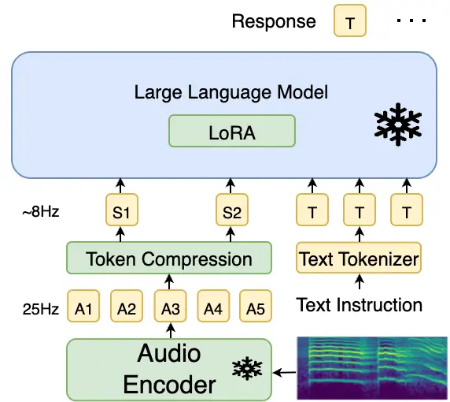
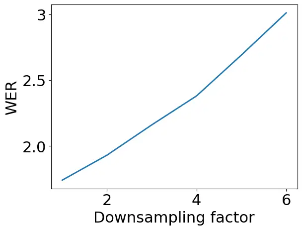
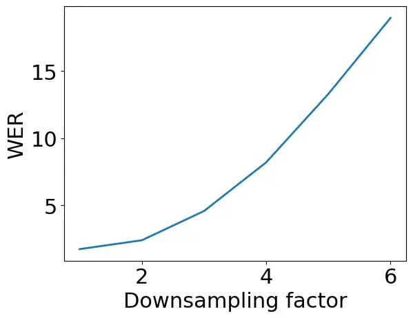

Bhati Thomas Kuehne Feris Glass

# Towards Audio Token Compression in Large Audio Language Models

Saurabhchand    Samuel    Hilde    Rogerio    James

^(†)^(†)address: ¹ MIT, USA  
²IBM Research  
³MIT-IBM Watson AI Lab  
⁴Tuebingen AI Center/University of Tuebingen^(†)^(†)email:
sbhati@mit.edu

## 1 Abstract

Large Audio Language Models (LALMs) deliver strong performance across
speech and audio tasks, but their audio encoders generate high-rate
token sequences (e.g., 25 tokens/s), making attention computation costly
and limiting scalability. In this paper, we explore techniques such as
unsupervised segmentation, uniform average pooling, etc., to reduce the
number of audio tokens before they are consumed by the LLM decoder. To
mitigate potential performance degradation, we employ low-rank adapters
during finetuning. We evaluate our proposed models on two tasks,
automatic speech recognition and speech-to-speech translation tasks,
that are dependent on effectively uncovering the underlying lexical
content of the input signal, and study the effect of downsampling on
these tasks. Experimental results show that compressed LALMs can achieve
performance closer to frame-level LALMs while reducing the input audio
token count up to three times before the LLM backbone.

## 2 Introduction

Audio is a primary medium of human communication and interaction, and a
rich understanding of audio signals is essential for building systems
that can engage naturally with humans and operate effectively in
real-world environments. Large Language Models (LLMs) \[10, 28, 3, 24,
36, 37\] extended with audio inputs, commonly referred to as Large Audio
Language Models (LALMs), have recently achieved remarkable success in
audio understanding and reasoning \[9, 17, 16, 30, 13, 6, 19, 11, 12,
14, 29\].

Figure 1: Overview of the audio token compression in large audio
language model. The compression module takes the output from the audio
encoder and compresses the audio tokens, which are fed into the LLM.

A typical LALM has the following components: (1) an audio encoder, often
a pretrained model such as Whisper, which extracts meaningful features
(or tokens) from the audio signal, (2) a language model backbone, which
reasons over these embeddings and generates a response, and (3)
optionally, a speech synthesizer to generate a spoken response.
Advancements in computation and the availability of vast amounts of
labeled data have enabled LALMs to achieve strong performance across a
wide range of audio tasks. However, the majority of the current LALMs
focus on short audio, typically 10 seconds, primarily because the audio
encoders produce features at a very high rate. For instance, a 10-second
audio clip, the audio encoder can yield around 500 features (50
features/second), resulting in extremely long sequences. Since
transformer-based LLMs scale quadratically with sequence length, such
long input sequences pose significant computational challenges.

Existing approaches attempt to mitigate this issue by either uniformly
pooling the audio features \[6, 12, 34, 29\] or transcribing speech into
text \[19\]. Uniform pooling (typically by a factor of two) reduces
token counts, but the number of audio tokens remains significantly
higher than that of text tokens. A significant token reduction can be
achieved by using the text transcription instead of the audio
embeddings. Transcription, however, discards important paralinguistic
information such as speaker identity, prosody, emotion, and
environmental context. Here, we explore unsupervised unit discovery,
uniform average pooling, and uniform downsampling to compress audio
tokens and reduce the number of audio tokens being sent to the LLM
backbone. We explore how these methods affect the recovery of the
underlying lexical content.

Unsupervised unit discovery aims to segment audio into acoustically
homogeneous units such as phone or word-like segments \[2, 7, 8, 31,
21\]. Segment boundaries can be used to merge frame-level features to
generate segment-level features. Prior work has shown that segment-level
features can achieve performance comparable to frame-level features in
phoneme classification, while requiring significantly fewer
features(tokens). Frameworks such as Segmental Contrastive Predictive
Coding \[2\] and variable-rate Contrastive Predictive Coding \[8\]
demonstrate the effectiveness of unsupervised boundary detection in
producing multiscale representations at both the frame and phone level.
We use unsupervised unit discovery to discover segments and generate
segmental audio features. These segmental features preserve the
underlying lexical while reducing the number of audio tokens before the
LLM.

While using the compressed audio tokens reduces the audio token count
substantially, the shift from frame-level to compressed representations
disrupts alignment between the audio embedding space and the language
model input space. To address this, we add low-rank adapters to the LLM
and finetune to restore alignment. Our experiments demonstrate that only
a small amount is sufficient to recover most of the performance of
frame-level LALMs. We benchmark our models on speech recognition and
speech-to-speech translation tasks using CommonVoice \[1\] 4 and
CoVoST \[32\] 2 datasets and show that we can achieve good performance
while reducing the number of tokens significantly. We chose these tasks
as they depend on discovering the underlying temporal lexical content
accurately. Some other tasks such as environment or speaker
classification might allow even more aggressive down-sampling.

## 3 Related Work

LLMs trained on large-scale text data achieve remarkable performance on
a wide variety of reasoning and understanding tasks. LLMs learn
general-purpose representations that can be aligned to a desired task
via instruction tuning \[35\]. Large Audio Language Models(LALMs) extend
LLMs beyond text to reason and understand speech and general audio.

Pengi \[9\] used a hierarchical transformer-based HTSAT \[4\] as the
audio encoder, CLIP text encoder, and GPT2 \[27\] as the LLM backbone.
SALMONN \[30\] uses dual encoders: a Whisper encoder to extract speech
information and a BEATs encoder \[5\] to extract non-speech audio
semantics information. The embeddings from the two encoders are
concatenated before the LLaMA LLM backbone. LTU \[17\] uses AST \[15\]
as the audio encoder and the LLaMA as the language model. LTU shows
free-form open-ended question-answering capabilities and outperforms the
existing LALMs on the closed-ended tasks. LTU-AS extended the LTU
framework beyond audio to jointly understand spoken text and non-speech
audio. LTU-AS used a Whisper encoder to extract audio representations
and the transcripts generated by the Whisper model as input to the LLaMA
backbone. AudioGPT \[19\] extended ChatGPT beyond text to handle complex
audio and speech tasks by using existing speech and audio models.
AudioGPT analyzes the user prompt and assigns a model based on the
prompt. For example, for the speech recognition task, whisper \[26\] is
used, whereas for sound detection, a Pyramid Transformer \[33\] is used.

GAMA \[13\] builds upon LTU and improves the audio embeddings. GAMA
combines the information extracted from various layers from AST via an
Audio Q-former instead of just using the output from the last AST layer.
GAMA also proposed and used an improved instruction tuning dataset to
improve complex reasoning. Qwen2-Audio \[6\] used a whisper
encoder \[26\] for encoding speech and audio data, and the Qwen2 LLM
backbone. Qwen2-Audio used massive amounts of speech, audio, and music
data and fully finetuned both the audio encoder and LLM backbone.
Qwen2-Audio achieved state-of-the-art performance on a wide variety of
audio and speech tasks, such as speech recognition, speech translation,
and audio and music understanding. Audio Flamingo (AF) \[23, 12, 14\]
models focused on improving the audio encoder representations and
improving the complex audio reasoning and understanding. AF2 \[12\]
trained an improved CLAP audio encoder to improve long audio
understanding. AF3 trained an AF-Whisper to improve Whisper performance
on audio and music-related tasks. AF3 \[14\] achieves state-of-the-art
performance on a wide variety of audio and speech benchmarks.

|                    |             |                          |      |             |      |      |      |      |      |      |                          |      |                    |      |      |
| ------------------ | ----------- | ------------------------ | ---- | ----------- | ---- | ---- | ---- | ---- | ---- | ---- | ------------------------ | ---- | ------------------ | ---- | ---- |
| tok/s (rel. flops) |             | ASR (WER $`\downarrow`$) |      |             |      |      |      |      |      |      | S2TT (BLEU $`\uparrow`$) |      |                    |      |      |
|                    |             | LibriSpeech              |      | CommonVoice |      |      |      |      |      | Avg  | X $`\rightarrow`$ en     |      | en$`\rightarrow`$X |      | Avg  |
|                    |             | t-c                      | t-o  | de          | en   | es   | fr   | it   | zh   |      | de                       | zh   | de                 | zh   |      |
| Q2A                | 25 (1)      | 1.7                      | 4.0  | 7.7         | 7.1  | 5.4  | 8.3  | 6.6  | 6.5  | 5.9  | 33.5                     | 23.9 | 29.6               | 45.5 | 33.1 |
| +LoRA              | 25 (1)      | 1.7                      | 3.9  | 7.7         | 7.0  | 5.4  | 8.2  | 6.6  | 5.5  | 5.8  | 33.9                     | 24.3 | 30.2               | 46.3 | 33.7 |
| UniAvg$`*`$        | 12.5 (0.62) | 8.0                      | 11.2 | 17.1        | 14.9 | 13.9 | 16.8 | 16.2 | 15.2 | 14.2 | 23.3                     | 14.8 | 21.3               | 33.7 | 23.3 |
| UniAvg$`*`$        | 8.33 (0.5)  | 29.8                     | 33.6 | 45.4        | 42.9 | 41.9 | 44.4 | 45.8 | 42.6 | 40.8 | 11.1                     | 6.9  | 8.6                | 16.0 | 10.7 |
| UniAvg             | 12.5 (0.62) | 1.9                      | 4.3  | 8.8         | 7.7  | 6.2  | 9.2  | 7.6  | 6.2  | 6.5  | 32.1                     | 22.6 | 29.0               | 44.4 | 32.0 |
| UniSamp            | 12.5 (0.62) | 2.4                      | 5.5  | 9.6         | 8.2  | 6.7  | 10.0 | 8.4  | 6.7  | 7.2  | 32.0                     | 22.9 | 28.8               | 44.3 | 32.0 |
| UniAvg             | 8.33 (0.5)  | 2.2                      | 4.9  | 9.7         | 8.2  | 6.9  | 10.1 | 8.6  | 6.8  | 7.2  | 31.1                     | 21.5 | 28.3               | 43.2 | 31.0 |
| UniSamp            | 8.33 (0.5)  | 4.6                      | 8.5  | 12.2        | 9.6  | 8.6  | 12.8 | 11.0 | 9.1  | 9.6  | 29.1                     | 19.6 | 27.0               | 41.9 | 29.4 |
| UnSeg              | 8.23 (0.51) | 2.7                      | 5.2  | 9.7         | 8.3  | 6.7  | 9.8  | 8.5  | 6.6  | 7.2  | 31.9                     | 22.7 | 28.7               | 43.8 | 31.8 |

Table 1: ASR and S2TT performance for different compression modules
added to Qwen2Audio (Q2A) LALM. t-c: test-clean, t-o: test-other,
UniAvg: Uniform average pooling, UniSamp: Uniform sampling, UnSeg:
Unsupervised Segmentation, $`*`$: No LoRA/no training

## 4 Audio token compression in large Audio Large Language Models

Audio Encoder: We use the audio encoder from the Qwen2-Audio
LALM \[34\], which is based on the Whisper-large v3 model \[26\]. To
preprocess the audio, we resample the audio to 16KHz and extract a
128-dimensional mel-spectrogram using a 25ms window and a 10ms stride.
Each feature in the spectrogram corresponds to a 10ms segment of the
audio signal, or approximately 100 features per second. In the end, a
pooling layer with a pooling rate of two is used to reduce the number of
audio features. The final features cover approximately 40ms of the
audio. The audio encoder generates 50 features per second.

Unsupervised Segmentation: We use a simple boundary detector proposed in
Segmental CPC \[2\]. The frames that belong to the same underlying unit
have higher similarity to each other, and if adjacent frames have low
similarity, then it might be an indicator of a segment change.
$`\mathbf{d}=(d_{1},d_{2},...,d_{L-1})`$ captures the dissimilarity
between two adjacent frames,
$`d_{t}=1-\mathrm{sim}(\mathbf{z}_{t},\mathbf{z}_{t+1})`$ where
$`\mathbf{z}_{t}`$ is the output of the audio encoder at t^(th) time
step and $`L`$ is the total number of features. To locate the segment
boundaries, we find the frame indexes with high similarities to their
neighbors. To achieve this, a simple peak detector is used. We define
$`p_{t}`$ as a peak if it is higher than both its left and right
neighbours, i.e., $`d_{t}>d_{t-1}`$ and $`d_{t}>d_{t+1}`$.

Local pooling: We uniformly downsample the audio features by a factor of
$`K`$ and generate $`25/K`$ features per second. We use the following
two methods: 1) Uniform average pooling: by using an average pool kernel
with $`K`$ kernel size and $`K`$ stride, 2) Uniform Sampling: By
uniformly sampling every $`K^{th}`$ feature frame from the audio
features.

Low-Rank Adapters: To re-align the modified audio embeddings and the LLM
embeddings space, we use Low Rank Adapters (LoRA) \[18\] to finetune the
LLM instead of finetuning the entire LLM. LoRA adds a small set of
learnable weights that can be decomposed into a product of two low-rank
matrices on top of the pre-trained LLM weights. The final LLM parameters
are the addition of the learned low-rank matrices and frozen LLM
parameters. This allows us to modify the LLM without learning all the
parameters directly. For Qwen2 LLM, we add LoRA adapters with rank 16
and $`\alpha=`$32 to the key and query projection layers in all the
attention layers. We do not add any adapters to the audio encoder. This
adds approximately 9M learnable parameters to the model.

## 5 Experiments

We use the Qwen2-Audio-7B \[6\] model and add token compression modules
to it. We experiment with uniform average pooling, uniform sampling, and
unsupervised segmentation as the compression modules.

We use LibriSpeech \[25\] and CommonVoice \[1\] version 4 datasets for
generating the training and evaluation data for the Automatic Speech
Recognition (ASR) task. We use English (en), Spanish (es), French (fr),
Italian (it), German (de), and Mandarin (zh) from the CommonVoice
dataset. We use the Covost2 dataset \[32\], specifically de, en, and zh,
and en translation pairs for generating training and evaluation data for
the speech-to-text translation (S2TT) task.

We train the models for approximately 5000 steps with a batch size of 5
per GPU. We also accumulate the gradients for 2 steps, and thus the
effective batch size is 40. We use a learning rate of 2e-4 and use 2000
warm-up steps. We use 4 A6000 GPUs for all our experiments. We train
0.1$`\%`$ of the model parameters via LoRA. During training, the output
label contains the language identifier followed by the ASR or S2TT
output. During the inference, the question contains the language id, and
the model is expected to return only the ASR or the S2TT outputs.

(a) UniAvg

(b) UniSamp

Figure 2: WER for UniAvg and UniSamp vs compression factors

### 5.1 Performance on ASR and S2TT task

We use the Qwen2-Audio model as the baseline, and as seen in Table 1,
the Qwen2-Audio model achieves strong performance on both ASR and S2TT
across all languages. We also train an improved Qwen2-Audio baseline
where we add LoRA and fine-tune the model on the training data. We
observe minimal improvement over the baseline performance. It is
possible that the Commonvoice and the Covost data are already included
in the training data for Qwen2-Audio, and further finetuning on these
datasets does not improve performance.

We then explore the impact of compressed tokens on model performance
without adding any LoRA modules or any finetuning. As shown in Table 1,
for both compression factor of 2 and 3, both the ASR and S2TT
performance degrades. For larger compression factors i.e. 3, the
degradation is severe, WER  40. and it renders the model useless. This
shows the importance of LoRA modules and realigning the compressed audio
embeddings and the LLM. As we discuss below, LoRA allows us to recover
most of the original model performance. Token compression also allows us
to reduce computation cost (relative flop count) of the model to half,
achievable with a compression factor of 3, without major performance
loss which is significant for model training and deployment.

As shown in Table 1, we can significantly reduce the token rate while
achieving strong performance on both tasks across all languages. For a
small increase in WER i.e., $`<1`$, we can reduce the number of audio
tokens in half. Reducing the number of tokens to a third further
increases the WER, but the WER increase is still pretty small, $`<1.5`$.
The uniform average pooling outperforms the uniform sampling in terms of
both WER and BLEU scores. Unsupervised segmentation outperforms uniform
sampling and performs slightly better than uniform average pooling.
Based on the results, token merging, either based on unsupervised
segmentation or uniform average, outperforms token sampling (or token
dropping). We hypothesize that averaging keeps the information, whereas
sampling loses some information.

Next, we explore how far we can push the compression rates. We vary the
compression rates for uniform sampling and uniform averaging. Figure 2
shows the impact of compression rate on the ASR performance on the
Librispeech dataset. For both the uniform average pooling and uniform
sampling, the error increases as the compression factor increases. The
WER increases significantly for the uniform sampling compared to the
uniform sampling, which further strengthens our hypothesis that audio
token merging is better than token sampling for compressing audio
tokens. For a uniform average, the error rate doubles while we can
reduce the number of audio tokens by a factor of six. The WER, even at a
very high compression rate, is still reasonably low. We can select a
desired compression factor depending on the trade-off between the
available computational resources and WER.

### 5.2 Does realignment on one language transfer to other languages

|             |                          |     |             |      |      |      |     |     |     |                          |      |                    |      |      |
| ----------- | ------------------------ | --- | ----------- | ---- | ---- | ---- | --- | --- | --- | ------------------------ | ---- | ------------------ | ---- | ---- |
|             | ASR (WER $`\downarrow`$) |     |             |      |      |      |     |     |     | S2TT (BLEU $`\uparrow`$) |      |                    |      |      |
|             | LibriSpeech              |     | CommonVoice |      |      |      |     |     | Avg | X $`\rightarrow`$ en     |      | en$`\rightarrow`$X |      | Avg  |
|             | t-c                      | t-o | de          | en   | es   | fr   | it  | zh  |     | de                       | zh   | de                 | zh   |      |
| Librispeech | 2                        | 4.4 | 14.0        | 12.1 | 10.9 | 14   | 13  | 8.8 | 9.9 | 24.9                     | 14.8 | 22                 | 34.4 | 24.0 |
| +CV_en      | 2.0                      | 4.4 | 9.9         | 8.1  | 7.1  | 10.6 | 8.9 | 6.8 | 7.2 | 25.0                     | 14.8 | 24.0               | 38.1 | 25.5 |
| +CV_all     | 2.1                      | 4.6 | 9.3         | 8.1  | 6.6  | 9.8  | 8.1 | 6.5 | 6.9 | 23.9                     | 14.5 | 23.8               | 37.9 | 25.0 |
| +covost     | 2.1                      | 4.8 | 9.7         | 8.2  | 6.8  | 10.1 | 8.5 | 6.7 | 7.1 | 31.1                     | 21.5 | 28.3               | 43.2 | 31.0 |

Table 2: Impact of training datasets on the performance with uniform
average pooling with compression factor$`=`$3

The Qwen2-Audio model supports multiple languages and tasks. Here, we
explore whether realigning in one language improves performance in other
languages. We begin by just using LibriSpeech (English) for training and
evaluating performance across other languages. As shown in Table 2,
using only the LibriSpeech dataset, the models perform reasonably well
across different languages. Next, we add English(en) from CommonVoice,
which further reduces the WER across all languages. We hypothesize that
training on English from CommonVoice datasets enables the model to learn
the CommonVoice distribution and perform better across all languages.
Adding training data from the other languages further reduces the WER on
all the languages and achieves the best performance.

### 5.3 Does realignment on one task transfer to other tasks

Previous experiments showed that training on a task, ASR, for example,
transfers across languages and improves performance on unseen languages.
In this section, we explore whether realignment on one task, i.e., ASR,
improves performance on other tasks such as S2TT.

We begin by training the model on the ASR task on the Librispeech
dataset. The model performs reasonably well on the speech-to-speech
translation task, Table 2. However, unlike the ASR task, adding
CommonVoice data, either from English or other languages, does not
improve performance on the S2TT task. Adding COVOST data or training the
model on the S2TT task yields the best performance.

### 5.4 Learnable compression modules

Instead of using average pooling as the compression module, we explore
if using a learnable layer leads to better performance. We use a
convolution layer for compressing the audio tokens. This significantly
increases the overall number of trainable parameters (0.14$`\%`$ and
0.16$`\%`$ for compression factor 2 and 3 respectively) but increases
the learning capacity of the compression module. As shown in Table 3,
using a learnable layer leads to worse performance. It is possible that
the trainable compression modules require more training which we plan to
explore in future.

Currently, the compression module is added after the audio encoder has
processed at audio and before the LLM backbone. We add the compression
module before the audio encoder which allows the audio encoder to
operate at compress tokens. This can further reduce the overall
computation used by the model. However, as seen in Table 3 the leads to
higher WER.

|                      |       |     |      |
| -------------------- | ----- | --- | ---- |
|                      | tok/s | t-c | t-o  |
| UniAvg               | 12.5  | 1.9 | 4.3  |
| Conv                 | 12.5  | 2.3 | 5.0  |
| UniAvg               | 8.33  | 2.2 | 4.9  |
| Conv                 | 8.33  | 2.4 | 5.2  |
| Before audio encoder | 12.5  | 2.5 | 6.6  |
| Before audio encoder | 8.33  | 9.3 | 23.4 |

Table 3: Using a learnable layer. conv: convolution layer.

### 5.5 Impact of WER on understanding and meaning

|         | tok/s | WER | meaning | readability | mpn  |
| ------- | ----- | --- | ------- | ----------- | ---- |
| Q2A     | 25    | 5.9 | 4.89    | 4.97        | 4.93 |
| UniSamp | 12.5  | 7.2 | 4.79    | 4.94        | 4.90 |
| UniAvg  | 12.5  | 6.5 | 4.88    | 4.95        | 4.91 |
| UniSamp | 8.33  | 9.6 | 4.44    | 4.90        | 4.79 |
| UniAvg  | 8.33  | 7.2 | 4.84    | 4.93        | 4.89 |
| UnSeg   | 8.23  | 7.2 | 4.83    | 4.93        | 4.89 |

Table 4: Average scores across meaning, readability, and misspelled
proper nouns (mpn)

LALMs are capable of understanding and reasoning over the input audio.
For many reasoning tasks, the exact transcription does not matter as
long as the meaning and the readability of the text are preserved. WER
penalizes all errors in the prediction equally, regardless of their
impact on the readability, meaning. Some other works have also focused
on humanizing the word error rate and have focused on evaluating the
readability and meaning \[22, 20\]. Instead of using human annotators,
we use ChatGPT to evaluate the predictions from the LALM and the
reference along the following three metrics:

- •
  meaning: Does the prediction change the meaning compared to the
  reference?
- •
  readability: Does the prediction affect readability compared to the
  reference?
- •
  misspelled proper nouns (mpn): Does the prediction misspell proper
  nouns that appear in the reference?

ChatGPT takes both prediction and reference as input and generates a
score between 1 and 5 for each of the three metrics. As seen from the
Table 4, for uniform average with compression factor 2 or 3 and for
unsupervised segmentation, even though the WER increases, the meaning
and readability do not decrease significantly. Only when the WER
increases significantly, for uniform sampling, does the meaning change,
and scores decrease significantly.

## 6 Conclusions and Future Work

In this paper, we explore token compression in large audio language
models to reduce the number of audio tokens generated by the audio
encoder. We use LoRA to align the compressed audio tokens to the LLM
embedding space. We can reduce the number of audio tokens by up to 3
times without significantly worsening the performance on the ASR and
S2TT tasks.

In the future, we would like to explore methods that do not require
training the model with additional LoRA weights for rebalancing the
attention weights. We would also like to benchmark the compressed LALMs
on other tasks, such as audio classification and understanding.

## 7 Generative AI Use Disclosure

Generative AI was only used for basic editing such as grammar checks and
improvements.

## References

- \[1\] R. Ardila, M. Branson, K. Davis, M. Henretty, M. Kohler, J.
  Meyer, R. Morais, L. Saunders, F. M. Tyers, and G. Weber Common voice:
  a massively-multilingual speech corpus. Cited by: §2, §5.
- \[2\] S. Bhati, J. Villalba, P. Zelasko, L. Moro-Velazquez, and N.
  Dehak (2021) Segmental contrastive predictive coding for unsupervised
  word segmentation. Cited by: §2, §4.
- \[3\] T. B. Brown (2020) Language models are few-shot learners. arXiv
  preprint arXiv:2005.14165. Cited by: §2.
- \[4\] K. Chen, X. Du, B. Zhu, Z. Ma, T. Berg-Kirkpatrick, and S.
  Dubnov (2022) HTS-at: a hierarchical token-semantic audio transformer
  for sound classification and detection. In ICASSP 2022-2022 IEEE
  International Conference on Acoustics, Speech and Signal Processing
  (ICASSP), pp. 646–650. Cited by: §3.
- \[5\] S. Chen, Y. Wu, C. Wang, S. Liu, D. Tompkins, Z. Chen, and F.
  Wei (2022) Beats: audio pre-training with acoustic tokenizers. arXiv
  preprint arXiv:2212.09058. Cited by: §3.
- \[6\] Y. Chu, J. Xu, Q. Yang, H. Wei, X. Wei, Z. Guo, Y. Leng, Y.
  Lv, J. He, J. Lin, et al. (2024) Qwen2-audio technical report. arXiv
  preprint arXiv:2407.10759. Cited by: §2, §2, §3, §5.
- \[7\] S. Cuervo, M. Grabias, J. Chorowski, G. Ciesielski, A.
  Lańcucki, P. Rychlikowski, and R. Marxer (2022) Contrastive prediction
  strategies for unsupervised segmentation and categorization of
  phonemes and words. In ICASSP 2022-2022 IEEE International Conference
  on Acoustics, Speech and Signal Processing (ICASSP), pp. 3189–3193.
  Cited by: §2.
- \[8\] S. Cuervo, A. Lancucki, R. Marxer, P. Rychlikowski, and J. K.
  Chorowski (2022) Variable-rate hierarchical cpc leads to acoustic unit
  discovery in speech. Advances in Neural Information Processing Systems
  35, pp. 34995–35006. Cited by: §2.
- \[9\] S. Deshmukh, B. Elizalde, R. Singh, and H. Wang (2023) Pengi: an
  audio language model for audio tasks. Advances in Neural Information
  Processing Systems 36, pp. 18090–18108. Cited by: §2, §3.
- \[10\] J. Devlin (2018) Bert: pre-training of deep bidirectional
  transformers for language understanding. arXiv preprint
  arXiv:1810.04805. Cited by: §2.
- \[11\] D. Ding, Z. Ju, Y. Leng, S. Liu, T. Liu, Z. Shang, K. Shen, W.
  Song, X. Tan, H. Tang, et al. (2025) Kimi-audio technical report.
  arXiv preprint arXiv:2504.18425. Cited by: §2.
- \[12\] S. Ghosh, Z. Kong, S. Kumar, S. Sakshi, J. Kim, W. Ping, R.
  Valle, D. Manocha, and B. Catanzaro (2025) Audio flamingo 2: an
  audio-language model with long-audio understanding and expert
  reasoning abilities. arXiv preprint arXiv:2503.03983. Cited by: §2,
  §2, §3.
- \[13\] S. Ghosh, S. Kumar, A. Seth, C. K. R. Evuru, U. Tyagi, S.
  Sakshi, O. Nieto, R. Duraiswami, and D. Manocha (2024) GAMA: a large
  audio-language model with advanced audio understanding and complex
  reasoning abilities. arXiv preprint arXiv:2406.11768. Cited by: §2,
  §3.
- \[14\] A. Goel, S. Ghosh, J. Kim, S. Kumar, Z. Kong, S. Lee, C. H.
  Yang, R. Duraiswami, D. Manocha, R. Valle, et al. (2025) Audio
  flamingo 3: advancing audio intelligence with fully open large audio
  language models. arXiv preprint arXiv:2507.08128. Cited by: §2, §3.
- \[15\] Y. Gong, Y. Chung, and J. Glass (2021) Ast: audio spectrogram
  transformer. arXiv preprint arXiv:2104.01778. Cited by: §3.
- \[16\] Y. Gong, A. H. Liu, H. Luo, L. Karlinsky, and J. Glass (2023)
  Joint audio and speech understanding. In 2023 IEEE Automatic Speech
  Recognition and Understanding Workshop (ASRU), pp. 1–8. Cited by: §2.
- \[17\] Y. Gong, H. Luo, A. H. Liu, L. Karlinsky, and J. Glass (2023)
  Listen, think, and understand. arXiv preprint arXiv:2305.10790. Cited
  by: §2, §3.
- \[18\] E. J. Hu, Y. Shen, P. Wallis, Z. Allen-Zhu, Y. Li, S. Wang, L.
  Wang, and W. Chen (2021) Lora: low-rank adaptation of large language
  models. arXiv preprint arXiv:2106.09685. Cited by: §4.
- \[19\] R. Huang, M. Li, D. Yang, J. Shi, X. Chang, Z. Ye, Y. Wu, Z.
  Hong, J. Huang, J. Liu, et al. (2024) Audiogpt: understanding and
  generating speech, music, sound, and talking head. In Proceedings of
  the AAAI Conference on Artificial Intelligence, Vol. 38,
  pp. 23802–23804. Cited by: §2, §2, §3.
- \[20\] (2024) Humanizing word error rate for asr transcript
  readability and accessibility. Note:
  https://machinelearning.apple.com/research/humanizing-wer Cited by:
  §5.5.
- \[21\] H. Kamper, K. Livescu, and S. Goldwater (2017) An embedded
  segmental k-means model for unsupervised segmentation and clustering
  of speech. In 2017 IEEE automatic speech recognition and understanding
  workshop (ASRU), pp. 719–726. Cited by: §2.
- \[22\] S. Kim, D. Le, W. Zheng, T. Singh, A. Arora, X. Zhai, C.
  Fuegen, O. Kalinli, and M. L. Seltzer (2021) Evaluating user
  perception of speech recognition system quality with semantic distance
  metric. arXiv preprint arXiv:2110.05376. Cited by: §5.5.
- \[23\] Z. Kong, A. Goel, R. Badlani, W. Ping, R. Valle, and B.
  Catanzaro (2024) Audio flamingo: a novel audio language model with
  few-shot learning and dialogue abilities. arXiv preprint
  arXiv:2402.01831. Cited by: §3.
- \[24\] L. Ouyang, J. Wu, X. Jiang, D. Almeida, C. Wainwright, P.
  Mishkin, C. Zhang, S. Agarwal, K. Slama, A. Ray, et al. (2022)
  Training language models to follow instructions with human feedback.
  Advances in neural information processing systems 35, pp. 27730–27744.
  Cited by: §2.
- \[25\] V. Panayotov, G. Chen, D. Povey, and S. Khudanpur (2015)
  Librispeech: an asr corpus based on public domain audio books. In 2015
  IEEE international conference on acoustics, speech and signal
  processing (ICASSP), pp. 5206–5210. Cited by: §5.
- \[26\] A. Radford, J. W. Kim, T. Xu, G. Brockman, C. McLeavey, and I.
  Sutskever (2023) Robust speech recognition via large-scale weak
  supervision. In International conference on machine learning,
  pp. 28492–28518. Cited by: §3, §3, §4.
- \[27\] A. Radford, J. Wu, R. Child, D. Luan, D. Amodei, I. Sutskever,
  et al. (2019) Language models are unsupervised multitask learners.
  OpenAI blog 1 (8), pp. 9. Cited by: §3.
- \[28\] C. Raffel, N. Shazeer, A. Roberts, K. Lee, S. Narang, M.
  Matena, Y. Zhou, W. Li, and P. J. Liu (2020) Exploring the limits of
  transfer learning with a unified text-to-text transformer. Journal of
  machine learning research 21 (140), pp. 1–67. Cited by: §2.
- \[29\] A. Rouditchenko, S. Bhati, E. Araujo, S. Thomas, H. Kuehne, R.
  Feris, and J. Glass (2025) Omni-r1: do you really need audio to
  fine-tune your audio llm?. arXiv preprint arXiv:2505.09439. Cited by:
  §2, §2.
- \[30\] C. Tang, W. Yu, G. Sun, X. Chen, T. Tan, W. Li, L. Lu, Z. Ma,
  and C. Zhang (2023) Salmonn: towards generic hearing abilities for
  large language models. arXiv preprint arXiv:2310.13289. Cited by: §2,
  §3.
- \[31\] B. Van Niekerk, L. Nortje, and H. Kamper (2020)
  Vector-quantized neural networks for acoustic unit discovery in the
  zerospeech 2020 challenge. arXiv preprint arXiv:2005.09409. Cited by:
  §2.
- \[32\] C. Wang, A. Wu, and J. Pino (2020) Covost 2 and massively
  multilingual speech-to-text translation. arXiv preprint
  arXiv:2007.10310. Cited by: §2, §5.
- \[33\] Y. Xin, D. Yang, and Y. Zou (2022) Audio pyramid transformer
  with domain adaption for weakly supervised sound event detection and
  audio classification.. In INTERSPEECH, pp. 1546–1550. Cited by: §3.
- \[34\] J. Xu, Z. Guo, J. He, H. Hu, T. He, S. Bai, K. Chen, J.
  Wang, Y. Fan, K. Dang, et al. (2025) Qwen2. 5-omni technical report.
  arXiv preprint arXiv:2503.20215. Cited by: §2, §4.
- \[35\] S. Zhang, L. Dong, X. Li, S. Zhang, X. Sun, S. Wang, J. Li, R.
  Hu, T. Zhang, F. Wu, et al. (2023) Instruction tuning for large
  language models: a survey. arXiv preprint arXiv:2308.10792. Cited by:
  §3.
- \[36\] S. Zhang, S. Roller, N. Goyal, M. Artetxe, M. Chen, S. Chen, C.
  Dewan, M. Diab, X. Li, X. V. Lin, et al. (2022) Opt: open pre-trained
  transformer language models. arXiv preprint arXiv:2205.01068. Cited
  by: §2.
- \[37\] W. X. Zhao, K. Zhou, J. Li, T. Tang, X. Wang, Y. Hou, Y.
  Min, B. Zhang, J. Zhang, Z. Dong, et al. (2023) A survey of large
  language models. arXiv preprint arXiv:2303.18223. Cited by: §2.
