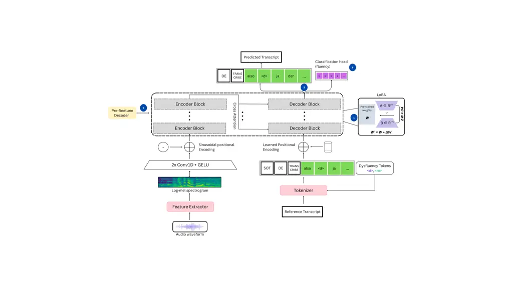

# On the Difficulty of Token-Level Modeling of Dysfluency and Fluency Shaping Artifacts

Kashaf Gulzar¹, Dominik Wagner¹, Sebastian P. Bayerl², Florian Hönig³,
Tobias Bocklet¹,  
Korbinian Riedhammer¹ Affiliation:  Affiliation: ¹Technische Hochschule
Nürnberg Georg Simon Ohm, Germany  
²Technische Hochschule Rosenheim, Germany  
³KST Institut GmbH, Germany  
kashaf.gulzar@th-nuernberg.de

###### Abstract

Automatic transcription of stuttered speech remains a challenge, even
for modern end-to-end (E2E) automatic speech recognition (ASR)
frameworks. Dysfluencies and fluency-shaping artifacts are often
overlooked, resulting in non-verbatim transcriptions with limited
clinical and research value. We propose a parameter-efficient adaptation
method to decode dysfluencies and fluency modifications as special
tokens within transcriptions, evaluated on simulated (LibriStutter,
English) and natural (KSoF, German) stuttered speech datasets. To
mitigate ASR performance disparities and bias towards English, we
introduce a multi-step fine-tuning strategy with language-adaptive
pretraining. Tokenization analysis further highlights the tokenizer’s
English-centric bias, which poses challenges for improving performance
on German data. Our findings demonstrate the effectiveness of
lightweight adaptation techniques for dysfluency-aware ASR while
exposing key limitations in multilingual E2E systems.

###### Index Terms: 

stuttering, speech recognition, dysfluency detection, pathological
speech, computational paralinguistics

## I Introduction

In recent years, end-to-end (E2E) automatic speech recognition (ASR)
systems have achieved remarkable performance on fluent speech with up to
95% word accuracy \[1\]. However, these large ASR models continue to
struggle with stuttered speech with high word error rates (WER) and poor
handling of dysfluency events \[2\]. Unlike typical spontaneous speech,
stuttering is characterized by sound and word repetitions,
prolongations, silent blocks, and interjections \[2, 3\]. ASR models are
trained on large amounts of fluent and well-structured speech, expecting
smooth transitions between phonetic units and grammatically plausible
token sequences. Dysfluency patterns disrupt the statistical and
structural assumptions these models rely on, leading to alignment
issues, unstable decoding and recognition errors \[2, 4\].

Moreover, individuals receiving speech therapy frequently adopt fluency
shaping techniques designed to suppress dysfluencies. These include
altered articulation patterns such as soft onsets, prolonged phonation
and continuous airflow \[5\]. While effective clinically, this modified
speech introduces atypical acoustic and prosodic cues that further
challenge standard ASR pipelines.

Research addressing stuttered speech in ASR can be broadly categorized
into two areas. Therapy-related work focuses on detecting, classifying,
and analyzing dysfluency events to support clinical assessment and
therapy outcomes \[6\]. In contrast, accessibility-oriented work aims to
improve WER and downstream performance in tasks such as voice assistants
and transcription systems, typically by adapting ASR models or
post-processing outputs \[3\].

Early systems extended hidden Markov model (HMM) topologies to model
repetitions, prolongations and silent blocks during decoding \[7\].
Subsequently weighted finite state transducer (WFST) based DNN-HMM
systems improved dysfluent speech handling by incorporating sub-word
modeling into the decoding graph, enabling better recognition of partial
or fragmented words \[8\]. A widely used modern approach detects
dysfluencies by post-processing ASR outputs as a sequence labeling task
\[9, 10, 11, 12\] Alternatively, recent E2E ASR architectures such as
RNN-T and Whisper have explored joint modeling strategies, predicting
both transcriptions and dysfluencies within a unified framework \[13,
14, 15, 16, 17, 3\]. Additionally, other works have fine-tuned
pre-trained ASR models to better recognize unfinished or partial words,
further enhancing recognition accuracy on dysfluent speech \[18\].
Wagner et al. leverage parameter-efficient fine-tuning through low-rank
adaptation (LoRA), which preserves more of the model’s original
knowledge \[19\] and has shown strong performance in adapting large
language models to classifying stuttering in speech segments \[20\].
While these approaches typically detect dysfluencies at the transcript
level, they often neglect precise temporal information (location), which
is critical for applications like speech therapy or conversational
analysis \[21\].

Despite these advances, progress in dysfluency modeling remains limited
due to lack of a well-defined problem formulation and high-quality,
token-level annotated dysfluency and fluency shaping modifications data
especially in multilingual contexts. In this work, we address these
limitations by integrating transcriptions and dysfluency detection
within a token-level modeling framework that can capture standard speech
tokens and markers for dysfluencies and fluency shaping artifacts. To
this end, we conduct our experiments on two publicly available datasets:
LibriStutter (LSS) and the Kassel State of Fluency (KSoF) datasets,
which contain annotated instances of dysfluencies and fluency
modifications in English and German. Our contributions are:

- •
  We perform parameter-efficient fine-tuning of ASR for token-level
  modeling of dysfluencies and fluency shaping artifacts on LSS and
  KSoF.
- •
  We show that multi-step fine-tuning can reduce language-specific ASR
  biases and improve recognition performance across languages.
- •
  We explore multi-task learning for ASR by modeling fluency-shaping as
  token-level binary classification, capturing acoustic modifications
  that can not be represented by discrete tokens.
- •
  We identify English-centric tokenization bias that limits recognition
  accuracy in multilingual ASR.

## II Data

The LibriStutter (LSS) dataset is a synthetic derivative of 20 hours of
the dev-clean-100 partition of LibriSpeech (LS), featuring simulated
stuttering events \[13\]. However, LSS transcripts are non-verbatim,
inserting a STUTTER token (along with its type and duration) where a
stuttering event occurs. For consistency, transcriptions were
pre-processed by replacing each STUTTER token with a \<d\> marker at the
corresponding word position (cf. Table I).

The Kassel State of Fluency (KSoF) dataset contains around 5,500
three-second segments recorded during speech therapy sessions in
Germany, capturing both natural dysfluencies and fluency shaped speech
\[22\]. In this work, we use the utterance-level segmented version of
the complete dataset. Transcriptions are meticulously annotated by a
speech therapist, providing verbatim text with precise timestamps for
dysfluencies and modifications. The dataset comprised of 1,446
utterances, of which 586 (40.5%) contained at least one dysfluency token
and 509 (35.2%) contained at least one modified speech token. In
pre-processing, the transcriptions were forced-aligned to audio using a
DNN-HMM system and time-based markers were inserted into the text as
special tokens placed after the corresponding word: \<d\> indicating a
dysfluency event and \<m\> marking fluency-shaped speech (cf. Table I).

The German partition of Voxpopuli (VP) dataset contains 200 hours of
formal, naturally fluent European parliamentary speeches \[23\]. Despite
being composed of fluent speech, it serves as a valuable resource for
fine-tuning ASR models and addressing language-based biases.

| Dataset | Type      | Example Transcription                                       |
| ------- | --------- | ----------------------------------------------------------- |
| LSS     | Synthetic | and it may be true replied \<d\> edward mournfully well     |
| KSoF    | Natural   | also \<d\> ja \<d\> der m- moment \<m\> der \<m\> mir       |
| VP      | Natural   | das beweisen die ergebnisse unserer namentlichen abstimmung |

TABLE I: Summary of datasets with example transcriptions after
pre-processing. The \<d\> and \<m\> encode the dysfluency and modified
speech markers.

## III Method

The overall system architecture employs Whisper as the ASR backbone and
implements parameter efficient fine-tuning using LoRA as illustrated in
Fig. 1. Specifically, we utilize openai/whisper-large-v3-turbo, a pruned
and fine-tuned 809M-parameter variant of the 1.55B-parameter Whisper V3
model. Whisper is a state-of-the-art ASR and speech translation system
trained on over 5 million hours of weakly labeled multilingual data
\[24\]. The large-v3-turbo variant retains the original encoder but
reduces the number of decoder layers from 32 to 4, significantly
improving inference speed with only a minor degradation in performance.



Fig. 1: System architecture for parameter-efficient fine-tuning of
Whisper using LoRA adapters. Numbered markers indicate experimental
variants: (1) LoRA fine-tuning for predicting \<d\> and \<m\> tokens;
(2) the same, applied to a VoxPopuli-adapted model; (3) simultaneous
fine-tuning for \<d\> prediction and \<m\> classification with a
combined loss; (4) sequential fine-tuning for \<d\> prediction followed
by \<m\> classification, each with separate losses.

To achieve further parameter and computational efficiency, we adopt LoRA
for fine-tuning. LoRA inserts trainable low-rank matrices into the
attention and feedforward modules of the pre-trained transformer while
keeping the base model parameters frozen \[25\]. This enables efficient,
task-specific adaptation by reducing the number of trainable parameters
and the associated computational overhead. During training, the weights
of the pre-trained Whisper model remain frozen and LoRA modules are
optimized instead.

Whisper’s tokenizer employs byte-level Byte-Pair Encoding (BPE) that
converts text into a sequence of subword tokens. This strategy offers
robustness for multilingual ASR by converting each transcript into a
sequence of BPE subword units, where frequently occurring character
sequences are represented as individual tokens while rare or
out-of-vocabulary words are decomposed into smaller subword fragments
\[24\]. To explicitly model dysfluencies and fluency-shaping artifacts
within transcriptions, we extend Whisper’s tokenizer by adding two
special tokens: \<d\> for dysfluencies and \<m\> for fluency-shaped or
modified speech. These tokens are inserted into the reference
transcriptions during pre-processing (cf. Table I) and learned during
training of the model.

In all experiments, the model is trained in an auto-regressive manner to
predict the next token in the sequence, given the acoustic context,
using a cross-entropy loss:

```math
\mathcal{L}=-\sum_{t=1}^{T}\log P(y_{t}\mid x_{1:T},y_{1:t-1};\theta), \tag{1}
```

where $`x_{1:T}`$ denotes the input acoustic features, $`y_{1:T}`$
represents the target token sequence (including \<d\> and \<m\> tokens),
and $`\theta`$ are the trainable parameters of the encoder.

Fine-tuning is performed for three epochs on a single NVIDIA A100 80GB
GPU using 16-bit precision. We utilize the Adafactor \[26\] optimizer
along with a cosine learning rate schedule \[27\] and a peak learning
rate of $`2\cdot 10^{-5}`$. The learning rate is warmed up for 500 steps
with evaluation performed at the end of each epoch. Greedy decoding is
used in all experiments. LoRA modules are configured with a rank
$`r=64`$, a scaling factor for adjusting the magnitude of the adaption
$`\alpha=16`$, and a dropout probability of 10%.

## IV Experiments

The goal of our experiments is to improve transcription accuracy while
also enabling a more detailed analysis of speech patterns (dysfluencies
and fluency shaping artifacts) relevant to stuttering therapy. Four
distinct experimental configurations are explored (cf Fig. 1):

1.  (1)
    LoRA fine-tuning for \<d\> and \<m\> Token Prediction: Tokenizer is
    extended by adding \<d\> and \<m\> tokens. LoRA adapters are then
    fine-tuned for predicting these special tokens within the
    transcript.
2.  (2)
    Multi-step fine-tuning: To address language-based ASR biases, the
    decoder is first trained on VP German dataset and then LoRA modules
    are fine-tuned to predict \<d\> and \<m\> tokens as in (1).

At this stage, both dysfluencies and fluency-shaped speech are modeled
through token prediction. However, fluency shaping typically manifests
through subtle acoustic modifications rather than distinct lexical
units, and thus cannot be fully captured by token-based modeling alone.
Consequently, we differentiate our modeling strategy in experiments 3
and 4: dysfluencies are handled as explicit token predictions within the
transcription sequence, but modified speech is modeled via token-level
binary classification over the decoder’s hidden representations.

1.  (3)
    Simultaneous fine-tuning for \<d\> prediction and \<m\>
    classification: LoRA modules are fine-tuned for \<d\> token
    prediction, while auxiliary classification head is added for binary
    \<m\> prediction. Both tasks are optimized simultaneously through a
    combined loss.
2.  (4)
    Sequential fine-tuning for \<d\> prediction and \<m\>
    classification: A two-step fine-tuning scheme, where LoRA adapters
    are first fine-tuned for \<d\> token prediction within transcripts,
    followed by a second stage where a classification head is trained
    with a separate binary loss to predict \<m\> tokens.

We train separate models for LSS and KSoF, varying the inclusion of
\<d\> and \<m\> tokens to analyze their impact on transcription
performance. Due to differences in speaking style and degree of
naturalness between LSS (read speech, synthetic) and KSoF
(conversational therapy speech, natural), cross-corpus evaluation was
not conducted. To the best of our knowledge, this is the first study to
perform parameter efficient token-level modeling of dysfluencies and
binary classification for fluency shaping artifacts in ASR.

### IV-A Token-level Dysfluency and Modified Speech Modeling

The performance comparison of LoRa fine-tuning for \<d\> and \<m\>
tokens with and without training on VoxPopuli German dataset for
language adaptation is summarized in Table II.

|          |       |     |     |      |       |                             |
| -------- | ----- | --- | --- | ---- | ----- | --------------------------- |
| Exp.     | Train | d   | m   | Test | WER   | $`\text{WER}_{\text{tok}}`$ |
| Baseline |       |     |     | LSS  | 0.289 |                             |
|          |       |     |     | KSoF | 0.311 |                             |
| 1        | LSS   | ✓   |     | LSS  | 0.240 | 0.232                       |
|          | KSoF  | ✓   |     | KSoF | 0.242 | 0.232                       |
|          | KSoF  | ✓   | ✓   | KSoF | 0.335 | 0.286                       |
| 2a       | KSoF  | ✓   | ✓   | KSoF | 0.320 | 0.273                       |
| 2b       | KSoF  | ✓   | ✓   | KSoF | 0.285 | 0.247                       |

TABLE II: Token-level dysfluency and modified speech modeling results.
Fine-tuning includes tokens representing dysfluencies (d) and/or
modified speech (m). $`\text{WER}_{\text{tok}}`$ includes dysfluency and
modification tokens; results computed using 5-fold cross-validation.

WER and $`\text{WER}_{\text{tok}}`$ are reported, where WER is computed
on standard transcriptions without dysfluency tokens and
$`\text{WER}_{\text{tok}}`$ includes the \<d\> and \<m\> tokens in both
predictions and references. All results are averaged over 5-fold
cross-validation.

Baseline results demonstrate that the non-finetuned Whisper model
struggles on both LSS and KSoF, underscoring the persistent challenges
ASR systems face when handling dysfluent and fluency-modified speech.
Fine-tuning with LoRA adapters for dysfluency token prediction
(Experiment 1) resulted in substantial WER improvements on both
datasets. When trained and evaluated on LSS, WER dropped from 0.289 to
0.240, with a corresponding $`\text{WER}_{\text{tok}}`$ of 0.232. A
similar pattern was observed for KSoF, where WER reduced from 0.311 to
0.242. However, adding both \<d\> and \<m\> tokens for KSoF increased
WER to 0.335, suggesting that simultaneous modeling of dysfluency and
modification tokens introduces additional complexity, affecting
transcription accuracy.

Interestingly, multi-step fine-tuning incorporating language adaptation
on VoxPopuli German (Experiments 2a and 2b) mitigated this performance
drop. In Experiment 2a, the Whisper decoder was first fine-tuned on the
VoxPopuli German dataset for language adaptation, followed by LoRA
fine-tuning on KSoF. This setup improved WER to 0.320 and
$`\text{WER}_{\text{tok}}`$ to 0.273. In Experiment 2b, a further
enhancement was introduced by fine-tuning the Whisper decoder on
VoxPopuli and a subset of KSoF before LoRA fine-tuning on the remaining
KSoF set. This resulted in the strongest performance, reducing WER to
0.285 and $`\text{WER}_{\text{tok}}`$ to 0.247, outperforming both
direct fine-tuning (Exp. 1) and the two-stage adaptation in 2a.

The consistent differences between $`\text{WER}_{\text{tok}}`$ and WER
suggest that the model recognizes and integrates dysfluency and
modification tokens appropriately within transcriptions. These results
confirm the effectiveness of parameter-efficient LoRA fine-tuning for
token-level dysfluency modeling and demonstrate that multi-step
fine-tuning leveraging language-adaptive pretraining, particularly when
incorporating in-domain data early (as in 2b), can improve both
transcription and token placement accuracy.

### IV-B Multi-task Learning for Token Prediction and Fluency Classification

The results of multi-task modeling approaches combining token-level
dysfluency prediction with binary classification of modified speech are
presented in Table III. $`\text{WER}_{\text{tok}}`$ is computed for
speech and \<d\> tokens while, accuracy and F1 scores are reported for
modified speech classification.

| Exp.     | Config | WER   | $`\text{WER}_{\text{tok}}`$ | Mod. Acc | Mod. F1 |
| -------- | ------ | ----- | --------------------------- | -------- | ------- |
| Baseline |        | 0.311 |                             | 0.699    | 0.436   |
| 3        | Simul. | 0.743 | 0.778                       | 0.818    | 0.534   |
| 4        | Seq.   | 0.214 | 0.227                       | 0.779    | 0.498   |

TABLE III: Performance comparison of multi-task learning for token
prediction and modified speech classification.
$`\text{WER}_{\text{tok}}`$ = WER including dysfluency tokens, Mod =
Modified speech, Acc = accuracy, F1 = F1 score, Simul = Simultaneous,
Seq = Sequential. Results are computed using 5-fold cross validation.

As expected, the non-finetuned Whisper model shows limited performance,
with a WER of 0.311, modified speech accuracy of 0.699, and a relatively
low F1 score of 0.436, reflecting its inability to reliably detect
fluency-shaped modifications. In Experiment 3, where token prediction
and modified speech classification were optimized simultaneously, WER
increased substantially to 0.743, suggesting interference between the
two tasks during combined optimization. However, this configuration
achieved the highest modification accuracy of 0.818 and an F1 score of
0.534, indicating improved identification of fluency-shaped segments
despite overall transcription degradation.

In contrast, Experiment 4, which employed a sequential fine-tuning
strategy, first fine-tuning LoRA adapters for dysfluency token
prediction followed by training a classification head for fluency
modifications, produced the strongest overall performance. WER was
reduced to 0.214 and $`\text{WER}_{\text{tok}}`$ to 0.227. While
modification accuracy slightly decreased to 0.779 compared to the
simultaneous setup, this sequential approach achieved a more balanced
trade-off, with a higher overall transcription accuracy and a F1 score
of 0.498 for fluency modification detection.

These results indicate that separating the optimization of token
prediction and modification classification tasks helps avoid task
interference, ultimately improving both transcription quality and
modification detection.

### IV-C Tokenization Bias Analysis

To better understand the persistent performance gap observed in ASR
results, particularly on the German KSoF dataset, we conducted a
tokenization bias analysis, summarized in Table IV. This evaluation
aimed to quantify how the underlying tokenizer, presumably predominantly
trained on English data, handles German speech containing dysfluencies
and modified segments.

|                                                   |        |                                                                        |               |                 |
| ------------------------------------------------- | ------ | ---------------------------------------------------------------------- | ------------- | --------------- |
| Dataset                                           |        | Content                                                                | TER           | TOP \[%\]       |
| LSS                                               | Text   | and it may be true replied \<d\> edward mournfully well                | 0.106 (0.097) | 8.994 (6.676)   |
|                                                   | Tokens | and, it, may, be, true, replied, \<d\>, ed, ward, mour, n, fully, well |               |                 |
| KSoF                                              | Text   | ihn \<d\> ähm \<d\> so \<m\> zu sprechen                               | 0.389 (0.392) | 23.792 (16.187) |
|                                                   | Tokens | ihn, \<d\>, ä, hm, \<d\>, so, \<m\>, zu, sprechen                      |               |                 |
| Values are expressed as mean (standard deviation) |        |                                                                        |               |                 |

TABLE IV: Example transcripts with tokenized outputs and tokenization
bias metrics across datasets. Tokenization Error Rate (TER) reports the
average number of extra tokens per word, while the Token Overestimation
Percentage (TOP) reflects the percentage of excess tokens relative to
the total token count. The \<d\> and \<m\> encode the dysfluency and
modified speech markers.

To quantify tokenization bias in ASR models, we define two evaluation
metrics:

Tokenization Error Rate (TER) measures the number of excess tokens
generated relative to the number of words in the reference transcript,
indicating the average number of extra tokens produced per word:

```math
\text{TER}=\frac{N_{\text{extra tokens}}}{N_{\text{words}}} \tag{2}
```

Token Overestimation Percentage (TOP) captures the proportion of all
produced tokens that are considered redundant, i.e., additional tokens
beyond the expected number of tokens based on the reference:

```math
\text{TOP}=\frac{N_{\text{extra tokens}}}{N_{\text{tokens}}}\times 100 \tag{3}
```

where:

- •
  $`N_{\text{extra tokens}}`$ is the number of additional subword tokens
  generated by the ASR system compared to a verbatim reference.
- •
  $`N_{\text{words}}`$ is the number of words in the reference
  transcription.
- •
  $`N_{\text{tokens}}`$ is the total number of tokens produced by the
  ASR model for a given utterance.

As expected, the TER and TOP were substantially higher for KSoF compared
to LSS dataset. Specifically, KSoF exhibited a mean TER of 0.389 and TOP
of 23.79%, compared to 0.106 TER and 8.99% TOP for LSS. This indicates
that, on average, the ASR system produces significantly more excess
tokens per word for German speech than English speech. Example
transcripts in Table IV further illustrate this issue.

While most English words in LSS are preserved as whole tokens, German
words, especially those containing dysfluencies (\<d\>) and characters
like umlauts (ß, ä, ö, and ü), or diphtongs (ei, au, eu) are frequently
over-segmented into multiple subword tokens– typically _not_ coninciding
with phonetic boundaries. This behavior reflects the tokenizer’s
English-centric vocabulary and segmentation patterns, leading to
over-fragmentation of German utterances.

These findings explain why fine-tuning alone does not yield substantial
WER improvements on KSoF: even with additional task supervision, the
underlying tokenization process introduces a structural mismatch that
hinders learning and thus accurate transcription. This highlights a
fundamental limitation in multilingual E2E ASR systems where
English-centric tokenizers create persistent barriers for other
languages, particularly in specialized domains like fluency disorder
therapy.

## V Discussion

Our results show that parameter-efficient fine-tuning using LoRA
adapters, with dysfluency and modified speech tokens enhances ASR
performance on both LSS and KSoF. While Wagner et al. \[20\]
demonstrated the effectiveness of LoRA for adapting large language
models to classify disfluent segments, our findings extend this to
multilingual E2E ASR, highlighting its potential for token-level
dysfluency-aware transcription in an event-based manner. Improvements in
$`\text{WER}_{\text{tok}}`$ suggest the model can learn to recognize and
correctly position these specialized tokens, though overall WER
improvements on KSoF remain limited.

The multi-task learning experiments indicate that sequential
optimization is more effective than simultaneous, likely due to the
complexity of handling spontaneous speech and multiple objectives within
a single decoding pass.

Tokenization analysis reveals a deeper limitation: the Whisper
tokenizer’s English-centric design leads to over-segmentation of German
utterances, particularly around dysfluencies. This persistent mismatch
between tokenization and language structure undermines transcription
accuracy, even after fine-tuning.

Addressing these issues will require tokenization-aware modeling
strategies and more adaptable, parameter-efficient fine-tuning
approaches. For instance, Liu et al. proposed a parameter-efficient
language extension framework for multilingual ASR, which could be
explored in this context \[28\]. Focusing updates on dysfluency tokens
or integrating language-specific tokenizers could help overcome current
barriers in multilingual ASR for specialized clinical domains.

## VI Conclusion

We explored the challenges of token-level modeling for dysfluency and
fluency-shaping artifacts in multilingual ASR systems. By introducing
parameter-efficient fine-tuning with dysfluency and modified speech
tokens, we improved event detection and token placement accuracy in both
synthetic and natural stuttered speech, particularly reflected in
$`\text{WER}_{\text{tok}}`$ reductions. However, overall WER
improvements, especially on spontaneous German data remained limited.

Through tokenization analysis, we identified an English-centric bias in
the Whisper tokenizer, contributing to over-segmentation and persistent
transcription errors in German speech. These findings underscore a
critical limitation in current multilingual E2E ASR frameworks, where
tokenization design affects downstream performance in language and
domain-specific contexts.

Future work should address these challenges through tokenization-aware
modeling, language-specific or adaptive tokenizers, and refined
parameter-efficient fine-tuning strategies to better support
dysfluency-aware ASR in clinical and multilingual settings.

## References

- \[1\] J. Tobin and K. Tomanek (2022) Personalized automatic speech
  recognition trained on small disordered speech datasets. In ICASSP
  2022-2022 IEEE International Conference on Acoustics, Speech and
  Signal Processing (ICASSP), pp. 6637–6641. Cited by: §I.
- \[2\] S. Wu (2023) “The world is designed for fluent people”: benefits
  and challenges of videoconferencing technologies for people who
  stutter. In Proceedings of the 2023 CHI Conference on Human Factors in
  Computing Systems, pp. 1–17. Cited by: §I.
- \[3\] D. Mujtaba, N. R. Mahapatra, M. Arney, J. S. Yaruss, C. Herring,
  and J. Bin (2024) Inclusive asr for disfluent speech: cascaded
  large-scale self-supervised learning with targeted fine-tuning and
  data augmentation. arXiv preprint arXiv:2406.10177. Cited by: §I, §I,
  §I.
- \[4\] R. Ma, M. Qian, M. Gales, and K. Knill (2025) Asr error
  correction using large language models. IEEE Transactions on Audio,
  Speech and Language Processing. Cited by: §I.
- \[5\] A.R. Mallard and J.S. Kelley (1982) The precision fluency
  shaping program: replication and evaluation. Journal of Fluency
  Disorders 7 (2), pp. 287–294. External Links: ISSN 0094-730X,
  [Document](https://dx.doi.org/https%3A//doi.org/10.1016/0094-730X%2882%2990014-6)
  Cited by: §I.
- \[6\] R. Amann, Z. Li, B. Bruno, and J. Niehues (2024) Augmenting
  automatic speech recognition models with disfluency detection. In 2024
  IEEE Spoken Language Technology Workshop (SLT), pp. 224–231. Cited by:
  §I.
- \[7\] E. Nöth, H. Niemann, T. Haderlein, M. Decher, U. Eysholdt, F.
  Rosanowski, and T. Wittenberg (2000) Automatic stuttering recognition
  using hidden markov models. In 6th International Conference on Spoken
  Language Processing (ICSLP 2000), pp. vol. 4, 65–68. External Links:
  [Document](https://dx.doi.org/10.21437/ICSLP.2000-752), ISSN 2958-1796
  Cited by: §I.
- \[8\] P. Smit, S. Virpioja, and M. Kurimo (2017) Improved subword
  modeling for wfst-based speech recognition. In Interspeech 2017,
  pp. 2551–2555. External Links:
  [Document](https://dx.doi.org/10.21437/Interspeech.2017-103), ISSN
  2958-1796 Cited by: §I.
- \[9\] A. Chen, V. Zayats, D. D. Walker, and D. Padfield (2022)
  Teaching bert to wait: balancing accuracy and latency for streaming
  disfluency detection. arXiv preprint arXiv:2205.00620. Cited by: §I.
- \[10\] J. C. Rocholl, V. Zayats, D. D. Walker, N. B. Murad, A.
  Schneider, and D. J. Liebling (2021) Disfluency detection with
  unlabeled data and small bert models. arXiv preprint arXiv:2104.10769.
  Cited by: §I.
- \[11\] M. Rohanian and J. Hough (2021) Best of both worlds: making
  high accuracy non-incremental transformer-based disfluency detection
  incremental. In Proceedings of the 59th Annual Meeting of the
  Association for Computational Linguistics and the 11th International
  Joint Conference on Natural Language Processing (Volume 1: Long
  Papers), pp. 3693–3703. Cited by: §I.
- \[12\] M. Omachi, Y. Fujita, S. Watanabe, and T. Wang (2022)
  Non-autoregressive end-to-end automatic speech recognition
  incorporating downstream natural language processing. In ICASSP
  2022-2022 IEEE International Conference on Acoustics, Speech and
  Signal Processing (ICASSP), pp. 6772–6776. Cited by: §I.
- \[13\] T. Kourkounakis, A. Hajavi, and A. Etemad (2021) Fluentnet:
  end-to-end detection of stuttered speech disfluencies with deep
  learning. IEEE/ACM Transactions on Audio, Speech, and Language
  Processing 29, pp. 2986–2999. Cited by: §I, §II.
- \[14\] H. Futami, E. Tsunoo, K. Shibata, Y. Kashiwagi, T. Okuda, S.
  Arora, and S. Watanabe (2023) Streaming joint speech recognition and
  disfluency detection. In ICASSP 2023-2023 IEEE International
  Conference on Acoustics, Speech and Signal Processing (ICASSP),
  pp. 1–5. Cited by: §I.
- \[15\] K. Horii, M. Fukuda, K. Ohta, R. Nishimura, A. Ogawa, and N.
  Kitaoka (2021) End-to-end spontaneous speech recognition using
  hesitation labeling. In 2021 Asia-Pacific Signal and Information
  Processing Association Annual Summit and Conference (APSIPA ASC),
  pp. 1077–1081. Cited by: §I.
- \[16\] J. Lian, C. Feng, N. Farooqi, S. Li, A. Kashyap, C. J. Cho, P.
  Wu, R. Netzorg, T. Li, and G. K. Anumanchipalli (2023) Unconstrained
  dysfluency modeling for dysfluent speech transcription and detection.
  In 2023 IEEE Automatic Speech Recognition and Understanding Workshop
  (ASRU), pp. 1–8. Cited by: §I.
- \[17\] L. Venkatasubramaniam, V. Sunder, and E. Fosler-Lussier (2023)
  End-to-end word-level disfluency detection and classification in
  children’s reading assessment. In ICASSP 2023-2023 IEEE International
  Conference on Acoustics, Speech and Signal Processing (ICASSP),
  pp. 1–5. Cited by: §I.
- \[18\] R. Ma, M. Qian, M. J. Gales, and K. M. Knill (2023) Adapting an
  asr foundation model for spoken language assessment. arXiv preprint
  arXiv:2307.09378. Cited by: §I.
- \[19\] D. Biderman, J. Portes, J. J. G. Ortiz, M. Paul, P.
  Greengard, C. Jennings, D. King, S. Havens, V. Chiley, J. Frankle, C.
  Blakeney, and J. P. Cunningham (2024) LoRA learns less and forgets
  less. Transactions on Machine Learning Research. Note: Featured
  Certification External Links: ISSN 2835-8856,
  [Link](https://openreview.net/forum?id=aloEru2qCG) Cited by: §I.
- \[20\] D. Wagner, S. P. Bayerl, I. Baumann, K. Riedhammer, E. Nöth,
  and T. Bocklet (2024) Large language models for dysfluency detection
  in stuttered speech. arXiv preprint arXiv:2406.11025. Cited by: §I,
  §V.
- \[21\] U. Norman, T. Dinkar, B. Bruno, and C. Clavel (2021) Studying
  alignment in a collaborative learning activity via automatic methods:
  the link between what we say and do. arXiv preprint arXiv:2104.04429.
  Cited by: §I.
- \[22\] S. Bayerl, A. Wolff von Gudenberg, F. Hönig, E. Noeth, and K.
  Riedhammer (2022) KSoF: The Kassel State of Fluency Dataset – A
  Therapy Centered Dataset of Stuttering. In Proceedings of the Language
  Resources and Evaluation Conference, pp. 1780–1787. Cited by: §II.
- \[23\] C. Wang, M. Riviere, A. Lee, A. Wu, C. Talnikar, D. Haziza, M.
  Williamson, J. Pino, and E. Dupoux (2021) VoxPopuli: a large-scale
  multilingual speech corpus for representation learning,
  semi-supervised learning and interpretation. In Proceedings of the
  59th Annual Meeting of the Association for Computational Linguistics
  and the 11th International Joint Conference on Natural Language
  Processing (Volume 1: Long Papers), Online, pp. 993–1003. External
  Links: [Link](https://aclanthology.org/2021.acl-long.80) Cited by:
  §II.
- \[24\] A. Radford, J. W. Kim, T. Xu, G. Brockman, C. McLeavey, and I.
  Sutskever (2023) Robust speech recognition via large-scale weak
  supervision. In International conference on machine learning,
  pp. 28492–28518. Cited by: §III, §III.
- \[25\] E. J. Hu, Y. Shen, P. Wallis, Z. Allen-Zhu, Y. Li, S. Wang, L.
  Wang, W. Chen, et al. (2022) Lora: low-rank adaptation of large
  language models.. ICLR 1 (2), pp. 3. Cited by: §III.
- \[26\] N. Shazeer and M. Stern (2018) Adafactor: adaptive learning
  rates with sublinear memory cost. In Proceedings of the 35th
  International Conference on Machine Learning, J. Dy and A. Krause
  (Eds.), Proceedings of Machine Learning Research, Vol. 80,
  pp. 4596–4604. External Links:
  [Link](https://proceedings.mlr.press/v80/shazeer18a.html) Cited by:
  §III.
- \[27\] I. Loshchilov and F. Hutter (2017) SGDR: stochastic gradient
  descent with warm restarts. In International Conference on Learning
  Representations, External Links:
  [Link](https://openreview.net/forum?id=Skq89Scxx) Cited by: §III.
- \[28\] W. Liu, J. Hou, D. Yang, M. Cao, and T. Lee (2024) A
  parameter-efficient language extension framework for multilingual asr.
  arXiv preprint arXiv:2406.06329. Cited by: §V.
