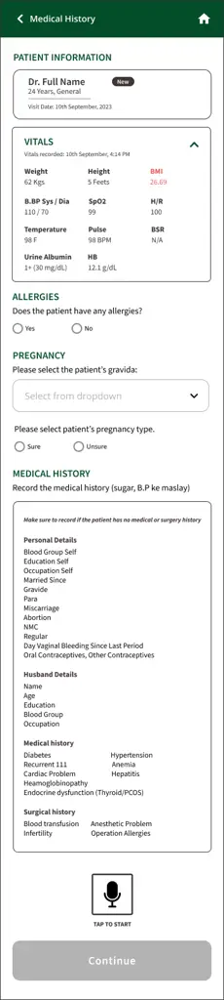
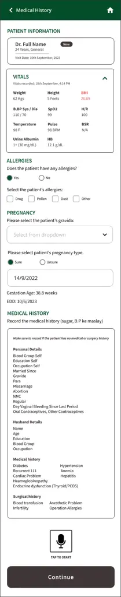
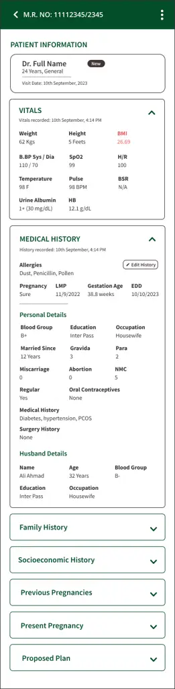
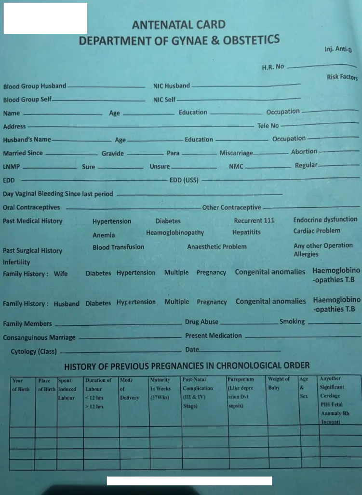
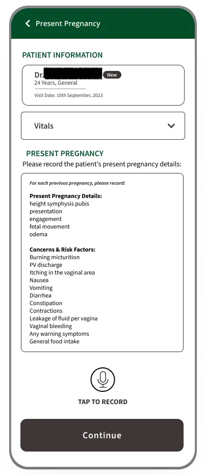

# System X: A Mobile Voice-Based AI System for EMR Generation and Clinical Decision Support in Low-Resource Maternal Healthcare

DOI: [XXXXXXX.XXXXXXX](https://doi.org/XXXXXXX.XXXXXXX)CCS: Human-centered
computing Empirical studies in HCI

Maryam Mustafa email: <maryam_mustafa@lums.edu.pk> Affiliation: Lahore
University of Management Sciences, Lahore, Pakistan , Umme Ammara email:
<22100100@lums.edu.pk> Affiliation: Lahore University of Management
Sciences, Lahore, Pakistan , Amna Shahnawaz email:
<amna.shahnawaz@lums.edu.pk> Affiliation: Lahore University of
Management Sciences, Lahore, Pakistan , Moaiz Abrar email:
<23100151@lums.edu.pk> Affiliation: Lahore University of Management
Sciences, Lahore, Pakistan , Bakhtawar Ahtisham email:
<24100301@lums.edu.pk> Affiliation: Lahore University of Management
Sciences, Lahore, Pakistan , Fozia Umber Qurashi email:
<fozia.umber@sihs.org.pk> Affiliation: Obstetrics & Gynecology, Shalamar
Hospital, Lahore, Pakistan , Mostafa Shahin email:
<m.shahin@unsw.edu.au> Affiliation: University of New South Wales,
Sydney, Australia and Beena Ahmed email: <beena.ahmed@unsw.edu.au>
Affiliation: University of New South Wales, Sydney, Australia

Received  5 June 2009

###### Abstract.

We present the design, implementation, and in-situ deployment of a
smartphone-based voice-enabled AI system for generating electronic
medical records (EMRs) and clinical risk alerts in maternal healthcare
settings. Targeted at low-resource environments such as Pakistan, the
system integrates a fine-tuned, multilingual automatic speech
recognition (ASR) model and a prompt-engineered large language model
(LLM) to enable healthcare workers to engage naturally in Urdu, their
native language, regardless of literacy or technical background. Through
speech-based input and localized understanding, the system generates
structured EMRs and flags critical maternal health risks. Over a
seven-month deployment in a not-for-profit hospital, the system
supported the creation of over 500 EMRs and flagged over 300 potential
clinical risks. We evaluate the system’s performance across speech
recognition accuracy, EMR field-level correctness, and clinical
relevance of AI-generated red flags. Our results demonstrate that speech
based AI interfaces, can be effectively adapted to real-world healthcare
settings, especially in low-resource settings, when combined with
structured input design, contextual medical dictionaries, and
clinician-in-the-loop feedback loops. We discuss generalizable design
principles for deploying voice-based mobile healthcare AI support
systems in linguistically and infrastructurally constrained settings.

###### Keywords: 

Large Language Models, AI, Maternal Health, Electronic Medical Records

## 1. Introduction

This paper presents the design, system architecture, and deployment of a
smartphone-based AI assistant developed to support maternal healthcare
delivery by frontline health workers in Pakistan. The assistant
leverages a large language model (LLM) to generate electronic medical
records (EMRs) from spoken input in the local language. By generating
medical records and identifying potential health risks and flagging them
in real time, the system enhances patient care while optimizing for
health care workers time.

Pakistan faces one of the highest maternal mortality ratios globally,
with 154 deaths per 100,000 live births, compared to an average of 12
deaths per 100,000 in developed countries (Hanif et al., 2021). Several
factors contribute to this high mortality rate, including the inadequate
recognition of critical symptoms, incomplete or missing health records,
delayed access to emergency obstetric care, and insufficiently trained
healthcare workers (Mumtaz et al., 2014). The absence of comprehensive
medical records for pregnant women in Pakistan poses significant
challenges for healthcare providers, making it difficult to deliver
accurate diagnoses, conduct proper follow-ups, or provide care that is
contextualized based on both the patient’s clinical history and
socio-economic conditions (Varley, 2023). While EMRs are widely adopted
in developed countries (of the National Coordinator for Health
Information Technology (ONC), 2019), most public and not-for-profit
healthcare facilities in Pakistan still rely on paper-based records,
with only a few major hospitals having transitioned to digital
forms (Malik M, 2021). In contrast, structured EMRs have been shown to
reduce clinical errors and improve treatment accuracy in digitally
mature health systems (Chaudhry, 2006; of the National Coordinator for
Health Information Technology (ONC), 2019).

Beyond cost considerations of computers/desktop devices etc. needed to
run existing EMR platforms, a significant challenge in implementing EMR
systems within the clinical workforce of developing countries is the
issue of digital literacy (P., 2004). The usability of EMRs is further
compromised by difficulties in navigating interfaces and managing
records through conventional keyboard and mouse interactions for
healthcare workers (Ajami and Bagheri-Tadi, 2013). These usability
barriers are compounded by unreliable infrastructure, high costs, and a
lack of technical training (Kumah-Crystal et al., 2018).

To address these challenges, in collaboration with one of the largest
not-for-profit hospitals in Pakistan, we developed a mobile phone based,
conversational AI assistant for maternal health workers (Fig.1), to make
it easier to collect digital health records, without the barriers of
literacy, cost, time, training and access to equipment. The health
records collect medical data, as well as data on social determinants of
health factors affecting pregnancy. Our system also supports low-skilled
health care workers by raising red flags based on the collected data to
inform better decisions and improve patient outcomes. The system
comprises: (1) an intuitive user interface (UI) featuring structured,
maternal health-specific prompts, allowing healthcare workers to provide
data and record audio responses efficiently; (2) a speech recognition
module utilizing a multilingual Automatic Speech Recognition (ASR)
system, Whisper, to convert collected speech into the text; and (3) a
text generation module prompting an existing LLM, GPT-4, with the
transcribed text to populate EMRs, ask follow up questions and provide
diagnostic support. The application has undergone extensive testing in
the Gynecology Outpatient Department at Hospital Y, where it was
deployed from October 2023 till April 2024, resulting in the creation of
502 unique patient records. Our contribution lies in how we re-engineer
and contextualize existing AI models for a setting in which
full-featured EMR suites remain unrealistic. Specifically, we present
the country’s first voice-enabled smartphone-based AI assistant for
maternal care, deployed in the wild and on scale.

In this paper we address three primary research questions on the use of
LLMs for improving maternal health outcomes:

- •
  RQ 1: How can LLMs be effectively integrated into maternal healthcare
  systems in low-resource settings to generate accurate and
  context-sensitive EMRs from speech in local languages?
- •
  RQ 2: What are the specific challenges and opportunities associated
  with deploying a voice-enabled AI assistant for maternal healthcare
  workers (MHCWs) in Pakistan, and how effective are LLMs in generating
  accurate and contextually relevant EMRs from speech in low-resource
  healthcare settings?
- •
  RQ 3: How can LLMs enhance early detection and diagnosis of critical
  maternal health issues through real-time decision support for
  low-skilled maternal health care workers, and what potential impact
  can this have on improving maternal health outcomes in under-resourced
  areas?

To design, develop, and evaluate the system, we followed a multi-phase
methodology. First, we conducted a formative study involving workflow
observations and interviews with clinicians to understand existing
maternal health documentation practices (Section 3). Next, we collected
real-world Urdu speech data to fine-tune an ASR model and iteratively
developed a voice-based interface integrated with a LLM for EMR
generation and clinical decision support (Section 4). We then deployed
the system in a live hospital setting over seven months, capturing usage
data, system logs, and user feedback (Section 5). Finally, we conducted
a comprehensive evaluation using quantitative metrics, usability
testing, and clinician interviews to assess system accuracy, utility,
and impact in practice (Section 6).

Our work highlights the design guidelines, the iterative process of the
systems development along with the rationale for the choices,
implications and challenges of leveraging LLMs for improving health care
in low-resource settings and pathways forward.

## 2. Background and Related Work

We begin by examining the landscape of maternal health in Pakistan,
highlighting key challenges and trends (Section  2.1). We then review
emerging applications of AI in healthcare (Section  2.2). Next, we
discuss the evolution and impact of EMRs. Finally, we examine the
potential of Clinical Decision Support Systems (CDSS) in enhancing
patient care and outcomes (Section  2.4).

### 2.1. Maternal Health in Pakistan

Pakistan has the world’s fifth-largest population (of Statistics, 2023)
and one of the highest maternal mortality ratio in South Asia, at 154
per 100,000 live births (Women, 2023; Knoema, n.d.). A lack of detailed
medical records, limited access to trained health care workers, poor
quality services at hospitals, low literacy, and poverty are some of the
most significant contributors to maternal deaths (Khan et al., 2009;
Mustafa et al., 2020). The most significant maternal health
complications leading to death are Eclampsia and postpartum
hemorrhage (Shaeen et al., 2022). Eclampsia, the third leading cause of
maternal deaths in Pakistan, is convulsions in a pregnant woman
resulting from high blood pressure and is easily manageable if care is
provided early on (Firoz et al., 2018; Mir et al., 2019). A significant
proportion of maternal deaths in Pakistan can be attributed to delays in
providing medical care during obstetric complications. An instance of
such delays arises from household constraints, specifically stemming
from the ignorance of families and traditional midwives, who postpone
the decision to seek necessary medical care in larger hospitals (Shaeen
et al., 2022). Our system aims to address this challenge by raising red
flags and highlighting symptoms like those of Eclampsia to ensure care
is provided as early as possible.

Similarly, anemia during pregnancy is a significant factor in maternal
mortality (Noronha et al., 2012), ranking as the second most common
cause of such deaths in Asia and contributing to 12.8% of these
fatalities (Khan et al., 2006). It is alarming that up to 50% of
pregnant women in Pakistan are estimated to suffer from anemia (Majeed
et al., 2022), a condition that can be alleviated with strict
monitoring (Rush, 2000).

The absence of accurate data on maternal mortality and its causes is a
major obstacle to reducing maternal deaths in Pakistan (Shaeen et al.,
2022). Timely antenatal care is key for detecting and managing
pregnancy-related conditions. Essential components of this care include
monitoring for hypertension, proteinuria, STIs/HIV, anemia, and fetal
malpresentation and educating women and their families about danger
signs during pregnancy (Tikmani et al., 2019). The early identification
of patients at risk of rapid deterioration and critical illness plays a
pivotal role in preventing maternal mortality (Rathore et al., 2020).

Our system leverages speech input to generate detailed EMRs for
effective monitoring throughout the antenatal period. It offers
diagnostic support to healthcare workers by enabling early
identification of potential risks, such as anemia, preeclampsia, and
gestational diabetes, by generating "red flags" based on the patient’s
medical history.

### 2.2. LLMs in Healthcare

In recent years, AI-driven systems have increasingly focused on
healthcare, with various workshops exploring the intersection of
Human-Computer Interaction (HCI) and AI to address the challenges and
opportunities in healthcare environments (Andersen et al., 2021; Park et
al., 2019; Wilcox et al., 2013; Ontika et al., 2022). A key challenge in
patient-centered care is the impact of patient-clinician communication,
often hindered by time constraints that limit personalized care and
clinical decision-making (Burgess et al., 2022; Berry et al., 2017b;
Berry et al., 2017a; Mazaheri Habibi et al., 2018; Porter et al., 2023).
To address this, researchers are exploring AI-supported tools for
medical treatment and diagnostics, focusing on clinicians’ needs to
understand an AI models’ limitations, perspectives, and design goals to
better interpret diagnostic predictions (Burgess et al., 2023; Cai et
al., 2019). This is particularly important in the context of
low-resource countries like Pakistan where often the only access to
health care is through low-skilled health care workers.

Recent advancements in LLMs have created significant opportunities in
healthcare (Karabacak and Margetis, 2023; Clusmann et al., 2023), for
public health monitoring (Jo et al., 2023b; Jo et al., 2024), to create
structured patient notes and manage clinical notes (Cascella et al.,
2023; Han et al., 2024), improving patient experiences in
hospitals (Wang et al., 2024), supporting the mental health of isolated
populations (Jo et al., 2023a), and working alongside digital voice
assistants (Purohit et al., 2023). Additionally LLM-based applications
are currently being piloted to diagnose diseases from clinical notes
(Jiang et al., 2023), early detection of health problems (Cahyo and
Astuti, 2023), generating medical advice (Haupt and Marks, 2023), and
supporting decision-making and diagnostics (Yu et al., 2023; Tu et al.,
2024; McDuff et al., 2023). With proper development and supervision,
health-focused LLMs are poised to transform various healthcare domains,
including consultation, diagnosis, management, and medical education
(Yang et al., 2023).

Researchers and health professionals have relied on AI-based tools to
address various challenges in maternal health (Antoniak et al., 2024).
Prominent work in this domain, though limited, includes predicting
high-risk pregnancies from Electronic Health Records (EHRs) (Knowles et
al., 2016), aiding community health workers in delivering high-quality
maternal care in resource-constrained settings (Al Ghadban et al.,
2023), and analyzing free-speech data about breastfeeding and postpartum
depression (Valdeolivar-Hernandez et al., 2023). An AI-backed tool that
captures the complete journey of a pregnant patient’s visits, including
EMR, and supports clinical decision-making, is yet to exist in the
context of a constrained healthcare infrastructure like Pakistan.

Much if not all of this work is currently being piloted in the Global
North where there is access to extensive resources, skilled health care
workers and high adoption of technologies. It is critical that there are
parallel attempts to understand the unique potential, constraints and
limitations of leveraging LLMs in recourse poor countries where they
might be able to improve health outcomes in very specific ways.

### 2.3. Electronic Medical Records

Electronic Medical Records (EMR), also known as electronic patient
records, facilitate better services and decision-making through accurate
medication lists, legible notes, and readily accessible patient data and
a record of patient care (Williams and Boren, 2008; Evans, 2016). While
EMRs are now the standard of care in developed and rich countries,
developing countries like Pakistan face significant barriers to
adoption. Building successful EMRs for low-resource contexts requires
careful consideration of various constraints including a tiered medical
system (Mustafa et al., 2020) with healthcare workers ranging from
formal to informal (Chen and Akay, 2011; Malik and Khan, 2009), digital
low-literacy, low proficiency in English, limited funds for expensive
hardware, and a lack of training (DesRoches et al., 2008; Boonstra and
Broekhuis, 2010). Existing EMRs in resource-constrained regions face a
critical limitation due to the lack of customization and
scalability (Ismail et al., 2016; of Health and Services, 2009; Fraser
et al., 2005; Mamlin et al., 2006). Research addressing the specific
requirements of health professionals, who are the primary users of EMR
for fetomaternal monitoring, care, and treatment, is still insufficient
in Pakistan (Noor et al., 2019). Researchers developed a prototype for
documenting patient history, encompassing past pregnancies, medications,
allergies, and surgeries (Ismail et al., 2016). However, this prototype
did not comprehensively address all critical factors pertinent to
maternal health, such as socioeconomic history (Kim et al., 2018).
Recent research investigates the integration of LLMs with EHRs,
demonstrating how LLMs can support the scrutiny and comprehension of
existing EHRs (Xu et al., 2025), evaluation of smaller LLMs on EHR
datasets  (Qu et al., 2024), and clinical language models designed to
enhance EMR documentation (Yang et al., 2022). However, maternal health
in low-resource settings presents unique challenges, where language
barriers, infrastructural limitations, and the need for end-to-end
deployment remain critical gaps.

There are existing industry systems that leverage AI to improve clinical
documentation for generating EMRs. Leading examples include Epic
Systems (Turner, 2023), which is integrating GPT-4 into EHRs to help
clinicians communicate with patients, and Nuance DAX Copilot, which
automatically transcribes and summarizes patient encounters (Nuance
Communications, 2024). Similar standalone systems like DeepScribe and
Chartnote also exist, while others, such as Amazon’s HealthScribe and
Nabla Co-pilot, require integration with an existing EHR system in place
at the hospital (DeepScribe, ; ChartNote, ; Services, ; Nabla, ).

While we acknowledge the existence of such systems in developed
countries, our approach focuses on addressing the multifaceted
challenges encountered in resource-constrained settings. These
challenges include varied healthcare worker expertise, digital and
English literacy barriers, financial constraints for system hardware,
and limited training opportunities. To overcome these hurdles, we have
developed a low-cost, smartphone-based AI assistant tailored for
Maternal Healthcare Workers (MHCWs) in resource-constrained settings. To
the best of our knowledge, this is the first prototype of its kind to be
implemented and deployed in a live hospital setting in Pakistan.

### 2.4. Clinical Decision Support Systems in Health

Clinical decision support systems (CDSS) play a pivotal role in
improving clinicians’ decision-making processes by offering tailored
insights based on patient-specific data. These systems contribute to
various aspects of healthcare, including providing diagnoses,
recommending treatments, suggesting preventive care measures, and
issuing alerts for potential health concerns (Osheroff et al., 2007;
Greenes, 2014; Yang et al., 2019; Zamora et al., 2013). Working with
CDSS poses various challenges, including difficulties integrating them
into clinicians’ workflows (Maniatopoulos et al., 2015). Poorly designed
CDSS can lead to problems such as clinician burnout (Jankovic and Chen, 2020) and system errors (Hartswood et al., 2005). CDSS may be
implemented either as independent software applications or as integrated
components within EMR systems. Irrespective of their specific
configuration, overcoming implementation barriers is critical for
ensuring effective adoption and utilization of these systems in clinical
environments. While previous studies have explored AI-based
decision-support systems (Magrabi et al., 2019; Shortlife et al., 1975),
the rise of emerging technologies adds a layer of complexity for
clinicians to trust these systems. In contrast to rules-based CDSS,
where clinicians receive information based on predefined rules, AI-based
CDSS can potentially lead to trust issues among clinicians (Duran and
Jongsma, 2021). Recent studies explore approaches to increase the
clinician’s trust and adoption of AI-based decision support systems in
healthcare (Burgess et al., 2023; Cai et al., 2019).

In our system, we generate critical health concerns, or "red flags", to
aid healthcare workers in delivering prompt interventions. To validate
these red flags, we engage senior gynecologists in a thorough evaluation
process. This collaborative approach enables continuous model
refinement, enhancing the clinical accuracy and relevance of the
generated alerts in supporting evidence-based decision-making.

## 3. Formative Study: Current Practices and Challenges in Health Data Record Keeping in Hospital Y

The Gynecology Department at Hospital Y, a not-for-profit characterized
by a high patient influx and limited resources, served as our field
site. To ground the system in real clinical practices, we conducted
field observations and semi-structured interviews with healthcare
professionals. This formative study aimed to gather information on 1)
current maternal health data record-keeping practices, challenges in
patient management, diagnostic methods, and patients’ socioeconomic
factors, and 2) the workflow of the Gynae Outpatient Department, and how
doctors interacted with patients in real-time.

### 3.1. Methods

We conducted semi-structured interviews with 12 healthcare professionals
(Table 1). The interview protocol (Appendix A.3) explored current data
recording practices, clinical decision-making processes, and
sociocultural factors that affect maternal care. Topics included
antenatal and postnatal workflows, diagnostic routines, and
communication with patients and families. Two female authors
independently conducted contextual inquiries and field observations in
the Gynecology Outpatient Department over one week, spending
approximately three hours per day on site. Observations covered key
clinical spaces, including the waiting area, antenatal and examination
rooms, outpatient desks, and consultant offices, with strict attention
to patient privacy. Informed consent was obtained from all observed
patients. To gain deeper insight into data recording practices, we also
conducted participant observation: accompanying a consenting patient
throughout her consultation to document real-time interactions and
workflows related to patient history recording. The consultant also
provided us with the paper-based template (Antenatal card) for recording
patient data (Appendix A.4) currently being used by the gynae
department.

The interviews were transcribed and analyzed using inductive
coding (Thomas, 2006) by two authors, with codes merged through
iterative discussion. Example codes include ‘follow-up frequency’,
‘pregnancy detection methods’, and ‘patient education’. These codes were
grouped into themes such as ‘inconsistencies in documentation’,
‘informal socioeconomic assessment’, and ‘patient retention challenges’.
The field notes independently recorded by the two authors were later
combined into a shared account through joint review.

[TABLE]

Table 1. Participant Composition for Semi-structured Interviews

### 3.2. Findings of the Formative Study

The Gynecology department at Hospital Y manages around 3,000 patients a
month. Patient records are entered both manually and electronically,
though the system is hampered by time constraints, limited staff
availability, and only one computer designated for data entry. When a
patient arrives at the hospital, only their essential data (Clinical
diagnosis and prescribed medications is entered electronically. However,
the detailed information about medical history, family history, and
other relevant details, is manually filled out on the hard copy of the
antenatal card and handed over to the patient. The key findings of our
formative study include:

- •
  Paper-based records as the sole patient history: Patients receive a
  paper antenatal card that is manually updated by doctors. The card
  lacks structure and does not contain physical space for long term
  follow-up. The antenatal card serves as the primary record, with no
  backup in case the patient loses it or forgets to bring it along
  during the appointment.
- •
  Ad hoc recording of risk factors: Immediate data such as patient
  history and high-risk indicators are recorded; doctors use a red
  pencil to note anything that can potentially complicate the pregnancy.
- •
  Dependence on patient recall: Clinicians rely on patients to bring
  test reports and remember vaccination histories, as no centralized or
  digital record system is available.
- •
  Absence of formal socio-psychological screening: There is no formal
  screening for social or psychological issues such as domestic abuse;
  these are only addressed if the patient voluntarily discloses them.
  Doctors infer the patient’s socioeconomic factors informally through
  the patient’s communication skills and appearance, without taking any
  formal history.
- •
  Fragmented patient flow: After the nurse records the vitals, the
  patient is randomly assigned to an on-duty doctor. The patient cannot
  enter the consultant’s room without an on-duty doctor, who summarizes
  the case for the consultant to devise a care plan.
- •
  Limited digital infrastructure: Only consultants have access to
  desktop computers, which are not used for patient record entry.
  Doctors calculate the gestational age through mobile apps, and the
  result is manually entered on the antenatal card.

We distilled these findings into initial design requirements (DRs), that
directly shaped our system design (Table 2).

| Design Requirement                                                                                                                                                   |
| -------------------------------------------------------------------------------------------------------------------------------------------------------------------- |
| DR1. Build a structured yet flexible EMR template on mobile that stores longitudinal data across repeat visits and allows quick pre-save edits.                      |
| DR2. Implement automated red-flag logic that highlights clinically important indicators in the EMR and requires visible acknowledgement or edit before finalizing.   |
| DR3. Add a dedicated Socio-Economic History section and targeted prompts so structural constraints are routinely captured.                                           |
| DR4. Add auto-computed “Weeks of Gestation” and “Expected Date of Delivery (EDD)” fields inside the EMR template to eliminate external calculators and reduce error. |
| DR5. Enable non-linear navigation so any section can be completed in any order, with safe partial saves and no workflow breakage.                                    |
| DR6. Extend the EMR with clinically validated fields and LLM-prompted follow-ups that surface commonly missed symptoms during capture.                               |
| DR7. Add an image-upload feature for lab/scan reports so clinicians can attach artifacts directly to the visit record.                                               |

Table 2. Design requirements derived from formative study and iterative
testing.

These design requirements formed the foundation for our system design,
guiding the translation of observed challenges into concrete features
and workflows (Section  4).

## 4. System Design and Development

### 4.1. System Overview

Our application is designed as a modular mobile voice-based AI system to
support maternal healthcare documentation in low-resource clinical
environments. This section outlines the system architecture, interface
design, and technical development of the ASR and LLM modules, as well as
the iterative testing processes that shaped the final deployment. The
system consists of three key modules:

1.  (1)
    A structured mobile interface that allows non-linear navigation and
    speech-based data entry.
2.  (2)
    An ASR module, based on OpenAI’s Whisper, fine-tuned on locally
    collected Roman Urdu (Urdu written using the Latin script) speech
    data.
3.  (3)
    A GPT-4 LLM backend that processes transcriptions to generate EMRs,
    clarification questions, and identify clinical red flags.

Data flows from the user through speech input, which is transcribed by
the ASR and then passed to the LLM with medical dictionaries and prompt
templates. The resulting EMRs and red flags are displayed in the app for
review. In Section 4.3, we describe the user interface and core features
for recording patient histories and generating EMRs. We then present the
technical details of our text generation and speech recognition modules
in Section 4.5 and Section 4.4.

Figure 1. An overview of our systemA flow chart diagram showing an
overview of the system

### 4.2. Scope of Deployment

The broader vision for System X extends beyond physicians to include
maternal healthcare workers who constitute the backbone of frontline
care in Pakistan. Nationally, 31% of deliveries are still attended by
unskilled providers (National Institute of Population Studies (NIPS)
\[Pakistan\] and ICF, 2019), such as traditional birth attendants
(_dais_), majority of whom are unable to read or write in either Urdu or
English (Mcnojia et al., 2020). This underscore both the reach of formal
care and the persistent reliance on low-literacy providers in peripheral
settings. Deploying LLMs in such high-stakes domains carries inherent
risks, particularly the potential for EMR or decision-support errors
that could directly compromise patient safety. Unlike doctors, unskilled
workers cannot independently verify the accuracy of outputs or
compensate for model errors. For this reason, we first piloted the
system with doctors and nurses to ensure it performed as intended before
considering broader use. Our long-term goal remains to adapt and extend
the system for maternal healthcare workers in low-resource, low-literacy
environments, where voice input and structured EMRs could substantially
improve record-keeping, continuity of care, and patient safety.

### 4.3. User Workflow and Interface

Figure 2. Expanded and scrollable "Medical History" screen shown in full
for illustration. In the actual application, only a portion of the
screen is visible at a time. Clinicians tap the microphone icon to
record patient history in their preferred language.

Figure 3. Filled and scrollable "Medical History" screen displaying
recorded allergies and past medical conditions. The combination of text
fields and audio input reflects design decisions shaped by formative
research and iterative testing.

Figure 4. Scrollable patient summary screen displaying vital signs and
collapsible history categories. The MR No. at the top serves as the
patient’s unique medical identifier.

Our smartphone-based system guides healthcare workers through a
structured workflow for EMR generation using speech input. The process
begins with basic patient data entry (Section 4.3.1), followed by
voice-recorded history across six categories (Section 4.3.2).
Transcriptions are reviewed and clarified through LLM-generated
questions (Section 4.3.3), leading to the finalized EMR (Section
 4.3.4). Additional medical questions (Section  4.3.5), followed by red
flag alerts (Section 4.3.6) and ultrasound uploads (Section  4.3.7)
further enhance clinical decision-making. The overall data flow and
system outputs are illustrated in Figure 1.

#### 4.3.1. Step 1: Patient Information Entry

In our system workflow, nurses first input basic patient information,
including name, age, healthcare type (public or private), and vital
signs such as height, weight, blood pressure, temperature, and pulse.
Doctors then retrieve the patient record via a unique medical ID and
record patient information. Figure 2 illustrates how the recorded vital
signs are displayed after being entered by the nurse. Assigning a unique
medical ID enables longitudinal retrieval across visits and avoids
repeated re-entry, directly addressing record fragmentation \[DR1\].

#### 4.3.2. Step 2: Recording and Structuring Patient’s Information

After retrieving the patient record using a unique medical ID, doctors
record the patient’s history using the in-app audio recorder, speaking
in Urdu, English, or a mix of both. Informed by insights from the
formative study, the application structures patient history into six key
sections: (1) Personal and Medical History, (2) Family History, (3)
Socio-Economic History, (4) Previous Pregnancy Details, (5) Current
Pregnancy Details, and (6) Follow-up Plan. Each category is presented on
a separate screen. For returning patients, only categories (5) and (6)
are updated \[DR1\]. Speech is recorded in Urdu, English, or
code-switched combinations. Figure 2 shows the unfilled "Personal and
Medical History" screen, while Figure 3 displays the corresponding
section after the doctor has recorded the data. Figure 4 displays all
six collapsible patient information sections.

To accommodate diverse documentation practices, the interface supports
non-linear navigation, allowing clinicians to complete history sections
in any order. Field observations revealed that while some follow the
antenatal card sequence, others organize information based on clinical
reasoning. This design flexibility aligns with existing workflows,
minimizing disruption and enhancing usability \[DR5\]. We also include
in-template auto-computed ‘Weeks of Gestation and ‘Estimated Date of
Delivery (EDD)’ eliminating external calculator apps and transcription
steps \[DR4\].

Through iterative design and testing, additional clinically relevant
data fields not present on the physical antenatal card were identified
and incorporated, such as burning micturition, PV discharge, vaginal
itching, and gastrointestinal symptoms. These additions were validated
by a senior gynecologist, resulting in a more comprehensive EMR template
tailored to local diagnostic practices \[DR6\].

#### 4.3.3. Step 3: Transcription Review and Clarification

After completing the recordings, the doctors are presented with a screen
(Figure 6) displaying the transcribed text for each category. Similar to
the recording screens, the transcription screens are separate for each
category. In these screens, the transcription is presented alongside a
list of clarification questions generated by the LLM to ensure accurate
EMR creation. These questions typically address misspelled words and
confirmation of the doctor’s spoken content, requiring simple answers
shown on screen (Figure 6). Users provide text input to respond to these
questions, and the process follows a linear flow to prevent any
questions from being skipped.

#### 4.3.4. Step 4: EMR Review and Finalization

Once clarifications are submitted, a consolidated EMR is generated and
presented on a single, scrollable screen. Each category can be expanded
or collapsed for easier review. Doctors may edit any field or add
supplementary notes before saving \[DR1\]. At this stage, an in-app
survey also prompts feedback on EMR accuracy and completeness.

#### 4.3.5. Step 5: Supplementary Medical Questions

Following the review of the EMR, users are prompted to respond to a set
of additional medical questions generated by the system that aims to
capture information not in the EMR via text input, e.g., "As the patient
in a consanguineous marriage, are there any inherited diseases in their
families that should be monitored?" \[DR6\]. See Appendix A.1 for
further examples of these questions.

#### 4.3.6. Step 6: Red Flag Review

In the final stage of the workflow, MHCWs review critical red flags
generated by the system. These red flags are highlighted in red text in
the EMR, mirroring existing paper-card markups, and commonly include
issues such as gestational diabetes, anemia, or abnormal body mass index
\[DR2\]. Missing information in the patient’s history, such as absent
vitals, lab tests, or gaps in medical/surgical history, is highlighted
in yellow text. Finally, an in-app survey is displayed to capture the
doctor’s feedback on the usefulness of the red flags.

#### 4.3.7. Step 7: Ultrasound Report Integration

For returning patients, the application includes the additional feature
of uploading an image of the ultrasound scan lab report \[DR1\]. Upon
upload, the system extracts key information from the image, such as
fetal movement, placenta presence, date of the scan, and the presence of
anomalies. This streamlined process minimizes the time required for
doctors to manually read the entire report, allowing them to focus
directly on the EMR and make edits if necessary.

### 4.4. Fine-Tuned Speech Recognition System

#### 4.4.1. Rationale for Speech as the Primary Input Modality

Our choice of speech as the primary input modality stems directly from
the realities of maternal healthcare in Pakistan. A significant
proportion of births (31%) are still attended by unskilled
providers (National Institute of Population Studies (NIPS) \[Pakistan\]
and ICF, 2019) cannot read or write in Urdu or English (Mcnojia et al.,
2020). In such contexts, requiring text-based input would exclude a
large segment of frontline workers. In contrast, speech input lowers
barriers to adoption. Hands-free, phone-based dictation allows providers
to capture data without the cost and space demands of workstation
setups, while supporting natural interaction in Urdu or code-switched
Urdu/English.

Prior work shows that globally physicians spend nearly twice as much
time documenting as providing care (Sinsky et al., 2016). Speech
recognition in EHRs can reduce turnaround times, enhance report
completeness (Saxena et al., 2018; Goss et al., 2019; Kumah-Crystal et
al., 2018). Hybrid approaches increase documentation speed by 26% while
doubling document length (Kumah-Crystal et al., 2018). These
efficiencies are particularly valuable in high-volume, resource-limited
clinics.

At Hospital Y, only senior consultants have access to computers, which
are not used for data entry. The situation is even worse in smaller
hospitals and tertiary health units where such infrastructure is often
absent altogether. Hands-free, phone-based dictation lets healthcare
workers capture patient data, avoiding the space and cost overhead of
workstations. Speaking in Urdu (or mixed Urdu/English) also lowers the
entry barrier for junior staff. We counter noisy outpatient environments
via (i) a custom medical dictionary, and (ii) an automatic clarification
loop, to reduce transcription errors propagating to the final EMR or
red-flag logic. Thus, voice input is a context-aware design choice that
addresses digital literacy, infrastructural limitations, and
documentation bottlenecks.

#### 4.4.2. Model Selction and Fine-tuning

We used the large-v2 version of OpenAI’s Whisper model as the base
speech recognition system for transcribing patient interactions. To
assess its baseline performance, we collected a pilot dataset comprising
audio recordings from 8 patients (approximately 16 minutes of speech).
These recordings reflected typical outpatient consultations, including
frequent code-switching between Urdu and English. We benchmarked Whisper
against the MMS-1b-all model (Pratap et al., 2023) (default
configuration). As shown in Table 3, both models struggled with
code-switched input: Whisper achieved a Word Error Rate (WER) of 45.71%,
while MMS-1b-all recorded 60.89%. WER denotes the proportion of words
incorrectly transcribed.

Given these high error rates, we fine-tuned Whisper using pilot dataset.
Because Whisper requires training samples under 30 seconds, we segmented
the recordings using Praat (Boersma and Weenink, 2023). Each segment was
manually transcribed into two formats: (i) Roman Urdu and (ii)
Arabic-script Urdu (with transliterated English terms). Initial
full-model fine-tuning degraded performance, likely due to overfitting
on the small dataset. To address this, we adopted a parameter-efficient
strategy using Low-Rank Adaptation (PEFT-LoRA) (Saini, 2023),
restricting trainable parameters to 1% of the model. This approach
improved accuracy substantially: WER decreased to 16.38% for Latin Urdu
and 28.85% for Arabic-script Urdu.

For deployment, we integrated the fine-tuned Latin Urdu model with
faster-whisper (SYSTRAN, 2023), a lightweight decoding implementation
optimized for real-time inference. The final model was hosted on a
Hugging Face inference endpoint and connected to the mobile application
for on-device transcription. Table 3 summarizes baseline and fine-tuned
performance.

We further mitigate challenges of noisy outpatient environments by (i)
incorporating a custom medical dictionary to resolve local terminology
(Section 4.5.2) and (ii) embedding an automatic clarification loop that
prompts clinicians to confirm uncertain transcriptions (Section 4.5.1).
Together, these features help prevent transcription errors from
propagating into the final EMR or compromising the red flag alerts.

| Model                                  | WER    |
| -------------------------------------- | ------ |
| MMS-1b-all                             | 60.89% |
| Whisper-large-v2-base                  | 45.71% |
| Whisper-large-v2-fine-tuned-urdu       | 28.85% |
| Whisper-large-v2-fine-tuned-roman-urdu | 16.38% |

Table 3. Comparison of Word Error Rate(WER) for different ASR Models

### 4.5. LLM Integration for EMR and Diagnostic Support

Our system utilizes OpenAI’s GPT-4 model for various functions,
including generating EMRs, prompting doctors for medical questions, and
detecting potential health risks or ‘red flags’ in the generated EMRs.

#### 4.5.1. Iterative Improvements in EMR Generation Workflow

Initially, the LLM populated structured EMR templates directly from ASR
transcriptions using predefined clinical parameters. However, early
tests revealed limitations: fields omitted by doctors led to vague
outputs (“No information”), off-template details were discarded, and
Roman Urdu transcription errors were often preserved. To address this,
we revised the prompt design by adding an "Additional Information" field
and instructing the model to attempt basic error correction. We also
introduced a clarification step where the LLM generates follow-up
questions for ambiguous inputs (Figure 6), enabling doctors to
disambiguate via brief text responses. We instructed doctors to
explicitly say “no information” when a field was not applicable, and
configured the model to default to “No” for parameters not explicitly
mentioned. These changes significantly improved data completeness and
EMR accuracy while preserving clinical nuance.

#### 4.5.2. Medical Dictionary Integration

To reduce the volume of clarification questions, the model was
supplemented with a medical dictionary. This dictionary was created by
comparing system-generated transcriptions with manually generated ground
truth transcriptions of patient data recordings, validated by senior
gynecology and obstetrics consultants at Hospital Y . The medical
dictionary, patient data transcriptions, and EMR template are provided
to the model as inputs, and the model is prompted to generate
’clarification questions’ for these inputs. The answers to these
questions are fed back into the model to produce the final generated
EMR. Figures  6 and 6 illustrate an example of the clarification
questions posed and the EMR generated, respectively, for a sample
‘Proposed Plan’ recording. Appendix A.2 lists the medical dictionary
supplied to the model.

Figure 5. Sample Clarification Questions Screen of a Patient’s Proposed
PlanA sample clarification questions screen of a patient's Proposed Plan

Figure 6. Sample EMR screen of a patient’s ‘Proposed Plan’A sample EMR
screen of a patient's proposed plan

#### 4.5.3. Generating Medical Questions

The purpose of these questions is to collect additional patient
information that might be valuable but is not included in our EMRs (See
Appendix A.1 for examples of these questions). The LLM generates these
questions using the previously created patient EMR as a basis to explore
additional dimensions of the patient’s health status. The LLM is
instructed in the prompt to summarize any new information obtained from
the responses to these questions.

#### 4.5.4. Red Flags Generation

Following consultation with a senior gynecologist, we refined the
system’s risk detection logic to prioritize clinically critical
pregnancy indicators. Thresholds were informed by guidelines from the
Royal College of Obstetricians and Gynaecologists (RCOG) (Royal College
of Obstetricians and Gynaecologists, ) and incorporated directly into
the LLM prompt template. The following parameters were designated as
high-alert indicators(Table 4).:

| Clinical Parameter            | Threshold                                |
| ----------------------------- | ---------------------------------------- |
| Blood Pressure                | $`>140/90`$ mmHg                         |
| Body Mass Index (BMI)         | $`>30`$ kg/m²                            |
| Hemoglobin                    | $`<11`$ g/dL                             |
| Random Blood Glucose or HbA1C | $`\geq 160`$ mg/dL or $`\geq 7\%`$       |
| Urine Dipstick                | Albumin $`\geq`$ 1+, Glucose $`\geq`$ 2+ |

Table 4. Clinical Parameters and Thresholds for Red Flag Generation

The LLM is instructed to use these thresholds to flag potential maternal
health risks and identify missing patient information. The output is
organized into two categories: Critical Red Flags and Missing
Information.

Keeping the generated content concise and easy to read was a major
challenge. To address this, we modified the model’s instructions,
emphasizing the need for concise output tailored for obstetrician
review. Despite these adjustments, our ongoing focus remains on
achieving a balance between content reduction and maintaining clarity
and comprehensiveness.

## 5. Deployment and Study Design

We deployed our system in the Gynecology Outpatient Department of a
large non-profit hospital in Pakistan from October 2023 to April 2024.
IRB approval was obtained from Hospital Y, and informed consent was
collected from both healthcare workers and patients. The system was
piloted in parallel with existing paper-based workflows, ensuring no
disruption to routine clinical care. The system was used to supplement
documentation and highlight clinical risks, and participating doctors
retained full control over clinical decisions and received compensation
for their additional time.

A total of 26 maternal healthcare workers - including consultants,
residents, house officers, and nurse navigators - used the system during
the pilot, generating more than 500 real-time EMRs. All data were
anonymized and securely stored. In line with the European Commission’s
Ethics Guidelines for Trustworthy AI (European Commission,
Directorate-General for Communications Networks, Content and Technology,
2019), the deployment prioritized human oversight, transparency, and
fairness. Continuous feedback through in-app surveys, LLM interactions,
and clinician interviews informed iterative improvements and supported
safe, inclusive integration of AI tools in low-resource healthcare
settings.

## 6. Evaluation and Findings

Our field deployment included both quantitative and qualitative methods
to evaluate the effectiveness of key components, including the user
interface, Whisper-generated transcriptions, and system-generated EMRs
and red flags. During initial piloting , we collected data to fine-tune
Whisper and improve prompts. This initial data is not included in our
evaluation. We also removed 19 incomplete patient records. Therefore,
our analysis is based on the remaining 297 patient records. In this
section, we report our findings based on:

- •
  Usability testing of application (Section 6.1)
- •
  Evaluation of the speech-to-text module using WER analysis
  (Section 6.2)
- •
  Accuracy measurement of LLM-generated EMRs by calculating correctly
  labeled fields (Section 6.3)
- •
  Categorization of inaccuracies within the LLM-generated EMRs by
  gynecologist (Section 6.4)
- •
  Assessment of the medical accuracy and relevance of system-generated
  red flags by gynecologists (Section 6.5)
- •
  Endline semi-structured feedback interviews with the healthcare team
  (Section 6.7)

Figure 7. Overview of the system evaluationOverview of the system
evaluation

### 6.1. Usability Testing

#### 6.1.1. Methods: Participants and Procedure.

Usability testing was conducted with seven randomly selected healthcare
professionals from the gynecology department, none of whom had prior
experience using smartphone applications for patient record management.
All tests were conducted on-site at the gynecology outpatient clinic of
Hospital Y, using smartphones provided by our research team. This phase
focused on evaluating the application’s usability by applying specific
metrics, such as task completion time, the frequency of help requests,
and the number of incorrect clicks during task execution (Group, 2024).
Additionally, it aimed to identify ways to improve the user interface
for patient data collection and gather feedback on specific features and
overall navigation. Participants received an introduction to the
application and were informed that they would perform specific tasks
independently. They were encouraged to think aloud during the process.
Two facilitators guided the sessions, providing explanations of the
scenarios and tasks, listed in Table 5.

Informed consent was obtained from patients whose clinical data were
recorded in the application. Additionally, consent for video and screen
recording was taken from the participating healthcare professionals as
they executed the assigned tasks. This was necessary for verifying the
accuracy of tester notes and recorded metrics. At the end of each test,
we administered a System Usability Scale (SUS) questionnaire (Brooke,
1996).

#### 6.1.2. Findings: Easy-to-use Application

The SUS score averaged 76, indicating good usability, with individual
scores ranging from 65 (above average) to 85 (excellent). The overall
task completion rate was 91.44%, and participants generally found the
application easy to use. Table 5 presents the detailed task breakdown.

|                                                         |                     |              |                   |                      |
| ------------------------------------------------------- | ------------------- | ------------ | ----------------- | -------------------- |
| Task                                                    | Completion Rate (%) | Avg Time (s) | Avg Help Requests | Avg Incorrect Clicks |
| 1\. Account Creation                                    | 100                 | 59.2         | 0.67              | 1                    |
| 2\. Search for Patient                                  | 100                 | 18.7         | 0.14              | 0                    |
| 3\. Fill & Record Medical History                       | 85.7                | 153          | 1.2               | 0.3                  |
| 4\. Navigate to Proposed Plan Screen                    | 100                 | 13.3         | 0.25              | 0                    |
| 5\. Review Transcriptions & Answer Clarifying Questions | 100                 | 103          | 0                 | 0.5                  |
| 6\. Review/Edit Generated EMR                           | 100                 | 63.5         | 0.5               | 0                    |
| 7\. Answer Additional Medical Questions                 | 50                  | 203.5        | 1                 | 0                    |
| 8\. Review Red Flags                                    | 100                 | 55.7         | 0.6               | 0                    |
| Average                                                 | 91.44               | 83.61        | 0.54              | 0.23                 |

Table 5. Usability Testing Results

Although the scores were high, the participants still needed initial
training to understand the concept of the application. There were few
help requests and incorrect clicks on average, but the variation between
sections using only speech input and those combining speech with
traditional input methods (e.g., date pickers) led users to overlook
non-speech fields. For example, in task 3, the only unsuccessful attempt
occurred when a doctor missed entering the LMP (Last Menstrual Period)
date because the field lacked a clear label. To resolve this problem, we
improved the visibility of the field by changing its label from LMP to
more explicit Please enter the patient’s LMP date. Navigation was
generally smooth, with users correctly identifying the Continue button
to move forward and using the back arrow in the header to return to
previous screens. The testing identified minor improvements, such as
removing redundant screens, consolidating patient history into a single
dropdown, and refining prompts to reduce repetitive questions, enhancing
the application’s usability for future iterations.

### 6.2. Effectiveness of Speech-to-Text Model

Feedback from clinical collaborators highlighted the need for more
targeted evaluation metrics, particularly regarding transcription
accuracy. Due to the sensitivity of medical data and privacy concerns,
all transcriptions were handled internally. Three members of the
research team manually transcribed audio recordings for 297 patients,
creating the ground truth dataset for evaluating the speech-to-text
module.

We computed Word Error Rate (WER) by comparing system-generated
transcriptions with these manual references, where a lower WER indicates
better performance (Microsoft, 2024). The fine-tuned Whisper model
initially produced a WER of 32%. Upon manual inspection, we observed
repetitive phrase generation—likely a result of Whisper’s
sequence-to-sequence architecture (OpenAI, 2024). For example, in the
case of patient P302, the correct transcription was "surgical history is
not significant." However, Whisper incorrectly transcribed it with
excessive repetition: "surgical history is not significant surgical
history is not significant… surgical history is not significant".
Although these repetitions did not cause errors in the system-generated
EMRs, they significantly increased the WER. After removing the
repetitive text, the WER was reduced to 16.2%, falling within the
acceptable range(OpenAI, 2024).

The Urdu language uses a modified Perso-Arabic script. When
transliterated into the Roman script, this leads to spelling variations
due to the lack of standardization in Roman Urdu. For example, a single
Urdu word can be written in Roman script as ‘kertay’, ‘krte’, ‘krtay’,
or ‘krty’, all meaning ‘do’ in English. In WER calculations, these
variations between the manual and Whisper transcriptions are treated as
distinct words, potentially increasing the WER percentage.

### 6.3. Accuracy of System-Generated EMRs

For each patient, we used the manually generated ‘ground truth’
transcriptions to create a ‘ground truth EMR’. Three members of our
research team created these ground-truth EMRs by manually filling the
EMR template using the ground-truth transcriptions. We then compared
system-generated EMRs and ground-truth EMRs field-by-field and counted
each mismatch in two corresponding fields as an error. Errors in the
system-generated EMRs included misspelled medicine names and incorrectly
marking a field as ‘Not mentioned’ instead of ‘No’, etc. We quantified
the accuracy of the EMRs by calculating the ratio of correctly filled
fields by our system to the total number of fields in each EMR. The
evaluation resulted in a system accuracy of 96.2%. The manual
transcription of audio recordings and manual generation of the
ground-truth EMRs enabled us to differentiate between inaccuracies
introduced by the language model and those carried over from the Whisper
transcriptions, helping us identify areas for improvement in both
modules.

### 6.4. Categorization of Inaccuracies in System-Generated EMRs

After calculating the overall accuracy of system-generated EMRs, we
analyze the incorrectly filled EMR fields with the help of a senior
consultant gynecologist. Inaccuracies in the EMR can lead to poor
decision making and incorrect follow-up care plans. We observed how
healthcare workers handle these inaccuracies and, in consultation with a
senior gynecologist, adapted the framework from (Sivaraman et al., 2023)
to create three categories for incorrect fields: No Action Needed,
Easily Identifiable and Correctable, and Unidentifiable and
Uncorrectable Without Ground Truth.

We provided the consultant with an anonymized Excel sheet displaying
system-generated and ground-truth EMRs side by side. Inaccurate fields
were highlighted in red, and correct fields in green, and the consultant
was asked to categorize each error. Table 6 summarizes the consultant’s
categorization of inaccuracies identified in the EMRs, along with their
corresponding percentages of distribution. These inaccuracies mainly
included misspellings, missing information, or misclassified fields. For
example, a misspelled drug name was typically labeled as Easily
Identifiable and Correctable or Unidentifiable and Uncorrectable Without
Ground Truth, whereas a misspelling in the patient’s education level was
often considered to require No action needed. The consultant perceived
errors in clinically significant fields, such as the number of previous
abortions or miscarriages, as more consequential than inaccuracies in
fields such as gravida or the birthplace of previous deliveries. Table 6
suggests 97.5% of the EMR fields are actionable, with \<2.5% requiring
ground truth for correction. Nonetheless, both Easily Identifiable and
Correctable and Unidentifiable and Uncorrectable Without Ground Truth
errors, emphasize the importance of improving EMR accuracy, particularly
by reducing the frequency of inaccuracies that are difficult to detect
or verify without access to ground truth.

| Category                                              | %      | Definition                                                                                                                                    | Common Examples                                                                                                                                                                                                                    |
| ----------------------------------------------------- | ------ | --------------------------------------------------------------------------------------------------------------------------------------------- | ---------------------------------------------------------------------------------------------------------------------------------------------------------------------------------------------------------------------------------- |
| No Action Needed                                      | \<1%   | The inaccurate EMR field is insignificant and does not impact clinical decision-making, so it is disregarded.                                 | Spelling mistake in place of birth in ‘previous pregnancies’. Patient’s education marked as ‘Metric’ instead of ‘Matric’. Gravida marked ‘Prime (First Pregnancy)’ instead of ‘Primigravida (First Pregnancy)’.                    |
| Easily Identifiable and Correctable                   | \<1%   | The doctor can easily spot the inaccuracy by reviewing the patient’s complete EMR and make the necessary correction without additional input. | Incorrect medicine name (Duplascon instead of Duphaston). ‘Vaginal bleeding since last period’ marked ‘yes since week ago’ instead of ‘since 23rd August 2023’. Family status of patient marked unknown instead of nuclear family. |
| Unidentifiable and Uncorrectable Without Ground Truth | \<2.5% | The errors cannot be identified or corrected by the doctors without access to the original recording or an external ground-truth EMR.         | Age of baby in ‘previous pregnancy details’ marked as 3 years instead of ‘No Info’. Spelling mistake in husband’s name. ‘Abortions’ marked as 2 instead of 1.                                                                      |

Table 6. Categorization of EMR Inaccuracies by Consultant Gynecologist

### 6.5. Clinical Validation for Red Flags

Our system includes a ‘red flag’ feature that alerts healthcare
professionals to anomalies or critical issues in patient data providing
diagnostic support. This feature is designed to facilitate early
detection of potential issues, allowing healthcare professionals to
implement proactive interventions. In our evaluation of the red flag
feature, we found no existing framework in the literature that provided
specific metrics for its assessment. Consequently, following
collaborative discussions within the team, we developed an approach
centered on ensuring the medical accuracy of the red flags. However,
during open-ended discussions with doctors using the system, they
suggested refining the red flags to be more specific, providing clearer
indications of issues related to each condition, rather than their
current, medically accurate but generalized nature. This feedback
highlighted the need to revise our evaluation metrics. In response, we
collaborated with senior gynecologists to develop a more targeted
evaluation metric. We modified the system based on their recommendations
and evaluated the quality of identified red flags along two dimensions:
medical accuracy and patient-specific relevance. Two senior
gynecologists independently evaluated a total of 335 red flags generated
for 297 patients. The mean ratings were 96.30% for medical accuracy and
93.86% for patient-specific relevance.

|                                     |        |
| ----------------------------------- | ------ |
| Total Patients                      | 297    |
| Patients with one or more Red Flags | 163    |
| Total Red Flags                     | 335    |
| Medical Accuracy                    | 96.30% |
| Patient-Specific Relevance          | 93.86% |

Table 7. Overview of Red Flags Evaluation by Consultant Gynecologists

### 6.6. Cross-Model Evaluation

To assess the comparative performance of System X across different LLMs,
we conducted a controlled evaluation using the most recent 50 patient
records. The original deployment used GPT-4o for EMR generation, with
clarification questions answered by attending healthcare workers. For a
fair comparison, we re-evaluated the same dataset using top LLMs: Gemini
2.5 Pro¹¹ 1 https://deepmind.google/models/gemini/pro/, Claude Sonnet
4.5 ²² 2 https://www.anthropic.com/claude/sonnet, DeepSeek-V3.2 ³³ 3
https://api-docs.deepseek.com/news/news250929, and GPT-5 ⁴⁴ 4
https://openai.com/gpt-5/, the model currently powering the deployed
system. To eliminate inter-annotator variation, all clarification
questions were answered by a single member of the research team using
ground-truth transcriptions. We computed field-by-field accuracy across
six EMR sections (Accuracy = Total correct fields/ Total fields in the
EMR), following the same evaluation procedure described in Section 6.4.
As shown in Table 8, the GPT-5-based pipeline of System X remained
comparable to other leading LLMs, achieving 96.4% overall field-level
accuracy. Gemini and Sonnet showed similar performance, while DeepSeek
trailed slightly. Overall, the results demonstrate the reliability and
modularity of System X’s EMR generation pipeline, indicating that its
design grounded in domain specific prompts and clarification workflows
is as critical to accuracy as the underlying model architecture or
scale.

We tested several domain-specific medical LLMs (Yang et al., 2022; Chen
et al., 2023; Wang and Liu, 2025) but excluded them from the comparative
evaluation due to their inability to generate natural-language
clarification questions from ASR-derived transcriptions. While these
models are highly optimized for biomedical text understanding and
concept extraction, they lack conversational prompting capabilities
making them unsuitable for fair comparison against System X, where
dialogue-based refinement constitutes a critical step in EMR generation.

| Section                | Total Fields | Gemini 2.5 Pro | Sonnet 4.5 | DeepSeek-V3.2 | GPT-5 |
| ---------------------- | ------------ | -------------- | ---------- | ------------- | ----- |
| Medical History        | 1568         | 96.2%          | 96.1%      | 94.2%         | 96.4% |
| Socio-Economic History | 270          | 96.3%          | 96.3%      | 87.8%         | 92.2% |
| Present Pregnancy      | 850          | 95.6%          | 95.1%      | 92.8%         | 94.9% |
| Family History         | 480          | 97.7%          | 95.4%      | 92.5%         | 97.3% |
| Past Pregnancy         | 840          | 99.5%          | 99.0%      | 98.1%         | 98.1% |
| Proposed Plan          | 147          | 95.9%          | 96.6%      | 81.0%         | 99.3% |
| Overall Accuracy       |              | 96.9%          | 96.4%      | 93.6%         | 96.4% |

Table 8. Cross-model comparison of EMR field-level accuracy across 50
most recent patient records

### 6.7. Qualitative Evaluation

#### 6.7.1. Methods: Participants and Procedure

As our pilot deployment neared completion and the system had collected
500+ patient records, we conducted feedback interviews with four users
(P1-P4) of the application. Additionally, we interviewed a consultant
gynaecologist (C1) who oversaw the deployment of the application at
Hospital Y. Participants were selected based on their diverse roles and
status as top users of the application. Each had consistently used the
system for over a month and recorded complete patient histories for at
least 20 patients, ensuring thorough familiarity of participants with
the application. All interviews were conducted in person, except for
one, which was held via Google Meet because of in-person unavailability
of the participant. We obtained consent to record the interviews, which
lasted between 15 and 45 minutes.

The interview protocol (refer to A.5) focused on user perceptions of the
usability of the application, changes in workflows before and after
adopting the application, data collection practices and challenges
encountered during its deployment. The interview with the consultant
physician used a more open approach, focusing on the broader potential
and implications of application in clinical practice.

| Participant | Designation                   |
| ----------- | ----------------------------- |
| C1          | Senior Consultant             |
| P1          | Post Graduate Doctor (Senior) |
| P2          | Nurse Navigator               |
| P3          | Nurse Navigator               |
| P4          | House Officer Doctor (Junior) |

Table 9. Feedback Interview Participants’ Designations

All interviews were transcribed, and recurring patterns were identified
using inductive coding. Example codes include ‘socioeconomic status
inquiries’, ‘increased patient interaction’, and ‘efficiency in
history-taking’. Two team members independently coded the transcripts,
and the resulting themes were merged.

#### 6.7.2. Findings from Qualitative Evaluation Interviews

The findings from our interviews demonstrate improvements in patient
history documentation, risk identification, and engagement among junior
doctors, as well as challenges encountered during the application’s use.

Improvement in Patient History Documentation The application improved
the level of detail recorded by doctors in patient history
documentation. Participants reported asking more comprehensive
questions, particularly about socioeconomic factors and family history.
P2 stated:

> "Even after\[I have stopped using\] the app, I still ask about
> socioeconomic history and write it on the card…There is family
> history, for example, we usually just note diabetes as yes/no, but we
> started asking additional questions like which family member has it?
> So, we began specifying this in the recordings \[and\] I do this on
> the antenatal card now too." (P2)

Two healthcare professionals (P2, P4) specifically mentioned inquiring
about domestic abuse when taking patient histories. Previously, patient
histories were recorded routinely on antenatal cards, but now doctors
are collecting much more detailed information, often overlooked in the
past, that patients typically wouldn’t disclose on their own. This
approach even led to the identification of domestic violence cases. P2
explicitly recalled documenting such an instance during the interview.
P3 also mentioned becoming more efficient in taking detailed patient
histories, allowing her to spend more time with patients. Even after
discontinuing the use of the application, she continued to collect
additional information as it had become part of her routine.

Improved Risk Identification The application’s prompts facilitated the
collection of more detailed patient information and. P1 noted:

> "Sometimes, details like blood group get missed, and the app
> highlights them. We often overlook things like cousin marriages, but
> the app points them out. In Pakistan, we don’t focus much on genetic
> testing; some consultants address these issues, but not all." (P1)

P2 provided a specific example:

> "For previous pregnancies, we now document details like at what week a
> miscarriage or abortion occurred. A red flag prompted us to include
> whether the miscarriage led to a DNC or not, which is crucial
> information to have." (P2)

During a field visit, one doctor also appreciated the red flag feature
for highlighting the importance of maternal vaccination in preventing
conditions such as pneumonia in newborns. This red flag was particularly
important for a patient who had previously lost a child to the
illness.

Higher Engagement Among Junior Doctors Based on the collected data and
feedback interviews, we observed that the acceptability of the
application varied by the doctors’ seniority levels. Trainee doctors,
with fewer external duties, were more available to record complete data
and respond to transcription clarifications and additional medical
questions. In contrast, senior doctors, who had responsibilities
overseeing the labor ward and assisting in surgeries, often left medical
questions unanswered. During the interviews, trainee doctors showed
greater motivation to continue using the application.

Junior doctors and trainees liked features such as red flag generation
and additional medical questions. For example, junior doctors \[P2, P3\]
found it helpful when the system flagged previous medical events like
miscarriages or congenital issues, prompting a thorough review of
patient history and potential follow-up treatments. In contrast, senior
doctors, with their extensive experience, found less novelty in these
features, indicating that the application’s impact may vary based on the
user’s level of experience.

Challenges with the Application’s Use The most commonly reported
challenges across interviews were transcription errors and the effect of
background noise on accuracy. These issues forced doctors to often
correct transcriptions or edit EMRs, increasing the time required to
capture patient data. Internet connectivity was also a consistent issue
during deployment. The hospital did not provide internet access, and the
devices we supplied performed poorly in the outpatient department. This
caused frequent server connection failures and delays in generating
transcriptions and EMRs, leading to user frustration from repeated error
notifications.

## 7. Discussion

Our application, piloted and deployed at Hospital Y for approximately
seven months, successfully generated over 500 EMRs for new patients and
42 EMRs for returning pregnant patients. In this section, we discuss key
insights from the pilot and to offer potential frameworks and pathways
to creating AI based health technologies for low resource countries.

### 7.1. Bridging Linguistic Gaps: The Necessity of Contextual Medical Dictionaries for Accurate LLM Deployment in Healthcare

In our first iteration of using the LLM our knowledge base consisted
only of the medical guidelines (Royal College of Obstetricians and
Gynaecologists, ). However, during analysis of the first few generated
EMRs it became clear that there it is critical to curate a customized
dictionary from existing patient records and interview data, that can
bridge the gap between colloquial medical terms commonly used in
Pakistan and their corresponding medical terminologies. This is an
important consideration for systems like ours where healthcare workers
frequently use informal, indigenous terms to describe medical
conditions. For example, the term ‘sugar’ is often used to refer to
‘diabetes’ in Pakistan. While this is widely understood in a local
context, our LLM does not understand this nuance which leads to
incorrect EMRs. Similarly, terms such as ‘blood pressure’ may be used to
refer to hypertension. This dictionary mapping is particularly important
in settings where healthcare workers may lack formal training in medical
terminology and rely on colloquial expressions. This dictionary will
vary across different contexts and languages.

### 7.2. Designing for Accurate Medical Records through Speech

In order to ensure complete and accurate EMRs, we introduced a brief
dialogue with the LLM that allows health care workers to answer follow
up questions that the LLM might have about incomplete or incorrect or
confusing data inputs.

A critical challenge in generating accurate EMRs from speech-based
transcriptions in a hospital setting is the potential for errors or
omissions in the transcription process. In noisy, high-pressure
environments such as hospitals, it is common for words to be incorrectly
transcribed, misspelled, or for important details to be missed
altogether. These errors can significantly impact the quality of the EMR
and, by extension, the clinical decisions made based on that data.

In our system the LLM detects ambiguities, missing information, or
potential errors in the transcription, it prompts the healthcare
professional with targeted clarification questions. These questions
serve to confirm or correct key details, ensuring the EMR is complete
and accurate. For instance, if the system identifies an outlier in a
patient’s vital signs or a potential omission in medication records, it
may ask, ‘Can you confirm the patient’s current blood pressure?’ or ‘Is
the patient still prescribed anti-hypertensive medication?’ This process
helps to safeguard against errors that could otherwise be overlooked in
noisy environments or during busy clinical workflows.

Clarification questions also help reduce the cognitive burden on
healthcare professionals by focusing their attention on areas of
uncertainty rather than requiring full transcription reviews. Given that
many healthcare workers in low-resource settings operate with limited
time and may not have extensive training in medical record-keeping,
prompting them with specific, actionable questions minimizes the mental
effort required while improving the quality of the recorded data.

### 7.3. Designing LLMs for Diagnostic Support

#### 7.3.1. Improving Diagnostic Outputs: Leveraging Retrieval-Augmented Generation (RAG) for Improved Decision Support in Low-Resource Settings

In our initial implementation, the LLM successfully generated red flags
by identifying key conditions such as "BMI high" or "hypertension",
which were medically correct and aligned with the information captured
in the EMRs. These red flags though factually correct tended to be long,
giving detailed explanations of terms like BMI and providing generic
information which during evaluation, doctors did not have the time or
desire to read. As an ongoing work and to further improve the system, we
integrated a Retrieval-Augmented Generation (RAG) framework into the
system. The RAG approach allowed the LLM to retrieve relevant maternal
healthcare guidelines from trusted sources such as the National
Institutes of Health (NIH) and the Royal College of Obstetricians and
Gynecologists (RCOG) during the generation of these diagnostics which
were more specific, useful and better structured.

The addition of the RAG framework enhanced the system’s ability to
provide more context-specific and detailed diagnostics. Instead of just
flagging conditions, the system now offers richer clinical insights,
including recommendations for further testing, monitoring protocols, and
medication reviews. These enhanced outputs are particularly valuable in
low-resource settings where healthcare workers may benefit from more
comprehensive decision support, helping them make informed choices even
in the absence of extensive training. Table 10 shows an example of red
flags raised before and after RAG

|                                                                                                                                                                                                                                                                                                                                                                                                                                                                                                                                                                                                                                                                                                                                                                                                                                                                                                    |                                                                                                                                                                                                                                                                                                                                                                                                                                                                                                                                                                                                                                                                                                                                                                                                                                                                                                                                                                                                                                                                                                                                                                                                                    |
| -------------------------------------------------------------------------------------------------------------------------------------------------------------------------------------------------------------------------------------------------------------------------------------------------------------------------------------------------------------------------------------------------------------------------------------------------------------------------------------------------------------------------------------------------------------------------------------------------------------------------------------------------------------------------------------------------------------------------------------------------------------------------------------------------------------------------------------------------------------------------------------------------- | ------------------------------------------------------------------------------------------------------------------------------------------------------------------------------------------------------------------------------------------------------------------------------------------------------------------------------------------------------------------------------------------------------------------------------------------------------------------------------------------------------------------------------------------------------------------------------------------------------------------------------------------------------------------------------------------------------------------------------------------------------------------------------------------------------------------------------------------------------------------------------------------------------------------------------------------------------------------------------------------------------------------------------------------------------------------------------------------------------------------------------------------------------------------------------------------------------------------ |
| Prompted GPT-4o                                                                                                                                                                                                                                                                                                                                                                                                                                                                                                                                                                                                                                                                                                                                                                                                                                                                                    | Prompted GPT-4o with RAG                                                                                                                                                                                                                                                                                                                                                                                                                                                                                                                                                                                                                                                                                                                                                                                                                                                                                                                                                                                                                                                                                                                                                                                           |
| 1. BMI Above 30 kg/m²: The patient’s BMI is 37.9, indicating obesity, which poses several risks in pregnancy, including gestational diabetes, hypertension, and increased likelihood of C-section delivery. 2. Hypertension: The patient has a medical history of hypertension and is currently on Norvasic, pointing to chronic hypertension, which must be closely managed to reduce risks such as preeclampsia, intrauterine growth restriction (IUGR), and preterm birth. 3. Family History: Positive family history of diabetes and hypertension on the patient’s side, and multiple pregnancies on the husband’s side, which is important for risk stratification. 4. Present Pregnancy: No reported symptoms of burning micturition, PV discharge, itching, nausea, vomiting, bowel issues, contractions, or vaginal bleeding. Food intake is good, and the abdomen is soft and non-tender. | 1. Hypertension: The patient has a history of hypertension, requiring regular monitoring. Blood pressure should be checked regularly, ensuring readings are within safe limits (135/85 mmHg or less) if on antihypertensive treatment. 2. Gestational Diabetes Monitoring: Given the family history of diabetes and the patient’s obesity (BMI of 37.9), screening for gestational diabetes is crucial. Conduct an HbA1C test and a random blood glucose test. 3. Obesity-Related Risks: The patient’s high BMI increases risks such as preeclampsia and gestational diabetes. A detailed nutritional and physical activity plan should be developed. 4. Fetal Monitoring: Regular ultrasound scans are necessary to monitor fetal growth, especially given the history of a large baby (4 kg at 37 weeks). Fetal movements should be monitored. 5. Medication Review: The patient is currently on Norvasc and Myabolic Acid. Review these medications for safety during pregnancy, and consult an obstetrician for adjustments if needed. 6. Cardiac Assessment: Given the patient’s hypertensive status and family history, a cardiologist referral may be needed to rule out any underlying cardiac conditions. |

Table 10. Comparison of Diagnostics Generated Before and After RAG
Integration. The system prompt was kept identical across both
configurations to ensure a consistent basis for comparison of diagnostic
outputs.

While the initial system delivered medically accurate diagnostics in the
setting where it was first deployed, the enhanced model further
strengthens its utility by providing more detailed, actionable insights,
making it even more effective in diverse and low-resource healthcare
environments.

#### 7.3.2. Impact of RAG on Diagnostic Quality

The RAG framework improved diagnostic outputs in several key ways:

- •
  Increased Diagnostic Depth: The enhanced diagnostics provided not just
  a simple flagging of issues like high BMI or hypertension, but
  reasoned insights that drew on clinical guidelines. This allowed the
  system to suggest specific interventions, such as HbA1C testing or
  cardiac referrals, based on the patient’s overall condition and risk
  factors.
- •
  Actionable Insights for Healthcare Workers: In resource-limited
  settings, where healthcare workers may have minimal training, the
  ability to generate contextually aware and actionable insights is
  critical. RAG-enhanced outputs helped guide clinical decision-making
  by providing steps for further investigation and management.
- •
  Moving Beyond EMR Recap: Unlike the initial approach, which largely
  echoed information already contained in the EMRs, the RAG-enhanced
  diagnostics synthesized data and applied medical guidelines to
  generate more informed, reasoned conclusions. This not only added
  value to the diagnostic process but also ensured that important
  clinical considerations were not overlooked.
- •
  Contextualized Risk Assessment: By referencing authoritative
  guidelines, the system provided a more nuanced assessment of patient
  risk. For instance, rather than merely flagging a high BMI, the
  enhanced output recommended managing weight gain and conducting
  additional monitoring, helping healthcare workers mitigate risks in
  real-time.

The integration of the RAG framework allowed for a significant
enhancement in the quality of diagnostics generated by our system. This
improvement is particularly important in low-resource settings, where
the system’s ability to offer actionable, clinically informed
diagnostics can directly impact patient outcomes by empowering
healthcare workers with better decision support.

#### 7.3.3. Leveraging Structured Outputs for Consistent and Accurate EMRs

In our initial approach, simply prompting the LLM with a template for
generating EMRs proved to be insufficient. The LLM would sometimes
deviate from the prescribed format, resulting in issues such as missing
fields, incorrect data placement, and occasional misspellings. These
inconsistencies created significant challenges, particularly when it
came to analyzing the EMRs or extracting key information. Due to the
variability in structure, using regular expressions (regex) to extract
specific fields became increasingly unreliable.

To resolve this issue, we integrated the recently introduced structured
output feature of GPT-4, allowing us to define a JSON schema for each
EMR template. By adhering to this well-defined schema, the system
produced consistently formatted EMRs with structured key-value pairs.
The introduction of structured outputs had several key benefits:

- •
  Increased Accuracy: By enforcing schema adherence, the LLM generated
  accurate and complete EMRs, significantly reducing errors and
  inconsistencies.
- •
  Ease of Analysis: The structured nature of JSON objects made it much
  easier to query and analyze EMRs compared to free-text outputs. Unlike
  textual formats, which require complex pattern matching, JSON allows
  straightforward data extraction and manipulation.
- •
  Reducing the Risk of Data Loss: Inconsistent or inaccurate EMRs can
  result in the omission of critical patient information. This poses a
  particular risk in maternal healthcare, where accurate data is crucial
  for identifying potential complications. Structured outputs ensure
  that essential fields, such as symptoms, diagnoses, medications, and
  social determinants of health, are consistently captured.

By leveraging structured outputs, we significantly improved the quality
and reliability of the generated EMRs, ensuring that healthcare workers
have access to accurate and complete patient data. This structured
approach also facilitates more efficient analysis, which is critical for
making timely and informed decisions in maternal healthcare settings.

### 7.4. Framework for Evaluating LLM-Based Applications in Healthcare

There is currently a lack of a comprehensive framework for evaluating
LLM-based applications, particularly in the healthcare context.
Traditional performance metrics, while useful, primarily assess the
capabilities of the LLM itself, rather than the overall effectiveness of
the application. For instance, ChatGPT’s performance on the United
States Medical Licensing Exam (USMLE), where it scored at or near the
passing threshold, demonstrates potential for supporting medical
education and clinical decision-making (Kung et al., 2023). However,
relying on such metrics alone can lead to misleading conclusions about a
system’s real-world impact and does not account for the nuances of using
such a system in a low-resource setting with unskilled health care
workers.

In high-stakes domains such as healthcare, achieving high accuracy is
essential, but assessing the potential impact of system errors is
equally important. Relying solely on accuracy as a success metric is
insufficient. To evaluate the correctness of system-generated EMRs, we
not only measured accuracy but also analyzed the potential for patient
harm associated with each error. We developed three categories to
reflect how healthcare workers would address inaccuracies: they might
either ignore insignificant errors, easily identify and correct them, or
verify the actual information by reviewing the patient’s record. Errors
categorized as "No Action Needed" or "Easily Identifiable and
Correctable" do not result in harm to the patient. We extended this dual
evaluation approach to the red flag feature, assessing both its medical
accuracy and its utility for doctors. Building on our deployment
experience, we propose a framework for developing context-specific
evaluation metrics. Table 11 outlines evaluation steps, what data is
required to carry out evaluation and what is the output of that
evaluation. For evaluations requiring domain expertise, we recommend
involving two evaluators to enhance the validity and reliability of the
assessment.

[TABLE]

Table 11. Evaluation Framework for Speech-to-EMR System

## 8. Future Work

Currently, the system aids doctors and nurse practitioners in creating
EMRs via speech and provides diagnostic support by flagging potential
issues. This can be particularly beneficial for midwives and community
health workers in peri-urban clinics, where standardized patient record
systems are often lacking. Our next phase aims to extend the system to
maternity homes and similar settings. While currently focused on
antenatal care and EMR management for doctors, future iterations could
include patient-facing features, allowing individuals to access their
own records and care plans. This could enhance adherence to care
protocols and improve maternal health outcomes in under-served areas.

## 9. Conclusion

Our pilot deployment establishes a foundation for implementing
AI-powered healthcare systems in resource-constrained settings such as
Pakistan. By incorporating speech-based input in the local language, the
system demonstrated the potential to enhance maternal healthcare through
efficient digital record-keeping. Generating over 500 EMRs, the
application’s design effectively bridged the gap between low digital
literacy and advanced healthcare needs, supporting doctors and nurses
with intelligent prompts to facilitate comprehensive patient data
collection. Notably, the system captured patients’ socioeconomic
history, a critical but previously overlooked component of patient
records, as identified by doctors and addressed a major risk associated
with paper-based antenatal cards, which often led to data loss when
misplaced. A key component of our system was the generation of ‘red
flags’ based on patient data to assist doctors in identifying potential
concerns early during the patient’s pregnancy.

In the absence of established evaluation protocols, we developed a
comprehensive framework involving both the technical research team and
domain experts. However, challenges remain, particularly the limited
availability of speech data in regional languages and usability issues
in noisy environments. These obstacles highlight the need for further
iterations and system improvements. Future work should focus on
enhancing the accuracy of the ASR and LLM modules and exploring
patient-facing functionalities to improve engagement and adherence to
care plans. The insights from this study provide valuable guidelines for
deploying and evaluating AI-driven solutions in similar low-resource
settings, emphasizing the importance of context-aware design and the
integration of local healthcare practices to achieve meaningful impact.

## References

- Ajami and Bagheri-Tadi (2013) S. Ajami and T. Bagheri-Tadi Barriers
  for adopting electronic health records (ehrs) by physicians. Acta
  Informatica Medica 21 (2), pp. 129. Cited by: §1.
- Al Ghadban et al. (2023) Y. Al Ghadban, H. (. Lu, U. Adavi, A.
  Sharma, S. Gara, N. Das, B. Kumar, R. John, P. Devarsetty, and J. E.
  Hirst Transforming healthcare education: harnessing large language
  models for frontline health worker capacity building using
  retrieval-augmented generation. medRxiv. External Links:
  [Document](https://dx.doi.org/10.1101/2023.12.15.23300009),
  [Link](https://www.medrxiv.org/content/early/2023/12/17/2023.12.15.23300009),
  https://www.medrxiv.org/content/early/2023/12/17/2023.12.15.23300009.full.pdf
  Cited by: §2.2.
- Andersen et al. (2021) T. O. Andersen, F. Nunes, L. Wilcox, E.
  Kaziunas, S. Matthiesen, and F. Magrabi Realizing ai in healthcare:
  challenges appearing in the wild. In Extended Abstracts of the 2021
  CHI Conference on Human Factors in Computing Systems (Yokohama,
  Japan), CHI EA ’21, New York, NY, USA, pp. 108. External Links:
  [Document](https://dx.doi.org/10.1145/3411763.3441347) Cited by: §2.2.
- Antoniak et al. (2024) M. Antoniak, A. Naik, C. S. Alvarado, L. L.
  Wang, and I. Y. Chen NLP for maternal healthcare: perspectives and
  guiding principles in the age of llms. In Proceedings of the 2024 ACM
  Conference on Fairness, Accountability, and Transparency, FAccT ’24,
  New York, NY, USA, pp. 1446–1463. External Links: ISBN 9798400704505,
  [Link](https://doi.org/10.1145/3630106.3658982),
  [Document](https://dx.doi.org/10.1145/3630106.3658982) Cited by: §2.2.
- Berry et al. (2017a) A. B. L. Berry, C. Lim, A. L. Hartzler, T.
  Hirsch, E. Ludman, E. H. Wagner, and J. D. Ralston Creating conditions
  for patients’ values to emerge in clinical conversations: perspectives
  of health care team members. In Proceedings of the 2017 Conference on
  Designing Interactive Systems (DIS ’17), New York, NY, USA,
  pp. 1165–1174. External Links:
  [Document](https://dx.doi.org/10.1145/3064663.3064669) Cited by: §2.2.
- Berry et al. (2017b) A. B. L. Berry, C. Lim, T. Hirsch, A. L.
  Hartzler, E. H. Wagner, E. Ludman, and J. D. Ralston Getting traction
  when overwhelmed: implications for supporting patient-provider
  communication. In Companion of the 2017 ACM Conference on Computer
  Supported Cooperative Work and Social Computing (CSCW ’17 Companion),
  New York, NY, USA, pp. 143–146. External Links:
  [Document](https://dx.doi.org/10.1145/3022198.3026328) Cited by: §2.2.
- Boersma and Weenink (2023) P. Boersma and D. Weenink Praat: doing
  phonetics by computer. Note: Accessed: 2024-01-13 External Links:
  [Link](https://www.fon.hum.uva.nl/praat/) Cited by: §4.4.2.
- Boonstra and Broekhuis (2010) A. Boonstra and M. Broekhuis Barriers to
  the acceptance of electronic medical records by physicians from
  systematic review to taxonomy and interventions. BMC Health Services
  Research 10 (1), pp. 231. External Links:
  [Document](https://dx.doi.org/10.1186/1472-6963-10-231),
  [Link](https://doi.org/10.1186/1472-6963-10-231), ISSN 1472-6963 Cited
  by: §2.3.
- Brooke (1996) J. Brooke SUS: A ’quick and dirty’ usability scale. In
  Usability Evaluation in Industry, P. W. Jordan, B. Thomas, B. A.
  Weerdmeester, and I. L. McClelland (Eds.), pp. 189–194. Cited by:
  §6.1.1.
- Burgess et al. (2023) E. R. Burgess, I. Jankovic, M. Austin, N.
  Cai, A. Kapuścińska, S. Currie, J. M. Overhage, E. S. Poole, and J.
  Kaye Healthcare ai treatment decision support: design principles to
  enhance clinician adoption and trust. In Proceedings of the 2023 CHI
  Conference on Human Factors in Computing Systems, CHI ’23, New York,
  NY, USA. External Links: ISBN 9781450394215,
  [Link](https://doi.org/10.1145/3544548.3581251),
  [Document](https://dx.doi.org/10.1145/3544548.3581251) Cited by: §2.2,
  §2.4.
- Burgess et al. (2022) E. R. Burgess, E. Kaziunas, and M. Jacobs Care
  frictions: a critical reframing of patient noncompliance in health
  technology design. Proc. ACM Hum.-Comput. Interact. 6, pp. Article 281. External Links: [Document](https://dx.doi.org/10.1145/3555172)
  Cited by: §2.2.
- Cahyo and Astuti (2023) L. Cahyo and S. Astuti Early detection of
  health problems through artificial intelligence (ai) technology in
  hospital information management: a literature review study. Journal of
  Medical and Health Studies 4, pp. 37–42. External Links:
  [Document](https://dx.doi.org/10.32996/jmhs.2023.4.3.5) Cited by:
  §2.2.
- Cai et al. (2019) C. J. Cai, S. Winter, D. Steiner, L. Wilcox, and M.
  Terry "Hello ai": uncovering the onboarding needs of medical
  practitioners for human-ai collaborative decision-making. Proc. ACM
  Hum.-Comput. Interact. 3, pp. 24. Cited by: §2.2, §2.4.
- Cascella et al. (2023) M. Cascella, J. Montomoli, V. Bellini, and E.
  Bignami Evaluating the feasibility of chatgpt in healthcare: an
  analysis of multiple clinical and research scenarios. Journal of
  Medical Systems 47 (1), pp. 33. External Links:
  [Document](https://dx.doi.org/10.1007/s10916-022-01847-w) Cited by:
  §2.2.
- \[15\] ChartNote Clinical documentation automation. Note:
  [https://chartnote.com/](https://chartnote.com/)Accessed: 2023-06-26
  Cited by: §2.3.
- Chaudhry (2006) B. Chaudhry Systematic review: impact of health
  information technology on quality, efficiency and costs of medical
  care. Annals of Internal Medicine 144 (10), pp. 742–. Cited by: §1.
- Chen and Akay (2011) W. Chen and M. Akay Developing emrs in developing
  countries. IEEE Transactions on Information Technology in Biomedicine
  15 (1), pp. 62–65. External Links:
  [Document](https://dx.doi.org/10.1109/TITB.2010.2091509) Cited by:
  §2.3.
- Chen et al. (2023) Z. Chen, A. Hernández-Cano, A. Romanou, A.
  Bonnet, K. Matoba, F. Salvi, M. Pagliardini, S. Fan, A. Köpf, A.
  Mohtashami, A. Sallinen, A. Sakhaeirad, V. Swamy, I. Krawczuk, D.
  Bayazit, A. Marmet, S. Montariol, M. Hartley, M. Jaggi, and A.
  Bosselut MEDITRON-70b: scaling medical pretraining for large language
  models. External Links: 2311.16079 Cited by: §6.6.
- Clusmann et al. (2023) J. Clusmann, F. R. Kolbinger, H. S. Muti, Z. I.
  Carrero, J. Eckardt, N. Ghaffari Laleh, C. M. L. Löffler, S.
  Schwarzkopf, M. Unger, G. P. Veldhuizen, S. J. Wagner, and J. N.
  Kather The future landscape of large language models in medicine.
  Communications Medicine 3 (1), pp. 141. External Links:
  [Document](https://dx.doi.org/10.1038/s43856-023-00370-1),
  [Link](https://doi.org/10.1038/s43856-023-00370-1), ISSN 2730-664X
  Cited by: §2.2.
- \[20\] DeepScribe AI-powered medical scribe. Note:
  [https://www.deepscribe.ai/](https://www.deepscribe.ai/)Accessed:
  2023-06-26 Cited by: §2.3.
- DesRoches et al. (2008) C. M. DesRoches, E. G. Campbell, S. R. Rao, K.
  Donelan, T. G. Ferris, A. Jha, R. Kaushal, D. E. Levy, S.
  Rosenbaum, A. E. Shields, and D. Blumenthal Electronic health records
  in ambulatory care — a national survey of physicians. New England
  Journal of Medicine 359 (1), pp. 50–60. Note: PMID: 18565855 External
  Links: [Document](https://dx.doi.org/10.1056/NEJMsa0802005),
  [Link](https://doi.org/10.1056/NEJMsa0802005) Cited by: §2.3.
- Duran and Jongsma (2021) J. M. Duran and K. R. Jongsma Who is afraid
  of black box algorithms? on the epistemological and ethical basis of
  trust in medical ai. Journal of Medical Ethics,
  pp. medethics–2020–106820. External Links:
  [Document](https://dx.doi.org/10.1136/medethics-2020-106820) Cited by:
  §2.4.
- European Commission, Directorate-General for Communications Networks,
  Content and Technology (2019) European Commission, Directorate-General
  for Communications Networks, Content and Technology Ethics guidelines
  for trustworthy ai. Note: Publications Office External Links:
  [Link](https://data.europa.eu/doi/10.2759/346720) Cited by: §5.
- Evans (2016) R. S. Evans Electronic health records: then, now, and in
  the future. Yearbook of Medical Informatics 25 (S 01), pp. S48–S61.
  External Links: [Document](https://dx.doi.org/10.15265/iys-2016-s006)
  Cited by: §2.3.
- Firoz et al. (2018) T. Firoz, A. McCaw-Binns, V. Filippi, L. A.
  Magee, M. L. Costa, J. G. Cecatti, M. Barreix, R. Adanu, D. Chou,
  and L. Say A framework for healthcare interventions to address
  maternal morbidity. International Journal of Gynecology & Obstetrics
  141, pp. 61–68. External Links:
  [Document](https://dx.doi.org/10.1002/ijgo.12469) Cited by: §2.1.
- Fraser et al. (2005) H. S. Fraser, P. Biondich, D. Moodley, S.
  Choi, B. W. Mamlin, and P. Szolovits Implementing electronic medical
  records systems in developing countries. Information Technology in
  Developing Countries 13, pp. 83–95. Cited by: §2.3.
- Goss et al. (2019) F. R. Goss, S. V. Blackley, C. A. Ortega, et al. A
  clinician survey of using speech recognition for clinical
  documentation in the electronic health record. International Journal
  of Medical Informatics 130, pp. 103938. External Links:
  [Document](https://dx.doi.org/10.1016/j.ijmedinf.2019.07.017) Cited
  by: §4.4.1.
- R. Greenes (Ed.) (2014) R. Greenes (Ed.) Clinical decision support.
  Academic Press. Cited by: §2.4.
- Group (2024) N. N. Group Quantitative vs. qualitative usability
  testing. Note: Accessed: August 12, 2024 External Links:
  [Link](https://www.nngroup.com/articles/quant-vs-qual/) Cited by:
  §6.1.1.
- Han et al. (2024) J. Han, J. Park, J. Huh, U. Oh, J. Do, and D. Kim
  AscleAI: a llm-based clinical note management system for enhancing
  clinician productivity. In Extended Abstracts of the 2024 CHI
  Conference on Human Factors in Computing Systems, CHI EA ’24, New
  York, NY, USA. External Links: ISBN 9798400703317,
  [Link](https://doi.org/10.1145/3613905.3650784),
  [Document](https://dx.doi.org/10.1145/3613905.3650784) Cited by: §2.2.
- Hanif et al. (2021) M. Hanif, S. Khalid, A. Rasul, and K. Mahmood
  Maternal mortality in rural areas of pakistan: challenges and
  prospects. Rural Health 27, pp. 1040–1047. Cited by: §1.
- Hartswood et al. (2005) M. Hartswood, M. Jirotka, R. Procter, R.
  Slack, A. Voss, and S. Lloyd Working it out in e-science: experiences
  of requirements capture in a healthgrid project. Studies in health
  technology and informatics 112, pp. 198–209. Cited by: §2.4.
- Haupt and Marks (2023) C. E. Haupt and M. Marks AI-Generated Medical
  Advice—GPT and Beyond. JAMA 329 (16), pp. 1349–1350. External Links:
  ISSN 0098-7484, [Document](https://dx.doi.org/10.1001/jama.2023.5321),
  [Link](https://doi.org/10.1001/jama.2023.5321),
  https://jamanetwork.com/journals/jama/articlepdf/2803077/jama_haupt_2023_vp_230036_1681934389.13879.pdf
  Cited by: §2.2.
- Ismail et al. (2016) S. Ismail, M. Alshmari, U. Qamar, W. H. Butt, K.
  Latif, and H. F. Ahmad HL7 fhir compliant data access model for
  maternal health information system. In 2016 IEEE 16th International
  Conference on Bioinformatics and Bioengineering (BIBE), Vol. ,
  pp. 51–56. External Links:
  [Document](https://dx.doi.org/10.1109/BIBE.2016.9) Cited by: §2.3.
- Jankovic and Chen (2020) I. Jankovic and J. H. Chen Clinical decision
  support and implications for the clinician burnout crisis. Yearb Med
  Inform 29 (01), pp. 145–154. External Links:
  [Document](https://dx.doi.org/10.1055/s-0040-1701986) Cited by: §2.4.
- Jiang et al. (2023) Y. Jiang, J. A. Irvin, A. Y. Ng, and J. Zou
  VetLLM: large language model for predicting diagnosis from veterinary
  notes. In PACIFIC SYMPOSIUM ON BIOCOMPUTING 2024, pp. 120–133. Cited
  by: §2.2.
- Jo et al. (2023a) E. Jo, D. A. Epstein, H. Jung, and Y. H. Kim
  Understanding the benefits and challenges of deploying conversational
  ai leveraging large language models for public health intervention. In
  Proceedings of the 2023 CHI Conference on Human Factors in Computing
  Systems, pp. 1–16. Cited by: §2.2.
- Jo et al. (2023b) E. Jo, D. A. Epstein, H. Jung, and Y. Kim
  Understanding the benefits and challenges of deploying conversational
  ai leveraging large language models for public health intervention. In
  Proceedings of the 2023 CHI Conference on Human Factors in Computing
  Systems, CHI ’23, New York, NY, USA. External Links: ISBN
  9781450394215, [Link](https://doi.org/10.1145/3544548.3581503),
  [Document](https://dx.doi.org/10.1145/3544548.3581503) Cited by: §2.2.
- Jo et al. (2024) E. Jo, Y. Jeong, S. Park, D. A. Epstein, and Y. Kim
  Understanding the impact of long-term memory on self-disclosure with
  large language model-driven chatbots for public health intervention.
  In Proceedings of the CHI Conference on Human Factors in Computing
  Systems, CHI ’24, New York, NY, USA. External Links: ISBN
  9798400703300, [Link](https://doi.org/10.1145/3613904.3642420),
  [Document](https://dx.doi.org/10.1145/3613904.3642420) Cited by: §2.2.
- Karabacak and Margetis (2023) M. Karabacak and K. Margetis Embracing
  large language models for medical applications: opportunities and
  challenges. Cureus 15 (5), pp. e39305. External Links:
  [Document](https://dx.doi.org/10.7759/cureus.39305) Cited by: §2.2.
- Khan et al. (2006) K. S. Khan, D. Wojdyla, L. Say, A. M. Gülmezoglu,
  and P. F.A. Van Look WHO analysis of causes of maternal death: a
  systematic review. Lancet 367 (9516), pp. 1066–1074. External Links:
  [Document](https://dx.doi.org/10.1016/S0140-6736%2806%2968397-9) Cited
  by: §2.1.
- Khan et al. (2009) Y. P. Khan, S. Z. Bhutta, S. Munim, and Z. A.
  Bhutta Maternal health and survival in pakistan: issues and options.
  Journal of obstetrics and gynaecology canada 31 (10), pp. 920–929.
  Cited by: §2.1.
- Kim et al. (2018) M. Kim, S. Lee, S.H. Bae, et al. Socioeconomic
  status can affect pregnancy outcomes and complications, even with a
  universal healthcare system. International Journal of Equity in Health
  17 (2). External Links:
  [Document](https://dx.doi.org/10.1186/s12939-017-0715-7),
  [Link](https://doi.org/10.1186/s12939-017-0715-7) Cited by: §2.3.
- Knoema (n.d.) KnoemaMaternal mortality ratio in pakistan(Website)
  External Links:
  [Link](https://knoema.com/atlas/Pakistan/topics/Health/Health-Status/Maternal-mortality-ratio)
  Cited by: §2.1.
- Knowles et al. (2016) R. Knowles, M. Dredze, K. Evans, E. C.
  Lasser, T. M. Richards, J. P. Weiner, and H. Kharrazi High risk
  pregnancy prediction from clinical text. External Links:
  [Link](https://api.semanticscholar.org/CorpusID:18483986) Cited by:
  §2.2.
- Kumah-Crystal et al. (2018) Y. A. Kumah-Crystal, C. J. Pirtle, H. M.
  Whyte, E. S. Goode, S. H. Anders, and C. U. Lehmann Electronic health
  record interactions through voice: a review. Applied Clinical
  Informatics 9 (3), pp. 541–552. Note: PMCID: PMC6088307 External
  Links: [Document](https://dx.doi.org/10.1055/s-0038-1666844) Cited by:
  §1, §4.4.1.
- Kung et al. (2023) T. H. Kung, M. Cheatham, A. Medenilla, C.
  Sillos, L. De Leon, C. Elepaño, M. Madriaga, R. Aggabao, G.
  Diaz-Candido, J. Maningo, et al. Performance of chatgpt on usmle:
  potential for ai-assisted medical education using large language
  models. PLOS Digital Health 2 (2), pp. e0000198. External Links:
  [Document](https://dx.doi.org/10.1371/journal.pdig.0000198) Cited by:
  §7.4.
- Magrabi et al. (2019) F. Magrabi, E. Ammenwerth, J. B. McNair, N. F.
  De Keizer, H. Hyppönen, P. Nykänen, M. Rigby, P. J. Scott, T.
  Vehko, Z. S. Wong, and A. Georgiou Artificial intelligence in clinical
  decision support: challenges for evaluating ai and practical
  implications. Yearb Med Inform 28 (01), pp. 128–134. External Links:
  [Document](https://dx.doi.org/10.1055/s0039-1677903) Cited by: §2.4.
- Majeed et al. (2022) M. Majeed, S. Farooq, T. Rasheed, Z. Niazi,
  and T. Rasheed Prevalence of anemia in pregnant women. Pakistan
  Journal of Medical and Health Sciences 16 (09), pp. 335. External
  Links: [Document](https://dx.doi.org/10.53350/pjmhs22169335) Cited by:
  §2.1.
- Malik M (2021) H. A. Malik M Adoption of health technologies for
  effective health information system: need of the hour for pakistan.
  PubMed Central. External Links:
  [Document](https://dx.doi.org/10.1371/journal.pone.0258081) Cited by:
  §1.
- Malik and Khan (2009) M. Malik and H. Khan Understanding the
  implementation of an electronic hospital information system in a
  developing country: a case study from pakistan. In Proceedings of the
  32nd Australasian Computer Science Conference (ACSC 2009), Conferences
  in Research and Practice in Information Technology (CRPIT), Vol. 97,
  Wellington, New Zealand. Note: Cited by: §2.3.
- Mamlin et al. (2006) B. W. Mamlin, P. G. Biondich, B. A. Wolfe, H.
  Fraser, D. Jazayeri, C. Allen, J. Miranda, and W. M. Tierney Cooking
  up an open source emr for developing countries: openmrs—a recipe for
  successful collaboration. In Proceedings of the AMIA Annual Symposium,
  pp. 529–533. Cited by: §2.3.
- Maniatopoulos et al. (2015) G. Maniatopoulos, R. Procter, S.
  Llewellyn, G. Harvey, and A. Boyd Moving beyond local practice:
  reconfiguring the adoption of a breast cancer diagnostic technology.
  Social Science & Medicine 131, pp. 98–106. Cited by: §2.4.
- Mazaheri Habibi et al. (2018) M. Mazaheri Habibi, F. Abadi, H.
  Tabesh, H. VakiliArki, A. Abu-Hanna, and S. Eslami Evaluation of
  patient satisfaction of the status of appointment scheduling systems
  in outpatient clinics: identifying patients’ needs. Journal of
  Advanced Pharmaceutical Technology & Research 9 (2), pp. 51–55.
  External Links:
  [Document](https://dx.doi.org/10.4103/japtr.JAPTR%5F134%5F18) Cited
  by: §2.2.
- McDuff et al. (2023) D. McDuff, M. Schaekermann, T. Tu, A. Palepu, A.
  Wang, J. Garrison, K. Singhal, Y. Sharma, S. Azizi, K. Kulkarni, L.
  Hou, Y. Cheng, Y. Liu, S. S. Mahdavi, S. Prakash, A. Pathak, C.
  Semturs, S. Patel, D. R. Webster, E. Dominowska, J. Gottweis, J.
  Barral, K. Chou, G. S. Corrado, Y. Matias, J. Sunshine, A.
  Karthikesalingam, and V. Natarajan Towards accurate differential
  diagnosis with large language models. External Links: 2312.00164,
  [Link](https://arxiv.org/abs/2312.00164) Cited by: §2.2.
- Mcnojia et al. (2020) S. Z. Mcnojia, S. Saleem, A. Feroz, et al.
  Exploring women and traditional birth attendants’ perceptions and
  experiences of stillbirths in district thatta, sindh, pakistan: a
  qualitative study. Reproductive Health 17 (3). External Links:
  [Document](https://dx.doi.org/10.1186/s12978-020-0852-0),
  [Link](https://doi.org/10.1186/s12978-020-0852-0) Cited by: §4.2,
  §4.4.1.
- Microsoft (2024) Microsoft Evaluate data quality for custom speech
  model. Note: Accessed: August 12, 2024 External Links:
  [Link](https://learn.microsoft.com/en-us/azure/ai-services/speech-service/how-to-custom-speech-evaluate-data?pivots=speech-studio)
  Cited by: §6.2.
- Mir et al. (2019) A. M. Mir, I. Masood, M. Khan, S. M.I. Hossain, T.
  McClair, P. Sripad, and C. E. Warren Expanding services to detect,
  manage, and prevent pre-eclampsia and eclampsia in tando allahyar
  district of sindh province, pakistan. Ending Eclampsia Endline Report
  Population Council, Washington, DC. Cited by: §2.1.
- Mumtaz et al. (2014) Z. Mumtaz, S. Salway, A. Bhatti, L. Shanner, S.
  Zaman, L. Laing, and G. T. Ellison Improving maternal health in
  pakistan: toward a deeper understanding of the social determinants of
  poor women’s access to maternal health services. American Journal of
  Public Health 104 (S1), pp. S17–S24. Cited by: §1.
- Mustafa et al. (2020) M. Mustafa, A. Batool, B. Fatima, F. Nawaz, K.
  Toyama, and A. A. Raza Patriarchy, maternal health and spiritual
  healing: designing maternal health interventions in pakistan. In
  Proceedings of the 2020 CHI Conference on Human Factors in Computing
  Systems, CHI ’20, New York, NY, USA, pp. 1–13. External Links:
  [Document](https://dx.doi.org/10.1145/3313831.3376294) Cited by: §2.1,
  §2.3.
- \[61\] Nabla Nabla. Note:
  [https://www.nabla.com/](https://www.nabla.com/)Accessed: 2023-06-26
  Cited by: §2.3.
- National Institute of Population Studies (NIPS) \[Pakistan\] and
  ICF (2019) National Institute of Population Studies (NIPS)
  \[Pakistan\] and ICF Pakistan demographic and health survey 2017-18.
  NIPS and ICF, Islamabad, Pakistan, and Rockville, Maryland, USA. Cited
  by: §4.2, §4.4.1.
- Noor et al. (2019) D. Noor, A. Ashraf, M. Memon, N. A. Shaikh, S.
  Narejo, and M. A. Hashmani Smart decision-aid information design (did)
  for feto-maternal care. Journal of Multidisciplinary Engineering
  Science and Technology (JMEST) 6 (5). External Links: ISSN 2458-9403
  Cited by: §2.3.
- Noronha et al. (2012) J.A. Noronha, E. Al Khasawneh, V. Seshan, S.
  Ramasubramaniam, and S. Raman Anemia in pregnancy—consequences and
  challenges: a review of literature. Journal of South Asian Federation
  of Obstetrics and Gynaecology 4 (1), pp. 64–70. Cited by: §2.1.
- Nuance Communications (2024) Inc. Nuance Communications DAX copilot.
  Note:
  [https://www.nuance.com/healthcare/dragon-ai-clinical-solutions/dax-copilot.html](https://www.nuance.com/healthcare/dragon-ai-clinical-solutions/dax-copilot.html)Accessed:
  2024-06-26 Cited by: §2.3.
- of Health and Services (2009) U.S. D. of Health and H. Services
  HIV/aids programs: caring for the underserved. Note:
  [http://hab.hrsa.gov/careware/](http://hab.hrsa.gov/careware/) Cited
  by: §2.3.
- of Statistics (2023) P. B. of Statistics External Links:
  [Link](https://www.pbs.gov.pk/sites/default/files/population/2023/Pakistan.pdf)
  Cited by: §2.1.
- of the National Coordinator for Health Information Technology
  (ONC) (2019) T. O. of the National Coordinator for Health Information
  Technology (ONC) How will electronic health records affect my
  workflow? do i need to consider workflow redesign? \| healthit.gov.
  Note: [https://www.healthit.gov/](https://www.healthit.gov/) Cited by:
  §1.
- Ontika et al. (2022) N. Ontika, S. Saßmannshausen, H. Syed, and A. de
  Carvalho Exploring human-centered ai in healthcare: a workshop report.
  External Links: ISBN 1861-4280 Cited by: §2.2.
- OpenAI (2024) OpenAI Whisper model card: performance and limitations.
  Note: Accessed: August 12, 2024 External Links:
  [Link](https://github.com/openai/whisper/blob/main/model-card.md#performance-and-limitations)
  Cited by: §6.2.
- Osheroff et al. (2007) J. A. Osheroff, J. M. Teich, B.
  Middleton, E. B. Steen, A. Wright, and D. E. Detmer A roadmap for
  national action on clinical decision support. Journal of the American
  Medical Informatics Association 14 (2), pp. 141–145. External Links:
  [Document](https://dx.doi.org/10.1197/jamia.M2334),
  [Link](https://doi.org/10.1197/jamia.M2334) Cited by: §2.4.
- P. (2004) S. S. P. Implementing telemedicine technology: lessons from
  india. World Hospitals and Health Services (International Hospital
  Federation) 40 (3), pp. 29–31. Cited by: §1.
- Park et al. (2019) S. Y. Park, P. Kuo, A. Barbarin, E. Kaziunas, A.
  Chow, K. Singh, L. Wilcox, and W. S. Lasecki Identifying challenges
  and opportunities in human-ai collaboration in healthcare. In
  Conference Companion Publication of the 2019 on Computer Supported
  Cooperative Work and Social Computing (Austin, TX, USA), CSCW ’19, New
  York, NY, USA, pp. 506–510. External Links:
  [Document](https://dx.doi.org/10.1145/3311957.3359433) Cited by: §2.2.
- Porter et al. (2023) J. Porter, C. Boyd, M. R. Skandari, and N.
  Laiteerapong Revisiting the time needed to provide adult primary care.
  Journal of General Internal Medicine 38 (1), pp. 147–155. External
  Links: [Document](https://dx.doi.org/10.1007/s11606-022-07707-x) Cited
  by: §2.2.
- Pratap et al. (2023) V. Pratap, P. Tomasello, A. Babu, S. Kundu, A.
  Elkahky, Z. Ni, A. Vyas, M. Fazel-Zarandi, A. Baevski, Y. Adi, et al.
  Scaling speech technology to 1,000+ languages. arXiv preprint
  arXiv:2305.13516. External Links:
  [Link](https://ar5iv.org/abs/2305.13516) Cited by: §4.4.2.
- Purohit et al. (2023) A. k. Purohit, A. Upadhyaya, and A. Holzer
  ChatGPT in healthcare: exploring ai chatbot for spontaneous word
  retrieval in aphasia. In Companion Publication of the 2023 Conference
  on Computer Supported Cooperative Work and Social Computing, CSCW ’23
  Companion, New York, NY, USA, pp. 1–5. External Links: ISBN
  9798400701290, [Link](https://doi.org/10.1145/3584931.3606993),
  [Document](https://dx.doi.org/10.1145/3584931.3606993) Cited by: §2.2.
- Qu et al. (2024) Y. Qu, Y. Dai, S. Yu, P. Tanikella, T. Schrank, T.
  Hackman, D. Li, and D. Wu A novel compact llm framework for local,
  high-privacy ehr data applications. arXiv preprint arXiv:2412.02868.
  Cited by: §2.3.
- Rathore et al. (2020) A. M. Rathore, S. B. Meena, R. Rani, D. Goswami,
  and R. Tripathi A validation study of early warning system in
  high-risk pregnant women. Indian Journal of Medical Research 152 (5),
  pp. 519–522. External Links:
  [Document](https://dx.doi.org/10.4103/ijmr.IJMR%5F1649%5F18) Cited by:
  §2.1.
- \[79\] Royal College of Obstetricians and Gynaecologists Royal college
  of obstetricians and gynaecologists. Note:
  [https://www.rcog.org.uk/](https://www.rcog.org.uk/)Accessed:
  September 10, 2024 Cited by: §4.5.4, §7.1.
- Rush (2000) D. Rush Nutrition and maternal mortality in the developing
  world. American Journal of Clinical Nutrition 72 (1 Suppl),
  pp. 212S–240S. Note: Erratum in: Am J Clin Nutr 2001 Jan;73(1):134.
  External Links: [Document](https://dx.doi.org/10.1093/ajcn/72.1.212S)
  Cited by: §2.1.
- Saini (2023) V. Saini Fast whisper fine-tuning. Note: Accessed:
  2024-01-13 External Links:
  [Link](https://github.com/Vaibhavs10/fast-whisper-finetuning) Cited
  by: §4.4.2.
- Saxena et al. (2018) K. Saxena, R. Diamond, R. F. Conant, T. H.
  Mitchell, I. G. Gallopyn, and K. E. Yakimow Provider adoption of
  speech recognition and its impact on satisfaction, documentation
  quality, efficiency, and cost in an inpatient ehr. AMIA Joint Summits
  on Translational Science Proceedings 2017, pp. 186–195. Note: PMCID:
  PMC5977643 Cited by: §4.4.1.
- \[83\] A. W. Services AWS healthscribe. Note:
  [https://aws.amazon.com/healthscribe/](https://aws.amazon.com/healthscribe/)Accessed:
  2023-06-26 Cited by: §2.3.
- Shaeen et al. (2022) S. K. Shaeen, Z. H. Tharwani, W. Bilal, Z. Islam,
  and M. Y. Essar Maternal mortality in pakistan: challenges, efforts,
  and recommendations. Ann Med Surg (Lond) 81, pp. 104380. External
  Links: [Document](https://dx.doi.org/10.1016/j.amsu.2022.104380) Cited
  by: §2.1, §2.1.
- Shortlife et al. (1975) E. H. Shortlife, R. Davis, S. G. Axline, B. G.
  Buchanan, C. C. Green, and S. N. Cohen Computer-based consultations in
  clinical therapeutics: explanation and rule acquisition capabilities
  of the mycin system. Computers and Biomedical Research 8 (4),
  pp. 303–320. External Links:
  [Document](https://dx.doi.org/10.1016/0010-4809%2875%2990009-9) Cited
  by: §2.4.
- Sinsky et al. (2016) C. Sinsky, L. Colligan, L. Li, et al. Allocation
  of physician time in ambulatory practice: a time and motion study in 4
  specialties. Annals of Internal Medicine 165 (11), pp. 753–760.
  External Links: [Document](https://dx.doi.org/10.7326/M16-0961) Cited
  by: §4.4.1.
- Sivaraman et al. (2023) V. Sivaraman, L. Bukowski, J. Levin, J. Kahn,
  and A. Perer Ignore, trust, or negotiate: understanding clinician
  acceptance of ai-based treatment recommendations in health care.
  External Links:
  [Document](https://dx.doi.org/10.48550/arXiv.2302.00096) Cited by:
  §6.4.
- SYSTRAN (2023) SYSTRAN Faster whisper. Note: Accessed: 2024-01-13
  External Links: [Link](https://github.com/SYSTRAN/faster-whisper)
  Cited by: §4.4.2.
- Thomas (2006) D. R. Thomas A general inductive approach for analyzing
  qualitative evaluation data. American Journal of Evaluation 27 (2),
  pp. 237–246. External Links:
  [Document](https://dx.doi.org/10.1177/1098214005283748) Cited by:
  §3.1.
- Tikmani et al. (2019) S. S. Tikmani, S. A. Ali, S. Saleem, C. M.
  Bann, M. Mwenechanya, W. A. Carlo, L. Figueroa, A. L. Garcés, N. F.
  Krebs, A. B. Patel, P. L. Hibberd, S. S. Goudar, R. Derman, A.
  Aziz, I. Marete, C. N. Tenge, F. Esamai, E. A. Liechty, S. L.
  Bucher, J. L. Moore, E. M. Mcclure, and R. L. Goldenberg Trends of
  antenatal care during pregnancy in low- and middle-income countries:
  findings from the global network maternal and newborn health
  registry.. Seminars in perinatology 43 5, pp. 297–307. External Links:
  [Link](https://api.semanticscholar.org/CorpusID:87251238) Cited by:
  §2.1.
- Tu et al. (2024) T. Tu, A. Palepu, M. Schaekermann, K. Saab, J.
  Freyberg, R. Tanno, A. Wang, B. Li, M. Amin, N. Tomasev, S. Azizi, K.
  Singhal, Y. Cheng, L. Hou, A. Webson, K. Kulkarni, S. S. Mahdavi, C.
  Semturs, J. Gottweis, J. Barral, K. Chou, G. S. Corrado, Y. Matias, A.
  Karthikesalingam, and V. Natarajan Towards conversational diagnostic
  ai. External Links: 2401.05654,
  [Link](https://arxiv.org/abs/2401.05654) Cited by: §2.2.
- Turner (2023) B. E.W. Turner Epic, microsoft bring gpt-4 to ehrs.
  Note:
  [https://www.modernhealthcare.com/digital-health/himss-2023-epicmicrosoft-bring-openais-gpt-4-ehrs](https://www.modernhealthcare.com/digital-health/himss-2023-epicmicrosoft-bring-openais-gpt-4-ehrs)Accessed:
  2023-11-05 Cited by: §2.3.
- Valdeolivar-Hernandez et al. (2023) L. Valdeolivar-Hernandez, M.
  Flores-Quijano, J. Echeverria-Arjonilla, J. Perez-Gonzalez, and O.
  Piña-Ramirez Towards breastfeeding self-efficacy and postpartum
  depression estimation based on analysis of free-speech interviews
  through natural language processing. pp. 25. External Links:
  [Document](https://dx.doi.org/10.1117/12.2669883) Cited by: §2.2.
- Varley (2023) E. Varley Hospital paperworlds: medical (mis) reporting
  and maternal health in northern pakistan. Medical Anthropology
  Quarterly 37 (1), pp. 23–41. Cited by: §1.
- Wang and Liu (2025) G. Wang and X. Liu Medical large language model
  for diagnostic reasoning across specialties. Vol. 31, NATURE PORTFOLIO
  HEIDELBERGER PLATZ 3, BERLIN, 14197, GERMANY. Cited by: §6.6.
- Wang et al. (2024) X. Wang, S. M. Abubaker, G. T. Babalola, and S.
  Tulk Jesso Co-designing an ai chatbot to improve patient experience in
  the hospital: a human-centered design case study of a collaboration
  between a hospital, a university, and chatgpt. In Extended Abstracts
  of the 2024 CHI Conference on Human Factors in Computing Systems, CHI
  EA ’24, New York, NY, USA. External Links: ISBN 9798400703317,
  [Link](https://doi.org/10.1145/3613905.3637149),
  [Document](https://dx.doi.org/10.1145/3613905.3637149) Cited by: §2.2.
- Wilcox et al. (2013) L. Wilcox, R. Patel, A. Back, M. Czerwinski, P.
  Gorman, E. Horvitz, and W. Pratt Patient-clinician communication: the
  roadmap for hci. In CHI ’13 Extended Abstracts on Human Factors in
  Computing Systems, CHI EA ’13, New York, NY, USA, pp. 3291–3294.
  External Links: ISBN 9781450319522,
  [Link](https://doi.org/10.1145/2468356.2479669),
  [Document](https://dx.doi.org/10.1145/2468356.2479669) Cited by: §2.2.
- Williams and Boren (2008) F. Williams and S. Boren The role of the
  electronic medical record (emr) in care delivery development in
  developing countries: a systematic review. Informatics in Primary Care
  16 (2), pp. 139–145. Note: External Links:
  [Document](https://dx.doi.org/10.14236/jhi.v16i2.685),
  [Link](https://doi.org/10.14236/jhi.v16i2.685) Cited by: §2.3.
- Women (2023) U. Women Pakistan midwife training programme addresses
  maternal mortality. Note:
  [https://www.unwomen.org/en/news-stories/feature-story/2023/09/pakistan-midwife-training-programme-addresses-maternal-mortality](https://www.unwomen.org/en/news-stories/feature-story/2023/09/pakistan-midwife-training-programme-addresses-maternal-mortality)Accessed:
  2024-06-26 Cited by: §2.1.
- Xu et al. (2025) R. Xu, W. Shi, J. Wang, J. Zhou, and C. Yang
  MedAssist: llm-empowered medical assistant for assisting the
  scrutinization and comprehension of electronic health records. In
  Companion Proceedings of the ACM Web Conference 2025 (WWW Companion
  2025), pp. 2931–2934. External Links:
  [Document](https://dx.doi.org/10.1145/3701716.3715186),
  [Link](https://doi.org/10.1145/3701716.3715186) Cited by: §2.3.
- Yang et al. (2019) Q. Yang, A. Steinfeld, and J. Zimmerman
  Unremarkable ai: fitting intelligent decision support into critical,
  clinical decision-making processes. Cited by: §2.4.
- Yang et al. (2023) R. Yang, T. Tan, W. Lu, A. Thirunavukarasu, D.
  Ting, and N. Liu Large language models in health care: development,
  applications, and challenges. Health Care Science 2, pp. 255–263.
  Cited by: §2.2.
- Yang et al. (2022) X. Yang, A. Chen, N. PourNejatian, et al. A large
  language model for electronic health records. npj Digital Medicine 5,
  pp. 194. External Links:
  [Document](https://dx.doi.org/10.1038/s41746-022-00742-2),
  [Link](https://doi.org/10.1038/s41746-022-00742-2) Cited by: §2.3,
  §6.6.
- Yu et al. (2023) P. Yu, H. Xu, X. Hu, and C. Deng Leveraging
  generative ai and large language models: a comprehensive roadmap for
  healthcare integration. Healthcare 11, pp. 2776. External Links:
  [Document](https://dx.doi.org/10.3390/healthcare11202776) Cited by:
  §2.2.
- Zamora et al. (2013) A. Zamora, F. Fernández de Bobadilla, C.
  Carrion, G. Vázquez, G. Paluzie, R. Elosua, M. Vilaseca, A.
  Martín-Urda, A. Rivera, N. Plana, et al. Pilot study to validate a
  computer-based clinical decision support system for dyslipidemia
  treatment (hte-dlp). Atherosclerosis 231 (2), pp. 401–404. Cited by:
  §2.4.

## Appendix A Appendices

### A.1. Example of Medical Questions

1\. What is the husband’s blood group?  
2. What is the reason for the prescription of Iron and Calcium tablet?
Does the patient have any past issues related to Iron and Calcium
deficiency?  
3. As the patient is in a consanguineous marriage, are there any
inherited diseases in their families that should be monitored?  
4. How long has the patient had no vaginal bleeding since her last
period, considering she is currently pregnant?  
5. Does the patient follow any specific diet or pursue physical
activities?  
6. Are there any aspects of the patient’s work as a Staff Nurse that
could affect her pregnancy, such as her working hours, stress levels, or
exposure to certain environments or substances?  
7. Does the patient have any history of mental health issues, such as
anxiety or depression?

### A.2. Medical Dictionary

1.  (1)
    Gravida
2.  (2)
    Para
3.  (3)
    Abortions
4.  (4)
    Cytology
5.  (5)
    Consanguineous Marriage
6.  (6)
    Puerperium
7.  (7)
    Edema
8.  (8)
    Weeks of Gestation
9.  (9)
    Burning Micturition
10. (10)
    PV Discharge
11. (11)
    EDD (Expected Delivery Date)
12. (12)
    LMP (Last Menstrual Period)
13. (13)
    Sugar (referring to Diabetes)
14. (14)
    Blood Pressure (referring to Hypertension)
15. (15)
    Dil ka marz (referring to Heart Disease)
16. (16)
    Smoking
17. (17)
    Nasha (referring to Substance Abuse)
18. (18)
    Fundal Height
19. (19)
    Fetal Parts Palpable
20. (20)
    Engagement
21. (21)
    Fetal Movements
22. (22)
    Nausea
23. (23)
    Vomiting
24. (24)
    Diarrhea
25. (25)
    Constipation
26. (26)
    Contractions
27. (27)
    Vaginal Leaking or Discharge
28. (28)
    Water Bag Leakage
29. (29)
    Vaginal Bleeding
30. (30)
    Spontaneous Vaginal Delivery
31. (31)
    Complication
32. (32)
    Iron Calcium Therapy
33. (33)
    Base Lines
34. (34)
    CBC (Complete Blood Count)
35. (35)
    Urine Complete Examination
36. (36)
    Hepatitis B and C
37. (37)
    BSR (Blood Sugar Random)
38. (38)
    OB Scan (Obstetric Scan)
39. (39)
    Antituberculous Therapy
40. (40)
    Blood Transfusion
41. (41)
    Tetanus Toxoid
42. (42)
    Cardiac Problem
43. (43)
    Cephalic Presentation
44. (44)
    Cephalic
45. (45)
    Investigations
46. (46)
    Serum Ferritin
47. (47)
    HB Electrophoresis
48. (48)
    Hb (Hemoglobin)
49. (49)
    Iron
50. (50)
    Calcium
51. (51)
    Tablet Loprin
52. (52)
    Abdominal Pain
53. (53)
    Pehla hamal (referring to First Pregnancy)
54. (54)
    UPT (Urine Pregnancy Test)
55. (55)
    Cesarean Section
56. (56)
    Failed Induction of Labor
57. (57)
    Spontaneously Conceive
58. (58)
    Folic Acid
59. (59)
    Oral Contraceptives
60. (60)
    SVD (Spontaneous Vaginal Delivery)
61. (61)
    Duration of Labor
62. (62)
    Maturity in Weeks
63. (63)
    Cran Max
64. (64)
    Postnatal Complication
65. (65)
    Fetal Anomaly
66. (66)
    DNC (Dilation and Curettage)
67. (67)
    DVT (Deep Vein Thrombosis)
68. (68)
    IGF (Intrauterine Growth Restriction)
69. (69)
    Weight of the Baby
70. (70)
    Alive and Healthy
71. (71)
    Mode of Delivery
72. (72)
    Height (referring to Fundal Height)
73. (73)
    Longitudinal Cephalic
74. (74)
    Risk Factors
75. (75)
    Pre-eclampsia
76. (76)
    Eclampsia
77. (77)
    PIH (Pregnancy Induced Hypertension)
78. (78)
    Recurrent Miscarriages
79. (79)
    Endocrine Dysfunction
80. (80)
    Infertility
81. (81)
    Anesthetic Problems
82. (82)
    Multiple Pregnancies
83. (83)
    Hemoglobinopathy
84. (84)
    Congenital Anomaly
85. (85)
    TB (Tuberculosis)
86. (86)
    HbA1c (Glycated Hemoglobin)
87. (87)
    Abdominal Wall Thickness
88. (88)
    Placenta Previa
89. (89)
    Term
90. (90)
    Postnatal Complications
91. (91)
    Puerperium Complications
92. (92)
    Depression (referring to Postpartum Depression)
93. (93)
    Sepsis
94. (94)
    RH Incompatibility
95. (95)
    Symphysio Fundal Height
96. (96)
    Itching in the Vaginal Area
97. (97)
    Leakage of Fluid per Vagina
98. (98)
    Sono Engagement
99. (99)
    Oligohydramnios
100.  (100)
      Breech Presentation
101.  (101)
      Cerclage
102.  (102)
      Anemia
103.  (103)
      Postpartum Depression
104.  (104)
      Dexa Scan
105.  (105)
      Dexa Cortisone (referring to Dexamethasone)
106.  (106)
      Tranexamic Acid Injections
107.  (107)
      Vitamin D
108.  (108)
      Postpartum Hemorrhage

### A.3. Initial Semi-Structured Interview Protocol

1.  (1)
    How do you decide which information to share with the patient, and
    when?
2.  (2)
    Are there any differences between how you approach this in public
    versus private practice?
3.  (3)
    How do you assess a patient’s educational status during a
    consultation?
4.  (4)
    What indicators do you use to determine their understanding of the
    treatment or care plan?
5.  (5)
    Can you describe the process for recording vital signs such as
    weight, BMI, and blood pressure during pregnancy?
6.  (6)
    What tools or charts do you use to monitor fetal growth, and do you
    think they are suitable for the local population?
7.  (7)
    What lab tests are commonly recorded, and how is this information
    stored?
8.  (8)
    Are there any tests that are outdated or should be removed from the
    standard antenatal record?
9.  (9)
    How do you schedule follow-up visits with your patients? Do you use
    a calendar system?
10. (10)
    How consistent are patients in attending their follow-up visits?
11. (11)
    At what point in the patient’s journey is it confirmed that she is
    pregnant?
12. (12)
    What diagnostic methods do you use if the patient does not know she
    is pregnant?
13. (13)
    How frequently do patients miss scheduled visits, and what steps are
    taken to retrieve their medical records when they return?
14. (14)
    Can you describe the order in which you complete an antenatal card
    during a consultation?
15. (15)
    Are there any parts of the card that you find unnecessary or
    challenging to complete?
16. (16)
    Do you ask patients about socioeconomic factors? If so, when during
    the consultation?
17. (17)
    What additional clinical symptoms (e.g., burning micturition,
    vaginal discharge) do you think should be included or excluded from
    the antenatal record?

### A.4. Antenatal Card - Front Page

Figure 8. Front page of the antenatal card used at Hospital Y

### A.5. Qualitative Evaluation Interview Protocol

1.  (1)
    How long have you been using the application?
2.  (2)
    What changes have you observed from September/October when you
    started data collection to the latest February/March application
    version?
3.  (3)
    Did you find the app easier to use as it kept changing?
    - •
      If yes, in what ways?
    - •
      If not, in what ways?

4.  (4)
    Have you noticed any improvements in the data being collected from
    the patient before vs after using the application? (Assess if the
    additional information asked from a patient in the app’s EMR is
    incorporated in their current workflows)
5.  (5)
    Did asking for additional information like socioeconomic status and
    concerns/risk factors contribute towards better patient outcomes?
    (such as having more complete information or having this information
    led to better decisions?)
6.  (6)
    How has your workflow changed since incorporating the app into your
    practice?
7.  (7)
    What were the biggest challenges when using the application?
8.  (8)
    Can you recall any particular instance where you found the
    additional questions useful? Vice versa.
9.  (9)
    Can you recall any particular instance where you found the red flag
    raised useful and something that you had not thought of yourself?
    Vice versa.
10. (10)
    What was your overall experience using the application? (Keep this
    open-ended to assess if they had a positive or negative experience;
    probe further based on the reply.)
11. (11)
    Based on your experience using the application, do you have any
    recommendations for its improvement?
12. (12)
    Is there anything else you want to share about your experience using
    the app, or do you have any additional comments?

### A.6. The application’s screen for recording present pregnancy details

Figure 9. The application’s screen for recording present pregnancy
details

### A.7. Example Generated EMR of a Patient

| CLINICAL PARAMETER                         | DATA                                                                                                                                                                                                                                                                                                                                                                                                                                                                                                                                                                                                                                     |
| ------------------------------------------ | ---------------------------------------------------------------------------------------------------------------------------------------------------------------------------------------------------------------------------------------------------------------------------------------------------------------------------------------------------------------------------------------------------------------------------------------------------------------------------------------------------------------------------------------------------------------------------------------------------------------------------------------- |
| Personal Details                           |                                                                                                                                                                                                                                                                                                                                                                                                                                                                                                                                                                                                                                          |
| Blood Group Self                           | A positive                                                                                                                                                                                                                                                                                                                                                                                                                                                                                                                                                                                                                               |
| Education Self                             | BA                                                                                                                                                                                                                                                                                                                                                                                                                                                                                                                                                                                                                                       |
| Occupation Self                            | Housewife                                                                                                                                                                                                                                                                                                                                                                                                                                                                                                                                                                                                                                |
| Married Since                              | 1 and a half years                                                                                                                                                                                                                                                                                                                                                                                                                                                                                                                                                                                                                       |
| Gravida                                    | Primary                                                                                                                                                                                                                                                                                                                                                                                                                                                                                                                                                                                                                                  |
| Para                                       | Not provided                                                                                                                                                                                                                                                                                                                                                                                                                                                                                                                                                                                                                             |
| Miscarriage                                | No                                                                                                                                                                                                                                                                                                                                                                                                                                                                                                                                                                                                                                       |
| Abortion                                   | No                                                                                                                                                                                                                                                                                                                                                                                                                                                                                                                                                                                                                                       |
| Normal Menstrual Cycle (Regular/Irregular) | Regular                                                                                                                                                                                                                                                                                                                                                                                                                                                                                                                                                                                                                                  |
| Consanguinous Marriage                     | No                                                                                                                                                                                                                                                                                                                                                                                                                                                                                                                                                                                                                                       |
| Vaginal Bleeding Since Last Period         | Yes                                                                                                                                                                                                                                                                                                                                                                                                                                                                                                                                                                                                                                      |
| Oral Contraceptives, Other Contraceptives  | No                                                                                                                                                                                                                                                                                                                                                                                                                                                                                                                                                                                                                                       |
| Drug Abuse                                 | No                                                                                                                                                                                                                                                                                                                                                                                                                                                                                                                                                                                                                                       |
| Smoking                                    | No                                                                                                                                                                                                                                                                                                                                                                                                                                                                                                                                                                                                                                       |
| Present Medications                        | Iron, Calcium, Loprin                                                                                                                                                                                                                                                                                                                                                                                                                                                                                                                                                                                                                    |
| Husband Details                            |                                                                                                                                                                                                                                                                                                                                                                                                                                                                                                                                                                                                                                          |
| Education                                  | Matric                                                                                                                                                                                                                                                                                                                                                                                                                                                                                                                                                                                                                                   |
| Blood Group                                | O Positive                                                                                                                                                                                                                                                                                                                                                                                                                                                                                                                                                                                                                               |
| Occupation                                 | Businessman                                                                                                                                                                                                                                                                                                                                                                                                                                                                                                                                                                                                                              |
| Medical History                            |                                                                                                                                                                                                                                                                                                                                                                                                                                                                                                                                                                                                                                          |
| Diabetes                                   | No                                                                                                                                                                                                                                                                                                                                                                                                                                                                                                                                                                                                                                       |
| Recurrent UTI                              | No                                                                                                                                                                                                                                                                                                                                                                                                                                                                                                                                                                                                                                       |
| Cardiac Problem                            | No                                                                                                                                                                                                                                                                                                                                                                                                                                                                                                                                                                                                                                       |
| Hepatitis                                  | No                                                                                                                                                                                                                                                                                                                                                                                                                                                                                                                                                                                                                                       |
| Anemia                                     | No                                                                                                                                                                                                                                                                                                                                                                                                                                                                                                                                                                                                                                       |
| Hypertension                               | No                                                                                                                                                                                                                                                                                                                                                                                                                                                                                                                                                                                                                                       |
| Hemoglobinopathy                           | No                                                                                                                                                                                                                                                                                                                                                                                                                                                                                                                                                                                                                                       |
| Endocrine dysfunction (Thyroid/PCOS)       | No                                                                                                                                                                                                                                                                                                                                                                                                                                                                                                                                                                                                                                       |
| Surgical History                           |                                                                                                                                                                                                                                                                                                                                                                                                                                                                                                                                                                                                                                          |
| Blood Transfusion                          | No                                                                                                                                                                                                                                                                                                                                                                                                                                                                                                                                                                                                                                       |
| Anesthetic Problem                         | No                                                                                                                                                                                                                                                                                                                                                                                                                                                                                                                                                                                                                                       |
| Infertility                                | No                                                                                                                                                                                                                                                                                                                                                                                                                                                                                                                                                                                                                                       |
| Operation Allergies                        | No                                                                                                                                                                                                                                                                                                                                                                                                                                                                                                                                                                                                                                       |
| Additional Information                     | Patient X is 23 years old. She has been married out of the family for 1 and a half years. No history of miscarriage, abortion, oral contraceptives, other contraceptives, drug abuse, or smoking. Present medication includes iron, calcium, and loprin. Her husband, Y, is 29 years old, has a matric level education, blood group O positive, and is a businessman. No medical history of hypertension, diabetes, recurrent UTI, anemia, hepatitis, cardiac problems, hemoglobinopathy, or endocrine dysfunction. No past surgical history or history of blood transfusion, anesthesia problem, infertility, or operational allergies. |

Table 12. Medical History EMR

| CLINICAL PARAMETER      | DATA                                                                                                                                                                                                                                                                                                                                            |
| ----------------------- | ----------------------------------------------------------------------------------------------------------------------------------------------------------------------------------------------------------------------------------------------------------------------------------------------------------------------------------------------- |
| Patient Family History  |                                                                                                                                                                                                                                                                                                                                                 |
| Diabetes                | No                                                                                                                                                                                                                                                                                                                                              |
| Hypertension            | Yes                                                                                                                                                                                                                                                                                                                                             |
| Multiple Pregnancy      | No                                                                                                                                                                                                                                                                                                                                              |
| Haemoglobinopathies T.B | No                                                                                                                                                                                                                                                                                                                                              |
| Congenital Anomalies    | No                                                                                                                                                                                                                                                                                                                                              |
| Husband Family History  |                                                                                                                                                                                                                                                                                                                                                 |
| Diabetes                | Yes                                                                                                                                                                                                                                                                                                                                             |
| Hypertension            | Yes                                                                                                                                                                                                                                                                                                                                             |
| Multiple Pregnancy      | No                                                                                                                                                                                                                                                                                                                                              |
| Haemoglobinopathies T.B | No                                                                                                                                                                                                                                                                                                                                              |
| Congenital Anomalies    | No                                                                                                                                                                                                                                                                                                                                              |
| Additional Information  | Patient and her husband do not have a history of multiple pregnancies, no history of hemoglobinopathy, or any congenital anomalies. In the patient’s family, there is no history of diabetes, but hypertension is present. In contrast, the husband’s family has a history of both diabetes and hypertension. Both do not have a history of TB. |

Table 13. Family History EMR

| CLINICAL PARAMETER                   | DATA                      |
| ------------------------------------ | ------------------------- |
| No of Family Members                 | 20                        |
| Joint/Nuclear Family                 | Joint                     |
| Husband Status                       | Living with patient       |
| Relationship with Family and Husband | Good                      |
| History of Domestic Abuse            | No history                |
| Mental Health Issues                 | No                        |
| Additional Information               | No additional observation |

Table 14. Socioeconomic History EMR

| CLINICAL PARAMETER          | DATA                                                                                                      |
| --------------------------- | --------------------------------------------------------------------------------------------------------- |
| Present Pregnancy           |                                                                                                           |
| Height Symphysis Pubis      | 36 cm                                                                                                     |
| Presentation                | Longitudinal Cephalic                                                                                     |
| Engagement                  | Head Not Engaged                                                                                          |
| Fetal Movement              | Present                                                                                                   |
| Edema                       | None                                                                                                      |
| Concerns and Risk Factors   |                                                                                                           |
| Burning Micturition         | No                                                                                                        |
| PV Discharge                | No                                                                                                        |
| Itching in Vaginal Area     | No                                                                                                        |
| Nausea                      | No                                                                                                        |
| Vomiting                    | No                                                                                                        |
| Diarrhea                    | No                                                                                                        |
| Constipation                | No                                                                                                        |
| Contractions                | No                                                                                                        |
| Leakage of Fluid per Vagina | No                                                                                                        |
| Vaginal Bleeding            | No                                                                                                        |
| Warning Symptoms            | No                                                                                                        |
| General Food Intake         | Satisfactory                                                                                              |
| Additional Information      | The patient is currently not experiencing any reported symptoms and has satisfactory general food intake. |

Table 15. Present Pregnancy EMR

| CLINICAL PARAMETER         | DATA                                                                                                                                                                                                                                  |
| -------------------------- | ------------------------------------------------------------------------------------------------------------------------------------------------------------------------------------------------------------------------------------- |
| Proposed Plan              | The patient is advised to control her diet and record her blood sugar levels at home. She is also suggested to go for a follow-up after one week without any referral to any other doctor.                                            |
| Differential Diagnosis     | No Info                                                                                                                                                                                                                               |
| Prescriptions              | The patient is recommended to continue her intake of calcium and iron.                                                                                                                                                                |
| Referrals to Other Doctors | No                                                                                                                                                                                                                                    |
| Additional Information     | The patient is a primigravida woman at 35+3 weeks of gestation. Her fundal height is 36 cm, and the obstetric scan shows that the liquor is 17 cm, which is on the upper limit. Hence she is also advised to undertake an HbA1c test. |

Table 16. Proposed Plan EMR
