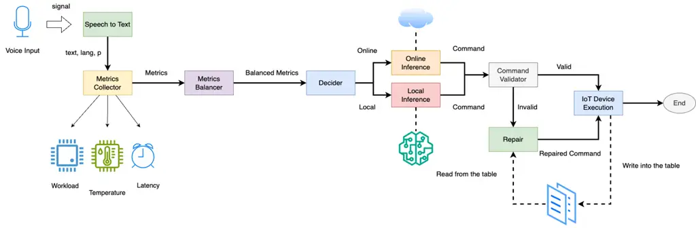
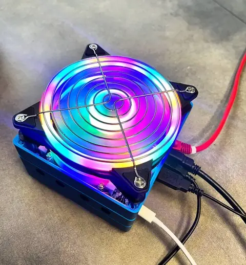
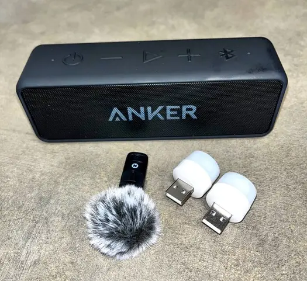
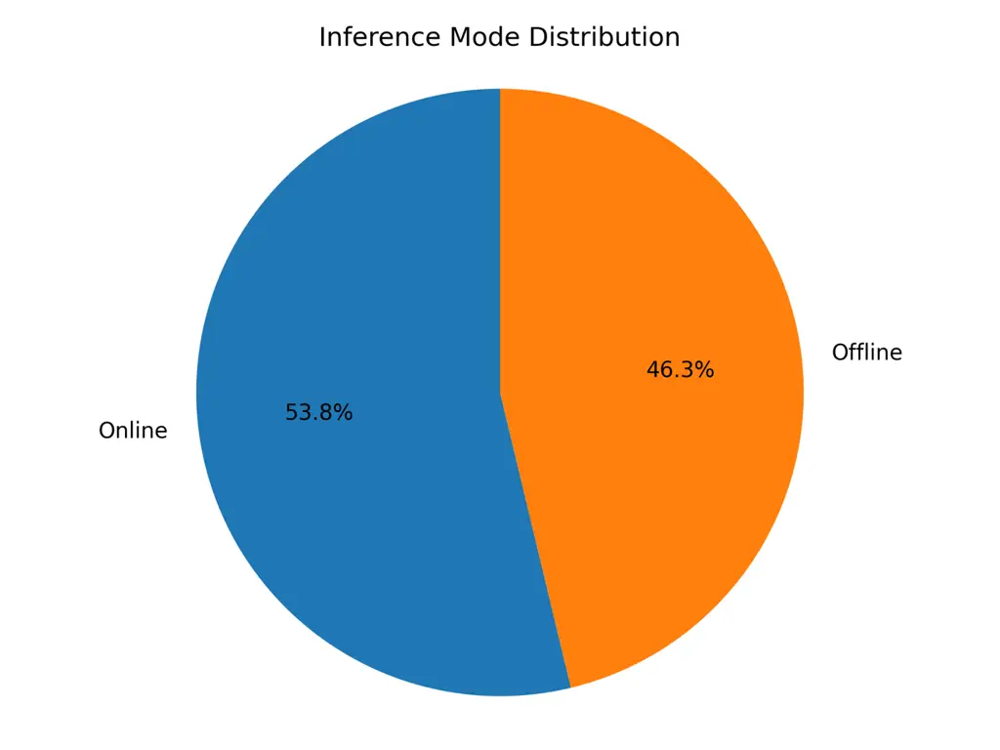
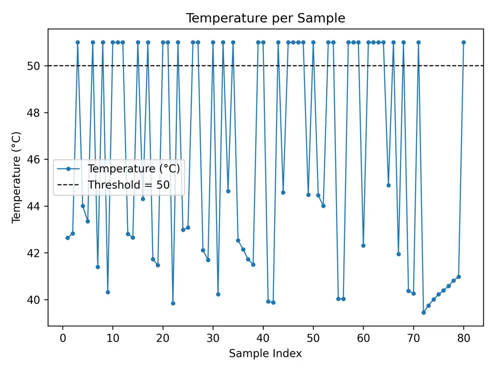
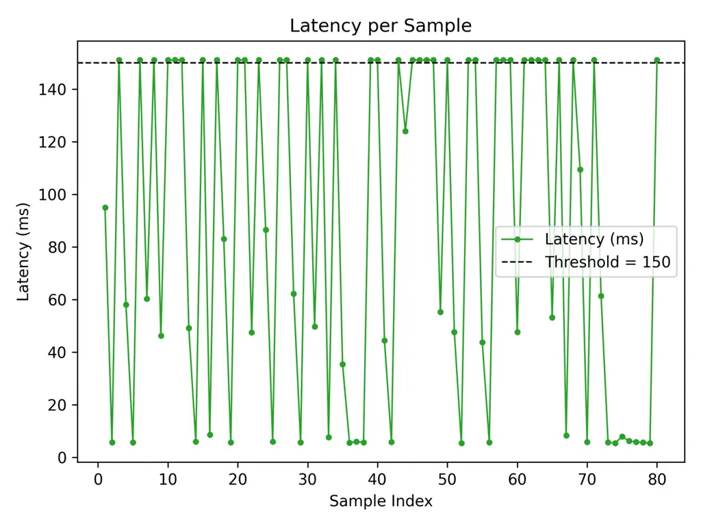
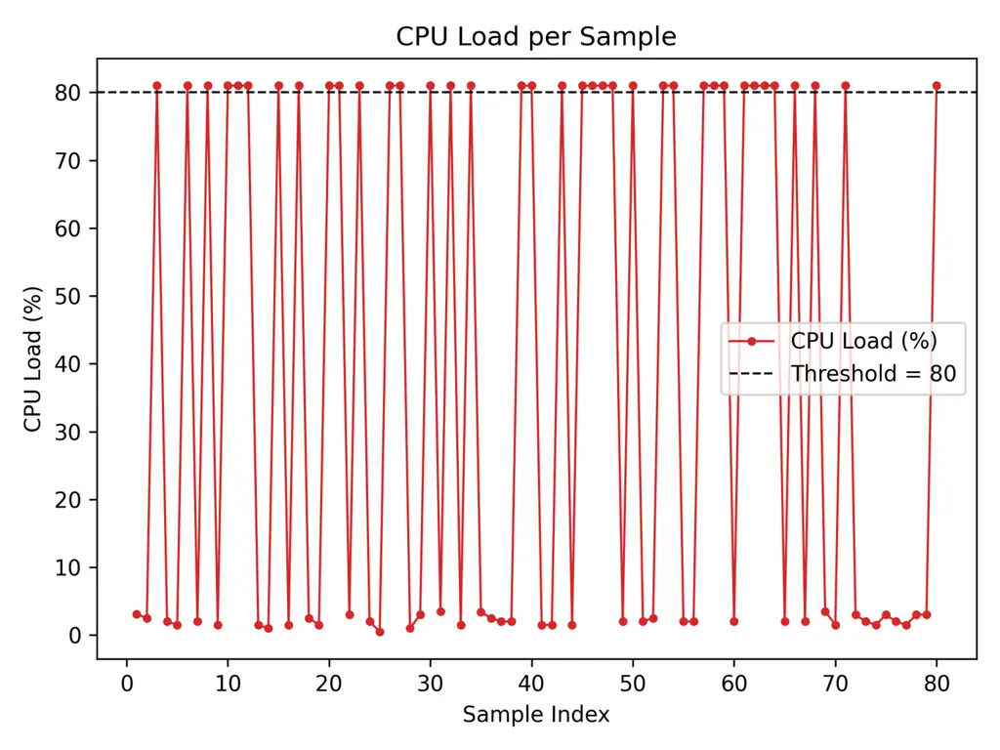

# Adaptive Edge-Cloud Inference for Speech-to-Action Systems Using ASR and Large Language Models

Mohammad Jalili Torkamani¹, Israt Zarin² Affiliation: School of
Computing, University of Nebraska–Lincoln  
Lincoln, Nebraska, USA  
Email: mJaliliTorkamani2@huskers.unl.edu, izarin2@huskers.unl.edu

###### Abstract

Voice-based interaction has emerged as a natural and intuitive modality
for controlling IoT devices. However, speech-driven edge devices face a
fundamental trade-off between cloud-based solutions, which offer
stronger language understanding capabilities at the cost of latency,
connectivity dependence, and privacy concerns, and edge-based solutions,
which provide low latency and improved privacy but are limited by
computational constraints. This paper presents ASTA, an adaptive
speech-to-action solution that dynamically routes voice commands between
edge and cloud inference to balance performance and system resource
utilization. ASTA integrates on-device automatic speech recognition and
lightweight offline language-model inference with cloud-based LLM
processing, guided by real-time system metrics such as CPU workload,
device temperature, and network latency. A metric-aware routing
mechanism selects the inference path at runtime, while a rule-based
command validation and repair component ensures successful end-to-end
command execution. We implemented our solution on an NVIDIA Jetson-based
edge platform and evaluated it using a diverse dataset of 80 spoken
commands. Experimental results show that ASTA successfully routes all
input commands for execution, achieving a balanced distribution between
online and offline inference. The system attains an ASR accuracy of
62.5% and generates executable commands without repair for only 47.5% of
inputs, highlighting the importance of the repair mechanism in improving
robustness. These results suggest that adaptive edge-cloud orchestration
is a viable approach for resilient and resource-aware voice-controlled
IoT systems.

###### Index Terms: 

Edge-cloud computing, Adaptive interface routing, Automatic Speech
Recognition, Large Language Models, Speech-to-action systems, IoT

## I Introduction

The rapid growth of the Internet of Things (IoT) has increased the need
for easy-to-use and intuitive user interfaces \[1\]. Among these
interfaces, voice-based control is one of the most convenient methods
for operating IoT devices such as smart lights, sensors, and home
appliances \[2\]. In many IoT systems, voice commands are processed
using cloud-based systems \[3\]. In this approach, audio data is sent
over the internet to powerful remote servers, where speech recognition
and language understanding are performed. Popular voice assistants such
as Amazon Alexa and Google Home rely on cloud platforms like Amazon Web
Services (AWS) to handle these tasks. Alternatively, edge-based systems
process data close to where it is generated, without relying on remote
cloud servers or constant internet connectivity. In voice-controlled IoT
applications, edge devices such as the Jetson, Raspberry Pi, or smart
gateways can perform speech recognition and command interpretation
locally \[4\]. This reduces dependence on the cloud and can improve
response time and reliability.

Cloud-based solutions provide high accuracy in Automatic Speech
Recognition (ASR) and strong Large Language Model (LLM) capabilities due
to the sufficient resources they contain \[5\]. Recent work has shown
that large-scale foundation models can effectively handle noisy,
real-world data and improve system robustness across diverse industrial
and scientific domains with minimal human intervention \[6, 7, 8\].
However, cloud-based approaches depend on stable internet connectivity,
introduce higher latency, and raise privacy concerns. In contrast,
edge-based systems offer better privacy and offline operation but are
constrained by limited computational and energy resources, strict
latency requirements, and scalability challenges \[9\]. These
constraints can lead to slower inference and reduced performance when
complex models are deployed directly on edge devices. Previous research
has explored techniques such as model compression, edge-aware
optimization, inference acceleration, fixed or simplified voice
commands, edge-optimized inference frameworks, and taxonomic
classifications of IoT voice-control devices \[10, 11\]. Most of these
studies focus primarily on reducing latency or cost. However, relatively
few works investigate deployable hybrid systems that can dynamically
balance computation between edge and cloud resources.

To address this gap, this paper proposes an adaptively routed,
voice-to-action, open-source solution ¹¹ 1 All artifacts, including the
source code, dataset, and experimental results, are available on
https://github.com/mohammadJaliliTorkamani/ASTA. Our solution consists
of an ASR pipeline, an LLM-based inference module, and a rule-based
routing component. The router dynamically selects between local (edge)
and remote (cloud) processing based on real-time system metrics such as
latency, device temperature, and CPU workload. This design enables
privacy-aware, low-latency, efficient, and reliable natural language
control of IoT devices. This approach is valuable, as IoT systems must
operate under strict constraints while maintaining both efficiency and
accuracy. The proposed solution is designed for real-world applications,
including smart homes and assistive technologies. Furthermore, system
robustness is enhanced through command history-aware validation
mechanisms. By jointly considering system metrics, adaptive routing, and
command validation, our solution delivers reliable, efficient, and
natural voice-based control for IoT environments.

## II Related Work

In this section, we present a literature review of systems and methods
related to adaptive voice-to-IoT research works. Our focus is on
approaches that convert speech into actionable commands, balance local
and remote processing, and ensure privacy, reliability, and real-time
responsiveness across heterogeneous IoT environments.

Edge-Cloud Hybrid and Adaptive Voice Systems: Early efforts to bridge
ASR and LLMs have sought to balance latency, accuracy, and privacy. Qin
et al.\[12\] introduced Tiny-Align, a lightweight bridge between ASR and
LLMs operating at the embedding level (BridgeFormer, EmbedLink). While
it delivers fast and precise results on-device, its performance degrades
under heavy workloads. Building upon this notion of adaptability, Shibo
Y\[13\] employed an NSGA-II policy to dynamically route requests between
edge and cloud, optimizing quality, latency, and cost simultaneously. In
a similar vein, Santosh Gondi\[14\] analyzed the energy–privacy
trade-offs that arise in hybrid pipelines, emphasizing the need for
flexible yet efficient voice systems. Complementary to these approaches,
Lukas Beno\[15\] demonstrated the feasibility of containerized on-edge
ASR deployments, highlighting their potential to replace cloud-centric
architectures with portable, privacy-conscious setups. Hewitt and
Cunningham\[16\] provided a taxonomy of modern IoT voice systems (e.g.,
Alexa, Siri), focusing on how they balance interaction, usability, and
privacy. Their findings suggest that dual-mode architectures—executing
commands locally when privacy is critical, or routing to the cloud when
deeper reasoning is required—are essential for next-generation adaptive
systems. Building upon these insights, our work adopts an intelligent
router that dynamically switches between local and cloud inference
according to device load, latency, and privacy constraints.

Lightweight and Quantized ASR for Edge Devices: As computational
resources on IoT nodes are limited, several studies have explored model
compression and quantization to enable efficient speech recognition on
small devices. Feng et al.\[17\] demonstrated that quantizing ASR models
to 3–8 bits can reduce memory and latency by up to tenfold with
negligible accuracy loss, proving that low-bit quantized models are
viable for embedded environments. In parallel, Malche et al.\[18\]
developed an 8-bit CNN-based keyword spotting system capable of running
efficiently on low-power microcontrollers such as the Arduino Nano.
Similarly, Nambiappan et al.\[19\] proposed an edge-oriented speech
recognition framework for human–robot communication using predefined
command templates. Together, these studies illustrate that lightweight
ASR systems can operate locally with high efficiency, inspiring our
integration of quantized ASR modules and wake-word detection into an
adaptive IoT pipeline that scales between edge and cloud operation.

LLM–ASR Integration and Multimodal Alignment: The integration of ASR
with LLMs has evolved rapidly toward unified and modular architectures.
Bai et al.\[20\] proposed Seed-ASR, which directly incorporates raw
speech into an LLM framework for multilingual recognition without
auxiliary models. Following a similar philosophy of simplicity, Zhifu
Gao\[21\] showed that a compact combination of a speech encoder,
projector, and chat-trained LLM can outperform more complex pipelines
while maintaining clarity and efficiency. Complementary to these, Wu et
al.\[22\] introduced compressed acoustic features to feed speech into
decoder-only LLMs, while Frank et al.\[23\] used a dual-encoder
mechanism to align speech and text embeddings for multilingual
understanding. Leo et al. develop an offline and privacy-oriented
speech-to-text model that integrates the Vosk ASR engine and small NLP
microservices to have real-time corrections\[24\]. Earlier work by Qin
et al.\[12\] and Sambal Shikhar\[25\] further emphasized modular,
streaming pipelines where ASR, LLM, and TTS components interact in real
time. Collectively, these works support a trend toward compact,
edge-first architectures that can dynamically shift workloads between
local and cloud environments based on real-time context.

Text-to-Speech and Multilingual Voice Generation: Parallel progress in
text-to-speech (TTS) has further enriched end-to-end voice systems. Wang
et al.\[26\] proposed a one-stream, zero-shot TTS architecture (BiCodec)
that unifies multi-stage tokenization into a single coherent pipeline,
reducing latency while improving naturalness. Edresson’s XTTS\[27\] and
SC-GlowTTS\[28\] systems advanced multilingual and zero-shot synthesis,
enabling rapid speaker adaptation and voice cloning across languages
with minimal data. Wei Ping’s Deep Voice 3\[29\] shifted the focus
toward scalability, offering an all-convolutional attention-based design
capable of production-level throughput. Together, these approaches
demonstrate how fast and expressive synthesis can complement low-latency
ASR and LLM components. Our project adopts similar TTS principles to
deliver responsive, natural voice feedback while maintaining edge-first
processing and privacy-aware routing.

Evaluation and Benchmarks: To assess performance and realism, Yiming’s
VoiceBench\[30\] introduced a benchmark for testing voice assistants
under diverse conditions, revealing that current models often neglect
real-world variability, adaptive routing, and privacy safeguards.
Meanwhile, Navonil Majumder\[31\] advanced text-to-audio generation
through diffusion-based learning (Tango), aligning textual meaning with
generated sound for higher conceptual fidelity. These works emphasize
the importance of holistic evaluation—beyond recognition accuracy—to
include adaptability, contextual understanding, and responsiveness, all
of which are central to our design philosophy.

In summary, prior research has explored multiple dimensions of
speech-driven systems—from efficient edge-based ASR and dynamic
edge-cloud routing to unified LLM–ASR architectures and multilingual TTS
synthesis. Our project consolidates these advances into an adaptive,
privacy-preserving, and locally prioritized voice-IoT framework that
continuously monitors device metrics to decide which inference interface
is used, ensuring both responsiveness and reliability.

## III Solution

Fig. 1: ASTA pipeline workflow.

Overall, as depicted in Figure 1, user voice input is first transcribed
by an offline ASR module. Then, a metrics collection layer collects
system indicators such as CPU workload, device temperature, and network
latency. These metrics are evaluated by a rule-based decision-making
unit, which dynamically selects between local and remote inferences. The
generated commands are then validated and, if necessary, repaired using
the commands history table before being executed on the target IoT
devices. Finally, execution outcomes along with the user command are
logged to update the user’s command history table to help potential
future validations.

### III-A Data Collection

The workflow begins by acquiring raw audio input from a connected
microphone. The audio is processed by a lightweight 8-bit tiny ASR
engine based on the faster-whisper implementation. This ASR model is
optimized for fast transcription and reduced computational overhead,
making it suitable for deployment on resource-constrained edge devices.

### III-B Metrics Monitoring and Balancing

Our tool monitors runtime system metrics, including CPU utilization,
device temperature, and network latency. These metrics form the basis of
the adaptive routing mechanism, enabling the system to select the most
suitable inference mode at runtime. Offline inference is selected under
two conditions: high CPU utilization (above 80%) and elevated device
temperature (above 50$`{}^{\circ}\mathrm{C}`$). This combination
indicates that the edge device is under heavy computational and thermal
stress, making additional network-based processing undesirable for
maintaining system robustness. In addition, when network latency to the
OpenAI server exceeds 150ms, online inference may fail to meet real-time
responsiveness requirements. In such cases, inference is performed
offline using the local LLM. In all other scenarios, online inference is
preferred, as the device has sufficient available resources to establish
a stable connection to cloud-based LLM APIs while maintaining acceptable
latency and performance. In our experiments, since the edge device is
typically underutilized, we introduce controlled, probabilistic
perturbations to the monitored metrics that, with a probability of 0.5,
deliberately push them beyond predefined thresholds. This mechanism
ensures a balanced distribution between online and offline inference
decisions.

### III-C Online and Offline Interface

For online inference, we used the cost-efficient yet relatively powerful
GPT-3.5-turbo model via web APIs, selected for its favorable trade-off
between cost and performance, while the TinyLlama-1.1B-chat-v1.0 model
was employed for offline inference. This enables operation without
internet connectivity while preserving user privacy. Offline inference
is selected when system metrics do not remain within safe operating
ranges, allowing commands to be processed locally with minimal latency,
CPU load, and thermal impact.

### III-D Command Validation

After the LLM produces a structured command, the system performs
multi-layer command validation to ensure validity, completeness, and
executability. Validation is conducted across three layers: action,
device, and index.

The action layer verifies that the requested operation is included and
supported (e.g., turning a device on or off). The device layer checks
whether the referenced device exists and is correctly identified. The
index layer ensures that a specific device instance is specified. If any
component is missing or invalid, the system attempts automatic command
repair. For example, if a user issues the command “turn on the light”
without specifying which light, the system selects the most frequently
used light whose action is ‘turn on’ from the history table and
reconstructs the command as “turn on light 1”.

### III-E Execution Layer

Once a command is validated, it is passed to the execution layer, where
it is translated into a concrete IoT control action. This layer
interfaces with connected devices, such as smart lights or speakers,
using predefined communication protocols. Based on the validated action,
device type, and index, the execution module dispatches the appropriate
command to the target device. All executed actions are recorded in the
history table, enabling future command inference and contextual
understanding. The execution layer completes the voice-to-action
pipeline by ensuring reliable, accurate, and end-to-end control of IoT
devices.

## IV Evaluation

We deployed the proposed solution on a Jetson Mate Xavier NX edge device
(Figure 2), equipped with a microphone, two USB-powered lights, and a
speaker (Figure 3). To evaluate the system, we constructed a dataset
consisting of 80 audio files, each containing an English-spoken command.
The dataset includes a diverse set of prompts, such as syntactically
correct and complete commands, index-variant commands, compound
commands, commands involving unsupported devices, and ambiguous or
irrelevant inputs. This diversity enables a comprehensive evaluation of
the system’s ability to handle invalid inputs, assess ASR performance,
and evaluate end-to-end command execution. Each audio file in the
dataset was processed by the pipeline, and evaluation statistics were
extracted from the JSON artifacts generated by the tool.

Fig. 2: Jetson Mate Xavier NX edge device used for local ASR and LLM
inference.

Fig. 3: Accessories used in the experiment, including a microphone,
speaker, and USB-powered lights.

Overall, our experimental results indicate that the ASTA pipeline
successfully routed all input prompts to the command execution unit. As
shown in Figure 4, 43 samples (53.8%) were routed to online inference,
while 37 samples (46.2%) were processed offline. This near-even split is
expected and primarily reflects the metric balancer factor of 50%.
Regarding ASR accuracy, 50 samples (62.5%) were correctly transcribed,
and our manual analysis shows that the most transcription errors were
attributable to numeric representations (e.g., “5” instead of “five”)
and phonetically similar words (e.g., “too” instead of “two”, or “of”
instead of “off”). Regarding command generation without repair, we found
that the tool generated correct commands for 38 samples (47.5%)
regardless of the inference path. More specifically, 31 samples (72.0%)
were correctly generated using online inference, while the remaining
were done offline. This number further indicates the superiority of the
online inference model, as it is a more powerful model in terms of the
number of neural parameters compared to the offline inference model.
Overall, the tool correctly transcribed and generated execution commands
for 23 samples (28.7%) without requiring any repair, indicating the
importance of the repairing component within our pipeline.

Fig. 4: Distribution of inference mode decisions: online vs. offline.

With respect to performance metrics, the system exhibited an average CPU
load of 38.5%, an average inference latency of 87.3ms, and an average
operating temperature of 46.0$`{}^{\circ}\mathrm{C}`$, all of which fall
within safe and stable operating ranges. However, these metrics should
be interpreted with caution, as they are influenced by metric balancer
offsets and do not exclusively reflect the intrinsic CPU workload,
temperature, or network latency of the edge device. Figure 5 illustrates
the per-sample CPU core temperatures, which consistently remained within
safe operating limits. Similarly, Figures 6 and 7 present the observed
network latency and CPU workload during the experiments. Together, these
results provide insights into appropriate threshold selection for
different edge device deployment scenarios. A summary of the evaluation
results is presented in Table I.

Fig. 5: Average temperature of CPU cores per sample.

Fig. 6: OpenAI inference latency per sample.

Fig. 7: Average workload of CPU cores per sample.

| Metric                     | Value                               |
| -------------------------- | ----------------------------------- |
| Total samples              | 80                                  |
| Inference routing          | 100% (Online: 43, Offline: 37)      |
| Correct ASR                | 62.5%                               |
| Correct command generation | 47.5% (Online: 72%, Offline: 18.9%) |
| Avg. CPU workload          | 38.5%                               |
| Avg. latency               | 87.3 ms                             |
| Avg. temperature           | 46.0^(∘)C                           |

TABLE I: Summary of Experimental Results

## V Conclusions and future work

This paper presents an adaptive dual-path voice-to-action solution
capable of dynamically switching between online and offline inference
systems based on real-time system indicators. Our proposed solution,
ASTA, integrates metric-aware inference routing with a rule-based prompt
validation and repair mechanism prior to command execution. Experimental
results demonstrate that ASTA effectively balances online and offline
inference, achieves an ASR accuracy of 62.5%, and successfully executes
all input commands, thereby providing integrity and reliability for IoT
and edge-AI applications. As future work, we suggest investigating the
use of natural language processing techniques to identify and correct
missing words during transcription and further improving the ASR
accuracy.

## References

- \[1\] M. U. Farooq, M. Waseem, S. Mazhar, A. Khairi, and T.
  Kamal (2015) A review on internet of things (iot). International
  journal of computer applications 113 (1). Cited by: §I.
- \[2\] P. J. Rani, J. Bakthakumar, B. P. Kumaar, U. P. Kumaar, and S.
  Kumar (2017) Voice controlled home automation system using natural
  language processing (nlp) and internet of things (iot). In 2017 Third
  international conference on science technology engineering &
  management (ICONSTEM), pp. 368–373. Cited by: §I.
- \[3\] T. S. Gunawan, M. N. Mokhtar, M. Kartiwi, N. Ismail, M. R.
  Effendi, and H. Qodim (2020) Development of voice-based smart home
  security system using google voice kit. In 2020 6th International
  Conference on Wireless and Telematics (ICWT), pp. 1–4. Cited by: §I.
- \[4\] S. Gondi and V. Pratap (2021) Performance evaluation of offline
  speech recognition on edge devices. Electronics 10 (21), pp. 2697.
  Cited by: §I.
- \[5\] C. Deuerlein, M. Langer, J. Seßner, P. Heß, and J. Franke (2021)
  Human-robot-interaction using cloud-based speech recognition systems.
  Procedia Cirp 97, pp. 130–135. Cited by: §I.
- \[6\] N. Mahjourian and V. Nguyen (2025) Sanitizing manufacturing
  dataset labels using vision-language models. arXiv preprint
  arXiv:2506.23465. External Links:
  [Link](https://arxiv.org/abs/2506.23465) Cited by: §I.
- \[7\] M. Jaberi-Douraki, H. Sholehrasa, X. Xu, and R. A.
  Ramachandran (2025) HySim-llm: embedding-weighted fine-tuning bounds
  and manifold denoising for domain-adapted llms. arXiv preprint
  arXiv:2510.07796. Cited by: §I.
- \[8\] H. Sholehrasa, A. Ghanaatian, D. Caragea, L. A. Tell, J. E.
  Riviere, and M. Jaberi-Douraki (2025) Autopk: leveraging llms and a
  hybrid similarity metric for advanced retrieval of pharmacokinetic
  data from complex tables and documents. arXiv preprint
  arXiv:2510.00039. Cited by: §I.
- \[9\] F. Z. Safaeipour, J. Chakareski, and M. Hashemi (2025)
  Bayes-split-edge: bayesian optimization for constrained collaborative
  inference in wireless edge systems. In Proceedings of the Tenth
  ACM/IEEE Symposium on Edge Computing, pp. 1–13. Cited by: §I.
- \[10\] P. V. Dantas, W. S. Da Silva, L. C. Cordeiro, and C. B.
  Carvalho (2024) A comprehensive review of model compression techniques
  in machine learning. Applied Intelligence 54 (22), pp. 11804–11844.
  Cited by: §I.
- \[11\] B. Guan, J. Cao, X. Wang, Z. Wang, M. Sui, and Z. Wang (2024)
  Integrated method of deep learning and large language model in speech
  recognition. In 2024 IEEE 7th International Conference on Electronic
  Information and Communication Technology (ICEICT), pp. 487–490. Cited
  by: §I.
- \[12\] R. Qin, D. Liu, G. Xu, Z. Yan, C. Xu, Y. Hu, S. Wang, X. S.
  Hu, J. Xiong, and Y. Shi (2024) Tiny-align: bridging automatic speech
  recognition and large language model on the edge. arXiv preprint
  arXiv:2411.13766. Cited by: §II, §II.
- \[13\] S. Yu, M. Goudarzi, and A. N. Toosi (2025) Efficient routing of
  inference requests across llm instances in cloud-edge computing. arXiv
  preprint arXiv:2507.15553. Cited by: §II.
- \[14\] S. Gondi and V. Pratap (2021) Performance and efficiency
  evaluation of asr inference on the edge. Sustainability 13 (22).
  External Links: [Link](https://www.mdpi.com/2071-1050/13/22/12392),
  ISSN 2071-1050, [Document](https://dx.doi.org/10.3390/su132212392)
  Cited by: §II.
- \[15\] L. Beňo, R. Pribiš, and P. Drahoš (2021) Edge container for
  speech recognition. Electronics 10 (19). External Links:
  [Link](https://www.mdpi.com/2079-9292/10/19/2420), ISSN 2079-9292,
  [Document](https://dx.doi.org/10.3390/electronics10192420) Cited by:
  §II.
- \[16\] M. Hewitt and H. Cunningham (2022) Taxonomic classification of
  iot smart home voice control. arXiv preprint arXiv:2210.15656. Cited
  by: §II.
- \[17\] C. Feng, Y. Lin, S. Zhuo, C. Su, R. K. Ramakrishnan, Z. Yuan,
  and X. Zhang (2025) Edge-asr: towards low-bit quantization of
  automatic speech recognition models. arXiv preprint arXiv:2507.07877.
  Cited by: §II.
- \[18\] T. Malche, S. Budhani, P. K. Soni, and G. M. Upadhyay (2025)
  Voice-activated home automation system for iot edge devices using
  tinyml. Discover Internet of Things 5 (1), pp. 68. Cited by: §II.
- \[19\] H. R. Nambiappan, E. Karim, J. R. Saurav, A. Srivastav, and F.
  Makedon (2022) Edge-iot framework for speech and mobile-based
  human-robot interaction. In Proceedings of the 20th Annual
  International Conference on Mobile Systems, Applications and Services,
  pp. 527–528. Cited by: §II.
- \[20\] Y. Bai, J. Chen, J. Chen, W. Chen, Z. Chen, C. Ding, L.
  Dong, Q. Dong, Y. Du, K. Gao, et al. (2024) Seed-asr: understanding
  diverse speech and contexts with llm-based speech recognition. arXiv
  preprint arXiv:2407.04675. Cited by: §II.
- \[21\] Z. Ma, G. Yang, Y. Yang, Z. Gao, J. Wang, Z. Du, F. Yu, Q.
  Chen, S. Zheng, S. Zhang, and X. Chen (2025) Speech recognition meets
  large language model: benchmarking, models, and exploration.
  Proceedings of the AAAI Conference on Artificial Intelligence 39,
  pp. 24840–24848. External Links:
  [Document](https://dx.doi.org/10.1609/aaai.v39i23.34666) Cited by:
  §II.
- \[22\] J. Wu, Y. Gaur, Z. Chen, L. Zhou, Y. Zhu, T. Wang, J. Li, S.
  Liu, B. Ren, L. Liu, and Y. Wu (2023) On decoder-only architecture for
  speech-to-text and large language model integration. External Links:
  [Document](https://dx.doi.org/10.48550/arXiv.2307.03917) Cited by:
  §II.
- \[23\] F. Gomez, R. Sanabria, Y. Sung, D. Cer, S. Dalmia, and G.
  Abrego (2024) Transforming llms into cross-modal and cross-lingual
  retrieval systems. pp. 23–32. External Links:
  [Document](https://dx.doi.org/10.18653/v1/2024.iwslt-1.4) Cited by:
  §II.
- \[24\] S. Di Leo, L. De Cicco, and S. Mascolo (2025) Real-time
  speech-to-text on edge: a prototype system for ultra-low latency
  communication with ai-powered nlp. Information 16 (8), pp. 685. Cited
  by: §II.
- \[25\] S. Shikhar, M. I. Kurpath, S. S. Mullappilly, J. Lahoud, F.
  Khan, R. M. Anwer, S. Khan, and H. Cholakkal (2025) LLMVoX:
  autoregressive streaming text-to-speech model for any llm. arXiv
  preprint arXiv:2503.04724. Cited by: §II.
- \[26\] X. Wang, M. Jiang, Z. Ma, Z. Zhang, S. Liu, L. Li, Z. Liang, Q.
  Zheng, R. Wang, X. Feng, et al. (2025) Spark-tts: an efficient
  llm-based text-to-speech model with single-stream decoupled speech
  tokens. arXiv preprint arXiv:2503.01710. Cited by: §II.
- \[27\] E. Casanova, K. Davis, E. Gölge, G. Göknar, I. Gulea, L.
  Hart, A. Aljafari, J. Meyer, R. Morais, S. Olayemi, and J.
  Weber (2024) XTTS: a massively multilingual zero-shot text-to-speech
  model. External Links:
  [Document](https://dx.doi.org/10.48550/arXiv.2406.04904) Cited by:
  §II.
- \[28\] E. Casanova, C. D. Shulby, E. Gölge, N. M. Müller, F. S. de
  Oliveira, A. C. Júnior, A. da Silva Soares, S. M. Aluísio, and M. A.
  Ponti (2021) SC-glowtts: an efficient zero-shot multi-speaker
  text-to-speech model. In Interspeech, External Links:
  [Link](https://api.semanticscholar.org/CorpusID:233210361) Cited by:
  §II.
- \[29\] W. Ping, K. Peng, A. Gibiansky, S. Ö. Arik, A. Kannan, S.
  Narang, J. Raiman, and J. Miller (2017) Deep voice 3: 2000-speaker
  neural text-to-speech. ArXiv abs/1710.07654. External Links:
  [Link](https://api.semanticscholar.org/CorpusID:26100519) Cited by:
  §II.
- \[30\] Y. Chen, X. Yue, C. Zhang, G. Xiaoxue, R. Tan, and H. Li (2024)
  VoiceBench: benchmarking llm-based voice assistants. External Links:
  [Document](https://dx.doi.org/10.48550/arXiv.2410.17196) Cited by:
  §II.
- \[31\] N. Majumder, C. Hung, D. Ghosal, W. Hsu, R. Mihalcea, and S.
  Poria (2024) Tango 2: aligning diffusion-based text-to-audio
  generations through direct preference optimization. pp. 564–572.
  External Links: [Document](https://dx.doi.org/10.1145/3664647.3681688)
  Cited by: §II.
