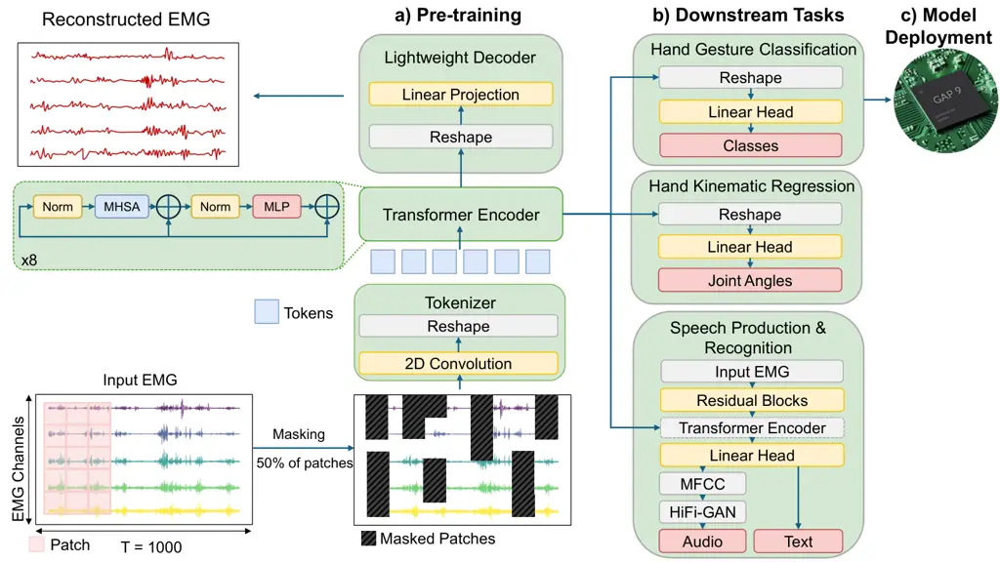

# TinyMyo: a Tiny Foundation Model for Flexible EMG Signal Processing at the Edge

Matteo Fasulo    Giusy Spacone    Thorir Mar Ingolfsson    Yawei Li   
Luca Benini    Andrea Cossettini ^(†)^(†)thanks: This work was supported
in part by the ETH Future Computing Laboratory (EFCL), by a donation
from Huawei Technologies, and by a grant from the Swiss National
Supercomputing Centre (CSCS) under project ID lp12 on
Alps.^(†)^(†)thanks: M. Fasulo, G. Spacone, T. M. Ingolfsson, Y. Li, A.
Cossettini, and L. Benini are with the Integrated Systems Laboratory of
ETH Zürich, Zürich, Switzerland
(gspacone@iis.ee.ethz.ch).^(†)^(†)thanks: L. Benini is also with the
Department of Electrical, Electronic and Information Engineering (DEI),
University of Bologna, Bologna, Italy.

###### Abstract

Objective: Surface electromyography (EMG) is a non-invasive sensing
modality widely used in biomechanics, rehabilitation, prosthetic
control, and human-machine interfaces. Despite decades of use, achieving
robust generalization across subjects, recording systems, and
acquisition protocols remains challenging. While foundation models (FMs)
are gaining traction for EMG, existing approaches remain limited to
single downstream tasks and lack deployability on embedded platforms.
This work addresses these limitations. Methods: We present TinyMyo, a
lightweight FM based on a Transformer encoder architecture. The model is
pre-trained in a self-supervised manner using masked reconstruction on
publicly available datasets. With only 3.6M parameters, TinyMyo is
designed to support multiple downstream tasks through minimal
task-specific head adaptations. Results: We demonstrate generalization
across hand gesture classification, hand kinematic regression, speech
production and speech recognition, with performance comparable to or
surpassing the state of the art (SoA), and model size below 5M
parameters. We achieve SoA results compared to previous FM-based works
on the NinaPro DB5 (89.4%), UCI-EMG (97.56%), and EPN-612 (96.74%)
datasets. We demostrate the first-time deployment of an EMG FM on an
ultra-low power microcontroller (GAP9), with an inference time of 0.785
s, energy of 44.91 mJ and power envelope of 57.18 mW. Conclusion:
TinyMyo demonstrates that compact, self-supervised EMG FM can guarantee
strong generalization across multiple downstream tasks while remaining
compatible with low-power edge devices. Significance: TinyMyo is the
first EMG FM for ultra-low-power edge-devices, enabling scalable and
energy-efficient sensing for motor intent decoding, neuromuscular
assessment, and biosignal-driven human–machine interaction.

###### Index Terms: 

EMG, self-supervised, foundation model, edgeAI, gesture recognition,
kinematic regression, speech

## I Introduction

Electromyography (EMG) measures variations in the electrical activity of
muscles during contractions, reflecting the motor-neuron activation
patterns \[1\]. EMG can be acquired using invasive methods (needle EMG),
suitable for a detailed characterization of individual motor units, or
using non-invasive, surface-based techniques, to capture the global
activity of muscle fibres  \[1, 2\].

Surface EMG has found extensive application across a wide range of
domains, including biomechanical analysis and rehabilitation \[2\],
human–robot interaction \[3\], prosthetic control \[4\], and emerging
human–computer interaction interfaces \[5\]. However, despite decades of
widespread use, many important challenges remain.

EMG signals are strongly affected by noise, motion artifacts,
cross-talk, and acquisition variability across electrode layouts,
hardware platforms, and acquisition pipelines \[6, 7\]. In addition,
both inter-subject and intra-subject factors \[8\], including anatomy,
electrode placement, skin impedance, and physiological variability lead
to substantial distribution shifts, hindering generalization \[9\].

Foundation Models (FM) offer a great promise to address these
challenges. Inspired by the success of self-supervised pre-training in
vision, language, and speech, as well as by emerging applications in
biosignals \[10\], the core hypothesis is that large-scale datasets can
be leveraged to learn high-level, platform and subject-agnostic signal
representations. For EMG, such models could provide a unified backbone
for many downstream tasks, building upon a robust, device-agnostic
feature extraction, improving generalization across devices and
subjects. However, progress in FMs of EMG has been limited by the
scarcity of large sEMG corpora, and only with recent large-scale
datasets (collected from thousands of users) \[11\] the exploration of
generalized FMs of EMG became viable.

In this context, existing EMG FMs present significant limitations.
Current models mostly focus on a single task (typically gesture
classification) \[12, 13\]. Furthermore, the size of EMG FMs remains
large, and no prior work demonstrated the deployment of an EMG FM on
embedded hardware. This motivates the need for efficient FM
architectures that meet the memory and computational constraints of
embedded devices.

We address these limitations via the following contribution.

- •
  We present TinyMyo, a lightweight Transformer-based encoder operating
  directly on EMG signals in the time domain. TinyMyo is pre-trained
  using a self-supervised masked-reconstruction framework on publicly
  available, heterogeneous sEMG datasets, achieving high reconstruction
  fidelity with only 3.6 million parameters.
- •
  Unlike previous EMG FMs, which are typically designed around a single
  downstream task or rely on large, domain-agnostic encoders, TinyMyo
  generalizes across heterogeneous sEMG datasets and sensor
  configurations. Our architecture follows the general Transformer
  design adopted in prior EMG works \[12, 13\], formulated in a _unified
  EMG_ FM able to support a wide range of downstream tasks using the
  same pretrained backbone. We demonstrate the versatility of the
  pre-trained encoder through minimal task-specific head adaptations
  across diverse downstream tasks, including hand-gesture classification
  on the Ninapro DB5 \[14\], EPN-612 \[15\], UC Irvine \[16\] and Meta’s
  Generic Neuromotor Interface \[5\] datasets, hand-kinematic regression
  on the Ninapro DB8 \[17\], and speech production and discrimination on
  the Gaddy Silent Speech Dataset \[18\]. Our model achieves competitive
  performances across all downstream tasks, either surpassing SoA or
  guaranteeing a comparable accuracy with a sub-5M class model size.
- •
  We demonstrate for the first time the deployment of an EMG FM on an
  ultra-low-power microcontroller (GAP9), achieving an inference time of
  $`0.785~\text{s}`$, energy of $`44.91~\text{mJ}`$ and power envelope
  of $`57.18~\text{mW}`$.
- •
  We open source the model and the weights to enable reproducibility and
  further research by the community
  ([https://github.com/pulp-bio/BioFoundation](https://github.com/pulp-bio/BioFoundation)).

## II Related Works

Several efforts have been made to develop FMs for biosignals, and most
of the works focused on electrocardiography (ECG), photoplethysmography
(PPG), and electroencephalography (EEG) \[9\]. In contrast, research
dedicated to EMG FMs remains limited.

OTiS \[19\] is a 45 M parameters FM pre-trained on a broad collection of
modalities, which demonstrated the feasibility of handling heterogeneous
time-series data, including diverse input types, sampling rates, and
channel configurations, within a unified pre-training framework. In the
original study, EMG is used exclusively for multi-class muscular disease
classification. Subsequent works by Cheng et al. \[12, 13\] evaluated
the same model on hand-gesture classification using the EPN612 \[15\],
NinaPro DB5 \[14\], NinaPro DB6 \[20\], and UCI EMG \[16\] datasets,
demonstrating high accuracy across all datasets.

MOMENT \[21\] is a 350-M parameter FM pre-trained on a wide range of
domains and temporal resolutions. While the original work did not
consider EMG, recent works \[13, 12\] evaluated it for hand-gesture
classification on the EPN612, NinaPro DB5, NinaPro DB6, and UCI EMG
datasets.

PhysioWave \[12\] introduced a modality-specific FM for EMG, primarily
evaluated on hand-gesture classification using the NinaPro DB5, EPN612,
and UCI EMG. PhysioWave achieved a performance comparable to Moment and
OTIS with a much smaller parameter count (5M for the smaller model).

WaveFormer \[13\] further refined this approach with a lightweight
Transformer model (3.1 M parameters) tailored for sEMG-based gesture
recognition. WaveFormer improved performance over PhysioWave on the
EPN612, NinaPro DB5, NinaPro DB6, and UCI EMG datasets.

Jiang et al. \[22\] introduced PhysioOmni, a multi-modal FM covering
EEG, ECG, EOG and EMG, based on the same encoder as in LaBraM \[23\]
($`5.8`$M parameters per modality, considering its smallest-Base
version). They adopt a decoupled multimodal tokenizer and masked signal
modelling to ensure robustness under arbitrary missing modalities during
inference. During pre-training, PhysioOmni relies on a fixed set of
modalities (EEG, EOG, and EMG), which makes the architecture unsuitable
for pre-training when one modality is missing. Downstream evaluations
include sleep stage classification \[24\] and gait kinematic
regression\[25\].

In this context, existing EMG FMs are limited by the small number of
explored downstream tasks, as well as by the lack of deployability on
embedded platforms. TinyMyo is the first EMG FM to cover a broader range
of downstream tasks with SoA performance, as will be extensively
described in Section IV, while also being deployed on an ultra-low-power
MCU.

## III Methods



Fig. 1: Overview of the TinyMyo architecture. (a) Pre-training
framework: the input signal is first tokenized using a
channel-independent patching strategy with random masking, processed by
eight bidirectional Transformer Encoder blocks, and reconstructed by a
Lightweight Decoder. (b) Downstream architectures: after pre-training,
the Decoder is removed and replaced with task-specific heads. For
Hand-Gesture Classification and Kinematic Regression, a linear head is
used to produce output classes or joint angles. For speech-related
tasks, the EMG input is first downsampled through residual convolutional
blocks and then passed through the pre-trained Transformer Encoder,
followed by a linear head. The output is text for the Speech Recognition
task. For the Speech Production task, a vocoder (HiFi-GAN) is added to
produce audio from the predicted MFCC features. (c) Model Deployment:
the architecture for the hand-gesture classification task is implemented
on the GAP9 microcontroller.

Figure 1 shows the TinyMyo framework. In the following sections, we
present the strategy adopted for model pre-training (Sect. III-A) and
downstream tasks (Sect. III-B).

### III-A Foundation Model Pre-Training

#### III-A1 Tokenization

We adopt a channel-independent patching strategy, preserving per-channel
granularity at the embedding stage. Unlike EEG models that mix spatial
information during tokenization via 2D convolutions spanning multiple
channels \[26\] or project them into a unified latent space \[27\], we
embed channels independently using a $`1\times L`$ kernel, and the
subsequent transformer layers learn inter-channel dependencies via
attention \[28\]. This design choice is grounded in the physiological
nature of EMG recordings, where each channel corresponds to a distinct
anatomical location.

Formally, given an input EMG signal
$`\mathbf{X}\in\mathbb{R}^{T\times C}`$, with $`T`$ timesteps and $`C`$
channels, we apply a sliding window with patch length $`L`$ and stride
$`S`$ independently to each channel. This yields a grid of patches
$`\mathbf{P}\in\mathbb{R}^{C\times N_{p}\times L}`$, where
$`N_{p}=\lfloor(T-L)/S\rfloor+1`$ is the number of temporal patches per
channel.

We employ a window of $`T=1000`$ timesteps, $`L=S=20`$, and $`C=16`$,
yielding to $`50`$ tokens per channel ($`N_{p}`$) and a total sequence
length of $`800`$ tokens ($`N`$).

As input sequence for the Transformer, we flatten the channel and
temporal dimensions, resulting in a total sequence length of
$`N=C\times N_{p}`$. Each patch $`\mathbf{P}_{c,i}`$ ($`c`$ is the
channel index and $`i`$ is the patch index) is mapped to a latent
embedding of dimension $`d_{e}`$ via a shared learnable linear
projection $`\mathbf{W}_{\mathrm{proj}}\in\mathbb{R}^{d_{e}\times L}`$.
The resulting token sequence $`\mathbf{E}\in\mathbb{R}^{N\times d_{e}}`$
consists of embeddings
$`\mathbf{E}_{k}=\mathbf{W}_{\mathrm{proj}}\,\mathbf{P}_{c,i}^{\top}`$
where the token index $`k`$ corresponds to the flattened arrangement of
channel-time pairs $`(c,i)`$. We do not add learnable positional
embeddings; instead, we inject positional information via Rotary
Position Embeddings (RoPE) \[29\] within the attention blocks.

#### III-A2 Architecture

We adopt an Encoder-Decoder architecture.

The Encoder (see Fig. 1) comprises 8 layers with an embedding dimension
of 192 and 3 attention heads. We utilize an MLP ratio of 4.0 (size 768),
QKV bias (without QK norm), and a dropout rate of 0.1 for attention,
projection, and drop-path. The lightweight Decoder shares the embedding
dimension of 192.

We adopt a RoPE approach, which introduces position information by
rotating query and key vectors in 2D planes instead of adding a position
vector; such a method has already been adopted for biosignals \[30, 12,
13\].

During pre-training, the Encoder’s output is passed to a lightweight
Decoder (3.9k parameters), consisting of a linear layer that outputs a
sequence $`\mathbf{\hat{P}}`$, which is a reconstruction of the original
patch sequence $`\mathbf{P}`$. Our approach draws inspiration from
SimMIM \[31\], which demonstrates that a minimal reconstruction head
(e.g., a single linear layer) is sufficient for effective
self-supervised pre-training.

The use of a lightweight decoder is intentional: placing the full
reconstruction burden on the encoder forces it to learn semantically
rich and task-agnostic representations, rather than relying on a
high-capacity decoder to compensate for missing information. This design
strategy is supported by recent survey analyses in the masked image
modeling literature: shallow decoders limit shortcut learning and
encourage the formation of stronger latent representations within the
encoder \[32\]. As a result, the learned features exhibit improved
generalization across downstream tasks and recording conditions.

#### III-A3 Pre-training objectives

We adopt a random-masking approach \[31\], where a random subset
$`\mathcal{M}`$ of tokens is replaced by a learnable
$`\mathcal{[MASK]}`$ token. Applying the masking over each patch
enforces contextual inference over tens of milliseconds (physiologically
meaningful burst segments), rather than trivial gap filling. We adopt a
masking ratio of $`50\%`$ as in previous works \[28, 26\].

We employ the Smooth L1 Loss function as reconstruction objective
between masked and original patches, as in \[12\]. We define the
following loss components:

```math
\mathcal{L}_{\mathrm{masked}}=\frac{1}{|\mathcal{MASK}|}\sum_{(c,i)\in\mathcal{MASK}}\mathrm{SmoothL1}(\mathbf{P}_{c,i},\mathbf{\hat{P}}_{c,i}), \tag{1}
```

```math
\mathcal{L}_{\mathrm{visible}}=\frac{1}{|\mathcal{M}|}\sum_{(c,i)\in\mathcal{M}}\mathrm{SmoothL1}(\mathbf{P}_{c,i},\mathbf{\hat{P}}_{c,i}), \tag{2}
```

where $`\mathcal{MASK}`$ and $`\mathcal{M}`$ are the sets of masked and
visible patches, respectively. To avoid overfitting on unmasked input,
the loss on visible patches is reduced by a factor of $`0.1`$. The final
reconstruction objective is given by:

```math
\mathcal{L}_{\mathrm{total}}=\mathcal{L}_{\mathrm{masked}}+0.1\cdot\mathcal{L}_{\mathrm{visible}} \tag{3}
```

All experiments are implemented in Python 3.10 using PyTorch Lightning
and Hydra for modularity, configurability, and reproducibility. The
proposed foundation model is trained on the CSCS Alps HPC infrastructure
using NVIDIA GH200 GPUs, employing a single node with 4x NVIDIA GH200
GPUs in Distributed Data Parallel (DDP) mode. We train using the AdamW
optimizer ($`\beta_{1}=0.9,\beta_{2}=0.98`$, weight decay 0.01) with a
global batch size of 512, utilizing gradient accumulation over 8 batches
and a clipping threshold of 3. The learning rate follows a cosine
schedule for 50 epochs (10 warm-up epochs), peaking at
$`1\times 10^{-4}`$ (minimum $`1\times 10^{-6}`$). The model processes
sequences of 1000 timesteps with a masking ratio of 0.50 .

#### III-A4 Pre-training Datasets

Ninapro DB6 \[20\] contains sEMG from 10 subjects performing 7 hand
grasp types, each repeated 12 times over 5 separate recording days.
Signals were acquired with Trigno sensors (14 channels, $`2~\text{KHz}`$
sampling rate), placed on the forearm. The total dataset size is
$`20.3~\text{GB}`$.

Ninapro DB7\[33\] contains data from 20 intact subjects and 2
transradial amputees, performing 40 movements spanning isolated
finger/wrist actions and grasp patterns. Data were collected using
Trigno sensors (12 channels, $`2~\text{kHz}`$ sampling rate), placed on
the forearm. The total dataset size is $`30.9~\text{GB}`$.

EMG2Pose\[11\] contains data from 193 participants, performing 29
different hand motions. Data were recorded with a custom wristband (16
channels, $`2~\text{kHz}`$ sampling rate). The total dataset size is
$`431~\text{GB}`$.

#### III-A5 Pre-training Data Processing

EMG data are band-pass filtered ($`4^{th}`$ order Butterworth,
$`20-450~\text{Hz}`$), notch filtered ($`50~\text{Hz}`$), normalized to
$`[-1,1]`$, and segmented into 1000-sample windows ($`500~\text{ms}`$ at
$`2~\text{kHz}`$) with 50% overlap, providing sufficient temporal
context \[34\] while controlling computational load.

Datasets with fewer than 16 channels are zero-padded. Given that each
training batch might contain data from each dataset, this approach
ensures consistency in the number of channels per batch.

We did not apply any data augmentation due to the limited effect in
scaling-laws regimes \[35\] and in line with previous works \[12, 13\].

### III-B Downstream Tasks

#### III-B1 Pipeline Overview

For all downstream tasks, the pre-trained encoder is retained and the
decoder removed.

The Encoder output is processed through a channel-fusion and temporal
pooling module (detailed in the following subsection), after which the
resulting representation is fed into task-specific prediction heads,
whose specifics are provided in the corresponding downstream task
sections (see Sec.III-B2).

For each temporal patch index $`p`$, the Encoder outputs a set of
channel-wise embeddings
$`\{\mathbf{z}_{c,p}\in\mathbb{R}^{d_{e}}\}_{c=1}^{C}`$. We fuse these
representations by concatenation, producing a per-patch vector
$`[\mathbf{z}_{1,p}\|\cdots\|\mathbf{z}_{C,p}]\in\mathbb{R}^{C\times d_{e}}`$.
This choice preserves electrode-specific information by retaining the
per-channel structure, allowing the downstream linear head to assign
independent weights to each channel. Ablation studies confirmed that
concatenation consistently outperforms mean-based fusion.

Following channel fusion, we apply temporal average
pooling:$`\ \mathbf{h_{c}}=\frac{1}{N_{c},p}\sum_{p=1}^{N_{p}}\mathbf{z}_{p},`$
where $`\mathbf{z}_{p}\in\mathbb{R}^{C\times d_{e}}`$. This aggregation
step yields a compact representation while preserving discriminative
spatiotemporal structure, and it serves as the input to the final linear
task-specific head.

#### III-B2 Downstream Tasks

|                                 |     |     |     |      |         |
| ------------------------------- | --- | --- | --- | ---- | ------- |
| Dataset                         | \#S | Hz  | Ch  | Loc. | Metric  |
| Hand Gesture Classification     |     |     |     |      |         |
| Ninapro DB5 \[14\]              | 10  | 200 | 16  | FA   | Acc, F1 |
| EPN-612 \[15\]                  | 612 | 200 | 8   | FA   | Acc, F1 |
| UCI-EMG \[16\]                  | 36  | 200 | 8   | FA   | Acc, F1 |
| GNI \[5\]                       | 100 | 2k  | 16  | H/A  | CLER    |
| Hand Kinematic Regression       |     |     |     |      |         |
| Ninapro DB8 \[17\]              | 12  | 2k  | 16  | FA   | MAE     |
| Speech Production & Recognition |     |     |     |      |         |
| Gaddy \[18\]                    | 1   | 1k  | 8   | F/N  | WER     |

_Loc: Location (FA: Forearm, H/A: Hand/Arm, F/N: Face/Neck).  
Pre-processing and windowing details are provided in Section III-B._

TABLE I: Summary of Downstream Datasets.

The pretrained encoder is evaluated on the datasets listed in Table I.
We classify the downstream tasks into three categories: Hand Gesture
Classification, Hand Kinematic Regression, and Speech Synthesis and
Recognition.

Downstream 1: Hand Gesture Classification

This task consists of classifying different types of hand-wrist
movements and is evaluated on the following datasets:

- •
  Ninapro DB5 \[14\]: data from 10 intact subjects, using two Thalmic
  Myo Armbands (16 channels, $`200~\text{Hz}`$). The task consists of
  classifying 52 hand-wrist movements.
- •
  EPN-612 \[15\] data from 612 subjects, using the Myo Armband (8
  channels, $`200~\text{Hz}`$). The task consists of classifying 5 hand
  movements.
- •
  UC Irvine \[16\] data from 36 subjects (8 channels,
  $`200~\text{Hz}`$). The task consists of classifying 7 movements.

Datasets are pre-processed using a band-pass filter (Butterworth,
$`4^{th}`$ order, $`[20-90]~\text{Hz}`$), followed by a notch filter
($`50~\text{Hz}`$). Then, windowing is applied. We perform an ablation
over two different window sizes: $`200~\text{ms}`$ with 25% overlap, and
$`1000~\text{ms}`$ with 25% overlap. Finally, each dataset is normalized
using per-channel z-score normalization.

Compared to the pre-training, datasets with fewer than 16 channels are
not zero-padded because tokenization is performed on a per-channel
basis: having fewer channels simply results in fewer tokens, eliminating
the need for padding.

For Ninapro DB5, we perform a per-repetition split as in \[12\], each
recording contains six repetitions, and for each subject, we assign
whole repetitions to a single split so that no subject data overlaps
across splits (repetitions 1-3-4-6 are used for training, rep. 2 for
validation, and rep. 5 for testing).

The UCI EMG dataset is split by subject index into three disjoint
groups: subjects 1–24 for training, subjects 25–30 for validation, and
subjects 31–36 for testing. Only subjects 11 and 30 performed the
”extended palm” gesture, so they were excluded from all data splits,
hence reducing the total number of gestures to 6.

For EPN-612, we preserve the original per-user organization \[15\] and
derive splits per user. When constructing the testing split, held-out
examples per user are used, ensuring that samples from the same user do
not appear across train, validation, or test splits.

The model head architecture is lightweight and consists of a single
fully connected linear layer that maps the pooled feature representation
(max $`192\times N_{c}`$, $`N_{c}=`$ number of channels ) to the final
class logits ($`N_{o}`$, $`N_{o}=`$number of outputs). No additional
hidden layers, normalization modules, or non-linearities are used in the
head. Hence, the model head has a maximum of
$`192\times N_{c}\times N_{o}`$ parameters. For training, we employ the
cross-entropy loss computed over the predicted logits and the
corresponding ground-truth labels. We evaluate performance using
Accuracy, F1-score, and AUROC.

We repeat each experiment five times using five distinct random seeds
and report the mean performance across runs.

An additional dataset is also considered as part of this downstream
task:

- •
  Generic Neuromotor Interface \[5\] contains data collected from 4900
  participants, recorded with a custom wrist-band developed by Meta
  Reality Labs (16 channels, $`2\text{kHz}`$). Data from only 100
  subjects are publicly available \[36\], randomly selected from the
  entire cohort.

Specifically, we tackle the discrete-gesture task presented in the
original work, i.e., classifying 9 fine finger movements. We treat this
task separately, compared to the three other datasets presented above,
owing to substantial methodological differences in data processing and
evaluation protocols.

No pre-processing is applied to the data. Signals are windowed using
$`8000~\text{ms}`$ windows, no overlap. The train dataset contains 80%
of data from each subject for train, 10% for validation, 10% for test.
The model head consists of a single linear layer, with input size of
$`N_{c}\times 192`$, output size $`9`$. We employ the Cross-Entropy Loss
function, and we conduct 5 runs with 5 seeds values.

We evaluate the performance with the Classification Error Rate (CLER),
defined as the proportion of ground-truth labels for which the matching
prediction is incorrect \[5\]. The CLER is computed per-gesture and
reported as the average across gestures. The CLER formula is given by:

```math
\mathrm{CLER}=\frac{1}{|N_{G}|}\sum_{g\in G}\left(1-\frac{C_{g,g}}{\sum_{p\in G}C_{g,p}}\right).
```

where $`N_{G}`$ is the total number of gestures, $`g\in N_{G}`$,
$`C_{g,g}`$ is the number of correct predictions for gesture $`g`$ and
$`\sum_{p\in G}C_{g,p}`$ is the total number of ground-truth occurrences
of $`g`$. In the original work, the architecture is tested on the full
sequence of EMG data. The architecture proposed in this work cannot
process the entire sequence due to quadratic complexity. We adopt a
windowed inference approach , which involves sliding a window of
$`8\text{s}`$, with $`2\text{s}`$ stride. In order to compare the
original LSTM architecture with the proposed Transformer model, the same
windowed inference strategy is applied to the LSTM during evaluation,
and both results are reported.

Downstream 2: Hand Kinematic Regression

This task consists of predicting continuous hand and wrist movement
(regression). We employ the Ninapro DB8 \[17\] dataset, containing EMG
data from 12 subjects (16 channels, $`2~\text{kHz}`$), with 3 sessions
per subject. Data were collected with an instrumented glove from
ground-truth. The task consists of regressing 5 Degrees of Freedom
(DoFs), defined as linear combinations of the 18 DoFs of the
instrumented glove.

Each EMG channel is independently standardized using z-score
normalization. No filtering is applied since the original data is
already released filtered ($`4\textsuperscript{th}`$ order bandpass
Butterworth filter, $`[10-500~\text{Hz}]`$. The glove data undergo a
mapping from 18 DoFs to 5 Degrees of Actuation. Both EMG and glove data
are then segmented into fixed-size windows with no overlap in two
different settings: $`1000\text{ms}`$ and $`200\text{ms}`$.

Following the author’s recommendations, we consider the first two
sessions for training, the third as validation. The model head
architecture (788 K parameters) consists of a compact series of
pointwise and depthwise convolutions, followed by upsampling to a fixed
length. We employ the L1 loss function. We report the mean absolute
error (MAE), root mean squared error (RMSE), and the coefficient of
determination $`R^{2}`$, averaged over 5 runs with 5 random seed values.
Downstream 3: Speech Synthesis and Recognition

We employ the open-vocabulary dataset presented by Gaddy et al. \[18\].
It comprises 8 channels, sampled at $`1000~\text{Hz}`$, recorded using
wet electrodes, placed on the face. Data were collected from one subject
in multiple sessions while reading pieces of public domain books. The
dataset contains both vocalized (i.e., normal articulation with sound
production) and silent (i.e., articulation without sound production) EMG
data. In the vocalized setting, EMG data were recoded together with a
microphone, serving as ground truth. For the silent setting, audio
recorded during vocalized experiments is aligned to the corresponding
silent EMG data using the dynamic time warping algorithm \[18\].

For both tasks, we adopt the data processing pipeline of \[37\]. A
cascade of notch filters is applied to suppress the first six harmonics
of power line frequency (\[$`60,240,...,420]~\text{Hz}`$), followed by a
high-pass filter (Butterworth, $`2~\text{Hz}`$, 3rd order) and
downsampling from to $`516.79~\text{Hz}`$ \[38\].

For this dataset, we tackle two sub-tasks: Speech Synthesis and Speech
Recognition. Speech Synthesis aims at producing audio from EMG data. The
full speech production pipeline consists of three steps: a Transduction
Model, a Vocoder, and an Automatic Speech Recognition (ASR) model.
First, a Transduction model is trained to reconstruct audio target
features (Mel-Frequency Cepstral Coefficients, MFCC). It consists of 3
residual blocks (as in \[37\]) that downsample the input (1600 samples
to 200 samples). The 200 samples are the input to the pre-trained
Transformer Encoder; we add relative positional embeddings, following
\[37\]. A lightweight linear head follows, with an input dimension of
$`192\times N_{c}`$, output dimension of 26 MFCC.

The model is trained using as loss function the mean of pair-wise MFCC
distances ($`L`$) plus an auxiliary phoneme loss ($`L_{phon}`$)  \[37\].
For silent EMG data, DTW is used to align the MFCC features predicted
from silent EMG to the sequence of target MFCC features obtained from a
parallel vocalized recording. Predicted MFCC audio features are fed to a
HiFi-GAN vocoder, which converts the audio features into raw audio
waveforms. We adopt the publicly available pre-trained HiFi-GAN vocoder
\[38\] without any fine-tuning.

For model evaluation, we employ the Wav2Vec2 \[39\] ASR model,
pretrained on LibriSpeech (English Language) within SpeechBrain \[40\].

Speech Recognition consists of recognizing speech (words) without any
acoustic output, yielding text as output. Direct EMG-to-text prediction
avoids intermediate audio synthesis and reduces model complexity,
yielding improved recognition accuracy \[41\]. This makes the approach
more suitable for deployment on resource-constrained embedded platforms.

The model architecture is the same as before. The input to the final
linear layers has a dimension of $`N_{c}\times 192`$, the output
dimension is 37 (26 lowercase English letters, 10 digits, and space
character). We adopt the Connectionist Temporal Classification (CTC)
\[42\] loss function with a 4-gram language model trained on the
LibriSpeech dataset \[43\]. During inference, beam search is applied to
explore the search space and select the paths with the highest
likelihood.

The dataset is split as in \[37\]. Training is performed using both
silent and vocalized EMG recordings; testing is performed on silent
data. Data are split into training, validation, and test sets using the
original index file containing pairs of book and sentence indexes. Each
utterance is assigned to one of the three splits. During training, a
size-aware sampler is used to group examples, together producing compact
batches and a more efficient training stage.

For both tasks, we use the Word Error Rate (WER) as the evaluation
metric, defined as $`\text{WER}=\frac{S+D+I}{N}`$, where $`S`$, $`D`$,
and $`I`$ denote the number of substitution, deletion, and insertion
errors, respectively, and $`N`$ is the total number of words in the
reference transcription.

#### III-B3 Experimental Settings

All downstream experiments use the AdamW optimizer
($`\beta_{1}=0.9,\beta_{2}=0.98`$) with a batch size of 32, weight decay
0.01, and label smoothing 0.1. We employ a cosine learning rate schedule
(50 epochs, 5 warm-up) peaking at $`5\times 10^{-4}`$ (min
$`1\times 10^{-5}`$) with 0.9 layer-wise decay and 0.1 drop-path. Early
stopping is adopted with a patience of 7 epochs.

We evaluate the downstream tasks under two different settings: (i)
Full-supervised (FS), where the model is trained from scratch on the
task-specific dataset without relying on pre-trained weights; (ii) Full
Finetuning (FT), where the entire model is fine-tuned using layer-wise
learning rate decay to avoid catastrophic forgetting \[44\].

### III-C Model Deployment

We deploy the TinyMyo on the GreenWaves Technologies GAP9 \[45\]
processor, a multi-core RISC-V MCU designed for ultra-low-power edge AI.
The architecture features a hierarchical memory organization consisting
of a large off-chip L3 (HyperRAM), a 1.5 MB on-chip L2 (shared memory),
and a 128 kB L1 (Tightly Coupled Data Memory) shared among a cluster of
8 compute cores and a dedicated cluster controller.

To enable the execution of the Transformer-based architecture, which
exceeds the on-chip L2 capacity in terms of parameters and intermediate
activation maps, we developed a custom deployment toolchain that
implements a hierarchical streaming architecture.

Unlike traditional MCU inference engines that require the full model to
reside in on-chip memory, we treat L2 as a streaming buffer. We
implement a multi-level tiling strategy:

- •
  L3 $`\rightarrow`$ L2: Large tensors (weights and activations) are
  stored in external L3 memory. They are retrieved into L2 slabs on
  demand. For example, in linear and multi-head self-attention layers,
  weights are streamed slab by slab to prevent memory overflows.
- •
  L2 $`\rightarrow`$ L1: Computation is performed by moving data from
  the L2 slabs into L1 tiles. The cluster controller orchestrates
  high-bandwidth DMA transfers, while the 8 worker cores execute compute
  kernels in parallel.

To minimize the overhead of external memory access, we implement a
double-buffered pipeline. While the worker cores compute the current
slab (N), the cluster controller asynchronously pre-fetches the next
slab (N+1) from L3 to L2 or from L2 to L1. This effectively hides the
latency of data movement behind the compute-bound operations of the
transformer blocks.

We apply INT8 quantization to convert all weights and activations from
FP32 to 8-bit fixed-point representations. All intermediate tensors,
including those in MHSA (with integer softmax) and GELU/LayerNorm, are
stored and processed in INT8 format, with only the LayerNorm scale and
shift parameters ($`\gamma`$ and $`\beta`$) retained in FP32. The only
remaining FP32 operation is the final classification layer, which
consumes INT8 inputs and weights but accumulates to FP32 logits to
enable a direct comparison with the original FP32 baseline; in
principle, this layer could also be executed in INT8.

To maximize the utilization of the limited 1.5 MB L2 memory, we employ
an offline liveness analysis pass. Instead of dynamic allocation, the
deployment flow calculates a static memory arena. Tensors are assigned
offsets within this arena based on their execution lifetime, allowing
mutually exclusive buffers (e.g., non-overlapping intermediate feature
maps) to share the same physical memory addresses.

To maintain numerical fidelity while avoiding costly floating-point
operations, all transformer primitives are implemented in fixed-point
arithmetic\[46\]. We use integer-only variants of softmax (i-Softmax),
layer normalization (i-LayerNorm), and GELU activation (i-GELU), which
leverage lookup tables and multiplicative inverses to approximate their
floating-point counterparts with minimal error.

As proof of concept, we deploy the Hand Gesture Classification
downstream task on the EPN-612 dataset.

## IV Results

### IV-A Pre-training

Fig. 2: Example of reconstruction for an EMG window by TinyMyo. Grey
areas: masked regions. White areas: unmasked regions.

Figure 2 shows an example of the reconstruction of the EMG signal
performed by the model. With a parameter count of only 3.6 million (with
only 0.1% of parameters for the decoder), in line with previous works
\[13\], our model demonstrates that high reconstruction fidelity can be
maintained even under a strict parameter budget and low computational
requirements In terms of computational complexity, the model requires
4.0 GFLOPs for pre-training. Inference costs vary by downstream task
complexity: approximately 1.1 GFLOPs for speech tasks, 1.9 GFLOPs for
EPN-612/UCI-EMG, 4.8 GFLOPs for Ninapro datasets, and 13.6 GFLOPs for
the Generic Neuromotor.

|                         |        |                  |                  |                  |                  |                  |                  |                  |                  |                  |
| ----------------------- | ------ | ---------------- | ---------------- | ---------------- | ---------------- | ---------------- | ---------------- | ---------------- | ---------------- | ---------------- |
| Model                   | Params | NinaPro DB5      |                  |                  | EPN-612          |                  |                  | UCI-EMG          |                  |                  |
|                         |        | Acc              | F1               | AUROC            | Acc              | F1               | AUROC            | Acc              | F1               | AUROC            |
| Moment (as in \[12\])   | 385M   | 86.41            | 74.42            | N.A.             | 90.87            | 90.16            | N.A.             | 90.45            | 91.75            | N.A.             |
| Moment (as in \[13\])   |        | 86.41$`\pm`$1.13 | 76.84$`\pm`$1.95 | 99.34$`\pm`$0.12 | 93.83$`\pm`$0.76 | 93.75$`\pm`$0.82 | 99.63$`\pm`$0.09 | 92.79$`\pm`$0.64 | 91.24$`\pm`$0.71 | 99.47$`\pm`$0.11 |
| OTIS (as in \[12\])     | 45M    | 85.31            | 72.61            | N.A.             | 87.55            | 88.03            | N.A.             | 90.62            | 89.28            | N.A.             |
| OTIS (as in \[13\])     |        | 81.79$`\pm`$1.56 | 60.81$`\pm`$2.43 | 98.24$`\pm`$0.22 | 84.82$`\pm`$1.24 | 85.01$`\pm`$1.18 | 97.22$`\pm`$0.31 | 89.14$`\pm`$0.98 | 89.49$`\pm`$1.03 | 98.73$`\pm`$0.18 |
| PhysioWave-Small \[12\] | 5M     | 84.78            | 72.54            | N.A.             | 93.12            | 93.40            | N.A.             | 90.35            | 89.51            | N.A.             |
| WaveFormer \[13\]       | 3.10M  | 87.53$`\pm`$0.92 | 74.66$`\pm`$1.78 | 99.35$`\pm`$0.10 | 95.21$`\pm`$0.68 | 95.22$`\pm`$0.71 | 99.70$`\pm`$0.07 | 93.10$`\pm`$0.58 | 93.20$`\pm`$0.62 | 99.60$`\pm`$0.08 |
| TinyMyo (FS), 200ms     | 3.6M   | 81.94$`\pm`$1.22 | 58.52$`\pm`$3.17 | 96.49$`\pm`$0.20 | 74.33$`\pm`$0.72 | 74.31$`\pm`$0.72 | 93.80$`\pm`$0.24 | 93.63$`\pm`$0.64 | 93.58$`\pm`$0.63 | 99.52$`\pm`$0.11 |
| TinyMyo (FT), 200ms     | 3.6M   | 89.41$`\pm`$0.16 | 77.97$`\pm`$0.59 | 98.59$`\pm`$0.13 | 78.54$`\pm`$0.32 | 78.50$`\pm`$0.35 | 95.20$`\pm`$0.18 | 94.08$`\pm`$0.72 | 94.07$`\pm`$0.70 | 99.50$`\pm`$0.19 |
| TinyMyo (FS), 1000ms    | 3.6M   | 72.42$`\pm`$0.31 | 32.45$`\pm`$1.02 | 94.89$`\pm`$0.30 | 95.18$`\pm`$0.10 | 95.17$`\pm`$0.10 | 99.51$`\pm`$0.03 | 97.56$`\pm`$0.32 | 97.55$`\pm`$0.31 | 99.93$`\pm`$0.02 |
| TinyMyo (FT), 1000ms    | 3.6M   | 79.22$`\pm`$0.93 | 50.89$`\pm`$2.50 | 95.80$`\pm`$0.62 | 96.74$`\pm`$0.09 | 96.74$`\pm`$0.08 | 99.70$`\pm`$0.02 | 97.23$`\pm`$0.70 | 97.22$`\pm`$0.70 | 99.93$`\pm`$0.02 |

Notes: PhysioWave \[12\] use windows of $`\approx 1953\text{ms}`$. EMG
data are upsampled at $`2\text{kHz}`$ and a fixed window size of 1024
samples is used. WaveFormer \[13\] uses a fixed window of 1024 samples;
no information is available on whether resampling is applied.  
FS: model trained from scratch, FT: fine-tuning pretrained model.

TABLE II: Hand Gesture Classification Task — Comparison with State of
the Art.

### IV-B Down-stream Tasks Results

#### 1. Hand Gesture Classification

Table II reports the results obtained on the Ninapro DB5, EPN-612, and
the UC Irvine datasets, comparing TinyMyo to previous FM works.

On the NinaPro DB5 dataset, the fine-tuned model trained with a window
size of $`200\,\text{ms}`$ achieves state-of-the-art performance, with
an accuracy of $`89.41\pm 0.16\,\%`$ and an F1-score of
$`77.97\pm 0.59\,\%`$. Fine-tuning the pre-trained model yields an
improvement of approximately $`7.5\%`$ in accuracy compared to training
from scratch. Moreover, using a window size of $`200\,\text{ms}`$
substantially improves performance over $`1000\,\text{ms}`$ (around
$`10\%`$ for the fine-tuned model). This effect is consistent with the
acquisition protocol, which comprises $`52`$ different movements. Since,
during data pre-processing, we did not remove the transition periods
between gestures in order to emulate real-life use cases, using shorter
windows reduces the likelihood that segments overlapping these
transitions are assigned incorrect gesture labels, thereby mitigating
label noise. It must be noted that this dataset exhibits a substantial
imbalance toward the rest class. To ensure a fair comparison with prior
work, we did not apply any rebalancing techniques during training or
evaluation. Computing a macro-averaged accuracy score reduces the
accuracy to $`75.80\pm 0.62\,\%`$, as expected for an imbalanced
dataset.

On the EPN-612 dataset we achieve SoA results (window size of
$`1000\text{ms}`$, with a global accuracy (FT) of $`96.74\pm 0.09\%`$,
F1-score of $`96.74\pm 0.08\%`$ and AUROC of $`99.70\pm 0.02\%`$.

On the UCI-EMG dataset, the best performance is obtained with an input
window of $`1000\,\text{ms}`$, achieving an accuracy of
$`97.56\pm 0.32`$ %, an F1-score of $`97.55\pm 0.31`$ %, and an AUROC of
$`99.93\pm 0.02`$ %. The performance of the model trained from scratch
is comparable to that obtained with the pre-trained TinyMyo encoder,
which we attribute to the relative simplicity of this downstream task.

| Model                      | Params | CLER              | Inference Method |
| -------------------------- | ------ | ----------------- | ---------------- |
| LSTM, Kaifosh \[5\] ^((a)) | 6.4M   | 0.1819            | Full sequence    |
| LSTM, Kaifosh \[5\] ^((b)) | 6.4M   | 0.1596            | Windowed         |
| TinyMyo - FS               | 3.6M   | 0.144$`\pm`$0.004 | Windowed         |
| TinyMyo - FT               | 3.6M   | 0.153$`\pm`$0.006 | Windowed         |

^((a)): Full sequence results obtained with methods provided by the
authors (\[5\]) ^((b)): results obtained with the same model as in ^(a),
with the windowed-inference method described in the corresponding
Methods section. FS: model trained from scratch, FT: fine-tuning
pretrained model

TABLE III: Discrete Gesture Classification Task- Comparison with SoA

For the Generic Neuromotor Interface - discrete gesture task \[5\], we
achieve a CLER of $`0.144\pm 0.004`$ on the model trained from scratch,
which compares to the 0.1596 (obtained with our windowed inference
method, see Sec. III-B2) obtained with the LSTM model proposed in the
original work, however with $`\approx 44\%`$ reduction in model size. In
this case, the results achieved with the pre-trained FM are worse
($`0.153\pm 0.006`$), which we attribute to the intrinsic nature of the
problem: to emulate the sequential processing behaviour of the original
stacked LSTMs, we imposed a causal mask on the attention mechanism. This
constraint restricts our architecture, initially optimized for
bidirectional dependency modelling, to a strictly left-to-right context,
leading to a degradation in the effectiveness of the pre-trained weights
when the future information on which they were originally trained is no
longer available. Table III reports a summary of the results.

We note that our work is the first to include this dataset among the
downstream tasks and to propose an alternative architecture compared to
the one of the original work.

#### 2. Hand Kinematic Regression

Table IV reports the result for the Hand Kinematic Regression task.

|                                             |           |                 |                  |                 |
| ------------------------------------------- | --------- | --------------- | ---------------- | --------------- |
| Model                                       | Params    | MAE^(∘)         | RMSE^(∘)         | R²              |
| TEMPONet TCN, Zanghieri \[47\]^(∗)          | $`<`$500K | 6.89            | –                | –               |
| Event-based Lin. Reg., Zanghieri \[48\]^(∗) | –         | 8.8$`\pm`$2.3   | –                | –               |
| DNKF, Bao \[49\]^(∗∗)                       | –         | –               | 13.5             | –               |
| TinyMyo - FS, 200 ms (^(∗∗∗))               | 3.8M      | 9.36$`\pm`$0.05 | 15.28$`\pm`$0.09 | 0.52$`\pm`$0.00 |
| TinyMyo - FT, 200 ms                        | 3.8M      | 9.40$`\pm`$0.14 | 14.83$`\pm`$0.14 | 0.55$`\pm`$0.01 |
| TinyMyo - FS, 1000 ms                       | 3.8M      | 9.01$`\pm`$0.07 | 13.95$`\pm`$0.16 | 0.59$`\pm`$0.01 |
| TinyMyo - FT, 1000 ms                       | 3.8M      | 8.77$`\pm`$0.12 | 13.35$`\pm`$0.15 | 0.62$`\pm`$0.01 |

^(∗) 5 DoFs, subject-specific model; ^(∗∗) 3 DoFs, subject-specific
model;  
^(∗∗∗) 5 DoFs, across-subject model; FS: trained from scratch; FT:
fine-tuning

TABLE IV: Gesture Regression Task on Ninapro DB8 - Comparison with SoA

We obtain a MAE of $`8.77\pm 0.12^{\circ}`$, with a window size of
$`1000\text{ms}`$. This value is higher than the result of. \[47\] (MAE
$`=6.89^{\circ}`$), primarily due to differences in both the training
and evaluation protocols. In our setting, the model is trained in an
across-subject regime using data aggregated from all participants, while
prior work trained subject-specific models, i.e., one model per
individual. Learning a single model that generalizes across subjects is
substantially more challenging because of inter-subject variability in
muscle physiology, electrode placement, and EMG signal morphology.

#### 3. Speech Recognition

|                           |                                           |                       |            |              |                     |                   |
| ------------------------- | ----------------------------------------- | --------------------- | ---------- | ------------ | ------------------- | ----------------- |
|                           | Transduction Model                        |                       | Vocoder    |              | ASR                 | WER               |
| Method                    | Model                                     | Params \[M\]          | Model      | Params \[M\] |                     |                   |
| Transformer, Gaddy \[37\] | CNN + Transformer                         | 54                    | HiFi-GAN   | 13.92        | DeepSpeech          | 36%               |
| Diff-ETS, Ren \[50\]      | as \[37\] + Diffusion Probabilistic Model | $`>`$54 (^(a))        | HiFi-GAN   | 13.92        | Whisper Medium (EN) | 32%               |
| SU-E2S, Scheck. \[51\]    | HuBERT-Soft                               | N.A.                  | HiFi-GAN   | 13.92        | Whisper Medium (EN) | 40%               |
| DiffMV-ETS \[52\]         | DiffMV-ETS                                | $`\approx`$ 66 ^((b)) | BigVGAN    | 112          | Distil-Whisper-v3   | N.A.              |
| EMGVox-GAN \[53\]         | as \[37\]                                 | as \[37\]             | EMGVox-GAN | 12           | N.A.                | 36%               |
| SWS, Lee \[54\]           | as \[37\]                                 | 54                    | Sovits-SVC | N.A.         | Whisper Medium (EN) | 38%               |
| TinyMyo – FS              | Transformer Encoder                       | 4.5M                  | HiFi-GAN   | 13.92        | Wav2Vec2 \[55\]     | 35.23$`\pm`$0.22% |
| TinyMyo – FT              | Transformer Encoder                       | 4.5M                  | HiFi-GAN   | 13.92        | Wav2Vec2 \[55\]     | 33.54$`\pm`$1.12% |

^((a)) = estimated. The authors employ the same Transduction model as in
Gaddy \[37\], followed by a Diffusion Model (including residual blocks,
attention and convolutional layers). ^((b)) = estimated as sum of
speaker encoder (6M), prior encoder (30M), and diffusion decoder (30M)  
FS: model trained from scratch. FT: fine-tuning pretrained model

TABLE V: Silent Speech Synthesis Task – Comparison with SoA

Table V reports the results for the Speech Synthesis Task. We achieve a
WER (FT) of $`33.54\pm 1.12\%`$, in line with previous works (SoA WER is
32%, achieved by Ren et al. \[50\]). Compared to previous solutions, our
Transduction model offers a significant reduction in parameter size,
with 62.5% reduction compared to Scheck et al. \[51\] and 91.7%
reduction compared to Gaddy et al. \[37\].

The reported number of parameters accounts only for Transduction model
(encoder and model head). The number of parameters for the pre-trained
Hi-Fi Gan vocoder is 13.92M (same as in \[37, 50\]).

| Method                      | Params | WER                |
| --------------------------- | ------ | ------------------ |
| Transformer, Gaddy \[41\]   | 54 M   | 28.8%              |
| MONA, Benster \[56\] ^((a)) | n.a.   | 22.2%              |
| MONA LISA, \[56\] ^((a))    | n.a.   | 12.2%              |
| TinyMyo - FT                | 4.5 M  | 33.95%$`\pm`$0.97% |

^((a)): Multimodal model. FT: fine-tuning pretrained model

TABLE VI: Silent Speech Recognition Task - Comparison with SoA

Table VI reports the results for the Speech Recognition Task. Given the
superior performance of the fine-tuned model compared to training from
scratch in the Speech Production task, and the identical architecture
adopted for the vocoder, in this case, we run the experiments only for
the full fine-tuning setting. We achieve a WER of $`33.95\%\pm 0.97\%`$,
higher compared to 28.8% reported of Gaddy et al. \[41\], however, with
a 91.7% reduction in parameter cont.

The MONA LISA model \[56\] achieves a WER of 12.2%. However, this
performance relies on a multimodal training setup, where both EMG and
audio data are jointly used. Moreover, MONA LISA is a large-scale
language model, which poses practical limitations for real-time
deployment and edge applications due to its substantial computational
footprint and memory requirements.

### IV-C Model Deployment

We deploy TinyMyo on the GAP9 microcontroller (MCU), as described in
Section III-C. We achieve an inference time of $`0.785~\text{seconds}`$
(291.3 M cycles), with energy consumption of $`44.90~\text{mJ}`$ and
average power-envelope of $`57.18~\text{mW}`$, with GAP9 operating at
370 MHz and using Our custom deployment achieves a high compute
utilization of 88.4%; DMA load/store operations account for only
$`0.4\%`$ of cycles, while idle time and overhead are limited to
$`11.2\%`$. Crucially, we achieve a DMA/Compute overlap of $`99.4\%`$,
effectively hiding data transfer latencies.

The model comprises 3.56M parameters, with the majority residing in the
8 transformer blocks. Each block contains a multi-head self-attention
(MHSA) layer with 3 heads and a feed-forward network (FFN) with an
expansion ratio of 4.

Table VII summarize the runtime breakdown. The overall utilization is
high with limited DMA overhead. The total cycle count is dominated by
the eight Transformer blocks. The computational cost for one Transformer
block (Table VII) is dominated by the Multi-Head Attention (51.9% of
total cycles). In particular, the Q/K/V Projections, QK Attention
Scores, and AV terms scale as $`\mathcal{O}(N^{2}d)`$ with the sequence
length $`N=400`$, making them the asymptotic computational bottleneck of
the Transformer block. Crucially, the INT8 kernels reach strong
throughput, with several attention and MLP sub-operations exceeding
$`9`$–$`10`$ MACs/cycle (Table VII The MLP blocks in the model head
account for 33.7% of the total cycles. )

| Operation                    | Cycles (M) | %         | MACs (M) | MACs/Cyc |
| ---------------------------- | ---------- | --------- | -------- | -------- |
| Pre-Attention Norm           | 2.2        | 6.2%      | 0.4      | 0.17     |
| Multi-Head Attention         | 18.6       | 51.9%     | 120.4    | 6.46     |
|    Q/K/V Projections         | 5.7        | 15.9%     | 44.2     | 7.76     |
|    Permute/Reshape           | 0.1        | $`<`$0.1% | —        | —        |
|    QK^(T) Attention Scores   | 3.4        | 9.4%      | 30.7     | 9.08     |
|    Softmax Normalization     | 4.5        | 12.6%     | —        | —        |
|    Attention$`\times`$Values | 2.9        | 8.1%      | 30.7     | 10.61    |
|    Output Projection         | 1.9        | 5.3%      | 14.7     | 7.75     |
| Pre-MLP Norm                 | 2.1        | 5.9%      | 0.4      | 0.18     |
| MLP FC1 (192$`\to`$768)      | 6.6        | 18.3%     | 59.0     | 8.97     |
| GELU Activation              | 0.8        | 2.3%      | 3.1      | 3.73     |
| MLP FC2 (768$`\to`$192)      | 5.5        | 15.4%     | 59.0     | 10.65    |
| Total                        | 35.9       | 100%      | 242.2    | 6.74     |

TABLE VII: Sub-operation Breakdown for one transformer block

## V Conclusion

We presented TinyMyo, the first compact EMG FM capable of broad
generalization across diverse downstream tasks and real-time edge
deployment on an ultra-low-power MCU.

TinyMyo is based on a Transformer-encoder architecture, with a size of
3.6 million parameters. The model is pre-trained using heterogeneous EMG
data, collected from platforms with different numbers of channels and
from diverse body locations.

TinyMyo achieves SoA performance across multiple downstream tasks. For
gesture recognition, we obtain SoA accuracy on the NinaPro DB5
($`89.41\pm 0.16\,\%`$), EPN-612 ($`96.74\pm 0.09\,\%`$), and UCI-EMG
($`97.56\pm 0.32\,\%`$) datasets. Furthermore, on the Generic Neuromotor
Interface – discrete-gesture dataset, TinyMyo achieves a CLER of
$`0.153\pm 0.006`$ with an approximate $`44\,\%`$ reduction in model
size compared to SoA.

On the hand kinematic regression task, we achieve a MAE of
$`8.77\pm 0.12`$ with a subject-agnostic model. On the speech production
task, we obtain a WER of $`33.54\pm 1.12\,\%`$, which is comparable to
the current SoA, while reducing the model size by approximately
$`91\,\%`$. Finally, we demonstrate that TinyMyo can also adapt to the
speech recognition task, achieving a WER of $`33.95\pm 0.97\%`$.

TinyMyo is also the first FM for EMG deployed on the edge, running in
only $`0.785~\text{s}`$, with an energy of $`44.91~\text{mJ}`$ and an
average power-envelope of $`57.18~\text{mW}`$.

Future work will focus on the following limitations:

- •
  The datasets used for pre-training consist primarily of EMG recordings
  from the forearm and wrist during gesture-related tasks. Data from
  additional body locations (e.g., lower-limb muscle groups) should be
  included to improve anatomical generalization.
- •
  Both the pre-training and downstream datasets were collected in
  controlled laboratory environments. Additional research is needed to
  evaluate the robustness of the proposed FM under realistic conditions,
  such as data corrupted by motion artifacts or environmental noise.
- •
  Further studies are required to assess the model’s generalization
  capabilities in zero-shot settings and to quantify the amount of
  labeled data needed to achieve strong performance on novel downstream
  tasks.
- •
  Despite demonstrating the first deployment of an FM for EMG on an
  ultra–low-power MCU, the inference time is still too high for full
  real-time operation in low-latency closed loop applications. Future
  work will focus on optimizing the network architecture to minimize the
  computation needed for inference. This could be achieved by doing an
  ablation study on reducing the sequence length, by adopting a cheaper
  attention mechanism \[28\], by exploring more aggressive quantization
  techniques (e.g.: sub 8-bit \[57\], and by evaluating state-space
  models \[58, 26\], whose computational cost scales linearly with the
  context length. Also, distributing the computation over multiple GAP9
  nodes or deploying it on more powerful platforms \[59\] would yield
  substantial speed-ups.

By open-sourcing¹¹ 1
[https://github.com/pulp-bio/BioFoundation](https://github.com/pulp-bio/BioFoundation)
our pre-trained models and the architectures used for downstream
evaluations, we aim to provide a versatile resource that can accelerate
future research and serve as a foundation for the broader EMG community.
Our intention is that other researchers will extend this backbone with
additional datasets, improved training strategies, and architectural
variations.

## Acknowledgment

We thank Chen Yanlong (ETH Zürich) for technical support and Lorenzo
Lamberti (ETH Zürich) for fruitful discussions.

## References

## References

- \[1\] D. Farina and R. M. Enoka (2023) Evolution of surface
  electromyography: from muscle electrophysiology towards neural
  recording and interfacing. Journal of Electromyography and Kinesiology
  71, pp. 102796. External Links: ISSN 1050-6411,
  [Document](https://dx.doi.org/https%3A//doi.org/10.1016/j.jelekin.2023.102796)
  Cited by: §I.
- \[2\] E. R. Avila, S. E. Williams, and C. Disselhorst-Klug (2023)
  Advances in emg measurement techniques, analysis procedures, and the
  impact of muscle mechanics on future requirements for the methodology.
  Journal of Biomechanics 156, pp. 111687. External Links: ISSN
  0021-9290,
  [Document](https://dx.doi.org/https%3A//doi.org/10.1016/j.jbiomech.2023.111687)
  Cited by: §I, §I.
- \[3\] D. Xiong, D. Zhang, Y. Chu, Y. Zhao, and X. Zhao (2024)
  Intuitive human-robot-environment interaction with emg signals: a
  review. IEEE/CAA Journal of Automatica Sinica 11 (5), pp. 1075–1091.
  External Links: [Document](https://dx.doi.org/10.1109/JAS.2024.124329)
  Cited by: §I.
- \[4\] A. Marinelli et al. (2023) Active upper limb prostheses: a
  review on current state and upcoming breakthroughs. Progress in
  Biomedical Engineering 5 (1), pp. 012001. Cited by: §I.
- \[5\] P. Kaifosh, T. R. Reardon, and C. at Reality Labs (2025) A
  generic non-invasive neuromotor interface for human-computer
  interaction. Nature. External Links:
  [Document](https://dx.doi.org/10.1038/s41586-025-09255-w), ISSN
  1476-4687 Cited by: 2nd item, §I, 1st item, §III-B2, §IV-B, TABLE III,
  TABLE III, TABLE III.
- \[6\] M. Boyer, L. Bouyer, J. Roy, and A. Campeau-Lecours (2023)
  Reducing noise, artifacts and interference in single-channel emg
  signals: a review. Sensors 23 (6). External Links: ISSN 1424-8220
  Cited by: §I.
- \[7\] R. Merletti and G. Cerone (2020) Tutorial. surface emg
  detection, conditioning and pre-processing: best practices. Journal of
  Electromyography and Kinesiology 54, pp. 102440. Cited by: §I.
- \[8\] D. Xiong, D. Zhang, X. Zhao, and Y. Zhao (2021) Deep learning
  for emg-based human-machine interaction: a review. IEEE/CAA Journal of
  Automatica Sinica 8 (3), pp. 512–533. Cited by: §I.
- \[9\] S. Ni, M. A. Al-qaness, A. Hawbani, D. Al-Alimi, M. Abd Elaziz,
  and A. A. Ewees (2024) A survey on hand gesture recognition based on
  surface electromyography: fundamentals, methods, applications,
  challenges and future trends. Applied Soft Computing 166, pp. 112235.
  Cited by: §I, §II.
- \[10\] X. Gu et al. (2025) Foundation models for biosignals: a survey.
  Authorea Preprints. Cited by: §I.
- \[11\] S. Salter et al. (2024) Emg2pose: A Large and Diverse Benchmark
  for Surface Electromyographic Hand Pose Estimation. arXiv preprint
  arXiv:2412.02725. Cited by: §I, §III-A4.
- \[12\] Y. Chen, M. Orlandi, P. M. Rapa, S. Benatti, L. Benini, and Y.
  Li (2025) PhysioWave: a multi-scale wavelet-transformer for
  physiological signal representation. arXiv preprint arXiv:2506.10351.
  Cited by: 2nd item, §I, §II, §II, §II, §III-A2, §III-A3, §III-A5,
  §III-B2, TABLE II, TABLE II, TABLE II, TABLE II.
- \[13\] Y. Chen, M. Orlandi, P. M. Rapa, S. Benatti, L. Benini, and Y.
  Li (2025) WaveFormer: a lightweight transformer model for semg-based
  gesture recognition. arXiv preprint arXiv:2506.11168. Cited by: 2nd
  item, §I, §II, §II, §II, §III-A2, §III-A5, §IV-A, TABLE II, TABLE II,
  TABLE II, TABLE II.
- \[14\] S. Pizzolato, L. Tagliapietra, M. Cognolato, M. Reggiani, H.
  Müller, and M. Atzori (2017) Comparison of six electromyography
  acquisition setups on hand movement classification tasks. PLOS ONE 12
  (10), pp. 1–17. External Links:
  [Document](https://dx.doi.org/10.1371/journal.pone.0186132) Cited by:
  2nd item, §II, 1st item.
- \[15\] M. E. Benalcazar, L. Barona, L. Valdivieso, X. Aguas, and J.
  Zea (2020) EMG-EPN-612 Dataset. Zenodo (eng). External Links:
  [Link](https://zenodo.org/records/4421500),
  [Document](https://dx.doi.org/10.5281/zenodo.4421500) Cited by: 2nd
  item, §II, 2nd item, §III-B2.
- \[16\] N. Krilova, I. Kastalskiy, V. Kazantsev, V.A. Makarov, and S.
  Lobov (2018) EMG Data for Gestures. Note: UCI Machine Learning
  RepositoryDOI: https://doi.org/10.24432/C5ZP5C Cited by: 2nd item,
  §II, 3rd item.
- \[17\] A. Krasoulis, S. Vijayakumar, and K. Nazarpour (2019) Effect of
  user practice on prosthetic finger control with an intuitive
  myoelectric decoder. Frontiers in neuroscience 13, pp. 891. External
  Links: [Document](https://dx.doi.org/10.3389/fnins.2019.00891) Cited
  by: 2nd item, §III-B2.
- \[18\] D. Gaddy and D. Klein (2020) Digital voicing of silent speech.
  In Proceedings of the 2020 Conference on Empirical Methods in Natural
  Language Processing (EMNLP), pp. 5521–5530. External Links:
  [Document](https://dx.doi.org/10.18653/v1/2020.emnlp-main.445) Cited
  by: 2nd item, §III-B2.
- \[19\] Ö. Turgut, P. Müller, M. J. Menten, and D. Rueckert (2024)
  Towards generalisable time series understanding across domains. arXiv
  preprint arXiv:2410.07299. Cited by: §II.
- \[20\] F. Palermo, M. Cognolato, A. Gijsberts, H. Müller, B. Caputo,
  and M. Atzori (2017) Repeatability of grasp recognition for robotic
  hand prosthesis control based on semg data. In 2017 International
  Conference on Rehabilitation Robotics (ICORR), Vol. , pp. 1154–1159.
  External Links:
  [Document](https://dx.doi.org/10.1109/ICORR.2017.8009405) Cited by:
  §II, §III-A4.
- \[21\] M. Goswami, K. Szafer, A. Choudhry, Y. Cai, S. Li, and A.
  Dubrawski (2024) Moment: a family of open time-series foundation
  models. arXiv preprint arXiv:2402.03885. Cited by: §II.
- \[22\] W. Jiang, X. Fu, Y. Ding, and C. Guan (2025) Towards robust
  multimodal physiological foundation models: handling arbitrary missing
  modalities. arXiv preprint arXiv:2504.19596. Cited by: §II.
- \[23\] W. Jiang, L. Zhao, and B. Lu (2024) Large brain model for
  learning generic representations with tremendous eeg data in bci.
  arXiv preprint arXiv:2405.18765. Cited by: §II.
- \[24\] D. Alvarez-Estevez and R. M. Rijsman (2021) Inter-database
  validation of a deep learning approach for automatic sleep scoring.
  PloS one 16 (8), pp. e0256111. Cited by: §II.
- \[25\] J. A. Brantley, T. P. Luu, S. Nakagome, F. Zhu, and J. L.
  Contreras-Vidal (2018) Full body mobile brain-body imaging data during
  unconstrained locomotion on stairs, ramps, and level ground.
  Scientific data 5 (1), pp. 1–10. Cited by: §II.
- \[26\] A. Tegon, T. M. Ingolfsson, X. Wang, L. Benini, and Y.
  Li (2025) FEMBA: efficient and scalable eeg analysis with a
  bidirectional mamba foundation model. arXiv preprint arXiv.2502.06438.
  Cited by: §III-A1, §III-A3, 4th item.
- \[27\] B. Döner, T. M. Ingolfsson, L. Benini, and Y. Li (2025) LUNA:
  efficient and topology-agnostic foundation model for EEG signal
  analysis. arXiv preprint arXiv:2510.22257. Cited by: §III-A1.
- \[28\] A. Dimofte et al. (2025) Cerebro: compact encoder for
  representations of brain oscillations using efficient alternating
  attention. arXiv preprint arXiv:2501.10885. Cited by: §III-A1,
  §III-A3, 4th item.
- \[29\] J. Su, Y. Lu, S. Pan, A. Murtadha, B. Wen, and Y. Liu (2023)
  RoFormer: enhanced transformer with rotary position embedding. arXiv
  preprint arXiv.2104.09864. Cited by: §III-A1.
- \[30\] G. Wang, W. Liu, Y. He, C. Xu, L. Ma, and H. Li (2024) Eegpt:
  pretrained transformer for universal and reliable representation of
  eeg signals. Advances in Neural Information Processing Systems 37,
  pp. 39249–39280. Cited by: §III-A2.
- \[31\] Z. Xie et al. (2022) Simmim: a simple framework for masked
  image modeling. In Proceedings of the IEEE/CVF conference on computer
  vision and pattern recognition, pp. 9653–9663. Cited by: §III-A2,
  §III-A3.
- \[32\] C. Zhang et al. (2022) A survey on masked autoencoder for
  self-supervised learning in vision and beyond. arXiv preprint
  arXiv.2208.00173. Cited by: §III-A2.
- \[33\] A. Krasoulis et al. (2017) Improved prosthetic hand control
  with concurrent use of myoelectric and inertial measurements. Journal
  of NeuroEngineering and Rehabilitation 14, pp. 71. External Links:
  [Document](https://dx.doi.org/10.1186/s12984-017-0284-4) Cited by:
  §III-A4.
- \[34\] L. H. Smith, L. J. Hargrove, B. A. Lock, and T. A.
  Kuiken (2011) Determining the optimal window length for pattern
  recognition-based myoelectric control: balancing the competing effects
  of classification error and controller delay. IEEE Transactions on
  Neural Systems and Rehabilitation Engineering 19 (2), pp. 186–192.
  External Links:
  [Document](https://dx.doi.org/10.1109/TNSRE.2010.2100828) Cited by:
  §III-A5.
- \[35\] J. Kaplan et al. (2020) Scaling laws for neural language
  models. arXiv preprint arXiv.2001.08361. Cited by: §III-A5.
- \[36\] A generic non-invasive neuromotor interface for human-computer
  interaction -GitHub Repository. External Links:
  [Link](https://github.com/facebookresearch/generic-neuromotor-interface)
  Cited by: 1st item.
- \[37\] D. Gaddy and D. Klein (2021) An improved model for voicing
  silent speech. arXiv preprint arXiv:2106.01933. Cited by: §III-B2,
  §III-B2, §III-B2, §III-B2, §IV-B, §IV-B, TABLE V, TABLE V, TABLE V,
  TABLE V, TABLE V, TABLE V.
- \[38\] Voicing silent speech - github repository. External Links:
  [Link](https://github.com/dgaddy/silent_speech) Cited by: §III-B2,
  §III-B2.
- \[39\] A. Baevski, H. Zhou, A. Mohamed, and M. Auli (2020) Wav2vec
  2.0: a framework for self-supervised learning of speech
  representations. arXiv preprint arXiv.2006.11477. Cited by: §III-B2.
- \[40\] M. Ravanelli et al. (2021) SpeechBrain: a general-purpose
  speech toolkit. arXiv preprint arXiv.2106.04624. Cited by: §III-B2.
- \[41\] D. M. Gaddy (2022) Voicing silent speech. Ph.D. Thesis,
  University of California, Berkeley. Cited by: §III-B2, §IV-B, TABLE
  VI.
- \[42\] A. Graves, S. Fernández, F. Gomez, and J. Schmidhuber (2006)
  Connectionist temporal classification: labelling unsegmented sequence
  data with recurrent neural networks. In Proceedings of the 23rd
  international conference on Machine learning, pp. 369–376. Cited by:
  §III-B2.
- \[43\] LibriSpeech. External Links:
  [Link](https://docs.pytorch.org/audio/main/generated/torchaudio.models.decoder.download_pretrained_files.html)
  Cited by: §III-B2.
- \[44\] P. Kenneweg, A. Schulz, S. Schröder, and B. Hammer (2022)
  Intelligent learning rate distribution to reduce catastrophic
  forgetting in transformers. In Intelligent Data Engineering and
  Automated Learning – IDEAL 2022: 23rd International Conference,
  pp. 252–261. Cited by: §III-B3.
- \[45\] GreenWaves Technologies (2022) GAP SDK: sdk for greenwaves
  technologies’ gap8 iot application processor. Note:
  [https://github.com/GreenWaves-Technologies/gap_sdk](https://github.com/GreenWaves-Technologies/gap_sdk)Version
  4.12.0 Cited by: §III-C.
- \[46\] S. Kim, A. Gholami, Z. Yao, M. W. Mahoney, and K.
  Keutzer (2021) I-bert: integer-only bert quantization. In
  International conference on machine learning, pp. 5506–5518. Cited by:
  §III-C.
- \[47\] M. Zanghieri et al. (2021) SEMG-based regression of hand
  kinematics with temporal convolutional networks on a low-power edge
  microcontroller. In 2021 IEEE International Conference on Omni-Layer
  Intelligent Systems (COINS), pp. 1–6. Cited by: §IV-B, TABLE IV.
- \[48\] M. Zanghieri, S. Benatti, L. Benini, and E. Donati (2023)
  Event-based low-power and low-latency regression method for hand
  kinematics from surface emg. In IEEE International Workshop on
  Advances in Sensors and Interfaces, Cited by: TABLE IV.
- \[49\] T. Bao, Y. Zhao, S. A. R. Zaidi, S. Xie, P. Yang, and Z.
  Zhang (2021) A deep kalman filter network for hand kinematics
  estimation using semg. Pattern Recognition Letters 143, pp. 88–94.
  External Links: ISSN 0167-8655 Cited by: TABLE IV.
- \[50\] Z. Ren, K. Scheck, Q. Hou, S. van Gogh, M. Wand, and T.
  Schultz (2024) Diff-ets: learning a diffusion probabilistic model for
  electromyography-to-speech conversion. In 2024 46th Annual
  International Conference of the IEEE Engineering in Medicine and
  Biology Society (EMBC), Vol. , pp. 1–4. External Links:
  [Document](https://dx.doi.org/10.1109/EMBC53108.2024.10781553) Cited
  by: §IV-B, §IV-B, TABLE V.
- \[51\] K. Scheck and T. Schultz (2023) Multi-speaker speech synthesis
  from electromyographic signals by soft speech unit prediction. In
  ICASSP 2023 - 2023 IEEE International Conference on Acoustics, Speech
  and Signal Processing (ICASSP), Vol. , pp. 1–5. External Links:
  [Document](https://dx.doi.org/10.1109/ICASSP49357.2023.10097120) Cited
  by: §IV-B, TABLE V.
- \[52\] K. Scheck, T. Dombeck, Z. Ren, P. Wu, M. Wand, and T.
  Schultz (2025) DiffMV-ets: diffusion-based multi-voice
  electromyography-to-speech conversion using speaker-independent speech
  training targets. Interspeech 2025. Cited by: TABLE V.
- \[53\] S. Sualiheen and D. Kim (2025) EMGVox-gan: a transformative
  approach to emg-based speech synthesis, enhancing clarity, and
  efficiency via extensive dataset utilization. Computer Speech &
  Language 92, pp. 101754. External Links: ISSN 0885-2308,
  [Document](https://dx.doi.org/https%3A//doi.org/10.1016/j.csl.2024.101754)
  Cited by: TABLE V.
- \[54\] J. Lee, Y. Oh, and K. Lee (2025) Speaking without sound:
  multi-speaker silent speech voicing with facial inputs only. In ICASSP
  2025 - 2025 IEEE International Conference on Acoustics, Speech and
  Signal Processing (ICASSP), Vol. , pp. 1–5. External Links:
  [Document](https://dx.doi.org/10.1109/ICASSP49660.2025.10890579) Cited
  by: TABLE V.
- \[55\] Wav2vec 2.0 with ctc trained on librispeech. External Links:
  [Link](https://huggingface.co/speechbrain/asr-wav2vec2-librispeech)
  Cited by: TABLE V, TABLE V.
- \[56\] T. Benster, G. Wilson, R. Elisha, F. R. Willett, and S.
  Druckmann (2024) A cross-modal approach to silent speech with
  llm-enhanced recognition. arXiv preprint arXiv.2403.05583. Cited by:
  §IV-B, TABLE VI, TABLE VI.
- \[57\] P. Dong et al. (2023) Packqvit: faster sub-8-bit vision
  transformers via full and packed quantization on the mobile. Advances
  in Neural Information Processing Systems 36, pp. 9015–9028. Cited by:
  4th item.
- \[58\] A. Gu and T. Dao (2024) Mamba: linear-time sequence modeling
  with selective state spaces. In First conference on language modeling,
  Cited by: 4th item.
- \[59\] A. S. Prasad et al. (2024) Siracusa: a 16 nm heterogenous
  risc-v soc for extended reality with at-mram neural engine. IEEE
  Journal of Solid-State Circuits 59 (7), pp. 2055–2069. Cited by: 4th
  item.
