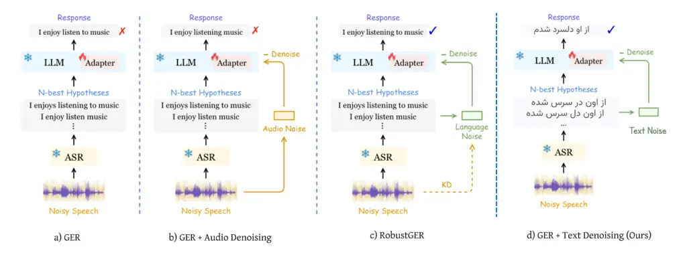

# Incorporating Error Level Noise Embedding for Improving LLM-Assisted Robustness in Persian Speech Recognition

Zahra Rahmani Affiliation: Department of Computer Engineering  
Sharif University of Technology  
Email: zahra.rahmaniez@gmail.com    Hossein Sameti
Affiliation: Department of Computer Engineering  
Sharif University of Technology  
Email: sameti@sharif.edu

###### Abstract

Automatic Speech Recognition (ASR) systems suffer significant
performance degradation in noisy environments, a challenge that is
especially severe for low-resource languages such as Persian. Even
state-of-the-art models such as Whisper struggle to maintain accuracy
under varying signal-to-noise ratios (SNRs). This study presents a
robust noise-sensitive ASR error correction framework that combines
multiple hypotheses and noise-aware modeling. Using noisy Persian
speech, we generate 5-best hypotheses from a modified Whisper-large
decoder. Error Level Noise (ELN) is introduced as a representation that
captures semantic- and token-level disagreement across hypotheses,
quantifying the linguistic distortions caused by noise. ELN thus
provides a direct measure of noise-induced uncertainty, enabling the LLM
to reason about the reliability of each hypothesis during correction.
Three models are evaluated: (1) a base LLaMA-2-7B model without
fine-tuning, (2) a fine-tuned variant trained on text-only hypotheses,
and (3) a noise-conditioned model integrating ELN embeddings at both
sentence and word levels. Experimental results demonstrate that the
ELN-conditioned model achieves substantial reductions in Word Error Rate
(WER). Specifically, on the challenging Mixed Noise test set, the
proposed Fine-tuned + ELN (Ours) model reduces the WER from a baseline
of 31.10% (Raw Whisper) to 24.84%, significantly surpassing the
Fine-tuned (No ELN) text-only baseline of 30.79%, whereas the original
LLaMA-2-7B model increased the WER to 64.58%, demonstrating that it is
unable to correct Persian errors on its own. This confirms the
effectiveness of combining multiple hypotheses with noise-aware
embeddings for robust Persian ASR in noisy real-world scenarios.

###### Index Terms: 

Automatic Speech Recognition, Speech Error Correction, Environmental
Noise, Low-Resource Language, Large Language Models, Word Error Rate,
N-best Hypotheses, LLaMA, Whisper

## I Introduction

Automatic Speech Recognition has become an integral part in the
interaction of humans with computers in the modern world, and it finds
applications in smart assistants, speech translation, and automatic
captioning. The ever-increasing integration of ASR systems into everyday
technology underscores the requirement for robustness and reliability
across a wide variety of acoustic conditions and languages. However,
while recent advances in end-to-end architectures and large language
models have dramatically improved the performance of ASR in
high-resource languages such as English and Mandarin, maintaining
accuracy under noisy environments and for low-resource languages remains
an open challenge.

Several lines of prior research have been pursued toward enhancing ASR
robustness, including noise-aware training, data augmentation with
synthetic noise, and post-processing using language models or sequence
correction networks. Noise-aware and multi-condition training techniques
have long been effective in improving ASR robustness to acoustic
distortions \[1, 2\], while data augmentation methods such as
reverberation and additive noise mixing remain standard practice for
robustness enhancement \[3\]. Despite their effectiveness, these
approaches operate primarily at the acoustic modeling level and often
require retraining or fine-tuning the ASR model itself. While these
methods have achieved certain improvements, they still suffer from
several limitations: most approaches are developed and evaluated for
high-resource languages, leaving low-resource languages like Persian
underrepresented; existing correction models usually work only on the
textual outputs of ASR, without considering the noise information that
leads to transcription errors; many systems try to modify or retrain the
original ASR architecture, which is computationally expensive and limits
adaptability; and few prior methods explicitly explore large generative
models or multi-hypothesis reasoning, most of which are not
noise-robust, for leveraging contextual and semantic cues for error
correction.

This study addresses these gaps by introducing the first noise-robust
generative error correction model for Persian ASR. Unlike previous
approaches, ours focuses on post-hoc correction and is lightweight and
easily deployable without requiring any retraining of the ASR model.
Specifically, we generate multiple transcription hypotheses (5-best)
from a Whisper-based Persian ASR system and design a noise-conditioned
correction mechanism using a large language model, LLaMA-2-7B \[4\]. We
want to make the model aware of the acoustic degradation affecting each
utterance. So, we develop Error Level Noise (ELN) embeddings that encode
sentence- and token-level disagreement across hypotheses as a proxy for
noise impact. These are used in order to condition the LLM during
fine-tuning, allowing it to integrate both linguistic and noise-aware
cues during correction. Our experiments on Persian speech, which
originated from Common Voice \[5\] version 16.1 and MUSAN \[6\] noise
sources, demonstrate that this framework significantly reduces the Word
Error Rate compared to both the baseline system and text-only correction
models. The experimental results confirm that explicit modeling of noise
information as well as the combination of multiple hypotheses allow a
generative LLM to achieve robust error correction even in severely
degraded acoustic conditions. This work therefore provides a practical
and scalable path toward noise-robust ASR systems in low-resource
languages.

## II Related Work

Automatic Speech Recognition (ASR) systems have made significant
advancements in recent years, yet challenges persist, particularly in
low-resource languages like Persian. Traditional error correction
methods often rely on rule-based approaches or statistical language
models, which may not effectively address the complexities of ASR errors
in such languages.

Robatian et al. \[7\] introduced GEC-RAG, a novel framework that
enhances ASR accuracy by integrating retrieval-augmented generation.
This approach treats the ASR system as a black-box and utilizes a
knowledge base constructed from ASR predictions and their corresponding
ground truths to retrieve lexically similar examples. By providing
relevant error patterns to a Generative Large Language Model (LLM),
GEC-RAG enables targeted corrections, significantly reducing word error
rates in Persian ASR systems.

Dashti et al. \[8\] proposed PERCORE, a deep learning-based framework
for Persian spelling correction that incorporates phonetic analysis. By
integrating phonetic representations into the learning process, PERCORE
effectively corrects both non-word and real-word spelling errors,
achieving high F1-scores in evaluations.

Li et al. \[9\] developed LA-RAG, a retrieval-augmented generation
approach designed to enhance LLM-based ASR accuracy. LA-RAG leverages
fine-grained token-level speech datastores and a speech-to-speech
retrieval mechanism to improve ASR performance, particularly under
varied acoustic conditions such as accents.

Sedghiyeh et al. \[10\] introduced the Persian Speech Recognition
Benchmark (PSRB), a dataset designed to assess Persian ASR systems under
diverse linguistic and acoustic conditions. PSRB provides valuable
insights into ASR performance and identifies key error types,
facilitating the development of more robust ASR models.

Ghosh et al. \[11\] proposed DARAG, a domain-agnostic approach that
combines data augmentation and retrieval-augmented generation to improve
generative error correction for ASR systems. DARAG enhances the
generalization of error correction models, particularly in out-of-domain
scenarios.

Recent research has also explored multilingual LLMs for direct 1-best
ASR output correction. Studies have fine-tuned a single multilingual LLM
covering over 100 languages to correct errors in ASR outputs without
requiring N-best lists. Results show that even without N-best
hypotheses, the approach significantly improves ASR performance, and
transfer learning between languages with shared writing systems (e.g.,
Persian and Arabic) can enhance error correction in low-resource
languages \[12\].

GER \[13\] (Generative Error Correction) is a text-rewriting framework
that formulates ASR post-processing as a generative sequence-to-sequence
task. Instead of relying on handcrafted rules, edit-distance heuristics,
or alignment-based correction, GER employs a generative model (e.g., a
Transformer-based LLM) to rewrite the noisy 1-best ASR output into a
clean and fluent transcription. By leveraging the model’s ability to
capture long-range contextual dependencies, GER can correct semantic,
morphological, and phonetic errors that are difficult for traditional
approaches to handle. GER has subsequently served as the foundation for
extended variants such as Denoising GER \[14\] and RobustGER \[15\].

Hu et al. \[16\] introduced ClozeGER, a framework using a multimodal LLM
(SpeechGPT) that takes both the decoded text and the speech signal as
input. By reformulating ASR correction as a cloze task and injecting
speech logits, ClozeGER removes redundant inputs and achieves superior
performance compared to standard ASR preprocessing with LLMs across nine
benchmark ASR datasets.

Furthermore, Chen et al. \[17\] proposed HyPoradise, an open baseline
for generative speech recognition using LLMs, highlighting the potential
of large language models to generalize across diverse ASR tasks.
Similarly, Hu et al. \[15\] demonstrated that LLMs can efficiently learn
noise-robust speech recognition by introducing RobustGER, emphasizing
their effectiveness in low-resource and noisy scenarios.

Collectively, these studies highlight a shift towards integrating
advanced machine learning techniques, including large language models,
retrieval-augmented generation, multimodal inputs, and phonetic
analysis, to address ASR error correction challenges, particularly in
low-resource languages.

## III Methodology

This study investigates the application of large language models (LLMs)
for improving Automatic Speech Recognition (ASR) accuracy, with a
particular emphasis on the Persian language. We propose a novel
framework, GER + Text Denoising (Ours), which leverages Error Level
Noise (ELN) vectors as auxiliary inputs to enhance transcription quality
by explicitly modeling noise within the language space. The overall
architecture is illustrated in Figure 1 (Panel d), shown alongside other
baseline and previous methods. For experimentation, the ASR outputs
include the top-5 hypotheses (5-best list) generated by the underlying
recognition system.

Our approach builds upon the ideas of RobustGER \[15\] (Figure 1,
Panel c) but introduces key modifications to achieve computational
efficiency. While RobustGER incorporates Knowledge Distillation (KD) to
capture Language Noise and may also perform Audio Noise Distillation,
our method simplifies this process by focusing solely on Text Noise.
Specifically, we extract sentence- and token-level ELN vectors to
quantify semantic and structural inconsistencies across ASR hypotheses.
Unlike RobustGER, our approach omits the Audio Noise Distillation and
Mutual Information Neural Estimation (MINE) stages. The resulting ELN
vectors are provided as conditioning inputs to the LLM, serving as a
noise-aware signal that guides the model toward improved transcription
accuracy. In essence, this acts as a form of “Text Denoising” directly
within the language representation space.

### III-A System Architectures Overview

Figure 1 illustrates the four system architectures used for ASR noise
Robustness. Panels (1, a) through (1, c) are adapted from Hu et al.
 \[15\], showing: (a) GER  \[17\], \[18\] — baseline grammatical error
revision model applied directly to noisy ASR outputs; (b) GER + Audio
Denoising  \[14\] — incorporation of audio-level noise reduction before
ASR transcription; (3) RobustGER \[15\] — enhancement of robustness
through language-space noise modeling and knowledge distillation (KD);
(4) GER + Text Denoising (Ours) — the proposed method in this paper,
which introduces text-level noise embeddings (Text Noise) to denoise ASR
hypotheses in the language space, yielding improved correction accuracy
across both English and Persian data.

### III-B Hypothesis Generation

As illustrated in Figure 1, the process begins with a Noisy Speech input
fed into the ASR system, which produces an N-best list of transcription
hypotheses. To build a high-quality dataset for ASR error correction, we
utilized the Whisper \[19\] large model to generate multiple candidate
transcriptions for each audio sample. To further reduce WER, a
fine-tuned Persian variant of Whisper¹¹ 1
https://huggingface.co/vhdm/whisper-large-fa-v1 was employed. For each
input audio file, we applied beam search decoding to generate an n-best
list, retaining up to five unique hypotheses per sample. In cases where
fewer than five hypotheses were available, existing transcriptions were
randomly duplicated to maintain a consistent list length ($`n=5`$).

All hypotheses and ground-truth transcriptions underwent a comprehensive
Persian text normalization pipeline to ensure uniform formatting. The
preprocessing steps included: (i) converting small numbers to Persian
words while keeping larger numerical values intact, (ii) standardizing
Unicode characters, (iii) correcting spacing and half-spacing errors,
(iv) converting English digits to Persian digits, (v) removing
punctuation marks, and (vi) eliminating extra whitespace. This
normalization process guarantees consistency across samples and enables
accurate evaluation of transcription performance using the Word Error
Rate (WER) metric.

The resulting dataset provides a robust foundation for training and
evaluating ASR error correction models. By incorporating diverse
hypothesis variations, it effectively captures the range of possible
transcription errors encountered in real-world scenarios—an essential
component for reliable ELN vector computation in subsequent modeling
stages.



Fig. 1: Overview of a) GER \[17\] b) GER + Audio Denoising \[14\] c)
RobustGER \[15\] and d) GER + Text Denoising(Ours)

### III-C ELN Vector Extraction

For a given audio sample, let
$`\mathcal{H}=\{H_{1},H_{2},\dots,H_{n}\}`$ denote the set of $`n`$ ASR
hypotheses generated by the system (here $`n=5`$). The ELN vector
consists of two components: sentence-level
($`\mathbf{v}_{\text{sent}}`$) and token-level
($`\mathbf{v}_{\text{tok}}`$). This vector effectively models the Text
Noise shown in Figure 1 (Panel d) and is fed back into the LLM-Adapter
framework \[20\]. The computation of two components, final ELN vector
and also magnitude of the ELN vector are explained below:

#### Sentence-level ELN

Each hypothesis $`H_{i}`$ is embedded into a fixed-dimensional semantic
vector of dimension $`d`$, using a sentence embedding model (e.g.,
Sentence-BERT \[21\]):

```math
\mathbf{e}_{i}=\text{Embed}_{\text{sent}}(H_{i})\in\mathbb{R}^{d}
```

The sentence-level ELN vector is then computed as the mean pairwise
difference of hypothesis embeddings:

```math
\mathbf{v}_{\text{sent}}=\frac{2}{n(n-1)}\sum_{i=1}^{n}\sum_{j=i+1}^{n}(\mathbf{e}_{i}-\mathbf{e}_{j})^{2}
```

where $`(\cdot)^{2}`$ denotes element-wise squaring. This captures
semantic variance among all hypotheses.

#### Token-level ELN

Each hypothesis is tokenized:
$`H_{i}=[t_{i,1},t_{i,2},\dots,t_{i,L_{i}}]`$, and padded to the maximum
length $`L_{\max}=\max_{i}L_{i}`$. Tokens are embedded into vectors of
dimension $`d^{\prime}`$:

```math
\mathbf{t}_{i,k}=\text{Embed}_{\text{tok}}(t_{i,k})\in\mathbb{R}^{d^{\prime}}
```

The token-level ELN vector is computed as the mean pairwise squared
difference at each token position:

```math
\mathbf{v}_{\text{tok}}=\frac{1}{L_{\max}}\sum_{k=1}^{L_{\max}}\frac{2}{n(n-1)}\sum_{i=1}^{n}\sum_{j=i+1}^{n}(\mathbf{t}_{i,k}-\mathbf{t}_{j,k})^{2}
```

#### Final ELN Vector

Finally, sentence- and token-level vectors are concatenated to form the
final ELN vector:

```math
\mathbf{v}_{\text{ELN}}=\mathbf{v}_{\text{sent}}\,\|\,\mathbf{v}_{\text{tok}}\in\mathbb{R}^{d+d^{\prime}}
```

This vector encodes multi-level linguistic noise information and is used
as an additional input to the LLM for error correction, as indicated by
the Text Noise input in the final panel of Figure 1.

#### ELN Magnitude

For analysis purposes, we define the _magnitude_ of an ELN vector as its
$`L_{2}`$ norm:

```math
\|\mathbf{v}_{\text{ELN}}\|_{2}=\sqrt{\sum_{i=1}^{d+d^{\prime}}(\mathbf{v}_{\text{ELN},i})^{2}}.
```

Here, $`\mathbf{v}_{\text{ELN},i}`$ denotes the $`i`$-th feature of the
$`\mathbf{v}_{\text{ELN}}`$ vector. This scalar value provides a single
measure of the overall noise-induced disagreement among hypotheses, with
higher values indicating greater linguistic variability and potential
transcription difficulty.

## IV Experimental Setup

To evaluate the effectiveness of the proposed approach, we conducted
three main experiments, each following the same prompt template designed
to guide the large language model (LLM) in performing transcription
error correction:

“You are a transcription error correction assistant and linguistics
expert specializing in improving transcriptions produced by Automatic
Speech Recognition (ASR) systems. Your task is to perform error
correction based on the words in top 5 hypotheses generated by the ASR
system. You can also correct the sentences yourself based on their
meaning, ensuring spelling is correct. Do not use synonyms. Analyze
linguistic context and provide corrected ASR hypothesis directly.”

### IV-A Datasets

Two publicly available corpora were used to construct the noisy Persian
ASR dataset: one providing clean speech data and another supplying noise
sources.

#### Common Voice 16.1 (Persian)

This corpus served as the source of clean speech samples. Common Voice,
developed by Mozilla, is a large-scale, multilingual, crowdsourced
speech dataset. The Persian subset (version 16.1) includes over 40,000
validated audio recordings, corresponding to roughly 90 hours of
transcribed speech. Each file is sampled at $`16\ \text{kHz}`$ and
features diverse speakers varying in age, gender, and regional accent,
contributing to the linguistic richness and representativeness of the
dataset used in this study.

#### MUSAN

To simulate realistic acoustic conditions, we employed the MUSAN corpus
(Music, Speech, and Noise), a widely used resource for training and
evaluating models in voice activity detection and noise-robust ASR.
Specifically, the ambient noise subset was used, which comprises
approximately 930 WAV files, totaling around 6 hours of audio.

The noise types in this subset are highly diverse, encompassing
environmental sounds such as rain, thunder, wind, crowd chatter,
footsteps, and paper rustling, as well as artificial noises like phone
dial tones. These diverse, non-speech noise samples were essential for
constructing a realistic and challenging noisy evaluation environment
that mirrors everyday acoustic conditions.

#### Data Augmentation and Noisy Speech Generation

To enhance the robustness of the error correction model against various
acoustic distortions, we synthetically generated noisy speech data by
introducing controlled noise into clean audio samples from the Common
Voice dataset.

Each noisy utterance, denoted as $`\mathbf{y}`$, was produced by
combining a clean speech signal $`\mathbf{x}_{\text{clean}}`$ with a
randomly selected noise segment $`\mathbf{n}`$ (sourced from the MUSAN
corpus or generated Gaussian noise) at a specified signal-to-noise ratio
(SNR) level, as expressed by:

```math
\mathbf{y}=\mathbf{x}_{\text{clean}}+\mathbf{n}_{\text{scaled}}
```

For each clean sample, we applied a mixture of noise types to create
realistic and variable acoustic conditions. Specifically, a randomly
selected MUSAN ambient noise segment was added at an SNR sampled between
$`0\ \text{dB}`$ and $`15\ \text{dB}`$. In addition, additive white
Gaussian noise was introduced, with its amplitude randomly drawn from
the range $`[0.001,0.015]`$.

This carefully designed augmentation process ensured the resulting
dataset encompassed a broad range of noise intensities and
characteristics. As a result, it provided a challenging and diverse
evaluation environment, enabling a more comprehensive assessment of the
proposed noise-aware ASR correction models.

### IV-B Evaluation Metrics

Model performance was evaluated using Word Error Rate (WER), computed
as:

```math
\text{WER}=\frac{S+D+I}{N}\times 100\%
```

where $`S`$ is the number of substitutions, $`D`$ deletions, $`I`$
insertions, and $`N`$ total words in the reference transcription.

#### Noise Types and SNR Conditions

To ensure a controlled and interpretable evaluation of robustness, we
report results under four noise conditions: Clean, Mixed, SNR = 5 dB,
and SNR = 10 dB.

Noise Types. All noisy conditions are generated from the MUSAN ambient
noise subset and additive white Gaussian noise. MUSAN includes a diverse
set of environmental sounds such as rain, wind, footsteps, crowd
chatter, cafeteria ambience, paper rustling, and mechanical background
noise. Gaussian noise models sensor-level acoustic corruption.

Signal-to-Noise Ratio (SNR). SNR is defined as the ratio between the
power of the clean speech ($`P_{\text{speech}}`$) and the power of the
added noise ($`P_{\text{noise}}`$):

```math
\text{SNR (dB)}=10\log_{10}\left(\frac{P_{\text{speech}}}{P_{\text{noise}}}\right).
```

Lower SNR values indicate more severe noise corruption.

- •
  Clean: No noise added. (5000 samples)
- •
  Mixed Noise: Each utterance is corrupted with a randomly chosen MUSAN
  noise type at a randomly sampled SNR between 0–15 dB, plus
  low-amplitude Gaussian noise. (5000 samples)
- •
  SNR = 5 dB: Each utterance is corrupted with a randomly chosen MUSAN
  noise type at a fixed SNR = 5 dB, plus low-amplitude Gaussian noise.
  (1000 samples)
- •
  SNR = 10 dB: Each utterance is corrupted with a randomly chosen MUSAN
  noise type at a fixed SNR = 10 dB, plus low-amplitude Gaussian noise.
  (1000 samples)

These controlled SNR conditions allow us to compare performance across
both (i) fixed, interpretable noise levels and (ii) a broad,
real-world–like distribution (Mixed).

### IV-C Experiments

We compare three settings:

1.  1.  Base Model (Zero-shot): LLaMA-2-7B \[4\] without fine-tuning,
        directly correcting ASR outputs using the prompt.
2.  2.  Fine-tuned (Text-only): LLaMA-2-7B fine-tuned with LoRA \[22\] on
        5-ASR-hypothesis input without ELN vectors.
3.  3.  Fine-tuned + ELN (Ours): LLaMA-2-7B fine-tuned with LoRA
        incorporating ELN vectors. ELN vectors were mapped through a small
        MLP to match the LLM embedding dimension and prepended as prefix
        embeddings.

### IV-D Setup

All fine-tuning experiments used:

- •
  4-bit quantization to reduce memory usage
- •
  Custom DataCollator for batch padding
- •
  Learning rate: $`2\times 10^{-4}`$, 3 epochs
- •
  Gradient accumulation and checkpointing
- •
  Cosine scheduler with weight decay

This setup allows evaluation of how ELN vectors improve the model’s
ability to correct ASR errors in noisy and clean speech.

## V Results and Discussion

### V-A Quantitative Results

Table I reports the Word Error Rate (WER, %) of all evaluated models
under four noise conditions: Clean, Mixed Noise (covering 0–15 dB SNR
plus Gaussian noise), SNR = 5 dB, and SNR = 10 dB. The Persian noisy
dataset was constructed from Common Voice 16.1 and augmented with MUSAN
and Gaussian noise. For reference, the Raw Whisper baseline follows
Radford et al. \[19\], while the Base Model (Zero-shot) corresponds to
LLaMA-2 \[4\]. All WER values are expressed in percentage.

|                         |           |             |            |             |
| ----------------------- | --------- | ----------- | ---------- | ----------- |
| Method                  | Clean     | Mixed Noise | SNR = 5 dB | SNR = 10 dB |
| Raw Whisper             | $`24.80`$ | $`31.10`$   | $`42.70`$  | $`38.30`$   |
| Base Model (Zero-shot)  | $`62.43`$ | $`64.58`$   | $`70.63`$  | $`67.75`$   |
| Fine-tuned (No ELN)     | $`24.06`$ | $`30.79`$   | $`39.76`$  | $`31.59`$   |
| Fine-tuned + ELN (Ours) | 24.39     | 24.84       | 32.34      | 28.02       |

TABLE I: WER (%) comparison of Raw Whisper, Base LLaMA2 (zero-shot),
LLaMA2 fine-tuned without ELN, and the ELN-conditioned model across four
acoustic conditions.

### V-B Comparison with RobustGER on VB-DEMAND

To further assess the noise robustness and cross-lingual adaptability of
our proposed approach, we performed a comparative evaluation against the
state-of-the-art RobustGER model \[15\] using a standard English
benchmark dataset.

For this comparison, we employed the VoiceBank-DEMAND (VB-DEMAND)
corpus, a well-established dataset for supervised speech enhancement and
noise-robust ASR evaluation. This dataset is created by combining clean
English speech recordings from the VoiceBank (VCTK) corpus \[23\] with
diverse real-world and synthetic noise samples sourced from the DEMAND
database \[24\]. As a result, it provides paired clean and noisy
utterances, making it an ideal benchmark for assessing systems designed
to handle acoustic degradation.

In particular, we used the VoiceBank-DEMAND-16k variant hosted on
Hugging Face²² 2
[https://huggingface.co/datasets/JacobLinCool/VoiceBank-DEMAND-16k](https://huggingface.co/datasets/JacobLinCool/VoiceBank-DEMAND-16k)
. This version includes 11,572 examples of paired clean and noisy speech
in the training set and 824 samples in the test set, featuring noise
conditions such as bus, cafe, and office environments across varying SNR
levels.

For the English ASR baseline, we utilized the small.en variant of the
Whisper model to generate N-best hypotheses. Our fine-tuned LLaMA2-7B
model, equipped with ELN conditioning was then trained on the VB-DEMAND
training split and evaluated on the official test set. The results of
this comparison are presented in Table II.

| Method                  | Baseline WER (%) | Improved WER (%) |
| ----------------------- | ---------------- | ---------------- |
| RobustGER               | $`13.00`$        | $`10.70`$        |
| Ours (Fine-tuned + ELN) | $`7.93`$         | 3.96             |

TABLE II: Comparison of WER (%) between the proposed ELN-conditioned
model and RobustGER \[15\] on the VB-DEMAND dataset.

Our model achieved a significantly lower final WER of $`3.96\%`$ ,
outperforming the $`10.70\%`$ reported for RobustGER. This substantial
improvement highlights the effectiveness of incorporating ELN-based
noise representations for resilient ASR error correction under
challenging acoustic conditions. Furthermore, the strong performance on
an English benchmark demonstrates that our proposed Text Denoising
approach—originally developed for Persian—generalizes effectively across
languages, confirming its cross-lingual robustness.

For clarity, in Table II, Baseline WER refers to the Word Error Rate of
the Whisper ASR system prior to any correction, while Improved WER
indicates the WER after applying the respective error correction model.

### V-C Error Analysis

To better understand the behavior of our model, we analyzed the
relationship between the magnitude of ELN vectors (measured by the
$`L_{2}`$ norm) and the corresponding Word Error Rate (WER). Our
findings reveal that most samples exhibit relatively small ELN
magnitudes (below 20), which correlate with low and stable WER values.
However, as ELN magnitude increases, WER becomes more variable, and
extreme transcription errors occur more frequently.

By categorizing samples according to ELN magnitude ranges, we observed
that lower magnitudes correspond to smaller median WER and tighter
distributions, indicating consistent performance. In contrast, higher
magnitudes are associated with increased median WER, greater variance,
and a higher frequency of outlier cases. This trend suggests that
stronger linguistic noise leads to more unstable transcriptions and an
elevated likelihood of significant recognition errors.

Overall, these observations underscore the strong correlation between
ELN vector magnitude and ASR reliability. Low ELN values are indicative
of stable and accurate recognition, whereas higher magnitudes signal
increased uncertainty and degradation in performance. These insights
reinforce the value of ELN-based conditioning as a mechanism for
mitigating noise-induced variability and improving the resilience of ASR
correction models under challenging acoustic environments.

### V-D Key Findings

Our experiments revealed several noteworthy insights. First,
task-specific fine-tuning proved essential for achieving accurate
Persian ASR correction. Beyond its effectiveness in the target language,
the ELN-conditioned model also exhibited strong cross-lingual
generalization, attaining competitive results on the English VB-DEMAND
benchmark.

Second, the integration of ELN vectors with textual inputs significantly
reduced the Word Error Rate (WER), especially under moderate noise
levels such as $`5\ \text{dB}`$ SNR. Under these conditions, greater
disagreement among ASR hypotheses provides richer information for the
ELN representation, allowing the model to perform more noise-aware
correction.

Finally, analysis of the ELN magnitude—quantified by its $`L_{2}`$
norm—showed a clear positive correlation with WER and performance
variability across samples. This relationship indicates that ELN
magnitude effectively reflects the difficulty or noise sensitivity of
each utterance, serving as a reliable, model-agnostic indicator of
recognition uncertainty.

### V-E Limitations

Despite the encouraging results, several limitations of this study
should be acknowledged. First, the experiments were conducted using the
Common Voice (Persian) dataset augmented with synthetic MUSAN noise,
which may not fully represent the diversity and complexity of real-world
Persian speech, particularly in conversational, dialectal, or
domain-specific contexts. Second, the evaluation primarily relied on the
Word Error Rate (WER) metric. While WER is a useful quantitative
measure, future work should incorporate human-based evaluations or
semantic similarity metrics to more comprehensively assess improvements
in fluency, coherence, and meaning preservation. Finally, the current
approach models noise solely through textual proxies using Error Level
Noise (ELN) vectors, without leveraging direct acoustic evidence.
Integrating explicit acoustic features in future research could provide
a more complete understanding of noise influence and further enhance the
robustness of language-space noise modeling.

## VI Conclusion

This study explored the use of large language models (LLMs) for post-hoc
correction of Automatic Speech Recognition (ASR) outputs, focusing
primarily on the low-resource Persian language. We proposed a novel and
computationally efficient framework which conditions a fine-tuned
LLaMA-2-7B model on an Error Level Noise (ELN) vector derived from the
n-best ASR hypotheses.

By explicitly modeling linguistic noise within the language space using
ELN, our approach substantially enhances transcription robustness
without requiring modifications to the original ASR architecture. In
summary, conditioning LLMs with structured noise representations
provides a practical and scalable approach to improving ASR reliability,
especially for low-resource languages operating under noisy conditions.

## References

- \[1\] T. Ko, V. Peddinti, D. Povey, and S. Khudanpur (2015) Audio
  augmentation for speech recognition. In Proceedings of Interspeech,
  pp. 3586–3589. External Links:
  [Document](https://dx.doi.org/10.21437/Interspeech.2015-474) Cited by:
  §I.
- \[2\] S. Watanabe, T. Hori, S. Karita, T. Hayashi, J. Nishitoba, Y.
  Unno, N. E. Y. Soplin, J. Heymann, M. Wiesner, N. Chen, A.
  Renduchintala, and T. Ochiai (2018) ESPnet: end-to-end speech
  processing toolkit. In Proceedings of Interspeech, pp. 2207–2211.
  External Links:
  [Document](https://dx.doi.org/10.21437/Interspeech.2018-1456) Cited
  by: §I.
- \[3\] Q. Li, Y. He, and L. Deng (2016) Robust automatic speech
  recognition: a bridge to practical applications. Academic Press.
  External Links: ISBN 9780128023983 Cited by: §I.
- \[4\] H. Touvron, L. Martin, K. Stone, P. Albert, A. Almahairi, Y.
  Babaei, N. Bashlykov, S. Batra, P. Bhargava, S. Bhosale, D. Bikel, L.
  Blecher, C. C. Ferrer, M. Chen, G. Cucurull, D. Esiobu, J.
  Fernandes, J. Fu, W. Fu, B. Fuller, C. Gao, V. Goswami, N. Goyal, A.
  Hartshorn, S. Hosseini, R. Hou, H. Inan, M. Kardas, V. Kerkez, M.
  Khabsa, I. Kloumann, A. Korenev, P. S. Koura, M. Lachaux, T.
  Lavril, J. Lee, D. Liskovich, Y. Lu, Y. Mao, X. Martinet, T.
  Mihaylov, P. Mishra, I. Molybog, Y. Nie, A. Poulton, J.
  Reizenstein, R. Rungta, K. Saladi, A. Schelten, R. Silva, E. M.
  Smith, R. Subramanian, X. E. Tan, B. Tang, R. Taylor, A.
  Williams, J. X. Kuan, P. Xu, Z. Yan, I. Zarov, Y. Zhang, A. Fan, M.
  Kambadur, S. Narang, A. Rodriguez, R. Stojnic, S. Edunov, and T.
  Scialom (2023) Llama 2: open foundation and fine-tuned chat models.
  arXiv preprint arXiv:2307.09288. Cited by: §I, item 1, §V-A.
- \[5\] R. Ardila, M. Branson, K. Davis, M. Henretty, M. Kohler, J.
  Meyer, R. Morais, L. Saunders, F. M. Tyers, and G. Weber (2019) Common
  voice: a massively‑multilingual speech corpus. CoRR abs/1912.06670.
  External Links: 1912.06670,
  [Document](https://dx.doi.org/10.48550/arXiv.1912.06670) Cited by: §I.
- \[6\] D. Snyder, G. Chen, and D. Povey (2015) MUSAN: a music, speech,
  and noise corpus. CoRR abs/1510.08484. External Links: 1510.08484,
  [Document](https://dx.doi.org/10.48550/arXiv.1510.08484) Cited by: §I.
- \[7\] A. Robatian, M. Hajipour, M. R. Peyghan, F. Rajabi, S. Amini, S.
  Ghaemmaghami, and I. Gholampour (2025) GEC-rag: improving generative
  error correction via retrieval-augmented generation for automatic
  speech recognition systems. arXiv preprint arXiv:2501.10734. Cited by:
  §II.
- \[8\] S. M. S. Dashti, A. Khatibi Bardsiri, and M. Jafari
  Shahbazzadeh (2024) PERCORE: a deep learning-based framework for
  persian spelling correction with phonetic analysis. International
  Journal of Computational Linguistics and Applications 17 (1),
  pp. 1–20. Cited by: §II.
- \[9\] S. Li, H. Shang, D. Wei, J. Guo, Z. Li, X. He, M. Zhang, and H.
  Yang (2024) LA-rag: enhancing llm-based asr accuracy with
  retrieval-augmented generation. arXiv preprint arXiv:2409.08597. Cited
  by: §II.
- \[10\] N. Sedghiyeh, S. Sadeghi, R. Khodadadi, F. Kashani, O.
  Aghdaei, S. Rahimi, and M. S. Safari (2025) PSRB: a comprehensive
  benchmark for evaluating persian asr systems. arXiv preprint
  arXiv:2505.21230. Cited by: §II.
- \[11\] S. Ghosh and et al. (2025) DARAG: improving generative error
  correction for asr with synthetic data and retrieval-augmented
  generation. Findings of the Association for Computational Linguistics
  3, pp. 125–134. Cited by: §II.
- \[12\] S. Li, C. Chen, C. Y. Kwok, C. Chu, E. S. Chng, and H.
  Kawai (2024) Investigating asr error correction with large language
  model and multilingual 1-best hypotheses. In Proc. Interspeech, Kos,
  Greece. External Links:
  [Document](https://dx.doi.org/10.21437/Interspeech.2024-368) Cited by:
  §II.
- \[13\] R. Ma, M. Qian, P. Manakul, M. J. F. Gales, and K. M.
  Knill (2023) Can generative large language models perform asr error
  correction?. CoRR abs/2307.04172. External Links: 2307.04172,
  [Document](https://dx.doi.org/10.48550/ARXIV.2307.04172) Cited by:
  §II.
- \[14\] Y. Liu, M. Xu, Y. Chen, L. He, L. Fang, S. Fang, and L. Liu
  (2025)Denoising ger: a noise-robust generative error correction with
  llm for speech recognition(Website) External Links: 2509.04392,
  [Document](https://dx.doi.org/10.48550/arXiv.2509.04392) Cited by:
  §II, Fig. 1, §III-A.
- \[15\] Y. Hu, C. Chen, C. H. Yang, R. Li, C. Zhang, P. Chen, and E. S.
  Chng (2024) Large language models are efficient learners of
  noise-robust speech recognition. In International Conference on
  Learning Representations (ICLR) 2024, Cited by: §II, §II, Fig. 1,
  §III-A, §III, §V-B, TABLE II.
- \[16\] Y. Hu, C. Chen, C. Qin, Q. Zhu, E. S. Chng, and R. Li (2024)
  Listen again and choose the right answer: a new paradigm for automatic
  speech recognition with large language models. In Findings of the
  Association for Computational Linguistics: ACL 2024, External Links:
  [Document](https://dx.doi.org/10.18653/v1/2024.findings-acl.37) Cited
  by: §II.
- \[17\] C. Chen, Y. Hu, C. H. Yang, S. M. Siniscalchi, P. Chen,
  and E. S. Chng (2023) HyPoradise: an open baseline for generative
  speech recognition with large language models. In Proceedings of the
  Thirty-seventh Conference on Neural Information Processing Systems
  (Datasets and Benchmarks Track), Cited by: §II, Fig. 1, §III-A.
- \[18\] C. H. Yang, Y. Gu, Y. Liu, S. Ghosh, I. Bulyko, and A.
  Stolcke (2023) Generative speech recognition error correction with
  large language models and task-activating prompting. In 2023 IEEE
  Automatic Speech Recognition and Understanding Workshop (ASRU),
  pp. 1–8. External Links:
  [Document](https://dx.doi.org/10.1109/ASRU57964.2023.10389673) Cited
  by: §III-A.
- \[19\] A. Radford and et al. (2023) Robust speech recognition via
  whisper. In arXiv preprint arXiv:2212.04356, Cited by: §III-B, §V-A.
- \[20\] R. Zhang, S. Yang, C. Zhu, and Y. Zhang (2023) LLM-Adapters:
  parameter-efficient fine-tuning of large language models with adapter
  layers. arXiv preprint arXiv:2304.01933. External Links: 2304.01933
  Cited by: §III-C.
- \[21\] N. Reimers and I. Gurevych (2019) Sentence-bert: sentence
  embeddings using siamese bert-networks. In Proceedings of the 2019
  Conference on Empirical Methods in Natural Language Processing, Cited
  by: §III-C.
- \[22\] E. J. Hu, Y. Shen, P. Wallis, Z. Allen-Zhu, Y. Li, S. Wang, L.
  Wang, and W. Chen (2022) LoRA: low-rank adaptation of large language
  models. In Proceedings of the International Conference on Machine
  Learning (ICML), Cited by: item 2.
- \[23\] C. Veaux, J. Yamagishi, and K. MacDonald (2017) CSTR vctk
  corpus: english multi-speaker corpus for cstr voice cloning toolkit.
  University of Edinburgh. The Centre for Speech Technology Research
  (CSTR). Note: Version 0.92 Cited by: §V-B.
- \[24\] J. Thiemann, N. Ito, and E. Vincent (2013) The DEMAND dataset
  of realistic noise recordings for speech processing. In Proceedings of
  the 21st International Conference on Acoustics (IWAENC), pp. 1–4.
  Cited by: §V-B.
