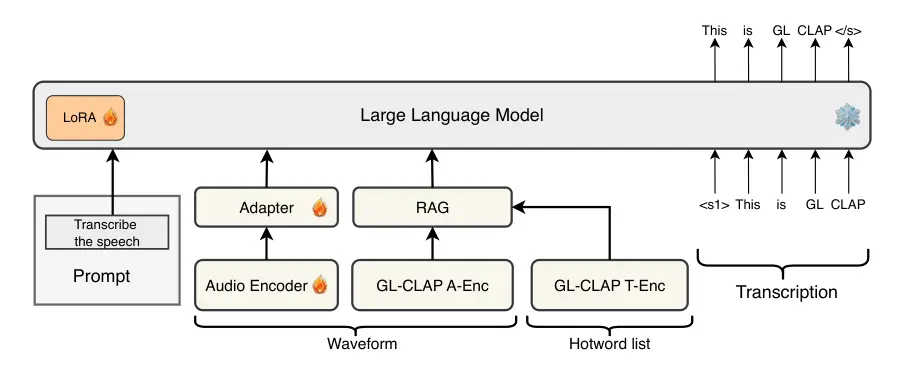
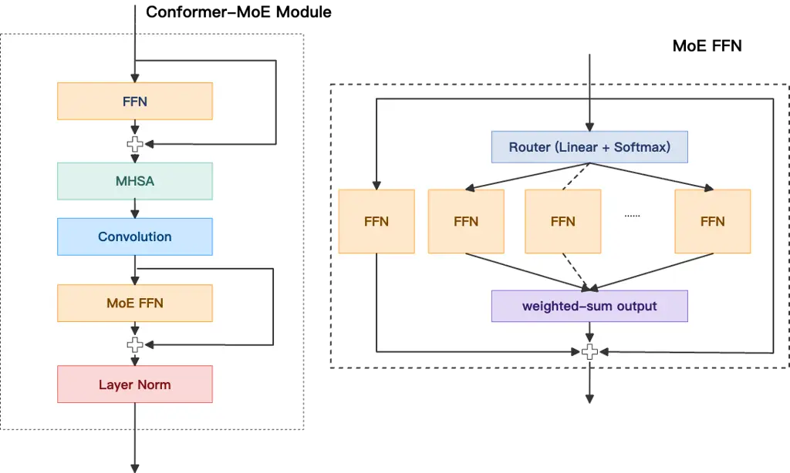

# CONTEXTUAL BIASING FOR LLM-BASED ASR WITH HOTWORD RETRIEVAL AND REINFORCEMENT LEARNING

YuXiang Kong^(†)    JunFeng Hou^(†) ^(†)^(†)thanks: ^(†)Contributed
equally.    Jian Tang^(†)    Bingqing Zhu    Jicheng Zhang    Shaofei
Xue

###### Abstract

Large language model (LLM)-based automatic speech recognition (ASR) has
recently achieved strong performance across diverse tasks, yet
contextual biasing for named entities and hotwords under large
vocabularies remains challenging. In this work, we propose a scalable
two-stage framework that integrates hotword retrieval with LLM-ASR
adaptation. First, we extend the Global–Local Contrastive Language–Audio
pre-trained model (GLCLAP) to retrieve a compact top-$`k`$ set of
hotword candidates from a large vocabulary via robustness-aware data
augmentation and fuzzy matching. Second, we inject the retrieved
candidates as textual prompts into an LLM-ASR model and fine-tune it
with Generative Rejection-Based Policy Optimization (GRPO), using a
task-driven reward that jointly optimizes hotword recognition and
overall transcription accuracy. Experiments on hotword-focused test sets
show substantial keyword error rate (KER) reductions while maintaining
sentence accuracy on general ASR benchmarks, demonstrating the
effectiveness of the proposed framework for large-vocabulary contextual
biasing.

###### Index Terms: 

LLM-ASR, Contextual Biasing, GRPO, GLCLAP

^(†)^(†)address: Tongyi Lab, Alibaba Group, Hangzhou, China  
{kongyuxiang.kyx, qianzhuo.hjf, yongran.tj, zhubingqing.zbq, zjc475228,
shaofei.xsf}@alibaba-inc.com

## 1 Introduction

End-to-end automatic speech recognition (ASR) systems have made
substantial progress over the past decade. More recently, the emergence
of large language models (LLMs) has further advanced the field, enabling
LLM-ASR frameworks \[1, 19, 2\] that tightly integrate powerful language
modeling with acoustic representations. By leveraging long-context
reasoning and strong prior knowledge, LLM-ASR frameworks have achieved
remarkable performance across a wide variety of tasks.

Despite these advances, contextual biasing remains a persistent
challenge, especially for named entities and hotwords that are critical
in many real-world applications \[20, 16\]. Contextual biasing refers to
enhancing recognition of task-relevant words given side information,
such as contact lists and locations. These items often carry high
semantic or business value, yet appear infrequently in training data and
may even be out-of-vocabulary.

Traditional contextual biasing techniques such as WFST-based biasing
graphs \[15, 7\], shallow fusion with contextual language models \[8,
11\], and class-based n-gram approaches \[18\] were primarily developed
for non-LLM ASR architectures. While effective in conventional
pipelines, they are not straightforward to integrate into LLM-ASR
frameworks. More recent methods that supply contextual words through
prompts or additional textual inputs to LLMs typically assume relatively
small vocabularies \[13, 14, 3, 9\]. Inspired by retrieval-augmented
generation (RAG) \[4\], prior works \[6, 5\] adopt a two-stage paradigm:
first retrieving candidate bias terms from a large-scale lexicon, and
subsequently constructing a bias-aware textual prompt to condition the
ASR model during decoding. Moreover, they generally do not optimize
directly for task-level metrics such as hotword recall or WER. As a
result, there is still a lack of a scalable framework that (i)
efficiently selects relevant hotwords from massive vocabularies and (ii)
systematically adapts LLM-ASR to use them effectively during decoding.

In this work, we address these limitations by decomposing contextual
biasing for LLM-ASR into two tightly coupled subproblems: hotword
retrieval and hotword-aware ASR adaptation. On the retrieval side, we
extend the Global–Local Contrastive Language–Audio pre-trained model
(GLCLAP) \[12\] to enable efficient retrieval of hotword candidates from
large vocabularies. On the adaptation side, we adopt a reinforcement
learning framework (RL) to fine-tune the LLM-ASR model. We design a
task-driven reward to jointly optimize hotword recognition and overall
transcription fidelity. This RL-based optimization encourages the model
to correctly recognize hotwords when present, avoid hallucinating them
when absent, and maintain general transcription performance. The results
show that the proposed framework leads to significant WER reductions on
hotword-centric evaluations, while preserving strong performance on
general tasks.

The rest of this paper is organized as follows: Section 2 introduces our
proposed system. Section 3 shows our detailed setups. Section 4 presents
the experimental results. Conclusions are drawn in Section 5.

Figure 1: The proposed GLCLAP based contextual biasing LLM-ASR.

## 2 Proposed System

The framework of the proposed system is illustrated in Fig. 1,
consisting of the typical architecture of LLM-ASR and the GLCLAP
retrieval module.

### 2.1 Framework Overview

First, we describe the main architecture of our model, an LLM-ASR
network composed of an audio encoder, an adapter, and an LLM. In this
work, we adopt Qwen2.5-7B as the LLM. We extend the original Conformer
encoder into a Conformer-MoE encoder, as illustrated in Fig. 2, by
replacing the second feed-forward network (FFN) module in each Conformer
layer with a Mixture-of-Experts (MoE) structure. We define $`K_{C}`$
candidate experts and employ a router to select $`K_{S}`$ of them for
weighted aggregation, while one expert is dedicated as a shared expert.

### 2.2 Enhanced GLCLAP for Hotword Retrieval

The GLCLAP retriever takes as input an audio signal $`x`$ and a set of
candidate biasing words $`{G=\{g_{1},g_{2},\dots,g_{N}\}}`$, where $`N`$
denotes the size of the candidate list. It consists of two components:
an audio encoder (A-enc) and a text encoder (T-enc). Given the input
audio, A-enc extracts a fixed-dimensional audio embedding, denoted by
$`{h_{audio}}`$. Meanwhile, each biasing word $`{g_{i}\in G}`$ is
encoded by T-enc into a semantic vector $`{e_{i}}`$, yielding a set of
text embeddings $`{E=\{e_{1},e_{2},\dots,e_{N}\}}`$. We then compute
similarity scores between $`{h_{audio}}`$ and all embeddings in $`{E}`$,
and select the top-$`{k}`$ biasing words with the highest similarity
scores to form a subset $`{G^{\prime}}`$. These selected biasing words
are appended to the bias prompt to guide context-aware transcription.

Our system enhances overall context-aware recognition with three
strategies: (i) integrating a data augmentation pipeline, (ii)
incorporating a fuzzy matching strategy into GLCLAP training, and (iii)
introducing a reinforcement learning phase into LLM-ASR training.

Figure 2: The structure of Conformer-MoE.

#### 2.2.1 Robustness-Aware Data Augmentation

We construct a robustness-aware data augmentation (RADA) pipeline to
reduce the size of the hotword vocabulary, since increasing the number
of hotwords lowers recall and introduces more distractors. The initial
vocabulary is obtained by crawling domain-specific hotwords from the
web. For each biasing word $`{g_{i}\in G}`$, we synthesize speech using
TTS (with text generated by an LLM when needed) and decode it with the
ASR system to check whether the original LLM-ASR can already recognize
this hotword. If it is reliably recognized, the word is removed from the
hotword vocabulary; otherwise, it is retained.

#### 2.2.2 Fuzzy Matching Strategy

Real-world applications often cannot rely on exact matches to the
hotword vocabulary; otherwise, it would become prohibitively large.
However, during GLCLAP training, hotwords are enforced via strict
lexical matching, which is inconsistent with deployment scenarios where
users may produce inflected forms, paraphrases, or partial mentions of
target terms.

To better match practical usage and improve end-to-end performance,
especially for partial or fuzzy matches, we augment the training data
with embeddings of generated contextual sentences and deliberately
perturbed variants of biasing words (e.g., “Tongyi abc” instead of
“Tongyi”). This fuzzy matching strategy captures real-world ambiguity
and improves robustness.

#### 2.2.3 Contextual ASR through RL-Guided Discrimination

To suppress false positives, we leverage the ASR model’s ability to
discriminate biasing words during decoding. The model is trained with
structured prompts of the form: “⟨Audio⟩ Transcribe the audio into text.
These biasing words you may use: ⟨$`g_{1}`$⟩ ⟨$`g_{2}`$⟩ … ⟨$`g_{k}`$⟩”,
where the provided biasing word list deliberately includes irrelevant or
distractor terms to discourage overreliance on the biasing words.

In addition to the data-level operations mentioned above, we introduce
Generative Rejection-Based Policy Optimization (GRPO) \[17\], a
reinforcement learning method applied during LLM-ASR training to further
enhance the model’s discrimination capability. Our reward function is
designed to jointly optimize multiple objectives, including:

- •
  a match reward: if a candidate biasing word appears in both the model
  output and the reference label, or in neither of them, the reward is
  1; otherwise, the reward is 0;
- •
  a WER-based reward: $`\text{reward}=1-\text{WER}`$, ensuring
  transcription accuracy.

To further improve performance, we also adopt a joint beam search
strategy during inference \[1\]. By jointly decoding context-free and
context-conditioned hypotheses, we preserve the effectiveness of
retrieval-augmented generation (RAG) while reducing hallucinations
caused by irrelevant biasing words.

## 3 Setups

### 3.1 Dataset and Metrics

#### 3.1.1 Context-Biasing Training Datasets

Our LLM-ASR system is trained on several million hours of speech data in
total. Here we focus on the context-biasing data. After base LLM-ASR
training, we further fine-tune the model on 2M utterances associated
with hotwords and/or contextual history, mainly generated by the RADA
process. Utterances with and without hotwords/context are mixed with a
ratio of 8:1 in favor of non-biased data. For utterances containing
hotwords, each utterance has 1–10 hotwords. About half of them contain
the correct target hotwords and the other half do not, yielding a 1:1
ratio between positive and negative hotword instances.

#### 3.1.2 GLCLAP Fine-Tuning Data

In the first stage, we follow the training configuration in the original
GLCLAP paper. The model is trained on large-scale general ASR data,
where text labels are obtained by randomly cropping short phrases from
full transcripts. For the second-stage fine-tuning of the GLCLAP
retriever, we construct a domain-targeted dataset of about 250k
audio–text pairs to better align retrieval with our biasing-word
domains.

#### 3.1.3 Hotword Vocabulary

The hotword vocabulary is compiled from web data, focusing on two
domains: medical and media (film and television). The initial list is
then filtered using the RADA strategy. The vocabulary size is reduced
from about 600k entries to 98k hotwords after RADA-based filtering.

#### 3.1.4 Evaluation

We build two targeted test sets, Media and Medical, each containing 240
utterances mainly collected from bad cases. Each utterance is manually
annotated with ground-truth biasing words, which are added to the
biasing-word list. We also construct a regression test set, General
Task, consisting of about 5k standard ASR utterances.

We use different metrics at different stages. For GLCLAP, we use recall
as the primary metric. Unlike the conventional definition, a hotword is
considered successfully recalled if the annotated hotword is a substring
of the detected hotword, rather than an exact match. This accounts for
lexical variants in realistic hotword lists (e.g., “qwen2”, “qwen2.5”,
“qwen3” for the underlying hotword “qwen”). For the final ASR
evaluation, we use (i) sentence-level recognition accuracy (SACC), and
(ii) keyword error rate (KER). For KER, if any annotated keyword of an
utterance is missing in the ASR output, that keyword is counted as an
error.

### 3.2 Model Configurations

Our LLM-ASR model has 10.5B parameters in total, with 8.7B active
parameters during inference. The architecture consists of a
3.5B-parameter encoder and an LLM decoder. The encoder has a CNN front
end followed by 20 Conformer-MoE layers. The CNN performs 4× temporal
downsampling, and the resulting features are fed into the Conformer-MoE
stack. Each MoE layer uses a 3-of-8 expert routing scheme with a hidden
size of 3584. The encoder output is further processed by 2× frame-level
downsampling with concatenation, then passed through a two-layer linear
adapter before being fed into the LLM. During base training, only the
LLM is updated using LoRA \[10\], with rank 64 and alpha 32. During
context-biasing training, we use a learning rate of 1e-5 and jointly
update the audio encoder, adapter, and LLM LoRA parameters. During GRPO
training, we use the same learning rate (1e-5) but freeze the encoder
and adapter, updating only the LLM LoRA parameters. We set the
KL-divergence weight to 0.04 and generate six responses per step.

## 4 Experiments

### 4.1 Retrieval Performance Evaluation

We first evaluate GLCLAP-based hotword retrieval on the Media and
Medical test sets. As shown in Table 1 and Table 2, both
Robustness-Aware Data Augmentation (RADA) and fuzzy matching contribute
positively to overall performance. Specifically, the original hotword
vocabulary contains approximately 600k entries, which is reduced to 98k
entries after applying RADA. Fuzzy matching not only aligns more closely
with our evaluation metric, but also better reflects real-world
application scenarios. In addition, the results show that the recall
rate consistently increases as the top-$`k`$ value grows.

|                 |       |       |       |        |
| --------------- | ----- | ----- | ----- | ------ |
| Recall(%)       | top-1 | top-2 | top-5 | top-10 |
| GLCLAP          | 23.67 | 29.77 | 39.31 | 42.37  |
| +RADA           | 45.80 | 53.44 | 62.98 | 67.56  |
| +Fuzzy Matching | 64.89 | 74.43 | 80.54 | 85.12  |

Table 1: Recall rate of Extended GLCLAP methods on Medical testset for
various top-$`k`$.

|                 |       |       |       |        |
| --------------- | ----- | ----- | ----- | ------ |
| Recall(%)       | top-1 | top-2 | top-5 | top-10 |
| GLCLAP          | 27.98 | 35.78 | 40.37 | 43.58  |
| +RADA           | 59.63 | 66.51 | 72.94 | 76.61  |
| +Fuzzy Matching | 83.03 | 89.00 | 92.20 | 93.58  |

Table 2: Recall rate of Enhanced GLCLAP methods on Media testset for
various top-$`k`$.

### 4.2 ASR Performance of Enhanced GLCLAP

The previous experiment examined how the recall rate varies as a
function of the top‑$`k`$ value. In Table 3, we combine GLCLAP with the
LLM‑ASR model and report the final recognition performance in terms of
SACC and KER. The Base column shows the results of the context‑aware
fine‑tuned LLM‑ASR model decoded without any bias prompt. We observe
that although the recall rate continues to increase as top‑$`k`$ grows,
KER and SACC on the hotword test sets do not improve monotonically. This
is because a larger top‑$`k`$ introduces more distractor candidates to
the LLM‑ASR model, thereby increasing interference. On the General Task,
most results are slightly worse than the baseline without hotwords.
Considering both hotword test sets together, we conclude that top‑$`2`$
is a more appropriate choice.

|         |            |       |       |       |       |        |
| ------- | ---------- | ----- | ----- | ----- | ----- | ------ |
|         |            | base  | top-1 | top-2 | top-5 | top-10 |
| Media   | -recall(↓) | –     | 83.03 | 89    | 92.2  | 93.58  |
|         | -KER(↓)    | 22.63 | 12.91 | 11.99 | 13.37 | 15.21  |
|         | -SACC(↑)   | 72.99 | 81.04 | 80.57 | 79.15 | 77.25  |
| Medical | -recall(↓) | –     | 64.89 | 74.43 | 80.54 | 85.12  |
|         | -KER(↓)    | 23.31 | 17.83 | 15.89 | 15.51 | 15.89  |
|         | -SACC(↑)   | 71.56 | 75.83 | 77.73 | 78.2  | 77.73  |
| General | -SACC(↑)   | 77.49 | 77.52 | 77.36 | 77.42 | 77.39  |

Table 3: ASR comparison of Enhanced GLCLAP on different top-$`k`$.

|         |          |       |          |                |
| ------- | -------- | ----- | -------- | -------------- |
|         |          | base  | +EGLCLAP | +EGLCLAP +GRPO |
| Media   | -KER(↓)  | 22.63 | 11.99    | 8.29           |
|         | -SACC(↑) | 72.99 | 80.57    | 85.78          |
| Medical | -KER(↓)  | 23.31 | 15.89    | 11.24          |
|         | -SACC(↑) | 71.56 | 77.73    | 84.83          |
| General | -SACC(↑) | 77.49 | 77.36    | 78.16          |

Table 4: Performance of applying GRPO training.

### 4.3 ASR Performance of Applying GRPO Training

Table 4 compares the results of applying GRPO training after
context‑aware fine‑tuning. It shows that, on top of the +top‑2
configuration, introducing GRPO yields clear performance gains in KER on
both the Media and Medical sets. Moreover, thanks to the accuracy-based
reward used in GRPO, the sentence accuracy on the General Task is also
significantly improved.

## 5 Conclusions

In this paper, we proposed a scalable two-stage framework for contextual
biasing in LLM-ASR with large hotword vocabularies. An enhanced GLCLAP
retriever, equipped with robustness-aware data augmentation and fuzzy
matching, selects a compact top‑$`k`$ hotword set per utterance. The
retrieved hotwords are then injected as structured prompts into an
LLM-ASR model, which is further optimized with GRPO using a combined
bias-word match and WER-based reward.

Experiments on Media and Medical hotword test sets show consistent
recall gains and substantial KER reductions, while sentence accuracy on
a general ASR task is preserved. These results demonstrate that
combining retrieval-based hotword selection with RL-guided LLM-ASR
adaptation is effective for large-vocabulary contextual biasing. Future
work will explore extending this framework to multilingual settings and
tighter joint optimization of retrieval and decoding.

## References

- \[1\] Y. Bai, J. Chen, J. Chen, W. Chen, Z. Chen, C. Ding, L. Dong, Q.
  Dong, Y. Du, K. Gao, et al. (2024) Seed-asr: understanding diverse
  speech and contexts with llm-based speech recognition. arXiv preprint
  arXiv:2407.04675. Cited by: §1, §2.2.3.
- \[2\] Y. Chu, J. Xu, Q. Yang, et al. (2024) Qwen2-audio technical
  report. arXiv preprint arXiv:2407.10759. Cited by: §1.
- \[3\] N. Flemotomos, R. Hsiao, P. Swietojanski, T. Hori, D. Can,
  and X. Zhuang (2025) Optimizing contextual speech recognition using
  vector quantization for efficient retrieval. IEEE Transactions on
  Audio, Speech and Language Processing. Cited by: §1.
- \[4\] Y. Gao, Y. Xiong, X. Gao, et al. (2023) Retrieval-augmented
  generation for large language models: a survey. arXiv preprint
  arXiv:2312.10997 2 (1). Cited by: §1.
- \[5\] X. Gong, A. Lv, Z. Wang, and Y. Qian (2024) Contextual biasing
  speech recognition in speech-enhanced large language model.
  pp. 257–261. Cited by: §1.
- \[6\] X. Gong, A. Lv, Z. Wang, H. Zhu, and Y. Qian (2025) BR-asr:
  efficient and scalable bias retrieval framework for contextual biasing
  asr in speech llm. arXiv preprint arXiv:2505.19179. Cited by: §1.
- \[7\] A. Gourav, L. Liu, A. Gandhe, Y. Gu, G. Lan, X. Huang, S.
  Kalmane, G. Tiwari, D. Filimonov, A. Rastrow, et al. (2021)
  Personalization strategies for end-to-end speech recognition systems.
  In ICASSP 2021-2021 IEEE International Conference on Acoustics, Speech
  and Signal Processing (ICASSP), pp. 7348–7352. Cited by: §1.
- \[8\] T. Hori, S. Watanabe, Y. Zhang, and W. Chan (2017) Advances in
  joint ctc-attention based end-to-end speech recognition with a deep
  cnn encoder and rnn-lm. arXiv preprint arXiv:1706.02737. Cited by: §1.
- \[9\] H. Hou, X. Gong, W. Zhang, and Y. Qian (2025) Ranking and
  selection of bias words for contextual bias speech recognition. In
  Proc. Interspeech, Cited by: §1.
- \[10\] E. J. Hu, Y. Shen, P. Wallis, Z. Allen-Zhu, Y. Li, S. Wang, L.
  Wang, W. Chen, et al. (2022) Lora: low-rank adaptation of large
  language models. ICLR. Cited by: §3.2.
- \[11\] A. Kannan, Y. Wu, P. Nguyen, T. N. Sainath, Z. Chen, and R.
  Prabhavalkar (2018) An analysis of incorporating an external language
  model into a sequence-to-sequence model. In 2018 IEEE International
  Conference on Acoustics, Speech and Signal Processing (ICASSP),
  pp. 1–5828. Cited by: §1.
- \[12\] Y. Kong, F. Cui, L. Guo, et al. (2025) GLCLAP: a novel
  contrastive learning pre-trained model for contextual biasing in asr.
  In Proc. Interspeech 2025, pp. 5173–5177. Cited by: §1.
- \[13\] E. Lakomkin, C. Wu, Y. Fathullah, O. Kalinli, M. L. Seltzer,
  and C. Fuegen (2024) End-to-end speech recognition contextualization
  with large language models. In ICASSP 2024-2024 IEEE International
  Conference on Acoustics, Speech and Signal Processing (ICASSP),
  pp. 12406–12410. Cited by: §1.
- \[14\] Y. Li, Y. Wu, J. Li, and S. Liu (2023) Prompting large language
  models for zero-shot domain adaptation in speech recognition. In 2023
  IEEE Automatic Speech Recognition and Understanding Workshop (ASRU),
  pp. 1–8. Cited by: §1.
- \[15\] M. Mohri, F. Pereira, and M. Riley (2002) Weighted finite-state
  transducers in speech recognition. Computer Speech & Language 16 (1),
  pp. 69–88. Cited by: §1.
- \[16\] A. Salemi, S. Mysore, M. Bendersky, and H. Zamani (2024) Lamp:
  when large language models meet personalization. In Proceedings of the
  62nd Annual Meeting of the Association for Computational Linguistics
  (Volume 1: Long Papers), pp. 7370–7392. Cited by: §1.
- \[17\] Z. Shao, P. Wang, Q. Zhu, et al. (2024) Deepseekmath: pushing
  the limits of mathematical reasoning in open language models. arXiv
  preprint arXiv:2402.03300. Cited by: §2.2.3.
- \[18\] P. Wang, Y. Yang, Z. Liang, T. Tan, S. Zhang, and X.
  Chen (2023) Incorporating class-based language model for named entity
  recognition in factorized neural transducer. arXiv preprint
  arXiv:2309.07648. Cited by: §1.
- \[19\] K. Xu, F. Xie, X. Tang, and Y. Hu (2025) Fireredasr:
  open-source industrial-grade mandarin speech recognition models from
  encoder-decoder to llm integration. arXiv preprint arXiv:2501.14350.
  Cited by: §1.
- \[20\] X. Yang, W. Kang, Z. Yao, Y. Yang, L. Guo, F. Kuang, L. Lin,
  and D. Povey (2024) PromptASR for contextualized asr with controllable
  style. In ICASSP 2024-2024 IEEE International Conference on Acoustics,
  Speech and Signal Processing (ICASSP), pp. 10536–10540. Cited by: §1.
