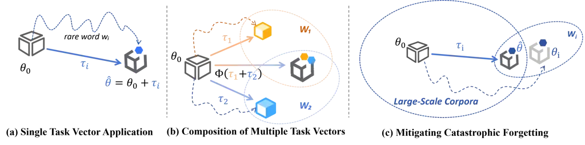
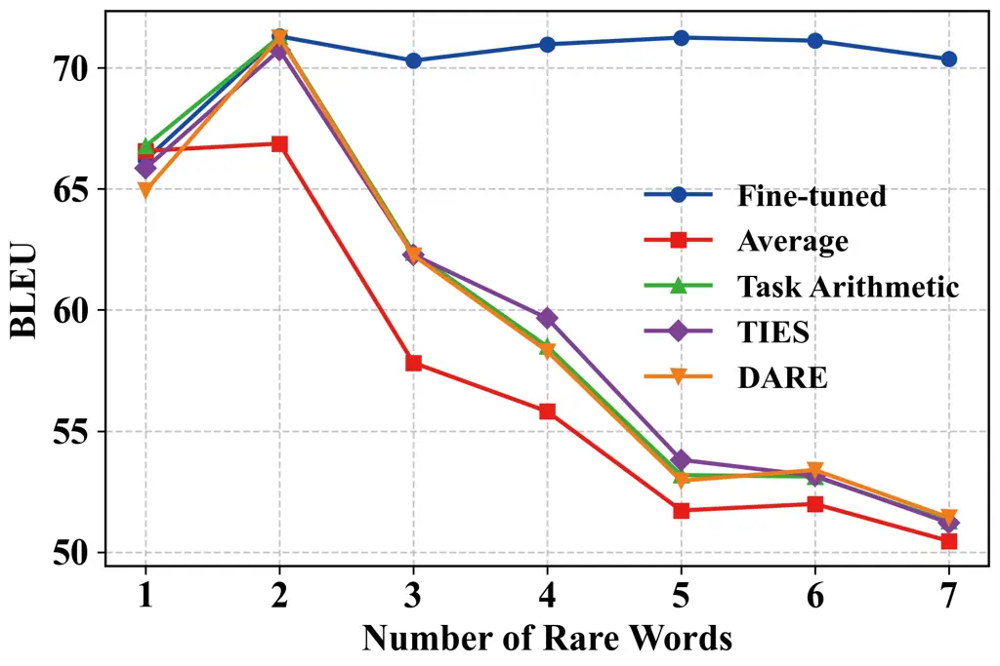

# Rare Word Recognition and Translation Without Fine-Tuning via Task Vector in Speech Models

Ruihao Jing\sthanksThe work is done with TeleAI    Cheng Gong    Yu
Jiang    Boyu Zhu    Shansong Liu    Chi Zhang    Xiao-Lei Zhang^(†)   
Xuelong Li\sthanksCorresponding authors

###### Abstract

Rare words remain a critical bottleneck for speech-to-text systems.
While direct fine-tuning improves recognition of target words, it often
incurs high cost, catastrophic forgetting, and limited scalability. To
address these challenges, we propose a training-free paradigm based on
task vectors for rare word recognition and translation. By defining task
vectors as parameter differences and introducing word-level task vector
arithmetic, our approach enables flexible composition of rare-word
capabilities, greatly enhancing scalability and reusability. Extensive
experiments across multiple domains show that the proposed method
matches or surpasses fine-tuned models on target words, improves general
performance by about 5 BLEU, and mitigates catastrophic forgetting.

###### Index Terms: 

Task Vector, Rare Words, Speech Models

^(†)^(†)address: Institute of Artificial Intelligence (TeleAI), China
Telecom

## 1 Introduction

Large-scale speech models such as Whisper \[14\], SenseVoice \[1\], and
SeamlessM4T \[2\] have achieved impressive performance by leveraging
massive training corpora. However, the distribution of words in natural
language typically exhibits a long-tail pattern, where rare words—such
as geographical locations, personal names, and domain-specific
terminology—are sparsely covered. As a result, despite their strong
performance in everyday conversational scenarios, these models often
struggle to accurately recognize infrequent or specialized vocabulary.
This limitation poses a significant challenge for real-world
applications such as automatic speech recognition (ASR) and automatic
speech translation (AST), especially in specialized domains such as
medicine and law, where rare terminology plays a critical role.

To improve the recognition of rare words in pre-trained speech models, a
straightforward approach is to fine-tune the model on rare word
datasets. For example, synthetic speech generated by text-to-speech
(TTS) systems can be employed to augment rare-word corpora and
subsequently fine-tune pre-trained models \[22\]. Beyond directly
fine-tuning the base model, alternative strategies include fine-tuning
auxiliary detection modules or adopting retrieval-augmented generation
(RAG) approaches. CB-Whisper \[10\] introduces an additional keyword
spotting (KWS) module to identify rare words and feeds them as prompts
into the decoding process, improving final transcription accuracy.
Similarly, the paper \[6\] leverages a detector to identify
domain-specific terms in speech and injects them into the subsequent
decoding process. In addition, some studies fine-tune a RAG module to
estimate the similarity between the current word and rare words stored
in an external knowledge base. For instance, the translation of rare
words can be improved by retrieving translation pairs and leveraging
in-context learning \[9\]. Likewise, the method described in \[18\] uses
a “locate-and-focus” strategy to reduce irrelevant interference and
improve the translation of terminology. Despite their effectiveness,
these approaches inevitably require additional training, which incurs
substantial computational cost. Moreover, fine-tuning often introduces
the problem of catastrophic forgetting: a model adapted to rare-word
corpora may experience degraded performance on general-domain data
\[5\].



Figure 1: Illustration of the task vector ($`\tau`$) approach for
addressing the problem in Section 2.1. (a) A pre-trained model
$`\theta_{0}`$ can be combined with a task vector $`\tau_{i}`$ to obtain
a fused model $`\hat{\theta}`$ capable of recognizing the rare word
$`w_{i}`$, without any fine-tuning. (b) Multiple task vectors can be
flexibly combined to construct models that recognize multiple rare
words. (c) Compared with a fine-tuned model $`\theta_{i}`$, a model
built from $`\tau_{i}`$ not only captures the rare word recognition
ability but also preserves the raw model’s general capabilities,
mitigating catastrophic forgetting.

Limitations of fine-tuning arise not only in rare word tasks for speech
models but also in other domains, such as large language models (LLMs).
Training LLMs such as Qwen \[20\] or Llama \[4\] incurs substantial
computational and financial costs. To enable a single large language
model to acquire multiple capabilities without retraining, one promising
direction is the task vector approach \[8\]. Task vectors represent the
parameter shift induced by fine-tuning relative to a pretrained model.
Arithmetic operations on these vectors enable the compositional transfer
of knowledge across fine-tuned models. Several extensions have been
proposed to further improve this approach. For example, the method in
\[19\] reduces interference and resolves conflicts in parameter signs by
pruning and aligning parameter directions. Additionally, parameter
pruning followed by the rescaling of remaining values helps to reduce
redundancy and improve model merging \[21\].

Recently, the concept of task vectors has also been introduced into the
speech domain. For example, the paper \[17\] proposes the use of
SYN2REAL task vectors, aiming to improve the robustness of ASR models
trained on synthetic data when applied to real-world scenarios.
Experiments in \[15, 12\] demonstrate that task vectors derived from
high-resource languages substantially improve performance on
low-resource languages. Meanwhile, several studies explore the
application of task vectors in speech representation learning \[16,
11\]. Given the diversity of rare words, repeatedly fine-tuning a new
model for each rare word incurs prohibitive cost. Therefore, it is
worthwhile to investigate the effectiveness of leveraging task vectors
to achieve training-free rare-word recognition and translation.

To address the challenges of high cost, catastrophic forgetting, and
limited scalability in model fine-tuning for rare word speech
recognition and translation, we propose a training-free approach based
on task vectors. Our contributions are summarized as follows:

1.  1.  To the best of our knowledge, this work is the first to apply task
        vector methods to speech-to-text models for rare word recognition.
        We address the challenges of high cost and catastrophic forgetting
        inherent in model fine-tuning.
2.  2.  We introduce word-level task vector arithmetic, which enables direct
        composition of models trained on different rare words, thereby
        substantially enhancing scalability and reusability.
3.  3.  We conduct extensive experiments across multiple rare-word domains,
        evaluating both recognition and translation tasks, providing
        empirical evidence of the effectiveness of our approach.

## 2 Method

In this section, we begin by analyzing the limitations of fine-tuning in
addressing rare-word recognition and translation. We then present our
proposed training-free method, which overcomes these challenges and
provides a more scalable and flexible solution.

### 2.1 Problem Formulation

We study speech models for speech-to-text tasks, including ASR and AST.
Let a pre-trained speech model be $`\theta_{0}`$. Given a set of rare
word datasets $`\{W_{1},W_{2},\dots,W_{K}\}`$, where each subset
$`W_{i}`$ contains $`N_{W_{i}}`$ samples involving only the rare word
$`w_{i}`$, conventional fine-tuning requires:

```math
\vskip-2.84526pt\theta_{i}=\underset{\theta}{\text{argmin}}\ \mathcal{L}(\theta_{0};W_{i}),\quad\forall i\in[1,K],\vskip-2.84526pt \tag{1}
```

where $`\theta_{i}`$ denotes the fine-tuned model derived from training
$`\theta_{0}`$ on the subset $`W_{i}`$. This approach incurs a memory
cost of $`\mathcal{O}(1)`$, and results in a training cost of
$`\mathcal{O}(N_{W_{i}})`$ for each subset. This approach suffers from
three fundamental limitations.

High cost. Enabling the raw model $`\theta_{0}`$ to recognize a rare
word $`w_{i}`$ while preserving its general capabilities typically
incurs a training cost much larger than $`\mathcal{O}(N_{W_{i}})`$.
Moreover, as the number of rare words increases, the total cost grows
linearly. In contrast, our goal is to incorporate new rare words with
only $`\mathcal{O}(1)`$ additional training cost, without requiring any
gradient updates. This process can be formally expressed as:

```math
\vskip-2.84526pt\hat{\theta}=\mathcal{F}(\theta_{0},\tau_{i})\quad\text{s.t.}\quad\frac{\partial\mathcal{F}}{\partial\theta}=0.\vskip-2.84526pt \tag{2}
```

In the above equation, $`\tau_{i}`$ represents the capability
representation of the rare word $`w_{i}`$. By applying the function
$`\mathcal{F}`$ to inject $`\tau_{i}`$ into the $`\theta_{0}`$, we
obtain the fused model $`\hat{\theta}`$ with the ability to recognize
$`w_{i}`$.

Scalability constraint. When combining $`K`$ specialized models for
different rare words, conventional ensemble methods incur a memory cost
of $`\mathcal{O}(K)`$. Instead, we seek a fusion strategy $`\Phi`$ that
has scaling capabilities, such that

```math
\vskip-2.84526pt\hat{\theta}=\mathcal{F}(\theta_{0},\Phi(\tau_{1},\dots,\tau_{K})),\vskip-2.84526pt \tag{3}
```

where $`\hat{\theta}`$ acquires capabilities for handling multiple rare
words. This approach reduces the memory cost to $`\mathcal{O}(1)`$.

Catastrophic forgetting. Fine-tuning degrades general capabilities. Let
$`\mathcal{T}_{\text{gen}}`$ be a generic task with loss
$`\mathcal{L}_{\text{gen}}`$:

```math
\vskip-2.84526pt\Delta\mathcal{L}_{\text{gen}}=\mathcal{L}_{\text{gen}}(\theta_{i})-\mathcal{L}_{\text{gen}}(\theta_{0})\gg 0.\vskip-2.84526pt \tag{4}
```

We require bounded degradation:

```math
\vskip-2.84526pt\left|\mathcal{L}_{\text{gen}}(\hat{\theta})-\mathcal{L}_{\text{gen}}(\theta_{0})\right|\leq\epsilon,\vskip-2.84526pt \tag{5}
```

where $`\epsilon`$ quantifies the maximum allowable reduction in general
task performance when the model gains the ability to recognize rare
words.

### 2.2 Training free method

To address the above challenges, we introduce the task vector approach
for rare words as Fig 2. We hypothesize that the recognition ability for
rare words, obtained by fine-tuning a speech model on a rare word
dataset, can be similarly encoded in task vectors. The task vector is
defined as

```math
\vskip-2.84526pt\tau_{i}=\theta_{i}-\theta_{0},\vskip 0.0pt \tag{6}
```

where $`\tau_{i}`$ captures the parameter differences between the
fine-tuned and pretrained models, encoding the model’s recognition
ability for the rare word $`w_{i}`$.

Building on this, we argue that integrating multiple rare word
recognition capabilities can be achieved by strategically combining
their respective task vectors. The overall integrated model is
constructed as:

```math
\vskip-2.84526pt\hat{\theta}=\theta_{0}+\Phi(\tau_{1},\dots,\tau_{K}), \tag{7}
```

where $`\Phi(.)`$ is a vector composition function designed to merge
multiple task vectors without causing significant interference or
performance loss. Considering the finer granularity of word-level task
vectors, we explore and compare three distinct strategies:

Task Arithmetic (TA) \[8\]. A straightforward approach is vector
addition. This method assumes that different task vectors can be
combined linearly without significant conflict. The strategy is formally
expressed as follows:

```math
\vskip-7.11317pt\Phi_{\text{Task Arithmetic}}(\tau_{1},\tau_{2},\ldots,\tau_{K})=\sum_{i=1}^{K}\alpha_{i}\tau_{i}, \tag{8}
```

where $`\alpha_{i}`$ controls the contribution of each vector.

TrIm and Elect Sign (TIES) \[19\]. This strategy is designed to address
the problem of inconsistent parameter directions that can occur when
combining multiple task vectors. The method includes three steps: 1)
Trim: We apply eq. 9 to sparsify each task vector. Specifically, for the
parameters in $`\tau_{i}`$, we retain only the top-$`p`$ parameters with
the largest magnitudes and set the remaining parameters to zero.

```math
\vskip-2.84526pt\tau_{i}^{\prime}=\mathrm{Trim}(\tau_{i},p)\vskip-2.84526pt \tag{9}
```

2\) Elect Sign: For each parameter index $`j`$, we determine the
dominant direction by aggregating all trimmed task vectors as follows:

```math
\vskip-5.69054pts^{*}[j]=\operatorname{sign}\!\Bigg(\sum_{i=1}^{K}\tau_{i}^{\prime}[j]\Bigg).\vskip-1.42262pt \tag{10}
```

3\) Merge: In the final fusion step, we aggregate only the parameter
values that match the elected sign at each index $`j`$, weighting them
proportionally:

```math
\vskip-5.69054pt\Phi_{\text{TIES}}(\tau_{1},\dots,\tau_{K})[j]=\sum_{i=1}^{K}\alpha_{i}\cdot\tau_{i}^{\prime}[j]\cdot\mathbb{I}(\operatorname{sign}(\tau_{i}^{\prime}[j])=s^{*}[j]).\vskip-1.42262pt \tag{11}
```

Drop And Rescale (DARE) \[21\]. This strategy proceeds in two steps:
drop and rescale. For each task vector $`\tau_{i}`$, we independently
drop each parameter with probability $`p`$:

```math
\vskip-5.69054pt\tilde{\tau}_{i}=\mathrm{Drop}(\tau_{i},p).\vskip-2.84526pt \tag{12}
```

We then rescale the remaining parameters by a factor of
$`\frac{1}{1-p}`$ to maintain consistent magnitude, and fuse them as

```math
\vskip-5.69054pt\Phi_{\mathrm{DARE}}(\tau_{1},\tau_{2},\dots,\tau_{K})=\frac{1}{1-p}\sum_{i=1}^{K}\alpha_{i}\,\tilde{\tau}_{i}.\vskip-2.84526pt \tag{13}
```

Overall, TIES and DARE can be viewed as advanced variants of Task
Arithmetic, incorporating additional redundancy parameter pruning to
reduce rare words interference.

## 3 EXPERIMENTAL SETUPS

### 3.1 Datasets

We first used GPT-4o \[7\] to generate 10 rare words, including
landmarks, locations, and individuals. These words were verified to be
incorrectly recognized by the Whisper-medium model. For each rare word,
GPT-4o generated over 1,000 contextualized English sentences, which were
then translated into Chinese. Based on this bilingual corpus, we
employed CosyVoice2 \[3\] to synthesize speech, constructing a dataset
with paired text and audio samples in the format {en_text, en_speech,
zh_text, zh_speech}. For data partitioning, we randomly sampled 100
pairs per term as the test set, another 100 pairs as the validation set,
and used the remaining samples for training. The detailed statistics of
the rare word datasets are provided in Table 1. In addition, we
synthesized 1,702 pairs without rare words to create a general test set,
which was used to evaluate the model’s generalization ability.

|            |                       |       |            |
| ---------- | --------------------- | ----- | ---------- |
| Domain     | Rare Word             | Train | ID         |
| Landmark   | Neuschwanstein Castle | 1160  | $`W_{1}`$  |
|            | Berlin Wall           | 1345  | $`W_{2}`$  |
|            | Milan Cathedral       | 1359  | $`W_{3}`$  |
| Location   | Triberg Waterfall     | 1248  | $`W_{4}`$  |
|            | The Rhine Valley      | 1500  | $`W_{5}`$  |
|            | Avignon               | 1414  | $`W_{6}`$  |
|            | Carcassonne           | 1363  | $`W_{7}`$  |
| Individual | Raphael               | 1262  | $`W_{8}`$  |
|            | Goethe                | 1148  | $`W_{9}`$  |
|            | Voltaire              | 1372  | $`W_{10}`$ |

Table 1: Statistics of the rare word datasets.

### 3.2 Training configuration

All experiments are conducted on the Whisper-medium \[14\] model.
Whisper is a multitasking system capable of performing both ASR and AST.
In the AST setting, it directly translates speech from multiple source
languages into English text. For all fine-tuning strategies considered
in this work, we train for 30 epochs with an initial learning rate of
$`1\times 10^{-3}`$. We select the checkpoint with the best validation
performance for evaluation and downstream task vector construction. For
Task Arithmetic, TIES, and DARE, we normalize the hyperparameters such
that $`\sum_{i=1}^{K}\alpha_{i}=1`$ with
$`\alpha_{1}=\alpha_{2}=\cdots=\alpha_{K}`$. For both TIES and DARE, the
pruning probability $`p`$ is fixed at $`0.5`$.

We consider three types of baseline models:

1.  1.  Raw: directly evaluating the publicly available pretrained
        checkpoint without any additional fine-tuning;
2.  2.  Fine-tuned (FT): further fine-tuning the pretrained model on the
        rare word dataset before evaluation;
3.  3.  Average: constructing a new model by directly averaging the
        parameters of multiple models, serving as a reference for comparison
        with the three composition strategies introduced in Section 2.2.

We conduct systematic experiments to validate the effectiveness of task
vectors. The setup is as follows:

(1) Single task vector. We start by assessing the basic effectiveness of
task vectors. Specifically, we fine-tune 10 models on 10 different rare
word datasets for Chinese-to-English speech translation. These
fine-tuned models are then combined using three fusion strategies
introduced in Section 2.2 to create task-vector-based rare word models.
The Average strategy simply takes the average of the parameters from the
fine-tuned model and the raw model. It is important to note that in this
setting, both the fine-tuned models and the fusion models are restricted
to handling one single rare word at a time.

(2) Composition of multiple task vectors. We investigate whether
combining multiple task vectors enables simultaneous recognition of
several rare words in Chinese-to-English speech translation. Under task
vector strategies or the Average method, “1 rare word” uses a single
fine-tuned model, “2 rare words” fuses two fine-tuned models, and so on.
By contrast, the fine-tuning baseline jointly trains a single model on
all selected rare word datasets.

(3) Mitigating catastrophic forgetting. Fine-tuning a general-purpose
speech model on specific domains often degrades its basic capabilities.
To study this, we further evaluate the models from Single task vector on
their corresponding rare word test sets, measuring performance on
Chinese speech transcription.

### 3.3 Evaluation

For translation performance, we adopt SacreBLEU \[13\] as the primary
evaluation metric. To ensure consistency, we normalize both the model
outputs and reference texts to lowercase before calculating the BLEU
scores. For transcription performance, we use Character Error Rate (CER)
as the evaluation metric for Chinese speech transcription, which
measures accuracy at the character level.

## 4 RESULTS AND DISCUSSION

### 4.1 Single task vector

The results of single task vector are summarized in Table 2. Overall,
TA, TIES, and DARE perform on par with fine-tuned models on most rare
words and even surpass them in certain cases (e.g., “Neuschwanstein
Castle ($`W_{1}`$)” and “Milan Cathedral ($`W_{3}`$)”). On the general
dataset, these strategies improve performance by about 5 BLEU over the
Raw model and 2 BLEU over fine-tuned models, demonstrating clear
advantages. Fine-tuned models often introduce parameter redundancy.
Adjusting task vector coefficients or increasing drop probability can
enhance generalization on the general dataset without sacrificing rare
word performance. Additionally, the Average method performs nearly
identically to TA, as it can be viewed as its special case with equal
weights of $`\alpha_{i}`$, while TA allows flexible coefficient
adjustment.

|            |       |       |         |       |       |       |
| ---------- | ----- | ----- | ------- | ----- | ----- | ----- |
| Words      | Raw   | FT    | Average | TA    | TIES  | DARE  |
| $`W_{1}`$  | 25.28 | 66.20 | 66.57   | 66.77 | 63.76 | 66.57 |
| $`W_{2}`$  | 35.79 | 74.65 | 74.88   | 74.88 | 74.25 | 74.88 |
| $`W_{3}`$  | 42.13 | 67.81 | 68.66   | 68.66 | 66.05 | 68.63 |
| $`W_{4}`$  | 44.49 | 71.73 | 73.17   | 73.17 | 72.44 | 73.07 |
| $`W_{5}`$  | 24.29 | 63.30 | 59.46   | 59.46 | 60.01 | 59.46 |
| $`W_{6}`$  | 22.56 | 70.83 | 70.66   | 70.66 | 68.44 | 70.00 |
| $`W_{7}`$  | 28.32 | 59.36 | 61.06   | 61.02 | 59.21 | 60.53 |
| $`W_{8}`$  | 28.46 | 63.48 | 62.53   | 62.60 | 59.33 | 62.86 |
| $`W_{9}`$  | 38.08 | 70.11 | 68.34   | 68.34 | 68.21 | 67.86 |
| $`W_{10}`$ | 32.91 | 71.19 | 64.82   | 64.82 | 63.43 | 64.96 |
| General    | 35.66 | 37.61 | 40.64   | 40.76 | 40.77 | 40.76 |

Table 2: BLEU ($`\uparrow`$) scores on the Chinese-to-English speech
translation task for 10 rare word datasets. For each word, the best
performance among “Average”, “TA”, “TIES”, and “DARE” is highlighted in
bold. Results on the general-domain test set are also reported.

### 4.2 Multiple task vectors



Figure 2: BLEU scores on the Chinese-to-English speech translation task
as the number of rare words increases.

This subsection investigates how the performance of task-vector-based
models evolves as the number of rare word task vectors increases. The
experiment results are shown in Figure 2. The results indicate that when
the number of rare words is 1, all fusion strategies achieve performance
comparable to that of the corresponding fine-tuned model. Overall, as
the number of rare words increases, the performance of the Average, TA,
TIES, and DARE declines. In particular, within the range of 2 to 4 rare
words, the three task-vector–based strategies consistently outperform
the Average baseline. However, this advantage diminishes as the number
of rare words continues to rise. We attribute this decline to the
distributional differences across fine-tuned models. Simple parameter
averaging tends to introduce interference between tasks. In contrast,
strategies such as TA, which adjust task weights via coefficients
$`\alpha_{i}`$, or TIES and DARE employ drop probabilities $`p`$ to
suppress redundant parameters, are more effective in mitigating
cross-task conflicts. Nonetheless, as the number of task vectors further
increases, the likelihood of parameter conflicts inevitably rises, which
explains the gradual weakening of these strategies.

### 4.3 Catastrophic forgetting

|            |       |         |       |       |       |
| ---------- | ----- | ------- | ----- | ----- | ----- |
| Words      | Raw   | Average | TA    | TIES  | DARE  |
| $`W_{1}`$  | 10.00 | 19.74   | 6.60  | 5.92  | 6.60  |
| $`W_{2}`$  | 10.06 | 29.23   | 29.23 | 21.75 | 29.42 |
| $`W_{3}`$  | 7.34  | 14.56   | 6.23  | 4.96  | 5.79  |
| $`W_{4}`$  | 6.72  | 24.33   | 16.76 | 6.50  | 10.63 |
| $`W_{5}`$  | 9.03  | 17.47   | 17.47 | 9.93  | 17.61 |
| $`W_{6}`$  | 11.26 | 4.45    | 4.45  | 4.88  | 4.45  |
| $`W_{7}`$  | 9.17  | 21.48   | 7.42  | 7.06  | 7.62  |
| $`W_{8}`$  | 8.68  | 14.18   | 7.55  | 5.96  | 8.22  |
| $`W_{9}`$  | 12.78 | 25.72   | 25.72 | 16.10 | 25.72 |
| $`W_{10}`$ | 11.60 | 16.64   | 16.64 | 13.74 | 15.88 |

Table 3: CER (%) ($`\downarrow`$) scores on the Chinese speech
recognition task for the 10 rare word datasets. The best CER for each
word is highlighted in bold, selected only among the four fusion
strategies.

A common challenge with fine-tuning large speech models on
domain-specific tasks is the degradation of their general capabilities.
Building on the models in Table 2, we evaluate their Chinese
transcription performance on the rare word test sets (Table 3). From
these results, the original Whisper model shows strong multi-task
ability, handling both translation and recognition. However, fine-tuning
for rare word translation, while boosting target performance, causes
catastrophic forgetting—Chinese speech recognition collapses entirely.
In contrast, task-vector-based strategies mitigate this degradation to
varying degrees. Among them, TIES achieves the lowest CER on most test
sets, with especially strong results for “Berlin Wall ($`W_{2}`$)” and
“Raphael ($`W_{8}`$)”. In “Carcassonne ($`W_{7}`$)”, it even outperforms
the raw model, suggesting that it not only preserves but sometimes
improves recognition. This success stems from TIES’s precise modeling of
task-specific parameter updates. Its task vector $`\tau_{i}`$ captures
the translation ability for the rare word $`w_{i}`$ and, when combined
with the raw model, strengthens translation while preserving
recognition. In contrast, Average, TA, and DARE show less stable
parameter fusion, resulting in higher CER.

Overall, task-vector-based parameter fusion effectively mitigates
catastrophic forgetting, enabling models to achieve strong task
performance while maintaining general abilities.

## 5 CONCLUSION

In this work, we addressed the challenges of rare word recognition and
translation in speech-to-text systems, where direct fine-tuning suffers
from high cost, catastrophic forgetting, and poor scalability. We
proposed a training-free paradigm based on task vectors, and introduced
word-level task vector arithmetic to flexibly compose rare-word
capabilities. Experiments across multiple domains demonstrated that our
approach not only achieves competitive or superior performance on target
words compared to fine-tuned models, but also improves general test
performance while alleviating forgetting. These results highlight task
vectors as a practical and scalable solution for handling rare entities
such as place names, personal names, and technical terms in real-world
applications.

## References

- \[1\] K. An, Q. Chen, C. Deng, Z. Du, C. Gao, Z. Gao, Y. Gu, T. He, H.
  Hu, K. Hu, et al. (2024) Funaudiollm: voice understanding and
  generation foundation models for natural interaction between humans
  and llms. arXiv preprint arXiv:2407.04051. Cited by: §1.
- \[2\] L. Barrault, Y. Chung, M. C. Meglioli, D. Dale, N. Dong, P.
  Duquenne, H. Elsahar, H. Gong, K. Heffernan, J. Hoffman, et al. (2023)
  SeamlessM4T: massively multilingual & multimodal machine translation.
  arXiv preprint arXiv:2308.11596. Cited by: §1.
- \[3\] Z. Du, Y. Wang, Q. Chen, X. Shi, X. Lv, T. Zhao, Z. Gao, Y.
  Yang, C. Gao, H. Wang, et al. (2024) Cosyvoice 2: scalable streaming
  speech synthesis with large language models. arXiv preprint
  arXiv:2412.10117. Cited by: §3.1.
- \[4\] A. Dubey, A. Jauhri, A. Pandey, A. Kadian, A. Al-Dahle, A.
  Letman, A. Mathur, A. Schelten, A. Yang, A. Fan, et al. (2024) The
  llama 3 herd of models. arXiv e-prints, pp. arXiv–2407. Cited by: §1.
- \[5\] R. M. French (1999) Catastrophic forgetting in connectionist
  networks. Trends in cognitive sciences 3 (4), pp. 128–135. Cited by:
  §1.
- \[6\] M. Gaido, Y. Tang, I. Kulikov, R. Huang, H. Gong, and H.
  Inaguma (2023) Named entity detection and injection for direct speech
  translation. In ICASSP 2023-2023 IEEE International Conference on
  Acoustics, Speech and Signal Processing (ICASSP), pp. 1–5. Cited by:
  §1.
- \[7\] A. Hurst, A. Lerer, A. P. Goucher, A. Perelman, A. Ramesh, A.
  Clark, A. Ostrow, A. Welihinda, A. Hayes, A. Radford, et al. (2024)
  Gpt-4o system card. arXiv preprint arXiv:2410.21276. Cited by: §3.1.
- \[8\] G. Ilharco, M. T. Ribeiro, M. Wortsman, L. Schmidt, H.
  Hajishirzi, and A. Farhadi (2023) Editing models with task arithmetic.
  In The Eleventh International Conference on Learning Representations,
  ICLR 2023, Kigali, Rwanda, May 1-5, 2023, External Links:
  [Link](https://openreview.net/forum?id=6t0Kwf8-jrj) Cited by: §1,
  §2.2.
- \[9\] S. Li, D. Liu, and J. Niehues (2024) Optimizing rare word
  accuracy in direct speech translation with a
  retrieval-and-demonstration approach. In Proceedings of the 2024
  Conference on Empirical Methods in Natural Language Processing, Y.
  Al-Onaizan, M. Bansal, and Y. Chen (Eds.), Miami, Florida, USA,
  pp. 12703–12719. External Links:
  [Link](https://aclanthology.org/2024.emnlp-main.708/),
  [Document](https://dx.doi.org/10.18653/v1/2024.emnlp-main.708) Cited
  by: §1.
- \[10\] Y. Li, Y. Li, M. Zhang, C. Su, J. Yu, M. Piao, X. Qiao, M.
  Ma, Y. Zhao, and H. Yang (2024) CB-whisper: contextual biasing whisper
  using open-vocabulary keyword-spotting. In Proceedings of the 2024
  Joint International Conference on Computational Linguistics, Language
  Resources and Evaluation (LREC-COLING 2024), pp. 2941–2946. Cited by:
  §1.
- \[11\] T. Lin, W. Huang, H. Tang, and H. Lee (2025) Speech-ft: merging
  pre-trained and fine-tuned speech representation models for cross-task
  generalization. arXiv preprint arXiv:2502.12672. Cited by: §1.
- \[12\] H. Nagasawa, S. Otake, and S. Iwata (2025) Task vector
  arithmetic for low-resource asr. In ICASSP 2025-2025 IEEE
  International Conference on Acoustics, Speech and Signal Processing
  (ICASSP), pp. 1–5. Cited by: §1.
- \[13\] M. Post (2018) A call for clarity in reporting bleu scores. In
  Proceedings of the Third Conference on Machine Translation: Research
  Papers, pp. 186–191. Cited by: §3.3.
- \[14\] A. Radford, J. W. Kim, T. Xu, G. Brockman, C. McLeavey, and I.
  Sutskever (2023) Robust speech recognition via large-scale weak
  supervision. In International conference on machine learning,
  pp. 28492–28518. Cited by: §1, §3.2.
- \[15\] G. Ramesh, K. Audhkhasi, and B. Ramabhadran (2024) Task vector
  algebra for asr models. In ICASSP 2024-2024 IEEE International
  Conference on Acoustics, Speech and Signal Processing (ICASSP),
  pp. 12256–12260. Cited by: §1.
- \[16\] F. Ritter-Gutierrez, Y. Lin, J. Wei, J. H. Wong, E. S.
  Chng, N. F. Chen, and H. Lee (2025) Distilling a speech and music
  encoder with task arithmetic. arXiv preprint arXiv:2505.13270. Cited
  by: §1.
- \[17\] H. Su, H. Farn, F. Sun, S. Chen, and H. Lee (2024) Task
  arithmetic can mitigate synthetic-to-real gap in automatic speech
  recognition. In Proceedings of the 2024 Conference on Empirical
  Methods in Natural Language Processing, Y. Al-Onaizan, M. Bansal,
  and Y. Chen (Eds.), Miami, Florida, USA, pp. 8905–8915. External
  Links: [Link](https://aclanthology.org/2024.emnlp-main.503/),
  [Document](https://dx.doi.org/10.18653/v1/2024.emnlp-main.503) Cited
  by: §1.
- \[18\] S. Wu, J. Tang, C. Yang, P. Zhang, B. Yang, J. Li, J. Yao, M.
  Zhang, and J. Su (2025) Locate-and-focus: enhancing terminology
  translation in speech language models. In Proceedings of the 63rd
  Annual Meeting of the Association for Computational Linguistics
  (Volume 1: Long Papers), W. Che, J. Nabende, E. Shutova, and M. T.
  Pilehvar (Eds.), Vienna, Austria, pp. 11345–11360. External Links:
  [Link](https://aclanthology.org/2025.acl-long.556/),
  [Document](https://dx.doi.org/10.18653/v1/2025.acl-long.556), ISBN
  979-8-89176-251-0 Cited by: §1.
- \[19\] P. Yadav, D. Tam, L. Choshen, C. A. Raffel, and M.
  Bansal (2023) Ties-merging: resolving interference when merging
  models. Advances in Neural Information Processing Systems 36,
  pp. 7093–7115. Cited by: §1, §2.2.
- \[20\] A. Yang, A. Li, B. Yang, B. Zhang, B. Hui, B. Zheng, B. Yu, C.
  Gao, C. Huang, C. Lv, et al. (2025) Qwen3 technical report. arXiv
  preprint arXiv:2505.09388. Cited by: §1.
- \[21\] L. Yu, B. Yu, H. Yu, F. Huang, and Y. Li (2024) Language models
  are super mario: absorbing abilities from homologous models as a free
  lunch. In Forty-first International Conference on Machine Learning,
  Cited by: §1, §2.2.
- \[22\] K. C. Yuen, L. Haoyang, and C. E. Siong (2023) ASR model
  adaptation for rare words using synthetic data generated by multiple
  text-to-speech systems. In 2023 Asia Pacific Signal and Information
  Processing Association Annual Summit and Conference (APSIPA ASC), Vol.
  , pp. 1771–1778. External Links:
  [Document](https://dx.doi.org/10.1109/APSIPAASC58517.2023.10317116)
  Cited by: §1.
