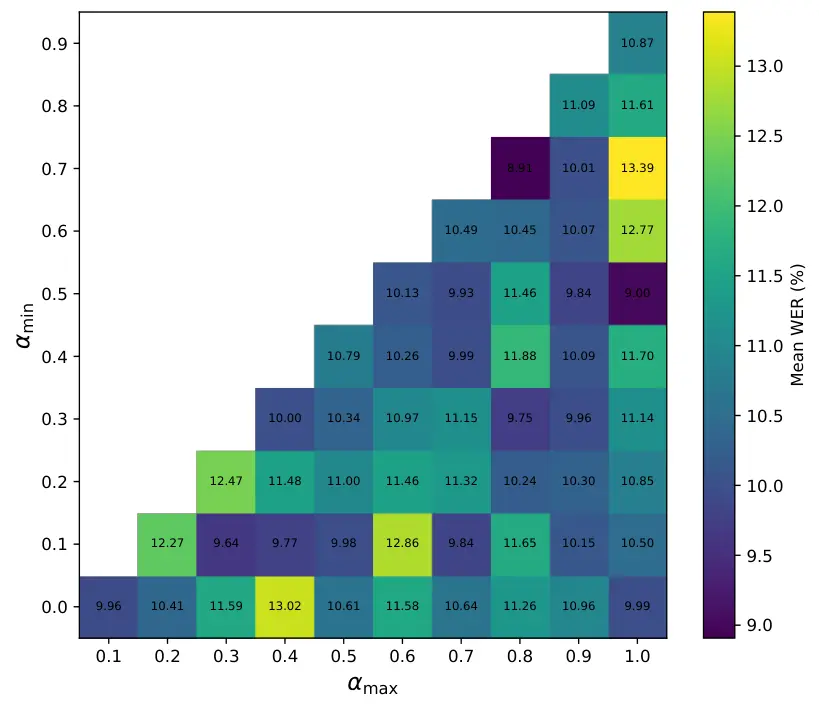
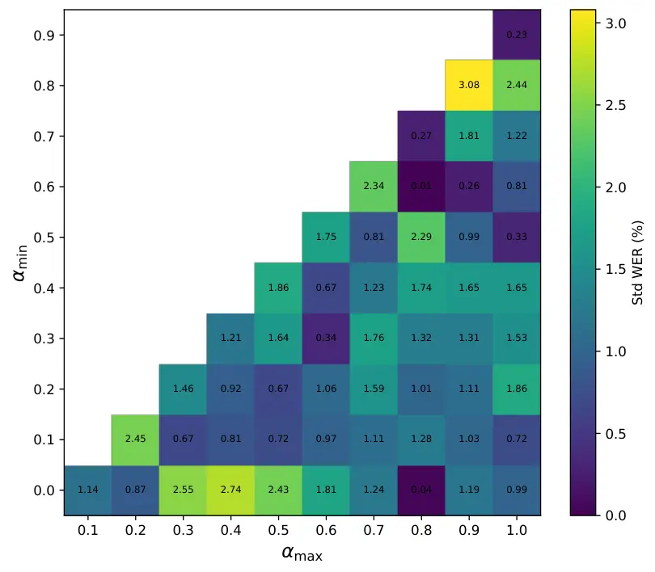
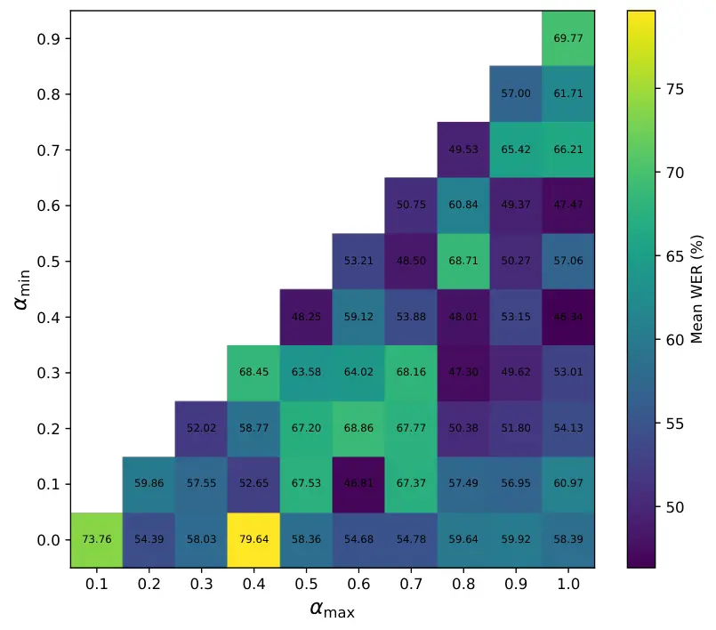
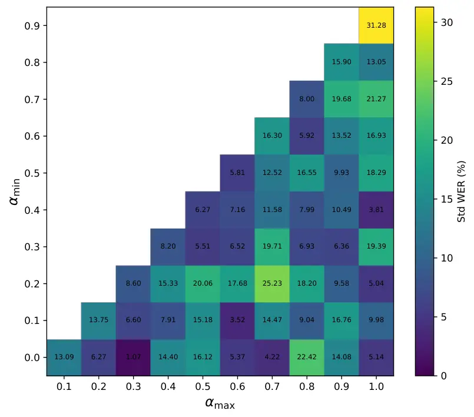

# FADE: Layer-Wise Compensation without Per-Model Coefficient Search for Weight-Only Quantization of Encoder–Decoder ASR

Xinyu Wang Affiliation: McGill University    Ziyu Zhao
Affiliation: McGill University    Yajie Luo Affiliation: Université de
Montréal    Yihong Wu Affiliation: Université de Montréal    Liheng Ma
Affiliation: McGill University Affiliation: Mila^(†)Equal
contribution^(\*)Corresponding authors    Jingrui Tian
Affiliation: McGill University    Lei Ding Affiliation: University of
Manitoba    Xiao-Wen Chang Affiliation: McGill University    Peng Lu
Affiliation: Université de Montréal

###### Abstract

Layer-wise post-training quantization reconstructs each layer from
inputs already altered by the quantized prefix. QEP compensates for this
drift with one model-wide coefficient, conflating the model-level
operating point with residual variation across layers. We present Fade,
which constructs layer-specific coefficients from normalized
round-to-nearest distortion and a heuristic calibrated-solver response.
It requires no training or per-model coefficient search and adds no
inference-time operation. We evaluate seven Whisper, Moonshine, and
Qwen3-ASR models at 3 and 4 bits on four English ASR benchmarks. Across
38 settings, Fade lowers mean word error rate relative to fixed QEP-0.5
in 31, although a development-tuned global coefficient recovers much of
this gap. The largest absolute reductions occur in W3 rows whose final
error remains too high for practical use; these results measure collapse
mitigation rather than deployable accuracy. In two lower-WER W3 cases,
Fade reduces the tuned-global result from 3.67 to 3.10 and from 13.03 to
11.63. Most W4 differences from the tuned control are within a
descriptive tolerance, and one reverses. Paired reruns and within-seed
permutations on an outcome-informed subset support assignment
sensitivity in selected cases, but do not estimate a matrix-wide success
rate. Fade is therefore a layer-wise alternative when per-model
coefficient search is unavailable, not a universal replacement for tuned
global compensation.

## 1 Introduction

Encoder–decoder Transformers provide accurate automatic speech
recognition (ASR), but parameter storage and weight traffic limit their
use on resource-constrained hardware. Weight-only post-training
quantization (PTQ) reduces these costs without retraining by mapping
full-precision weights to a low-bit grid (Frantar et al., 2023; Lin
et al., 2024; Shao et al., 2024). Most PTQ solvers reconstruct one layer
at a time. At 3 or 4 bits, however, the input to a later layer has
already been changed by every quantized layer before it. A locally
accurate reconstruction can therefore preserve an error introduced by
the quantized prefix rather than reduce its effect on the full model.

Quantization Error Propagation (QEP) addresses prefix drift by shifting
each layer’s reconstruction target toward its clean full-precision
activation  (Arai and Ichikawa, 2025). QEP uses one compensation
coefficient shared by the whole model. This choice combines two
decisions: the model-level operating point, or average compensation
strength, and the residual layer-wise pattern, or how compensation
should vary around that average. Tuning one global coefficient addresses
the first decision but cannot express the second. Searching separately
over every layer would be costly, and it would introduce many
opportunities to fit the development domain.

We distinguish two operating regimes. In the _search-free_ regime, no
model-specific development search over compensation coefficients is
available; the relevant references are standard PTQ methods and QEP with
a fixed $`\alpha=0.5`$. In the _development-tuned_ regime, Global
selects one coefficient for each model–bit pair on a development set.
Global has a larger search budget than the proposed method and serves as
a diagnostic reference: it tests whether a residual layer-wise pattern
contributes beyond a tuned model-level operating point. This distinction
is central to our claim. We do not seek to replace a well-tuned global
coefficient in every regime.

We propose Fade (_Fine-grained Alpha for Dynamic Quantization Error
Propagation_), an offline rule for constructing a layer-specific
compensation pattern without per-model coefficient search. A
calibration-independent diagnostic measures normalized round-to-nearest
(RTN) weight distortion. A second, heuristic diagnostic describes how
the calibrated GPTQ solution moves relative to RTN. A bounded gate maps
their sum to a coefficient for the current layer. The same coefficient
interval is selected once using a development-only protocol and then
locked across models, datasets, and bit widths. Fade still uses the
calibration activations required by GPTQ. “Search-free” means that
neither a coefficient nor an interval is selected separately for each
target model; the shared interval is selected once on three anchor
models. The procedure runs only while quantizing the model and exports
ordinary low-bit weights. Figure 1 summarizes the resulting offline
workflow and its deployment boundary.


$`\downarrow`$

$`\downarrow`$

$`\downarrow`$

$`\downarrow`$

Repeat over encoder/decoder layers; no per-model sweep.

Figure 1: Fade constructs layer-specific coefficients offline. RTN
distortion and calibrated-solver response define two diagnostics; a
bounded logistic rule maps them to $`\alpha_{l}`$ for low-bit
reconstruction. Repeating the rule yields ordinary W3/W4 weights without
inference-graph changes.

We evaluate seven Whisper (Radford et al., 2023), Moonshine (Jeffries
et al., 2024), and Qwen3-ASR (Shi et al., 2026) models at W3 and W4 on
four English benchmarks. Across 38 settings, Fade is lower than fixed
QEP-0.5 in 31, whereas the development-tuned Global control recovers
much of that gap. The largest absolute reductions occur in severely
degraded W3 rows, but two lower-WER W3 cases also improve. Most W4
comparisons with Global are within the descriptive tolerance, and one
reverses. An outcome-informed diagnostic subset, frozen before ten-seed
reruns, examines initially favorable, high-variance, reversal, and
near-tie cases. Its paired and permutation results diagnose assignment
sensitivity in selected settings rather than estimate how often the
method succeeds over the full matrix. We also report anchor and
non-anchor counts; the latter cover other model sizes within the same
three families, not unseen architectures.

Our contributions are:

- •
  We formulate a training-free layer-wise compensation rule that applies
  one locked interval without a separate target-model coefficient sweep
  in weight-only W3/W4 encoder–decoder ASR quantization (Section 3).
- •
  We define two computable layer diagnostics and a bounded offline gate
  that produces ordinary low-bit weights without changing the inference
  graph (Sections 3.2–3.4).
- •
  We separate model-level coefficient selection from layer-wise
  placement across seven models and four datasets, reporting favorable
  degraded regimes together with high-variance, near-tie, and reversal
  cases (Section 4 and Appendix B).

## 2 Background and Related Work

#### Layer-wise PTQ.

For layer $`l`$, let $`\mathbf{W}_{l}\in\mathbb{R}^{n_{l}\times d_{l}}`$
be its weight matrix and let
$`\widehat{\mathbf{X}}_{l}\in\mathbb{R}^{d_{l}\times N}`$ contain
calibration activations produced by the already-quantized prefix. A
standard layer-wise objective is

```math
\min_{\widehat{\mathbf{W}}_{l}\in\mathbb{Q}_{b}^{n_{l}\times d_{l}}}\left\|\mathbf{W}_{l}\widehat{\mathbf{X}}_{l}-\widehat{\mathbf{W}}_{l}\widehat{\mathbf{X}}_{l}\right\|_{F}^{2}, \tag{1}
```

where $`\mathbb{Q}_{b}`$ is a $`b`$-bit quantization grid. GPTQ
approximates this objective with second-order input statistics and
compensates unquantized columns after each quantization step (Frantar
et al., 2023). Other weight-only methods use incoherence transforms,
vector codebooks, salient-weight protection, sparse outliers, or
additive representations  (Chee et al., 2023; Tseng et al., 2024; Lin
et al., 2024; Dettmers et al., 2024; Kim et al., 2024; Egiazarian
et al., 2024). OmniQuant and LRQuant calibrate equivalent
transformations (Shao et al., 2024; Zhao et al., 2024a).
Weight–activation PTQ treats activation outliers through mixed
precision, smoothing, reordering, shifting, and system co-design
 (Dettmers et al., 2022; Xiao et al., 2023; Yuan et al., 2023b; Wei
et al., 2023; Yao et al., 2022; Zhao et al., 2024b). These approaches
improve the local solve but do not by themselves specify how strongly a
layer should compensate for errors already present in
$`\widehat{\mathbf{X}}_{l}`$.

#### Prefix drift and QEP.

Because $`\widehat{\mathbf{X}}_{l}`$ is generated by the quantized
prefix, it differs from the clean activation $`\mathbf{X}_{l}`$. QEP
uses this difference to correct the reconstruction target and applies
one shared coefficient $`\alpha`$ across layers (Arai and Ichikawa,
2025). The coefficient sets a model-level tradeoff between matching the
input actually seen by the quantized model and moving the target toward
its clean counterpart. Fade keeps QEP’s corrected objective but assigns
$`\alpha_{l}`$ from diagnostics of the current layer. This changes
compensation rather than bit allocation, quantization format, or the
deployed inference graph.

#### ASR quantization.

Speech-model compression has combined distillation, weight sharing,
sparsification, and quantization for wav2vec 2.0, encoder–decoder ASR,
and MoE recognizers (Peng et al., 2021; Gao et al., 2021; Yuan et al.,
2023a). Quantization-aware training covers RNN-T and Conformer systems
from 6 to 2 bits (Nguyen et al., 2020; Ding et al., 2022; Rybakov
et al., 2023); mixed-precision methods allocate bits by system or layer
sensitivity (Xu et al., 2022; Fish et al., 2023; Li et al., 2024; Xu
et al., 2025). Speech PTQ includes integer-only data-free quantization,
layer-adaptive range selection, and mixed-precision allocation  (Kim
et al., 2022; Hong et al., 2025; Kang and Kim, 2025). StableQuant
studies 8-bit HuBERT and wav2vec 2.0 and adapts layer quantization
ranges; its encoder-only model family and precision differ from our
encoder–decoder W3/W4 protocol. We therefore treat it as adjacent work
rather than a matched baseline. Unlike mixed-precision allocation, Fade
holds the bit width fixed and isolates layer-specific cross-layer
compensation for a Hessian-based PTQ solver.

## 3 Method

Fade is an offline layer-wise quantization workflow. For each layer, it
measures RTN distortion, describes the calibrated solver’s response,
constructs a bounded coefficient, and uses that coefficient in low-bit
reconstruction. The exported model has the same inference graph as an
ordinary weight-only quantized model.

### 3.1 Prefix Drift and QEP Compensation

Let $`\mathbf{X}_{l}`$ be the clean input to layer $`l`$ and
$`\widehat{\mathbf{X}}_{l}`$ the input produced by the quantized prefix.
We write the upstream drift and input Hessian as

```math
\bm{\delta}_{l}=\mathbf{X}_{l}-\widehat{\mathbf{X}}_{l},\qquad\widehat{\mathbf{H}}_{l}=\widehat{\mathbf{X}}_{l}\widehat{\mathbf{X}}_{l}^{\top}.
```

Following QEP (Arai and Ichikawa, 2025), a coefficient $`\alpha_{l}`$
shifts the reconstruction target toward the clean activation. Define

```math
\mathbf{T}_{l}(\alpha_{l})=\mathbf{W}_{l}+\alpha_{l}\mathbf{W}_{l}\bm{\delta}_{l}\widehat{\mathbf{X}}_{l}^{\top}\widehat{\mathbf{H}}_{l}^{-1}.
```

The corrected layer objective is

```math
\widehat{\mathbf{W}}_{l}(\alpha_{l})=\argmin_{\widetilde{\mathbf{W}}\in\mathbb{Q}_{b}^{n_{l}\times d_{l}}}\left\|\mathbf{T}_{l}(\alpha_{l})\widehat{\mathbf{X}}_{l}-\widetilde{\mathbf{W}}\widehat{\mathbf{X}}_{l}\right\|_{F}^{2}. \tag{2}
```

Setting $`\alpha_{l}=0`$ recovers Eq. (1); using
$`\alpha_{l}\equiv\alpha`$ recovers the shared-coefficient form. Fade
instead constructs $`\alpha_{l}`$ from the two diagnostics below.

### 3.2 Layer Diagnostics

#### RTN distortion.

Let $`\widehat{\mathbf{W}}_{l}^{\mathrm{rtn}}`$ be the round-to-nearest
solution produced by the quantizer. We measure its normalized weight
error as

```math
\displaystyle e_{r}(l) \displaystyle=\frac{\|\mathbf{W}_{l}-\widehat{\mathbf{W}}_{l}^{\mathrm{rtn}}\|_{F}}{\|\mathbf{W}_{l}\|_{F}+\varepsilon},
```

```math
\displaystyle\phi_{\mathrm{int}}(l) \displaystyle=\log(1+e_{r}(l)).
```

This is the only calibration-independent diagnostic in Fade. It
describes the distortion imposed by the low-bit grid without using
activation samples.

#### Calibrated-solver response.

Let $`\widehat{\mathbf{W}}_{l}^{\mathrm{cal}}`$ be the GPTQ solution
computed using $`\widehat{\mathbf{X}}_{l}`$. Relative to RTN, define

```math
\displaystyle e_{c}(l) \displaystyle=\frac{\|\mathbf{W}_{l}-\widehat{\mathbf{W}}_{l}^{\mathrm{cal}}\|_{F}}{\|\mathbf{W}_{l}\|_{F}+\varepsilon},
```

```math
\displaystyle g(l) \displaystyle=\frac{e_{r}(l)-e_{c}(l)}{e_{r}(l)+\varepsilon},
```

```math
\displaystyle d(l) \displaystyle=\frac{\|\widehat{\mathbf{W}}_{l}^{\mathrm{rtn}}-\widehat{\mathbf{W}}_{l}^{\mathrm{cal}}\|_{F}}{\|\mathbf{W}_{l}\|_{F}+\varepsilon}.
```

Here $`g(l)`$ records the relative change in unweighted weight-space
error, and $`d(l)`$ records how far the calibrated solution moves from
RTN. We combine them as

```math
\phi_{\mathrm{sol}}(l)=\max(g(l),0)-\log(1+d(l)).
```

This quantity is a heuristic descriptor of solver response. It is not an
estimator of test error, an estimate of statistical confidence, or a
claim about the optimal value of $`\alpha_{l}`$. GPTQ optimizes the
activation-weighted objective in Eq. (1), whereas $`g(l)`$ is measured
in weight space. On an identical fixed grid, element-wise RTN minimizes
unweighted weight error, so $`g(l)\leq 0`$; the positive term can be
active when the calibrated solver also changes grid parameters such as
scale or clipping. Its observed activation is sparse and is reported in
Appendix Appendix Table 15.

### 3.3 Search-Free Bounded Gate

The gate maps the two diagnostics to a coefficient:

```math
\displaystyle s_{l} \displaystyle=\phi_{\mathrm{int}}(l)+\phi_{\mathrm{sol}}(l),
```

```math
\displaystyle\alpha_{l} \displaystyle=\alpha_{\min}+(\alpha_{\max}-\alpha_{\min})\,\sigma(s_{l}), \tag{3}
```

where $`\sigma`$ is the logistic function. The gate encodes the
hypothesis that layers with different grid distortion and
calibrated-solver responses need not receive the same correction
strength. It does not optimize or validate a coefficient for each layer.

We use $`[\alpha_{\min},\alpha_{\max}]=[0.1,0.8]`$ throughout. Appendix
Appendix D documents its domain, development-only selection, and
realized range. The interval was selected once and locked before test
evaluation; no target-model coefficient sweep or learned gate parameter
is used. Section 4.6 tests the empirical contribution of the two
diagnostic terms within the reported scope.

### 3.4 Offline Integration and Cost

For each layer, Fade runs RTN and GPTQ, computes the scalar diagnostics,
sets $`\alpha_{l}`$, and solves Eq. (2). The calibrated and corrected
solves reuse the Hessian and its factorization. The additional
reconstruction pass has the same $`\mathcal{O}(n_{l}d_{l}^{2})`$ order
as a GPTQ reconstruction; measured wall-clock cost is reported in
Appendix Table 16. The output remains an ordinary $`b`$-bit weight
matrix, so Fade adds no parameter, operation, or kernel requirement at
inference. Algorithm 1 gives the complete offline procedure in
Appendix A.

## 4 Experiments

We separate three questions that require different comparisons. First,
how does Fade compare with established baselines when no coefficient is
searched separately for each model? Second, what remains after allowing
a development-tuned global coefficient and controlling coefficient
assignment? Third, where do these differences weaken or reverse? The
main paper reports the common baseline matrix, all-setting control
counts, and a ten-seed diagnostic subset. Appendices B–D retain the
exhaustive matrices, coefficient trajectories, and narrower diagnostic
checks.

### 4.1 Experimental setup

#### Models and data.

The evaluation covers Whisper Tiny, Base, and Small (Radford et al.,
2023); Moonshine Tiny and Base (Jeffries et al., 2024); and Qwen3-ASR
0.6B and 1.7B (Shi et al., 2026). We report WER on LibriSpeech
test-clean and test-other (Panayotov et al., 2015), SPGISpeech
test (O’Neill et al., 2021), and TED-LIUM 3 test (Hernandez et al.,
2018). Each calibration seed samples 128 utterances from LibriSpeech
train-clean-100. Within a seed, methods use the same utterance IDs. The
full 38-setting matrix uses at least five seeds per setting. The frozen
diagnostic subset described below uses ten shared seeds.

#### Quantization and comparison conditions.

We use asymmetric per-group weight quantization at W3A16 and W4A16.
Group sizes are 64 for Whisper, 52 for Moonshine-Tiny, 72 for
Moonshine-Base, and 128 for Qwen3-ASR. Baselines are deterministic RTN,
AWQ (Lin et al., 2024), GPTQ (Frantar et al., 2023), and GPTQ with fixed
coefficient $`\alpha=0.5`$ (QEP) (Arai and Ichikawa, 2025). The
established-baseline matrices use five calibration seeds and report mean
and standard deviation. Once FADE’s shared interval has been fixed,
QEP-0.5 and FADE require no model-specific coefficient sweep. Global and
the Mean-Matched Shape Control instead use a development-set coefficient
selected separately for each model–bit pair. We keep these conditions
separate rather than treating Global as another search-free baseline.
Appendix A gives the solver, grid, calibration, decoding, and WER
protocol.

#### Development-only interval selection.

We selected one coefficient interval using LibriSpeech dev-other, then
locked it before evaluating any test set. The selection averaged
normalized dev WER over Whisper-Tiny, Moonshine-Tiny, and Qwen3-ASR-1.7B
at W3 and W4, using five calibration seeds. Appendix Table 14 compares
the six candidate intervals. The selected $`[0.1,0.8]`$ interval is
shared by every model, dataset, and bit width.

Appendix Figure 8 keeps the original Whisper comparison (panel 8(a)) and
fixed-coefficient sweep (panel 8(b)); Appendix Figure 9 retains the
exploratory interval surfaces. These diagnostics are not used for
test-set selection.

#### Controls and frozen diagnostic subset.

Four controls separate layer assignment from simpler coefficient
changes. For each model–bit pair, Global minimizes mean dev-other WER
over five calibration seeds on the grid $`\{0.00,0.05,\ldots,1.00\}`$,
then remains fixed across LC, LO, SPG, and TED. Mean, E/D, and Perm are
constructed separately within each calibration seed. Mean replaces that
seed’s $`\alpha_{l}`$ values with their arithmetic mean; E/D uses
separate encoder and decoder means. Perm randomly reassigns that seed’s
coefficient multiset and reruns corrected quantization.

After inspecting the five-seed aggregate matrix, we purposively selected
eight settings before running the ten-seed analysis: five initially
favorable cases, one high-variance case, one reversal, and one near-tie.
We call this the _frozen diagnostic subset_. It was frozen before
rerunning, but its selection was outcome-informed and it is not a random
sample of the 38 settings. Paired and permutation results from this
subset diagnose known regimes; their 5/1/2 outcome count is not a
matrix-wide frequency estimate. Appendix Table 4 gives the selected
Global values and full permutation summaries.

### 4.2 Comparison without per-model coefficient search

|               |               |             |             |                |             |              |               |
| ------------- | ------------- | ----------- | ----------- | -------------- | ----------- | ------------ | ------------- |
| Method        | W-T           | W-B         | W-S         | M-T            | M-B         | Q-0.6        | Q-1.7         |
| FP16          | 23.11         | 12.94       | 11.54       | 12.54          | 9.02        | 4.46         | 3.39          |
| 3-bit weights |               |             |             |                |             |              |               |
| RTN           | 238.33        | 50.02       | 11.45       | 189.88         | 134.93      | 103.94       | 102.99        |
| AWQ           | 200.13(22.13) | 34.72(3.47) | 12.71(1.32) | 179.13(32.13)  | 14.39(0.83) | 103.69(2.84) | 125.56(73.54) |
| GPTQ          | 120.45(24.63) | 33.78(5.09) | 11.66(1.77) | 171.08(28.89)  | 12.54(0.63) | 82.66(38.06) | 6.44(2.95)    |
| GPTQ+QEP      | 94.62(15.92)  | 33.43(7.46) | 10.79(1.21) | 298.53(230.77) | 11.74(0.70) | 37.93(28.79) | 5.86(1.15)    |
| Fade          | 62.31(12.61)  | 34.10(1.89) | 10.96(1.04) | 182.73(16.94)  | 11.63(0.59) | 35.45(19.97) | 5.27(0.95)    |
| 4-bit weights |               |             |             |                |             |              |               |
| RTN           | 64.49         | 15.31       | 12.28       | 18.45          | 10.57       | 6.20         | 3.94          |
| AWQ           | 35.47(1.97)   | 20.16(0.91) | 13.34(1.34) | 22.34(3.42)    | 9.54(0.15)  | 7.05(0.19)   | 4.14(0.05)    |
| GPTQ          | 34.67(5.07)   | 17.33(2.89) | 12.69(0.89) | 21.37(4.69)    | 9.48(0.17)  | 5.20(0.05)   | 3.63(0.05)    |
| GPTQ+QEP      | 32.77(5.05)   | 16.92(1.58) | 11.33(1.57) | 21.83(6.93)    | 9.39(0.12)  | 5.03(0.03)   | 3.62(0.02)    |
| Fade          | 29.88(0.94)   | 16.21(1.29) | 11.17(0.73) | 16.23(0.92)    | 9.40(0.06)  | 4.97(0.03)   | 3.59(0.01)    |

Table 1: WER ($`\downarrow`$) of the established baselines on
LibriSpeech test-other. Parentheses give the standard deviation across
five calibration seeds; RTN is deterministic. Bold marks the lowest mean
among the five displayed quantized methods. W/M/Q abbreviate Whisper,
Moonshine, and Qwen3-ASR.

#### LibriSpeech test-other.

Table 1 gives the common established-baseline comparison across all
seven models. This table compares methods as configured without a
model-specific coefficient sweep; it does not compare FADE with the
tuned Global control. Fade has the lowest aggregate mean among the five
displayed quantized methods in 9 of 14 model–bit settings and a lower
aggregate mean than fixed QEP in 11. One large change is 3-bit
Whisper-Tiny, where WER decreases from 94.62 to 62.31. At 4 bits, the
corresponding change is 32.77 to 29.88 and the standard deviation
decreases from 5.05 to 0.94. The method is not uniformly best: QEP has a
lower 3-bit mean on Whisper-Base and Whisper-Small and a 0.01 lower
4-bit mean on Moonshine-Base; GPTQ is best on 3-bit Moonshine-Tiny, and
RTN is best on 4-bit Whisper-Base.

#### Coverage across datasets.

The matched comparisons aggregate counts without pooling WER values
across datasets or models. Fade has lower mean WER than QEP in 31 of 38
settings. Its across-seed standard deviation is lower in 34, tied in
two, and higher in two. The mean reverses in seven settings, including
3-bit Whisper-Base on SPGISpeech and 4-bit Whisper-Base on LibriSpeech
test-clean and TED-LIUM 3. This is a broad but non-universal pattern in
aggregate means; paired records are unavailable for most of the 38
settings. Family-level counts are in Appendix Table 11; the complete
cross-domain matrices remain in Appendix C.

#### Cross-domain transfer.

Appendix Table 12 exposes both gains and reversals outside LibriSpeech
test-other. Fade has the lowest mean among the established baselines in
7 of 12 model–dataset–bit cells. At 3 bits, it is lowest on Whisper-Base
for LibriSpeech test-clean and TED-LIUM 3, and on Moonshine-Base for
LibriSpeech test-clean and SPGISpeech. QEP remains slightly better on
3-bit Whisper-Base SPGISpeech, while RTN or GPTQ wins two of the 4-bit
TED-LIUM 3 cells. Because calibration is from LibriSpeech, SPGISpeech
and TED-LIUM 3 measure transfer to different English speech domains;
they do not establish multilingual generalization.

#### Qwen3-ASR.

Appendix Table 13 shows that Fade has the lowest displayed aggregate
quantized mean in 15 of 16 settings. The exception is 3-bit
Qwen3-ASR-0.6B on LibriSpeech test-clean, where QEP obtains 30.23 versus
31.45. At 4 bits, the absolute differences are small but favor Fade in
all eight cells. At 3 bits, the 0.6B model remains highly degraded for
every method; GPTQ, QEP, and Fade also show large across-seed variation.
The much stronger 1.7B results should therefore not be generalized
across model scale.

### 4.3 Development-tuned and assignment controls

The first comparison does not isolate the value of layer-wise
assignment. Global, which searches one coefficient for each model–bit
pair on dev-other, is lower than QEP-0.5 in 36 settings and tied in two
at the reported precision. Figure 2 therefore shows the full 38-setting
tolerance outcomes rather than reporting only the fixed-QEP comparison.

Figure 2: Practical-tolerance outcomes over all 38 settings. “Lower” and
“higher” describe FADE relative to each control; “near” means the
absolute WER difference is at most
$`\max(0.05,0.01\,\mathrm{WER}_{\textsc{Fade}})`$. Global is selected on
a development set, whereas QEP-0.5 and FADE are search-free. Exact
counts and all rows are in Appendix Tables 5 and 6.

Against Global, Fade is lower/near/higher in 16/18/4 settings; the
assignment controls give 13–17 lower, 17–22 near, and 2–4 higher. On the
26 non-anchor settings, the Global counts are 8/14/4. These are
descriptive setting-level outcomes, not paired tests. Appendix
Tables 5–6 give exact counts, the anchor split, every value, and every
reversal.

### 4.4 Paired evidence on the frozen diagnostic subset

Figure 3a reports the paired Global contrast, while Appendix Table 7
retains the ten-seed means and permutation evidence. The paired Student
95% interval for Global minus Fade lies above zero in five rows, below
zero for Whisper-Base W4 on TED-LIUM 3, and includes or touches zero in
two. This is the 5/1/2 result for the outcome-informed subset, not for
the full matrix.

Figure 3: Two views of the frozen eight-setting diagnostic subset. (a)
Aggregate Global$`-`$FADE mean differences with paired Student 95%
confidence intervals; positive values favor FADE. (b) Mean-matched
decomposition: blue is the layer-wise shape contrast MM$`-`$Global and
orange is the mean-shift contrast FADE$`-`$MM. HV marks the
high-variance row excluded from directional claims; R marks the known
reversal. Exact values appear in Appendix Tables 7 and 8.

In the five favorable rows, E/D also remains above FADE; the permutation
fifth percentile is positive and FADE lies in the best 1–8%. The other
rows are high-variance, reversed, or near-tied. Appendix Tables 9 and 4
retain the complete values, interval estimator, and 100-per-seed
reassignment protocol.

### 4.5 Mean-matched shape diagnostic

The next control asks whether the displayed differences remain when the
coefficient mean is held at the development-tuned Global value. It is a
diagnostic control that inherits per-model tuning, not a replacement for
the search-free FADE rule. Figure 3b visualizes the shape and mean-shift
terms; Appendix Table 8 retains every coefficient and WER.

The Mean-Matched Shape Control requires the same per-model development
search as Global. We use it only to hold the coefficient mean fixed, not
as a proposed deployment method. On these displayed aggregate means,
MM$`-`$G is negative, zero, and positive in six, one, and one rows;
F$`-`$MM ranges from +0.01 to +0.7 WER. MM remains below Global in the
five initially favorable rows, while the W4 TED reversal remains
adverse. These are aggregate orderings, not paired effects.

A local directional expansion explains why matching one scalar mean need
not erase a high-dimensional layer pattern. Write
$`\bm{\alpha}=\alpha_{G}\mathbf{1}+\bm{\delta}`$, where
$`\mathbf{1}^{\top}\bm{\delta}=0`$. Conditional on a locally fixed
quantization pattern, a differentiable reconstruction surrogate $`J`$
satisfies

```math
\Delta J\approx\nabla J^{\top}\bm{\delta}+\tfrac{1}{2}\bm{\delta}^{\top}H\bm{\delta}. \tag{4}
```

Mean matching removes only displacement in the all-ones direction. It
does not remove alignment with layer-specific gradients or cross-layer
curvature; sequential prefix coupling can make $`H`$ non-diagonal, and
permutation changes that alignment. We did not estimate these
derivatives, so Eq. (4) is a local interpretation of the control, not a
Taylor model of WER or a mechanism test.

### 4.6 Diagnostic ablation and layer behavior

Table 2 tests the gate terms at W3 on two models. Either term improves
on the constant midpoint; their combination has the lowest mean and
standard deviation. This conclusion is restricted to these two runs.

Table 2: Restricted diagnostic ablation at 3 bits on LibriSpeech
test-other. Values are mean WER $`\pm`$ standard deviation across five
calibration seeds. With both diagnostics disabled, the gate uses the
interval midpoint $`\alpha=0.45`$.

|                    |                    |                   |                   |
| ------------------ | ------------------ | ----------------- | ----------------- |
| $`\phi_{\rm int}`$ | $`\phi_{\rm sol}`$ | W-Tiny            | Q-0.6B            |
| ✗                  | ✗                  | 82.8 $`\pm`$ 15.4 | 47.8 $`\pm`$ 24.7 |
| ✓                  | ✗                  | 64.2 $`\pm`$ 16.2 | 37.6 $`\pm`$ 21.8 |
| ✗                  | ✓                  | 63.4 $`\pm`$ 16.0 | 38.4 $`\pm`$ 20.9 |
| ✓                  | ✓                  | 62.3 $`\pm`$ 12.6 | 35.5 $`\pm`$ 20.0 |

The coefficient span is only 0.030–0.053, yet Appendix Figures 6–7 show
structured layer and encoder–decoder variation. Figure 4 summarizes
structured reassignment; Appendix Table 10 adds the dose results and
exact values. These aggregates do not identify causal mediation.

### 4.7 FADE under a mixed-precision allocation

The question is whether FADE’s marginal effect survives a change of
frozen allocation host, not whether a stack outranks either component.

|                   |                 |                 |                       |                 |                                     |             |
| ----------------- | --------------- | --------------- | --------------------- | --------------- | ----------------------------------- | ----------- |
|                   | GPTQ allocation |                 | GenPTQ allocation^(§) |                 | Marginal FADE effect $`\Delta_{F}`$ |             |
| Setting           | Global          | FADE            | base                  | +FADE           | GPTQ host                           | GenPTQ host |
| W-Tiny W4 LO      | 30.9$`\pm`$1.5  | 29.9$`\pm`$1.0  | 30.4$`\pm`$1.3        | 29.5$`\pm`$0.9  | $`-`$1.0                            | $`-`$0.9    |
| M-Tiny W4 LO      | 18.2$`\pm`$2.2  | 16.2$`\pm`$1.0  | 16.9$`\pm`$1.5        | 15.8$`\pm`$0.9  | $`-`$2.0                            | $`-`$1.1    |
| Q-1.7B W3 TED     | 13.0$`\pm`$5.0  | 11.6$`\pm`$4.2  | 12.3$`\pm`$4.6        | 11.1$`\pm`$3.9  | $`-`$1.4                            | $`-`$1.2    |
| W-Base W3 TED     | 33.3$`\pm`$3.2  | 32.1$`\pm`$2.5  | 32.8$`\pm`$2.9        | 31.5$`\pm`$2.3  | $`-`$1.2                            | $`-`$1.3    |
| M-Base W3 LC      | 3.67$`\pm`$0.25 | 3.10$`\pm`$0.19 | 3.38$`\pm`$0.23       | 3.00$`\pm`$0.18 | $`-`$0.57                           | $`-`$0.38   |
| Q-0.6B W3 SPG^(†) | 42.0$`\pm`$34   | 39.7$`\pm`$34   | 40.0$`\pm`$33         | 38.5$`\pm`$31   | $`-`$2.3                            | $`-`$1.5    |
| W-Base W4 TED^(‡) | 20.7$`\pm`$2.7  | 23.0$`\pm`$4.4  | 21.3$`\pm`$3.0        | 21.0$`\pm`$3.0  | +2.3                                | $`-`$0.3    |
| Q-1.7B W4 LO      | 3.58$`\pm`$0.02 | 3.59$`\pm`$0.01 | 3.58$`\pm`$0.02       | 3.58$`\pm`$0.01 | +0.01                               | 0.00        |

^(§)GenPTQ+Global was not run, so cross-host level differences are not
interpretable; only each displayed within-host $`\Delta_{F}`$ is
controlled. ^(†)High variance; excluded from directional claims.
^(‡)Reversal: $`\Delta_{F}`$ is +2.3 on GPTQ and $`-`$0.3 on GenPTQ.

Table 3: FADE’s marginal effect under frozen GPTQ and
average-bit-matched GenPTQ allocations on the diagnostic subset
(ten-seed mean $`\pm`$ standard deviation WER). Each difference is the
FADE variant minus its host baseline; negative values favor FADE. W3 and
W4 use average bit budgets of 3.0 and 4.0.

Figure 4: Structured reassignment on four diagnostic settings. Positive
values mean that permutation raises WER relative to canonical FADE.
Cross-boundary reassignment has the largest observed penalty in the two
favorable rows; W-Base W4 TED reverses (R). The footer reports
online-minus-replay in plot-row order. Exact values are in Appendix
Appendix Table 10.

The five unflagged favorable rows have negative $`\Delta_{F}`$ on both
hosts. On W4 TED, the effect changes from +2.3 on GPTQ to $`-`$0.3 on
GenPTQ, so the allocation offsets the harmful shape in this row. The
high-variance row is excluded and the near-tie is negligible.

### 4.8 Offline cost and practical boundary

Figure 5: Our exported W4 models accelerate inference on both measured
platforms. Each point denotes one model; endpoint labels give the
observed range relative to FP16. Latency is the median of three timed
runs after one warmup on an 11-second utterance. Appendix Appendix
Table 17 reports the complete measurements.

Our W4 exports give 1.06–2.18$`\times`$ A100 and 1.24–2.07$`\times`$ CPU
speedups (Figure 5). Appendix E gives the protocol, offline cost, and
per-model latency, storage, and peak-memory measurements.

### 4.9 Discussion

The result depends on comparison budget and bit regime. FADE is below
QEP-0.5 in 31/38 settings without per-model search, but tuned Global
recovers much of the gap: 16/18/4 settings are lower/near/higher.
Thirteen of 19 W3 settings favor FADE over Global; 15 of 19 W4
comparisons are near. Five selected rows retain favorable paired and
permutation evidence, whereas one reverses and two remain unresolved.
Thus the evidence supports assignment sensitivity in particular
settings, not a uniform layer-wise advantage.

Stable W4 rows often differ by hundredths of WER, while some W3 systems
remain too degraded for a relative gain to imply deployability. With a
labeled development set, Global is the first reference; without
target-model search, QEP-0.5 is budget matched. Absolute WER and seed
variation remain part of either deployment decision.

## 5 Conclusion

Fade separates the model-level operating point from the residual
layer-wise pattern that a shared QEP coefficient conflates. Its two
weight-space diagnostics derive this pattern offline, without
target-model search or inference-graph changes. Tuned Global recovers
much of Fade’s gain over fixed QEP, so the operating point accounts for
much of the gap. Mean-matched and reassignment controls support
placement effects in selected settings. Gains concentrate in degraded W3
rows, while a W4 reversal changes sign in the GenPTQ-host contrast; the
marginal effect varies across the displayed host comparisons. Fade
provides a search-free way to use this layer-wise pattern without
development tuning, not a universal replacement for tuned compensation.

## Limitations

This study covers weight-only post-training quantization for three
encoder–decoder ASR model families and four English test sets. It does
not establish the same behavior for other languages, decoder-only or
transducer architectures, activation quantization, or other runtime
kernels. The claim of avoiding per-model coefficient search concerns
separate target-model selection: the shared coefficient interval was
chosen once on LibriSpeech dev-other using three anchor models. By
contrast, Global and the Mean-Matched Shape Control use
development-tuned model–bit coefficients. The four non-anchor models are
other sizes from the same three families, and the two strata have
different dataset coverage. Their comparison supports reuse within the
evaluated families, not generalization to unseen model families or
architectures.

The full matrix uses at least five calibration seeds, but paired
confidence intervals and within-seed permutation distributions are
available only for an eight-setting, ten-seed diagnostic subset. This
subset was chosen after the initial aggregate matrix to include five
initially favorable cases, a high-variance case, a reversal, and a
near-tie. It is therefore outcome-informed and cannot estimate how often
FADE improves over the full 38 settings. The remaining control results
are aggregate means and should not be read as significance tests. The
mixed-precision, mean-matched, and mechanism follow-ups are also
available only as aggregate summaries. They support descriptive
contrasts, not new paired inference.

The GenPTQ comparison matches average weight bits rather than serialized
bytes and lacks a GenPTQ+Global arm. Only the displayed
within-allocation contrasts are identified; cross-host WER levels and an
allocation-by-compensation interaction are not. Two nonzero dose levels
do not establish a scaling law. The diagnostic-component summary also
lacks per-layer records linking $`g(l)`$ to WER, so it measures activity
frequency rather than causal contribution. We did not run dedicated
sensitivity studies for the per-model group sizes or the additive fusion
rule. Finally, latency is measured on one 11-second utterance on an A100
and an eight-thread server CPU. These measurements do not cover energy
use, mobile hardware, or other runtime backends.

## Ethical Considerations

This work studies model compression and does not introduce a new speech
dataset or collect personal data. All experiments use existing ASR
models and public benchmark datasets under their respective licenses.
Compression can make speech recognition easier to deploy on
resource-constrained devices, but the error patterns of the underlying
models may persist or worsen after quantization. Deployments should
therefore evaluate performance across the languages, accents, acoustic
conditions, and user populations relevant to the application. The paper
reports aggregate word error rate and does not claim that these averages
establish demographic fairness.

## References

- Arai and Ichikawa (2025) Yamato Arai and Yuma Ichikawa. 2025.
  Quantization error propagation: Revisiting layer-wise post-training
  quantization. In _Advances in Neural Information Processing Systems_,
  volume 38.
- Chee et al. (2023) Jerry Chee, Yaohui Cai, Volodymyr Kuleshov, and
  Christopher M. De Sa. 2023. [QuIP: 2-bit quantization of large
  language models with
  guarantees](https://proceedings.neurips.cc/paper_files/paper/2023/hash/0df38cd13520747e1e64e5b123a78ef8-Abstract-Conference.html).
  In _Advances in Neural Information Processing Systems_, volume 36.
- Dettmers et al. (2022) Tim Dettmers, Mike Lewis, Younes Belkada, and
  Luke Zettlemoyer. 2022. [GPT3.int8(): 8-bit matrix multiplication for
  transformers at
  scale](https://proceedings.neurips.cc/paper_files/paper/2022/hash/c3ba4962c05c49636d4c6206a97e9c8a-Abstract-Conference.html).
  In _Advances in Neural Information Processing Systems_, volume 35.
- Dettmers et al. (2024) Tim Dettmers, Ruslan Svirschevski, Vage
  Egiazarian, Denis Kuznedelev, Elias Frantar, Saleh Ashkboos, Alexander
  Borzunov, Torsten Hoefler, and Dan Alistarh. 2024. [SpQR: A
  sparse-quantized representation for near-lossless LLM weight
  compression](https://openreview.net/forum?id=Q1u25ahSuy). In
  _International Conference on Learning Representations_.
- Ding et al. (2022) Shaojin Ding, Phoenix Meadowlark, Yanzhang He,
  Lukasz Lew, Shivani Agrawal, and Oleg Rybakov. 2022. [4-bit conformer
  with native quantization aware training for speech
  recognition](https://doi.org/10.21437/Interspeech.2022-10809). In
  _Interspeech 2022_, pages 1711–1715.
- Egiazarian et al. (2024) Vage Egiazarian, Andrei Panferov, Denis
  Kuznedelev, Elias Frantar, Artem Babenko, and Dan Alistarh. 2024.
  [Extreme compression of large language models via additive
  quantization](https://proceedings.mlr.press/v235/egiazarian24a.html).
  In _Proceedings of the 41st International Conference on Machine
  Learning_, pages 12284–12303.
- Fish et al. (2023) Edward Fish, Umberto Michieli, and Mete Ozay. 2023.
  [A model for every user and budget: Label-free and personalized
  mixed-precision
  quantization](https://doi.org/10.21437/Interspeech.2023-61). In
  _Interspeech 2023_, pages 3232–3236.
- Frantar et al. (2023) Elias Frantar, Saleh Ashkboos, Torsten Hoefler,
  and Dan Alistarh. 2023. OPTQ: Accurate quantization for generative
  pre-trained transformers. In _International Conference on Learning
  Representations_.
- Gao et al. (2021) Zhifu Gao, Yiwu Yao, Shiliang Zhang, Jun Yang, Ming
  Lei, and Ian McLoughlin. 2021. [Extremely low footprint end-to-end ASR
  system for smart
  device](https://doi.org/10.21437/Interspeech.2021-819). In
  _Interspeech 2021_, pages 4548–4552.
- Hernandez et al. (2018) François Hernandez, Vincent Nguyen, Sahar
  Ghannay, Natalia Tomashenko, and Yannick Estève. 2018. TED-LIUM 3:
  Twice as much data and corpus repartition for experiments on speaker
  adaptation. In _Speech and Computer_.
- Hong et al. (2025) Yeona Hong, Hyewon Han, Woo-jin Chung, and Hong-Goo
  Kang. 2025. Stablequant: Layer adaptive post-training quantization for
  speech foundation models. _arXiv preprint arXiv:2504.14915_.
- Jeffries et al. (2024) Nat Jeffries, Evan King, Manjunath Kudlur, Guy
  Nicholson, James Wang, and Pete Warden. 2024. Moonshine: Speech
  recognition for live transcription and voice commands. _arXiv preprint
  arXiv:2410.15608_.
- Kang and Kim (2025) Beom Jin Kang and Hyun Kim. 2025. [GenPTQ: Green
  post-training quantization for large-scale ASR models with
  mixed-precision bit
  allocation](https://doi.org/10.18653/v1/2025.findings-emnlp.566). In
  _Findings of the Association for Computational Linguistics: EMNLP
  2025_, pages 10704–10718, Suzhou, China. Association for Computational
  Linguistics.
- Kim et al. (2022) Sehoon Kim, Amir Gholami, Zhewei Yao, Nicholas Lee,
  Patrick Wang, Aniruddha Nrusimha, Bohan Zhai, Tianren Gao, Michael W.
  Mahoney, and Kurt Keutzer. 2022. Integer-only zero-shot quantization
  for efficient speech recognition. In _2022 IEEE International
  Conference on Acoustics, Speech and Signal Processing_, pages
  4288–4292.
- Kim et al. (2024) Sehoon Kim, Coleman Richard Charles Hooper, Amir
  Gholami, Zhen Dong, Xiuyu Li, Sheng Shen, Michael W. Mahoney, and Kurt
  Keutzer. 2024. [SqueezeLLM: Dense-and-sparse
  quantization](https://proceedings.mlr.press/v235/kim24f.html). In
  _Proceedings of the 41st International Conference on Machine
  Learning_, pages 23901–23923.
- Li et al. (2024) Zhaoqing Li, Haoning Xu, Tianzi Wang, Shoukang Hu,
  Zengrui Jin, Shujie Hu, Jiajun Deng, Mingyu Cui, Mengzhe Geng, and
  Xunying Liu. 2024. [One-pass multiple conformer and foundation speech
  systems compression and quantization using an all-in-one neural
  model](https://doi.org/10.21437/Interspeech.2024-703). In _Interspeech
  2024_, pages 4503–4507.
- Lin et al. (2024) Ji Lin, Jiaming Tang, Haotian Tang, Shang Yang,
  Wei-Ming Chen, Wei-Chen Wang, Guangxuan Xiao, Xingyu Dang, Chuang Gan,
  and Song Han. 2024. AWQ: Activation-aware weight quantization for
  on-device LLM compression and acceleration. In _Proceedings of Machine
  Learning and Systems_, volume 6.
- Nguyen et al. (2020) Hieu Duy Nguyen, Anastasios Alexandridis, and
  Athanasios Mouchtaris. 2020. [Quantization aware training with
  absolute-cosine regularization for automatic speech
  recognition](https://doi.org/10.21437/Interspeech.2020-1991). In
  _Interspeech 2020_, pages 3366–3370.
- O’Neill et al. (2021) Patrick K. O’Neill, Vitaly Lavrukhin, Somshubra
  Majumdar, Vahid Noroozi, Yuekai Zhang, Oleksii Kuchaiev, Jagadeesh
  Balam, Yuliya Dovzhenko, Keenan Freyberg, Michael D. Shulman, Boris
  Ginsburg, Shinji Watanabe, and Georg Kucsko. 2021. SPGISpeech: 5,000
  hours of transcribed financial audio for fully formatted end-to-end
  speech recognition. In _Interspeech 2021_, pages 1434–1438.
- Panayotov et al. (2015) Vassil Panayotov, Guoguo Chen, Daniel Povey,
  and Sanjeev Khudanpur. 2015. LibriSpeech: An ASR corpus based on
  public domain audio books. In _2015 IEEE International Conference on
  Acoustics, Speech and Signal Processing_, pages 5206–5210.
- Peng et al. (2021) Zilun Peng, Akshay Budhkar, Ilana Tuil, Jason Levy,
  Parinaz Sobhani, Raphael Cohen, and Jumana Nassour. 2021. [Shrinking
  bigfoot: Reducing wav2vec 2.0
  footprint](https://doi.org/10.18653/v1/2021.sustainlp-1.14). In
  _Proceedings of the Second Workshop on Simple and Efficient Natural
  Language Processing_, pages 134–141. Association for Computational
  Linguistics.
- Radford et al. (2023) Alec Radford, Jong Wook Kim, Tao Xu, Greg
  Brockman, Christine McLeavey, and Ilya Sutskever. 2023. Robust speech
  recognition via large-scale weak supervision. In _Proceedings of the
  40th International Conference on Machine Learning_, volume 202 of
  _Proceedings of Machine Learning Research_, pages 28492–28518.
- Rybakov et al. (2023) Oleg Rybakov, Phoenix Meadowlark, Shaojin Ding,
  David Qiu, Jian Li, David Rim, and Yanzhang He. 2023. [2-bit conformer
  quantization for automatic speech
  recognition](https://doi.org/10.21437/Interspeech.2023-1012). In
  _Interspeech 2023_, pages 4908–4912.
- Shao et al. (2024) Wenqi Shao, Mengzhao Chen, Zhaoyang Zhang, Peng Xu,
  Lirui Zhao, Zhiqian Li, Kaipeng Zhang, Peng Gao, Yu Qiao, and Ping
  Luo. 2024. Omniquant: Omnidirectionally calibrated quantization for
  large language models. In _International Conference on Learning
  Representations_.
- Shi et al. (2026) Xian Shi, Xiong Wang, Zhifang Guo, Yongqi Wang, Pei
  Zhang, Xinyu Zhang, Zishan Guo, Hongkun Hao, Yu Xi, Baosong Yang, Jin
  Xu, Jingren Zhou, and Junyang Lin. 2026. Qwen3-ASR technical report.
  _arXiv preprint arXiv:2601.21337_.
- Tseng et al. (2024) Albert Tseng, Jerry Chee, Qingyao Sun, Volodymyr
  Kuleshov, and Christopher De Sa. 2024. [QuIP#: Even better LLM
  quantization with hadamard incoherence and lattice
  codebooks](https://proceedings.mlr.press/v235/tseng24a.html). In
  _Proceedings of the 41st International Conference on Machine
  Learning_, pages 48630–48656.
- Wang et al. (2026) Xinyu Wang, Ziyu Zhao, Ke Bai, Silin Meng, Dongming
  Shen, Xiao-Wen Chang, and Yixuan He. 2026. TARQ: Tail-aware
  reconstruction quantization for rare-word robust automatic speech
  recognition. _arXiv preprint arXiv:2605.27808_.
- Wei et al. (2023) Xiuying Wei, Yunchen Zhang, Yuhang Li, Xiangguo
  Zhang, Ruihao Gong, Jinyang Guo, and Xianglong Liu. 2023. [Outlier
  suppression+: Accurate quantization of large language models by
  equivalent and effective shifting and
  scaling](https://aclanthology.org/2023.emnlp-main.102/). In
  _Proceedings of the 2023 Conference on Empirical Methods in Natural
  Language Processing_, pages 1648–1665.
- Xiao et al. (2023) Guangxuan Xiao, Ji Lin, Mickael Seznec, Hao Wu,
  Julien Demouth, and Song Han. 2023. [SmoothQuant: Accurate and
  efficient post-training quantization for large language
  models](https://proceedings.mlr.press/v202/xiao23c.html). In
  _Proceedings of the 40th International Conference on Machine
  Learning_, pages 38087–38099.
- Xu et al. (2025) Haoning Xu, Zhaoqing Li, Zengrui Jin, Huimeng Wang,
  Youjun Chen, Guinan Li, Mengzhe Geng, Shujie Hu, Jiajun Deng, and
  Xunying Liu. 2025. [Effective and efficient mixed precision
  quantization of speech foundation
  models](https://doi.org/10.1109/ICASSP49660.2025.10888920). In _2025
  IEEE International Conference on Acoustics, Speech and Signal
  Processing_, pages 1–5.
- Xu et al. (2022) Junhao Xu, Shoukang Hu, Xunying Liu, and Helen
  Meng. 2022. [Towards green ASR: Lossless 4-bit quantization of a
  hybrid TDNN system on the 300-hr swithboard
  corpus](https://doi.org/10.21437/Interspeech.2022-678). In
  _Interspeech 2022_, pages 2128–2132.
- Yao et al. (2022) Zhewei Yao, Reza Yazdani Aminabadi, Minjia Zhang,
  Xiaoxia Wu, Conglong Li, and Yuxiong He. 2022. [ZeroQuant: Efficient
  and affordable post-training quantization for large-scale
  transformers](https://proceedings.neurips.cc/paper_files/paper/2022/hash/adf7fa39d65e2983d724ff7da57f00ac-Abstract-Conference.html).
  In _Advances in Neural Information Processing Systems_, volume 35.
- Yuan et al. (2023a) Yuping Yuan, Zhao You, Shulin Feng, Dan Su,
  Yanchun Liang, Xiaohu Shi, and Dong Yu. 2023a. [Compressed MoE ASR
  model based on knowledge distillation and
  quantization](https://doi.org/10.21437/Interspeech.2023-2544). In
  _Interspeech 2023_, pages 3337–3341.
- Yuan et al. (2023b) Zhihang Yuan, Lin Niu, Jiawei Liu, Wenyu Liu,
  Xinggang Wang, Yuzhang Shang, Guangyu Sun, Qiang Wu, Jiaxiang Wu, and
  Bingzhe Wu. 2023b. [RPTQ: Reorder-based post-training quantization for
  large language models](https://arxiv.org/abs/2304.01089). _arXiv
  preprint arXiv:2304.01089_.
- Zhao et al. (2024a) Jiaqi Zhao, Miao Zhang, Chao Zeng, Ming Wang,
  Xuebo Liu, and Liqiang Nie. 2024a. [LRQuant: Learnable and robust
  post-training quantization for large language
  models](https://aclanthology.org/2024.acl-long.122/). In _Proceedings
  of the 62nd Annual Meeting of the Association for Computational
  Linguistics_, pages 2240–2255.
- Zhao et al. (2024b) Yilong Zhao, Chien-Yu Lin, Kan Zhu, Zihao Ye,
  Lequn Chen, Size Zheng, Luis Ceze, Arvind Krishnamurthy, Tianqi Chen,
  and Baris Kasikci. 2024b. [Atom: Low-bit quantization for efficient
  and accurate LLM
  serving](https://proceedings.mlsys.org/paper_files/paper/2024/hash/5edb57c05c81d04beb716ef1d542fe9e-Abstract-Conference.html).
  In _Proceedings of Machine Learning and Systems_, volume 6.

## Appendix A Offline algorithm and implementation protocol

Algorithm 1 gives the complete offline procedure. The RTN and calibrated
solutions use the same bit width and group size; the calibrated solver
selects its scale and clipping multiplier as specified below.

0:  Weights $`\{\mathbf{W}_{l}\}_{l=1}^{L}`$, calibration data, bit
width $`b`$, bounds $`\alpha_{\min},\alpha_{\max}`$

0:  Quantized weights $`\{\widehat{\mathbf{W}}_{l}\}_{l=1}^{L}`$

1:  for $`l=1`$ to $`L`$ do

2:   Collect clean $`\mathbf{X}_{l}`$ and quantized-prefix
$`\widehat{\mathbf{X}}_{l}`$

3:
  $`\widehat{\mathbf{W}}^{\rm rtn}_{l}\leftarrow\mathrm{RTN}(\mathbf{W}_{l},b)`$

4:
  $`\widehat{\mathbf{W}}^{\rm cal}_{l}\leftarrow\mathrm{GPTQ}(\mathbf{W}_{l},\widehat{\mathbf{X}}_{l},b)`$

5:   Compute $`e_{r}(l)`$, $`e_{c}(l)`$, $`g(l)`$, and $`d(l)`$

6:   Compute $`\phi_{\rm int}(l)`$ and $`\phi_{\rm sol}(l)`$

7:   Set $`\alpha_{l}`$ with Eq. (3)

8:   Solve Eq. (2) for $`\widehat{\mathbf{W}}_{l}`$

9:  end for

10:  return $`\{\widehat{\mathbf{W}}_{l}\}_{l=1}^{L}`$

Algorithm 1 Fade offline quantization

#### Quantized matrices and solver.

We quantize every linear projection in encoder and decoder attention and
feed-forward blocks. Embeddings, normalization parameters, convolutional
front ends, and output heads remain in FP16. For activation matrix
$`X`$, GPTQ uses
$`H=XX^{\top}/N+0.01\,\operatorname{mean}(\operatorname{diag}(XX^{\top}/N))I`$.
Columns are processed in descending Hessian-diagonal order, in blocks of
128, with the standard sequential error update. The calibrated and
corrected solves reuse the same Cholesky factorization.

#### Scale and clipping.

Each output-row group uses unsigned codes in $`[0,2^{b}-1]`$ and an
asymmetric scale and zero point. RTN uses the group’s observed minimum
and maximum. For GPTQ and the corrected solve, we test clipping
multipliers $`\rho\in\{1.00,0.99,\ldots,0.21\}`$, recompute the scale
and zero point for each $`\rho`$, and retain the grid with the lowest
groupwise squared weight error before the Hessian reconstruction. No
outlier channel is left in FP16. The solver-selected grid is also the
grid used to compute $`e_{c}(l)`$ and $`d(l)`$.

#### Calibration, decoding, and WER.

Seeds 0–4 sample 128 train-clean-100 utterances without replacement; the
ten-seed subset uses seeds 0–9. Audio is resampled to 16 kHz and passed
through each checkpoint’s official feature processor without stochastic
augmentation. Decoder calibration uses teacher forcing on the reference
transcript, conditioned on the current quantized encoder prefix.
Evaluation uses greedy autoregressive decoding (one beam, no sampling or
external language model) with the English transcription prompt where the
checkpoint requires one. References and hypotheses are
Unicode-normalized, lowercased, stripped of punctuation, and
whitespace-collapsed before corpus WER is computed from total
substitutions, deletions, and insertions.

## Appendix B Statistical and assignment controls

(a) Anchor versus non-anchor outcomes  
Exact L/E/H Tolerance L/N/H Control Anchor Non-anchor Anchor Non-anchor
QEP-0.5 12/0/0 19/0/7 8/4/0 15/7/4 Global 8/3/1 13/1/12 8/4/0 8/14/4
Mean 12/0/0 14/0/12 8/4/0 9/13/4 E/D 8/3/1 15/2/9 7/5/0 6/17/3 Perm
11/0/1 18/2/6 8/4/0 9/15/2

Non-anchor breakdown by bit width  
Control Bits $`N`$ Exact L/E/H Tolerance L/N/H QEP-0.5 W3 13 9/0/4 8/2/3
QEP-0.5 W4 13 10/0/3 7/5/1 Global W3 13 8/0/5 7/3/3 Global W4 13 5/1/7
1/11/1

(b) Selected Global and permutation summary  
Selected Global Model W3 W4 Whisper-Tiny 0.40 0.45 Whisper-Base 0.45
0.45 Whisper-Small 0.50 0.45 Moonshine-Tiny 0.40 0.40 Moonshine-Base
0.45 0.45 Qwen-0.6B 0.40 0.45 Qwen-1.7B 0.40 0.45 Within-seed layer
permutation Setting Median \[5th, 95th\] Fade pct. W-Tiny W4 LO +1.10
\[+0.30, +2.00\] $`\sim`$4% M-Tiny W4 LO +2.10 \[+0.50, +4.20\]
$`\sim`$2% Q-1.7B W3 TED +1.50 \[+0.20, +3.40\] $`\sim`$6% W-Base W3 TED
+1.30 \[+0.10, +2.80\] $`\sim`$8% M-Base W3 LC +0.62 \[+0.35, +0.95\]
$`\sim`$1% Q-0.6B W3 SPG +2.00 \[$`-`$5.00, +12.00\] $`\sim`$25% W-Base
W4 TED $`-`$0.60 \[$`-`$3.00, +1.50\] $`\sim`$70–85% Q-1.7B W4 LO
$`-`$0.01 \[$`-`$0.04, +0.03\] $`\sim`$50–65%

Table 4: Selection-stratified outcomes and assignment controls. Panel
(a) separates the three interval-selection anchors (12 settings) from
the other four model sizes (26 settings); notation follows Table 5.
Panel (b) reports the development-selected Global coefficients and pools
100 layer reassignments per seed over ten seeds. For permutation,
positive $`\Delta=\mathrm{WER}_{\rm Perm}-\mathrm{WER}_{\rm FADE}`$
favors the canonical assignment.

Global is selected on LibriSpeech dev-other using five calibration seeds
and one grid value per model–bit pair, then applied unchanged to LC, LO,
SPG, and TED. Mean, E/D, and Perm are reconstructed within each
calibration seed using the same utterance IDs as Fade. Perm reassigns
coefficients within the seed and reruns corrected quantization. The
eight-setting diagnostic subset was frozen before its ten-seed rerun. It
contains five initially favorable cases, one high-variance case, one
reversal, and one near-tie, so it is designed for diagnosis rather than
prevalence estimation.

#### Development selection.

For an interval candidate $`c`$, each anchor-model–bit–seed dev WER is
divided by the minimum over the six candidates for that same cell;
Table 14 reports the arithmetic mean of these 30 ratios. For Global, we
average dev-other WER over seeds 0–4 at each grid value. An exact tie is
resolved by choosing the coefficient closest to 0.5, then the smaller
coefficient.

#### Paired intervals and permutations.

For each diagnostic setting, let
$`d_{s}=\mathrm{WER}_{\rm Global,s}-\mathrm{WER}_{\rm FADE,s}`$. The
reported 95% interval is the paired Student interval
$`\bar{d}\pm t_{0.975,9}s_{d}/\sqrt{10}`$, with sample standard
deviation ($`\mathrm{ddof}=1`$); no multiplicity correction is applied.
For each calibration seed, we draw 100 unrestricted permutations of the
complete encoder–decoder coefficient vector, preserve its multiset, and
rerun sequential corrected quantization from the FP16 checkpoint.
Permutation $`j`$ under calibration seed $`s`$ uses random seed
$`1000s+j`$. Table 4 pools the resulting 1,000 seed-matched
$`\mathrm{WER}_{\rm Perm}-\mathrm{WER}_{\rm FADE}`$ differences per
setting. The full-matrix Perm mean first averages the 100 permutations
within each seed and then averages over seeds.

Tables 5 and 6 report the complete 38-setting control matrix. The counts
are descriptive because paired records are available only for the frozen
diagnostic subset.

|         |             |                 |
| ------- | ----------- | --------------- |
| Control | Exact L/E/H | Tolerance L/N/H |
| QEP-0.5 | 31/0/7      | 23/11/4         |
| Global  | 21/4/13     | 16/18/4         |
| Mean    | 26/0/12     | 17/17/4         |
| E/D     | 23/5/10     | 13/22/3         |
| Perm    | 29/2/7      | 17/19/2         |

Table 5: WER outcomes for Fade against QEP-0.5, development-tuned
Global, and assignment controls over all 38 matched settings. Exact
L/E/H counts settings where Fade WER is lower, equal, or higher at the
reported precision. The tolerance column uses
$`\tau=\max(0.05,0.01\,\mathrm{WER}_{\textsc{Fade}})`$ and counts lower,
near, and higher. Both summaries treat settings as comparison units and
are descriptive, not significance tests.

Table 4 shows that the non-anchor comparison stays within the same
Whisper, Moonshine, and Qwen3-ASR families and is not an
unseen-architecture test. At non-anchor W4, 11 of 13 comparisons with
Global are near under the descriptive tolerance. In the same five
favorable diagnostic rows, Fade falls in the best 1–8% of permutations;
the high-variance, reversal, and near-tie cases do not follow that
pattern.

|           |         |         |        |        |        |        |        |
| --------- | ------- | ------- | ------ | ------ | ------ | ------ | ------ |
| Model     | Setting | QEP-0.5 | Global | Mean   | E/D    | Perm   | Fade   |
| Whisper   |         |         |        |        |        |        |        |
| Tiny      | W3 LO   | 94.62   | 73.62  | 78.46  | 68.13  | 75.23  | 62.31  |
|           | W4 LO   | 32.77   | 30.89  | 31.33  | 30.40  | 31.04  | 29.88  |
| Base      | W3 LO   | 33.43   | 33.33  | 33.60  | 33.73  | 33.83  | 34.10  |
|           | W4 LO   | 16.92   | 16.46  | 16.57  | 16.34  | 16.49  | 16.21  |
|           | W3 LC   | 16.45   | 15.00  | 15.34  | 14.62  | 15.11  | 14.22  |
|           | W4 LC   | 4.86    | 4.86   | 4.86   | 4.86   | 4.87   | 4.87   |
|           | W3 SPG  | 26.90   | 26.88  | 26.93  | 26.95  | 26.97  | 27.02  |
|           | W4 SPG  | 15.56   | 15.40  | 15.44  | 15.37  | 15.42  | 15.34  |
|           | W3 TED  | 35.59   | 33.34  | 33.86  | 32.75  | 33.51  | 32.13  |
|           | W4 TED  | 20.93   | 20.73  | 21.44  | 21.86  | 22.17  | 22.99  |
| Small     | W3 LO   | 10.79   | 10.76  | 10.83  | 10.87  | 10.89  | 10.96  |
|           | W4 LO   | 11.33   | 11.15  | 11.16  | 11.19  | 11.23  | 11.17  |
| Moonshine |         |         |        |        |        |        |        |
| Tiny      | W3 LO   | 298.53  | 223.26 | 240.63 | 203.57 | 229.05 | 182.73 |
|           | W4 LO   | 21.83   | 18.19  | 19.03  | 17.24  | 18.47  | 16.23  |
| Base      | W3 LO   | 11.74   | 11.61  | 11.62  | 11.62  | 11.67  | 11.63  |
|           | W4 LO   | 9.39    | 9.39   | 9.39   | 9.39   | 9.40   | 9.40   |
|           | W3 LC   | 4.73    | 3.67   | 3.92   | 3.39   | 3.75   | 3.10   |
|           | W4 LC   | 4.08    | 3.85   | 3.85   | 3.89   | 3.94   | 3.86   |
|           | W3 SPG  | 9.28    | 9.12   | 9.16   | 9.09   | 9.14   | 9.06   |
|           | W4 SPG  | 8.13    | 8.08   | 8.08   | 8.08   | 8.08   | 8.09   |
|           | W3 TED  | 18.19   | 17.73  | 17.84  | 17.61  | 17.76  | 17.48  |
|           | W4 TED  | 16.52   | 16.41  | 16.44  | 16.39  | 16.42  | 16.37  |

|           |         |         |        |       |       |       |       |
| --------- | ------- | ------- | ------ | ----- | ----- | ----- | ----- |
| Model     | Setting | QEP-0.5 | Global | Mean  | E/D   | Perm  | Fade  |
| Qwen3-ASR |         |         |        |       |       |       |       |
| 0.6B      | W3 LC   | 30.23   | 30.05  | 30.54 | 30.78 | 30.96 | 31.45 |
|           | W3 LO   | 37.93   | 36.32  | 36.69 | 35.90 | 36.44 | 35.45 |
|           | W3 SPG  | 46.25   | 42.01  | 42.98 | 40.90 | 42.33 | 39.72 |
|           | W3 TED  | 48.14   | 44.17  | 45.08 | 43.13 | 44.47 | 42.03 |
|           | W4 LC   | 2.36    | 2.32   | 2.33  | 2.32  | 2.33  | 2.32  |
|           | W4 LO   | 5.03    | 4.96   | 4.96  | 4.97  | 4.98  | 4.97  |
|           | W4 SPG  | 3.25    | 3.16   | 3.18  | 3.15  | 3.17  | 3.13  |
|           | W4 TED  | 10.30   | 10.20  | 10.22 | 10.18 | 10.21 | 10.16 |
| 1.7B      | W3 LC   | 2.89    | 2.53   | 2.62  | 2.44  | 2.56  | 2.34  |
|           | W3 LO   | 5.86    | 5.48   | 5.56  | 5.38  | 5.51  | 5.27  |
|           | W3 SPG  | 5.66    | 5.40   | 5.47  | 5.37  | 5.44  | 5.32  |
|           | W3 TED  | 15.63   | 13.03  | 13.63 | 12.35 | 13.23 | 11.63 |
|           | W4 LC   | 1.72    | 1.70   | 1.71  | 1.70  | 1.71  | 1.70  |
|           | W4 LO   | 3.62    | 3.58   | 3.60  | 3.58  | 3.58  | 3.59  |
|           | W4 SPG  | 2.89    | 2.88   | 2.89  | 2.88  | 2.89  | 2.88  |
|           | W4 TED  | 10.15   | 10.07  | 10.08 | 10.07 | 10.08 | 10.07 |

Table 6: Aggregate WER ($`\downarrow`$) for all 38 coefficient-control
settings. Bold marks the lowest displayed value within each
model–dataset–bit setting. These aggregates are descriptive rather than
paired significance tests.

Figure 3 condenses the paired and mean-matched evidence used in the main
text. The following tables retain the complete numerical values.

|                   |                 |                 |                 |                          |           |           |
| ----------------- | --------------- | --------------- | --------------- | ------------------------ | --------- | --------- |
| Setting           | Global          | E/D             | FADE            | Global$`-`$FADE CI       | Perm. p5  | FADE pct. |
| W-Tiny W4 LO      | 30.9$`\pm`$1.5  | 30.4$`\pm`$1.3  | 29.9$`\pm`$1.0  | \[0.58, 1.44\]           | +0.30     | 4%        |
| M-Tiny W4 LO      | 18.2$`\pm`$2.2  | 17.2$`\pm`$1.7  | 16.2$`\pm`$1.0  | \[1.28, 2.64\]           | +0.50     | 2%        |
| Q-1.7B W3 TED     | 13.0$`\pm`$5.0  | 12.4$`\pm`$4.5  | 11.6$`\pm`$4.2  | \[0.58, 2.22\]           | +0.20     | 6%        |
| W-Base W3 TED     | 33.3$`\pm`$3.2  | 32.8$`\pm`$2.8  | 32.1$`\pm`$2.5  | \[0.46, 1.96\]           | +0.10     | 8%        |
| M-Base W3 LC      | 3.67$`\pm`$0.25 | 3.39$`\pm`$0.22 | 3.10$`\pm`$0.19 | \[0.47, 0.67\]           | +0.35     | 1%        |
| Q-0.6B W3 SPG^(†) | 42.0$`\pm`$34   | 40.9$`\pm`$33   | 39.7$`\pm`$34   | \[$`-`$3.07, 7.65\]      | $`-`$5.00 | 25%       |
| W-Base W4 TED^(‡) | 20.7$`\pm`$2.7  | 21.9$`\pm`$3.5  | 23.0$`\pm`$4.4  | \[$`-`$3.55, $`-`$0.97\] | $`-`$3.00 | 70–85%    |
| Q-1.7B W4 LO      | 3.58$`\pm`$0.02 | 3.58$`\pm`$0.02 | 3.59$`\pm`$0.01 | \[$`-`$0.02, 0.00\]      | $`-`$0.04 | 50–65%    |

^(†)High-variance row, excluded from directional claims. ^(‡)Reversal
selected deliberately to represent an adverse case.

Table 7: Ten-seed evidence on the frozen diagnostic subset. WER values
are mean $`\pm`$ standard deviation. The paired Student 95% CI is for
WER$`{}_{\rm Global}-`$WER*(FADE), so positive intervals favor FADE.
Perm. p5 is the fifth percentile of WER$`{}*{\rm Perm}-`$WER\_(FADE);
“pct.” is FADE’s percentile in the within-seed permutation distribution.

|                   |                |                                 |                  |        |      |      |      |           |          |
| ----------------- | -------------- | ------------------------------- | ---------------- | ------ | ---- | ---- | ---- | --------- | -------- |
| Setting           | $`\alpha_{G}`$ | $`\bar{\alpha}_{F}-\alpha_{G}`$ | Range (SD)       | Global | Mean | MM   | FADE | MM$`-`$G  | F$`-`$MM |
| W-Tiny W4 LO      | .45            | $`-`$.006                       | .423–.466 (.011) | 30.9   | 31.3 | 29.7 | 29.9 | $`-`$1.2  | +0.2     |
| M-Tiny W4 LO      | .40            | +.041                           | .423–.463 (.010) | 18.2   | 19.0 | 15.9 | 16.2 | $`-`$2.3  | +0.3     |
| Q-1.7B W3 TED     | .40            | +.043                           | .421–.468 (.012) | 13.0   | 13.6 | 11.2 | 11.6 | $`-`$1.8  | +0.4     |
| W-Base W3 TED     | .45            | $`-`$.005                       | .424–.465 (.010) | 33.3   | 33.9 | 31.8 | 32.1 | $`-`$1.5  | +0.3     |
| M-Base W3 LC      | .45            | $`-`$.008                       | .425–.462 (.009) | 3.67   | 3.92 | 3.00 | 3.10 | $`-`$0.67 | +0.10    |
| Q-0.6B W3 SPG^(†) | .40            | +.042                           | .418–.471 (.014) | 42.0   | 43.0 | 39.0 | 39.7 | $`-`$3.0  | +0.7     |
| W-Base W4 TED^(‡) | .45            | $`-`$.004                       | .426–.462 (.009) | 20.7   | 21.4 | 22.4 | 23.0 | +1.7      | +0.6     |
| Q-1.7B W4 LO      | .45            | $`-`$.006                       | .429–.459 (.008) | 3.58   | 3.60 | 3.58 | 3.59 | 0.00      | +0.01    |

^(†)High-variance row, excluded from cross-setting claims. ^(‡)Known
reversal; mean matching does not remove it.

Table 8: Mean matching on the frozen diagnostic subset. The Mean-Matched
Shape Control uses
$`\alpha_{l}=\alpha_{\rm Global}+(\alpha_{l}^{\rm FADE}-\bar{\alpha}_{\rm FADE})`$.
MM$`-`$G is WER$`{}_{\rm MM}-`$WER*(Global) and F$`-`$MM is
WER$`{}*{\rm FADE}-`$WER\_(MM). All entries are ten-seed aggregate means;
paired intervals were not retained for this control.

Table 9 reports the ten-seed paired rerun. Five intervals favor Fade,
one favors Global, and two include zero.

|               |                 |                 |                 |                 |                 |                          |
| ------------- | --------------- | --------------- | --------------- | --------------- | --------------- | ------------------------ |
| Setting       | Global          | Mean            | E/D             | Perm            | Fade            | Global $`-`$ Fade 95% CI |
| W-Tiny W4 LO  | 30.9$`\pm`$1.5  | 31.3$`\pm`$1.7  | 30.4$`\pm`$1.3  | 31.0$`\pm`$1.5  | 29.9$`\pm`$1.0  | \[0.58, 1.44\]           |
| M-Tiny W4 LO  | 18.2$`\pm`$2.2  | 19.0$`\pm`$2.6  | 17.2$`\pm`$1.7  | 18.5$`\pm`$2.1  | 16.2$`\pm`$1.0  | \[1.28, 2.64\]           |
| Q-1.7B W3 TED | 13.0$`\pm`$5.0  | 13.6$`\pm`$5.2  | 12.4$`\pm`$4.5  | 13.2$`\pm`$4.8  | 11.6$`\pm`$4.2  | \[0.58, 2.22\]           |
| W-Base W3 TED | 33.3$`\pm`$3.2  | 33.9$`\pm`$3.4  | 32.8$`\pm`$2.8  | 33.5$`\pm`$3.1  | 32.1$`\pm`$2.5  | \[0.46, 1.96\]           |
| M-Base W3 LC  | 3.67$`\pm`$0.25 | 3.92$`\pm`$0.30 | 3.39$`\pm`$0.22 | 3.75$`\pm`$0.28 | 3.10$`\pm`$0.19 | \[0.47, 0.67\]           |
| Q-0.6B W3 SPG | 42.0$`\pm`$34   | 43.0$`\pm`$34   | 40.9$`\pm`$33   | 42.3$`\pm`$34   | 39.7$`\pm`$34   | \[$`-`$3.07, 7.65\]      |
| W-Base W4 TED | 20.7$`\pm`$2.7  | 21.4$`\pm`$3.0  | 21.9$`\pm`$3.5  | 22.2$`\pm`$4.0  | 23.0$`\pm`$4.4  | \[$`-`$3.55, $`-`$0.97\] |
| Q-1.7B W4 LO  | 3.58$`\pm`$0.02 | 3.60$`\pm`$0.02 | 3.58$`\pm`$0.02 | 3.58$`\pm`$0.02 | 3.59$`\pm`$0.01 | \[$`-`$0.02, 0.00\]      |

Table 9: Ten-seed reruns on the frozen diagnostic subset, with shared
calibration utterances. Values are mean WER $`\pm`$ standard deviation.
The final column gives the paired Student 95% confidence interval for
Global minus Fade; a positive interval favors Fade. Bold marks the
lowest displayed mean in each row.

Table 10 reports contrasts for coefficient amplitude, within-module
assignment, cross-boundary assignment, and sequential replay. These
aggregate controls do not identify causal mediation.

|                   |                                   |                 |                                     |           |                |                   |
| ----------------- | --------------------------------- | --------------- | ----------------------------------- | --------- | -------------- | ----------------- |
|                   | Dose benefit $`\Delta_{\lambda}`$ |                 | Reassignment penalty $`\Delta_{P}`$ |           |                | Sequential        |
| Setting           | $`\lambda=1`$                     | $`\lambda=0.5`$ | Encoder                             | Decoder   | Cross-boundary | Online$`-`$replay |
| M-Base W3 LC      | +0.90                             | +0.22           | +0.18                               | +0.10     | +0.54          | +0.28             |
| M-Tiny W4 LO      | +2.60                             | +0.65           | +0.55                               | +0.35     | +1.55          | +0.70             |
| W-Base W4 TED^(‡) | $`-`$1.10                         | $`-`$0.55       | $`-`$0.30                           | $`-`$0.15 | $`-`$0.65      | $`-`$0.25         |
| Q-1.7B W4 LO      | +0.01                             | 0.00            | 0.00                                | 0.00      | +0.01          | 0.00              |

^(‡)Known reversal; all three assignment penalties and the
online$`-`$replay contrast change sign. The separate rerun means should
not be reconstructed by subtracting the aggregate means in Tables 3
and 8.

Table 10: Coefficient-dose and structured-assignment controls on four
settings from the frozen diagnostic subset (WER points). The coefficient
path is
$`\alpha_{l}(\lambda)=\alpha_{G}+\lambda(\alpha_{l}^{\rm FADE}-\alpha_{G})`$,
and
$`\Delta_{\lambda}=\mathrm{WER}_{\rm Global}-\mathrm{WER}_{\lambda}`$.
For a reassignment $`P`$,
$`\Delta_{P}=\mathrm{WER}_{P}-\mathrm{WER}_{\rm FADE}`$. The last column
is the online permutation penalty minus its prefix-replay counterpart.
Thus, positive values have different but explicit references: they favor
the scaled coefficients in the dose columns, the canonical assignment in
the three permutation columns, and a larger online penalty in the final
column. These aggregate means come from a separate ten-seed diagnostic
rerun and do not include paired intervals.

## Appendix C Extended established-baseline results

Tables 12 and 13 extend the established-baseline comparison beyond
LibriSpeech test-other. The former reports cross-domain results for
Whisper-Base and Moonshine-Base; the latter reports both Qwen3-ASR sizes
on all four test sets.

Table 11: Counts over unique model–dataset–bit settings relative to QEP
with $`\alpha=0.5`$. The SD column counts strictly lower standard
deviations, with ties in parentheses.

|           |       |            |          |
| --------- | ----- | ---------- | -------- |
| Family    | $`N`$ | Lower mean | Lower SD |
| Whisper   | 12    | 7          | 11 (0)   |
| Moonshine | 10    | 9          | 10 (0)   |
| Qwen3-ASR | 16    | 15         | 13 (2)   |
| All       | 38    | 31         | 34 (2)   |

Relative to QEP-0.5, Fade lowers mean WER in 7/12 Whisper, 9/10
Moonshine, and 15/16 Qwen3-ASR settings. The exceptions include 3-bit
Whisper-Base on SPGISpeech, where QEP is slightly lower, and 4-bit
Whisper-Base on TED-LIUM 3, where RTN is lower. These comparisons
measure transfer across English speech domains, not multilingual
generalization.

For Qwen3-ASR-1.7B, Fade is lower than QEP-0.5 on all four W3 test sets.
The 0.6B W3 runs are degraded and highly variable. At W4, the absolute
QEP–Fade differences range from 0.01 to 0.14 WER across the two model
sizes.

|               |              |              |             |                |             |             |
| ------------- | ------------ | ------------ | ----------- | -------------- | ----------- | ----------- |
|               | Whisper-Base |              |             | Moonshine-Base |             |             |
| Method        | LC           | SPG          | TED         | LC             | SPG         | TED         |
| FP16          | 5.04         | 15.49        | 17.63       | 3.87           | 7.09        | 17.08       |
| 3-bit weights |              |              |             |                |             |             |
| RTN           | 23.04        | 41.18        | 35.47       | 7.52           | 122.50      | 87.73       |
| AWQ           | 18.07(2.15)  | 34.18(8.39)  | 36.50(6.98) | 5.32(0.41)     | 12.90(1.21) | 19.40(0.89) |
| GPTQ          | 16.41(1.43)  | 32.64(10.15) | 38.38(7.33) | 4.98(0.18)     | 9.66(0.96)  | 17.18(0.84) |
| GPTQ+QEP      | 16.45(2.53)  | 26.90(5.21)  | 35.59(4.63) | 4.73(0.20)     | 9.28(0.32)  | 18.19(0.85) |
| Fade          | 14.22(2.12)  | 27.02(2.65)  | 32.13(2.46) | 3.10(0.19)     | 9.06(0.19)  | 17.48(0.56) |
| 4-bit weights |              |              |             |                |             |             |
| RTN           | 5.69         | 16.19        | 16.55       | 4.51           | 13.44       | 16.41       |
| AWQ           | 5.33(0.12)   | 18.27(3.43)  | 21.23(1.76) | 4.31(0.14)     | 8.34(0.57)  | 16.29(0.48) |
| GPTQ          | 5.50(0.17)   | 19.33(3.93)  | 19.39(1.33) | 4.26(0.13)     | 8.72(0.49)  | 16.10(0.54) |
| GPTQ+QEP      | 4.86(0.05)   | 15.56(3.17)  | 20.93(2.20) | 4.08(0.18)     | 8.13(0.59)  | 16.52(0.85) |
| Fade          | 4.87(0.01)   | 15.34(1.31)  | 22.99(4.41) | 3.86(0.03)     | 8.09(0.26)  | 16.37(0.38) |

Table 12: Established-baseline cross-domain WER ($`\downarrow`$) for
Whisper-Base and Moonshine-Base. Parentheses give standard deviation
across five calibration seeds. LC denotes LibriSpeech test-clean, SPG
SPGISpeech test, and TED TED-LIUM 3 test. Bold marks the lowest
quantized mean in each column.

|                |              |              |              |               |
| -------------- | ------------ | ------------ | ------------ | ------------- |
| Qwen3-ASR-0.6B |              |              |              |               |
| Method         | LC           | LO           | SPG          | TED           |
| FP16           | 2.12         | 4.46         | 3.03         | 10.08         |
| 3-bit weights  |              |              |              |               |
| RTN            | 102.62       | 103.94       | 102.97       | 105.56        |
| AWQ            | 103.84(3.78) | 103.69(2.84) | 100.87(0.65) | 101.26(1.63)  |
| GPTQ           | 71.67(38.93) | 82.66(38.06) | 69.78(43.75) | 105.20(51.20) |
| GPTQ+QEP       | 30.23(30.32) | 37.93(28.79) | 46.25(36.74) | 48.14(32.60)  |
| Fade           | 31.45(15.47) | 35.45(19.97) | 39.72(33.72) | 42.03(27.06)  |
| 4-bit weights  |              |              |              |               |
| RTN            | 2.79         | 6.20         | 3.78         | 10.51         |
| AWQ            | 3.18(0.05)   | 7.05(0.19)   | 4.23(0.04)   | 11.00(0.97)   |
| GPTQ           | 2.38(0.03)   | 5.20(0.05)   | 3.43(0.03)   | 10.47(0.07)   |
| GPTQ+QEP       | 2.36(0.04)   | 5.03(0.03)   | 3.25(0.08)   | 10.30(0.06)   |
| Fade           | 2.32(0.02)   | 4.97(0.03)   | 3.13(0.09)   | 10.16(0.05)   |

|                |               |               |               |               |
| -------------- | ------------- | ------------- | ------------- | ------------- |
| Qwen3-ASR-1.7B |               |               |               |               |
| Method         | LC            | LO            | SPG           | TED           |
| FP16           | 1.61          | 3.39          | 2.83          | 9.64          |
| 3-bit weights  |               |               |               |               |
| RTN            | 83.84         | 102.99        | 85.94         | 108.15        |
| AWQ            | 101.27(67.81) | 125.56(73.54) | 101.80(36.52) | 111.38(30.40) |
| GPTQ           | 4.01(2.76)    | 6.44(2.95)    | 6.06(2.18)    | 28.38(22.23)  |
| GPTQ+QEP       | 2.89(0.45)    | 5.86(1.15)    | 5.66(2.95)    | 15.63(7.16)   |
| Fade           | 2.34(0.33)    | 5.27(0.95)    | 5.32(1.95)    | 11.63(4.16)   |
| 4-bit weights  |               |               |               |               |
| RTN            | 1.84          | 3.94          | 3.01          | 9.96          |
| AWQ            | 1.96(0.03)    | 4.14(0.05)    | 3.09(0.05)    | 11.44(2.41)   |
| GPTQ           | 1.75(0.04)    | 3.63(0.05)    | 2.94(0.07)    | 10.26(0.41)   |
| GPTQ+QEP       | 1.72(0.01)    | 3.62(0.02)    | 2.89(0.09)    | 10.15(0.27)   |
| Fade           | 1.70(0.01)    | 3.59(0.01)    | 2.88(0.06)    | 10.07(0.17)   |

Table 13: Established-baseline Qwen3-ASR WER ($`\downarrow`$).
Parentheses give standard deviation across five calibration seeds. LC,
LO, SPG, and TED denote LibriSpeech test-clean, LibriSpeech test-other,
SPGISpeech, and TED-LIUM 3. Bold marks the lowest quantized mean in each
column.

Figure 6: Layer-wise FADE coefficients for W3 and W4 Whisper
quantization across three model sizes. Each panel concatenates the
encoder and decoder; the vertical transition marks their boundary.

## Appendix D Coefficient and sensitivity analyses

Calibration uses 128 utterances from LibriSpeech train-clean-100 per
seed. The coefficient distributions and sensitivity plots use the
interval selected on dev-other with five seeds and locked before test
evaluation. The aggregate follow-up records omit layer-level links
between diagnostics and WER, so the figures describe coefficient
structure rather than diagnostic causality.

Figure 6 shows the coefficient trajectory used by FADE. Its narrow range
is not constant: encoder and decoder blocks follow different paths, and
the W3 and W4 paths separate within each model.

#### Why these bounds?

The coefficient has a natural non-extrapolating domain: $`\alpha_{l}=0`$
recovers the uncorrected reconstruction objective, while
$`\alpha_{l}=1`$ applies the full QEP target shift in Eq. (2). We
therefore restricted interval candidates to this domain and compared six
coarse choices using only anchor-model dev-other WER. Table 14 shows
that $`[0.1,0.8]`$ obtained the lowest normalized score (1.000 versus
1.006–1.028), after which it was frozen. On the eight-setting diagnostic
subset, realized coefficients occupy only 0.418–0.471 (Table 8), so the
endpoints bound the gate rather than describe its typical output. We
treat them as shared development-selected bounds, not theoretically
optimal values.

Figure 8 includes a fixed-coefficient sweep on a separate 100-example
subset with three runs; it is exploratory and does not select a test-set
configuration.

|               |                  |      |
| ------------- | ---------------- | ---- |
| Interval      | Normalized score | Rank |
| $`[0.1,0.8]`$ | 1.000            | 1    |
| $`[0.1,0.9]`$ | 1.006            | 2    |
| $`[0.0,0.8]`$ | 1.012            | 3    |
| $`[0.1,0.7]`$ | 1.018            | 4    |
| $`[0.2,0.8]`$ | 1.025            | 5    |
| $`[0.0,0.9]`$ | 1.028            | 6    |

Table 14: Development-only selection of the shared coefficient interval.
Scores average normalized dev-other WER over three anchor models, two
bit widths, and five calibration seeds; lower is better.

Table 15: Summary of the eight-setting diagnostic-component rerun. The
aggregate records give ranges and do not distinguish strict wins from
ties.

|                               |                 |
| ----------------------------- | --------------- |
| Outcome                       | Observed result |
| Full gate best or tied best   | 5–6 / 8         |
| W3 gain over best single term | 0.3–2.0 WER     |
| W4 gain over best single term | 0–0.3 WER       |
| Layers with $`g(l)>0`$        | 0–15%           |

The benefit of combining the two diagnostic terms is concentrated at W3:
the gain over the better single-term variant is 0.3–2.0 WER at W3 and
0–0.3 WER at W4. The positive $`g(l)`$ term is active in at most 15% of
layers, but activation frequency alone does not identify its
contribution to WER. Main-text Table 2 gives the exact two-model
ablation.

(a) 3-bit coefficients.

(b) 4-bit coefficients.

Figure 7: Whisper-Tiny coefficient distributions across three
calibration seeds at W3 and W4. Values are normalized as
$`(\alpha_{l}-\alpha_{\min})/(\alpha_{\max}-\alpha_{\min})`$; the panels
show similar marginal distributions across seeds.

(a) Whisper W4 established baselines.

(b) Whisper-Tiny W3 fixed-coefficient sweep.

Figure 8: Whisper coefficient diagnostics. Panel (a) compares Fade,
GPTQ, and QEP-0.5 at W4 on LibriSpeech test-other. Panel (b) evaluates
fixed coefficients at W3 on a separate 100-example subset. Bubble area
encodes the standard deviation across five calibration seeds in panel
(a) and three runs in panel (b). The main analysis instead compares Fade
with the development-tuned Global control on the full test sets.



(a) 4-bit mean WER



(b) 4-bit standard deviation



(c) 3-bit mean WER



(d) 3-bit standard deviation

Figure 9: Sensitivity of Whisper-Tiny to the coefficient interval
$`(\alpha_{\min},\alpha_{\max})`$. Cells above the diagonal are
infeasible. This exploratory surface is not used for test-set selection;
the final interval follows the dev-other protocol in Table 14.

## Appendix E Offline cost and measured W4 deployment

Figure 5 summarizes our W4 deployment measurements; Tables 16–18 give
the per-model values and FADE’s offline quantization cost. Latency
follows the ggml-CUDA/Q4_0 protocol of TARQ (Wang et al., 2026) and uses
the ordinary W4 kernel. Each value is the median of three timed runs
after one warmup on an 11-second utterance. GPU runs use an A100-80GB;
CPU runs use eight threads on an AMD EPYC 7V12.

Table 16: Offline quantization time (seconds; lower is better).

|                |        |         |         |
| -------------- | ------ | ------- | ------- |
| Model          | GPTQ   | QEP     | Fade    |
| Whisper-Tiny   | 19.09  | 25.82   | 30.60   |
| Whisper-Base   | 32.33  | 43.10   | 52.03   |
| Whisper-Small  | 80.21  | 103.94  | 127.01  |
| Qwen3-ASR-0.6B | 304.21 | 380.26  | 456.31  |
| Qwen3-ASR-1.7B | 924.79 | 1163.59 | 1404.30 |

Table 17: Measured inference latency (seconds) for the same exported
models on an A100-80GB GPU and an eight-thread EPYC 7V12 CPU.

|                |      |      |                |
| -------------- | ---- | ---- | -------------- |
| A100-80GB      |      |      |                |
| Model          | FP16 | W4   | Speedup        |
| Whisper-Tiny   | 0.89 | 0.84 | 1.06$`\times`$ |
| Whisper-Base   | 0.92 | 0.84 | 1.10$`\times`$ |
| Whisper-Small  | 1.06 | 0.91 | 1.16$`\times`$ |
| Qwen3-ASR-0.6B | 4.14 | 3.91 | 1.06$`\times`$ |
| Qwen3-ASR-1.7B | 8.99 | 4.12 | 2.18$`\times`$ |

|                          |       |      |                |
| ------------------------ | ----- | ---- | -------------- |
| EPYC 7V12, eight threads |       |      |                |
| Model                    | FP16  | W4   | Speedup        |
| Whisper-Tiny             | 0.52  | 0.34 | 1.53$`\times`$ |
| Whisper-Base             | 1.05  | 0.62 | 1.69$`\times`$ |
| Whisper-Small            | 3.68  | 1.78 | 2.07$`\times`$ |
| Qwen3-ASR-0.6B           | 7.07  | 5.71 | 1.24$`\times`$ |
| Qwen3-ASR-1.7B           | 13.36 | 9.32 | 1.43$`\times`$ |

Serialized W4 weights are 71.9% smaller than FP16. Peak process memory
changes less because activations, runtime workspaces, and other model
state remain present.

Table 18: Serialized weight storage and peak process memory (MB). The
final column in each group is the percentage saving or change from FP16.

|                |                |        |             |                     |         |             |
| -------------- | -------------- | ------ | ----------- | ------------------- | ------- | ----------- |
|                | Weight storage |        |             | Peak process memory |         |             |
| Model          | FP16           | W4     | $`\Delta`$% | FP16                | W4      | $`\Delta`$% |
| Whisper-Tiny   | 31.50          | 8.86   | $`-`$71.9   | 314.19              | 296.78  | $`-`$5.5    |
| Whisper-Base   | 84.00          | 23.63  | $`-`$71.9   | 528.82              | 493.04  | $`-`$6.8    |
| Whisper-Small  | 378.00         | 106.31 | $`-`$71.9   | 1467.60             | 1404.69 | $`-`$4.3    |
| Whisper-Large  | 2800.00        | 787.50 | $`-`$71.9   | 8134.68             | 7706.70 | $`-`$5.3    |
| Qwen3-ASR-0.6B | 1170.80        | 329.27 | $`-`$71.9   | 3834.90             | 3835.95 | +0.0        |
| Qwen3-ASR-1.7B | 3264.00        | 918.00 | $`-`$71.9   | 9513.01             | 9550.14 | +0.4        |
