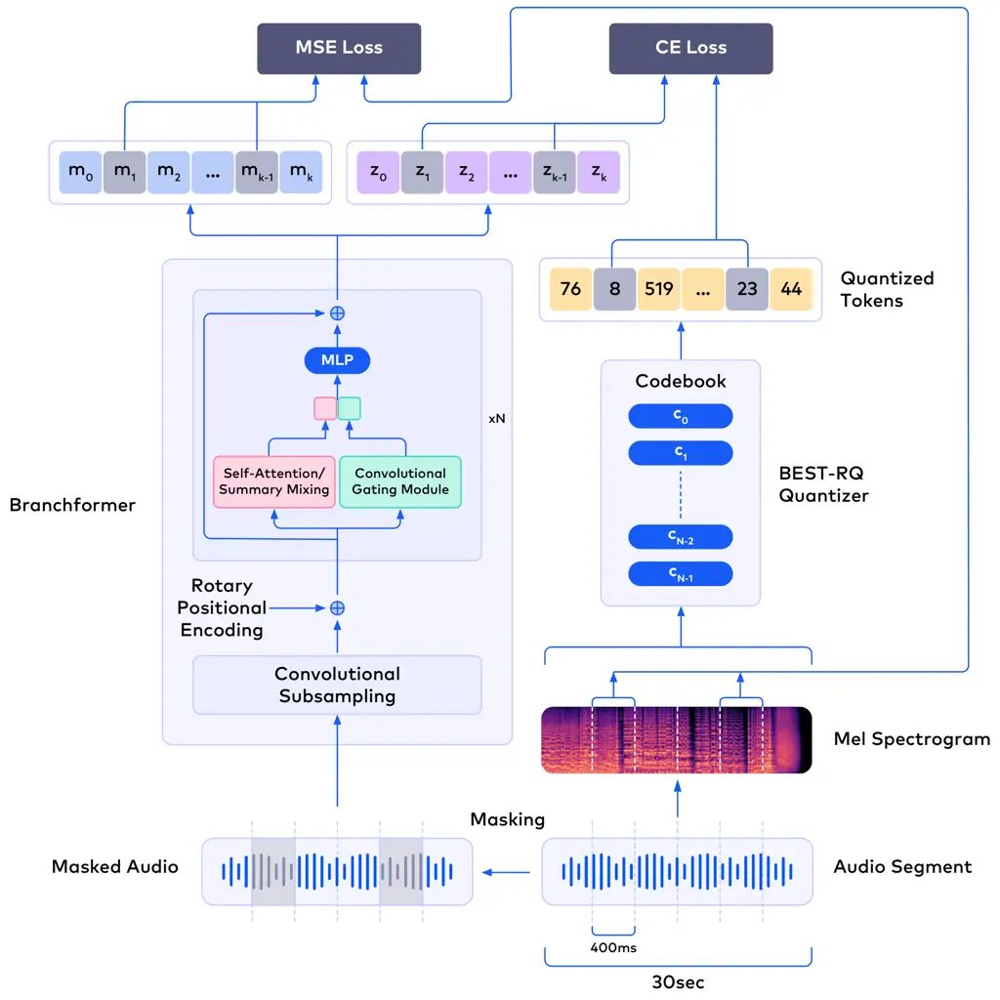

# Linear Complexity Self-Supervised Learning for Music Understanding with Random Quantizer

Conference: The 41st ACM/SIGAPP Symposium on Applied Computing; March
23–27, 2026; Thessaloniki, GreeceThe 41st ACM/SIGAPP Symposium on
Applied Computing (SAC ’26), March 23–27, 2026, Thessaloniki,
GreeceDOI: [10.1145/3748522.3779786](https://doi.org/10.1145/3748522.3779786)ISBN: 979-8-4007-2294-3/2026/03CCS: Computing
methodologies Machine learning approaches

Petros Vavaroutsos
[](https://orcid.org/0000-0003-1929-5649)
email: <peter@orfium.com> Affiliation: Orfium Research, Athens, Greece ,
Theodoros Palamas
[](https://orcid.org/0009-0001-5846-839X)
email: <theodoros@orfium.com> Affiliation: Orfium Research, Athens,
Greece and Pantelis Vikatos
[](https://orcid.org/0000-0003-1573-5125)
email: <pantelis@orfium.com> Affiliation: Orfium Research, Athens,
Greece

© cc

###### Abstract.

In recent years, foundation models have become very popular due to their
exceptional performance, mainly in natural language (NLP) tasks where
they were first introduced. These models usually consist of hundreds of
millions, or even billions, of parameters, making them
resource-intensive during training and in production systems, leading to
increased costs. This paper focuses on the reduction of a foundation’s
model size when applied to music information retrieval (MIR) tasks. Our
research combines the Branchformer architecture with SummaryMixing,
which were first applied in speech recognition, along with a random
quantization process. To facilitate reproducibility, we conduct
pre-training on publicly available datasets, complemented by a
proprietary dataset comparable in scale to other private datasets
reported in the literature. We ensure robust evaluation by using a
framework consisting of a variety of downstream MIR tasks. Our results
show that our architecture achieves competitive performance when
compared with other state-of-the-art models that use multi-head
self-attention, while reducing the model size from $`8.5`$% up to
$`12.3`$%.

###### Keywords: 

Deep Learning, Learnable Representations, Music Understanding,
Transformers, Embeddings, Attention

^(†)^(†)cc-license: by

## 1. Introduction

Foundation models have become a core element in deep learning research
due to their exceptional performance across a wide range of tasks. They
initially emerged from the field of natural language processing (NLP)
with the GPT Radford, 2018; Radford et al., 2019; Brown, 2020 and
BERT Devlin, 2018 architectures and were soon applied to the field of
speech recognition Gulati et al., 2020; Peng et al., 2022 and music Li
et al., 2023. The power of a foundation model comes from its
pre-training on large corpuses of data using a self-supervised manner
with the aim of discovering underlying structures in the data and
learning generalizable vector representations. The knowledge accumulated
in pre-training can later be leveraged in a wide range of downstream
tasks. This usually involves a frozen pre-trained foundation model
extended with an extra layer trained for a more specific task.

Foundation models in the field of music information retrieval are in
their early stages, with MERT Li et al., 2023 currently being at the
forefront. It is an early effort to tackle the large variety of MIR
tasks in a general manner rather than individually. It uses
self-supervised learning with masked language modelling to train a
transformer model based on HuBERT Hsu et al., 2021 on a large audio
dataset. In the pre-training stage they use two teachers to guide the
model. The first is an RVQ-VAE Zeghidour et al., 2021; Défossez et al.,
2022 which is used to extract quantized audio token representations and
the second is the ConstantQ-Transform (CQT) spectral representation of
the audio. In the pre-training stage the foundation model tries to learn
both the quantized representations and reconstruct the CQT. They show
that a general foundation model can achieve state-of-the-art performance
on MIR tasks when compared to models trained specifically for each task.

Despite the significant success of foundation models across various
domains, they continue to pose several challenges, with one of the most
prominent being their sheer size. The large scale of these models, while
contributing to their high performance, also introduces substantial
computational and resource requirements, both during the training phase
and at deployment. As a result, optimizing their size without
sacrificing performance has become a key research focus. Efforts to
reduce the size and the training time of foundation models are being
explored across multiple domains, including natural language processing,
computer vision, and more. In our work, we specifically address this
challenge in the domain of music. We adopt well known transformer
backbones, from speech domain, paired with linear complexity
self-attention alternatives and random quantization process, forming a
new architecture, specifically tailored for the music domain. Each of
those choices has been shown to reduce either the size, the training
time or the memory footprint of a foundation model in their respective
works, with good performance in speech recognition tasks. To the best of
our knowledge this is the first research effort that applies the
aforementioned architecture in MIR. Our code and models are made freely
available at https://github.com/Orfium/muse-lq

We structure the rest of the paper as follows. Section 2 includes the
related literature. Section 3 contains the model overview, presenting
the details of the model layers. Section 4 contains a reference to our
experimentation setup: the datasets, the description of the downstream
tasks as well as details of the training hyperparameters. In section 5,
we provide an overview of the results and contributions. Finally, in
section 6 we discuss about the limitations of this work and future work,
and section 7 concludes with the highlights and an outlook on future
work.

## 2. Related Work

Recent advancements in foundation models, such as GPT, BERT, and their
variants, have demonstrated remarkable capabilities across a wide range
of domains, including natural language processing (NLP), computer
vision, and music information retrieval (MIR). These models, with their
ability to learn and generalize from vast amounts of data, have
revolutionized fields like text generation, language understanding,
image recognition, and more. In the domain of MIR, which deals with the
extraction, analysis, and understanding of information from music, the
application of foundation models is still in its early stages. However,
initial research in this area has proven to be highly promising,
suggesting that these models have the potential to significantly improve
the way we process and interact with music data.

### 2.1. CNNs and Contrastive Learning

Early deep-learning attempts have mainly focused on investigating the
performance of supervised CNN architectures when applied to the domain
of MIR. The research effort Pons et al., 2016 experiments with the
filter size of CNNs in both dimensions, using mel-spectrograms as input,
in order to capture both the temporal and frequency relationships
present in the audio. Study Pons et al., 2017 investigates the effect
that different input features have on performance by comparing raw
waveforms with mel-spectrograms. The aforementioned models are compared
in Pons and Serra, 2019 along with VGG-like models Simonyan and
Zisserman, 2014 in music tagging tasks.

Apart from supervised learning, unsupervised contrastive methodologies
have also been used, originating from the field of vision Chopra et al.,
2005; Schroff et al., 2015; Chen et al., 2020. These methods focus on
learning well-structured embedding representations of the data instead
of focusing on a specific supervised task. SimCLR Chen et al., 2020 was
later employed in MIR Spijkervet and Burgoyne, 2021 for learning
meaningful musical representations. For each audio waveform, the model
generates an augmented and correlated version by applying a series of
transformations, such as adding noise, pitch-shifting, or frequency
filtering. The augmented waveform is then used as the positive sample in
a contrastive loss framework, where it is paired with the original,
along with an unrelated audio from the same batch as a negative sample.
This approach encourages the model to learn similar representations for
both the original and augmented versions. A comparative analysis between
several supervised and unsupervised strategies is provided in
study McCallum et al., 2022.

They use a variety of datasets, representing a wide range of MIR tasks.
They conclude that unsupervised learning produces models that generalize
efficiently in more tasks than supervised learning, which excels when
using annotated music data from experts. Furthermore, they show that the
dataset used for pre-training has a significant impact on performance,
especially when it restricts the audio to a specific domain.

### 2.2. Quantization

Additionally, there is a focus on investigating discrete tokenized
representations in comparison with continuous embedding representations.
Among those is VQ-VAE Van Den Oord et al., 2017, a new type of
variational autoencoder which incorporates vector quantization. Their
study shows that tokenized representations can model long-term
relationships and have similar performance to continuous
representations. Jukebox Dhariwal et al., 2020 combines multiple VQ-VAEs
trained on different temporal resolutions, along with a Transformer
architecture for the generation of music. To avoid codebook collapse,
which affects VQ-VAEs, they additionally use random resets on codebook
words during training. The discrete representations learnt by Jukebox
improve performance when used in a variety of MIR tasks, namely
JukeMIR Castellon et al., 2021.

MERT Li et al., 2023 uses a HuBERT-based architecture Hsu et al., 2021
which is trained using an RVQ-VAE Zeghidour et al., 2021; Défossez et
al., 2022 for tokenization and a CQT reconstruction loss. HuBERT was
first introduced in the field of speech recognition as a way to apply
BERT to speech, by extending it with a convolutional encoder and using a
k-means clustering on the audio MFCCs as training targets. The RVQ-VAE
is an extension of the VQ-VAE, that calculates the residuals after the
initial quantization and then uses an additional codebook to quantize
them. This process is then repeated multiple times. Study Won et al.,
2024 further evaluates MERT along with the Conformer architecture Gulati
et al., 2020 by using a random projection quantizer instead Chiu et al.,
2022 which removes the need for the training of the quantizer while
maintaining state-of-the-art performance. OMAR-RQ model Alonso-Jiménez
et al., 2025 extended the approach of Won et al. Won et al., 2024 by
adopting a multilabel setting with parallel residual quantization
codebooks, enabling music audio representations. Won et al. Zhu et al.,
2025 proposed MuQ, a self-supervised music representation model, that
uses Mel Residual Vector Quantization (Mel-RVQ) to learn compact and
expressive audio features.

### 2.3. Overlap with Speech Recognition

Due to the similarities between the speech recognition and MIR
fields Jasmin et al., 2020, methodologies from the latter are already
being applied on the former. For example, AudioLM Borsos et al., 2023 is
shown to be capable of generating both speech and music. In order to
achieve this, the authors of this work use both semantic and acoustic
tokenization methods from literature in a hierarchical process, with
each level of tokenization assisting in the production of the next one.
They show that AudioLM is not only capable of generating coherent
speech, but also effective in producing piano continuations of high
quality. Conformer Gulati et al., 2020 and Branchformer Peng et al.,
2022 combine the ability of Transformers to model long-term context
relationships with the ability of CNNs to capture local features,
achieving state-of-the-art performance on speech recognition tasks. The
Conformer and Branchformer architectures consist of an initial
convolutional subsampling component, used for input dimensionality
reduction, followed by a series of Transformer-inspired blocks. The
Conformer blocks are based on the Macaron architecture Lu et al., 2019
with the addition of a convolutional layer, combining multi-head
self-attention and convolution linearly. The Branchformer blocks, on the
other hand, combine them in parallel. These blocks use a multi-head
self-attention branch and a convolutional branch Sakuma et al., 2022,
which merge at the end. Other works investigate reducing inference time,
by using linear complexity alternatives to self-attention like
SummaryMixing Parcollet et al., , Fastformer Wu et al., 2021,
HyperMixing Mai et al., 2023 and Mamba Gu and Dao, 2023, and training
time by pairing those with random quantization methods Whetten et al., 2024.

Although foundation models have found application in many domains,
efforts to explore their viability in MIR tasks are still in their
infancy. With our work, we aim to expand their application by
investigating potential ways to reduce their size, along with their
training and inference time, while maintaining performance. We
investigate both Conformer and Branchformer backbones Gulati et al.,
2020; Peng et al., 2022, which were initially applied in speech
recognition and achieved state-of-the-art results. We expand our
research with a linear complexity module alternative to multi-headed
self-attention in transformers Parcollet et al., , which has shown that
it can reduce both the inference time and memory footprint of the model,
while maintaining performance, in the speech domain. We also use a
non-trainable random tokenization process Chiu et al., 2022,
significantly reducing the training time. Finally, we compare our work
against other state-of-the-art works such as MERT and other studies,
where the Conformer architecture was evaluated but only on a narrow set
of tasks, such as beat tracking, chord recognition, key detection and
more Won et al., 2024. In our work, we expand this evaluation in an
extended MIR downstream task suite.

## 3. Model



Figure 1. An illustration of our framework is shown here. On the left,
we present the Branchformer architecture, which takes raw masked audio
as input and generates two distinct sets of logits. Specifically,
$`m_{0},...,m_{k}`$ represent the logits corresponding to the mel
spectrogram, while $`z_{0},...,z_{k}`$ correspond to the logits for the
quantized tokens. On the right, we show the random tokenizer, which
receives the mel spectrogram as input and produces the quantized tokens.
Importantly, only the masked tokens are utilized for the loss
calculation, ensuring that the model focuses on the relevant parts of
the input.Model Overview

### 3.1. Architecture

We focus on a Branchformer architecture coupled with SummaryMixing as
seen in Figure 1. It consists of a convolutional subsampling component
followed by $`N`$ Branchformer encoder blocks. The convolutional
component is used to downsample the waveform, after which we also add
rotary positional encodings Su et al., 2024, when using multi head
attention. The encoder blocks consist of two branches, one using
multi-head self-attention in order to capture global dependencies and
one using a convolutional gating module Sakuma et al., 2022 which
captures local dependencies. Finally, the two branches are concatenated
due to better performance on a weighted average Peng et al., 2022.
Capturing both global and local dependencies is beneficial compared to
an attention-only module Gulati et al., 2020; Peng et al., 2022.

### 3.2. Linear Complexity Alternative

From the conception of the Transformer, the self-attention module has
been a key part of its structure. While these modules are the reason for
the exceptional performance of Transformers, they still have some
setbacks. The computations of multi-head self-attention modules are
quadratic in complexity with respect to the sequence length. Efforts are
already being made to find alternatives with reduced complexity, with
one of them being SummaryMixing Parcollet et al., . They show in their
work that by substituting the self-attention module with a SummaryMixing
module, the computation complexity drops down to linear, making training
faster and reducing memory footprint. They experiment with substituting
the multi-head self-attention modules of both Conformer and Branchformer
models with their proposed solution. We similarly adopt SummaryMixing in
the scope of MIR and compare it with the standard self-attention module.

### 3.3. Tokenization

Tokenization is the process by which the model input data are split into
smaller discrete segments in order to simplify their structure and
dimensionality. Methodologies for creating discrete audio
representations from continuous data has already been the subject of
study in literature. HuBERT applies a k-means clustering on the MFCCs,
extracted from the audio, and uses the cluster centroids for
discretization, while vq-wav2vec Baevski et al., 2019 extends
wav2vec Schneider et al., 2019 representations for a similar purpose.
The drawback of these methods is that they need to be trained. This
increases computation costs and biases the tokenizer towards the train
dataset distribution.

The tokenization method consists of two components: a randomly generated
codebook and a randomly generated projection to the codebook words Chiu
et al., 2022. Thus, the tokenizer is not trainable, which alleviates the
learning procedure by being constant after its initialization. Another
benefit of this process is that it does not suffer from codebook
collapse, a state in which all codebook words converge into a single or
few vectors. The tokenization process is as follows:

```math
y=\argmin_{i}||norm_{l2}(c_{i})-norm_{l2}(A\cdot x)||
```

where $`y`$ is the discrete token, $`x`$ is our $`d`$-dimensional input
vector, $`A`$ is the randomly initialized $`h\times d`$ projection
matrix and $`c_{i}`$ is one of $`n`$ words from the randomly initialize
codebook $`C=\{c_{0},...,c_{n-1}\}`$. The projection matrix $`A`$ uses
Xavier initialization Glorot and Bengio, 2010 and the codebook $`C`$
uses standard normal distribution for initialization.

### 3.4. Masking

In the context of training deep learning models, masking involves any
process by which parts of the input data are obscured. The model is then
tasked with predicting the hidden information. This process makes the
model robust to incomplete or noisy data and pushes it to learn
contextual relationships.

When dealing with spectral representations of audios, the most common
masking techniques are frequency masking, temporal masking, or a
combination of both. Frequency masking involves setting to zero certain
frequency bands, which forces the model to make predictions based on a
frequency context. On the other hand, time masking involves setting to
zero audio segments based on time. Thus, the model tends to learn
temporal patterns. These can also be combined to enforce both frequency
and temporal contexts. Furthermore, they can be used in conjunction with
other audio modifications, as shown in SpecAugment Park et al., 2019,
where masking is used in conjunction with time warping.

In our case, due to the tokenized nature of our data, we apply only
random time masking to the waveform input as shown in Figure 1. We split
the waveform in $`400ms`$ segments, which are then randomly chosen with
a probability of $`20\%`$. The discrete tokens corresponding to those
chosen segments are subsequently masked. The masking for each input
audio changes in every epoch.

### 3.5. Loss

For our self-supervised pre-training scheme, we use two training
objectives: a reconstruction loss and a classification loss. The purpose
of the reconstruction loss is for the model to capture the low-level
audio features by trying to predict the original mel-spectrogram,
potentially by constructing an internal compact representation. On the
other hand, the classification loss pushes the model to learn the
quantized tokens of the audio segments, as specified by the codebook.
This representation is discrete and high-level, in contrast with the
mel-spectrogram features. The combination of these objectives makes the
model more robust and generalizable when used in downstream tasks later.
We use a mean squared error loss ($`MSE`$) for reconstruction and a
cross entropy loss ($`CE`$) for classification.

Assuming $`l`$ are the model logits and $`t`$ are the target tokens
generated from our tokenizer, the loss is computed as follows:

```math
L=CE(softmax(l_{t}),t_{t})+MSE(l_{mel},t_{mel})
```

We only calculate the loss for the masked tokens. The purpose of this is
to focus the model on learning only from missing information. In
addition, it requires less computations, making training efficient.
Using all the tokens has the potential to dilute the effect of masking
and potentially make the model prone to overfitting.

## 4. Experiments

### 4.1. Music Datasets

For training, we utilize three distinct datasets, including one private
dataset and two publicly available ones. The private dataset offers the
advantage of being curated to ensure higher quality, and it contains a
significantly larger amount of music samples, spanning a wide range of
durations. This allows for more comprehensive and diverse training. On
the other hand, using public datasets enables us to benchmark our
results against those of other works in the literature, fostering
comparability and ensuring that our findings are consistent with
existing research.

Music4All Santana et al., 2020 is a publicly available dataset that
contains around $`910`$ hours of audio collected from online platforms
(YouTube / Spotify / Last.fm) and was sanitized in order to be of high
quality. It contains $`30`$ second audio segments and their
corresponding metadata, such as artist, popularity, energy, tempo and
others.

The other public dataset is FMA Defferrard et al., 2016 which is a dump
of the free and open library Free Music Archive¹¹ 1
https://freemusicarchive.org/ and contains audio alongside low &
high-level features. It has several subsets with different sizes. In our
work, we use the fma-large subset which contains around $`900`$ hours of
audio.

Lastly, we gather and curate a high quality proprietary dataset of
around $`200`$k hours of music. Its size ensures that it is comparable
to other private datasets mentioned in the literature, such as the one
in MERT which is around $`160`$k hours. Table 1 shows a summary of the
datasets.

| Dataset          | Hours            | Audio Duration               |
| ---------------- | ---------------- | ---------------------------- |
| Music4All        | $`910`$          | $`30`$sec                    |
| FMA-large        | $`900`$          | $`30`$sec                    |
| Proprietary      | $`\sim 200,000`$ | $`\sim 3-4`$min (full songs) |
| MERT Proprietary | $`\sim 160,000`$ | $`\sim 3-4`$min (full songs) |

Table 1. Details for the datasets used in our experiments. Audios in our
proprietary dataset are split into $`30`$sec segments without overlap to
match the duration of public datasets.

### 4.2. Evaluation

#### 4.2.1. Model Comparison

Our proposed architecture consists of the Branchformer model in which
the multi-head self-attention module is replaced with SummaryMixing. We
compare this model against a vanilla Branchformer. Also, we evaluate two
versions of a Conformer model Gulati et al., 2020; Won et al., 2024, one
with multi-head self-attention, i.e. vanilla, and one with
SummaryMixing. Lastly, we benchmark a transformer-based model i.e.
MERT-330 Li et al., 2023.

#### 4.2.2. Downstream Tasks

The models are evaluated in a variety of classification and regression
MIR downstream tasks which are used in the previous studies. After
pre-training our foundation models, we freeze their parameters and
attach at the end one dense layer with dropout. This layer is then
trained for each of the following downstream tasks. In the following
tasks, wherever not specified, the dataset split is $`80`$% (train) /
$`10`$% (validation) / $`10`$% (test).

Music Tagging consists of the prediction of various high-level audio
features such as genre, mood, instrument and others. While these tag
subcategories can be evaluated separately, their joint use gives us an
insight about a model’s ability to be robust while trying to predict all
of them at the same time. We use two common public datasets,
MagnaTagAtune Law et al., 2009 and MTG-Jamanedo Bogdanov et al., 2019.
We use a window length of $`30`$ seconds and ROC-AUC and Average
Precision (AP) as metrics.

Key Detection is the prediction of the tonal scale and pitch of a song.
The classes are the $`12`$ major keys, $`12`$ minor keys and None. We
use the Giantsteps-MTG-keys dataset Korzeniowski and Widmer, 2017 for
downstream training and Giantsteps Knees et al., 2015 for testing. The
metric is refined accuracy as implemented in mir_eval Raffel et al.,
2014, which is tolerant to reasonable prediction errors.

Genre Classification aims to predict the most likely genre of a song. We
evaluate on GTZAN Tzanetakis and Cook, 2002 and the genre subset of
MTG-Jamendo Bogdanov et al., 2019. For GTZAN we use the fail-filtered
split Kereliuk et al., 2015 and accuracy as metric. For MTG-Jamendo we
use ROC-AUC and AP.

Emotion Score Regression is a task where we want to predict the valence
(positive/negative emotional response) and arousal (emotional intensity)
of a song. The Emomusic dataset Soleymani et al., 2013 contains $`744`$
$`45`$-second audios where humans reported the valence and arousal after
listening to them. The official metric used is determination coefficient
($`r^{2}`$) between the model predictions and the actual human
responses.

Instrument Classification is another important audio tagging task, where
the goal is to identify the specific instruments present in a given
audio sample. This task involves analyzing the audio’s features to
determine which instruments are playing, whether individually or in
combination. We use NSynth Engel et al., 2017 containing $`11`$
instruments where we report the accuracy. We also use the instrument
subset of MTG-Jamendo Bogdanov et al., 2019 which contains $`41`$
instruments, where we report the ROC-AUC and AP.

Pitch Classification is the process of estimating the pitch class of a
given audio sample, determining which of the $`128`$ distinct pitch
categories the sample belongs to. This task involves analyzing the
audio’s features to make an accurate prediction. For our evaluation, we
use the NSynth dataset Engel et al., 2017 and report the resulting
accuracy to assess the performance of the model.

Vocal Technique Detection aims to identify the vocal technique used by
the singer in a song. We use Vocalset dataset Wilkins et al., 2018 which
contains the vocals of $`20`$ different professional singers who perform
$`17`$ different vocal techniques. We used the same vocal techniques and
train/test splits as in Yamamoto et al., 2022. However, no validation
split is provided. For this reason we set aside for validation $`10`$%
of the training set. The evaluation metric is accuracy.

Singer Identification involves predicting the performer of a given audio
track based on its characteristics. For this task, we utilize the
Vocalset dataset Wilkins et al., 2018 once again and present the
resulting accuracy as part of the evaluation.

### 4.3. Experimental Setup

[TABLE]

Table 2. Comparison of different model configurations. $`\triangle`$
denotes a small model while $`\blacktriangle`$ denotes a large model.
$`att`$ and $`sum`$ are the attention and SummaryMixing versions
respectively.

The model hyperparameters used in our experiments are detailed in Table 2. Our models were trained across a distributed setup of $`64`$ A100
GPUs, each with $`40`$ GB of memory, utilizing bf16 precision for
improved performance and memory efficiency. Due to memory constraints,
we opted for a local batch size of $`16`$ samples per GPU, which results
in a global batch size of $`1024`$ across all GPUs. Each batch
represents approximately $`8.5`$ hours of audio. We used the Adam
optimizer, starting with a linear warmup phase that gradually increased
the learning rate up to $`10^{-4}`$, followed by cosine decay, where the
learning rate is reduced to $`10^{-5}`$. During the early stages of
training, particularly when training our larger models, we observed
issues with exploding gradients after a certain number of steps. To
mitigate this, we implemented gradient clipping with a threshold of
$`1.0`$, which helped improve the training process and prevent training
instability.

Our audio files are divided into $`30`$-second segments, each with a
sample rate of $`24000`$ Hz. During preprocessing, we randomly mask
$`400`$-millisecond windows with a probability of $`20\%`$. To extract
the mel-spectrograms, we use a Fast Fourier Transform (FFT) with a
window size of $`2048`$, a hop length of $`240`$ samples, and the
default $`128`$ mel bins. This setup produces a mel-spectrogram with
dimensions of $`128\times 100`$, corresponding to $`100`$Hz frequency
samples. To reduce the temporal resolution, we stack intermediate time
points with a factor of $`4`$, resulting in a mel-spectrogram of size
$`512\times 25`$, which corresponds to $`25`$Hz temporal samples. For
tokenization, we employ the random tokenizer, using a codebook size of
$`8192`$ and a codebook dimension of $`16`$.

Finally, for downstream training, an additional dense layer is included,
which contains $`512`$ units and a dropout probability of $`0.25`$ to
help prevent overfitting. The batch size is determined based on the
specific task, with values set to either $`16`$ or $`32`$ to optimize
performance and training efficiency.

## 5. Results

[TABLE]

Table 3. Experiment results of our various models on the downstream task
framework. We build upon our previous notation by incorporating the
trained dataset as a subscript to each model. This dataset subscript is
specifically added only for the public datasets we used in our
experiments. For downstream tasks that involve multiple datasets, each
dataset is listed separately, along with its corresponding evaluation
metrics.

In this section, we discuss the results of our experiments. The
performance metrics for the evaluation of downstream tasks are presented
in Table 3. We evaluate our models from three different perspectives:
the effect of the dataset size, the number of model parameters, and the
substitution of the multi-head self-attention module with SummaryMixing.

During experimentation, we further examined both of our backbone models
using their pretrained weights on speech data. We then performed the
downstream task training and evaluation as described earlier. The
performance of those models was much lower compared to the rest of our
setup and for this reason we omit their results from the discussion.

### 5.1. Effects of dataset size

First of all, it is important to note that all models were trained for
the same number of steps. This consistency in training duration means
that the models iterated over the small public datasets significantly
more times compared to our large proprietary dataset. Specifically,
since the smaller datasets contain fewer examples, the models were
exposed to them repeatedly in each training cycle, resulting in a higher
number of passes through the data. In contrast, the larger proprietary
dataset, with its larger volume of data, led to fewer iterations over
each individual example during the same number of training steps. This
difference in the frequency of exposure to the data could potentially
influence the models’ performance and generalization capabilities, as
smaller datasets may allow for more frequent learning updates per data
point.

Comparing models BRN^(▲att), BRN$`{}^{\blacktriangle att}_{fma}`$ and
BRN$`{}^{\blacktriangle att}_{m4a}`$, we observe that they achieve
similar performance even when trained on significantly smaller datasets.
Our proprietary dataset contains around $`200k`$ hours of music while
FMA and M4A just under $`1k`$ hours. On the majority of the metrics the
difference between the large and small datasets is not more than a
couple of percentage points. However, this becomes more noticeable when
looking into the tasks of emotion score regression, instrument
classification, pitch classification, vocal technique detection and
singer classification. The largest differences can be observed in key
detection for FMA ($`-21.8\%`$) and genre classification (GTZAN) for M4A
($`-14.5\%`$).

The same phenomenon is observed in the Conformer models.
CNF$`{}^{\blacktriangle att}_{fma}`$ is, in fact, performing slightly
better than CNF^(▲att), with a small increase in most metrics, with
emotion score regression and vocal technique detection being standouts.
In contrast, CNF$`{}^{\blacktriangle att}_{m4a}`$ performs worse than
the other two in most tasks, with large drops in genre classification
($`-15.9\%`$ GTZAN), emotion score regression ($`-10.6\%`$ $`r^{2}_{A}`$
/ $`-29.4\%`$ $`r^{2}_{V}`$) and vocal technique detection ($`-9.8\%`$).
Surprisingly, it performs better in key detection ($`+11.1\%`$).
Comparing only our large proprietary dataset with M4A, it would be a
fair assumption to attribute these drops just to the size difference
between the datasets. Taking into account the comparison between the
similar sized datasets, however, we still observe that M4A performs
worse. This leads us to believe that this is probably in part due to the
nature of the audio content, which favors some tasks over others.

### 5.2. Architecture differences

In the context of model size, we first compare models with the same base
architecture, where the reduction in parameters is due to the lower
number of layers. The larger Branchformer model BRN^(▲att) generally
outperforms the smaller BRN^(△att), with the largest increases being in
key detection ($`+23.6\%`$), genre classification ($`+10.3\%`$ GTZAN)
and instrument classification ($`+8.4\%`$ nsynth). The increase in all
the other tasks is lower but noticeable. Comparing the Conformer models
CNF^(▲att) and CNF^(△att), we see that they perform similarly, with no
model being strictly better in the majority of tasks. However,
CNF^(▲att) performs noticeably better in genre classification (GTZAN),
while CNF^(△att) performs better in vocal technique detection and singer
identification. In both cases the smaller model demonstrate competitive
results with only around $`30\%`$ of the parameters. This observation
shows that the performance of a model does not always scale with the
number of parameters and that smaller models have the potential to
compete.

We also evaluate the case where we have less parameters due to different
base architectures, all other things being the same. Here, BRN^(▲att)
outperforms CNF^(▲att), having only $`57\%`$ of its parameters. Emotion
score regression, instrument classification and singer identification
are some standouts but the greatest gains are in key detection
($`+17.6\%`$), pitch classification ($`+11.3\%`$) and vocal technique
detection ($`+9.2\%`$). In the other tasks the increase in performance
is lower. We additionally observe that the smaller versions have similar
results. In this case, BRN^(△att) has $`63\%`$ of the parameters of
CNF^(△att), but the relative metric difference between them in most
tasks is very low. Notable exceptions are: key detection in favor of
CNF^(△att) and emotion score regression in favor of BRN^(△att). These
results present another indication that the capabilities of smaller
models can originate not only from a plain decrease in parameters, but
also from a different architectural configuration.

### 5.3. SummaryMixing vs Multi-head self-attention

The substitution of multi-head self-attention with SummaryMixing also
leads to similar, if not better, performance. With $`8.5\%`$ less
parameters, CNF$`{}^{\blacktriangle sum}_{m4a}`$ consistently performs
slightly better than CNF$`{}^{\blacktriangle att}_{m4a}`$, with a small
increase in the metrics of most downstream tasks. This increase is
larger when looking into the tasks of emotion score regression
($`+6.1\%`$ $`r^{2}_{A}`$ / $`+16.2\%`$ $`r^{2}_{V}`$) and instrument
classification ($`+6.3\%`$ Nsynth).

The decrease in parameters goes up to $`12.3\%`$ in the case of the
Branchformer models. Again, regardless of whether we trained on M4A or
our proprietary dataset, the relative difference between most metrics is
relatively small. However, the SummaryMixing module performs better on
genre classification (GTZAN) on both datasets ($`+14.5\%`$ M4A /
$`+8\%`$ proprietary) and on emotion score regression on the proprietary
dataset only ($`+11.3\%`$ $`r^{2}_{V}`$ only). The attention module
performs better in key detection on both datasets.

As discussed above, the SummaryMixing module shows potential and
benefits both the Conformer and Branchformer models. There is a
non-negligible decrease in model parameters while maintaining
competitive performance. Our findings are also consistent with those of
the original work Parcollet et al., , showing the potential of
SummaryMixing when applied to the field of music information retrieval.

### 5.4. Comparison with state-of-the-art

Our two best performing models over all downstream tasks are BRN^(▲att)
and BRN^(▲sum). When compared with the current state-of-the-art
MERT-$`330`$ model, we see that our model is very competitive and
achieves very similar results in the majority of tasks. MERT performs
only slightly better overall against both our models, with the only
notable exceptions being vs BRN^(▲att) on genre classification (GTZAN)
($`+10.3\%`$) and emotion score regression ($`+7.8\%`$ $`r^{2}_{V}`$
only). However, the difference is reduced vs BRN^(▲sum). On genre
classification (GTZAN), MERT is only better by a smaller margin and on
emotion score regression it even performs slightly worse. Furthermore,
both our models achieve better results in instrument classification
(nsynth) ($`+10\%`$ BRN^(▲att) / $`+9.7\%`$ BRN^(▲sum)) and singer
identification ($`+7.5\%`$ BRN^(▲att) / $`+8.7\%`$ BRN^(▲sum)). We
should note that a potential explanation for these larger differences
might lie in the composition of the large proprietary datasets on which
the models where trained. Still, our proposed architecture managed to
achieve results very close to the state-of-the-art, while reducing model
size.

## 6. Discussion & Future Work

Although our downstream evaluation covers a diverse set of tasks,
additional extensions to include challenging domains such as audio
matching, cover song recognition, and hit song detection would provide a
more comprehensive assessment of foundation model capabilities. Due to
limited computational resources, we were unable to perform extensive
hyperparameter tuning, including alternative masking strategies,
tokenization methods, different embedding layer selection, and
cross-domain training, e.g. integration of music and speech datasets, or
starting from speech pretrained weights, instead of random
initialization. Additionally, the current model processes $`30`$-second
audio segments with fixed $`400`$ ms subsegments. We aim to exploring
longer contexts, finer granularity, or overlapping segments could
further enhance representational quality and downstream performance. We
also intend to compare common model compression techniques, including
pruning, quantization, and distillation, to evaluate their performance
in reducing model size.

## 7. Conclusion

The goal of this work is to investigate the ability of an audio
foundation model to maintain competitive performance on a variety of
downstream MIR tasks, while reducing its size. We use the Branchformer
architecture in the field of music, which was previously used in speech
recognition. Similarly, we combine it with a promising alternative to
multi-head self-attention, namely SummaryMixing. We conducted
pre-training using publicly available datasets, along with a proprietary
dataset. We showed that these approaches have the potential to achieve
competitive results in many downstream tasks and at the same time reduce
the number of model hyperparameters anywhere from $`8.5`$% to $`12.3`$%,
when trained on a comparably large corpus of music data. Furthermore, we
achieve state-of-the-art results in some downstream tasks, such as key
detection, instrument classification, and singer identification,
improving previous metrics by up to $`10`$%. Our contribution further
cements the abilities and flexibility of foundation models in music
information retrieval.

## References

- Alonso-Jiménez et al. (2025) P. Alonso-Jiménez, P. Ramoneda, R. O.
  Araz, A. Poltronieri, and D. Bogdanov OMAR-rq: open music audio
  representation model trained with multi-feature masked token
  prediction. arXiv preprint arXiv:2507.03482. Cited by: §2.2.
- Baevski et al. (2019) A. Baevski, S. Schneider, and M. Auli
  Vq-wav2vec: self-supervised learning of discrete speech
  representations. arXiv preprint arXiv:1910.05453. Cited by: §3.3.
- Bogdanov et al. (2019) D. Bogdanov, M. Won, P. Tovstogan, A. Porter,
  and X. Serra The mtg-jamendo dataset for automatic music tagging.
  Cited by: §4.2.2, §4.2.2, §4.2.2.
- Borsos et al. (2023) Z. Borsos, R. Marinier, D. Vincent, E.
  Kharitonov, O. Pietquin, M. Sharifi, D. Roblek, O. Teboul, D.
  Grangier, M. Tagliasacchi, et al. Audiolm: a language modeling
  approach to audio generation. IEEE/ACM transactions on audio, speech,
  and language processing 31, pp. 2523–2533. Cited by: §2.3.
- Brown (2020) T. B. Brown Language models are few-shot learners. arXiv
  preprint arXiv:2005.14165. Cited by: §1.
- Castellon et al. (2021) R. Castellon, C. Donahue, and P. Liang
  Codified audio language modeling learns useful representations for
  music information retrieval. arXiv preprint arXiv:2107.05677. Cited
  by: §2.2.
- Chen et al. (2020) T. Chen, S. Kornblith, M. Norouzi, and G. Hinton A
  simple framework for contrastive learning of visual representations.
  In International conference on machine learning, pp. 1597–1607. Cited
  by: §2.1.
- Chiu et al. (2022) C. Chiu, J. Qin, Y. Zhang, J. Yu, and Y. Wu
  Self-supervised learning with random-projection quantizer for speech
  recognition. In International Conference on Machine Learning,
  pp. 3915–3924. Cited by: §2.2, §2.3, §3.3.
- Chopra et al. (2005) S. Chopra, R. Hadsell, and Y. LeCun Learning a
  similarity metric discriminatively, with application to face
  verification. In 2005 IEEE computer society conference on computer
  vision and pattern recognition (CVPR’05), Vol. 1, pp. 539–546. Cited
  by: §2.1.
- Defferrard et al. (2016) M. Defferrard, K. Benzi, P. Vandergheynst,
  and X. Bresson FMA: a dataset for music analysis. arXiv preprint
  arXiv:1612.01840. Cited by: §4.1.
- Défossez et al. (2022) A. Défossez, J. Copet, G. Synnaeve, and Y. Adi
  High fidelity neural audio compression. arXiv preprint
  arXiv:2210.13438. Cited by: §1, §2.2.
- Devlin (2018) J. Devlin Bert: pre-training of deep bidirectional
  transformers for language understanding. arXiv preprint
  arXiv:1810.04805. Cited by: §1.
- Dhariwal et al. (2020) P. Dhariwal, H. Jun, C. Payne, J. W. Kim, A.
  Radford, and I. Sutskever Jukebox: a generative model for music. arXiv
  preprint arXiv:2005.00341. Cited by: §2.2.
- Engel et al. (2017) J. Engel, C. Resnick, A. Roberts, S. Dieleman, M.
  Norouzi, D. Eck, and K. Simonyan Neural audio synthesis of musical
  notes with wavenet autoencoders. In International Conference on
  Machine Learning, pp. 1068–1077. Cited by: §4.2.2, §4.2.2.
- Glorot and Bengio (2010) X. Glorot and Y. Bengio Understanding the
  difficulty of training deep feedforward neural networks. In
  Proceedings of the thirteenth international conference on artificial
  intelligence and statistics, pp. 249–256. Cited by: §3.3.
- Gu and Dao (2023) A. Gu and T. Dao Mamba: linear-time sequence
  modeling with selective state spaces. arXiv preprint arXiv:2312.00752.
  Cited by: §2.3.
- Gulati et al. (2020) A. Gulati, J. Qin, C. Chiu, N. Parmar, Y.
  Zhang, J. Yu, W. Han, S. Wang, Z. Zhang, Y. Wu, et al. Conformer:
  convolution-augmented transformer for speech recognition. arXiv
  preprint arXiv:2005.08100. Cited by: §1, §2.2, §2.3, §2.3, §3.1,
  §4.2.1.
- Hsu et al. (2021) W. Hsu, B. Bolte, Y. H. Tsai, K. Lakhotia, R.
  Salakhutdinov, and A. Mohamed Hubert: self-supervised speech
  representation learning by masked prediction of hidden units. IEEE/ACM
  transactions on audio, speech, and language processing 29,
  pp. 3451–3460. Cited by: §1, §2.2.
- Jasmin et al. (2020) K. Jasmin, F. Dick, L. L. Holt, and A. Tierney
  Tailored perception: individuals’ speech and music perception
  strategies fit their perceptual abilities.. Journal of Experimental
  Psychology: General 149 (5), pp. 914. Cited by: §2.3.
- Kereliuk et al. (2015) C. Kereliuk, B. L. Sturm, and J. Larsen Deep
  learning and music adversaries. IEEE Transactions on Multimedia 17
  (11), pp. 2059–2071. Cited by: §4.2.2.
- Knees et al. (2015) P. Knees, Á. Faraldo Pérez, H. Boyer, R. Vogl, S.
  Böck, F. Hörschläger, M. Le Goff, et al. Two data sets for tempo
  estimation and key detection in electronic dance music annotated from
  user corrections. In Proceedings of the 16th International Society for
  Music Information Retrieval Conference (ISMIR); 2015 Oct 26-30;
  Málaga, Spain.\[Málaga\]: International Society for Music Information
  Retrieval, 2015. p. 364-70., Cited by: §4.2.2.
- Korzeniowski and Widmer (2017) F. Korzeniowski and G. Widmer
  End-to-end musical key estimation using a convolutional neural
  network. In 2017 25th European Signal Processing Conference (EUSIPCO),
  pp. 966–970. Cited by: §4.2.2.
- Law et al. (2009) E. Law, K. West, M. I. Mandel, M. Bay, and J. S.
  Downie Evaluation of algorithms using games: the case of music
  tagging.. In ISMIR, pp. 387–392. Cited by: §4.2.2.
- Li et al. (2023) Y. Li, R. Yuan, G. Zhang, Y. Ma, X. Chen, H. Yin, C.
  Xiao, C. Lin, A. Ragni, E. Benetos, et al. Mert: acoustic music
  understanding model with large-scale self-supervised training. arXiv
  preprint arXiv:2306.00107. Cited by: §1, §1, §2.2, §4.2.1.
- Lu et al. (2019) Y. Lu, Z. Li, D. He, Z. Sun, B. Dong, T. Qin, L.
  Wang, and T. Liu Understanding and improving transformer from a
  multi-particle dynamic system point of view. arXiv preprint
  arXiv:1906.02762. Cited by: §2.3.
- Mai et al. (2023) F. Mai, J. Zuluaga-Gomez, T. Parcollet, and P.
  Motlicek HyperConformer: multi-head hypermixer for efficient speech
  recognition. arXiv preprint arXiv:2305.18281. Cited by: §2.3.
- McCallum et al. (2022) M. C. McCallum, F. Korzeniowski, S. Oramas, F.
  Gouyon, and A. F. Ehmann Supervised and unsupervised learning of audio
  representations for music understanding. arXiv preprint
  arXiv:2210.03799. Cited by: §2.1.
- \[28\] T. Parcollet, R. van Dalen, S. Zhang, and S. Bhattacharya
  SummaryMixing: a linear-complexity alternative to self-attention for
  speech recognition and understanding. Cited by: §2.3, §2.3, §3.2,
  §5.3.
- Park et al. (2019) D. S. Park, W. Chan, Y. Zhang, C. Chiu, B.
  Zoph, E. D. Cubuk, and Q. V. Le Specaugment: a simple data
  augmentation method for automatic speech recognition. arXiv preprint
  arXiv:1904.08779. Cited by: §3.4.
- Peng et al. (2022) Y. Peng, S. Dalmia, I. Lane, and S. Watanabe
  Branchformer: parallel mlp-attention architectures to capture local
  and global context for speech recognition and understanding. In
  International Conference on Machine Learning, pp. 17627–17643. Cited
  by: §1, §2.3, §2.3, §3.1.
- Pons et al. (2016) J. Pons, T. Lidy, and X. Serra Experimenting with
  musically motivated convolutional neural networks. In 2016 14th
  international workshop on content-based multimedia indexing (CBMI),
  pp. 1–6. Cited by: §2.1.
- Pons et al. (2017) J. Pons, O. Nieto, M. Prockup, E. Schmidt, A.
  Ehmann, and X. Serra End-to-end learning for music audio tagging at
  scale. arXiv preprint arXiv:1711.02520. Cited by: §2.1.
- Pons and Serra (2019) J. Pons and X. Serra Musicnn: pre-trained
  convolutional neural networks for music audio tagging. arXiv preprint
  arXiv:1909.06654. Cited by: §2.1.
- Radford et al. (2019) A. Radford, J. Wu, R. Child, D. Luan, D.
  Amodei, I. Sutskever, et al. Language models are unsupervised
  multitask learners. OpenAI blog 1 (8), pp. 9. Cited by: §1.
- Radford (2018) A. Radford Improving language understanding by
  generative pre-training. Cited by: §1.
- Raffel et al. (2014) C. Raffel, B. McFee, E. J. Humphrey, J.
  Salamon, O. Nieto, D. Liang, D. P. Ellis, and C. C. Raffel MIR_EVAL: a
  transparent implementation of common mir metrics.. In ISMIR, Vol. 10,
  pp. 2014. Cited by: §4.2.2.
- Sakuma et al. (2022) J. Sakuma, T. Komatsu, and R. Scheibler MLP-based
  architecture with variable length input for automatic speech
  recognition. External Links:
  [Link](https://openreview.net/pdf?id=RA-zVvZLYIy) Cited by: §2.3,
  §3.1.
- Santana et al. (2020) I. A. P. Santana, F. Pinhelli, J. Donini, L.
  Catharin, R. B. Mangolin, V. D. Feltrim, M. A. Domingues, et al.
  Music4all: a new music database and its applications. In 2020
  International Conference on Systems, Signals and Image Processing
  (IWSSIP), pp. 399–404. Cited by: §4.1.
- Schneider et al. (2019) S. Schneider, A. Baevski, R. Collobert, and M.
  Auli Wav2vec: unsupervised pre-training for speech recognition. arXiv
  preprint arXiv:1904.05862. Cited by: §3.3.
- Schroff et al. (2015) F. Schroff, D. Kalenichenko, and J. Philbin
  Facenet: a unified embedding for face recognition and clustering. In
  Proceedings of the IEEE conference on computer vision and pattern
  recognition, pp. 815–823. Cited by: §2.1.
- Simonyan and Zisserman (2014) K. Simonyan and A. Zisserman Very deep
  convolutional networks for large-scale image recognition. arXiv
  preprint arXiv:1409.1556. Cited by: §2.1.
- Soleymani et al. (2013) M. Soleymani, M. N. Caro, E. M. Schmidt, C.
  Sha, and Y. Yang 1000 songs for emotional analysis of music. In
  Proceedings of the 2nd ACM international workshop on Crowdsourcing for
  multimedia, pp. 1–6. Cited by: §4.2.2.
- Spijkervet and Burgoyne (2021) J. Spijkervet and J. A. Burgoyne
  Contrastive learning of musical representations. arXiv preprint
  arXiv:2103.09410. Cited by: §2.1.
- Su et al. (2024) J. Su, M. Ahmed, Y. Lu, S. Pan, W. Bo, and Y. Liu
  Roformer: enhanced transformer with rotary position embedding.
  Neurocomputing 568, pp. 127063. Cited by: §3.1.
- Tzanetakis and Cook (2002) G. Tzanetakis and P. Cook Musical genre
  classification of audio signals. IEEE Transactions on speech and audio
  processing 10 (5), pp. 293–302. Cited by: §4.2.2.
- Van Den Oord et al. (2017) A. Van Den Oord O. Vinyals et al. Neural
  discrete representation learning. Advances in neural information
  processing systems 30. Cited by: §2.2.
- Whetten et al. (2024) R. Whetten, T. Parcollet, A. Moumen, M.
  Dinarelli, and Y. Estève An analysis of linear complexity attention
  substitutes with best-rq. arXiv preprint arXiv:2409.02596. Cited by:
  §2.3.
- Wilkins et al. (2018) J. Wilkins, P. Seetharaman, A. Wahl, and B.
  Pardo VocalSet: a singing voice dataset.. In ISMIR, pp. 468–474. Cited
  by: §4.2.2, §4.2.2.
- Won et al. (2024) M. Won, Y. Hung, and D. Le A foundation model for
  music informatics. In ICASSP 2024-2024 IEEE International Conference
  on Acoustics, Speech and Signal Processing (ICASSP), pp. 1226–1230.
  Cited by: §2.2, §2.3, §4.2.1.
- Wu et al. (2021) C. Wu, F. Wu, T. Qi, Y. Huang, and X. Xie Fastformer:
  additive attention can be all you need. arXiv preprint
  arXiv:2108.09084. Cited by: §2.3.
- Yamamoto et al. (2022) Y. Yamamoto, J. Nam, and H. Terasawa Deformable
  cnn and imbalance-aware feature learning for singing technique
  classification. arXiv preprint arXiv:2206.12230. Cited by: §4.2.2.
- Zeghidour et al. (2021) N. Zeghidour, A. Luebs, A. Omran, J. Skoglund,
  and M. Tagliasacchi Soundstream: an end-to-end neural audio codec.
  IEEE/ACM Transactions on Audio, Speech, and Language Processing 30,
  pp. 495–507. Cited by: §1, §2.2.
- Zhu et al. (2025) H. Zhu, Y. Zhou, H. Chen, J. Yu, Z. Ma, R. Gu, Y.
  Luo, W. Tan, and X. Chen Muq: self-supervised music representation
  learning with mel residual vector quantization. arXiv preprint
  arXiv:2501.01108. Cited by: §2.2.
