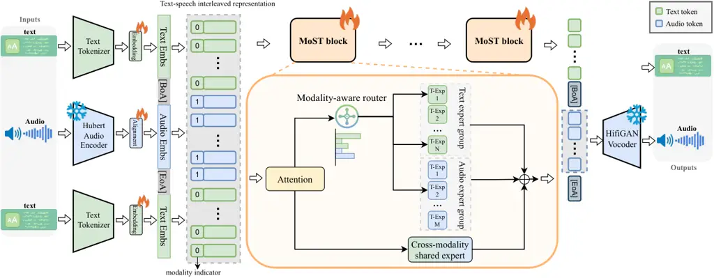
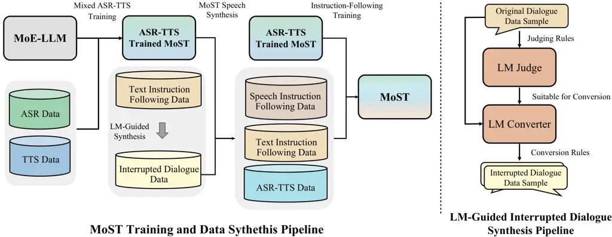
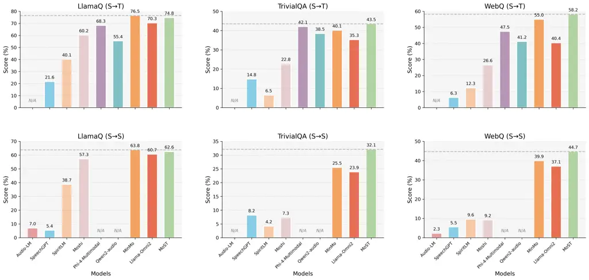
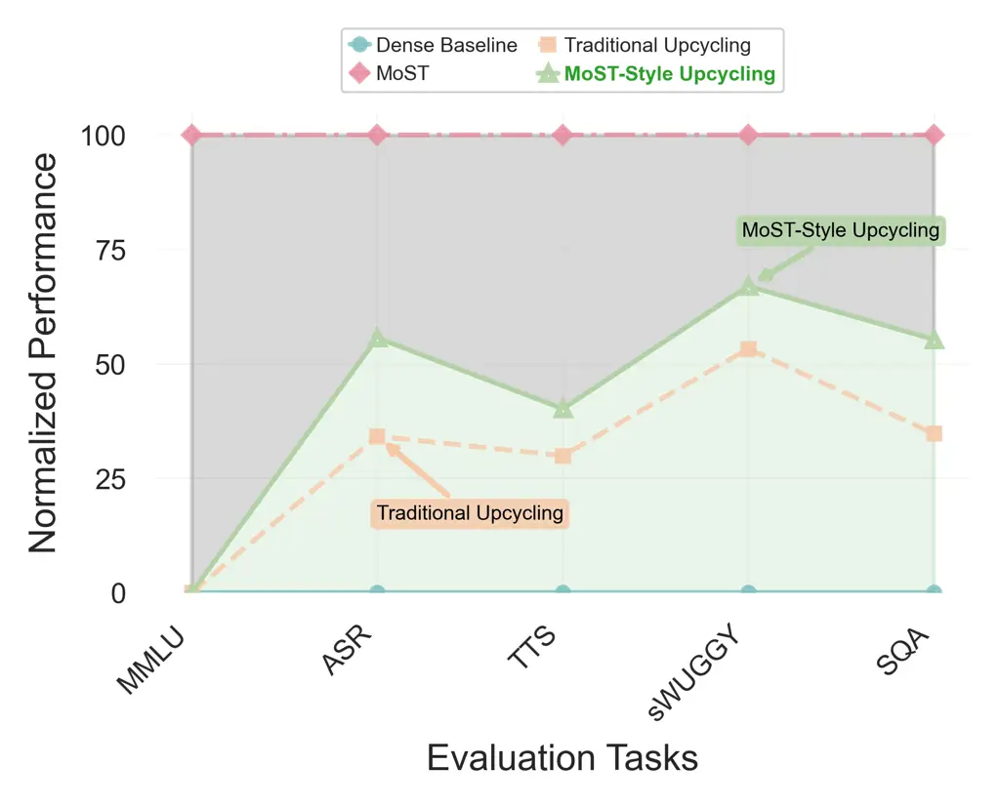
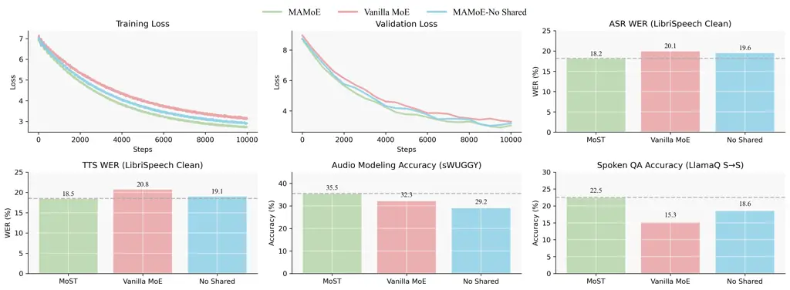
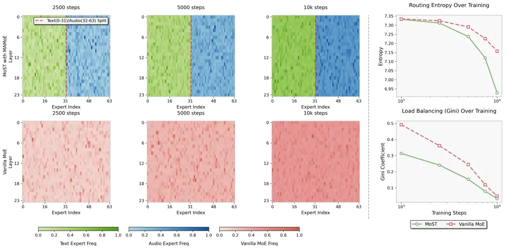

# MoST: Mixing Speech and Text with Modality-Aware Mixture of Experts

Yuxuan Lou ^(†)^(†)thanks: Equal contribution Affiliation: School of
Computer Science, National University of Singapore
Email: [yuxuanlou@u.nus.edu](mailto:)    Kai Yang¹¹footnotemark: 1
Affiliation: School of Computer Science, Shanghai Jiao Tong University
Email: [icarus1411@sjtu.edu.cn](mailto:)    Yang You Affiliation: School
of Computer Science, National University of Singapore
Email: [youy@comp.nus.edu.sg](mailto:)

###### Abstract

We present MoST (Mixture of Speech and Text), a novel multimodal large
language model that seamlessly integrates speech and text processing
through our proposed Modality-Aware Mixture of Experts (MAMoE)
architecture. While current multimodal models typically process diverse
modality representations with identical parameters—disregarding their
inherent representational differences, we introduce specialized routing
pathways that direct tokens to modality-appropriate experts based on
input type. MAMoE simultaneously enhances modality-specific learning and
cross-modal understanding through two complementary components:
modality-specific expert groups that capture domain-specific patterns
and shared experts that facilitate information transfer between
modalities. Building on this architecture, we develop an efficient
transformation pipeline that adapts the pretrained MoE language model
through strategic post-training on ASR and TTS datasets, followed by
fine-tuning with a carefully curated speech-text instruction dataset. A
key feature of this pipeline is that it relies exclusively on fully
accessible, open-source datasets to achieve strong performance and data
efficiency. Comprehensive evaluations across ASR, TTS, audio language
modeling, and spoken question answering benchmarks show that MoST
consistently outperforms existing models of comparable parameter counts.
Our ablation studies confirm that the modality-specific routing
mechanism and shared experts design significantly contribute to
performance gains across all tested domains. To our knowledge, MoST
represents the first fully open-source speech-text LLM built on a
Mixture of Experts architecture. ¹¹ 1 We release MoST model, training
code, inference code, and training data at
[https://github.com/NUS-HPC-AI-Lab/MoST](https://github.com/NUS-HPC-AI-Lab/MoST)

|     |
| --- |
|     |

## 1 Introduction

The seamless integration of speech and text modalities represents a
cornerstone objective in the pursuit of versatile and natural
human-computer interaction. Foundation models, particularly Large
Language Models (LLMs), have demonstrated remarkable capabilities in
text understanding and generation (OpenAI et al., 2024; DeepSeek-AI et
al., 2024), motivating efforts to extend their prowess to encompass
spoken language. However, unifying inherently different modalities like
continuous, high-dimensional speech waveforms and discrete, symbolic
text sequences within a single model presents significant architectural
and training challenges.

A prevalent approach in multimodal learning involves mapping different
modalities into a shared representational space, often processed by a
common set of transformer parameters (Nguyen et al., 2024; Défossez et
al., 2024). While conceptually simple, forcing diverse modality
representations through identical parameters disregards their inherent
representational differences. Specifically for speech and text, this
uniform treatment risks representational interference, where the
distinct statistical properties and structural nuances of each modality
are diluted. Furthermore, it can hinder the development of highly
specialized processing pathways necessary to capture the fine-grained
details unique to each domain—such as phonetic variations in speech or
complex semantic relations in text.

Mixture of Experts (MoE) architectures have emerged as a powerful
technique for scaling model capacity while maintaining computational
efficiency (Shazeer et al., 2017; Lepikhin et al., 2020; Fedus et al.,
2022). By sparsely activating only a subset of parameters (experts) for
each input token, MoE models can significantly increase their parameter
count without a proportional increase in inference cost. While promising
for handling complex data, standard MoE routing mechanisms are typically
modality-agnostic; tokens are routed based on learned gating functions
over their representations, without explicit consideration of their
originating modality. This leaves untapped the potential to dedicate
specialized expert capacity based on known input characteristics.

In this work, we propose MoST (Mixture of Speech and Text), a novel
speech-text LLM built upon a Modality-Aware Mixture of Experts (MAMoE)
architecture. MAMoE directly addresses the limitations of uniform
parameter processing by incorporating two principal components:
modality-specific expert groups (e.g., text-only, audio-only) governed
by a modality-aware routing mechanism, and shared experts accessible to
all modalities, which facilitate cross-modal interaction. The
modality-aware routing explicitly leverages token modality information
to direct inputs towards appropriate modality-specific experts. Text
tokens are primarily routed to text and shared experts, while audio
tokens target audio and shared experts. This design allows for: (1)
Specialized Learning: Modality-specific experts can capture the
intricate patterns unique to either speech or text without interference.
(2) Efficient Cross-Modal Interaction: Shared experts act as a bridge,
facilitating knowledge transfer and cross-modal alignment crucial for
tasks like Automatic Speech Recognition (ASR) and Text-to-Speech (TTS)
synthesis.

To effectively realize MoST, we develop an efficient LLM to Speech-Text
Transformation Pipeline. Starting from a pretrained MoE LLM, we first
conduct targeted post-training on large ASR and TTS datasets. This stage
primes the modality-specific experts and adapts the shared experts for
cross-modal tasks. Subsequently, we perform instruction fine-tuning
using a carefully curated dataset comprising diverse speech and text
instructions, enhancing the model’s versatility and controllability. A
key aspect of our approach is the exclusive use of fully accessible,
open-source training data to achieve strong performance. This strategic
choice distinguishes MoST from some prominent speech-text models, such
as SpiritLM (Nguyen et al., 2024) and Moshi (Défossez et al., 2024),
whose development incorporated datasets that are not publicly
accessible.

Comprehensive evaluations across a range of speech-text benchmarks,
including Automatic Speech Recognition (ASR), Text-to-Speech (TTS)
synthesis, audio language modeling, and spoken question answering,
demonstrate that MoST achieves state-of-the-art or competitive
performance compared to existing models with similar parameter counts.
Our ablation studies rigorously validate the effectiveness of the MAMoE
architecture, confirming that the modality-aware routing mechanism is a
key contributor to performance gains across both modality-specific and
cross-modal tasks. To the best of our knowledge, MoST is the first fully
open-source speech-text LLM leveraging a Mixture of Experts architecture
with modality-specific routing.

Our main contributions are:

- •
  Modality-Aware Mixture of Experts (MAMoE): A novel multimodal MoE
  architecture that directs tokens to modality-specific expert groups
  and shared experts, enhancing specialized learning and cross-modal
  interaction.
- •
  Efficient Text-Speech Transformation Pipeline: A data-efficient
  pipeline for adapting a pretrained LLM into a speech-text LLM via
  targeted post-training and instruction tuning.
- •
  Open Release of MoST Model: We release the MoST model weights,
  training and inference code, and training dataset to facilitate future
  research and development in multimodal AI.

## 2 Related Work

End-to-end Speech-Text Modeling. Existing end-to-end speech-text models
like Qwen2-Audio (Chu et al., 2024) (text output only) and AudioLM
(Borsos et al., 2023) (no direct text integration) have specific
limitations. Others such as SpiritLM (Nguyen et al., 2024) and Moshi
(Défossez et al., 2024) employ dense transformers, which process all
tokens uniformly, unlike MoST’s Modality-Aware Mixture of Experts
(MAMoE), which uses specialized and shared experts for modality-specific
processing and cross-modal understanding.

Mixture of Experts. Standard Mixture of Experts (MoE) architectures
(Lepikhin et al., 2020; Fedus et al., 2022; Du et al., 2022) scale
models efficiently but typically feature modality-agnostic routing,
limiting their multimodal effectiveness. While some research adapts MoE
for general multimodal tasks (e.g., image-text) by grouping experts (Lin
et al., 2024; Shen et al., 2024), MoST is the first to introduce MAMoE
specifically for speech-text. Another key difference is that MoST’s
MAMoE employs shared experts for cross-modal interaction, which is
novel.

Multimodal Adaptation from LLMs. LLMs are often adapted for
multimodality via fine-tuning (Zhang et al., 2024), instruction tuning
(Liu et al., 2023), or speech-specific methods (Fathullah et al., 2023).
MoST presents a unique transformation pipeline: starting from a
pretrained MoE LLM, it undergoes targeted ASR/TTS post-training,
followed by fine-tuning with a curated speech-text instruction dataset.
This approach offers significant data efficiency over conventional
adaptation strategies.



Figure 1: MoST overall architecture. MoST supports interleaved text and
audio as input and can generate both text and audio. MoST blocks are
transformer blocks featured with Modality-Aware Mixture of Experts
(MAMoE). MAMoE is comprised of three critical components:
modality-specific expert groups, cross-modal shared expert, and the
modality-aware router. Modality-aware router utilizes the modality
indicator information for modality-specific routing.

## 3 MoST: Mixture of Speech and Text

### 3.1 Model Overview

MoST (Mixture of Speech and Text) is a unified foundation model built on
a Mixture of Experts (MoE) architecture for seamless speech and text
processing. Unlike discrete tokenization approaches (Borsos et al.,
2023; Nguyen et al., 2024), MoST directly processes continuous audio
waveforms via audio encoder $`E_{audio}`$:
$`\mathbf{H}_{audio}=E_{audio}(\mathbf{A})\in\mathbb{R}^{L_{audio}\times d_{model}}`$.
Text representations are obtained through standard tokenization and
embedding:
$`\mathbf{H}_{text}=E_{text}(\mathbf{T})\in\mathbb{R}^{L_{text}\times d_{model}}`$.
These modalities are combined into unified input $`\mathbf{H}_{input}`$.

The core transformer decoder $`D_{MoST}`$, adapted from a pretrained MoE
LLM, incorporates our Modality-Aware Mixture of Experts (MAMoE) in
designated layers. MAMoE routes tokens to modality-specific experts and
shared experts for cross-modal interaction:
$`\mathbf{H}_{output}=D_{MoST}(\mathbf{H}_{input})`$.

MoST generates both text via language model head $`P_{text}`$ and audio
via vocoder $`G_{audio}`$ conditioned on $`\mathbf{H}_{output}`$ and
speaker embeddings, enabling diverse end-to-end speech-text tasks.
Figure 1 illustrates the architecture.

### 3.2 Audio Encoder and Decoder

MoST processes continuous audio waveforms directly, preserving richer
acoustic information than discrete tokenization methods (Borsos et al.,
2023; Nguyen et al., 2024).

##### Audio Encoder

Input waveforms $`\mathbf{A}`$ are encoded using frozen HuBERT (Hsu et
al., 2021), yielding features
$`\mathbf{F}_{hubert}\in\mathbb{R}^{L_{audio}\times d_{hubert}}`$, then
projected to model dimension:

```math
\mathbf{H}_{audio}=\mathbf{F}_{hubert}\mathbf{W}_{proj}\in\mathbb{R}^{L_{audio}\times d_{model}}. \tag{1}
```

These continuous embeddings replace placeholder tokens in the input
sequence.

##### Audio Decoder

For synthesis, MoST employs HifiGAN vocoder $`G_{audio}`$ (Kong et al.,
2020), generating waveforms $`\hat{\mathbf{A}}`$ conditioned on
predicted HuBERT tokens
$`\mathbf{C}_{audio}=P_{hubert\_tokens}(\mathbf{H}_{output})`$ and
speaker embeddings $`\mathbf{s}`$:

```math
\hat{\mathbf{A}}=G_{audio}(\mathbf{C}_{audio},\mathbf{s}). \tag{2}
```

1: Token representation $`\mathbf{h}_{t}`$, modality indicator
$`\mathbf{m}_{t}`$, gating weights $`\mathbf{W}_{g}`$, expert groups
$`\mathcal{E}_{text}`$, $`\mathcal{E}_{audio}`$, number of experts to
select $`\mathbf{K}`$

2: Routed output $`\mathbf{y}_{routed,t}`$

3: Step 1: Compute Raw Gating Scores

4:
$`\mathbf{s}_{t}\leftarrow\text{softmax}(\mathbf{h}_{t}W_{g})\in\mathbb{R}^{N}`$
$`\triangleright`$ Raw scores over all $`N`$ experts

5: Step 2: Create Modality-Specific Mask

6: for $`i=1`$ to $`N`$ do

7:   if $`m_{t}=0`$ (text) and $`E_{i}\in\mathcal{E}_{text}`$ then

8:    $`M_{m_{t},i}\leftarrow 1`$

9:   else if $`m_{t}=1`$ (audio) and $`E_{i}\in\mathcal{E}_{audio}`$
then

10:    $`M_{m_{t},i}\leftarrow 1`$

11:   else

12:    $`M_{m_{t},i}\leftarrow 0`$

13:   end if

14: end for

15: Step 3: Apply Modality Mask

16:
$`\mathbf{s}^{\prime}_{t}\leftarrow\mathbf{s}_{t}\odot\mathbf{M}_{m_{t}}`$
$`\triangleright`$ Element-wise multiplication

17: Step 4: Select Top-K Experts

18: $`\mathcal{I}_{t}\leftarrow\text{TopK}(\mathbf{s}^{\prime}_{t},K)`$
$`\triangleright`$ Indices of top-K experts

19:
$`\mathbf{w}^{\prime}_{t}\leftarrow\{\mathbf{s}^{\prime}_{t}[i]:i\in\mathcal{I}_{t}\}`$
$`\triangleright`$ Corresponding weights

20: Step 5: Compute Routed Output

21:
$`\mathbf{y}_{routed,t}\leftarrow\sum_{k=1}^{K}w^{\prime}_{t,k}\cdot E_{i_{t,k}}(\mathbf{h}_{t})`$
$`\triangleright`$ Weighted expert outputs

22: return $`\mathbf{y}_{routed,t}`$

Algorithm 1 Modality-Aware Expert Routing

### 3.3 Modality-Aware Mixture of Experts (MAMoE)

#### 3.3.1 Modality-Specific Expert Groups

In the MAMoE layers, the set of $`N`$ available routed experts, denoted
$`\mathcal{E}=\{E_{1},E_{2},\dots,E_{N}\}`$, is partitioned into
disjoint modality-specific groups. Based on the primary modalities in
MoST (speech and text), we define: Text Expert Group
($`\mathcal{E}_{text}`$), a subset of experts designated to primarily
process text-derived token representations, and Audio Expert Group
($`\mathcal{E}_{audio}`$), a subset of experts designated to primarily
process audio-derived token representations (specifically, features
derived from the HuBERT encoder).

These sets are disjoint,
$`\mathcal{E}_{text}\cap\mathcal{E}_{audio}=\emptyset`$, and their union
constitutes the full set of routed experts,
$`\mathcal{E}_{text}\cup\mathcal{E}_{audio}=\mathcal{E}`$. Each expert
$`E_{i}`$ is an MLP, consisting of gate, up, and down projection layers.
This partitioning allows experts to specialize in capturing the distinct
statistical patterns and representations characteristic of either speech
or text.

#### 3.3.2 Cross-Modal Shared Experts

While modality-specific experts promote specialized processing,
effective multimodal understanding requires mechanisms for information
integration across modalities. In MoST, this is facilitated by
incorporating shared experts, implemented as a separate, parallel MLP
block ($`E_{shared}`$). Unlike the routed experts $`\mathcal{E}`$, the
shared expert block processes all tokens passing through the MAMoE
layer.

Given the input hidden state $`\mathbf{h}`$ to the MAMoE layer, the
output $`\mathbf{y}_{routed}`$ from the modality-specific routed experts
(detailed in Sec 3.3.3) is combined with the output of the shared expert
block:

```math
\mathbf{y}_{mamoe}=\mathbf{y}_{routed}+E_{shared}(\mathbf{h}). \tag{3}
```

This parallel shared expert acts as a common pathway, allowing for the
exchange and integration of information learned from different
modalities, complementing the specialized processing occurring within
the modality-specific expert groups.

#### 3.3.3 Modality-Aware Router

MAMoE’s core routing mechanism directs each token $`\mathbf{h}_{t}`$ to
modality-specific experts $`E_{i}\in\mathcal{E}`$ based on its content
and modality indicator $`m_{t}`$ (e.g., $`m_{t}=0`$ for text,
$`m_{t}=1`$ for audio). Algorithm 1 presents the step-by-step procedure
for computing modality-aware routing scores.

During training, an auxiliary load balancing loss, based on
$`\mathbf{s}^{\prime}_{t}`$, promotes balanced expert utilization within
each modality group. This modality-aware routing directs tokens to
specialized pathways, enhancing expert capacity use and
modality-specific representation learning.

## 4 Efficient Training Recipe of MoST

We develop an efficient training recipe to transform a MoE LLM into
MoST. Our approach consists of carefully designed data preparation
procedures followed by a two-stage training protocol. Comprehensive
details of all procedures are provided in Appendix A.

### 4.1 Data Preparation

ASR and TTS Data Curation. We curate large-scale ASR and TTS datasets
from open-source resources, primarily utilizing Common Voice (Ardila et
al., 2020b) and LibriHeavy (Kang et al., 2024). For ASR data, we use the
standard format with speech input and text transcription output. For TTS
data, we reverse the modalities to create paired speech-text samples.

Speech-Text Instruction Dataset Construction. We construct a speech-text
instruction-following dataset through two complementary strategies: (1)
Interrupted Dialogue Synthesis: We augment existing dialogue datasets
(Allal et al., 2025) with realistic interruptions using LLM-based
synthesis to capture natural conversational dynamics and turn-taking
patterns. (2) Text-to-Speech Instruction Conversion: We convert
text-based instruction datasets into speech formats using our
intermediate TTS-trained MoST, significantly expanding speech
instruction data without manual collection.



Figure 2: MoST training recipe overview. The left panel illustrates the
systematic transformation pipeline from MoE LLM to MoST, encompassing
data preparation and two-stage training protocol. The right panel
details the interrupted dialogue synthesis process for instruction
dataset construction.

### 4.2 Training Protocol

Stage 1: Cross-Modal Post-Training. We initialize MoST from DeepSeek-v2
Lite (DeepSeek-AI et al., 2024), a pretrained MoE LLM. The initialized
model undergoes targeted post-training on the curated ASR and TTS
datasets. This stage serves dual purposes: priming modality-specific
experts within MAMoE for speech processing and adapting shared experts
for fundamental cross-modal alignment between speech and text
representations.

Stage 2: Mixed Instruction Fine-Tuning. The model is fine-tuned using
our constructed speech-text instruction dataset, strategically mixed
with a substantial portion of ASR/TTS data from Stage 1. This mixed-task
learning approach enhances complex instruction-following capabilities
while preventing catastrophic forgetting of foundational speech
processing abilities through continual exposure to core tasks.

## 5 Empirical Results

### 5.1 Evaluation Settings

To rigorously assess the performance of MoST, we establish a
comprehensive evaluation framework encompassing standard benchmarks and
strong baseline models.

Baselines. We compare MoST against several state-of-the-art open-source
speech and text models, including AudioLM (Borsos et al., 2023), a
prominent model for high-fidelity audio generation; SpeechGPT (Zhang et
al., 2023), an LLM adapted for speech tasks; SpiritLM (Nguyen et al.,
2024), a recent speech-language model with strong performance;
Moshi (Défossez et al., 2024), another relevant model in speech
processing; Qwen2-Audio (Chu et al., 2024), a powerful open-source model
which has shown strong performance in various speech tasks; Phi-4
Multimodal (Microsoft et al., 2025), a compact yet powerful multimodal
language model that achieves very strong ASR and AST performance;
SeamlessM4T-v2 (Communication et al., 2023), an advanced model for
speech translation and other speech-related tasks; MinMo (Chen et al.,
2025), a recent multimodal model for speech and text; and
LLaMA-Omni2 (Fang et al., 2025), a recent omnimodal language model with
speech capabilities.

Benchmarks and Metrics. Evaluation spans ASR, TTS, audio language
modeling (ALM), and spoken question answering (SQA). For ASR/TTS, we use
LibriSpeech-clean and -other (Kang et al., 2024),
VoxPopuli-V1.0-en (Wang et al., 2021), and Common Voice 15-en (WER for
ASR, TTS; lower is better) (Ardila et al., 2020a). ALM is assessed on
sWUGGY, sBLIMP (Both from Nguyen et al. (2020)); sTopic-StoryCloze and
sStoryCloze (Both from Hassid et al. (2024)) (accuracy). SQA uses Llama
Q (Nachmani et al., 2024) (S→T, S→S), Trivial QA (Joshi et al., 2017)
(S→T, S→S), and WebQ (Berant et al., 2013) (S→T, S→S) (task-specific
scores/accuracy).

### 5.2 Evaluation on TTS and ASR Tasks

We evaluate MoST on ASR and TTS across multiple datasets in Table 1.
MoST demonstrates competitive ASR performance, achieving 2.0% WER on
LS-Clean and 3.7% WER on LS-Other, while excelling in challenging
cross-dataset scenarios with 6.2% WER on VoxPopuli-V1.0-en and 8.4% WER
on Common Voice 15-en. In TTS synthesis, MoST achieves state-of-the-art
performance across multiple datasets: 6.0% WER on LS-Clean, 10.1% CER on
VoxPopuli-V1.0-en, and 11.5% CER on Common Voice 15-en, consistently
outperforming all baselines including the newly added MinMo and
LLaMA-Omni2. These results highlight MAMoE’s effectiveness in
cross-modal tasks and our pipeline’s role in creating a versatile
speech-text model with strong generalization capabilities.

| Model            | LS-Clean |      | LS-Other |      | VoxPopuli-V1.0-en |      | Common Voice 15-en |      |
| ---------------- | -------- | ---- | -------- | ---- | ----------------- | ---- | ------------------ | ---- |
|                  | ASR      | TTS  | ASR      | TTS  | ASR               | TTS  | ASR                | TTS  |
| SpeechGPT        | 11.0     | 14.1 | 16.7     | 15.3 | 18.2              | 21.3 | 19.4               | 23.2 |
| AudioLM          | 9.5      | 9.2  | 12.0     | 12.1 | 15.0              | 22.1 | 17.6               | 25.1 |
| SpiritLM         | 6.0      | 6.7  | 11.0     | 9.5  | 14.3              | 19.4 | 15.4               | 22.4 |
| Moshi            | 5.5      | 7.0  | 12.0     | 7.2  | 8.8               | 10.6 | 9.4                | 14.2 |
| Qwen2-Audio      | 1.8      | /    | 3.6      | /    | 7.1               | /    | 8.6                | /    |
| Phi-4 Multimodal | 2.1      | 4.8  | 3.5      | 4.1  | 6.3               | 11.5 | 9.2                | 10.8 |
| SeamlessM4T-v2   | 3.3      | 6.3  | 4.2      | 5.3  | 7.5               | 10.3 | 10.3               | 12.1 |
| MinMo            | 1.8      | 6.7  | 3.9      | 7.5  | 6.7               | 10.9 | 8.0                | 13.5 |
| LLaMA-Omni2      | 3.5      | 10.1 | 4.0      | 9.2  | 9.5               | 12.4 | 11.3               | 17.2 |
| MoST (Ours)      | 2.0      | 6.0  | 3.7      | 7.2  | 6.2               | 10.1 | 8.4                | 11.5 |

Table 1: ASR (WER % $`\downarrow`$) and TTS (WER % $`\downarrow`$)
performance comparison on LibriSpeech clean and other test sets,
VoxPopuli-V1.0-en, and Common Voice 15-en. Lower values are better. MoST
(Ours) results are highlighted with green background.

### 5.3 Evaluation on Audio Language Modeling Tasks

MoST and baseline models are evaluated on four audio language modeling
benchmarks—sWUGGY, sBLIMP(Lakhotia et al., 2021), sTopic-StoryCloze, and
sStoryCloze(Hassid et al., 2023) —designed to probe audio language
modeling capabilities such as grammatical acceptability and discourse
coherence. We report accuracies derived from negative log-likelihood
(NLL) scores normalized by sequence length, ensuring a fair comparison
across variable-length inputs and tasks.

As shown in Table 2, MoST achieves competitive performance with an
average score of 71.18, comparable to Phi-4 Multimodal (71.84) and
outperforming MinMo (65.19) and LLaMA-Omni2 (68.39). MoST achieves
state-of-the-art performance on sTopic-StoryCloze (83.64), demonstrating
strong performance across multiple benchmarks. This strong performance
underscores MAMoE’s efficacy in learning nuanced audio-specific
linguistic patterns for enhanced spoken language understanding.

| Model            | sWUGGY                | sBLIMP | sTopic-StoryCloze     | sStoryCloze | Average               |
| ---------------- | --------------------- | ------ | --------------------- | ----------- | --------------------- |
| AudioLM          | 71.50                 | 64.70  | \-                    | \-          | \-                    |
| SpeechGPT        | 51.82                 | 49.75  | 60.13                 | 53.13       | 53.71                 |
| spiritLM         | 40.14                 | 48.28  | 83.32                 | 58.95       | 57.67                 |
| Moshi            | 51.14                 | 53.31  | 46.34                 | 45.16       | 48.99                 |
| Phi-4 Multimodal | 71.84                 | 60.21  | 81.55                 | 62.39       | 69.00                 |
| MinMo            | 68.59                 | 55.43  | 75.43                 | 61.29       | 65.19                 |
| LLaMA-Omni2      | 73.21                 | 53.59  | 78.21                 | 68.55       | 68.39                 |
| MoST (Ours)      | 75.28$`\uparrow`$2.1% | 63.42  | 83.64$`\uparrow`$0.3% | 65.43       | 71.94$`\uparrow`$2.9% |

Table 2: Performance on Audio Language Modeling Tasks. MoST demonstrates
superior performance across most benchmarks compared to existing models.
MoST (Ours) results are highlighted with green background and
improvement notes.

### 5.4 Evaluation on Spoken Question Answering Tasks

MoST’s Spoken Question Answering (SQA) capabilities are evaluated on
Llama Q (Nachmani et al., 2024) (S→T and S→S), Trivial QA (Joshi et al., 2017) (S→T and S→S), and WebQ (Berant et al., 2013) (S→T and S→S). As
shown in Figure 3, MoST demonstrates strong performance across all SQA
tasks, achieving the best or competitive results in most settings. On
Llama Q, MoST achieves 74.8 (S→T) and 62.6 (S→S), demonstrating robust
speech-to-text understanding while maintaining competitive
speech-to-speech performance. On Trivial QA, MoST scores 43.5 (S→T) and
a notably high 32.1 (S→S), substantially exceeding most competitors. On
WebQ, MoST achieves the best performance with 58.2 (S→T) and 44.7 (S→S),
significantly outperforming all baselines including MinMo and
LLaMA-Omni2. This strong performance, particularly in challenging S→S
settings, highlights MoST’s robust end-to-end speech understanding and
generation, attributed to the MAMoE architecture.



Figure 3: Performance comparison on Spoken Question Answering tasks.
MoST achieves competitive or superior performances on all 3 datasets.

## 6 Ablation Study: Architecture Benefits with Controlled Comparisons

### 6.1 Controlled Initialization Comparison

To rigorously isolate the architectural contributions of MAMoE from LLM
initialization quality, we conduct a controlled comparison using
identical Llama3.2 3B (Grattafiori et al., 2024) initialization across
three architectural variants: Dense Baseline (standard transformer
without MoE), Traditional MoE Upcycling (Komatsuzaki et al., 2023)
(modality-agnostic routing where all tokens compete for all experts),
and MoST-Style Upcycling (the proposed MAMoE with modality-specific
expert groups and shared experts). This controlled experimental design
ensures that performance differences stem solely from architectural
choices rather than varying initialization quality.



Figure 4: Controlled comparison with identical Llama3.2 3B
initialization. We report (100%-WER) for ASR and TTS tasks and accuracy
for other tasks.

Figure 4 demonstrates the clear architectural progression benefits. Both
MoE variants significantly outperform the dense baseline when starting
from identical initialization, confirming MoE’s fundamental
effectiveness for multimodal tasks. Most importantly, our MoST-style
upcycling substantially surpasses traditional upcycling across all
evaluation metrics, providing compelling evidence for MAMoE’s
architectural advantages independent of initialization quality. The
consistent performance gains—ranging from 7.3% improvement in ASR to
21.8% in SQA—validate that our proposed modality-aware routing mechanism
delivers robust benefits regardless of the starting model. While
stronger initialization (DeepSeek-V2 Lite) yields superior absolute
performance for the full MoST model, this controlled comparison
establishes that our architectural innovations provide consistent
improvements across diverse speech-text tasks.

### 6.2 MAMoE Design Variants Analysis

To validate the individual contributions of MAMoE’s core
components—modality-aware routing and shared experts—we conduct
systematic ablations. We compare MoST against two variants:
MoST-VanillaMoE (standard MoE routing where all tokens compete for all
experts) and MoST-NoShared (MAMoE routing but without shared experts,
making all experts modality-specific). Both variants maintain the same
total number of routed experts as full MoST for fair comparison,
precisely isolating the contributions of modality-specific routing and
shared expert capacity.

All three models were trained on the combined speech-text instruction
following dataset for 10,000 steps (batch size 256). As illustrated in
Figure 5, the full MoST model consistently outperforms both ablated
variants across the comprehensive task suite. The comparison with
MoST-VanillaMoE highlights the significant benefits of MAMoE’s
modality-specific routing mechanism, while MoST’s advantage over
MoST-NoShared underscores the crucial role of shared experts in
enhancing model generalization and facilitating cross-modal
understanding. The training and validation loss curves (Figure 5, top
row) further corroborate these findings, showing more favorable learning
dynamics for the full MAMoE architecture.



Figure 5: MAMoE design variants analysis. The 2×3 grid displays:
Training loss curves; Validation loss curves; ASR, TTS performance (WER)
on LibriSpeech dev-clean; Audio language modeling performance (Accuracy)
on sWUGGY; Spoken QA performance (Accuracy) on LlamaQ. All metrics are
reported at 10,000 training steps. Full MAMoE consistently outperforms
ablated versions.

### 6.3 Expert Routing Analysis

To provide deeper insights into MAMoE’s routing mechanism, we analyze
expert utilization patterns and quantitative routing metrics. Figure 6
presents a comprehensive visualization combining routing frequency
heatmaps (left) with quantitative routing metrics (right) for MoST with
MAMoE versus vanilla MoE.

The routing heatmaps reveal that MAMoE exhibits distinct
modality-specific routing patterns that become increasingly pronounced
during training. Text and audio tokens are systematically directed to
their respective expert groups, fostering specialized processing
pathways. The quantitative analysis (right panel) confirms that MAMoE
achieves progressively lower routing entropy during training, indicating
enhanced expert specialization. Besides, MAMoE maintains superior load
balancing with consistently lower Gini coefficients compared to vanilla
MoE, demonstrating the effectiveness of our routing design.



Figure 6: Expert routing analysis for MAMoE versus vanilla MoE. Left:
Routing frequency heatmaps showing MAMoE’s modality-specific routing
(top) versus vanilla MoE’s diffuse patterns (bottom) at 2,500, 5,000,
and 10,000 training steps. Right: Quantitative metrics showing MAMoE’s
superior specialization (lower entropy) and load balancing (lower Gini
coefficient) throughout training.

## 7 Conclusion

We introduced MoST, a novel multimodal LLM integrating speech and text
with a Modality-Aware Mixture of Experts architecture. MAMoE’s
modality-specific routing and shared experts enhance specialized
processing and cross-modal interaction. Our efficient pipeline
transforms a pretrained MoE LLM into a data-efficient speech-text model.
Empirical evaluations confirm MoST achieves state-of-the-art or
competitive results across ASR, TTS, audio language modeling, and SQA,
outperforming strong baselines.

While our index-based 50% expert partition proves effective, it
represents a simple initialization strategy. More sophisticated
approaches—such as clustering-based or knowledge-preserving
partitioning—offer promising directions for future modality-aware MoE
research (detailed in Appendix D).

We release MoST’s model checkpoints, codebase, and curated data to
encourage further research and development in efficient and effective
multimodal models.

## Reproducibility statement

To ensure transparency and facilitate reproducibility, we release the
full resources required to replicate our experiments. Specifically, we
provide the MoST model implementation, including both training and
inference code, as well as the complete training datasets, at
[https://github.com/anonymous29008/MoST/tree/main](https://github.com/anonymous29008/MoST/tree/main).

All model configurations used for MoST are reported in Appendix C,
detailing architecture choices, hyperparameters, and training schedules.
The released code includes scripts for data preprocessing, model
training, and evaluation, enabling end-to-end reproduction of our
results without additional modifications.

We have verified that running the released code with the provided
configurations reproduces the main results presented in the paper.
Furthermore, instructions are included in the repository to guide users
through environment setup, dependency installation, and hardware
requirements.

## References

- Allal et al. (2025) L. B. Allal, A. Lozhkov, E. Bakouch, G. M.
  Blázquez, G. Penedo, L. Tunstall, A. Marafioti, H. Kydlíček, A. P.
  Lajarín, V. Srivastav, J. Lochner, C. Fahlgren, X. Nguyen, C.
  Fourrier, B. Burtenshaw, H. Larcher, H. Zhao, C. Zakka, M. Morlon, C.
  Raffel, L. von Werra, and T. Wolf SmolLM2: when smol goes big –
  data-centric training of a small language model. External Links:
  2502.02737, [Link](https://arxiv.org/abs/2502.02737) Cited by: §A.2.1,
  §4.1.
- Ardila et al. (2020a) R. Ardila, M. Branson, K. Davis, M. Henretty, M.
  Kohler, J. Meyer, R. Morais, L. Saunders, F. M. Tyers, and G. Weber
  Common voice: a massively-multilingual speech corpus. External Links:
  1912.06670, [Link](https://arxiv.org/abs/1912.06670) Cited by: §5.1.
- Ardila et al. (2020b) R. Ardila, M. Branson, K. Davis, M. Henretty, M.
  Kohler, J. Meyer, R. Morais, L. Saunders, F. M. Tyers, and G. Weber
  Common voice: a massively-multilingual speech corpus. External Links:
  1912.06670, [Link](https://arxiv.org/abs/1912.06670) Cited by: §A.1,
  §4.1.
- Berant et al. (2013) J. Berant, A. Chou, R. Frostig, and P. Liang
  Semantic parsing on Freebase from question-answer pairs. In
  Proceedings of the 2013 Conference on Empirical Methods in Natural
  Language Processing, Seattle, Washington, USA, pp. 1533–1544. External
  Links: [Link](https://www.aclweb.org/anthology/D13-1160) Cited by:
  §5.1, §5.4.
- Borsos et al. (2023) Z. Borsos, R. Marinier, D. Vincent, E.
  Kharitonov, O. Pietquin, M. Sharifi, D. Roblek, O. Teboul, D.
  Grangier, M. Tagliasacchi, and N. Zeghidour AudioLM: a language
  modeling approach to audio generation. External Links: 2209.03143,
  [Link](https://arxiv.org/abs/2209.03143) Cited by: §2, §3.1, §3.2,
  §5.1.
- Chen et al. (2025) Q. Chen, Y. Chen, Y. Chen, M. Chen, Y. Chen, C.
  Deng, Z. Du, R. Gao, C. Gao, Z. Gao, Y. Li, X. Lv, J. Liu, H. Luo, B.
  Ma, C. Ni, X. Shi, J. Tang, H. Wang, H. Wang, W. Wang, Y. Wang, Y.
  Xu, F. Yu, Z. Yan, Y. Yang, B. Yang, X. Yang, G. Yang, T. Zhao, Q.
  Zhang, S. Zhang, N. Zhao, P. Zhang, C. Zhang, and J. Zhou MinMo: a
  multimodal large language model for seamless voice interaction.
  External Links: 2501.06282, [Link](https://arxiv.org/abs/2501.06282)
  Cited by: §5.1.
- Chu et al. (2024) Y. Chu, J. Xu, Q. Yang, H. Wei, X. Wei, Z. Guo, Y.
  Leng, Y. Lv, J. He, J. Lin, C. Zhou, and J. Zhou Qwen2-audio technical
  report. External Links: 2407.10759,
  [Link](https://arxiv.org/abs/2407.10759) Cited by: §2, §5.1.
- Communication et al. (2023) S. Communication, L. Barrault, Y.
  Chung, M. C. Meglioli, D. Dale, N. Dong, M. Duppenthaler, P.
  Duquenne, B. Ellis, H. Elsahar, J. Haaheim, J. Hoffman, M. Hwang, H.
  Inaguma, C. Klaiber, I. Kulikov, P. Li, D. Licht, J. Maillard, R.
  Mavlyutov, A. Rakotoarison, K. R. Sadagopan, A. Ramakrishnan, T.
  Tran, G. Wenzek, Y. Yang, E. Ye, I. Evtimov, P. Fernandez, C. Gao, P.
  Hansanti, E. Kalbassi, A. Kallet, A. Kozhevnikov, G. M.
  Gonzalez, R. S. Roman, C. Touret, C. Wong, C. Wood, B. Yu, P.
  Andrews, C. Balioglu, P. Chen, M. R. Costa-jussà, M. Elbayad, H.
  Gong, F. Guzmán, K. Heffernan, S. Jain, J. Kao, A. Lee, X. Ma, A.
  Mourachko, B. Peloquin, J. Pino, S. Popuri, C. Ropers, S. Saleem, H.
  Schwenk, A. Sun, P. Tomasello, C. Wang, J. Wang, S. Wang, and M.
  Williamson Seamless: multilingual expressive and streaming speech
  translation. External Links: 2312.05187,
  [Link](https://arxiv.org/abs/2312.05187) Cited by: §5.1.
- DeepSeek-AI et al. (2024) DeepSeek-AI, A. Liu, B. Feng, B. Wang, B.
  Wang, B. Liu, C. Zhao, C. Dengr, C. Ruan, D. Dai, D. Guo, D. Yang, D.
  Chen, D. Ji, E. Li, F. Lin, F. Luo, G. Hao, G. Chen, G. Li, H.
  Zhang, H. Xu, H. Yang, H. Zhang, H. Ding, H. Xin, H. Gao, H. Li, H.
  Qu, J. L. Cai, J. Liang, J. Guo, J. Ni, J. Li, J. Chen, J. Yuan, J.
  Qiu, J. Song, K. Dong, K. Gao, K. Guan, L. Wang, L. Zhang, L. Xu, L.
  Xia, L. Zhao, L. Zhang, M. Li, M. Wang, M. Zhang, M. Zhang, M.
  Tang, M. Li, N. Tian, P. Huang, P. Wang, P. Zhang, Q. Zhu, Q. Chen, Q.
  Du, R. J. Chen, R. L. Jin, R. Ge, R. Pan, R. Xu, R. Chen, S. S. Li, S.
  Lu, S. Zhou, S. Chen, S. Wu, S. Ye, S. Ma, S. Wang, S. Zhou, S. Yu, S.
  Zhou, S. Zheng, T. Wang, T. Pei, T. Yuan, T. Sun, W. L. Xiao, W.
  Zeng, W. An, W. Liu, W. Liang, W. Gao, W. Zhang, X. Q. Li, X. Jin, X.
  Wang, X. Bi, X. Liu, X. Wang, X. Shen, X. Chen, X. Chen, X. Nie, X.
  Sun, X. Wang, X. Liu, X. Xie, X. Yu, X. Song, X. Zhou, X. Yang, X.
  Lu, X. Su, Y. Wu, Y. K. Li, Y. X. Wei, Y. X. Zhu, Y. Xu, Y. Huang, Y.
  Li, Y. Zhao, Y. Sun, Y. Li, Y. Wang, Y. Zheng, Y. Zhang, Y. Xiong, Y.
  Zhao, Y. He, Y. Tang, Y. Piao, Y. Dong, Y. Tan, Y. Liu, Y. Wang, Y.
  Guo, Y. Zhu, Y. Wang, Y. Zou, Y. Zha, Y. Ma, Y. Yan, Y. You, Y.
  Liu, Z. Z. Ren, Z. Ren, Z. Sha, Z. Fu, Z. Huang, Z. Zhang, Z. Xie, Z.
  Hao, Z. Shao, Z. Wen, Z. Xu, Z. Zhang, Z. Li, Z. Wang, Z. Gu, Z. Li,
  and Z. Xie DeepSeek-v2: a strong, economical, and efficient
  mixture-of-experts language model. External Links: 2405.04434,
  [Link](https://arxiv.org/abs/2405.04434) Cited by: §1, §4.2.
- Défossez et al. (2024) A. Défossez, L. Mazaré, M. Orsini, A. Royer, P.
  Pérez, H. Jégou, E. Grave, and N. Zeghidour Moshi: a speech-text
  foundation model for real-time dialogue. External Links: 2410.00037,
  [Link](https://arxiv.org/abs/2410.00037) Cited by: Appendix A, §1, §1,
  §2, §5.1.
- Du et al. (2022) N. Du, Y. Huang, A. M. Dai, S. Tong, D. Lepikhin, Y.
  Xu, M. Krikun, Y. Zhou, A. W. Yu, O. Firat, B. Zoph, L. Fedus, M.
  Bosma, Z. Zhou, T. Wang, Y. E. Wang, K. Webster, M. Pellat, K.
  Robinson, K. Meier-Hellstern, T. Duke, L. Dixon, K. Zhang, Q. V.
  Le, Y. Wu, Z. Chen, and C. Cui GLaM: efficient scaling of language
  models with mixture-of-experts. External Links: 2112.06905,
  [Link](https://arxiv.org/abs/2112.06905) Cited by: §2.
- Fang et al. (2025) Q. Fang, Y. Zhou, S. Guo, S. Zhang, and Y. Feng
  LLaMA-omni2: llm-based real-time spoken chatbot with autoregressive
  streaming speech synthesis. External Links: 2505.02625,
  [Link](https://arxiv.org/abs/2505.02625) Cited by: §5.1.
- Fathullah et al. (2023) Y. Fathullah, C. Wu, E. Lakomkin, J. Jia, Y.
  Shangguan, K. Li, J. Guo, W. Xiong, J. Mahadeokar, O. Kalinli, C.
  Fuegen, and M. Seltzer Prompting large language models with speech
  recognition abilities. External Links: 2307.11795,
  [Link](https://arxiv.org/abs/2307.11795) Cited by: §2.
- Fedus et al. (2022) W. Fedus, B. Zoph, and N. Shazeer Switch
  transformers: scaling to trillion parameter models with simple and
  efficient sparsity. External Links: 2101.03961,
  [Link](https://arxiv.org/abs/2101.03961) Cited by: §1, §2.
- Grattafiori et al. (2024) A. Grattafiori, A. Dubey, A. Jauhri, A.
  Pandey, A. Kadian, A. Al-Dahle, A. Letman, A. Mathur, A. Schelten, A.
  Vaughan, A. Yang, A. Fan, A. Goyal, A. Hartshorn, A. Yang, A.
  Mitra, A. Sravankumar, A. Korenev, A. Hinsvark, A. Rao, A. Zhang, A.
  Rodriguez, A. Gregerson, A. Spataru, B. Roziere, B. Biron, B. Tang, B.
  Chern, C. Caucheteux, C. Nayak, C. Bi, C. Marra, C. McConnell, C.
  Keller, C. Touret, C. Wu, C. Wong, C. C. Ferrer, C. Nikolaidis, D.
  Allonsius, D. Song, D. Pintz, D. Livshits, D. Wyatt, D. Esiobu, D.
  Choudhary, D. Mahajan, D. Garcia-Olano, D. Perino, D. Hupkes, E.
  Lakomkin, E. AlBadawy, E. Lobanova, E. Dinan, E. M. Smith, F.
  Radenovic, F. Guzmán, F. Zhang, G. Synnaeve, G. Lee, G. L.
  Anderson, G. Thattai, G. Nail, G. Mialon, G. Pang, G. Cucurell, H.
  Nguyen, H. Korevaar, H. Xu, H. Touvron, I. Zarov, I. A. Ibarra, I.
  Kloumann, I. Misra, I. Evtimov, J. Zhang, J. Copet, J. Lee, J.
  Geffert, J. Vranes, J. Park, J. Mahadeokar, J. Shah, J. van der
  Linde, J. Billock, J. Hong, J. Lee, J. Fu, J. Chi, J. Huang, J.
  Liu, J. Wang, J. Yu, J. Bitton, J. Spisak, J. Park, J. Rocca, J.
  Johnstun, J. Saxe, J. Jia, K. V. Alwala, K. Prasad, K. Upasani, K.
  Plawiak, K. Li, K. Heafield, K. Stone, K. El-Arini, K. Iyer, K.
  Malik, K. Chiu, K. Bhalla, K. Lakhotia, L. Rantala-Yeary, L. van der
  Maaten, L. Chen, L. Tan, L. Jenkins, L. Martin, L. Madaan, L. Malo, L.
  Blecher, L. Landzaat, L. de Oliveira, M. Muzzi, M. Pasupuleti, M.
  Singh, M. Paluri, M. Kardas, M. Tsimpoukelli, M. Oldham, M. Rita, M.
  Pavlova, M. Kambadur, M. Lewis, M. Si, M. K. Singh, M. Hassan, N.
  Goyal, N. Torabi, N. Bashlykov, N. Bogoychev, N. Chatterji, N.
  Zhang, O. Duchenne, O. Çelebi, P. Alrassy, P. Zhang, P. Li, P.
  Vasic, P. Weng, P. Bhargava, P. Dubal, P. Krishnan, P. S. Koura, P.
  Xu, Q. He, Q. Dong, R. Srinivasan, R. Ganapathy, R. Calderer, R. S.
  Cabral, R. Stojnic, R. Raileanu, R. Maheswari, R. Girdhar, R.
  Patel, R. Sauvestre, R. Polidoro, R. Sumbaly, R. Taylor, R. Silva, R.
  Hou, R. Wang, S. Hosseini, S. Chennabasappa, S. Singh, S. Bell, S. S.
  Kim, S. Edunov, S. Nie, S. Narang, S. Raparthy, S. Shen, S. Wan, S.
  Bhosale, S. Zhang, S. Vandenhende, S. Batra, S. Whitman, S. Sootla, S.
  Collot, S. Gururangan, S. Borodinsky, T. Herman, T. Fowler, T.
  Sheasha, T. Georgiou, T. Scialom, T. Speckbacher, T. Mihaylov, T.
  Xiao, U. Karn, V. Goswami, V. Gupta, V. Ramanathan, V. Kerkez, V.
  Gonguet, V. Do, V. Vogeti, V. Albiero, V. Petrovic, W. Chu, W.
  Xiong, W. Fu, W. Meers, X. Martinet, X. Wang, X. Wang, X. E. Tan, X.
  Xia, X. Xie, X. Jia, X. Wang, Y. Goldschlag, Y. Gaur, Y. Babaei, Y.
  Wen, Y. Song, Y. Zhang, Y. Li, Y. Mao, Z. D. Coudert, Z. Yan, Z.
  Chen, Z. Papakipos, A. Singh, A. Srivastava, A. Jain, A. Kelsey, A.
  Shajnfeld, A. Gangidi, A. Victoria, A. Goldstand, A. Menon, A.
  Sharma, A. Boesenberg, A. Baevski, A. Feinstein, A. Kallet, A.
  Sangani, A. Teo, A. Yunus, A. Lupu, A. Alvarado, A. Caples, A. Gu, A.
  Ho, A. Poulton, A. Ryan, A. Ramchandani, A. Dong, A. Franco, A.
  Goyal, A. Saraf, A. Chowdhury, A. Gabriel, A. Bharambe, A.
  Eisenman, A. Yazdan, B. James, B. Maurer, B. Leonhardi, B. Huang, B.
  Loyd, B. D. Paola, B. Paranjape, B. Liu, B. Wu, B. Ni, B. Hancock, B.
  Wasti, B. Spence, B. Stojkovic, B. Gamido, B. Montalvo, C. Parker, C.
  Burton, C. Mejia, C. Liu, C. Wang, C. Kim, C. Zhou, C. Hu, C. Chu, C.
  Cai, C. Tindal, C. Feichtenhofer, C. Gao, D. Civin, D. Beaty, D.
  Kreymer, D. Li, D. Adkins, D. Xu, D. Testuggine, D. David, D.
  Parikh, D. Liskovich, D. Foss, D. Wang, D. Le, D. Holland, E.
  Dowling, E. Jamil, E. Montgomery, E. Presani, E. Hahn, E. Wood, E.
  Le, E. Brinkman, E. Arcaute, E. Dunbar, E. Smothers, F. Sun, F.
  Kreuk, F. Tian, F. Kokkinos, F. Ozgenel, F. Caggioni, F. Kanayet, F.
  Seide, G. M. Florez, G. Schwarz, G. Badeer, G. Swee, G. Halpern, G.
  Herman, G. Sizov, Guangyi, Zhang, G. Lakshminarayanan, H. Inan, H.
  Shojanazeri, H. Zou, H. Wang, H. Zha, H. Habeeb, H. Rudolph, H.
  Suk, H. Aspegren, H. Goldman, H. Zhan, I. Damlaj, I. Molybog, I.
  Tufanov, I. Leontiadis, I. Veliche, I. Gat, J. Weissman, J.
  Geboski, J. Kohli, J. Lam, J. Asher, J. Gaya, J. Marcus, J. Tang, J.
  Chan, J. Zhen, J. Reizenstein, J. Teboul, J. Zhong, J. Jin, J.
  Yang, J. Cummings, J. Carvill, J. Shepard, J. McPhie, J. Torres, J.
  Ginsburg, J. Wang, K. Wu, K. H. U, K. Saxena, K. Khandelwal, K.
  Zand, K. Matosich, K. Veeraraghavan, K. Michelena, K. Li, K.
  Jagadeesh, K. Huang, K. Chawla, K. Huang, L. Chen, L. Garg, L. A, L.
  Silva, L. Bell, L. Zhang, L. Guo, L. Yu, L. Moshkovich, L.
  Wehrstedt, M. Khabsa, M. Avalani, M. Bhatt, M. Mankus, M. Hasson, M.
  Lennie, M. Reso, M. Groshev, M. Naumov, M. Lathi, M. Keneally, M.
  Liu, M. L. Seltzer, M. Valko, M. Restrepo, M. Patel, M. Vyatskov, M.
  Samvelyan, M. Clark, M. Macey, M. Wang, M. J. Hermoso, M. Metanat, M.
  Rastegari, M. Bansal, N. Santhanam, N. Parks, N. White, N. Bawa, N.
  Singhal, N. Egebo, N. Usunier, N. Mehta, N. P. Laptev, N. Dong, N.
  Cheng, O. Chernoguz, O. Hart, O. Salpekar, O. Kalinli, P. Kent, P.
  Parekh, P. Saab, P. Balaji, P. Rittner, P. Bontrager, P. Roux, P.
  Dollar, P. Zvyagina, P. Ratanchandani, P. Yuvraj, Q. Liang, R.
  Alao, R. Rodriguez, R. Ayub, R. Murthy, R. Nayani, R. Mitra, R.
  Parthasarathy, R. Li, R. Hogan, R. Battey, R. Wang, R. Howes, R.
  Rinott, S. Mehta, S. Siby, S. J. Bondu, S. Datta, S. Chugh, S.
  Hunt, S. Dhillon, S. Sidorov, S. Pan, S. Mahajan, S. Verma, S.
  Yamamoto, S. Ramaswamy, S. Lindsay, S. Lindsay, S. Feng, S. Lin, S. C.
  Zha, S. Patil, S. Shankar, S. Zhang, S. Zhang, S. Wang, S. Agarwal, S.
  Sajuyigbe, S. Chintala, S. Max, S. Chen, S. Kehoe, S. Satterfield, S.
  Govindaprasad, S. Gupta, S. Deng, S. Cho, S. Virk, S. Subramanian, S.
  Choudhury, S. Goldman, T. Remez, T. Glaser, T. Best, T. Koehler, T.
  Robinson, T. Li, T. Zhang, T. Matthews, T. Chou, T. Shaked, V.
  Vontimitta, V. Ajayi, V. Montanez, V. Mohan, V. S. Kumar, V.
  Mangla, V. Ionescu, V. Poenaru, V. T. Mihailescu, V. Ivanov, W. Li, W.
  Wang, W. Jiang, W. Bouaziz, W. Constable, X. Tang, X. Wu, X. Wang, X.
  Wu, X. Gao, Y. Kleinman, Y. Chen, Y. Hu, Y. Jia, Y. Qi, Y. Li, Y.
  Zhang, Y. Zhang, Y. Adi, Y. Nam, Yu, Wang, Y. Zhao, Y. Hao, Y.
  Qian, Y. Li, Y. He, Z. Rait, Z. DeVito, Z. Rosnbrick, Z. Wen, Z.
  Yang, Z. Zhao, and Z. Ma The llama 3 herd of models. External Links:
  2407.21783, [Link](https://arxiv.org/abs/2407.21783) Cited by: §6.1.
- Hassid et al. (2023) M. Hassid, T. Remez, T. A. Nguyen, I. Gat, A.
  Conneau, F. Kreuk, J. Copet, A. Defossez, G. Synnaeve, E. Dupoux, et
  al. Textually pretrained speech language models. Advances in Neural
  Information Processing Systems 36, pp. 63483–63501. Cited by: §5.3.
- Hassid et al. (2024) M. Hassid, T. Remez, T. A. Nguyen, I. Gat, A.
  Conneau, F. Kreuk, J. Copet, A. Defossez, G. Synnaeve, E. Dupoux, R.
  Schwartz, and Y. Adi Textually pretrained speech language models.
  External Links: 2305.13009, [Link](https://arxiv.org/abs/2305.13009)
  Cited by: §5.1.
- Hsu et al. (2021) W. Hsu, B. Bolte, Y. H. Tsai, K. Lakhotia, R.
  Salakhutdinov, and A. Mohamed HuBERT: self-supervised speech
  representation learning by masked prediction of hidden units. External
  Links: 2106.07447, [Link](https://arxiv.org/abs/2106.07447) Cited by:
  §3.2.
- Joshi et al. (2017) M. Joshi, E. Choi, D. Weld, and L. Zettlemoyer
  TriviaQA: a large scale distantly supervised challenge dataset for
  reading comprehension. In Proceedings of the 55th Annual Meeting of
  the Association for Computational Linguistics (Volume 1: Long
  Papers), R. Barzilay and M. Kan (Eds.), Vancouver, Canada,
  pp. 1601–1611. External Links:
  [Link](https://aclanthology.org/P17-1147/),
  [Document](https://dx.doi.org/10.18653/v1/P17-1147) Cited by: §5.1,
  §5.4.
- Kang et al. (2024) W. Kang, X. Yang, Z. Yao, F. Kuang, Y. Yang, L.
  Guo, L. Lin, and D. Povey Libriheavy: a 50,000 hours asr corpus with
  punctuation casing and context. External Links: 2309.08105,
  [Link](https://arxiv.org/abs/2309.08105) Cited by: §A.1, §4.1, §5.1.
- Komatsuzaki et al. (2023) A. Komatsuzaki, J. Puigcerver, J.
  Lee-Thorp, C. R. Ruiz, B. Mustafa, J. Ainslie, Y. Tay, M. Dehghani,
  and N. Houlsby Sparse upcycling: training mixture-of-experts from
  dense checkpoints. External Links: 2212.05055,
  [Link](https://arxiv.org/abs/2212.05055) Cited by: §6.1.
- Kong et al. (2020) J. Kong, J. Kim, and J. Bae HiFi-gan: generative
  adversarial networks for efficient and high fidelity speech synthesis.
  External Links: 2010.05646, [Link](https://arxiv.org/abs/2010.05646)
  Cited by: §3.2.
- Lakhotia et al. (2021) K. Lakhotia, E. Kharitonov, W. Hsu, Y. Adi, A.
  Polyak, B. Bolte, T. Nguyen, J. Copet, A. Baevski, A. Mohamed, et al.
  On generative spoken language modeling from raw audio. Transactions of
  the Association for Computational Linguistics 9, pp. 1336–1354. Cited
  by: §5.3.
- Lepikhin et al. (2020) D. Lepikhin, H. Lee, Y. Xu, D. Chen, O.
  Firat, Y. Huang, M. Krikun, N. Shazeer, and Z. Chen GShard: scaling
  giant models with conditional computation and automatic sharding.
  External Links: 2006.16668, [Link](https://arxiv.org/abs/2006.16668)
  Cited by: §1, §2.
- Lin et al. (2024) X. V. Lin, A. Shrivastava, L. Luo, S. Iyer, M.
  Lewis, G. Ghosh, L. Zettlemoyer, and A. Aghajanyan MoMa: efficient
  early-fusion pre-training with mixture of modality-aware experts.
  External Links: 2407.21770, [Link](https://arxiv.org/abs/2407.21770)
  Cited by: §2.
- Liu et al. (2023) H. Liu, C. Li, Q. Wu, and Y. J. Lee Visual
  instruction tuning. External Links: 2304.08485,
  [Link](https://arxiv.org/abs/2304.08485) Cited by: §2.
- Loshchilov and Hutter (2019) I. Loshchilov and F. Hutter Decoupled
  weight decay regularization. External Links: 1711.05101,
  [Link](https://arxiv.org/abs/1711.05101) Cited by: §B.1.
- Microsoft et al. (2025) Microsoft, :, A. Abouelenin, A. Ashfaq, A.
  Atkinson, H. Awadalla, N. Bach, J. Bao, A. Benhaim, M. Cai, V.
  Chaudhary, C. Chen, D. Chen, D. Chen, J. Chen, W. Chen, Y. Chen, Y.
  Chen, Q. Dai, X. Dai, R. Fan, M. Gao, M. Gao, A. Garg, A. Goswami, J.
  Hao, A. Hendy, Y. Hu, X. Jin, M. Khademi, D. Kim, Y. J. Kim, G.
  Lee, J. Li, Y. Li, C. Liang, X. Lin, Z. Lin, M. Liu, Y. Liu, G.
  Lopez, C. Luo, P. Madan, V. Mazalov, A. Mitra, A. Mousavi, A.
  Nguyen, J. Pan, D. Perez-Becker, J. Platin, T. Portet, K. Qiu, B.
  Ren, L. Ren, S. Roy, N. Shang, Y. Shen, S. Singhal, S. Som, X.
  Song, T. Sych, P. Vaddamanu, S. Wang, Y. Wang, Z. Wang, H. Wu, H.
  Xu, W. Xu, Y. Yang, Z. Yang, D. Yu, I. Zabir, J. Zhang, L. L.
  Zhang, Y. Zhang, and X. Zhou Phi-4-mini technical report: compact yet
  powerful multimodal language models via mixture-of-loras. External
  Links: 2503.01743, [Link](https://arxiv.org/abs/2503.01743) Cited by:
  §5.1.
- Nachmani et al. (2024) E. Nachmani, A. Levkovitch, R. Hirsch, J.
  Salazar, C. Asawaroengchai, S. Mariooryad, E. Rivlin, R. Skerry-Ryan,
  and M. T. Ramanovich Spoken question answering and speech continuation
  using spectrogram-powered llm. External Links: 2305.15255,
  [Link](https://arxiv.org/abs/2305.15255) Cited by: §5.1, §5.4.
- Nguyen et al. (2020) T. A. Nguyen, M. de Seyssel, P. Rozé, M.
  Rivière, E. Kharitonov, A. Baevski, E. Dunbar, and E. Dupoux The zero
  resource speech benchmark 2021: metrics and baselines for unsupervised
  spoken language modeling. External Links: 2011.11588,
  [Link](https://arxiv.org/abs/2011.11588) Cited by: §5.1.
- Nguyen et al. (2024) T. A. Nguyen, B. Muller, B. Yu, M. R.
  Costa-jussa, M. Elbayad, S. Popuri, C. Ropers, P. Duquenne, R.
  Algayres, R. Mavlyutov, I. Gat, M. Williamson, G. Synnaeve, J.
  Pino, B. Sagot, and E. Dupoux Spirit lm: interleaved spoken and
  written language model. External Links: 2402.05755,
  [Link](https://arxiv.org/abs/2402.05755) Cited by: Appendix A, §1, §1,
  §2, §3.1, §3.2, §5.1.
- OpenAI et al. (2024) OpenAI, J. Achiam, S. Adler, S. Agarwal, L.
  Ahmad, I. Akkaya, F. L. Aleman, D. Almeida, J. Altenschmidt, S.
  Altman, S. Anadkat, R. Avila, I. Babuschkin, S. Balaji, V. Balcom, P.
  Baltescu, H. Bao, M. Bavarian, J. Belgum, I. Bello, J. Berdine, G.
  Bernadett-Shapiro, C. Berner, L. Bogdonoff, O. Boiko, M. Boyd, A.
  Brakman, G. Brockman, T. Brooks, M. Brundage, K. Button, T. Cai, R.
  Campbell, A. Cann, B. Carey, C. Carlson, R. Carmichael, B. Chan, C.
  Chang, F. Chantzis, D. Chen, S. Chen, R. Chen, J. Chen, M. Chen, B.
  Chess, C. Cho, C. Chu, H. W. Chung, D. Cummings, J. Currier, Y.
  Dai, C. Decareaux, T. Degry, N. Deutsch, D. Deville, A. Dhar, D.
  Dohan, S. Dowling, S. Dunning, A. Ecoffet, A. Eleti, T. Eloundou, D.
  Farhi, L. Fedus, N. Felix, S. P. Fishman, J. Forte, I. Fulford, L.
  Gao, E. Georges, C. Gibson, V. Goel, T. Gogineni, G. Goh, R.
  Gontijo-Lopes, J. Gordon, M. Grafstein, S. Gray, R. Greene, J.
  Gross, S. S. Gu, Y. Guo, C. Hallacy, J. Han, J. Harris, Y. He, M.
  Heaton, J. Heidecke, C. Hesse, A. Hickey, W. Hickey, P. Hoeschele, B.
  Houghton, K. Hsu, S. Hu, X. Hu, J. Huizinga, S. Jain, S. Jain, J.
  Jang, A. Jiang, R. Jiang, H. Jin, D. Jin, S. Jomoto, B. Jonn, H.
  Jun, T. Kaftan, Ł. Kaiser, A. Kamali, I. Kanitscheider, N. S.
  Keskar, T. Khan, L. Kilpatrick, J. W. Kim, C. Kim, Y. Kim, J. H.
  Kirchner, J. Kiros, M. Knight, D. Kokotajlo, Ł. Kondraciuk, A.
  Kondrich, A. Konstantinidis, K. Kosic, G. Krueger, V. Kuo, M.
  Lampe, I. Lan, T. Lee, J. Leike, J. Leung, D. Levy, C. M. Li, R.
  Lim, M. Lin, S. Lin, M. Litwin, T. Lopez, R. Lowe, P. Lue, A.
  Makanju, K. Malfacini, S. Manning, T. Markov, Y. Markovski, B.
  Martin, K. Mayer, A. Mayne, B. McGrew, S. M. McKinney, C. McLeavey, P.
  McMillan, J. McNeil, D. Medina, A. Mehta, J. Menick, L. Metz, A.
  Mishchenko, P. Mishkin, V. Monaco, E. Morikawa, D. Mossing, T. Mu, M.
  Murati, O. Murk, D. Mély, A. Nair, R. Nakano, R. Nayak, A.
  Neelakantan, R. Ngo, H. Noh, L. Ouyang, C. O’Keefe, J. Pachocki, A.
  Paino, J. Palermo, A. Pantuliano, G. Parascandolo, J. Parish, E.
  Parparita, A. Passos, M. Pavlov, A. Peng, A. Perelman, F. de Avila
  Belbute Peres, M. Petrov, H. P. de Oliveira Pinto, Michael,
  Pokorny, M. Pokrass, V. H. Pong, T. Powell, A. Power, B. Power, E.
  Proehl, R. Puri, A. Radford, J. Rae, A. Ramesh, C. Raymond, F.
  Real, K. Rimbach, C. Ross, B. Rotsted, H. Roussez, N. Ryder, M.
  Saltarelli, T. Sanders, S. Santurkar, G. Sastry, H. Schmidt, D.
  Schnurr, J. Schulman, D. Selsam, K. Sheppard, T. Sherbakov, J.
  Shieh, S. Shoker, P. Shyam, S. Sidor, E. Sigler, M. Simens, J.
  Sitkin, K. Slama, I. Sohl, B. Sokolowsky, Y. Song, N.
  Staudacher, F. P. Such, N. Summers, I. Sutskever, J. Tang, N.
  Tezak, M. B. Thompson, P. Tillet, A. Tootoonchian, E. Tseng, P.
  Tuggle, N. Turley, J. Tworek, J. F. C. Uribe, A. Vallone, A.
  Vijayvergiya, C. Voss, C. Wainwright, J. J. Wang, A. Wang, B. Wang, J.
  Ward, J. Wei, C. Weinmann, A. Welihinda, P. Welinder, J. Weng, L.
  Weng, M. Wiethoff, D. Willner, C. Winter, S. Wolrich, H. Wong, L.
  Workman, S. Wu, J. Wu, M. Wu, K. Xiao, T. Xu, S. Yoo, K. Yu, Q.
  Yuan, W. Zaremba, R. Zellers, C. Zhang, M. Zhang, S. Zhao, T.
  Zheng, J. Zhuang, W. Zhuk, and B. Zoph GPT-4 technical report.
  External Links: 2303.08774, [Link](https://arxiv.org/abs/2303.08774)
  Cited by: §1.
- Shazeer et al. (2017) N. Shazeer, A. Mirhoseini, K. Maziarz, A.
  Davis, Q. Le, G. Hinton, and J. Dean Outrageously large neural
  networks: the sparsely-gated mixture-of-experts layer. External Links:
  1701.06538, [Link](https://arxiv.org/abs/1701.06538) Cited by: §1.
- Shen et al. (2024) L. Shen, G. Chen, R. Shao, W. Guan, and L. Nie
  MoME: mixture of multimodal experts for generalist multimodal large
  language models. External Links: 2407.12709,
  [Link](https://arxiv.org/abs/2407.12709) Cited by: §2.
- Wang et al. (2021) C. Wang, M. Rivière, A. Lee, A. Wu, C. Talnikar, D.
  Haziza, M. Williamson, J. Pino, and E. Dupoux VoxPopuli: a large-scale
  multilingual speech corpus for representation learning,
  semi-supervised learning and interpretation. External Links:
  2101.00390, [Link](https://arxiv.org/abs/2101.00390) Cited by: §5.1.
- Zhang et al. (2023) D. Zhang, S. Li, X. Zhang, J. Zhan, P. Wang, Y.
  Zhou, and X. Qiu SpeechGPT: empowering large language models with
  intrinsic cross-modal conversational abilities. External Links:
  2305.11000, [Link](https://arxiv.org/abs/2305.11000) Cited by: §5.1.
- Zhang et al. (2024) D. Zhang, Y. Yu, J. Dong, C. Li, D. Su, C. Chu,
  and D. Yu MM-llms: recent advances in multimodal large language
  models. External Links: 2401.13601,
  [Link](https://arxiv.org/abs/2401.13601) Cited by: §2.

## Appendix A Detailed Training Recipe

To effectively realize MoST, we develop an efficient LLM-to-Speech-Text
Transformation Pipeline. Starting from a pretrained MoE LLM, we first
conduct targeted post-training on large ASR and TTS datasets. This stage
primes the modality-specific experts and adapts the shared experts for
cross-modal tasks. Subsequently, we perform instruction fine-tuning
using a carefully curated speech-text instruction dataset. Our training
strategy involves mixed-task learning and incorporates techniques to
prevent catastrophic forgetting of foundational abilities during
fine-tuning. Critically, this pipeline demonstrates remarkable data
efficiency, achieving strong performance with significantly fewer
training tokens compared to prominent open-source speech-text models
like SpiritLM (Nguyen et al., 2024) and Moshi (Défossez et al., 2024).

Table 3 provides a comprehensive overview of our two-stage training
protocol, including key hyperparameters, task mixing ratios, and dataset
composition details for each stage.

| Training Stage                     | Configuration               | Task Mixing Ratios                                        | Dataset Composition Details                                                                                        |
| ---------------------------------- | --------------------------- | --------------------------------------------------------- | ------------------------------------------------------------------------------------------------------------------ |
| Stage 1: Cross-Modal Post-Training | Steps: 500k Batch Size: 512 | ASR: 0.4 TTS: 0.4 Text LM: 0.2                            | ASR/TTS: LibriHeavy (0.6), Common Voice (0.2), VoxPopuli (0.2) LM: RefinedWeb (to prevent forgetting)              |
| Stage 2: Mixed Instruction Tuning  | Steps: 10k Batch Size: 128  | Speech Instruct: 0.4 Text Instruct: 0.4 ASR: 0.1 TTS: 0.1 | Speech Instruct: Synthesized from SmolTalk (via MoST Stage 1) Text Instruct: Standard open-source instruction data |

Table 3: Training Configuration Overview. Detailed breakdown of training
stages, configurations, task mixing ratios, and dataset compositions.

### A.1 ASR and TTS Data Preparation (Stage 1)

The initial stage of our LLM-to-Speech-Text transformation pipeline
involves post-training on large-scale Automatic Speech Recognition (ASR)
and Text-to-Speech (TTS) datasets. This step is crucial for priming the
modality-specific experts within the MAMoE architecture and adapting the
shared experts for fundamental cross-modal alignment tasks.

We utilize two primary open data sources for this stage: the Common
Voice corpus (Ardila et al., 2020b) and the full LibriHeavy dataset
(Kang et al., 2024), selected for their scale and diversity in speech
patterns and linguistic content. The ASR data follows the standard
format where the input consists of speech (represented as acoustic
features or tokens) and the output is the corresponding text
transcription, guided by an instruction like "Transcribe the following
speech into text."

To generate the necessary TTS data, we systematically transform the ASR
datasets. For each ASR sample {instruction: "Transcribe...", input:
speech, output: text}, we create a corresponding TTS sample by reversing
the input and output modalities and modifying the instruction. The
resulting TTS sample format is {instruction: "Convert the following text
into speech.", input: text, output: speech}. This conversion process,
(further details were originally noted to be in supplementary materials,
which is consistent with an appendix location), ensures that the model
is trained on paired speech-text data for both recognition and synthesis
tasks, effectively leveraging existing ASR resources to create aligned
TTS training data. This phase prepares the model for more complex
instruction-following tasks in the subsequent fine-tuning stage.

### A.2 Speech-Text Instruction-Following Data Construction (Stage 2)

Following the initial post-training phase, MoST undergoes instruction
fine-tuning to enhance its ability to follow complex commands and engage
in nuanced interactions involving both speech and text. This requires a
diverse dataset of speech-text instructions. We construct this dataset
through two complementary strategies: synthesizing interrupted dialogues
and converting text-based instructions into a speech format.

#### A.2.1 Interrupted Dialogue Synthesis Pipeline

Standard instruction datasets often lack the dynamic turn-taking and
interruptions characteristic of natural human conversation. To address
this, we develop a pipeline to augment existing dialogue datasets with
realistic interruptions. We utilize the open-source SmolTalk dataset
(Allal et al., 2025) as our base, which contains multi-turn
user-assistant conversations.

Our synthesis pipeline employs a large language model (LLM) in a
two-step process. First, the LLM analyzes each dialogue from the text
instruction following dataset to determine its suitability for adding a
user interruption. Suitability criteria include clear role separation
(user/assistant), the presence of longer assistant turns amenable to
interruption, and contextual appropriateness for an interruption.
Second, for dialogues identified as suitable, the LLM is prompted to
rewrite the conversation by inserting a natural user interruption during
one of the assistant’s longer responses. This interruption typically
takes the form of a brief clarifying question related to the assistant’s
immediately preceding statement. The LLM is instructed to modify the
assistant’s response to briefly address the interruption before
seamlessly transitioning back to its original point (e.g., "A host cell
is… Now, as I was saying…"). The remainder of the dialogue remains
unchanged. This process yields a dataset enriched with more complex
conversational flows, better preparing MoST for interactive scenarios.

#### A.2.2 Text-to-Speech Instruction Dataset Conversion

To enable our model with both speech and text instruction following
abilities, we employ a strategy where we leverage the capabilities of
our own MoST model, specifically after its initial post-training on ASR
and TTS data (as described in Appendix A.1).

For a given text-based instruction sample (e.g., {instruction:
text_prompt, input: text_input, output: text_response}), we use the
ASR-TTS trained MoST model to synthesize the speech equivalent of the
text_response. This converts the sample into a speech-output format
(e.g., {instruction: text_prompt, input: text_input, output:
speech_response}). Depending on the target task, we can also synthesize
speech for the text_input or even the instruction itself, creating
varied multimodal instruction formats. This approach allows us to
efficiently repurpose vast quantities of high-quality text instructions
for speech-based fine-tuning without the need for manual speech data
collection, significantly broadening the range of tasks MoST is trained
on.

### A.3 Mixed Speech-Text Instruction Fine-tuning and Hyper-parameters (Stage 3)

Our training process for MoST (after Stage 1 post-training described in
Appendix A.1 and Stage 2 data construction in Appendix A.2) proceeds to
instruction fine-tuning.

Instruction Fine-tuning Strategy. This stage uses the curated dataset
comprising synthesized interrupted dialogues and text-to-speech
converted instructions. The goal is to teach the model complex
reasoning, interaction, and command-following involving both modalities.
Crucially, to mitigate catastrophic forgetting of the foundational ASR
and TTS capabilities learned in Stage 1, the instruction fine-tuning
data is mixed with a significant portion of the original ASR and TTS
data. This ensures that MoST retains its core speech processing
abilities while acquiring higher-level instruction-following competence.
The mixing ratio between new instruction data and the ASR/TTS data is
carefully managed throughout this stage.

## Appendix B Training Settings

This section details the hyper-parameters used for training MoST and the
computing resources utilized for the experiments.

### B.1 Training Hyper-parameters

Across all training stages (post-training and fine-tuning), we utilize
the AdamW optimizer (Loshchilov and Hutter, 2019) with a cosine learning
rate schedule, including a warm-up phase. Specific values for the peak
learning rate, weight decay, batch size, and the exact number of
training steps or epochs for each stage, along with the mixing ratios
used during instruction fine-tuning are as follows:

Peak Learning Rate: 5e-5, Weight Decay: 0.01, Batch Size for ASR-TTS
Post-training: 256, Batch Size for Mixed Instruction Following
Fine-tuning: 128, Fine-tuning Steps: 10000, Warmup Steps: 1000, Mixing
Ratio (Instruction:ASR/TTS): 1:1. These parameters were chosen based on
preliminary experiments to ensure stable and efficient convergence.

### B.2 Experiment Computing Resources

The training experiments for MoST were conducted using a distributed
setup comprising 48 NVIDIA A100 GPUs. Specifically, this involved 6
nodes, each equipped with 8 A100 GPUs.

## Appendix C Model Configurations

Table 4 details the model configurations used for MoST.

| Parameter               | Value                                  |
| ----------------------- | -------------------------------------- |
| architectures           | \["MoSTCForCausalLM"\]                 |
| attention_bias          | false                                  |
| attention_dropout       | 0.0                                    |
| audio_expert_indices    | \[32, 33, ..., 62, 63\]                |
| auto_map                |                                        |
|    AutoConfig           | configuration_MoST.MoSTCConfig         |
|    AutoModel            | modeling_most.MoSTCModel               |
|    AutoModelForCausalLM | modeling_most.MoSTCForCausalLM         |
| aux_loss_alpha          | 0.001                                  |
| bos_token_id            | 100000                                 |
| eos_token_id            | 100001                                 |
| hidden_act              | silu                                   |
| hidden_size             | 2048                                   |
| intermediate_size       | 10944                                  |
| num_hidden_layers       | 27                                     |
| rope_scaling            |                                        |
|    beta_fast            | 32                                     |
|    beta_slow            | 1                                      |
|    factor               | 40                                     |
|    type                 | yarn                                   |
| vocab_size              | 102400                                 |
| use_cache               | true                                   |
| torch_dtype             | bfloat16                               |
| hubert_model_path       | /.../hubert_MoSTC/mhubert_base_25hz.pt |
| quantizer_model_path    | /.../hubert_MoSTC/L11_quantizer_500.pt |

Table 4: Model configurations from config_mostc.json

Table 4: Model configurations from config_mostc.json (Continued)

## Appendix D Limitations, Social Impacts and Future Work

MoST presents both potential societal benefits (e.g., accessibility) and
risks (e.g., voice spoofing).

### D.1 Expert Partition Strategy

A key design decision in MAMoE is the 50% partition of the pretrained
MoE LLM’s experts into text-specific and audio-specific groups based on
expert indices. We acknowledge that this hard partition, while
effective, represents a relatively simple initialization strategy with
potential limitations:

Rationale for Index-Based Partition. In standard sparse MoE models like
DeepSeek-V2, experts are randomly initialized and do not exhibit
semantic clustering (e.g., specialized "text experts" vs. "math
experts") prior to training. Consequently, a random index-based split at
initialization is statistically neutral—no particular subset of experts
has inherent advantages for any specific modality. Our Stage 1
Cross-Modal Post-Training is explicitly designed to specialize these
initially random experts into their assigned modalities through targeted
ASR/TTS training.

Role of Shared Experts. Critically, the Shared Experts in MAMoE process
every token regardless of modality, providing a mechanism to preserve
general capabilities and facilitate cross-modal knowledge transfer. This
architectural choice helps mitigate the risk of losing valuable
knowledge during the hard partition, as evidenced by MoST’s strong
performance on text-based benchmarks (Appendix E).

Future Directions. While our approach demonstrates strong empirical
results, we recognize that the index-based partition may not represent
the theoretical optimum. More sophisticated initialization strategies
represent important directions for future research, including: (1)
Clustering-based initialization: Analyzing pretrained expert activations
on representative data to group experts by their learned specializations
before partitioning; (2) Knowledge-preserving partitioning: Developing
methods to identify and preserve critical expert subsets for each
modality; (3) Adaptive expert allocation: Dynamically adjusting the
ratio of modality-specific experts during training based on task
requirements.

Future work presents several exciting avenues. A primary direction is
extending the MAMoE concept to incorporate additional modalities,
particularly vision, to create a truly comprehensive
audio-visual-language model. Further research could also explore scaling
MoST to larger parameter counts, investigating different types of expert
specializations, and evaluating its capabilities on a broader range of
downstream speech and multimodal tasks.

## Appendix E Text-Based Evaluations

To comprehensively assess MoST’s capabilities beyond speech-specific
tasks, we evaluate its performance on standard text-based benchmarks.
Table 5 presents results across four diverse text benchmarks: MMLU
(general knowledge), TriviaQA (factual question answering), GSM8K
(mathematical reasoning), and HumanEval (code generation).

| Model       | MMLU | TriviaQA | GSM8K | HumanEval |
| ----------- | ---- | -------- | ----- | --------- |
| MinMo       | 58.5 | 65.8     | 58.1  | 42.3      |
| Llama-Omni2 | 44.7 | 35.2     | 21.8  | 13.2      |
| Moshi       | 49.8 | 48.5     | 40.3  | 25.4      |
| Qwen2-Audio | 45.2 | 34.1     | 24.3  | 11.7      |
| SpiritLM    | 36.9 | 42.0     | 21.5  | 9.7       |
| MoST (Ours) | 55.4 | 67.1     | 66.9  | 58.2      |

Table 5: Performance on Text-Based Evaluation Benchmarks. MoST
demonstrates strong text understanding and generation capabilities,
outperforming most speech-native models while maintaining competitive
performance with text-focused systems. Higher scores are better. MoST
(Ours) results are highlighted with green background.

MoST significantly outperforms other open-source speech-native models
(SpiritLM, Moshi, Qwen2-Audio) and recent end-to-end models like
Llama-Omni2 across text tasks. MoST also maintains strong general
reasoning capabilities (GSM8K 66.9) and coding abilities (HumanEval
58.2), confirming that our shared-expert design successfully mitigates
catastrophic forgetting. While MinMo achieves a higher MMLU score (58.5
vs 55.4), MoST demonstrates superior performance on TriviaQA, GSM8K, and
HumanEval, highlighting the effectiveness of our MAMoE architecture in
preserving and enhancing text-based capabilities during multimodal
training.

## Appendix F Use of LLMs

As this work is centered on large language models (LLMs), they are
inherently part of our study. We clarify the roles of LLMs in four
distinct but limited capacities:

- •
  Base model. The core of our proposed MoST model is built upon an
  existing LLM as its backbone, consistent with the research objective
  of studying and advancing LLM-based methods. And we include it as part
  of reproducibility as well.
- •
  LM-guided synthesis. In data synthesis section, LLMs were used as
  judges and converters to evaluate candidate outputs and perform format
  conversion. These roles were auxiliary, and MoST’s effectiveness does
  not depend on LLM-specific heuristics.
- •
  Baselines. We adopted open-source LLMs as baselines to ensure fair and
  transparent comparisons, with results reproduced from official or
  widely accepted implementations.
- •
  Language correction. LLMs were employed only for grammar correction
  and minor error detection in the manuscript, without altering the
  scientific content or analysis.

Overall, LLMs were employed only in auxiliary or benchmarking roles.
Importantly, LLMs were never used for idea generation or the formulation
of scientific arguments. All core algorithmic design, experimental
findings, and analyses remain fully attributable to our proposed
methodology.
