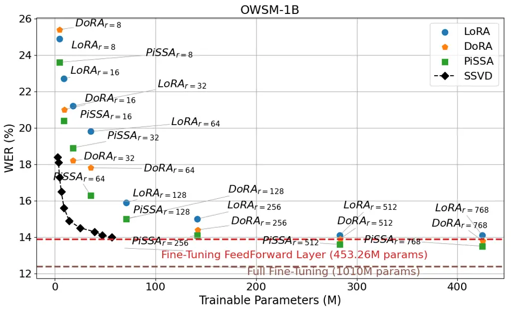
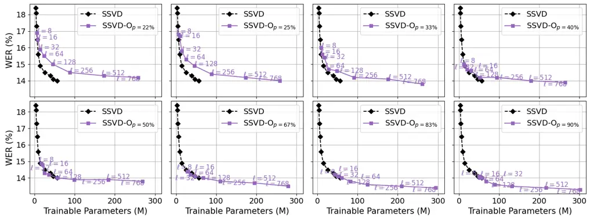
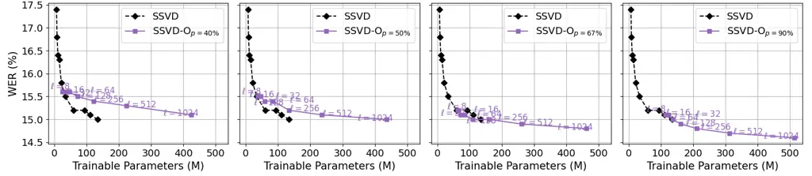
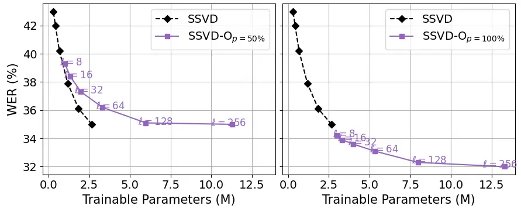
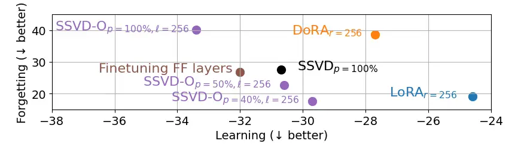
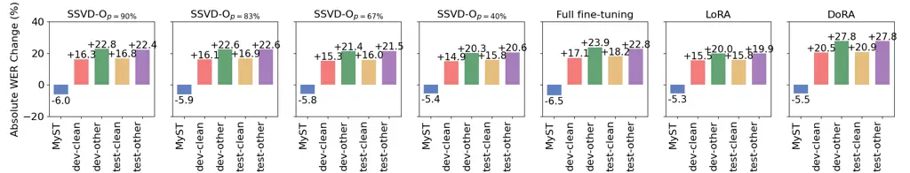
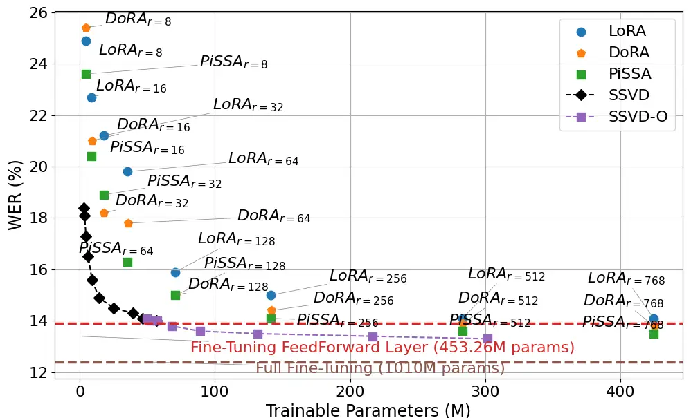
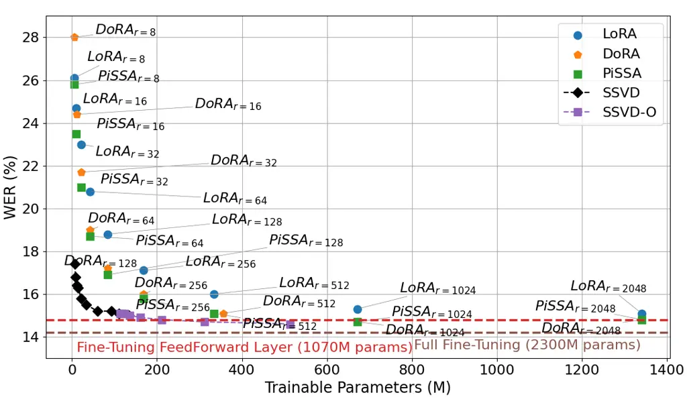

# SSVD-O: Parameter-Efficient Fine-Tuning with Structured SVD for Speech Recognition

###### Abstract

Parameter-efficient fine-tuning (PEFT) is a scalable approach for
adapting large speech foundation models to new domains. While methods
such as LoRA and its state-of-the-art variants reduce adaptation costs,
they typically allocate parameters uniformly across model subspaces,
which limits their efficiency and scalability in speech applications.
Building on our prior work, this paper introduces SSVD-Outer (SSVD-O),
an extension of the structured SVD-guided (SSVD) fine-tuning method.
SSVD-O combines input acoustic feature space–associated inner
transformations with output semantic feature space–associated outer
transformations to enable scalable and balanced adaptation. We conduct
the first systematic analysis of parameter budget allocation across
model subspaces in PEFT for automatic speech recognition (ASR), and
investigate the trade-off between learning and forgetting under
constrained resources. SSVD-O is benchmarked against LoRA, DoRA, PiSSA,
and SSVD on domain-shifted ASR tasks, including child speech and
regional accents, across model scales from 0.1B to 2B within the ESPnet
framework. Experimental results show that SSVD-O consistently narrows
the performance gap to full fine-tuning while improving generalization
and mitigating catastrophic forgetting.

###### Index Terms: 

Speech recognition, low-rank adaptation (LoRA), singular value
decomposition (SVD), parameter budget allocation, catastrophic
forgetting

## 1 Introduction

Speech Foundation Models (SFMs), such as OpenAI’s Whisper \[17\],
Google’s USM \[23\], the open-source Whisper-style OWSM \[13, 12\], and
NVIDIA’s Canary \[16\], have demonstrated strong generalization across
multilingual speech tasks following scaling laws \[2\]. However, since
SFMs are typically trained on generic, easily accessible corpora
dominated by adult, healthy speech, standard accents, and mainstream
languages, directly adapting them to low-resource but domain-shifted ASR
tasks (e.g., child speech, regional dialects, or disordered speech)
remains challenging \[20, 22\]. Fine-tuning SFMs for downstream speech
conditions has therefore become the dominant paradigm for automatic
speech recognition (ASR). In such scenarios, mismatches in acoustic
features, linguistic structures, and articulatory behaviors can
significantly degrade performance, while full fine-tuning becomes
computationally expensive for billion-scale models. How to efficiently
adapt large-scale models with limited in-domain data remains an open
question.



Figure 1: Word error rate (WER %) versus trainable parameters for PEFT
tuning FF layers of OWSM-1B on MyST for 10 epochs.

To address this issue, parameter-efficient fine-tuning (PEFT) methods,
which aim to match full fine-tuning performance with fewer trainable
parameters, have been actively studied with language modeling (LM) \[4,
5\]. Especially, low-rank adaptation (LoRA) \[5\] has gained wide
adoption due to its reduction of trainable parameters without
introducing additional inference latency. While LoRA has been
increasingly used in the speech domain, its state-of-the-art (SoTA)
variants, such as weight-decomposed LoRA (DoRA) \[9\] and principal
singular values and singular vectors adaptation (PiSSA) \[10\], which
further improve adaptation efficiency in LM tasks, remain underexplored
in speech applications.

In \[21\], we demonstrated that domain-shift issues in ASR persist with
the current LoRA method and its SoTA variants. Unlike text-based tasks,
ASR involves a multi-modal (speech) input-(text) output structure. This
differs fundamentally from LM, which operates within a single
text-to-text modality. For example, children may pronounce ”rabbit” as
\textipa\[wæbIt\] instead of \textipa\[ræbIt\] due to developmental
articulation, creating a divergence between the spoken form and its
textual transcription. Therefore, in ASR fine-tuning, it is critical to
separately address transformations in input (speech) and output (text)
spaces, while LoRA and its SoTA variants update both the input and
output feature space equally, which inevitably reduces adaptation
efficiency. In \[21\], we introduced a structured singular value
decomposition (SVD)-guided PEFT method, named SSVD, which decomposes
initial weights into right singular vectors (representing the input
feature space) and left singular vectors (capturing the output semantic
feature space). SSVD updates right singular vectors to align better with
domain-shifted speech inputs, while keeping the left singular vectors
fixed to preserve semantic mappings.

In \[21\], we benchmarked LoRA, VeRA \[7\], DoRA, PiSSA, SVFT \[8\], and
SSVD on two domain-shift ASR tasks: child speech and regional accents.
We showed that SSVD achieved higher efficiency than other SoTA methods
with very few trainable parameters, although a performance gap to full
fine-tuning remained. Therefore, in Figure 1, we extend the comparison
of word error rate (WER) by including the best-performing PEFT methods
from \[21\], fine-tuned on the feedforward (FF) layers of the OWSM-1B
model \[12\] using the MyST child speech dataset \[14\]. We scale the
PEFT parameter size up toward the full fine-tuning level to explore the
gap between full fine-tuning and PEFT methods. This reveals three
unresolved issues: (1) Scalability of SSVD: When only the input space is
adapted (termed inner transformation), SSVD shows lower WER with very
few trainable parameters. However, it lacks scalability compared to
other methods. Even when tuning 100% of the right singular vectors, only
56.68M parameters are involved, lagging behind other PEFT methods with
over 280M parameters. (2) Understanding parameter budget efficiency:
While experimental results indicate that SSVD with inner transformation
outperforms other methods at very small parameter budgets, the reasons
behind this advantage remain unclear. This relates directly to a
fundamental open question in PEFT: how should limited parameter or
compute budgets be allocated? For instance, is it more effective to tune
parameters associated with the input space, the output space, or both?
(3) Balancing learning and forgetting under constrained budgets:
Parameter allocation affects both adaptation capacity and the extent of
forgetting. Understanding how different allocation strategies impact the
trade-off between learning and forgetting remains an open question.

To address these issues, we extend the SSVD method by incorporating both
the input (speech)-associated inner transformation and an output (text)
space–associated outer transformation, resulting in a scalable tuning
framework named SSVD-O. We conduct an in-depth analysis of parameter
allocation by varying the extent of inner and outer transformations
across domain-shifted ASR tasks, including low-resource child speech and
regional accents (Dutch as spoken in The Netherlands or Belgium
(=Flemish)). Our experiments fine-tune OWSM models at scales from 0.1B
to 2B using the widely adopted open-source ESPnet toolkit. SSVD-O is
compared to LoRA and its SoTA variants, DoRA and PiSSA, from very small
to nearly full fine-tuning parameter budgets, in order to investigate
the performance gap between PEFT and full fine-tuning. Additionally, we
evaluate the adapted models on adult speech and multilingual corpora
used during OWSM pretraining to analyze the degree of forgetting
introduced by each method.

The main contributions of this paper are:

- •
  We extend the structured SVD-guided (SSVD) PEFT method, originally
  limited to input-associated inner transformation, into a fully
  adaptable framework by introducing an output-associated outer
  transformation. The resulting new method, SSVD-Outer (SSVD-O), enables
  scalable PEFT tuning and achieves improved performance over
  fine-tuning and SoTA PEFT methods, including LoRA, DoRA, PiSSA, and
  the original SSVD, on domain-shifted ASR tasks, including child speech
  and regional accents.
- •
  We conduct the first systematic study on parameter budget allocation
  in PEFT for speech recognition. By benchmarking SSVD(-O) against LoRA,
  DoRA, and PiSSA within the ESPnet framework across model scales from
  0.1B to 2B, we analyze how tuning different subspaces (input vs.
  output) impacts adaptation efficiency under strict parameter
  constraints, providing practical guidance for efficient PEFT design.
- •
  We provide an in-depth analysis of catastrophic forgetting in PEFT by
  comparing SSVD-O with full fine-tuning, LoRA, DoRA, PiSSA, and SSVD
  across two domain-shift scenarios: child-to-adult speech and
  dialect-to-multilingual speech. Our findings reveal how input- and
  output-associated subspaces contribute differently to preserving
  generalization across domains, guiding future work in continual
  learning.

## 2 SSVD-O Method

In this section, we first recap the SSVD method and then introduce its
extended outer transformation, SSVD-O. Trainable variables are indicated
by underlining.

Similar to LoRA, SSVD freezes the pre-trained model weights and injects
trainable low-rank (usually $`r`$ in LoRA) matrices into each linear
layer during fine-tuning. The parameter updates are guided by the SVD of
the pre-trained weight matrix. Mathematically, for a pre-trained weight
$`\mathbf{W}_{0}\in\mathbb{R}^{m\times n}`$, with $`m\geq n`$ (e.g., a
feedforward layer), its SVD is given by:

```math
\mathbf{W}_{0}=\mathbf{U}\boldsymbol{\Sigma}\mathbf{V}^{\top}=\sum_{i=1}^{n}\sigma_{i}\mathbf{u}_{i}\mathbf{v}_{i}^{\top}, \tag{1}
```

where, $`\mathbf{U}\in\mathbb{R}^{m\times n}`$,
$`\mathbf{V}\in\mathbb{R}^{n\times n}`$ contain the left and right
singular vectors $`\mathbf{u}_{i}`$ and $`\mathbf{v}_{i}`$ respectively,
and $`\boldsymbol{\Sigma}\in\mathbb{R}^{n\times n}`$ is a diagonal
matrix of singular values $`\sigma_{i}`$. For each linear mapping, an
input $`\mathbf{x}\in\mathbb{R}^{n}`$, represented in the coordinate
system spanned by the right singular vector $`\mathbf{v}_{i}`$, is
mapped to an output
$`\mathbf{y}\in\operatorname{Col}\mathbf{W}_{0}\subset\mathbb{R}^{m}`$
in the coordinate system spanned by the left singular vector
$`\mathbf{u}_{i}`$.

```math
\mathbf{y}=\mathbf{U}\boldsymbol{\Sigma}\mathbf{V}^{\top}\mathbf{x} \tag{2}
```

SSVD focuses on the shift of the input feature $`\mathbf{x}`$ and
structurally adapts the input space by rotating and scaling the right
singular vector basis $`\mathbf{v}_{i}`$ towards a shifted basis
$`\mathbf{v}_{i}^{\prime}`$ (the inner transform):

```math
\mathbf{y}=\mathbf{U}\boldsymbol{(}{\Sigma+\underline{\mathbf{\Delta\Sigma}}})\underline{\mathbf{G}}\mathbf{V}^{\top}\mathbf{x}\\
=\mathbf{W}^{\prime}\mathbf{x} \tag{3}
```

where diagonal matrix $`\underline{\Delta\boldsymbol{\Sigma}}`$ models
axis-wise scaling (i.e., singular value shifts), and
$`\underline{\mathbf{G}}\in\mathbb{R}^{n\times n}`$ is an orthogonal
matrix representing a series of rotations in the right singular vector
space. Leveraging the Eckart–Young theorem \[3\], SSVD restricts
adaptation to the top-$`k`$ singular components for efficiency:

```math
\underline{\mathbf{\Delta\Sigma}}=\begin{bmatrix}\underline{\mathbf{\Delta\Sigma}_{k}}&0\\
0&0\end{bmatrix}~~\text{and}~~\underline{\mathbf{G}}=\begin{bmatrix}\underline{\mathbf{G}_{k}}&0\\
0&I\end{bmatrix} \tag{4}
```

Therefore, the number of trainable parameters in SSVD is limited to
$`\frac{k(k+1)}{2}`$, where $`k\leq n`$, which is significantly fewer
than that of LoRA, DoRA or PiSSA. In comparison, the maximum parameter
count of LoRA or PiSSA is $`r\times(m+n)`$ with low-rank $`r=n`$, while
DoRA requires even more, resulting in over twice the size of the
full-rank SSVD configuration.

SSVD-O further enhances model flexibility by jointly adapting the output
feature space. It approximates a rotation (the outer transform) of the
left singular vector basis $`\mathbf{U}`$ by adding its orthonormal
complement $`\mathbf{U}_{2}\in\mathbb{R}^{m\times(m-n)}`$ obtained from
full SVD of $`\mathbf{W}_{0}`$:

```math
\mathbf{y}=\bigl(\mathbf{U}+\mathbf{U}_{2}\begin{bmatrix}\underline{\mathbf{Q}}&\mathbf{0}\end{bmatrix}\bigr)\bigl(\boldsymbol{\Sigma}+\underline{\Delta\boldsymbol{\Sigma}}\bigr)\underline{\mathbf{G}}\mathbf{V}^{\top}\mathbf{x}=\mathbf{W}^{\prime}\mathbf{x} \tag{5}
```

where $`\underline{\mathbf{Q}}\in\mathbb{R}^{(m-n)\times l}`$ indicates
the first $`l`$ left singular vectors to be tuned from the original
basis. To maintain orthogonality of the shifted
$`\mathbf{U}^{\prime}=\mathbf{U}+\mathbf{U}_{2}\begin{bmatrix}\underline{\mathbf{Q}}&\mathbf{0}\end{bmatrix}`$,
we regularize:

```math
\mathbf{U}_{l}^{\prime\top}\mathbf{U}_{l}^{\prime}=\mathbf{I}+\underline{\mathbf{Q}}^{\top}\underline{\mathbf{Q}}\approx\mathbf{I},\qquad\mathbf{U}_{l}^{\prime}=\mathbf{U}^{\prime}_{[:,:l]} \tag{6}
```

with a constraint:

```math
\underline{\mathbf{Q}}^{\top}\underline{\mathbf{Q}}\approx\tau\mathbf{I},\qquad 0<\tau\ll 1 \tag{7}
```

This ensures that
$`\mathbf{U}_{l}^{\prime\top}\mathbf{U}_{l}^{\prime}\approx(1+\tau)\mathbf{I}`$
preserving approximate orthonormality up to a small correction. For
stable and efficient training, the constraint (7) is implicitly enforced
by parameterizing $`\underline{\mathbf{Q}}`$ via Cholesky decomposition
without introducing regularization loss:

```math
\underline{\mathbf{Q}}=\underline{\mathbf{L}}\underline{\mathbf{R}}^{-\top},\quad\text{where}\quad\underline{\mathbf{R}}=\operatorname{Cholesky}(\underline{\mathbf{L}}^{\top}\underline{\mathbf{L}}+\tau\mathbf{I}) \tag{8}
```

Therefore, $`\underline{\mathbf{Q}}`$ in (5) is generated by
unconstrained $`\underline{\mathbf{L}}\in\mathbb{R}^{(m-n)\times l}`$.



Figure 2: WER (%) versus number of trainable parameters for SSVD and
SSVD-O with varying combinations of inner transformation ratio
$`p\in[22\%,100\%]`$ and outer transformation rank $`l\in[8,708]`$,
evaluated on OWSM-1B fine-tuned on the MyST dataset for 10 epochs.



Figure 3: WER (%) versus number of trainable parameters for SSVD and
SSVD-O with varying combinations of inner transformation ratio
$`p\in[22\%,100\%]`$ and outer transformation rank $`l\in[8,1024]`$,
evaluated on OWLS-2B fine-tuned on the MyST dataset for 5 epochs.



Figure 4: WER (%) versus number of trainable parameters for SSVD and
SSVD-O with varying combinations of inner transformation ratio
$`p\in[33\%,100\%]`$ and outer transformation rank $`l\in[8,256]`$,
evaluated on OWSM-0.1B fine-tuned on the CGN dataset for 5 epochs.



Figure 5: Learning vs. Avg. forgetting from Table 1, the bottom-left
indicates the best trade-off.

## 3 Experiments

We adopt the open-source Whisper-style speech models (OWSM and
OWLS) \[13, 12, 2\] as base models due to their transparent training
corpora \[2, 12\], which avoid domain overlap with our evaluation data.
OWSM employs an E-Branchformer \[6\] encoder and a Transformer \[18\]
decoder, while OWLS uses a standard Transformer encoder–decoder
architecture. All compared PEFT methods, LoRA, DoRA, PiSSA, SSVD and
SSVD-O, are implemented within the ESPnet framework. We evaluate them by
fine-tuning all FF layers of OWSM-0.1B, OWSM-1B, and OWLS-2B on
MyST \[14\] (child speech) and CGN \[11\] (Flemish and Dutch).

MyST corpus \[14\] contains English dialogues between elementary
students and virtual science tutors, with verbatim transcriptions
including disfluencies. Following \[1\], we discard utterances with WER
above 50% (Whisper-large-v2), yielding 179 hours of speech. CGN \[11\]
corpus contains diverse speaking styles in Dutch and Flemish, including
read speech, interviews, and spontaneous dialogues. We use the 341-hour
subset with a 2:1 Dutch–Flemish ratio, excluding the spontaneous
components $`\mathtt{c}`$, $`\mathtt{d}`$, and $`\mathtt{f}`$.

To assess forgetting, we evaluate MyST-adapted models on the adult
LibriSpeech test sets, and CGN-adapted models on Multilingual
LibriSpeech (MLS) \[15\], covering German (DE), Spanish (ES), French
(FR), Italian (IT), Dutch (NL), Polish (PL), and Portuguese (PT). Both
corpora were part of OWSM pretraining \[13, 12, 2\].



Figure 6: Absolute WER change on LibriSpeech for PEFT tuning OWSM-1B on
MyST. ‘$`+`$’ indicates forgetting, ‘$`-`$’ indicates learning.

For PEFT methods, we denote low-rank configurations as
LoRA$`{}_{r=\text{rank}}`$, DoRA$`{}_{r=\text{rank}}`$, and
PiSSA$`{}_{r=\text{rank}}`$. For SSVD and SSVD-O, we vary the number of
adapted singular components: $`k`$ in Eq. (4) controls the proportion
$`p\%`$ of adapted right singular vectors/values, denoted as
SSVD$`{}_{p=\text{portion}}`$; $`l`$ in Eq. (5) specifies the number of
adapted left singular vectors in SSVD-O, denoted as
SSVD-O$`{}_{p=\text{portion},l=\text{rank}}`$. Experiments use a single
NVIDIA V100 32GB, A100 80GB, or H100 80GB depending on model size.

## 4 Results



Figure 7: WER (%) versus trainable parameters for PEFT tuning FF layers
of OWSM-1B on MyST for 10 epochs.



Figure 8: WER (%) versus trainable parameters for PEFT tuning FF layers
of OWLS-2B on MyST for 5 epochs.

| Model                  | CGN                | NL                | DE                 | ES                | FR                | IT                 | PL                 | PT                 | Avg. forgetting    |
| ---------------------- | ------------------ | ----------------- | ------------------ | ----------------- | ----------------- | ------------------ | ------------------ | ------------------ | ------------------ |
| Full fine-tuning       | $`\mathbf{-38.6}`$ | $`\mathbf{-8.4}`$ | $`+85.3`$          | $`+71.5`$         | $`+70.1`$         | $`+66.2`$          | $`+100.9`$         | $`+74.7`$          | $`+78.1`$          |
| Fine-tuning FF layers  | $`-32.0`$          | $`-5.6`$          | $`+37.3`$          | $`+10.3`$         | $`+12.7`$         | $`+19.9`$          | $`+51.8`$          | $`+28.5`$          | $`+26.8`$          |
| SSVD-O\_(p=100%,l=256) | $`\mathbf{-33.4}`$ | $`\mathbf{-6.1}`$ | $`+56.3`$          | $`+20.6`$         | $`+19.3`$         | $`+31.7`$          | $`+67.9`$          | $`+44.8`$          | $`+40.1`$          |
| SSVD-O\_(p=50%,l=256)  | $`-30.6`$          | $`-5.1`$          | $`+30.0`$          | $`+8.3`$          | $`+10.0`$         | $`+16.8`$          | $`+42.4`$          | $`+28.0`$          | $`+22.6`$          |
| SSVD-O\_(p=40%,l=256)  | $`-29.7`$          | $`-5.0`$          | $`+24.7`$          | $`\mathbf{+6.7}`$ | $`\mathbf{+7.9}`$ | $`\mathbf{+12.6}`$ | $`\mathbf{+31.5}`$ | $`\mathbf{+22.9}`$ | $`\mathbf{+17.7}`$ |
| SSVD\_(p=100%)         | $`-30.7`$          | $`-4.5`$          | $`+38.0`$          | $`+10.1`$         | $`+12.7`$         | $`+18.8`$          | $`+50.3`$          | $`+35.0`$          | $`+27.5`$          |
| DoRA\_(r=256)          | $`-27.7`$          | $`-3.0`$          | $`+42.8`$          | $`+19.9`$         | $`+20.3`$         | $`+33.7`$          | $`+71.0`$          | $`+44.5`$          | $`+38.7`$          |
| LoRA\_(r=256)          | $`-24.6`$          | $`-2.9`$          | $`\mathbf{+18.4}`$ | $`+6.8`$          | $`\mathbf{+7.9}`$ | $`+15.3`$          | $`+38.6`$          | $`+28.0`$          | $`+19.2`$          |

Table 1: Absolute WER change on MLS for PEFT tuning OWSM-0.1B on CGN.
‘$`+`$’ indicates forgetting, while ‘$`-`$’ indicates learning.

We first discuss the parameter budget efficiency by comparing the WER
results of SSVD and SSVD-O configured with different combinations of
inner transformation ratios and outer transformation ranks. Results for
fine-tuning on OWSM-1B and OWLS-2B with MyST data are shown in Figure 2
and 3, while results on OWSM-0.1B with CGN data are presented in
Figure 4. The three plots show a consistent conclusion: inner
transformation is more beneficial than outer transformation, especially
when the parameter budget is tight. Given the same number of trainable
parameters, increasing the inner transformation portion improves
performance more effectively than increasing the outer transformation
rank. This explains why, in Figure 1, SSVD outperforms other methods
with significantly fewer trainable parameters, as the others rely on
both inner and outer transformations. The effectiveness of outer
transformation becomes more pronounced as the model size increases,
contributing additional gains in larger-scale settings.

With the extended outer transformation, we scale SSVD and report WER for
tuning FF layers of OWSM-1B and OWLS-2B on MyST in Figure 7 and 8. In
both model scales, SSVD-O consistently outperforms fine-tuning all FF
layers while using fewer parameters. Its performance typically lies
between FF-layer fine-tuning and full fine-tuning, further validating
the effectiveness of the outer transformation, especially in larger
models. Note that OWLS-2B is shallower and wider than OWSM-1B, its worse
zero-shot performance and fewer training epochs may explain the overall
performance gap. To evaluate the trade-off between learning and
forgetting, we report absolute WER changes on four LibriSpeech test sets
after PEFT tuning FF layers of OWSM-1B model on MyST(Figure 6). Positive
values indicate degradation due to forgetting, while negative values
reflect error reduction by learning. In both cases, lower is better.
Based on experimental observations (not included here), SSVD-O with
higher outer transformation ranks reduces WER and forgetting compared to
SSVD without outer adaptation. Thus, SSVD-O results in Figure 6 use
outer rank $`l=768`$. We observe that smaller inner transformation
ratios tend to yield less forgetting, this is also supported by Table 1,
which reports WER changes on MLS after tuning OWSM-0.1B on CGN.
Therefore, using a smaller inner transformation ratio combined with a
larger outer transformation rank achieves a better trade-off between
learning and forgetting, such as SSVD-O$`{{}_{p}=40\%}`$ (Figure 6) and
SSVD-O\_(p=50%,l=256) (Table 1). This property could be exploited further
with methods in continual learning tasks \[19\]. Table 1 also summarizes
learning vs. forgetting across languages, with the best learning and
least forgetting shown in bold. Overall, SSVD-O achieves less forgetting
than other methods with similar or even higher learning ability. The
trade-off is visualized in Figure 5. Optimal performance is found in the
bottom-left.

## 5 Conclusion

In this work, we propose SSVD-O, a structured SVD-guided PEFT method
that leverages the multi-modal nature of speech-to-text by separately
adapting input speech-associated inner transformations and output
semantic-associated outer transformations. We systematically analyze
parameter budget efficiency and show that SSVD-O outperforms fine-tuning
and SoTA LoRA variants on domain-shifted ASR tasks, including child
speech and regional accents. Our learning–forgetting analysis further
shows that SSVD-O achieves the best trade-off between high learning
ability and less forgetting.

## Acknowledgment

Experiments of this work used the Bridges2 system at PSC and Delta
system at NCSA through allocations CIS210014 and IRI120008P from the
Advanced Cyberinfrastructure Coordination Ecosystem: Services & Support
(ACCESS) program, supported by National Science Foundation grants
\#2138259,#:2138286, \#:2138307, \#:2137603, and \#:2138296.  
This research was supported by the Flemish Government under
“Onderzoeksprogramma AI Vlaanderen”, the FWO-SBO grant S004923N: NELF,
the FWO grant V401325N and the computational resources and services used
in this work were provided by the VSC (Flemish Supercomputer Center),
funded by the Research Foundation Flanders (FWO) and the Flemish
Government – department WEWIS (2025-85).

## References

- \[1\] A. A. Attia and et al. (2024) Kid-whisper: bridging the
  performance gap in automatic speech recognition for children. In
  Proceedings of the AAAI/ACM Conference on AI, Ethics, and Society
  (AIES), Vol. 7, pp. 74–80. Cited by: §3.
- \[2\] W. Chen, J. Tian, Y. Peng, B. Yan, C. H. Yang, and S.
  Watanabe (2025) OWLS: scaling laws for multilingual speech recognition
  and translation models. Proceedings of the International Conference on
  Machine Learning (ICML). Cited by: §1, §3, §3.
- \[3\] C. Eckart and G. Young (1936) The approximation of one matrix by
  another of lower rank. Psychometrika 1 (3), pp. 211–218. Cited by: §2.
- \[4\] N. Houlsby, A. Giurgiu, S. Jastrzebski, B. Morrone, Q. De
  Laroussilhe, A. Gesmundo, M. Attariyan, and S. Gelly (2019)
  Parameter-efficient transfer learning for nlp. In Proceedings of the
  International Conference on Machine Learning (ICML), pp. 2790–2799.
  Cited by: §1.
- \[5\] E. J. Hu, P. Wallis, Z. Allen-Zhu, Y. Li, S. Wang, L. Wang, W.
  Chen, and et al. (2022) LoRA: low-rank adaptation of large language
  models. In Proceedings of the International Conference on Learning
  Representations (ICLR), Cited by: §1.
- \[6\] K. Kim, F. Wu, Y. Peng, J. Pan, P. Sridhar, K. J. Han, and S.
  Watanabe (2023) E-branchformer: branchformer with enhanced merging for
  speech recognition. In 2022 IEEE Spoken Language Technology Workshop
  (SLT), pp. 84–91. Cited by: §3.
- \[7\] D. J. Kopiczko, T. Blankevoort, and Y. M. Asano (2024) VeRA:
  vector-based random matrix adaptation. In Proceedings of the
  International Conference on Learning Representations (ICLR), Cited by:
  §1.
- \[8\] V. C. Lingam, A. Neerkaje, A. Vavre, A. Shetty, G. K. Gudur, J.
  Ghosh, E. Choi, A. G. Dimakis, A. Bojchevski, and S. Sanghavi (2024)
  SVFT: parameter-efficient fine-tuning with singular vectors. Advances
  in Neural Information Processing Systems (NeurIPS) 37,
  pp. 41425–41446. Cited by: §1.
- \[9\] S. Liu, C. Wang, H. Yin, P. Molchanov, Y. F. Wang, K. Cheng,
  and M. Chen (2024) DoRA: weight-decomposed low-rank adaptation. In
  Proceedings of the International Conference on Machine Learning
  (ICML), Cited by: §1.
- \[10\] F. Meng, Z. Wang, and M. Zhang (2024) PiSSA: principal singular
  values and singular vectors adaptation of large language models.
  Advances in Neural Information Processing Systems (NeurIPS) 37,
  pp. 121038–121072. Cited by: §1.
- \[11\] N. Oostdijk and et al. (2000) The spoken dutch corpus: overview
  and first evaluation. In Proceedings of the 2nd International
  Conference on Language Resources and Evaluation (LREC), Athens,
  Greece, pp. 887–894. Cited by: §3, §3.
- \[12\] Y. Peng, J. Tian, W. Chen, S. Arora, B. Yan, Y. Sudo, M.
  Shakeel, K. Choi, J. Shi, X. Chang, and et al. (2024) OWSM v3.1:
  better and faster open whisper-style speech models based on
  e-branchformer. In Proceedings of Interspeech, pp. 352–356. Cited by:
  §1, §1, §3, §3.
- \[13\] Y. Peng, J. Tian, B. Yan, D. Berrebbi, X. Chang, X. Li, J.
  Shi, S. Arora, W. Chen, R. Sharma, et al. (2023) Reproducing
  whisper-style training using an open-source toolkit and publicly
  available data. In 2023 IEEE Automatic Speech Recognition and
  Understanding Workshop (ASRU), pp. 1–8. Cited by: §1, §3, §3.
- \[14\] S. Pradhan and et al. (2024) My Science Tutor (MyST): a large
  corpus of children’s conversational speech. In Proceedings of the
  Joint International Conference on Computational Linguistics, Language
  Resources and Evaluation (LREC-COLING), pp. 12040–12045. Cited by: §1,
  §3, §3.
- \[15\] V. Pratap, Q. Xu, A. Sriram, G. Synnaeve, and R.
  Collobert (2020) MLS: a large-scale multilingual dataset for speech
  research. In Proceedings of Interspeech, pp. 2757–2761. Cited by: §3.
- \[16\] K. C. Puvvada, P. Żelasko, H. Huang, O. Hrinchuk, N. R.
  Koluguri, K. Dhawan, S. Majumdar, E. Rastorgueva, Z. Chen, V.
  Lavrukhin, et al. (2024) Less is more: accurate speech recognition &
  translation without web-scale data. In Proceedings of Interspeech,
  pp. 3964–3968. Cited by: §1.
- \[17\] A. Radford, J. W. Kim, T. Xu, G. Brockman, C. McLeavey, and I.
  Sutskever (2023) Robust speech recognition via large-scale weak
  supervision. In Proceedings of the International Conference on Machine
  Learning (ICML), pp. 28492–28518. Cited by: §1.
- \[18\] A. Vaswani, N. Shazeer, N. Parmar, J. Uszkoreit, L.
  Jones, A. N. Gomez, L. Kaiser, and I. Polosukhin (2017) Attention is
  all you need. Advances in Neural Information Processing Systems
  (NeurIPS) 30. Cited by: §3.
- \[19\] L. Wang, X. Zhang, H. Su, and J. Zhu (2024) A comprehensive
  survey of continual learning: theory, method and application. IEEE
  transactions on pattern analysis and machine intelligence 46 (8),
  pp. 5362–5383. Cited by: §4.
- \[20\] P. Wang and H. Van hamme (2023) Benefits of pre-trained
  mono-and cross-lingual speech representations for spoken language
  understanding of dutch dysarthric speech. EURASIP Journal on Audio,
  Speech, and Music Processing 2023 (1), pp. 15. Cited by: §1.
- \[21\] P. Wang, S. Watanabe, and H. Van hamme (2025) SSVD: structured
  svd for parameter-efficient fine-tuning and benchmarking under domain
  shift in asr. In 2025 IEEE Automatic Speech Recognition and
  Understanding Workshop (ASRU), Cited by: §1, §1.
- \[22\] A. Ying, N. B. Shankar, C. Lin, M. Shi, P. Wang, H. Shim, S.
  Arora, A. Alwan, S. Watanabe, et al. (2025) Benchmarking training
  paradigms, dataset composition, and model scaling for child asr in
  espnet. In WOCCI 2025 – Workshop on Child Computer Interaction,
  Satellite workshop of Interspeech 2025, in conjunction with SLaTE
  2025, Cited by: §1.
- \[23\] Y. Zhang, W. Han, J. Qin, Y. Wang, A. Bapna, Z. Chen, N.
  Chen, B. Li, V. Axelrod, G. Wang, et al. (2023) Google usm: scaling
  automatic speech recognition beyond 100 languages. arXiv preprint
  arXiv:2303.01037. Cited by: §1.
